.. _advestructure_chapter:

高度な電子状態計算
==================

.. _paw_section:

PAW法による計算
-----------------

機能の概要
~~~~~~~~~~~~~

PAW法 [Blochl94]_ [Kresse99]_ とは、projector-augmented wave 法の略称です。ウルトラソフト擬ポテンシャル法と深い関係のある計算手法ですが、ウルトラソフト擬ポテンシャル法と比較すると、特に磁性を考慮する場合や電荷移動の大きな系において高精度な計算が行えるとされている計算手法です。ここでは、PAW法による計算をPHASE で実行する方法を説明します。

入力パラメータ、計算の実行方法
~~~~~~~~~~~~~~~~~~~~~~~~~~~~~~~~

PAW法を利用するためには、PAWポテンシャルを利用する必要があります。PAWポテンシャルは、擬ポテンシャル格納ディレクトリーに

.. code-block:: text

  元素名_ggapbe_paw_us.pp
  元素名_ggapbe_paw_nc.pp

というファイル名で存在します。通常のノルム保存およびウルトラソフトポテンシャルと同様、file_names.dataファイルにおいてF_POT識別子で対応する元素名のファイルを指定します。さらに、以下のようにpaw を利用するような指定を入力ファイルに記述します。

PAWポテンシャルを指定しても、デフォルトの状態ではPAWの計算は行われません。PAW法の計算を行うには、入力ファイルのaccuracyブロックで変数paw を定義し、その値をonにする必要があります。

.. code-block:: text

 accuracy{
     paw = on
 }

PAW法の場合、欠損電荷の扱い方を変更することによって収束性を向上させることができる場合があります。以下の設定を 施すことにより、多くの場合収束が加速されます。

.. code-block:: text

 charge_mixing{
     ...
     sw_mix_charge_hardpart = on
 }

固定電荷の計算を行う場合、さらにfile_names.dataにF_CNTN_BIN_PAW識別子を利用してPAW計算用のデータを指定し、読み込ませる必要があります。このファイルの既定のファイル名はcontinue_bin_paw.dataです。たとえばSCF計算を行ったディレクトリが1階層上のディレクトリだった場合、下記のような記述が必要です。

.. code-block:: text

 &fnames
 ...
 ...
 F_CNTN_BIN_PAW='../continue_bin_paw.data'
 /

計算例：体心立方構造クロム
~~~~~~~~~~~~~~~~~~~~~~~~~~~~

PAW法を利用した計算例として、体心立方構造クロムの格子定数の計算例を紹介します。クロムは、ウルトラソフト擬ポテンシャルで計算すると格子定数が過大評価され、また体積弾性率が過小評価されます。この点がどのように改善されるか確認します。

計算に利用したデータは、 :code:`samples/paw_Cr` にあります。 :code:`samples/paw_Cr` には、以下のファイルとディレクトリがあります。

.. code-block:: text

 paw/
 us/

ディレクトリpawにPAW用の入力データが、usにウルトラソフト用の入力データが格納されています。さらにpaw,
usの各ディレクトリにも次のファイルとディレクトリがあります。

.. code-block:: text

 vol20/
 vol21/
 ......

vol20, vol21, ...はそれぞれ体積20Å\ :sup:`3`, 21Å\ :sup:`3`,...の入力データに対応します。

paw, usディレクトリー以下のサブディレクトリーの入力ファイルはほとんど違いはりませんが、以下のようにaccuracyブロックにおける指定が異なります。

.. code-block:: text

    accuracy{
      paw = on (ディレクトリーpawの下のファイルの場合)
    }
    accuracy{
      paw = off (ディレクトリーusの下のファイルの場合)
    }

計算の結果得られたEV曲線を :numref:`ev_cr_paw` に示します。
一見して明らかなように、PAW法とUS法とでは異なるEV曲線が得られます。
さらに、このEV曲線をもとに格子定数、体積弾性率、凝集エネルギーをもとめた結果を実測値とともに :numref:`paw_cr_result` にまとめました。
PAW法は格子定数、体積弾性率がUS法よりも改善している（実験値との一致がよい）ことが分かります。

.. figure:: images/paw_image1.svg
  :name: ev_cr_paw
  :width: 480px

  クロムのEV 曲線。赤線がPAW の結果、緑線がUS の結果。各手法で得られた最も低いエネルギーをエネルギーの原点としている。

.. table:: PAW 法およびUS 法によってもとめた格子定数、体積弾性率、凝集エネルギー
 :name: paw_cr_result

 ============== ===== ===== =====
 \              US    PAW   実測
 ============== ===== ===== =====
 a (Å)          2.994 2.886 2.88
 B (GPa)        89.2  150.5 190.1
 Ecoh (eV/atom) 4.01  3.065 4.10
 ============== ===== ===== =====

.. _paw_gloption_section:

PAW法の精度を向上させる方法
~~~~~~~~~~~~~~~~~~~~~~~~~~~~

PAW法で実施される球面積分は、デフォルトでは球面調和関数を利用した近似による高速化がなされます。この積分を、近似をせずに計算するオプションも用意されています。入力パラメーターファイルに以下のような記述を加えるとこのオプションを利用することができます。

.. code-block:: text

 paw_one_center_integral{
   element_list{
     #tag element surface_integral_method
           Fe gl
           O gl
   }
 }

この例では、FeとOという二種類の元素が定義されていることを仮定しました。利用する場合元素数分定義する必要があります。

この方法を使うと交換相関相互作用の処理時間が長くなってしまいますが、精度が向上し（数値的により厳密に解けるようになり）、SCF計算の収束性が向上する場合があります。

PAW法で有効な計算機能一覧
~~~~~~~~~~~~~~~~~~~~~~~~~~~~

PAW法で利用可能な機能です。

-  全エネルギー
-  対称性
-  スピン分極
-  構造最適化
-  全電荷密度・部分電荷密度の出力
-  各種状態密度の計算
-  バンド構造
-  ストレステンソルの計算
-  仕事関数
-  振動解析
-  分子動力学
-  DFT+U
-  ESM法
-  拘束条件付きダイナミクス
-  メタダイナミクス
-  NEB
-  単位胞最適化
-  ノンコリニア磁性
-  スピン軌道相互作用
-  UVSOR-Epsilonの各機能
-  UVSOR-Berry-Phononの各機能

.. only:: not latex

 **参考文献**

.. [Blochl94] P. E. Blöchl,  Phys. Rev. B 50 vol. 24 17953–17978 (1994).

.. _advanced_dftu_section:

DFT+U 法
-----------------

.. _機能の概要-11:

機能の概要
~~~~~~~~~~~

PHASEは、密度汎関数理論に基づき、ほとんどの物質の電子状態を高精度に計算することができますが、強相関電子系に対しては不正確な電子状態を与えることがあります。この原因として、密度汎関数法を適用する際に導入した局所密度近似の限界が知られています。この欠点を補う手段として、PHASEはLDA+U法またはDFT+U法を実装しています。これは、局在電子間の斥力相互作用をオンサイトクーロン相互作用として取り込む手法です。

DFT+U法にはいくつかの方法がありますが、PHASEでは単純化された回転不変モデルを採用しています [Liechtenstein95]_ 。このモデルでは、DFT+Uのエネルギー汎関数(:math:`E_{\text{DFT} + U}`)は、局所密度近似のエネルギー汎関数(:math:`E_{\text{DFT}}`)と
”+U”による補正エネルギー項の和として表されます。(後者の補正項は、ハバード補正項とも呼ばれます。)
また、ハバード補正項は、各サイトにて計算された占有行列 :math:`\rho`
の関数です。

.. math:: E_{\text{DFT} + U} = E_{\text{DFT}} + \frac{U_{\text{eff}}}{2}\sum_{I,m,\sigma}^{}\left\{ \rho_{m,m}^{\text{Iσ}} - \sum_{m^{'}}^{}\rho_{m,m^{'}}^{\text{Iσ}}\rho_{m^{'},m}^{\text{Iσ}} \right\} 　

ここで、I、m(m’)、及び :math:`\sigma`
は、原子サイト、磁気量子数、及びスピン指標に対応します。\ :math:`U_{\text{eff}}`\ は、有効的クーロン相互作用の大きさです。

占有行列は、局在軌道 （原子軌道）に電子波動関数
を射影することにより計算します。

.. math:: \rho_{m,m^{'}}^{\text{Iσ}} = \sum_{k,n}^{}f_{\text{kn}}^{\sigma} < \Psi_{\text{kn}}^{\sigma}|\phi_{m}^{I} > < \phi_{m^{'}}^{I}|\Psi_{\text{kn}}^{\sigma} >

ここで、\ :math:`k` 及び
:math:`n`\ は、それぞれ波数ベクトル及びバンド指標です。また、\ :math:`f_{\text{kn}}^{\sigma}`\ は電子状態\ :math:`\text{knσ}`\ の占有数です。

ハバード補正は、局在した軌道の縮退したエネルギー準位の分裂をもたらします。特に、軌道が完全に占有
(非占有)の場合、そのエネルギー準位は\ :math:`\frac{U_{\text{eff}}}{2}`
だけ低下(上昇）します。なお、\ :math:`U_{\text{eff}}`\ の値は、実験に一致するように取るか、或いは文献値をもとに決めます。

.. figure:: images/image100.svg

 ハバード補正による軌道エネルギーの変化

バージョン2020.01以降：

Around Mean Field (AMF) として、文献 [Petukhov03]_ の手法が利用できます。この定式化では、軌道角運動量の軌道にDFT+Uを適用する場合、ハバードエネルギーは

.. math:: E_{\rm HUB} = -\frac{U_{\rm eff}}{2} \sum_{\sigma=\uparrow, \downarrow} {\rm Tr} \left( \Delta \rho^{\sigma} \cdot \Delta \rho^{\sigma} \right), \\ \Delta \rho_{m,m'}^{\sigma} = \rho_{m,m'}^{\sigma} - \frac{1}{2l+1} {\rm Tr} \left( \rho^{\sigma} \right) \delta_{m,m'}

で表されます。ここで、 :math:`\rho_{m,m'}^{\sigma}` はDFT+U法で評価する占有行列です。また、ハバードポテンシャルは、

.. math:: V_{m,m'}^{\sigma} = -U_{\rm eff} \Delta \rho_{m,m'}^{\sigma}

です。

.. _入力パラメータ-7:

入力パラメータ
~~~~~~~~~~~~~~~~~~

DFT+U法を使用するには、以下の手順が必要です。始めに、accuracy
ブロック内にhubbardブロックとprojector_listブロックを書き加えます。前者では有効クーロン相互作用エネルギーの値(ueff)を指定します。なお、sw_hubbard
=on
は、ハバード補正を行うことを宣言するために記述します。後者では、占有行列の計算で使用する原子軌道の有効半径を指定します。noはプロジェクター番号、groupはプロジェクターのグループ番号、radiusは有効原子半径、lは方位量子数です。hubbardブロックで指定したプロジェクター番号は、projector_listブロックで指定したプロジェクター番号に対応することにご留意ください。

.. code-block:: text

 accuracy{
         ...
         hubbard{
            sw_hubbard = on
            projectors{
              #units eV
              #tag no ueff
                   1  10.0
            }
         }
         projector_list{
           projectors{
             #tag no group radius l
                  1  1     2.75   2
           }
         }
         ...
 }

次に、structure
ブロックにて、ハバード補正を適用する原子を指定します。proj_group　で指定する番号は、accuracyブロックで定義したプロジェクター番号に対応しています。ハバード補正を行わない原子には、proj_group
として0を割り当てます。なお、異種元素に対して、同一のproj_group
値を割り当てることは出来ません。

.. code-block:: text

 structure{
   ...
   atom_list{
     coordinate_system = internal
     atoms{
       !#default mobile=no
       !#tag  rx   ry   rz  element proj_group
             0.0  0.0  0.0 Sr      0
             0.5  0.5  0.5 Ti      1
             0.0  0.5  0.5 O       0
             0.5  0.0  0.5 O       0
             0.5  0.5  0.0 O       0
       }
   }
   ...
 }

DFT+U法による計算は、しばしば局所極小へ電子状態が収束してしまいます。異なる波動関数ソルバーや電荷密度ミキサーによる計算を複数回行い、このような状況に陥っていないことを確認することを推奨します。

初期の占有行列の設定が不適切な場合、収束しづらかったり局所極小の電子状態へ至ってしまう場合があります。このようなことを避けるため、占有行列データファイル（後述のoccmat.dataファイル）を介して初期占有行列を手動で指定することも可能です。occmat.dataファイルを用意し、入力パラメータファイルに以下のような記述を行います。

.. code-block:: text

 accuracy{
         ...
         hubbard{
            initial_occmat = file
         }
         ...
 }

occmat.dataファイルの書き方については、次節で説明します。

バージョン2020.01以降：

DFT+U (AMF) 計算機能を利用するには、hubbard ブロックで、dftu_type = AMFと指定します。

AMFによるDFT+U計算の入力例

.. code-block:: text

 accuracy{
   hubbard{
     sw_hubbard = on
     dftu_type = AMF
   }
 }

.. _計算結果の出力-5:

計算結果の出力
~~~~~~~~~~~~~~~

phaseを実行します。

全エネルギーの出力とその成分の出力のあとにハバードエネルギー(HE)とハバードポテンシャルエネルギー(HP)が追加で出力されます。

.. code-block:: text

  TOTAL ENERGY FOR     2 -TH ITER=    -79.756461901287   edel =   0.482992D+01
  KI=     45.2522902 HA=    125.6089055 XC=    -43.2979227 LO=   -147.0597534
  NL=     19.3280980 EW=    -92.0686823 PC=     12.2272681 EN=      0.0000000
  HE=      0.2533348 HP=      0.6709743

また、ハバード補正を行った原子上の占有行列の各要素が出力されます。isはスピンの番号、iaは原子の番号、lは方位量子数を意味します。なお、占有行列の次元は
(2l+1) x (2l+1)です。この行列の (m,m’) 成分は、磁気量子数 m及びm’　( 1
<= m,m’ <= 2l+1 )
の原子軌道間における占有行列の要素に対応します。なお、各軌道の性格は、表5.1
に表記しています。Printoutブロックでiprihubbardを2以上に設定している場合、占有行列を対角化することにより得られる、各原子軌道の占有数が出力されます。占有数は":"の左側に、対応する固有ベクトルは右側に表示されます。

.. code-block:: text

 Occupation Mattrix: is,ia,l=    1    2    2
    0.583   0.000   0.000   0.000   0.000
    0.000   0.583   0.000   0.000   0.000
    0.000   0.000   0.529   0.000   0.000
    0.000   0.000   0.000   0.529   0.000
    0.000   0.000   0.000   0.000   0.529
 Diagonalizing Occupation Mattrix: is,ia,l=    1    2    2
    0.529:   0.000   0.000   0.000  -1.000   0.000
    0.529:   0.000   0.000   1.000   0.000   0.000
    0.529:   0.000   0.000   0.000   0.000   1.000
    0.583:   0.000   1.000   0.000   0.000   0.000
    0.583:  -1.000   0.000   0.000   0.000   0.000

Occmat.data というファイルには、計算が終了する直前の SCF iteration
における占有行列の要素が出力されます。

.. code-block:: text

 16 : num_om
 …….
 1 3 1 3 1 : is, ia, iproj; it, l
 0.17441054E+01 -0.20464246E-02 -0.99899010E-03
 -0.20464246E-02 0.17539484E+01 -0.39442624E-02
 -0.99899010E-03 -0.39442624E-02 0.17529809E+01
 1 4 1 3 1 : is, ia, iproj; it, l
 0.17365161E+01 -0.12145064E-01 -0.11970673E-01
 -0.12145064E-01 0.17903944E+01 -0.85524320E-02
 -0.11970673E-01 -0.85524320E-02 0.17856965E+01
 ……

1行目のnum_omは、生成された占有行列の数を意味します。2行目以降は、ハバード補正を行った原子における占有行列の要素が出力されます。isはスピンの番号、iaは原子の番号、iprojはプロジェクター番号、itは原子種の番号、lは方位量子数を意味します。出力される占有行列の数は、num_omに一致しています。

占有行列\ :math:`n^{\sigma,i,p}`\ は\ :math:`2l + 1`\ 行\ :math:`2l + 1`\ 列の行列形式で記述します。

.. math::

   \begin{matrix}
   n_{1,1}^{\sigma,i,p} & n_{1,2}^{\sigma,i,p} & \cdots & n_{1,2l + 1}^{\sigma,i,p} \\
   n_{2,1}^{\sigma,i,p} & n_{2,2}^{\sigma,i,p} & \cdots & n_{2,2l + 1}^{\sigma,i,p} \\
    \vdots & \vdots & \ddots & \vdots \\
   n_{2l + 1,1}^{\sigma,i,p} & n_{2l + 1,2}^{\sigma,i,p} & \cdots & n_{2l + 1,2l + 1}^{\sigma,i,p} \\
   \end{matrix}

行列の添え字は磁気量子数を表します。各方位量子数\ :math:`l`\ での添え字と軌道の性格との対応を表
5‑28に示します。
occmat.dataは計算を継続する場合や、占有行列の初期値を与える場合必要となります

.. csv-table:: 占有行列の添え字と軌道の性格の対応表

 "占有行外の添え字", :math:`l=0`, :math:`l=1`, :math:`l=2`, :math:`l=3`
 "1", :math:`s`, :math:`x`, :math:`3z^2-r^2`,:math:`z(5z^2-3r^2)`
 "2", , :math:`y` , :math:`x^2-y^2` , :math:`x(5z^2-3r^2)`
 "3", , :math:`z` , :math:`xy` , :math:`y(5z^2-3r^2)`
 "4", , , :math:`yz` , :math:`z(x^2-y^2)`
 "5", , , :math:`zx` , :math:`xyz`
 "6", , , , :math:`x(x^2-3y^2)`
 "6", , , , :math:`y(3x^2-y^2)`

.. _計算例-2:

計算例
~~~~~~~~~~

立方晶SrTiO3

立方晶SrTiO3の計算例です。

-  :code:`samples/DFT+U/SrTiO3/cubic+u` (:math:`U_{\text{eff}}`\ は、Ti 3d軌道に対して10 eV )
-  :code:`samples/DFT+U/SrTiO3/cubic` (:math:`U_{\text{eff}}`\ は0 eV )

これらの計算結果を :numref:`advanced_dftu_fig1` に示します。

.. figure:: images/image105.svg
 :name: advanced_dftu_fig1

 SrTiO3の状態密度

立方晶LaVO3

立方晶LaVO3の計算例です。

-  :code:`samples/DFT+U/LaVO3/cubic+u` (:math:`U_{\text{eff}}`\ はLa 4f 軌道に対して20 eV )
-  :code:`samples/DFT+U/LaVO3/cubic` (:math:`U_{\text{eff}}`\ は0 eV )

:math:`U_{\text{eff}}`\ が0 eVのときは、4f軌道によるバンドはフェルミレベルの上1.5eV上に現れますが、\ :math:`U_{\text{eff}}`\ を20eVとすると8eV下に現れます。

立方晶FeO

立方晶FeOの計算例です。この計算例は、occmat.data
ファイル内の数字を占有行列の初期値として利用するものです。

-  code:`samples/DFT+U/FeO/gga+u` (:math:`U_{\text{eff}}`\ は Fe 3d軌道に対して5 eV )
-  code:`samples/DFT+U/FeO/gga` (:math:`U_{\text{eff}}`\ は0 eV )

アップスピンに対しては占有行列の対角要素が1、ダウンスピンに対しては :math:`3z^2-r^2` 軌道以外の対角要素が0に設定されています。\ :math:`U_{\text{eff}}`\ が0
eVでは :math:`3z^2-r^2` 軌道の性格を持つdバンドがフェルミレベルより上に現れますが、ハバード補正では下に現れます。また、ハバード補正によりバンドギャップが開きます。

DFT+U(AMF)の計算例（バージョン2020.01以降）

.. _nio-1:

NiO

:numref:`advanced_dftu_table1` に用いた計算条件、 :numref:`advanced_dftu_table2` にバンドギャップ及びNi原子の磁気モーメントのU依存性を示します。格子定数及び原子位置は、既存のサンプルの値を使用しました。AMF
は、full localized limit
(FLL)の場合に比べて、バンドギャップ及び磁気モーメントのU依存性が穏やかであることがわかります。

.. table:: NiO (AMF) の計算条件
 :name: advanced_dftu_table1
 :widths: auto

 ======================= ==================================
 波動関数カットオフ [Ry] 30
 電荷密度カットオフ [Ry] 270
 k点サンプリング         Monk (4×4×4)
 交換相関相互作用        PAW-PBE+U

                         ( DFT+U on Ni 3d,

                         プロジェクタカットオフ：2.5 bohr )
 擬ポテンシャル          Ni_ggapbe_paw_01.pp,

                         O_ggapbe_paw_02.pp
 ======================= ==================================

.. table:: NiO のバンドギャップ及びNi原子の磁気モーメントの U 依存性
 :name: advanced_dftu_table2
 :widths: auto

 ========= ======== ==================== ===== =====
 \         Gap [eV] スピン磁気モーメント
 ========= ======== ==================== ===== =====
 Ueff [eV] FLL      AMF                  FLL   AMF
 0.0       0.962    0.962                1.355 1.355
 1.0       1.561    1.478                1.457 1.444
 2.0       2.033    1.881                1.527 1.514
 3.0       2.470    2.247                1.581 1.571
 4.0       2.852    2.610                1.626 1.618
 5.0       3.221    2.978                1.666 1.659
 6.0       3.584    3.351                1.703 1.693
 ========= ======== ==================== ===== =====

FeAl

FeAl は、格子定数 a = 2.91 Åのcubic 結晶 (単位胞内にFe及びAlが1原子ずつ)です [Makhlouf94]_
\ :numref:`advanced_dftu_table3` に用いた計算条件、 :numref:`advanced_dftu_table4` にバンドギャップ及びFe原子の磁気モーメントのU依存性を示します。
FLLでは磁気モーメントが単調に増加するが、AMFではU=5.0 eV程度まで減少します。

.. table:: FeAl の計算条件
 :name: advanced_dftu_table3
 :widths: auto

 ======================= ==================================
 波動関数カットオフ [Ry] 25
 電荷密度カットオフ [Ry] 225
 k点サンプリング         Monk (8×8×8)
 交換相関相互作用        PAW-PBE+U

                         ( DFT+U on Fe 3d,

                         プロジェクタカットオフ：2.3 bohr )
 擬ポテンシャル          Fe_ggapbe_paw_02.pp,

                         Al_ggapbe_paw_01.pp
 ======================= ==================================

.. table:: FeAl のバンドギャップ及びFe原子の磁気モーメントの U 依存性
 :name: advanced_dftu_table4
 :widths: auto

 ========= ======== ==================== ===== =====
 \         Gap [eV] スピン磁気モーメント
 ========= ======== ==================== ===== =====
 Ueff [eV] FLL      AMF                  FLL   AMF
 0.0       0.0      0.0                  1.043 1.043
 1.0       0.0      0.0                  1.092 1.034
 2.0       0.0      0.0                  1.145 1.023
 3.0       0.0      0.0                  1.206 1.008
 4.0       0.0      0.0                  2.745 0.459
 5.0       0.0      0.0                  2.817 0.456
 6.0       0.0      0.0                  2.865 0.486
 ========= ======== ==================== ===== =====

.. [Liechtenstein95] A\. I. Liechtenstein, V. I. Anisimov, and J. Zaanen Phys. Rev. B 52 R5467 (1995).
.. [Petukhov03] A\. G. Petukhov, I. I. Mazin, L. Chioncel, and A. I. Lichtenstein, Phys. Rev. B **65**, 153106 (2003).
.. [Makhlouf94] S\. A. Makhlouf, T. Nakamura, and M. Shiga, J. Magn. Magn. Mater. **135**, 257 (1994).

.. _advanced_hybrid_section:

ハイブリッド汎関数
----------------------

.. _機能の概要-12:

機能の概要
~~~~~~~~~~~~

局所密度近似（local density
approximation=LDA）を改善する手法には一般勾配近似（generalized
gradientapproxiation=GGA）のほかに、Hartree-Fock交換汎関数を一定量取り入れるハイブリッド汎関数法があります。PHASE/0では、PBE0 [Perdew96]_ [Emzerhof97]_ [Emzerhof99]_ [Adamo99]_ とHSE06 [Heyd03]_ [Heyd04a]_ [Heyd04b]_ [Heyd06]_ の二種類の汎関数が使えます。

厳密交換エネルギー（Hartree-Fock交換エネルギー）\ :math:`E_{x}^{\text{exact}}`\ は、{:math:`k`\ 、\ :math:`\nu`\ 、\ :math:`\sigma`}で指定される{サンプリングｋ点、バンド、スピン状態}の波動関数\ :math:`\psi_{\text{kνσ}}(\mathbf{r})`
を用いて

 .. math:: E_{x}^{\text{exact}} &= - \frac{1}{2}\sum_{\sigma}^{}{\sum_{k\nu,k^{'}\nu^{'}}^{\text{occ}}{\int_{}^{}d}}\mathbf{r}_{1}d\mathbf{r}_{2} \\ &\left\lbrack \frac{\psi_{\text{k} \nu \sigma}^{*}\left( \mathbf{r}_{1} \right)\psi_{k^{'}\nu^{'}\sigma}\left( \mathbf{r}_{1} \right)\psi_{k^{'}\nu^{'}\sigma}^{*}\left( \mathbf{r}_{2} \right)\psi_{\text{k} \nu \sigma}\left( \mathbf{r}_{2} \right)}{\left| \mathbf{r}_{1} - \mathbf{r}_{2}\right|} + \sum_{\text{ij}}^{}\frac{Q_{\text{ij}}\left(\mathbf{r}_{1} - \mathbf{r}_{2} \right)\left\langle \psi_{\text{k} \nu \sigma} \middle| \beta_{i} \right\rangle\left\langle \beta_{j} \middle| \psi_{k^{'}\nu^{'}\sigma} \right\rangle}{|\mathbf{r}_{1} - \mathbf{r}_{2}|} \right\rbrack
   :label: eq:hybrid1

で与えられます。ここで、\ :math:`\nu 、\nu'`\ に関する和は占有状態に限られます。また、2行目の\ :math:`Q_{\text{ij}}`\ を含む項は欠損電荷に由来し、ウルトラソフト擬ポテンシャル利用時に現れます。

PBE0汎関数は\ :math:`\alpha`\ をパラメータとして

 .. math:: E_{\text{xc}}^{\text{PBE0}} = \alpha E_{x}^{\text{exact}} + (1 - \alpha)E_{x}^{\text{PBE}} + E_{c}^{\text{PBE}}
   :label: eq:hybrid2

と定義されます [Perdew96]_ [Emzerhof97]_ [Emzerhof99]_ [Adamo99]_ 。ここで、\ :math:`E_{x}^{\text{PBE}}`\ はPBE交換汎関数で、\ :math:`E_{c}^{\text{PBE}}`\ はPBE相関汎関数です。
:math:`\alpha = \frac{1}{4}`\ がよく使われる値です。ハイブリッド汎関数には、このほかに交換汎関数\ :math:`E_{x}^{\text{exact}}`\ をスクリーニングして加えるHSE汎関数\ :math:`E_{\text{xc}}^{\text{HSE}}`\ があります。これは、

 .. math:: E_{\text{xc}}^{\text{HSE}} = \alpha E_{x}^{exact,SR}\left( \omega \right) + (1 - \alpha)E_{x}^{PBE,SR}\left( \omega \right) + {E_{x}^{PBE,LR}\left( \omega \right) + E}_{c}^{\text{PBE}}
   :label: eq:hybrid3

の形式で表されます [Heyd03]_ [Heyd04a]_ [Heyd04b]_ [Heyd06]_ 。\ :math:`\omega`\ は短距離相互作用が働く範囲を制御する調整パラメータで、\ :math:`\omega = 0`\ で\ :math:`E_{\text{xc}}^{\text{PBE0}}`\ に等しく、\ :math:`\omega \rightarrow \infty`\ で漸近的に\ :math:`E_{\text{xc}}^{\text{PBE}}`\ に近づきます。HSE06汎関数を利用すると、分子の場合はセルサイズ、結晶の場合は\ **k**\ 点分割数に対する収束性が、PBE0汎関数を利用する場合に比較してよくなります。つまり同じ収束性を得るための計算負荷が相対的に小さくなります。計算精度を保ちながら計算負荷を節約できる値として、\ :math:`\omega`
には0.1(Bohr\ :sup:`-1`)程度の値がよく使われます。

.. _入力パラメータ-8:

入力パラメータ
~~~~~~~~~~~~~~

基本的な設定

Hybrid汎関数で電子状態計算を行うには、以下のように指定します。

.. code-block:: text

 accuracy{
   ksampling{
     method = gamma
     base_reduction_for_GAMMA = OFF
     base_symmetrization_for_GAMMA = OFF
   }
   xctype = ggapbe
   hybrid_functional{
     sw_hybrid_functional = ON
     functional_type = HSE06
     alpha = 0.25
     omega = 0.106
   }
 }

この例の場合は、HSE06汎関数を指定したことになります。HSE06のほか、PBE0、HFを指定することが可能です。例では、sampling
k点はΓ点（method=gamma）を指定していますが、ほかに格子状sampling（method=mesh）あるいはMonkhorst-Packによるスペシャルk点sampling（method=monk）を指定することもできます。パラメータalphaは :eq:`eq:hybrid2` 、:eq:`eq:hybrid3` 式に現れる厳密交換相互作用の混合率
:math:`\alpha`\ で、デフォルトの値は0.25です。Omegaは :eq:`eq:hybrid3` 式に現れる遮蔽パラメータ\ :math:`\omega`\ で、デフォルト値は0.106
bohr\ :sup:`-1`\ です。

相関相互作用を取り除いて、Hartree-Fock計算を行う場合は以下のように設定します。

.. code-block:: text

 accuracy{
     hybrid_functional{
         sw_hybrid_functional = ON
         functional_type = HF
     }
 }

ただし、Hartee-Fock計算の収束はPBE0と比べても著しく遅くなります。

PBE汎関数を使って収束させた波動関数と電荷密度がある場合、これをhybrid汎関数計算の初期波動関数と初期電荷とすることができます。そのための入力例を次に示します。必須ではありませんが、ハイブリッド汎関数法は通常のGGAよりもはるかに多くの計算時間がかかるので、このように設定し少しでも収束回数を減らすことを推奨します。

.. code-block:: text

 accuracy{
     initial_wavefunctions = file
     initial_charge_density = file
 }

このように計算を遂行する場合、計算に先だってPBE汎関数計算の波動関数ファイル(zaj.data)と電荷密度ファイル(nfchgt.data)を作業ディレクトリに必ずコピーします。

ハイブリッド汎関数法は、バンドおよび k 点の 2
重ループの処理があります。このうち、内側の k
点に関するループは計算精度にさほど影響がない場合があります。そこで、この内側の
k 点ループを“間引く”ことによって計算量を減らす機能が PHASE
には備わっています。この機能を利用するには、以下のように記述します。

.. code-block:: text

 accuracy{
   ksampling{
     method = mesh
     mesh{
       nx = 4
       ny = 4
       nz = 4
     }
   }
   hybrid_functional{
     reduction_factor{
       f1 = 2
       f2 = 2
       f3 = 2
     }
   }
 }

変数 f1, f2, f3 によって nx, ny, nz
をそれぞれ何分の一にするかを指定します。この例では、それぞれの方向の内側ループのメッシュ数が
1/2 になります。f1, f2, f3として対応するnx, ny, nzよりも大きい値を指定した場合正しく動作しないのでご注意ください。

3軸並列版において並列化軸を入れ替える方法

3軸並列版でハイブリッド汎関数法を利用する場合、通常の計算と異なる並列化軸を採用することによって大幅な高速化が達成できます。この機能を利用する場合、以下のように設定します。

.. code-block:: text

 accuracy{
   hybrid_functional{
     sw_change_axis = on
   }
 }

この設定は、次に説明する高速化の設定を3軸並列版で利用する場合有効にする必要があります。

メッシュ調整による高速化

※ 以下の機能は2軸並列版と3軸並列版においてsw_change_axis =
onとした場合においてのみ利用可能です

ウルトラソフト擬ポテンシャルを利用する場合、ハイブリッド汎関数計算の演算時間のほとんどがウルトラソフト擬ポテンシャル特有の電荷密度構成（欠損電荷密度。:eq:`eq:hybrid1` 式中の\ :math:`Q_{\text{ij}}`\ ）に由来する処理に費やされます。ハイブリッド汎関数計算においては、欠損電荷の高周波数成分（Ｇの大きい成分）を省くことによって、計算精度に大きな影響を及ぼさずに高速化することが可能です。PHASE/0でこの機能を利用するには、変数charge_meshを利用します。

.. code-block:: text

 accuracy{
   hybrid_functional{
     charge_mesh = fine
   }
 }

変数charge_meshには、exact, fine, moderate,
coarseのいずれかを指定します。exactを指定すると欠損電荷のすべての波数成分を考慮します。fine,
moderate,
coarseの順に考慮する成分が少なくなります。charge_meshのデフォルト値はmoderateです。

※ 以下の機能は3軸並列版においてsw_change_axis = onとした場合においてのみ利用可能です

波動関数のFFTメッシュを削減することも可能です。程度にもよりますが、このメッシュもやはりある程度は削減しても計算精度に大きな影響を及ぼしません。この機能を利用するには、以下のような設定を施します。

.. code-block:: text

 accuracy{
   ...
   hybrid_functional{
   sw_change_axis = on
     cutoff_wf_for_exx = 9 rydberg
   }
 }

accuracyブロックの下のhybrid_functionalブロックにcutoff_wf_for_exxを定義し、そこに採用したいカットオフエネルギーを指定します。ここで指定できるのは通常のカットオフエネルギー以下の値であり、それを超える値を指定した場合通常のカットオフエネルギーで置き換わります。cutoff_wf_for_exxのデフォルト値は通常のカットオフエネルギーと同じ値です。波動関数のFFTは、特にノルム保存型の擬ポテンシャルを採用している場合は計算時間のかなりの割合を占めることになりますので、この設定によって演算量を減らすことは有用です。参考のため、サンプルのSi結晶の場合にcutoff_wf_for_exxを通常のカットオフエネルギーの半分の値にした場合の全エネルギーと計算時間を報告します（時間は、通常のカットオフエネルギーの場合を1としています）。

+-------------------+-----------------------+-----------------------+
|                   | cutoff_wf_for_exx =   | cutoff_wf_for_exx =   |
|                   | cutoff_wf             | cutoff_wf/2           |
+===================+=======================+=======================+
| 全エネルギー (ha) | -7.8457557283         | -7.8457499896         |
+-------------------+-----------------------+-----------------------+
| 計算時間          | 1                     | 0.34                  |
+-------------------+-----------------------+-----------------------+

実空間法による高速化

※ 以下の機能は2軸並列版と3軸並列版においてsw_change_axis = onとした場合においてのみ利用可能です

ウルトラソフト擬ポテンシャルを利用している場合、欠損電荷に由来する処理を実空間で行うことによって高速化することも可能です。それには、次のように設定します。

.. code-block:: text

 accuracy{
   hybrid_functional{
     sw_rspace = on
   }
 }

通常、ハイブリッド汎関数法における欠損電荷の処理は\ *O*\ (*N*:sup:`4`)の時間がかかりますが、実空間法を利用することによってこの時間を\ *O*\ (*N*:sup:`3`)にすることができるので、
ある程度大きな系では必須の指定となります。上述のcharge_meshパラメータは、逆空間の場合と同じ様に利用することが可能です。

sw_rspace = onの場合に、処理を行列－行列積の形に変形し、Level3
BLASによって処理させることができます。この機能は、以下の要領で利用します。

.. code-block:: text

 accuracy{
   hybrid_functional{
     sw_rspace = on
     sw_rspace_dgemm = on
   }
 }

この設定によってさらなる高速化が実現できる場合があります。

.. _計算例-3:

計算例
~~~~~~~~~~

水素分子

水素分子のPBE計算、PBE0計算、Hartree-Fock計算の計算例題は、 :code:`samples/hybrid/H2` 以下のディレクトリPBE、PBE0、HFです。go_h2.shを実行すると、これらの計算を順番に実行します。これらの結果とGausian03の結果との比較を :numref:`advanced_hybrid_fig1` に示します。

.. figure:: images/image107.svg
 :name: advanced_hybrid_fig1

 PBE汎関数法,PBE0汎関数法,Hartree-Fock法による水素分子のHOMO準位とLUMO準位のエネルギーがGaussian03（G03）の結果と比較して示されている。

水分子

水分子のPBE計算、PBE0計算例題は、 :code:`samples/hybrid/H2O` 以下のディレクトリのPBE、PBE0です。go_h2o.shを実行すると、これらの計算を順番に実行します。これらの結果とGausian03の結果との比較を :numref:`advanced_hybrid_fig2` に示します。

.. figure:: images/image108.svg
 :name: advanced_hybrid_fig2

 PBE汎関数法,PBE0汎関数法による水分子のエネルギー準位がGaussian03（G03）の結果と比較して示されている。

.. _シリコン結晶-1:

シリコン結晶

シリコン結晶の状態密度の計算を、PBE, PBE0, HSE06で実行する例題が :code:`samples/hybrid/Si` 以下にあります。計算を実行すると得られる状態密度図を :numref:`advanced_hybrid_fig3` に、得られるバンドギャップを :numref:`advanced_hybrid_table1` に示します。

.. figure:: images/image109.svg
 :name: advanced_hybrid_fig3

 PBE, PBE0, HSE06汎関数によって得られたSi結晶の状態密度

.. table:: 各汎関数によって得られるバンドギャップの比較
 :widths: auto
 :name: advanced_hybrid_table1

 ====== ===================
 汎関数 バンドギャップ (eV)
 ====== ===================
 PBE    0.7
 PBE0   1.9
 HSE06  1.3
 ====== ===================

\ :code:`samples/hybrid/Si_k10` は、k点メッシュを10×10×10とした例題です。非常に時間のかかる計算ですが、より精密な状態密度図が得られます。

.. _advanced_hybrid_band_section:

ハイブリッド汎関数法によるバンド計算（バージョン2019.02以降）
~~~~~~~~~~~~~~~~~~~~~~~~~~~~~~~~~~~~~~~~~~~~~~~~~~~~~~~~~~~~~~

バージョン2019.02より、ハイブリッド汎関数法を利用したバンド計算が行えるようになりました。バンド計算においては通常SCF計算によって得られた電荷密度データを固定電荷として変化させずに固有値計算を行います。ハイブリッド汎関数法の場合、固定電荷に加え“固定波動関数”のデータと“ハイブリッド汎関数法”のデータが必要です。前者は通常のSCF計算によって得られる波動関数データです。後者は入力パラメーターファイルに以下の設定を施すことによって出力させることができます。

.. code-block:: text

 accuracy{
   hybrid_functional{
     ....
     ....
     sw_output_hybrid_info = on
   }
 }

sw_output_hybrid_infoをonとすると必要な情報がF_HYBRIDINFOファイルに出力されます。sw_output_hybrid_infoのデフォルト値はhybrid_functionalブロックが存在する場合はon,
そうでない場合はoffです。F_HYBRIDINFOはfile_names.dataファイルのポインターであり、そのデフォルト値は./nfhybridinfo.dataです。

SCF計算はハイブリッド計算でも通常のPBE計算でもよいです。バンド計算を行うためには、通常のバンド計算の入力にハイブリッド汎関数計算の設定を施し、さらにfile_names.dataファイルを以下のように記述します(SCF計算が行われたディレクトリーを1階層上のscfというディレクトリーだったとして)。

.. code-block:: text
 :emphasize-lines: 3,4

 &fnames
 F_CHGT = ‘../scf/nfchgt.data’
 F_SCF_ZAJ = ‘../scf/zaj.data’
 F_HYBRIDINFO = ‘../scf/nfhybridinfo.data’
 /

ハイライトで示したエントリーが通常のバンド計算と異なる部分です。ファイルポインターF_SCF_ZAJによってSCF計算によって得られた波動関数ファイルのファイル名を指定しています。これは「固定波動関数」として使われるものです。F_HYBRIDINFOにはハイブリッド汎関数法の様々な情報が記録されています。両方ともバンド計算中は純粋に入力として利用され、その内容がバンド計算の前後で変化することはありません。SiおよびCのハイブリッド汎関数法によるバンド構造計算の入力ファイルが :code:`samples/hybrid/Si/band_hse06` および :code:`samples/hybrid/C/band_hse06` にあります。

.. _使用における注意点-1:

使用における注意点
~~~~~~~~~~~~~~~~~~~~~

-  ハイブリッド汎関数法は反転対称性を利用する高速化機能が使えません。反転対称性を有する系であってもsw_inversionパラメータをonとすると計算が破綻しますので、この設定はしないでください。

.. _参考文献-3:

.. only:: not latex

 **参考文献**

.. [Emzerhof97] M\. Emzerhof, J. P. Perdew, and K. Burke, Int J. Quantum Chem. **64** (1997) 285.
.. [Emzerhof99] M\. Emzerhof and G. E. Scuseria, J. Chem. Phys. **110** (1999) 5029.
.. [Adamo99] C\. Adamo and V. Barone, J. Chem. Phys. **110** (1999) 6158.
.. [Heyd03] J\. Heyd, G. E. Scuseria, and M. Ernzerhof, J. Chem. Phys. **118** (2003) 8207.
.. [Heyd04a] J\. Heyd and G. E. Scuseria, J. Chem. Phys. **120** (2004) 7274.
.. [Heyd04b] J\. Heyd and G. E. Scuseria, J. Chem. Phys. **121** (2004) 1187.
.. [Heyd06] J\. Heyd, G. E. Scuseria and M. Ernzerhof, J. Chem. Phys. **124** (2006) 219906.

.. _advanced_scdft_section:

SC-DFT法
---------

.. _機能の概要-13:

機能の概要
~~~~~~~~~~~

ハイブリッド汎関数法とは密度汎関数理論の交換相関相互作用に厳密交換相互作用を混合する計算手法ですが、その混合の仕方については様々な方法が提案されています。最も素朴な手法はPBE0と呼ばれる手法です。PBE0法では、一定の値αで厳密交換相互作用を混合します。通常適用されるαの値は0.25ですが、これを系に応じた最適な割合を第一原理的に導く手法がSC-DFT法 [Skone14]_ です。
SC-DFT法は、誘電率と混合比を結び付け、得られる誘電率と混合比が自己無撞着になるまで繰り返し計算を行うという計算手法になっています。

理論
~~~~~~~~

ハイブリッド汎関数法においては、最も単純なPBE0法の場合以下のように交換相互作用を計算します。

.. math:: E_{\rm hybrid}^{x} = \left( 1 - \alpha \right) E_{\rm PBE}^{x} + \alpha E_{\rm exact}^{x}.
 :label: advanced_scdft_eq1

ここで :math:`E_{\rm PBE}^x` はGGA-PBEの交換相互作用、 :math:`E_{\rm exact}^x` は厳密交換相互作用です。 :eq:`advanced_scdft_eq1` のパラメーター :math:`\alpha` の妥当な値は自明ではなく、また系によって異なると考えられます。
このパラメーターを、以下のように近似するのがSC-DFT法です。

.. math:: \alpha = \frac{1}{\varepsilon}
 :label: advanced_scdft_eq2

\ :math:`\varepsilon` は誘電率です。SC-DFT法では、自己無撞着な :math:`\alpha` と :math:`\varepsilon` をもとめるために繰り返し計算を行います。すなわち、初期 :math:`\alpha` を設定し、誘電率を計算します。得られた誘電率から :eq:`\advanced_scdft_eq2` を利用して :math:`\varepsilon` を求め、最初の :math:`\alpha` と同じ結果ならば収束したとみなし得られた :math:`\alpha` を最適なものとします。収束していない場合は得られた :math:`\alpha` を使って誘電率計算を再実行します。このような手続きを、 :math:`\alpha` が収束するまで繰り返します。

.. _使い方-1:

使い方
~~~~~~~~

SC-DFT法を利用するためには、以下のようにcontrolブロックにおいて変数driverの値をsc_dftとします。

.. code-block:: text

 control{
   driver = sc_dft
 }

SC-DFTの収束判定条件は、以下のように設定します。

.. code-block:: text

 accuracy{
   sc_dft{
     delta_epsilon = 0.01
   }
 }

delta_epsilonのデフォルト値は0.01です。

SC-DFT計算は誘電率計算を行いますが、デフォルトの設定で問題ないのであればそのための設定は必要ありません。デフォルトの設定を変更する場合はepsilonブロックを挿入し、そこで設定を行います。ただし、SC-DFT法の場合photonブロックにおいてpolar,
Poyntingベクトルの値はゼロにする必要があります。すなわち、以下のように設定する必要があります。

.. code-block:: text

 epsilon{
   ...
   photon{
     poynting{
       ux = 0.0,uy = 0.0, uz = 0.0
     }
     polar{
       px = 0.0, py = 0.0, pz = 0.0
     }
   }
 }

誘電関数計算は、四面体法によって行われます。そのため、以下のようにk点サンプリングを四面体法が利用できるように設定する必要があります。

.. code-block:: text

 accuracy{
   ksampling{
     method = mesh
     ...
   }
   smearing{
     method = tetrahedral
   }
 }

このように設定しないと不正な誘電率が得られてしまいます。
また、ハイブリッド汎関数法による計算を行いますが、これは前節で説明したように設定してください。ただし、functional_typeには何も指定しないか、PBE0を指定するようにしてください。
計算の実行は、通常通り行います。通常の計算と違い収束する度に新しい計算が行われます。混合比はログファイルに記録されます。以下の要領でその値を調べることができます。

.. code-block:: bash

 $ grep alpha_exx output000
 !!** alpha_exx = 0.1425
 !!** alpha_exx = 0.1208
 !!** alpha_exx = 0.1113
 !!** alpha_exx = 0.1081
 !!** alpha_exx = 0.1080

また、nfefn.dataファイルには以下のように各SC-DFTステップにおけるエネルギーの履歴が記録されます。

.. code-block:: text

 iter_scdft, iter_ion, iter_total, etotal, forcmx
 1 1  9 -7.8461877466 0.0000000000
 2 1 12 -7.8443931212 0.0000000000
 3 1 15 -7.8437399027 0.0000000000
 4 1 18 -7.8434571365 0.0000000000
 5 1 21 -7.8433616238 0.0000000000

ハイブリッド汎関数法は計算時間が膨大になりえるので、継続計算をする必要がでてくる場合もあるでしょう。継続計算を行うにあたって、特別なことを考慮する必要はありません。通常通りcontrolブロックのcondition
を continuationもしくはautomaticとした上でPHASE/0を再実行してください。

.. _計算例-4:

計算例
~~~~~~~~

Si結晶にSC-DFT法を適用した例を紹介します。入力データ :code:`samples/hybrid/scdft/Si` 以下にあります。
Si結晶は、通常のPBE計算の場合バンドギャップが0.6 eV程度と過小評価されることが知られています。また、PBE0 ( :math:`\alpha=0.25` )を用いると1.94 eV程度と過大評価されます。

まず、 :numref:`advanced_hybrid_fig4` に混合比と誘電率の履歴を報告します。図から明らかなように、SC-DFT iteration 4回目ではやくも収束しています。Si結晶に限らず、SC-DFT法の収束は速い場合が多いようです。得られた :math:`\alpha` の値は0.108, 対応する誘電率は9.26です。

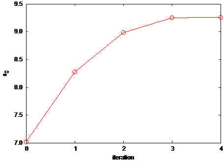

 Si結晶に対してSC-DFT法を適用した例。左図：:math:`\alpha` の値の履歴、右図：誘電率の履歴。

つぎに、得られた :math:`\alpha` を利用して、状態密度の計算を行ってみました。結果を :numref:`advanced_hybrid_fig5` に報告します。比較のためPBEで求めた場合とで求めた場合の結果も同時にプロットしました。

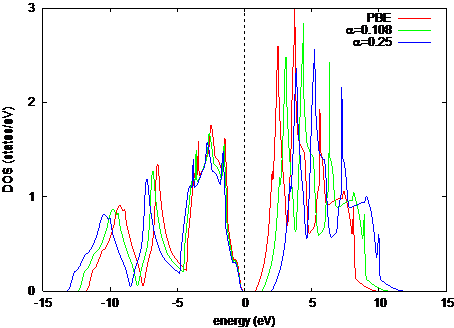

 Si結晶の状態密度

この状態密度より得られるバンドギャップは1.23 eVです。これは、実測値の1.17 eVに極めて近い値であるといえます。

.. only:: not latex

 **参考文献**

.. [Skone14] Jonathan H. Skone, 1 Marco Govoni, and Giulia Galli, “Self-consistent hybrid functional for condensed systems”, Phys. Rev. B **89** (2014) 195112.

.. _advanced_vdwdf_section:

ファンデルワールス相互作用（非局所相関項）
------------------------------------------

.. _機能の概要-14:

機能の概要
~~~~~~~~~~~

非局所相関項を第一原理的に計算する手法（van der Waals density functional
(vdW-DF)）を利用した計算機能について説明します．PHASEでも採用されている一般化された密度勾配近似：Generalized
Gradient Approximation
(GGA)では非局所相関項が考慮されていないために、例えば積層グラファイトの層間凝集エネルギーなどを正確に計算することができません．本節で取り上げる計算機能はGGAのこの欠点を補うために用意されたもので、これを用いることでvan
der
Waals相互作用が大きく寄与する系の全エネルギーや電子状態もより正確に計算できるようになります．また、このvdWDFは第一原理的な手法を利用していて経験的なパラメータ等を用いていないので、任意の形状の系に対して簡単に適用することができます．

非局所相関項を含めた全エネルギー計算
~~~~~~~~~~~~~~~~~~~~~~~~~~~~~~~~~~~~~~

理論概要

-  基本理論

プログラムvdW.F90では非局所相関項\ :math:`E_{c}^{\text{nl}}`\ を計算します．この\ :math:`E_{c}^{\text{nl}}`\ に、GGAで得られる交換項\ :math:`E_{x}^{\text{GGA}}`\ とLDAから得られる交換項\ :math:`E_{c}^{\text{LDA}}`\ を足し合わせることで「非局所相関項も考慮した交換相関項」を導出します．すなわち、交換相関エネルギー\ :math:`E_{\text{xc}}`\ は

 .. math:: E_{\text{xc}} = E_{x}^{\text{GGA}} + E_{c}^{\text{LDA}} + E_{c}^{\text{nl}}
   :label: eq:vdw1

となります．このうち右辺第３項の計算が最も困難で、vdWではDionら [Dion06]_ によって開発された理論手法に習って数値計算されます．この理論手法では非局所相関項を

 .. math:: E_{c}^{\text{nl}} = \frac{1}{2}\int_{}^{}d\mathbf{r}_{i}\mathbf{r}_{k}\rho\left( \mathbf{r}_{i} \right)\phi\left( \mathbf{r}_{i},\mathbf{r}_{k} \right)\rho\left( \mathbf{r}_{k} \right)
   :label: eq:vdw2

として計算します．被積分関数に位置変数が２つ（\ :math:`\mathbf{r}_{i}`\ と\ :math:`\mathbf{r}_{k}`\ ）あるこの式では、GGAやLDAと違って、離れた位置にある電荷密度同士（\ :math:`\rho\left( \mathbf{r}_{i} \right)`\ と\ :math:`\rho\left( \mathbf{r}_{k} \right)`
）の相互作用も考慮しています．２変数関数\ :math:`\phi\left( \mathbf{r}_{i},\mathbf{r}_{k} \right)`\ は

 .. math:: \phi\left( \mathbf{r}_{i},\mathbf{r}_{k} \right) = \frac{2}{\pi^{2}}\int_{0}^{\infty}d\text{adb}a^{2}b^{2}\text{WT}
   :label: eq:vdw3

のように書けます．ここで、

 .. math:: W\left( a,b \right) = \frac{2}{a^{3}b^{3}}\left\lbrack \left( 3 - a^{2} \right)b{\cos\ }b{\sin\ }a+ \left( 3 - b^{3} \right)a{\cos\ }a{\sin\ }b \right. + \left. \ \left( a^{2} - b^{2} - 3 \right){\sin\ }a{\sin\ }b - 3ab{\cos\ }a{\cos\ }b \right\rbrack
   :label: eq:vdw4

です．また、

 .. math:: T\left\lbrack x_{i}\left( a \right),x_{i}\left( b \right),x_{k}\left( a \right),x_{k}\left( b \right)\right\rbrack = \frac{1}{2}\left\lbrack \frac{1}{x_{i}\left( a \right) + x_{i}\left( b \right)} + \frac{1}{x_{k}\left( a \right) + x_{k}\left( b \right)} \right\rbrack

 .. math::  \times \left\lbrack \frac{1}{\left( x_{i}\left(a \right) + x_{k}\left( a \right) \right)\left( x_{i}\left( b \right) + x_{k}\left( b \right) \right)} \right.

 .. math:: + \left. \ \frac{1}{\left( x_{i}\left( a \right) + x_{k}\left( b \right) \right)\left( x_{i}\left(b \right) + x_{k}\left( a \right) \right)} \right\rbrack
   :label: eq:vdw5

と定義されます．さらに各変数は

 .. math:: x_{j}\left( a \right) = \frac{a^{2}}{2} \times \frac{1}{1 - \text{exp}\left( - \frac{4\pi a^{2}}{9d_{j}^{2}} \right)},

 .. math:: d_{j} = \left| \mathbf{r}_{i} - \mathbf{r}_{k} \right|q_{0}\left( \mathbf{r}_{j} \right),

 .. math:: q_{0}\left( \mathbf{r}_{j} \right) =- \frac{4\pi}{3}\epsilon_{\text{xc}}^{\text{LDA}}\rho\left( \mathbf{r}_{j} \right) - \frac{Z_{\text{ab}}}{9}\left\{ \frac{\nabla\rho\left( \mathbf{r}_{j} \right)}{2k_{F}\left( \mathbf{r}_{j} \right)\rho\left( \mathbf{r}_{j}\right)} \right\}^{2}k_{F}\left( \mathbf{r}_{j} \right),

 .. math:: k_{F}^{3}\left( \mathbf{r}_{j}\right) = 3\pi^{2}\rho\left( \mathbf{r}_{j} \right) \left( j = i \text{ or } k \right)
   :label: eq:vdw6

となっており、これからわかるように電荷密度分布を唯一の入力情報とした汎関数となるように設計されています．ここで :eq:`eq:vdw6` の定数Z\ :sub:`ab`
= -0.8491 は第一原理的に決定された係数で、 vdwdf version
1で採用されています。vdwdf version 2
では、この値を2.2倍した値が用いられます。局所密度近似による交換相関エネルギー密度\ :math:`\epsilon_{\text{xc}}^{\text{LDA}}`\ はO.
Gunnarsson *et
al*\ [Gunnarsson76]_ によるものを用いています．これら一連の式はplasmon-pole
modelをもとに設計されたものであり、そのためvan der
Waals相互作用に代表される非局所相関項を含む全エネルギーが比較的低計算コストで非経験的に得られるようになっています．

さらに効率的に数値計算を行うために、\ :eq:`eq:vdw2` の２変数関数\ :math:`\phi\left( \mathbf{r}_{i},\mathbf{r}_{k} \right)`\ を計算するアルゴリズムが変更されました．この２変数関数\ :math:`\phi\left( \mathbf{r}_{i},\mathbf{r}_{k} \right)`\ は直接には\ *d\ i*\ と\ *d\ j*\ にしか依存しないため、
*d\ i*\ =\ *D*\ (1+\ *δ*)、\ *d\ j*\ =\ *D*\ (1-*δ*)と新たに定義された２変数D、\ *δ*\ を用いて\ :math:`\phi\left( \mathbf{r}_{i},\mathbf{r}_{k} \right)`\ を\ :math:`\phi\left( D,\delta \right)`\ として予め計算された数値セットを用意するようにしました．これによって用意したグリッド点数に応じて :eq:`eq:vdw3` の2重積分を逐一行う必要がなくなるため数値計算量が大幅に削減されています．

-  特異点周辺の数値積分

\ :eq:`eq:vdw6` で変数\ :math:`a = 0`\ でかつ\ :math:`\mathbf{r}_{i} = \mathbf{r}_{k}`\ の場合は数値計算によって\ :math:`x_{j}\left( a \right)`\ を決定するのは困難です．このため :eq:`eq:vdw2` の数値積分も特異点を含むことになるため、難しくなります．そこで\ :math:`\left| \mathbf{r}_{i} - \mathbf{r}_{k} \right| \ll 1`\ の領域では電荷密度を\ :math:`\rho\left( \mathbf{r}_{i} \right) = \rho\left( \mathbf{r}_{k} \right)`\ と仮定して\ :math:`\mathbf{r}_{k}`\ 積分の外に出すことにします．これによって :eq:`eq:vdw2` のうち、\ :math:`\mathbf{r}_{i}`\ を中心にした微少半径\ :math:`\eta_{i}`\ の球内での\ :math:`\mathbf{r}_{k}`\ 積分を

 .. math:: \frac{1}{2}\int_{\eta_{i}}^{}d\mathbf{r}_{k}\rho\left(\mathbf{r}_{i} \right)\phi\left( \mathbf{r}_{i},\mathbf{r}_{k} \right)\rho\left( \mathbf{r}_{k} \right) \cong\frac{1}{2}\frac{4\pi\eta_{i}^{3}}{3}\rho^{2}\left( \mathbf{r}_{i} \right)\int_{\eta_{i}}^{}d\mathbf{r}_{k}\phi\left( \mathbf{r}_{i},\mathbf{r}_{k}\text{ht} \right)

 .. math:: = \frac{1}{2}\frac{4\pi\eta_{i}^{3}}{3}\rho^{2}\left( \mathbf{r}_{i} \right) \times 4\pi\int_{0}^{\eta_{i}}dr_{\text{ik}}\phi\left( d_{i},d_{k} \right)

 .. math:: = \frac{1}{2}\frac{4\pi\eta_{i}^{3}}{3}\rho^{2}\left( \mathbf{r}_{i} \right) \times 4\pi\int_{0}^{\eta_{i}q_{0}}d\text{Dϕ}\left( D \right)\frac{D^{2}}{q_{0}^{3}}
   :label: eq:vdw7

と単純にすることができます．ただし、\ :math:`r_{\text{ik}} = \left| \mathbf{r}_{i} - \mathbf{r}_{k} \right|`\ としています．ここで２行目から３行目へは、\ :math:`D \equiv q_{0}\mathbf{r}_{\text{ik}}\left( = d_{i} = d_{k} \right)`\ を定義して変数変換を用いています．３行目の被積分関数は特異点を含まないため、これで数値積分を実行することができます．

-  無限周期系への拡張

本手法では電荷密度分布情報を実空間表記で入力し、そのまま計算を進めていくためにこのままでは有限サイズの計算対象に向いた手法となっています．逆に無限周期系を計算するには十分に\ :math:`\mathbf{r}_{i}`\ と\ :math:`\mathbf{r}_{k}`\ が離れた場合まで :eq:`eq:vdw2` の数値積分を行わなくてはならず、非常に計算効率が悪くなります．特にvan
der Waals相互作用は遠距離においてもその寄与はなだらかにしか減衰しません．そこで漸近関数を用いることで、本手法をこの無限周期系にも対応できるようにしました．\ :eq:`eq:vdw2` の被積分関数にある２変数関数\ :math:`\phi\left( \mathbf{r}_{i},\mathbf{r}_{k} \right)`\ は\ :math:`\mathbf{r}_{i}`\ と\ :math:`\mathbf{r}_{k}`\ が十分に離れた場合には

 .. math:: \phi\left( \mathbf{r}_{i},\mathbf{r}_{k} \right) \rightarrow - \frac{12\left( \frac{4\pi}{9} \right)^{3}}{d_{i}^{2}d_{k}^{2}\left( d_{i}^{2} + d_{k}^{2} \right)}

 .. math:: = - \frac{C}{r_{\text{ik}}^{6}} \times \frac{1}{q_{0}^{2}\left( r_{i} \right)q_{0}^{2}\left( r_{k} \right)\left( q_{0}^{2}\left(r_{i} \right) + q_{0}^{2}\left( r_{k} \right) \right)}

 .. math:: = - \frac{C}{r_{\text{ik}}^{6}} \times \psi\left\lbrack \rho\left( \mathbf{r}_{i}\right)\rho\left( \mathbf{r}_{k} \right) \right\rbrack
   :label: eq:vdw8

のような漸近関数に近似できることがその定義からわかります．ただし\ :math:`C = 12\left( 4\pi/9 \right)^{3}`\ ．この漸近関数には :eq:`eq:vdw3` のような積分演算が含まれていないため非常に簡単に数値計算が行えるという利点があります．
この式の３行目のうち‘×’の前の分数は\ :math:`\mathbf{r}_{k}`\ の増加に応じて単純に減衰していく漸近項で、これに対して‘×’の後ろの\ :math:`\psi\left\lbrack \rho\left( \mathbf{r}_{i} \right),\rho\left( \mathbf{r}_{k} \right) \right\rbrack`\ は式(8)からわかるように直接的には電荷密度しか変数を持たないため、周期系物質においては周期的な項となっています．このことを考慮すると、式(2)のうち、\ :math:`\mathbf{r}_{i}`\ と\ :math:`\mathbf{r}_{k}`\ が十分に離れた場合\ :math:`(r_{\text{ik}} > \eta`)には次のように積分を単純化できます．すなわち

 .. math:: \frac{1}{2}\int_{r_{\text{ik}} > \eta}^{}d\mathbf{r}_{i}d\mathbf{r}_{k}\rho\left( \mathbf{r}_{i} \right)\phi\left( \mathbf{r}_{i},\mathbf{r}_{k} \right)\rho\left( \mathbf{r}_{k} \right) \cong \frac{1}{2}dv^{2}\sum_{\overset{\mathbf{r}_{i} \in}{\text{unitcell}}}^{}{\sum_{\overset{\mathbf{r}_{k} \in}{\left( r_{\text{ik}} > \eta \right)}}^{}\rho}\left( \mathbf{r}_{i} \right)\phi\left( \mathbf{r}_{i},\mathbf{r}_{k} \right)\rho\left( \mathbf{r}_{k} \right)

 .. math:: = \frac{1}{2}dv^{2}\sum_{\overset{\mathbf{r}_{i},\mathbf{r}_{k} \in}{\text{unitcell}}}^{}{\sum_{\overset{\mathbf{t}_{\text{xyz}} \in}{\left( \left| \mathbf{r}_{k} + \mathbf{t}_{\text{xyz}} - \mathbf{r}_{i} \right| > \eta \right)}}^{}\rho}\left( \mathbf{r}_{i} \right)\phi\left( \mathbf{r}_{i},\mathbf{r}_{k} + \mathbf{t}_{\text{xyz}} \right)\rho\left( \mathbf{r}_{k} + \mathbf{t}_{\text{xyz}} \right)

 .. math:: = -\frac{C}{2}dv^{2}\sum_{\overset{\mathbf{r}_{i},\mathbf{r}_{k} \in}{\text{unitcell}}}^{}\rho\left( \mathbf{r}_{i} \right)\psi\left\lbrack \rho\left( \mathbf{r}_{i} \right),\rho\left( \mathbf{r}_{k} \right) \right\rbrack\rho\left( \mathbf{r}_{k} \right)\sum_{|\mathbf{r}_{k} +\mathbf{t}_{\text{xyz}} - \mathbf{r}_{i}| > \eta\ }^{\mathbf{t}_{\text{xyz}} \in}\frac{1}{r_{\text{xyz}}^{6}}
   :label: eq:vdw9

と関数を分けることができます．ここで\ :math:`\text{dv}`\ は数値計算を行う際のグリッド点に囲まれる最小直方体体積で、\ :math:`\mathbf{t}_{\text{xyz}}`\ は格子点同士を結ぶ結晶ベクトルです．この式３行目の総和のうち左側は\ :math:`\mathbf{r}_{i}`\ と\ :math:`\mathbf{r}_{k}`\ の範囲がユニットセル内に限定されているので、計算コストは限定的です．一方、右側は\ :math:`1/r_{\text{xyz}}^{6}`\ が実質無視できるほど小さくなるまで広範囲に渡って総和することになります．しかし、そもそも関数型が非常に単純な上に、電荷密度分布\ :math:`\rho\left( \mathbf{r} \right)`\ とは無関係で、グリッド点の空間配置のみによって決まる値なので予め求めておけばよいものです．

以上のように漸近関数を使ってさらに式(12)のように積分順序を工夫することによって、実質無限遠の寄与まで効率よく考慮することができ、これによって本手法を無限周期系にも適用できるようにしています．

-  3次スプライン補間と畳み込み積分を利用した高速化

Dionらによるもともとの手法では、空間の2重積分を直接行うため膨大な演算量が必要とされます。そこで、Román-PérezとSolerによって
、スプライン補間と畳み込み積分を利用したより高速なアルゴリズムが開発されました
[Roman09]_ PHASE/0はこの方法によって実際の計算を行います。

この方法では、まずカーネル関数を3次のスプライン補間によって展開します。

 .. math:: \phi\left(d,d'\right) = \phi\left(q\left| \mathbf{r}-\mathbf{r}'\right|, q'\left|\mathbf{r}-\mathbf{r}'\right|\right) = \sum_{\alpha\beta}\left(q_{\alpha}\left|\mathbf{r}-\mathbf{r}'\right|,q_{\beta}\left|\mathbf{r}-\mathbf{r}'\right|\right)p_{\alpha}\left(q\right)p_{\beta}\left(q'\right).
  :label: eq:vdw10

\ :math:`\theta_\alpha \left(\mathbf{r}\right)\equiv p_{\alpha}(q)\rho(\mathbf{r})` を導入すると、2重積分は以下のように畳み込み積分に変形することができます。

 .. math:: E_{c}^{\rm nl} = \frac{1}{2} \iint d\mathbf{r}d\mathbf{r}' \theta_{\alpha}\left(\mathbf{r}\right) \theta_{\beta}\left(\mathbf{r}'\right)\phi_{\alpha\beta}\left(\left|\mathbf{r}-\mathbf{r}'\right|\right) \\ = \frac{\Omega}{2} \sum_{\alpha} \sum_{\mathbf{G}} \theta_{\alpha}^{*}\left( \mathbf{G} \right) \theta_{\beta} \left(\mathbf{G}\right) \phi_{\alpha\beta} \left(\left|\mathbf{G}\right|\right), \\ \theta_{\alpha} \left(\mathbf{G}\right) = \int d\mathbf{r} \theta_{\alpha} \left(\mathbf{r}\right) \exp \left[ -i \mathbf{G} \cdot \mathbf{r} \right], \\ \phi_{\alpha\beta} \left( \left|\mathbf{G}\right|\right) = \frac{4\pi}{\left|\mathbf{G}\right|} \int r \phi_{\alpha\beta} \left(r\right) \sin \left[ \left|\mathbf{G}\right| r \right] dr.
  :label: eq:vdw11

このように変形すると、上式から分かるように高速フーリエ変換を利用して処理できるようになり、大幅な高速化が達成できます。

SCF計算に組み込む場合、通常通りエネルギーを電子密度で汎関数微分します。

 .. math:: v_{\rm c}^{\rm nl} \left(\mathbf{r}\right) = \sum_{\alpha} \left( u_{\alpha} \left(\mathbf{r}\right) \frac{\delta \theta_{\alpha} \left(\mathbf{r}\right)}{\delta \rho \left( \mathbf{r}\right)} + \sum_{\mathbf{r}'} u_{\alpha} \left(\mathbf{r}'\right) \frac{\delta \theta_{\alpha} \left(\mathbf{r}'\right)}{\delta \left|\nabla\rho\left(\mathbf{r}'\right)\right|} \frac{\delta \left|\rho\left(\mathbf{r}'\right)\right|}{\delta \rho\left(\mathbf{r}\right)} \right), \\ u_{\alpha} = \sum_{\beta} \sum_{\mathbf{r}'} \theta_{\beta}^{*} \left(\mathbf{r}'\right) \phi_{\alpha\beta} \left(\left|\mathbf{r}-\mathbf{r}'\right|\right).
  :label: eq:vdw12

\ :math:`u_{\alpha} \left(\mathbf{r}\right)` も畳み込み積分になっているので、逆空間で計算し、逆FFTを行うことによって計算することが可能です。

-  アルゴリズム

非局所相関項（van der
Waals項）を含めた全エネルギー計算は、交換相互作用はGGA,
局所的な相関相互作用はLDA,
そして非局所的な相関相互作用はここまで説明したvdWDF理論を利用して行われます。計算方法としては、この計算をすべてセルフコンシステントに行う方法と、交換相互作用はGGA,
相関相互作用はLDAを採用した変則的な汎関数を利用して収束解を得たあとにポスト処理的にvdWDF効果を取り込む、という方法があります。PHASE/0では前者を“SCF版”、後者を“ワンショット版”と呼んでいます。ワンショット版は最後に1度vdWの処理を行うのみなので、SCF版と比較すると高速です。エネルギーを求めることのみが目的の場合ワンショット版でも多くの場合十分な精度が得られます。ただし、vdWエネルギー由来の原子間力も計算したい場合はSCF版を採用する必要があります。

なお、上記の交換相互作用として、いくつかのGGA汎関数が考えられています。さらに、これとZ\ :sub:`ab`\ の値
(vdwdfのバージョン)
の組み合わせにより、複数のvdWDF汎関数が提案されています。PHASE/0で使用可能な
vdWDFの一覧を以下に示します。

============ ================== ============
名称         vdwdf のバージョン 交換相互作用
============ ================== ============
vdwdf        1                  revpbe
vdwdf2       2                  pw86r
vdwdf-c09x   1                  c09x
vdwdf2-c09x  2                  c09x
vdwdf-optpbe 1                  optpbe
vdwdf2-b86r  2                  b86r
vdwdf-cx     1                  lvpw86r
============ ================== ============

使用方法

利用の前提として、GGAPBE汎関数に対応した擬ポテンシャルファイルを用意する必要があります（公開擬ポテンシャルは、ほぼすべてGGAPBEに対応しています）。その上で、以下のような設定を行います。

.. code-block:: text

 accuracy{
   xctype = vdwdf2 ! vdwdf, vdwdf2, … ,vdwdf-cxが選択可能。
   vdwdf{
     mode = scf
   }
 }

accuracyブロックの下のxctype変数に、使用する
vdWDF汎関数名を指定します。さらに、vdwdfブロックの下の変数modeにSCF版を利用する場合はscfを、ワンショット版を利用する場合はoneshotを指定します。変数modeのデフォルト値はoneshotです。ただし、xctype
= vdwdf 以外はワンショット計算には非対応です。

.. _出力-2:

出力

結果は、通常の計算と変わりません。nfefn.dataファイルにはエネルギーの履歴が、nfdynm.dataファイルには原子座標の履歴が記録されます。ワンショット版を利用している場合は、output000ファイルに記録される途中のエネルギーとnfefn.dataファイルで報告されるエネルギーが異なる点には注意が必要です。ワンショット版の場合、途中に記録されるエネルギーは交換相互作用にGGA,
相関相互作用にLDAを利用した変則的な汎関数による結果だからです。ワンショット版の場合、計算収束し、vdWDFの計算が終わったあと、以下のように結果がoutput000ファイルに報告されます。

.. code-block:: text

 vdW energy : 0.0668443126 hartree
 --> total energy : -22.8808219651 hartree

nfefn.dataファイルに記録されるエネルギー値は、vdWDFのエネルギーも含んだエネルギー値です。

計算例1：積層グラファイトの全エネルギー計算
~~~~~~~~~~~~~~~~~~~~~~~~~~~~~~~~~~~~~~~~~~~~

はじめに

　ここでは実際に本ルーチン（vdW）を用いたvdW-DF計算の例を挙げます．計算対象はGGAやLDAでは正確に計算できない典型例である、積層グラファイト（A-B
stacking）の全エネルギーの層間距離依存性としました．通常のGGAの範囲内でこの系の全エネルギー曲線を計算するとエネルギー的に安定な平衡点は現れず、結果的に各グラファイト層は互いに無限遠まで離散するという解釈になってしまいます．本来は適当な層間距離でエネルギー的に明確な安定点が存在するため、GGAによるこの解釈は定性的に間違っています．これは、非局所的な相互作用であるvan
der
Waals相互作用をGGAが全く考慮できていないことに主な要因があり、本計算機能を利用することでこの間違いが修正されることを確認します．

計算条件

本計算では、実験値や他の理論計算の報告例が豊富にあるA-B
stacking型の積層グラファイトを対象にしました．ユニットセル内に8個（2層分）の炭素原子を含みます．グラファイトの積層方向にz軸をとってセルサイズは4.3×2.5×\ *z*\ (=\ *x*\ ×\ *y*\ ×\ *z*\ [Å\ :sup:`3`])とし、\ *z*\ を5から12[Å]まで変化させながら各\ *z*\ 値での全エネルギーを計算させました．この計算を通常のGGAとvdW-DF計算
( xctype=vdwdf、mode=oneshot )
の2通りで行い、それぞれから得られる全エネルギー曲線を比較します．vdW-DF計算には入力情報として電荷密度分布\ :math:`\rho^{\text{GGAx}}\left( \mathbf{r} \right)`\ が必要になりますが、このグリッド密度はGGA計算時に設定したcutoff値に依存しており、ここでは32×18×40(to
96)個のグリッドを採用しています．なお、グリッド点数は整数であるため、z軸の変化に伴って不連続に変化することになります．つまり、結果のエネルギー曲線が不自然に変化する場合はこの不連続性が原因であるため、必要に応じてPHASEのinputfileのcutoff値を上げることでなめらかになります．また、vdWは非局所的な計算になるためGGAよりは大きな計算コストが必要となります．

.. _計算結果-2:

計算結果

　下図は上記条件で計算した積層グラファイト（A-B
stacking）の全エネルギーの層間距離依存性を示したものです．赤線は通常のGGAによる結果を、緑線はvdWによるvdW-DF計算の結果をそれぞれ示しています．また、青点は実験 [Benedict98]_ [Baskin55]_ による平衡点とそのときの凝集エネルギー（青線は誤差）を、同様に紫点は別の理論計算 [Rydberg03]_ によるものです．GGA計算では全く平衡点が確認できないのに対して、vdW-DF計算ではかなり実験値の近くで極小点を迎えているのが確認できます．

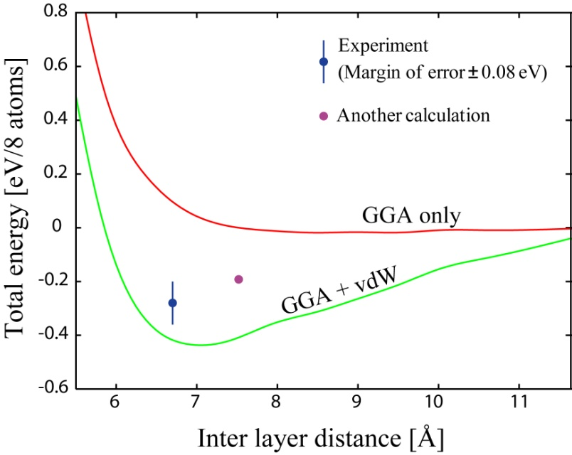

 積層グラファイトの全エネルギーの層間距離依存性．GGA（赤線）とGGA + vdW（緑線）による比較

計算例2：積層2H-MoS\ :sub:`2`\ の全エネルギー計算
~~~~~~~~~~~~~~~~~~~~~~~~~~~~~~~~~~~~~~~~~~~~~~~~~~

層状物質である 2H-MoS\ :sub:`2` (単位胞6原子) の全エネルギー計算を、c
軸方向の格子長をパラメーターにして行います。a、b軸の格子長は 3.1612
Åで固定します。また、mode=scf により
SCF計算を行い、構造最適化を行います。結果は、以下に示すように、xctype =
vdwdf よりも vdwdf2-c09x の方が、実験の格子長 12.2985 Åに近い c
軸長でエネルギーが最小となっています。

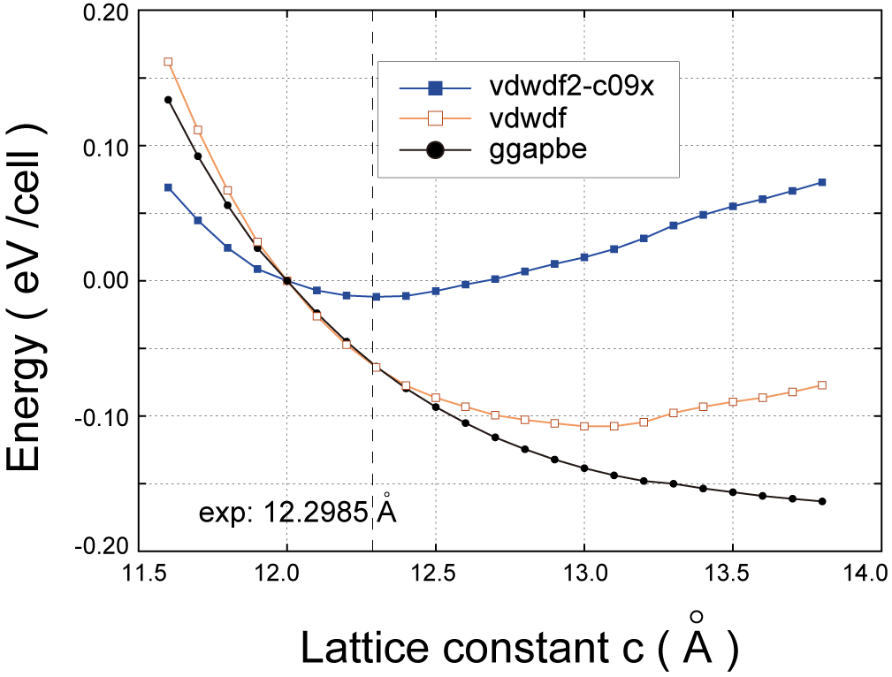

 積層2H-MoS2 の全エネルギーのc 軸長依存性

制限事項
~~~~~~~~~~~

　部分電荷補正がある計算や、PAW
の計算には注意してください。内殻電子による補正項が vdwDF
に完全対応していないためです。ただし、定性的には大きな影響は与えません。

.. _参考文献-4:

.. only:: not latex

 **参考文献**

.. [Dion06] M\. Dion, H. Rydberg, E. Schröder, D. C. Langreth, and B. I.  Lundqvist: Phys. Rev. Lett. **92** (2004) 246401: Erratum, ibid, **95** (2005) 109902.
.. [Gunnarsson76] O\. Gunnarsson and B. I. Lundqvist: Phys. Rev. B **13** (1976) 4274.
.. [Roman09]  Guillermo Román-Pérez and José M. Soler, Phys. Rev. Lett. 103 0 (2009).
.. [Benedict98] L\. X. Benedict, N. G. Chopra, M. L. Cohen, A. Zettl, S. G. Louie, and V. H. Crespi: Chem. Phys. Lett. **286** (1998) 490.
.. [Baskin55] Y\. Baskin and L. Mayer: Phys. Rev. **100**, (1955) 544.
.. [Rydberg03] H\. Rydberg, M. Dion, N. Jacobson, E. Schröder, P. Hyldgaard, S. I.  Simak, D. C. Langreth, and B. I. Lundqvist: Phys. Rev. Lett. **91** (2003) 126402.
.. [Thonhauser07] T. Thonhauser, Valentino R. Cooper, Shen Li, Aaron Puzder, Per Hyldgaard, and David C. Langreth: Phys. Rev. B **76**, 125112 (2007).

.. _advanced_vdwcorr_section:

ファンデルワールス相互作用補正機能
------------------------------------

.. _機能の概要-15:

機能の概要
~~~~~~~~~~~~

-  Williamsの方法 [Williams06]_

 .. math:: E_{\rm vdw} = \sum_{ij} \frac{C_6^{ij}}{R_{ij}^6} f\left( R_{ij}\right) \\ f\left(R\right) = \left( 1-\exp \left[ -d\left(\frac{R_ij}{R_{0}^{ij}}\right)^7\right]\right)^4 \\ C_{6}^{ij} = -S_C \times \frac{2C_6^iC_6^jp_ip_j}{p_i^2C_6^i+p_j^2C_6^j}, R_0^{ij} = S_R \times \frac{\left(R_0^{ii}\right)^3 + \left(R_0^{jj}\right)^3}{\left(R_0^{ii}\right)^2 + \left(R_0^{jj}\right)^2}, R_0^{ii} = 2 \times R_0^i

パラメータ

vdw radius 20.0 bohr

scaling factor :math:`S_C` 0.8095 (PHASE), :math:`S_R` 0.80 文献 PBE :math:`S_C` 0.85 :math:`S_R` 0.80

damping factor :math:`d` 3.0

.. csv-table::

 "", "polarizabilities A :sup:`3`", "vde coef C6 Hartree*bohr :sup:`6`", "vdw radius", "", "polarizabilities A :sup:`3`", "vde coef C6 Hartree*bohr :sup:`6`", "vdw radius"
 "H", 0.38, 2.831179918, 1.17, "NTE", 0.964, 20.89758657,  1.50
  F,  0.296, 3.94987377,      , NTR2, 1.030,  23.080, 1.50
 Cl,  2.315,  3.94987377,     , NPI2 , 1.090 , 25.125, 1.50
 Br,  3.013, 128.2756865,     ,  NDI , 0.956 , 20.63799109, 1.50
  I,  5.415, 309.0603852,     , OTE  , 0.637 , 11.86370812, 1.40
 CTE, 1.061, 22.67403316, 1.70, OTR4 , 0.569 , 10.01566303, 1.40
 CTR, 1.352, 32.61525204, 1.70, OPI2 , 0.274 , 3.346856941, 1.40
 CAR, 1.352, 49.790/Sc,   1.70, STE  , 3.000 , 121.2531939, 1.80
 CBR, 1.896, 54.16430826, 1.70, STR4 , 3.729 , 168.0350502, 1.80
 CDI, 1.283, 30.15058105, 1.70, SPI2 , 2.700 , 103.5277919, 1.80
    ,      ,            ,     , PTE  , 1.538 , 42.11289383, 1.80

-  Grimme (DFT-D2)の方法 [Grimme06]_

 .. math:: E_{\rm disp} = -s_6 \sum_{ij} \frac{C_6^{ij}}{R_{ij}^6} f \left(R_{ij}\right) \\ f\left(R\right) = \frac{1}{1+ \exp \left[ -d \left( \frac{R_{ij}}{R_0^{ij}} -1\right)\right]} \\ C_6^{ij} = \sqrt{C_6^i C_6^j}, R_0^{ij} = R_0^i + R_0^j

パラメータ

vdw radius 30.0A

scaling factor 0.75, damping factor 20.0

== ================= ===== ===== ================= =====
\  C6                R0          C6                R0

   Jnm\ :sup:`6`/mol A           Jnm\ :sup:`6`/mol A
== ================= ===== ===== ================= =====
H  0.14              1.001 K     10.80             1.485
He 0.08              1.012 Ca    10.80             1.474
Li 1.61              0.825 Sc-Zn 10.80             1.562
Be 1.61              1.408 Ga    16.99             1.650
B  3.13              1.485 Ge    17.10             1.727
C  1.75              1.452 As    16.37             1.760
N  1.23              1.397 Se    12.64             1.771
O  0.70              1.342 Br    12.47             1.749
F  0.75              1.287 Kr    12.01             1.727
Ne 0.63              1.243 Rb    24.67             1.628
Na 5.71              1.144 Sr    24.67             1.606
Mg 5.71              1.364 Y-Cd  24.67             1.639
Al 10.79             1.716 In    37.32             1.672
Si 9.23              1.716 Sn    38.71             1.804
P  7.84              1.705 Sb    38.44             1.881
S  5.57              1.683 Te    31.74             1.892
Cl 5.07              1.639 I     31.50             1.892
Ar 4.61              1.595 Xe    29.99             1.881
== ================= ===== ===== ================= =====

1 J/mol = 3.8088e-7 hartree, 1 bohr = 0.5291772480 A

-  Grimme (DFT-D3)の方法 (バージョン2019.01以降)

DFT-D2法のほか、DFT-D3法 [Grimme10]_ も利用できます

DFT-D3は、DFT-D2の改良版です。\ :math:`\frac{1}{r^{8}}`\ に比例する項があることやパラメーターが配位数に依存する点などがDFT-D2と異なる点であり、特に後者の改良によって原子の局所構造の違いを相互作用に反映させることができるようになっています。

DFT-D3法を利用するためには、DFT-D2機能と同じようにまずcontrolブロックにおいてsw_vdw_correctionの値をonにします。

.. code-block:: text

 Control{
   sw_vdw_correction = on
 }

さらに、accuracyブロックにおいてvdw_methodとしてdftd3を指定すればよい。

.. code-block:: text

 accuracy{
   vdw_method = dftd3
 }

DFT-D2法やWilliamsの方法と違い、ファンデルワールス相互作用のために別途元素を定義する必要はありません。

また、パラメーターファイルが置いてある場所をfile_names.dataのF_DFTD3PARで指定します。

.. code-block:: text

 &fnames
 F_INP = ‘./nfinp.data’
 …
 F_DFTD3PAR = ‘./dftd3par.data’
 /

F_DFTD3PARのデフォルト値は./dftd3par.dataです。dftd3par.dataファイルは、PHASE/0インストールディレクトリーの下の以下の場所にあります。

\ :code:`samples/vdw_correction/dftd3`

.. _入力パラメータ-9:

入力パラメータ
~~~~~~~~~~~~~~~

.. table:: vdW補正機能関連のタグ一覧
 :widths: auto
 :class: longtable

 +-----------+-----------------+-----------------+-----------------+
 | タグ      |                 | 値              | 備考            |
 +===========+=================+=================+=================+
 | Control   | sw              |                 |                 |
 |           | _vdw_correction |                 |                 |
 +-----------+-----------------+-----------------+-----------------+
 | Accuracy  | vdw_method      | williams        | デフォルト      |
 |           |                 |                 |                 |
 |           |                 | grimme or       |                 |
 |           |                 | dft-d2          |                 |
 +-----------+-----------------+-----------------+-----------------+
 |           | vdw_radius      |                 | 20 bohr         |
 |           |                 |                 |                 |
 |           |                 |                 | 30 A (Grimme    |
 |           |                 |                 | DFT-D2)         |
 +-----------+-----------------+-----------------+-----------------+
 |           | vdw             |                 | 0.805           |
 |           | _scaling_factor |                 | (Williams)      |
 |           |                 |                 |                 |
 |           |                 |                 | 0.75 (Grimme    |
 |           |                 |                 | DFT-D2)         |
 +-----------+-----------------+-----------------+-----------------+
 |           | vdw_s           |                 | 0.8 (Williams)  |
 |           | caling_factor_r |                 |                 |
 +-----------+-----------------+-----------------+-----------------+
 |           | vdw             |                 | 3.0 (Williams)  |
 |           | _damping_factor |                 |                 |
 |           |                 |                 | 20.0 (Grimme    |
 |           |                 |                 | DFT-D2)         |
 +-----------+-----------------+-----------------+-----------------+
 | Structure | atom_list       |                 |                 |
 +-----------+-----------------+-----------------+-----------------+
 |           | atoms           | #tag vdw        |                 |
 |           |                 | でvd            |                 |
 |           |                 | w補正における元 |                 |
 |           |                 | 素のtypeを指定  |                 |
 +-----------+-----------------+-----------------+-----------------+
 |           | vdw_list        | vdw補正におけ   | Williams        |
 |           |                 | る各元素異に対  |                 |
 |           |                 | するパラメータ  | #tag type c6 r0 |
 |           |                 |                 | p               |
 |           |                 |                 |                 |
 |           |                 |                 | Grimme          |
 |           |                 |                 |                 |
 |           |                 |                 | #tag type c6 r0 |
 +-----------+-----------------+-----------------+-----------------+
 |           |                 |                 |                 |
 +-----------+-----------------+-----------------+-----------------+

赤字は、vDW補正機能を用いる場合の必須の入力項目

*vdW補正の各元素のパラメータの指定*

Williams法、Grimme(DFT-D2)法の各元素のパラメータをプログラム内で持ち、デフォルト値としている。

vdw_listのtypeは、atom_listで指定したvdwのtypeと対応している必要がある。

Williams法

.. code-block:: text

 vdw_list{
   #tag type c6 r0 p
   H 2.831179918 1.17 0.387
   CTE 22.67403316 1.70 1.061
 }

Grimme(DFT-D2)法

.. code-block:: text

 vdw_list{
   #tag type c6 r0
         H 0.14 1.001
         C 1.75 1.452
 }

入力パラメータ例

vdW補正関連の入力データ例を以下に示す。

Methane Dimer Williams法

.. code-block:: text

 Control{
   sw_vdw_correction = ON
 }
 accuracy{
   vdw_method = williams
   vdw_radius = 20.0
   vdw_scaling_factor = 0.8095
   vdw_scaling_factor_r = 0.8
   vdw_damping_factor = 3.0
 }
 structure{
   atom_list{
     coordinate_system = cartesian ! {cartesian
     atoms{
       #units angstrom
       #default mobile=on
       #tag element rx ry rz vdw
           C 0 0 0 CTE
           H 0 1.093 0 H
           H 1.030490282 -0.364333333 0 H
           H -0.515245141 -0.364333333 0.892430763 H
           H -0.515245141 -0.364333333 -0.892430763 H
           C 0 -3.7 0 CTE
           H 0 -4.793 0 H
           H -1.030490282 -3.335666667 0 H
           H 0.515245141 -3.335666667 -0.892430763 H
           H 0.515245141 -3.335666667 0.892430763 H
     }
   }
   vdw_list{
     #tag type c6 r0 p
       H 2.831179918 1.17 0.387
       CTE 22.67403316 1.70 1.061
   }
 }

Methane Dimer Grimme(DFT-D2)法

.. code-block:: text

 Control{
   sw_vdw_correction = ON
 }
 accuracy{
   vdw_method = grimme
   vdw_radius = 30.0
   vdw_scaling_factor = 0.75
   vdw_damping_factor = 20.0
 }
 structure{
   atom_list{
     coordinate_system = cartesian !
     atoms{
       #units angstrom
       #default mobile=on
       #tag element rx ry rz vdw
           C 0 0 0 C
           H 0 1.093 0 H
           H 1.030490282 -0.364333333 0 H
           H -0.515245141 -0.364333333 0.892430763 H
           H -0.515245141 -0.364333333 -0.892430763 H
           C 0 -3.7 0 C
           H 0 -4.793 0 H
           H -1.030490282 -3.335666667 0 H
           H 0.515245141 -3.335666667 -0.892430763 H
           H 0.515245141 -3.335666667 0.892430763 H
     }
   }
   vdw_list{
     #tag type c6 r0
           H 0.14 1.001
           C 1.75 1.452
   }
 }

.. _計算例-5:

計算例
~~~~~~~~~~

-  :code:`samples/vdw_correction/Water_Dimer` (Williams, Grimme(DFT-D2))

-  :code:`samples/vdw_correction/Methane_Dimer` (Williams, Grimme(DFT-D2))

-  :code:`samples/vdw_correction/Ethane_Dimer` (Williams, Grimme(DFT-D2))

-  :code:`samples/vdw_correction/ATstack` (Williams)

.. only:: not latex

 **参考文献**

.. [Williams06] R\.W. Williams, et al.: Chemical Physics 327 (2006) 54-62
.. [Grimme06] S\. Grimme, J. Comp. Chem. 27, 1787 (2006).
.. [Grimme10] Stefan Grimme, Jens Antony, Stephan Ehrlich, and Helge Krieg, “A consistent and accurate ab initio parametrization of density functional dispersion correction (DFT-D) for the 94 elements H-Pu” The Journal of Chemical Physics, **132**, 154104 (2010).
.. _advanced_section_esm:

有効遮蔽体法（ESM法）
-----------------------

.. _機能の概要-16:

機能の概要
~~~~~~~~~~~

ESM (Effective Screening
Medium)法 [Otani06]_ [Hamada09]_ とは、表面モデルを精度よく扱うための計算手法です。PHASEは基底関数として平面波を利用するプログラムなので、厳密には周期系のみ取り扱うことが可能です。表面モデルを扱う場合、表面に垂直な方向に“真空層”を設けることによって表面を模擬した系の計算を行います。このような方法の場合、たとえば分極した表面などは正しく扱えないので特殊な補正を施す必要があります。ESM法は、実効的な遮蔽物（effective
screening
medium）を真空領域に設定することによって半無限におよぶ表面領域を有限の真空領域で扱うことを可能とする方法です。ここでは、PHASEに組み込まれたESM法の利用方法を説明します。

.. _入力パラメータ-10:

入力パラメータ
~~~~~~~~~~~~~~~

まずは、通常のPHASE計算と同様の入力パラメータファイルを準備します。この際、原子配置の定義の仕方に注意が必要です。ESMプログラムは、系が以下の図のように定義されていることを仮定しています。

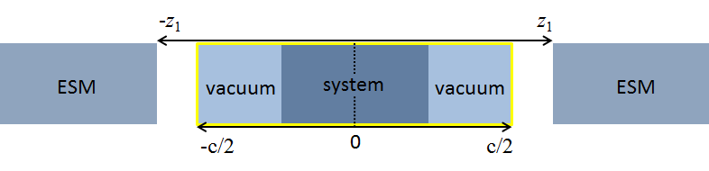

 ESM法において仮定している原子配置の定義方法の模式図

系は、2方向（aおよびb軸方向）に周期的、1方向（c軸方向）に非周期系であることを仮定しています。\ *c*\ 軸の値が0になる場所に系の中心が位置するように必要に応じて系をシフトし、プラスマイナス両側に真空層を設けます。さらに、系の中心から距離z\ :sub:`1`\ （入力パラメータファイルによって指定する）離れた場所にESMが置かれます。

accuracyブロックにesmブロックを作成し、ESM用の設定を施します。典型的には、以下のとおり。

.. code-block:: text

 ...
 ...
 accuracy{
   esm{
     sw_esm = on
     bc = pe1
     electric_field = 0.001
   }
   ...
   ...
 }
 ...
 ...

esmブロックの下では、以下の変数を定義することが可能です。

.. table::
 :widths: auto
 :class: longtable

 +----------------+----------------------------------------------------+
 | sw_esm         | ESM法を利用するかどうかを指定するスイッチ。        |
 |                |                                                    |
 |                | onを指定するとESM法を利用します。デフォルト値はoff |
 +----------------+----------------------------------------------------+
 | z1             | ESMの位置を指定します。指定がない場合、単          |
 |                | 位胞の境界にESMが置かれます（すなわち、z1=c/2）。  |
 +----------------+----------------------------------------------------+
 | bc             | 境界条件(boundary condition)を指定します。BARE,    |
 |                | PE1,                                               |
 |                | PE2のいずれかを指                                  |
 |                | 定します。BAREは両側のESMが真空（誘電率1）、PE1は  |
 |                | 両側のESMが金属（誘電率∞）PE2はESMの片側が真空、も |
 |                | う片側が金属という境界条件です。デフォルト値はBARE |
 +----------------+----------------------------------------------------+
 | electric_field | 有限電場を指定したい場合に                         |
 |                | 、その量を原子単位で指定します。この指定は、bcがP  |
 |                | E1であった場合のみに意味をもちます。それ以外の場合 |
 |                | 、計算中参照されません。電場の単位は、hartree/bohr |
 |                | です（約51.4 V/Å）。                               |
 +----------------+----------------------------------------------------+
 | add_elec       | 電子                                               |
 |                | を追加/削除したい場合に追加/削除したい電子数を実数 |
 |                | で指定します。削除したい場合は負の数を指定します。 |
 +----------------+----------------------------------------------------+
 | z_wall         | 原子が真空                                         |
 |                | 層のある領域からはみでないように“壁”を設ける場合に |
 |                | 、その“ある領域”の指定を実数で行います。このパラメ |
 |                | ータの指定があった場合にこの機能が有効となります。 |
 +----------------+----------------------------------------------------+
 | bar_width      | “壁”ポテンシャ                                     |
 |                | ルを設ける場合に、その幅を長さの単位で指定します。 |
 +----------------+----------------------------------------------------+
 | bar_height     | “壁”ポテンシャルを設け                             |
 |                | る場合に、その高さをエネルギーの単位で指定します。 |
 +----------------+----------------------------------------------------+

.. _計算の実行-3:

計算の実行
~~~~~~~~~~~

計算の実行は、通常のPHASEの計算通り行います。並列の方法や擬ポテンシャルの制限などは特にありません。利用できる計算機能にも特に制約はありません。

.. _計算例-6:

計算例
~~~~~~~~~~~

.. _水分子-1:

水分子

ESM法適用例として、単純な水分子の計算結果を紹介します。この例題の入力ファイルは、 :code:`samples/surface/esm/H2O` 以下にあります。水分子は、単体で双極子モーメントをもっているので、水分子は通常の周期系の計算の場合全エネルギーに有限の誤差が発生します。ESM法は、1つの方向については無限の計算を行うことになるので、正しい全エネルギーが得られると考えられます。

このようなことを確認するため、以下のような計算を実施します。

1. 水分子単体の、周期系における全エネルギー計算

2. 水分子単体の、ESM法による全エネルギー計算

3. 水分子を互い違いに配置した系の、周期系における全エネルギー計算

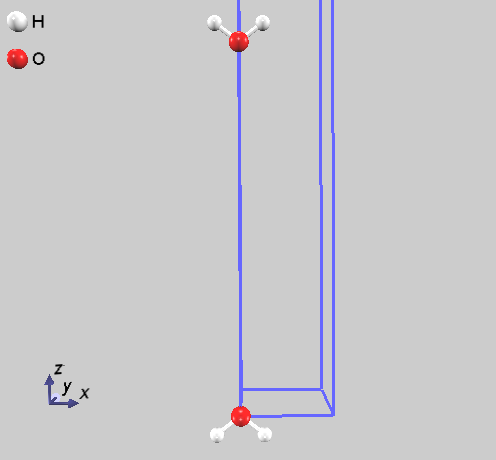

 H\ :sub:`2`\ O分子を互い違いに配置した系。

3.  のように水分子を互い違いに配置した系を用意することによって、双極子モーメントを打ち消すことが可能です。したがって、3.の計算によって得られた全エネルギーの半分の値は、2.  の計算と結果が一致するはずです。ここでは、このような結果が得られるかどうかを確認します。

計算された全エネルギーの結果は、以下に示します。

+----------+----------------------------+----------------------------+
|          | 全エネルギー (hartree/     | 参照値との差               |
|          | H\ :sub:`2`\ O)            | (hartree/H\ :sub:`2`\ O)   |
+==========+============================+============================+
| 1.の計算 | -17.1855148193             | －1.8927504×10\ :sup:`-3`  |
+----------+----------------------------+----------------------------+
| 2.の計算 | -17.1836307637             | 8.6948×10\ :sup:`-6`       |
+----------+----------------------------+----------------------------+
| 3.の計算 | -17.1836220689             | 0                          |
+----------+----------------------------+----------------------------+

表から明らかなように、ESM法による計算と3.
の計算の結果は非常に近く、“無限の系の計算”がESM法によって実現できていることがわかります。

電場を印加した計算例

ESM法を利用すると、\ *c*\ 軸方向に電場を印加した計算を実施することが可能です。ここでは、簡単な例によってその利用方法を説明します。この例題の入力ファイルは :code:`samples/surface/esm/Al111` 以下にあります。

採用した系は、仕事関数の計算例でも利用したAl(111)の系です。以下のような設定によってESMを利用します。

.. code-block:: text

 accuracy{
   esm{
     sw_esm = on
     bc = pe1
     electric_field = 0.001
   }
 }

電場を印加するには、パラメータbcとしてpe1を指定する必要がある点に注意してください。また、電場の影響をみるために局所ポテンシャルを出力するので、仕事関数に関する設定も有効にしてあります。

.. code-block:: text

 postprocessing{
   workfunc{
     sw_workfunc = on
   }
 }

電場の大きさは、-0.001, 0, +0.001（単位は原子単位）と変化させて計算を行いました（0のケースは通常の計算とほぼ同じです）。最後に、この系には反転対称性がありますが、電場を印加すると反転対称性は損なわれるのでsw_inversionパラメータは指定していません。

以上の設定のもと、通常通りPHASEを実行します。各ケース計算が終了したら、workfuncプログラムを利用してポスト処理を実施します。この処理の結果得られる局所ポテンシャルの、電場を印加する場合としない場合の差と表面に垂直な軸方向の距離の関係を :numref:`advanced_esm_Al11_lpot` に示します。この図においては、距離のちょうど半分の地点が系の境、すなわち :numref:`advanced_esm_Al11_lpot` の±\ *c*/2の地点になっています。

.. figure:: images/image155.svg
 :name: advanced_esm_Al11_lpot

 ローカルポテンシャルの差分と表面に垂直な距離との関係。

図から明らかなように、電場を印加することによって真空領域の局所ポテンシャルにかたむきが発生しています。また、金属域においてはフラットとなっています。これは、電場は真空域で発生し、金属中では発生していないことを表わしています。

.. _使用における注意点-2:

使用における注意点
~~~~~~~~~~~~~~~~~~~~

-  ESM法を利用する場合、コンパイルの際にフーリエ変換ライブラリーとしてFFTWを利用する必要があります。

-  原子配置の指定においては、反転対称の位置の原子は直接指定するようにし、weightパラメータはつねに1としてください。

-  電場を印加する場合\ *c*\ 軸方向の対称性はあったとしても損なわれるので、そのような対称性は無効にするようにしてください。また、sw_inversionパラメータをonにはしないでください。

.. _参考文献-5:

.. only:: not latex

 **参考文献**

.. [Otani06] M\. Otani and O. Sugino, “First-principles calculations of charged surfaces and interfaces: A plane-wave nonrepeated slab approach”, Physical Review B **73**, 115407 (2006).
.. [Hamada09] Hamada, M. Otani, O. Sugino and Y. Morikawa, “Green’s function method for elimination of the spurious multipole interaction in the surface/interface slab model”, Physical Review B **80**, 165411 (2009).

ライセンス
~~~~~~~~~~~~~~~~~~~~

PHASEのESM機能は、EsmPackライブラリーを通じて実現されています。EsmPackライブラリーは、産業技術総合研究所からMITライセンスで公開されている、ESM法を実現するための汎用のライブラリーです。以下のライセンス条項をご理解いただいた上でご利用ください。また、本機能を利用して論文発表などを行う場合、必ず文献 [Otani06]_ [Hamada09]_ を参考文献に含めてください。

.. code-block:: text

  Copyright (c) 2012, Minoru Otani <minoru.otani@aist.go.jp>
  Permission is hereby granted, free of charge, to any person
  obtaining a copy of this software and associated documentation
  files (the "Software"), to deal in the Software without restriction,
  including without limitation the rights to use, copy, modify, merge,
  publish, distribute, sublicense, and/or sell copies of the Software,
  and to permit persons to whom the Software is furnished to do so,
  subject to the following
  conditions:
  The above copyright notice and this permission notice shall be
  included in all copies or substantial portions of the Software.
  THE SOFTWARE IS PROVIDED "AS IS", WITHOUT WARRANTY OF ANY KIND,
  EXPRESS OR IMPLIED, INCLUDING BUT NOT LIMITED TO THE WARRANTIES
  OF MERCHANTABILITY, FITNESS FOR A PARTICULAR PURPOSE AND
  NONINFRINGEMENT. IN NO EVENT SHALL THE AUTHORS OR COPYRIGHT
  HOLDERS BE LIABLE FOR ANY CLAIM, DAMAGES OR OTHER LIABILITY,
  WHETHER IN AN ACTION OF CONTRACT, TORT OR OTHERWISE, ARISING FROM,
  OUT OF OR IN CONNECTION WITH THE SOFTWARE OR THE USE OR OTHER
  DEALINGS IN THE SOFTWARE.

.. _advanced_dipole_section:

Dipole補正
-------------

Dipole補正機能とは、系が荷電状態の場合にその影響を打ち消すdipoleを配置することによって補正し、正しい全エネルギーを求めたり、電場を印加した計算を行うことができる機能です。Dipoleの大きさはセルフコンシステントに決まるので、ユーザーが適切なdipoleの大きさを勘案する必要はありません。また、原子間力計算においても考慮されるので、構造最適化に利用することも可能となっています。

.. _入力パラメーターファイルの書き方-1:

入力パラメーターファイルの書き方
~~~~~~~~~~~~~~~~~~~~~~~~~~~~~~~~~

Dipole補正機能を有効にするには、入力パラメーターファイルのcontrolブロックにおいて以下のような記述を行います。

.. code-block::

   control{
       sw_dipole_correction = on
   }

この指定によって、dipole補正機能が有効になります。さらに、accuracyのdipoleブロックにおいて、dipole補正機能の詳細設定を行います。

.. code-block::

 accuracy{
   …
   …
   dipole_correction{
     direction = 3
     amix = 1
     vacuum{
       rz = -0.5
     }
     elec_field{
       ez = 0.0
     }
   }
 }

dipole_correctionの下のvacuumブロックでdipoleを配置する位置を、elec_fieldブロックで外部電場を設定することができます。dipole_correctionブロックにおいて利用できるパラメーターは次の表に示す通りです。

+----------------+----------------------------------------------------+
| パラメーター名 | 説明                                               |
+================+====================================================+
| direction      | 双極子の向きを指定します。1が\ *a*\ 軸方向         |
|                | 、2が\ *b*\ 軸方向、3が\ *c*\ 軸方向に対応します。 |
+----------------+----------------------------------------------------+
| amix           | 双極子のミクシングパラメーターです。0よりも大      |
|                | きく、1以下の値を指定します。デフォルト値は1です。 |
+----------------+----------------------------------------------------+
| vacuum         | 双極子位置を指定するブロックです。双極子           |
|                | の位置は、単位胞の長さを1とする単位で指定します。  |
+----------------+----------------------------------------------------+
| rx             | 双極子の、\ *a*\ 軸方向の位置です。direction =     |
|                | 1の場合に設定します。双極子は、真空に配置します。  |
+----------------+----------------------------------------------------+
| ry             | 双極子の、\ *b*\ 軸方向の位置です。direction =     |
|                | 2の場合に設定します。双極子は、真空に配置します。  |
+----------------+----------------------------------------------------+
| rz             | 双極子の、\ *c*\ 軸方向の位置です。direction =     |
|                | 3の場合に設定します。双極子は、真空に配置します。  |
+----------------+----------------------------------------------------+
| elec_field     | 印加したい外部電場を指定するブロックです。         |
+----------------+----------------------------------------------------+
| ex             | 電場の、\ *a*\ 軸方向の値です。direction =         |
|                | 1の場合に設定します。                              |
+----------------+----------------------------------------------------+
| ey             | 電場の、\ *b*\ 軸方向の値です。direction =         |
|                | 2の場合に設定します。                              |
+----------------+----------------------------------------------------+
| ez             | 電場の、\ *c*\ 軸方向の値です。direction =         |
|                | 3の場合に設定します。                              |
+----------------+----------------------------------------------------+

Dipoleの位置の指定方法には制限があるので、注意して指定する必要があります。双極子の向きを\ *z*\ 方向とすると、「rz+0.5の位置に系の中心が位置するように」、そして「周期境界条件は考慮せずに」指定します。たとえば、 :numref:`advanced_dipole_schematic` のように単位胞の中心に系を置く場合、rz = 0とします。周期境界条件下ではrz = 1としてもよさそうですが、このような指定は不正となります。

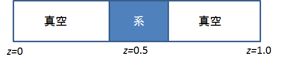

 Dipole補正を有効にする表面系の模式図

また、dipole補正機能と直接は関係ありませんが、下記のような設定を行うことによって局所ポテンシャルを出力することができます。この設定を施した上で仕事関数を求める際の手続きを踏むことによって、真空層の方向と局所ポテンシャルの関係を解析することが可能です。

.. code-block:: text

 postprocessing{
   workfunc{
     sw_workfunc = on
   }
 }

ログファイルの見方
~~~~~~~~~~~~~~~~~~~

Dipole補正を有効にした状態で計算を実行すると、outputxxxファイルに以下のようにdipoleの履歴がSCFステップごとに出力されます。

.. code-block:: text

 Dipole: rmin,rmax,idir = -0.50000000 0.50000000 3
 Dipole: Total = -0.22795296 = -0.5795 Debye = -1.9326x10^-30 Cm
 Dipole: Ion = -38.10003241
 Dipole: Elec = -37.87207945
 Dipole: mix dipole and field with amix_dip= 1.00000000
 Dipole: (NOW) dipole,field = -0.00776990 0.00000000
 Dipole: (OLD) dipole,field = -0.00776992 0.00000000
 Dipole: (NEW) dipole,field = -0.00776990 0.00000000
 Dipole: Edip(ion),Eext(ion)= 0.01230 0.00000
 Dipole: potential jump (dip and ext)= -0.09764 0.00000

Dipole: Totalで報告されている値はdipoleの大きさそのものです。Dipole:
(NOW), Dipole (OLD), Dipole
(NEW)で報告されている値はそれぞれ現ステップのdipoleの値、1ステップ前のdipoleの値、ミクシングの結果得られたdipole値に相当しますが、SCFに足しこめるポテンシャルになるよう体積などで規格化された量となっているため値の大きさはDipole:
Totalのそれと異なります。

.. _計算例-7:

計算例
~~~~~~~~

Dipole補正を利用した計算例として、ESMと同様水分子の例と電場を印加した計算例を挙げます。

.. _水分子-2:

水分子

ESM :numref:`advanced_section_esm` の例 と同じセッティングで、Dipole補正を利用した全エネルギー計算を行ってみました。
入力データは :code:`samples/surface/dipole/H2O` 以下にあります。

この例において、Dipoleは以下のように設定しています。

.. code-block:: text

 control{
   sw_dipole = on
 }
 accuracy{
   …
   dipole_correction{
     amix = 1
     direction = 3
     vacuum{
       rz = -0.5
     }
   }
 }
 …

単位胞の一番下に水分子を配置しているので、vacuumブロックの変数rzの値は-0.5となっています。

結果は次の表に示す通りです（水分子の配向を少し変えたので、ESMの例と全く同じではありません）。

表 5‑34 水分子の結果の比較

============== ========== ========== =========== ==========
\              補正なし   補正あり   esm         ref
============== ========== ========== =========== ==========
エネルギー(ha) -17.201981 -17.201719 -17.2017015 -17.201773
差 (ha)        -0.000208  0.000054   0.000072    ―
============== ========== ========== =========== ==========

ESMの場合と同様、補正しない場合と比較してより参照値に近いエネルギーを得ることができました。

\ :numref:`advanced_dipole_vac_lpot` に、\ *c*\ 軸方向と局所ポテンシャルの関係を補正なし、補正あり、ESM法の場合についてプロットしました。この図においては、\ *c*\ 軸が0および16Å近辺の位置に水分子が配置されています。補正なしの場合、真空層においても局所ポテンシャルが傾きを持っています。これは、周期的に並んだ水分子がクーロン相互作用によって相互作用していることを意味しています。他方、Dipole補正の場合とESM法の場合は真空のちょうど中心において局所ポテンシャルに飛びが現れています。両手法の場合水分子はお互いに相互作用を持たず、その影響を真空層の中心あたりで吸収していることを意味しています。

.. figure:: images/image157.svg
 :name: advanced_dipole_vac_lpot

 真空層と局所ポテンシャルの関係

電場を印加した計算

やはりESM :numref:`advanced_section_esm` の例と同じセッティングで、Dipole補正機能を利用して電場を印加した計算を行ってみました。入力データは :code:`samples/surface/dipole/Al` 以下にあります。
その設定は、以下のようになっています。

.. code-block:: text

 control{
   sw_dipole = on
 }
 accuracy{
   …
   dipole_correction{
     amix = 1
     direction = 3
     vacuum{
       rz = -0.5
     }
     electric_field{
       ez = 0.001
     }
   }
 }
 …
 postprocessing{
   workfunc{
     sw_workfunc = on
   }
 }

以上の設定で、通常通りPHASEを実行し、終了後workfuncプログラムを利用してポスト処理を実施します。この処理の結果得られる局所ポテンシャルの、電場を印加する場合としない場合の差と表面に垂直な軸方向の距離の関係を
\ :numref:`advanced_dipole_Alpot` に示します。

.. figure:: images/image158.svg
 :name: advanced_dipole_Alpot

 ローカルポテンシャルの差分と表面に垂直な距離との関係。

ESMの場合と同様、ポテンシャルの差分は、真空域においては傾きがあり、金属中においてはフラットになりました。これは金属中では電位差が発生していないことを表しており、基本的な電磁気学の知見と合う結果となっています。

.. _advanced_pbesol_section:

PBEsol汎関数（バージョン2019.02以降）
-------------------------------------

概要
~~~~~

PBE汎関数は格子定数を過大評価する傾向にあり、バンド構造やフォノン振動数の実験結果との乖離をまねく場合があります。PBEsol汎関数 [Perdew08]_ は、PBE汎関数を結晶向けに最適化した汎関数で、格子定数が実験値に近くなり、バンド構造が改善することが知られています。

PBEsol汎関数では、交換エネルギー及び相関エネルギーは、それぞれ

 .. math:: E_{x}^{\rm PBEsol} \left[n\right] = \int d\mathbf{r}e_{x}^{\rm unif} \left(n\left(\mathbf{r}\right)\right) F_x^{\rm PBEsol} \left(s\left(\mathbf{r}\right)\right), \\ s = \frac{\left|\nabla n\right|}{2k_F n}, k_F = \left(3\pi^2 n\right)^{1/3} \\ F_x^{\rm PBEsol} \left(s\right) = 1+\mu s^2
   :label: advanced_pbesol_eq1

及び

 .. math:: E_c^{\rm PBEsol} \left[n\right] = \int d\mathbf{r} n\left(\mathbf{r}\right) \left\{ e_c^{\rm unif} \left(n\left(\mathbf{r}\right)\right) + \beta t^2 \right\}, \\ t = \frac{\left|\nabla \right|}{2k_{TF}n}, k_{TF} = \sqrt{\frac{4k_F}{\pi}}
   :label: advanced_pbesol_eq2

で与えられます。ここで、 :math:`\mu=10 /81` 及び :math:`\beta=0.046` です。

入力
~~~~~~~

xctypeとして pbesol を指定します。擬ポテンシャルは通常の PBE
のものを使用することができます。

.. code-block:: text

 accuracy{
   xctype = pbesol
 }

擬ポテンシャルは通常のPBEのものを利用してください。

出力
~~~~~~~

標準出力 (output000) に、以下のような表示がされます。

.. code-block:: text

 !PP xctype = pbesol ps_xctype0 = ggapbe

この例では、読み込んだ擬ポテンシャルは PBEであるが、計算は PBEsol
で行うことを意味しています。これ以外に、PBEsol特有の出力はありません。

計算例
~~~~~~~

\ :code:`samples/pbesol` ディレクトリー以下のサブディレクトリーに、transition metal dichalcogenide
(TMDC)の計算の入力ファイルが置かれています。この中には、PBEのほかPBEsolを使う例があります。例題で得られる格子定数を次の表に掲載します。単位はÅです。

Table 5‑1 TMDCの格子定数。単位はÅ.

====== ============== ============== ============== ==============
\      MoS\ :sub:`2`  MoSe\ :sub:`2` WS\ :sub:`2`   WSe\ :sub:`2`
====== ============== ============== ============== ==============
PBE    3.196 (+0.035) 3.374 (+0.089) 3.189 (+0.036) 3.339 (+0.051)
PBEsol 3.149 (-0.012) 3.293 (+0.008) 3.146 (-0.007) 3.289 (+0.001)
実測値 3.161          3.285          3.153          3.288
====== ============== ============== ============== ==============

おおむねPBEsolの方が実測値に近い結果が得られることが確認できました。

.. only:: not latex

 **参考文献**

.. [Perdew08] J.P. Perdew et al, Phys. Rev. Lett. 100 (2008) 136406.

.. _advanced_metagga_section:

meta-gga（バージョン2019.02以降）
----------------------------------

概要
~~~~~~

modified Becke Johnson
交換ポテンシャルは、以下の式で与えられます [Tran09]_ [Koller12]_

 .. math:: v_{x, \sigma}^{\rm mBJ} \left(\mathbf{r}\right) = c v_{x, \sigma}^{\rm BR}\left(\mathbf{r}\right)+\left(3c-2\right) \frac{1}{\pi}\sqrt{\frac{5}{6}}\sqrt{\frac{t_{\sigma}\left(\mathbf{r}\right)}{\rho_{\sigma} \left(\mathbf{r}\right)}}, \\ c = \alpha + \beta \sqrt{g}, \\ g = \frac{1}{V_{\rm cell}} \frac{1}{2} \int_{\rm cell} d\mathbf{r}' \left(\frac{\left|\rho_{\uparrow}\left(\mathbf{r}'\right)\right|}{\rho_{\uparrow}\left(\mathbf{r}'\right)} + \frac{\left|\rho_{\downarrow}\left(\mathbf{r}'\right)\right|}{\rho_{\downarrow} \left(\mathbf{r}'\right)} \right)
   :label: advanced_metagga_eq1

ここで、 :math:`\rho_{\sigma} \left(\mathbf{r}\right)` 及び :math:`t_{\sigma} \left(\mathbf{r}\right)` は、それぞれ座標における電子密度、及び運動エネルギー密度で、

 .. math:: \rho_{\sigma} \left(\mathbf{r}\right) = \sum_{nk}^{\rm occ} \left|\psi_{nk\sigma} \left(\mathbf{r}\right)\right|^2, \\ t_{\sigma} = \frac{1}{2} \sum_{nk}^{\rm occ} \left| \nabla \psi_{nk\sigma} \right|^2
   :label: advanced_metagga_eq2

により定義されます。また、 :math:`\alpha=-0.012` ,  :math:`\beta=1.023` は定数です。

なお、上記で登場したは、

 .. math:: v_{x, \sigma}^{\rm BR} \left( \mathbf{r}\right) = - \frac{1}{b_{\sigma} \left(\mathbf{r}\right)} \left[ 1-e^{-x_{\sigma}\left(\mathbf{r}\right)} - \frac{1}{2} x_{\sigma} \left(\mathbf{r}\right) e^{-x_{\sigma}\left(\mathbf{r}\right)a} \right], \\ b_{\sigma} = \frac{x_{\sigma}\left(\mathbf{r}\right)}{2\pi^{1/3}} \left(\frac{e^{-x_{\sigma}\left(\mathbf{r}\right)}}{\rho_{\sigma}\left(\mathbf{r}\right)}\right)^{1/3}
   :label: advanced_metagga_eq3

で定義されます。ここで、 :math:`x_{\sigma}` は以下の非線形方程式の解です。

 .. math:: \frac{x_{\sigma}e^{-2x_{\sigma}/3}}{x_{\sigma}-2} = \frac{2}{3} \pi^{2/3} \frac{\rho_{\sigma}^{5/3}}{Q_{\sigma}}, \\ Q_{\sigma} = \frac{1}{6} \left( \Delta \rho_{\sigma} - 2 D_{\sigma}\right), \\ D_{\sigma} = 2t_{\sigma} - \frac{1}{4} \frac{\left| \nabla \rho_{\sigma}\right|^2}{\rho_{\sigma}}
   :label: advanced_metagga_eq4

なお、 :eq:`advanced_metagga_eq4` の解は数値的に解いても得られますが、計算速度の観点から
Proynovら [Proynov08]_ の近似解を使用します。

入力
~~~~~

SCF 計算

modified Becke Johnson 交換ポテンシャルを利用するには、

.. code-block:: text

 accuracy{
   xctype = "tb09"
 }

と記入します。 :eq:`advanced_metagga_eq1` のc値はSCF計算で決定しますが、ある値に固定したい場合には、以下のようにします。

.. code-block:: text

 accuracy{
   xctype = "tb09"
   metagga{
     val_c_tb09 = 1.20d0
   }
 }

電荷密度と運動エネルギー密度を同時に混合するには、sw_mix_charge_with_ekindens = onとします。
デフォルト値は off です。

.. code-block:: text

 Charge_mixing{
   sw_mix_charge_with_ekindens = on
   mixing_methods{
     !#tag no method rmxs rmxe itr var prec istr nbmix update
           1 pulay 0.40 0.40 40 * on 3 20 RENEW
   }
 }

バンド計算

通常の計算と同様に、condition = fixed_charge を指定します。

.. code-block:: text

 control{
   condition = fixed_charge
 }

ここで、電荷密度及び運動エネルギー密度は、ファイルから読み込む必要があるので、両ファイル名を file_names.data に指定します。

.. code-block:: text

 &fnames
 F_CHGT = '../scf/nfchgt.data'
 F_EKINDENS = '../scf/ekindens_bin.data'
 /

k点、xctype、収束条件の指定は SCF計算と同様です。

出力
~~~~~~~

バンド固有値は、通常のDFT計算と同じく、F_ENERG
(デフォルトファイル名：nfenergy.data )
に出力されます。なお、運動エネルギー密度は、電荷密度F_CHGTと同様に、バイナリ―形式で
F_EKINDENS ( デフォルトファイル名：ekindens_bin.data )に出力されます。

計算例
~~~~~~~

Meta-ggaを活用した計算例が :code:`samples/meta_gga` 以下のサブディレクトリーに置かれています。ここでは、SiとGeの計算例を紹介します。

Siの計算結果

.. table:: mBJ交換相互作用の計算結果 ( Si, diamond )

 ========== =============== ==============
 xctype     a [Å]           gap [eV]
 ========== =============== ==============
 PBEsol     5.445           0.582
 TB09       同上            1.149
 \
 cf. 実験値 5.431\ :sup:`a` 1.17\ :sup:`b`
 ========== =============== ==============

a) ref. [Atdaev87]_ , b) ref. [Tran09]_

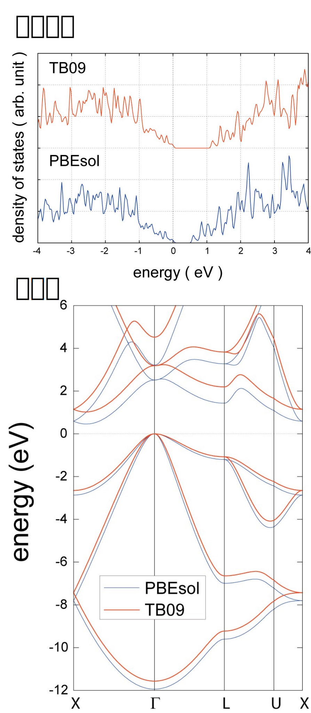

 mBJ交換相互作用による状態密度及びバンド分散 ( Si, diamond )

Geの計算結果

.. table:: mBJ交換相互作用の計算結果 ( Ge, diamond )

 ======================= ================ ==============
 xctype                  a [Å]            gap [eV]
 ======================= ================ ==============
 PBEsol                  5.733            0.000
 TB09                    同上             0.496
 TB09 (格子定数：実験値) 5.6512           0.638
 \
 cf. 実験値              5.6512\ :sup:`a` 0.74\ :sup:`b`
 ======================= ================ ==============

a) ref.  [Oadri83]_ , b) ref. [Tran09]_

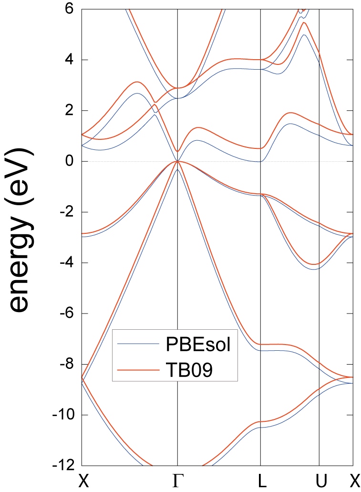

 mBJ交換相互作用によるバンド分散 ( Ge, diamond )

.. _参考文献-6:

.. only:: not latex

 **参考文献**

.. [Tran09] F\. Tran and P. Blaha, Phys. Rev. Lett. **102** (2009) 226401, and references therein.
.. [Koller12] D\. Koller, F. Tran, and P. Blaha, Phys. Rev. B **85** (2012) 155109, and references therein.
.. [Proynov08] E\. Proynov, Z. Gan, and J. Kong, Chem. Phys. Lett. **455** (2008) 103.
.. [Atdaev87] B\. S. Atdaev, V. F. Grin, E. A. Salkov, and V. G. Chalaya, Inorg.  Mater. **23** (1987) 1835.
.. [Oadri83] S\. B. Oadri, E. F. Skelton, A. W. Webb, J. Appl. Phys. **64** (1983) 3609.

.. _advanced_libxc_section:

Libxcライブラリー(バージョン2023.01以降)
-----------------------------------------

概要
~~~~~~
PHASE/0は多くの汎関数に対応した交換相関項ライブラリーであるLibxc ( [Lehtola18]_ , URL https://www.tddft.org/programs/libxc/ )に対応しています。
PHASE/0をLibxcにリンクし、実行する方法を説明します。

コンパイルする方法
~~~~~~~~~~~~~~~~~~~~~~
まずはLibxcをビルドする必要があります。先にあげたウエブサイトからダウンロードすることができますが、環境によってはうまくダウンロードできないようです。その場合 GitHub のページ ( https://github.com/ElectronicStructureLibrary/libxc )から取得することもできるようです。本計算機能はLibxcのバージョン5.1.7を用いて検証を行ったので、このバージョンを利用することが推奨されます。ダウンロードしたら以下の要領でコンパイル/インストールします。

.. code-block:: bash

 tar -zxvf libxc-5.1.7.tar.gz
 cd libxc-5.1.7
 autoreconf -i
 ./configure --prefix=LIBXC FC=FORTRAN_COMPILER
 make
 make install

:code:`LIBXC` はLibxcライブラリーのインストールディレクトリーです。 :code:`FORTRAN_COMPILER` にはお使いのFortranコンパイラーを指定します。デフォルト値はgfortranなので、gfortranを用いる場合は指定する必要はありません。うまくいけば :code:`LIBXC` の下にLibxcがインストールされます。

つぎにPHASE/0のMakefileの以下の箇所に手を加えます。

.. code-block:: make

 LIBXC=
 ifdef LIBXC
   LIBXC_PATH=
   LIBXC_INC=-I$(LIBXC_PATH)/include
   LIBXC_LIB=-L$(LIBXC_PATH)/lib -lxcf03 -lxc
   CPPFLAGS += -DLIBXC
   F90FLAGS += $(LIBXC_INC)
   F77FLAGS += $(LIBXC_INC)
   LIBS += $(LIBXC_LIB)
 endif

:code:`LIBXC=` のあとに何らかの文字列(たとえばyes)を入力し、さらに :code:`LIBXC_PATH` のあとにLibxcのインストールディレクトリーを指定します。PHASE/0がすでにコンパイルされた状態の場合以下の要領で関連するソースファイルのタイムスタンプを更新し、makeします。

.. code-block:: bash

  grep -l LIBXC *.F90|xargs touch
  make

以上の手続きによってLibxcを組み込んだ状態のPHASE/0のバイナリーを得ることができます。

入力パラメータ
~~~~~~~~~~~~~~~
Libxcで定義されている交換相関ポテンシャルを用いるには入力パラメーターファイルに以下のような記述を行います。

.. code-block:: text

 accuracy{
   xctype = libxc
   libxc{
       exch_id = 116,     corr_id = 133
 或いは
       exch_name = GGA_X_PBE_SOL,   corr_name = GGA_C_PBE_SOL
   }
 }

まず、xctype として libxc を指定します。次に、libxc ブロックで、交換相互作用を exch_id もしくは exch_name で指定します。同様に、相関相互作用を corr_id 或いは corr_name で指定します。用いることのできるid あるいは name は、 https://tddft.org/programs/libxc/functionals/ を参照してください。上記の例では、交換・相関相互作用にPBEsol を指定しています。

出力
~~~~~~~~~~~~~~~
実行すると、output000ファイルにLibxcのバージョンおよび交換相関相互作用の名称が出力されるので、意図したポテンシャルを用いているかどうか確認することができます。

.. code-block:: text

 !** Libxc version  5. 1. 7
   exchange  : gga_x_pbe_sol
   correlation : gga_c_pbe_sol

例題
~~~~~~~~~~~~~~~~
例題の入力ファイルはPHASE/0のサンプルディレクトリーの下のlibxc以下にあります。 :code:`samples/libxc/Si_2atom` には2原子からなるSi結晶の例題が、 :code:`samples/libxc/Si6AlP_8atomSi6AlP_8atom` には8原子からなるSi結晶の内2つの原子をAlおよびPに置換した例題が配置されています。後者の場合は構造最適化も行う設定が施されています。各々さらに汎関数ごとにディレクトリーが準備されています。得られる結果は次の表に報告する通り。

.. csv-table:: 2原子からなるSi結晶の計算結果

   "交換相関相互作用","iter_total","エネルギー (Hartree)","バンドギャップ (eV)"
   "LDAPW91 (LDA)","12","-7.8646521308","0.667"
   "PBEsol (GGA)","12","-7.8611951084","0.687"
   "M06-L (meta-GGA)","55","-7.8508524741","1.256"
   "TPSS (meta-GGA)","12","-7.8667488111","0.975"
   "SCAN (meta-GGA)","13","-7.8810471789","1.092"

.. csv-table:: 8原子からなるSi結晶のうち2原子をAl, Pで置換した系の計算結果

   "交換相関相互作用","iter_total","エネルギー (Hartree)","バンドギャップ (eV)"
   "PBEsol (GGA)","58","-32.2319042482","0.402"
   "M06-L (meta-GGA)","105","-32.1962355376","0.930"
   "TPSS (meta-GGA)","61","-32.2619120889","0.680"
   "SCAN (meta-GGA)","59","-32.3154777459","0.747"

制限事項
~~~~~~~~~~~~~~~~
本計算機能に関する制限事項を次の表に示します。

.. csv-table:: Libxcに関する制限事項

   "汎関数の種類","SCF計算","内部座標最適化", "格子最適化", "PAW", "擬ポテンシャル"
   "LDA", "対応", "対応", "対応", "対応", "制限なし"
   "GGA", "対応", "対応", "対応", "対応", "制限なし"
   "meta-GGA", "対応", "対応（例外あり）", "非対応", "非対応", "ノルム保存型のみ"

LDA, GGAに関しては特段の制限はありません。

meta-GGAは、ノルム保存型擬ポテンシャルのみに対応しており、ウルトラソフト型擬ポテンシャルは利用できません。
また、ストレス計算に対応しておらず、格子の最適化が出来ません。
さらに、一部のmeta-GGAは力の計算に対応しておらず、その場合は内部座標最適化を実行できません（例：TB09）。
詳細はLibxcのドキュメント、ならびに各汎関数の原著論文を参照してご確認ください、

**参考文献**

.. [Lehtola18] Susi Lehtola, Conrad Steigemann, Micael J.T. Oliveira, and Miguel A.L. Marques, SoftwareX, **7** (2018) 1-5.

.. _advanced_opencore_section:

Open core法（バージョン2020.01以降）
--------------------------------------

.. _概要-6:

概要
~~~~~~

通常、擬ポテンシャル法では閉殻系である内殻電子のスピン分極は考慮しません。Opencore法 [Miyake14]_ では、内殻電子が閉殻系の場合にこのスピン分極を取り入れた計算を行います。ただし、価電子ではないためその電荷密度やスピン分極は固定します。この効果は、PCCがある場合の交換相互作用や、PAWの交換相互作用項を通じて取り入れられます。f電子をもつ磁性材料の計算でしばしば用いられる手法です。

計算理論
~~~~~~~~~

通常、PCCが無い場合スピン分極がある系の交換相関相互作用ポテンシャルは

 .. math:: V_{\rm XC} \left(\rho_{\rm V}^{\uparrow} \rho_{\rm V}^{\downarrow}\right)
   :label: advanced_opencore_eq1

のように、アップ及びダウンスピンの価電子密度 (それぞれ :math:`\rho_{\rm V}^{\uparrow}` 及び :math:`\rho_{\rm V}^{\downarrow}` の関数として扱われます。また、PCCがある場合には、

 .. math:: V_{\rm XC} \left( \rho_{\rm V}^{\uparrow} + \rho_{\rm PC}, \rho_{\rm V}^{\downarrow} + \rho_{\rm PC} \right)
   :label: advanced_opencore_eq2

のように、(スピンによらない)Parital
Coreの密度 :math:`\rho_{\rm PC}` を、価電子スピン密度に加えて処理されています。これに対し、opencore法は :math:`\rho_{\rm PC}` がスピンに依存しても良い方法ですが、スピン依存擬ポテンシャルを作る必要があります。その詳細についてはCIAOのマニュアルをご覧ください。

.. _入力パラメーター-1:

入力パラメーター
~~~~~~~~~~~~~~~~~~

opencore 機能を使用するには、

.. code-block:: text

 accuracy{
   sw_opencore = on
 }

と記入します。計算自体は通常のPHASE/0の計算と同様に実行してください。

.. _例題-4:

例題
~~~~~

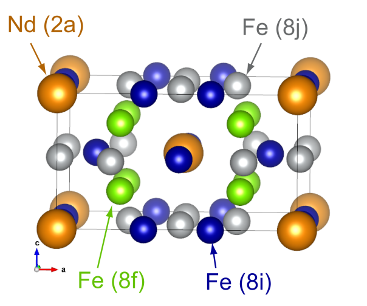

 立方晶NdFe\ :sub:`12`\ の結晶構造

立方晶NdFe\ :sub:`12` を例に
opencoreの検証を行いました。格子定数及び内部座標は文献値を使用しました。計算条件は以下のとおりです。対応する入出力ファイルは :code:`samples/opencore` 以下のサブディレクトリーにあります。

.. table:: NdFe\ :sub:`12`\ の構造パラメータ( 文献 [Fukazawa17]_ )

 =========== ==========================
 格子定数[Å]
 =========== ==========================
 a           8.533
 c           4.681
 内部座標
 Nd (2a)     ( 0.0000, 0.0000, 0.0000 )
 Fe (8f)     ( 0.2500, 0.2500, 0.2500 )
 Fe (8i)     ( 0.3594, 0.0000, 0.0000 )
 Fe (8j)     ( 0.2676, 0.5000, 0.0000 )
 =========== ==========================

.. table:: NdFe\ :sub:`12`\ の計算条件

 ======================= ======================================
 波動関数カットオフ [Ry] 25
 ======================= ======================================
 電荷密度カットオフ [Ry] 225
 k点サンプリング         Monk (6×6×6)
 交換相関相互作用        paw = on
 擬ポテンシャル          (オリジナル)Nd_ggapbe_paw_01.pp,
                         (新) Nd_ggapbe_paw_015_4f_core.gncpp2,
                         Fe_ggapbe_paw_02.pp
 ======================= ======================================

オリジナルの擬ポテンシャルはNd4f電子を価電子として含みます。同擬ポテンシャルを結晶に適用する場合、4f電子間の強いクーロン斥力を考慮するために、DFT+U法を用いることが多いです。ここでは、U\ :sub:`eff`\ の値として
0 と 6 eVの2ケースについて SCF計算を行いました。

一方、新しい擬ポテンシャルでは、4f電子をコアとして扱っています。opencoreあり・なしの2ケースについて
SCF計算を行いました。

\ :numref:`advanced_opencore_table1` に各サイトの磁気モーメントを示します。オリジナルの擬ポテンシャルで
U\ :sub:`eff` = 6
eVとした結果と、新しい擬ポテンシャルの計算結果が近いことが分かります。特に、opencore法の場合には、U\ :sub:`eff`\ =6
eVと極めて近い結果が得られています。

\ :numref:`advanced_opencore_table2` にSCFまでのiteration
数を示します。新しい擬ポテンシャルを用いた計算では、4f電子を含まない分、早く収束することが分かります。

.. table:: NdFe\ :sub:`12`\ の計算条件
 :name: advanced_opencore_table1

 +-------------+-------------+-------------+-------------+-------------+
 | 擬ポ        | オリジナル, | オリジナル, | 新,         | 新,         |
 | テンシャル  |             |             |             |             |
 |             |             |             | o\          | o\          |
 | 及び備考    | U :sub:`eff`| U :sub:`eff`| pencoreなし | pencoreあり |
 |             | = 0 eV      | = 6 eV      |             |             |
 +=============+=============+=============+=============+=============+
 | Nd (2a)     | -0.243      | -3.502      | ※-3.391     | ※-3.499     |
 +-------------+-------------+-------------+-------------+-------------+
 | Fe (8f)     | 1.898       | 1.905       | 1.888       | 1.903       |
 +-------------+-------------+-------------+-------------+-------------+
 | Fe (8i)     | 2.603       | 2.599       | 2.595       | 2.602       |
 +-------------+-------------+-------------+-------------+-------------+
 | Fe (8j)     | 2.381       | 2.405       | 2.386       | 2.396       |
 +-------------+-------------+-------------+-------------+-------------+

※4f電子のスピン -3を加えた値

.. table:: NdFe\ :sub:`12`\ の計算における SCFまでに要する iteration 数
 :name: advanced_opencore_table2

 +-------------+-------------+-------------+-------------+-------------+
 | 擬ポ        | オリジナル, | オリジナル, | 新,         | 新,         |
 | テンシャル  |             |             |             |             |
 |             |             |             | o\          | o\          |
 | 及び備考    | U :sub:`eff`| U :sub:`eff`| pencoreなし | pencoreあり |
 |             | = 0 eV      | = 6 eV      |             |             |
 +=============+=============+=============+=============+=============+
 | iteration   | 223         | 69          | 33          | 34          |
 | 数          |             |             |             |             |
 +-------------+-------------+-------------+-------------+-------------+

.. _参考文献-7:

.. only:: not latex

 **参考文献**

.. [Miyake14] T\. Miyake, K. Terakura, Y. Harashima, H. Kino, and S. Ishibashi, J. Phys. Soc. Jpn. **83** (2014) 043702.
.. [Fukazawa17] T\. Fukazawa, H. Akai, Y. Harashima, and T. Miyake, J. Appl. Phys.  **12** (2017) 053901.

.. _advanced_noncollinear_section:

ノンコリニア系の計算、スピン軌道相互作用計算
---------------------------------------------

ノンコリニア系の計算
~~~~~~~~~~~~~~~~~~~~~~~

.. _機能の概要-22:

機能の概要
^^^^^^^^^^

通常の計算では、局所的な磁気モーメントの大きさは、アップ・ダウンスピン電子密度の差で表現され、その向きについては規定されません。向きまで表現するためには、1つの波動関数がアップ及びダウンスピン成分をもつようにする、すなわち2成分スピノールで表す必要があります。

.. math::
 \begin{pmatrix}
 \psi_{nk}^{\uparrow} \\
 \psi_{nk}^{\downarrow}
 \end{pmatrix}
 =
 \begin{pmatrix}
 \psi_{nk}^{\uparrow} \left(G=0\right) \\
 \vdots \\
 \vdots \\
 \psi_{nk}^{\uparrow} \left(G=G_{\rm max}\right) \\
 \psi_{nk}^{\downarrow} \left(G=0\right) \\
 \vdots \\
 \vdots \\
 \psi_{nk}^{\downarrow} \left(G=G_{\rm max}\right) \\
 \end{pmatrix}

これに対応して電荷密度は

.. math:: n^{\alpha\beta} \left(\mathbf{r}\right) = \sum_{nk} f_{nk} \left< \psi_{nk}^\alpha | \mathbf{r} \right>\left<\mathbf{r}|\psi_{nk}^\beta\right>

のように、スピン指標に関して2x2行列となります。また、局所的な電荷密度及び磁気モーメントは、

.. math::

 n_{\rm tot} &= {\rm Tr}\left[n\left(\mathbf{r}\right)\right] = n^{\alpha\alpha} + n^{\beta\beta} \\
 m_x \left(\mathbf{r}\right) &= n^{\alpha\beta}\left(\mathbf{r}\right) + n^{\beta\alpha}\left(\mathbf{r}\right) \\
 m_y \left(\mathbf{r}\right) &= i\left[-n^{\alpha\beta}\left(\mathbf{r}\right) + n^{\beta\alpha}\left(\mathbf{r}\right)\right] \\
 m_z \left(\mathbf{r}\right) &= n^{\alpha\beta}\left(\mathbf{r}\right) - n^{\beta\alpha}\left(\mathbf{r}\right)

となります。

.. _入力パラメータ-17:

入力パラメータ
^^^^^^^^^^^^^^^^

ノンコリニア系の計算、すなわち2成分スピノールでの計算を行うには、structureブロックに
“magnetic_state = noncollinear “
と記します。また、各原子種の局所磁気モーメントの方向の初期値を、”mdx mdy
mdz” に指定します。特に指定しない場合は、z
方向を向くと判断します。局所磁気モーメントの方向の初期値は、”theta phi”
(単位：degree) でも指定可能です。

.. code-block:: text

 structure{
   ...
   magnetic_state = noncollinear
   element_list{
     #units atomic_mass
     #tag element atomicnumber zeta deviation mdx mdy mdz
           O 　 8 0.166666 1.5 0.0 0.0 1.0
   }
   ...
 }

.. _計算結果の出力-11:

計算結果の出力
^^^^^^^^^^^^^^^^

標準出力には、以下のような磁気モーメントに関する情報が出力されます。
Tot, Mx, My, Mzは、それぞれ、局所的な電荷密度及び磁気モーメントを単位胞内で足し合わせた値です。
これ以外は通常の計算による出力と共通です。

.. code-block:: text

 !OLD Chg ** Tot: 40.00000000 Mx: 0.00073742 My: 0.00000000 Mz: 16.17742289
 !NEW Chg ** Tot: 40.00000000 Mx: 0.00075559 My: 0.00000000 Mz:

スピン軌道相互作用計算
~~~~~~~~~~~~~~~~~~~~~~~

.. _機能の概要-23:

機能の概要
^^^^^^^^^^^^^

2成分スピノールが重要になるのは、スピン軌道相互作用を考慮する場合です。スピン軌道相互作用は、

で表されます。ここで、は原子核周りの球対称なポテンシャルです。このHamiltonianは、波動関数のアップ及びダウンスピン成分の間に相互作用を働かせるため、5.8.1
で説明した2成分スピノールが必要になります。

.. _入力パラメータ-18:

入力パラメータ
^^^^^^^^^^^^^^^

スピン軌道相互作用を利用するには、accuracyブロック内のspin_orbitブロックに
“mode = pawpot “
と記します。これ以外は、ノンコリニア系の計算と同様です。

.. code-block:: text

 accuracy{
   …
   spinorbit{
     mode = pawpot
   }
   …
 }

.. _計算結果の出力-12:

計算結果の出力
^^^^^^^^^^^^^^^^

スピン軌道相互作用によるエネルギーは、標準出力にESpinOrb_old, new
で表示されます。

なお、これらの値は、コンパイル時にCPPFLAGに -DUSE_ESPINORB
をつけた場合にのみ計算されます。

.. code-block:: text

  TOTAL ENERGY FOR 53 -TH ITER= -41.454944288742 edel = -0.170628D-08 : SOLVER = SUBMAT + RMM3
  KI= 13.204535394898 HA= 32.283599969986 XC= -6.801519951682 LO=
  NL= 7.597059454569 EW= 5.402894293900 PC= 0.000000000000 EN=
  PHYSICALLY CORRECT ENERGY = -41.454944288742
  EOHXC_PAW= -0.4786729 HA_PAW= 0.0218350
  XC_PAW_AE= -15.6619733 XC_PAW_PS= -5.6000049
  !XC_PAW_AE-XC_PAW_PS= -10.0619684
  ESpinOrb_old= -0.0000308 ESpinOrb_now= -0.0000293

.. _section_advanced_spin_orbit_from_postproc:

スピン軌道相互作用の事後処理による取り込み（バージョン2022.01以降）
^^^^^^^^^^^^^^^^^^^^^^^^^^^^^^^^^^^^^^^^^^^^^^^^^^^^^^^^^^^^^^^^^^^^
コリニア計算の事後処理としてスピン軌道相互作用を取り込むことができます。この処理はコリニア計算の入力ファイルにスピン軌道相互作用の設定を施すことによって実現することができます。
また、入力パラメーターファイルに以下の設定を施すことによって事後処理的にスピン軌道相互作用を取り込んで得られた波動関数を出力させることができます。

.. code-block:: text

 control{
     sw_write_zaj_socsv = on
 }

この指定によって ``zaj_socsv.data`` ファイルが生成されます。ファイルの書式は、ノンコリニア計算時の ``zaj.data`` と共通なので、ノンコリニア計算で ``initial_wavefunctions = file`` として読み込むことができます。
このような使い方をすることによってノンコリニア計算の収束性が向上する場合があります。

計算例：O\ :sub:`2`\ 分子、Pt\ :sub:`2`\ 分子
^^^^^^^^^^^^^^^^^^^^^^^^^^^^^^^^^^^^^^^^^^^^^^^^

計算例は、 :code:`samples/spin_orbit` 以下のサブディレクトリーにあります。これらの例では、分子をx軸方向に配置し、磁気モーメントの向き(
theta )による全エネルギーの違いを計算します。

.. figure:: images/image226.svg
 :name: advanced_noncol_fig1

 スピン軌道相互作用計算の計算例の分子配置

O\ :sub:`2`\ 分子

-  :code:`samples/spin_orbit/O2/Theta_0`

-  :code:`samples/spin_orbit/O2/Theta_90`

前者の方が、1原子あたり 0.108 meV 安定です。

Pt\ :sub:`2`\ 分子

-  :code:`samples/spin_orbit/Pt2/Theta_0`

-  :code:`samples/spin_orbit/Pt2/Theta_90`

後者の方が、1原子あたり 17.215 meV 安定です。

Si 結晶のバンド
^^^^^^^^^^^^^^^^^

スピン軌道相互作用を考慮したバンド計算は、通常のコリニア計算と同じ手順で行います。まず、scf
計算を行い (phase)、得られた電荷密度のもとでバンド計算 (ekcal)
を行います。

例として、Si diamond
結晶のバンド計算を示します。scf及びband計算ともに、以下のキーワードを用います
( :code:`samples/spin_orbit/Si_band/soc_on` フォルダ参照 )。

.. code-block:: text

  accuracy{
    paw = on
    spinorbit{
      mode = pawpot
    }
  }
  structure{
    magnetic_state = noncollinear
  }

\ :numref:`advanced_noncol_fig2` 左図は上記入力により得られたバンド構造で、右図はスピン軌道相互作用を考慮しないバンド構造です。スピン軌道相互作用によりgamma
点の縮退が解けていることが分かります。

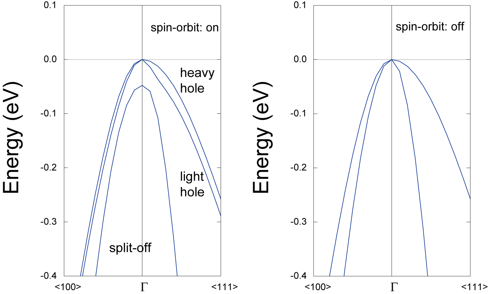

 スピン軌道相互作用を考慮したバンド構造（左）としないバンド構造（右）

計算例：2H-MoS\ :sub:`2`
^^^^^^^^^^^^^^^^^^^^^^^^^^^^^^^^^^^^^^^^^^^^^^^^
2H-MoS\ :sub:`2` のバンド計算をスピン軌道相互作用を考慮して行います。サンプルの入力ファイルは ``samples/spin_orbit/MoS2`` 以下のサブディレクトリーに配置されています。
その計算条件は下記の通り。

.. csv-table:: 2H-MoS2の計算条件

 "平面波カットオフ [Ry]","30"
 "電荷密度カットオフ [Ry]","270"
 "k 点サンプリング","構造最適化, SCF計算: monk (4×4×1) バンド計算: 55 点"
 "交換相関相互作用","PAW, PBEsol"
 "SCF 収束条件 [Ha/atom]","1.0E-8"
 "力の収束条件 [Hartree/Bohr]","2.0E-4"
 "擬ポテンシャル","Mo_ggapbe_paw_us_02.pp  S_ggapbe_paw_us_01.pp"
 "（自動最適化後の）格子定数","a = 3.173 Å、c = 12.396 Å"

スピン軌道相互作用はノンコリニア計算を行って取り入れる方法とコリニア計算の事後処理として取り入れる方法の二種類の方法によって考慮しました。

格子及び内部座標の最適化後、SCF 計算を行い、最後にバンド計算を行いました。スピン軌道相互作用をコリニア計算の事後処理で取り入れた場合のK点におけるVBM以下の2準位のエネルギー差は、スピン軌道相互作用を考慮したノンコリニア計算と同程度でした。

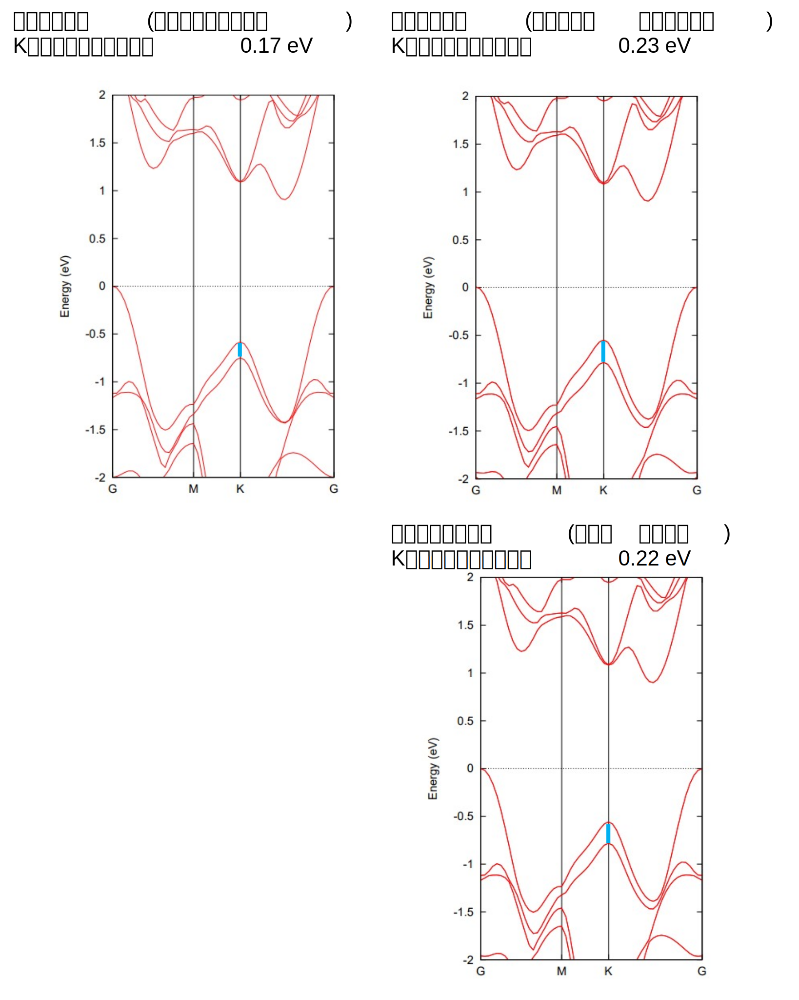

 2H-MoS2 のバンド構造

.. _使用上の注意-4:

使用上の注意
^^^^^^^^^^^^^^

-  スピン軌道相互作用を用いてエネルギー比較を行う場合、対称操作をEのみにされることをお勧めします。

-  smearing においてmethod = parabolic のみが使用可能です。

.. _advanced_tddft_section:

実時間処理型の時間依存密度汎関数理論（RTTDDFT）による光学スペクトル計算
-------------------------------------------------------------------------

.. _機能の概要-21:

機能の概要
~~~~~~~~~~~~

実時間TDDFT法に基づいて、次式の時間依存一電子方程式を解くことにより、与えられた初期一電子波動関数に対する電子ダイナミクス・シミュレーションを行う。\

.. math:: i\hbar \frac{\partial}{\partial t} \phi_n^{\mathbf{k}} \left( \mathbf{r},t\right) = H\left(t\right) \phi_n^{\mathbf{k}} \left( \mathbf{r},t\right)

波数ベクトル\ **k**\ とバンド番号\ **n**\ を指標とする一電子波動関数を\ :math:`\phi_{n}^{\mathbf{k}}`\ で、\ :math:`\phi_{n}^{k}`\ :math:`\phi_{n}^{k}`\ 有効ハミルトニアンを\ **H**\ で表す。時間依存一電子方程式の形式的解から、一電子波動関数の時間発展は以下のように表される。

.. math:: \phi_n^{\mathbf{k}}\left(\mathbf{r},t+\Delta t\right) = \exp \left(-\frac{i}{\hbar} \int_t^{t+\Delta t} dt' H\left(t'\right)\right) \phi_n^{\mathbf{k}} \left(\mathbf{r},t\right)

右辺の時間発展演算子は、時間積分部および指数関数部に対して近似を施して数値計算され、それぞれ様々な近似方法が提案されている。時間積分部は時間間隔∆\ *t*\ が十分に小さければ次式のように近似できる。

.. math:: \phi_n^{\mathbf{k}} \left(\mathbf{r}, t+\Delta t\right) \cong \exp \left( -\frac{i}{\hbar} \Delta t H\left(t\right) \right) \phi_n^{\mathbf{k}} \left(\mathbf{r},t\right)

さらに、指数関数部に対する近似としてテイラー展開法が使用される。

.. math:: \phi_n^{\mathbf{k}} \left(\mathbf{r}, t+\Delta t\right) = \sum_{N=0}^{\infty} \frac{1}{N!} \left(-\frac{i}{\hbar} \delta t H\left(t\right) \right)^N

この近似法の場合、時間間隔∆tと展開最大次数\ *N*\ :sub:`max`\ が主要な入力パラメータであり、計算精度と実行時間の兼ね合いを考慮して最適値を設定する必要がある。

原理的には、各時間においてヘルマン・ファインマン力を計算し、その値に従って原子位置のダイナミクスを実行することも可能である。（ただし、本プログラムには実装されておらず、原子位置は固定した状態で電子ダイナミクス計算を行う。）

時間t=0\ :sup:`-`\ の初期一電子波動関数は、プログラムPHASEによって求められる基底状態の一電子波動関数を用いて作成するため、本機能実行前にDFT法による基底状態の計算を終えている必要がある。本プログラムでは、基底状態一電子波動関数φ\ :sub:`n`\ **k**
(**r**,
t=0\ :sup:`-`)を以下のように位相シフトさせることができる。

.. math:: \phi\left(\mathbf{r},t=0^+ \right) = e^{-i\varepsilon \mathbf{q} \cdot \mathbf{r}} \phi_n^{\mathbf{k}} \left(\mathbf{r}, t=0^- \right)

これは時間t=0\ :sup:`+`\ においてパルス電場を系に与えることに相当する。各時刻において双極子モーメント\ **d**\ (t)または電流密度\ **J**\ (t)を計算し、電子ダイナミクス・シミュレーション終了後に、これらの値を時間の関数から振動数へとフーリエ変換することによって、実験と直接比較可能な双極子強度・光吸収スペクトルなどの光学物性値が求められる。

.. _入力パラメータ-15:

入力パラメータ
~~~~~~~~~~~~~~~

以下の入力タグの例は、初期状態として「x方向へ大きさ0.01原子単位のデルタ関数型パルス電場」を系に与え、「時間刻み0.1原子単位時間/時間ステップで1,000時間ステップ（全シミュレーション時間100原子単位時間）」のRT-TDDFT計算を実行する場合です。ただし、DFT法による基底状態の計算が収束している場合のみRT-TDDFT計算が実行されます。

.. code-block:: text

  postprocessing{
    rttddft{
      sw_rttddft = on
      time_step_delta = 0.1
      time_step_max = 1000
      ext_pulse_epsilon = 0.01
      ext_pulse_kx = 1.0
      ext_pulse_ky = 0.0
      ext_pulse_kz = 0.0
    }
  }

.. table::
 :widths: auto
 :class: longtable

 +-----------------+---------------------+----------------------------+
 | パラメータ      | デフォルト値        | 説明                       |
 +=================+=====================+============================+
 | sw_rttddft      | OFF                 | ON　：　                   |
 |                 |                     | RTTDDFT計算処理を実行する  |
 |                 |                     |                            |
 |                 |                     | OFF　：　                  |
 |                 |                     | RTTDDFT計算処理を行わない  |
 +-----------------+---------------------+----------------------------+
 | time_step_delta | 0.1（原子単位時間） | 時間更新刻み               |
 |                 |                     |                            |
 |                 |                     | 全シミュレー               |
 |                 |                     | ション時間は、time_step_d  |
 |                 |                     | elta×time_step_maxとなる。 |
 |                 |                     |                            |
 |                 |                     | 経験的には0.05～0.1原      |
 |                 |                     | 子単位時間の値が推奨される |
 |                 |                     |                            |
 |                 |                     | （                         |
 |                 |                     | 1原子単位時間はおよそ0.024 |
 |                 |                     | fs）                       |
 |                 |                     |                            |
 |                 |                     | 大きなtime_step_del        |
 |                 |                     | taを設定した場合には異常値 |
 |                 |                     | が出力されることがあり、そ |
 |                 |                     | の場合は値をより小さく設定 |
 |                 |                     | して再計算する必要がある。 |
 +-----------------+---------------------+----------------------------+
 | time_step_max   | 100（回）           | 計算処理を                 |
 |                 |                     | 終了するまでの時間更新回数 |
 |                 |                     |                            |
 |                 |                     | ［計算途中にジョブを正     |
 |                 |                     | 常終了させることはできない |
 |                 |                     | （nfstop機能は使用不可）］ |
 +-----------------+---------------------+----------------------------+

初期状態生成［デルタ関数型パルス電場\ :math:`\mathbf{E}(t) = E_{0}\mathbf{e}\delta(t)`
］に関するパラメータ

================= ============ ==============================
パラメータ        デフォルト値 説明
================= ============ ==============================
ext_pulse_epsilon 0.0d0        電場の大きさ\ :math:`E_{0}`
ext_pulse_kx      0.0d0        電場の向き\ :math:`\mathbf{e}`
ext_pulse_ky      0.0d0        電場の向き\ :math:`\mathbf{e}`
ext_pulse_kz      0.0d0        電場の向き\ :math:`\mathbf{e}`
================= ============ ==============================

.. _計算の実行方法-5:

計算の実行方法
~~~~~~~~~~~~~~~~

まずは、通常の SCF 計算を行います。この際は、sw_rttddft パラメータは off に設定しておきます。通常のSCF 計算が終了したら、sw_rttddft パラメータを on とし、さらに必要に応じて rttddft ブロックの各種パラメータを編集し、control ブロックの下の condition パラメータを continuation に設定します。このような設定を施したら、通常通り PHASE の計算を実行するとTDDFT 計算が実行されます。途中で終了した RT-TDDFT 計算は、初期電場の設定（ext_pulse_epsilon, ext_pulse_kx, ext_pulse_ky, ext_pulse_kz）をすべて 0 とし、condition=continuation としたままで PHASE を実行すれば行うことができます。

.. _計算結果-6:

計算結果
~~~~~~~~~~~~~~~~

計算結果は、ログファイルに記録されます。以下のように、双極子モーメントと電流密度が原子単位で記録されます。

.. code-block:: text

 # time_step= 991 time= 0.9910E+02 au = 0.2397E+01 fs
 ...
 P= 0.0285381798 0.0002058360 0.0001702915
 J= -0.0133497494 0.0000068680 -0.0000030064

P=のあとの 3 つの数値が双極子モーメントの x, y, z 成分、J=のあとの 3
つの数値が電流密度の x, y, z 成分です。

計算終了後、時間空間から周波数空間にフーリエ変換することによってスペクトルをエネルギーの関数として得ることが可能です。このフーリエ変換を実行するプログラムのソースコードがsrc_spectrum
の下にある spectrum.f90 です。このプログラム自体は、標準的な Fortran90
コンパイラーによってコンパイルすることが可能です。その利用方法は、以下の通りです（作業ディレクトリーとして、ft
というディレクトリーを作成して実行する例）。
まず、以下のようにディレクトリーft
を作成し、そのディレクトリーの下に電流密度の履歴を抽出した
j.dataというファイルを作成します。

.. code-block:: bash

 % mkdir ft
 % cd ft
 % grep ”J=” ../output001 > j.data

j.data ファイルに、次のように 1 行目に time_step_delta と
ext_pulse_epsilon を加え、さらに time_step_maxの値を 2 行目に加えます。

.. code-block:: bash

 0.1 0.01
 1001
 J= -0.2999128661 0.0000002015 -0.0000008972
 J= -0.2970981909 -0.0000022160 -0.0000000155
 …
 …

このファイルを作成したら、spectrum.f90
をコンパイルしたバイナリー（たとえば a.out）を実行します。結果

としては、以下のファイルが得られます。

============== =========================================================
出力ファイル名 説明
============== =========================================================
j.out          電流密度と時間の関係、Jx(t) Jy(t) Jz(t)
p.out          誘起された双極子モーメントと時間の関係、Px(t) Py(t) Pz(t)
pw.out         フーリエ変換された双極子モーメント、Re[Px(w)] Im[Px(w)]
abs.out        双極子モーメント強度のスペクトル
============== =========================================================

.. _例題-5:

例題
~~~~~~~~~~~~~~~~

例として、ベンゼン分子（ :numref:`advanced_tddft_c6h6` ）のRT-TDDFT計算例を紹介します。この例題の入力ファイルは :code:`samples/tddft/rt_benzene` 以下にあります。

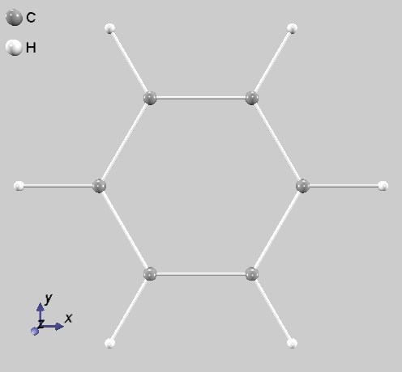

 ベンゼン分子の原子配置

計算は、まずはSCF計算を実行し、ついでRT-TDDFTを有効にした継続計算を実行しました。RT-TDDFTのステップ数は11,000とし、時間刻みは0.1
au (約0.0024
fs)としました。さらに、得られた結果を5.5.1.4で説明した手続きによってフーリエ変換しました。得られる吸収スペクトル(abs.outの結果)は :numref:`advanced_tddft_c6h6_spectrum` で示す通りです。

.. figure:: images/image214.svg
 :name: advanced_tddft_c6h6_spectrum

 本例題によって得られる吸収スペクトル

最初のピークが、約6.8 eVに表れています。通常のSCF計算によって得られるHOMO-LUMOギャップは約5.1 eVですが、この値よりも大きな値が吸収端として得られており、もっともらしい結果と考えられます。

.. _使用上の注意-3:

使用上の注意
~~~~~~~~~~~~~~~~

-  ノルム保存型擬ポテンシャルを使用してください。ウルトラソフト型擬ポテンシャルには対応していません。

-  分子の重心がユニットセル中心に位置するように原子座標を設定し、分子が充分な真空領域に囲まれたユニットセルサイズを設定して下さい。（分子がセル境界をまたいで存在する場合には、双極子モーメントが正しく計算されません。）

-  ksampling{ }タグ内で「base_reduction_for_GAMMA =
   off」と「base_symmetrization_for_GAMMA = off」を明示して下さい。

-  symmetry{ }タグ内で「method = manual」と「sw_inversion =
   off」を明示して下さい。

-  バルク系の計算には対応していません。
