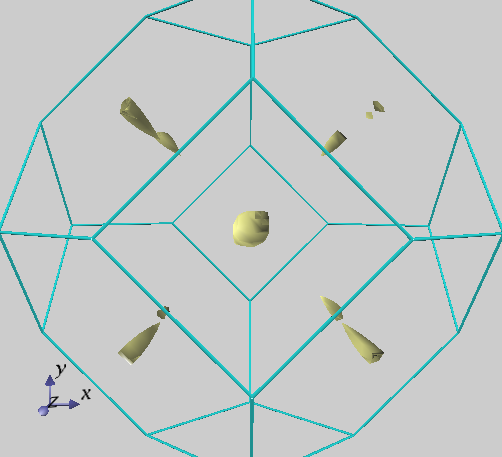

.. _analysis_chapter:

解析機能
=========

.. _section_partial_charge:

部分電荷密度
---------------

部分電荷密度を計算するにはタグPostprocessingの中のタグchargeで指定します。タグchargeの中の変数sw_charge_rspaceとタグpartial_chargeの中の変数sw_partial_chargeをOnにします。

.. code-block:: text

  Postprocessing{
    charge{
      sw_charge_rspace = on
      partial_charge {
        sw_partial_charge = on
        Erange_min = -0.45 eV
        Erange_max = 0.45 eV
        Erange_delta = 0.05 eV
        partial_charge_filetype=separate !{individual,separate | integrated}
      }
    }
  }

変数Erange_minとErange_maxにエネルギー領域の最大値と最小値を入力します。エネルギーは金属の場合フェルミレベルから測り、絶縁体の場合は価電子帯上端のエネルギーから測ります。変数Erange_deltaに入力した値の間隔のエネルギー窓を先のエネルギー領域に作成します。

出力ファイルoutput000には以下の様にエネルギー窓に関する出力があります（”!pc”で始まる行）。

.. code-block:: text

  !pc nEwindows =   20, nvb_windows =   10, ncb_windows =   10 <<m_ESoc_set_nEwindows_pc>>
  !pc    iw  if_elec_state                erange(hartree)                        erange(eV)
  !pc              (asis)                  (shifted)             (shifted)
  !pc     1       1       ( 0.094537  0.096374 ) ( -0.018375 -0.016537 ) ( -0.500000 -0.450000 )
  !pc     2       1       ( 0.096374  0.098211 ) ( -0.016537 -0.014700 ) ( -0.450000 -0.400000 )
  !pc     3       1       ( 0.098211  0.100049 ) ( -0.014700 -0.012862 ) ( -0.400000 -0.350000 )
  !pc     4       1       ( 0.100049  0.101886 ) ( -0.012862 -0.011025 ) ( -0.350000 -0.300000 )
  !pc     5       0       ( 0.101886  0.103724 ) ( -0.011025 -0.009187 ) ( -0.300000 -0.250000 )
  !pc     6       1       ( 0.103724  0.105561 ) ( -0.009187 -0.007350 ) ( -0.250000 -0.200000 )
  !pc     7       1       ( 0.105561  0.107399 ) ( -0.007350 -0.005512 ) ( -0.200000 -0.150000 )
  !pc     8       0       ( 0.107399  0.109236 ) ( -0.005512 -0.003675 ) ( -0.150000 -0.100000 )
  !pc     9       0       ( 0.109236  0.111074 ) ( -0.003675 -0.001837 ) ( -0.100000 -0.050000 )
  !pc    10       1       ( 0.111074  0.112911 ) ( -0.001837  0.000000 ) ( -0.050000  0.000000 )
  !pc    11       1       ( 0.112911  0.114749 ) (  0.000000  0.001837 ) (  0.000000  0.050000 )
  !pc    12       0       ( 0.114749  0.116586 ) (  0.001837  0.003675 ) (  0.050000  0.100000 )
  !pc    13       0       ( 0.116586  0.118424 ) (  0.003675  0.005512 ) (  0.100000  0.150000 )
  !pc    14       0       ( 0.118424  0.120261 ) (  0.005512  0.007350 ) (  0.150000  0.200000 )
  !pc    15       0       ( 0.120261  0.122099 ) (  0.007350  0.009187 ) (  0.200000  0.250000 )
  !pc    16       1       ( 0.122099  0.123936 ) (  0.009187  0.011025 ) (  0.250000  0.300000 )
  !pc    17       1       ( 0.123936  0.125773 ) (  0.011025  0.012862 ) (  0.300000  0.350000 )
  !pc    18       0       ( 0.125773  0.127611 ) (  0.012862  0.014700 ) (  0.350000  0.400000 )
  !pc    19       0       ( 0.127611  0.129448 ) (  0.014700  0.016537 ) (  0.400000  0.450000 )
  !pc    20       0       ( 0.129448  0.131286 ) (  0.016537  0.018375 ) (  0.450000  0.500000 )

nEwindowsはエネルギー窓の総数です。nvb_windowsとncb_windowsはそれぞれ価電子状態と伝導電子状態を含むエネルギー窓の数です。この設定例では、Erange_min= -0.45 eV、Erange_max = 0.45 eV、Erange_delta = 0.05 eVなので、エネルギー窓の数は18個になるはずですが、実際には低エネルギー側および高エネルギー側にそれぞれErange_delta幅の袖領域を設けて出力するのでエネルギー窓の総数が20個になっていることに、ご注意下さい。iwはエネルギー窓の番号です。if_elec_stateはそのエネルギー窓に電子状態があるかどうかを示しています。この値が0の時は電子状態がなく、1の時には電子状態が存在します。列asisには原子単位でエネルギー窓の範囲が示されています。二つの列shiftedにはエネルギーの基準から測ったときのエネルギー窓の範囲が原子単位とeV単位で示されています。

変数partial_charge_filetypeにindividualまたはseparateを指定すると、各エネルギー窓ごとに計算された電荷密度が番号付けされたファイルに出力されます。
その際の名前の付け方は、スピン分極がない場合であれば、F_CHR = nfchr.cubeに対してnfchr.00xx.cube（xxには上の表のiwの値が入る）というようになります。スピン分極がある場合には、F_CHR = nfchr.cubeに対して、nfchr.up.00xx.cube、nfchr.down.00xx.cubeの二種類のファイルが生成されます。上の表でif_elec_stateが0になっているのは、その範囲に固有値がある状態がないことを示しています。その場合、cubeファイルは生成されません。

integratedを選択すると各電荷密度がひとつのファイルに追記され、各電荷密度データの先頭にはPARTIALCHARGEが記述され、終わりにはENDが記述されます。

BaO/Si(001)界面の部分電荷密度を計算した結果を :numref:`advanced_BaO_image3` に示します。

.. figure:: images/image11.svg
 :name: advanced_BaO_image3

 BaO/Si(001)界面構造の部分電荷密度。(a)BaO/Si(001)界面構造のモデル図。(b)フェルミレベル直下(固有エネルギーが-0.05eVから0.0eVまで)の電子状態の部分電荷密度。(c)フェルミレベル直上(固有エネルギーが0.0eVから0.05eVまで)の電子状態の部分電荷密度。電子密度は\ :math:`\mathbf{1} \times \mathbf{10}^{- \mathbf{5}}`\ から\ :math:`\mathbf{1} \times \mathbf{10}^{- \mathbf{3}}`\ までが示されています。青い部分には電子が少なく、赤い分部には電子が多くなっています。

-  応用例：STM像の解析

部分電荷密度出力機能を利用すると、STM像を模擬することが可能です。解析したいバイアスポテンシャルに対応したエネルギーウィンドウの部分電荷密度を、表面からある程度離れた平面に投影した像が計算上のSTM像です。以下、サンプルデータ( :code:`samples/stm_by_pcharge` 以下)を利用して計算方法を具体的に説明します。

サンプルは、Si の(001)面に相当するデータです。通常のPHASE入力に、以下のように部分電荷密度出力の設定を加えています。

.. code-block:: text

  postprocessing{
    charge{
      sw_charge_rspace = on
      filetype = cube
      partial_charge{
        sw_partial_charge = on
        partial_charge_filetype = individual
        Erange_min = 0 eV
        Erange_max = 0 eV
        Erange_delta = 1 eV
      }
    }
  }

このように設定することによって、フェルミエネルギーからみて-1 eV から0 eVまでのデータと0 eV から1 eVのエネルギーウィンドウの部分電荷密度が出力されます。それぞれ、-1 V（占有状態）および1 V（非占有状態）のバイアスポテンシャルに対応したSTM像が得られます。この入力データを利用して計算を実施すると、nfchr.0001.cube (-1 eV から0 eV の電荷密度データファイル) とnfchr.0002.cube (0 eV から1 eV の電荷密度データファイル) が作成されます。それぞれ、表面から5 Å程度離れた地点でのコンター図を占有状態について :numref:`advanced_STM_image1` (a)に、非占有状態について :numref:`advanced_STM_image1` (b)に示します。

 Si (100)面のSTM像、(a) 占有状態の像、(b)非占有状態の像。

.. _section_stm:

STM像
---------------

概要
~~~~~
前節において部分電荷密度出力機能を用いてSTM像を可視化する方法を説明しました。前節の方法は、表面からある程度離れた位置では波動関数の精度が足りず、きれいな像が得られない場合があります。この問題は"STM"というPHASE/0とは異なるプログラムを用いることによって解決することができます。STMプログラムは、波動関数をPHASE/0から得られるポテンシャルをもとに一次元のSchrödinger方程式を用いて解きなおすことによって真空域でも精度の高い波動関数を得ることができるプログラムです。STMプログラムがもたらす波動関数によって得られる部分電荷密度から、表面から離れた地点においてもきれいなSTM像を得ることができるようになります。

計算理論
~~~~~~~~~~
STMプログラムは、対象物の表面から少し離れた位置から真空層の中心までの領域で一次元の Schrödinger 方程式を解きます。具体的には以下のような方程式を解きます [Kageshima91]_ , [Kageshima92]_ 

.. math::

   E_{\mu k_{\parallel}} \Psi_{\mu k_{\parallel}} \left( G_{\parallel}, z \right) = \frac{\hbar^2}{2m} \left( k_{\parallel} + G_{\parallel} \right)^2 \Psi_{\mu k_{\parallel}} \left( G_{\parallel}, z \right) - \frac{\hbar^2}{2m} \frac{\partial^2}{\partial z^2} \Psi_{\mu k_{\parallel}} \left( G_{\parallel}, z \right) + \sum_{G^{'}_\parallel} V\left( G_\parallel - G^{'}_\parallel , z \right) \Psi_{\mu k_{\parallel}} \left( G_{\parallel}, z \right) 

このとき表面から少し離れた位置においてPHASE/0 で得た波動関数と一致するという境界条件と真空層の中心において波動関数が0になるという境界条件を課した上で解きます。有効ポテンシャル :math:`V\left( r \right)` はPHASE/0で得られた遮蔽ポテンシャルを用います。ただし、本来の遮蔽ポテンシャルではなく非局所項を取り去ったもの、すなわち局所ポテンシャルのみを使います。

コンパイル方法
~~~~~~~~~~~~~~
STMプログラムはPHASE/0とは別プログラムなので利用するたえにはコンパイルする必要があります。そのソースコードは ``src_stm`` 以下に配置されています。以下の要領でコンパイルしてください。

.. parsed-literal::

  $ cd ~/|PHASE020XX.YY|/src_stm
  $ make COMP=gnu install

``COMP`` にコンパイラーを指定します。 ``gnu`` (GNU Fortranコンパイラー) , ``ifort`` (classic Intel Fortranコンパイラー), ``ifx`` (Intel Fortranコンパイラー), ``AT`` (NEC nfortコンパイラー) ``fugaku`` (Fujitsu Fortranコンパイラー) を用いることができます。コンパイルに成功したら実行可能バイナリーファイル ``stm`` が作成されます。 ``make`` の引数に ``install`` をつけている場合、このファイルはPHASE/0インストールディレクトリーの下の ``bin`` ディレクトリーに移されます。

入力
~~~~~~

PHASE/0の入力
^^^^^^^^^^^^^^^^
STMプログラムを用いるためには、STMプログラムが必要とする情報をPHASE/0に出力させる必要があります。 ``nfinp.data`` ファイルに以下のような記述を行います。

.. code-block:: text

  postprocessing{
    STM{
      sw_stm = ON
    }
  }

この設定を施した状態でPHASE/0 を実行することによりSTMプログラムが必要とするファイル群 (continue_bin_stm.data, nfvlc.data など)が生成されます。また、 ``output000`` ファイルに以下のような出力が得られます。

.. code-block:: text

  !!STM: template input
  2 1
  1 0.1082 0.3247 0.0000 0.2500 0.3750 0.0000 0.5000
  2 0.1082 0.1082 0.0000 0.2500 0.1250 0.0000 0.5000
  48 60.0000000000
  -1.0 0.0
  90
  45 90
  3
  0.10 0.30 100
  0.01

``!!STM: template input`` 以降の行をコピーペーストすることによってSTMプログラムのテンプレート入力ファイルとして用いることができます。このテンプレートファイルは、デフォルトの設定の場合表面に垂直な方向は *c* 軸で、波動関数の接続位置は最表面の原子から3 bohr離れた地点になるような値が採用されます。このふるまいを変更するには、 ``nfinp.data`` ファイルに次の記述を行います。

.. code-block:: text

  postprocessing{
    stm{
      sw_stm = on
      z_axis = 3
      connect_from = 3 bohr
    }
  }

``postprocessing`` ブロックの下のstmブロックの下の ``z_axis`` に表面に垂直な軸の数値を(*a* 軸なら1, *b* 軸なら2,
*c* 軸なら3)、 ``connect_from`` に接続位置の最表面原子からの距離を指定します。 ``z_axis`` のデフォルト値は3, ``connect_from`` のデフォルト値は3 bohrです。

STMプログラムの入出力ファイル
^^^^^^^^^^^^^^^^^^^^^^^^^^^^^^^
STMプログラムの入出力ファイルには次の表に示す９つのものがあります。

+-----------------+------+-----------------+--------+-----------------+
| ファイル指示名  | 番号 | 既定ファイル名  | 入出力 | 内容            |
+=================+======+=================+========+=================+
| F_INP           | 31   | nfstminput.data | 入力   | STM\            |
|                 |      |                 |        | 像のエネルギー\ |
|                 |      |                 |        | 範囲などの指示  |
+-----------------+------+-----------------+--------+-----------------+
| F_CNTN_BIN      | 55   | contin\         | 入力   | 固有値,         |
|                 |      | ue_bin_stm.data |        | 基\             |
|                 |      |                 |        | 底逆格子点の集\ |
|                 |      |                 |        | 合などのデータ  |
+-----------------+------+-----------------+--------+-----------------+
| F_ZAJ           | 44   | zaj.data        | 入力   | 波動関数の\     |
|                 |      |                 |        | 平面波展開係数  |
+-----------------+------+-----------------+--------+-----------------+
| F_VLC           | 45   | nfvlc.data      | 入力   | ポテンシ\       |
|                 |      |                 |        | ャルの局所成分  |
+-----------------+------+-----------------+--------+-----------------+
| F_CHGU          | 60   | nfchgu.cube     | 出力   | Schrödinger\    |
|                 |      |                 |        | 方\             |
|                 |      |                 |        | 程式を解いて得\ |
|                 |      |                 |        | た電子状態密度  |
+-----------------+------+-----------------+--------+-----------------+
| F_CHGD          | 61   | nfchgd.cube     | 出力   | F_CHGU\         |
|                 |      |                 |        | と同様。但し,\  |
|                 |      |                 |        | down spin 状態  |
+-----------------+------+-----------------+--------+-----------------+
| F_CHGU_P        | 46   | n\              | 出力   | 入力\           |
|                 |      | fchgu_asis.cube |        | 波動関数から得\ |
|                 |      |                 |        | た電子状態密度  |
+-----------------+------+-----------------+--------+-----------------+
| F_CHGD_P        | 47   | n\              | 出力   | F_CHGU_P\       |
|                 |      | fchgd_asis.cube |        | と同様。但し,\  |
|                 |      |                 |        | down spin 状態  |
+-----------------+------+-----------------+--------+-----------------+
| file_names.data | 5    | stm\_\          | 入力   | 上の８つのファ\ |
|                 |      | file_names.data |        | イルを指定する\ |
|                 |      |                 |        | ためのファイル  |
+-----------------+------+-----------------+--------+-----------------+

なお、電子状態密度は Gaussian cube
形式で出力されます。

 **stm_file_names.data**

ファイル名を指定するためのファイル。PHASE/0におけるfile_names.dataファイルに相当するファイルです。このファイルが存在しない場合上述のデフォルトファイル名が採用されます。このファイルを利用する場合、以下のように記述します。

.. code-block:: text

  &fnames
  F_INP = './nfstminput.data'
  F_CNTN_BIN = './continue_bin_stm.data'
  F_VLC = './nfvlc.data'
  F_ZAJ = './zaj.data'
  F_CHGU = './nfchgu_occ.cube'
  F_CHGU_P = './nfchgu_p_occ.cube'
  /

F_CNTN_BIN, F_ZAJ, F_VLC はPHASE/0の出力データなので、PHASE/0の指定に合わせる必要があります。デフォルト値はPHASE/0と同じです。

 **F_INP (nfstminput.data)**

このファイルはSTMプログラムの入力ファイルです。典型的には以下のようなものになります。

.. code-block:: text

  4 1 : kv3, nspin
  1 0.0000 -0.1624 -0.3247 0.0000 -0.3750 -0.3750 0.25
  2 0.0000 -0.1624 -0.1082 0.0000 -0.3750 -0.1250 0.25
  3 0.0000 -0.0541 -0.3247 0.0000 -0.1250 -0.3750 0.25
  4 0.0000 -0.0541 -0.1082 0.0000 -0.1250 -0.1250 0.25
  110 42.9043654360 ! neg, zl (=lattice c)
  -3.00 -2.000 ! e1, e2 : Efermi+e1 - Efermi+e2
  90 ! nlpf
  53 90 !izi, izf
  1 ! colomn number of the z-component
  0.10 0.15 100 ! rini, rfin, nfin
  0.01 ! erlmt

１行目の最初の数字は, k 点の個数です。あとの数字はスピンの違いを考慮するかしないかを示す数で、考慮しない場合が 1 する場合が 2 です。2行目から4行目まではｋ点の座標です。全部で 4 × 1 = 4 組の座標があります。さらに最後のカラムにk点座標の重みを指定します。ここではスピンの違いを考慮していないためこうなりましたが、スピンの違いがある場合の記すべき座標の組の個数は１行目に記したｋ点の個数の倍に等しくなります。座標の番号・直交座標系での座標・基本逆格子ベクトル系での座標で一組の座標指定になります。

6行目の ``110 42.9043654360 ! neg, zl (=lattice c)`` の最初の数字はエネルギーバンドの数、あとの数字は表面に垂直方向の結晶格子の長さです。長さはボーア単位です。7行目の2つの数字はエネルギー範囲です。フェルミエネルギーレベルを基準にします。8行目の数字は電荷密度FFTにおける格子点の表面垂直方向の数に関係した数です。反転対称がない系ではｃ軸方向の電荷密度 FFT 格子点の数そのもの, 反転対称がある系ではその半分の数を指定します。9行目の２つの数字は真空領域の Schrödinger 方程式を解く範囲の指定です。電荷密度FFTの格子点でその範囲を指定します。10行目の数は表面垂直方向がどの成分に対応しているかを指示します。表面垂直軸が第1格子ベクトルの方向であれば1、第2格子ベクトルの方向であれば2、第3格子ベクトルの方向であれば3を指定します。11行目, 12行目はSchrödinger 方程式を反復法で解くときに指定する必要がある数値で順に新しい解を混ぜる割合の初期値, 最終値, 反復回数, 収束判定誤差値にそれぞれ対応します。

nfstminput.dataファイルはFFTのメッシュ点数など通常気にしなくてよい数値を指定する必要があり、その作成は煩雑で間違えやすいです。そのため、PHASE/0が出力するテンプレートファイルを利用することが推奨されます。テンプレートファイルをもとに、対象としたいエネルギーレンジ(上の例の場合7行目)や、実行してみて収束しなかった場合に収束に関わるパラメーター(上の例の場合11行目と12行目) を編集します。

STMプログラムの実行
~~~~~~~~~~~~~~~~~~~~~
PHASE/0を実行したディレクトリーにおいて ``nfstminput.data`` ファイルと（既定のファイル名を変更したい場合） ``stm_file_names.data`` ファイルを準備し、実行します。

.. parsed-literal::

  $ ~/|PHASE020XX.YY|/bin/stm
  STM program version 2024.01
  @(#)system=linux
  F_INP =
  ./nfstminput.data
  ...
  ...
  0.13860790D-07 0.85993468D-07
 (  2 ) rmix = 0.10 ||d WF|| (errsum) = 0.3550D+02 ( 0.4077D+05)
 (  3 ) rmix = 0.10 ||d WF|| (errsum) = 0.1716D+02 ( 0.3773D+05)
 (  4 ) rmix = 0.10 ||d WF|| (errsum) = 0.1937D+03 ( 0.7686D+05)
 (  5 ) rmix = 0.10 ||d WF|| (errsum) = 0.1398D+02 ( 0.3682D+05)
 (  6 ) rmix = 0.10 ||d WF|| (errsum) = 0.1692D+02 ( 0.3691D+05)
 (  7 ) rmix = 0.10 ||d WF|| (errsum) = 0.4915D+02 ( 0.4018D+05)
 (  8 ) rmix = 0.10 ||d WF|| (errsum) = 0.8600D+02 ( 0.4573D+05)
 (  9 ) rmix = 0.10 ||d WF|| (errsum) = 0.2747D+02 ( 0.3736D+05)
 ( 10 ) rmix = 0.10 ||d WF|| (errsum) = 0.1368D+02 ( 0.3679D+05)
 ( 11 ) rmix = 0.10 ||d WF|| (errsum) = 0.2098D+02 ( 0.3660D+05)
 ( 12 ) rmix = 0.10 ||d WF|| (errsum) = 0.1242D+02 ( 0.3609D+05)
  ...
  ...
  << cpu time statistics >>
  1 2dFFT_fine 68.72040(sec.)
  2 rd_WFs_doFFT_and_solve_eq_core 17.95710(sec.)
  3 FFT_fine 0.49030(sec.)
  4 m_pwBS_set_FFT_mapfunctions 0.00090(sec.)
  5 m_pwBS_kinetic_energies 0.00010(sec.)

  closed filenumber = 31
  closed filenumber = 55
  closed filenumber = 60
  closed filenumber = 61
  closed filenumber = 44
  closed filenumber = 45
  closed filenumber = 46
  closed filenumber = 47
  closed filenumber = 48

ログにはまずは前処理の結果などが報告されます。繰り返し計算の部分の ``(errsum)=`` に続く数値が収束判定に用いられる数値です。この数値が順調に減少していれば問題なく計算が進行していることになりますが、振動してしまったり、悪い場合はInfinityとなってしまったりしている場合はうまく進行していないので混合パラメーターなどを見直して再度計算を行います。最後にclosed filenumber =から始まる行が続けば計算終了です。

計算結果
~~~~~~~~~
STMプログラムによって得られる主要な結果は ``nfchgu.cube`` と ``nfchgd.cube`` です。前者はアップスピン状態の電荷密度ファイル、後者はダウンスピン状態の電荷密度ファイルですが後者はスピンを考慮していない場合空ファイルとなります。このほか、PHASE/0の結果から読み込んだ波動関数を何も加工せずに部分電荷密度を計算した結果が ``nfchgu_asis.cube`` と ``nfchgd_asis.cube`` に記録されます。

cubeファイルから指定のzの値における二次元的な電荷密度データを抽出しファイルに記録するスクリプトが ``extract_slice.py`` です。 このスクリプトは ``bin`` ディレクトリーの下にあります。オプション ``-h`` もしくは ``--help`` をつけて実行すると簡単なヘルプメッセージが得られます。

.. parsed-literal::

  $ ~/|PHASE020XX.YY|/bin/extract_slice.py -h
  Usage: extract_slice.py [options]

  extract slice data from a cube file

  Options:
    -h, --help            show this help message and exit
    -c CUBE, --cube=CUBE  the target cube file. defaults to nfchr.cube
    -z ZVAL, --zval=ZVAL  the height from which the slice data shall be
                          extracted.
    -a ZAXIS, --zaxis=ZAXIS
                          specify which direction is considered as the z-axis. 1
                          stands for the a-vector,                       2
                          stands for the b-vector, and 3 stands for the
                          c-vector. defaults to 3
    -i ZINDEX, --zindex=ZINDEX
                          
                          shall be extracted.
    -o OUTPUT, --output=OUTPUT
                          the file to which the extracted results are output

用いることができるオプションは次の表に記述する通りです。

.. csv-table:: extract_slice.pyスクリプトのオプション

  "-c CUBE, --cube=CUBE", "対象のcubeファイル。デフォルト値はnfchr.cube."
  "-z ZVAL, --zval=ZVAL", "二次元的な電荷密度データを抽出したいzの値。単位はÅ. デフォルト値はNoneであり、指定がない場合は--zindexによって指定されるいインデックスが用いられる。"
  "-a ZAXIS, --zaxis=ZAXIS", "表面に垂直とみなす軸。1の場合 *a* 軸 2の場合 *b* 軸 3の場合 *c* 軸に対応する。デフォルト値は3."
  "-i ZINDEX, --zindex=ZAXIS", "二次元的な電荷密度データを抽出したいzの値をFFTボックスのインデックスで指定する。--zvalによる指定がある場合は無視される。デフォルト値は0."
  "-o OUTPUT, --output=OUTPUT", "出力先のファイル。デフォルト値はslice.dat"

結果は以下のような形式で出力されます。

.. code-block:: text

  x_1 y_1 c_1_1
  x_1 y_2 c_1_2
  ..
  x_nx y_ny c_nx_ny

  x_2 y_1 c_2_1
  ..

ここで ``x_i`` は ``i`` 番目のx座標、 ``y_j`` は ``j`` 番目のx座標、 ``c_i_j`` は対応する電荷密度の値です。長さの単位はÅです。

計算例
~~~~~~~~~~~~~~~~~~~~~

計算例として、前節でも用いたSiの2x1表面のSTM像の計算を行います。入力ファイルは ``stm/Si_2x1`` 以下にあります。SCF計算の入力が ``stm/Si_2x1/scf`` 以下に、STMプログラムの入力が ``stm/Si_2x1/occ`` と ``stm/Si_2x1/uocc`` 以下にあります。前者には占有状態の入力ファイル、後者には非占有状態の入力ファイルが配置されています。

``stm/Si_2x1/scf`` には原点を中心とした反転対称性がある系のPHASE/0の入力ファイルがおかれています。単位胞としては *a* 軸が14.512 Bohr, *b* 軸が7.256 Bohr, *c* 軸が60 Bohrです。60 Bohrのちょうど半分の30 Bohrの位置が二面ある表面双方から最も遠い点に対応します。 ``Postprocessing`` ブロックにおいて ``stm`` ブロックの下に ``sw_stm = on`` を設定しているためSTMプログラムを利用するために必要なファイルが出力される状態になっています。

``stm/Si_2x1/occ`` と ``stm/Si_2x1/uocc`` に配置されているSTMプログラムの入力は、いずれもPHASE/0が出力したテンプレートから作成したものです。エネルギーレンジの部分のみ変更しており、前者はフェルミエネルギーからみて-1.0 eVから 0.0 eV, 後者はフェルミエネルギーからみて0.0 eVから1.0 eVのSTM像が得られる設定となっています。また、SCF計算0の計算結果は一階層上の下の ``scf`` ディレクトリーに出力されることになるため、 ``stm_file_names.data`` ファイルはそのことを考慮して以下のような内容になっています。

.. code-block:: text

  &fnames
  F_CNTN_BIN = '../scf/continue_bin_stm.data'
  F_ZAJ      = '../scf/zaj.data'
  F_VLC      = '../scf/nfvlc.data'
  /

``stm/Si_2x1/scf`` においてPHASE/0によるSCF計算を行い、さらに ``stm/Si_2x1/occ``, ``stm/Si_2x1/uocc`` においてSTMプログラムを実行すると結果を得ることができます。 ``nfchgu.cube`` がSTMプログラムによって得られた部分電荷密度ファイル、 ``nfchgu_asis.cube`` がPHASE/0から引き継いだ波動関数をそのまま用いて得られた部分電荷密度ファイルです。得られたcubeファイルを用いて表面から5 Å および10 Åの位置におけるSTM像を描画した結果が :numref:`advanced_STM_occ` および :numref:`advanced_STM_uocc` です。前者が占有状態、後者が非占有状態の結果に対応します。

 占有状態のSTM像。(a) PHASE/0の波動関数、最表面から5 Åの位置の像 (b) PHASE/0の波動関数、最表面から10 Åの位置の像 (c) STMプログラムによって解きなおした波動関数、最表面から5 Åの位置の像(b) STMプログラムによって解きなおした波動関数、最表面から10 Åの位置の像

.. figure:: images/stm_uocc.svg
 :name: advanced_STM_uocc

 非占有状態のSTM像。(a) PHASE/0の波動関数、最表面から5 Åの位置の像 (b) PHASE/0の波動関数、最表面から10 Åの位置の像 (c) STMプログラムによって解きなおした波動関数、最表面から5 Åの位置の像 (b) STMプログラムによって解きなおした波動関数、最表面から10 Åの位置の像

:numref:`advanced_STM_occ` より、最表面原子から5 Å離れた位置ではPHASE/0が出力した波動関数でもそれらしい像が得られますが、10 Å離れた位置ではPHASE/0が出力した波動関数の像はノイズが大きく不明瞭なことが分かります。それに対し、STMがプログラムが出力した像は10 Åにおいてもなおもっともらしい像が得られ、また5 Åの場合と比較してどのように変化したかを理解することができます。:numref:`advanced_STM_uocc` より、非占有状態の場合5 Åの段階ですでにPHASE/0が出力した波動関数がもたらす像にはある程度の不明瞭さがあることが分かります。それに対し、STMプログラムがもたらす像は5 Å, 10 Åいずれの距離においてもはっきりとしたきれいな像になっていることが分かります。

.. only:: not latex

 **参考文献**

.. [Kageshima91] 影 島 博 之 博 士 論 文(1991年 東 京 大 学).  
.. [Kageshima92] H\. Kageshima and M. Tsukada , "Theory of scanning tunneling microscopy and spectroscopy on Si(100) reconstructed surfaces" PHYSICAL REVIEW B 46 6928 (1992).

.. _section_bader_charge:

ベーダ―解析向け電荷密度ファイルの出力 (バージョン2019.02以降)
--------------------------------------------------------------

概要
~~~~~

PHASE/0における実空間における電荷密度出力機能では、通常価電子部分のみが出力されますが、ベーダ―解析では、内殻電子の寄与も考慮することにより、解析精度を上げることが出来ます。そこで、CUBE形式ファイルの出力の際に、内殻電子の寄与を加える機能が搭載されています。

ベーダ―解析について
~~~~~~~~~~~~~~~~~~~~~~

ベーダ―解析とは、CUBE形式のファイルから各原子に割り当てる電子数を求める解析手法です。PHASE/0にベーダ―解析を行う機能そのものは備わっていませんが、ベーダ―解析はbaderプログラム

http://theory.cm.utexas.edu/henkelman/code/bader/

をダウンロードし、コンパイルすることによって簡単に行うことができます。詳しくはbaderプログラムのドキュメントなどを参照してください。

処理内容
~~~~~~~~~~~~~~~~~~~~~~

価電子密度及び内殻電子密度を、それぞれ :math:`\rho_{\rm v}(\mathbf{r})` 及び :math:`\rho_{\rm c}(\mathbf{r})` とします。CUBEファイルに出力する全電子密度は、両者の合計です。さて、:math:`\rho_{\rm c}(\mathbf{r})` は、サイトIにある原子種 :math:`\alpha` の内殻電子密度 :math:`\rho_{\rm c}^{\alpha} (\mathbf{r}-\mathbf{R}_I)` を足し合わせたものである。

.. math:: \rho_{\rm c} (\mathbf{r}) = \sum_{I} \rho_{\rm c}^{\alpha} (\mathbf{r} - \mathbf{R}_I)
  :name: advanced_bader_eq1

ここで、は球対称であり、擬ポテンシャルファイル中に出力されています。これを読みこみ、以下の処理をします。

1) 逆格子空間で処理する場合

.. math:: \rho_{\rm c} (\mathbf{G}) = \sum_{I} \rho_{\rm c}^{\alpha} ( \mathbf{G} ) \exp (-i \mathbf{G} \cdot \mathbf{R}_I )
  :name: advanced_bader_eq2

を価電子密度 :math:`\rho_{\rm v} (\mathbf{G})` に加えた :math:`\rho_{\rm tot} (\mathbf{G})` を計算し、フーリエ変換により :math:`\rho_{\rm tot} (\mathbf{r})` を求める。

2) 実空間で処理する場合

まず、にフーリエ変換を施しを得る。次に、実空間のメッシュ点 jで

.. math:: \rho_{\rm c} (\mathbf{r}_j) = \sum_{I} \rho_{\rm c}^{\alpha} ( \mathbf{r}_j - \mathbf{R}_I )
  :name: advanced_bader_eq3

を計算し、 :math:`\rho_{\rm v} (\mathbf{r}_j)` に加えて :math:`\rho_{\rm tot} (\mathbf{r}_j)` を得る。これを全てのメッシュ点に対して行えばよい。なお、内殻電子密度は原子核近傍に局在しているので、メッシュ点
jは、原子位置 :math:`\mathbf{R}_I` から適当な距離 rcut以内にあるものを選ぶ。

入力
~~~~~~

filetype = cube 及びsw_add_corecharge_rspace = on
とすると、(擬ポテンシャルから読み込んだ)
内殻電子密度を加えた全電子密度分布が、CUBE
ファイルとして出力されます。また、eval_corecharge_on_Gspace =on (off)
のとき、逆格子空間 (実空間) で内殻電子密度を価電子密度に加えます。

.. code-block:: text

 postprocessing{
   charge{
     sw_charge_rspace = on
     filetype = cube
     sw_add_corecharge_rspace = on ( デフォルト：off )
     eval_corecharge_on_Gspace = off ( デフォルト：off )
   }
 }

上述の設定はPAW対応擬ポテンシャルを利用する場合に利用できます。PAW非対応の古い擬ポテンシャルを用いる場合、次のように設定します。

.. code-block:: text

 postprocessing{
   charge{
     sw_charge_rspace = on
     filetype = cube
     sw_add_corecharge_rspace = on
     sw_read_corecharge_extra_file = on
   }
 }

すなわち、パラメーター ``sw_read_corecharge_extra_file`` を ``on`` にすることによって別の擬ポテンシャルから内殻の情報を読み込みます。
読み込むファイル名は、 ``file_names.data``  内で ``F_CORE_CHARGE(n)`` で指定します。

.. code-block:: text

 &fnames
 ...
 F_CORE_CHARGE(1) = 'Si_ggapbe_paw_nc_01m.pp'
 ...
 /

なお、 ``F_POT(n)`` で指定した擬ポテンシャルファイルが内殻電子密度を含む場合には、 ``F_CORE_CHAEGE(n)`` で指定したファイルは無視されます。

出力
~~~~
出力ファイル名は、価電子密度のCUBEファイル名を元に “_ae”
を加えた名称です。例えば、価電子密度CUBEファイル名が “nfchr.data”
の場合、全電子密度CUBEファイルは ”nfchr_ae.data” となります。

計算例
~~~~~~~

GaNの計算例
^^^^^^^^^^^^

GaNの例を紹介します。入力ファイルは :code:`samples/Bader/GaN` 以下にあります。

格子定数や原子位置はあらかじめ最適化したものを採用しました。

bader プログラムを用いる際、以下の評価法1-3を試しました。結果を
\ :numref:`advanced_bader_table1` に示す。

評価法1: bader nfchr.data ( 価電子密度を利用、従来法 )

評価法2: bader nfchr_ae.data ( 全電荷密度を利用)

評価法3: bader nchr.data -ref nfchr_ae.data

(切断する位置は全電荷密度で決定、積分は価電子密度を利用)

.. table:: GaNのベーダ―電荷
 :name: advanced_bader_table1
 :widths: auto
 :class: longtable

 +---------+--------------------------------------------------+--------------+------+
 |         | Ga                                               | N            | 評価 |
 +---------+--------------------------------------------------+--------------+------+
 | Elk     |                                                  |              |      |
 +---------+--------------------------------------------------+--------------+------+
 |         | plot3dのメッシュ：160x160x250                    |              |      |
 +---------+--------------------------------------------------+--------------+------+
 | \*      | 1.34,, 1.59                                      | -1.55        |      |
 +---------+--------------------------------------------------+--------------+------+
 |         |                                                  |              |      |
 +---------+--------------------------------------------------+--------------+------+
 | PHASE/0 | eval_corecharge_on_Gspace = off                  |              |      |
 +---------+--------------------------------------------------+--------------+------+
 |         | cutoff_cd = 270Ry (CD_FFTメッシュ：32x32x108)    |              |      |
 +---------+--------------------------------------------------+--------------+------+
 | 評価法1 | 1.51                                             | -1.51        | OK   |
 +---------+--------------------------------------------------+--------------+------+
 | \*2     | 3.15                                             | -1.44        | NG   |
 +---------+--------------------------------------------------+--------------+------+
 | 3       | 1.47                                             | -1.47        | OK   |
 +---------+--------------------------------------------------+--------------+------+
 |         |                                                  |              |      |
 +---------+--------------------------------------------------+--------------+------+
 |         | cutoff_cd = 2700Ry (CD_FFTメッシュ：108x108x80)  |              |      |
 +---------+--------------------------------------------------+--------------+------+
 | 評価法1 | 1.58                                             | -1.58        | OK   |
 +---------+--------------------------------------------------+--------------+------+
 | \*2     | 0.78                                             | -1.51        | NG   |
 +---------+--------------------------------------------------+--------------+------+
 | 3       | 1.51                                             | -1.51        | OK   |
 +---------+--------------------------------------------------+--------------+------+
 |         |                                                  |              |      |
 +---------+--------------------------------------------------+--------------+------+
 |         | cutoff_cd = 6150Ry (CD_FFTメッシュ：160x160x250) |              |      |
 +---------+--------------------------------------------------+--------------+------+
 | 評価法1 | 1.58                                             | -1.58        | OK   |
 +---------+--------------------------------------------------+--------------+------+
 | \*2     | 1.58                                             | -1.52        | OK   |
 +---------+--------------------------------------------------+--------------+------+
 | 3       | 1.51                                             | -1.51        | OK   |
 +---------+--------------------------------------------------+--------------+------+
 |         |                                                  |              |      |
 +---------+--------------------------------------------------+--------------+------+
 | PHASE/0 | eval_corecharge_on_Gspace = on                   |              |      |
 +---------+--------------------------------------------------+--------------+------+
 |         | cutoff_cd = 270Ry (CD_FFTメッシュ：32x32x108)    |              |      |
 +---------+--------------------------------------------------+--------------+------+
 | 評価法1 | 1.51                                             | -1.51        | OK   |
 +---------+--------------------------------------------------+--------------+------+
 | 2       | 1.35, 1.36                                       | -1.36, -1.35 | NG   |
 +---------+--------------------------------------------------+--------------+------+
 | 3       | 1.28                                             | -1.28        | NG   |
 +---------+--------------------------------------------------+--------------+------+
 |         |                                                  |              |      |
 +---------+--------------------------------------------------+--------------+------+
 |         | cutoff_cd = 2700Ry (CD_FFTメッシュ：108x108x80)  |              |      |
 +---------+--------------------------------------------------+--------------+------+
 | 評価法1 | 1.58                                             | -1.58        | OK   |
 +---------+--------------------------------------------------+--------------+------+
 | 2       | 1.22                                             | -1.22        | NG   |
 +---------+--------------------------------------------------+--------------+------+
 | 3       | 1.22                                             | -1.22        | NG   |
 +---------+--------------------------------------------------+--------------+------+
 |         |                                                  |              |      |
 +---------+--------------------------------------------------+--------------+------+
 |         | cutoff_cd = 6150Ry (CD_FFTメッシュ：160x160x250) |              |      |
 +---------+--------------------------------------------------+--------------+------+
 | 評価法1 | 1.58                                             | -1.58        | OK   |
 +---------+--------------------------------------------------+--------------+------+
 | 2       | 1.21                                             | -1.21        | NG   |
 +---------+--------------------------------------------------+--------------+------+
 | 3       | 1.21                                             | -1.21        | NG   |
 +---------+--------------------------------------------------+--------------+------+

\*電荷密度の積分値が全電荷と一致しない点に注意。

eval_corecharge_on_Gspace =
onの場合、全電子密度の積分値がメッシュサイズによらず整数値になるものの、原子近傍に微少な電荷(ごみ)が現れてしまい、bader
がこれを検知するため精度が悪いようです。

一方、eval_corecharge_on_Gspace =
offの場合、かなりcutoff_cdを上げないと、全電子密度の積分値は、全電荷と一致しません。しかし、評価法3を用いることで、それなりの精度でベーダ―電荷が求められることがわかりました。

4H-SiCの計算例
^^^^^^^^^^^^^^^^

4H-SiCの例を紹介します。入力ファイルは :code:`samples/Bader/4H-SiC` 以下にあります。

格子定数や原子位置はあらかじめ最適化したものを採用しました。

GaNの場合と同様、bader
プログラムを用いる際、以下の評価法1-3を試しました。結果を :numref:`advanced_bader_table2` に示します。

評価法1: bader nfchr.data ( 価電子密度を利用、従来法 )

評価法2: bader nfchr_ae.data ( 全電荷密度を利用 )

評価法3: bader nchr.data -ref nfchr_ae.data

(切断する位置は全電荷密度で決定、積分は価電子密度を利用)

.. table:: 4H-SiCのベーダ―電荷
 :name: advanced_bader_table2
 :widths: auto
 :class: longtable

 +---------+--------------------------------------------------+--------------+------+
 |         | Si                                               | C            | 評価 |
 +=========+==================================================+==============+======+
 | Elk     |                                                  |              |      |
 +---------+--------------------------------------------------+--------------+------+
 |         | plot3dのメッシュ：150×150×480                    |              |      |
 +---------+--------------------------------------------------+--------------+------+
 | ※       | 2.66                                             | -2.70, -2.69 |      |
 +---------+--------------------------------------------------+--------------+------+
 |         |                                                  |              |      |
 +---------+--------------------------------------------------+--------------+------+
 | PHASE/0 | eval_corecharge_on_Gspace = off                  |              |      |
 +---------+--------------------------------------------------+--------------+------+
 |         | cutoff_cd = 270Ry (CD_FFTメッシュ：32×32×108)    |              |      |
 +---------+--------------------------------------------------+--------------+------+
 | 評価法1 | 4.00                                             | -4.00        | ×    |
 +---------+--------------------------------------------------+--------------+------+
 | ※2      | -4.27, 2.88                                      | -2.66, -2.55 | ×    |
 +---------+--------------------------------------------------+--------------+------+
 | 3       | 2.56, 2.58                                       | -2.58, -2.56 | ○    |
 +---------+--------------------------------------------------+--------------+------+
 |         |                                                  |              |      |
 +---------+--------------------------------------------------+--------------+------+
 |         | cutoff_cd = 2700Ry (CD_FFTメッシュ：100×100×320) |              |      |
 +---------+--------------------------------------------------+--------------+------+
 | 評価法1 | 4.00                                             | -4.00        | ×    |
 +---------+--------------------------------------------------+--------------+------+
 | ※2      | 2.59, 2.67                                       | -2.68, -2.67 | ○    |
 +---------+--------------------------------------------------+--------------+------+
 | 3       | 2.65, 2.66                                       | -2.66, -2.65 | ○    |
 +---------+--------------------------------------------------+--------------+------+
 |         |                                                  |              |      |
 +---------+--------------------------------------------------+--------------+------+
 |         | cutoff_cd = 6150Ry (CD_FFTメッシュ：150×150×480) |              |      |
 +---------+--------------------------------------------------+--------------+------+
 | 評価法1 | 4.00                                             | -4.00        | ×    |
 +---------+--------------------------------------------------+--------------+------+
 | ※2      | 2.66, 2.68                                       | -2.69, -2.68 | ○    |
 +---------+--------------------------------------------------+--------------+------+
 | 3       | 2.66, 2.67                                       | -2.67, -2.66 | ○    |
 +---------+--------------------------------------------------+--------------+------+
 |         |                                                  |              |      |
 +---------+--------------------------------------------------+--------------+------+
 | PHASE/0 | eval_corecharge_on_Gspace = on                   |              |      |
 +---------+--------------------------------------------------+--------------+------+
 |         | cutoff_cd = 270Ry (CD_FFTメッシュ：32×32×108)    |              |      |
 +---------+--------------------------------------------------+--------------+------+
 | 評価法1 | 4.00                                             | -4.00        | ×    |
 +---------+--------------------------------------------------+--------------+------+
 | 2       | 0.94, 1.03                                       | -0.92, -1.03 | ×    |
 +---------+--------------------------------------------------+--------------+------+
 | 3       | 0.89, 1.06                                       | -0.94, -1.01 | ×    |
 +---------+--------------------------------------------------+--------------+------+
 |         |                                                  |              |      |
 +---------+--------------------------------------------------+--------------+------+
 |         | cutoff_cd = 2700Ry (CD_FFTメッシュ：100×100×320) |              |      |
 +---------+--------------------------------------------------+--------------+------+
 | 評価法1 | 4.00                                             | -4.00        | ×    |
 +---------+--------------------------------------------------+--------------+------+
 | 2       | 1.18, 1.24                                       | -1.22, -1.19 | ×    |
 +---------+--------------------------------------------------+--------------+------+
 | 3       | 1.18, 1.24                                       | -1.22, -1.19 | ×    |
 +---------+--------------------------------------------------+--------------+------+
 |         |                                                  |              |      |
 +---------+--------------------------------------------------+--------------+------+
 |         | cutoff_cd = 6150Ry (CD_FFTメッシュ：150×150×480) |              |      |
 +---------+--------------------------------------------------+--------------+------+
 | 評価法1 | 4.00                                             | -4.00        | ×    |
 +---------+--------------------------------------------------+--------------+------+
 | 2       | 1.20, 1.24                                       | 1.21, 1.23   | ×    |
 +---------+--------------------------------------------------+--------------+------+
 | 3       | 1.20, 1.24                                       | 1.21, 1.23   | ×    |
 +---------+--------------------------------------------------+--------------+------+

※電荷密度の積分値が全電荷と一致しない点に注意。

GaNの場合と同様に、eval_corecharge_on_Gspace =
onの場合、全電子密度の積分値がメッシュサイズによらず整数値になるものの、原子近傍に微少な電荷(ごみ)が現れてしまい、bader
がこれを検知するため精度が悪いようです。

一方、eval_corecharge_on_Gspace =
offの場合、かなりcutoff_cdを上げないと、全電子密度の積分値は、全電荷と一致しません。しかし、評価法3を用いることで、それなりの精度でベーダ―電荷が求められています。また、GaNの場合と異なり、価電子密度のみを用いる評価法1は期待される結果を出力しておらず、注意が必要です。

.. _section_stress_tensor:

ストレステンソル
-----------------

機能の概要
~~~~~~~~~~~~~

PHASEには、ストレステンソルを計算する機能があります。ストレステンソルを計算することにより、安定な格子定数や弾性定数を計算することができます。

入力パラメータ
~~~~~~~~~~~~~~~

ストレステンソルを計算するには、入力パラメータファイルnfinp.dataにおいて、structure_evolutionブロックの下のstressブロックで、ストレステンソル計算を有効にする指定をします。

Si（立方晶）の入力パラメータファイルの例を以下に示します。計算例題は、 :code:`samples/elastic/Si/s0` 以下にあります。

.. code-block:: text

 Control{
     condition = initial
 }
 accuracy{
     cutoff_wf =  20  rydberg
     cutoff_cd =  80  rydberg
     num_bands =   8
     ksampling{
         mesh{ nx = 10, ny = 10, nz = 10 }
     }
 }
 structure{
     unit_cell_type = primitive
     unit_cell{
         #units angstrom
         a_vector =   0.000000 2.723515 2.723515
         b_vector =   2.723515 0.000000 2.723515
         c_vector =   2.723515 2.723515 0.000000
     }
     symmetry{
         method = automatic
     }
     atom_list{
         coordinate_system = internal
         atoms{       #tag    rx      ry      rz   element
             0.125   0.125   0.125        Si
            -0.125  -0.125  -0.125        Si
         }
     }
     element_list{
         #tag   element   atomicnumber
                  Si            14
     }
 }
 structure_evolution{
     stress{
         sw_stress=on
     }
 }

SCF 計算と同様に PHASE を実行します。

.. parsed-literal::

  % mpirun ~/|PHASE020XX.YY|/bin/phase

計算が終了したら結果を確認します。

.. code-block:: bash

  % grep -A3 'Total STRESS TENSOR' output000

  STRESS TENSOR
  0.0000004032 0.0000000000 0.0000000000
  0.0000000000 0.0000004032 0.0000000000
  0.0000000000 0.0000000000 0.0000004032

ストレステンソルは

.. math::

   \begin{pmatrix}
   X_{x} & X_{y} & X_{z} \\
   Y_{x} & Y_{y} & Y_{z} \\
   Z_{x} & Z_{y} & Z_{z} \\
   \end{pmatrix}

の形式で出力されています。出力されている値の単位は
[Hartree/Bohr\ :sup:`3`] です。
上の結果では入力データとしてわずかに格子定数を小さく取ってあるため、正の :math:`X_{x},Y_{y},Z_{z}` が出力されています。

また、釣り合いの位置からの格子変形(:math:`\equiv e`)、スティフネス定数(:math:`\equiv c`)を用いると次のようなフックの法則が成り立ちます。

.. math::

   \left. \ \begin{matrix}
   X_{x} = c_{11}e_{\text{xx}} + c_{12}e_{\text{yy}} + c_{12}e_{\text{zz}} \\
   Y_{y} = c_{12}e_{\text{xx}} + c_{11}e_{\text{yy}} + c_{12}e_{\text{zz}} \\
   Z_{z} = c_{12}e_{\text{xx}} + c_{12}e_{\text{yy}} + c_{11}e_{\text{zz}} \\
   X_{y}( = Y_{x}) = c_{44}e_{\text{xy}} \\
   Y_{z}( = Z_{y}) = c_{44}e_{\text{yz}} \\
   Z_{x}( = X_{z}) = c_{44}e_{\text{zx}} \\
   \end{matrix} \right\}

弾性定数
~~~~~~~~~

ストレステンソルの計算結果から、弾性定数の計算を行う例を紹介します。弾性定数は、歪みのない結晶と歪みのある結晶のストレステンソルを利用すると、上述のフックの法則より計算することができます。ここでは、Si（立方晶）を例に説明します。この例題の入力ファイルは、 :code:`samples/elastic/Si` の :code:`s0` および :code:`sxx` の下にあります。 :code:`s0` が歪みのない結晶の入力データ、 :code:`sxx` がxx方向に歪みを与える場合の入力データです。

弾性定数を計算する場合、ストレステンソルの絶対値がなるべく小さくなる格子定数を利用することが望ましいです。
この例題は、ストレステンソルの各成分の絶対値が小さくなる、以下のような格子定数を採用しています。

.. code-block:: text

  unit_cell{
    #units angstrom
    a_vector = 0.000000 2.731958 2.731958
    b_vector = 2.731958 0.000000 2.731958
    c_vector = 2.731958 2.731958 0.000000
  }

ディレクトリー :code:`samples/elastic/Si/s0` においてストレステンソルを計算すると以下のような結果が出力されます。

.. code-block:: bash

  % grep -A3 'Total STRESS TENSOR' output000

  Total STRESS TENSOR
        0.0000000301        0.0000000000        0.0000000000
        0.0000000000        0.0000000301        0.0000000000
        0.0000000000        0.0000000000        0.0000000301

つぎに、ディレクトリsxxへ移ります。

.. code-block:: bash

  % cd ../sxx

このディレクトリーに置かれている入力ファイルはs0のものとほぼ同じですが、以下の設定によって11方向(xx方向)に0.001という格子歪みを与えた計算を行うことになります。

.. code-block:: text

  structure{
    ...
    ...
    strain{
      sw_strained_cell = on
      e11 = 0.001
    }
  }

structureブロックの下にstrainブロックを作成し、変数sw_strained_cellをonとすると格子歪みを与えて計算を行うことができます。さらに変数e11, e12, e13, e22, e23, e33で非ゼロとする歪み成分を指定します。このディレクトリで計算を行うと、以下のようなストレステンソルが得られます。

.. code-block:: bash

  % grep -A3 'Total STRESS TENSOR' output000

  Total STRESS TENSOR
       -0.0000051660        0.0000000000        0.0000000000
        0.0000000000       -0.0000018789        0.0000000000
        0.0000000000        0.0000000000       -0.0000018789

この例題の弾性定数の計算には、ストレステンソルの対角成分を用います。この計算例題では、回転や剪断ひずみを与えていませんので、非対角項は0になっています。

得られたストレステンソルから、 スティフネス定数\ :math:`c_{11}`,
:math:`c_{12}`\ を次式から計算します。

.. math::

   \left. \ \begin{matrix}
   X_{x} = c_{11}e_{\text{xx}} + c_{12}e_{\text{yy}} + c_{12}e_{\text{zz}} \\
   Y_{y} = c_{12}e_{\text{xx}} + c_{11}e_{\text{yy}} + c_{12}e_{\text{zz}} \\
   Z_{z} = c_{12}e_{\text{xx}} + c_{12}e_{\text{yy}} + c_{11}e_{\text{zz}} \\
   X_{y}( = Y_{x}) = c_{44}e_{\text{xy}} \\
   Y_{z}( = Z_{y}) = c_{44}e_{\text{yz}} \\
   Z_{x}( = X_{z}) = c_{44}e_{\text{zx}} \\
   \end{matrix} \right\}

今のケースでは\ :math:`e_{\text{xx}}`\ 以外は0なので、歪みのない系とある系の\ :math:`X_{x},\ Y_{y}`\ の差を歪み量
(0.001)で除すれば\ :math:`c_{11}`\ と\ :math:`c_{12}`\ を計算することができます。結果は :math:`c_{11} = 5.196 \times 10^{-3} \ \mathrm{Hartree/Bohr}^3 = 153 \ \mathrm{GPa}, c_{12}=1.909 \times 10^{-3} \ \mathrm{Hartree/Bohr}^3 = 56.1 \ \mathrm{GPa}` となります。

一方、弾性定数(ヤング率(:math:`\equiv Y`)・ポアソン比(:math:`\equiv P`)・体積弾性率(:math:`\equiv B`))はスティフネス定数を用いて次のような式で書き表されます。
剛性率は :math:`Y/(2 + 2P)` と書けます。

.. math::

   \left. \ \begin{matrix}
   Y = \frac{c_{11}^{2} + c_{11}c_{12} - 2c_{12}^{2}}{c_{11} + c_{12}} \\
   P = \left| \frac{c_{12}}{c_{11} + c_{12}} \right| \\
   B = \frac{c_{11} + 2c_{12}}{3} \\
   \end{matrix} \right\}

これにスティフネス定数\ :math:`c_{11}`, :math:`c_{12}`\ を代入すれば Siの弾性定数は :math:`Y = 123 \ \mathrm{GPa}, P=0.268, B=88.4 \ \mathrm{GPa}` と求まります。

より精度の高い弾性定数の計算を行ないたい場合、 cutoff_wf, cutoff_cdを大きめにとり、電子状態を充分に収束させる必要があり、計算時間のかかる計算になります。

ストレステンソルの補正
~~~~~~~~~~~~~~~~~~~~~~~~

PHASE/0によるストレステンソルの計算は、精度が低い場合があります。原因は、“格子がひずむことによる平面波数の変化の効果”がとりいれられていないからです。この効果を取り入れることによって、ある程度補正を行うことが可能です。

- 方法１．

運動エネルギーの計算におけるGベクトルの高周波成分をスメアすることによって、“平面波数一定”の状況を“カットオフエネルギー一定”の状況に近づけることができます。 [Bernasconi95]_ では、運動エネルギーの高周波成分を以下のように置き換えることが提案されています。

.. math:: G^2 \rightarrow G^2 + A \left[ 1 +  \mathrm{erf}\left(\frac{\frac{1}{2}G^2-E_0}{\sigma}\right) \right]

PHASE/0では、上式を利用したストレステンソルの計算を行うことができます。以下のような設定を入力パラメーターファイルに記述します。

.. code-block:: text

  structure_evolution{
    lattice{ sw_optimize_lattice = on }
    stress{
      sw_smear_KE = on
      a = 15 rydberg
      sigma = 0.1 rydberg
      e0 = 35 rydberg
    }
  }

structure_evolutionの下にstressブロックを作成し、設定を行います。sw_smear_KE=onとするとこの機能が有効になります。a, sigma, e0には対応するパラメーターを指定します。

デフォルト値はa=0.375, ecut, sigma = 0.1 Rydberg, e0=ecut-1 Rydbergです。

- 方法２．（バージョン2019.01以降）

複数のカットオフエネルギーによる計算から誤差を見積もることができます。ターゲットカットオフエネルギーを :math:`E_{\mathrm c}` 、変化量を :math:`\Delta E_{\mathrm c}` 全エネルギーの変化量を :math:`\Delta E_{\mathrm t}` とすると、ストレスの誤差 :math:`\sigma_{\mathrm e}` は以下のように見積もることができます。

.. math:: \sigma_{\mathrm e} = - \left( \frac{2 E_{\mathrm c}}{3V} \right) \times \left( \frac{\Delta E_{\mathrm t}}{\Delta E_{\mathrm c}} \right)

この補正をPHASE/0に計算させるには、以下のようにstressブロックにおいてsw_stress_correctionをonとします。

.. code-block:: text

  structure_evolution{
    stress{
      sw_stress = on
      sw_stress_correction = on
    }
  }

ストレステンソルの補正は、カットオフエネルギーを変化させてストレステンソルを求めることによって計算します。どの程度カットオフエネルギーを変化させるかはdelta_ecutによって指定します。カットオフエネルギーをecut-delta_ecutとしたケースとecut+delta_ecutとしたケースのストレステンソル計算が行われ、その後補正が計算されます。なお、補正の計算前に計算が終了した場合継続できないので注意が必要です。補正値は以下のようにoutput000ファイルに記録されます。

.. code-block:: text

 !** Pulay stress : -0.000194696412156

補正が計算されたあと、入力パラメーターファイルに格子最適化の設定が行われている場合補正を組み込んだ状態で格子最適化計算が始まります。そうでない場合、以下の要領で補正の値を入力ファイルに書き込み、格子最適化などを行う設定にしたうえで再度計算を実行してください（補正が必要なのは対角要素のみ、また誤差が－0.0001auだったとして）。

.. code-block:: text

  structure_evolution{
    lattice{
      sw_optimize_lattice = on
      external_stress{
        s11 = -0.0001
        s22 = -0.0001
        s33 = -0.0001
      }
    }
  }

※ バージョン 2018.01以前の場合補正は手動で計算する必要があります

- 検証

これらの補正を利用し、TiO\ :sub:`2`\ の格子定数を計算した結果を以下の表にまとめました。方法１．のパラメーターはデフォルト値、方法２．のは±5 Rydbergとしました。

============================== ========== ==========
\                              *a* (bohr) *c* (bohr)
============================== ========== ==========
カットオフ36 Rydberg,  EV曲線  8.8017     5.6355
カットオフ36 Rydberg, 補正なし 8.6825     5.5862
カットオフ36 Rydberg, 方法 1.  8.7593     5.6072
カットオフ36 Rydberg, 方法 2.  8.8052     5.6200
カットオフ80 Rydberg, 補正なし 8.7918     5.6158
============================== ========== ==========

方法１．２．とも改善しています。特に、方法２．を使うとEV曲線からもとめた格子定数とほぼ同じ格子定数が得られています。

.. [Bernasconi95] M\. Bernasconi, G.L.Chiarotti, P.Focher,S.Scandolo,E.Tosatti,M.Parrinello Journal of Physics and Chemistry of Solids, **56** 501-505 (1995).

.. _section_workfunc:

仕事関数
---------

機能の概要
~~~~~~~~~~~~~

PHASEを利用して、仕事関数を評価することが可能です。ここでは、仕事関数を計算する方法を説明します。

第一原理計算の枠組み内における仕事関数とは、真空準位とフェルミエネルギーとの差です。真空準位は、表面のSCF計算を実施し、表面から十分に離れた箇所での局所ポテンシャルを利用して算出することができます。

入力パラメータ
~~~~~~~~~~~~~~~~~

仕事関数を計算するためには、表面のモデルを準備する必要があります。対象としたい系の、対象としたい面

方位をもつ表面モデルを用意します。さらに、入力データのpostprocessingブロックにworkfunc ブロックを作成し、設定を行います。

.. code-block:: text

 postprocessing{
   workfunc{
     sw_workfunc = on
     sw_add_xc_to_vloc = off
   }
 }

各変数は以下の意味をもちます。

.. table::
 :widths: auto
 :class: longtable

 +-------------------+-------------------------------------------------+
 | sw_workfunc       | 仕事関数の計算に必要なデータを出                |
 |                   | 力するためのスイッチです。                      |
 |                   |                                                 |
 |                   | 出力させたい場合にonとします。                  |
 +-------------------+-------------------------------------------------+
 | sw_add_xc_to_vloc | 局所ポテンシャルを出力する際に、交\             |
 |                   | 換相関相互作用を含めるかどうかを指定します。交\ |
 |                   | 換相関相互作用は表面から十分離れた場所において0 |
 |                   | になると考えられる\                             |
 |                   | ので、局所ポテンシャルに含めなくても正しい仕事\ |
 |                   | 関数が得られることが期待できます。デフォルト値\ |
 |                   | はonですが、offにしておくことによってより少ない\|
 |                   | 真空層で収束した仕事関数を得ることが可能です。  |
 +-------------------+-------------------------------------------------+

このような設定を行ったら、通常通りPHASE
を実行します。計算が収束した後に、必要な局所ポテンシャル

データなどが出力されます。すでに収束した計算に対する継続計算として実行することも可能です。

計算の実行方法
~~~~~~~~~~~~~~~

計算が終了した段階では、局所ポテンシャルのデータが逆空間のデータとして保存されます。仕事関数を得るた

めには、逆空間のデータを実空間へ逆フーリエ変換し、表面内で平均を計算しその結果を出力する必要がありま

す。このような処理を行うプログラムがworkfuncです。このプログラムのソースコードはsrc_workfuncディレクトリーにあります。コンパイルするためには、Fortran90コンパイラーが必要です。workfuncをコンパイルするには、たとえば以下のようなコマンドを実行します。

.. code-block:: bash

 % cd src_workfunc
 % export F90=ifort
 % make

環境変数F90にFortran90コンパイラーを指定します。環境変数F90のデフォルト値はgfortranです。

以下のように利用します。

.. code-block:: bash

 % workfunc -z ZAXIS

ZAXIS に、表面に垂直とみなす軸" を指定します。\ *a*\ 軸の場合1,
*b*\ 軸の場合2, *c*\ 軸の場合は3 を指定します。

指定しない場合のデフォルト値は3 です。

計算結果の出力
~~~~~~~~~~~~~~~~~

workfunc の処理が終了すると、nfvlcr.cube とnfvlcr_av.data の2
種類のファイルが生成されます。nfvlcr.cube
ファイルは、実空間の局所ポテンシャルデータを持つGaussian Cube
形式のデータファイルです。nfvlcr_av.data
には表面に垂直な距離と面内で平均した局所ポテンシャルのデータが記録されています。以下のようなデータ形式となっています。

.. code-block:: text

 # Fermi energy (eV) -0.37838
 # distance along the z-axis(Angstrom) averaged local potential (eV)
 0.104167 -0.218799E+01
 0.208333 -0.250195E+01
 0.312500 -0.331223E+01
 0.416667 -0.427665E+01
 0.520833 -0.495695E+01
 0.625000 -0.496651E+01
 0.729167 -0.425552E+01
 .....
 .....
 .....

ファイルの1 行目にフェルミエネルギーがeV 単位で記録されています。3
行目以降が実際のデータです。1 列目にÅ単位で表面に垂直な距離が、2
列目に対応する局所ポテンシャルの面内平均eV
単位で記録されます。局所ポテンシャルは、表面からある程度離れた地点においてはほぼ一定値となります。この時の値とフェルミエネルギーとの差が仕事関数に相当します。

nfvlcr_av.dataファイルから局所ポテンシャルがフラットになる領域を推定し、フェルミエネルギーとの 差を計算することによって仕事関数をもとめるPerl スクリプトがworkfunc.pl です。以下のように利用します。

.. code-block:: bash

 % workfunc.pl nfvlcr_av.data OPTIONS

実行すると、計算された仕事関数の値が標準出力に出力されます。また、workfunc.eps という、局所ポテンシャルと表面に垂直な距離の関係をグラフ化したEPS ファイルも作成されます。

計算例：アルミニウムの仕事関数
~~~~~~~~~~~~~~~~~~~~~~~~~~~~~~~~~

アルミニウムの仕事関数の計算例を紹介します。サンプルデータは、 :code:`samples/surface/workfunc/Al` です。

利用する系は、Al (111) 7 層の表面モデルです。表面に垂直な軸は\ *c* 軸とします。\ *c* 軸の長さは、50 Å としました。アルミニウム(111) 面はほとんど再構成しないので、構造最適化は施しませんでした。原点を中心に、反転対称性が存在するようにモデルを作成しました。また、交換相関相互作用は局所ポテンシャルに含めない設定で計算を行いました。アルミニウムの表面モデルを :numref:`advanced_WF_Almodel` に示します。

 Al(111)面7層モデル

PHASE によるSCF 計算が終了したのちにworkfunc プログラムによってnfvlcr_av.data ファイルを作成し、さらにworkfunc.pl スクリプトを利用して得られた局所ポテンシャルと表面に垂直な距離の関係を :numref:`advanced_WF_Alpot` に示します。仕事関数は、4.05 eV と計算されました。この値は実測値である4.08 eVと近い結果となっています。

.. figure:: images/image35.png
 :name: advanced_WF_Alpot

 表面に垂直な距離と局所ポテンシャルの関係

.. _advanced_localpot_av_section:

原子周囲局所ポテンシャル出力機能（2021.02以降）
-------------------------------------------------

機能の概要
~~~~~~~~~~~
本機能を用いることによって原子周囲の局所ポテンシャルの平均値を評価することが可能です。

局所ポテンシャルを :math:`V\left(r\right)`, 原子A中心の球対称な重み関数をfとすると、原子Aの周囲の局所ポテンシャル平均値は、

.. math:: V_A = \int dr V \left( r \right) f \left( \left| r-R_A \right| \right)
   :label: advanced_lpot_eq1

であらわされます。関数fとしては、積分半径 :math:`r_c` 内でのみ有限の値を持つ関数

.. math::
  f\left(r\right) =
  \begin{cases}
    \frac{1}{\Omega} & r \leq r_c \\
    0 & r>r_c
  \end{cases}
 :label: advanced_lpot_eq2

が考えられます。ここで\ :math:`\Omega=\frac{4\pi r_c^3}{3}` です。さて、PHASE/0では、局所ポテンシャルは

.. math:: V\left(r\right) = \sum_{G} e^{i G \cdot r}
 :label: advanced_lpot_eq3

のように表現されるので :eq:`advanced_lpot_eq2` :eq:`advanced_lpot_eq3` を :eq:`advanced_lpot_eq1` に代入するとつぎのような表式が得られます。

.. math::
  V_A = \sum_G V\left(G\right) e^{i G \cdot r} w, \\
  w = \frac{4\pi}{G^3} \frac{1}{\Omega} \left(G r_c\right)^3 j_1 \left(G r_c \right), \\
  j_1 \left(x\right) = \frac{\sin{x}}{x^2} - \frac{\cos{x}}{x} .
 :label: advanced_lpot_eq4

\ :eq:`advanced_lpot_eq4` 式を用いて原子周囲の局所ポテンシャルの平均値を求めることができます。

入力パラメーターファイル
~~~~~~~~~~~~~~~~~~~~~~~~~~
局所ポテンシャル平均値を計算するには、以下のような入力を作成します。

.. code-block:: text

 postprocessing{
   potential_average{
      sw_calc_pot_avg = on          ! { on |off },  default : off
      sw_add_xc_pot = on            ! { on | off }, default : off
      cutoff_radius = 2.0 bohr        !  default : 2.0
   }
 }

sw_calc_pot_avg = on を指定すると、原子近傍の局所ポテンシャルの平均値を計算します。sw_add_xc_pot = on の場合、局所ポテンシャルに交換・相関ポテンシャルを含めるようにします。原子を中心とした空間積分の積分半径は、cutoff_radius で指定します。

出力ファイル
~~~~~~~~~~~~~~~~~~~~~~~~~~
局所ポテンシャル平均値は、potential_on_atoms.dataに出力されます。

.. code-block:: text

 # Potential on atoms
 #   id     pot (eV)
     1     -19.343121
     2     -19.539243
  (後略)

第1列及び第2列は、それぞれ原子のインデックス、局所ポテンシャルの平均値 (単位：eV)に対応します。

計算例： Al-Graphene-Al系
~~~~~~~~~~~~~~~~~~~~~~~~~~
Al-Graphene-Al系を用いた計算例を紹介します。入力ファイルは :code:`samples/local_pot_av/Al-Graphene-Al` 以下にあります。
Al-Graphene-Al系の原子配置は、 :numref:`local_pot_av_config` に示す通りです。

.. figure:: images/local_pot_av_config.png
  :name: local_pot_av_config

  Al-Graphene-Al系の原子配置。茶及び水色の球は、それぞれ C及びAl原子に対応する。C原子のインデックスは、左端から順につけるものとする。

その他の計算条件は以下のとおりです。

.. csv-table:: Al-Graphene-Al 系の計算に用いた条件
  :name: local_pot_av_table1

  "計算条件","値"
  "平面波カットオフ [Ry]","30.0"
  "電荷密度カットオフ [Ry]","270.0"
  "k点サンプリング","monk (1x36x1, :math:`\Gamma` -centered)"
  "交換相関相互作用","GGAPBE, PAW"
  "SCF収束条件 [Ha/atom]","1.0E-8"

計算結果を以下に示します。青線及び赤線は、それぞれ積分半径1.0及び2.0 の結果に対応します。また、四角 (丸) は、交換相関ポテンシャルを含まない (含む) 計算に対応します。プロファイルは、積分半径や交換相関ポテンシャルの有無に、あまり依存しないことが分かります。

.. figure:: images/local_pot_av_result.png
  :name: local_pot_av_result

  Al-Graphene-Al 系の局所ポテンシャル平均値のプロファイル。左端のC原子のポテンシャルがエネルギーの原点です。

.. _section_taiden:

帯電欠損状態の評価 (バージョン2021.01以降)
---------------------------------------------

概要
~~~~~
PHASE/0 では、電荷非中性状態を計算する際、周期的境界条件によるエネルギー発散を抑えるために一様な背景電荷を考慮して処理しています。この処理により、全エネルギーは周期的境界条件による背景電荷間の相互作用を含んだ値となります。このため、例えば、帯電した原子欠損などを含む半導体の生成エネルギーは、実際の値とは異なるものとなります。これを補正する手法として、近年、FNV 法 [Freysoldt09]_ が注目されており、対応するプログラム( `sxdefectalign <https://sxrepo.mpie.de/>`_ , `CoFFEE <http://www.physics.iisc.ac.in/~mjain/software/coffee/>`_ など) がいくつか公開されています。PHASE/0 2021年版以降、これらのプログラムに対するインターフェースが配備され、CUBE ファイル形式で出力することができるようになりました。また、これらのプログラムを利用せずに補正量を評価する仕組みも実装されています。さらに、異なる荷電状態間の生成エネルギーを比較した図を描画するためのPythonスクリプトが付属します。

理論
~~~~~~~
電荷qをもつ欠陥 (D) の生成エネルギーは

.. math::
 E_{\rm form}^{\rm D, q} \left( E_{\rm F} \right) = E_{\rm DFT}^{\rm D, q} - E_{\rm DFT}^{\rm bulk} - \sum_{i} n_{i} \mu_{i} + q \left( E_{\rm VBM} + E_{\rm F} \right) + E_{\rm corr}^{q}
 :label: eq:defectq1

で書けます。 :math:`E_{\rm DFT}^{\rm D, q}` および :math:`E_{\rm DFT}^{\rm bulk}` はDFT計算における全エネルギー値で、前者は帯電欠陥、後者は非帯電・無欠陥の完全結晶 (Pristine) に対応します。 :math:`n_i` は完全結晶からの元素iの原子数の増減、 :math:`\mu_i` はその化学ポテンシャルです。 :math:`E_{\rm VBM}` は完全結晶の価電子帯上端のエネルギー、 :math:`E_{\rm corr}^q` は帯電量に依存する補正項です。

FNV法
^^^^^^^^^
FNV法では、 :math:`E_{\rm corr}^{q}` を2つの寄与に分けて考えます [Freysoldt09]_ 。

.. math::
 E_{\rm corr}^{q} = E_{\rm PC}^q - q \Delta V_{\rm far}
 :label: eq:defectq2

第1項は、孤立した点電荷qの静電エネルギーと、一様な背景電荷を加えて周期的境界条件を課した際の静電エネルギーの差です。

.. math::
 E_{\rm PC}^{q} = E_{\rm isolated}^q - E_{\rm periodic}
 :label: eq:defectq3

この値は、スーパーセルのサイズ・誘電率から、DFT計算とは無関係に決定されます。一方、第2項は、potential alignment 補正項で、静電ポテンシャルの差

.. math::
 \Delta V \left( \mathbf{r} \right) = V_{\rm DFT}^{\rm D, q} \left( \mathbf{r} \right)  - V_{\rm DFT}^{\rm bulk} \left( \mathbf{r} \right) - V_{\rm PC}^q \left( \mathbf{r} \right)
 :label: eq:defectq4

を、欠陥から十分に離れた位置で評価した値です。ここで、 :math:`V_{\rm PC}^q` は、静電エネルギー に対応する静電ポテンシャルです。

外部解析プログラム
^^^^^^^^^^^^^^^^^^^^^^
sxdefectalign、CoFFEEなどの解析プログラムは、以下の入力を要求します。

* 結果の位置情報
* 誘電率の値
* :math:`V_{\rm DFT}^{D,q} \left( \mathbf{r} \right)` や :math:`V_{\rm DFT}^{\rm bulk}` の空間分布。たとえばCUBE形式。

出力されるのは以下の情報です。

* :math:`E_{\rm PC}^q` の値
* :math:`\Delta V \left( \mathbf{r} \right)` の値。各格子ベクトル方向に対するプロット。他の格子ベクトル方向については面平均をする。欠陥からの距離に対して、原子位置近傍で平均した値を出力することもある。

既知の問題として、以下が挙げられます。

*	sxdefectalign では、欠陥からの距離に対するプロットが正常に出力されないことがある。
*	CoFFEE では、各格子ベクトル方向に対するプロットも、ユーザーが python スクリプトを、都度書く必要がある。また、欠陥からの距離に対するプロットは得られない。
*	CoFFEE では、 :math:`E_{\rm PC}^q` の値は、セルサイズを変えて複数計算し、fitting の結果として得る。このため、ユーザーの手間が多い。

extended FNV 法
^^^^^^^^^^^^^^^^^
Kumagaiら [Kumagai14]_ のextended FNV法では、 :math:`E_{\rm PC}^q` は

.. math::
 E_{\rm PC}^q = - \frac{q}{2} \left[ \sum_{\mathbf{R}_i \neq 0} \frac{q}{\sqrt{|\varepsilon|}} \frac{{\rm erfc} \left( \sqrt{\mathbf{R}_i \mathbf{\varepsilon}^{-1} \mathbf{R}_i} \right)}{\sqrt{\mathbf{R}_i \mathbf{\varepsilon}^{-1} \mathbf{R}_i}} - \frac{\pi q}{\Omega \gamma^2} + \sum_{\mathbf{G}_i \neq 0}  \frac{4\pi q}{\Omega} \frac{\exp \left(-\mathbf{G}_i \varepsilon \mathbf{G}_i / 4\gamma^2\right)}{\mathbf{G}_i \varepsilon \mathbf{G}_i} - \frac{2\gamma q}{\sqrt{\pi |\varepsilon|}} \right]
 :label: eq:defectq5

で表されます。ここで、 :math:`\gamma` は適当に選んだ収束パラメータです。また、 :math:`\varepsilon` は誘電率テンソル、 :math:`\Omega` は系の体積です。一方、ポテンシャル :math:`V_{\rm PC}^q` は、

.. math::
 V_{\rm PC}^q = \sum_{\mathbf{R}_i \neq 0} \frac{q}{\sqrt{|\varepsilon|}} \frac{{\rm erfc} \left( \sqrt{\mathbf{R}_i \mathbf{\varepsilon}^{-1} \mathbf{R}_i} \right)}{\sqrt{\mathbf{R}_i \mathbf{\varepsilon}^{-1} \mathbf{R}_i}} - \frac{\pi q}{\Omega \gamma^2} + \sum_{\mathbf{G}_i \neq 0}  \frac{4\pi q}{\Omega} \frac{\exp \left(-\mathbf{G}_i \varepsilon \mathbf{G}_i / 4\gamma^2\right)}{\mathbf{G}_i \varepsilon \mathbf{G}_i} \exp \left[ i \mathbf{G}_i \left( \mathbf{r}-\mathbf{R}_d\right) \right]
 :label: eq:defectq6

で表されます。ここで、 :math:`\mathbf{R}_d` は欠陥の位置です。

:math:`V_{\rm far}` の評価に関しては、以下の手順をとります。まず、各原子サイトにおける :math:`\Delta V\left( \mathbf{r} \right)` を計算します。このうち、欠陥からの距離 :math:`R_{WS}` より遠方にあるデータを平均し、 :math:`\Delta V_{\rm far}` とします。なお、 :math:`R_{WS}` は、欠陥間の最短距離の半分とします。
:eq:`eq:defectq5`  , :eq:`eq:defectq6` による計算を用いることによってsxdefectalign, CoFFEEなどを用いずとも(自動的に)  :math:`E_{\rm corr}^q` の評価が可能です。

使い方
~~~~~~~~
外部解析プログラムの使用
^^^^^^^^^^^^^^^^^^^^^^^^^^^^
sxdefectalign や CoFFEE に受け渡す静電ポテンシャルを CUBE 形式で出力するには、入力パラメーターファイルを以下のように設定します。

.. code-block::

 postprocessing{
     electrostatic_potential{
        sw_write_electrostatic_pot = on
        unit = Rydberg                     ! { Rydberg | Hartree | eV }
     }
 }

単位系は unit で指定し、Rydberg、Hartree、eV の選択が可能です。default 値は　eV です。

結果はelectrostatic_pot.cubeファイルに出力されます。ヘッダー部に単位系が表示され、以降、各軸方向の分割数、メッシュの刻み幅、各メッシュ点における値と続きます。

.. code-block::

 Calculated by phase
 Local+Hartree potential in Rydberg
    215         0.0000         0.0000         0.0000
    180    0.180912    0.000000    0.000000
    180    0.000000    0.180912    0.000000
    180    0.000000    0.000000    0.180912
     33  33.000000     2.396007     2.396052     2.396080
 (後略)

帯電欠陥、及び完全結晶の静電ポテンシャルを出力しておくようにします(sxdefectalignを利用する場合には、unitは Rydberg にしておく必要があります。)。以下に、これらのCUBEファイルを用いたsxdefectalign の実行例を示します。

.. code-block::

 sxdefectalign --charge 3 --eps 12.88
 --vdef ../electrostatic_pot.cube --vref ../bulk/electrostatic_pot.cube
 --center 0.0,0.0,0.0 --relative
 --ecut 270 --qe > Log

系の帯電量を q としたとき、charge には -q を渡します。eps には誘電率の値を指定します。vdef及びvrefには、帯電欠陥及びバルクにおける静電ポテンシャルファイルを、それぞれ指定します。center には欠陥位置の内部座標を与えます。ecut には nfinp.data で指定した　cutoff_cd を Ry 単位で渡します。

sxdefectalignのLog ファイルの末尾には、以下のような出力がされます。

.. code-block::

 Defect correction (eV): 0.828347 (incl. screening & alignment)

ここで表示されているのは、 値 ( 式 :eq:`eq:defectq3` 参照 )であり、potential alignment の寄与は含まれていません。
Logファイル以外には、 ``vline-eV-an.dat ( n=0, 1, 2 )`` 及び ``vAtoms.dat`` が出力されます。前者は、式 :eq:`eq:defectq4` の各結晶軸方向に対する、ポテンシャルの1次元プロファイルを出力したものです。一方、後者は、各原子の欠陥位置からの距離、及び原子上でのポテンシャルの値を出力したものです。ただし、 ``vAtoms.dat`` は正常に出力されないことが多々あるようです。

extended FNV 法
^^^^^^^^^^^^^^^^^
まず帯電なし・欠陥なしの bulk の計算を行います。入力パラメーターファイルは以下のように設定します。

.. code-block::

 postprocessing{
     electrostatic_potential{
        sw_write_electrostatic_pot = on
     }
 }

結果はelecpot_bin.data ファイルが出力されます。静電ポテンシャルのG空間での値をバイナリ形式で出力しているため、外部ソフトと連携することはできません。ファイル名は、F\_ELECPOT\_BINにより変更できます。

.. code-block::

 &fnames
 F_ELECPOT_BIN = './elecpot_bin.data'
 /

ついで帯電欠陥の計算を行います。入力パラメーターファイルは以下のように設定します。

.. code-block::

 postprocessing{
     electrostatic_potential{
        sw_write_electrostatic_pot = on
     }
     charged_defect{
         correction{
             sw_calc_extfnv_correction = on          ! default : off
             dielectric_constant{
                exx = 12.88
                eyy = 12.88
                ezz = 12.88
             }
             position{
                x = 0.0, y = 0.0, z = 0.0
             }
         }
     }
 }

charged\_defect ブロック内の correction ブロックで、sw\_calc\_extfnv\_correction = on を設定します。また、dielectric\_constat ブロック内で誘電率テンソルの値、position ブロック内で欠陥の内部座標を指定します。欠損以外の場合には、内部座標ではなく、原子番号( atom_id )による指定も可能です (例：atom_id= 2 )。 さらに、参照する bulk の静電ポテンシャルファイル名をF\_ELECPOT\_BIN\_REF で指定します。

.. code-block::

 &fnames
 F_ELECPOT_BIN_REF = '../bulk/elecpot_bin.data'
 F_ELECPOT_BIN = './elecpot_bin.data'
 /

結果はdefect\_pot\_correction.direction_n ( n=1,2,3, )、defect\_pot\_correction.atomsに出力されます。前者は、式 :eq:`eq:defectq4` の各結晶軸方向に対する、ポテンシャルの1次元プロファイルを出力したものです。一方、後者は、各原子の欠陥位置からの距離、及び原子上でのポテンシャルの値を出力したものです。

以下に、defect\_pot\_correction.direction\_1 の出力例を示します。

.. code-block::

 # dist. (Ang), pot_diff,    Vpc,  pot_diff -Vpc (eV)
    0.00000  -0.13205  -0.03907  -0.09299
    0.09573  -0.13743  -0.03902  -0.09841
 (後略)

第2列及び第3列は、それぞれ式 :eq:`eq:defectq4` の :math:`V_{\rm DFT}^{D,q} \left( \mathbf{r} \right) - V_{\rm DFT}^{\rm bulk} \left( \mathbf{r} \right)` 及び :math:`V_{\rm PC}^q \left( \mathbf{r} \right)` に対応します。第4列は :math:`\Delta V \left( \mathbf{r} \right)` に対応します。なお、符号については、電子の電荷が負であることを考慮しています。

以下に、defect\_pot\_correction.atoms の出力例を示します。

.. code-block::

 # no.,   dist. (Ang),     pot_diff,            Vpc,              pot_diff -Vpc (eV)
     1    2.1961       -0.0550653932       -0.2936706923        0.2386052991
     2    3.9534       -0.1647261198       -0.1693351641        0.0046090443
 (中略)

 # Correction energy (eV):        0.7827480523

なお、最終行に表示されている “Correction energy” は、生成エネルギー図作成に必要な :math:`E_{\rm corr}^q` です。

.. _defectq_forme_fig1:

生成エネルギー図の作成1
^^^^^^^^^^^^^^^^^^^^^^^^^^
欠陥ごとの生成エネルギー図の作成方法を説明します。生成エネルギー図作成にはcalc\_defect\_formation\_energy.pyスクリプトを用います。

平衡状態のとき、化学ポテンシャルは

.. math::
 \mu_{\rm Ga} + \mu_{\rm As} = \mu_{\rm GaAs}^0, \\
 \mu_{\rm Ga} \leq \mu_{\rm Ga}^0 , \\
 \mu_{\rm As} \leq \mu_{\rm As}^0
 :label: eq:defectq7

を満たします。ここで、 :math:`\mu_{\rm Ga}^0` 及び :math:`\mu_{\rm As}^0` は、それぞれGa及びAs単体の1原子あたりのエネルギーです。また、 :math:`\mu_{\rm GaAs}^0` は、GaAs 結晶の2原子あたりのエネルギーです。特に、Ga-rich 極限の場合は、

.. math::
 \mu_{\rm Ga} = \mu_{\rm Ga}^0, \mu_{\rm As} = \mu_{\rm GaAs}^0 - \mu_{\rm Ga}^0
 :label: eq:defectq8

となり、As-rich 極限では

.. math::
 \mu_{\rm Ga} = \mu_{\rm GaAs}^0 - \mu_{\rm As}^0, \mu_{\rm As} = \mu_{\rm As}^0
 :label: eq:defectq9

となります。これら化学ポテンシャルの情報は、以下で説明するcalc\_defect\_formation\_energy.pyスクリプトの入力に記述する必要があるものです。

例えば、GaAs のスーパーセルの中にGa欠損を導入した計算を行い、帯電量 q =-3, -2, -1, 0 の計算結果が得られているとします。生成エネルギー図作成のために、以下のようなファイルを作成します。ファイル名に制限はありません。以下の例ではtmp1.in とします。

.. code-block::

 &VBM        #(eV)
 6.00887

 &band_gap        #(eV)
 1.424

 &Chemical_potentials #(Ha)
 Ga  -138.9838873703      # mu_GaAs_bulk -mu_As
 As   -87.9848825305

 &Defects        #elements, number ( negative==vacancy, positive==impurity )
 Ga  -1

 &Host_supercell_energy #(Ha)
 -7263.0006368270

 &Defective_supercell_energy # charge_state(q) and energy (Ha)
 -3 -7123.2688494462
 -2 -7123.4909799361
 -1 -7123.7111092854
 0 -7123.9292947570

 &Correction energy # charge_state(q) and energy (eV)
 -3 1.1593520601
 -2 0.6178614391
 -1 0.2315198082
 0 0.0

以下、用語の説明をします。

.. csv-table:: キーワードの説明
 :name: defectq_table1

 "キーワード","単位","意味"
 "&VBM","eV", ":math:`E_{\rm VBM}`"
 "&band_gap", "eV", "バンドギャップ値"
 "&Chemical_potentials","Hartree","化学ポテンシャル :math:`\mu_i` 。系を構成する全元素について記述する。"
 "&Defects","","導入した欠陥"
 "&Host_supercell_energy","Hartree"," :math:`E_{\rm DFT}^{\rm bulk}` "
 "&Defective_supercell_energy","Hartree"," :math:`E_{\rm DFT}^{D, q}.` 計算した全荷電状態についてqが小さい順に記述する。"
 "&Correction","eV"," :math:`E_{\rm corr}^q.` 計算した全荷電状態についてqが小さい順に記述する。"

以下の要領でcalc\_defect\_formation\_energy.pyスクリプトを実行します。

.. code-block::

 python3  calc_defect_formation_energy.py  input
 [-o OUTFILE]
 [--emin EMIN] [--emax EMAX] [--de DE]
 [--vmin VMIN] [--vmax VMAX]
 [--image_format IMAGE_FORMAT]

括弧内は省略可能なオプションで、その意味は以下のとおりです。

.. csv-table:: キーワードの説明
 :name: defectq_table2

 "引数","意味","デフォルト値"
 "-o","出力するファイルの名称","result"
 "--emin","エネルギーEF の最小値","-1.0"
 "--emax","エネルギーEF の最大値","6.0"
 "--de","エネルギーEFの刻み幅","0.01"
 "--vmin","生成エネルギーの表示範囲の最小値","-5.0"
 "--ymax","生成エネルギーの表示範囲の最大値","5.0"
 "--image_format","可視化画像の形式 (png/eps)","png"

実行例を以下に示します。

.. code-block::

 python3 calc_defect_formation_energy.py tmp1.in -o result1

上述のコマンドを実行した結果、生成されるファイルは result1.qdep、result1.min、result1.gnu、result1.png です。以下に、result1.qdep及びresult1.min の一部を示します。前者には、各帯電状態における生成エネルギーの、フェルミエネルギー依存性が出力されています。後者は、各フェルミエネルギー値における最小の生成エネルギー値が出力され、ファイル末尾に Charge Transition Level が追記されています。

result1.qdepファイルの内容

.. code-block::

 # Formation energy
 # Ef (eV)    q=-3       q=-2       q=-1       q=0
   -1.00000   6.48430   4.90715   3.53961   2.37978
 (後略)

result1.minファイルの内容

.. code-block::

 # Formation energy
 # Ef (eV)    min
   -1.00000   2.37978
 (中略)
    6.00000 -14.51570

 # Charge   Transtion level [eV]
 #-2/-3             0.57715
 #-1/-2             0.36754
 # 0/-1             0.15983

result1.gnu は可視化のための gnuplot 用ファイル、result1.png は gnuplot の出力です。

.. _defectq_forme_fig2:

生成エネルギー図の作成2
^^^^^^^^^^^^^^^^^^^^^^^^^^
興味ある全ての欠陥構造について、 :ref:`defectq_forme_fig1` の作業が終了しているものとします。ここでは、これらをまとめた図の作成を行うため、以下のようなファイルを作成します。ファイル名に制限はありません。以下の例ではgather1.in とします。

.. code-block::

 #
 # title   filename ( excluding ".min" )
 #
 &List
 Vac_Ga    Vacancy_Ga/result1
 Vac_As    Vacancy_As/result1
 Ga_As     Ga_for_As/resultaa
 As_Ga     As_for_Ga/resultaa

 &band_gap        #(eV)
 1.424

以下、用語の説明をします。

.. csv-table:: キーワードの説明
 :name: defectq_table3

 "ワード","単位","意味"
 "&List","","欠陥の名称、及び計算の出力( :ref:`defectq_forme_fig1` 指定した outfile 名)"
 "&band_gap","eV","バンドギャップ値"

以下の要領でplot_multiple_defect_formation_energy.pyスクリプトを実行します。

.. code-block::

 python3  plot_multiple_defect_formation_energy.py  input
 [-o OUTFILE]
 [--emin EMIN] [--emax EMAX]
 [--vmin VMIN] [--vmax VMAX]
 [--image_format IMAGE_FORMAT]
 [--keypos_h KEYPOS_H] [--keypos_v KEYPOS_V]

括弧内は省略可能なオプションで、その意味は以下のとおりです。なお、EMIN、EMAX値は、 :ref:`defectq_forme_fig1` の指定と揃えた方がよいです。

.. csv-table:: plot_multiple_defect_formation_energy.pyで省略可能なオプション一覧
 :name: defectq_table4

 "引数","意味","デフォルト値"
 "-o","出力するファイルの名称","result_all"
 "--emin","エネルギーEF の最小値","なし"
 "--emax","エネルギーEF の最大値","なし"
 "--vmin","生成エネルギーの表示範囲の最小値","なし"
 "--ymax","生成エネルギーの表示範囲の最大値","なし"
 "--image_format","可視化画像の形式 (png/eps)","png"
 "--keypos_h","凡例の水平位置 (left/center/right)","right"
 "--keypos_v","凡例の垂直位置 (top/center/bottom)","top"

以下に実行例を示します。

.. code-block::

 python3 plot_multiple_defect_formation_energy.py gather1.in

実行するとresult_all.gnu 及び result_all.png が生成されます。前者は gnuplot 用ファイルで、後者はこれを可視化したものです。

例題
~~~~~~~

概要
^^^^^^^^^

GaAs 64 原子をホストとして、帯電欠陥の計算を行った例を紹介します。計算条件は以下の通りです。なお、GaAs の格子定数は、基本格子で最適化を行いました。補正エネルギーは、PHASE/0に実装されている extended FNV 法により評価しました。

.. csv-table:: 帯電欠陥の評価で使用した計算条件
 :name: defectq_table5

 "平面波カットオフ [Ry]","30.0"
 "電荷密度カットオフ [Ry]","270.0"
 "k 点サンプリング","Monkhorst-Pack (2×2×2)"
 "交換相関相互作用","GGAPBE, PAW"
 "単位胞の1辺 [Å]","11.48882"
 "SCF 収束条件","[Ha/atom]	1.0E-8"
 "力の収束条件","[Ha/bohr]	2.0E-4"
 "擬ポテンシャル","Ga_ggapbe_paw_02.pp, As_ggapbe_paw_02.pp"
 "(補正項の計算で使用する)","誘電率	※12.88"

※ https://www.microwaves101.com/encyclopedias/gallium-arsenide

例題のディレクトリー構成および計算のながれ
^^^^^^^^^^^^^^^^^^^^^^^^^^^^^^^^^^^^^^^^^^^

本例題は複数の計算を行い、その結果をとりまとめ、スクリプトで処理することによって結果が得られる仕組みになっています。ここではディレクトリーの構成と計算のながれについて説明します。

必要な入力ファイルはサンプルディレクトリーの下の :code:`samples/defectq` 以下のサブディレクトリーに配置されています。以下のようなディレクトリー構成になっています。

\ :code:`defectq` 以下には :code:`Preparation` ディレクトリーと :code:`GaAs_64_lattice_opt` ディレクトリーが存在します。

Preparationディレクトリー

 単体のAs, Ga, GaAsの格子最適化の入力ファイルが納められたディレクトリーです。bulk_As, bulk_Ga, bulk_GaAsディレクトリーがあり、格子最適化の入力ファイルが納められています。結果得られるエネルギーと :eq:`eq:defectq8` :eq:`eq:defectq9` から化学ポテンシャルをもとめ、スクリプト入力ファイルの&Chemical\_potentialsに記述します。

GaAs_64_lattice_optディレクトリー

 各種生成エネルギー計算の入力ファイルが格納されています。ベースとなる結晶は格子最適化によってもとまった格子定数から作成した64原子系です。GaAs_64_lattice_optディレクトリーは、さらに以下のようなサブディレクトリー群が存在します。

 .. csv-table:: GaAs_64_lattice_opt以下のディレクトリー構成
  :name: defectq_dirstructure_table1
  :widths: 30 70

  "ディレクトリー名", "説明"
  "Pristine", "欠損のない結晶の入力ファイルが納められたディレクトリー。"
  "Ga\_for\_As", "AsをGaで置換した欠陥構造の入力ファイルが納められたディレクトリー。"
  "As\_for\_Ga", "GaをAsで置換した欠陥構造の入力ファイルが納められたディレクトリー。"
  "As\_interstitial\_As4", "Asが最近接原子となる位置に入り込んだAs interstitialの入力ファイルが納められたディレクトリー。"
  "As\_interstitial\_Ga4", "Gaが最近接原子となる位置に入り込んだAs interstitialの入力ファイルが納められたディレクトリー。"
  "Ga\_interstitial\_As4", "Asが最近接原子となる位置に入り込んだGa interstitialの入力ファイルが納められたディレクトリー。"
  "Ga\_interstitial\_Ga4", "Gaが最近接原子となる位置に入り込んだGa interstitialの入力ファイルが納められたディレクトリー。"

 それぞれのディレクトリーにはさらにq\_ *q* ディレクトリーが存在します。ここで *q* は電荷をあらわす数値です。

 * Pristineの場合はq_0とq_0.2ディレクトリーが存在します。 :math:`E_{\rm VBM} = \frac{E\left( N \right) - E\left( N-\Delta N \right)}{\Delta N}` (今の場合 :math:`\Delta N = 0.2` )という関係から :math:`E_{\rm VBM}` をもとめ、スクリプト入力の&VBMに記述します。またq_0のエネルギーをスクリプト入力の&Host_supercell_energyに記述します。
 * ほかの欠損に対応するディレクトリーでは、エネルギーの計算結果をスクリプト入力の&Defective_supercell_energyに記述します。また、q_0以外の計算ではextended FNV法による補正エネルギー :math:`E_{\rm corr}^q` の計算がなされます。結果はdefect_pot_correction.atomsファイルの末尾に記録されるので、その計算値をスクリプト入力の&Correction に記述します (q=0の項には0を記述します)。

 各欠損ディレクトリーにおいて calc_defect_formation_energy.py スクリプトの入力を作成し、実行することによって各欠損の生成エネルギー図を作成することができます。またすべての欠陥のデータを集約し :ref:`defectq_forme_fig2` の手続きをふむことによってすべての欠陥の結果をまとめた生成エネルギー図を作成することができます。

補正エネルギー比較
^^^^^^^^^^^^^^^^^^^^
以下に、Ga欠損 (q=-3) における補正エネルギーについて、sxdefectalign とPHASE/0実装のextentend FNV 法による評価の比較を示します。両者がおおよそ一致していることが分かります。

.. csv-table:: Ga欠損 (q=-3) における補正エネルギーの内訳 (単位：eV)
 :name: defectq_table6

  "", "sxdefectalign","PHASE/0"
  "Epc","1.24251","1.24272"
  "dV","-0.00731","-0.02779"
  "Ecorr","1.22058","1.15935"

生成エネルギー図の作成 1.
^^^^^^^^^^^^^^^^^^^^^^^^^^^

以下では、Ga欠損に対して、2つの極限における入力を作成し可視化します。以降、Ga-rich 極限及びAs-rich極限の入力を示します。

calc_defect_formation_energy.py 用の入力 ( Ga-rich 極限におけるGa欠損;  ``samples/defectq/GaAs_64_lattice_opt/Vacancy_Ga/cond_Ga_rich.in`` )

.. code-block::

 &VBM        #(eV)
 6.00887

 &band_gap        #(eV)
 1.424

 &Chemical_potentials #(Ha)
 Ga -138.9586691142        #mu_Ga
 As  -88.0101007866        #mu_GaAs -mu_Ga

 &Defects        #elements, number ( negative==vacancy, positive==impurity )
 Ga  -1

 &Host_supercell_energy #(Ha)
 -7263.0006368270

 &Defective_supercell_energy # charge_state(q) and energy (Ha)
 -3 -7123.2688494462
 -2 -7123.4909799361
 -1 -7123.7111092854
 0  -7123.9292947570

 &Correction energy # charge_state(q) and energy (eV)
 -3 1.1593520601
 -2 0.6178614391
 -1 0.2315198082
 0 0.0

calc_defect_formation_energy.py 用の入力 ( As-rich 極限におけるGa欠損;  ``samples/defectq/GaAs_64_lattice_opt/Vacancy_Ga/cond_As_rich.in`` )

.. code-block::

 &VBM        #(eV)
 6.00887

 &band_gap        #(eV)
 1.424

 &Chemical_potentials #(Ha)
 Ga  -138.9838873703      # mu_GaAs_bulk -mu_As
 As   -87.9848825305       #mu_As

 &Defects        #elements, number ( negative==vacancy, positive==impurity )
 Ga  -1

 &Host_supercell_energy #(Ha)
 -7263.0006368270

 &Defective_supercell_energy # charge_state(q) and energy (Ha)
 -3 -7123.2688494462
 -2 -7123.4909799361
 -1 -7123.7111092854
 0  -7123.9292947570

 &Correction energy # charge_state(q) and energy (eV)
 -3 1.1593520601
 -2 0.6178614391
 -1 0.2315198082
 0 0.0

つぎのコマンドを実行すると、生成エネルギーの図 (result-Ga-rich.png及びresult-As-rich.png ) が出来ます。結果を :numref:`defectq_fig1`, :numref:`defectq_fig2` に示します。

calc_defect_formation_energy.pyの実行 (Ga欠損)

.. code-block::

  python3  calc_defect_formation_energy.py
  cond_Ga_rich.in  -o result_Ga_rich  --emin -0.5  --emax 2.0

  python3  calc_defect_formation_energy.py
  cond_As_rich.in  -o result_As_rich  --emin -0.5  --emax 2.0

.. figure:: images/defectq1.png
  :name: defectq_fig1

  Ga-rich limit (ファイル名：result-Ga-rich.png )

.. figure:: images/defectq2.png
  :name: defectq_fig2

  As-rich limit (ファイル名：result-As-rich.png )

生成エネルギー図の作成 2.
^^^^^^^^^^^^^^^^^^^^^^^^^^

以下で、種々の欠陥構造に対する生成エネルギーをまとめた図を作成します。Ga-rich 及びAs-rich 極限のファイルが、それぞれ、 ``samples/defectq/GaAs_64_lattice_opt`` の下の ``gather_Ga_rich.in`` 及び ``gather_As_rich.in`` にあります。後者は、つぎに紹介する入力のresult-Ga-rich を result-As-rich に置換したものです。 なお、欠陥の種類としては、文献 [Broberg18]_ 記載のものを選択しました。

gather_Ga_rich.inの内容

.. code-block::

 #
 # title   filename ( excluding ".min" )
 #

 &List
 Vac_Ga    Vacancy_Ga/result-Ga-rich
 Vac_As    Vacancy_As/result-Ga-rich
 Ga_As     Ga_for_As/result-Ga-rich
 As_Ga     As_for_Ga/result-Ga-rich
 Ga_i_As4  Ga_interstitial_As4/result-Ga-rich
 As_i_As4  As_interstitial_As4/result-Ga-rich
 Ga_i_Ga4  Ga_interstitial_Ga4/result-Ga-rich
 As_i_Ga4  As_interstitial_Ga4/result-Ga-rich

 &band_gap        #(eV)
 1.424

つぎのコマンドを実行すると、生成エネルギーの図 (results-Ga-rich.png及びresults-As-rich.png) が出来ます。結果を :numref:`defectq_fig3` および :numref:`defectq_fig4` に示します。

.. code-block::

 python3  plot_multiple_defect_formation_energy.py
 gather_Ga_rich.in  -o results_Ga_rich  --emin -0.2  --emax 2.0 --vmin -4.0 --vmax 5.0
 --keypos_h left --keypos_v bottom
 python3  plot_multiple_defect_formation_energy.py
 gather_As_rich.in  -o results_As_rich  --emin -0.2  --emax 2.0 --vmin -4.0 --vmax 5.0
 --keypos_h left --keypos_v bottom　

.. figure:: images/defectq3.png
  :name: defectq_fig3

  Ga-rich limit (ファイル名：results-Ga-rich.png)

  As-rich limit (ファイル名：results-As-rich.png)

文献 [Broberg18]_ と同様の生成エネルギー図が得られました (生成エネルギーの絶対値や Charge Transition Level は、完全には一致しません)。

.. [Freysoldt09] C\. Freysoldt, J. Neugebauer, and C. G. Van de Walle, Phys. Rev. Lett. 102 (2009) 016402.
.. [Kumagai14] Y\. Kumagai and F. Oba, Phys. Rev. B 89 (2014) 195205.
.. [Broberg18] D\. Broberg, B. Medasani, N. Zimmermann, A. Canning, M. Haranczyk, M. Asta, and G. Hautier,, Comput. Phys. Commun. 226 (2018) 165.

.. _section_xps:

XPS
----

概要
~~~~~
2020年版までのPHASE/0 では、XPS・XANES のピーク位置が実験値と異なることがありました。原因として、内殻電子の相対論的効果、スピン分裂効果が考えられます。前者については、CIAO を改変し相対論的効果を含む (DIRAC型の) 運動エネルギーを出力可能なようにしました。後者については、PHASE/0 のopencore 法を改変し、その効果を取り込めるようにしました。これによって、SiC、AlN、Li7Ti5O12 結晶の内殻軌道の結合エネルギーについて、従来法に比べて実験値との差が小さくなることなどを確認しています。

理論
~~~~~

相対論的運動エネルギー
^^^^^^^^^^^^^^^^^^^^^^^^^^
Kohn-Sham 方程式は、

.. math::
 \left( T+V \right) \psi_i = \varepsilon_i \psi_i
 :label: eq:newxps1

で表されます。 :math:`T` 及び :math:`V` はそれぞれ、運動エネルギー及びポテンシャル演算子、また :math:`\varepsilon_i` 及び :math:`\psi_i` は固有値・固有波動関数です。ここで、運動エネルギー演算子は、相対論的効果の取り入れ方により、いくつかの形状が提案されています [Lenthe96]_ 。

.. math::
 T^{\rm NR} = \frac{1}{2} \mathbf{p}^2, \\
 T^{\rm ZORA} = \mathbf{\sigma} \cdot \mathbf{p} \frac{c^2}{2c^2 - V} \bf{\sigma} \cdot \mathbf{p} , \\
 T^{\rm DIRAC} = \mathbf{\sigma} \cdot \mathbf{p} \frac{c^2}{2c^2+\varepsilon_i - V} \mathbf{\sigma} \cdot \mathbf{p}.
 :label: eq:newxps2

:math:`T^{\rm NR}` は非相対論、  :math:`T^{\rm ZORA}` はZORA (Zero Order Regular Approximation)、 :math:`T^{\rm DIRAC}` はDirac相対論によるものです。ZORAの場合は、scalar relativistic 項とスピン軌道相互作用項に分解できます。

.. math::
 T^{\rm ZORA} = T_{\rm sc}^{\rm ZORA} + T_{\rm SOC}^{\rm ZORA}, \\
 T_{\rm sc}^{ZORA} = \mathbf{p} \frac{c^2}{2c^2 -V} \mathbf{p}, T_{\rm SOC}^{\rm ZORA} = \frac{c^2}{\left( 2c^2 -V \right)^2 } \sigma \cdot \left( \nabla V \times \mathbf{p} \right)
 :label: eq:newxps3

Dirac の場合、上式にて :math:`V` を :math:`V-\varepsilon_i` と読み替えればよく、

.. math::
 T^{\rm DIRAC} = T_{\rm sc}^{\rm DIRAC} + T_{\rm SOC}^{\rm DIRAC}, \\
 T_{\rm sc}^{DIRAC} = \mathbf{p} \frac{c^2}{2c^2 -V - \varepsilon_i} \mathbf{p}, T_{\rm SOC}^{\rm DIRAC} = \frac{c^2}{\left( 2c^2 -V  - \varepsilon_i \right)^2 } \sigma \cdot \left( \nabla V \times \mathbf{p} \right)
 :label: eq:newxps4

となります。
ただし、擬ポテンシャル作成時はscalar-relativisitic で解く必要があり、スピン軌道相互作用による効果は考慮されません。このため、CIAO が擬ポテンシャルファイルに出力する、内殻電子の運動エネルギーは scalar-relativisitic 項のみで評価します。

さて、内殻電子の運動エネルギーは

.. math::
 E_{\rm kin}^{\rm core} = \sum_{i}^{\rm core} \left< \psi_i \left| V_{\rm sc}^{\rm DIRAC} \right| \psi_i \right>
 :label: eq:newxps5

で表されます。上記は DIRAC の場合ですが、ZORA の場合も同様です。
最後に、CIAOではポテンシャルは球対称として扱うので、波動関数は動径方向成分のみをもちます。このため、運動エネルギー演算子は以下のように展開できます。

.. math::
 T_{\rm sc}^{\rm ZORA} \psi_i \left( r \right) = - \frac{\partial V}{\partial r} \frac{c^2}{\left( 2c^2 - V\right)^2} \frac{\partial \psi_i}{\partial r} - \frac{c^2}{2c^2 - V} \Delta \psi_i, \\
 T_{\rm sc}^{\rm DIRAC} \psi_i \left( r \right) =  - \frac{\partial V}{\partial r} \frac{c^2}{\left( 2c^2 + \varepsilon_i - V\right)^2} \frac{\partial \psi_i}{\partial r} - \frac{c^2}{2c^2 +\varepsilon_i - V} \Delta \psi_i, \\
 \Delta \psi_i \left( r \right) = \frac{1}{r} \frac{\partial^2}{\partial r^2} \left( r\psi_i \right) - \frac{l \left( l+1 \right)}{r^2} \psi_i
 :label: eq:newxps6

内殻電子のスピン
^^^^^^^^^^^^^^^^^^
CIAOでは、擬ポテンシャルはスピン中性で作成します。内殻電子についても同様であり、この時の内殻電子密度を :math:`\rho_{\rm core}` とします。ここで、ある軌道 (n,l) におけるスピン占有数 :math:`f_{n,l}^{\uparrow}` 及び :math:`f_{n,l}^{\downarrow}` が変わり、 :math:`f_{n,l}^{\uparrow} \neq f_{n,l}^{\downarrow}` になったとします。ただし、  :math:`f_{n,l}^{\uparrow} + f_{n,l}^{\downarrow}` は擬ポテンシャル作成時と同じであるとします。このとき。各スピンの内殻電子密度は以下のように表されます。

.. math::
 \rho_{\rm core}^{\uparrow} \left( r \right) = \rho_{\rm core} \left( r \right) + \frac{1}{2} \Delta \rho \left( r \right) \\
 \rho_{\rm core}^{\downarrow} \left( r \right) = \rho_{\rm core} \left( r \right) - \frac{1}{2} \Delta \rho \left( r \right)
 :label: eq:newxps7

ここで、

.. math::
 \Delta \rho \left( r \right) = \left( f_{n,l}^{\uparrow} - f_{n,l}^{\downarrow} \right) \left| \phi_{n,l}^{\rm AE} \left( r \right) \right|^2
 :label: eq:newxps8

はスピン密度の差で、波動関数 :math:`\phi_{n,l}^{\rm AE}` はスピン状態により不変と仮定しています。
このスピン密度変化により影響を受けるエネルギーは、交換相関相互作用 (XC) エネルギー

.. math::
 \widetilde{E}_{\rm XC} \left( \rho \right) - E_{\rm XC}^{\rm PS} \left( \rho \right) + E_{\rm XC}^{\rm AE} \left( \rho \right)
 :label: eq:newxps9

です。第1項は非PAW項、第2、3項はPAW由来の項です。なお、スピン密度の和は不変であるので、Hartreeポテンシャルは変更を受けません。よって、XC ポテンシャルのみ :math:`\Delta \rho \left( r \right)` を考慮します。

XPSのピークエネルギーの計算方法
^^^^^^^^^^^^^^^^^^^^^^^^^^^^^^^^^^
非金属の固体のXPSにおけるピークエネルギーは、以下の結合エネルギー :math:`E_{\rm B}` に対応します [Ozaki17]_ 。

.. math::
 E_{\rm B} = E_{\rm final} \left( N-1 \right) - E_{\rm initial} \left( N \right) + \mu_0
 :label: eq:newxps10

ここで、 :math:`N` は系の電子数です。 :math:`\mu_0` は系の化学ポテンシャルで、gapのある系では、価電子帯上端 (VBM) から伝導体下端 (CBM) まで取りえます。特に、真性半導体では、バンドギャップを :math:`E_g` として、

.. math::
 \mu_0 = E_{\rm VBM} + \frac{1}{2} E_g
 :label: eq:newxps11

となります。なお、VBMのエネルギー :math:`E_{\rm VBM}` は

.. math::
 E_{\rm VBM} = \frac{E_{\rm initial} \left( N \right) - E_{\rm initial} \left( N - \Delta N \right)}{\Delta N}
 :label: eq:newxps12

で計算できます。また、帯電状態を周期的境界条件で計算するので、その補正法の1つとして、式 :eq:`eq:defectq2` の ( q =1 ) を加えることもできます。

.. math::
 E_{\rm B} = E_{\rm final} \left( N - 1 \right) - E_{\rm initial} \left( N \right) + \mu_0 + E_{\rm corr}^1
 :label: eq:newxps13

一方、系が金属の場合には、

.. math::
 E_{\rm B} = E_{\rm final} \left( N \right) - E_{\rm initial} \left( N \right)
 :label: eq:newxps14

となります。

なお、固体ではなく分子の場合は、

.. math::
 E_{\rm B} = E_{\rm final} \left( N-1 \right) - E_{\rm initial} \left( N \right) + E_{\rm corr}^1
 :label: eq:newxps15

となります。

使い方
~~~~~~~~~

.. _newxps_usage1:

相対論的運動エネルギー
^^^^^^^^^^^^^^^^^^^^^^^^
相対論的運動エネルギーを出力するためのCIAOの入力は下記の通り。

.. code-block::

 # PAW
 sw_paw     1

 # CORE ELECTRON INFO
 sw_with_dipole_cor2val  1
 method_ekin_core  1              ! default:0 (非相対論), 1:DIRAC, 2: ZORA

method_ekin_core 1 或いは 2 で、内殻電子の相対論的運動エネルギーを出力します。なお、”sw_with_dipole_cor2val 1” は、これまでと同様、内殻電子のXPS・XANES計算には必須です。

“method_ekin_core 1”の場合の3つのスイッチの設定は、以下の入力でも可能です。

.. code-block::

 sw_write_core_full  1

結果はgncpp2ファイル(擬ポテンシャルファイル)に出力されます。

.. code-block::

 CORE ENERGY CONTRIB
   0.319190836204E+02     kin              ! 内殻電子の運動エネルギー
  -0.677766126155E+02     ion
   0.697542582590E+01     hartr

内殻電子のスピン
^^^^^^^^^^^^^^^^^^^
ある原子の内殻電子が励起された状態を考える場合、該当する軌道に正孔を入れた擬ポテンシャルを使う必要があります。例えば、1s軌道励起の場合は 1s 軌道に正孔、2p軌道励起の場合は2p軌道に正孔を入れます。
これらの原子は、内殻電子は開殻となるので、スピン自由度をもちます。内殻電子のスピンを扱うには、sw_opencore = on とします。デフォルトでは、式 :eq:`eq:newxps9` の全項でスピンを考慮しますが、sw_xc_opencore_ae_only = onとすると、第3項 (AE部分)のみ考慮します。
価電子が磁気モーメントをもつ磁性材料では、spin_orientation の指定により、内殻電子と (原子近傍の) 価電子の磁気モーメントの向きを、平行・反平行のいずれかに指定できます。ただし、SCF iteration で価電子の磁気モーメントが反転したりすると、内殻電子も追随するため、収束性が悪くなる場合があります。そこで、sw_fix_core_spin_pol = onとすると、初期磁気モーメントの向きに固定することが出来ます。

内殻電子のスピンを考慮するための入力例。

.. code-block::

 accuracy{
     paw = on
     core_electrons{
        sw_opencore = on                        ! default :off
        sw_xc_opencore_ae_only = on             ! default :off
        spin_orientation = anti_parallel        ! anti_parallel or parallel (default)
        sw_fix_core_spin_pol = on               ! default: off
     }
 }
 postprocessing{
    corelevels{
      sw_calc_core_energy = on           ! XPS 計算に必要
    }
 }

また、s軌道以外から励起する場合には、内殻電子のスピン軌道相互作用により、XPSのピークが2つに分裂します。例えば、2p軌道の場合には、2p1/2と2p3/2 に分裂します。この場合、以下のようにすると、両者の全エネルギー値を計算することが出来ます。

内殻電子準位のスピン軌道分裂を考慮するための入力例。

.. code-block::

 postprocessing{
    corelevels{
      sw_calc_core_energy = on
      corehole{
          atom_id = 1　         ! 励起する原子
          orbital = 2p　　      ! 励起する軌道
      }
    }
 }

(内殻電子のエネルギーを含む) 系の全エネルギーは、core_energy.data に出力されます。sw_calc_core_energy = onとした場合には、core_energy.data 末尾に、スピン軌道分裂したエネルギー値が追記されます。 :eq:`eq:newxps10` :eq:`eq:newxps13` :eq:`eq:newxps15` などの結合ネルギーの計算における :math:`E_{\rm final}` や :math:`E_{\rm initial}` はここに記録された値を利用します。

core_energy.dataの出力例

.. code-block::

 # Etotal (Core+Valence)
   -18558.3245482622

 # Etotal (Core+Valence+Soc_corehole)
 # J = 3/2:             -18558.3331659845
 # J = 1/2:             -18558.3073128174

例題
~~~~~~~~
例題の計算結果を紹介します。XPSの例題は :code:`samples/XPS` ディレクトリーに配置されています。用いる擬ポテンシャルは :ref:`newxps_usage1` において説明したsw_write_core_full の値を1として作成した擬ポテンシャルで、それぞれの例題のpseudoサブディレクトリーに配置されています。

4H-SiC結晶 (C 1s)
^^^^^^^^^^^^^^^^^^^
4H-SiC結晶の例は :code:`samples/XPS/4H-SiC` 以下に配置されています。そのディレクトリー構成は下記の通りです。

.. csv-table:: 4H-SiC (C 1s) XPS計算のディレクトリー構造
 :name: newxps_dirlist_table1

 "第一階層","第二階層","説明"
 "Final","","終状態の入力ファイル"
 "","q_0_no_opencore","中性・内殻スピンなし"
 "","q_0_with_opencore","中性・内殻スピンあり"
 "","q_1_no_opencore","電荷+1・内殻スピンなし"
 "","q_1_with_opencore","電荷+1・内殻スピンあり"
 "Initial","","初期状態の入力ファイル"
 "","q_0","中性"
 "","q_0.2","電荷+0.2"
 "","q_0.5","電荷+0.5"
 "","q_1","電荷+1"

計算条件は以下のとおりです。なお、スーパーセルの格子定数は、自動最適化により得られた値 ( a = 3.108 Å、c= 10.170 Å )を :math:`3 \times 3 \times 3` 倍しました。

.. csv-table:: 4H-SiC (C 1s) XPS計算に用いた条件
 :name: newxps_table1

 "平面波カットオフ [Ry]","30.0"
 "電荷密度カットオフ [Ry]","270.0"
 "k 点サンプリング","Monkhorst-Pack 2×2×2"
 "交換相関相互作用","GGAPBE, PAW"
 "SCF 収束条件 [Ha/atom]","1.0E-8"
 "内殻電子のスピン","sw_xc_opencore_ae_only = on"
 "CIAOの入力","sw_write_core_full 1"
 "(補正項計算で使用する)誘電率","※9.76 (ab面内), 10.32 (c軸)"

※https://onlinelibrary.wiley.com/doi/pdf/10.1002/9781118313534.app3

計算結果は以下の通りです。

.. table:: 4H-SiC (C 1s) のXPS 計算結果 ( 単位：eV )。式 :eq:`eq:newxps13` により評価。
 :widths: auto
 :align: center
 :name: newxps_table2

 +---------------------------------------------------+-------------------------+--------------------------+
 |                                                   | 内殻電子のスピン考慮なし| 内殻電子のスピン考慮あり |
 +---------------------------------------------------+-------------------------+--------------------------+
 | :math:`E_{\rm final} (N-1) - E_{\rm initial} (N)` |     279.258             |               272.309    |
 +---------------------------------------------------+-------------------------+--------------------------+
 | :math:`E_{\rm corr}^1`                            |     0.237               |    0.237                 |
 +---------------------------------------------------+-------------------------+--------------------------+
 | :math:`E_{\rm VBM}` ( :math:`\Delta N=0.2`)       | 9.307                                              |
 +---------------------------------------------------+-------------------------+--------------------------+
 | :math:`E_g`                                       | 2.435                                              |
 +---------------------------------------------------+-------------------------+--------------------------+
 | :math:`E_{\rm B}`                                 | 289.975                 |  283.026                 |
 +---------------------------------------------------+-------------------------+--------------------------+
 | 実験値                                            |               283 +/- 0.8 :sup:`a)`                |
 +---------------------------------------------------+-------------------------+--------------------------+

a\) http://www.xpsfitting.com/2012/01/silicon.html

内殻電子のスピンを考慮することにより、実験値に近い結合エネルギーが得られています。
なお、式 :eq:`eq:newxps14` を用いた場合、 :math:`E_{\rm B}` は以下のようになりました。

.. csv-table:: 4H-SiC (C 1s) のXPS 計算結果 ( 単位：eV )。式 :eq:`eq:newxps14` により評価。
  :name: newxps_table3

  "","内殻電子のスピン考慮なし","内殻電子のスピン考慮あり"
  " :math:`E_{\rm B}`", "290.815", "283.864"

w-AlN 結晶 (N 1s)
^^^^^^^^^^^^^^^^^^^^^^
w-AlN結晶 (N 1s) の例は ``samples/XPS/w-AlN`` 以下に配置されています。そのディレクトリー構成は下記の通りです。

.. csv-table:: w-AlN 結晶 (N 1s) XPS計算のディレクトリー構造
 :name: newxps_dirlist_table2

 "第一階層","第二階層","説明"
 "Final_N1s","","終状態の入力ファイル"
 "","q_0_no_opencore","中性・内殻スピンなし"
 "","q_0_with_opencore","中性・内殻スピンあり"
 "","q_1_no_opencore","電荷+1・内殻スピンなし"
 "","q_1_with_opencore","電荷+1・内殻スピンあり"
 "Initial","","初期状態の入力ファイル"
 "","q_0","中性"
 "","q_0.2","電荷+0.2"
 "","q_0.5","電荷+0.5"
 "","q_1","電荷+1"

計算条件は以下のとおりです。なお、スーパーセルの格子定数は、自動最適化により得られた値 ( a = 3.140 Å、c= 5.040 Å ) :math:`3 \times 3 \times 2` 倍しました。

.. csv-table:: w-AlN結晶 (N 1s)
 :name: newxps_table4

 "平面波カットオフ [Ry]","30.0"
 "電荷密度カットオフ [Ry]","270.0"
 "k 点サンプリング","Monkhorst-Pack 2×2×2"
 "交換相関相互作用","GGAPBE, PAW"
 "SCF 収束条件 [Ha/atom]","1.0E-8"
 "内殻電子のスピン","sw_xc_opencore_ae_only = on"
 "CIAOの入力","sw_write_core_full 1"
 "(補正項計算で使用する)誘電率","※8.23 (ab面内), 9.74 (c軸)"

※https://materialsproject.org/materials/mp-661/

.. table:: w-AlN (N 1s) のXPS 計算結果 ( 単位：eV )。式 :eq:`eq:newxps13` により評価。
 :widths: auto
 :align: center
 :name: newxps_table5

 +---------------------------------------------------+-------------------------+--------------------------+
 |	                                             | 内殻電子のスピン考慮なし| 内殻電子のスピン考慮あり |
 +---------------------------------------------------+-------------------------+--------------------------+
 | :math:`E_{\rm final} (N-1) - E_{\rm initial} (N)` |     395.772             |               387.703    |
 +---------------------------------------------------+-------------------------+--------------------------+
 | :math:`E_{\rm corr}^1`                            |     0.310               |    0.310                 |
 +---------------------------------------------------+-------------------------+--------------------------+
 | :math:`E_{\rm VBM}` ( :math:`\Delta N=0.2`)       | 6.735                                              |
 +---------------------------------------------------+-------------------------+--------------------------+
 | :math:`E_g`                                       | 4.404                                              |
 +---------------------------------------------------+-------------------------+--------------------------+
 | :math:`E_{\rm B}`                                 | 405.019                 |  396.550                 |
 +---------------------------------------------------+-------------------------+--------------------------+
 | 実験値                                            |               397.4 :sup:`a)`                      |
 +---------------------------------------------------+-------------------------+--------------------------+

a\) [Mahmood03]_

内殻電子のスピンを考慮することにより、実験値に近い結合エネルギーが得られています。
なお、式 :eq:`eq:newxps14` を用いた場合、 :math:`E_{\rm B}` は以下のようになりました。

.. csv-table:: AlN (N 1s) のXPS 計算結果 ( 単位：eV )。式 :eq:`eq:newxps14` により評価。
  :name: newxps_table6

  "","内殻電子のスピン考慮なし","内殻電子のスピン考慮あり"
  " :math:`E_{\rm B}`", "406.976", "398.889"

w-AlN 結晶 (Al 2p3/2)
^^^^^^^^^^^^^^^^^^^^^^^^

w-AlN結晶 (Al 2p3/2) の例は ``samples/XPS/w-AlN`` 以下に配置されています。そのディレクトリー構成は下記の通りです。

.. csv-table:: w-AlN 結晶 (Al 2p3/2) XPS計算のディレクトリー構造
 :name: newxps_dirlist_table3

 "第一階層","第二階層","説明"
 "Final_Al2p","","終状態の入力ファイル"
 "","q_0_no_opencore","中性・内殻スピンなし"
 "","q_0_with_opencore","中性・内殻スピンあり"
 "","q_1_no_opencore","電荷+1・内殻スピンなし"
 "","q_1_with_opencore","電荷+1・内殻スピンあり"
 "Initial","","初期状態の入力ファイル"
 "","q_0","中性"
 "","q_0.2","電荷+0.2"
 "","q_0.5","電荷+0.5"
 "","q_1","電荷+1"

計算条件は以下のとおりです。なお、スーパーセルの格子定数は、自動最適化により得られた値 ( a = 3.140 Å、c= 5.040 Å ) :math:`3 \times 3 \times 2` 倍しました。

.. csv-table:: w-AlN結晶 (Al 2p3/2)
 :name: newxps_table7

 "平面波カットオフ [Ry]","30.0"
 "電荷密度カットオフ [Ry]","270.0"
 "k 点サンプリング","Monkhorst-Pack 2×2×2"
 "交換相関相互作用","GGAPBE, PAW"
 "SCF 収束条件 [Ha/atom]","1.0E-8"
 "内殻電子のスピン","sw_xc_opencore_ae_only = on"
 "CIAOの入力","sw_write_core_full 1"
 "(補正項計算で使用する)誘電率","※8.23 (ab面内), 9.74 (c軸)"

※https://materialsproject.org/materials/mp-661/

.. table:: w-AlN (Al 2p3/2) のXPS 計算結果 ( 単位：eV )。式 :eq:`eq:newxps13` により評価。
 :widths: auto
 :align: center
 :name: newxps_table8

 +---------------------------------------------------+-------------------------+--------------------------+
 |	                                             | 内殻電子のスピン考慮なし| 内殻電子のスピン考慮あり |
 +---------------------------------------------------+-------------------------+--------------------------+
 | :math:`E_{\rm final} (N-1) - E_{\rm initial} (N)` |     64.980              |              64.212      |
 +---------------------------------------------------+-------------------------+--------------------------+
 | :math:`E_{\rm corr}^1`                            |     0.327               |    0.327                 |
 +---------------------------------------------------+-------------------------+--------------------------+
 | :math:`E_{\rm VBM}` ( :math:`\Delta N=0.2`)       | 6.735                                              |
 +---------------------------------------------------+-------------------------+--------------------------+
 | :math:`E_g`                                       | 4.404                                              |
 +---------------------------------------------------+-------------------------+--------------------------+
 | :math:`E_{\rm B}`                                 | 74.244                  |  73.476                  |
 +---------------------------------------------------+-------------------------+--------------------------+
 | 実験値                                            |               73.3 :sup:`a)`                       |
 +---------------------------------------------------+-------------------------+--------------------------+

a\) [Mahmood03]_

内殻電子のスピンを考慮することにより、実験値に近い結合エネルギーが得られています。
なお、式 :eq:`eq:newxps14` を用いた場合、 :math:`E_{\rm B}` は以下のようになりました。

.. csv-table:: w-AlN (Al 2p3/2) のXPS 計算結果 ( 単位：eV )。式 :eq:`eq:newxps14` により評価。
  :name: newxps_table9

  "","内殻電子のスピン考慮なし","内殻電子のスピン考慮あり"
  " :math:`E_{\rm B}`", "76.221", "75.446"

fcc Pt結晶 (Pt 4f)
^^^^^^^^^^^^^^^^^^^^^

fcc PtN結晶 (Pt 4f) の例は ``samples/XPS/Pt`` 以下に配置されています。そのディレクトリー構成は下記の通りです。

.. csv-table:: fcc Pt結晶 (Pt 4f) XPS計算のディレクトリー構造
 :name: newxps_dirlist_table4

 "第一階層","第二階層","説明"
 "Final","","終状態の入力ファイル"
 "","q_0_no_opencore","中性・内殻スピンなし"
 "","q_0_with_opencore","中性・内殻スピンあり"
 "Initial","","初期状態の入力ファイル"
 "","q_0","中性"

計算条件は以下のとおりです。なお、スーパーセルの格子定数は、自動最適化により得られた値 ( a = 3.963 Å )を :math:`2 \times 2 \times 2` 倍しました。

.. csv-table:: fcc-Pt結晶 (Pt 4f) XPS計算に用いた条件
 :name: newxps_table10

 "平面波カットオフ [Ry]","30.0"
 "電荷密度カットオフ [Ry]","270.0"
 "k 点サンプリング","Monkhorst-Pack 2×2×2"
 "交換相関相互作用","GGAPBE, PAW"
 "SCF 収束条件 [Ha/atom]","1.0E-8"
 "内殻電子のスピン","sw_xc_opencore_ae_only = on"
 "CIAOの入力","sw_write_core_full 1"

.. table:: fcc Pt (Pt 4f 7/2) のXPS 計算結果 ( 単位：eV )。式 :eq:`eq:newxps14` により評価。
 :name: newxps_table11

 +-------------------+--------------------------+--------------------------+
 |	             | 内殻電子のスピン考慮なし | 内殻電子のスピン考慮あり |
 +-------------------+--------------------------+--------------------------+
 | :math:`E_{\rm B}` |     70.673               |              70.380      |
 +-------------------+--------------------------+--------------------------+
 | 実験値            |      71 :sup:`a)`                                   |
 +-------------------+--------------------------+--------------------------+

a\) http://techdb.podzone.net/xps/index.cgi?element=Pt

.. table:: fcc Pt (Pt 4f 5/2) のXPS 計算結果 ( 単位：eV )。式 :eq:`eq:newxps14` により評価。
 :name: newxps_table12

 +-------------------+--------------------------+--------------------------+
 |	             | 内殻電子のスピン考慮なし | 内殻電子のスピン考慮あり |
 +-------------------+--------------------------+--------------------------+
 | :math:`E_{\rm B}` |     74.333               |              74.040      |
 +-------------------+--------------------------+--------------------------+
 | 実験値            |      71 :sup:`a)`                                   |
 +-------------------+--------------------------+--------------------------+

a\) http://techdb.podzone.net/xps/index.cgi?element=Pt

なお、CIAOにおいて内殻電子の運動エネルギーを非相対論で評価した擬ポテンシャルを用いた場合、4f 軌道の結合エネルギー ( 4f7/2 と 4f5/2 の重みつき平均 ) は 83.052 eV となり、実験値と離れてしまいます。

O :sub:`2` 分子 (O 1s)
^^^^^^^^^^^^^^^^^^^^^^^^^

.. csv-table:: O :sub:`2` 分子 (O 1s XPS計算のディレクトリー構造
 :name: newxps_dirlist_table5

 "第一階層","説明"
 "final_spin_antiparallel","終状態・スピン反平行"
 "final_spin_parallel","終状態・スピン平行"
 "initial","始状態"

計算条件は以下のとおりです。

.. csv-table:: O :sub:`2` 分子 (O 1s) XPS計算に用いた条件
 :name: newxps_table13

 "平面波カットオフ [Ry]","30.0"
 "電荷密度カットオフ [Ry]","270.0"
 "k 点サンプリング"," :math:`\Gamma` 点のみ"
 "交換相関相互作用","GGAPBE, PAW"
 "単位胞の1辺 [Å]","14.0"
 "SCF 収束条件 [Ha/atom]","1.0E-8"
 "内殻電子のスピン","sw_xc_opencore_ae_only = on"
 "CIAOの入力","sw_write_core_full 1"
 "（補正後計算で使用する）誘電率","※1.00"

※真空中

.. csv-table:: O :sub:`2` 分子 (O 1s) XPS計算結果 ( 単位：eV )。式 :eq:`eq:newxps15` により評価。
 :name: newxps_table14

  "","S=1/2","S=3/2"
  "spin orientationの指定","anti parallel","parallel"
  " :math:`E_{\rm final} \left( N-1 \right)- E_{\rm initial} \left( N \right)` ","542.000", "541.297"
  " :math:`E_{\rm corr}^1` ","1.436", "1.439"
  " :math:`E_{\rm B}` ","543.436","542.736"
  "実験値 :sup:`a)` ","544.2", "543.1"

a\) https://t-ozaki.issp.u-tokyo.ac.jp/vps_pao_core2019/O/index.html and references therein.

2つのスピン状態とも、実験値に近い値が得られました。

.. [Lenthe96] https://www.scm.com/wp-content/uploads/vlenthe.pdf
.. [Ozaki17] T\. Ozaki and C. Lee,  Phys. Rev. B 118 (2017) 026401.
.. [Mahmood03] A\. Mahmood, R. Machorro, S. Muhl, J. Heiras, F. F. Castillon, M. H. Farıas, and E. Andrade, DIAM RELAT MATER 12 (2003) 1315.

Core Level Shift (CLS)の解析
~~~~~~~~~~~~~~~~~~~~~~~~~~~~~~~~~~~~~~

内殻準位シフト(Core Level Shift, CLS) の計算はエネルギーの相対値が分かればよく、上で説明したような手続きは不要です。
ここではCLSを計算する方法について解説します。

内殻準位シフト
^^^^^^^^^^^^^^

内殻準位とは原子の深い電子準位のことであり、化学結合には寄与しないくらい原子に
強く局在したものです。
例えばシリコン原子の場合、14個の電子は\ :math:`(1s)^{2}(2s)^{2}(2p)^{6}(3s)^{2}(3p)^{2}`
のように5個の準位を占有しますが、この中で\ :math:`1s`\ 、\ :math:`2s`\ 、\ :math:`2p`\ が内殻準位です。相対論的なシリコン原子の電子準位をCIAOでGGA計算すると

.. code-block:: text

   Energy levels [All-electron]
   Element ---> Si
 -----------------------------------------------------------------------
    symm    j          Energy (Ha)         Energy (eV)  nocc      focc
 -----------------------------------------------------------------------
     1s    1/2      -65.6258330748    -1785.7697073691     2   2.00000
     2s    1/2       -5.1250077353     -139.4585506190     2   2.00000
     2p    1/2       -3.5260321902      -95.9482139488     2   2.00000
     2p    3/2       -3.5022484901      -95.3010265676     4   4.00000
     3s    1/2       -0.3967820153      -10.7969875601     2   2.00000
     3p    1/2       -0.1503011244       -4.0899015276     2   2.00000
     3p    3/2       -0.1491437813       -4.0584086215     4   0.00000
 -----------------------------------------------------------------------
   Total number of electrons                                  14.00000
 -----------------------------------------------------------------------

となり、内殻準位は化学結合の目安である数eVより圧倒的に深いことがわかります。
そのため内殻準位の波動関数は隣接した原子と重なりを持たず、エネルギー分散
の無い離散準位を生じます。

シリコン原子の内殻準位を観測する手段として 100～130 eVの軟X線領域の単色光を照射し、放出される光電子の運動エネルギーを測定する実験方法があります [Landemark92]_ 。
ちなみに、エネルギー可変の単色光は加速器のアンジュレータから放射されたシンクロトロン放射光を用います。
上記のSi原子の電子準位を参考にすれば、この方法では\ :math:`2p`\ 準位から放出される光電子に着目していることがわかります。
:math:`2p`\ 準位はスピン軌道相互作用のために\ :math:`2p_{3/2}`\ と\ :math:`2p_{1/2}`\ に\ :math:`0.64`
eV程度分裂します。

光電子放出の理論からよく知られているように、照射光のエネルギーを\ :math:`\text{hν}`\ とすれば放出される光電子の運動エネルギー\ :math:`E_{\text{kin}}`\ は

 .. math:: E_{\text{kin}} = h\nu - W - (E_{F} - E_{c})
   :label: eq:xps1

となります。
ここで、\ :math:`W`\ は仕事関数、\ :math:`E_{F}`\ はFermi準位、\ :math:`E_{c}`\ は内殻準位です。
一般に結晶表面では電子のしみ出しによる電気二重層が形成されるため、
内殻電子の感じるポテンシャルは表面から外側になればなるほど浅くなります。そのため、内殻準位も表面では浅くなります。この関係を模式的に示したのが :numref:`advanced_XPS_image1` です。
その他、化学結合にともない原子のポテンシャルが上下するので、
内殻準位はこれに連動した効果も受ける。
この2つの効果のため内殻エネルギー準位\ :math:`E_{c}`\ は原子により異なる値をとります。
内殻準位シフトの実験では、表面から十分内部に入ったバルク位置
の原子による内殻準位を基準にして表面付近の化学結合が異なる原子の内殻準位の
エネルギーの差を測定することにより、表面付近の原子の化学結合状態や構造を推定します。

.. figure:: images/image26.svg
 :name: advanced_XPS_image1
 :width: 480px

 光電子放出過程のエネルギープロファイル：図の右側が結晶表面、左側がバルクである。Fermi準位\ :math:`\mathbf{E}_{\mathbf{F}}`\ は一定であるのに対して、内殻準位\ :math:`\mathbf{E}_{\mathbf{c}}`\ は原子により異なり、表面付近ではバルクにくらべて内殻準位が浅くなる。

さて、内殻準位シフトを第一原理計算するためには、:eq:`eq:xps1` によれば
個々の原子の内殻準位\ :math:`E_{c}`\ を計算します。
このエネルギー値\ :math:`E_{c}`\ は内殻電子も扱う全電子計算を行えば直ちに得られますが、
価電子のみを扱う擬ポテンシャル法からは得られません。
この理由から、擬ポテンシャル法では計算できないと思われますが、この問題を見事に解決したのがSchefflerのグループ [Pehlke93]_ です。
Schefflerらは :numref:`advanced_XPS_image2` に示したように、 始状態(initial state)と終状態(final
state)の違いに着目しています。

.. figure:: images/image27.svg
 :name: advanced_XPS_image2
 :width: 480px

 光電子放出過程の始状態と終状態：(I)はバルク位置の原子による光電子放出、(II)は表面付近の原子による光電子放出を表している。始状態(initial state)では、入射光(:math:`\mathbf{\text{hν}}`)と結晶が存在するのみなので(I)と(II)は同じ状態である。終状態(final state)では、放出された光電子の運動エネルギー\ :math:`\mathbf{E}_{\mathbf{\text{kin}}}`\ と内殻正孔(赤丸)1個をもった結晶の全エネルギー\ :math:`\mathbf{E}_{\mathbf{\text{tot}}}`\ は(I)と(II)で異なるが、和\ :math:`\mathbf{E}_{\mathbf{\text{kin}}} + \mathbf{E}_{\mathbf{\text{tot}}}`\ は等しい。

:numref:`advanced_XPS_image2` では、光電子が放出される原子の位置が異なる2つの場合
を示しています。(I)は原子がバルク位置にある場合、(II)は原子が表面付近にある場合です。
始状態では、考えている系には入射光(:math:`\text{hν}`)と結晶が存在するのみなので(I)と(II)は同じ状態です。
一方、終状態では、系には放出された光電子(運動エネルギー\ :math:`E_{\text{kin}}`)と
内殻正孔(赤丸)が残された結晶(全エネルギー\ :math:`E_{\text{tot}}`)が存在します。
内殻正孔とは、光電子が放出される前に占有していた内殻準位に残された電子のぬけがらです。
(I)と(II)では\ :math:`E_{\text{kin}}`\ と\ :math:`E_{\text{tot}}`\ はそれぞれ異なるが、
始状態が同一ということから、終状態の系の全エネルギーも同じ値にならなければ
ならないという次の重要な関係式が導かれます。

.. math:: E_{\rm{kin}}\left(\rm{I}\right)+E_{\rm{tot}}\left(\rm{I}\right) = E_{\rm{kin}}\left(\rm{II}\right) + E_{\rm{tot}}\left(\rm{II}\right)
   :label: eq:xps2

内殻準位シフト\ :math:`\Delta E_{\text{kin}}`\ を次式で定義します。

.. math:: \Delta E_{\text{kin}} \equiv E_{\text{kin}}(\rm{II}) - E_{\text{kin}}(\rm{I})
   :label: eq:xps3

ゆえに、:eq:`eq:xps2` を用いれば

 .. math:: \Delta E_{\text{kin}} \equiv E_{\text{tot}}(\rm{I}) - E_{\text{tot}}(\rm{II}) = - \Delta E_{\text{tot}}
   :label: eq:xps4

が得られます。 :eq:`eq:xps2` の右辺は擬ポテンシャル法でも計算することができます。
Schefflerら [Pehlke93]_ はこの考えに基づきSi(100)表面の表面内殻準位シフトを
擬ポテンシャル法で計算し、Landemarkらの実験結果 [Landemark92]_ を理論的に説明しています。
内殻準位\ :math:`E_{c}`\ と結晶の全エネルギー\ :math:`E_{\text{tot}}`\ との関係は、:eq:`eq:xps1` により

 .. math:: \Delta E_{\text{kin}} = \Delta E_{c}
   :label: eq:xps5

が成り立つので、:eq:`eq:xps4` と比較して

 .. math:: \Delta E_{c} = - \Delta E_{\text{tot}} (6)
   :label: eq:xps6

が導かれます。

.. figure:: images/image28.svg
 :name: advanced_XPS_image3
 :width: 480px

 実験的に得られる情報を模式的に表した図。

内殻光電子放出のスペクトル
^^^^^^^^^^^^^^^^^^^^^^^^^^^

実験的に得られる情報を模式的に表すと :numref:`advanced_XPS_image3` に示したようなスペクトルです。
ここでは、電子間クーロン相互作用によるオージェ過程は考えません。
横軸は光電子の運動エネルギー\ :math:`E_{\text{kin}}`\ 、縦軸は光電子数(強度)です。
また、横軸は内殻準位の結合エネルギー\ :math:`E_{\text{bind}}`\ とみることもできて、この場合は左側ほど結合が強くなっています。
結晶バルクからの光電子スペクトルは赤色で示したように\ :math:`E_{\text{kin}}(I)`\ に唯一のピークをもちます。
これに対して、結晶表面付近からの光電子スペクトルは青色で示したようにいくつかの
ピーク\ :math:`E_{\text{kin}}(II)`\ に分かれます。
各ピークの強度はそのピークに関係した原子数の比から定まります。
電気二重層の効果のためピーク位置は通常右側にずれます。
光電子は結晶内部の非弾性散乱でエネルギーを失うので、バルクのピークは結晶表面から
せいぜい数nm程度の深さの原子によるものであることを注意してください。
計算できるものは、バルク位置からピーク位置のずれと
各ピークの相対的な強度です。

内殻正孔を含む原子の擬ポテンシャル
^^^^^^^^^^^^^^^^^^^^^^^^^^^^^^^^^^^^^^

第一原理擬ポテンシャルバンド計算法では、内殻電子状態を凍結させ、価電子状態を
自己無撞着に計算します。そのためバンド計算の段階では内殻に正孔を生じさせることができません。そのかわり内殻正孔を含む擬ポテンシャルを作成することは可能です。
Schefflerら [Pehlke93]_ は、光電子放出時に生成された内殻正孔はまわりの電子によりすみやかに遮蔽(screening)されるものと仮定しました。しかし、格子を変形させるだけの
時間はないとしています。また、電子はドープされた不純物から無尽蔵に補給される、すなわちFermi面は不純物準位にピンニングされる、と考えて電気的に中性が保たれているものとしています。これらの仮定により計算されたスペクトルは実験結果とよく一致しています。

以上の考え方に従えば、内殻正孔を含む原子の擬ポテンシャルを次のように作成します。
例えば\ :math:`2p`\ 準位に内殻正孔を含むシリコン原子の場合、

1. 14個の電子からなる\ :math:`(1s)^{2}(2s)^{2}(2p)^{6}(3s)^{2}(3p)^{2}`\ の電子配置の
   中性シリコン原子において、\ :math:`2p`\ 準位の電子1個を\ :math:`3p`\ 準位に移動して
   :math:`(1s)^{2}(2s)^{2}(2p)^{5}(3s)^{2}(3p)^{3}`\ とした励起状態の中性シリコン原子を考える

2. その原子の全電子計算を自己無撞着におこなう

3. 価電子として\ :math:`(3s)^{2}(3p)^{3}`\ の5個の電子をはがしてイオン化する

4. このようにして、内殻正孔を有し5価にイオン化したシリコン原子の擬ポテンシャルができる

とします。 これは :numref:`advanced_XPS_image4` の2つの終状態(final state)のうち 右側のscreened
hole(遮蔽正孔)に対応します。

スカラー相対論での擬ポテンシャル計算では、内殻準位のスピン軌道分裂は考慮せず
縮重度に対して重み平均をとったものを内殻準位とします。
内殻準位のシフト量の計算では、この仮定により結果は変わりません。

.. figure:: images/image29.svg
 :name: advanced_XPS_image4

 Si原子の電子配置：左図は基底状態の電子配置、右図は内殻正孔が生じた場合の終状態の電子配置である。

計算の実行方法
^^^^^^^^^^^^^^

内殻正孔を含む原子の擬ポテンシャルを用いて内殻準位シフトを
バンド計算します。

バンド計算は次のように行います。

1. シリコン表面の座標を作成し、通常のシリコン擬ポテンシャルを用いて
   各原子に力が働かなくなるまで十分に格子緩和させる

2. その座標を用いて、原子1個を内殻正孔を含む擬ポテンシャルに置き換えて
   全エネルギーを計算する

3. すべての原子に対して順番に置き換えて全エネルギーを計算する

4. バルク位置の原子を決めて、これを基準にして他の配置の全エネルギーの差をとり、運動エネルギーのシフト量を計算する

5. 強度を含めたスペクトルとして表示する

計算例：Si(100)表面
^^^^^^^^^^^^^^^^^^^

Si(100)表面のモデル

まずはじめに、Si(100)
:math:`p(2 \times 2)`\ 再構成表面のモデルを作成します。
Si(100)表面はダングリングボンド数を減らすためダイマー構造をとり、
それらのダイマーは列方向に交互に傾くこと(バックリング)で安定化することが知られています。
この時、バックリングに連動してダイマーの低い方から高い方に電子が移動します。
実験的にはSi(100)
:math:`c(4 \times 2)`\ 構造が安定となるが、計算ではバックリングの性質が
似通った\ :math:`p(2 \times 2)`\ 構造を扱います。この方が計算量を減らせるからです。
この仮定はSchefflerら [Pehlke93]_ と同様です。

.. figure:: images/image30.svg
 :name: advanced_XPS_image5

 Si(100)表面のモデル：表面平行方向の周期は\ :math:`\mathbf{2} \times \mathbf{2}`\ (左図)、深さ方向は8層(右図)のモデルを採用する。8層めと9層目の中間に反転中心を考えているので、実際の計算では全部で16層64原子のスラブモデルとして扱う。単位胞の等価でない各原子に\ :math:`\mathbf{1}\mathbf{u}`\ 、\ :math:`\mathbf{1}\mathbf{d}`\ 、\ :math:`\mathbf{2}`\ 、\ :math:`\mathbf{3}\mathbf{u}`\ 、\ :math:`\mathbf{3}\mathbf{d}`\ 、などのラベルをつける。

出発点の表面モデルは安定構造となってなければならず、十分に格子緩和します。原子に働く力の最大値を\ :math:`5 \times 10^{- 4}`\ 程度以下に抑えるのに長時間を要しました。
:numref:`advanced_XPS_image5` は格子緩和されたされた後の安定構造を表示しています。
計算条件は(原子単位)、 擬ポテンシャル：Si_ggapbe_nc_01.pp、
交換相関ポテンシャル：GGA-PBE、
カットオフエネルギー：\ :math:`k_{c}(wf) = 3.5`\ 、
:math:`k_{c}(chg) = 7.0`\ 、
ユニットセル：\ :math:`a_{1} = 14.6816015290`\ 、\ :math:`a_{2} = 14.6816015290`\ 、\ :math:`a_{3} = 60.0000000000`\ 、
:math:`k`\ 点：\ :math:`4 \times 4 \times 1`\ 、です。
その結果、緩和された座標と力は以下のようになります。

.. code-block:: text

           x             y              z             fx          fy          fz
  1   11.654665468    7.340800747   19.731672033   -0.000108    0.000000    0.000136
  2   10.943522273    0.000000002   18.308554343   -0.000156    0.000000   -0.000260
  3    7.408260709    7.340800738   18.308043049    0.000156    0.000000   -0.000288
  4    6.696493833   -0.000000008   19.730653256    0.000095    0.000000    0.000136
  5   12.644826676   10.798805752   16.929970763   -0.000186   -0.000125   -0.000051
  6   12.644826664    3.882795799   16.929970692   -0.000187    0.000125   -0.000052
  7    5.707073513   11.223532172   16.928492210    0.000184    0.000135   -0.000066
  8    5.707073576    3.458069376   16.928492250    0.000184   -0.000135   -0.000066
  9    9.176755229   11.011875138   14.003484695    0.000002   -0.000042   -0.000291
 10    9.176755074    3.669726457   14.003484706    0.000002    0.000042   -0.000291
 11    1.834472402   11.011012299   14.542706201   -0.000005   -0.000002    0.000195
 12    1.834472400    3.670589245   14.542706195   -0.000005    0.000002    0.000196
 13    9.235196168    7.340800802   11.460786586    0.000018    0.000000   -0.000178
 14    9.118076207    0.000000001   11.459447663   -0.000002    0.000000   -0.000198
 15    1.882358440    7.340800774   11.863174990    0.000085    0.000000    0.000607
 16    1.785205792   -0.000000009   11.863763387   -0.000075    0.000000    0.000566
 17   12.980433730    7.340800764    9.066215802    0.000364    0.000000   -0.000060
 18   12.895937822    0.000000005    9.076888750    0.000103    0.000000   -0.000067
 19    5.455961640    7.340800779    9.081857152   -0.000145    0.000000   -0.000096
 20    5.370066620   -0.000000012    9.069872950   -0.000307    0.000000    0.000025
 21   12.895952884   11.013570694    6.478028955    0.000077   -0.000071    0.000099
 22   12.895952919    3.668030852    6.478029019    0.000078    0.000071    0.000099
 23    5.455699091   11.008682705    6.484530647   -0.000072    0.000047    0.000112
 24    5.455699061    3.672918843    6.484530696   -0.000072   -0.000047    0.000112
 25    9.172291984   11.011379982    3.920759253   -0.000013   -0.000002    0.000122
 26    9.172291976    3.670221565    3.920759374   -0.000013    0.000002    0.000122
 27    1.838705787   11.010982242    3.857185244    0.000014    0.000000   -0.000054
 28    1.838705789    3.670619311    3.857185195    0.000014    0.000000   -0.000053
 29    9.176000956    7.340800765    1.297682500   -0.000017    0.000000    0.002104
 30    9.176000956    0.0            1.297682500    0.000472    0.000000    0.002118
 31    1.835200191    7.340800765    1.297682500   -0.000774    0.000000   -0.002772
 32    1.835200191    0.0            1.297682500    0.000325    0.000000   -0.002761

ここでは、反転対称を考えて半分の32原子の結果を示しています。
第8層の4個の原子(29番～32番)は結晶がつぶれないように固定したので力が発生しています。

表面内殻準位シフトの計算

次に、表面内殻準位シフト(Surface Core Level Shift,
SCLS)の計算を行います。
格子緩和された表面モデルの原子位置を固定したまま、シリコン原子を順に
内殻正孔を含む擬ポテンシャルに置き換えて全エネルギーを計算します。

この結果を :numref:`advanced_XPS_image6` に示します。
縦軸は光電子の運動エネルギー(単位はeV)のバルクからのずれです。
この場合、バルクを\ :math:`3_{u}`\ 位置の原子にとっています。
光電子は結晶内部で非弾性散乱されるので、あまり深い位置の原子からの
光電子は実験的に観測されません。観測されるのは表面から数nmといわれています。
このため、バルクを\ :math:`3_{u}`\ 位置としたことは正当であると考えられます。
その他、\ :math:`3_{u}`\ と\ :math:`3_{d}`\ の中間にとる方法も考えられるが、:numref:`advanced_XPS_image5`
を参考にすれば\ :math:`3_{u}`\ はダイマー列の外側、\ :math:`3_{d}`\ はダイマー列の内側にあるので
:math:`3_{d}`\ からの放出強度は実験的には抑えられることが考えられるので、ここでは\ :math:`3_{u}`\ を
バルクとしました。

:numref:`advanced_XPS_image6` によればscreenedとunscreenedの決定的な違いは
第1層めのdownのピーク位置です。
両者のちがいは電子数がunscreenedの方がscreenedより少ないことです。
そのためunscreenedではdown位置のシリコン原子が電子により遮蔽されません。
screenedでは遮蔽されるので、このちがいのためにdownのピーク位置が異なったと考えられます。

.. figure:: images/image32.svg
 :name: advanced_XPS_image6

 SCLSの運動エネルギー：それぞれ青丸はunscreened、赤丸はscreenedの内殻正孔擬ポテンシャルを用いた結果である。赤丸はSchefflerと同じ方法である。縦軸は光電子の運動エネルギー(単位はeV)のバルクからのずれである。この場合、バルクを\ :math:`\mathbf{3}_{\mathbf{u}}`\ 位置の原子にとっている。

Schefflerらの論文 [Pehlke93]_ にある結果と比較するために、:numref:`advanced_XPS_image7` に表面から3層までの原子によるSCLSを表示します。
縦軸は強度であり、各強度は原子数の比をとっています。
上から順に、unscreened、screenedの各計算値、実験値を示しています。
実験値はLandemarkら [Landemark92]_ によるものです。

.. figure:: images/image33.svg
 :name: advanced_XPS_image7

 SCLSの強度：縦軸はSCLSの強度であり、各強度は原子数の比をとっている。上から順に、unscreened、screenedの各計算値、実験値を表示した。実験値はLandemarkら [Landemark92]_ によるものである。実験に合うのはscreenedである。XPS用の内殻正孔擬ポテンシャルはscreenedで作成しなければならない。

:numref:`advanced_XPS_image7` の計算結果は実験結果 [Landemark92]_ をよく再現し、
また、Schefflerらの論文の結果 [Pehlke93]_ に一致しています。
実験に合うのはscreenedであることがわかります。
このため、XPS用の内殻正孔擬ポテンシャルはscreenedで作成しなければなりません。

.. only:: not latex

 **参考文献**

.. [Landemark92] “Core-level spectroscopy of the clean Si(001) surface: Charge transfer within asymmetric dimers of the :math:`2 \times 1` and :math:`c(4 \times 2)` reconstructions”, E. Landemark, C.J. Karlsson, Y.-C. Chao, and R.I.G. Uhrberg, Phys. Rev. Lett. **69**, 1588 (1992).
.. [Pehlke93] “Evidence for site-sensitive screening of core holes at the Si and Ge (001) surface”, E. Pehlke and M. Scheffler, Phys. Rev. Lett. **71**, 2338 (1993).

.. _section_elnes_xanes:

ELNES / XANES解析機能
------------------------

はじめに
~~~~~~~~~~

EELSは電子が試料を透過する際のエネルギー損失を測定し、XAFSは試料にX線を照射した際に現れるスペクトルを測定する実験手法です。ここでは、電子線あるいはX線により、内殻電子が非占有状態に遷移する現象を対象とします。また、広範なエネルギー領域の中で、特に、吸収端付近のスペクトル構造を計算するものとします。この狭いエネルギー領域では、EELS は ELNES、XAFS は XANES と呼ばれています。

ELNESとXANESの二重微分散乱断面積は、双極子近似のもとで、以下のように表されます。

.. math::
 \frac{\partial^2 \sigma}{\partial E \partial\Omega} &\propto \sum_{i,f} \left| \left< i \left| \mathbf{q} \cdot \mathbf{R} \right| f \right> \right|^2 ({\rm ELNES}), \\
 \frac{\partial^2 \sigma}{\partial E \partial \Omega} &\propto \sum_{i,f} \left| \left< i \left| \mathbf{e} \cdot \mathbf{R} \right| f \right> \right|^2 ({\rm XANES})

ここで :math:`|i>` :math:`|f>` は始状態 (基底状態) と終状態（ある原子の内殻電子が飛び出し、非占有状態に遷移した状態）、\ **q**\ は非弾性散乱時における波数の変化、\ **e**\ は入射X線の偏光ベクトルである。したがって、XANESの計算は、ELNES計算にて\ **q**\ を **e**\ と読み替えます。内殻軌道から状態\ *n*, *k*\ で指定される伝導バンドへの遷移確率は、 [Gao08]_ に従い、

.. math:: \left< \phi_c \left|r_{\alpha}\right|\psi_{nk} \right> = \left<\phi_c\left|r_{\alpha} \right| \tilde{\psi}_{nk} \right> + \sum_i \left( \left<\phi_c \left| r_{\alpha} \right| \phi_i \right> - \left<\phi_c \left|r_{\alpha}\right|\tilde{\phi}_i\right>\right) \left<\tilde{p}_i | \tilde{\psi}_{nk}\right>

で与えられるものとします。ここで 右辺第1項は、波動関数の soft
part　の寄与、第2項は擬ポテンシャルを用いたことによる補正項です。
\ :math:`|\phi_i>` は原子軌道\ *i*\ の全電子波動関数、\ :math:`\tilde{\phi}_i` は原子軌道\ *i*\ の擬波動関数である。

また、吸収端のエネルギーは、基底状態と内殻電子励起状態の全エネルギー差で与えられるものとします。

.. _section_elnes_xanes_pp:

準備：擬ポテンシャル
~~~~~~~~~~~~~~~~~~~~~~~~

公開されている擬ポテンシャルには、内殻軌道に関する情報が含まれていません。このため、ELNES・XANES
の計算を行うためには、擬ポテンシャルをあらためて作成する必要があります。作成すべき擬ポテンシャルは、

-  基底状態の擬ポテンシャル

-  内殻に空孔を入れた状態の擬ポテンシャル

です。例えば、LiF 結晶の Li　原子のK 端のスペクトルを計算する場合には、

-  Li原子の基底状態の擬ポテンシャル

-  Li原子の1s軌道に空孔を入れた擬ポテンシャル

-  F原子の基底状態の擬ポテンシャル

を作成します。なお、いずれの擬ポテンシャル作成においても、CIAOの入力ファイルに、

.. code-block:: text

 sw_write_core_to_valence 1

を記入する必要があります。なお、上記は”sw_with_dipole_cor2val
1”でも結構です。キーワードについてはCIAO
のマニュアルを参照してください。

計算の流れ
~~~~~~~~~~~~~

　計算は以下の順で行います。

#. 基底状態 (A) のSCF計算

#. 内殻電子励起状態 (B) のSCF計算

#. 内殻電子励起状態 (B) のスペクトル計算

①と②で得られた(A)と(B)の全エネルギー差をスペクトルの吸収端エネルギーとし、③の計算に反映します。

なお、実行コマンドは、①及び②のSCF計算は phase、③のスペクトル計算は epsmain を使用します。

基底状態 (A) のSCF 計算
~~~~~~~~~~~~~~~~~~~~~~~~~

入力
^^^^

　吸収端のエネルギーを計算するために、入力パラメータに以下のキーワードを設定します。

.. code-block:: text

  accuracy{
    paw = on
  }
  Postprocessing{
    CoreLevels{
      sw_calc_core_energy = on
    }
  }

　なお、file_names.data の F_POT
に、5.8.2で作成した擬ポテンシャルファイル名を指定します。通常の、内殻軌道情報を含まない擬ポテンシャルを指定した場合には、該当原子の内殻電子の寄与を考慮せずにエネルギー計算が行われます。

.. code-block:: text

 &fnames
 F_INP = './nfinp1.data'
 F_POT(1) = '../pp/Li_ggapbe_paw_02_no_corehole.pp'
 F_POT(2) = '../pp/F_ggapbe_paw_02_no_corehole.pp'
 /

出力
^^^^^

core_energy.data
の最終行に、内殻電子と価電子の寄与を合わせた全エネルギー値が出力されます。core_energy.data以外のファイルに出力したい場合には、file_names.data
でF_CORE_ENERGY_OUTにファイル名を指定します。

.. code-block:: text

 # Etotal (Core+Valence)
 -3437.92292869603

内殻電子励起状態 (B) のSCF 計算
~~~~~~~~~~~~~~~~~~~~~~~~~~~~~~~~

入力
^^^^^^

　基底状態の計算と同じキーワードを用います。その他の注意事項として、内殻電子を励起する原子には、別の原子種を割り当てる必要があります。また、励起原子は単位胞に
1 原子のみとする。以下の例では、励起原子は Li2 です。

.. code-block:: text

 structure{
   atom_list{
     atoms{
       #tag element rx ry rz mobile
             Li2 0.0000000000 0.0000000000 0.0000000000
             F1 0.2500000000 0.0000000000 0.0000000000
             …
             (中略)
             …
             Li1 0.7500000000 0.5000000000 0.7500000000
             F1 1.0000000000 0.5000000000 0.7500000000
     }
   }
   element_list{
     #units atomic_mass
     #tag element atomicnumber zeta deviation
           Li1 3 0.00 1.5
           Li2 3 0.00 1.5
           F1 9 0.00 1.5
   }
 }

Li2
には、内殻電子を励起させて作成した擬ポテンシャルを割り当てる。内殻電子励起状態
(B) のSCF 計算の file_names.dataの記述例です。

.. code-block:: text

 &fnames
 F_INP = './nfinp1.data'
 F_POT(1) = '../pp/Li_ggapbe_paw_02_no_corehole.pp'
 F_POT(2) = '../pp/Li_ggapbe_paw_02_1s_corehole.pp'
 F_POT(3) = '../pp/F_ggapbe_paw_02_no_corehole.pp'
 /

出力
^^^^^^

基底状態の計算と同様に、core_energy.data
の最終行に、内殻電子と価電子の寄与を合わせた全エネルギー値が出力されます。

内殻電子励起状態 (B) のスペクトル計算
~~~~~~~~~~~~~~~~~~~~~~~~~~~~~~~~~~~~~~~

入力
^^^^

スペクトル計算の入力では、control ブロックにてcondition = fixed_charge
を指定します。

.. code-block:: text

 control{
   condition = fixed_charge
   use_additional_projector=on
 }

また、structure ブロックは、基底状態の計算と同様に記述します。

epsilon
ブロックでは、スペクトルに関するパラメータ指定を行う。sw_corelevel_spectrum
は、内殻軌道からの励起スペクトル計算を行うためのスイッチで、onと指定します。probe
ブロック内のatom_id には、励起させる原子の番号を指定します。上記のLi2
は1番目の原子であるため、atom_id = 1 としています。また、orbital
には、擬ポテンシャル作成時に空孔を入れた軌道を指定します。この例では
orbital に 1s を指定しており、Li K端におけるスペクトルが計算されます。

fermi_energy ブロックでread_efermi = on
とし、efermiには、内殻電子励起状態 (B)のSCF計算の nfefermi.data
記載の値を指定します。

　energy
ブロックには、吸収端を基準にして観察したいエネルギー領域を指定する。low,
high, step
は、それぞれ、エネルギー領域の下端、上端、及び間隔に対応する。単位は
hartree です。

　XANESの計算の入力パラメータは、EELS の際は photonを eels
と書き換えます。なお、内部の処理は共通であるため、どちらのキーワードを用いても結果は変わりません。

.. code-block:: text

  epsilon {
    sw_epsilon = on
    sw_corelevel_spectrum = on
    probe{
      atom_id = 1
      orbital = 1s
    }
    fermi_energy{
      read_efermi = on
      efermi = 0.21930399
    }
    photon{
      energy{
        low = -0.10, high = 2.0, step = 0.002
      }
    }
    transition_moment{
      type = ks ! {l
      symmetry =on
    }
    BZ_integration {
      method = g !{parabolic(p)
      width = 1.0 eV
    }
  }

最後に、file_names.data では、基底状態 (A)及び内殻電子励起状態 (B)
の全エネルギー値出力ファイル名を、F_CORE_ENERGY_INITIAL
及びF_CORE_ENERGY_FINAL に指定します。また、F_CHGT 及び
F_CNTN_BIN_PAWに、内殻電子励起状態 (B)の電荷密度ファイルを指定ます。

.. code-block:: text

 &fnames
 F_INP = './nfinp1.data'
 F_POT(1) = '../pp/Li_ggapbe_paw_02_no_corehole.pp'
 F_POT(2) = '../pp/Li_ggapbe_paw_02_1s_corehole.pp'
 F_POT(3) = '../pp/F_ggapbe_paw_02_no_corehole.pp'
 F_CHGT = '../scf_excited/nfchgt.data'
 F_CNTN_BIN_PAW = '../scf_excited/continue_bin_paw.data'
 F_CORE_ENERGY_INITIAL = '../scf_ground/core_energy.data'
 F_CORE_ENERGY_FINAL = '../scf_excited/core_energy.data'
 /

出力
^^^^^

スペクトルの出力ファイル名はeps.data
である。以下に出力例を示す。3行目のエネルギー値は、吸収端エネルギーにe_lowを加えた値です。spectrum
はスペクトル強度、すなわち誘電関数の虚部 に対応します。

.. code-block:: text

 # Spectrum data
 # Energy[eV] Spectrum
 0.6018296869E+02 0.7167942086E-06
 0.6023739146E+02 0.1031555487E-05
 0.6029181423E+02 0.1478755242E-05
 …

計算事例
~~~~~~~~~~

LiF 結晶の Li 原子K端のスペクトル
^^^^^^^^^^^^^^^^^^^^^^^^^^^^^^^^^^^

　例題として、LiF 結晶の Li 原子K端の XANES
スペクトルを示します。計算事例は、  :code:`samples/XANES/LiF` です。計算は、

#. 基底状態 (A) のSCF計算 ( フォルダ名：scf_ground )

#. 内殻電子励起状態 (B) のSCF計算 ( フォルダ名：scf_excited )

#. 内殻電子励起状態 (B) のスペクトル計算 ( フォルダ名：eps_excited )

の順で行います。

スペクトル計算はk 点数を増やして行うことを推奨します。

.. figure:: images/image237.png

 (左) LiF結晶。(右)スペクトル

.. _advanced_xanes_quad_section:

四重極子成分 (バージョン2019.02以降)
~~~~~~~~~~~~~~~~~~~~~~~~~~~~~~~~~~~~~~~~

概要
^^^^^

XANESのスペクトル計算では、始状態iと終状態fの間の遷移モーメントを計算します。一般に、四極子成分は弱いことが多いですが、双極子極子遷移が禁止されているエネルギー領域に明瞭なピークを生じることがあります。この四重極成分の計算をPHASE/0で実行する方法を説明します。

計算理論
^^^^^^^^^

遷移モーメントの計算

四重極まで含めた、始状態iと終状態fの間の遷移モーメントは

.. math:: M_{i\rightarrow f} = \Braket{\psi_f | D | \psi_i}, D=\hat{\mathbf{\varepsilon}} \cdot \mathbf{r} + \frac{i}{2} \left(\hat{\mathbf{\varepsilon}} \cdot \mathbf{r}\right) \left( \mathbf{k}\cdot\mathbf{r}\right)
 :label: advanced_XANES_quad_eq1

で表されます [Gougoussis09]_ 。\ :math:`\psi_i` 及び :math:`\psi_f` は、それぞれ始状態i及び終状態fの波動関数、\ :math:`\hat{\mathbf{\varepsilon}}` 及び :math:`k` は入射光の偏光ベクトル及び波数ベクトルです。\ :math:`D` の第1項が双極子、第2項が四重極子成分に対応します。

ただし、PAW法では、波動関数が規格直交化されないため、は以下のように書き替えられます。

.. math::
 M_{i \rightarrow f} &= \Braket{\tilde{\psi}_f | D | \tilde{\psi}_i} \\
 &+ \sum_{\mathbf{R}} \sum_{l'm'\tau '} \sum_{nlm} \Braket{\tilde{\psi}_f | \beta_{\mathbf{R},l'm'\tau '}^{v}}  \Braket{\phi_{\mathbf{R},l'm'\tau '}^v | D | \phi_{\mathbf{R},nlm}^c} \Braket{\beta_{\mathbf{R},nlm}^c | \tilde{\psi}_i} \\
 &+ \sum_{\mathbf{R}} \sum_{l'm'\tau '} \sum_{nlm} \Braket{\tilde{\psi}_f | \beta_{\mathbf{R},l'm'\tau '}^{v}} \Braket{\tilde{\phi}_{\mathbf{R},l'm'\tau '}^v | D | \tilde{\phi}_{\mathbf{R},nlm}^c} \Braket{\beta_{\mathbf{R},nlm}^c | \tilde{\psi}_i}
 :label: advanced_XANES_quad_eq2

ここで、 :math:`\beta_{\mathbf{R},l'm'\tau'}^v` 及び :math:`\beta_{\mathbf{R},nlm}^c` は、それぞれ価電子及び内殻電子軌道へのプロジェクタです。また、 :math:`\phi_{\mathbf{R},l'm'\tau'}^v` 及び :math:`\tilde{\phi}_{\mathbf{R},l'm'\tau'}^v` は、それぞれ価電子軌道の全電子及び擬波動関数です。同様に、 :math:`\phi_{\mathbf{R},nlm}^c` 及び :math:`\tilde{\phi}_{\mathbf{R},nlm}^c` は、それぞれ内殻電子軌道の全電子及び擬波動関数です。

　なお、XANESの計算は、始状態iとして、原子位置 (**R**\ :sub:`0`)
及び内殻電子軌道 (n,l)
を指定して行います。さらに、この軌道は原子近傍に局在していることを考えると、結局、

.. math:: M_{i\rightarrow f} \simeq \sum_{i'm'\tau'} \sum_{m} \Braket{\tilde{\psi}_f | \beta_{\mathbf{R}_0,l'm'\tau'}^v} \Braket{\phi_{\mathbf{R}_0,l'm'\tau'}^v | D | \phi_{\mathbf{R}_0, nlm}^c} \Braket{\beta_{\mathbf{R}_0,nlm}^c | \tilde{\psi}_i}
 :label: advanced_XANES_quad_eq3

を計算すればよいことがわかります [Gougoussis09]_ 。

スペクトル強度の計算

スペクトル強度は、

.. math::
 \varepsilon_2 \left(\omega\right) &= 4 \pi^2 \sum_{f} \left| M_{i\rightarrow f} \right|^2 \delta \left( E_f - E_i - \hbar \omega \right) \\
                                   &= 4 \pi^2 \sum_f \left[ \left| \Braket{\phi_f | \hat{\mathbf{\varepsilon}} \cdot \mathbf{r} | \psi_i} \right|^2 + \frac{1}{4} \left| \Braket{\psi_f | \left( \hat{\mathbf{\varepsilon}} \cdot \mathbf{r} \right) \left( \mathbf{k} \cdot \mathbf{r} \right) | \psi_i} \right|^2 \right] \delta \left( E_f - E_i - \hbar \omega \right)
 :label: advanced_XANES_quad_eq4

で与えられます [Cabaret10]_ 。ここで、 :math:`E_i` 及び :math:`E_f` は、始状態及び終状態の全エネルギー、 :math:`\hbar \omega` は入射光のエネルギーです。\ :eq:`advanced_XANES_quad_eq3` を用いれば、双極子及び四重極子成分は、それぞれ

.. math::
 \varepsilon_2^{\rm E1-E1} \left(\omega\right) &= 4 \pi^2 \sum_f \left| \sum_{l'm'\tau'} \sum_m \Braket{\tilde{\psi}_f | \beta_{\mathbf{R}_0,l'm'\tau'}} \Braket{\phi_{\mathbf{R}_0,l'm'\tau'}^v | D^{(1)} | \phi_{\mathbf{R}_0,nlm}^c} \Braket{\beta_{\mathbf{R}_0,nlm} | \tilde{\psi}_i} \right|^2 \\
 &\times \delta \left(E_f - E_i - \hbar \omega\right), \\
 \varepsilon_2^{\rm E2-E2} \left(\omega\right) &= 4 \pi^2 \sum_f \left| \sum_{l'm'\tau'} \sum_m \Braket{\tilde{\psi}_f | \beta_{\mathbf{R}_0,l'm'\tau'}} \Braket{\phi_{\mathbf{R}_0,l'm'\tau'}^v | D^{(2)} | \phi_{\mathbf{R}_0,nlm}^c} \Braket{\beta_{\mathbf{R}_0,nlm} | \tilde{\psi}_i} \right|^2 \\
 &\times \delta \left(E_f - E_i - \hbar \omega\right), \\
 D^{(1)} &= \hat{\mathbf{\varepsilon}} \cdot \mathbf{r}, D^{(2)} = \left( \hat{\mathbf{\varepsilon}} \cdot \mathbf{r}\right) \left( \mathbf{k} \cdot \mathbf{r} \right)
 :label: advanced_XANES_quad_eq5

となります。なお、E1及びE2は電気双極子、四重極子成分という意味です。

入力
^^^^^

内殻電子励起前後の SCF
計算は済んでいるものとします。四重極子計算機能を利用するには、以下のような入力を作成します。影を付けた箇所が、本機能特有の項目です。sw_local_approx_trans_moment=on
とすると、双極子成分に加えて四重極子成分を計算します。wave_vector
では、入射光の波数ベクトルの方向を指定します。

 四重極子成分を計算するための入力例

.. code-block:: text

 epsilon{
   sw_epsilon = on
   sw_corelevel_spectrum = on
   sw_local_approx_trans_moment = on
   probe{
     atom_id = 2
     orbital = 1s
   }
   photon{
     polarization{
       ux = 1, uy = 0, uz = 0
     }
     wave_vector{
       kx = 0, ky = 0, kz = 1
     }
     energy_range{
       e_low= -0.10, e_high=2.0, e_step=0.002
     }
   }
   BZ_integration {
     method = g !{parabolic(p)
     width = 0.2 eV
   }
   fermi_energy{
     read_efermi = on
     efermi = 0.17409189
   }
 }

なお、fermi__energy
ブロックは無くてもかまいませんが、このときは、必ず、内殻電子励起状態のSCF計算時に生成されたフェルミ準位ファイル名を
file_names.data 内に明記する必要があります。

fermi_energy ブロックを用いない場合の file_names.dataの例

.. code-block:: text

 &fnames
 (中略)
 F_EFERMI = '../scf-final/nfefermi.data'
 (中略)
 /

出力
^^^^^

　双極子及び四重極子成分のスペクトルは、それぞれ、eps_E1_E1.data及びeps_E2_E2.data
に出力されます。

eps_E1_E1.data の出力例

.. code-block:: text

 # Core level spectrum ( dipole-dipole )
 # atom: 2, orbital: n = 1, l = 0
 #
 # Energy [eV] spectrum
 #
 (中略)
 0.4968388438E+04 0.8211847200E-07
 0.4968442860E+04 0.9903378493E-07
 0.4968497283E+04 0.1147357290E-06
 (後略)

eps_E2_E2.data の出力例

.. code-block:: text

 # Core level spectrum ( quadrupole-quadrupole )
 # atom: 2, orbital: n = 1, l = 0
 #
 # Energy [eV] spectrum
 #
 (中略)
 0.5008878978E+04 0.1286045986E-09
 0.5008933400E+04 0.1328488558E-09
 0.5008987823E+04 0.1279594782E-09
 (後略)

計算例
^^^^^^^

SrTiO\ :sub:`3`\ 結晶の計算例を紹介します。入力ファイルは :code:`samples/XANES/SrTiO3` にあります。

まず、単位胞 (5原子) の格子定数を、k点: Monk(8×8×8)
で最適化しa=3.923Åを得ました。これを各結晶軸方向に3倍したスーパーセル
(135原子、a=11.769Å)
を作成し、1つのTi原子の擬ポテンシャルを1sに内殻正孔を持つものに置き換えました。計算条件は以下の通。

========================== ====================================
cutoff_wf                  25 Ry
cutoff_cd                  225 Ry
k点サンプリング            SCF: Monk (2×2×2)

                           XANES: Monk (4×4×4)
汎関数                     PAW, GGAPBE
擬ポテンシャル             Sr_ggapbe_paw_02.pp

                           Ti_ggapbe_paw_002_nocorehole.gncpp2

                           Ti_ggapbe_paw_005_1s_corehole.gncpp2

                           O_ggapbe_paw_02.pp
スペクトルのブロードニング Gaussian, width = 0.5 eV
========================== ====================================

また、偏光ベクトル、波数ベクトルの組み合わせとして、以下の2つを試しました。四重極子遷移において、aはt2g,
bはeg 軌道成分をプローブします。

=================== ===== ======
\                   a     b
=================== ===== ======
偏光ベクトルEの方向 [100] [110]
波数ベクトルkの方向 [010] [1-10]
=================== ===== ======

結果を以下に示します。
SrTiO\ :sub:`3`\ のd軌道は、t2gの方がeg軌道よりもエネルギーが低いため、四重極子遷移で最初にピークが現れるのは
t2g 軌道をプローブするa の場合でです ( :numref:`advanced_XANES_quad_fig1` 参照)。\ :numref:`advanced_XANES_quad_fig2` は、吸収端近傍の拡大図です。

.. figure:: images/image259.svg
 :name: advanced_XANES_quad_fig1

 SrTiO\ :sub:`3` のXANESスペクトル

 SrTiO\ :sub:`3` のXANESスペクトル拡大図。

文献
~~~~~~~

.. [Gao08] S. -P. Gao, C. J. Pickard, M. C. Payne, J. Zhu, and J. Yuan, Phys.  Rev. B **77** (2008) 115122.
.. [Gougoussis09] C. Gougoussis, M. Calandra, A. P. Seitsonen, and F. Mauri, Phys. Rev. B **80** (2009) 075102.
.. [Cabaret10] D. Cabaret, A. Bordage, A. Juhin, M. Arfaoui, and E. Gaudry, Phys.  Chem. Chem. Phys. **12** (2010) 5619.

.. _section_xes:

XES解析機能 (バージョン2024.01以降)
--------------------------------------

はじめに
~~~~~~~~~~

X-ray Emission Spectroscopy (XES, X線発光分光) では、X線照射により内殻電子が真空中に飛び出した後 (XPSと同等)、外殻電子が内殻正孔と再結合する過程で、発光する現象を観測します。特に、外殻電子が価電子帯にある場合の XES を、Valence-to-Core (V2C)-XES と呼びます。PHASE/0では、内殻電子が飛び出した状態を始状態として、V2C-XES におけるスペクトルを計算することができます。以下、断りのない限り、単純に XES と呼ぶことにします。PHASE/0 には、XANES の計算機能も実装されています。XES との電子配置の違いは以下のとおりです。なお、Nc, Nv は内殻及び価電子数を意味します。

.. csv-table:: XANESとXESにおける電子配置

  "", "XANES", "V2C-XES"
  "始状態","Nc, Nv", "Nc-1, Nv"
  "終状態","Nc-1, Nv+1 a.", "Nc, Nv-1 b."

a. 励起された内殻電子は伝導帯に占有されます。
b. 価電子帯の電子が内殻に落ち込みます。

XESの遷移強度は、双極子或いは四重極子近似で計算を行います。このような計算は XANES計算と同じように実行されます。

準備：擬ポテンシャル
~~~~~~~~~~~~~~~~~~~~
XANESの場合と同様、内殻に正孔を有する擬ポテンシャルを作成する必要があります。この点については :numref:`section_elnes_xanes_pp` を参照してください。

始状態SCF計算
~~~~~~~~~~~~~~~~~~~~

以下に、始状態SCF計算の入力例を示します。

.. code-block:: text

  accuracy{ 
      paw = on 
  }
  structure{
    atom_list{
      atoms{
       #tag element rx ry rz
       Six  0.00000   0.00000   0.00000   ← 内殻正孔を持つ原子
       Si   0.12500   0.12500   0.12500
       Si   0.25000   0.25000   0.00000
       Si   0.37500   0.37500   0.12500
      (中略)
      }
    }
    charged_state{
       additional_charge = 1.0        ← 内殻電子が真空中に飛び出し系が正に帯電
    }
    element_list{
        #tag element atomicnumber 
                Si       14
                Six      14       ← 内殻正孔を持つ原子
    }
  }
  postprocessing{
     corelevels{
       sw_calc_core_energy = on
    }
  }

XANESなどの場合と似ていますが、内殻電子が真空中に飛び出し、系が正に帯電することを模擬するためにstructureブロックの下のcharged_stateブロックのadditional_chargeによって電荷を追加している点が特徴的です。

終状態SCF計算
~~~~~~~~~~~~~~~~~~~~

以下に、終状態SCF計算の入力例を示します。

.. code-block:: text

  accuracy{ 
      paw = on 
  }
  structure{
    atom_list{
      atoms{
        #tag element rx ry rz
             Si   0.00000   0.00000   0.00000   
             Si   0.12500   0.12500   0.12500
             Si   0.25000   0.25000   0.00000
             Si   0.37500   0.37500   0.12500
             (中略)
      }
    }
    charged_state{
       additional_charge = 1.0　　← 内殻正孔は消滅するが価電子帯に正孔ができる。系が正に帯電したまま。
    }
    element_list{
        #tag element atomicnumber 
                Si       14
    }
  }
  postprocessing{
     corelevels{
       sw_calc_core_energy = on
    }
  }

終状態においては内殻は消滅するのですが、価電子帯に正孔ができると考えるため、系は正に帯電する設定が施されています。

スペクトル計算
~~~~~~~~~~~~~~~~~~~~

終状態のSCF計算で得られた電荷密度を読み込み、固定電荷モードでスペクトル計算を行います。epsilon ブロックの設定は、sw_v2c_xes = on を記述する以外、XANES計算と共通です。以下は入力例です。

.. code-block:: text

  control{
      condition = fixed_charge
      use_additional_projector = on
  }
  accuracy{
      paw = on
  }
  structure{
    atom_list{
        atoms{
            #tag element rx ry rz
        Si   0.00000   0.00000   0.00000   
        Si   0.12500   0.12500   0.12500
        Si   0.25000   0.25000   0.00000
        Si   0.37500   0.37500   0.12500
        (中略)
      }
    }
  }
  epsilon{
        sw_epsilon = on
        sw_corelevel_spectrum = on
        sw_v2c_xes = on               　　　  ← XES 計算特有の宣言

        probe{
           atom_id = 1
           orbital = 2p
        }
        photon{
           energy{
              low = -1.5, high = 0.2, step = 0.002
           }
        }
        BZ_integration {
                method = g       !{parabolic(p)|gaussian(g)}
                width = 0.8 eV
        }
        fermi_energy{
               read_efermi = on
        }
  }

また、file_names.data 内で、始状態及び終状態のcore_energy.dataファイルを、それぞれF_CORE_ENERGY_INITIAL及びF_CORE_ENERGY_FINALに指定します。加えて、終状態のフェルミ準位が書かれたファイルをF_EFERMIに指定します。これらの指定も、XANES計算と同様です。典型的には以下のような内容になります。

.. code-block:: text

  &fnames
  F_EFERMI = '../scf_final/nfefermi.data'
  F_CHGT   = '../scf_final/nfchgt.data'
  F_CNTN_BIN_PAW   = '../scf_final/continue_bin_paw.data'
  
  F_CORE_ENERGY_INITIAL = '../scf_initial/core_energy.data'
  F_CORE_ENERGY_FINAL   = '../scf_final/core_energy.data'
  /

スペクトル計算の計算結果はeps.dataファイルに以下の要領で記録されます。

.. code-block:: text

  #             Spectrum data
  #      Energy[eV]        Spectrum
    0.7176531082E+02  0.0000000000E+00
  (中略)
    0.8814656534E+02  0.1416217026E-03
    0.8820098811E+02  0.1532007066E-03
  (後略)

計算例
~~~~~~~~
計算例として、Si結晶(8原子)とMgO結晶(8原子)の例を紹介します。入力ファイルはそれぞれ ``samples/XES/Si``, ``samples/XES/MgO`` 以下にあります。各例題ディレクトリーはさらに以下のサブディレクトリーから構成されています。

.. csv-table:: 

 "scf_initial", "始状態に対応するSCF計算の入力が格納されているディレクトリー"
 "scf_final", "終状態に対応するSCF計算の入力格納されているディレクトリー"
 "eps", "スペクトル計算の入力が格納されているディレクトリー"
 "pp", "内殻正孔を有する元素の擬ポテンシャルファイルなどが格納されているディレクトリー"

``scf_initial`` および ``scf_final`` においてphaseによるSCF計算を行い、 ``eps`` において epsmainによるスペクトル計算を行うことによって結果を得ることができるようになっています。

Si結晶(8原子)
^^^^^^^^^^^^^^^^^
以下に、Si結晶(8原子)のXESスペクトル計算の条件を示します。なお、格子定数は、事前に最適化した値 (5.4726Å)を用いました。また、内殻正孔の入る軌道として Si 2pを選択しました。

.. csv-table:: Si結晶(8原子)のSCF・スペクトル計算の計算条件

  "平面波カットオフ [Ry]","25"
  "電荷密度カットオフ [Ry]","225"
  "k 点サンプリング","monk(4×4×4)"
  "バンド数","24"
  "交換相関相互作用", "GGAPBE PAW"
  "磁性の考慮","ferro"
  "系の荷電状態","additional_charge = 1.0"
  "擬ポテンシャル","Si_ggapbe_paw_002_nocorehole.gncpp2 Si_ggapbe_paw_005_corehole_2p.gncpp2"
  "初期波動関数","atomic_orbitals"
  "初期電荷密度","atomic_charge"
  "スメアリング [eV]","0.05 (parabolic)"
  "SCF 収束条件 [Ha/atom]","1.0E-8"

得られる結果を次の図に示します。2個のピークと１個のショルダーが見られますが、先行研究 [Lyalin19]_ でも同様の結果が示されています。

 Si 結晶(8原子)の :math:`L_{2,3}` XESスペクトル。

MgO結晶 (8原子)
^^^^^^^^^^^^^^^^^^^
以下に、MgO結晶(8原子)のXESスペクトル計算の条件を示します。なお、格子定数は、事前に最適化した値 (4.2752Å)を用いました。また、内殻正孔の入る軌道として O 1sを選択しました。

.. csv-table:: MgO結晶(8原子)のSCF・スペクトル計算の条件

  "平面波カットオフ [Ry]","25"
  "電荷密度カットオフ [Ry]","225"
  "k 点サンプリング","monk(4×4×4)"
  "バンド数","20"
  "交換相関相互作用","GGAPBE PAW"
  "磁性の考慮",Ferro"
  "系の荷電状態",additional_charge = 1.0"
  "擬ポテンシャル","Mg_ggapbe_paw_002_nocorehole.gncpp2 O_ggapbe_paw_002_nocorehole.gncpp2 O_ggapbe_paw_005_corehole_1s.gncpp2 Si_ggapbe_paw_005_corehole_2p.gncpp2"
  "初期波動関数","無指定"
  "初期電荷密度","無指定"
  "スメアリング [eV]","0.05 (parabolic)"
  "SCF 収束条件 [Ha/atom]","1.0E-8"

得られる結果を次の図に示します。1個のピークと1個のショルダーが見られますが、実験 [Galakhov00]_ でも同様の結果が示されています。

 MgO結晶(8原子)の :math:`K_{\alpha}` XESスペクトル。

.. only:: not latex

 **参考文献**

.. [Lyalin19] A\. Lyalin et al, J. Electrochem. Soc. 166, A5362 (2019).
.. [Galakhov00] V\. R\. Galakhov et al, Phys. Rev. B 62, 4922 (2000).

.. _section_borncharge:

ボルン有効電荷
----------------

概要
~~~~~~~~

平面波基底を採用する第一原理計算において、原子の電荷を一意に求めることは簡単なことではありません。ボルン有効電荷はベリー位相理論に基づいて計算されるものであり、電荷を決めるための最良の方法と考えられます。その基本的な考え方は、“原子が微小に変位した場合に発生する分極”を変位量で割ることによって電荷を求めることができる、というものです。分極も変位も3方向あり得るので、ボルン有効電荷は2階のテンソルとなります。なお、ボルン有効電荷の計算はギャップのある系でのみ計算することが可能な点にご注意ください。

ボルン有効電荷の計算の流れ
~~~~~~~~~~~~~~~~~~~~~~~~~~~

ボルン有効電荷は、次のような表式によって計算します。

.. math::
 :name: advanced_eq_born1

  Z_{\alpha \beta}^{*} = - \frac{\Omega}{q_e} \frac{\partial P_{\alpha}}{\partial u_{\beta}} = Z_{\rm ion} \delta_{\alpha \beta} + \sum_i \frac{f}{2\pi} a_{i\alpha} \cdot \frac{\partial \phi_i \left( u_{\beta} \right)}{\partial u_{\beta}} .

ここでは :math:`Z_{\rm ion}` イオンの電荷、は\ *i*\ 番目の格子ベクトルのα成分、は\ *i*\ 番目の逆格子ベクトルに沿ったベリー位相、は変位のβ成分です。ベリー位相の原子変位に対する微分は、差分近似から計算します。このことから、3通りの変位に対して3つの逆格子ベクトルのベリー位相を計算する必要があり、ボルン電荷を計算するためには考慮する原子数の9倍のベリー位相計算が必要になることが分かります（実際には変位しないケースも必要なので、必要なベリー位相計算は原子数×9
+ 3
です）。また、ベリー位相の計算はekcalの固定電荷計算によって行うので、さらに固定電荷計算用の電荷を作成するSCF計算をベリー位相計算に先立って行う必要があります。この一連の計算を行うために、PHASE/0に付属するberry.plというPerlスクリプトを利用します。

計算は、PHASE/0に付属するberry.plというPerlスクリプトを利用して行います。berry.plは、binディレクトリーの下にあります。ボルン有効電荷の場合、berry.plは以下のような流れで計算を行います。

1. 対象とする原子すべてのSCF計算を行う。

2. 対象とする原子すべてを3方向変位させた計算を行う。

3. 1.,
   2.で得られた電荷密度を入力とした固定電荷計算によって、ベリー位相計算を3つの逆格子ベクトルに対して行う。

4. 3.
   で得られたベリー位相データを結合し、 :eq:`advanced_eq_born1` を利用してボルン有効電荷を計算する。

入力として必要なのは、SCF計算およびベリー位相計算の入力の元となるテンプレート入力ファイルと、berry.plの動作を制御するコントロールファイルです。

入力データ
~~~~~~~~~~~

概要
^^^^^

ボルン有効電荷の計算は、複数回のPHASEによるSCF計算と、ekcalによるベリー位相計算が必要となります。PHASE/0には、これらの計算を正しい手順で実行するberry.plというPerlスクリプトが付属しています。berry.plを実行するためには、SCF計算およびベリー位相計算用のテンプレートとなる入力ファイルと、berry.plの振る舞いを制御するコントロールファイルを作成する必要があります。

SCF計算およびベリー位相計算用テンプレート入力データの作成
^^^^^^^^^^^^^^^^^^^^^^^^^^^^^^^^^^^^^^^^^^^^^^^^^^^^^^^^^^

ボルン有効電荷の計算を行うため、“テンプレート入力データ”を作成します。作成するテンプレート入力は、SCF計算用とベリー位相計算用のテンプレート入力です。それぞれについてberry.plを実行するディレクトリーの下にディレクトリーを作成し、その下にSCF計算用の入力データと固定電荷計算用の入力データを作成します。SCF計算はPHASE,
固定電荷計算は2次元版の場合はPHASEもしくはekcal,
3次元版の場合はPHASEプログラムを利用します。作成する入力データは通常の計算と同じですが、以下のような点に留意して入力を作成してください。

-  座標データは、構造最適化や格子最適化がなされたものを採用してください。

-  構造最適化などが行われない設定にしてください。

-  計算は、実行ディレクトリーの一階層下において行われます。すなわち、テンプレート入力が置かれるディレクトリーと同じ階層で行われます。この点に留意してfile_names.dataにおける擬ポテンシャルの指定を行ってください。

-  通常、固定電荷計算用の入力のfile_names.dataファイルにおいてはファイルポインターF_CHGTを利用してSCF計算によって得られたF_CHGTファイル（電荷密度ファイル）を指定します。ボルン有効電荷計算においては実際に参照するSCF計算はberry.plが動的に決めるので、この部分を正しく指定する必要はありません（指定があっても、berry.plによって書き換えられてしまいます）。

-  固定電荷計算でPHASEを利用する場合以下のような設定をしてください。この設定を施すことによって、固定電荷計算は“k点を一点ずつ処理する”モードで動作します。ベリー位相計算はこのモードでないと正しく計算できません。

.. code-block:: text

       control{
         condition = fixed_charge
         fixed_charge_option{
           kparallel = one_by_one
         }
       }

-  ベリー位相計算の\ **k**\ 点サンプリングは、berry.plのコントロールファイルにおけるmesh1, mesh2, mesh3パラメーターによって決まるので、ekcalの入力パラメーターファイルにおけるksamplingブロックの設定は無視されます。

berry.pl用のコントロールファイルの作成
^^^^^^^^^^^^^^^^^^^^^^^^^^^^^^^^^^^^^^^^^

berry.plの振る舞いは、コントロールファイルを介して指定します。ボルン有効電荷計算の場合、典型的には以下のような内容になります（#で始まる文はコメント文）。コントロールファイルのファイル名はberry.pl実行時に指定する仕様となっているので、任意のものを採用してください。

.. code-block:: text

 #overall control
 property = zeff
 cpumax = 1000

 #directories under which the template files reside
 template_scf = scf
 template_berry = berry

 #parameters for the berry-phase calculation
 atom_list = 1 3
 displacement = 0.1
 mesh1 = 6 6 15
 mesh2 = 6 6 15
 mesh3 = 6 6 15

 #execution control
 np = 4
 ndir = 2
 ne = 1
 nk = 2
 ne_b = 2
 scf_command = mpiexec –np NP phase ne=NE nk=NK
 berry_command = mpiexec –np NP ekcal ne=NE_B

 #unit cell info, optional
 a_vector = 5.01 0.0 0.0
 b_vector = 0.0 5.01 0.0
 c_vector = 0.0 0.0 5.01

この例からわかるように、パラメータ1つにつき1行を利用し、“キーワード=値”という形式でパラメータを指定します。ボルン有効電荷計算の場合に考慮する必要のあるキーワードとその説明を以下に記します。

.. table::
 :widths: auto
 :class: longtable

 +----------------+----------------------------------------------------+
 | キーワード     | 説明                                               |
 +================+====================================================+
 | property       | どのような計算を行うかを指定します。zeff, piezo,   |
 |                | st\                                                |
 |                | rfrcのいずれかです。zeffを指定するとボルン有効電荷\|
 |                | 用のベリー位相計算が行われます。デフォルト値はzeff\|
 |                | なので、ボルン電荷計算の場合未指定でも構いません。 |
 +----------------+----------------------------------------------------+
 | cpumax         | 計算の最大時間を秒の単位で指定しま\                |
 |                | す。ここで指定した時間よりも経過時間が長い場合、計\|
 |                | 算はすみやかに終了します。0以下の値を指定すると、  |
 |                | この条件では計算は終了しません。デフォルト値は-1。 |
 +----------------+----------------------------------------------------+
 | stopcheck      | 計算停止条件を満たしているかどうかをチェック\      |
 |                | する間隔を秒の単位で指定します。デフォルト値は10。 |
 +----------------+----------------------------------------------------+
 | length_unit    | コントロールフ\                                    |
 |                | ァイル中に利用される長さの単位を指定します。bohr,  |
 |                | angstrom,                                          |
 |                | nmのいずれかを指定します。デフォルト値はbohr。     |
 +----------------+----------------------------------------------------+
 | template_scf   | SCF計算用のテンプレートディレクトリーのディレ\     |
 |                | クトリ名を指定します。デフォルト値はtemplate_scf。 |
 +----------------+----------------------------------------------------+
 | template_berry | ベ\                                                |
 |                | リー位相計算用のテンプレートディレクトリのディレク |
 |                | トリ名を指定します。デフォルト値はtemplate_berry。 |
 +----------------+----------------------------------------------------+
 | atom_list      | 変位させる原子のIDを、空白区切りで指定します。     |
 +----------------+----------------------------------------------------+
 | displacement   | 原子の変位量を指定します。property =               |
 |                | zeffの場合に指定します。デフォルト値は0.1 bohr。   |
 +----------------+----------------------------------------------------+
 | mesh1          | 1番目の逆格子ベクトルに沿った\                     |
 |                | ベリー位相計算のメッシュパラメーターを空白区切りで |
 |                | n1 n2 J のように指定します。property = zeff および |
 |                | piezoの場合必須の指定です。                        |
 +----------------+----------------------------------------------------+
 | mesh2          | 2番目の逆格子ベクトルに沿った\                     |
 |                | ベリー位相計算のメッシュパラメーターを空白区切りで |
 |                | n1 n2 J のように指定します。property = zeff および |
 |                | piezo の場合必須の指定です。                       |
 +----------------+----------------------------------------------------+
 | mesh3          | 3番目の逆格子ベクトルに沿った\                     |
 |                | ベリー位相計算のメッシュパラメーターを空白区切りで |
 |                | n1 n2 J のように指定します。property = zeff および |
 |                | piezo の場合必須の指定です。                       |
 +----------------+----------------------------------------------------+
 | np             | MPIプロセス数を指定します。デフォルト値は1。       |
 +----------------+----------------------------------------------------+
 | ndir           | デ\                                                |
 |                | ィレクトリー並列数を指定します。デフォルト値は1。  |
 +----------------+----------------------------------------------------+
 | ne             | バンド並列数を指定します。デフォルト値は1。        |
 +----------------+----------------------------------------------------+
 | nk             | **k**\ 点並列数を指定します。デフォルト値は1。     |
 +----------------+----------------------------------------------------+
 | ng             | (三次元版のみ\                                     |
 |                | )\ **G**\ 点並列数を指定します。デフォルト値は1。  |
 +----------------+----------------------------------------------------+
 | ne_b           | ベリー位相計算時に                                 |
 |                | おけるバンド並列数を指定します。デフォルト値は1。  |
 +----------------+----------------------------------------------------+
 | ng_b           | （三次元版のみ）ベリー位相計算時にお               |
 |                | ける\ **G**\ 並列数を指定します。デフォルト値は1。 |
 +----------------+----------------------------------------------------+
 | scf_command    | SCF計算の実行方法を指定します。たとえば、          |
 |                |                                                    |
 |                | scf_command = mpirun –np NP phase ne=NE nk=NK      |
 |                | (2D版)                                             |
 |                |                                                    |
 |                | scf_command = mpirun -np NP phase ne=NE nk=NK      |
 |                | ng=NG (3D版)                                       |
 |                |                                                    |
 |                | などと指定します。NP, NE, NK,                      |
 |                | NGは、計算実行時に上述のnp, ne, nk,                |
 |                | ngに\                                              |
 |                | 置き換わります。ただし、ディレクトリ並列の数によっ |
 |                | ては“あまり”が発生することがあり、その場合はne=NE  |
 |                | nk=NK\                                             |
 |                | ng=NGは\                                           |
 |                | 省略されて計算が投入されます。デフォルト値はmpirun |
 |                | phase\                                             |
 |                | ですが、利用して                                   |
 |                | いる環境に合わせて適切な指定をする必要があります。 |
 +----------------+----------------------------------------------------+
 | berry_command  | ベリー位相計算の実行方法を指定します。たとえば、   |
 |                |                                                    |
 |                | berry_command = mpirun –np NP ekcal ne=NE_B (2D版) |
 |                |                                                    |
 |                | berry_command = mpirun -np NP phase ne=NE_B        |
 |                | ng=NG_B (3D版)                                     |
 |                |                                                    |
 |                | などと指定します。NE_Bは上述のne_bに\              |
 |                | 、NG_Bはng_bに置き換わります。デフォルト値はmpirun |
 |                | ekcalです、利用して\                               |
 |                | いる環境に合わせて適切な指定をする必要があります。 |
 +----------------+----------------------------------------------------+
 | a_vector       | *a*\ 軸の三成分を空白区切りで指定し\               |
 |                | ます。必須ではありませんが、指定しておくとベリー位\|
 |                | 相計算のメッシュパラメーターの参照値を算出します。 |
 +----------------+----------------------------------------------------+
 | b_vector       | *b*\ 軸の三成分を空白区切りで指定し\               |
 |                | ます。必須ではありませんが、指定しておくとベリー位\|
 |                | 相計算のメッシュパラメーターの参照値を算出します。 |
 +----------------+----------------------------------------------------+
 | c_vector       | *c*\ 軸の三成分を空白区切りで指定し\               |
 |                | ます。必須ではありませんが、指定しておくとベリー位\|
 |                | 相計算のメッシュパラメーターの参照値を算出します。 |
 +----------------+----------------------------------------------------+

注意点
^^^^^^

mesh1, mesh2, mesh3パラメーターについて

ベリー位相の計算においては、対象としたい逆格子ベクトル :math:`{\mathbf b}_i` に垂直な面の面積分と、:math:`{\mathbf b}_i` に沿った線積分が実行されます。この積分のメッシュは、コントロールファイルのmesh1,
mesh2,
mesh3パラメーターを利用して行います。\ *i*\ 番目の逆格子ベクトルに対し、mesh\ *i*
= n1 n2 Jと空白区切りでメッシュを指定します。ここで面積分のメッシュがn1 n2、線積分のメッシュがJです。

:math:`{\mathbf b}_i` 以外の2つの逆格子ベクトルを :math:`{\mathbf b}_j` とすると :math:`{\mathbf b}_j` を :math:`{\mathbf b}_i` に垂直な面に射影したベクトル、:math:`{\mathbf b}_j - \left| \mathbf{b}_j \right| \cos \theta_{ji} \frac{\mathbf{b}_i}{\left| \mathbf{b}_i \right|}` 、が面積分のメッシュの見積もりの基準となるので、その長さから決めます。線積分のパラメータは、:math:`\mathbf{b}_i` の長さをもとに決定します。コントロールファイルにa_vector, b_vector, c_vectorの指定を行っておくと、この長さの計算（bohr\ :sup:`-1`\ 単位）とそこから見積もられる参考のメッシュパラメーターが以下のように標準出力に出力されます（あくまで参照値であり、得られる結果の妥当性を保証するものではありません）。

.. code-block:: text

 |b_para1|, |b_para2| and |b_perp| (in bohr^-1 units)
 for reciprocal vector no. 1 : 0.172224346323159, 0.107572987734313, 0.198867545420854
 for reciprocal vector no. 2 : 0.172224346322494, 0.107572987734313, 0.198867545421622
 for reciprocal vector no. 3 : 0.198867545420854, 0.198867545421622, 0.107572987734313

 reference value for mesh parameters n1, n2 and J
 for reciprocal vector no. 1 : 8, 5, 19
 for reciprocal vector no. 2 : 8, 5, 19
 for reciprocal vector no. 3 : 9, 9, 10

並列計算について

並列計算の設定について注意すべき点を挙げます。berry.plによる計算は、通常のバンド、\ **k**\ 点による並列(3D版の場合さらに\ **G**\ 点並列)に加え、複数のディレクトリにまたがって並列計算を行う“ディレクトリ並列”によって行われます。したがって、ディレクトリ並列数（パラメーターndir）を2以上にする場合、SCF計算の場合はnp=ne×nkではなくnp=ndir×ne×nk
(3D版の場合np=ne x nk x ngではなくnp=ndir x ne x nk x
ng)となるように、ベリー位相計算の場合はnp=ne_bではなくnp=ne_b×ndir(3D版の場合np=ne_b
x ng_bではなくnp=ne_b x ng_b x
ndir)となるように並列数を調整してください。SCF計算とベリー位相計算とでバンド並列数が異なるのは、ベリー位相計算は\ **k**\ 点並列に未対応のためです。また、ディレクトリー並列数を2以上にする場合、以下の要領でScaLAPACKを無効にしてください。

.. code-block:: text

  wavefunction_solver{
    submat{
      scalapack{
        sw_scalapack = off
      }
    }
  }

3D版について

バージョン2019.02から、3D版でもベリー位相計算が実行できるようになりました。3D版でベリー位相計算を行うには、固定電荷計算にekcalではなくphaseを使います。また、以下のような設定を施すようにしてください。

.. code-block:: text

  control{
    fixed_charge_option{
      kparallel = one_by_one
    }
  }

berry.plの実行
~~~~~~~~~~~~~~~~~~

berry.plを引数なしで実行すると、以下のようなメッセージが得られます。

.. code-block:: bash

 % berry.pl
 Usage : berry.pl control [OPTIONS]

第一引数にコントロールファイルのファイル名を指定し、さらに必要に応じてオプションを指定して制御する仕組みになっています。

以下のようなコマンドを実行すると、コントロールファイルの解釈と解析のみ行います。

.. code-block:: bash

 % berry.pl control –-mode=analyze

以下のようなコマンドを実行すると、コントロールファイルの解釈と解析のあと、計算用のディレクトリを作成します。

.. code-block:: bash

 % berry.pl control --mode=gendir

以下のようなコマンドを実行すると、コントロールファイルの解釈と解析のあと、計算用のディレクトリを作成し、さらに計算を実行します。

.. code-block:: bash

 % berry.pl control --mode=exec

--mode オプションのデフォルト値はgendir です。また、

.. code-block:: bash

 % berry.pl --clean

とすると、berry.plが作成したディレクトリーなどを一括削除することができます。

実行すると、以下のようなログを出力しながらPHASEもしくはekcalによる計算が進行します。

.. code-block:: bash

 berry.pl : script to calculate the berry phase for the PHASE System
 Copyright (c) 2012-2013, IIS, The University of Tokyo
 script start time : Tue Mar 21 18:12:13 2017
 -- parsing the control file –
 …
 …
 -- generating directories --
 number of SCF directories : 7
 number of berry directories : 21
 -- doing SCF calculations --
 running [mpiexec -n 4 $HOME/phase0/binN/phase ne=2 nk=2] under the
 following directories
 scf_a0
 time spent in this calculation : 9 (s), total time : 9 (s)
 …
 …

まずコントロールファイルの中身が読み込まれ、その内容が出力されます。ついで、計算に必要なディレクトリーが作成されます。その後SCF計算が必要な回数だけ行われ、さらにベリー位相計算が必要な回数だけ行われます。実行中のコマンドと計算中のディレクトリーは、以下のような形式で出力されます。

.. code-block:: bash

 running [mpiexec -n 4 $HOME/phase0/bin/phase ne=2 nk=2] under the following directories
 scf_a0

作成される計算用ディレクトリーは、以下のようなものです。

.. table::
 :widths: auto
 :class: longtable

 +----------------------------------+----------------------------------+
 | ディレクトリー名                 | 説明                             |
 +==================================+==================================+
 | scf_a0                           | 参照用の、原子を変位させない系の |
 |                                  |                                  |
 |                                  | SCF計算が行われるディレクトリー。|
 +----------------------------------+----------------------------------+
 | scf_a\ *aid*\ \_u\ *uid*         | *aid*\ 番目の原子を、\           |
 |                                  | *uid*\ の方向に変位させた系のSCF |
 |                                  | 計算が行われるディレクトリー。\  |
 |                                  | *aid*\ は1始まりであり、テンプレ |
 |                                  | ート入力データに記述した原子配置 |
 |                                  | の順序に対応する。\ *uid*\ は1,  |
 |                                  | 2,                               |
 |                                  | 3のい                            |
 |                                  | ずれかの値をとり、それぞれ\ *x*, |
 |                                  | *y*, *z*\ 方向に相当する。       |
 +----------------------------------+----------------------------------+
 | berry_a0_g\ *gid*                | 参照用の、原子を変位させない系   |
 |                                  | における、\ *gid*\ 方向の逆格子  |
 |                                  | ベクトルのベリー位相計算が行われ |
 |                                  | るディレクトリー。\ *gid*\ は1,  |
 |                                  | 2,                               |
 |                                  | 3のい                            |
 |                                  | ずれかの値をとり、それぞれ1番目, |
 |                                  | 2番目,                           |
 |                                  | 3                                |
 |                                  | 番目の逆格子ベクトルに相当する。 |
 +----------------------------------+----------------------------------+
 | berry\_                          | *aid*\                           |
 | a\ *aid*\ \_u\ *uid\_*\ g\ *gid* | 番目の原子を、\ *uid*\ の方向に  |
 |                                  | 変位させた系における、\ *gid*\   |
 |                                  | 方向の逆格子ベクトルのベリー位相 |
 |                                  | 計算が行われるディレクトリー。\  |
 |                                  | *aid*\ は1始まりであり、テンプレ |
 |                                  | ート入力データに記述した原子配置 |
 |                                  | の順序に対応する。\ *uid*\ は1,  |
 |                                  | 2,                               |
 |                                  | 3のい                            |
 |                                  | ずれかの値をとり、それぞれ\ *x*, |
 |                                  | *y*,                             |
 |                                  | *z*                              |
 |                                  | 方向に相当する。\ *gid*\ は1,    |
 |                                  | 2,                               |
 |                                  | 3のい                            |
 |                                  | ずれかの値をとり、それぞれ1番目, |
 |                                  | 2番目,                           |
 |                                  | 3                                |
 |                                  | 番目の逆格子ベクトルに相当する。 |
 +----------------------------------+----------------------------------+

ボルン有効電荷計算の場合、ベリー位相計算のあとにボルン有効電荷計算用のPHASE計算が行われます。この計算は、zeffディレクトリーにおいて行われます。この計算は非並列で行われ、通常数秒から数十秒程度で終了します。

.. _advanced_berry_results:

計算結果
~~~~~~~~~~~

計算が最後まで実行されると、以下のようなログが得られます。

.. code-block:: text

 --- Calculated effective charges ---
            [ 2.98266 0.00512 -0.00454 ]
 Zeff( 2) = [ 0.00001 3.62664 -0.32666 ]
            [ -0.00010 0.27925 3.42264 ]
 ...
 ...
 --- Symmetrized effective charges ---
            [ 2.98266 0.00000 -0.00000 ]
 Zsym( 2) = [ 0.00000 3.62664 -0.32666 ]
            [ 0.00000 0.27925  3.42264 ]
 ...
 ...
 --- Effective charges of all atoms ---
            [ 3.46565 -0.27885 -0.28289 ]
 Zeff( 1) = [ -0.27885 3.14366  0.16333 ]
            [ 0.24184 -0.13963  3.42264 ]
 ...
 ...
 --- Averaged effective charges ---
        [ 0.00151 -0.00000 0.00000 ]
 Zave = [ 0.00000 0.00151 -0.00000 ]
        [ 0.00000 0.00000 -0.00587 ]
 ...
 ...
 --- Corrected effective charges ---
            [ 3.46414 -0.27885 -0.28289 ]
 Zeff( 1) = [ -0.27885 3.14215  0.16333 ]
            [ 0.24184 -0.13963  3.42850 ]
 ...
 ...

--- Calculated effective charges --- 以下に、計算された生のボルン電荷テンソルが、計算対象となった原子数分出力されます。次に、
--- Symmetrized effective charges ---
以下に対称化を施したボルン有効電荷テンソルが出力されます。その次に、 ---
Effective charges of all atoms ---
以下に、あらわに計算しなかった原子のボルン有効電荷も含めた結果が出力されます。あらわに計算しなかった原子のボルン有効電荷テンソルは、対称性を利用して計算されます。
--- Averaged effective charges
---には全原子で平均したボルン有効電荷テンソルが出力されます。全原子で平均したボルン有効電荷はすべての要素がゼロになるはずなので、この総和則を満たすように補正したボルン有効電荷テンソルが---
Corrected effective charges ---以下に出力されます。

基本的には、--- Corrected effective charges ---
以下の結果が最もよい結果となります。ただし、対称性の与え方が適切でない場合、またはあらわに計算した原子の数が中途半端な場合に「あらわに計算しなかった原子のボルン有効電荷を、対称性を利用して計算する」ことができなくなってしまうことがあります。このような場合は、--- Calculated effective charges ---
以下の結果を利用するようにしてください。

例題
~~~~~~

AlNのボルン有効電荷を計算する例を紹介します。

入力データ

入力データは、PHASEによるSCF計算用のテンプレート入力、ekcalによるベリー位相計算によるテンプレート入力、そしてberry.pl用のコントロールファイルから成ります。

PHASEによるSCF計算用のテンプレート入力は、 :code:`samples/dielectric/lattice/born_revised/AlN/born/template_scf` の下にあります。この入力に特殊な設定はありませんが、構造最適化がなされないよう原子のmobile属性値はすべてoffと設定されています。また、対称性を自動的に処理する機能を有効にしています。

ekcalによるベリー位相計算のテンプレート入力は、 :code:`samples/dielectric/lattice/born_revised/AlN/born/template_berry` の下にあります。この入力も、通常の固定電荷計算の入力と全く同じです。

berry.plのコントロールファイルは、 :code:`samples/dielectric/lattice/born_revised/AlN/born/control` です。その内容は以下の通り。

.. code-block:: text

 property=zeff
 atom_list = 1 3
 mesh1 = 6 6 15
 mesh2 = 6 6 15
 mesh3 = 6 6 15
 scf_command = mpiexec -n NP $HOME/phase0/bin/phase ne=NE nk=NK
 berry_command = mpiexec -n NP $HOME/phase0/bin/ekcal ne=NE_B
 np = 1
 ndir = 1
 ne = 1
 nk = 1
 ne_b = 1

property = zeffとすることによって、ボルン有効電荷を計算することを指定しています。atom_listに13 とすることによって対象とする原子を指定しています。1番目の原子はAl,
3番目の原子はNです。AlNは計4つの原子から成る結晶ですが、2番目と4番目の原子のボルン有効電荷は対称性から求まるので計算の対象にはしていません。mesh1
mesh2,
mesh3によって逆格子ベクトルのメッシュを指定しています。この例では、すべての逆格子ベクトルに対してn1
= n2 = 6, J = 15としています。scf_command,
berry_commandによってPHASEおよびekcalの実行方法を指定しています。ここは、計算に利用する環境に合わせて適宜修正する必要があります。np,
ndir, ne, nk,
ne_bによって並列のさせ方を指定することができます。この例では、すべて1,
すなわち非並列で計算を行う指定となっています。

計算の実行

以下の要領で、berry.plを実行することができます。

.. code-block:: bash

 % berry.pl control --mode=exec

計算時間は利用するCPUやコンパイラーなどに大きく依存します。Intel Core i7-2600\@3.40 GHzのCPUを搭載したマシンで実行したところ、ボルン有効電荷が得られるまで1,760秒かかりました。

計算結果

この計算によって得られた各原子のボルン有効電荷テンソルは、下記の通りです。

.. code-block:: text

            [ 2.50916 0.00000 -0.00000 ]
 Zeff( 1) = [ 0.00000 2.50916  0.00000 ]
            [ 0.00000 0.00000  2.64124 ]
            [ 2.50916 0.00000 -0.00000 ]
 Zeff( 2) = [ 0.00000 2.50916 -0.00000 ]
            [ 0.00000 0.00000  2.64124 ]
            [ -2.50916 -0.00000  0.00000 ]
 Zeff( 3) = [ -0.00000 -2.50916 -0.00000 ]
            [ 0.00000 -0.00000  -2.64124 ]
            [ -2.50916 -0.00000  0.00000 ]
 Zeff( 4) = [ -0.00000 -2.50916 -0.00000 ]
            [ 0.00000 -0.00000  -2.64124 ]

1番目と2番目の原子がAl, 3番目と4番目の原子がNです。

berry.plを使わずにボルン有効電荷を計算する方法
~~~~~~~~~~~~~~~~~~~~~~~~~~~~~~~~~~~~~~~~~~~~~~~~

ボルン有効電荷の計算は、berry.plを利用せずとも行うことはできます。その手続きを説明します。

SCF計算
^^^^^^^^^^

ボルン有効電荷を計算するためには、対象としたい原子を変位させたSCF計算を実行する必要があります。また、原子を変位させていないSCF計算も実行しておく必要があります。まずは変位させないSCF計算を通常通りに行います。ついで、対象とする原子ごとにその位置を\ *x*,
*y*, *z*\ 方向に微小量（たとえば0.1
bohr）変位させた計算を行います。変位させる計算を行うためには、入力パラメーターファイルのatom_listブロック以下に定義できるdisplacementブロックを利用すると便利です。

.. code-block:: text

 structure{
   …
   …
   atom_list{
     …
     …
     displacement{
       sw_displace_atom = on
       displaced_atom = 1
       ux = 0.1
       uy = 0
       uz = 0
     }
   }
 }

sw_displace_atom = onとすると原子を変位させます。displaced_atomによって変位させる原子を指定します。ux,
uy, uzによって変位の\ *x,y,z*\ の値を長さの指定します。

以上の入力が作成できたら、通常通りPHASEを必要な回数実行します。

ベリー位相計算
^^^^^^^^^^^^^^^

SCF計算のあとに、ベリー位相計算を行います。前節で行ったすべてのSCF計算をもとに、固定電荷計算の入力を作成します。各々のSCF計算について、3方向の逆格子ベクトルのベリー位相計算用入力を作成します。ベリー位相計算を実行するには、入力パラメーターファイルに以下のように最上位にberry_phaseブロックを作成し、設定を行います。

.. code-block:: text

 berry_phase{
   sw_berry_phase = on
   g_index = 1
   mesh{ n1 = 3, n2 = 3, J = 5 }
 }

sw_berry_phase = onとするとベリー位相計算が有効になります。g_indexによって対象とする逆格子ベクトルを指定します。meshブロックを作成し、n1, n2,
Jによってメッシュパラメーターを指定します。このほか、SCF計算に対応するdisplacementブロックを作成しておくことと、file_names.dataにおいて対応するSCF計算のディレクトリーの下の電荷密度データを指すようにすることなどを忘れないようにしてください。

以上の入力が作成できたら、通常通りekcalを必要な回数実行します。

ボルン有効電荷の計算
^^^^^^^^^^^^^^^^^^^^^

最後にボルン有効電荷を計算します。以下の手続きを踏みます。

1. ボルン有効電荷計算用のディレクトリーを作成します（たとえば、zeff）。

2. ベリー位相データファイルberry.dataをすべて連結し、ファイルの先頭にその数を指定します。たとえば、21のベリー位相計算を行ったならばファイルの先頭に21と記述します。

3. ボルン有効電荷計算用のディレクトリーに、SCF計算用の入力ファイルと2.で得たberry.dataファイルをコピーします。

4. コピーした入力ファイルからdisplacementブロックを削除し、以下を挿入します。
   ボルン有効電荷の計算においてSCF計算を行う必要はないので、controlブロックにおいてmax_iteration = 0とします。postprocessing以下の設定が、ボルン有効電荷を計算するための指示です。

.. code-block:: text

       control{
         condition = initial
         max_iteration = 0
       }
       postprocessing{
         polarization{
           sw_bp_property = on
           property = effective_charge
         }
       }

5. PHASEを\ *非並列で*\ 実行します。結果は、outputxxxファイルに、:numref:`advanced_berry_results` 節で説明する形式で出力されます。

.. _section_finite_electric_field:

有限電場計算機能 (バージョン2019.02以降)
--------------------------------------------

概要
~~~~~~

有限電場計算機能とは、一様有限電場下において分極と電場のエネルギーを通常のエネルギーに加えた“エンタルピー”を極小化する計算機能です。この計算機能によって、印加した電場に対する応答としての巨視的な分極を求めることができます。得られた分極から誘電率を計算することや、有限電場下での原子に働く力よりボルン有効電荷を得ることも可能となっています。

計算理論
~~~~~~~~~~~~

一様有限電場下の計算は、 [Souza02]_ において提案されている処方箋に従って行われます。一様電場下におけるエンタルピーを、以下のように定義します。

.. math:: F = E_{\rm KS} - \Omega \mathbf{P}_{\rm mac} \cdot \mathbf{E}
 :name: advanced_finite_electric_field_eq1

\ :math:`E_{\rm KS}` が通常のコーン・シャムハミルトニアンから得られる全エネルギー、\ :math:`\Omega` が単位胞の体積、\ :math:`\mathbf{P}_{\rm mac}` が巨視的な電気分極、\ :math:`\mathbf{E}` が一様有限電場です。\ :math:`\mathbf{P}_{\rm mac}` はベリー位相分極理論から計算することができます。\ :math:`\mathbf{E}` は入力パラメーターです。このエンタルピーを極小化するために必要な微分は下記のように計算できます。

.. math::
 \ket{g_{n\mathbf{k}}} &= \frac{f}{N_k} \hat{H}_{\rm KS} \ket{u_{n\mathbf{k}}} \\
  &+ \frac{ife}{4\pi} \sum_{i=1}^3 \frac{\mathbf{E}\cdot\mathbf{a}_i}{N_{\perp}^{(i)}} \sum_{m=1}^{M} \left[ \ket{u_{m\mathbf{k}_+^{(i)}}} S_{mn}^{-1} \left( \mathbf{k},\mathbf{k}_+^{(i)} \right) - \ket{u_{m\mathbf{k}_-^{(i)}}} S_{mn}^{-1} \left( \mathbf{k},\mathbf{k}_-^{(i)} \right) \right]
 :name: advanced_finite_electric_field_eq2

\ :math:`\ket{u_{n\mathbf{k}}}` が周期的な波動関数です。\ :math:`\mathbf{k}_+, \mathbf{k}_-` は、逆格子ベクトルを\ **b**\ :sub:`i`\ とするとそれぞれ\ **k**\ +\ **b**\ :sub:`i`/*N*\ :sub:`i
,`
**k-b**\ :sub:`i`/*N*\ :sub:`i­`\ です\ :math:`S_{mn}\left( \mathbf{k},\mathbf{k}' \right)` は波動関数の重なりであり、\ :math:`\Braket{u_{m\mathbf{k}} | u_{n\mathbf{k}'}}` と表すことができます。

このようにして計算された勾配を利用してエンタルピーを最適化すると、一様電場下での巨視的な分極 :math:`\mathbf{P}_{\rm mac}` を計算することができます。この量から、さらに様々な誘電応答解析を実施することも可能です。たとえば、電場を印加した状態の分極から差分によって誘電率を得ることが可能です（微弱な電場 :math:`\delta E` を与えた際に発生する分極 :math:`\delta P` から、誘電率は :math:`\varepsilon = 1+4\pi \frac{\delta P}{\delta E}` と計算することができる）。あるいは、有限電場下での原子に働く力から :math:`eZ = \frac{\delta F}{\delta E}` という関係を用いてボルン電荷を得ることも可能です。

入力
~~~~~~

一様有限電場下の計算をPHASE/0で実行するには、controlブロックの下でsw_fef
=
onとすることによって一様有限電場機能を利用することを指定し、さらにaccuracyブロックの下のfefブロックの下のelectric_filedブロックにおいて電場を入力します。具体的には以下のように指定します。

.. code-block:: text

 control{
   sw_fef = on
 }
 ...
 ...
 accuracy{
   fef{
     electric_field{
       ex = 1e-5
       ey = 1e-5
       ez = 1e-5
     }
   }
 }
 ...
 ...

変数ex, ey, ezによって電場の\ *x*, *y*,
*z*\ 成分を指定します。また、有限電場法を利用する場合はk点サンプリング手法に制限があります。以下のようにkshiftパラメーターをすべて0と設定してください（methodは無指定もしくはmonkとする）

.. code-block:: text

 ksampling{
   kshift{ k1=0, k2=0, k3=0 }
 }

計算ソルバーについて
~~~~~~~~~~~~~~~~~~~~~~~

有限電場法においては利用可能な計算ソルバーに本質的な制限があります。これは、有限電場法は非周期的な項
( :math:`\mathbf{P}_{\rm mac} \cdot \mathbf{E}` )を追加するため、波動関数がハミルトニアンの固有状態ではなくなってしまうことに起因します。自由にユニタリ変換することができないため、たとえば部分空間対角化は利用できません（したがって部分空間対角化が必須であるDavidson系ソルバーはすべて利用不可です）。検証の結果「部分空間対角化を伴わないCG法」が最も収束の速い手法であることが分かったので、有限電場計算機能利用時はこのソルバーがデフォルトになります。

出力
~~~~~~

PHASEを実行すると、ログファイル(output000ファイル)には以下の要領で各SCFイテレーションにおける電気分極の情報が出力されます。

.. code-block:: text

 BP   = 0.006502276 0.006502276 0.006502276
 Pel  = 0.000078647 0.000078647 0.000078647
 Pion = 0.000000000 0.000000000 0.000000000
 Pmac = 0.000078647 0.000078647 0.000078647

BP = の後にベリー位相が、Pelの後に分極の電子からの寄与が、Pionのあとに分極のイオンからの寄与が、Pmacに電子とイオンの分極の合計が出力されます。単位はすべて原子単位です。得られた分極から、誘電率やボルン電荷を以下の要領で計算することができます。

誘電率 :math:`\varepsilon = 1+4\pi \frac{\delta P}{\delta E}`

ボルン電荷 :math:`eZ = \frac{\delta F}{\delta E}`

電場が0なら分極も0, もしくは原子間力も0というケースでは一点の計算で上述の量を計算することができますが、そうでない場合は2点以上の計算の結果から :math:`\frac{\delta P}{\delta E}` や :math:`\frac{\delta F}{\delta E}` の値を計算するようにしてください。

計算例
~~~~~~~

AlP結晶の計算を有限電場法および従来法で行いました。その入力ファイルは :code:`samples/FEF/AlP` にあります。8原子の系を採用しました。計算結果を以下にまとめます。

計算結果
^^^^^^^^^^

======================== ======================
物性値                   計算結果
======================== ======================
電子分極                 0.000050916
誘電率（有限電場法）     7.40
誘電率（従来法）         7.40
ボルン電荷（有限電場法） Al : 2.25, P : -2.27
ボルン電荷（従来法）     Al : 2.227, P : -2.227
======================== ======================

従来法とよく一致する結果が得られました。ボルン電荷の方も従来法とよく一致しています。有限電場法のボルン電荷の和がゼロになっていないのは、数値誤差によるものと考えられます。

注意点
~~~~~~~~~

-  有限電場機能を利用する場合、まずは通常のSCF計算を実施し、収束した波動関数と電荷密度を得ておくことが推奨されます。したがって、計算の手続きは以下のようになります。

   1. 対象としたい系のSCF計算を行う。

   2. 有限電場計算用のディレクトリーを作成し、そこに1.
      で利用した入力ファイルと得られた波動関数データと電荷密度データをコピーする（ファイル名はそれぞれzaj.dataとnfchgt.data）

   3. 入力パラメーターファイルに有限電場計算用の入力の設定をほどこし、さらに初期波動関数・初期電荷密度はファイルから読み込むように設定する。具体的には下記のような記述を行う。

-  分極を収束させるためにはSCF計算の収束判定として通常よりも厳しいものを採用する必要があることが多いです。Pelの収束具合を確かめながら必要な収束判定条件を決めていくことが推奨されます。上述のようにinitial_wavefunctionsとinitial_charge_densityをfileに設定しておけばそれまでの計算の結果を読み込んで動作するので、それまで行った計算は無駄にはなりません。

-  原子間力の計算結果からボルン電荷を得ることができますが、この機能はノルム保存擬ポテンシャルのみ対応しています。ウルトラソフト擬ポテンシャルの場合に得られる原子間力は不正確なので利用しないでください。

.. only:: not latex

 **参考文献**

.. [Souza02] I\. Souza, J. Íñiguez and D. Vanderbilt, “First-Principles Approach to Insulators in Finite Electric Fields” Physical Review Letters vol. 89 (2002) pp. 117602 1-4.

陽電子寿命解析
------------------

機能の概要
~~~~~~~~~~~~

電子の反粒子である陽電子は、電子と同じ質量を持ち、正の電荷を持ちます。陽電子は電子と対消滅し、\ :math:`\gamma`\ 線を放出します。この陽電子消滅の現象を利用して、結晶の品質や、欠陥の研究が可能です。
ここで、陽電子消滅実験から有用な情報を引き出すのに、第一原理計算に基づいて陽電子寿命を予測し、実験結果と比較することが重要です。PHASEには、完全結晶における陽電子寿命を予測する機能があります。

陽電子寿命解析、以下の手順で計算を行います。

 (A)  はじめに
      通常の電子状態計算（バンド計算）を実行します。PHASEには、擬ポテンシャル・平面波法が実装されているので、この手法に基づいて計算を行います。バンド計算により、価電子の電荷密度
      :math:`\rho_{v}`\ が得られます。全電子の電荷密度は次式で与えられます。

      .. math:: \rho_{e} = \rho_{v} + \rho_{c}
        :label: advanced_positron_eq1

      ここで、\ :math:`\rho_{c}`\ は、コア
      電子の電荷密度です。CIAOで作成し公開されている擬ポテンシャル
      のデータファイルには、自由な原子におけるコア電子の電荷密度の
      情報が含まれています。このデータを読み込み :eq:`advanced_positron_eq1` を評価します。
 (B)  陽電子波
      動関数\ :math:`\psi_{+}`\ は次式で与えられます（原子単位）。

      .. math:: \left\lbrack - \frac{1}{2}\Delta - \int_{}^{}d\overrightarrow{r^{'}}\frac{\rho_{e}\left( \overrightarrow{r^{'}} \right) - \rho_{n}\left( \overrightarrow{r^{'}} \right)}{\left| \overrightarrow{r} - \overrightarrow{r^{'}} \right|} + \mu_{c}\left( \rho\left( \overrightarrow{r} \right) \right) \right\rbrack\psi_{+}\left( \overrightarrow{r} \right) = \varepsilon\psi_{+}\left( \text{cr} \right)
        :label: advanced_positron_eq2

      ここで、\ :math:`\mu_{c}`
      は、電子・陽電子相関に由来する
      ポテンシャルエネルギーであり、\ :math:`\rho_{n}`\ は、原子核
      の点電荷を表します。いま、陽電子は固体中に1個しかないと仮定す
      るので、最も安定な固有状態のみを求めればよいことになります。
      したがって、陽電子の固有状態はブリルアンゾーン中の\ :math:`\Gamma`\ 点に属します。この波動関数を平面波によって展開します。

      .. math:: \psi_{+} = \sum_{\overrightarrow{G}} C_{\overrightarrow{G}} \exp \left( i\overrightarrow{G} \cdot \overrightarrow{r} \right)
        :label: advanced_positron_eq3

      ここで、逆格子周期ベクトル\ :math:`\overrightarrow{G}`\ の和を有限に抑えるため、平面波の運動エネルギーの上限を設定します。
 (C)  陽電子密度を求めます。

      .. math:: \rho_{p}\left( \overrightarrow{r} \right) = \left| \psi_{+} \right|^{2}
        :label: advanced_positron_eq4
 (D)  電子及び陽電子の
      電荷密度を用いて、下記の式を評価し、陽電子寿命を計算します。

      .. math:: \frac{1}{\tau} = \pi r_{e}^{2}c\int_{}^{}dr\rho_{e}\left( r\right)\rho_{p}\left( r \right)\Gamma\left( \rho_{e} \right)
        :label: advanced_positron_eq5

      ここで、\ :math:`r_{e}` は、電子
      の古典半径、\ :math:`c`\ は光速を表します。\ :math:`\Gamma`\  は、増大因子であり、電子・陽電子間の相関に由来するものです。PHASEでは、上式の評価において、下記の近似を用いています。

      .. math:: \rho_{e}\Gamma\left( \rho_{e} \right) \cong \rho_{v}\Gamma\left( \rho_{v} \right) + \rho_{c}\Gamma\left( \rho_{c} \right)
        :label: advanced_positron_eq6

      この近似が成り立つためには、
      価電子とコア電子の分布の重なりが小さいことが条件となります。

本計算では、電子・陽電子間の相関に対して、局所密度近似を用いています。すなわち、相関ポテンシャルと増大因子は、均一な電子ガス中に陽電子が1個ある場合に計算された結果をもとに、電子密度の関数として与えられます。増大因子に関しては、次式が提案されています [Puska95]_ 。

.. math:: \Gamma = 1 + 1.23r_{s} + 0.9889r_{s}^{3/2} - 1.482r_{s}^{2} + 0.3956r_{s}^{5/2} + r_{s}^{3}/6
  :label: advanced_positron_eq7

ここで、\ :math:`\frac{4\pi}{3}r_{s}^{3} = 1/\rho_{e}`\ です。また、ギャップのある系、すなわち誘電体においては、金属よりも電子のスクリーニング効果が小さいため、次の補正を行う事を推奨します [Puska91]_ , [Nakamoto08]_ 。

.. math:: \Gamma = 1 + 1.23r_{s} + 0.9889r_{s}^{3/2} - 1.482r_{s}^{2} + 0.3956r_{s}^{5/2} + \left( 1 - 1/\varepsilon_{\text{ele}} \right)r_{s}^{3}/6
  :label: advanced_positron_eq8

ここで、\ :math:`\varepsilon_{\text{ele}}`\ は電子系誘電率です。その値が実験により測定されていない場合には、UVSORにより、密度汎関数理論に基づいて評価することができます。計算手法の詳細については、 [Nakamoto08]_ を参照ください。

入力パラメータ
~~~~~~~~~~~~~~~~~

Si結晶中における陽電子寿命の計算を例とします。
計算例題は、 :code:`samples/positron/Si` です。

Si結晶中における陽電寿命計算の入力パラメータファイルにおいて、陽電子計算に関する部分のみを説明します。

Controlタグで陽電子寿命計算を有効に設定

.. code-block:: text

 Control{
    positron = BULK
 }

Controlタグ中に　positron=BULK　と宣言すると、
通常の電子状態計算(バンド計算）を行った後に、陽電子寿命計算を行います。

accuracy　タグで陽電子寿命計算のオプションを指定

.. code-block:: text

 accuracy{
   cutoff_pwf = 50.00 rydberg
   positron_convergence{
     num_extra_bands = 8
     delta_eigenvalue = 1.d-8 rydberg
     succession = 6
     num_max_iteration = 32000
     dtim = 0.01
     epsilon_ele = 12
   }
 }

.. table::
 :widths: auto
 :class: longtable

 +-+----------------------------------+----------------------------------+
 |1| cutoff_pwf = 50.00 rydberg       | これは、陽電子の波動関数を\      |
 | |                                  | 展開する際の[                    |
 | |                                  | :eq:`advanced_positron_eq3`      |
 | |                                  | 参照]カットオフエネルギーです。  |
 +-+----------------------------------+----------------------------------+
 |2| positron_convergence｛｝         | このタグの中                     |
 | |                                  | で、陽電子波動関数を反復計算によ |
 | |                                  | って求める、すなわち             |
 | |                                  | :eq:`advanced_positron_eq2`      |
 | |                                  | を解く際に、\                    |
 | |                                  | どのように収束解を得よう\        |
 | |                                  | とするのか、その指定を行います。 |
 +-+----------------------------------+----------------------------------+
 |3| num_extra_bands = 8              | 陽電子の固有状態\                |
 | |                                  | は、基底状態1個のみを計算すれば\ |
 | |                                  | 充分です。しかし、反復計算で収束\|
 | |                                  | 解を得るには、それ以外に、基底状\|
 | |                                  | 態よりもエネルギーの高い状態の波\|
 | |                                  | 動関数も計算する必要があり、その\|
 | |                                  | 個数を指定します。なお、求める波\|
 | |                                  | 動関数は全てブリルアンゾーン中の\|
 | |                                  | \ :math:`\Gamma`\ 点に属します。 |
 +-+----------------------------------+----------------------------------+
 |4| delta_eigenvalue = 1.d-8 rydberg | 5.の説明参照                     |
 +-+----------------------------------+----------------------------------+
 |5| succession = 6                   | 反復計算において、前回と今回の   |
 | |                                  | 物理量（7.参照）が4.で与えられた |
 | |                                  | 範囲内で一致し、5.で指定された回 |
 | |                                  | 数だけ連続して、この条件を満たせ |
 | |                                  | ば、計算は収束したとみなします。 |
 +-+----------------------------------+----------------------------------+
 |6| num_max_iteration = 32000        | 計算は、この数繰り返すと\        |
 | |                                  | 、収束していなくても終了します。 |
 +-+----------------------------------+----------------------------------+
 |7| dtim = 0.01                      | 繰り返し計算において、次の波動関\|
 | |                                  | 数をどれだけ大きく変化させるかの\|
 | |                                  | 尺度であり、dtimが大きいほど収束\|
 | |                                  | が早くなります。しかし、あまり大\|
 | |                                  | きいと収束解が得られなくなり、こ\|
 | |                                  | の値が小さいほど、安定に収束解が\|
 | |                                  | 得られますが、小さくするほど収束\|
 | |                                  | が遅くなります。したがって、この\|
 | |                                  | 値は計算する系により、ユーザーが\|
 | |                                  | 最適な値を探すことを推奨します。 |
 +-+----------------------------------+----------------------------------+
 |8| epsilon_ele = 12                 | e\                               |
 | |                                  | psilon_eleは、ギャップのある系に\|
 | |                                  | 対して、LDAの電子系誘電率補正を \|
 | |                                  | 行う際に用いるtagです。=の後には\|
 | |                                  | 、誘電率（Siの場合12）を用います\|
 | |                                  | 。もし、誘電率の補正を行わないの\|
 | |                                  | であれば（たとえば、金属の計算を\|
 | |                                  | 行う場合）、8.の行は削除します。 |
 +-+----------------------------------+----------------------------------+

計算結果の出力
~~~~~~~~~~~~~~~~

陽電子寿命予測計算を行うと、output000ファイルと3個のcube
fileが出力されます。

ログ出力ファイル　output000

このファイルの最初の部分は、Siの電子バンドの計算に関するものです。電子のバンド計算が終わり、電子の電荷密度が得られた後、陽電子の計算が行われます。

出力における“--- initial positron energy eigen values ---”からが陽電子計算に関するものです。繰り返し計算により、陽電子の波動関数が決定されます。下記の
出力は、繰り返し計算のはじめにおいて、固有値が、14.6379であることを示しています。extra
bandsはそれよりもエネルギーの
高い固有値(14.9628460558-15.0292289699）を表します。繰り返し計算の2回目では、固有値が、
0.0021898139 となっています。

.. code-block:: text

 --- initial positron energy eigen values ---
  === positron eigen values ===
      14.6378982055
  -- extra_bands --
      14.9628460558     14.6842242625     14.9879179620     15.2755174303
      14.8070539395     14.6061318397     14.8086346971     15.0292289699
  === positron eigen values ===
       0.0021898139
  -- extra_bands --
       0.0892687578      0.1056325893      0.2037689630      0.2140559068
       0.3115605599      0.3359746459      0.3540270556      0.4738130045

ファイルの下の方には、次のような出力があります。

.. code-block:: text

 ***************************************************
  positron lifetime(ps)   220.184723312044
  core rate   3.79328791767622      %

これは、陽電子の固有値を求める計算が収束し、陽電子の寿命が220psと計算されたことを示しています。core
rateは、全消滅速度に対するコア電子の消滅速度の割合を示します。

Cubeファイル

計算が終了すると、電子の電荷分布、陽電子の電荷分布、電子・陽電子ペアの分布が、ファイルelectron.cube、positron.cube、ep_pair.cubeに出力されます。これらのファイルはGaussian
cube 形式であり、可視化できます。 
:numref:`advanced_positron1` にSi結晶における計算結果を示します。
価電子は主として、結合領域に存在し、陽電子は、隙間領域に存在することが分かります。陽電子の波動関数が広がり運動エネルギーが低下した方がエネルギー的に有利であることから、一般に陽電子は隙間領域に存在する傾向があります。電子・陽電子対分布を :numref:`advanced_positron1` (c)に示します。この分布が高いところで、陽電子が大きな確率で消滅することになります。

.. figure:: images/image36.svg
 :name: advanced_positron1
 :width: 580px

 Si結晶中の価電子分布(a)、陽電子分布(b)、電子・陽電子対分布(c)

使用上の注意
~~~~~~~~~~~~~~

陽電子寿命の計算における注意点です。

-  擬ポテンシャルの選択

元素によっては、セミコア状態を持つものがあります。ここで、セミコア状態とは、コア電子の内、軌道が空間的に広がり、コア電子の分布と価電子の分布との重なりが無視できない場合のことです。この場合、セミコア電子を価電子として取り扱い、擬ポテンシャルを作成することが望まれます。公開されている擬ポテンシャルには、元素によっては、このようにして作成されたものがあり、その際はこれを利用することを推奨します。もし、そのような擬ポテンシャルが作成されていなければ、CIAOを用いて作成することもできます。

-  カットオフエネルギーの選択

Si結晶のバンド計算において、電子波動関数、電荷密度、陽電子波動関数に対するカットオフエネルギーを以下のように指定します。

.. code-block:: text

 accuracy{
   cutoff_wf =  50.00  rydberg  ! cke_wf
   cutoff_cd =  200.00  rydberg  ! cke_cd
   cutoff_pwf = 50.00 rydberg
 }

これらの値を変化させて、計算された寿命が十分収束していることを確かめる必要があります。

-  出力

陽電子の波動関数は、電子の波動関数と同様、繰り返し計算によって求められます。各繰り返しにおいてoutput000ファイルには、次のような出力があります（ここでは、繰り返しの最後における出力を表示しています）。

.. code-block:: text

 === positron eigen values ===
      -0.5674635596
  -- extra_bands --
      -0.0490686179     -0.0460091253     -0.0446118499     -0.0275856742
      -0.0102856694      0.0069403602      0.0274419414      0.2284487012
 lifetime:    220.180365487100        220.179503204077

ここで、計算終了近くで、陽電子の固有値（positron eigen value）が十分収束していることを確かめます。サンプルでの出力（output000)では、

.. code-block:: text

  -0.5674635596
  -0.5674635638

などとなっており、十分収束していることが分かります。
また、上記の出力で220.180365487100, 220.179503204077といった数値がありますが、これは、繰り返し計算において、
前回計算された、寿命と今回計算された寿命を示しており、繰り返し計算により、寿命の値が収束に近づいている事を示唆しています。

通常の電子のバンド計算が十分収束しており、かつ使用上の注意の事項を確認できれば、計算は十分考慮されたものであると考えてよいでしょう。

.. only:: not latex

 **参考文献**

.. [Puska95] M\. J. Puska, A. P. Seitsonen, and R. M. Nieminen, \``Electron-positron Car-Parrinello Methods: Self-consistent Treatment of Charge Densities and Ionic Rel axations'', Phys. Rev. B **52** (1995) p. 10947.
.. [Puska91] M\. J. Puska, \``Ab-initio Calculations of Positron Annihilation Rates in Solids'', J. Phys. Condens. Matter **3** (1991) p. 3455.
.. [Nakamoto08] A\. Nakamoto, M. Saito, T. Yamasaki, M. Okamoto, T. Hamada, and T. Ohno, \``Two-Component Density Functional Calculations on Positron Lifetimes for Band-Gap Crystals'', Jpn. J. Appl. Phys. **47** (2008) p. 2213.

.. _section_wannier:

ワニエ関数
-----------

機能の概要
~~~~~~~~~~~

電子状態は結晶全体に広がったブロッホ波と呼ばれる波として表されます。ブロッホ波をk空間に関してフーリ
エ変換することにより得られる局在した関数をワニエ関数と呼びます。ワニエ関数の中心位置は電子分布の平均
位置を表すため、その和から結晶の分極を容易に知ることができます。また、ワニエ関数の2乗は電子の分布を
表すため、化学結合に関する知見が得られます。
一般にワニエ関数は一意に定まりません。ワニエ関数の広がりが最小になるように変換することにより得られ
る、一意に定まる関数を最大局在ワニエ関数といいます。

最大局在ワニエ関数はワニエ関数の広がりを表す汎関数（広がり汎関数）を最小にするようにブロッホ波をユ
ニタリー変換して求めます。広がり汎関数はユニタリー変換行列の関数で、広がり汎関数をユニタリー変換行列
に関して微分して得られる行列はワニエ関数の広がりを狭めるユニタリー変換の方向になっています。この方向
にわずかにユニタリー変換していくことで、ワニエ関数の広がりを最小にすることができます。

計算例：Siの最大局在ワニエ関数
~~~~~~~~~~~~~~~~~~~~~~~~~~~~~~~~~~

最大局在ワニエ関数を計算するには、PostprocessingでWannier
関数を計算することを指定します。

.. code-block:: text

 Postprocessing{
     wannier{
         sw_wannier = ON
         eps_grad = 1.d-3
         dt = 1.d-4
         max_iteration = 1000
         filetype = cube
     }
 }

汎関数の勾配の大きさがeps_grad 以下になったら計算は終了します。dt
は最急降下法の仮想的な時間刻みです。 繰り返しがmax_iteration
を超えたら計算は停止します。ワニエ関数の出力ファイルはGauusian
cube形式に指定します。ワニエ関数のファイルの拡張子がcube
になるように、以下のよう にfile_names.data にファイルポインタF_WANNIER
を記述します。

.. code-block:: text

 &fnames
 F_INP = './nfinput.data'
 F_POT(1) = './Si_ldapw91_nc_01.pp'
 F_WANNIER = './nfwannier.cube'
 /

この機能は\ :math:`\Gamma`\ 点のみの計算でしか使用できません。

.. code-block:: text

 ksampling{
     method = gamma
 }

また、並列計算には対応していません。並列計算で収束した結果を得ている場合は、非並列の継続処理としてワニエ関数の計算をしてください。

Si のワニエ関数の計算例題は、 :code:`samples/wannier/Si8`
です。計算を実行すると、ワニエ関数の出力として、nfwannier.00001.cube
といったファイルが16 個出力されます。それらの一つを可視化した結果を :numref:`advanced_Wan_for_Si_and_GaAs` に示します。最大ワニエ関数はSi-Si
結合間に局在していることがわかります。これは、Si
結晶の結合が共有結合であることを示しています。

 Si 結晶(a)とGaAs 結晶(b)の最大局在ワニエ関数

期待しない局所極小に収束してしまうことがありますが、sw_random_wannier
をON
にしてランダムな状態から計算を始めることでこの問題が解決できることがあります。

.. code-block:: text

 Postprocessing{
     wannier{
         ...
         sw_randomize = ON
         ...
     }
 }

また、収束が不十分な状態で計算が終了しているようでしたら、sw_continue
をON にして計算を継続してください。

.. code-block:: text

 Postprocessing{
     wannier{
         ...
         sw_continue = ON
         ...
     }
 }

Wannier90を用いたワニエ関数解析
~~~~~~~~~~~~~~~~~~~~~~~~~~~~~~~~~

機能の概要
^^^^^^^^^^^^^

Wannier90プログラム(http://www.wannier.org/) と連携することによってワニエ関数を出力することも可能です。Wannier90プログラムと連携することによって、PHASEに組み込まれたワニエ関数解析機能では実施することのできない、以下の計算を行うことが可能です。

-  Γ点だけでなく、一般の\ **k**\ 点サンプリングでワニエ関数を出力することが可能

-  ワニエ補間により、バンド構造を得ることが可能

-  ワニエ補間により、フェルミ面や逆空間における等エネルギー面の描画が可能

ここでは、PHASEをWannier90と連携させて上記のような計算を行う方法を説明します。本機能を利用する場合は、上述のウェブサイトからWannier90プログラムを入手し、コンパイル作業を行っておいてください。

計算方法

Wannier90と連携して解析を行うには、以下のような処理を行います。Wannier90の入力ファイル作成方法は、Wannier90のユーザーマニュアルを参照してください。

1. Wannier90の入力データを作成します。ファイル名は\ *seedname*.winとします。\ *seedname*\ は任意の文字列で、系の名前などを指定します。

2. Wannier90を、以下のように“プリプロセスモード”で実行します。

.. code-block:: text

 % wannier90.x -pp seedname

この作業によって、Wannier90が必要とするデータの情報を記録したファイルが作成されます。このファイルの情報をもとにPHASEの入力ファイルを作成します。

3. PHASEの入力パラメータファイルを作成します。格子定数や\ **k**\ 点サンプリングをWannier90の入力に合わせて編集します。その具体例は例題において紹介します。さらに、\ **postprocessing**\ ブロックに以下を追記します。

.. code-block:: text

 postprocessing{
   wannier{
     seedname = "seedname"
     sw_wannier90 = on
     nb_wan90 = wannier90で利用するバンド数
   }
 }

変数seednameに上述のseednameを二重引用符で指定します。\ **sw_wannier90**\ を\ **on**\ とすることによってWannier90が必要とするファイルを出力することができます。\ **nb_wan90**\ には、Wannier90で利用するバンド数を指定します。PHASEのバンド数以下の数値にする必要があります。

4. PHASEを通常通り実行します。その結果、Wannier90が必要とする行列要素データや固有値データの記録されたファイルが得られます。ただし、Wannier90が利用するデータの出力は非並列計算で行う必要があるので、並列計算をしたい場合はひとまずsw_wannier90をoffとして計算を収束させたあとにsw_wannier90をonとし、非並列の継続計算でWannier90用の出力を行います。

5. Wannier90を実行します。

.. code-block:: text

 % wannier90.x seedname

その結果、Wannier90のログ出力やワニエ関数データのほか、Wannier基底のタイトバインディングハミルトニアンデータなどが得られます。seedname.winの設定によっては、そのほかバンド構造やフェルミ面を構築するために必要なデータ、1次元伝導解析の結果なども得られます。

ワニエ補間
^^^^^^^^^^^

wan_interpプログラムは、ワニエ補間を行ってバンド構造やフェルミ面の計算を行うプログラムです。そのソースコードは、src_wan_interp以下にあります。コンパイルするにはこのディレクトリーへ移り、コンパイル用のシェルスクリプト、make.sh中のFortran90コンパイラーとLAPACKライブラリーの設定を行ったあとmake.shを実行してください。なお、ワニエ補間によるバンド構造やフェルミ面の計算は、Wannier90本体によって実施することも可能です。その方法は、Wannier90のユーザーマニュアルを参照してください。Wannier90によって行う場合は、band.plによるバンド構造図の作成やPHASE-Viewerによるフェルミ面の描画などは行えません。

wan_interpプログラムは、以下のファイルを必要とします。

-  seedname_hr.datファイル：Wannier90プログラムによって出力される、ワニエ基底のタイトバインディングハミルトニアンデータです。
-  seedname.nnkpファイル：Wannier90が必要とするデータを作成するために必要な情報が記録されたファイルです。Wannier90を“プリプロセスモード”で実行すると得られるファイルです。
-  kpoint.dataファイル：計算したい\ **k**\ 点の情報が記録されたファイル。データフォーマットは、PHASEの標準のkpoint.dataファイルのフォーマットです。その作成方法は、バンド構造図の場合はバンド計算の項を、フェルミ面の場合はPHASE-Viewerユーザーマニュアルの逆空間ビューアーの項を参照してください。
-  nfefermi.dataファイル：フェルミエネルギーの値が記録されたファイルです。PHASEから出力されますので、wan_interpプログラムを実行するディレクトリーにコピーしておいてください。
-  fs.dataファイル（フェルミ面の場合）：PHASE-Viewerがフェルミ面を描画する際に利用する補助データが記録されたファイルです。PHASE-Viewerの手続きによってフェルミ面用の\ **k**\ 点データファイルを作成した場合自動的に作成されます。

以上のファイルを揃えたら、つぎの要領で実行します。

.. code-block:: text

 % wan_interp seedname

計算例題
^^^^^^^^^^

具体例として、GaAs結晶のケースを説明します。この例題の入力ファイルは、 :code:`samples/wan90/GaAs` 以下にあります。

-  ワニエ関数の出力

まず、Wannier90を以下のように実行します。

.. code-block:: text

 % wannier90.x –pp gaa

この操作によって、必要な情報がgaas.nnkpというファイルに出力されます。このファイルの記述をもとにPHASEの入力ファイルを作成します。

まず、gaas.nnkpファイルには次のような書式で単位胞の情報がÅ単位で記述されます。

.. code-block:: text

 begin real_lattice
 0.0000000 2.8265001 2.8265001
 2.8265001 0.0000000 2.8265001
 2.8265001 2.8265001 0.0000000
 end real_lattice

この指定に従い、PHASEの入力パラメーターファイルの単位胞の指定は以下のようになっています。

.. code-block:: text

 structure{
   unit_cell{
     #units angstrom
     a=5.653, b=5.653, c=5.653
     alpha=90, beta=90, gamma=90
   }
   symmetry{
     tspace{
       lattice_system = facecentered
     }
   }
 }

この例では、ブラベー格子を利用して単位胞の指定を行っています。GaAsは面心立方格子なので、\ **lattice_system**\ パラメーターに\ **facecentered**\ が指定されています。

また、gaas.nnkpにおいては\ **k**\ 点サンプリングの方法が次のように指定されています。

.. code-block:: text

 begin kpoints
 64
 0.00000000 0.00000000 0.00000000
 0.00000000 0.00000000 0.25000000
 0.00000000 0.00000000 0.50000000
 0.00000000 0.00000000 0.75000000
 0.00000000 0.25000000 0.00000000
 0.00000000 0.25000000 0.25000000
 0.00000000 0.25000000 0.50000000
 …
 …
 end kpoints

この通りに指定するため、PHASEの入力ファイルにおいては以下のように\ **k**\ 点サンプリングを“直接指定モード”を利用して指定しています。

.. code-block:: text

 accuracy{
   ksampling{
     method = directin
     kpoints{
       #tag kx ky kz denom weight
           0 0 0 4 1
           0 0 1 4 1
           0 0 2 4 1
           0 0 3 4 1
           0 1 0 4 1
           0 1 1 4 1
           0 1 2 4 1
             …
             …
     }
   }
 }

“method=directin”によってサンプルする\ **k**\ 点を直接指定することが可能です。kpointsテーブルにおいて、\ **kx**,
**ky**, **kz**,
**denom**,\ **weight**\ によって\ **k**\ 点を指定します。\ **k**\ 点の座標は(kx/denom,
ky/denom, kz/denom)、その重みがweightです。

Postprocessingブロックでは、Wannier90用の出力を行う設定が施されています。

.. code-block:: text

 postprocessing{
   wannier{
     seedname = "gaas"
     sw_wannier90 = ON
     nb_wan90 = 8
   }
 }

Wannier90用の出力は非並列計算で行う必要があるので、並列計算をしたい場合はひとまずsw_wannier90をoffとして計算を収束させたあとにsw_wannier90をonとし、継続計算で非並列の計算を行い、Wannier90用の出力を行います。

PHASEを実行し、Wannier90用のデータが得られたら、Wannier90を-ppをつけずに行します。

.. code-block:: text

 % wannier90.x gaas

Wannier90による計算が終了すると、gaas_00001.xsf, gaas_00002.xsf,…
などのファイルが作成されますが、これはXCrysDenプログラム（\ http://www.xcrysden.org/\ ）を利用して可視化することのできるワニエ関数データです。XCrysDenプログラムを利用すればワニエ関数を可視化することができますが、PHASE-Viewerによって可視化を行う場合はGaussian
cube形式に変換する必要があります。この作業は、PHASEパッケージに含まれるconv.pyというPythonスクリプトを利用することによって実現することができます。:numref:`advanced_Wan90_GaAs`
に、本例題によって得られるワニエ関数をXCrysDenで可視化した図を示します。

 GaAsのワニエ関数

-  ワニエ補間

Wannier90には、計算したワニエ関数を基底にタイトバインディングハミルトニアンを構築する機能が備わっており、この機能を利用することによって通常の方法よりも少ない計算量でバンド構造やフェルミ面、等エネルギー面などの描画などを行うことが可能です。この作業は、wan_interpプログラムを利用して行います。この例では、GaAsの伝導体下端付近の等エネルギー面を描画する方法を紹介します。

等エネルギー面の描画に必要なデータを計算するためには、PHASE-Viewerの“逆空間ビューアー”を利用します。その方法はPHASE-Viewerユーザーマニュアルを参照してください。“逆空間ビューアー”によってkpoint.dataファイルが作成されるので、このファイルと、ワニエ関数計算によって得られたgaas.nnkpファイル、gaas_hr.datファイルのほか、PHASEによって得られたnfefermi.dataファイルを一つのディレクトリーにまとめ、そのディレクトリーにおいてwan_interpプログラムを実行します。

.. code-block:: text

 % wan_interp gaas

すると、ワニエ補間によってkpoint.dataファイルに記録された\ **k**\ 点の固有値データが計算され、nfenergy.dataというファイルに記録されます。得られたファイルを、“逆空間ビューアー”によってkpoint.dataファイルを作成したディレクトリーにコピーします。以上の作業で等エネルギー面を描画するための準備は完了です。得られた伝導体下端付近の等エネルギー面をPHASE-Viewerで可視化した図 :numref:`advanced_Wan90_GaAs_isosurface`
に示します。

 GaAs結晶の伝導体下端の等エネルギー面

使用上の注意
~~~~~~~~~~~~~~

-  ワニエ関数出力は、非並列計算で行う必要があります。並列計算を行う場合はひとまず\ **sw_wannier90**\ を\ **off**\ として計算を収束させたあとに\ **sw_wannier90**\ を\ **on**\ とし、非並列の継続計算でWannier90用の出力を行ってください。
-  本機能で利用できる擬ポテンシャルは、ノルム保存型のみです。

.. _section_boltztrap:

BoltzTraPを利用した解析(バージョン2019.01以降)
-------------------------------------------------

BoltzTraP [Madsen06]_ , [Madsen18]_ とは、Boltzman理論を利用し、バンド構造から輸送係数などを計算するプログラムです。必要な情報は結晶の対称性とバンドエネルギーです。BoltzTraPを利用すると、温度および化学ポテンシャルの関数として以下のような量を求めることができます。

-  ゼーベック係数

-  伝導度（緩和時間で割った値が出力される）

-  ホール係数

-  熱伝導率（電子からの寄与分のみ；緩和時間で割った値が出力される）

-  電子比熱

-  磁化率

ここでは、PHASE/0が計算するバンド構造からBoltzTraPを利用する方法を説明します。BoltzTraPにはその使い方が大きく異なるバージョン1.とバージョン2.がありますが、PHASE/0はどちらのバージョンにも対応しています。

入力ファイル
~~~~~~~~~~~~~

BoltzTraPが必要とするファイルを出力するには、入力パラメーターファイルのPostprocessingブロックにおいてboltztrapブロックを作成し、設定を施します。

.. code-block:: text

 Postprocessing{
   boltztrap{
     sw_boltztrap = on
     version = 2
     prefix = CoSb3
     header = "CoSb3 calculated by PHASE/0"
   }
 }

boltztrapで定義できるタグは下記の通り。

.. table::
 :widths: auto
 :class: longtable

 +--------------+------------------------------------------------------+
 | タグ名       | 説明                                                 |
 +==============+======================================================+
 | sw_boltztrap | Boltz                                                |
 |              | TraPで利用できるデータファイルを出力するかどうかを指 |
 |              | 定するスイッチ。                                     |
 |              |                                                      |
 |              | onとするとデータファイルを出力する。                 |
 +--------------+------------------------------------------------------+
 | version      | BoltzTraPのバージョンを\                             |
 |              | 指定する整数。1もしくは2を指定する。デフォルト値は1. |
 +--------------+------------------------------------------------------+
 | prefix       | BoltzTraP用データファイルの接頭辞を\                 |
 |              | 指定する文字列。デフォルト値は実行ディレクトリー名。 |
 +--------------+------------------------------------------------------+
 | header       | BoltzTraP用データファイルのヘッ\                     |
 |              | ダーを指定する文字列。デフォルト値はprefixと同じ値。 |
 +--------------+------------------------------------------------------+

PHASE/0の実行
~~~~~~~~~~~~~

PHASE/0の実行は通常通り行います。計算機能の制限などは特にありません。構造最適化、格子最適化が収束するとBoltzTraPで必要なデータファイルが出力されます。SCF計算でも固定電荷計算でもBoltzTraPによる計算は可能ですが、BoltzTraPの解析は\ **k**\ 点数に対する収束性が悪い場合があり、\ **k**\ 点数を変えながら収束を確かめる、という手続きを踏む必要があります。そのため、固定電荷計算を活用することを推奨します。

BoltzTraPの実行
~~~~~~~~~~~~~~~~~

ここでは、BoltzTraPによる解析を実施する方法を簡単に説明します。詳細はBoltzTraPのマニュアル、チュートリアルをご覧ください。なお、ここでの説明はBoltzTraPのインストールは終了していることを前提としています。

バージョン1.
^^^^^^^^^^^^^

バージョン1.を実行するために必要なファイルは\ *prefix*.intrans,
*prefix*.struct,
*prefix*.energyの3つです。この3つのファイルはいずれもPHASE/0から出力されますが、\ *prefix*.intransファイルはBoltzTraPの動作を制御する“入力ファイル”なので実行したい解析に応じてユーザーが編集する必要があります。\ *prefix*.intransの内容は、典型的には下記のようになっています。なお、行頭の数値は説明用なので、実際には記述しないでください。

.. code-block:: text

 1:  GENE # Format of DOS
 2:  0 0 0 0.0 # iskip idebug setgap shiftgap
 3:  0.17267 0.0005 0.4 58 # Fermilevel (Ry), energygrid, …
 4:  CALC # CALC (calculate expansion coeff), NOCALC
 5:  5 # lpfac, number of latt-points per k-point
 6:  BOLTZ # run mode (only BOLTZ is supported)
 7:  .15 # (efcut) energy range of chemical potential
 8:  800. 50. # Tmax, temperature grid
 9:  -1. # energyrange of bands
 10: TETRA
 11: 0 0 0 0 0 # For scattering model undocumented
 12: 2 # number of
 13: 1E20 -1E20 # fixed doping levels in cm-3

この入力の#以降はコメントとなっています。また、ファイルは固定形式なので、記述された数値や文字列を削除してしまうとエラーになります。

重要と思われる（変更する機会が比較的多い）設定値について説明します。2行目後半2つの数値は、バンドギャップのシフトを行うかどうかを指定します。3つめの数値に1を指定するとバンドギャップの補正が行われます。4つめの数値にシフト量をRydberg単位で指定します。7行目は、考慮する化学ポテンシャルの幅をRydberg単位で指定します。8行目は、考慮する温度を指定します。まず最高温度を指定し、次いで温度の刻み幅を指定します。0Kから最高温度まで、温度の刻み幅で分割した温度について計算がなされます。12行目、13行目では考慮するドーピングレベルを指定します。まず12行目でドーピングレベルの数を指定し、さらに13行目でドーピング濃度をcm\ :sup:`-3`\ 単位でドーピングレベル数分指定します。なお、ドーピングを考慮するといっても特別な計算が別途行われるわけではありません。ドーピングレベルに応じた化学ポテンシャルによってデータを並べ替え、結果を出力してくれるという計算機能です。

*prefix*.intransファイルを望みのものに変更したら、以下の要領でBoltzTraPを実行します。PATH_TO_BOLTZTRAPはBoltzTraPをインストールしたディレクトリーに読み替えてください。

.. code-block:: text

 %PATH_TO_BOLTZTRAP/src/x_trans BoltzTraP
  (スピン軌道を考慮していない場合)
 %PATH_TO_BOLTZTRAP/src/x_trans BoltzTraP -so
  (スピン軌道を考慮している場合)

なお、BoltzTraPの計算結果は\ **k**\ 点数をある程度多くしないと収束しません。結果が収束しているかどうか、\ **k**\ 点数を変えた計算を行い確認することが推奨されます。BoltzTraPのマニュアルによると、目安として\ :math:`\frac{16 \times 10^{6}}{V}\ (V\mathrm{は単位胞の体積})` 程度の\ **k**\ 点を取ることが推奨されています。

BoltzTraPによる計算が終了すると、下記のようないろいろなファイルが結果として出力されます。

+------------------------------+--------------------------------------+
| ファイル名                   | 説明                                 |
+==============================+======================================+
| *prefix*.outtrace            | ログファイル                         |
+------------------------------+--------------------------------------+
| *prefix*.trace               | 各種テンソルのtraceが出力される      |
+------------------------------+--------------------------------------+
| *prefix*.condtens            | 伝導テンソルの全要素が出力される     |
+------------------------------+--------------------------------------+
| *prefix*.halltens            | ホ                                   |
|                              | ール係数テンソルの全要素が出力される |
+------------------------------+--------------------------------------+
| *prefix.*\ trace_fixdoping,  | ドーピング                           |
|                              | を考慮している場合に、\ *prefix*.xx  |
| *prefix*.condtens_fixdoping, |                                      |
|                              | の内容を濃度                         |
| *prefix*.halltens_fixdoping  | に合わせて加工したデータが出力される |
+------------------------------+--------------------------------------+

これらのファイルの形式については、BoltzTraPのマニュアルを参照してください。

バージョン2.
^^^^^^^^^^^^^^^^

BoltzTraPバージョン2はPythonのモジュール群であり、Pythonスクリプトの中で利用できるように設計されていますが、btp2というフロントエンドとなるコマンドも用意されています。btp2コマンドに様々な副コマンドやオプションを渡すことによってBoltzTraPバージョン2.による計算を行うことができます。ここでは、このコマンドの使い方について説明します。

btp2を実行するために必要なファイルは\ *prefix*.energyと\ *prefix*.structureファイルです。これらのファイルが置かれたディレクトリーを\ *prefix*\ とすると、\ *prefix*\ の親ディレクトリーにおいて以下の要領で“フーリエ補間”を行います。

.. code-block:: text

 % btp2 interpolate -m 5 prefix

interpolateは“フーリエ補間を行う”ことをbtp2に伝える副コマンド、-m
5はk点1点あたり5点の補間を行う、というオプションです。これによってinterpolation.bt2というファイルが作成されます。この補間の結果が記録されたファイルを入力として様々な解析が行えるようになっています。たとえば、ある温度範囲で輸送係数の計算を行いたい場合以下のようなコマンドを利用します。

.. code-block:: text

 % btp2 integrate interpolation.bt2 300:500:1

integrateは“輸送係数の計算を行う”ことをbtp2に伝える副コマンドです。そのあとに作成した補間の結果ファイルinterpolation.bt2を渡し、さらに温度範囲を最低温度:最高温度:温度の刻み幅という形式指定しています。
得られるファイルなどについては、BoltzTraPのバージョン1.と違いはありません。

計算例
~~~~~~~~~

体心立方CoSb\ :sub:`3`\ 結晶のゼーベック係数の計算例を紹介します。CoSb\ :sub:`3`\ の原子配置は :numref:`advanced_BT_CoSb3` に示すとおり。

.. figure:: images/image45.png
 :name: advanced_BT_CoSb3

 CoSb\ :sub:`3`\ の結晶構造（体心立方構造）

なお、この例題の入力ファイルは :code:`samples/BoltzTraP/CoSb3` 以下に置かれています。

まずSCFディレクトリーにある入力ファイルを用いて通常のSCF計算を行います。このSCF計算においては\ **k**\ 点サンプリングは4×4×4のMonkhorst-Packメッシュを採用しています。つづいて、fc_5x5x5,
fc_10x10x10, fc_20x20x20,
fc_30x30x30ディレクトリーにおいて\ **k**\ 点メッシュを変更した固定電荷の計算を行います。固定電荷計算の入力ファイルには、以下のようにBoltTraPが読み込める形式の固有値データなどが出力されるような設定が施されています。

.. code-block:: text

 postprocessing{
   boltztrap{
     sw_boltztrap = on
     version = 1
     header = "CoSb3 ksamp 10x10x10 bands 96"
   }
 }

ekcalもしくはphaseによる固定電荷計算を行うと、以下の3つのファイルが得られるはずです（fc_5x5x5ディレクトリーの場合）

.. code-block:: text

 fc_5x5x5.energy fc_5x5x5.struct, fc_5x5x5.intrans

\*.energy, \*.structファイルは固有エネルギーと座標データが記録されているファイルですが、通常編集する必要はありません。\*.intransはBoltTraPの入力ファイルなので目的によっては編集する必要があるかもしれませんが、編集せずともBoltzTraPによる基本的な計算は行うことができるようになっています。

BoltzTraPは以下の要領で実行できます
(BoltzTraPの実行ファイルであるx_transにパスが通っていると仮定)。

.. code-block:: text

 $ x_trans BoltzTraP

これによって、ディレクトリー名を接頭辞としてもつ多くのファイルが出力されます。ゼーベック係数などの輸送係数の計算結果が出力されるのが*.traceファイルです。たとえば、fc_5x5x5の場合その内容は下記のようになります。

.. code-block:: text

 # Ef[Ry] T [K] N DOS(Ef) S s/t R_H kappa0 ...
 0.02274  50.0000 34.92246648 0.45246722E+03 -0.16967269E-04 0.94428193E+20 0.15114046E-08 ...
 0.02274 100.0000 34.89576852 0.46772674E+03 -0.82371993E-05 0.95266319E+20 0.11470114E-08 ...
 0.02274 150.0000 34.86708620 0.47412414E+03 -0.53033332E-05 0.94512268E+20 0.10363499E-08 ...
 0.02274 200.0000 34.83810551 0.47509694E+03 -0.38465950E-05 0.94664477E+20 0.93685045E-09 ...
 0.02274 250.0000 34.80983692 0.47363201E+03 -0.18452224E-05 0.95321416E+20 0.85951902E-09 ...
 ...
 ...

結果は、同じ化学ポテンシャルのデータがセットで出力されます。ゼーベック係数は5カラム目のデータです。300Kにおけるゼーベック係数を、\ **k**\ 点サンプリングを変化させながら計算した結果を :numref:`advanced_BT_CoSb3_S` に図示します。この結果から、5×5×5のケースはそのほかの場合と比較し明らかに異なる傾向を示しているため、不十分な\ **k**\ 点サンプリングであるといえます。10×10×10,
20×20×20,
30×30×30はおおよそ一致していますが、10×10×10のケースではたとえば化学ポテンシャルが0.25から0.3
Rydbergの領域で異なっているように見えます。20×20×20,
30×30×30はほぼ見分けがつきません。したがって、この例では20×20×20のサンプリングでほぼ収束した結果が得られていると考えられます。

 CoSb\ :sub:`3`\ の300Kにおけるゼーベック係数

.. only:: not latex

 **参考文献**

.. [Madsen06] Georg K.H.Madsen and David J.Singh, “BoltzTraP. A code for calculating band-structure dependent quantities”, Computer Physics Communications **175**, 67, (2006)URL: https://www.imc.tuwien.ac.at/forschungsbereich_theoretische_chemie/forschungsgruppen/prof_dr_gkh_madsen_theoretical_materials_chemistry/boltztrap/

.. [Madsen18] Georg K.H.Madsen, JesúsCarrete, and Matthieu J.Verstraete, “BoltzTraP2, a program for interpolating band structures and calculating semi-classical transport coefficients”, Computer Physics Communications **231**, 140, (2018) URL: https://www.imc.tuwien.ac.at/index.php?id=21094

.. _section_analysis_EDA:

Energy Density Analysis(バージョン2022.01以降)
-------------------------------------------------

概要
~~~~~~~~~~
Energy Density Analysis法（以降EDA法）とは、平面波基底に基づく第一原理擬ポテンシャル法によって得られるエネルギーを原子ごとに分割する計算手法です [Imamura10]_ 。

使い方
~~~~~~~~~~

入力
^^^^^^
Energy Density Analysis法を用いる場合、入力パラメーターファイルに以下のような記述を施します。

.. code-block:: text

 postprocessing{
   eda{
     sw_eda = on
   }
 }

この設定によってSCF計算が収束したあとEDAによるエネルギー分割が行われます。

出力
^^^^^^
EDAの結果は、以下のような形式でログファイル(output000ファイル)に記録されます。

.. code-block:: text

 atom        density        kinetic        hartree            exc          local       nonlocal          ewald            epc          total
    1  Si        5.1757754      2.3466162      1.7801385     -1.9146166     -2.9861858      0.1762697     -3.5142150      0.0000000     -4.1119930
    2  Si        6.4835609      4.5278124      3.6036561     -2.8902079     -6.0099149      0.1762698     -3.5142143      0.0000000     -4.1065988
    3  Si        5.0811369      2.2787530      1.7134662     -1.8694366     -2.9032419      0.1785505     -3.5142143      0.0000000     -4.1161231
    4  O         5.3960516      6.5742616      5.4242108     -3.2629480    -17.7140909      3.1079633    -10.1029037      0.0000000    -15.9735069
    5  O         5.3919542      6.5371767      5.4250548     -3.2620495    -17.7156335      3.0784449    -10.1029039      0.0000000    -16.0399105
    6  O         4.8630732      5.5310349      4.5725356     -2.8276341    -16.2893323      3.0828468    -10.1029028      0.0000000    -16.0334519
    7  O         4.8607947      5.8746188      4.8724768     -2.9345568    -16.8295440      3.0784455    -10.1029028      0.0000000    -16.0414625
    8  O         5.4033197      6.5416558      5.4209469     -3.2641048    -17.7094035      3.0828468    -10.1029037      0.0000000    -16.0309626
    9  O         5.3443334      6.1435650      5.0619129     -3.1196637    -17.0611132      3.1079635    -10.1029039      0.0000000    -15.9702393
   total        48.0000000     46.3554944     37.8743987    -25.3452180   -115.2184601     19.0696009    -71.1600644      0.0000000   -108.4242486

エネルギー種別ごとに結果が記録されます。一行が1つの原子の結果に対応します。
1カラム目が原子のID, 2カラム目が元素名, 3カラム目が電子密度, 4カラム目が電子の運動エネルギー, 5カラム目がハートリーエネルギー, 6カラム目が交換相関エネルギー, 7カラム目が局所エネルギー, 8カラム目が非局所エネルギー, 9カラム目が原子核間のエネルギー, 10カラム目がpartial core correctionエネルギー, 11カラム目がすべての貢献分の和に対応します。

計算例
^^^^^^^^
EDAを用いた計算例として、Si(001)面にC2H2分子が吸着した系の最適化計算例を紹介します。吸着様式としてはdimerized model (DM,  :numref:`EDA_example_dm_dcm` (a)) およびdimer-cleaved model (DCM, :numref:`EDA_example_dm_dcm` (b))を採用しました。サンプルの入力ファイルは ``samples/EDA/Si001_C2H2`` の ``DCM`` および ``DM`` 以下に配置されています。

採用した計算条件は下記の通り。

.. csv-table:: 計算条件
 :name: EDA_example_table1

 "平面波カットオフ [Ry]","30"
 "電荷密度カットオフ [Ry]","300"
 "k 点サンプリング","monk (2×2×2)"
 "交換相関相互作用","GGAPBE"
 "SCF計算収束判定条件","1e-10 hartree"
 "構造最適化収束判定条件","2e-4 hartree/bohr"
 "擬ポテンシャル","Si_ggapbe_paw_nc_01m.pp C_ggapbe_paw_us_01.pp H_ggapbe_paw_nc_01m.pp"

 Si(001)面にC2H2分子が吸着した系。(a) dimerized model, (b) dimer-cleaved model

構造最適化の結果DMのエネルギーがDCMと比較して1.03 eVほど低いという結果になりました。これは文献値 [Imamura10]_ の1.04 eVと近い結果です。

EDA法を適用した結果得られた各原子のエネルギーは次表に報告する通り。
この結果から、最表面のSi原子の違いが二つの構造のエネルギー差に最も寄与しているなどの情報を読み取ることができます。

.. csv-table:: DMおよびCDMの原子ごとのエネルギー。原子の並びはz座標の降順。
 :name: EDA_example_table2

 "原子","DM (Hatree)","DCM (Hartree)",DMとDCMの差 (Hartree)
 H1, -0.5685776, -0.5637801, -0.0047975
 H2, -0.5685893, -0.5637711, -0.0048182
 C1, -5.6106157, -5.6098881, -0.0007276
 C2, -5.6106366, -5.6099246, -0.000712
 Si1, -3.9844977, -3.9695297, -0.014968
 Si2, -3.9844253, -3.9695649, -0.0148604
 Si3, -3.9372327, -3.9407006, 0.0034679
 Si4, -3.9371766, -3.9407006, 0.003524
 Si5, -3.9401731, -3.9412468, 0.0010737
 Si6, -3.9411641, -3.9368933, -0.0042708
 Si7, -3.9425975, -3.9430295, 0.000432
 Si8, -3.9427341, -3.9419992, -0.0007349
 Si9, -4.0002908, -4.0002038, -0.0000870
 Si10, -4.0002711, -4.0002176, -0.0000535
 H1, -0.5335011, -0.5334118,   -0.0000893
 H2, -0.5334932, -0.5333809,   -0.0001123
 H3, -0.5335100, -0.5334081,   -0.0001019
 H4, -0.5335023, -0.5333772,   -0.0001251

.. only:: not latex

 **参考文献**

.. [Imamura10] Yutaka Imamura,Asuka Takahashi, Takeshi Okada, Takahisa Ohno, and Hiromi Nakai "Extension of energy density analysis to periodic-boundary-condition calculations with plane-wave basis functions" Physical Review Letters vol. 89 (2002) pp. 117602 1-4.
