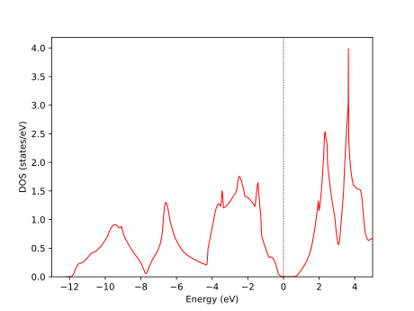
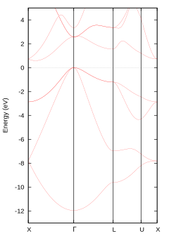
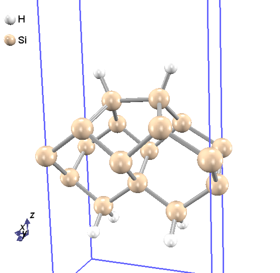
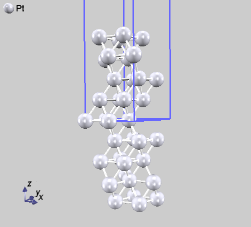
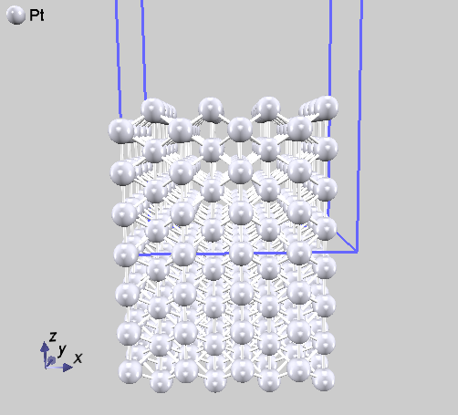
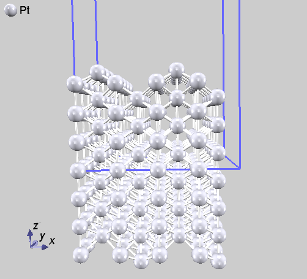
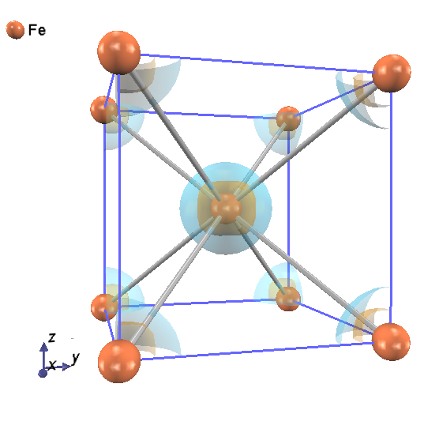
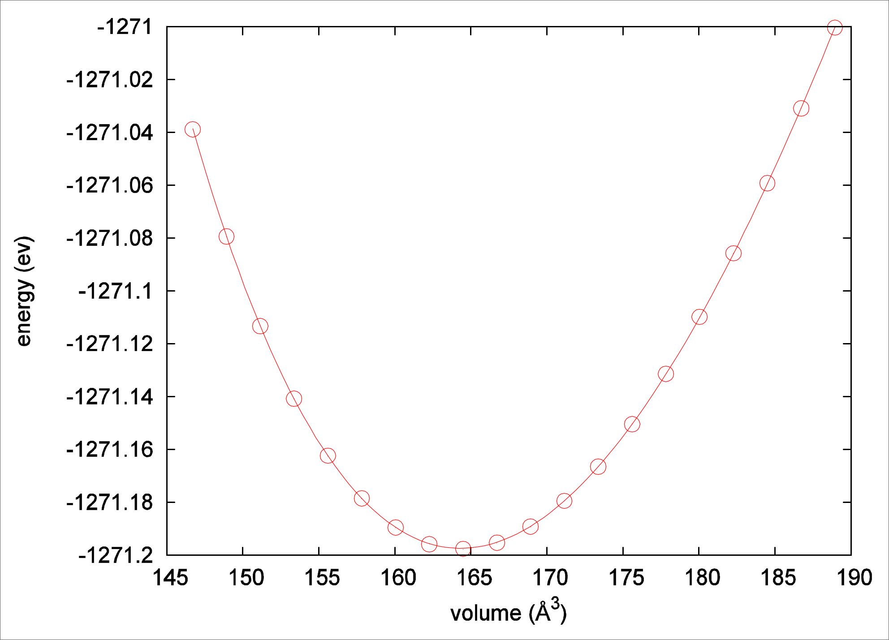

.. _basics_chapter:

基本機能を利用した計算例
========================

全エネルギー計算
----------------

最も基本的な計算機能として、全エネルギーの計算があります。複数の格子定数で全エネルギーを計算し格子定数や体積弾性率を計算することや、絶対零度における結晶の安定性を評価することができます。

入力パラメータ
~~~~~~~~~~~~~~

シリコン結晶（ダイヤモンド構造）の全エネルギー計算を例とします。この例題の入力ファイルは :code:`samples/basic/Si8` 以下にあります。
シリコン原子8個の系Si8を対象とします。シリコン結晶（ダイヤモンド構造）の構造を :numref:`si8_diamond` に示します。

.. figure:: images/basics_image1.svg
  :name: si8_diamond

  シリコン原子が構成するダイヤモンド構造

計算に使う入力ファイルは、ファイルfile_names.dataの中で指定します。

file_names.dataは以下のように記述します。

.. code-block:: text

 &fnames
 F_INP    = './input_scf_Si8.data'
 F_POT(1) = '../../pp/Si_ggapbe_paw_nc_01m.pp'
  ...
 F_CHR    = './nfchr.cube'
 /

PHASEを実行するためには、擬ポテンシャルデータ F_POT(1)
と、入力ファイルF_INPが指定されている必要があります。
Si_ggapbe_paw_nc_01m.pp はシリコンの擬ポテンシャル・データです。

入力パラメータファイルinput_scf_Si8.data について説明します。

Controlブロックでは、全体的な計算条件を指定します。cpumaxは計算時間の最大値を指定しています。

.. code-block:: text

  Control{
    condition = initial
    cpumax = 3600 sec     ! {sec|min|hour|day}
  }

Accuracyブロックでは、計算精度を指定します。

.. code-block:: text

 accuracy{
         cutoff_wf =  20.00  rydberg
         cutoff_cd =  80.00  rydberg
         num_bands = 20
         ksampling{
                 method = mesh ! {mesh|file|directin|gamma}
                 mesh{  nx = 4, ny =  4, nz =  4  }
         }
         ...
         scf_convergence{
              delta_total_energy = 1.e-10 hartree
              succession = 2
         }
         ...
 }

cutoff_wf と cutoff_cd は、 波動関数と電荷密度分布のカットオフ・エネルギーが、 それぞれ 20.0 Ry と80.0 Ry という値であることを表しています。

num_bands はエネルギー準位数を表します。この計算では、Si原子8個を扱いますが、各原子は4個の価電子をもつため、占有される準位数は、スピンの縮退度を考慮すると8\ :math:`\times`\ 4/2=16となります。 このため num_bands は、17以上に設定しておく必要があります。
また、ksampling というタグは、\ :math:`k`\ 点のサンプリングの方法を
指定するのに使われます。この例では、\ :math:`4 \times 4 \times 4`\ のメッシュ点がk点サンプリングとなります。

scf_convergenceでは、計算の収束条件を指定します。この例の場合、全エネルギーの計算誤差が\ :math:`10^{- 10}` Hartree 未満に収まるという結果が連続して2回続いたら、計算を終了させるように指定されています。

Structureブロックでは、結晶構造を指定します。単位はデフォルトが原子単位となっています（長さの単位は Bohr)。

.. code-block:: text

 structure{
         unit_cell_type = primitive
         unit_cell{
                 a_vector =  10.26    0.00    0.00
                 b_vector =   0.00   10.26    0.00
                 c_vector =   0.00    0.00   10.26
         }
         atom_list{
                 coordinate_system = internal ! {cartesian|internal}
                 atoms{
                 #default weight = 1, element = Si, mobile = 1
                 #tag   rx       ry       rz
                       0.125    0.125    0.125
                      -0.125   -0.125   -0.125
                       0.125    0.625    0.625
                      -0.125   -0.625   -0.625
                       0.625    0.125    0.625
                      -0.625   -0.125   -0.625
                       0.625    0.625    0.125
                      -0.625   -0.625   -0.125
                 }
         }
         element_list{ #tag element  atomicnumber
                               Si       14
         }
 }

atom_list
では、原子種、単位胞内での内部座標位置、それぞれの原子の位置を固定するか否かを指定します。
element_list では、元素名とその原子番号を指定します。

Postprocessingブロックでは、後処理のパラメータを指定します。

.. code-block:: text

 postprocessing{
         ...
         charge{
                 sw_charge_rspace    = ON
                 filetype            = cube  !{cube|density_only}
                 title  = "This is a title line for the bulk Si"
         }
 }

chargeブロックでは、電荷密度の出力について指定します。電荷密度は、file_names.dataにおいて
F_CHR で指定したファイルに出力されます。 filetype = cube
とする事により、Gaussian cube 形式で出力されます。
このとき、F_CHRで指定されるファイル名は、\*.cube
の形式である必要があります。 Gaussian cubeファイルは、PHASE
Viewerなどの可視化ソフトウェアを使って可視化表示することが可能です。

計算の実行
~~~~~~~~~~

PHASEを以下のように実行します。

.. code-block:: text

  % mpirun -np NP ../../../bin/phase ne=NE nk=NK

ここで、NP、NE、NK はそれぞれ、計算に使用するプロセッサーの数、
エネルギー準位の分割計算の数、および、\ :math:`k`\ 点の分割計算の数を指します。これらのパラメータの値の間には、NP = NE×NK という 関係が成り立っていなければなりません。

また、1 CPU の計算機を使う場合には、 以下のように実行します。

.. code-block:: text

  % mpirun  ../../../bin/phase

計算の途中経過を確認するには、計算のログ出力ファイルoutput000
に出力されている全エネルギーの収束状況を調べます。以下のように実行すると、全エネルギーに関する部分を抽出できます。

.. code-block:: text

  % grep TH output000

Si8 のサンプルを使って得られた output000では、次のような結果が表示されます。

.. code-block:: text

 TOTAL ENERGY FOR     1 -TH ITER=    -30.525762143533 EDEL =  -0.305258D+02 : SOLVER = MATDIAGON : Charge-Mixing = BROYD2
 TOTAL ENERGY FOR     2 -TH ITER=    -31.439227176416 EDEL =  -0.913465D+00 : SOLVER = SUBMAT + PKOSUGI : Charge-Mixing = BROYD2
 TOTAL ENERGY FOR     3 -TH ITER=    -31.469956871528 EDEL =  -0.307297D-01 : SOLVER = SUBMAT + PKOSUGI : Charge-Mixing = BROYD2
 TOTAL ENERGY FOR     4 -TH ITER=    -31.487810280728 EDEL =  -0.178534D-01 : SOLVER = SUBMAT + PKOSUGI : Charge-Mixing = BROYD2
 TOTAL ENERGY FOR     5 -TH ITER=    -31.495578938717 EDEL =  -0.776866D-02 : SOLVER = SUBMAT + PKOSUGI : Charge-Mixing = BROYD2
 TOTAL ENERGY FOR     6 -TH ITER=    -31.500918535399 EDEL =  -0.533960D-02 : SOLVER = SUBMAT + RMM3 : Charge-Mixing = BROYD2
 TOTAL ENERGY FOR     7 -TH ITER=    -31.501113667547 EDEL =  -0.195132D-03 : SOLVER = SUBMAT + RMM3 : Charge-Mixing = BROYD2
 TOTAL ENERGY FOR     8 -TH ITER=    -31.501186121230 EDEL =  -0.724537D-04 : SOLVER = SUBMAT + RMM3 : Charge-Mixing = BROYD2
 TOTAL ENERGY FOR     9 -TH ITER=    -31.501187563396 EDEL =  -0.144217D-05 : SOLVER = SUBMAT + RMM3 : Charge-Mixing = BROYD2
 TOTAL ENERGY FOR    10 -TH ITER=    -31.501187881041 EDEL =  -0.317645D-06 : SOLVER = SUBMAT + RMM3 : Charge-Mixing = BROYD2
 TOTAL ENERGY FOR    11 -TH ITER=    -31.501187967072 EDEL =  -0.860305D-07 : SOLVER = SUBMAT + RMM3 : Charge-Mixing = BROYD2
 TOTAL ENERGY FOR    12 -TH ITER=    -31.501187974714 EDEL =  -0.764159D-08 : SOLVER = SUBMAT + RMM3 : Charge-Mixing = BROYD2
 TOTAL ENERGY FOR    13 -TH ITER=    -31.501187977198 EDEL =  -0.248405D-08 : SOLVER = SUBMAT + RMM3 : Charge-Mixing = BROYD2
 TOTAL ENERGY FOR    14 -TH ITER=    -31.501187977591 EDEL =  -0.393619D-09 : SOLVER = SUBMAT + RMM3 : Charge-Mixing = BROYD2
 TOTAL ENERGY FOR    15 -TH ITER=    -31.501187977742 EDEL =  -0.150855D-09 : SOLVER = SUBMAT + RMM3 : Charge-Mixing = BROYD2

SCF計算において、全エネルギーの値が収束してゆく様子が分かります。

計算結果の出力
~~~~~~~~~~~~~~

計算された全エネルギーは、F_ENF ファイルに出力されます。

Si8の例題では、 F_ENF ファイル(ファイル名：nfefn.data)は以下のようになっています。

.. code-block:: text

 iter_ion, iter_total, etotal, forcmx
     1      15      -31.5087632805        0.0000104146

計算が終了すると、電荷密度ファイルnfchr.cubeが作成されます。電荷密度分布を :numref:`charge_si8` に示します。原子数を増やすなど、cube file に修正を加えています。

.. figure:: images/basics_image2.svg
  :name: charge_si8

  シリコン結晶の電荷密度分布

対称性を考慮した計算
--------------------

PHASEには、結晶の対称性を考慮することによって計算量を低減する機能があります。対称性は、自動的に判定させることも可能ですし、生成元を直接指定する ことによって明示的に指定することも可能です。 原子配置を指定する方法には, 基本格子を指定する方法とブラベー格子を指定する方法があります。 具体的には, 変数 unit_cell_type の入力値を primitive か Bravais のどちらかから選択することで 指定できます。

.. _入力パラメータ-1:

入力パラメータ
~~~~~~~~~~~~~~

単位胞の指定
^^^^^^^^^^^^

単位胞を基本格子で指定

.. code-block:: text

 unit_cell_type = primitive
 unit_cell{
   #units bohr
   a_vector =  0.00000  5.13000  5.13000
   b_vector =  5.13000  0.00000  5.13000
   c_vector =  5.13000  5.13000  0.00000
 }

この方法は, unit_cell_type がprimitive でもBravais でも使用できます。

単位胞を格子定数で指定

.. code-block:: text

 unit_cell_type = Bravais
 unit_cell{
   #units bohr
   a = 10.26, b = 10.26, c = 10.26
   alpha = 90, beta = 90, gamma = 90
 }

この方法は, unit_cell_type がBravais の時のみ使用できます。ブラベー格子を指定して入力した場合、対称性の指定により, プログラム内で基本格子を決定します。計算は、プログラムが決定した基本格子を元に行われるので、原子座標の指定、k点分割数や、バンド計算時の対称k点の指定などは、この基本格子を元に行う必要がある点に注意ください。

unit_cell_type としてBravais を利用する場合、副格子点に位置する原子は指定しないようにしてください。たとえば体心原子を含む結晶の場合, (0, 0, 0) の原子は指定し, (0.5, 0.5, 0.5) の原子は指定しないようにしてください。Bravais を利用する際に指定が必要な結晶の型は、tspaceブロックの下のlattice_system という変数で指定します。具体的には以下のように指定します。

.. code-block:: text

   structure{
     unit_cell_type = Bravais
     tspace{
       lattice_system = facecentered
     }
   }

lattice_systemにおいて指定できるパラメーターについては\ :numref:`basics_table_bravais_lattice` を参照してください。

菱面体晶系(rhombohedral) の場合には, 対応する六方晶系(hexagonal) の格子定数を入力します。六方晶系と菱面体晶系の基本並進ベクトルの関係を :numref:`basics_image3` に示します.。

原子座標を内部座標で入力する場合は, 等価原子を除いて, 単位胞内のすべて原子の位置を結晶軸ベクトル(慣用単位胞の3 辺を表すベクトル) に対する相対座標(ワイコフ位置の原子座標) で入力します。デカルト座標で入力する場合は, :numref:`basics_table_primitive_translation` に示されている基本並進ベクトルと整合するように入力してください。

.. table:: ブラベー格子と晶系
 :widths: auto
 :class: longtable
 :name: basics_table_bravais_lattice

 +-------------+--------------------------+--------------------------+------------+-------------+
 | 晶系        | 格子定数　               | unit_cellに              | 格子の種類 | lattic      |
 |             |                          | 記述する値               |            | _systemに指 |
 |             |                          |                          |            | 定する単語  |
 +=============+==========================+==========================+============+=============+
 | 立方(c)     | :math:`a`                | a=                       | 単純(P)    | primitive   |
 |             |                          | \ :math:`a`,             |            |             |
 |             |                          | b=                       | 面心(F)    | f\          |
 |             |                          | \ :math:`a`,             |            | acecentered |
 |             |                          | c=                       | 体心(I)    |             |
 |             |                          | \ :math:`a`              |            | b\          |
 |             |                          |                          |            | odycentered |
 |             |                          | alpha=90,                |            |             |
 |             |                          | beta=90,                 |            |             |
 |             |                          | gamma=90                 |            |             |
 +-------------+--------------------------+--------------------------+------------+-------------+
 | 正方(t)     | :math:`a,c`              | a=                       | 単純(P)    | primitive   |
 |             |                          | \ :math:`a`,             |            |             |
 |             |                          | b=                       | 体心(I)    | b\          |
 |             |                          | \ :math:`a`,             |            | odycentered |
 |             |                          | c=                       |            |             |
 |             |                          | \ :math:`c`              |            |             |
 |             |                          | alpha=90,                |            |             |
 |             |                          | beta=90,                 |            |             |
 |             |                          | gamma=90                 |            |             |
 +-------------+--------------------------+--------------------------+------------+-------------+
 | 直方(o)     | :math:`a,b`              | a=                       | 単純(P)    | primitive   |
 |             | :math:`,c`               | \ :math:`a`,             |            |             |
 |             |                          | b=                       | 底心(C)    | b\          |
 |             |                          | \ :math:`b`,             |            | asecentered |
 |             |                          | c=                       | 面心(F)    |             |
 |             |                          | \ :math:`c`              |            | f\          |
 |             |                          |                          | 体心(I)    | acecentered |
 |             |                          | alpha=90,                |            |             |
 |             |                          | beta=90,                 |            | b\          |
 |             |                          | gamma=90                 |            | odycentered |
 +-------------+--------------------------+--------------------------+------------+-------------+
 | 六方(h)     | :math:`a,c`              | a=                       | 単純(P)    | hexagonal   |
 |             |                          | \ :math:`a`,             |            |             |
 |             |                          | b=                       |            |             |
 |             |                          | \ :math:`a`,             |            |             |
 |             |                          | c=                       |            |             |
 |             |                          | \ :math:`c`              |            |             |
 |             |                          | alpha=90,                |            |             |
 |             |                          | beta=90,                 |            |             |
 |             |                          | gamma=120                |            |             |
 +-------------+--------------------------+--------------------------+------------+-------------+
 | 三方(h)     | :math:`a,c`              | a=                       | 菱面(R)    | r\          |
 | 菱面体軸    |                          | \ :math:`a`,             |            | hombohedral |
 |             |                          | b=                       | 単純(P)    |             |
 | 六方晶軸    |                          | \ :math:`a`,             |            | hexagonal   |
 |             |                          | c=                       |            |             |
 |             |                          | \ :math:`c`              |            |             |
 |             |                          | alpha=90,                |            |             |
 |             |                          | beta=90,                 |            |             |
 |             |                          | gamma=120                |            |             |
 +-------------+--------------------------+--------------------------+------------+-------------+
 | 単斜(m)     | :math:`a,b`              | a=                       | 単純(P)    | primitive   |
 |             | :math:`,c`               | \ :math:`a`,             |            |             |
 |             |                          | b=                       | 底心(C)    | b\          |
 |             | :math:`\beta`            | \ :math:`b`,             |            | asecentered |
 |             |                          | c=                       |            |             |
 |             |                          | \ :math:`c`              |            |             |
 |             |                          |                          |            |             |
 |             |                          | alpha=90,                |            |             |
 |             |                          | beta= :math:`\beta`      |            |             |
 |             |                          | gamma=90                 |            |             |
 +-------------+--------------------------+--------------------------+------------+-------------+
 | 三斜(a)     | :math:`a,b,c`            | a=                       | 単純(P)    | primitive   |
 |             |                          | \ :math:`a`,             |            |             |
 |             |                          | b=                       |            |             |
 |             | :math:`\alpha,\beta`     | \ :math:`b`,             |            |             |
 |             |                          | c=                       |            |             |
 |             | :math:`\gamma`           | \ :math:`c`              |            |             |
 |             |                          |                          |            |             |
 |             |                          | alpha=\ :math:`\alpha`   |            |             |
 |             |                          | beta=\ :math:`\beta`     |            |             |
 |             |                          | gamma=\ :math:`\gamma`   |            |             |
 +-------------+--------------------------+--------------------------+------------+-------------+

.. figure:: images/basics_image3.svg
  :name: basics_image3

  六方晶系と菱面体晶系の関係.
  六方軸の方から見た格子点と基本並進ベクトルが示されています.
  :math:`\mathbf{a}^{\mathbf{H}}\mathbf{,}\mathbf{b}^{\mathbf{H}}\mathbf{,}\mathbf{c}^{\mathbf{H}}`\ は六方晶系の基本並進ベクトルで,
  :math:`\mathbf{a}^{\mathbf{R}}\mathbf{,}\mathbf{b}^{\mathbf{R}}\mathbf{,}\mathbf{c}^{\mathbf{R}}`\ は菱面体晶系の基本並進ベクトルです.

.. csv-table:: ブラベー格子の基本並進ベクトル.
 :name: basics_table_primitive_translation

 "ブラベー格子", :math:`\mathbf{a}` , :math:`\mathbf{b}` , :math:`\mathbf{c}`
 "単純立方(cP)", :math:`a\widehat{\mathbf{x}}` , :math:`a\widehat{\mathbf{y}}` , :math:`a\widehat{\mathbf{z}}`
 "面心立方(cF)", :math:`\frac{a}{2}(\widehat{\mathbf{y}} + \widehat{\mathbf{z}})`, :math:`\frac{a}{2} (\widehat{\mathbf{x}}+\widehat{\mathbf{y}} )` , :math:`\frac{a}{2}(\widehat{\mathbf{x}}+\widehat{\mathbf{y}}`
 "体心立方(cI)", :math:`\frac{a}{2} (-\widehat{\mathbf{x}} + \widehat{\mathbf{y}} + \widehat{\mathbf{z}})` , :math:`\frac{a}{2} (\widehat{\mathbf{x}} - \widehat{\mathbf{y}} + \widehat{\mathbf{z}})`, :math:`\frac{a}{2} (\widehat{\mathbf{x}} + \widehat{\mathbf{y}} - \widehat{\mathbf{z}})`
 "単純正方(tP)", :math:`a \widehat{\mathbf{x}}` , :math:`a \widehat{\mathbf{y}}` , :math:`c \widehat{\mathbf{z}}`
 "体心正方(tI)", :math:`\frac{1}{2} ( -a \widehat{\mathbf{x}} + a \widehat{\mathbf{y}} + c \widehat{\mathbf{z}})` , :math:`\frac{1}{2}(a \widehat{\mathbf{x}} - b \widehat{\mathbf{y}} + c \widehat{\mathbf{z}})`, :math:`\frac{1}{2} (a \widehat{\mathbf{x}} + a \widehat{\mathbf{y}} - c \widehat{\mathbf{z}})`
 "単純直方(oP)", :math:`a \widehat{\mathbf{x}}`, :math:`b \widehat{\mathbf{y}}`, :math:`c \widehat{\mathbf{z}}`
 "底心直方(oC)", :math:`\frac{1}{2}(a \widehat{\mathbf{x}}-b\widehat{\mathbf{y}})`, :math:`\frac{1}{2}(a\widehat{\mathbf{x}}+b\widehat{\mathbf{y}})`, :math:`c\widehat{\mathbf{z}}`
 "面心直方(oF)", :math:`\frac{1}{2}(b\widehat{\mathbf{y}}+c\widehat{\mathbf{z}})`, :math:`\frac{1}{2}(a\widehat{\mathbf{x}}+c\widehat{\mathbf{z}})`, :math:`\frac{1}{2}(a\widehat{\mathbf{x}}+c\widehat{\mathbf{y}})`
 "体心直方(oI)", :math:`\frac{1}{2}(-a\widehat{\mathbf{x}}+b\widehat{\mathbf{y}}+c\widehat{\mathbf{z}})`, :math:`\frac{1}{2}(a\widehat{\mathbf{x}}-b\widehat{\mathbf{y}}+c\widehat{\mathbf{z}})`, :math:`\frac{1}{2}(a\widehat{\mathbf{x}}+b\widehat{\mathbf{y}}-c\widehat{\mathbf{z}})`
 "単純六方(hP)", :math:`a\widehat{\mathbf{x}}`, :math:`a(-\frac{1}{2}\widehat{\mathbf{x}}+\frac{\sqrt{3}}{2}\widehat{\mathbf{y}})`, :math:`c\widehat{\mathbf{z}}`
 "単純菱面体(hR)", :math:`\frac{a}{2}\widehat{\mathbf{x}}+\frac{a}{2\sqrt{3}}\widehat{\mathbf{y}}+\frac{1}{3}c\widehat{\mathbf{z}}`, :math:`-\frac{a}{2}\widehat{\mathbf{x}}+\frac{a}{2\sqrt{3}}\widehat{\mathbf{y}}+\frac{1}{3}c\widehat{\mathbf{z}}`, :math:`-\frac{a}{\sqrt{3}}\widehat{\mathbf{y}} + \frac{1}{3} c \widehat{\mathbf{z}}`
 "単純単斜(mP)", :math:`a\widehat{\mathbf{x}}`, :math:`b\widehat{\mathbf{y}}`, :math:`c(\cos \beta \widehat{\mathbf{x}} + \sin \beta \widehat{\mathbf{z}})`
 "底心単斜(mC)", :math:`\frac{1}{2}(a \widehat{\mathbf{x}} - b \widehat{\mathbf{y}})`, :math:`\frac{1}{2}(a \widehat{\mathbf{x}}+b\widehat{\mathbf{y}})`, :math:`c(\cos \beta \widehat{\mathbf{x}} + \sin \beta \widehat{\mathbf{z}})`
 "単純三斜(aP)", :math:`a\widehat{\mathbf{x}}`, :math:`b( \cos \gamma \widehat{\mathbf{x}} + \sin \gamma \widehat{\mathbf{y}})`, :math:`c\left( \cos \beta \widehat{\mathbf{x}} + \frac{\cos \alpha - \cos\beta \cos\gamma}{\sin \gamma} \widehat{\mathbf{y}}\right)` :math:`+ \sqrt{1-\frac{\cos^2\alpha + \cos^2\beta-2\cos\alpha\cos\beta\cos\gamma}{sin^2\gamma}} \widehat{\mathbf{z}}`

.. _basics_symmetry_section:

対称性の指定
^^^^^^^^^^^^

対称性の指定のやり方には, 結晶構造を入力する方法、対称操作を自動的に決定する方法、生成元を入力する方法があります.

結晶構造を入力する方法

変数 crystal_structure に, 結晶構造の型を入力します. この場合, 選択肢には diamond, hexagonal, fcc, bcc, simple_cubic の5つがあります。 Si結晶の場合に指定する結晶構造は diamond です.

対称操作を自動的に決定する方法

method変数にautomaticを指定することで, 対称性は自動的に決定されます。tspaceブロックのlattice_systemの指定は, primitiveの場合以外は指定することが推奨されます。

.. code-block:: text

 symmetry{
   method = automatic
   tspace{
     lattice_system = facecentered !{rhombohedral|hexagonal|primitive|facecentered|bodycentered|basecentered}
   }
 }

生成元を入力する方法

生成元は、tspace ブロックで指定します。Si結晶の場合, tspace の入力値は以下のようになります.

.. code-block:: text

  tspace{
    lattice_system = facecentered !{rhombohedral|hexagonal|primitive|facecentered|bodycentered|basecentered}
    num_generators = 3
    generators{
      #tag rotation  tx   ty   tz
            IE      0    0    0
            C31+    0    0    0
            C4X+    1/4  1/2  3/4
    }
  }

予め, 面心格子を使うことを lattice_system = facecentered で, また, 生成元の数が3であることを num_generators = 3 で宣言した後で, タグ generators の中で, IE, C31+, C4X+ が, 具体的に3種類の生成元を指定しています。

生成元の指定の方法を説明します。

生成元の回転操作は, 以下のコードで指定します. 各行は, それぞれ一つの回転操作に対応します.  一列目の数字か二列目の記号を利用してgeneratorsテーブルのrotation列に対称操作を指定します.  三列目から五列目までが対応する回転操作を表します. なお, 三方晶, 六方晶の場合に現れているWはX-Yを表します. コードは, 一列目の数字でも二列目の文字列でも指定することが可能です.

三方晶, 六方晶の場合

.. code-block:: text

  1   E     X  Y  Z                      13  IE    -X -Y -Z
  2   C6+   W  X  Z                      14  IC6+  -W -X -Z
  3   C3+  -Y  W  Z                      15  IC3+   Y -W -Z
  4   C2   -X -Y  Z                      16  IC2    X  Y -Z
  5   C3-  -W -X  Z                      17  IC3-   W  X -Z
  6   C6-   Y -W  Z                      18  IC6-  -Y  W -Z
  7   C211 -W  Y -Z                      19  IC211  W -Y  Z
  8   C221  X  W -Z                      20  IC221 -X -W  Z
  9   C231 -Y -X -Z                      21  IC231  Y  X  Z
 10   C212  W -Y -Z                      22  IC212 -W  Y  Z
 11   C222 -X -W -Z                      23  IC222  X  W  Z
 12   C232  Y  X -Z                      24  IC232 -Y -X  Z

三方晶, 六方晶以外の場合

.. code-block:: text

    1   E     X  Y  Z                      25  IE    -X -Y -Z
    2   C2X   X -Y -Z                      26  IC2X  -X  Y  Z
    3   C2Y  -X  Y -Z                      27  IC2Y   X -Y  Z
    4   C2Z  -X -Y  Z                      28  IC2Z   X  Y -Z
    5   C31+  Z  X  Y                      29  IC31+ -Z -X -Y
    6   C32+ -Z  X -Y                      30  IC32+  Z -X  Y
    7   C33+ -Z -X  Y                      31  IC33+  Z  X -Y
    8   C34+  Z -X -Y                      32  IC34+ -Z  X  Y
    9   C31-  Y  Z  X                      33  IC31- -Y -Z -X
   10   C32-  Y -Z -X                      34  IC32- -Y  Z  X
   11   C33- -Y  Z -X                      35  IC33-  Y -Z  X
   12   C34- -Y -Z  X                      36  IC34-  Y  Z -X
   13   C2A   Y  X -Z                      37  IC2A  -Y -X  Z
   14   C2B  -Y -X -Z                      38  IC2B   Y  X  Z
   15   C2C   Z -Y  X                      39  IC2C  -Z  Y -X
   16   C2D  -X  Z  Y                      40  IC2D   X -Z -Y
   17   C2E  -Z -Y -X                      41  IC2E   Z  Y  X
   18   C2F  -X -Z -Y                      42  IC2F   X  Z  Y
   19   C4X+  X -Z  Y                      43  IC4X+ -X  Z -Y
   20   C4Y+  Z  Y -X                      44  IC4Y+ -Z -Y  X
   21   C4Z+ -Y  X  Z                      45  IC4Z+  Y -X -Z
   22   C4X-  X  Z -Y                      46  IC4X- -X -Z  Y
   23   C4Y- -Z  Y  X                      47  IC4Y-  Z -Y -X
   24   C4Z-  Y -X  Z                      48  IC4Z- -Y  X -Z

他方, 回転に伴う並進操作はgeneratorsテーブルのtx, ty, tz列にそれぞれ指定します.
格子ベクトルを基準に分数で入力してください.

反転対称性がある場合
^^^^^^^^^^^^^^^^^^^^

反転対称がある場合, これを考慮する事により, 計算量を減らすことができます。
たとえば、以下の座標データは原点を中心として反転対称性があるので、それを考慮するように設定すると計算量を減らすことができます。

.. code-block:: text

 atom_list{
   coordinate_system = internal ! {cartesian|internal}
   atoms{
     #units  !{angstrom(cartesian) bohr(cartesian)}
     #tag  rx        ry        rz      weight    element    mobile
         0.125     0.125     0.125       1          Si        1
        -0.125    -0.125    -0.125       1          Si        1
   }
 }

反転対称性を考慮する設定は、symmetryブロックの下でsw_inversion = onとすることによって行います。

.. code-block:: text

 structure{
   ...
   symmetry{
     ...
     sw_inversion = on
   }
 }

また、反転対称性を考慮する場合、原子配置のweight属性値を利用することによって座標データ入力を省力化することも可能です。たとえば、以下の指定はsw_inversion=onの場合上記の座標例と等価です。

.. code-block:: text

 atom_list{
   coordinate_system = internal ! {cartesian|internal}
   atoms{
     #units  !{angstrom(cartesian) | bohr(cartesian)}
     #tag  rx        ry        rz      weight    element    mobile
         0.125     0.125     0.125       2          Si        1
   }
   symmetry{
    sw_inversion = on
   }
 }

weight属性値が2の原子は、反転対称位置に自分自身のコピーが作成されます。

前節で指定した対称群に反転対称操作が含まれる場合、このoptionを指定することを推奨します。 なお、原子座標を入力する場合反転対称操作の中心は原点であることにご注意ください。また、反転対称性のない系においてsw_inversion = onを指定するとエラーメッセージを出力して計算を終了します。

.. _section_basics_Si2:

計算例：シリコン結晶(Si2)
~~~~~~~~~~~~~~~~~~~~~~~~~

シリコン原子が構成するダイヤモンド構造の基本格子は原子2個を含みます。ここでは、シリコン原子2個からなる
Si\ :sub:`2`\ という系を例とします。 :numref:`si2_primitive` はSi\ :sub:`2`\ の原子構造です。

計算例題は、 :code:`samples/basic/Si2` です。

.. figure:: images/basics_image4.svg
  :name: si2_primitive

  Si\ :sub:`2`\ の原子構造。黄線は原子2個を含む基本格子を表す

SCF計算

SCF計算を行い、電荷密度を計算します。計算例題は :code:`samples/basic/Si2/scf` です。

ファイル file_names.data において、入力パラメータファイルと擬ポテンシャルを指定します。

.. code-block:: text

 F_POT(1) = '../../pp/Si_ggapbe_paw_nc_01m.pp'
 F_CHGT   = '../scf/nfchgt.data'
 ...

入力パラメータファイルにおいて、crystal_structure をdiamondとして、対称性を指定します。

.. code-block:: text

 accuracy{
         cutoff_wf =  20.00  rydberg
         cutoff_cd =  80.00  rydberg
         num_bands = 8
 }
 structure{
         unit_cell_type = Bravais
         unit_cell{
              a = 10.26, b = 10.26, c = 10.26
              alpha = 90, beta = 90, gamma = 90
         }
         symmetry{
              crystal_structure = diamond
         }
         atom_list{
              atoms{
                   #tag   rx        ry        rz    element
                        0.125     0.125     0.125      Si
                       -0.125    -0.125    -0.125      Si
              }
         }
 }

エネルギー準位数を表す num_bands
の値は、原子数が2個なので8としています。

PHASEを実行します。

.. code-block:: bash

  % mpirun  ../../../../bin/phase

計算が終了すると、file_names.data というファイルの中で、 変数 F_CHGT
で指定した出力ファイル nfchgt.data に、
計算によって得られた電荷の情報が出力されます。

状態密度(DOS)の計算

状態密度（DOS）を計算します。計算例題は、 :code:`samples/basic/Si2/dos` です。
計算結果の出力ファイルが上書きされるのを避けるため、SCF計算を行ったディレクトリとは別のディレクトリで実行します。

SCF計算結果の電荷密度ファイルnfchgt.data を使います。擬ポテンシャルはSCF計算と同じものを使います。
file_names.data では、入出力ファイルを以下のように指定しています。

.. code-block:: text

 F_INP    = './input_dos_Si.data'
 F_POT(1) = '../../pp/Si_ggapbe_paw_nc_01m.pp'
    ...
 F_CHGT   = '../scf/nfchgt.data'
    ...          ...
 F_ENERG  = './nfenergy.data'
    ...          ...

F_CHGTで指定している電荷密度のデータは、SCF計算で得られた出力ファイルです。
入力ファイルは input_dos_Si.data と nfchgt.data の2つです。
入力ファイル input_dos_Si.data について、SCF計算の入力ファイル
input_scf_Si.data と異なる部分を以下に示します。

.. code-block:: text

 Control{
        condition = fixed_charge
 }
 accuracy{
         cutoff_wf =  20.00  rydberg
         cutoff_cd =  80.00  rydberg
         num_bands = 8
         ksampling{
                 method = mesh
                 mesh{  nx = 4, ny =  4, nz =  4   }
         }
         smearing{
                 method = tetrahedral
         }
         initial_wavefunctions = matrix_diagon
         matrix_diagon{
            cutoff_wf =  9.00  rydberg
         }
         ek_convergence{
                 num_max_iteration = 200
                 sw_eval_eig_diff = on
                 delta_eigenvalue = 1.e-8 hartree
                 succession   = 2
        }
 }
 postprocessing{
        dos{
           sw_dos      = ON
           method      = tetrahedral   !{ tetrahedral | Gaussian }
           deltaE_dos  = 1.e-3 eV
           nwd_window_width = 10
        }
 }

Controlブロックのconditionをfixed_chargeと設定することによってSCF計算で得られた電荷の分布を固定して使用することを指定します。ksamplingでは\ :math:`k`\ 点サンプリングが\ :math:`4 \times 4 \times 4`\であることを指定しています。smearingでは四面体法を用いることを指定しています。ek_convergenceブロックでは固定電荷計算の収束条件を指定しています。
Postprocessingブロックでは、計算終了後の後処理として、四面体法による状態密度の計算のパラメータが指定されています。
これらの入力ファイルを使って、プログラムekcalを用いて、状態密度の計算を行います。

.. code-block:: bash

  % mpirun  ../../../../bin/ekcal

計算を実行すると、nfenergy.data という出力ファイルが生成されます。 これは、各\ :math:`k`\ 点ごとのエネルギー値を、エネルギーの低い方から順に 出力したもので、その最初の部分は以下のようになっています。

.. code-block:: text

  num_kpoints =    141
  num_bands   =      8
  nspin       =      1
  Valence band max   =   0.233846
 === energy_eigen_values ===
  ik =    1 (  0.000000  0.500000  0.500000 )
      -0.0484324491     -0.0484324491      0.1258095002      0.1258095002
       0.2619554320      0.2619554320      0.6015285289      0.6015285289
 === energy_eigen_values ===
  ik =    2 (  0.000000  0.490000  0.490000 )
      -0.0540717117     -0.0427149546      0.1258687813      0.1258687813
       0.2607026827      0.2633829946      0.6006244013      0.6006244013
 === energy_eigen_values ===
  ik =    3 (  0.000000  0.480000  0.480000 )
      -0.0596299923     -0.0369220783      0.1260465996      0.1260465996
       0.2596226501      0.2649874134      0.5980547648      0.5980547648
 === energy_eigen_values ===
  ik =    4 (  0.000000  0.470000  0.470000 )
      -0.0651046420     -0.0310567694      0.1263428799      0.1263428799
       0.2587131916      0.2667706685      0.5941566835      0.5941566835
 === energy_eigen_values ===
  ik =    5 (  0.000000  0.460000  0.460000 )
      -0.0704931128     -0.0251220735      0.1267574962      0.1267574962
       0.2579721226      0.2687346642      0.5892968047      0.5892968047

最初の2行は、それぞれ、\ :math:`k`\ 点とバンドの数を表します。
3行目は、この計算でスピン分極は考慮されていないことを、
また、4行目は価電子帯上端におけるエネルギーの値を指しています。

ツールdos.pl を使って、 電子状態密度の図を作成します。
描画するエネルギー範囲の最小値 E1 と最大値 E2 を決めて、

.. code-block:: text

  % dos.pl dos.data -erange=E1,E2 -color

とすると、Postscript 形式の状態密度図 density_of_states.eps が得られます。 また、-with_fermi というオプションをつけて、この処理を実行すると、生成される 状態密度図にフェルミ・レベルが点線で描かれます。 ただし、ギャップのある系では、 価電子帯のエネルギー最大値のところに点線が引かれます。

この例題では、以下のように実行します。

.. code-block:: text

  % dos.pl dos.data -erange=-13,5 -with_fermi -color

Si\ :sub:`2`\ の状態密度を、:numref:`basics_image5` に示します。

 Si2の状態密度

バンド構造図

バンド構造を計算します。計算例題は、 :code:`samples/basic/Si2/band` です。
file_names.data では、入出力ファイルを以下のように指定しています。

.. code-block:: text

  F_INP    = './input_band_Si.data'
  F_POT(1) = '../../pp/Si_ggapbe_paw_nc_01m.pp'
  F_KPOINT = './kpoint.data'
  F_CHGT   = '../scf/nfchgt.data'
    ...         ...

入力パラメーターファイルはF_INPによってinput_band_Si.data を、k点のデータはF_KPOINTによってkpoint.dataであることを指定しています。

入力ファイル kpoint.data は、ツールband_kpoint.plを用いて生成します。band_kpoint.plのFCC用の入力ファイルは :code:`samples/tools/bandkpt_fcc_xglux.in` です。

.. code-block:: bash

  % ../../../../bin/band_kpoint.pl ../../../../tools/bandkpt_fcc_xglux.in

これらの入力ファイルを使って、プログラムekcal を実行します。

.. code-block:: bash

  % mpirun  ../../../../bin/ekcal

出力ファイル nfenergy.data から、ツール band.pl を用いて、 バンド構造図を作成します。

ツール band.plを以下のように実行すると、Postscript 形式のファイル band_structure.eps が作成されます。

.. code-block:: bash

 % ../../../../bin/band.pl nfenergy.data ../../../../tools/bandkpt_fcc_xglux.in -erange=E1,E2 -with_fermi -color

この例題では、描画するエネルギー範囲の最小値 E1 と最大値 E2 を、以前同様 E1 = -13 と E2 = 5 として、 以下のように実行します。

.. code-block:: bash

  % ../../../../bin/band.pl nfenergy.data ../../../../tools/bandkpt_fcc_xglux.in -erange=-13,5 -with_fermi -color

Si2のバンド構造を、:numref:`basics_image6` に示します。

 Si2のバンド構造

.. raw:: latex

    \clearpage

スピン分極を考慮した計算
------------------------

強磁性体や反強磁性体を扱う場合にはスピン分極を考慮する必要があります。スピン分極の考慮した計算について説明します。

ここでは、強磁性の例として体心立方鉄を、反強磁性の例として体心立方クロムを利用して説明を行います。

強磁性の計算
~~~~~~~~~~~~

.. _入力パラメータ-2:

入力パラメータ
^^^^^^^^^^^^^^

強磁性の例として体心立方鉄を例に説明します。計算例題は、 :code:`samples/basic/bcc_Fe` です。

.. code-block:: text

 Control{
   condition = initial
   cpumax = 3 hour
   max_iteration = 250
 }
 accuracy{
   cutoff_wf =   25  rydberg
   cutoff_cd =  225.00  rydberg
   num_bands =  20
   ksampling{
     method = mesh
     mesh{ nx = 10, ny = 10, nz = 10 }
   }
   smearing{
     method = tetrahedral
   }
   xctype = ggapbe
   scf_convergence{
     delta_total_energy = 1.e-10  hartree
     succession = 3
   }
 }
 structure{
   unit_cell_type = Bravais
   unit_cell{
     #units angstrom
     a = 2.845, b = 2.845, c = 2.845
     alpha = 90, beta = 90, gamma = 90
   }
   symmetry{
     crystal_structure = bcc
   }
   magnetic_state = ferro
   atom_list{
     atoms{
       !#tag  rx       ry         rz      element
           0.000     0.000     0.000          Fe
     }
   }
   element_list{ !#tag element  atomicnumber     zeta  dev
                         Fe            26    0.275  1.5 }
 }
 Postprocessing{
  dos{
    sw_dos = ON
    method = tetrahedral
    deltaE = 1.e-4 hartree
    nwd_dos_window_width = 10
  }
  charge{
    sw_charge_rspace    = OFF
    filetype            = cube
    title  = "This is a title line for FM bcc Fe"
  }
 }
 printlevel{
   base = 1
 }

結晶構造の指定

変数crystal_structureで、体心立方構造の結晶(bccという値)であることを指定しています。よって、ユニットセルはブラベー格子によって指定しているので原子は1つのみ記述しています。体心位置にある原子は指定していない点にご注意ください.  crystal_structureにbccという値を指定すると、プログラムが指定の格子を基本格子に変換するので体心位置の原子の指定は不要となります。

スピン自由度の指定方法

強磁性体を扱う場合には, magnetic_state をferroと指定します。

.. code-block:: text

 structure{
   magnetic_state =  ferro   !{para|antiferro|ferro}
 }

さらに各原子のスピン分極の初期値を指定する必要があります。
入力ファイルにある

.. code-block:: text

 element_list{ #tag element  atomicnumber     zeta  dev
                    Fe          26         0.275  1.5
 }

の zeta = 0.275 という変数の値が, アップ・スピンとダウン・スピンの
密度の差を表す, スピン分極
:math:`\zeta = (n_{\uparrow} - n_{\downarrow})/(n_{\uparrow} + n_{\downarrow})`
の初期値を示しています.

.. _計算結果の出力-1:

計算結果の出力
^^^^^^^^^^^^^^

スピン分極の変化はログファイルoutput000に出力されます。以下のようにして確認することができます.

.. code-block:: text

 % grep charge output000 | grep NEW

  !NEW total charge (UP, DOWN, SUM) =     5.02955985 (+)    2.97044015 (=)    8.00000000
  !NEW total charge (UP, DOWN, SUM) =     5.03034164 (+)    2.96965836 (=)    8.00000000
  !NEW total charge (UP, DOWN, SUM) =     5.04318734 (+)    2.95681266 (=)    8.00000000
  !NEW total charge (UP, DOWN, SUM) =     5.05422913 (+)    2.94577087 (=)    8.00000000
  !NEW total charge (UP, DOWN, SUM) =     5.07574696 (+)    2.92425304 (=)    8.00000000
  !NEW total charge (UP, DOWN, SUM) =     5.10717707 (+)    2.89282293 (=)    8.00000000
  !NEW total charge (UP, DOWN, SUM) =     5.12471628 (+)    2.87528372 (=)    8.00000000
  !NEW total charge (UP, DOWN, SUM) =     5.12861238 (+)    2.87138762 (=)    8.00000000
  !NEW total charge (UP, DOWN, SUM) =     5.12847549 (+)    2.87152451 (=)    8.00000000
  !NEW total charge (UP, DOWN, SUM) =     5.12852226 (+)    2.87147774 (=)    8.00000000
  !NEW total charge (UP, DOWN, SUM) =     5.12859310 (+)    2.87140690 (=)    8.00000000
  !NEW total charge (UP, DOWN, SUM) =     5.12859664 (+)    2.87140336 (=)    8.00000000
  !NEW total charge (UP, DOWN, SUM) =     5.12859623 (+)    2.87140377 (=)    8.00000000
  !NEW total charge (UP, DOWN, SUM) =     5.12859688 (+)    2.87140312 (=)    8.00000000

ここで, スピン分極の定義
:math:`\zeta = (n_{\uparrow} - n_{\downarrow})/(n_{\uparrow} + n_{\downarrow})`
を使うと, これが :math:`\zeta = 0.2821`
という値に収束していることが分かります.

反強磁性の計算
~~~~~~~~~~~~~~

反強磁性体の場合も、強磁性の計算と基本的には同じです。ただし、反強磁性を実現するためには初期スピン配置を反強磁性的にする必要があります。
そうしないと、高い確率で準安定状態である強磁性の解へ収束します。

強磁性の項においても説明したように、初期スピン分極は元素ごとにしか定義することができません。そこで、PHASEでは同じ擬ポテンシャルを利用する元素を複数用意し、各々にスピン分極を設定することによって反強磁性的な初期スピン配置を指定することができます。

.. _入力パラメータ-3:

入力パラメータ
^^^^^^^^^^^^^^

反強磁性の例として体心立方クロムを例として説明します。

ここでは、反強磁性秩序をスピン分極が異なる原子を異なる原子種として扱う（磁気秩序magnetic_stateはferroと指定する）方法を紹介します。Crの元素指定は、以下のようにCr1とCr2として指定します。

.. code-block:: text

 element_list{
   #tag element  atomicnumber zeta
          Cr1           24     0.3
          Cr2           24    -0.3
   }
 }

Cr1 とCr2 という2 種の元素を定義し、初期スピン分極としてそれぞれ0.3, -0.3という値を設定しています。原子座標は次のように設定します。これは初期値で、電子状態計算が進むに従いスピン分極の大きさはこの設定値から変化することに注意して下さい。

.. code-block:: text

 atom_list{
   atoms{
     #tag  rx       ry         rz      element
         0.000     0.000     0.000         Cr1
         0.500     0.500     0.500         Cr2
   }
 }

原点位置の原子Cr1に、体心位置の原子をCr2にしています

スピン自由度の指定として、magnetic_state をferroと指定します。

.. code-block:: text

 magnetic_state =  ferro   !{para|ferro} |

file_names.dataファイルでは、擬ポテンシャルを次のように指定します。

.. code-block:: text

 &fnames
  F_INP    = './nfinp.data'
  F_POT(1) = '../../Cr_paw.pp'
  F_POT(2) = '../../Cr_paw.pp'
 /

Cr_paw.ppは、内容としてはCr元素の擬ポテンシャルファイルです。このような設定を施すことによって、Cr1, Cr2は別元素とみなされながら擬ポテンシャルは同じものが使用されることになります。

この方法を利用することによって、より複雑な磁気構造を持つ系の計算を行うことも可能です。

構造最適化
----------

原子に働く力を利用して、構造最適化を行うことができます。構造最適化機能の利用方法を説明します。

.. _入力パラメータ-4:

入力パラメータ
~~~~~~~~~~~~~~

構造最適化を行うには、入力ファイルを次のように記述します。

accuracy
ブロックにおいて原子に働く力の最大値の指定を以下のように行います。このパラメータが、構造最適化の収束判定となります。

.. code-block:: text

 accuracy{
   ...
   force_convergence{
     max_force = 1.0e-3 hartree/bohr
   }
   ...
 }

max_forceのデフォルト値は、\ :math:`10^{- 3}` hartree/bohrです。

structureブロックの原子の指定atom_listにmobile属性を定義し、最適化の対象となる原子に1 (もしくはyesないしon)という値を指定します。最適化の対象としない原子は0あるいは* (もしくはnoないしoff)とします。

.. code-block:: text

 ...
 structure{
     ...
     atom_list{
     !#tag element  rx     ry     rz     mobile
           Ba       0.0000 0.5000 0.05   0
           O        0.5000 0.0000 0.05   1
           Ba       0.5000 0.0000 0.15   1
           O        0.0000 0.5000 0.15   1
           ...
     }
 }
 ...

この例では、1番目のBa原子は最適化の対象とせず、2番目と4番目のO原子と3番目のBa原子が最適化の対象としています。

*x*, *y*, *z*\ 座標を個別に最適化の対象とするかどうかを設定することも可能です。
この設定は、mobilex, mobiley, mobilez属性値によって行います。
mobilex, mobiley, mobilez属性値は、mobile属性値と同じ値がデフォルト値です。

.. code-block:: text

 ...
 structure{
     ...
     atom_list{
     !#tag element  rx     ry     rz     mobile mobilex
           Ba       0.0000 0.5000 0.05   0 1
           O        0.5000 0.0000 0.05   1 0
           Ba       0.5000 0.0000 0.15   1 1
           O        0.0000 0.5000 0.15   1 0
           ...
     }
 }
 ...

この例では、1番目のBa原子は\ *x*\ 座標のみが、2番目および4番目のO原子は\ *y*\ 座標と\ *z*\ 座標のみが、3番目のBa原子は\ *x,*
*y*, *z*\ 座標が最適化の対象となります。

structure_evolution ブロックに、構造最適化の設定をします。

.. code-block:: text

 ...
 structure_evolution{
     method = quench
     dt = 50
     ...
 }
 ...

.. table::
 :widths: auto
 :class: longtable

 +--------+------------------------------------------------------------+
 | method | 構造緩和の方法を指定します。                               |
 |        |                                                            |
 |        | 構造緩和のオプションとして、quench                         |
 |        | (quenched MD法)、cg (CG法)、cg2法（改良CG法）gdiis         |
 |        | (GDIIS法), bfgs (BFGS法) , fire (FIRE法;                   |
 |        | バージョン\                                                |
 |        | 2020.01以降), lbfgs (LBFGS法；バージョン2021.01以降)\      |
 |        | のいずれかが選べます。デフォルト値はbfgsです。             |
 +--------+------------------------------------------------------------+
 | dt     | 構造緩和を行う際の\                                        |
 |        | 時間刻みです。quench法とfire法で用いられます。\            |
 |        | 大きい方が早く収束へいたりますが、大きすぎる\              |
 |        | と計算を正しく進行させることができなくなる場合があります。\|
 |        | デフォルト値は原子単位で100です。                          |
 +--------+------------------------------------------------------------+

GDIIS, BFGS, LBFGS法の詳細設定
^^^^^^^^^^^^^^^^^^^^^^^^^^^^^^

GDIIS法あるいはBFGS法は原子に働く力が大きい場合安定に計算できない場合があるので、力が大きい内はquenched
MD法かCG法を利用し、ある程度力が小さくなってからGDIIS(BFGS)法に切り替える、という動作をします。GDIIS(BFGS)に切り替える前の最適化手法と切り替えの判定条件は、それぞれ変数initial_methodとc_forc2gdiisを利用して
次のように設定します.

.. code-block:: text

 ...
 structure_evolution{
     method = gdiis
     dt = 50
     gdiis{
         initial_method = cg
         c_forc2gdiis = 0.0025 hartree/bohr
     }
 }
 ...

ブロック名は、GDIIS,
BFGS共通でgdiisです。デフォルト値はinitial_methodがcg2,
c_forc2gdiisが0.05 hartree/bohr です。

.. _basics_FIRE_section:

FIRE法の詳細設定（バージョン2020.01以降）
^^^^^^^^^^^^^^^^^^^^^^^^^^^^^^^^^^^^^^^^^

methodにfireを指定するとFIRE法 (E. Bitzek F. G ähleret, M. Moseler, and
P. Gumbsch, Physical Review Letters, **97** (2006) 170201)
が使えます。FIRE法はquench法に似た手法ですが、時間刻みが可変となっている点に特徴があります。以下のように進行します。

1. 原子間力\ **F**\ と速度\ **v**\ との内積\ *P*\ を計算する。

2. **v**\ を :math:`(1-\alpha) \cdot \bf{v} + \alpha \cdot \frac{\bf F}{|\bf F|} |{\bf V}|`  とする。

3. *P*\ が0より大きく、かつ\ *P*\ が負であったステップから :math:`N_{\rm min}`
   ステップ以上経過しているのであれば時間刻みを大きくする。 :math:`\Delta t \cdot f_{\rm inc}` と :math:`\Delta t_{\rm max}`
   の内小さい方を採用する。 :math:`\alpha` はファクター :math:`f_{\rm dec}` をかけて小さくする。

4. *P*\ が0以下の場合、タイムステップをファクター :math:`f_{\rm dec}`
   をかけることによって小さくする。また、速度を0とし、
   :math:`\alpha` を既定値 :math:`\alpha_{\rm start}` に設定する。

定性的に説明すると、「正しい方向(*P* >
0)に進んでいる限り時間刻みを増やし、勾配よりも速度を優先する」アルゴリズムです。FIRE法のパラメーターは、:math:`\alpha_{\rm start}, N_{\rm min}, f_{\rm inc}, \Delta t_{\rm max}, f_{\alpha}, f_{\rm dec}` です。入力パラメーターファイルにおいて、以下の要領で設定できます。

.. code-block:: text

 structure_evolution{
   fire{
     incre_factor = 1.2
     decre_factor = 1/1.2
     decre_factor_alpha = 1/1.2
     alpha_start = 1
     nmin = 3
     dtmax = 300
     initial_dt = 100
     invmass_factor = 2.e-5
   }
 }

incre_factorが :math:`f_{\rm inc}` , decre_factorが :math:`f_{\rm dec}` , decre_factor_alphaが :math:`f_{\alpha}` , nminが :math:`N_{\rm min}` , dtmaxが :math:`\Delta t_{\rm max}` ,
alpha_startが :math:`\alpha_{\rm start}` に対応します。また、initial_dtは初期の時間刻みです。invmass_factorには質量の逆数に相当する数値を指定します。デフォルト値は、上述の例で指定している値です。

mobile属性値を“特定の原子位置もしくは任意の位置からの距離以内”の原子という形式で指定する方法（バージョン2020.01以降）
^^^^^^^^^^^^^^^^^^^^^^^^^^^^^^^^^^^^^^^^^^^^^^^^^^^^^^^^^^^^^^^^^^^^^^^^^^^^^^^^^^^^^^^^^^^^^^^^^^^^^^^^^^^^^^^^^^^^^^

バージョン2020.01以降、“ある位置からある距離以内の原子をmobileな原子とする”設定が可能となりました。このような指定方法は、たとえば欠陥から\ *xx*
Å以内の原子をmobileにしたい、という場合に便利です。このスタイルの設定は、以下の要領で行います。

.. code-block:: text

  structure{
    sw_mobility_by_distance = on
    mobility_by_distance{
      target_atom = 66
      target_posx = 0.2
      target_posy = 0.2
      target_posz = 2
      distance = 5 angstrom
    }
  }

structureブロックの下のsw_mobility_by_distanceをonとするとこの設定方法が利用できます。この場合はatomsテーブルにおける指定は無効になる点には注意してください。この設定方法の詳細はmobility_by_distanceブロックにおいて設定します。target_atomに中心にしたい原子のIDを指定します。この数値が設定されている場合原子位置が、されていない場合はユーザー指定の位置が中心となります。target_posx,
target_posy, target_poszによって原子中心でない場合の位置の\ *x*, *y*,
*z*\ 座標を指定します。デフォルト値はいずれも0です。distanceで、中心からの距離を指定します。この例の場合中心から5
Å以内に存在する原子はmobile = on, その外の原子はmobile = offと設定されます。

mobile属性値についての注意
^^^^^^^^^^^^^^^^^^^^^^^^^^^^^
mobile属性は、その名称から原子座標を動かすか・動かさないかを指定するもののように思えますが、これは場合と考え方(座標系)によります。
たとえば、格子を含む最適化を行う場合、mobile = offの原子も格子の変形にあわせてカルテシアン座標は変化します。
この場合不変となるのは相対座標です。

.. _計算結果の出力-2:

計算結果の出力
~~~~~~~~~~~~~~

構造最適化を施すと、F_ENFファイル(既定のファイル名：nfefn.data)にエネルギーや原子に働く力の最大値の履歴が、F_DYNMファイル(既定のファイル名：nfdynm.data)に原子配置の履歴が出力されます。

計算例：シリコン結晶の構造最適化
~~~~~~~~~~~~~~~~~~~~~~~~~~~~~~~~

シリコン結晶の構造最適化の計算例です。安定な原子配置から原子位置をずらして、そこからの緩和過程を計算する例題です。
計算例題は、 :code:`samples/basic/Si2/relax` です。

入力パラメーターファイル

ファイル file_names.data の中では、入力パラメーターファイル input_relax_Si.dataと、原子の位置座標と各原子に働く力の 計算結果の出力ファイル nfdynm.data が指定されています。

.. code-block:: text

  F_INP    = './input_relax_Si.data'
   ...
  F_DYNM   = './nfdynm.data'
   ...

入力パラメーターファイルinput_relax_Si.dataは、格子間隔を0.125ではなく0.130
とし、安定な原子配置から原子位置をずらしています。 また、mobile
変数の値を yes にして、原子位置を可変にしています。

.. code-block:: text

 structure{
          ...
         atom_list{
              atoms{
                 #tag    rx        ry        rz    element mobile
                        0.130     0.130     0.130     Si   yes
                       -0.130    -0.130    -0.130     Si   yes
              }
        }
 }

accuracyブロックで原子に働く力の収束条件を指定します。

.. code-block:: text

 accuracy{
         force_convergence{
                 max_force = 1.0e-3
         }
 }

計算結果

計算結果の出力ファイル nfdynm.data は以下の通りです。

.. code-block:: text

   #
   #   a_vector =         0.0000000000        5.1300000000        5.1300000000
   #   b_vector =         5.1300000000        0.0000000000        5.1300000000
   #   c_vector =         5.1300000000        5.1300000000        0.0000000000
   #   ntyp =        1 natm =        2
   # (natm->type)     1    1
   # (speciesname)     1 :   Si
   #
    cps and forc at (iter_ion, iter_total =     1      14 )
       1    1.333800000    1.333800000    1.333800000   -0.011489   -0.011489   -0.011489
       2   -1.333800000   -1.333800000   -1.333800000    0.011489    0.011489    0.011489
    cps and forc at (iter_ion, iter_total =     2      21 )
       1    1.322311395    1.322311395    1.322311395   -0.009145   -0.009145   -0.009145
       2   -1.322311395   -1.322311395   -1.322311395    0.009145    0.009145    0.009145
    cps and forc at (iter_ion, iter_total =     3      30 )
       1    1.277473011    1.277473011    1.277473011    0.001802    0.001802    0.001802
       2   -1.277473011   -1.277473011   -1.277473011   -0.001802   -0.001802   -0.001802
    cps and forc at (iter_ion, iter_total =     4      36 )
       1    1.279275408    1.279275408    1.279275408    0.001305    0.001305    0.001305
       2   -1.279275408   -1.279275408   -1.279275408   -0.001305   -0.001305   -0.001305
    cps and forc at (iter_ion, iter_total =     5      43 )
       1    1.284010642    1.284010642    1.284010642    0.000017    0.000017    0.000017
       2   -1.284010642   -1.284010642   -1.284010642   -0.000017   -0.000017   -0.000017

このうち、#
記号で始まる部分は入力データの一部を表していますが、その次の行は、
イオンすなわちコア原子の位置座標を一回更新する間に、全更新回数が14回であったこと、
すなわち、この間に波動関数が13回更新されたことを示しています。
波動関数の更新に対する収束条件は、これまでの例題と同様に、
全エネルギーに対して課されています。

また、その次の2行は、原子の番号、原子位置(x,y,z, bohr単位)、
および力の成分 (x,y,z, hartree/bohr単位)の計算結果を表しています。
これにより、結果を下まで辿ってゆくと、計算が進むにつれて、原子に働く力が急激に
減少してゆくことが分かります。
最後の更新で、力の各成分の計算結果が、最初に指定された収束条件以下になったために、
緩和過程の計算が終了しています。

表面の計算
----------

表面の計算を実行するには
~~~~~~~~~~~~~~~~~~~~~~~~

PHASEは系に周期境界条件を課す必要があるので、厳密な意味では表面などの有限系を扱うことはできません。しかし、充分な“真空層”を設けることにより、事実上表面と変わらない系を扱うことは可能です。真空層は、底面と表面が相互作用しない程度の大きさを取ります。通常、10Å以上の真空層を採用します。
水素終端されたシリコン表面の計算を例とします。 入力ファイルは :code:`samples/surface/H_Si001_p2x1` 以下にあります。この構造の計算には、 :numref:`Si001_p2x1`
に示されるようなスラブ模型を使います。スラブの下側のSi原子のボンドは、仮想的な水素原子で終端しています。

  水素終端したSi(001)-p(2×1) 表面の構造図

この例で使用するfile names.data です。

.. code-block:: text

 &fnames
  F_INP    = './input_SiH2x1.data'
  F_POT(1) = '../../pp/Si_ggapbe_paw_nc_01m.pp'
  F_POT(2) = '../../pp/H_ggapbe_paw_nc_01m.pp'
   ................................
 /

F_POT(1) と F_POT(2) に、Si 原子と H原子の擬ポテンシャルを指定しています。

入力パラメータ例です。

以下はカットオフエネルギーやk点サンプリングの指定です。

.. code-block:: text

 accuracy{
         cutoff_wf =  20.00  rydberg
         cutoff_cd =  80.00  rydberg
         num_bands =  28
         ksampling{
                 method = monk  ! {mesh|file|directin|gamma}
                 mesh{  nx = 2, ny =  4, nz =  1  }
                 kshift{ k1 = 0.5, k2 = 0.5, k3 = 0.0 }
         }
         ...........................
 }

この例では、スラブ模型を用いているため、k点のサンプリングは\ :math:`k_{z}` 方向には1点だけを取っています。

以下は座標データの指定です。

.. code-block:: text

 structure{
         unit_cell_type = primitive
         unit_cell{
                 a_vector =  14.512      0.000      0.000
                 b_vector =   0.000      7.256      0.000
                 c_vector =   0.000      0.000     30.784
         }
         symmetry{}
         magnetic_state = para   !{para|af|ferro}
         atom_list{
             coordinate_system = internal
             atoms{
                 #default weight = 1, element = Si, mobile = 0
                 #tag   rx       ry       rz         element
                        0.26177  0.50000  0.65651       H
                        0.73823  0.50000  0.65643       H
                        0.34138  0.50000  0.56971
                        0.65858  0.50000  0.56966
                        0.26229  0.00000  0.49388
                        0.73763  0.00000  0.49385
                        0.00000  0.00000  0.41498
                        0.50000  0.00000  0.40298
                        0.00000  0.50000  0.32769
                        0.50000  0.50000  0.32150
                        0.25000  0.50000  0.24167
                        0.75000  0.50000  0.24167
                        0.25000  0.20000  0.18269       H
                        0.25000  0.80000  0.18269       H
                        0.75000  0.20000  0.18269       H
                        0.75000  0.80000  0.18269       H
             }
        }
 }
 postprocessing{
     charge{
         sw_charge_rspace    = ON
         filetype            = cube  !{cube|density_only}
         title  = "Si(001) p(2x1) surface terminated by H atoms"
     }
 }

atoms の中で、デフォルト値として元素名を Si に設定しているので、 変数
element に H と入力している以外の原子の元素名は Si になります。
また、やはりデフォルト値として mobile = 0
としているので、全ての原子の座標位置は固定されています。

grepコマンドを用いて全エネルギーの収束状況を確認すると、以下のような結果が得られます。

.. code-block:: text

  % grep TH output000
   TOTAL ENERGY FOR     1 -TH ITER=    -40.800374098495 EDEL =  -0.408004D+02 : SOLVER = MATDIAGON : Charge-Mixing = PULAY
   TOTAL ENERGY FOR     2 -TH ITER=    -42.619401425789 EDEL =  -0.181903D+01 : SOLVER = SUBMAT + PDAVIDSON : Charge-Mixing = PULAY
   TOTAL ENERGY FOR     3 -TH ITER=    -42.771292215127 EDEL =  -0.151891D+00 : SOLVER = SUBMAT + PDAVIDSON : Charge-Mixing = PULAY
   TOTAL ENERGY FOR     4 -TH ITER=    -42.778649035692 EDEL =  -0.735682D-02 : SOLVER = SUBMAT + PDAVIDSON : Charge-Mixing = PULAY
   TOTAL ENERGY FOR     5 -TH ITER=    -42.781674463294 EDEL =  -0.302543D-02 : SOLVER = SUBMAT + RMM3 : Charge-Mixing = PULAY
   TOTAL ENERGY FOR     6 -TH ITER=    -42.787305265390 EDEL =  -0.563080D-02 : SOLVER = SUBMAT + RMM3 : Charge-Mixing = PULAY
   TOTAL ENERGY FOR     7 -TH ITER=    -42.790915993227 EDEL =  -0.361073D-02 : SOLVER = SUBMAT + RMM3 : Charge-Mixing = PULAY
   TOTAL ENERGY FOR     8 -TH ITER=    -42.792248833909 EDEL =  -0.133284D-02 : SOLVER = SUBMAT + RMM3 : Charge-Mixing = PULAY
   TOTAL ENERGY FOR     9 -TH ITER=    -42.791249566593 EDEL =   0.999267D-03 : SOLVER = SUBMAT + RMM3 : Charge-Mixing = PULAY
   TOTAL ENERGY FOR    10 -TH ITER=    -42.791828775520 EDEL =  -0.579209D-03 : SOLVER = SUBMAT + RMM3 : Charge-Mixing = PULAY
   TOTAL ENERGY FOR    11 -TH ITER=    -42.792299736444 EDEL =  -0.470961D-03 : SOLVER = SUBMAT + RMM3 : Charge-Mixing = PULAY
   TOTAL ENERGY FOR    12 -TH ITER=    -42.792825149910 EDEL =  -0.525413D-03 : SOLVER = SUBMAT + RMM3 : Charge-Mixing = PULAY
   TOTAL ENERGY FOR    13 -TH ITER=    -42.792904492271 EDEL =  -0.793424D-04 : SOLVER = SUBMAT + RMM3 : Charge-Mixing = PULAY
   TOTAL ENERGY FOR    14 -TH ITER=    -42.792903178943 EDEL =   0.131333D-05 : SOLVER = SUBMAT + RMM3 : Charge-Mixing = PULAY
   TOTAL ENERGY FOR    15 -TH ITER=    -42.792904585521 EDEL =  -0.140658D-05 : SOLVER = SUBMAT + RMM3 : Charge-Mixing = PULAY
   TOTAL ENERGY FOR    16 -TH ITER=    -42.792920290125 EDEL =  -0.157046D-04 : SOLVER = SUBMAT + RMM3 : Charge-Mixing = PULAY
   TOTAL ENERGY FOR    17 -TH ITER=    -42.792926361303 EDEL =  -0.607118D-05 : SOLVER = SUBMAT + RMM3 : Charge-Mixing = PULAY
   TOTAL ENERGY FOR    18 -TH ITER=    -42.792927175935 EDEL =  -0.814632D-06 : SOLVER = SUBMAT + RMM3 : Charge-Mixing = PULAY
   TOTAL ENERGY FOR    19 -TH ITER=    -42.792927686841 EDEL =  -0.510906D-06 : SOLVER = SUBMAT + RMM3 : Charge-Mixing = PULAY
   TOTAL ENERGY FOR    20 -TH ITER=    -42.792927748178 EDEL =  -0.613377D-07 : SOLVER = SUBMAT + RMM3 : Charge-Mixing = PULAY
   TOTAL ENERGY FOR    21 -TH ITER=    -42.792928070956 EDEL =  -0.322778D-06 : SOLVER = SUBMAT + RMM3 : Charge-Mixing = PULAY
   TOTAL ENERGY FOR    22 -TH ITER=    -42.792928324357 EDEL =  -0.253400D-06 : SOLVER = SUBMAT + RMM3 : Charge-Mixing = PULAY
   TOTAL ENERGY FOR    23 -TH ITER=    -42.792928345097 EDEL =  -0.207401D-07 : SOLVER = SUBMAT + RMM3 : Charge-Mixing = PULAY
   TOTAL ENERGY FOR    24 -TH ITER=    -42.792928350400 EDEL =  -0.530343D-08 : SOLVER = SUBMAT + RMM3 : Charge-Mixing = PULAY

この例題は、固体表面構造に対するエネルギー計算だけを目的にしていますが、もし原子位置の緩和過程の計算を行う場合は、以下のように、下端の仮想水素とそれらと結合した
Si 原子を固定し、それら以外の原子を可動 (mobile = 1)
に変えてやる必要があります。

.. code-block:: text

  atoms{
    #default weight = 1, element = Si, mobile = 1
    #tag   rx       ry       rz         element  mobile
        0.26177  0.50000  0.65651       H
        0.73823  0.50000  0.65643       H
        0.34138  0.50000  0.56971
        0.65858  0.50000  0.56966
        0.26229  0.00000  0.49388
        0.73763  0.00000  0.49385
        0.00000  0.00000  0.41498
        0.50000  0.00000  0.40298
        0.00000  0.50000  0.32769
        0.50000  0.50000  0.32150
        0.25000  0.50000  0.24167       *       0
        0.75000  0.50000  0.24167       *       0
        0.25000  0.20000  0.18269       H       0
        0.25000  0.80000  0.18269       H       0
        0.75000  0.20000  0.18269       H       0
        0.75000  0.80000  0.18269       H       0
  }

Si(001) 表面のバックルしたダイマーの安定構造は p\ :math:`(2 \times 1)`
ではなく c\ :math:`(4 \times 2)` ですが、この構造を再現するには、Si
ダイマーをもう一つ増やすなどして、 最上層に位置する Si
ダイマーの総数を偶数個にしなければなりません。

反転対称性を考慮した表面の計算
~~~~~~~~~~~~~~~~~~~~~~~~~~~~~~

表面には、反転対称性がある場合があります。反転対称性を利用することによって、ほぼ同等の計算負荷で2
倍の厚さの表面モデルを取り扱うことが可能です。Pt 表面の(111)
面を例とします。入力ファイルは :code:`samples/surface/Pt` 以下のサブディレクトリーに配置されています。
この例題の入力ファイルのstructureブロックは以下のようになっています。

.. code-block:: text

 structure{
     element_list{
         #tag element atomicnumber mass
          Pt 78 355606.909
     }
     atom_list{
         atoms{
             #units angstrom
             #tag element rx ry rz mobile weight
              Pt 0.0  0.0  0.0  * *
              Pt 0.0  0.5  0.0  * *
              Pt 0.5  0.0  0.0  * *
              Pt 0.5  0.5  0.0  * *
              Pt 0.6666666666666667 0.6666666666666666 0.05370700299352444 * 2
              Pt 0.6666666666666667 0.16666666666666674 0.05370700299352444 * 2
              Pt 0.16666666666666685 0.6666666666666666 0.05370700299352444 * 2
              Pt 0.16666666666666669 0.16666666666666674 0.05370700299352444 * 2
              Pt 0.3333333333333333  0.33333333333333337 0.10741400477864135 * 2
              Pt 0.3333333333333333  0.8333333333333334 0.10741400477864135 * 2
              Pt 0.8333333333333333  0.33333333333333337 0.10741400477864135 * 2
              Pt 0.8333333333333333  0.8333333333333334 0.10741400477864135 * 2
              Pt 0.0                 0.0                 0.16112100656375825 * 2
              Pt 0.0                 0.50                0.16112100656375825 * 2
              Pt 0.50                0.0                 0.16112100656375825 * 2
              Pt 0.50                0.50                0.16112100656375825 * 2
              Pt 0.666666666666667   0.6666666666666667 0.21482800834887514 * 2
              Pt 0.666666666666667   0.1666666666666667 0.21482800834887514 * 2
              Pt 0.16666666666666663 0.6666666666666667 0.21482800834887514 * 2
              Pt 0.16666666666666669 0.1666666666666667 0.21482800834887514 * 2
              Pt 0.3333333333333336 0.3333333333333335 0.26853501013399206 on 2
              Pt 0.33333333333333354 0.8333333333333335 0.26853501013399206 on 2
              Pt 0.8333333333333335 0.3333333333333335 0.26853501013399206 on 2
              Pt 0.8333333333333333 0.8333333333333335 0.26853501013399206 on 2
              Pt 0.0                0.0                0.3222420119191089 on 2
              Pt 0.0                0.50               0.3222420119191089 on 2
              Pt 0.50               0.0                0.3222420119191089 on 2
              Pt 0.50               0.50               0.3222420119191089 on 2
              Pt 0.666666666666667  0.666666666666667  0.37594901370422584 on 2
              Pt 0.666666666666667  0.166666666666667  0.37594901370422584 on 2
              Pt 0.166666666666667  0.666666666666667  0.37594901370422584 on 2
              Pt 0.166666666666667  0.166666666666667  0.37594901370422584 on 2
         }
     }
     unit_cell{
         #units angstrom
         a_vector = 5.6568542495 0.00 0.00
         b_vector = 2.8284271247 4.8989794856 0.00
         c_vector = 0.00 0.00 43.00
     }
     symmetry{
         tspace{
             lattice_system = primitive
         }
         method = automatic
         sw_inversion = on
     }
     unit_cell_type = bravais
 }

weight属性として2という値が振られた原子がありますが、これは原点を中心とした反転対称位置にも原子を配置するという指定に対応します。
この例題では、原点を中心に反転対称性があるため、それを活用するために、symmetryブロックの下のsw_inversion変数をonとしています。
この座標データを可視化すると、\ :numref:`Pt111` となります。

この例のように、表面は厚さ方向の中央を原点とすることによって反転対称性があるようになる場合があります。このような場合は、sw_inversionパラメータをonとすることによって計算量を削減することができます。表面にさらに分子や原子などを吸着させた計算を行う場合は、両側の反転対称位置に配置することによってやはり反転対称性を持たせることが可能です。

  Pt(111)面の原子配置。表面モデルの中央を原点にすることによって反転対称性がある。

計算例：金属表面の生成エネルギー
~~~~~~~~~~~~~~~~~~~~~~~~~~~~~~~~

0Kにおける表面の生成エネルギーは、以下のように評価することが可能です。

.. math:: \gamma = \left( E_{s} - E_{b} \right)/2A

ここで\ :math:`\gamma`\ が表面生成エネルギー、\ :math:`E_{s}`\ が表面の全エネルギー、\ :math:`E_{b}`\ が対応する結晶の全エネルギー、\ :math:`A`\ が表面積です。2Aで割っているのは、計算では表面が2つ現れるからです。
また、\ :math:`E_{b}`\ は表面モデルと原子数が合うようにスケールしたあとで差を評価します。

反転対称性を考慮した表面の計算例は、白金表面の生成エネルギーの計算です。

.. table::
 :widths: auto
 :class: longtable

 +-------------+-------------------------------------------------------+
 | Pt(111) 面  | 9層の(111)面, 計36原子。                              |
 |             |                                                       |
 |             | 格子定数は\                                           |
 |             | 、\ :math:`a = b = 5.657Å,c = 30Å                     |
 |             | ,\alpha = \beta = 90^{\circ},\gamma = 120^{\circ}`    |
 |             |                                                       |
 |             | :numref:`Pt111` のモデル                              |
 +-------------+-------------------------------------------------------+
 | Pt(110)面MR | 15層のmissing-row (MR) (110)面, 計28原子              |
 |             |                                                       |
 |             | MR面とは、表面の“列\                                  |
 |             | ”をなしている原子が1列おきに欠けている表面のモデル。  |
 |             |                                                       |
 |             | 格子定数は\ :math:`a=4Å,`                             |
 |             | :math:`b = 2.828427125Å,`                             |
 |             | :math:`c = 30Å,`                                      |
 |             | :math:`\alpha = \beta = \gamma = 90^{\circ}`          |
 |             |                                                       |
 |             | :numref:`Pt110MR`                                     |
 |             | のモデル（この図では、スーパーセルで表示している）。  |
 +-------------+-------------------------------------------------------+
 | Pt(110)面   | 15層の(110)面, 計15原子。                             |
 |             |                                                       |
 |             | 格子定数は                                            |
 |             | :math:`a = 8Å,b = 2.8284271248Å`                      |
 |             | :math:`,c = 30Å`,                                     |
 |             | :math:`\alpha = \beta = \gamma = 90^{\circ}`          |
 |             |                                                       |
 |             | :numref:`Pt110`                                       |
 |             | のモデル（この図では、スーパーセルで表示している）。  |
 +-------------+-------------------------------------------------------+

  Pt(110) 理想表面(スーパーセル表示)

  Pt(110) 面missing-row 構造(スーパーセル表示)

白金表面は、(111)面が最も安定で、(110)面についてはmissing-row (MR) 再配列が成されるとされています。このようなことが、表面生成エネルギーの計算から再現できることを確認します。

主な計算条件です。

-  いずれのモデルも反転対称性を考慮

-  カットオフエネルギーは25 Rydberg

-  k 点サンプリングは、(111) に対しては6x6x1, (110) に対しては6x8x1,
   (110) MR に対しては3x8x1

-  構造最適化はBFGS法によって実施；力の収束判定は\ :math:`2 \times 10^{- 4}`
   hartree/bohr

-  構造最適化の対象となる原子は、最表面から4 層ずつ

このようにして得られた表面生成エネルギーの計算結果を、 :numref:`basics_table_surface_energy`
にまとめました。(111)面の生成エネルギーが小さく、次に(110) MR,
最も生成エネルギーが大きいのが(110)面という結果が得られました。

.. table:: 白金表面の生成エネルギー。(111), (110)MR, (110)の順で生成エネルギーが小さい。
 :widths: auto
 :class: longtable
 :name: basics_table_surface_energy

 =============================== ===== ======== =====
 \                               (111) (110) MR (110)
 =============================== ===== ======== =====
 生成エネルギー (eV/Å\ :sup:`2`) 0.089 0.099    0.108
 =============================== ===== ======== =====

原子・分子の計算
----------------

原子・分子の計算は、真空層を設けることによって行います。原子や分子の場合は、周期的境界条件の影響がないように、すべてのセルベクトルの方向で真空層を設ける必要があります。
通常、\ :math:`k`\ サンプリングは\ :math:`\Gamma`\ 点のみを利用します。

.. _入力パラメータ-5:

入力パラメータ
~~~~~~~~~~~~~~

原子・分子の計算は、真空層を設けるようにunit_cellを指定します。

.. code-block:: text

 unit_cell{
   a_vector =  15.0               0.0                0.0
   b_vector =   0.0              15.0                0.0
   c_vector =   0.0               0.0               15.0
 }

水分子の計算の入力パラメータです。原子座標に対し、十分に大きなユニットセルとしています。

.. code-block:: text

 Control{
         condition = initial
         cpumax = 1 day ! maximum cpu time
         max_iteration = 6000
 }
 accuracy{
         cutoff_wf =   25.00  rydberg
         cutoff_cd =  225.00  rydberg
         num_bands = 8
         xctype = ggapbe
         initial_wavefunctions = matrix_diagon
         matrix_diagon {
           cutoff_wf = 5.0 rydberg
         }
         ksampling{
           method = gamma
         }
         scf_convergence{
           delta_total_energy = 1.e-10
           succession = 3
           num_max_iteration = 300
         }
         force_convergence{
           max_force = 1.e-4
         }
         initial_charge_density = Gauss
 }
 structure{
         unit_cell_type = primitive
         unit_cell{
               a_vector =  15.0               0.0                0.0
               b_vector =   0.0              15.0                0.0
               c_vector =   0.0               0.0               15.0
         }
         symmetry{
              tspace{
                 lattice_system = primitive
                 generators{
                    #tag rotation tx ty tz
                         C2z      0  0  0
                         IC2x     0  0  0
                 }
              }
         }
         atom_list{
              coordinate_system = cartesian
              atoms{
                 !#default mobile=on
                 !#tag  rx             ry       rz          element
                       -1.45           0.000    1.123       H
                        1.45           0.000    1.123       H
                        0.0            0.0      0.0         O
              }
         }
         element_list{  #units atomic_mass
                        #tag element  atomicnumber zeta  dev
                             H             1       1.00  0.5
                             O             8       0.17  1.0    }
 }
 wavefunction_solver{
         solvers {
         !#tag sol    till_n dts dte itr  var    prec cmix submat
               msd      5    0.1 0.1   1    tanh on   1    on
               lm+msd  10    0.1 0.4  50    tanh on   1    on
               rmm2p   -1    0.4 0.4   1    tanh on   2    on
         }
         rmm {
           edelta_change_to_rmm = 1.d-6
         }
         lineminimization {
           dt_lower_critical = 0.1
           dt_upper_critical = 3.0
         }
 }
 charge_mixing{
         mixing_methods {
         !#tag id method   rmxs rmxe itr var    prec istr nbxmix update
               1  broyden2 0.3  0.3  1   linear on   5    10     RENEW
               2  simple   0.2  0.5  100 linear on   *    *      *
         }
 }

電荷密度の出力
--------------

PHASEはSCF計算中は逆空間で電荷密度を扱いますが、収束した電荷密度を実空間に逆フーリエ変換し、出力させることも可能です。こうすることによってPHASE-Viewerなどを利用して電荷密度の可視化を行うことが可能です。電荷密度を実空間に出力させるためには、入力ファイルの最上位にpostprocessingブロックを作成し、さらにその下にchargeブロックを作成しその下で設定を行います。

.. code-block:: text

   postprocessing{
       charge{
           sw_charge_rspace = on
           filetype = cube
       }
   }

chargeブロックの下では以下の変数の設定を行います。

.. table::
 :widths: auto
 :class: longtable

 +------------------+--------------------------------------------------+
 | sw_charge_rspace | 電\                                              |
 |                  | 荷密度を実空間で出力するかどうかを指定する真偽値 |
 |                  | です。                                           |
 |                  |                                                  |
 |                  | onにすると実空間の電荷密度が出力されます。       |
 +------------------+--------------------------------------------------+
 | filetype         | 電荷密度データのデータフォー\                    |
 |                  | マットを指定します。density_onlyとcubeが選べます\|
 |                  | 。density_onlyの場合電荷密度のみが出力されます。\|
 |                  | デフ\                                            |
 |                  | ォルト値はdensity_onlyです。cubeの場合、Gaussian |
 |                  | Cube形式で電荷密度が出力されます。この\          |
 |                  | パラメーターは、cubeに設定することを推奨します。 |
 +------------------+--------------------------------------------------+
 | title            | Gaussian                                         |
 |                  | Cubeファイルの“見出し”を指定します。空白文字\    |
 |                  | を含める場合、全体を半角の2重引用符で囲みます。  |
 +------------------+--------------------------------------------------+

また、filetypeとしてcubeを選択した場合、file_names.dataファイルにおいて電荷密度ファイルのファイル名を変更しておくことを推奨します。

.. code-block:: text

   &fnames
   ...
   F_CHR = './nfchr.cube'
   /

変更しない場合のデフォルト値はnfchr.dataです。

スピン分極を考慮している場合は、file_names.dataで指定したファイル名がnfchr.cubeであったとすると、nfchr.up.cubeとnfchr.down.cubeという2つのファイルにそれぞれスピンアップ・ダウン
に対応する電荷密度データが出力されます。参考のため、 :numref:`fe_charge`
に鉄の多数派スピンと少数派スピンの電荷密度をPHASE-Viewerで可視化した様子を示します。

さらに、特定のエネルギー範囲の電荷密度を抜き出して出力させる機能もPHASEには備わっています。この機能については、応用機能において解説します。

  Fe の電荷密度分布図. 青色とオレンジ色の面は, 自発磁化により生じた, 多数派スピンと小数派スピンによる 電荷密度分布の等値面を表す.

波動関数の出力
--------------
電荷密度と同じように波動関数を実空間にマップしたボリュームデータとして出力することができます。得られた結果はPHASE-Viewerなどを利用して可視化することができます。波動関数を出力させるためにはPostprocessingブロックを作成し、さらにその下にwfブロックを作成しその下で設定を行います。

.. code-block:: text

 postprocessing{
    wf{
      sw_wf_rspace = on
      filetype = cube
      eigmin = 0.13 hartree
      eigmax = 0.14 hartree
    }
 }

sw_wf_rspace = onとすることによってこの機能が有効になります。filetype = cubeとするとcube形式でファイルが出力されます。eigmin, eigmaxに出力する波動関数の固有値の範囲を指定します。これはフェルミエネルギーからみた相対値ではなく絶対値を用います。デフォルト値はeigmin = -100 Ha, eigmax = 100 Haで、事実上すべての準位が対象となります。

file_names.dataファイルには波動関数ファイルのファイル名を指定します。デフォルト値はnfwfk.dataですが、cube形式で出力する場合拡張子をcubeに変更することが推奨されます。以下のように記述します。

.. code-block:: text

 &fnames
 F_WFk = 'nfwfk.cube'
 /

実際に得られるcubeファイルは上述のファイル名の接頭部分に準位にちなんだ文字列が付与されたものです。具体的には、\ :code:`nfwfk.kxxxxnyyyyy.cube` というファイル名になります。\ :code:`xxxx` がk点の指標、\ :code:`yyyyy` がバンドの指標です。得られるcubeファイルは分子軌道形式のcubeファイルとなっており、1つのファイルに波動関数の実部と虚部両方が記録されます。

Cube形式で出力した場合wfsq.pyスクリプトを利用することによって波動関数の二乗を出力させることができます。以下のように利用することができます。

.. parsed-literal::

 $ $HOME/|PHASE020XX.YY|/bin/wfsq.py --input="nfwfk*.cube" --output=nfwfsq

次のオプションを用いることができます。

.. csv-table::
 :widths: auto

 "-i INPUT, --input=INPUT","入力のCubeファイルを指定します。指定にはワイルドカードを使うことができます。ただし、\*や?などの特殊な文字を用いる場合引用符または2重引用符で文字列を囲います。また、カンマ区切りによって複数の文字列を指定することもできます。デフォルト値は\*.cubeです"
 "-o PREFIX, --output_prefix =PREFIX","出力ファイルの接頭辞を指定します。デフォルト値はnfwfsq"
 "-a, --append","結果を入力のcubeファイルに追記したい場合に指定するオプションです。この場合PREFIXは意味を成しません"

.. _section_total_density_of_states:

状態密度の計算
--------------

SCF計算が収束したのち、状態密度の計算を行わせることができます。電荷密度の計算を行うためには、入力ファイルの最上位にpostprocessingブロックを作成し、さらにその下にdosブロックを作成しその下で設定を行います。

.. code-block:: text

   postprocessing{
       dos{
           sw_dos = on
           method = gaussian
           deltaE_dos = 1e-4 hartree
       }
   }

dos ブロックでは以下の設定を行うことができます。

.. table::
 :widths: auto
 :class: longtable

 +------------+--------------------------------------------------------+
 | sw_dos     | 状態密度計算を行うかどうかを指定する真偽値です。       |
 |            |                                                        |
 |            | 状態密度の計算を行う場合onとします。                   |
 +------------+--------------------------------------------------------+
 | method     | 状態密度の計算方法を指定\                              |
 |            | します。gaussianとtetrahedralのいずれかを選択すること\ |
 |            | ができます。gaussianを選択した場合、エネルギー準位をガ\|
 |            | ウス関数によって幅を持たせた上で計算した状態密度が得ら\|
 |            | れます。tetrahedralの場合四面体法による高精度な状態密\ |
 |            | 度計算を行うことができます。ただしtetrahedralを利用す\ |
 |            | る場合後述の四面体法が利用できる条件もご参照ください。 |
 +------------+--------------------------------------------------------+
 | deltaE_dos | 状態密度計算に利用されるエネルギ\                      |
 |            | ーの幅をハートリー単位で指定します。デフォルト値は1e-4 |
 |            | hartreeです。                                          |
 +------------+--------------------------------------------------------+

状態密度の計算方法としてtetrahedralを利用する場合、以下の条件が満たされている必要があります。

-  k点サンプリング手法としてmesh 法を採用している

.. code-block:: text

         accuracy{
             ksampling{
                 method = mesh
             }
         }

-  smearing の方法としてtetrahedral 法を採用している

.. code-block:: text

         accuracy{
             smearing{
                 method = tetrahedral
             }
         }

以上が満たされていないとgaussian
法による状態密度計算が行われてしまうので、ご注意ください。

参考のため、gaussian 法とtetraheral
法で計算した体心立方鉄の状態密度をそれぞれ :numref:`basics_bccdos_g` と :numref:`basics_bccdos_t` に示します。k
点メッシュはそれぞれ10 × 10 × 10 を採用しました。
Tetrahedral法で計算状態密度の方がシャープで精度のよいものが得られていることが分かります。

.. figure:: images/basics_image28.svg
 :name: basics_bccdos_g
 :width: 480px

 Gaussian 法で計算した体心立方鉄の状態密度

.. figure:: images/basics_image29.svg
 :name: basics_bccdos_t
 :width: 480px

 Tetrahedral 法で計算した体心立方鉄の状態密度

PHASEには原子や層によって分割した“局所状態密度”を計算する機能も備わっています。この機能については\ :numref:`estructure_chapter` において説明します。

.. _section_band_structure:

バンド構造の計算
----------------

k 点のデータの作成
~~~~~~~~~~~~~~~~~~

バンド構造の計算には、バンド分散を計算するk点のデータが必要です。

k点のデータは、ツールband_kpoint.plを利用して作成します。まずband_kpoint.pl用の入力ファイルを作成します。その形式は、以下のようなものです。

.. code-block:: text

 dkv
 b1x b2x b3x
 b1y b2y b3y
 b1z b2z b3z
 n1 n2 n3 nd # Symbol
 ...

dkvが\ :math:`k`\ 点の間隔, b1x,b1y,b1zは逆格子ベクトル\ :math:`b_{1}`\ のx,y,z成分です。
逆格子ベクトル\ :math:`b_{2}`,\ :math:`b_{3}`\ についても同様です。
五行目以降に特殊\ :math:`k`\ 点とそのシンボルの指定をします。
シンボルの指定は必須ではありませんが、指定がある場合バンド構造図作成の際に利用されます。
整数\ :math:`n_{1},n_{2},n_{3},n_{d}`\ を用いて\ :math:`k`\ ベクトルを

.. math:: k = \frac{n_{1}}{n_{d}}b_{1} + \frac{n_{2}}{n_{d}}b_{2} + \frac{n_{3}}{n_{d}}b_{3}

のように指定します。シンボルは#の後に書いてください。
面心立方格子の場合の例を示します。

.. code-block:: text

 0.02                        <---- k点の間隔
 -1.0  1.0  1.0
 1.0 -1.0  1.0
 1.0  1.0 -1.0
 0 1 1 2 # X                 <---- n1 n2 n3 nd # Symbol
 0 0 0 1 # {/Symbol G}
 1 1 1 2 # L
 5 2 5 8 # U
 1 0 1 2 # X

このファイルを作成したら、以下のようにband_kpoint.plを実行すればファイルkpoint.dataが作成されます。

.. code-block:: text

 % band_kpoint.pl bandkpt.in

kpoint.dataは以下のような記述になっています。

.. code-block:: text

 141 141         a.
 0 50 50 100 1   b.
 0 49 49 100 1
 0 48 48 100 1
 0 47 47 100 1
 0 46 46 100 1
 0 45 45 100 1
 0 44 44 100 1
 0 43 43 100 1
    ......
    ......
    ......

各項目は次のような意味です。

.. csv-table::

 "(a)", "k点の個数を指定します。この例では141個です"
 "(b)", "4つの整数は, それぞれ\ :math:`\overrightarrow{k}`\ 点を次式のように定義した場合の\ :math:`n_{1},n_{2},n_{3},n_{d},w`\ になります(ここで :math:`\overrightarrow{b_1},\overrightarrow{b_2},\overrightarrow{b_3}` は逆格子ベクトルです)。 :math:`\overrightarrow{k} = w \times \left( \frac{n_1}{n_d} \overrightarrow{b_1} + \frac{n_2}{n_d} \overrightarrow{b_2} + \frac{n_3}{n_d} \overrightarrow{b_3} \right)` "

固定電荷の計算を行う
~~~~~~~~~~~~~~~~~~~~

バンド構造は、固定電荷計算によって計算できます。固定電荷計算とは、SCF計算によって得られた電荷密度データは「正しい」ものとして固定し、新しいバンド、\ **k**\ 点セットで波動関数を解きなおす計算手法です。固定電荷計算については :numref:`firststep_fc_section` の説明も参照してください。固定電荷計算は、SCFの計算を行ったディレクトリで実行しても問題はありませんが,
波動関数などのデータが上書きされないようにするため新たに固定電荷用の実行ディレクトリを作成することをお勧めします.

入力パラメータ
^^^^^^^^^^^^^^

file_names.data

file_names.dataは基本的にはSCF計算の場合と同様ですが, F_CHGT識別子でSCF計算によって得られた電荷密度ファイルを指す必要がある点が異なります.  このファイルはSCF計算で利用したfile_names.data中のF_CHGT識別子で指定されるファイルであり、既定の名前はnfchgt.dataです。たとえば、SCF計算を行ったディレクトリーのすぐ下のディレクトリーにおいて固定電荷用の入力データを作成している場合、file_names.dataに以下を記述します。

.. code-block:: text

 &fnames
 ...

 F_CHGT = '../nfchgt.data'
 F_KPOINT = 'kpoint.data'
 ...
 /

もしPAW法による計算を行っているのならば、F_CHGTのほかにF_CNTN_BIN_PAWという識別子によって指定されるファイルもSCF計算のファイルを指す必要があります。また、DFT+U法による
計算を行っている場合、占有行列ファイルをSCF計算のファイルをF_OCCMAT識別子によって指定する必要があります。具体的には、以下のようになります。

.. code-block:: text

 &fnames
 ...
 F_CHGT = '../nfchgt.data'
 F_OCCMAT = '../occmat.data'                 <--- DFT+Uの場合は必要
 F_CNTN_BIN_PAW = '../continue_bin_paw.data' <--- PAW法の場合は必要
 ...
 /

入力パラメータファイル

固定電荷計算用の入力ファイルを作成します。基本的にはSCF計算で利用した入力ファイルを元に作成するとよいでしょう。ただし次の点にご注意いただく必要があります

-  原子の座標の作成

構造緩和を行った場合固定電荷の入力ではその緩和された構造を利用する必要があります。従って、構造緩和を行った場合はF_DYNMファイルに書かれている最後の構造を参考に原子の座標を設定してください。

-  計算条件の変更

固定電荷で計算する、という指定を下記の要領で行います。

.. code-block:: text

 Control{
   ...
   condition = fixed_charge
   ...
 }
 ...

固定電荷の計算も継続計算に対応しています。継続計算を行う場合,
conditionをfixed_charge_continuationとしてください。

-  k 点サンプリングの設定

作成したkpoint.dataを読み込むように、\ **k**\ 点サンプリング法を以下のように編集します。

.. code-block:: text

 accuracy{
     ...
     ksampling{
         method = file
     }
     ...
 }

-  ek_convergenceブロックの設定

固有値計算の計算条件などを設定する,
accuracy.ek_convergenceブロックの設定を行う必要があります。以下,
ek_convergenceブロックの記述の例を示します。

.. code-block:: text

 accuracy{
     ek_convergence{
       num_max_iteration = 500
       delta_eigenvalue = 1.e-5
       succession = 2
       num_extra_bands = 10
     }
 }

ek_convergenceブロックの各変数の意味は下記の通りです

.. table::
 :widths: auto
 :class: longtable

 +-------------------+-------------------------------------------------+
 | num_max_iteration | 繰り返し計算の上限を指定します                  |
 +-------------------+-------------------------------------------------+
 | delta_eigenvalue  | 収束判定を設定します。                          |
 |                   |                                                 |
 |                   | この値のデフォ\                                 |
 |                   | ルト値は1e-5です。多くの場合このデフォルト値で\ |
 |                   | 問題はないと思われますが、目安としては、絶縁体, |
 |                   | 半導体の場合は1.e-4 rydberg程度,                |
 |                   | 金属の場合は1.e-6 rydberg程度がよいでしょう。   |
 +-------------------+-------------------------------------------------+
 | succession        | 全エネルギー\                                   |
 |                   | の前ステップとの差がdelta_eigenvalue以下success\|
 |                   | ion回連続で収まった時点で収束したと見做します。 |
 +-------------------+-------------------------------------------------+
 | num_extra_bands   | 追加す\                                         |
 |                   | るバンドの数です。この設定値のデフォルト値は2で\|
 |                   | すが、増やすことによって収束性が向上する場合が\ |
 |                   | あります。バンド数の一割程度が目安となります。  |
 +-------------------+-------------------------------------------------+

バンド構造図の作成
~~~~~~~~~~~~~~~~~~

計算を実行した結果、全\ :math:`k`\ 点の各バンドの固有エネルギーがファイルnfenergy.dataに出力されます。

.. code-block:: text

  num_kpoints = 117                                                         (a)
  num_bands   =   8                                                         (b)
  nspin =         1                                                         (c)
  Valence band  max   =   0.233846                                          (d)
  nk_converged  =  117                                                      (e)
  ik =    1 (  0.500000  0.500000  0.000000 )
  ik =    2 (  0.487805  0.487805  0.000000 )
  ik =    3 (  0.475610  0.475610  0.000000 )
  ik =    4 (  0.463415  0.463415  0.000000 )
  ik =    5 (  0.451220  0.451220  0.000000 )
  ik =    6 (  0.439024  0.439024  0.000000 )
  ...
  ...
  ...
  === energy_eigen_values ===
   ik =    1 (  0.000000  0.500000  0.500000 )                              (f)
   -0.0484324576     -0.0484324576      0.1258094928      0.1258094928      (g)
    0.2619554301      0.2619554301      0.6015285208      0.6015285208
  === energy_eigen_values ===
   ik =    2 (  0.000000  0.490000  0.490000 )
   -0.0540717201     -0.0427149632      0.1258687739      0.1258687739
    0.2607026807      0.2633829927      0.6006243932      0.6006243932
                            ......
                            ......
                            ......

各項目を説明します。

.. table::
 :widths: auto
 :class: longtable

 +-----+---------------------------------------------------------------+
 | (a) | k 点数。この例では141 個です。                                |
 +-----+---------------------------------------------------------------+
 | (b) | バンド数。この例では8 です。                                  |
 +-----+---------------------------------------------------------------+
 | (c) | スピン自由度。1 か2 の値をとります。\                         |
 |     | この例では1 であり、\                                         |
 |     | スピン分極を考慮しない計算に対応します。                      |
 +-----+---------------------------------------------------------------+
 | (d) | フェルミエネルギーの値。半導体/絶縁体の場合価電\              |
 |     | 子帯の上端のエネルギーが記述されます。単位はハートリーです。  |
 +-----+---------------------------------------------------------------+
 | (e) | 計算したk 点                                                  |
 +-----+---------------------------------------------------------------+
 | (f) | 固有値の情報が記述されます。まずこの行で, どのk\              |
 |     | 点に対応する固有値データかが分かります。この例では, 1 番目のk\|
 |     | で, その座標は逆格子ベクトルを基底として(0,0.5,0.5)\          |
 |     | となります。                                                  |
 +-----+---------------------------------------------------------------+
 | (g) | 固有値のデータが\                                             |
 |     | バンドの数だけ出力されます。単位はハートリーです。            |
 +-----+---------------------------------------------------------------+

スピンを考慮した計算の場合(上記の(c) が2 の場合)
もほぼ同様のファイル形式ですが, 上記の(e) の隣に“UP”か“DOWN”
と記述される,
という違いがあります。それぞれ多数派スピンと少数派スピンに対応する固有値が書き出されます。

.. code-block:: text

                            ......
                            ......
                            ......
 === energy_eigen_values ===
  ik =    1 (  0.000000  0.000000  0.000000)    UP
      -0.1998699758      0.0267639589      0.0267639589      0.0267639589
       0.0725171077      0.0725171077      1.0289118953      1.0289118953
       1.0289118953      1.1650173104      1.1650173104      1.1650173104
       1.2129026022      1.2129026022      1.2994754011      1.2994754011
       1.2994754011      1.6365336765      2.2629596795      2.2629596795
 === energy_eigen_values ===
  ik =    2 (  0.000000  0.000000  0.000000)  DOWN
      -0.1960420390      0.1062941746      0.1062941746      0.1062941746
       0.1799862148      0.1799862148      1.0183970612      1.0183970612
       1.0183970612      1.2174266166      1.2174266166      1.2192701193
       1.2192701193      1.2192701193      1.3289165100      1.3289165100
       1.3289165100      1.6910264603      2.2876818717      2.2876818717
                            ......
                            ......
                            ......

このようなデータからバンド構造図を作成するのは手間がかかりますが、PHASEにはこの結果からバンド構造図を簡単に作成する“band.pl”というPerlスクリプトが付属しています。
band.plは、以下のように実行します。

.. code-block:: bash

 % band.pl nfenergy.data bandkpt.in -erange=-10,10 -color -with_fermi

例として、体心立方鉄のバンド構造図を :numref:`basics_bccband` に示します。

.. figure:: images/basics_image30.svg
 :name: basics_bccband
 :width: 480px

 体心立方鉄のバンド構造図。

格子定数
--------

計算方法
~~~~~~~~

格子定数は、複数の格子定数において全エネルギーを計算することによって計算することが可能です。特に、立方晶の場合は次のマーナハンの状態方程式にフィットすることによって格子定数だけではなく体積弾性率ももとめることが可能です。

.. math:: E_{\text{tot}}\left( V \right) = \frac{\text{BV}}{B^{'}\left( B^{'} - 1 \right)}\left\lbrack B^{'}\left( 1 - \frac{V_{0}}{V} \right) + \left( \frac{V_{0}}{V} \right)^{B^{'}} - 1 \right\rbrack + E_{\text{tot}}\left( V_{0} \right)

ここで\ :math:`E_{\text{tot}}\left( V \right)`\ は単位胞の体積\ :math:`V`\ における全エネルギー、\ :math:`B`\ は体積弾性率、\ :math:`B^{'}`\ は体積弾性率の体積微分、\ :math:`V_{0}`\ は安定な格子定数における単位胞の体積です。
:math:`B,B^{'},V_{0},E_{\text{tot}}\left( V_{0} \right)`\ の4つがフィッティングパラメータです。

計算例：Si 結晶
~~~~~~~~~~~~~~~

Si結晶の格子定数の計算例です。この例題は、 :code:`samples/unitcell_optimization/murnaghan_Si` です。このディレクトリーの下には、さらにvolxxxというサブディレクトリが存在します。各々のサブディレクトリは、xxxという単位胞の体積に対応した入力データが格納されています。たとえば、vol1200というディレクトリにおける計算モデルの指定は以下のようになっています。

.. code-block:: text

 structure{
   element_list{
     #tag    element    atomicnumber
             Si    14
   }
   atom_list{
     atoms{
       #units angstrom
       #tag    element    rx    ry    rz
               Si    0.125  0.125  0.125
               Si   -0.125 -0.125 -0.125
     }
     coordinate_system = internal
   }
   unit_cell{
     a_vector = 10.62658569182611066038 0 0
     b_vector = 0 10.62658569182611066038 0
     c_vector = 0 0 10.62658569182611066038
   }
   symmetry{
     method = automatic
     tspace{
         lattice_system = facecentered
     }
     sw_inversion = on
   }
   unit_cell_type = bravais
 }

座標データは、フラクショナルな座標データで指定しています。カルテシアンでもよいのですが、格子定数を変えるたびに座標値も変えるのは手間がかかるので、格子定数の計算にはフラクショナル座標が適していると言えます。

unit_cell_typeとしてbravaisを採用し、さらにtspaceの下のlattice_systemにfacecenteredを指定しています。このようにすることによって、格子定数の指定がしやすいブラベー格子によって入力の格子を指定し、実際の計算はより負荷の少ない基本格子で行うことが可能となります。

実際の計算はブラベー格子ではなく基本格子で行われるので、体積としてブラベー格子の値を採用するのであれば必要に応じて結果を変換する必要があります。
たとえば、この例の場合体積弾性率は得られる値の4倍にします（面心立方格子のブラベー格子の体積は基本格子の4倍のため）。

計算を行い、マーナハンの状態方程式にフィットした結果を :numref:`basics_image31` および :numref:`basics_si_ev_table` に示します。別途計算した原子の全エネルギーから、凝集エネルギーも示しています。
原子あたりの凝集エネルギーは、原子の全エネルギーから最安定の格子定数における結晶の全エネルギーを原子数で割った値を引くことによって得ることができます。

 シリコンのEnergy-Volume曲線。白丸は計算値、実線はフィットした結果。

.. table:: 得られた格子定数と体積弾性率
 :name: basics_si_ev_table

 ============== ===== ==========
 \              PHASE 実測データ
 ============== ===== ==========
 a (Å)          5.48  5.43
 B (GPa)        87.5  98.8
 Ecoh (eV/atom) 4.60  4.63
 ============== ===== ==========

