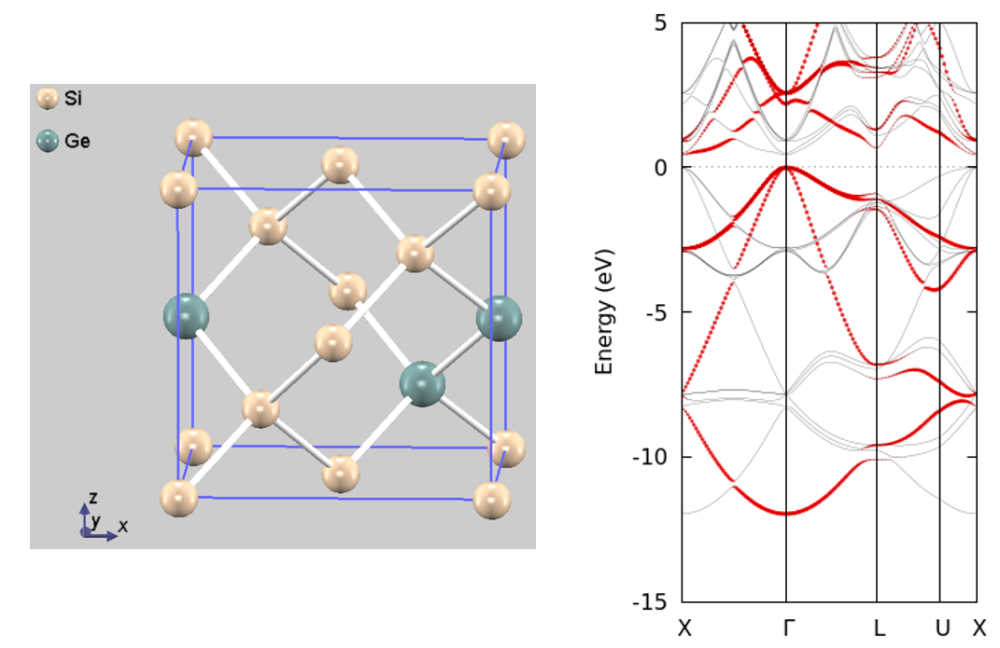

.. _estructure_chapter:

電子状態解析：バンド構造と状態密度
===================================

全状態密度
--------------
全状態密度の計算方法については :numref:`firststep_fc_section`, :numref:`section_basics_Si2`, :numref:`section_total_density_of_states` などを参照してください。

局所状態密度
--------------

機能の概要
~~~~~~~~~~~~

計算した電子状態を解析するため状態密度や電子密度を描きますが、複雑な物質になると解析が困難になります。
原子領域の状態密度を求めることにより、結合状態の解析が可能となります。積層構造や界面構造の場合に層毎の状態密度を計算すると、積層による電子状態の変化の解析や界面状態の同定ができます。
原子分割と層分割の局所状態密度の計算の仕方をBaO/Si(001)界面を例に説明します。

簡単のため、BaOの格子定数にSiと同じ格子定数(5.43Å)を用います。そして、 :numref:`advanced_BaO_image1` に示すように、BaO/Si(001)界面の原子構造は5層からなるシリコン層と6層からなるBaO層をOで繋げた構造にします。このBaO/Si(001)界面の計算例題は :code:`samples/dos_band/BaO_Si001` です。

入力パラメータの構造に関する部分は次のようになっています。

.. code-block:: text

  structure{
     unit_cell_type=bravais
     unit_cell{
       !! a_Si=5.43 A, c-axis=5*a_Si
       !! (c.f. a_BaO=5.52 A)
       #units angstrom degree
       a = 3.83958982184, b= 3.83958982184, c= 27.15
       alpha=90.0, beta=90.0, gamma=90.0
     }
     symmetry{
       tspace{
         system = primitive
         generators {
           #tag rotation tx  ty  tz
                 E         0   0   0
                 C2z       0   0   0
         }
       }
       sw_inversion = off
     }
     magnetic_state = para  !{para|af|ferro}
     atom_list{
       coordinate_system = internal ! {cartesian|internal}
       atoms{
         #default mobile=no
         #tag element  rx     ry     rz     num_layer
             Ba       0.0000 0.5000 0.05   1
             O        0.5000 0.0000 0.05   1
             Ba       0.5000 0.0000 0.15   2
             O        0.0000 0.5000 0.15   2
             Ba       0.0000 0.5000 0.25   3
             O        0.5000 0.0000 0.25   3
             O        0.0000 0.5000 0.35   4
             Si       0.0000 0.0000 0.40   5
             Si       0.5000 0.0000 0.45   6
             Si       0.5000 0.5000 0.50   7
             Si       0.0000 0.5000 0.55   8
             Si       0.0000 0.0000 0.60   9
             O        0.5000 0.0000 0.65  10
             Ba       0.5000 0.0000 0.75  11
             O        0.0000 0.5000 0.75  11
             Ba       0.0000 0.5000 0.85  12
             O        0.5000 0.0000 0.85  12
             Ba       0.5000 0.0000 0.95  13
             O        0.0000 0.5000 0.95  13
         }
       }
       element_list{ !#tag element  atomicnumber  zeta  dev
           Si            14  0.00  1.5
           Ba            56  0.00  1.5
           O              8  0.00  1.5
         }
       }

原子構造の緩和には時間がかかるので、mobileをnoに設定して構造緩和を行いません。

原子分割局所状態密度
~~~~~~~~~~~~~~~~~~~~~~

原子分割の局所状態密度を計算するにはタグPostprocessingの中にタグdosとタグldosを書きます。そして、タグdosの中の変数sw_dosをONにし、タグldosの中の変数sw_aldosをONにします（phase/0 2015.01以下のバージョンではではsw_dos=OFFでsw_aldos=ONに設定した場合、異常終了しますのでご注意下さい）。

.. code-block::

  Postprocessing{
     dos{
         sw_dos = ON
         method = g
     }
     ldos{
        sw_aldos = ON
        aldos{
           crtdst = 6.0 bohr
           naldos_from = 1
           naldos_to   = 19
        }
     }
  }

タグaldosの中の変数crtdstは単位格子を原子ごとにボロノイ多面体分割するときの臨界距離です。どの原子からもこの臨界距離以上離れている領域は真空領域とみなされます。真空領域の状態密度は、（原子の個数+1）番目の原子局所状態密度として表されます。
naldos_formとnaldos_toに原子分割局所状態密度を計算する最初の原子と最後の原子を指定します。これを指定しないと全原子について原子分割局所状態密度が計算されます。また、タグatomsの中で変数aldosをoffにした原子の局所状態密度は計算されません。変数aldosよりもnaldos_fromとnaldos_toの方が優先されます。

計算結果はdos.dataに出力されます。状態密度図を作成するには、付属のPerlスクリプトdos.plを使います。以下のようにすれば、dos_a001.eps,dos_a002.eps,...,dos_axxx.epsといったポストスクリプトファイルが作成されます。

.. code-block:: bash

   % ../../../tools/bin/dos.pl dos.data -erange=-30,5 -dosrange=0,12 -mode=atom

BaO/Si(001)界面の原子分割局所状態密度を計算した結果を :numref:`advanced_BaO_image1` に示します。
Si,Ba,Oの原子分割局所状態密度にそれぞれの原子の特徴を見ることができます。

.. figure:: images/image9.svg
 :name: advanced_BaO_image1

 BaO/Si(001)界面構造の原子分割の局所状態密度。上のパネル：Si層中央のSiの局所状態密度。中央のパネル：BaO層中央のBaの局所状態密度。下のパネル：BaO層中央のOの局所状態密度。

層分割局所状態密度
~~~~~~~~~~~~~~~~~~~~~~

層分割の局所状態密度を計算するにはタグPostprocessingの中にタグdosとタグldosを書きます。そして、タグdosの中の変数sw_dosをONにし、タグldosの中の変数sw_layerdosをONにします（原子分割局所状態密度の計算の場合と同様、phase/0 2015.01以下のバージョンでは、sw_dos=OFFでsw_layer=ONに設定した場合、異常終了しますのでご注意下さい）。

.. code-block:: text

    dos{
        sw_dos = ON
        method = g
    }
    ldos{
       sw_layerdos = ON
       layerdos{
          slicing_way = by_atomic_positions !{regular_intervals|by_atomic_positions}
          deltaz = 1.0 angstrom
          normal_axis = 3
          crtdst = 3.5 bohr
       }
    }

タグlayerdosの中の変数normal_axisでは層分割するときの層の法線方向を指定します。1がa軸で、2がb軸で、3がc軸を表します。変数slicing_wayにby_atomic_positionsを指定すると、原子位置によって局所状態密度を計算する層を定めることができます。この場合、atomsテーブルのnum_layerによって、原子が含まれる層の番号を指定します。先に示した、構造の入力部分では13個の層に各原子を割り当てています。変数slicing_wayにregular_intervalsを指定すると、ある領域を等間隔に分割して作成した各層について局所状態密度を計算します。その間隔は変数deltazに入力します。変数crtdstは層を作成する領域を決める臨界距離です。端の原子からこの臨界距離まで層を作成します。

層の範囲に関する下記のような記述がoutput000に出力されます。

.. code-block:: text

  !!ldos     no,        min,           max
  !!ldos    1          0.00000000          5.13060607
  !!ldos    2          5.13060607         10.26121214
  !!ldos    3         10.26121214         15.39181821
  !!ldos    4         15.39181821         19.23977276
  !!ldos    5         19.23977276         21.80507579
  !!ldos    6         21.80507579         24.37037883
  !!ldos    7         24.37037883         26.93568186
  !!ldos    8         26.93568186         29.50098489
  !!ldos    9         29.50098489         32.06628793
  !!ldos   10         32.06628793         35.91424248
  !!ldos   11         35.91424248         41.04484855
  !!ldos   12         41.04484855         46.17545462
  !!ldos   13         46.17545462         51.30606069
  !!ldos   14          0.00000000          0.00000000

noは層の番号です。minとmaxは層の下端の位置と上端の位置を示します。最後の層は指定した以外の領域です。

計算結果はdos.dataに出力されます。状態密度図を作成するには、付属のPerlスクリプトdos.plを使います。以下のように実行すると、ポストスクリプトファイルdos_l001.eps,dos_l002.eps,...,dos_lxxx.epsが作成されます。

.. code-block:: bash

  % ../../../tools/bin/dos.pl dos.data -erange=-20,5 -dosrange=0,20 -mode=layer

BaO/Si(001)界面の層分割局所状態密度を計算した結果を :numref:`advanced_BaO_image2` に示します。

.. figure:: images/image10.svg
 :name: advanced_BaO_image2

 BaO/Si(001)界面構造の層分割局所状態密度。一番上のパネル：Si層の中央領域の局所状態密度。上から二番目のパネル：BaO/Si(001)界面のSi側の局所状態密度。中央のパネル：BaO/Si(001)界面の酸素あたりの局所状態密度。下から二番目のパネル：BaO/Si(001)界面のBaO側の局所状態密度。一番下のパネル：BaO層の中央領域の局所状態密度。

ウルトラソフト型擬ポテンシャルを利用している場合の高速化
~~~~~~~~~~~~~~~~~~~~~~~~~~~~~~~~~~~~~~~~~~~~~~~~~~~~~~~~~

ウルトラソフト擬ポテンシャルを利用して局所状態密度計算する場合、非常に多くの計算時間がかかってしまうことがあります。これは欠損電荷の計算に時間がかかってしまうからなのですが、この計算を実空間で行うことによって高速化を実現することができます。欠損電荷の計算を実空間で行うには、以下のような設定を行います。

.. code-block:: text

  Postprocessing{
    dos{
      sw_dos = on
    }
    ldos{
      sw_rspace = on
      sw_aldos = on
      sw_layerdos = on
      aldos{
        ...
        ...
      }
      layerdos{
        ...
        ...
      }
    }
  }

ldosブロックで変数sw_rspaceを定義し、その値をonとすれば欠損電荷の計算を実空間で行わせることができます。

.. _advanced_accurate_ldos_section:

高精度な局所状態密度 (バージョン2021.01以降)
~~~~~~~~~~~~~~~~~~~~~~~~~~~~~~~~~~~~~~~~~~~~~~

概要
^^^^^^
原子分割局所状態密度とは、空間を原子ごとの領域に分割し、その領域における電子状態密度をもとめる計算機能です。積算状態密度のフェルミエネルギーにおける値を調べることによって、対象原子の電子数をもとめるという用途に用いることも可能です。

原子分割局所状態密度は、波動関数および電荷密度の実空間におけるFFTメッシュを空間上で最も近い原子に割り当て、その寄与分を加算することによって計算します。このような方法の場合、実空間のFFTメッシュと原子位置の関係によって対称性から等価な原子間でも割り当たるメッシュ数などが異なり、結果が微妙に異なる場合があります。言い換えると、原子配置を単位胞に対してどのように定義するかによって計算結果が変化します。たとえば、対称性から等価なはずの原子の電子数が互いに異なる値となってしまう場合があります。この振る舞いを改善するため、2021年版以降電荷密度の割り当てを実空間FFTメッシュではなく原子中心メッシュに切り替えて評価する方法を用いることができます。このようにするとメッシュは常に同じように各原子に割り当てられるため、原子配置を単位胞に対してどう定義するかによって結果が左右されにくくなります。原子中心メッシュは原子ごとに定義され、その値は実空間FFTメッシュ上の値の三次元線形補間によって求められます。

使い方
^^^^^^^
原子中心メッシュによる局所状態密度計算の指定は、postprocessingブロックにおけるldosブロックにおいて行います。以下のような指定を行います。

.. code-block::

  postprocessing{
    dos{
      sw_dos = on
      method = t
    }
    ldos{
      sw_aldos = on
      aldos{
        sw_atom_centered_mesh = on
        atom_centered_mesh_factor = 1
      }
    }
  }

postprocessingブロックにdosブロックを作ると、全状態密度の設定を行うことができます。局所状態密度の計算の基本設定は全状態にならう形式になっているので、ここでの設定は局所状態密度にもあてはまります。ldosブロックにおいて局所状態密度計算の設定を、さらにその下のaldosブロックにおいて原子分割局所状態密度計算の設定を行います。aldosブロックにおいて新たに利用できるようになった設定項目は下記の通り。

* sw_atom_centered_meshもしくはsw_ac_mesh : onとすることによって、原子分割局所状態密度計算のメッシュが実空間FFTメッシュから原子中心メッシュに切り替わります。デフォルト値はoff.
* atom_centered_mesh_factorもしくはac_mesh_factor : 原子中心メッシュはデフォルトの振る舞いではその“濃さ”は実空間FFTメッシュと同じですが、ここで指定する係数分増やすことも可能です。たとえば2とすると、3方向のメッシュ数がそれぞれ2倍となります。その結果計算量は8倍となる点は注意が必要です。デフォルト値は1.

例題
^^^^^^^
Si結晶およびグラファイトの例題がサンプルディレクトリーの ``samples/dos_band/aldos_by_acmesh`` 以下にあります。Si結晶の例題はディレクトリーSi2以下、グラファイトの例題はディレクトリーgraphite以下に配置されており、それぞれ ``acmesh`` と ``fftmesh`` フォルダーが存在し、前者が原子中心メッシュを用いた局所状態密度計算、後者がFFTメッシュを用いた局所状態密度計算の入力ファイルが格納されています。

いずれの結晶も、精度の高い結果が得られるよう比較的大きなカットオフエネルギー(80 Rydberg)を採用しています。また、精密な状態密度を得るため四面体法を用いる設定を施しています。すなわち、入力パラメーターファイルには以下のような設定が施されています。

.. code-block::

 accuracy{
   cutoff_wf =  80 rydberg
   ...
   ksampling{
      method = mesh
      ...
   }
   smearing{
     method = t
   }
 }

それぞれの最下層のディレクトリーにおいて計算を実行すると、SCF計算のあと状態密度の計算が行われ、結果がdos.dataファイルに記録されます。原子分割局所状態密度の計算結果は ``ALDOS     num_atom =      aid`` という文字列からはじまる行以降に記録されます。ここで ``aid`` は原子のIDで、各原子の入力ファイルにおける定義順に対応します。各原子の電子数はフェルミエネルギーにおける積算状態密度の値です。
dos.dataファイルは(スピンを考慮していない場合)4カラム目のデータがフェルミエネルギーを原点としたエネルギー、6カラム目が積算状態密度に対応するので、4カラム目が0となる行の6カラム目の値がその原子の電子数に対応することになります。たとえば以下のようなデータがdos.dataに記録されている場合、1番目の原子の電子数はおおよそ3.9803となります。

.. code-block::

    ...
    ...
  ALDOS     num_atom =       1
    No.   E(hr.)        dos(hr.)         E(eV)          dos(eV)              sum
       6  -0.33730      0.0000000000    -11.955933      0.0000000000        0.0000000000
      16  -0.33630      0.0000000000    -11.928722      0.0000000000        0.0000000000
    ...
    ...
    4366   0.09870      0.6019928210     -0.091764      0.0221228201        3.9797782305
    4376   0.09970      0.2103606325     -0.064553      0.0077306078        3.9801773503
    4386   0.10070      0.0555466368     -0.037342      0.0020413005        3.9802911964
    4396   0.10170      0.0056133904     -0.010130      0.0002062882        3.9803167566
    4406   0.10270      0.0000000000      0.017081      0.0000000000        3.9803179066
    4416   0.10370      0.0000000000      0.044293      0.0000000000        3.9803179066
    ...
    ...

以下、この例題によって得られるSi結晶およびグラファイトのある原子の電子数を報告します。

.. table:: 本例題によって得られる電子数
 :widths: auto
 :name: acmesh_table1

 +-------------+------------+------------+-----------+
 | Si, fftmesh | Si, acmesh | C, fftmesh | C, acmesh |
 +-------------+------------+------------+-----------+
 |   3.9803    |   4.0000   |  4.0537    |  3.9992   |
 +-------------+------------+------------+-----------+

いずれの例題もすべての原子は対称性から等価なため、電子数としては4という値が得られるはずです。
表の値から明らかなように、原子中心メッシュともにFFTメッシュの結果よりも正しい解に近い結果が得られています。

射影状態密度
-------------

PHASEには、軌道ごとに射影した状態密度を計算する機能もあります。ここでは、射影状態密度を計算する方法を紹介します。

入力パラメータ
~~~~~~~~~~~~~~~~

射影状態密度を計算するには、射影したい軌道の設定を以下のように指定します。

.. code-block:: text

  accuraccy{
     ...
     projector_list{
       projectors{
         #tag no group radius l t
           1 1 1.0 0 1
           2 1 1.0 1 1
           3 2 1.5 0 2
           4 2 1.5 1 2

       }
     }
  }

no に軌道の識別番号を指定します。省略可能です。groupには、“軌道グループ” を指定します。ひとまとめに扱いたい軌道には同じgroup値を指定します。radiusには軌道の半径をボーア単位で指定します。原子間距離の半分程度よりも小さな値が目安となります。デフォルト値は1 bohr です。l には、軌道角運動量を指定します。0 がs 軌道、1 がp 軌道、2 がd 軌道、3 がf 軌道に対応します。最後に、t に主量子数を指定します。ただし、この場合の主量子数とは擬ポテンシャルから見た場合の主量子数であり、ほとんどの場合1となります。擬ポテンシャルによっては角運動量が同じ軌道が2つ定義されている場合があります。2つのうちエネルギーの高い方を指定したい場合にt の値を2 としてください。

次に、定義した射影演算子を原子に割り当てます。これは、以下のように原子配置の定義において属性値proj\_groupを追加して指定します。

.. code-block:: text

 structure{
    atom_list{
      atoms{
        #tag element rx ry rz mobile proj_group
            Fe1 0.0 0.0 0.14783 on 1
            Fe2 0.0 0.0 0.35217 on 2
            Fe1 0.0 0.0 0.85217 on 1
            Fe2 0.0 0.0 0.64783 on 2
            ...
            ...
      }
    }
 }

磁気量子数と軌道の性格の対応表

.. list-table::
   :header-rows: 1
   :widths: 5,5,5,5,5

   * - | 占有行
       | 列の添え字
     - :math:`l = 0`
     - :math:`l = 1`
     - :math:`l = 2`
     - :math:`l = 3`
   * - 1
     - :math:`s`
     - :math:`x`
     - :math:`3z^{2} - r^{2}`
     - :math:`z(5z^{2} - 3r^{2})`
   * - 2
     -
     - :math:`y`
     - :math:`x^{2} - y^{2}`
     - :math:`x(5z^{2} - r^{2})`
   * - 3
     -
     - :math:`z`
     - :math:`xy`
     - :math:`y(5z^{2} - r^{2})`
   * - 4
     -
     -
     - :math:`yz`
     - :math:`z(x^{2} - y^{2})`
   * - 5
     -
     -
     - :math:`zx`
     - :math:`xyz`
   * - 6
     -
     -
     -
     - :math:`x(x^{2} - 3y^{2})`
   * - 7
     -
     -
     -
     - :math:`y(3x^{2} - y^{2})`

この例では、Fe1 にgroup が1 の軌道グループを、Fe2 にgroup が2の軌道グループを指定しています。異種元素間では異なる軌道グループを指定する必要があります。

postprocessingブロックにおいて射影演算子を計算するためのスイッチを有効にします。

.. code-block:: text

 postprocessing{
    ...
    pdos{
      sw_pdos = on
    }
 }

射影状態密度の計算方法は、postprocessing のdosブロックにおける指定に従います。

計算結果の出力
~~~~~~~~~~~~~~~~~~~

.. code-block:: text

 PDOS: ia= 2 l= 1 m= 1 t= 1
 No. E(hr.) dos(hr.) E(eV) dos(eV) sum
  6 -1.95781 0.0000000000 -56.762838 0.0000000000 0.0000000000
 16 -1.95681 0.0000000000 -56.735626 0.0000000000 0.0000000000
 26 -1.95581 0.0000000000 -56.708415 0.0000000000 0.0000000000
 36 -1.95481 0.0000000000 -56.681204 0.0000000000 0.0000000000
 46 -1.95381 0.0085366260 -56.653992 0.0003137151 0.0000002437
 56 -1.95281 0.0176460501 -56.626781 0.0006484801 0.0000254127

PDOS:
という文字列から始まる行が、射影状態密度データの始まりをあらわします。ia=の後に対応する原子のID
が,
l=のあとに対応する軌道角運動量が、m=のあとに対応する磁気量子数が、t=のあとに対応する主量子数が出力されます。それ以降の行は、通常の状態密度データと同じです。磁気量子数と軌道の性格の対応は、表に示しています。

射影状態密度データを含んだdos.data の処理には、dos.pl に-mode=projected
オプションをつけて実行します。

.. code-block:: bash

 % dos.pl dos.data -mode=projected -color -with_fermi

実行すると、EPS 形式のファイルdos_aAAAlLmMtT.eps が出力されます。AAA
は原子のID, L は軌道角運動量、M は磁気量子数、T
は主量子数に対応した数字です。また、 -data=yes
オプションを利用すると、軌道ごとに分割された状態密度データファイルを得ることができます。そのファイル名は、EPS
ファイルの拡張子をdata に変更したものとなります。

計算例：BaTiO\ :sub:`3` 結晶の射影状態密度
~~~~~~~~~~~~~~~~~~~~~~~~~~~~~~~~~~~~~~~~~~~~

BaTiO\ :sub:`3`
結晶の射影状態密度を計算した例です。
この例題は :code:`samples/dos_band/pdos/BaTiO3` 以下にあります。

BaTiO\ :sub:`3`
はペロブスカイト構造をとる結晶です。厳密には正方晶ですが、立方晶に非常に近い結晶構造です。この例では、結晶構造を以下のように指定し、立方晶として設定しています。

.. code-block:: text

 structure{
    atom_list{
      atoms{
        #units angstrom
        #tag element rx ry rz proj_group
              Ba 0.00 0.00 0.00
              O 0.50 0.50 0.00 2
              O 0.50 0.00 0.50 2
              O 0.00 0.50 0.50 2
              Ti 0.50 0.50 0.50 1
      }
    }
    unit_cell{
      #units angstrom
      a_vector = 4 0.00 0.00
      b_vector = 0.00 4 0.00
      c_vector = 0.00 0.00 4
    }
 }

射影する軌道は、以下のように指定します。

.. code-block:: text

 accuracy{
    projector_list{
      projectors{
        #tag no group radius l
              1 1 1.0 2
              2 2 1.0 1
      }
    }
 }

グループ1 はl が2(d 軌道)、グループ2 はl が1(p 軌道) であり、それぞれTi
とO に割り当てています。最後に、postprocessing
ブロックにおいて射影状態密度を計算する機能を有効にしています。

.. code-block:: text

 postprocessing{
    dos{
      sw_dos = on
      method = tetrahedral
    }
    pdos{
      sw_pdos = on
    }
 }

状態密度計算はtetrahedral 法を利用しています。したがって、k
点サンプリングはmesh 法、smearingはtetrahedral 法を指定しています。

BaTiO3 結晶の全状態密度を :numref:`advanced_pdos_image1` に、Ti のd 軌道に射影した状態密度を :numref:`advanced_pdos_image2` に示します。

.. figure:: images/image14.svg
 :name: advanced_pdos_image1
 :width: 480px

 BaTiO3 結晶の全状態密度

.. figure:: images/image15.svg
 :name: advanced_pdos_image2
 :width: 480px

 Ti のd 軌道の射影状態密度

.. _advanced_projected_band:

バンド構造
--------------
通常のバンド構造の計算方法については :numref:`firststep_fc_section` や :numref:`section_band_structure` を参照してください。

射影バンド構造（バージョン2020.01以降）
----------------------------------------

機能の概要
~~~~~~~~~~~

射影状態密度 (PDOS)
を求めるとき、SCFにおける各波動関数に対してprojectorで指定した原子軌道への射影を行います。同様の処理をバンド計算で得られた各波動関数に対して行うことにより、その射影成分を出力することができます。軌道射影バンド計算では、各波動関数に対して原子軌道への射影を行い、その(重み)成分をファイルに出力します。このとき、原子軌道の球面調和関数部分は空間に固定されたもので、化学結合の方向には依りません。化学結合の方向を考慮するには、軌道占有行列を対角化し、その固有ベクトルを係数とした原子軌道の線形結合を用います。ただし、軌道占有行列はバンド計算では得られないため、事前にSCF計算を行っておく必要があります。

　対角化して得られた原子軌道を使用するか否かは、ユーザー指定のスイッチにより切り替えることができます。可視化については
band.pl と同様に、gnuplot
の描画機能を用いるperlスクリプトが付属します。このスクリプトを用いると、射影した軌道の成分を、明暗などによりバンド分散上にマップすることができます。

使い方
~~~~~~~~~~

入力パラメーター
^^^^^^^^^^^^^^^^^^

1) SCF 計算

占有行列を計算し、ファイルに出力するには、orbital_population
ブロック内で、sw_write_orb_dens_mat_file = on
とします。これ以外には、PDOSと同様に、射影する軌道の指定を行います。

占有行列をファイルに出力するための入力 (軌道射影バンドの前処理)

.. code-block:: text

 accuracy{
   projector_list{
     projectors{
       #tag group radius l
             1 2.5 2
     }
   }
 }
 structure{
   atom_list{
     atoms{
       #tag element rx ry rz proj_group
             Ni1 0.000 0.000 0.000 1
     }
   }
 }
 postprocessing{
   orbital_population{
     sw_write_orb_dens_mat_file = on
   }
 }

2) バンド計算

　軌道射影バンドの計算は固定電荷モードで行います。各波動関数の軌道射影成分をファイルに出力するには、wf_orb_projectionブロック内で
sw_calc_wf_orb_projection = on
とします。この時、占有行列を対角化して得られた軌道を使用するには、さらにorbital_populationブロック内で
sw_diagonalize_population = on を指定します。

軌道射影バンド計算の入力例

.. code-block:: text

 accuracy{
   projector_list{
     projectors{
       #tag group radius l
             1 2.5 2
     }
   }
 }
 structure{
   atom_list{
     atoms{
       #tag element rx ry rz proj_group　key
             Ni1 0.000 0.000 0.000 1 1
     }
   }
 }
 postprocessing{
   orbital_population{
     sw_diagonalize_population = on
   }
   wf_orb_projection{
     sw_calc_wf_orb_projection = on
   }
 }

出力
^^^^^^

1) SCF計算

F_PORB_DENS_MATで指定したファイル
(デフォルト名：porb_density_matrix.data )
に、占有行列がバイナリ形式で出力されます。

2) バンド計算

　F_WFK_ORB_PROJ で指定したファイル　(デフォルト名：wfn_orb_proj.data )
に、各波動関数の軌道射影成分がテキスト形式で出力されます。key は、表
5‑2のkey値が対応する。また、score_bond
は、軌道が広がる方向に原子が存在するか否かを判定した値です。ここで、m番目の軌道のscore_bondは、

.. math:: {\rm score\_bond(m)} = \frac{1}{4\pi} \frac{1}{2l+1} \sum_{i}^{\rm neighbor} \left| \sum_{m=1}^{2l+1} c_{m'm}^l Y_{lm'} \left(\Theta_i, \phi_i \right) \right|^2

で定義します。例えば、8面体サイトの中央原子のd軌道では、score_bond値 が
0 の軌道がt2g に対応します。

PBAND計算の出力例
^^^^^^^^^^^^^^^^^^^

.. code-block:: text

 # Orbital Projection for bands
 num_kpoints = 88
 num_bands = 40
 nspin = 2
 num of orbitals = 16
 population_diag_mode = 1
 # Orbital Info.
 iorb ia l m' tau element key score_bond
 1 1 2 1 1 Ni1 1 3.00000
 2 1 2 2 1 Ni1 1 3.00000
 (中略)
 =================
 ik = 1 ( -0.00000000 0.50000000 0.50000000 )
 1 1 2 1 1 : iorb, ia, l, m', tau
 0.0000000000 0.0291274666 0.0000000292 0.6901602135
 (後略)

スクリプトの利用による可視化
^^^^^^^^^^^^^^^^^^^^^^^^^^^^^^^

band_orbital_proj.pl
を用いると、gnuplotを用いて可視化したファイルが生成されます。以下にその使用法を示します。このスクリプトは、ユーザーが指定した条件を満たす軌道射影成分を合計して、ファイルplot_band_orbproj.datに出力します。同時に生成されるplot_band_orbproj.gnu
は gnuplot 用のファイルです。

band_orbital_proj.plの引数

.. code-block:: text

 band_orbital_proj.pl EnergyDataFile KpointFile OrbProjFile
 -erange=Emin,Emax -einc=dE -with_fermi
 -atom_range=amin,amax -il=L -im=M -tau=TAU
 -element=X -key=I -score_range=scmin,scmax
 -cbrange=Cbmin,Cbmax -circle_radius=SIZE -window_width=SIZE
 -color -print_format={eps,png} -outfile=AAA

EnergyDataFile はバンド固有値ファイル、KpointFile
はk点を生成するために使用したファイル、OrbProjFile
は上述の軌道射影成分を格納したファイルです。これらの3ファイルの指定は必須です。

.. table:: band_orbital_proj.plのオプション
 :widths: auto
 :class: longtable

 +-----------------------------+----------------------+----------------------+
 | オプション                  | 意味                 | デフォルト値         |
 +=============================+======================+======================+
 | -erange=Emin,Emax           | プロットするエネル   | なし                 |
 |                             | ギー領域を指定する。 |                      |
 +-----------------------------+----------------------+----------------------+
 | -einc=dE                    | 図の縦軸の increment | なし                 |
 |                             | を指定する。         |                      |
 +-----------------------------+----------------------+----------------------+
 | -with_fermi                 | フェルミエネルギー ( | なし                 |
 |                             | 0.0 eV               |                      |
 |                             | )の位置に線を引く。  |                      |
 +-----------------------------+----------------------+----------------------+
 |                             |                      |                      |
 +-----------------------------+----------------------+----------------------+
 |                             | 全軌道射影成分の     | 全原子               |
 | -atom_range=amin,amax       | うち、原子のインデッ |                      |
 |                             | クスがaminからamaxま |                      |
 |                             | での成分を取り出す。 |                      |
 +-----------------------------+----------------------+----------------------+
 | -il=L                       | 全軌道射影成分       | 全軌道量子数         |
 |                             | のうち、軌道量子数が |                      |
 |                             | Lの成分を取り出す。  |                      |
 +-----------------------------+----------------------+----------------------+
 | -im=M                       | 全軌道射影成分       | 全磁気量指数         |
 |                             | のうち、磁気量子数が |                      |
 |                             | Mの成分を取り出す。  |                      |
 +-----------------------------+----------------------+----------------------+
 | -tau=TAU                    | 全軌道射影成         | 全主量子数           |
 |                             | 分のうち、主量子数が |                      |
 |                             | T                    |                      |
 |                             | AUの成分を取り出す。 |                      |
 +-----------------------------+----------------------+----------------------+
 | -element=X -                | 全軌道射影成分のうち | 全原子タイプ         |
 |                             | 、原子タイプ名がXで  |                      |
 |                             | ある成分を取り出す。 |                      |
 +-----------------------------+----------------------+----------------------+
 | -key=I                      | 全軌道射影           | 全key                |
 |                             | 成分のうち、key値が  |                      |
 |                             | Iの成分を取り出す。  |                      |
 +-----------------------------+----------------------+----------------------+
 | -sco\                       | 全軌道射影成         | 制限なし             |
 | re_range=scmin,scmax        | 分のうち、score_bond |                      |
 |                             | 値がscminからscmaxま |                      |
 |                             | での成分を取り出す。 |                      |
 +-----------------------------+----------------------+----------------------+
 |                             |                      |                      |
 +-----------------------------+----------------------+----------------------+
 | -cbrange=Cbmin,Cbmax        | プロットするカラ     | なし                 |
 |                             | ーレンジを指定する。 |                      |
 +-----------------------------+----------------------+----------------------+
 | -circle_radius=SIZE         | プロットするデー     | 0.02                 |
 |                             | タの半径を指定する。 |                      |
 +-----------------------------+----------------------+----------------------+
 | -window_width=SIZE          | プロットするWindow   | 0.50                 |
 |                             | のサイズを指定する。 |                      |
 +-----------------------------+----------------------+----------------------+
 | -color                      | カラー出力を行う。   | NO                   |
 +-----------------------------+----------------------+----------------------+
 | -pr\                        | eps あるいは png     | eps                  |
 | int_format={eps,png}        | 出力のいず           |                      |
 |                             | れを行うか指定する。 |                      |
 +-----------------------------+----------------------+----------------------+
 | -outfile=AAA                | 可視化したファイル   | epsファイルの時は    |
 |                             | 名をAAAに指定する。  |                      |
 |                             |                      | orbital              |
 |                             |                      | _projected_band.eps, |
 |                             |                      |                      |
 |                             |                      | png ファイルの時は   |
 |                             |                      |                      |
 |                             |                      | orbita               |
 |                             |                      | l_projected_band.png |
 +-----------------------------+----------------------+----------------------+

以下に、band_orbital_proj.plの使用例を示します。この例では、key値1、il=2
(d軌道)、score_bond値が 0
から1の軌道射影成分を合計し、plot_band_orbproj.datに出力します。さらに、gnuplotを通して
png ファイル orbital_projected_band.pngを生成します。なお、nfenergy.data
はバンド固有値ファイル、bandkpt.in
はk点を生成するために使用したファイル、wfn_orb_proj.dataは軌道射影成分を出力したファイルです。

band_orbital_proj.plの使用例
^^^^^^^^^^^^^^^^^^^^^^^^^^^^^^^

.. code-block:: text

 band_orbital_proj.pl nfenergy.data bandkpt.in wfn_orb_proj.data
 -key=1 -il=2 -score_range=0,1 -color -print_format=png

例題
~~~~~

射影バンド構造の計算例を紹介します。入力（と出力の一部）は :code:`samples/dos_band/PBAND` 以下にあります。

MoS\ :sub:`2` / WS\ :sub:`2`
^^^^^^^^^^^^^^^^^^^^^^^^^^^^^

\ :numref:`advanced_MoS2_structure` (左) に、MoS\ :sub:`2` / WS\ :sub:`2`
の構造を示します。また、用いた計算条件を :numref:`advanced_PBAND_table1` に示します。格子定数は、事前に最適化して得られた値a = 3.232 Å, c = 12.417 Åを使用しました。

また、PBAND計算のために、MoS\ :sub:`2`
及びWS\ :sub:`2`\ のユニットにそれぞれkey 値1, 2 を与え、射影軌道を :numref:`advanced_PBAND_table2` のように指定しましたた。\ :numref:`advanced_PBAND_table3` に、postprocessingブロック内で使用したワードを示します。
最後に、 :numref:`advanced_MoS2_structure` にブリルアンゾーン及び対称点を示します。

.. table:: MoS\ :sub:`2`/WS\ :sub:`2` PBANDの計算条件
 :widths: auto
 :name: advanced_PBAND_table1

 ========================== ==========================
 波動関数カットオフ [Ry]    25
 電荷密度カットオフ [Ry]    225
 k点サンプリング            SCF計算 Monk (6×6×1)
 交換相関相互作用           GGAPBE
 擬ポテンシャル             Mo_ggapbe_paw_02.pp,
                            W_ggapbe_paw_01.pp,
                            S_ggapbe_paw_03.pp
 ========================== ==========================

.. table:: MoS\ :sub:`2` / WS\ :sub:`2` PBAND計算で使用した射影軌道
 :widths: auto
 :name: advanced_PBAND_table2

 ========== ===================================================
 原子タイプ 射影した軌道 (プロジェクタのカットオフ)
 ========== ===================================================
 Mo         s軌道 (2.0 bohr), p軌道 (2.0 bohr), d軌道 (2.4bohr)
 W          s軌道 (2.0 bohr), p軌道 (2.0 bohr), d軌道 (2.4bohr)
 S          s軌道 (1.6 bohr), p軌道 (1.8 bohr)
 ========== ===================================================

.. table:: MoS\ :sub:`2` / WS\ :sub:`2` PBAND計算におけるpostprocessingブロックの指定
 :widths: auto
 :name: advanced_PBAND_table3

 +--------------------------------+
 | SCF計算                        |
 +--------------------------------+
 | なし                           |
 +--------------------------------+
 | バンド計算                     |
 +--------------------------------+
 | wf_orb_projection{             |
 | sw_calc_wf_orb_projection = on |
 | }                              |
 +--------------------------------+

 （左）MoS\ :sub:`2` / WS\ :sub:`2` 構造。（右）ブリルアンゾーン及び対称点。

\ :numref:`advanced_MoS2_pband` :numref:`advanced_WS2_pband` に MoS\ :sub:`2` 及び WS\ :sub:`2`\ ユニットに対するPBAND
を示します。ここでは、s, p, d 軌道全成分を合計して表示しています。\ :numref:`advanced_bandprojpl_table` に、\ :numref:`advanced_MoS2_pband` に使用したコマンドを示します。

.. figure:: images/MoS2_pband.png
 :name: advanced_MoS2_pband

 MoS2構造のPBAND

 WS2構造のPBAND

.. table:: :numref:`advanced_MoS2_pband` 作成に使用したコマンド
 :widths: auto
 :name: advanced_bandprojpl_table

 +-----------------------------------------------------------------+
 | band_orbital_proj.pl nfenergy.data bandkpt.in wfn_orb_proj.data |
 |                                                                 |
 | -key=1 -with_fermi -erange=-5,5 -einc=1                         |
 |                                                                 |
 | -cbrange=0.00,0.5 -color -print_format=png -outfile=Key1.png    |
 +-----------------------------------------------------------------+

NiO
^^^^^^

:numref:`advanced_bandproj_NiO_cond` に用いた計算条件を示します。なお、原子配置や格子定数、k点座標は既存のサンプルに記載の値を流用しました。
:numref:`advanced_bandproj_NiO_cond_postproc` に、postprocessingブロック内で使用したワードを示します。 :numref:`advanced_NiO_pband_t2g` :numref:`advanced_NiO_pband_eg` に、Ni 3d 軌道の t2g 及び eg 成分のプロットを示します。

.. table:: NiO PBANDの計算条件
 :widths: auto
 :name: advanced_bandproj_NiO_cond

 ======================= ==================================
 波動関数カットオフ [Ry] 25
 電荷密度カットオフ [Ry] 225
 k点サンプリング         SCF計算：Monk (4×4×4)
 交換相関相互作用        GGAPBE+U

                         ( U\ :sub:`eff` = 5.0eV on Ni 3d,

                         プロジェクタカットオフ：2.5 bohr )
 擬ポテンシャル          Ni_ggapbe_paw_01.pp,

                         O_ggapbe_paw_02.pp
 ======================= ==================================

.. table:: NiO PBAND計算における postprocessing ブロックの指定
 :widths: auto
 :name: advanced_bandproj_NiO_cond_postproc

 +---------------------------------+
 | SCF計算                         |
 +---------------------------------+
 | orbital_population{             |
 |                                 |
 | sw_write_orb_dens_mat_file = on |
 |                                 |
 | }                               |
 +---------------------------------+
 | バンド計算                      |
 +---------------------------------+
 | orbital_population{             |
 |                                 |
 | sw_diagonalize_population = on  |
 |                                 |
 | }                               |
 |                                 |
 | wf_orb_projection{              |
 |                                 |
 | sw_calc_wf_orb_projection = on  |
 |                                 |
 | }                               |
 +---------------------------------+

.. figure:: images/band_t2g.png
 :name: advanced_NiO_pband_t2g

 NiO のPBAND。Ni d 軌道 t2g。左右はそれぞれ、アップ及ぶダウンスピン成分に対応する。

.. figure:: images/band_eg.png
 :name: advanced_NiO_pband_eg

 NiO のPBAND。Ni d 軌道 eg。左右はそれぞれ、アップ及ぶダウンスピン成分に対応する。

.. table:: :numref:`advanced_MoS2_pband` 作成に使用したコマンド
 :numref:`advanced_NiO_pband_t2g` :numref:`advanced_NiO_pband_eg` 作成に使用したコマンド

 +-----------------------------------------------------------------+
 | t2g                                                             |
 +-----------------------------------------------------------------+
 | band_orbital_proj.pl nfenergy.data bandkpt.in wfn_orb_proj.data |
 |                                                                 |
 | -atom_range=1,2 -il=2 -score_range=0,1                          |
 |                                                                 |
 | -erange=-4,6 -color -print_format=png -outfile=band_t2g.png     |
 +-----------------------------------------------------------------+
 | eg                                                              |
 +-----------------------------------------------------------------+
 | band_orbital_proj.pl nfenergy.data bandkpt.in wfn_orb_proj.data |
 |                                                                 |
 | -atom_range=1,2 -il=2 -score_range=2,4                          |
 |                                                                 |
 | -erange=-4,6 -color -print_format=png -outfile=band_eg.png      |
 +-----------------------------------------------------------------+

.. _advanced_band_unfold_section:

band-unfolding計算機能（2020.01以降）
-------------------------------------

概要
~~~~~~

Band-unfolding計算機能とは、「基本格子の逆格子ベクトルのBZ内の対称点を結ぶ
k点で、スーパーセルのバンド計算を行い、バンド計算終了後、各波動関数のGベクトル成分のうち、基本格子の逆格子ベクトルの周期をもつ成分を取り出すフィルターをかけ、その
(重み)成分をファイルに出力する」機能です。可視化については band.pl
と同様に、gnuplot の描画機能を用いるようなperlスクリプトが付属します。

各k点で波動関数 :math:`\psi_{nk\sigma}` (バンドn、スピン :math:`\sigma` )が得られた後、スペクトル強度

.. math:: A_{nk\sigma} = \sum_{G \in G_{\rm pr}} \left| \left< G | \psi_{nk\sigma} \right> \right|^2
  :label: advanced_bandunfold_eq1

を計算し、ファイルに出力します。ここで、Gprは、基本格子の逆格子ベクトルが作るGベクトルです。なお、非ノルム保存擬ポテンシャルの場合には、

.. math:: A_{nk\sigma} = \sum_{G \in G_{\rm pr}} \left| \left< G | \tilde{\psi}_{nk\sigma} \right> \right|^2 + \sum_I \sum_{\tau l m} \sum_{\tau' l' m'} q_{\tau l m, \tau' l' m'}^I f_{\tau l m}^{I \ast} f_{\tau' l' m'}^I, \\ f_{\tau l m}^I = \sum_{G \in G_{\rm pr}} \left< \beta_{\tau l m}^I | G \right> \left< G | \tilde{\psi}_{nk\sigma} \right>
  :label: advanced_bandunfold_eq2

となります。ここで、 :math:`\beta_{\tau l m}^I` は、原子I、主量子数 :math:`\tau` 、方位量子数 :math:`l` 、磁気量子数 :math:`m`
におけるプロジェクタです。また、 :math:`q_{\tau l m, \tau' l' m'}^I` は補償電荷です。

入力ファイル
~~~~~~~~~~~~~

band-unfolding計算機能を利用するには、reference_cell
ブロックで、基本格子ベクトルを指定します。また、band_unfoldingブロック内で
sw_band_unfolding = on
とします。なお、k点座標は、スーパーセルではなく基本格子のBZ
の対称点を結ぶ線上に生成しておく必要があります。

.. code-block:: text

 control{
   condition = fixed_charge
 }
 accuracy{
   ksampling{
     method = file
   }
 }
 structure{
   reference_cell{
     #units angstrom
     a_vector = 0.0000 2.1798 2.1798
     b_vector = 2.1798 0.0000 2.1798
     c_vector = 2.1798 2.1798 0.0000
   }
 }
 postprocessing{
   band_unfolding{
     sw_band_unfolding = on
   }
 }

出力ファイル
~~~~~~~~~~~~~~~~

スペクトル強度がF_BAND_SPECTR_WGHTで指定したファイル
(デフォルト：nfband_spectr_wght.data )
に出力される。の最小・最大値は0及び1である。

.. code-block:: text

 num_kpoints = 141
 num_bands = 32
 nspin = 1
 ik = 1 ( 0.00000000 0.50000000 0.50000000 )
 0.0000000000 0.3333333226 0.6331196968 0.0335469806
 0.2340754547 0.3217382137 0.4441863316 0.1846990206
 …
 (後略)

band_unfold.plスクリプトの利用
~~~~~~~~~~~~~~~~~~~~~~~~~~~~~~~~

band_unfold.pl
を用いると、gnuplotを用いて可視化するためのファイルが生成されます。以下にスクリプト使用法を示します。このスクリプトは、スペクトル強度
( plot_band_energy.dat ) あるいはスペクトル関数 ( plot_band_energy.map
) を出力ます。同時に生成されるplot_band_unfolding.gnu は gnuplot
用のファイルです。ここで、スペクトル強度は、 :eq:`advanced_bandunfold_eq1`  或いは :eq:`advanced_bandunfold_eq2` で定義されます。スペクトル関数は、

.. math:: A_{k\sigma} (w) = \sum_n A_{nk\sigma} \delta (w-\varepsilon_{nk\sigma})

で得るものとします。

.. code-block::

 (スペクトル強度をplotする場合)
 band_unfold.pl EnergyDataFile KpointFile SpectralWeightFile
 -erange=Emin,Emax -einc=dE -window_width=SIZE
 -with_dispersion -with_fermi -circle_radius=SIZE
 -color -print_format={eps,png} -outfile=AAA

 (スペクトル関数をplotする場合)
 band_unfold.pl EnergyDataFile KpointFile SpectralWeightFile
 -spectral_func
 -erange=Emin,Emax -einc=dE -window_width=SIZE
 -ndiv=VAL -sigma=VAL -line_width=VAL-cbrange=Cbmin,Cbmax
 -color -print_format={eps,png} -outfile=AAA

EnergyDataFile はバンド固有値ファイル、KpointFile
はk点を生成するために使用したファイル、SpectralWeightFile
は上述のスペクトル強度を格納したファイルです。これらの3ファイルの指定は必須です。

.. table:: band_unfold.plのオプション
 :widths: auto
 :class: longtable

 +-----------------------+-----------------------+--------------------+
 | オプション            | 意味                  | デフォルト値       |
 +=======================+=======================+====================+
 | -erange=Emin,Emax     | プロットするエネル    | なし               |
 |                       | ギー領域を指定する。  |                    |
 +-----------------------+-----------------------+--------------------+
 | -einc=dE -            | 図の縦軸の increment  | なし               |
 |                       | を指定する。          |                    |
 +-----------------------+-----------------------+--------------------+
 | -window_width=SIZE    | プロットするWindo     | 0.50               |
 |                       | wのサイズを指定する。 |                    |
 +-----------------------+-----------------------+--------------------+
 | -color                | カラー出力を行う。    | NO                 |
 +-----------------------+-----------------------+--------------------+
 | -p                    | eps あるいは png      | eps                |
 | rint_format={eps,png} | 出力のいず            |                    |
 |                       | れを行うか指定する。  |                    |
 +-----------------------+-----------------------+--------------------+
 | -outfile=AAA          | 可視化したファイ      | epsファイルの時は  |
 |                       | ル名をAAAに指定する。 |                    |
 |                       |                       | unfolded_band.eps, |
 |                       |                       |                    |
 |                       |                       | png ファイルの時は |
 |                       |                       |                    |
 |                       |                       | unfolded_band.png  |
 +-----------------------+-----------------------+--------------------+
 |                       |                       |                    |
 +-----------------------+-----------------------+--------------------+
 | スペクトル強度のみ    |                       |                    |
 +-----------------------+-----------------------+--------------------+
 | -with_dispersion      | スペ                  | なし               |
 |                       | クトル強度のみならず  |                    |
 |                       | 、計算したすべてのバ  |                    |
 |                       | ンドをプロットする。  |                    |
 +-----------------------+-----------------------+--------------------+
 | -with_fermi           | フェルミエネルギー (  | なし               |
 |                       | 0.0 eV                |                    |
 |                       | )の位置に線を引く。   |                    |
 +-----------------------+-----------------------+--------------------+
 | -circle_radius=SIZE   | スペクトル強度1.0     | 0.2                |
 |                       | (                     |                    |
 |                       | 最大値)に対応するデー |                    |
 |                       | タ点(円で表示)の半径  |                    |
 +-----------------------+-----------------------+--------------------+
 |                       |                       |                    |
 +-----------------------+-----------------------+--------------------+
 | スペクトル関数のみ    |                       |                    |
 +-----------------------+-----------------------+--------------------+
 | -spectral_func        | スペク                | なし               |
 |                       | トル関数を出力する。  |                    |
 +-----------------------+-----------------------+--------------------+
 | -ndiv=VAL             | 表示する              | 400                |
 |                       | エネルギー範囲内で、  |                    |
 |                       | スペクトル関数を計算  |                    |
 |                       | するエネルギーの点数  |                    |
 |                       | (均等分割)。          |                    |
 +-----------------------+-----------------------+--------------------+
 | -sigma=VAL            | スペク                | 0.05               |
 |                       | トル関数をGaussianで  |                    |
 |                       | 滑らかにする際の偏差  |                    |
 +-----------------------+-----------------------+--------------------+
 | -line_width=VAL       | スペクトル関数をプロ  | 4                  |
 |                       | ットする際の線の太さ  |                    |
 +-----------------------+-----------------------+--------------------+
 | -cbrange=Cbmin,Cbmax  | プロットするカラ      | なし               |
 |                       | ーレンジを指定する。  |                    |
 +-----------------------+-----------------------+--------------------+

以下に、band_unfold.plの使用例を示します。この例では、スペクトル強度を出力し、gnuplot
を通じて eps ファイルunfolded_band.epsを生成します。なお、nfenergy.data
はバンド固有値ファイル、bandkpt.in
はk点を生成するために使用したファイル、nfband_spectr_wght.dataはスペクトル強度を出力したファイルです。

.. code-block:: text

 band_unfold.pl nfenergy.data bandkpt.in nfband_spectr_wght.data -with_fermi -color

例題
~~~~~~

Band-unfolding機能の利用例を紹介します。入力（と一部出力）は :code:`samples/dos_band/Unfold` 以下のサブディレクトリーにあります。

Teドープ 2H-MoS\ :sub:`2`
^^^^^^^^^^^^^^^^^^^^^^^^^^^

\ :numref:`advanced_bandunfold_fig1` (左上)に2H-MoS\ :sub:`2` の基本格子を示します。この系を ab
面内に2倍した構造や、さらに2個のS原子をTe原子に置換した構造を考えます。用いた計算条件は以下のとおりです。

2H-MoS\ :sub:`2` の基本格子及びスーパーセルの計算における条件

======================= ====================================
波動関数カットオフ [Ry] 25
======================= ====================================
電荷密度カットオフ [Ry] 225
k点サンプリング         SCF計算：Monk (4×4×1)あるいは(2×2×1)
交換相関相互作用        PBE+D2
擬ポテンシャル          Mo_ggapbe_paw_02.pp,

                        S_ggapbe_paw_03.pp,

                        Te_ggapbe_paw_02.pp
======================= ====================================

\ :numref:`advanced_bandunfold_fig1` (左下)に2H-MoS\ :sub:`2`
基本格子のブリルアンゾーン及び対称点、(右)にバンド分散を示します。 :numref:`advanced_bandunfold_fig2` に、単位胞をab面内方向にそれぞれ2倍したスーパーセルに対する、アンフォールドしたバンド分散を示します。灰色の細線は全バンドの分散に対応し、各赤丸の半径はスペクトル強度に対応します。 :numref:`advanced_bandunfold_fig3` に、2個のS原子をTe原子に置換した構造に対する、アンフォールドしたバンド分散を示します。半径の異なる赤丸が多々見られるのは、Teの導入による周期の乱れを反映しています。

.. figure:: images/MoS2_BZ_band.png
 :name: advanced_bandunfold_fig1

 (左上) 2H-MoS\ :sub:`2`\ 基本格子の構造。(左下)ブリルアンゾーン及び対称点。(右)バンド分散。

 (左上) :numref:`advanced_bandunfold_fig1` を面内方向に2倍拡げたスーパーセル。 (左下) 基本格子のブリルアンゾーン及び対称点。(右)アンフォールドしたバンド分散。

.. figure:: images/image77.png
 :name: advanced_bandunfold_fig3

 (左上)図 5‑26の2個のS原子をTeに置換したスーパーセル。 (左下) 基本格子のブリルアンゾーン及び対称点。(右)アンフォールドしたバンド分散。

:numref:`advanced_bandunfold_fig4` に、 :numref:`advanced_bandunfold_fig3` と同じ系に対するスペクトル関数を示します。なお、スペクトル関数は

.. math:: A_{k\sigma} (w) = \sum_n A_{nk\sigma} \delta ( w -\varepsilon_{nk\sigma} )

で定義しています。

.. figure:: images/image79.png
 :name: advanced_bandunfold_fig4

 :numref:`advanced_bandunfold_fig3` と同じ系に対するスペクトル関数のプロット。

最後に、作図に使用したコマンドを示します。

:numref:`advanced_bandunfold_fig2` :numref:`advanced_bandunfold_fig3` :numref:`advanced_bandunfold_fig4` の生成に使用したコマンド

+----------------------------------------------------------------------+
| スペクトル強度のプロット                                             |
+======================================================================+
| band_unfold.pl nfenergy.data bandkpt.in nfband_spectr_wght.data      |
|                                                                      |
| -with_fermi -color -erange=-6,4 -print_format=png -with_dispersion   |
+----------------------------------------------------------------------+
| スペクトル関数のプロット                                             |
+----------------------------------------------------------------------+
| band_unfold.pl -spectral_func nfenergy.data bandkpt.in               |
| nfband_spectr_wght.data                                              |
|                                                                      |
| -with_fermi -color -erange=-6,4 -print_format=png                    |
+----------------------------------------------------------------------+

GeドープSi
^^^^^^^^^^^^

　:numref:`advanced_bandunfold_fig5` (左)に、Siブラベー格子内の8原子のうち、2原子をGe原子に置換した構造を示します。
この構造に対して、Si 2原子から成る基本格子のブリルアンゾーンを考え、対応するバンド分散を計算します。
計算条件は以下のとおりです。なお、格子定数 ( a = 5.543 Å)及び原子配置は、事前に最適化を行った値を使用しました。

GeドープSiの計算における条件

======================= =====================
波動関数カットオフ [Ry] 25
電荷密度カットオフ [Ry] 225
k点サンプリング         SCF計算：Monk (4×4×4)
交換相関相互作用        PAW-PBE
擬ポテンシャル          Si_ggapbe_paw_02.pp,

                        Ge_ggapbe_paw_02.pp
======================= =====================

\ :numref:`advanced_bandunfold_fig5`  (右)に、アンフォールドしたバンド分散を示します。
灰色の細線は全バンドの分散に対応し、各赤丸の半径はスペクトル強度に対応します。

:numref:`advanced_bandunfold_fig5` 作成に使用したコマンド

.. code-block::

 band_unfold.pl nfenergy.data bandkpt_fcc_xglux.in nfband_spectr_wght.data -with_fermi -print_format=png -color

 (左) GeドープSiの構造。(右)アンフォールドしたバンド。

.. _projected_surface_band_section:

バルクの電子バンドの表面ブリルアンゾーンへの射影（バージョン2022.01以降）
--------------------------------------------------------------------------

概要
~~~~~~

通常、表面の電子バンドは、(kz=0 を満たす) 対称点を結んだ k点座標 (kx, ky) に沿って計算を行います。バルクのバンドは、表面平行方向には上記と同じ (kx, ky)、垂直方向には [-0.5,0.5] を幾つか (Nz個) に等分割した kzで計算を行います。ただし、バルクモデルは、表面平行方向には表面モデルと同じ格子定数、また表面垂直方向に周期性をもった構造とします。

上記の要領で計算したバルクのバンドを表面ブリルアンゾーンに射影するには、各 (kx,ky)におけるエネルギー準位がバンド数×Nz個あるものとして、nfenergy.data を加工するスクリプトを用います。また、表面のバンドの背景にバルクのバンドを描画するには、次のようにな操作を行います。すなわち、各 (kx,ky) において、バルクのバンドエネルギー固有値nの -0.5 <= kz < 0.5 における最小値 :math:`e_{n,min}` 及び最大値 :math:`e_{n,max}` を算出し、 :math:`e_{n,min}` から :math:`e_{n,max}` まで塗りつぶすように可視化します。
なお、表面とバルクでは、エネルギーの原点が異なる点に注意が必要です。この対策として、両者のSCF計算の段階で、それぞれ原子平均ポテンシャルを算出しておきます。表面モデルの膜厚中心にある原子とバルクモデルの原子における平均ポテンシャルを比較し、両者の差をスクリプトの引数として与えます。

使い方
~~~~~~~~~~
k点座標生成
^^^^^^^^^^^^^

k点座標の生成方法を説明します。

表面ブリルアンゾーンに射影するバルクのバンド計算用 ``bandkpt.in`` はたとえば以下のように記述します。

.. code-block:: text

 0.01
   0.6076  0.0000  0.0000
   0.0000  0.8592  0.0000
   0.0000  0.0000  0.8592
 0 1 0 2 # X
 0 0 0 1 # {/Symbol G}
 1 0 0 2 # X'
   
この ``bandkpt.in`` ファイルに対して以下の要領で ``bankd_kpoint.pl`` を実行します。

.. code-block::

 band_kpoint.pl  bandkpt.in -zdiv=N -zshift=0

このように実行すると各 (kx,ky) にて、[-0.5,0.5] の範囲で N 等分した kz 値を出力します。zshift > 0 の場合には、kz を 0.5/N だけシフトします。
この操作によってたとえば以下のような内容の ``kpoint.data`` ファイルが得られます。

.. code-block:: text

 3650 3650
    0.00000000000000000000   0.50000000000000000000  -0.50000000000000000000
    0.00000000000000000000   0.50000000000000000000  -0.47999999999999998224
    0.00000000000000000000   0.50000000000000000000  -0.46000000000000001998
 (中略)
    0.00000000000000000000   0.48809523809523808202  -0.50000000000000000000
    0.00000000000000000000   0.48809523809523808202  -0.47999999999999998224
    0.00000000000000000000   0.48809523809523808202  -0.46000000000000001998
 (後略)

表面ブリルアンゾーンに射影したバルクのバンドの描画
^^^^^^^^^^^^^^^^^^^^^^^^^^^^^^^^^^^^^^^^^^^^^^^^^^^^^

バンド計算の結果を可視化するには ``surface_projected_bulk_band.py`` スクリプトを用います。以下のように利用することができます。

.. code-block::

 usage: surface_projected_bulk_band.py [-h] 
 [--e_range E_RANGE E_RANGE]
                   [--e_inc E_INC] [--unit UNIT]
                   [--plot_style PLOT_STYLE]
                   [--cb_range CB_RANGE CB_RANGE]
                   [--line_width LINE_WIDTH]
                   [--window_scale WINDOW_SCALE WINDOW_SCALE]
                   [--vertical] [--fig_format FIG_FORMAT]
                   [--out_file OUT_FILE] [--force_normal]
                   [--with_fermi]
                   bulk_band_file  kpt_file

bulk_band_file 及びkpt_fileは、最低限実行に必要なファイルで、それぞれバルクの nfenergy.data  及び bandkpt.in に対応します。上記で括弧内は省略可能なオプションで、その意味は以下のとおりです。

.. csv-table:: surface_projected_bulk_band.pyのオプション
   :name: surface_projected_band_table1

   "引数","意味","デフォルト値"
 "--e_range","表示するエネルギー領域の最小値、最大値","なし"
 "--e_inc","エネルギー領域のインクリメント","なし"
 "--unit","エネルギーの単位 (eV, Ry, Ha)","eV"
 "--plot_style","バルクのバンドの描画法 (1,2) 1: 単色の線 2: カラーの線 (kz値で色分け)","1"
 "--cb_range","plot_style = 2における カラーの範囲の最小値、最大値","なし"
 "--line_width","線の幅","1.0"
 "--window_scale","プロットする領域の幅、高さの スケール","1.0 1.0"
 "--vertical","nspin=2 の場合、グラフを縦に並べる (引数は不要)","False (横に並べる)"
 "--fig_format","可視化画像の形式 (png/eps)","eps"
 "--out_file","(拡張子を除く)出力ファイル名","energy_band"
 "--force_normal","3番目の逆格子ベクトルが表面に直行しない場合でも計算を進める (引数は不要)","False (計算を停止する)"
 "--with_fermi","E = 0.0 eV に線を引く (引数は不要)","False (線を引かない)"

バルクのバンド固有値は ``--out_file`` で指定したワードに、 ``_bulk.dat`` を追加したファイルに出力されます。デフォルトのファイル名は、 ``energy_band_bulk.dat`` です。なお、エネルギーの原点は、バルクのバンドの価電子帯上端です。以下に、バルクのバンドの nspin =1 及び 2 の場合の出力例を示します。

nspin=1の出力例

.. code-block:: text

 #    dk[Bohr-1]         kz         energy[eV]
      0.00000000    -0.50000000    -8.00986780
      0.01022878    -0.50000000    -8.09960696
 (中略)
 
      0.00000000    -0.50000000    -8.00986374
      0.01022878    -0.50000000    -8.09960676
 (後略)
 
nspin=2の出力例

.. code-block:: text

 #    dk[Bohr-1]         kz         energy[eV]
 #                                     up            down
      0.00000000    -0.50000000    -7.73061031    -7.73061031
      0.01022878    -0.50000000    -7.82024116    -7.82024116
 (中略)
 
      0.00000000    -0.50000000    -7.73036492    -7.73036492
      0.01022878    -0.50000000    -7.81770948    -7.81770948
 (後略)
 
拡張子 gnuのファイルは gnuplot 用のファイルです。このファイルをgnuplot で loadすると、png あるいは eps ファイルが生成されます。

表面バンドの背景へのバルクのバンドの描画
^^^^^^^^^^^^^^^^^^^^^^^^^^^^^^^^^^^^^^^^^^^^^^^^^^^^^
可視化には、surface_projected_bulk_band.py を使用します。

.. code-block:: text

 usage: surface_projected_bulk_band.py [-h] 
 [--e_range E_RANGE E_RANGE]
                   [--e_inc E_INC] [--unit UNIT]
                   [--plot_style PLOT_STYLE]
                   [--cb_range CB_RANGE CB_RANGE]
                   [--line_width LINE_WIDTH]
                   [--window_scale WINDOW_SCALE WINDOW_SCALE]
                   [--vertical] [--fig_format FIG_FORMAT]
                   [--out_file OUT_FILE] [--force_normal]
                   [--with_fermi]
                   [--surf_band_file SURF_BAND_FILE]
                   [--e_shift E_SHIFT]
                   [--ndiv_erange_map NDIV_ERANGE_MAP]
                   [--broadening_width_map BROADENING_WIDTH_MAP]
                   [--spin_sum_map]
                   bulk_band_file  kpt_file

``--surf_band_file`` から ``spin_sum_map`` は表面バンドの背景にバルクバンドを描画する場合に特有のオプションです。その意味は下記の通り。

.. csv-table:: surface_projected_bulk_band.pyのオプション
   :name: surface_projected_band_table2

   "引数","意味","デフォルト値"
 "--surf_band_file","表面バンドのファイル名","なし"
 "--e_shift","表面とバルクのエネルギー原点の差。 単位は --unit と合わせる。","0.0"
 "--ndiv_erange_map","バルクのバンドを背景に示す際に スペクトルを計算するためのエネルギー軸の分割数","なし"
 "--broadening_width_map","バルクのバンドを背景に示す際に スペクトルをなまらせる幅 (エネルギー軸の分解能を単位とする)","5"
 "--spin_sum_map","nspin=2で得られたバルクの バンドを背景に表示する際に 両スピンの寄与を合算して表示 (引数は不要)","False (合算せず個別に表示)"

たとえば以下のように実行します。

.. code-block:: text

 python3  surface_projected_bulk_band.py  
 nfenergy.data  bandkpt.in   --e_range -2 2 --e_inc 0.5  --unit eV
 --fig_format png 
 --surf_band_file  ../../surf/bands/nfenergy.data  --e_shift -2.86  --with_fermi

なお、 ``--surf_band_file`` を用いた場合には、plot_style の指定は無効になります。

バルクのバンド固有値は ``--out_file`` で指定したワードに、 ``_bulk.dat`` を追加したファイルに出力されます。デフォルトのファイル名は、 ``energy_band_bulk.dat`` です。ファイルの形式は、上述の場合と同様である。なお、エネルギーの原点は、前節と異なり、表面バンドの価電子帯上端である点に注意が必要です。

また、表面バンドの固有値は、“ ``--out_file`` で指定したワードに、 ``_surf.dat`` を追加したファイルに出力されます。デフォルトのファイル名は、 ``energy_band_surf.dat`` です。エネルギーの原点は、表面バンドの価電子帯上端です。以下に、表面のバンドの nspin =1 及び 2 の場合の出力例を示します。

nspin=1の出力例

.. code-block:: text

 #    dk[Bohr-1]     energy[eV]
      0.00000000    -9.74658845
      0.01022878    -9.83170582
 (中略)
 
      0.00000000    -9.74658830
      0.01022878    -9.73615395
 (後略)
 
nspin=2の出力例
.. code-block:: text

 #    dk[Bohr-1]            energy[eV]
 #                       up            down
      0.00000000    -9.74657752    -9.74657731
      0.01022878    -9.83169359    -9.83169340
 (中略)
 
      0.00000000    -9.74657739    -9.74657718
      0.01022878    -9.73649436    -9.73649496
 (後略)

拡張子 gnuのファイルは gnuplot 用のファイルです。このファイルをgnuplot で loadすると、png あるいは eps ファイルが生成されます。

計算例
~~~~~~~~~~
計算例を紹介します。入力ファイルは ``samples/dos_band/Si110-H`` 以下に配置されています。

表面ブリルアンゾーンに射影したバルクのバンド
^^^^^^^^^^^^^^^^^^^^^^^^^^^^^^^^^^^^^^^^^^^^^^^^^^^^^
表面ブリルアンゾーンにバルクのバンドを射影する計算例を紹介します。用いた系はSiのバルクです。入力ファイルは ``samples/dos_band/Si110-H/bulk`` の ``scf`` および ``band`` 以下にあります。格子定数は事前に作成したH終端Si (110)表面と同じ格子定数になるようにしました。ここでは、(110) 面に平行な表面ブリルアンゾーンをとり、これにバルクのバンドを射影した計算を行います。計算条件は次に示す通り。

.. csv-table:: Siバルクの計算条件

 :name: surface_projected_band_example_table1
 "平面波カットオフ [Ry]","25.0"
 "電荷密度カットオフ [Ry]","225.0"
 "k 点サンプリング","monk (4×4×6)"
 "交換相関相互作用","GGAPBE, PAW"
 "SCF 収束条件 [Ha/atom]","1.0E-8"
 "擬ポテンシャル","Si_ggapbe_paw_nc_01m.pp"
 "格子定数 [Å,deg.]","a = 5.4726, b = 3.8697, c = 3.8697, alpha = 90, beta = 90, gamma = 90"

 用いたバルクSi結晶

k点生成に使用した ``bandkpt.in`` およびコマンドは下記の通り。

``bandkpt.in`` ファイル

.. code-block:: text

 0.01
   0.6076  0.0000  0.0000
   0.0000  0.8592  0.0000
   0.0000  0.0000  0.8592
 0 1 0 2 # X
 0 0 0 1 # {/Symbol G}
 1 0 0 2 # X'

コマンド

.. code-block:: text

 band_kpoint.pl  bandkpt.in  -zdiv=50  -zshift=0

以下に、可視化コマンドと得られた図を示します。

可視化コマンド

.. code-block:: text

 python3  surface_projected_bulk_band.py  nfenergy.data  bandkpt.in 
 --e_range -2 2  --e_inc 0.5  --fig_format png  --plot_style 1

得られるバンド図

.. figure:: images/surface_projected_band_Si2.png
 :name: surface_projected_band_Si2

 Siバルクのバンドの [110] 方向に垂直なブリルアンゾーンへの射影。その1。

可視化コマンド

.. code-block:: text

 python3  surface_projected_bulk_band.py  nfenergy.data  bandkpt.in 
 --e_range -2 2  --e_inc 0.5  --fig_format png  --plot_style 2
 --window_scale  0.8 1.0  --line_width 2  --with_fermi

得られるバンド図

.. figure:: images/surface_projected_band_Si3.png
 :name: surface_projected_band_Si3

 Siバルクのバンドの [110] 方向に垂直なブリルアンゾーンへの射影。その2。

表面バンドの背景へのバルクのバンドの描画
^^^^^^^^^^^^^^^^^^^^^^^^^^^^^^^^^^^^^^^^^^^^^^^^^^^^^

ここでは、、H終端Si(110)表面のバンドを計算し、さらに背景に前節で紹介した Siバルクのバンドを描画します。
入力ファイルは ``samples/dos_band/Si110-H/surf`` 以下の ``scf`` および ``band`` 以下に配置されています。
計算条件や原子配置は次に示す通り。

.. csv-table:: H終端Si(110)表面のバンド計算条件

 :name: surface_projected_band_example_table2
 "平面波カットオフ [Ry]","25.0"
 "電荷密度カットオフ [Ry]","225.0"
 "k 点サンプリング","monk (4×4×1)"
 "交換相関相互作用","GGAPBE, PAW"
 "SCF 収束条件 [Ha/atom]","1.0E-8"
 "擬ポテンシャル","Si_ggapbe_paw_nc_01m.pp, H_ggapbe_paw_nc_01m.pp"
 "Si原子層","15"
 "格子定数 [Å, deg.] (真空層含む)","a = 5.4726, b = 3.8697, c = 45.0000, alpha = 90, beta = 90, gamma = 90"

 H終端Si(110)表面の原子配置

k点生成に使用した ``bandkpt.in`` およびコマンドは下記の通り。

``bandkpt.in`` ファイル

.. code-block:: text

 0.01
   0.6076  0.0000  0.0000
   0.0000  0.8592  0.0000
   0.0000  0.0000  0.0831
 0 1 0 2 # X
 0 0 0 1 # {/Symbol G}
 1 0 0 2 # X'

コマンド

.. code-block:: text

 band_kpoint.pl  bandkpt.in

以下に、可視化コマンドと得られた図を示します。なお、 ``e_shift`` 値は、SCF計算における ``potential_on_atoms.data`` 記載の値から判断しました ( Siバルク: -5.866908 eV、H終端Si(110)表面の膜厚中央の値: -8.435574 eV の差 )。

可視化コマンド

.. code-block:: text

 python3  surface_projected_bulk_band.py  nfenergy.data.bulk  bandkpt.in 
 --e_range -2 2  --e_inc 0.5  --fig_format png 
 --surf_band_file  nfenergy.data  --e_shift  -2.56867
 ( 現在のフォルダは、表面のバンド計算を行ったフォルダとします。nfenergy.data.bulk は、別のフォルダにある bulk のnfenergy.dataを指します。)

得られるバンド図

.. figure:: images/surface_projected_band_HSi2.png
 :name: surface_projected_band_HSi2

 H終端Si(110)表面のバンド (青線)。灰色の領域は、バルクのバンドを射影したものに対応する。

