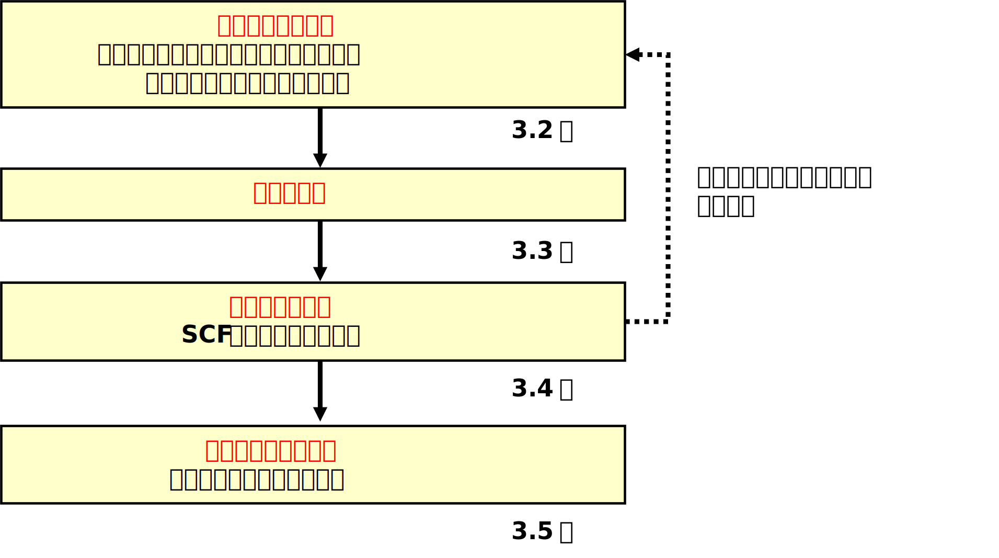
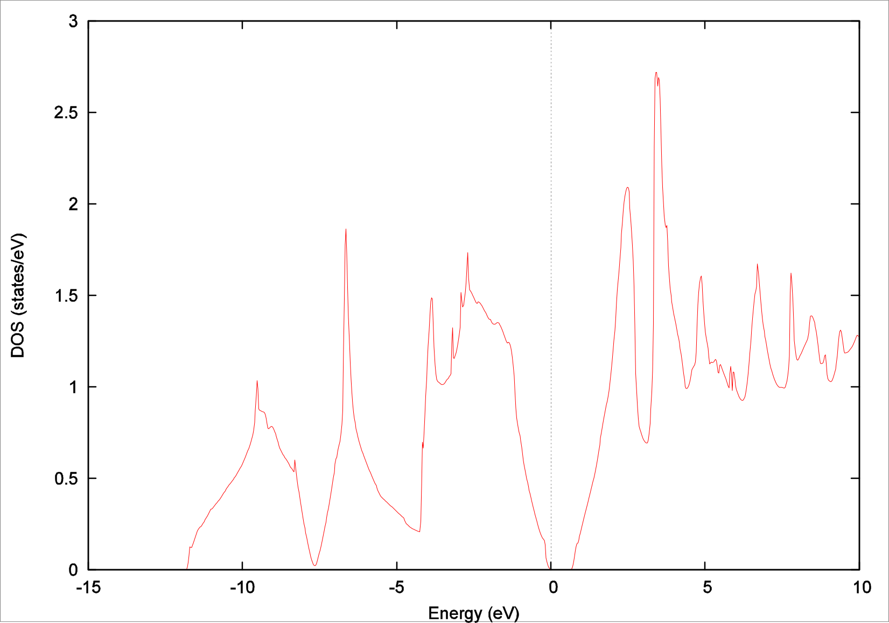
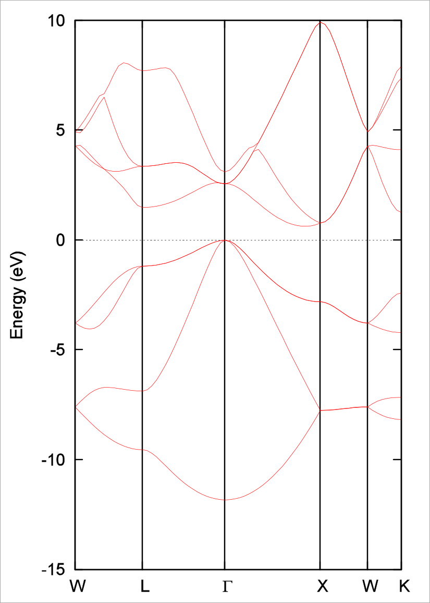

.. _first_step_chapter:

PHASE/0の基本的な利用方法
=========================

ここでは、PHASE/0の基本的な利用方法を説明します。計算の手順を優先的に説明するために、詳細な説明は省いています。詳細な説明が必要な部分については3章以降を参照してください。

この章以降ついてはPHASE/0をインストールしていることを前提とします。PHASE/0のインストールについては :numref:`install_chapter` を参考にしてください。

PHASE/0の計算手順の概要
-----------------------

PHASE/0に含まれるプログラムphaseで計算を実行するための大まかな手順は以下のようになっています。

#. 入力データの準備

#. 計算の実行

#. 計算結果の確認

#. 計算結果の解析、可視化

プログラムekcalによる計算は、phaseでSCF計算を収束させ電荷密度分布ファイルを出力したのちに行います。

 PHASEを用いた電子状態計算の手順の概要

入力データの準備
----------------

計算に最低限必要なファイル
~~~~~~~~~~~~~~~~~~~~~~~~~~

PHASE計算を実行するために最低限必要なファイルは、入力パラメータ・ファイルと擬ポテンシャル・ファイルの２つです。これらのファイルを用意して実行ディレクトリに置いてください。

ファイル名を変更したい場合やファイルを実行ディレクトリ以外に置きたい場合は、入出力ファイル設定ファイルfile_names.dataも用意してください。

入力データ

+------------------------+---------------------------------------------------------------------------------------------+
| ファイル               | 概要                                                                                        |
+========================+=============================================================================================+
| 入力パラメータファイル | 「どのよ\                                                                                   |
|                        | うなモデル（原子配置など）に対して、どのよ\                                                 |
|                        | うな計算を行うか」を指定するファイルです。                                                  |
|                        |                                                                                             |
|                        | デフォルトのファイル名は"nfinp.data"です。                                                  |
|                        |                                                                                             |
|                        | 既定値を多用したシンプルな入力について\                                                     |
|                        | は :numref:`firststep_simple_input`                                                         |
|                        | で解説します。高度な利用が可能\                                                             |
|                        | となる詳細な解説については  \                                                               |
|                        | \ :numref:`input_parameters` を\                                                            |
|                        | 参照してください。また、具体的な利用例に\                                                   |
|                        | ついては\ :numref:`basics_chapter` 、\                                                      |
|                        | そのほか具体的な機能の利用の仕方については\                                                 |
|                        | :numref:`estructure_chapter`                                                                |
|                        | :numref:`advestructure_chapter`                                                             |
|                        | :numref:`analysis_chapter`                                                                  |
|                        | :numref:`ion_dynamics_chapter`                                                              |
|                        | :numref:`uvsor_chapter`                                                                     |
|                        | を必要に応じて参照してください。                                                            |
+------------------------+---------------------------------------------------------------------------------------------+
| 擬ポテンシャルファイル | 各元素の擬ポテンシャルのファイル\                                                           |
|                        | です。詳細については                                                                        |
|                        | \ :numref:`firststep_pp_section` で\                                                        |
|                        | 解説します。                                                                                |
|                        |                                                                                             |
|                        | 利用する元素に応じてあらかじめ用意（ダウ\                                                   |
|                        | ンロードまたは作成）しておく必要があります\                                                 |
|                        | 。デフォルトのファイル名は下記の通りです。                                                  |
|                        |                                                                                             |
|                        | -  バージョン2019.02以前：pot.01, pot.02, :math:`\cdots`                                    |
|                        |                                                                                             |
|                        | -  バージョン2020.01以降： :numref:`firststep_defpp_section` の説明に従って決まるファイル名 |
|                        |                                                                                             |
|                        | デフォルトフ\                                                                               |
|                        | ァイル名を使用しない場合にはfile_names.da\                                                  |
|                        | taファイルでファイル名を設定してください。                                                  |
|                        |                                                                                             |
|                        | 最大で16種まで設定可能です。                                                                |
+------------------------+---------------------------------------------------------------------------------------------+

入出力ファイル設定ファイル

.. csv-table::
   :widths: 3, 7

   file_names.data, ファイル名の指定に利用するファイルです。無くてもPHASEを使用することは可能です。その場合は全てのファイル名が既定値となります。このファイルを使用することにより、i)ファイル名、ii)ファイルの置き場所をユーザーが自由に設定することが可能となります。このファイルを使用する場合は、必ずこのファイル名で（変更不可）、実行ディレクトリに置く必要があります。詳細については :numref:`firststep_fnamesdata_section` で解説します。

.. _firststep_simple_input:

入力パラメータファイル：nfinp.data（簡略版）
~~~~~~~~~~~~~~~~~~~~~~~~~~~~~~~~~~~~~~~~~~~~

入力パラメータファイル（nfinp.data）は、計算系（原子構造）や計算手法・計算条件の計算パラメータの設定を行います。入力パラメータファイルの詳細については、\ :numref:`input_parameters` を参照ください。多くのパラメータにはデフォルト値が設定されていますので、それらを利用することによりユーザーが最低限指定しなければいけない部分は非常に少なくできます。ここではほぼ最小限の入力パラメータファイルについて説明します。

入力パラメータファイル例
^^^^^^^^^^^^^^^^^^^^^^^^

入力パラメータファイルは、タグ（キーワード）と中括弧｛｝で囲まれたブロックの階層構造となっています。計算パラメータについては、ブロック内でキーワードと値で指定します。

Si ダイヤモンド結晶（2原子）の電子状態計算を行う場合の基本的な計算条件を記述した入力ファイル例です。

.. code-block:: text

  control{
    condition = initial
    cpumax = 86400 sec
    max_iteration = 10000
  }
  accuracy{
    cutoff_wf = 25.0 rydberg
    cutoff_cd = 100.0 rydberg
    num_bands = 8
    ksampling{
      method = monk
      mesh{
        nx = 10
        ny = 10
        nz = 10
      }
    }
    initial_wavefunctions = atomic_orbitals
    initial_charge_density = atomic_charge_density
    scf_convergence{
      delta_total_energy = 1e-10
      succession = 3
    }
    force_convergence{
      max_force = 0.001 hartree/bohr
    }
  }
  structure{
    element_list{
    #tag element atomicnumber
        Si 14
    }
    unit_cell{
      #units angstrom
      a_vector = 0 2.732299538 2.732299538
      b_vector = 2.732299538 0 2.732299538
      c_vector = 2.732299538 2.732299538 0
    }
    unit_cell_type = bravais
    atom_list{
      atoms{
        #tag element rx ry rz mobile
            Si 0.125 0.125 0.125 0
            Si -0.125 -0.125 -0.125 0
      }
      coordinate_system = internal
    }
  }
  wavefunction_solver{
    solvers{
      #tag sol till_n prec cmix submat
        pdavidson 1 on 1 on
        rmm3 -1 on 1 on
    }
    rmm{
      edelta_change_to_rmm=5e-5
    }
  }
  charge_mixing{
    mixing_methods{
      #tag no method rmxs rmxe istr prec nbmix
      1 pulay 0.40 0.40 3 on 15
    }
  }
  Postprocessing{
     dos{
       sw_dos = ON
       deltaE = 1.e-4 hartree
     }
     charge{
       sw_charge_rspace = ON
       filetype = cube !{cube|density_only}
       title = "This is a title line for the bulk Si"
     }
  }

最上位のブロックは、以下のものがあります。

============================ ==================================
control ブロック             全体的な計算条件の設定
accracy ブロック             計算精度の設定
structure ブロック           原子構造の設定
wavefunction_solver ブロック 波動関数ソルバーの設定
charge_mixing ブロック       電荷密度混合法の設定
structure_evolution ブロック 構造最適化、分子動力学法計算の設定
postproccesingブロック       後処理の設定
printlevelブロック           ログ出力の設定
============================ ==================================

以下の節で、各ブロックの入力パラメータを簡単に説明します。

Controlブロック
^^^^^^^^^^^^^^^

controlブロックでは、計算全体の制御に関するパラメータを指定します。

.. code-block:: text

 control{
   condition = initial
   cpumax = 86400 sec
   max_iteration = 10000
 }

.. csv-table::
   :widths: 3, 7

   condition, 最初の計算、継続（リスタート）計算、電荷を固定した計算などの計算モードを指定します。initialは最初の計算、continuationは継続計算になります。
   cpumax, 計算時間（計算を打ち切る時間）を指定します。
   max_iteration, SCF計算を打ち切るイタレーション数を指定します。

Accuracyブロック
^^^^^^^^^^^^^^^^

accuracyブロックでは、計算精度に関するパラメータを指定します。

.. code-block:: text

 accuracy{
   cutoff_wf = 25.0 rydberg
   cutoff_cd = 100.0 rydberg
   num_bands = 8
   ksampling{
     method = monk
     mesh{
       nx = 10
       ny = 10
       nz = 10
     }
   }
   initial_wavefunctions = atomic_orbitals
   initial_charge_density = atomic_charge_density
   scf_convergence{
     delta_total_energy = 1e-10
     succession = 3
   }
   force_convergence{
     max_force = 0.001 hartree/bohr
   }
 }

.. table::
 :widths: auto
 :class: longtable

 +---------------------------+-----------------------------------------+
 | cutoff_wf                 | 波動関数の                              |
 |                           |                                         |
 |                           | カットオフエネルギーを指定します。      |
 +---------------------------+-----------------------------------------+
 | cutoff_cd                 | 電荷密\                                 |
 |                           | 度のカットオフエネルギーを指定します。  |
 +---------------------------+-----------------------------------------+
 | num_bands                 | 計算するバンド数を指定します。          |
 +---------------------------+-----------------------------------------+
 | ksamplingブロック         | **k**\ 点サンプリングを指定します。     |
 +---------------------------+-----------------------------------------+
 | method                    | **k**\ 点サンプリング\                  |
 |                           | の方法を指定します。monk                |
 |                           | はMonkhorst-Pack\                       |
 |                           | 法 [Monkhorst76]_ による\               |
 |                           | サンプリングです。                      |
 +---------------------------+-----------------------------------------+
 | mesh                      | 逆空間の分割数を指定します。            |
 +---------------------------+-----------------------------------------+
 | initial_wavefunctions     | 波\                                     |
 |                           | 動関数の初期値の計算方法を指定します。  |
 |                           |                                         |
 |                           | atomic_cha\                             |
 |                           | rge_densityは、擬ポテンシャルファイルの |
 |                           | 原子の電荷密度から初期値を計算します。  |
 +---------------------------+-----------------------------------------+
 | scf_convergenceブロック   | エネルギーに\                           |
 |                           | よるSCF計算の収束判定条件を指定します。 |
 +---------------------------+-----------------------------------------+
 | delta_total_energy        | エネルギーの変化量の閾値を指定します。\ |
 |                           | エネルギーの変化量が、この閾値より小さ\ |
 |                           | い場合、SCF計算は収束したと判定します。 |
 +---------------------------+-----------------------------------------+
 | force_convergenceブロック | 原子に働く力に\                         |
 |                           | よるSCF計算の収束判定条件を指定します。 |
 +---------------------------+-----------------------------------------+
 | max_force                 | 原子\                                   |
 |                           | に働く力の最大値の閾値を指定します。原\ |
 |                           | 子に働く力の最大値が、この閾値より小さ\ |
 |                           | い場合、SCF計算は収束したと判定します。 |
 +---------------------------+-----------------------------------------+

Structureブロック
^^^^^^^^^^^^^^^^^

入力パラメーターファイルにおいて原子配置を指定する方法

structureブロックでは、原子構造を指定します。

.. code-block:: text

  structure{
    element_list{
      #tag element atomicnumber
          Si 14
    }
    unit_cell{
      #units angstrom
      a_vector = 0 2.732299538 2.732299538
      b_vector = 2.732299538 0 2.732299538
      c_vector = 2.732299538 2.732299538 0
    }
    unit_cell_type = bravais
    atom_list{
      atoms{
        #tag element rx ry rz mobile
        Si 0.125 0.125 0.125 0
        Si -0.125 -0.125 -0.125 0
      }
      coordinate_system = internal
    }
  }

.. table::
 :widths: auto
 :class: longtable

 +----------------------+----------------------------------------------+
 | element_listブロック | 計算する系の元素のリストを指定します。       |
 |                      |                                              |
 |                      | この例では、元素はSi（シリコン）、そ\        |
 |                      | の原子番号が14であることを意味しています。   |
 +----------------------+----------------------------------------------+
 | unit_cell ブロック   | ユニットセルのサイズ、形状を指定します。     |
 |                      |                                              |
 |                      | #units                                       |
 |                      | angstrom                                     |
 |                      | は、単位がオングストロームを意味します。     |
 |                      |                                              |
 |                      | a_vector、b_vector\                          |
 |                      | 、c_vectorは、格子ベクトルを指定します。     |
 +----------------------+----------------------------------------------+
 | atom_listブロック    | 元素と座標を指定します。                     |
 |                      |                                              |
 |                      | この例\                                      |
 |                      | では、Si原子が2個あり、その内部座標が0.125,  |
 |                      | 0.125, 0.125としています。                   |
 +----------------------+----------------------------------------------+
 | coordinate_system    | 原子座標系を指定します。                     |
 |                      |                                              |
 |                      | internalは、ユニットセルを基準\              |
 |                      | とした内部座標系であることを意味しています。 |
 +----------------------+----------------------------------------------+

入力パラメーターファイルとは異なるファイルで原子配置を指定する方法(バージョン2019.02以降)

PHASE/0バージョン2019.02以降のバージョンにおいては、入力パラメーターファイルとは異なるファイルから原子配置を指定する方法が利用できます。詳しくは :numref:`input_param_coord_from_file` を参照してください。

Wavefunction_solverブロック
^^^^^^^^^^^^^^^^^^^^^^^^^^^

wavefunction_solverブロックでは、波動関数の更新方法に関するパラメータを指定します。

.. code-block:: text

 wavefunction_solver{
   solvers{
     #tag sol till_n prec cmix submat
       pdavidson 1 on 1 on
       rmm3 -1 on 1 on
   }
   rmm{
     edelta_change_to_rmm=5e-5
   }
 }

.. table::
 :widths: auto
 :class: longtable

 +----------------------+----------------------------------------------+
 | solversブロック      | 波動関数ソルバーを指定します。               |
 |                      |                                              |
 |                      | この例で\                                    |
 |                      | は、最初の波動関数ソルバーはpdavidson法、2\  |
 |                      | 番目の波動関数ソルバーはRMM法としています。  |
 +----------------------+----------------------------------------------+
 | rmmブロック          |                                              |
 +----------------------+----------------------------------------------+
 | edelta_change_to_rmm | 波動関数ソルバーをRMM法に変更する閾値\       |
 |                      | を指定します。ここで指定する値よりもエネルギ\|
 |                      | ーの変化量が小さくなるとRMM法に移行します。  |
 +----------------------+----------------------------------------------+

Charge_mixingブロック
^^^^^^^^^^^^^^^^^^^^^

charge_mixingブロックでは、電荷密度の更新方法（混合方法）に関するパラメータを指定します。

.. code-block:: text

 charge_mixing{
   mixing_methods{
     #tag no method rmxs rmxe istr prec nbmix
       1 pulay 0.40 0.40 3 on 15
   }
 }

.. table::
 :widths: auto
 :class: longtable

 +------------------------+--------------------------------------------+
 | mixing_methodsブロック | 電荷密度の更新方法（混合方法\              |
 |                        | ）を指定します。                           |
 |                        |                                            |
 |                        | この例ではpulay法 [Pulay80]_ を指定\       |
 |                        | しています。\                              |
 |                        | この他にbroyden2法 [Broyden65]_ , simple   |
 |                        | mixing法を指定することができます。         |
 +------------------------+--------------------------------------------+

Postproccesingブロック
^^^^^^^^^^^^^^^^^^^^^^

Postproccesingブロックでは、後処理に関するパラメータを指定します。

.. code-block:: text

 Postprocessing{
    dos{
      sw_dos = ON
      deltaE = 1.e-4 hartree
    }
    charge{
      sw_charge_rspace = ON
      filetype = cube
      title = "This is a title line for the bulk Si"
    }
 }

.. table::
 :widths: auto
 :class: longtable

 +------------------+--------------------------------------------------+
 | dosブロック      | 状態密度の計算パラメータを指定します。           |
 +------------------+--------------------------------------------------+
 | sw_dos           | ONで状態密度の計算を行います。                   |
 +------------------+--------------------------------------------------+
 | deltaE           | 状態密度のエネルギー間隔を指定します。           |
 +------------------+--------------------------------------------------+
 | chargeブロック   | 電荷密度分布の出力パラメータを指定します。       |
 +------------------+--------------------------------------------------+
 | sw_charge_rspace | ONで出力用の電荷密度分布の計算を行います。       |
 +------------------+--------------------------------------------------+
 | filetype         | 電荷密\                                          |
 |                  | 度分布のファイル形式を指定します。               |
 |                  |                                                  |
 |                  | cubeはGaussian CUBE系形式を指定してしいます。    |
 +------------------+--------------------------------------------------+
 | title            | 出力のGaussian                                   |
 |                  | CU\                                              |
 |                  | BE系形式のファイルにおけるタイトルを指定します。 |
 +------------------+--------------------------------------------------+

入力パラメータファイルの最低限の設定項目
^^^^^^^^^^^^^^^^^^^^^^^^^^^^^^^^^^^^^^^^

ここで紹介した例では設定項目がそれなりにありますが、大部分のパラメータは多くの計算で共通に使用できます。そのため、異なる系を計算する場合に、ユーザーがわざわざ変更する必要はありません。

ユーザーが必ず設定しなければならないのは、カットオフエネルギー、\ **ｋ**\ 点、原子構造に関する設定です。入力パラメータファイルのAccuracyブロックにあるカットオフエネルギーの指定cutoff_wf, cutoff_cd, **k**\ 点の指定ksampling, Structureブロックにある元素の指定 element_list, ユニットセルの指定 unit_cell, 原子座標の指定atom_listの部分です。

先程の入力パラメータファイルの例において、ユーザーの設定部分をハイライトで示します。ユーザが計算したい系にあわせて、この部分を変更することにより、様々な系の計算をすることができます。ただし、最適な計算条件については、個々のパラメータを適切に設定する必要があります。

.. code-block:: text
 :emphasize-lines: 7,8,13,14,15,31,35,36,37,43,44

 control{
   condition = initial
   cpumax = 86400 sec
   max_iteration = 10000
 }
 accuracy{
   cutoff_wf = 25.0 rydberg
   cutoff_cd = 100.0 rydberg
   num_bands = 8
   ksampling{
     method = monk
     mesh{
       nx = 10
       ny = 10
       nz = 10
     }
   }
   initial_wavefunctions = atomic_orbitals
   initial_charge_density = atomic_charge_density
   scf_convergence{
     delta_total_energy = 1e-10
     succession = 3
   }
   force_convergence{
     max_force = 0.001 hartree/bohr
   }
 }
 structure{
   element_list{
     #tag element atomicnumber
         Si 14
   }
   unit_cell{
     #units angstrom
     a_vector = 0 2.732299538 2.732299538
     b_vector = 2.732299538 0 2.732299538
     c_vector = 2.732299538 2.732299538 0
   }
   unit_cell_type = bravais
   atom_list{
     atoms{
       #tag element rx ry rz mobile
             Si 0.125 0.125 0.125 0
             Si -0.125 -0.125 -0.125 0
     }
     coordinate_system = internal
   }
 }
 wavefunction_solver{
   solvers{
     #tag sol till_n prec cmix submat
       davidson 1 on 1 on
       rmm3 -1 on 1 on
   }
   rmm{
     edelta_change_to_rmm=5e-5
   }
 }
 charge_mixing{
   mixing_methods{
       #tag no method rmxs rmxe istr prec nbmix
           1 pulay 0.40 0.40 3 on 15
   }
 }
 Postprocessing{
   dos{
     sw_dos = ON
     deltaE = 1.e-4 hartree
   }
   charge{
     sw_charge_rspace = ON
     filetype = cube !{cube|density_only}
     title = "This is a title line for the bulk Si"
   }
 }

ちなみに、上記の入力パラメータファイルに対し、最低限の設定項目のみを記述し、他の計算条件を省略（デフォルトを使用）した以下のような入力パラメータファイルでも、計算は可能です。上記の入力パラメータでは計算条件がデフォルトとは異なる部分があるため、上記と下記の入力パラメータファイルを用いた計算では、計算途中の状況が異なります。

.. code-block:: text

 accuracy{
   cutoff_wf = 25.0 rydberg
 }
 structure{
   unit_cell{
     #units angstrom
     a_vector = 0 2.732299538 2.732299538
     b_vector = 2.732299538 0 2.732299538
     c_vector = 2.732299538 2.732299538 0
   }
   atom_list{
     atoms{
       #tag element rx ry rz mobile
           Si 0.125 0.125 0.125 0
           Si -0.125 -0.125 -0.125 0
     }
   }
 }

.. _firststep_pp_section:

擬ポテンシャルファイル
~~~~~~~~~~~~~~~~~~~~~~

擬ポテンシャルファイルは、元素ごとに用意する必要があります。例えば、水（H\ :sub:`2`\ O）の計算をする場合には、H原子とO原子の擬ポテンシャルファイルが必要になります。擬ポテンシャルファイルはポータルサイト（\ `https://azuma.nims.go.jp/ <https://azuma.nims.go.jp/cms1/downloads/software>`__\ ）からダウンロードできます。自分でポテンシャルを作成する場合には、PHASE の関連プログラム CIAO で作成できます。CIAOについてはCIAOのマニュアルを参照してください。

擬ポテンシャルの種類（内殻の取り扱い方法）：フローズンコア型とPAW型
^^^^^^^^^^^^^^^^^^^^^^^^^^^^^^^^^^^^^^^^^^^^^^^^^^^^^^^^^^^^^^^^^^^

PHASEの擬ポテンシャルは大きく分けてフローズンコア型とPAW型 [Blöchl94]_ の２種類があります。

+----------------------------+----------------------------------------+
| フローズンコア（凍結核）型 | 内殻電子と核をイオン芯として\          |
|                            | 完全に凍結させた状態として扱い、価電子\|
|                            | 状態だけを取り扱います。これはさらにノ\|
|                            | ルム保存擬ポテンシャル [Troullier91]_  |
|                            | とウルトラソフト擬ポテンシャル\        |
|                            | [Vanderbilt90]_ に分類できます。       |
+----------------------------+----------------------------------------+
| PAW型                      | PAW（Projector Augumented              |
|                            | Wave）型のポテンシャル [Blöchl94]_     |
|                            | [Kresse99]_ では、\                    |
|                            | 内殻の電子密度を考慮した計算をします。 |
+----------------------------+----------------------------------------+

特別な事情がない限りは、PAW型擬ポテンシャルの使用をお勧めします。
PAW型の擬ポテンシャルを使って、フローズンコア型（非PAW法）の計算実行が可能です。
一方フローズンコア型の擬ポテンシャルでは、PAW法の計算はできません。

擬ポテンシャルファイルの入手方法
^^^^^^^^^^^^^^^^^^^^^^^^^^^^^^^^

ポータルサイト（\ `https://azuma.nims.go.jp/ <https://azuma.nims.go.jp/cms1/downloads/software>`__\ ）から、周期表にある全ての元素の擬ポテンシャルファイルをダウンロードすることが可能です。

公開している擬ポテンシャルファイルは、以下の命名規則にしたがってファイル名が決められています。

.. code-block:: text

  元素名_交換相関エネルギーの計算方法_（PAW型_）擬ポテンシャル型_識別用の数字.pp

例えばSi_ggapbe_paw_nc_01.pp という擬ポテンシャルファイルは、シリコンに対応する、一般化密度勾配近似(GGA)法 [Perdew96]_ によって交換相関エネルギーを計算する、PAW型で、ノルム保存擬ポテンシャル [Troullier91]_ （ncはnorm conserving（ノルム保存）の略）の、01番（一般に作成された順番で番号が付けられます）ということを表します。交換相関エネルギーの計算方法には一般化密度勾配近似法のほかに局所密度近似(LDA)法があり、ggapbeの部分がldapw91 [Perdew92]_ となります。擬ポテンシャル型がウルトラソフト型 [Vanderbilt90]_ の場合にはncの部分がus（ultrasoftの略）となります。

============================ =========================================
元素名：                     シリコン
交換相関エネルギーの計算方法 ggapbe法
擬ポテンシャル型：           PAW型でノルム保存擬ポテンシャル
                             （ncはnorm conserving（ノルム保存）の略）
識別用の番号：               データの通し番号
============================ =========================================

擬ポテンシャルの指定方法
^^^^^^^^^^^^^^^^^^^^^^^^

デフォルトの擬ポテンシャルファイル名は、入力パラメータファイルのタグelement_listで設定した元素順にpot.01, pot.02….です。

file_name.dataファイルを用いた場合は、擬ポテンシャルのディレクトリ、ファイル名を指定できます。以下のように記述します。

.. code-block:: text

 &fnames
 F_POT(1) = ‘/home/user/phase_pp_paw_2014/Si_ggapbe_paw_nc_01.pp’
 F_POT(2) = ‘/home/user/phase_pp_paw_2014/O_ggapbe_paw_us_02m.pp’
 ...
 /

&fnamesセクションを作り、そこでファイルのパスを指定します。F_POT(*N*)に\ *N*\ 番目の元素の擬ポテンシャルファイルのパスを指定します。パスは、シングルクォート(‘)もしくはダブルクォート(“)で囲います。セクションの終わりはスラッシュ(/)です。

.. _firststep_defpp_section:

推奨擬ポテンシャルの自動指定（バージョン2020.01以降）
^^^^^^^^^^^^^^^^^^^^^^^^^^^^^^^^^^^^^^^^^^^^^^^^^^^^^

バージョン2020.01以降より、擬ポテンシャルの指定がない場合は推奨擬ポテンシャルが元素名を縁に割り当てられるようになりました。この機能が動作するためには、擬ポテンシャルファイルセットphase_pp_paw_2014がどこかしらのディレクトリー（たとえば/home/user/phase_pp_paw_2014）に存在し、環境変数PHASE_PP_PATHがその位置を指すようになっている必要があります。環境変数は、下記の要領で設定することができます。

.. code-block:: bash

 $ export PHASE_PP_PATH=/home/user/phase_pp_paw_2014 (sh, bashなどの場合)
 $ setenv PHASE_PP_PATH /home/user/phase_pp_paw_2014 (csh, tcshなどの場合)

また、元素名はO, O1, O2など元素名そのもの、もしくは元素名+数値という形式である必要があります。採用されるデフォルト擬ポテンシャルは、:numref:`inouts_recpp_section` に示しています。ソースディレクトリーのdefaultppfilesにも記述されています。

.. _firststep_fnamesdata_section:

入出力ファイル設定ファイルfile_names.data
~~~~~~~~~~~~~~~~~~~~~~~~~~~~~~~~~~~~~~~~~

入出力ファイル設定ファイルfile_names.dataは入力パラメータファイルなどのファイル名を設定するために使用します。無くてもPHASEを使用することは可能です。その場合は全てのファイルがデフォルトのファイル名になります。

このファイルを使用することにより、i)ファイル名、ii)ファイルの置き場所、をユーザーが自由に設定することが可能になります。「file_names.data」そのもののファイル名は、変更不可です。

このファイルを使用する場合は、必ずこのファイル名で実行ディレクトリに置く必要があります。

file_names.dataのフォーマットは、以下のようになります。

.. code-block:: text

 &fnames
 ファイル名キーワード = ’ファイル名（ファイルへのパス）
 ...
 ...
 /

最後に、“/” が必要な点に注意してください。例えば、以下のように記述します。

.. code-block:: text

 &fnames
 F_INP = ’./nfinp.data
 F_POT(1) = ’./Si_ggapbe_nc_01.pp
 F_POT(2) = ’./O_ggapbe_us_02.pp
 F_CHGT = ’./nfchgt.data
 F_CHR = ’./nfchr.cube
 /

ファイルへのパスは,実行ディレクトリからの相対パスでも、絶対パスでも使用できます。

F_POT(n)は、入力パラメータファイルにおいてn番目に指定された原子種に対する擬ポテンシャルファイルを指定します。この例では、1番目に定義された元素Si の擬ポテンシャルファイルがSi ggapbe nc 01.pp 、2番目に定義された元素Oの擬ポテンシャルファイルがO ggapbe us 02.ppというファイルになります。

主要なファイル名キーワードやデフォルトのファイル名を :numref:`firststep_fnames_table` に示します。

.. table:: 入出力ファイル設定ファイルfile_names.dataで設定可能なファイル一覧（主なもの）
 :widths: auto
 :class: longtable
 :name: firststep_fnames_table

 +-------------+----------+--------+-------------+--------------------+
 | ファイル名  | 対応す\  | 入出力 | デフォルト\ | 概要               |
 |             | るプロ\  |        | ファイル名  |                    |
 | キーワード  | グラム   | 区別   |             |                    |
 +=============+==========+========+=============+====================+
 | F_INP       | phase    | 入力   | nfinp.data  | 入力パラメータ\    |
 |             |          |        |             | ・ファイル         |
 |             | ekcal    |        |             |                    |
 |             |          |        |             |                    |
 |             | epsmain  |        |             |                    |
 +-------------+----------+--------+-------------+--------------------+
 | F_POT(n)    | phase    | 入力   | pot.01,     | 擬ポテン\          |
 |             |          |        |             | シャル・フ\        |
 |             | ekcal    |        | pot.02,     | ァイル。こ\        |
 |             |          |        |             | の配列に与\        |
 |             | epsmain  |        | ･･･         | えられた名\        |
 |             |          |        |             | 前のファイ\        |
 |             |          |        |             | ルを読みこ\        |
 |             |          |        |             | みます。各\        |
 |             |          |        |             | 元素に１つ\        |
 |             |          |        |             | のポテンシ\        |
 |             |          |        |             | ャルファイ\        |
 |             |          |        |             | ルが必要に\        |
 |             |          |        |             | なります。         |
 +-------------+----------+--------+-------------+--------------------+
 | F_STOP      | phase    | 入力   | nfstop.data | 繰り返し計算の途中\|
 |             |          |        |             | で、実行を中断する\|
 |             | ekcal    |        |             | 繰り返し回数を\    |
 |             |          |        |             | 指定する。         |
 |             | epsmain  |        |             |                    |
 +-------------+----------+--------+-------------+--------------------+
 | F_KPOINT    | phase    | 入力   | kpoint.data | サンプリングk点\   |
 |             |          |        |             | を設定する。       |
 |             | ekcal    |        |             |                    |
 |             |          |        |             | 主にバンド構造図\  |
 |             |          |        |             | 計算時に利用。     |
 +-------------+----------+--------+-------------+--------------------+
 | F_ENF       | phase    | 出力   | nfefn.data  | SCF収束毎に全エネ\ |
 |             |          |        |             | ルギーと力の最大値\|
 |             |          |        |             | が出力される。     |
 |             |          |        |             |                    |
 |             |          |        |             | 格子緩和時には、\  |
 |             |          |        |             | ストレス値も出力。 |
 +-------------+----------+--------+-------------+--------------------+
 | F_DYNM      | phase    | 出力   | nfdynm.data | SCF収束毎に各原子\ |
 |             |          |        |             | 位置と作用する力が\|
 |             |          |        |             | 出力される。       |
 |             |          |        |             |                    |
 |             |          |        |             | 分子動力学計算では\|
 |             |          |        |             | 各原子の速度も出力\|
 |             |          |        |             | される。           |
 +-------------+----------+--------+-------------+--------------------+
 | F_CHR       | phase    | 出力   | nfchr.data  | 電荷密度分布の出力\|
 |             |          |        |             | ファイル。主に\    |
 |             |          |        |             | 可視化に用いる。   |
 +-------------+----------+--------+-------------+--------------------+
 | F_DOS       | phase    | 出力   | dos.data    | 状態密度の計算結果 |
 |             |          |        |             |                    |
 |             | ekcal    |        |             |                    |
 +-------------+----------+--------+-------------+--------------------+
 | F_ENERG     | phase    | 出力   | nf\         | エネルギー固有値の\|
 |             |          |        | energy.data | 計算結果           |
 |             | ekcal    |        |             |                    |
 |             |          |        |             |                    |
 |             | epsmain  |        |             |                    |
 +-------------+----------+--------+-------------+--------------------+
 | F_EPSOUT    | epsmain  | 出力   | eps.data    | 誘電関数の計算結果 |
 |             |          |        |             |                    |
 +-------------+----------+--------+-------------+--------------------+
 | F_ZAJ       | phase    | 入出力 | zaj.data    | 計算終了時に波動関\|
 |             |          |        |             | 数の内部データを\  |
 |             | ekcal    |        |             | 書き出す。         |
 |             |          |        |             | 継続計算ではこれを\|
 |             | epsmain  |        |             | 読み込む。         |
 |             |          |        |             | バイナリーファイル\|
 |             |          |        |             | 。                 |
 +-------------+----------+--------+-------------+--------------------+
 | F_CHGT      | phase    | 入出力 | nfchgt.data | 計算終了時に電荷密\|
 |             |          |        |             | 度の内部データを\  |
 |             | ekcal    |        |             | 書き出す。         |
 |             |          |        |             | 継続計算ではこれを\|
 |             | epsmain  |        |             | 読み込む。         |
 |             |          |        |             | 固定電荷計算では\  |
 |             |          |        |             | 入力データ\        |
 |             |          |        |             | （更新されない）。 |
 |             |          |        |             | バイナリー\        |
 |             |          |        |             | ファイル。         |
 +-------------+----------+--------+-------------+--------------------+
 | F_CNTN      | phase    | 入出力 | co\         | 計算を中断する際に\|
 |             |          |        | ntinue.data | 、継続する計算を再\|
 |             | ekcal    |        |             | 開するために必要な\|
 |             |          |        |             | 情報を書き出す。   |
 |             | epsmain  |        |             | 継続計算は\        |
 |             |          |        |             | このファイルを\    |
 |             |          |        |             | 入力として\        |
 |             |          |        |             | 読み込む。         |
 +-------------+----------+--------+-------------+--------------------+
 | F_CNTN_BIN  | phase    | 入出力 | continue\   | 計算を中断する際に\|
 |             |          |        | _bin.data   | 、継続する計算を再\|
 |             |          |        |             | 開するために必要な\|
 |             |          |        |             | 情報を書き出す。   |
 |             |          |        |             | 継続計算は\        |
 |             |          |        |             | このファイルを\    |
 |             |          |        |             | 入力として\        |
 |             |          |        |             | 読み込む。         |
 |             |          |        |             | バイナリー\        |
 |             |          |        |             | ファイル。         |
 +-------------+----------+--------+-------------+--------------------+
 | F_C\        | phase    | 入出力 | contine_b\  | PAW法利用時限定。  |
 | NTN_BIN_PAW |          |        | in_paw.data | 計算を中断する際に\|
 |             | ekcal    |        |             | 、継続する計算を再\|
 |             |          |        |             | 開するために必要な\|
 |             | epsmain  |        |             | 情報を書き出す。   |
 |             |          |        |             | 継続計算は\        |
 |             |          |        |             | このファイルを\    |
 |             |          |        |             | 入力として\        |
 |             |          |        |             | 読み込む。         |
 |             |          |        |             | 固定電荷計算では\  |
 |             |          |        |             | 入力データ\        |
 |             |          |        |             | （更新されない）。 |
 |             |          |        |             | バイナリー\        |
 |             |          |        |             | ファイル。         |
 +-------------+----------+--------+-------------+--------------------+
 | F_STATUS    | phase    | 出力   | jobstatus\  | 計算状況の出力。   |
 |             |          |        | 00x         |                    |
 |             | ekcal    |        |             | 繰り返し計算毎に\  |
 |             |          |        |             | 更新される。       |
 |             | epsmain  |        |             |                    |
 +-------------+----------+--------+-------------+--------------------+

計算の実行
----------

プログラムphaseの実行
~~~~~~~~~~~~~~~~~~~~~

入力パラメータファイル、擬ポテンシャルファイルを実行ディレクトリに置きます。file_names.dataを使用する場合には、それも同じディレクトリに置いてください。

１プロセッサ（１コア）の逐次計算を行う場合には、次のようにプログラムphaseを実行します。
”../../|PHASE020XX.YY|/bin/” は、PHASEのバイナリーが置かれているディレクトリです。

.. parsed-literal::

 % ../../|PHASE020XX.YY|/bin/phase

ただし、お使いの環境によってはMPIライブラリの実行コマンドを使用する必要があるかもしれません。

並列計算について
~~~~~~~~~~~~~~~~

PHASE/0は、MPIライブラリにリンクしてコンパイルすることによって並列計算を行うことが可能です。PHASE/0には「2次元並列版」と「3次元並列版」がありますが、前者はバンドと\ **k**\ 点に対する並列実行が、後者はバンド、\ **k**\ 点に加え波動関数の展開係数に対する並列実行が可能です。3次元並列版には一部機能制限がありますが、多くのCPUコアが利用できる場合は非常に高速な計算を実行することが可能となっています。

並列計算を行う場合には、お使いの計算機の利用するMPIライブラリの実行コマンドを使用します。詳細はお使いの計算機システムのマニュアルを参照ください。一般的なコマンドはmpirunです。

基本的な並列計算
^^^^^^^^^^^^^^^^

2次元版の場合、典型的には以下のようなコマンドになります。

.. parsed-literal::

 % mpirun -np NP PHASE_INSTALL_DIR/|PHASE020XX.YY|/bin/phase ne=NE nk=NK

ここで、NP はMPI プロセス数、NE はバンド並列数、NKは\ **k**\ 点並列数です。
またPHASE_INSTALL_DIRをPHASE/0をインストールしたディレクトリとしました。NP=NE×NKという関係が満たされている必要があります。\ **k**\ 点並列の方が効率は良い場合が多いので、\ **k**\ 点並列は取れるだけ取ることが推奨されます。

3次元版の場合、典型的には以下のようなコマンドとなります。

.. parsed-literal::

 % mpirun -np NP PHASE_INSTALL_DIR/|PHASE020XX.YY|/bin/phase.3d ng=NG ne=NE nk=NK

ここでNGが波動関数の展開係数（\ **G**\ ベクトル）の並列数です。NP=NG×NE×NKという関係が満たされている必要があります。多くの場合NGをNEの2倍程度にすると良好なパフォーマンスが得られます。

ディレクトリ並列による計算
^^^^^^^^^^^^^^^^^^^^^^^^^^

また、2次元版、3次元版共通で「ディレクトリ並列」機能を利用することも可能です。これは、事前に入力ファイルの置かれたディレクトリが複数ある場合にそのディレクトリごとに別個計算を行う機能です。この方法で計算を行うためには、まずは必要な入力の置かれた複数のディレクトリを作成します。つぎに、作成した計算ディレクトリの親ディレクトリにdirlistというファイル名のファイルを作成し、つぎのような内容を記述します。

.. code-block:: text

 ND
 dir1
 dir2
 ...

ここでNDがディレクトリ並列の並列数（ディレクトリの数）、dir1, dir2,
…が入力ファイルの置かれたディレクトリの名前です。以上の準備を行った上で、通常通りPHASEを実行します。ただし、2次元版の場合NP=ND×NE×NK、3次元版の場合はNP=ND×NG×NE×NKが満たされるように並列数を調整する必要があります。ディレクトリ並列機能は主にベリー位相計算を行うPerlスクリプトが利用することを想定して実装された機能ですが、ベリー位相計算に限らずあらゆる計算機能で利用することが可能です。ただし、並列化効率自体は非常に高い並列化手法ですが、最も時間のかかるディレクトリが律速になる点にはご注意ください。

レプリカ並列による計算
^^^^^^^^^^^^^^^^^^^^^^

NEB法および拘束条件付き構造最適化、メタダイナミクス法においては「レプリカ並列」を利用した計算を行うことが可能です。この機能を利用するには、以下のようにPHASE/0を起動します。

2次元版の場合：

.. parsed-literal::

 % mpirun -np NP PHASE_INSTALL_DIR/|PHASE020XX.YY|/bin/phase nr=NR ne=NE nk=NK

3次元版の場合：

.. parsed-literal::

 % mpirun -np NP PHASE_INSTALL_DIR/|PHASE020XX.YY|/bin/phase.3d nr=NR ng=NG ne=NE nk=NK

ここでNRはレプリカ並列数です。NP=NR×NG×NE×NKが満たされるように並列数を調整する必要があります。ディレクトリ並列の場合と同様並列化効率自体は非常に高い並列化手法ですが、「最も収束の遅いレプリカ」が律速になる点にご注意ください。

**k**\ 点数の調べ方
^^^^^^^^^^^^^^^^^^^

利用可能、もしくは最適な\ **k**\ 点並列数は\ **k**\ 点の数に依存しますが、実際に利用される\ **k**\ 点の数は対称性によって減る場合があるので、事前には分かりません。これを調べるには、まず入力パラメータファイルのconditionをpreparationとします。

.. code-block:: text

  control{
    condition = preparation
  }

このようにしてPHASE/0を実行すると、時間のあまりかからない前処理のみが行われ、計算が終了します。得られたログファイル(output000ファイル)から\ **k**\ 点の数を調べるには、以下のようなコマンドを発行します。

.. code-block:: bash

 % grep kv3 output000
 !kp kv3 = 70 nspin = 2

kv3/nspin が利用可能な\ **k**\ 点並列数の上限となります。この例の場合kv3 = 70, nspin = 2と出力されていますので、\ **k**\ 点並列数の上限は35となります。また、この上限の数を割り切れる数を採用した方が並列化効率は向上します。
なお、実計算を実行する前にconditionパラメータを適切な値に編集し直すことを忘れないようにしてください。

.. _firststep_autores_para_section:

並列パラメーターの自動選定（バージョン2020.01以降）
^^^^^^^^^^^^^^^^^^^^^^^^^^^^^^^^^^^^^^^^^^^^^^^^^^^

バージョン2020.01以降、並列パラメーター (NE, NK, NG)の指定がない場合の振る舞いが変更されました。次のような指針によって決まるようになりました。

-  2次元版 : 対称性を考慮した上で得られる\ **k**\ 点数と総並列数NPが割り切れる最大の整数値がNK, NEはNP/NK.

-  3次元版 : 対称性を考慮した上で得られる\ **k**\ 点数と総並列数NPが割り切れる最大の整数値がNK, NGとNEはNE*NG=NP/NKを満たし、かつNE:NGが1:2に最も近くなる取り方

計算状況の確認
~~~~~~~~~~~~~~

SCF計算の途中経過は、ログファイルoutput000において、全エネルギーの変遷を見ることによって確認することができます。

ログファイルoutput000において、TOTAL ENERGY FORで始まる部分にSCFイタレーションごとの全エネルギーが出力されます。

以下のgrepコマンドを利用することにより、この部分のみを抽出することができます。

.. code-block:: bash

 % grep TH output000
 TOTAL ENERGY FOR     1 -TH ITER=    -30.526550119110 EDEL =  -0.305266D+02 : SOLVER = MATDIAGON : Charge-Mixing = BROYD2
 TOTAL ENERGY FOR     2 -TH ITER=    -31.437912997629 EDEL =  -0.911363D+00 : SOLVER = SUBMAT + PKOSUGI : Charge-Mixing = BROYD2
 TOTAL ENERGY FOR     3 -TH ITER=    -31.451426343498 EDEL =  -0.135133D-01 : SOLVER = SUBMAT + PKOSUGI : Charge-Mixing = BROYD2
 TOTAL ENERGY FOR     4 -TH ITER=    -31.483230137370 EDEL =  -0.318038D-01 : SOLVER = SUBMAT + PKOSUGI : Charge-Mixing = BROYD2
 TOTAL ENERGY FOR     5 -TH ITER=    -31.494170407948 EDEL =  -0.109403D-01 : SOLVER = SUBMAT + PKOSUGI : Charge-Mixing = BROYD2
 TOTAL ENERGY FOR     6 -TH ITER=    -31.500019062197 EDEL =  -0.584865D-02 : SOLVER = SUBMAT + PKOSUGI : Charge-Mixing = BROYD2
 TOTAL ENERGY FOR     7 -TH ITER=    -31.501062835039 EDEL =  -0.104377D-02 : SOLVER = SUBMAT + RMM3 : Charge-Mixing = BROYD2
 TOTAL ENERGY FOR     8 -TH ITER=    -31.501146250660 EDEL =  -0.834156D-04 : SOLVER = SUBMAT + RMM3 : Charge-Mixing = BROYD2
 TOTAL ENERGY FOR     9 -TH ITER=    -31.501182271744 EDEL =  -0.360211D-04 : SOLVER = SUBMAT + RMM3 : Charge-Mixing = BROYD2
 TOTAL ENERGY FOR    10 -TH ITER=    -31.501186337668 EDEL =  -0.406592D-05 : SOLVER = SUBMAT + RMM3 : Charge-Mixing = BROYD2
 .............
 .............

TOTAL ENERGY FOR ### -TH ITER= の部分に### 回目のSCF イタレーションにおける全エネルギーがハートリー単位（Ha）で出力されます（上記の例では、約-31Ha）。EDEL =のあとには、現在のSCFイタレーションと1 回前のイタレーションのエネルギー差がハートリー単位で出力されます。この値を原子数で除した値が入力パラメータファイルで設定した閾値（delta_total_energy）よりも小さくなるとSCF計算が収束したと見なされます。

SOLVER =のあとには利用したソルバーの情報が出力されます。上記の例では1 回目がMATDIAGON, 2 回目と3 回目はP-Davidson, 4 回目以降が部分空間対角化（SUBMAT）を有効にしたRMM3 ソルバーであることが理解できます。このように履歴を調べながら、SCF 計算が収束へ向かっているかどうかを確認することができます。

継続計算
~~~~~~~~

継続して計算を実行することができます。継続計算を実行するには、入力パラメータファイルのcontrol ブロックのcondition を編集します。

.. code-block:: text

 control{
    condition = continuation
 }

condition にcontinuation を指定すると継続計算を行います。automatic を指定すると、継続計算が可能な場合は継続計算、そうでない場合は最初からの計算を行います。condition のデフォルト値はautomatic です。継続計算では直前の計算での出力ファイルの一部を入力ファイルとして使用します。同じ実行ディレクトリで計算を実行する場合には特に配慮することはなく、継続計算を実行することが可能です。

.. _first_step_checkpoint_section:

チェックポイントファイルについて（バージョン2019.02以降）
~~~~~~~~~~~~~~~~~~~~~~~~~~~~~~~~~~~~~~~~~~~~~~~~~~~~~~~~~

PHASE/0バージョン2019.02より、計算中に「チェックポイントファイル」が出力されるようになりました。この機能によって、ユーザーの指定に応じて継続計算に必要なファイル一式が出力されます。出力するタイミングは、SCF計算の回数、構造最適化の回数、計算時間、あるいはこれらの組み合わせから選ぶことができます。また、過去何回分のチェックポイントファイルを保存するか指定することもできます。何らかの要因で計算が異常終了してしまった場合も、チェックポイントファイルを活用することによって直前の状態から継続して計算を再開することができます。

チェックポイントファイル出力の設定
^^^^^^^^^^^^^^^^^^^^^^^^^^^^^^^^^^

入力パラメーターファイルに以下のようにcontrolブロックにおいてcheckpoint_fileブロックを挿入することによってチェックポイントファイルを出力させることができます。

.. code-block:: text

  control{
    checkpoint_file{
      iteration = 100
      iteration_ionic = 10
      cputime = 5 hour
      nhistory = 5
    }
  }

iterationなどの変数には、何回に1回チェックポイントファイルを出力させたいかを指定します。0以下の値を指定した場合その条件ではチェックポイントファイルは出力されません。またnhistoryに2以上の値を指定すると古い履歴がディレクトリーに保存されるようになります。保存ディレクトリーの既定値はchkpnt\ *xx*\ です。\ *xx*\ には識別用の整数値が入ります。\ *xx*\ が若いほど古い履歴が保持されたディレクトリーとなります。

checkpoint_fileブロックの下では以下の変数を利用することができます。

.. table::
 :widths: auto
 :class: longtable

 +--------------------+------------------------------------------------+
 | 変数               | 説明                                           |
 +====================+================================================+
 | iteration          | SCF計算の回数でチェックポイント\               |
 |                    | ファイルを出力させる場合に設定する。           |
 |                    |                                                |
 |                    | 既定値は0                                      |
 +--------------------+------------------------------------------------+
 | iteration_ionic    | 構造最適化や分子\                              |
 |                    | 動力学シミュレーションの回数でチェックポイント\|
 |                    | ファイルを出力させる場合に設定する。既定値は10 |
 +--------------------+------------------------------------------------+
 | iteration_unitcell | 単位胞最適\                                    |
 |                    | 化の場合に、単位胞更新の回数でチェックポイント\|
 |                    | ファイルを出力させる場合に設定する。既定値は0  |
 +--------------------+------------------------------------------------+
 | iteration_neb      | NEB法\                                         |
 |                    | の場合に、NEB計算の更新回数でチェックポイント\ |
 |                    | ファイルを出力させる場合に設定する。既定値は0  |
 +--------------------+------------------------------------------------+
 | iteration_reac     | 反応座標を変化させる計算\                      |
 |                    | の場合に、反応座標の更新回数でチェックポイント\|
 |                    | ファイルを出力させる場合に設定する。既定値は0  |
 +--------------------+------------------------------------------------+
 | cputime            | 総計算時間でチェックポイントファイル\          |
 |                    | を出力させる場合に設定する。単位は実時間で、s, |
 |                    | min, hour, dayが利用できる。既定値は0.         |
 +--------------------+------------------------------------------------+
 | nhistory           | チェックポイントファイルの\                    |
 |                    | 履歴を保存したい場合に設定する。この値が2以上\ |
 |                    | の場合にチェックポイントファイルの履歴が保存さ\|
 |                    | れる。最新のチェックポイントファイルはカレント\|
 |                    | ディレクトリーに保存され、古いチェックポイント\|
 |                    | ファイルはchkpnt\ *xx*\ ディレクトリーに保存さ\|
 |                    | れる。\ *xx*\ は、若い方が古い履歴に対応する。 |
 +--------------------+------------------------------------------------+

履歴を保存する場合chkpnt\ *xx*\ ディレクトリーに保存されますが、接頭文字列はfile_names.dataの記述によって変更することもできます。ファイルポインターF_CHKPNTを用います。たとえば、foobar\ *xxx*\ にしたい場合file_names.dataを以下のように記述します。

.. code-block:: text

 &fnames
 ...
 F_CHKPNT = ‘foobar’
 /

出力
^^^^

継続計算に必要なファイル一式が出力として得られます。具体的には以下のファイル群です。

-  continue.data, continue_bin.data, zaj.data, nfchgt.data : 継続計算に必要な基本的なファイル
-  continue_bin_paw.data : PAW計算の場合に必要なファイル
-  occmat.data : DFT+U計算の場合に必要なファイル
-  neb_continue.data : NEB計算の場合に必要なファイル

また、チェックポイントファイル出力時は以下のようにチェックポイントファイルが出力されたこととその理由がoutput000ファイルに記録されます。

.. code-block:: text

 !** dumped checkpoint files because
 !** iteration_ionic
 !** met the criterion

.. _change_settings_during_scf:

計算中の制御 (2021.02以降)
~~~~~~~~~~~~~~~~~~~~~~~~~~~~~~~~~~~~~~~~~~~~
PHASE/0は計算中に入力ファイルを編集し、計算条件を変更することができるようになっています。
以下の計算条件を計算中に変更することができます。

 - “可動”な原子の変更
 - SCF計算の収束判定条件の変更
 - 原子間力の収束判定条件の変更
 - 計算の最大繰り返し回数の変更
 - ソルバー設定の変更
 - ミキサー設定の変更
 - カットオフエネルギーの変更

計算中の計算条件変更は、もとの入力パラメーターファイルとは異なるファイル名の、同じ形式のファイルを介して行います。そのファイルはファイルポインターF_INP_MODを介して指定できます。デフォルトファイル名はnfinp_mod.dataです。このファイルが存在する場合に限り変更を検出し、変更があった場合に対応します。

なおカットオフエネルギーの変更は現在実行中のSCF計算が終了し、原子配置を動かし、つぎのSCF計算に移行するタイミングで行われます。これはカットオフエネルギーを変更すると様々な処理を行う必要があるためです。

.. _firststep_fc_section:

固定電荷計算（状態密度計算、バンド構造計算）
~~~~~~~~~~~~~~~~~~~~~~~~~~~~~~~~~~~~~~~~~~~~

状態密度計算、バンド計算において、k点の取り方を通常のSCF計算と変更する場合があります。このような計算も、PHASEもしくはekcalプログラムを利用して行うことができます。このような計算は、SCF計算により収束させた電荷密度を入力として利用し、計算中固定するので、「固定電荷計算」と呼ばれます。構造緩和や有限温度計算を行っていて、（SCF計算において）原子座標が入力パラメータデータにあるものから変化している場合には、入力パラメータファイルの原子座標も修正しておく（nfdynm.dataの最終構造を整形してatom_listブロック部に貼り付ける）か、nfdynm.dataの最終構造を直接読み込むように設定する（ :numref:`input_param_coord_from_file` ）か、いずれかの手続きが（以下に述べる手続きに加えて）必要になります。

状態密度の計算
^^^^^^^^^^^^^^

SCF計算の計算結果の電荷密度ファイルnfchgt.dataを実行ディレクトリにコピーします。または、入出力ファイル設定ファイルfile_names.dataのF_CHGTにSCF計算の計算結果の電荷密度ファイル（のディレクトリ／ファイル名）を指定します。

SCF計算結果の電荷密度を用いた計算を行うには、入力パラメータファイルのcontrol ブロックのcondition をfixed_chargeとします。

.. code-block:: text

 control{
    condition = fixed_charge
 }

また、Accuracyブロック内に固有値に関する収束条件を指定します。

.. code-block:: text

 accuracy{
   ek_convergence{
     delta_eigenvalue = 1e-5
   }
 }

次のようにプログラムekcalを実行します。
"|PHASE020XX.YY|/bin/" は、PHASEがインストールされているディレクトリです。

.. parsed-literal::

 % ../../|PHASE020XX.YY|/bin/ekcal

バンド構造計算
^^^^^^^^^^^^^^

SCF計算の計算結果の電荷密度ファイルnfchgt.dataを実行ディレクトリにコピーします。または、入出力ファイル設定ファイルfile_names.dataにおいて、F_CHGTにSCF計算の計算結果の電荷密度ファイル指定します。

サンプリング\ **k**\ 点の設定ファイルkpoint.dataを用意します。\ **k**\ 点の設定ファイルkpoint.dataは、ツールband_kpoint.plを用いて作成します。以下のようなサンプリング\ **k**\ 点の対称点のファイルbandkpt.inを用意します。

.. code-block:: text

 0.04 # k 点の間隔
 -0.8333333 0.8333333 0.8333333
 0.8333333 -0.8333333 0.8333333 # 逆格子ベクトル
 0.8333333 0.8333333 -0.8333333
 3 2 1 4 # W # k点の対称点 n1 n2 n3 nd # Symbol
 1 1 1 2 # L
 0 0 0 1 # {/Symbol G}
 1 1 0 2 # X
 3 2 1 4 # W
 5 3 0 8 # K

各k点の対象点の指定において、n1/nd, n2/nd, n3/ndが各k点の対象点の逆格子空間の位置になります。例えば3 2 1 4 # Wでは、逆格子空間の3/4, 2/4, 1/4の位置にＷ点を指定しています。

以下のようにツールband_kpoint.plを実行すると、サンプリング\ **k**\ 点の設定ファイルkpoint.dataが作成されます。

.. parsed-literal::

 % ../../|PHASE020XX.YY|/bin/band_kpoint.pl bandkpt.in

SCF計算結果の電荷密度を用いた計算を行うには、入力パラメータファイルのcontrol ブロックのcondition をfixed_chargeとします。

.. code-block:: text

 control{
    condition = fixed_charge
 }

Accuracyブロック内に、k点サンプリングと、固有値に関する収束条件を指定します。作成したk点の設定ファイルを使用する場合には、ksamplingのmethodをファイルに指定します。

.. code-block:: text

 accuracy{
   ksampling{
     method = file
   }
   ek_convergence{
     delta_eigenvalue = 1e-5
     num_extra_bands = 10
   }
 }

上述のnum_extra_bandsパラメーターは所望のバンド数にさらに追加するバンドの数です。収束しづらい場合にこの値を増やすと劇的に収束性が向上する場合があります。

次のようにプログラムekcal を実行します。
"|PHASE020XX.YY|/bin/" は、PHASEがインストールされているディレクトリです。

.. parsed-literal::

 % ../../|PHASE020XX.YY|/bin/ekcal

継続計算について
^^^^^^^^^^^^^^^^

固定電荷計算が途中で終了した場合、下記の要領でcondition変数にfixed_charge_continuationという値を与えれば継続計算を行うことができます。

.. code-block:: text

 control{
   condition = fixed_charge_continuation
 }

継続計算は、SCF計算の場合と同様正常終了した場合のみ可能です。

並列計算について
^^^^^^^^^^^^^^^^

固定電荷計算は、基本的には通常のSCF計算と同様バンド、\ **k**\ 点、3D版の場合は\ **G**\ 点を分割した並列計算を行うことができます。ただし、ベリー位相計算は\ **k**\ 点並列に対応していないので、ベリー位相計算を行う場合は\ **k**\ 点並列を無効にするようにしてください。

PHASEとekcalの振る舞いの違いについて
^^^^^^^^^^^^^^^^^^^^^^^^^^^^^^^^^^^^

固定電荷計算をPHASEで行うと、デフォルトの状態ではすべての\ **k**\ 点を一括で処理するモードで動作します。ekcalのように\ **k**\ 点を一点ずつ処理する場合、入力パラメーターファイルに以下のような記述を行います。

.. code-block:: text

 control{
   condition = fixed_charge
   fixed_charge_option{
     kparallel = one_by_one
   }
 }

いずれのモードでもバンド、\ **k**\ 点、\ **G**\ 点並列を組み合わせて利用することができます。ただし、ベリー位相計算の場合は上述のkparallelをone_by_oneとし、また\ **k**\ 点並列を使わないようにしてください。

なお、3D版にはekcalプログラムは付属しません。固定電荷計算もPHASEプログラムで実行するようにしてください。

計算結果の確認
--------------

計算終了の状況・要因・対応
~~~~~~~~~~~~~~~~~~~~~~~~~~

計算終了の状況・要因・対応を以下にまとめます。

.. table::
 :widths: auto
 :class: longtable

 +----------------------+----------------------+----------------------+
 | 計算状況             | プログ               | 対応                 |
 |                      | ラム実行の終了の要因 |                      |
 +======================+======================+======================+
 | 正常終了             | SCF計算の収束判\     | 計算終了             |
 |                      | 定条件を満たした場合 |                      |
 | SCF計算が収束        |                      | 解析計算を行う       |
 |                      | 全エ\                |                      |
 | （                   | ネルギー変化量が閾値 |                      |
 | 構造緩和計算が終了） | より小さくなった場合 |                      |
 +----------------------+----------------------+----------------------+
 |                      | 構造緩和計算の収束判\|                      |
 |                      | 定条件を満たした場合 |                      |
 |                      |                      |                      |
 |                      | 原子に\              |                      |
 |                      | 働く力の最大値が閾値\|                      |
 |                      | より小さくなった場合 |                      |
 +----------------------+----------------------+----------------------+
 | 正常終了             | S\                   | 継続計算を行う       |
 |                      | CF計算の最大イタレー |                      |
 | SCF計算が未収束      | ション数に達した場合 |                      |
 |                      |                      |                      |
 |                      | SCF\                 |                      |
 |                      | 計算のイタレー\      |                      |
 |                      | ション数が、control  |                      |
 |                      | ブロ\                |                      |
 |                      | ックのmax_iteration  |                      |
 |                      | の値を超えた場合     |                      |
 |                      +----------------------+                      |
 |                      | ファイルnfstop.data  |                      |
 |                      | で指定したイタレー\  |                      |
 |                      | ション数を超えた場合\|                      |
 |                      |                      |                      |
 |                      | デフォルトの設\      |                      |
 |                      | 定では、１イタレーシ\|                      |
 |                      | ョンおきに、nfstop.  |                      |
 |                      | dataファイルを読み込\|                      |
 |                      | みます。この方法を使\|                      |
 |                      | うことにより、計算開\|                      |
 |                      | 始後でも、任意のタイ\|                      |
 |                      | ミングで計算を終了さ\|                      |
 |                      | せることができます。 |                      |
 |                      +----------------------+                      |
 |                      | 計算時間の\          |                      |
 |                      | 最大時間に達した場合\|                      |
 |                      |                      |                      |
 |                      | Control\             |                      |
 |                      | ブロックのcpumax\    |                      |
 |                      | を\                  |                      |
 |                      | 計算時間が超えた場合 |                      |
 +----------------------+----------------------+----------------------+
 | 異常終了             | 計算機トラブル       | 入力デ\              |
 |                      |                      | ータを見直して再計算 |
 |                      | 入力パラメー\        |                      |
 |                      | タファイルの記述ミス |                      |
 |                      |                      |                      |
 |                      | 擬ポテンシャル\      |                      |
 |                      | ファイルが存在しない |                      |
 |                      |                      |                      |
 |                      | （プ\                |                      |
 |                      | ログラム内部の問題） |                      |
 +----------------------+----------------------+----------------------+

計算終了（正常終了、異常終了）の確認（バージョン2019.02以前）
~~~~~~~~~~~~~~~~~~~~~~~~~~~~~~~~~~~~~~~~~~~~~~~~~~~~~~~~~~~~~

PHASEの実行が正常に終了すると、ログファイル（output000 ファイル）の最後に以下のような情報が出力されます。

.. code-block:: text

         ......
         ......
  <<Total elapsed CPU Time until now =    81.69520 (sec.)>>
   closed filenumber =           31
   closed filenumber =           52
   closed filenumber =           53
   closed filenumber =           55
   closed filenumber =           42
   closed filenumber =           43
   closed filenumber =           44
   closed filenumber =           75
   closed filenumber =           65
   closed filenumber =           66

Total elapsed CPU Time until now
=のあとに計算時間が出力されます。ログファイルの最後がこのようになっていなければPHASEは正常終了していません。なんらかの要因のため異常終了しています。その場合は、入力ファイルなどを変更して再計算してください。

.. _firststep_endmark_section:

計算終了（正常終了、異常終了）の確認（バージョン2020.01以降）
~~~~~~~~~~~~~~~~~~~~~~~~~~~~~~~~~~~~~~~~~~~~~~~~~~~~~~~~~~~~~

バージョン2020.01以降、計算終了時にoutput000ファイルにエンドマーク（計算終了を表す文字列）が出力されるようになりました。エンドマークの例を以下に示します。

max_iterationに到達した場合

::

 M     M     A     X     X  III  TTTTTTT  EEEEEEE  RRRRRR
 MM   MM    A A     X   X    I      T     E        R     R
 M M M M   A   A     X X     I      T     E        R     R
 M  M  M  A     A     X      I      T     EEEEE    RRRRRR
 M     M  AAAAAAA    X X     I      T     E        R   R
 M     M  A     A   X   X    I      T     E        R    R
 M     M  A     A  X     X  III     T     EEEEEEE  R     R

cpumaxに到達した場合

::

  CCCCC   PPPPPP   U     U  M     M     A     X     X
 C     C  P     P  U     U  MM   MM    A A     X   X
 C        P     P  U     U  M M M M   A   A     X X
 C        PPPPPP   U     U  M  M  M  A     A     X
 C        P        U     U  M     M  AAAAAAA    X X
 C     C  P        U     U  M     M  A     A   X   X
  CCCCC   P         UUUUU   M     M  A     A  X     X

nfstop.dataファイルに現SCFイテレーションよりも小さな数値が記録された場合

::

 FFFFFFF       SSSSS   TTTTTTT  OOOOOOO  PPPPPP
 F            S     S     T     O     O  P     P
 F            S           T     O     O  P     P
 FFFFF         SSSSS      T     O     O  PPPPPP
 F                  S     T     O     O  P
 F            S     S     T     O     O  P
 F     _____   SSSSS      T     OOOOOOO  P

max_mdstepに到達した場合

::

 M     M     A     X     X  M     M  DDDDDD    SSSSS   TTTTTTT  PPPPPP
 MM   MM    A A     X   X   MM   MM  D     D  S     S     T     P     P
 M M M M   A   A     X X    M M M M  D     D  S           T     P     P
 M  M  M  A     A     X     M  M  M  D     D   SSSSS      T     PPPPPP
 M     M  AAAAAAA    X X    M     M  D     D        S     T     P
 M     M  A     A   X   X   M     M  D     D  S     S     T     P
 M     M  A     A  X     X  M     M  DDDDDD    SSSSS      T     P

力が収束した場合

::

 FFFFFFF  OOOOOOO  RRRRRR    CCCCC     CCCCC   OOOOOOO  N     N  V     V
 F        O     O  R     R  C     C   C     C  O     O  NN    N  V     V
 F        O     O  R     R  C         C        O     O  N N   N  V     V
 FFFFF    O     O  RRRRRR   C         C        O     O  N  N  N  V     V
 F        O     O  R   R    C         C        O     O  N   N N   V   V
 F        O     O  R    R   C     C   C     C  O     O  N    NN    V V
 F        OOOOOOO  R     R   CCCCC     CCCCC   OOOOOOO  N     N     V

格子最適化において、ストレステンソルが収束した場合

::

  SSSSS   TTTTTTT  RRRRRR    SSSSS     CCCCC   OOOOOOO  N     N  V     V
 S     S     T     R     R  S     S   C     C  O     O  NN    N  V     V
 S           T     R     R  S         C        O     O  N N   N  V     V
  SSSSS      T     RRRRRR    SSSSS    C        O     O  N  N  N  V     V
       S     T     R   R          S   C        O     O  N   N N   V   V
 S     S     T     R    R   S     S   C     C  O     O  N    NN    V V
  SSSSS      T     R     R   SSSSS     CCCCC   OOOOOOO  N     N     V

振動解析において力計算がすべて終了した場合

::

 M     M     A     X     X  PPPPPP   H     H   SSSSS   TTTTTTT  PPPPPP
 MM   MM    A A     X   X   P     P  H     H  S     S     T     P     P
 M M M M   A   A     X X    P     P  H     H  S           T     P     P
 M  M  M  A     A     X     PPPPPP   HHHHHHH   SSSSS      T     PPPPPP
 M     M  AAAAAAA    X X    P        H     H        S     T     P
 M     M  A     A   X   X   P        H     H  S     S     T     P
 M     M  A     A  X     X  P        H     H   SSSSS      T     P

固定電荷計算が収束した場合

::

 W     W  FFFFFFF    CCCCC   OOOOOOO  N     N  V     V
 W  W  W  F         C     C  O     O  NN    N  V     V
 W  W  W  F         C        O     O  N N   N  V     V
 W  W  W  FFFFF     C        O     O  N  N  N  V     V
 W  W  W  F         C        O     O  N   N N   V   V
 W  W  W  F         C     C  O     O  N    NN    V V
  WW WW   F          CCCCC   OOOOOOO  N     N     V

終了時一度もSCFが得られていない状態の場合に出力される警告

::

 W     W     A     RRRRRR   N     N  III  N     N   GGGGG
 W  W  W    A A    R     R  NN    N   I   NN    N  G     G
 W  W  W   A   A   R     R  N N   N   I   N N   N  G
 W  W  W  A     A  RRRRRR   N  N  N   I   N  N  N  G  GGGG
 W  W  W  AAAAAAA  R   R    N   N N   I   N   N N  G     G
 W  W  W  A     A  R    R   N    NN   I   N    NN  G     G
  WW WW   A     A  R     R  N     N  III  N     N   GGGGG
  CCCCC   H     H    GGGGG    U     U   CCCCC   OOOOOOO  N     N  V     V
 C     C  H     H   G     G   U     U  C     C  O     O  NN    N  V     V
 C        H     H   G         U     U  C        O     O  N N   N  V     V
 C        HHHHHHH   G  GGGG   U     U  C        O     O  N  N  N  V     V
 C        H     H   G     G   U     U  C        O     O  N   N N   V   V
 C     C  H     H   G     G   U     U  C     C  O     O  N    NN    V V
  CCCCC   H     H    GGGGG     UUUUU    CCCCC   OOOOOOO  N     N     V

SCF計算、構造緩和計算の収束状況の確認
~~~~~~~~~~~~~~~~~~~~~~~~~~~~~~~~~~~~~

PHASEの計算が正常に終了した場合でも、ユーザーが必要とする計算が終了したことにはなりません。PHASEがどのような状況で終了したかは、計算終了後に出力される「continue.data」というファイルの最後から８行目（ハイライト部分）の「convergence」の下に出力されている数によって収束状態を知ることが出来ます。2の場合には、SCF計算が無事収束した後、力の計算を行い、その力の大きさが入力パラメータファイルで指定した力の閾値（delta_total_energy）より小さくなっていることを意味します。つまり、構造緩和計算が終了したことを意味します。2以外の場合には構造緩和計算が終了していないため、継続計算をしてください。

.. code-block:: text
 :emphasize-lines: 30, 31

  iteration, iteration_ionic, iteration_electronic
  11 1 11
  Ionic System
  (natm)
  2
  (pos)
  0.1250000000000000D+00 0.1250000000000000D+00 0.1250000000000000D+00
  -0.1250000000000000D+00 -0.1250000000000000D+00 -0.1250000000000000D+00
  (cps)
  0.1290824363824501D+01 0.1290824363824501D+01 0.1290824363824501D+01
  -0.1290824363824501D+01 -0.1290824363824501D+01 -0.1290824363824501D+01
  (cpd)
  0.0000000000000000D+00 0.0000000000000000D+00 0.0000000000000000D+00
  0.0000000000000000D+00 0.0000000000000000D+00 0.0000000000000000D+00
  (cpo( 1))
  0.0000000000000000D+00 0.0000000000000000D+00 0.0000000000000000D+00
  0.0000000000000000D+00 0.0000000000000000D+00 0.0000000000000000D+00
  (cpo( 2))
  0.0000000000000000D+00 0.0000000000000000D+00 0.0000000000000000D+00
  0.0000000000000000D+00 0.0000000000000000D+00 0.0000000000000000D+00
  (cpo( 3))
  0.0000000000000000D+00 0.0000000000000000D+00 0.0000000000000000D+00
  0.0000000000000000D+00 0.0000000000000000D+00 0.0000000000000000D+00
  forcmx_constraint_quench
  0.1000000000000000D+03
  Total Energy
  -0.7878566524513241D+01 -0.7878566524513241D+01
  isolver
  5
  convergence
  2
  edelta_ontheway
  0.1000000000000000D-09
  corecharge_cntnbin
  0
  neg
  8

計算状況の確認（ログファイルoutput000 およびjobstatus000 )
~~~~~~~~~~~~~~~~~~~~~~~~~~~~~~~~~~~~~~~~~~~~~~~~~~~~~~~~~~

計算実行のログファイルはoutput000 というファイル名で出力されます。000
の部分は同じディレクトリにおいて計算を実施した回数に応じて001, 002, ...
と増えていきます。

このファイルには、様々な情報、物理量が出力されます。中でも参照することの多い情報について説明します。

サンプリング\ **k**\ 点
^^^^^^^^^^^^^^^^^^^^^^^

**k**\ 点は対称性を考慮している場合は入力の設定から予想しづらい場合があります。そこで、最終的に利用するk
点の数を調べたい場合があります。これは、ログファイル中でkv3
という文字列を検索すると調べられます。

::

  !kp kv3 =     8 nspin =     1

kv3 =のあとの8 がk 点の数です。nspin =のあとの1 は、スピン自由度を考慮していないことに相当します。スピン自由度を考慮している場合、この数値は2 になります。

全エネルギー
^^^^^^^^^^^^

全エネルギーは、ログファイルに以下のように出力されます。

.. code-block:: text

  TOTAL ENERGY FOR     3 -TH ITER=    -96.599326435116 EDEL =  -0.146892D+02 : SOLVER = SUBMAT + PKOSUGI : Charge-Mixing = PULAY
  KI=     46.023403222593 HA=    606.151411038413 XC=    -34.069470797108 LO=  -1236.374498916071
  NL=      6.055068705209 EW=    515.614760311849 PC=  0.000000000000D+00 EN=      0.000000000000

TOTAL ENERGY FOR ... に全エネルギーが、edel =のあとに1 回前のイタレーションとの差が出力されます。次の行とその次の行には全エネルギーを構成する各項のエネルギーの値が記録されます。KI は運動エネルギー、HA はHartree エネルギー、XCは相関交換エネルギー、LO は局所エネルギー、NL は非局所エネルギー、EW はEwald エネルギー、PC はコア補正エネルギー、 EN はエントロピーを表します。これらの総和が全エネルギーになります。

PHYSICALLY CORRECT ENERGYのあとには、スメアリングを行っている場合に“0 Kへ補外した全エネルギー” が記録されます。

スピン状態
^^^^^^^^^^

スピンを考慮した計算を実行している場合、下記のように各SCF イタレーションにおける多数派スピン状態および少数派スピン状態の数が記録されます。

.. code-block:: text

 !OLD total charge (UP, DOWN, SUM) = 4.53623488 (+) 3.46376512 (=) 8.00000000
 !NEW total charge (UP, DOWN, SUM) = 4.64907433 (+) 3.35092567 (=) 8.00000000

!OLD から始まる行には1 回前のイタレーションにおける電荷の情報が、!NEW から始まる行には現在のイタレーションの電荷の情報が出力されます

固有値および占有数
^^^^^^^^^^^^^^^^^^

各k 点におけるフェルミエネルギー近傍の固有値は、計算終了直前に以下のように出力されます。

.. code-block:: text

  EFermi = 0.10922262

 ====== Energy Eigen Values in the vicinity of the Fermi energy level (Range= 1 : 12) =====

 ik = 1 -0.198857 0.025583 0.025583 0.025583 0.073053 0.073053
         1.213861 1.213861 1.299925 1.299925 1.299925 1.636396
 ik = 2 -0.196917 0.104776 0.104776 0.104776 0.174253 0.174253
         1.217079 1.217079 1.325796 1.325796 1.325796 1.689134
 ...
 ...

続けて、占有数が次のように出力されます。

.. code-block:: text

 ====== Occupations in the vicinity of the Fermi energy level (Range= 1 : 12) =====

 ik = 1 1.000000 1.000000 1.000000 1.000000 1.000000 1.000000
        0.000000 0.000000 0.000000 0.000000 0.000000 0.000000
 ik = 2 1.000000 0.884668 0.884668 0.884668 0.000000 0.000000
        0.000000 0.000000 0.000000 0.000000 0.000000 0.000000
 ...
 ...

占有数は一般には0～1 の間の値をとるので、例えば、スピンを考えない計算の場合、1.0 は電子2 個に占有されることを表します。
対称性によりｋ点の縮約がある場合には、占有数は縮約に応じて変わりますので、その点にも注意する必要があります（バルクの計算のように小さい系でｋ点数を多数取る場合にこのようなことが起こります）。

SCF 計算あたりの計算時間
^^^^^^^^^^^^^^^^^^^^^^^^

計算時間は、printoutlevel のbase が1 以上の場合、SCFイタレーションごとに以下のように出力されます。

.. code-block:: text

 no  id            subroutine name          time(sec)  r(%)
  1  20  evolve_WFs_in_subspace (davidson  115.74820 71.17
  2  13                 m_ES_Vnonlocal_W    10.78620  6.63
  3   8                    betar_dot_WFs     7.33490  4.51
  4  16                    m_CD_softpart     2.53880  1.56
  5   7               m_XC_cal_potential     0.97520  0.60
  6  17                    m_CD_hardpart     0.28100  0.17
  7  10            m_ES_Vlocal_in_Rspace     0.02990  0.02
  8  19                   m_CD_mix_pulay     0.00670  0.00
  9  18           m_CD_convergence_check     0.00230  0.00
 Total cputime of (    2 )-th iteration    162.64080 /221.651 (sec.)

上記のように、各ルーチンにおける計算時間が出力されます。この情報は、1 つ前のイタレーションとの時間の差が5 % 以下の場合は出力されません。

計算の進捗状況（jobstatus000）
^^^^^^^^^^^^^^^^^^^^^^^^^^^^^^

jobstatus000 ファイルは、計算の進捗をまとめたファイルです。000 の部分は、output000 と同様に計算を繰り返し行うと001, 002, ...  となります。その内容は、以下のようになります。

.. code-block:: text

 status       =    FINISHED
 iteration    =         674
 iter_ionic   =          21
 iter_elec    =          23
 elapsed_time =  51648.7582

.. table::
 :widths: auto
 :class: longtable

 +--------------+------------------------------------------------------+
 | status       | FINISHED (計算終了), ITERATIVE (繰り返し計算中),\    |
 |              | START (初期化中)                                     |
 +--------------+------------------------------------------------------+
 | iteration    | 電子状態の繰り返し計算回数が表示されます。           |
 +--------------+------------------------------------------------------+
 | iter_ionic   | 原子座標の更新回数が表示されます。                   |
 +--------------+------------------------------------------------------+
 | iter_elec    | 現在の原子配\                                        |
 |              | 置における電子状態の繰り返し計算回数が表示されます。 |
 +--------------+------------------------------------------------------+
 | elapsed_time | 経過時間が秒単位で表示されます。                     |
 +--------------+------------------------------------------------------+

計算結果の解析、可視化
----------------------

全エネルギー、原子に働く力の最大値（エネルギー履歴ファイル nfefn.data)
~~~~~~~~~~~~~~~~~~~~~~~~~~~~~~~~~~~~~~~~~~~~~~~~~~~~~~~~~~~~~~~~~~~~~~

ファイルnfefn.data（またはfile_names.dataファイルにおいてF_ENF によって指定されるファイル）には, 系の全エネルギーや原子に働く力の最大値, さらに分子動力学シミュレーションを行った場合はイオンの運動エネルギーや保存量なども記述されます.

構造緩和を行った場合と分子動力学シミュレーションを行った場合とで出力内容が異なるので, それぞれについて説明します。

構造緩和計算
^^^^^^^^^^^^

典型的な構造緩和を行った後のnfefn.dataの例を示します。

.. code-block:: text

  iter_ion, iter_total, etotal, forcmx
      1      24     -108.4397629733        0.0086160410
      2      40     -108.4401764388        0.0076051917
      3      56     -108.4405310817        0.0068758156
      4      73     -108.4410640011        0.0065717365
      5      94     -108.4414256084        0.0099533097
      6     113     -108.4414317178        0.0094159378
                   ........
                   ........
                   ........

各列は各々次のような量に対応します。

.. table::
 :widths: auto
 :class: longtable

 +------------+--------------------------------------------------------+
 | iter_ion   | イオンの更新回数です。                                 |
 +------------+--------------------------------------------------------+
 | iter_total | SCF ループの更新回数です.                              |
 |            |                                                        |
 |            | この数字は通算の値が記述されます。                     |
 +------------+--------------------------------------------------------+
 | etotal     | 全エネルギーを, ハートリー単位で出力します。           |
 +------------+--------------------------------------------------------+
 | forcmx     | 原子に働く力の最大値を原子単位(hartree/bohr)\          |
 |            | で記述します。\                                        |
 |            | この値が入力ファイルにて与\                            |
 |            | えた構造緩和の収束判定を満たすまで計算は実行されます。 |
 +------------+--------------------------------------------------------+

分子動力学法計算
^^^^^^^^^^^^^^^^

分子動力学法計算の場合, 下記のようになります。

.. code-block:: text

 iter_ion, iter_total, etotal, ekina, econst, forcmx
 1 18  -7.8953179624  0.0000000000  -7.8953179624  0.0186964345
 2 30  -7.8953851218  0.0000665502  -7.8953185716  0.0183575425
 3 43  -7.8955768901  0.0002565396  -7.8953203505  0.0173392067
                        ........
                        ........
                        ........

構造緩和の場合とほぼ同様ですが, 新たな列が追加されます。

.. table::
 :widths: auto
 :class: longtable

 +--------+------------------------------------------------------------+
 | ekina  | 系の運動エネルギー,                                        |
 +--------+------------------------------------------------------------+
 | econst | 系の保存量,                                                |
 |        |                                                            |
 |        | すなわちエネルギ\                                          |
 |        | ー一定の分子動力学シミュレーションの場合系の全エネルギー,\ |
 |        | 温度一定の分子動力学シミュレーショ\                        |
 |        | ンの場合系の全エネルギーに熱浴のエネルギーを加えた量です。 |
 +--------+------------------------------------------------------------+

格子最適化計算
^^^^^^^^^^^^^^

格子の最適化を行った場合、下記のようになります。

.. code-block:: text

 iter_unitcell, iter_ion, iter_total, etotal, forcmx, stressmx
 1 1  47 -108.4707677506 0.0000000000 0.0001005608
 2 1  63 -108.4709554009 0.0000000000 0.0002931296
 3 1  79 -108.4710086729 0.0000000000 0.0002875926
 4 1  95 -108.4712228279 0.0000000000 0.0002809388
 5 1 110 -108.4746445482 0.0000000000 0.0000341462
     ...
     ...

通常の構造最適化のケースに加え、以下の列が加えられます。

============= ========================
iter_unitcell 格子の更新回数
============= ========================
stressmx      ストレステンソルの最大値
============= ========================

原子座標（原子座標履歴ファイルnfdynm.data)
~~~~~~~~~~~~~~~~~~~~~~~~~~~~~~~~~~~~~~~~~~

ファイルnfdynm.data（またはfile_names.dataファイルにおいてF_DYNMによって指定されるファイル）には,各原子の座標とそれに働く力が記述されます.
構造緩和や分子動力学シミュレーションを行った場合はイオンの更新の回数分だけデータが書き込まれます.
典型的なnfdynm.dataの中身を以下に記述します。なお, このファイルにおいて利用される単位系はすべて原子単位系です.

.. code-block:: text

 #
 #   a_vector =         9.2863024980        0.0000000000        0.0000000000
 #   b_vector =        -4.6431512490        8.0421738710        0.0000000000 (a)
 #   c_vector =         0.0000000000        0.0000000000       10.2158587136
 #   ntyp =        2 natm =        9 (b)
 # (natm->type)     1    1    1    1    1    1    2    2    2 (c)
 # (speciesname)     1 :   O (d)
 # (speciesname)     2 :   Si
 #
  cps and forc at (iter_ion, iter_total =     1      24 ) (e)
     1    3.161057370    1.169332082    1.214972077   -0.004058   -0.005565   -0.004966 (f)
     2    6.693102525    2.152889944    4.620258315    0.006945   -0.001028   -0.004994
     3    4.075293851    4.719951845    8.025544553   -0.002872    0.006394   -0.004796
     4   -1.482093879    6.872841789    5.595600399   -0.004362    0.005502    0.004993
     5   -0.567857398    3.322222026    9.000886637   -0.002792   -0.006296    0.004965
     6    2.049951276    5.889283925    2.190314161    0.006974    0.000708    0.004795
     7    4.921740324    0.000000000    3.405282833    0.001436    0.000122    0.000068
     8   -2.460870162    4.262352150    6.810569070   -0.000612    0.001305   -0.000066
     9    2.182281087    3.779821719   10.215855308   -0.000660   -0.001143    0.000001
  cps and forc at (iter_ion, iter_total =     2      40 )
     1    3.156999743    1.163767576    1.210005993   -0.002904   -0.005755   -0.003892
     2    6.700048015    2.151861938    4.615264365    0.006567    0.000186   -0.003832
     3    4.072421499    4.726345880    8.020748072   -0.003503    0.005487   -0.003829
     4   -1.486455954    6.878343743    5.600593135   -0.003122    0.005780    0.003831
     5   -0.570648922    3.315925959    9.005851266   -0.003532   -0.005392    0.003892
     6    2.056925355    5.889992076    2.195109289    0.006503   -0.000290    0.003828
     7    4.923176344    0.000121757    3.405351146    0.000397   -0.000013    0.000018
     8   -2.461482612    4.263656762    6.810503226   -0.000210    0.000337   -0.000017
     9    2.181621403    3.778679157   10.215856638   -0.000197   -0.000341    0.000000
                                         ........
                                         ........
                                         ........
                                         ........
                                         ........

+-----+---------------------------------------------------------------+
| (a) | セルベクトルが書かれています。a_vector, b_vector, c_vector\   |
|     | にそれぞれa 軸, b 軸, c 軸のベクトルが記述されています。      |
+-----+---------------------------------------------------------------+
| (b) | ntyp =                                                        |
|     | の\                                                           |
|     | 後には使用されている原子種の数が記述されています。この例では2\|
|     | です。また, natm =                                            |
|     | の後には原子数が書かれています。この例では9 です。            |
+-----+---------------------------------------------------------------+
| (c) | (natom->type) の後には, \                                     |
|     | 原子と原子種のマッピングが書かれています。この例だと, 1       |
|     | 番目から6 番目の原子の原子種は1, 7 番目から9 番目の原子種は2\ |
|     | という元素に対応します。                                      |
+-----+---------------------------------------------------------------+
| (d) | (speciesname) の後には, 原子種とID\                           |
|     | のマッピングが書かれています。この例では, 1\                  |
|     | という原子種はO(酸素), 2 という原子種はSi(珪素) に相当する,\  |
|     | ということになります。                                        |
+-----+---------------------------------------------------------------+
| (e) | 各ステップでの情報が記述されています。この例では,\            |
|     | イオンの更新回数が1 回, SCF の更新回数が24 回となります。     |
+-----+---------------------------------------------------------------+
| (f) | 実際の原子の場所とその原子に働いている力が記述されています。1\|
|     | 番目の列は原子のID, 2 番目から4 番目の列が原子の場所のx,y,z\  |
|     | 座標, 5 番目から7 番目の列が原子に働く力のx,y,z\              |
|     | 座標となります。もし、入力ファイルにおいてprintlevel\         |
|     | ブロックのvelocity 変数を2 に設定していた場合、8 番目から10   |
|     | 番目の列に速度が原子単位で出力されます。                      |
+-----+---------------------------------------------------------------+

電荷密度（電荷密度ファイルnfchr.cube)
~~~~~~~~~~~~~~~~~~~~~~~~~~~~~~~~~~~~~

ファイルnfchr.cube（またはfile_names.dataファイルにおいてF_CHR によって指定されるファイル）には、Gaussian CUBE形式の電荷密度分布が出力されます。

PHASE Viewerや、Gaussian CUBE形式の可視化に対応している可視化ソフトウェアを利用して、原子構造、電荷密度を可視化してください。

状態密度（状態密度ファイルdos.data)
~~~~~~~~~~~~~~~~~~~~~~~~~~~~~~~~~~~

ファイルdos.data（またはfile_names.dataファイルにおいてF_DOS
によって指定されるファイル）には、状態密度が出力されます。

状態密度のグラフを作成するには、次のようにツールdos.pl を実行します。
”|PHASE020XX.YY|/bin/” は、PHASEがインストールされているディレクトリです。ツールdos.plは、Perlスクリプトです。実行後、状態密度のグラフのEPS形式の画像ファイルdensity_of_states.epsが作成されます。

.. parsed-literal::

 % ../../|PHASE020XX.YY|/bin/dos.pl dos.data -erange=-15,10 -with_fermi -color

.. table::
 :widths: auto
 :class: longtable

 +-------------+-------------------------------------------------------+
 | dos.data    | 状態密度の出力ファイル                                |
 +-------------+-------------------------------------------------------+
 | -erange     | 表示するエネルギーの範囲を指定します。                |
 |             |                                                       |
 |             | -15,10は-15eVから10eVの範囲を指定しています。         |
 +-------------+-------------------------------------------------------+
 | -with_fermi | フェルミエネルギーを表示します。                      |
 +-------------+-------------------------------------------------------+
 | -color      | カラー出力を行います。                                |
 +-------------+-------------------------------------------------------+

 状態密度 可視化例 （Si ダイヤモンド構造のバンド構造）

バンド構造（固有値データファイルnfenergy.data)
~~~~~~~~~~~~~~~~~~~~~~~~~~~~~~~~~~~~~~~~~~~~~~

ファイルnfenergy.data（またはfile_names.dataファイルにおいてF_ENERG によって指定されるファイル）には、サンプリング\ **k**\ 点における固有値が出力されます。

バンド構造のグラフを作成するには、次のようにツールband.pl を実行します。
"|PHASE020XX.YY|/bin/" は、PHASEがインストールされているディレクトリです。
ツールdos.plは、Perlスクリプトです。実行後、状態密度のグラフのEPS形式の画像ファイルband_structure.epsが作成されます。

.. parsed-literal::

 % ../../|PHASE020XX.YY|/bin/band.pl nfenergy.data bandkpt.in -erange=-15,10 -with_fermi -color

+---------------+-----------------------------------------------------+
| nfenergy.data | サンプリング\ **k**\ 点における固有値の出力ファイル |
+---------------+-----------------------------------------------------+
| bandkpt.in    | サンプリング\ **k**\ 点に関するファイル             |
+---------------+-----------------------------------------------------+
| -erange       | 表示するエネルギーの範囲を指定し\                   |
|               | ます。-15,10は-15eVから10eVの範囲を指定しています。 |
+---------------+-----------------------------------------------------+
| -with_fermi   | フェルミエネルギーを表示します。                    |
+---------------+-----------------------------------------------------+
| -color        | カラー出力を行います。                              |
+---------------+-----------------------------------------------------+

 バンド構造 可視化例 （Si ダイヤモンド構造のバンド構造）

.. only:: not latex

 **参考文献**

.. [Monkhorst76] H\. J. Monkhorst and J. D. Pack, Phys. Rev. B 13, 5188 (1976).
.. [Pulay80] P\. Pulay, Chem. Phys. Lett. 73, 393 (1980).
.. [Broyden65] C\.G. Broyden, Math. Comput. 19, 577, (1965).
.. [Blöchl94] P\.E. Blöchl, Phys. Rev. B 50, 17953 (1994).
.. [Troullier91] N\. Troullier and J.L. Martins, Phys. Rev. B\ **43,** 1993 (1991).
.. [Vanderbilt90] D\. Vanderbilt, Phys. Rev. B\ **41** 7892 (1990).
.. [Kresse99] G\. Kresse and D. Joubert, Phys. Rev. B59, 1758, (1999).
.. [Perdew96] J\. P. Perdew, K. Burke, and M. Ernzerhof, Phys. Rev. Lett. **77**, 3865 (1996).
.. [Perdew92] J\. P. Perdew and Y. Wang, Phys. Rev. B **45**, 13244 (1992).

