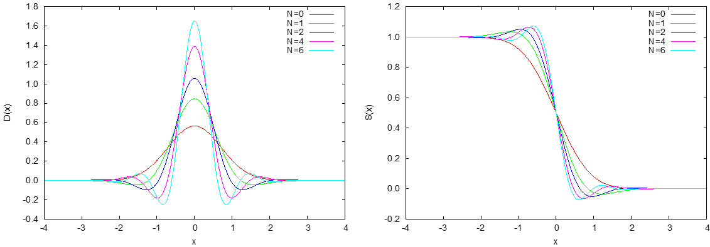

.. _input_parameters:

入力パラメータファイル：nfinp.data（詳細版）
============================================

入力パラメータファイルの形式(F_INP ファイル)
--------------------------------------------

入力パラメータファイルnfinp.dataは、どのようなモデル（原子配置など）に対し、どのような条件で計算するかという情報を記述するファイルです。

デフォルトのファイル名はnfinp.data
ですが、file_names.dataにおいて、F_INPキーワードを使って自由に名前を指定できます。例えば、計算する系に関連した名前をつけることも可能です。

パラメータ設定形式
~~~~~~~~~~~~~~~~~~

このファイルは、タグ名と中括弧{}で囲まれたブロックの階層構造で記述します。計算パラメータの設定は、タグ形式になっており、各タグに、結晶構造、計算精度、計算の制御などの情報を記入します。以下に,
入力パラメータファイルの記述方法を簡単に説明します。

関連のある入力データはまとめて一つの「ブロック」内に記述します。ブロックは,
ブロック名{ ... } という形式で階層的に記述します。たとえば,
以下のようになります。基本的に計算パラメータは、タグ=値の形で指定します。ただし、パラメータごとに指定形式が異なります。各計算パラメータの指定方法の説明を参照ください。

.. code-block:: text

 Upper_block{
   Lower_block{
     ...
     tag_keyword = value
   }
 }

入力パラメータファイルの作成・編集において、以下の点に注意ください。

-  同じ階層に同じ名前のブロックを記述することはできません。
-  ブロック名の大文字・小文字を区別することはありません。
-  ブロック名が間違っている場合には、そのブロック全体が記述されていないものとみなされます（無視されます）。その場合は、デフォルト値が採用されます。エラーメッセージは表示されません。
-  変数は、改行で区切るほかカンマ(,) で区切ることもできます。
-  文字列型の変数に空白文字を含めたい場合、半角の2 重引用符(”)で囲みます。
-  全角文字は使用しないでください。

最上位のブロックは、以下のものがあります。

============================ ==================================
control ブロック             全体的な計算条件の設定
accracy ブロック             計算精度の設定
structure ブロック           原子構造の設定
wavefunction_solver ブロック 波動関数ソルバーの設定
charge_mixing ブロック       電荷密度混合法の設定
structure_evolution ブロック 構造最適化、分子動力学法計算の設定
postproccesingブロック       後処理の設定
printlevelブロック           ログ出力の設定
============================ ==================================

単位の指定
~~~~~~~~~~

PHASE の入力ファイルのデフォルトの単位は原子単位ですが, 単位を明示的に指定することも可能です。\ :numref:`input_parameters_units` の単位を利用することができます(デフォルトの単位は太字で表示されています)。

.. table:: PHASEで利用可能な単位
 :name: input_parameters_units

 +------------+--------------------------------------------------------+
 | 長さ       | **bohr**, angstrom, nm                                 |
 +------------+--------------------------------------------------------+
 | エネルギー | **hartree**, eV, rydberg                               |
 +------------+--------------------------------------------------------+
 | 時間       | **au_time**, fs, ps, ns, s, sec, min, hour, day        |
 +------------+--------------------------------------------------------+
 | 速度       | **bohr/au_time**, bohr/fs, angstrom/fs,                |
 |            | angstrom/au_time, nm/fs, nm/au_time                    |
 +------------+--------------------------------------------------------+
 | 力         | **hartree/bohr**, hartree/angstrom, hartree/nm,        |
 |            | eV/angstrom, eV/bohr, ev/nm,                           |
 |            | rydberg/bohr, rydberg/angstrom, rydberg/nm             |
 +------------+--------------------------------------------------------+
 | 圧力       | **hartree/bohr3**, hartree/angstrom3, hartree/nm3,     |
 |            | eV/angstrom3, eV/bohr3,                                |
 |            | eV/nm3, rydberg/angstrom3, rydberg/bohr3, rydberg/nm3  |
 +------------+--------------------------------------------------------+
 | 質量       | **au_mass**, atomic_mass                               |
 +------------+--------------------------------------------------------+

単位は, 実数型のデータに直接指定する方法だけでなく,
ブロック単位のデフォルト値を指定することもできます。ブロック単位でデフォルトの単位を指定するには,
次のように記述します。

.. code-block:: text

 block{
    #units angstrom
    ...
    ...
 }

この例では, block の長さの単位のデフォルトがÅ単位になります。
複数指定する場合（長さ、エネルギーなど）, 空白で区切って指定してください。

表形式データを含むブロック
~~~~~~~~~~~~~~~~~~~~~~~~~~~~
ブロックは「表形式データ」を持つ場合があります。このようなブロックは対応する表形式データのみ記述することができます。
表形式データは2次元の行列形式でデータを指定することのできる形式であり、たとえば各原子の座標値のように複数の属性値をもつデータを任意の数定義する必要があるようなデータに対して採用されています。
その内容は、たとえば以下のようになります。

.. code-block:: text

 tabular_data{
      #units  angstrom
      #defaullt column1=1, column2=off
      #tag column1 column2 column3
           data11  data12  data13
           data21  data22  data23
           ...
 }

ブロック定義直下に :code:`units` によってブロック共通の単位を設定することができるのは通常のブロックと同じです。通常のブロックと違い単位を指定する方法はこれしかありません。:code:`#default` によって表形式データのデフォルト値を設定することができます。この例では :code:`column1` というカラムには :code:`1` というデフォルト値が、 :code:`column2` というカラムには :code:`off` というデフォルト値が設定されます。値として :code:`*` を指定するとデフォルト値が採用されます。最後のカラムの場合、何も指定がないとやはりデフォルト値が採用されます。:code:`#tag` によってカラムを定義します。スペース区切りで利用したいカラム名を指定します。\ :code:`#tag` の次の行からが表形式データ本体となります。\ :code:`#tag` 行で定義したカラム順に対応するデータを指定します。

コメント
~~~~~~~~

!または//ではじまる行は, コメント扱いとなります。

.. code-block:: text

 block{
  !  comment
  !  tag_keyword = value1 コメント
  // tag_keyword = value2 コメント
  tag_keyword = value3
 }

ただし、!#と、!のあとに#が続く場合はコメントとはみなされないので注意してください。

.. _input_parameters_binaryop_section:

二項演算子を用いた実数指定（バージョン2020.01以降）
~~~~~~~~~~~~~~~~~~~~~~~~~~~~~~~~~~~~~~~~~~~~~~~~~~~

バージョン2020.01以降、二項演算子を用いて実数を指定することができるようになりました。
この機能を活用することによって、たとえば0.33333... を1/3と記述することなどができます。
+, -, /, \* (もしくはx)のいずれかの文字列を含むような数値を検出した場合にそれぞれ足し算、引き算、除算、掛け算を行います。
ただし、+, -には下記の制約があります。

-  先頭が+もしくは-の場合は使えない
-  e, dを含む数値指定(たとえば1e-3, 1d+4)には利用できない

また、一つの実数指定に複数の二項演算子を適用することはできません。

入力パラメータファイル例
~~~~~~~~~~~~~~~~~~~~~~~~

Si ダイヤモンド結晶（2原子）の電子状態計算を行う場合の基本的な計算条件を記述した入力ファイル例です。

.. code-block:: text

  control{
    condition = initial
    cpumax = 86400 sec
    max_iteration = 10000
  }
  accuracy{
    cutoff_wf = 25.0 rydberg
    cutoff_cd = 100.0 rydberg
    num_bands = 8
    ksampling{
      method = monk
      mesh{
        nx = 10
        ny = 10
        nz = 10
      }
    }
    initial_wavefunctions = atomic_orbitals
    initial_charge_density = atomic_charge_density
    scf_convergence{
      delta_total_energy = 1e-10
      succession = 3
    }
    force_convergence{
      max_force = 0.001 hartree/bohr
    }
  }
  structure{
    element_list{
    #tag element atomicnumber
          Si 14
    }
    unit_cell{
      #units angstrom
      a_vector = 0 2.732299538 2.732299538
      b_vector = 2.732299538 0 2.732299538
      c_vector = 2.732299538 2.732299538 0
    }
    unit_cell_type = bravais
    atom_list{
      atoms{
      #tag element rx ry rz mobile
            Si 0.125 0.125 0.125 0
            Si -0.125 -0.125 -0.125 0
      }
      coordinate_system = internal
    }
  }
  wavefunction_solver{
    solvers{
      #tag sol till_n prec cmix submat
          davidson 1 on 1 on
          rmm3 -1 on 1 on
    }
    rmm{
      edelta_change_to_rmm=5e-5
    }
  }
  charge_mixing{
    mixing_methods{
      #tag no method rmxs rmxe istr prec nbmix
        1 pulay 0.40 0.40 3 on 15
    }
  }
  Postprocessing{
    dos{
      sw_dos = ON
      deltaE = 1.e-4 hartree
    }
    charge{
      sw_charge_rspace = ON
      filetype = cube !{cube|density_only}
      title = "This is a title line for the bulk Si"
    }
  }

入力パラメータファイル nfinp.dataのタグ（キーワード）の一覧
-----------------------------------------------------------

入力パラメータファイル nfinp.dataのタグ（キーワード）の一覧を、 :numref:`input_parameters_input_keywords` に示します。

.. table:: 入力パラメータファイル nfinp.dataのタグ（キーワード）の一覧
 :name: input_parameters_input_keywords

 +----------------+----------------+----------------+-------------------------------------+
 | 最上位ブロック | 第2, 3\        | タグ\          | 説明                                |
 |                | ブロック       | （キーワード） |                                     |
 +================+================+================+=====================================+
 | control        |                |                | 全体的な計算条\                     |
 |                |                |                | 件設定ブロック                      |
 +----------------+----------------+----------------+-------------------------------------+
 |                |                | condition      | preparation,                        |
 |                |                |                | -2：入\                             |
 |                |                |                | 力座標の表示,\                      |
 |                |                |                | 対\                                 |
 |                |                |                | 称操作の生成,k\                     |
 |                |                |                | 点の生成まで\                       |
 |                |                |                | で終了します。                      |
 |                |                |                |                                     |
 |                |                |                | automatic,                          |
 |                |                |                | -1：継続\                           |
 |                |                |                | 可能であれば\                       |
 |                |                |                | 計算継続になり\                     |
 |                |                |                | ます。そうでな\                     |
 |                |                |                | ければ、計算開\                     |
 |                |                |                | 始になります。                      |
 |                |                |                |                                     |
 |                |                |                | initial, 0                          |
 |                |                |                | ：計算開始                          |
 |                |                |                |                                     |
 |                |                |                | continuation,                       |
 |                |                |                | 1：計算継続                         |
 |                |                |                |                                     |
 |                |                |                | (以下の2\                           |
 |                |                |                | つはekcal\                          |
 |                |                |                | によ\                               |
 |                |                |                | る計算で使用)                       |
 |                |                |                |                                     |
 |                |                |                | fixed_charge,                       |
 |                |                |                | 2：電荷\                            |
 |                |                |                | を固定して計算                      |
 |                |                |                |                                     |
 |                |                |                | fixed_charge\                       |
 |                |                |                | _continuation,                      |
 |                |                |                | 3：固定\                            |
 |                |                |                | 電荷+計算継続                       |
 |                |                |                |                                     |
 |                |                |                | デフォルト\                         |
 |                |                |                | 値はautomatic                       |
 |                |                |                | です。                              |
 +----------------+----------------+----------------+-------------------------------------+
 |                |                | cpumax         | CPU\                                |
 |                |                |                | 時\                                 |
 |                |                |                | 間の上限（デフ\                     |
 |                |                |                | ォルト：86400                       |
 |                |                |                | sec）                               |
 |                |                |                |                                     |
 |                |                |                | 単位：{sec,                         |
 |                |                |                | min, hour,                          |
 |                |                |                | day}                                |
 +----------------+----------------+----------------+-------------------------------------+
 |                |                | max_iteration  | 総SCF回\                            |
 |                |                |                | 数（イタレーシ\                     |
 |                |                | max_total\     | ョン）の制限値                      |
 |                |                | _scf_iteration |                                     |
 |                |                |                | （デフォ\                           |
 |                |                |                | ルト：10000）                       |
 +----------------+----------------+----------------+-------------------------------------+
 |                |                | max_mdstep     | 総MD計算数の\                       |
 |                |                |                | 制限値（デフォ\                     |
 |                |                |                | ルトは無制限）                      |
 +----------------+----------------+----------------+-------------------------------------+
 |                |                | max\           | 1M\                                 |
 |                |                | _scf_iteration | Dステップ内のS\                     |
 |                |                |                | CF回数の制限値                      |
 |                |                |                |                                     |
 |                |                |                | （デフォ\                           |
 |                |                |                | ルトは無制限）                      |
 +----------------+----------------+----------------+-------------------------------------+
 |                |                | nfstopcheck    | ファイ\                             |
 |                |                |                | ルnfstop.data                       |
 |                |                |                | に書かれた数\                       |
 |                |                |                | 値で、処理を停\                     |
 |                |                |                | 止するべき更新\                     |
 |                |                |                | 回数を決定（デ\                     |
 |                |                |                | フォルト：1）                       |
 +----------------+----------------+----------------+-------------------------------------+
 |                |                | sw_ekzaj       | phase\                              |
 |                |                |                | で、ekcalの入\                      |
 |                |                |                | 力となる波動関\                     |
 |                |                |                | 数ファイルF\_\                      |
 |                |                |                | ZAJ\                                |
 |                |                |                | への出\                             |
 |                |                |                | 力を行うときON\                     |
 |                |                |                | にす\                               |
 |                |                |                | る。EKCALでそ\                      |
 |                |                |                | のファイルを読\                     |
 |                |                |                | み込むときもON\                     |
 |                |                |                | にする\                             |
 |                |                |                | 。ただし、 :math:`\Gamma` 点\       |
 |                |                |                | の計算でしか使\                     |
 |                |                |                | 用できません。                      |
 |                |                |                |                                     |
 |                |                |                | デフ\                               |
 |                |                |                | ォルト値はOFF                       |
 |                |                |                | です。                              |
 +----------------+----------------+----------------+-------------------------------------+
 | accuracy       |                |                | 計\                                 |
 |                |                |                | 算精度の制御用\                     |
 |                |                |                | ブロック識別子                      |
 +----------------+----------------+----------------+-------------------------------------+
 |                |                | cutoff_wf      | 波\                                 |
 |                |                |                | 動関数のカット\                     |
 |                |                |                | オフエネルギー                      |
 +----------------+----------------+----------------+-------------------------------------+
 |                |                | cutoff_cd      | 電\                                 |
 |                |                |                | 荷密度のカット\                     |
 |                |                |                | オフエネルギー                      |
 +----------------+----------------+----------------+-------------------------------------+
 |                |                | num_bands      | バンド数                            |
 +----------------+----------------+----------------+-------------------------------------+
 |                | ksampling      |                |                                     |
 +----------------+----------------+----------------+-------------------------------------+
 |                |                | method         | k\                                  |
 |                |                |                | 点のサ\                             |
 |                |                |                | ンプリング法。                      |
 |                |                |                |                                     |
 |                |                |                | monk：                              |
 |                |                |                | Monkhorst-Pack\                     |
 |                |                |                | 法。                                |
 |                |                |                |                                     |
 |                |                |                | mesh：メッシュ\                     |
 |                |                |                | を生成します。                      |
 |                |                |                |                                     |
 |                |                |                | file：フ\                           |
 |                |                |                | ァイルから入力                      |
 |                |                |                |                                     |
 |                |                |                | direc\                              |
 |                |                |                | t_in：直接記述                      |
 |                |                |                |                                     |
 |                |                |                | gamma                               |
 |                |                |                | ：\ :math:`\                        |
 |                |                |                | \Gamma`\ 点のみ                     |
 |                |                |                |                                     |
 |                |                |                | デフォルトは\                       |
 |                |                |                | Monkhorst-Pack\                     |
 |                |                |                | 法                                  |
 +----------------+----------------+----------------+-------------------------------------+
 |                | mesh           |                | メ\                                 |
 |                |                |                | ッシュの分割数                      |
 +----------------+----------------+----------------+-------------------------------------+
 |                |                | nx, ny, nz     | x,y,z                               |
 |                |                |                | 方向への分割数                      |
 |                |                |                |                                     |
 |                |                |                | デフォルト値=\                      |
 |                |                |                | (4\                                 |
 |                |                |                | ,4,4)、上限値=\                     |
 |                |                |                | (20,20,20)                          |
 +----------------+----------------+----------------+-------------------------------------+
 |                | kshift         |                | Monkhorst-Pack\                     |
 |                |                |                | 法で\                               |
 |                |                |                | のみ有効なタグ                      |
 +----------------+----------------+----------------+-------------------------------------+
 |                |                | k1, k2, k3     | メッシュ\                           |
 |                |                |                | のずれの指定（\                     |
 |                |                |                | 入力値は[0.0,\                      |
 |                |                |                | 0.5] の範囲）                       |
 |                |                |                |                                     |
 |                |                |                | デフォルト値：\                     |
 |                |                |                |                                     |
 |                |                |                | hexgonal                            |
 |                |                |                | の場合： k1 =                       |
 |                |                |                | k2 = 0, k3 =                        |
 |                |                |                | 0.5                                 |
 |                |                |                |                                     |
 |                |                |                | そ                                  |
 |                |                |                | れ以外の場合：                      |
 |                |                |                | k1 = k2 = k3 =                      |
 |                |                |                | 0.5                                 |
 |                |                |                |                                     |
 |                |                |                | ただし0.5                           |
 |                |                |                | はメッ\                             |
 |                |                |                | シュの刻み幅の\                     |
 |                |                |                | 半分の値を指す                      |
 +----------------+----------------+----------------+-------------------------------------+
 |                | kpoints        |                | k 点の重みづけ                      |
 +----------------+----------------+----------------+-------------------------------------+
 |                |                | kx ky kz denom |                                     |
 |                |                | weight         | k=                                  |
 |                |                |                | (kx/denom,                          |
 |                |                |                | ky/denom,                           |
 |                |                |                | kz/denom)                           |
 |                |                |                |                                     |
 |                |                |                | k\                                  |
 |                |                |                | 点の座標値と\                       |
 |                |                |                | 、その重みづけ                      |
 +----------------+----------------+----------------+-------------------------------------+
 |                | smearing       |                | k\                                  |
 |                |                |                | 点サンプリ\                         |
 |                |                |                | ングのsmearing                      |
 +----------------+----------------+----------------+-------------------------------------+
 |                |                | method         | parabolic                           |
 |                |                |                | ：Parabolic法（デフォルト）         |
 |                |                |                |                                     |
 |                |                |                | cold ：Cold smearing 法\            |
 |                |                |                | （金属系で有効）                    |
 |                |                |                |                                     |
 |                |                |                | tetrahedral：Tetrahedral法          |
 |                |                |                |                                     |
 |                |                |                | improved_tetrahedral :              |
 |                |                |                | 改良tetrahedral法                   |
 |                |                |                |                                     |
 |                |                |                | tetrahedral                         |
 |                |                |                | またはimproved_tetrahedral          |
 |                |                |                | としたときにはk点のサンプリングを\  |
 |                |                |                | メッシュ法にしなけれ\               |
 |                |                |                | ばなりません。                      |
 +----------------+----------------+----------------+-------------------------------------+
 |                |                | width          | smearing幅（デフォルト値：0.001\    |
 |                |                |                | hartree）                           |
 |                |                |                |                                     |
 |                |                |                | method = parabolicとcold            |
 |                |                |                | の時に使用                          |
 +----------------+----------------+----------------+-------------------------------------+
 |                | (タグなし)     |                |                                     |
 +----------------+----------------+----------------+-------------------------------------+
 |                |                | xctype         | 交換相関エ\                         |
 |                |                |                | ネルギー(LDA,GGA)                   |
 |                |                |                |                                     |
 |                |                |                | LDA ： LDAPW91, PZ                  |
 |                |                |                |                                     |
 |                |                |                | GGA ： GGAPBE, REVPBE               |
 +----------------+----------------+----------------+-------------------------------------+
 |                | s\             |                | 自己無憧\                           |
 |                | cf_convergence |                | 着場の収束判定                      |
 +----------------+----------------+----------------+-------------------------------------+
 |                |                | delta\         | 原子あたりの\                       |
 |                |                | _total_energy  | 全エネルギーの\                     |
 |                |                |                | 計算誤差の上限\                     |
 |                |                |                | :math:`\Delta E`                    |
 |                |                |                |                                     |
 |                |                |                | （デフォルト値：                    |
 |                |                |                | :math:`10^{- 9}`                    |
 |                |                |                | hartree）                           |
 +----------------+----------------+----------------+-------------------------------------+
 |                |                | succession     | ここで指定するsuccession回数連続\   |
 |                |                |                | して誤差が :math:`\Delta E` \       |
 |                |                |                | 以内に収まったときにSCF収束したと\  |
 |                |                |                | 判断する。構造緩和している、\       |
 |                |                |                | あるいは有限温度計算している場合は\ |
 |                |                |                | 原子位置の更新手続きに移る。        |
 |                |                |                | （デフォルト値：2）                 |
 +----------------+----------------+----------------+-------------------------------------+
 |                | for\           |                | 力の収束判定                        |
 |                | ce_convergence |                |                                     |
 +----------------+----------------+----------------+-------------------------------------+
 |                |                | max_force      | 全原子に働く力の最大値が\           |
 |                |                |                | この値より小さくなれば計算を終了    |
 |                |                |                |                                     |
 |                |                |                | （デフォルト値：0.001               |
 |                |                |                | hartree/bohr）                      |
 +----------------+----------------+----------------+-------------------------------------+
 |                | ek_convergence |                | 固有値の収束判定。                  |
 |                |                |                | ekcalによる計算専用の識別子         |
 +----------------+----------------+----------------+-------------------------------------+
 |                |                | n\             | 収束を促進するために追加する\       |
 |                |                | um_extra_bands | 追加バンド（これらのバンドの固有値\ |
 |                |                |                | は収束が保証されない）の数。\       |
 |                |                |                | 基底関数が増え、収束を促進する効果\ |
 |                |                |                | がある。                            |
 |                |                |                | （デフォルト値：2）                 |
 +----------------+----------------+----------------+-------------------------------------+
 |                |                | num\           | k点一個当たりの\                    |
 |                |                | _max_iteration | 最大の更新回数\                     |
 |                |                |                | （デフォルト値：300）               |
 +----------------+----------------+----------------+-------------------------------------+
 |                |                | sw\            | 固有値評価用スイッチ                |
 |                |                | _eval_eig_diff |                                     |
 |                |                |                | { 1, on, yes }：評価あり\           |
 |                |                |                | （デフォルト）                      |
 |                |                |                |                                     |
 |                |                |                | { 0, off, no }：評価なし            |
 +----------------+----------------+----------------+-------------------------------------+
 |                |                | delta\         | 固有値の許容誤差                    |
 |                |                | _eigenvalue    |                                     |
 |                |                |                | （デフォルト値：                    |
 |                |                |                | :math:`10^{- 5}` hartree）          |
 +----------------+----------------+----------------+-------------------------------------+
 |                |                | succession     | 計算の繰り\                         |
 |                |                |                | 返し回数（デフォルト値：2）         |
 +----------------+----------------+----------------+-------------------------------------+
 |                | (タグなし)     |                |                                     |
 +----------------+----------------+----------------+-------------------------------------+
 |                |                | initial\       | 波動関数の初期値                    |
 |                |                | _wavefunctions |                                     |
 |                |                |                | 選択肢：{ random_numbers,           |
 |                |                |                | matrix_diagon, atomic_orbitals,     |
 |                |                |                | file }                              |
 |                |                |                |                                     |
 |                |                |                | random_numbers: 乱数で初期化        |
 |                |                |                |                                     |
 |                |                |                | matrix_diagon: 小行列対角化で初期化 |
 |                |                |                |                                     |
 |                |                |                | atomic_orbitals: 原子軌道で初期化   |
 |                |                |                |                                     |
 |                |                |                | file: F_ZAJで指定されるファイル\    |
 |                |                |                | から読み込んだ波動関数で初期化      |
 +----------------+----------------+----------------+-------------------------------------+
 |                | matrix_diagon  |                | 波動関数の初期値を小行列対\         |
 |                |                |                | 角化法で与える                      |
 +----------------+----------------+----------------+-------------------------------------+
 |                |                | cutoff_wf      | 波動関数のカットオフエネルギー      |
 +----------------+----------------+----------------+-------------------------------------+
 |                | (タグなし)     |                |                                     |
 +----------------+----------------+----------------+-------------------------------------+
 |                |                | initial\       | 電荷密度の初期分布                  |
 |                |                | _charge_density|                                     |
 |                |                |                | 選択肢：{Gauss,                     |
 |                |                |                | atomic_charge_density, file}        |
 |                |                |                |                                     |
 |                |                |                | Gauss:                              |
 |                |                |                | ガウス分布関数の重ね\               |
 |                |                |                | 合わせで初期化                      |
 |                |                |                |                                     |
 |                |                |                | atomic_charge_density:              |
 |                |                |                | 原子の電子密度の重ね\               |
 |                |                |                | 合わせで初期化                      |
 |                |                |                |                                     |
 |                |                |                | file:                               |
 |                |                |                | ファイルF_CHGTから入力              |
 +----------------+----------------+----------------+-------------------------------------+
 |                | precalculation |                |                                     |
 +----------------+----------------+----------------+-------------------------------------+
 |                |                | nel_Ylm        | 予め計算してメ\                     |
 |                |                |                | モリー上に保持\                     |
 |                |                |                | しておく球面調\                     |
 |                |                |                | 和関数の\                           |
 |                |                |                | 最高次数（デフ\                     |
 |                |                |                | ォルト値は9）                       |
 +----------------+----------------+----------------+-------------------------------------+
 | structure      |                |                | 構造設定用\                         |
 |                |                |                | ブロック識別子                      |
 +----------------+----------------+----------------+-------------------------------------+
 |                | unit_cell_type |                | 単位胞の型。                        |
 |                |                |                | 選択肢：                            |
 |                |                |                | {primitive, Bravais }               |
 +----------------+----------------+----------------+-------------------------------------+
 |                | unit_cell      | a_vector       | unit cell                           |
 |                |                |                | 単位胞の指定。\                     |
 |                |                | b_vector       | 以下のいずれか\                     |
 |                |                |                | の方法で与える                      |
 |                |                | c_vector       |                                     |
 |                |                |                | 各\                                 |
 |                |                | a, b, c        | 格子ベクトルの\                     |
 |                |                |                |                                     |
 |                |                | alpha,         | :math:`(x,y,z)` 成分                |
 |                |                |                | 　                                  |
 |                |                | beta,          |                                     |
 |                |                |                | デフォルトの単位はBohr              |
 |                |                | gamma          |                                     |
 |                |                |                | 格子定数 a, b, c                    |
 |                |                |                |                                     |
 |                |                |                | b–c軸、c–a軸、a–b軸のなす角         |
 |                |                |                |                                     |
 |                |                |                | (角度のデフォルト単位はdegree)      |
 +----------------+----------------+----------------+-------------------------------------+
 |                | symmetry       |                |                                     |
 +----------------+----------------+----------------+-------------------------------------+
 |                |                | method         | 選択肢:{manual,                     |
 |                |                |                | automatic}                          |
 |                |                |                |                                     |
 |                |                |                | automaticを選択すると\              |
 |                |                |                | 自動的に対称性を決定します。        |
 +----------------+----------------+----------------+-------------------------------------+
 |                |                | cry\           | 選択肢：                            |
 |                |                | stal_structure |                                     |
 |                |                |                | {diamond,hexagonal,                 |
 |                |                |                | fcc, bcc, simple cubic}             |
 +----------------+----------------+----------------+-------------------------------------+
 |                | tspace         |                | 柳瀬章「空間群のプログラム\         |
 |                |                |                | TSPACE」(裳華房)\                   |
 |                |                |                | および、ABCAP\                      |
 |                |                |                | のマニュアルを参照                  |
 +----------------+----------------+----------------+-------------------------------------+
 |                |                | lattice_system |                                     |
 |                |                |                | {rhombohedral,                      |
 |                |                |                | trigonal,r,t,-1}                    |
 |                |                |                |                                     |
 |                |                |                | {hexagonal,h,                       |
 |                |                |                | 0}、{primitive                      |
 |                |                |                | ,simple,p,s,1}                      |
 |                |                |                |                                     |
 |                |                |                | {facecentered                       |
 |                |                |                | ,f,2}、{                            |
 |                |                |                | bodycentered,b,3}                   |
 |                |                |                |                                     |
 |                |                |                | {bottomcentered                     |
 |                |                |                | ,basecentered                       |
 |                |                |                | ,onefacecenter                      |
 |                |                |                | ed,bot,ba,o,4}                      |
 +----------------+----------------+----------------+-------------------------------------+
 |                |                | num_generators | 生成元の数                          |
 |                |                |                | (:math:`1 \sim 3`                   |
 |                |                |                | の整数値)                           |
 +----------------+----------------+----------------+-------------------------------------+
 |                |                | generators     | 生成元                              |
 +----------------+----------------+----------------+-------------------------------------+
 |                |                | af_generator   | 磁性\                               |
 |                |                |                | 空間群の生成元                      |
 +----------------+----------------+----------------+-------------------------------------+
 |                | (第3 タグなし) |                |                                     |
 +----------------+----------------+----------------+-------------------------------------+
 |                |                | sw_inversion   | 反転対称性の有無                    |
 +----------------+----------------+----------------+-------------------------------------+
 |                | (第2 タグなし) |                |                                     |
 +----------------+----------------+----------------+-------------------------------------+
 |                |                | nspin          | スピン自由度                        |
 |                |                |                |                                     |
 |                |                |  (2023.01以降) | 入力値：{1,2,-2}から選択。          |
 |                |                |                | 2D版では4も選択可能。               |
 |                |                |                | 4はnoncollinear計算に対応。         |
 |                |                +----------------+-------------------------------------+
 |                |                | magnetic_state | スピン自由度                        |
 |                |                |                |                                     |
 |                |                | 上のnspinが\   | 入力値：{nonmgnetic,\               |
 |                |                | 設定されている\| antiferro,\                         |
 |                |                | 場合はこの\    | magnetic}\                          |
 |                |                | 設定は読み\    | から選択。                          |
 |                |                | 飛ばされる。   | nonmagneticはnonmagあるいはnoneと\  |
 |                |                |                | 省略も可。antiferroはafと省略可。   |
 |                |                |                | magneticはmagと省略可。\            |
 |                |                |                | また、プログラム開発の歴史的経緯か\ |
 |                |                |                | ら、para、ferroの設定も可能。\      |
 |                |                |                | paraはnonmagneticとferroはmagnetic\ |
 |                |                |                | と同じである。\                     |
 |                |                |                | nonmagnetic、nonmag、noneあるいは\  |
 |                |                |                | paraはnspin=1に、mgnetic、magあるい\|
 |                |                |                | はferroはnspin=2に対応する。\       |
 |                |                |                | また、antiferroあるいはafはnspin=-2\|
 |                |                |                | に対応する。                        |
 |                |                |                | 2D版ではnoncollinearの設定も可能。  |
 |                |                |                | noncollinearはnspin=4に対応する。   |
 |                |                +----------------+-------------------------------------+
 |                |                | noncollinearについては\                              |
 |                |                | :numref:`advanced_noncollinear_section` を参照。     |
 +----------------+----------------+----------------+-------------------------------------+
 |                | atom_list      |                | 原子構成                            |
 +----------------+----------------+----------------+-------------------------------------+
 |                |                | coo\           | 選択肢                              |
 |                |                | rdinate_system | ：{cartesian,                       |
 |                |                |                | internal}                           |
 +----------------+----------------+----------------+-------------------------------------+
 |                | atoms          |                |                                     |
 +----------------+----------------+----------------+-------------------------------------+
 |                |                | rx, ry, rz     | 座標                                |
 +----------------+----------------+----------------+-------------------------------------+
 |                |                | element        | 元素名                              |
 +----------------+----------------+----------------+-------------------------------------+
 |                |                | mobile         | 可動性                              |
 |                |                |                |                                     |
 |                |                |                | 入力値                              |
 |                |                |                | は{1,0}、{on,off}、{yes,no}         |
 |                |                |                | のどれでも可                        |
 +----------------+----------------+----------------+-------------------------------------+
 |                |                | weight         | 重みづけ                            |
 |                |                |                |                                     |
 |                |                |                | weight = 2 は                       |
 |                |                |                | sw_inversion = onの時のみ有効       |
 |                |                |                |                                     |
 |                |                |                | このとき、反転対称の位置\           |
 |                |                |                | にも原子を生成                      |
 +----------------+----------------+----------------+-------------------------------------+
 |                | element_list   |                |                                     |
 +----------------+----------------+----------------+-------------------------------------+
 |                |                | element        | 元素名(atomsのelement\              |
 |                |                |                | の入力値と一致させる)               |
 +----------------+----------------+----------------+-------------------------------------+
 |                |                | atomic_number  | 原子番号                            |
 +----------------+----------------+----------------+-------------------------------------+
 |                |                | mass           | 質量                                |
 +----------------+----------------+----------------+-------------------------------------+
 |                |                | zeta           | スピン分極                          |
 |                |                |                | s=(nup-ndown)/(nup+ndown)           |
 +----------------+----------------+----------------+-------------------------------------+
 |                |                | deviation      | 初期電荷をガウ\                     |
 |                |                |                | ス関数の和で与\                     |
 |                |                |                | えるときの各ガ\                     |
 |                |                |                | ウス関数の偏差。                    |
 |                |                |                |                                     |
 |                |                |                | タグ名には devや\                   |
 |                |                |                | standard_deviation\                 |
 |                |                |                | も使用可                            |
 +----------------+----------------+----------------+-------------------------------------+
 | wavefu\        | solver         |                | 波動関数ソルバ\                     |
 | nction_solvers |                |                | ー（詳しくは\                       |
 |                |                |                | :numref:`input_param_wfsol1` と\    |
 |                |                |                | :numref:`input_param_wfsol2`        |
 |                |                |                | を参照）                            |
 +----------------+----------------+----------------+-------------------------------------+
 |                |                | sol            | ソルバーの種類                      |
 |                |                |                |                                     |
 |                |                |                | MatrixDiagon                        |
 |                |                |                | ：行列対角化法                      |
 |                |                |                |                                     |
 |                |                |                | lm+MSD：                            |
 |                |                |                | lm(一次元探索)+                     |
 |                |                |                | MSD(改良                            |
 |                |                |                | 型最急降下法)                       |
 |                |                |                |                                     |
 |                |                |                | RMM2P,                              |
 |                |                |                | RMM3：RMM 法                        |
 |                |                |                |                                     |
 |                |                |                | MSD：                               |
 |                |                |                | 修正最速降下法                      |
 |                |                |                |                                     |
 |                |                |                | pdavidson:                          |
 |                |                |                | 分割Davidson法                      |
 |                |                |                |                                     |
 |                |                |                | pkosugi:                            |
 |                |                |                | 分割Kosugi法                        |
 +----------------+----------------+----------------+-------------------------------------+
 |                |                | till_n         | 何回の\                             |
 |                |                |                | 更新まで、sol                       |
 |                |                |                | で指定された波動関数の              |
 |                |                |                |                                     |
 |                |                |                | 更新方法を適用するかを指定          |
 +----------------+----------------+----------------+-------------------------------------+
 |                |                | dts            | 計算開始\                           |
 |                |                |                | 時の時間刻み幅                      |
 +----------------+----------------+----------------+-------------------------------------+
 |                |                | dte            | itr                                 |
 |                |                |                | で指定され\                         |
 |                |                |                | た更新の回数に\                     |
 |                |                |                | おける時間刻み                      |
 |                |                |                |                                     |
 |                |                |                | 幅。dtsの値\                        |
 |                |                |                | のみが入力され\                     |
 |                |                |                | た場合にはdte\                      |
 |                |                |                | にも同じ値を適用                    |
 +----------------+----------------+----------------+-------------------------------------+
 |                |                | itr            | 時間刻み幅を変化さ\                 |
 |                |                |                | せる回数の指定                      |
 +----------------+----------------+----------------+-------------------------------------+
 |                |                | var            | 補間の形式。選\                     |
 |                |                |                | 択肢：{linear,                      |
 |                |                |                | tanh}。既定値はlinear               |
 +----------------+----------------+----------------+-------------------------------------+
 |                |                | prec           | 前処理の有無。                      |
 |                |                |                | 選択肢：{on,off}                    |
 +----------------+----------------+----------------+-------------------------------------+
 |                |                | cmix           | 電荷混合法\                         |
 |                |                |                | の指定用変数。                      |
 |                |                |                | charge_mixing                       |
 |                |                |                | タグの\                             |
 |                |                |                | mixing_methods                      |
 |                |                |                | で指\                               |
 |                |                |                | 定されている、\                     |
 |                |                |                | 各方法に割り振\                     |
 |                |                |                | られた番号を使\                     |
 |                |                |                | って指定する。                      |
 +----------------+----------------+----------------+-------------------------------------+
 |                |                | submat         | onのときsub\                        |
 |                |                |                | space_rotation\                     |
 |                |                |                | の指定に従って\                     |
 |                |                |                | subspace                            |
 |                |                |                | rotation\                           |
 |                |                |                | を行う。選\                         |
 |                |                |                | 択肢：{on,off}                      |
 +----------------+----------------+----------------+-------------------------------------+
 |                | lin\           |                | 一次元探索\                         |
 |                | e_minimization |                | に関係した制御                      |
 +----------------+----------------+----------------+-------------------------------------+
 |                |                | dt\            | 一次元探索をお\                     |
 |                |                | _lower_critical| こなう時の時間\                     |
 |                |                |                | 刻みの下限と上限                    |
 |                |                | dt\            |                                     |
 |                |                | _upper_critical|                                     |
 |                |                |                | (デフォルト値はそ\                  |
 |                |                |                | れぞれ、0.005と2.0)                 |
 +----------------+----------------+----------------+-------------------------------------+
 |                |                | delta_lmdenom  |                                     |
 +----------------+----------------+----------------+-------------------------------------+
 |                | rmm            |                | 残差最小化法                        |
 +----------------+----------------+----------------+-------------------------------------+
 |                |                | imGSrmm        | RMM\                                |
 |                |                |                | 法で更新した波\                     |
 |                |                |                | 動関数に対して\                     |
 |                |                |                | 、Gram–Schmidt\                     |
 |                |                |                | の直交化法\                         |
 |                |                |                | を適用する頻度\                     |
 |                |                |                | (デフォルト値は、毎回\              |
 |                |                |                | 実行のimGSrmm                       |
 |                |                |                | = 1)                                |
 +----------------+----------------+----------------+-------------------------------------+
 |                |                | rr\            | バンド毎の収束\                     |
 |                |                | _Critical_Value| 判定条件。波動\                     |
 |                |                |                | 関数の残差のノ\                     |
 |                |                |                | ルムがここで指\                     |
 |                |                |                | 定された値以下\                     |
 |                |                |                | になれば、その\                     |
 |                |                |                | バンドはそれ以\                     |
 |                |                |                | 降更新されない                      |
 +----------------+----------------+----------------+-------------------------------------+
 |                |                | edelta\        | 波動関\                             |
 |                |                | _change_to_rmm | 数のソルバーを\                     |
 |                |                |                | RMM法に変える\                      |
 |                |                |                | ときの、全エネ\                     |
 |                |                |                | ルギー収束判定\                     |
 |                |                |                | 条件。ここで指\                     |
 |                |                |                | 定する値より全\                     |
 |                |                |                | エネルギーの収\                     |
 |                |                |                | 束が悪いときは\                     |
 |                |                |                | 、その前のソル\                     |
 |                |                |                | バーを続けて使\                     |
 |                |                |                | う。デフォルト\                     |
 |                |                |                | 値は1e-3/natm\                      |
 |                |                |                | hartree；ここ\                      |
 |                |                |                | でnatmは原子数                      |
 +----------------+----------------+----------------+-------------------------------------+
 |                | sub\           |                | subspace\                           |
 |                | space_rotation |                | 対角\                               |
 |                |                |                | 化に関する制御                      |
 +----------------+----------------+----------------+-------------------------------------+
 |                |                | subspa\        | デ\                                 |
 |                |                | ce_matrix_size | フォルトの入力\                     |
 |                |                |                | 値はバンドの数                      |
 |                |                |                | (num_bands)                         |
 |                |                |                |                                     |
 |                |                |                | num_bandsよ\                        |
 |                |                |                | りも大きな値が\                     |
 |                |                |                | 入力された場合\                     |
 |                |                |                | には、強制的に\                     |
 |                |                |                | num_bands\                          |
 |                |                |                | の値を\                             |
 |                |                |                | 入力値に設定                        |
 +----------------+----------------+----------------+-------------------------------------+
 |                |                | damping_factor | 非対角\                             |
 |                |                |                | 要素のダンピン\                     |
 |                |                |                | グ係数。[0.0,1.0]                   |
 |                |                |                | の範囲外の値\                       |
 |                |                |                | が入力された場\                     |
 |                |                |                | 合には、入力値\                     |
 |                |                |                | を強制的に1.0に設定                 |
 +----------------+----------------+----------------+-------------------------------------+
 |                |                | period         | solverタグの\                       |
 |                |                |                | submatがONにな\                     |
 |                |                |                | っている場合、\                     |
 |                |                |                | periodに1回\                        |
 |                |                |                | subspace_rotationを行います。       |
 |                |                |                |                                     |
 |                |                |                | 例えば\                             |
 |                |                |                | period=3のとき\                     |
 |                |                |                | iteration(i)のう\                   |
 |                |                |                | ち、i=1,4,7,10                      |
 |                |                |                | ,...がsubspace rotation             |
 |                |                |                | を行う対象に\                       |
 |                |                |                | なります。デフ\                     |
 |                |                |                | ォルト値は1。                       |
 +----------------+----------------+----------------+-------------------------------------+
 |                |                | critical_ratio | 非対角項の要\                       |
 |                |                |                | 素の値(1要素あ\                     |
 |                |                |                | たり)と対角項\                      |
 |                |                |                | の要素の値(1要\                     |
 |                |                |                | 素あたり)の比\                      |
 |                |                |                | がいったん\                         |
 |                |                |                | critical_ratioより\                 |
 |                |                |                | 小さくなった点\                     |
 |                |                |                | に対しては、そ\                     |
 |                |                |                | れ以後subspace rotation\            |
 |                |                |                | を行いません。                      |
 |                |                |                |                                     |
 |                |                |                | デフォルト\                         |
 |                |                |                | 値は\ :math:`10^{-15}`              |
 +----------------+----------------+----------------+-------------------------------------+
 | charge_mixing  |                |                | 電荷混合法。（詳しくは\             |
 |                |                |                | :numref:`input_param_charge_mixing` |
 |                |                |                | と :numref:`input_param_wfsol2`     |
 |                |                |                | を参照）                            |
 +----------------+----------------+----------------+-------------------------------------+
 |                | mixing_methods |                | 電荷\                               |
 |                |                |                | 密度の混合法。                      |
 +----------------+----------------+----------------+-------------------------------------+
 |                |                | method         | 選択肢：{                           |
 |                |                |                | simple,                             |
 |                |                |                | broyden2,                           |
 |                |                |                | pulay }                             |
 |                |                |                |                                     |
 |                |                |                | デフォルトはpulay                   |
 +----------------+----------------+----------------+-------------------------------------+
 |                |                | rmxs           | 計算\                               |
 |                |                |                | 開始時の電荷密\                     |
 |                |                |                | 度を混ぜる割合\                     |
 |                |                |                |                                     |
 |                |                |                | デフォルト値は0.4                   |
 +----------------+----------------+----------------+-------------------------------------+
 |                |                | rmxe           | itr                                 |
 |                |                |                | 回の更新\                           |
 |                |                |                | の後に電荷密度                      |
 |                |                |                | を混ぜる割合。                      |
 |                |                |                |                                     |
 |                |                |                | デフォルト値は                      |
 |                |                |                | 0.4。rmxs                           |
 |                |                |                | の値の\                             |
 |                |                |                | みが入力された\                     |
 |                |                |                | 場合には、rmxe                      |
 |                |                |                | にも同じ値を適用。                  |
 +----------------+----------------+----------------+-------------------------------------+
 |                |                | itr            | 電荷密度\                           |
 |                |                |                | の混合比(rmx)\                      |
 |                |                |                | を変化させる回数                    |
 +----------------+----------------+----------------+-------------------------------------+
 |                |                | var            | rmx\                                |
 |                |                |                | を変化させる方法(itr回のSCF回数の\  |
 |                |                |                | 間にrmxsからrmxeまで）。\           |
 |                |                |                | 選択肢：｛linear, tanh}             |
 +----------------+----------------+----------------+-------------------------------------+
 |                |                | prec           | 前処理の有無。\                     |
 |                |                |                | 選択肢：{on, off}                   |
 +----------------+----------------+----------------+-------------------------------------+
 |                |                | istr           | method が\                          |
 |                |                |                | simple 以外\                        |
 |                |                |                | の場合に、istr\                     |
 |                |                |                | 回の更新後に\                       |
 |                |                |                | 、指定した方法\                     |
 |                |                |                | で電荷を混ぜる                      |
 +----------------+----------------+----------------+-------------------------------------+
 |                |                | nbmix          | 蓄えておくべ\                       |
 |                |                |                | き電荷密度デー\                     |
 |                |                |                | タの回数を指定                      |
 +----------------+----------------+----------------+-------------------------------------+
 |                |                | update         | nbmix\                              |
 |                |                |                | 回分用\                             |
 |                |                |                | 意されている電\                     |
 |                |                |                | 荷密度の配列を\                     |
 |                |                |                | 使い切った時の\                     |
 |                |                |                | 処理の選択法。                      |
 |                |                |                |                                     |
 |                |                |                | 選択肢：{anew,renew}                |
 |                |                |                |                                     |
 |                |                |                | anew\                               |
 |                |                |                | はそれまでのデータを全\             |
 |                |                |                | て棄却して新規に開始。              |
 |                |                |                |                                     |
 |                |                |                | renew は\                           |
 |                |                |                | 最も古いデータ\                     |
 |                |                |                | を最新のデータ\                     |
 |                |                |                | と入れ換える。                      |
 +----------------+----------------+----------------+-------------------------------------+
 |                | charge\_       |                |                                     |
 |                | preconditioning|                |                                     |
 +----------------+----------------+----------------+-------------------------------------+
 |                |                | amix           | 前処理変数a                         |
 +----------------+----------------+----------------+-------------------------------------+
 |                |                | bmix           | 前処理変数b                         |
 +----------------+----------------+----------------+-------------------------------------+
 | struc\         |                |                | 構造緩和計算用\                     |
 | ture_evolution |                |                | ブロック識別子                      |
 +----------------+----------------+----------------+-------------------------------------+
 |                |                | method         | 選択肢：{sd,                        |
 |                |                |                | quench, gdiis,                      |
 |                |                |                | bfgs, cg, cg2,                      |
 |                |                |                | fire,                               |
 |                |                |                | velocity_verlet,                    |
 |                |                |                | temper                              |
 |                |                |                | ature_control}                      |
 +----------------+----------------+----------------+-------------------------------------+
 |                |                | dt             | 時間刻み幅                          |
 +----------------+----------------+----------------+-------------------------------------+
 |                | stress         |                | ストレス計算                        |
 +----------------+----------------+----------------+-------------------------------------+
 |                |                | sw_stress      | ス\                                 |
 |                |                |                | トレス計算の有                      |
 |                |                |                | 無。選択肢：{                       |
 |                |                |                | on,off }                            |
 +----------------+----------------+----------------+-------------------------------------+
 |                | gdiis          |                | (GDIIS\                             |
 |                |                |                | およびBFGS                          |
 |                |                |                | を選択す                            |
 |                |                |                | る場合のタグ)                       |
 +----------------+----------------+----------------+-------------------------------------+
 |                |                | initial_method | GDIIS (BFGS)\                       |
 |                |                |                | へ移行する前\                       |
 |                |                |                | に利用する最適\                     |
 |                |                |                | 化アルゴリズ\                       |
 |                |                |                | ム。選択肢：{                       |
 |                |                |                | quench, cg, sd                      |
 |                |                |                | }デ\                                |
 |                |                |                | フォルト値はcg                      |
 +----------------+----------------+----------------+-------------------------------------+
 |                |                | gdiis_box_size | ここで指定する\                     |
 |                |                |                | イオン座標更新\                     |
 |                |                |                | 回数分のデータ\                     |
 |                |                |                | をgdiis(bfgs)\                      |
 |                |                |                | 用配列に蓄える                      |
 +----------------+----------------+----------------+-------------------------------------+
 |                |                | gdiis_hownew   | gdiis_box_si\                       |
 |                |                |                | zeで指定した回\                     |
 |                |                |                | 数分のイオン座\                     |
 |                |                |                | 標のデータ配列\                     |
 |                |                |                | を使い切った時\                     |
 |                |                |                | の処理法の選択                      |
 |                |                |                |                                     |
 |                |                |                | 選択肢：{anew,                      |
 |                |                |                | renew}                              |
 +----------------+----------------+----------------+-------------------------------------+
 |                |                | c_forc2gdiis   | GDIIS (BFGS)\                       |
 |                |                |                | への切\                             |
 |                |                |                | 替えの判定条件                      |
 |                |                |                |                                     |
 |                |                |                | デフ\                               |
 |                |                |                | ォルト値は0.05                      |
 |                |                |                | (hartree/bohr)                      |
 +----------------+----------------+----------------+-------------------------------------+
 | postprocessing |                |                |                                     |
 +----------------+----------------+----------------+-------------------------------------+
 |                | dos            |                | 状態密度の出力                      |
 +----------------+----------------+----------------+-------------------------------------+
 |                |                | sw_dos         | 状\                                 |
 |                |                |                | 態密度出力の有\                     |
 |                |                |                | 無。選択肢：{                       |
 |                |                |                | on,off }                            |
 +----------------+----------------+----------------+-------------------------------------+
 |                |                | method         | 選択肢：{                           |
 |                |                |                | tetrahedral,                        |
 |                |                |                | Gaussian }                          |
 +----------------+----------------+----------------+-------------------------------------+
 |                |                | deltaE_dos     | 状態密度出力の\                     |
 |                |                |                | エネルギー精度                      |
 +----------------+----------------+----------------+-------------------------------------+
 |                |                | variance       | mehtod\                             |
 |                |                |                | がGaussian\                         |
 |                |                |                | の場合のガ\                         |
 |                |                |                | ウス関数の分散                      |
 +----------------+----------------+----------------+-------------------------------------+
 |                |                | nwd\_dos\_\    | 出力時の\                           |
 |                |                | window\_width  | エネルギー幅 :math:`\Delta` E\      |
 |                |                |                | を次式で指定：                      |
 |                |                |                | :math:`\Delta` E=nwd_window_width x |
 |                |                |                | deldos                              |
 +----------------+----------------+----------------+-------------------------------------+
 |                | charge         |                | 電荷の出力                          |
 +----------------+----------------+----------------+-------------------------------------+
 |                |                | sw\_           | 電荷出力の有\                       |
 |                |                | charge_rspace  | 無。選択肢：{                       |
 |                |                |                | on,off }                            |
 +----------------+----------------+----------------+-------------------------------------+
 |                |                | filetype       | 電荷出力\                           |
 |                |                |                | ファイルの形式                      |
 |                |                |                |                                     |
 |                |                |                | 選択肢：{                           |
 |                |                |                | cube,                               |
 |                |                |                | density_only }                      |
 +----------------+----------------+----------------+-------------------------------------+
 |                |                | title          | 電荷の出力フ\                       |
 |                |                |                | ァイルの見出し                      |
 |                |                |                |                                     |
 |                |                |                | filetype =                          |
 |                |                |                | cube                                |
 |                |                |                | の時のみ有効                        |
 +----------------+----------------+----------------+-------------------------------------+
 | printoutlevel  |                |                | 標準出力への出\                     |
 |                |                |                | 力レベルの制御                      |
 |                |                |                |                                     |
 |                |                |                | 0：出力なし                         |
 |                |                |                |                                     |
 |                |                |                | 1：情報を出力                       |
 |                |                |                |                                     |
 |                |                |                | 2：デバッグ                         |
 |                |                |                | 用の情報を出力                      |
 +----------------+----------------+----------------+-------------------------------------+
 |                |                | base           | 他\                                 |
 |                |                |                | の変数に入力値\                     |
 |                |                |                | が指定されてい\                     |
 |                |                |                | ない時は、この\                     |
 |                |                |                | 値がデフォルト                      |
 +----------------+----------------+----------------+-------------------------------------+
 |                |                | pulay          | Pulay\                              |
 |                |                |                | 電荷混合法                          |
 +----------------+----------------+----------------+-------------------------------------+
 |                |                | timing         | 時間指定情報                        |
 +----------------+----------------+----------------+-------------------------------------+
 |                |                | solver         | 電子状態解法                        |
 +----------------+----------------+----------------+-------------------------------------+
 |                |                | evdff          | 固\                                 |
 |                |                |                | 有エネルギー差                      |
 +----------------+----------------+----------------+-------------------------------------+
 |                |                | rmm            | 残差最小化法                        |
 +----------------+----------------+----------------+-------------------------------------+
 |                |                | snl            | 非局\                               |
 |                |                |                | 所ポテンシャル                      |
 +----------------+----------------+----------------+-------------------------------------+
 |                |                | gdiis          | GDIIS 法                            |
 +----------------+----------------+----------------+-------------------------------------+
 |                |                | eigenvalue     | 固有値                              |
 +----------------+----------------+----------------+-------------------------------------+
 |                |                | spg            | 空間群                              |
 +----------------+----------------+----------------+-------------------------------------+
 |                |                | kp             | k 点                                |
 +----------------+----------------+----------------+-------------------------------------+
 |                |                | matdiagon      | 行列対角法                          |
 +----------------+----------------+----------------+-------------------------------------+
 |                |                | vlhxcq         | ローカ\                             |
 |                |                |                | ルポテンシャル                      |
 +----------------+----------------+----------------+-------------------------------------+
 |                |                | totalcharge    | 電子密度                            |
 +----------------+----------------+----------------+-------------------------------------+
 |                |                | submat         | 部分空間回転法                      |
 +----------------+----------------+----------------+-------------------------------------+
 |                |                | strcfctr       | 構造因子                            |
 +----------------+----------------+----------------+-------------------------------------+
 |                |                | parallel       | 並列化の\                           |
 |                |                |                | ための前処理の                      |
 |                |                |                | 結果の出力制御                      |
 +----------------+----------------+----------------+-------------------------------------+
 |                |                | input_file     | 入力ファイル\                       |
 |                |                |                | F_INP\                              |
 |                |                |                | の\                                 |
 |                |                |                | 解析結果の出力                      |
 +----------------+----------------+----------------+-------------------------------------+
 |                |                | parallel_debug | 1\                                  |
 |                |                |                | に設\                               |
 |                |                |                | 定するとゼロ番\                     |
 |                |                |                | ノード以外のプ\                     |
 |                |                |                | ロセスからもo\                      |
 |                |                |                | utput00x_xxxと\                     |
 |                |                |                | いったファイル\                     |
 |                |                |                | に出力を行う。                      |
 +----------------+----------------+----------------+-------------------------------------+
 |                |                | jobstatus      | 計算の進行状況\                     |
 |                |                |                | をjobstatus00x\                     |
 |                |                |                | に出力                              |
 +----------------+----------------+----------------+-------------------------------------+
 |                | jo\            |                | 状況ファ\                           |
 |                | bstatus_option |                | イルの出力制御                      |
 +----------------+----------------+----------------+-------------------------------------+
 |                |                | jo\            | tag, tag_line,                      |
 |                |                | bstatus_format | tableが\                            |
 |                |                |                | 選択可能。既定\                     |
 |                |                |                | 値はtag。                           |
 +----------------+----------------+----------------+-------------------------------------+
 |                |                | jo\            | ON またはOFF                        |
 |                |                | bstatus_series |                                     |
 +----------------+----------------+----------------+-------------------------------------+

全体的な計算条件設定（Control）
-------------------------------

計算をはじめから実行するのか継続計算を実施するのか、最大どれくらいの時間計算を継続するのか、など、計算全体に関わる条件の設定をcontrol ブロックで行います。たとえば、以下のように記述します。

.. code-block:: text

 control{
   condition = initial
   cpumax = 1 day
   max_iteration = 1000000
 }

control ブロックにおいては、次の変数を指定することができます。

.. table::
 :widths: auto
 :class: longtable

 +---------------------------------+-------------------------------------------+
 | condition                       | 初期\                                     |
 |                                 | 計算か継続計算かなどの指定です。"initial" |
 |                                 | とす\                                     |
 |                                 | ると計算は始めから行われ、"continuation"  |
 |                                 | とすると、波動関\                         |
 |                                 | 数、電荷密度分布などの計算結果を引き継い  |
 |                                 | だ継続計算が行われます。また、"automatic" |
 |                                 | と\                                       |
 |                                 | すると継続計算に必要な複数のファイル（こ\ |
 |                                 | れらは、前のジョブが正常終了した場合には\ |
 |                                 | 自動的に生成される）が存在する場合は"con\ |
 |                                 | tinuation"、存在しない場合は"initial"と設\|
 |                                 | 定したのと同じ動作をします。"preparation" |
 |                                 | を指定すると、前処\                       |
 |                                 | 理（使用配列の大きさの評価、ｋ点生成など  |
 |                                 | ）のみ行います。デフォルト値は"automatic" |
 |                                 | です。                                    |
 |                                 | ほかに、（収束した）                      |
 |                                 | 電荷密度分布を読み込んで、それを固定した\ |
 |                                 | まま波動関数のみを収束させる（バンド分散\ |
 |                                 | を計算する場合など）には、"fixed_charge", |
 |                                 | "fixed_charge_continuation",              |
 |                                 | "fixed_charge_automatic"のいずれかを設定\ |
 |                                 | します。それぞれ、最初から計算するか、継\ |
 |                                 | 続計算するか、自動判定するかの指定です。  |
 |                                 | これらの"initial"、"continuation"、       |
 |                                 | "automatic"、"preparation"、fixed_charge" |
 |                                 | 、"fixed_charge_continuation"、"fixed_c   |
 |                                 | harge_automatic"は、それぞれ、整数0、1、- |
 |                                 | 1、-2、2、3、-3で代用することができます。 |
 +---------------------------------+-------------------------------------------+
 | cpumax                          | PHASE計算を実行する時間を、\              |
 |                                 | 実数＋単位、の組合せで指定します。ここで\ |
 |                                 | 指定した時間を超えると、収束に達していな\ |
 |                                 | くても、継続計算用のファイルなどが出力さ\ |
 |                                 | れ、計算が停止します。デフォルト値は86400 |
 |                                 | s (1 日)                                  |
 |                                 | です。単位は必須です。使える単位は、"\    |
 |                                 | sec"、"s"（これは"sec"と同じ）、"min"、"h\|
 |                                 | our"、および"day"です。継続計算になる可能\|
 |                                 | 性がある場合には、ジョブの指定時間よりも\ |
 |                                 | 小さな値に設定しておくのがよいでしょう（\ |
 |                                 | 例えば、ジョブの制限値が６時間で、収束後\ |
 |                                 | の状態密度計算などの後処理がなければ、5.8\|
 |                                 | hour程度に設定する）。                    |
 +---------------------------------+-------------------------------------------+
 | max_iteration                   | SCF計算の総\                              |
 |                                 | イタレーション数の最大値を指定します。SCF\|
 | max_total_scf_iteration         | 計算\                                     |
 |                                 | の総イタレーション数がここで指定した数に\ |
 |                                 | 達すると継続計算用のファイルなどが出力さ\ |
 |                                 | れ、計算が停止します。デフォルト値は10000\|
 |                                 | です。                                    |
 +---------------------------------+-------------------------------------------+
 | max_scf_iteration               | 構造緩和計算や分子動力学\                 |
 |                                 | 計算における各MDステップ内での電子状態の\ |
 |                                 | 更新回数（SCFイタレーション数）の最大値を\|
 |                                 | 指定します。例えば、構造緩和計算の最初期\ |
 |                                 | に構造が不安定で、電子状態に対する収束判\ |
 |                                 | 定条件を満たすまで数百回に及ぶような大き\ |
 |                                 | な回数のSCFイタレーションが必要になること\|
 |                                 | があります。その場合には、SCF計算を途中で\|
 |                                 | 打ち切って、力を計算してより安定な原子構\ |
 |                                 | 造に更新してから、次のSCF計算をすすめた方\|
 |                                 | が有利になります。しかし、あまり小さな値\ |
 |                                 | （１０程度）に設定すると、計算される力の\ |
 |                                 | 誤差が大きくなり、逆に収束を難しくするこ\ |
 |                                 | とがあるので注意が必要です。正確な力の計\ |
 |                                 | 算が重要な場合には使用しないでください。  |
 +---------------------------------+-------------------------------------------+

.. _control_blocksize_section:

ブロックサイズ
~~~~~~~~~~~~~~~~~~~~

``control`` ブロックにおいて演算に用いるブロックサイズを指定することができます。特に大規模な系の場合デフォルトのブロックサイズは適切でない可能性があるため、適切なパラメーターを探ることによって高速な計算が実現できます。
設定可能な主なブロックサイズは下記の通り。

.. csv-table:: 主なブロックサイズとデフォルト値

 nblocksize_mgs,修正グラムシュミット,8
 nblocksize_betar_dot_wfs,波動関数と射影演算子の積,32
 nblocksize_vnonlocal_w,波動関数と非局所ポテンシャルの積,1000
 nblocksize_submat,部分空間対角化,0 (ブロッキングをしない)

以下の記述を行うとブロックサイズの探索を行ってくれます。（3次元並列版のみ）

.. code-block:: text

 control{
   sw_optimize_blocking_parameters = on
 }

この設定を施すと、前処理の際各ルーチンをブロックサイズを変えながら小数回実施し、最もよかったブロックサイズを報告します。Printlevelブロックにおいてipriblsizeを2以上に設定している場合、ログファイルには以下のような情報が記録されます。

.. code-block:: text

 !** MGS blocksize and elapsed time   525     10.0516
 !** MGS blocksize and elapsed time   262      5.3681
 !** MGS blocksize and elapsed time   131      3.2394
 !** MGS blocksize and elapsed time    65      2.7701
 !** MGS blocksize and elapsed time    32      3.5466
 !** MGS blocksize and elapsed time    16      3.7317
 !** MGS blocksize and elapsed time     8      5.3605
 !** MGS blocksize and elapsed time     4     10.3687

最終的に得られた最適なブロッキングパラメーターは以下のように出力されます。

.. code-block:: text

 nblocksize_mgs           =    65
 nblocksize_betar_dot_wfs =  1024
 nblocksize_vnonlocal_w   =  4096
 nblocksize_submat        =   700

決まったパラメーターは計算でそのまま活用されます。この文字列は入力パラメーターファイルのcontrolブロックの下にそのまま貼り付けて利用することができます。

なお、この機能は三次元版並列版においてのみ有効です。また、この機能とk点並列とScaLAPACKをすべて同時に利用することはできないのでご注意ください。

.. _control_speedup_options_section:

高速計算のオプション (2023.01以降)
~~~~~~~~~~~~~~~~~~~~~~~~~~~~~~~~~~~~~~
ControlブロックにおいてSCF計算を高速にするための以下のようなオプションを利用することができます。

.. csv-table:: SCF計算高速化オプション

   "オプション","説明"
   "sw_keep_hloc_phi", "onにすると「ローカルポテンシャルに波動関数を作用した配列」をメモリーに保存し再利用することによって高速化を実現します。デフォルト値はonです。offにすると使用メモリーを削減することができます。"
   "sw_precalculate_phase_betar_dot_wfs","波動関数と射影演算子の積の演算において位相をあらかじめ計算しておくかどうかを指定するスイッチ。有効にすると計算が高速化されるがメモリー消費が多くなります。デフォルト値はoff."
   "sw_precalculate_phase_vnonlocal","波動関数と非局所ポテンシャルの積の演算において位相をあらかじめ計算しておくかどうかを指定するスイッチ。有効にすると計算が高速化されるがメモリー消費が多くなります。デフォルト値はoff."
   "sw_reduce_fft_for_charge","RMM3ソルバー利用の際に高速フーリエ変換の回数を減らすオプション。有効にするとFFTの回数が減るが、収束性に若干の影響を及ぼす可能性がある。デフォルト値はoff."

\ :code:`sw_keep_hloc_phi` は特に効果が高いため、デフォルト値がonになっています。メモリーが枯渇してしまうような問題に対してはoffに設定するようにしてください。

計算精度の指定（Accuracy）
--------------------------

.. _input_parameters_cutoff:

カットオフエネルギー
~~~~~~~~~~~~~~~~~~~~

カットオフエネルギーは平面波基底を利用した計算においては計算の信頼性を決める重要なパラメーターです。

カットオフエネルギーは以下のように指定します。

.. code-block:: text

 accuracy{
    cutoff_wf = 25 Rydberg
    cutoff_cd = 225 Rydberg
 }

========= ==============================================================
cutoff_wf 波動関数のカットオフエネルギーをエネルギーの単位で指定します。
cutoff_cd 電荷密度のカットオフエネルギーをエネルギーの単位で指定します。
========= ==============================================================

カットオフエネルギーは充分な精度が得られる値を事前に勘案することが理想的ですが、以下のような指針も有用です。

-  cutoff_wfはおおよそ25 rydberg
-  cutoff_cdは、ノルム保存型の擬ポテンシャルのみを利用している場合はcutoff_wfの4倍、ウルトラソフト型擬ポテンシャルを利用している場合は9倍。バージョン2020.01以降はこのような値がデフォルト値になりました。

バンド数
~~~~~~~~

バンド数は、以下のようにaccuracyブロックの下のnum_bands変数によって指定します。

.. code-block:: text

 accuracy{
    num_bands = 12
 }

========= ========
num_bands バンド数
========= ========

バンド数は、最低限価電子数の半分+1は必要です。通常最低必要な数の2
割程度多めの数を採用します。設定値が価電子数の半分以下の場合には、自動的に設定が増やされます。またこの値を設定していない場合には自動的にバンド数が設定されます。

k点サンプリングとスメアリング
~~~~~~~~~~~~~~~~~~~~~~~~~~~~~

基本の設定
^^^^^^^^^^

カットオフエネルギーと同様に、k点サンプリングも計算の信頼性を決める重要なパラメーターです。
k点サンプリングは, accuracy ブロックの下にksampling ブロックを作成し、ksampling
ブロックの下で設定を行います。たとえば下記のようになります。

.. code-block:: text

 accuracy{
    ksampling{
      method = monk
      mesh{
        nx=4
        ny=4
        nz=4
      }
    }
 }

ksampling ブロックでは、下記の変数/ブロックを定義することができます。

.. table::
 :widths: auto
 :class: longtable

 +--------+----------------------------------------------------------------------+
 | method | k点サンプリングの方法を選びます。monk, mesh, file,                   |
 |        | gamma、directinのいずれかです。monkはMonkhors\                       |
 |        | t-Pack法によるサンプリングで、通常推奨される方法であり、デ\          |
 |        | フォルト値です。meshは単純なメッシュで逆空間を分割します。           |
 |        | 四面体法により電荷密度を構成する場合や状態密度の計算を行う\          |
 |        | 場合にはこれを指定します。fileはファイルから読み込みます。           |
 |        | バンド分散をみるために対称線に沿って多くのｋ点を入力する必\          |
 |        | 要がある場合やフェルミ面の計算において大量のk点を考慮する\           |
 |        | 必要がある場合などに利用します。gammaを指定すると\                   |
 |        | :math:`\Gamma`\ 点のみをサンプリングします。充分大きな単位胞を使\    |
 |        | っていて、\ :math:`\Gamma`\ 点のみでも充分な精度が得られる\          |
 |        | 場合には、これを指定します。directinは直接ｋ点の組（個数と\          |
 |        | 座標）を指定します。いずれの方法でも、サンプリングｋ点に\            |
 |        | :math:`\Gamma`\ 点が含まれていて、系に反転対称中心がなけれ\          |
 |        | ば（設定されていなければ）、\ :math:`\Gamma`\ 点の波動関数\          |
 |        | に関する計算は、この点の対称性を利用して他のｋ点のものに比\          |
 |        | べて３倍程度高速に実行されます（後述のとおり、これを抑制す\          |
 |        | る、つまり他のｋ点と同じ演算法を適用する手段もあります）。           |
 +--------+----------------------------------------------------------------------+
 | mesh   | 逆空間の分割数を指定します。以下の変数が利用できます。               |
 |        |                                                                      |
 |        | nx 1番目の逆格子ベクトルの分割数を指定します。                       |
 |        |                                                                      |
 |        | ny 2番目の逆格子ベクトルの分割数を指定します。                       |
 |        |                                                                      |
 |        | nz 3番目の逆格子ベクトルの分割数を指定します。                       |
 +--------+----------------------------------------------------------------------+

スメアリングは、フェルミ準位付近の状態を“ぼやかす” 操作です。
これによって、フェルミ準位付近で状態を持つ金属系においても少ないk 点数で高い精度で計算ができるようになる場合があります。
スメアリングは、以下のようにaccuracy ブロックの下のsmearing ブロックにおいて指定します。

.. code-block:: text

 accuracy{
    smearing{
      method = parabolic
      width = 0.001 hartree
    }
 }

smearing ブロックでは以下の変数を利用することができます。

.. table::
 :widths: auto
 :class: longtable

 +--------+------------------------------------------------------------+
 | method | スメアリングの方法を指定します。parabolic、tetrahedral、   |
 |        | cold、improved_tetrahedral、methfessel_paxtonのいずれか    |
 |        | を指定します。通常利\                                      |
 |        | 用するのはparabolicで、２次関数の組み合わせによって        |
 |        | フェルミ準位付近をぼやかします（後述）。\                  |
 |        | tetrahedralとimproved_tetrahedralは四面体法で、主\         |
 |        | に四面体法による状態密度計算を行う場合に利用します。coldは\|
 |        | Coldスメアリングで、金属において有効とされている方法です。 |
 +--------+------------------------------------------------------------+
 | width  | スメアリング\                                              |
 |        | の幅をエネルギーの単位で指定します。デフォルト値は0.001    |
 |        | hartreeです(method=parabolicの場合)もしくは0.01 hartree    |
 |        | (method=methfessel-paxtonの場合)                           |
 |        |                                                            |
 |        | この設定はmethod=parabolicもしくはmethfessel_paxtonの\     |
 |        | 場合に有効です。                                           |
 |        | 気を付けなければならないのは、method=tetrahedralの場合、\  |
 |        | このwidthは別の意味を持つことです。\                       |
 |        | この場合、widthは"縮退しているとていると見なされる準位\    |
 |        | 間のエネルギー差の閾値" になります（指定がない場合の\      |
 |        | 既定値は1.e-5 hartree）。                                  |
 |        | method=parabolicのときに設定したwidthをmethod=tetrahedral\ |
 |        | の場合にもそのまま残しておかないように注意しましょう。     |
 +--------+------------------------------------------------------------+

Widthで指定された値をwとします。method=parabolicの場合、各バンドの固有エネルギーεを下の図で示す状態密度分布を持つものとして扱います。ε-wからε+wまでの間は上に凸な二次関数、ε-2wからε-wまでの間とε+wからε+2wまでの間はそれぞれ、下に凸な二次関数で表され、それらが連続に接続しています。この状態はε-2wからε+2wまで積分して１になるように規格化されています。これにより各固有状態の占有割合が0から1の間の値を取るようになります。フェルミエネルギー±2wの間にある状態がこのスメアリングの影響を受けます。フェルミエネルギー近傍に状態が複数あり、SCF計算（および構造緩和計算）中に値の順序が入れ替わるような場合には、これらの固有エネルギーがフェルミエネルギー±2wの範囲に入るように設定すると（基底状態の電荷密度分布の変化が抑制され）収束性が改善されることがあります。しかし、wが大きい程、DFTの基底電子状態からのずれも大きくなるので注意が必要です。

  Smearing widthと状態密度の関係。横軸はエネルギー、縦軸は状態密度。

.. _input_parameters_2020_kp:

**k**\ 点サンプリングを“密度”で指定する方法（バージョン2020.01以降）
^^^^^^^^^^^^^^^^^^^^^^^^^^^^^^^^^^^^^^^^^^^^^^^^^^^^^^^^^^^^^^^^^^^^^^

バージョン2020.01より、\ **k**\ 点サンプリングをメッシュ数ではなく“密度”で指定することができるようになりました。以下のように設定します。

.. code-block:: text

 accuracy{
   ksampling{
     density = 4 bohr
   }
 }

densityは長さの単位で指定します。meshブロックにおけるメッシュの指定があればそちらが優先されます。デフォルト値は4
bohrであり、これはSi結晶の場合に4×4×4のメッシュを指定することに相当します。このデフォルト値で問題ないのであれば、ksamplingブロックを丸ごと省くことも可能です。

**k**\ 点サンプリング指定のデフォルトの振る舞いの変更（バージョン2020.01以降）
^^^^^^^^^^^^^^^^^^^^^^^^^^^^^^^^^^^^^^^^^^^^^^^^^^^^^^^^^^^^^^^^^^^^^^^^^^^^^^^

これまではksamplingのmethodのデフォルト値は常にmonkでしたが、バージョン2020.01以降smearingブロックのmethodがtetrahedralの場合に限りデフォルト値がmeshとなるように変更されました。これは、スメアリング手法としてtetrahedral法を利用する場合k点サンプリング手法がmeshであることが必要なためです。この仕様変更のため、「smearingのmethodがtetrahedralでksamplingのmethodとしてmeshを明示的に指定していない」場合以前のバージョンと等価な計算にならない点には留意が必要です。

.. _section_methfessel_paxton:

Methfessel-Paxton法によるスメアリング (バージョン2021.01以降)
^^^^^^^^^^^^^^^^^^^^^^^^^^^^^^^^^^^^^^^^^^^^^^^^^^^^^^^^^^^^^^^^^^

**概要**

PHASE/0にはparabolic法、四面体法などのスメアリング手法が備わっています。バージョン2021以降、これにMethfessel-Paxton法 [Methfessel89]_ が加わりました。Methfessel-Paxton法は、負の占有数を許容するかわりに大きなスメアリング幅を利用しても全エネルギーなどの重要な計算結果がほとんど変化しない、という特徴を持ったスメアリング手法です。

**Methfessel-Paxton法について**

基本の理論

スメアリング手法とは、 :math:`\delta` 関数および階段関数を数値的に安定でなめらかな関数で近似する手法ということができます。Methfessel-Paxton法においては、 :math:`\delta` 関数および階段関数を以下のように近似します。

.. math::
 D \left( x \right) = \sum_{n=0}^N [ A_n H_{2n} {\rm e}^{-x^2} ]

.. math::
 S \left( x \right) = \frac{1}{2} \left(1 - {\rm erf}(x)\right)
 :label: eq:methfessel_paxton1

:math:`A_n = \frac{(-1)^n}{n!4^2\sqrt(\pi)}`, :math:`H_{n}` は次数 :math:`n` のエルミート多項式です。 実際の計算においては、準位 :math:`ik` における固有値を :math:`\varepsilon_{ik}` フェルミエネルギー :math:`\varepsilon_F` スメアリング幅を :math:`\sigma` とすると :math:`x` は :math:`x_{ik}=\frac{\left(\varepsilon_{ik}-\varepsilon_F\right)}{\sigma}` という形で用いられます。また、エントロピー項は以下のように評価することができます [Kresse96]_

.. math::
 S_N = \sigma \sum_{ik} \frac{1}{2} A_N H_{2N} \left(x_{ik}\right) {\rm e}^{-x_{ik}^2}
 :label: eq:methfessel_paxton2

:numref:`fig_mp1` に、 *N* =6までの :math:`D(x), S(x)` を示します。

  *N* = 6までの :math:`D(x)` および :math:`S(x)`

:numref:`fig_mp1` から明らかなように、Methfessel-Paxton法の場合フェルミエネルギー付近（ :math:`x=0` 付近）の電子の占有数が負になる場合があります。これは明らかに物理的ではありませんが、最終的な全エネルギーの計算値などに影響を及ぼすことはありません。

フェルミエネルギーについて

通常フェルミエネルギーは電荷の数が合うように二分法によって求めますが、Methfessel-Paxton法においては負の占有状態が発生するため通常の二分法ではフェルミエネルギーが一意に求まらない可能性があります。そこで、最低エネルギーから少しずつエネルギーを増やし、電子数が超えるエネルギーを見つけてから通常の二分法に移行する、という特殊な手続きでフェルミエネルギーを求めます。具体的な手続きは下記の通り。

#. スメアリングに利用するスメアリング幅とMethfessel-Paxton法の次数からエネルギー幅 :math:`\delta` を設定します。:math:`\delta=a \sigma/N`. :math:`a` は入力パラメーターファイルで設定可能な調整値で、PHASE/0のデフォルト値は10です。
#. 探索を開始する最低エネルギー値を設定します。求まっている固有値の最低値でもよいですが、保守的すぎるので :math:`e_{\rm min} + \left(e_{\rm max}-e_{\rm min}\right)/2n` という値を採用します。
#.	:math:`\delta` を最低エネルギーに加算していきフェルミエネルギーとし、結果得られる仮の電荷が本来の電荷を上回った段階でそのエネルギーを上限値とします。
#.	以上の処理によって下限と上限がエネルギー幅の範囲で決定するので、ここからは通常の二分法に移行し、フェルミエネルギーを求めます。

**使い方**

スメアリングの設定は、入力パラメーターファイルのaccuracyブロックの下のsmearingブロックにおいて行います。Methfessel-Paxton法の設定例を以下に記述します。

.. code-block::

  accuracy{
    smearing{
      method = methfessel_paxton
      width = 0.01 hartree
      methfessel_paxton{
        order = 2
      }
    }
  }

methodにmethfessel\_paxtonを指定すると(methでも可)スメアリング手法がMethfessel-Paxton法になります。widthにおいてメアリング幅をエネルギーの単位で指定します。Methfessel-Paxton法の詳細設定はmethfessel_paxtonブロック（もしくはmethブロック）において行います。ここでは以下のような設定を施すことができます。

.. csv-table:: Methfessel-Paxton法の詳細設定
 :widths: 30 70
 :name: mp_table1

 "タグ名","説明"
 "order","Methessel-Paxton法の次数を指定します。デフォルト値は2です。"

**例題**

\ :code:`samples/smearing` 以下に例題が配置されています。
FCC-AlとBCC-Feの例題が格納されています。それぞれの結晶について、\ :code:`mp2 mp4 mp6 parabolic` の4つのディレクトリーがあり、
それぞれ *N* = 2, 4および6の場合のMethfessel-Paxton法を適用した入力例と従来のparabolic法を適用した例題に対応します。
さらにその下のサブディレクトリーには、sigma0.0001(スメアリング幅を0.0001 hartreeにした場合)とsigma0.001(スメアリング幅を0.001 hartreeにした場合)
の例題が配置されています。これらの例題から得られる全エネルギーの計算結果を次の表にまとめます(表中のエネルギーはすべてhartree単位)

.. csv-table:: Methfessel-Paxton法および従来法によって得られる全エネルギー。
 :widths: auto
 :name: mp_table2

 ""," :math:`\sigma=0.0001` hartree"," :math:`\sigma=0.001` hartree"
 "Al, mp2","-0.2552794","-0.2552805"
 "Al, mp4","-0.2552794","-0.2552801"
 "Al, mp6","-0.2552794","-0.2552801"
 "Al, parabolic","-0.2552797","-0.2552832"
 "Fe, mp2","-21.993246","-21.993248"
 "Fe, mp4","-21.993246","-21.993248"
 "Fe, mp6","-21.993246","-21.993247"
 "Fe, parabolic","-21.993247","-21.993259"

表の数値から、Methfessel-Paxton法はparabolic法と比較して全エネルギーがスメアリング幅に依存しにくいことが分かります。

.. [Methfessel89] Methfessel and A. T. Paxton, Phys. Rev. B 40 (1989) 3616.
.. [Kresse96] G\. Kresse and J. Furthmüller, Computational Materials Science 6 (1996) 15.

交換相関エネルギー
~~~~~~~~~~~~~~~~~~

交換相関エネルギーは、LDAとGGAの２種類があります。LDAはLDAPW91,
PZ、GGAはGGAPBE, RPBE, REVPBEが利用できます。

.. code-block:: text

 accuracy{
   xctype = ggapbe
 }

====== ============================
xctype 交換相関エネルギー(LDA, GGA)

       LDA ： LDAPW91, PZ

       GGA ： GGAPBE, RPBE, REVPBE
====== ============================

収束判定
~~~~~~~~

収束判定は、電子状態計算の収束判定と構造最適化の際の原子に働く力の収束判定の2
種類があります。以下のように指定します。

.. code-block:: text

  accuracy{
     scf_convergence{
       delta_total_energy = 1.0E-8 Hartree
       succession = 3
     }
     force_convergence{
       max_force = 2.0E-4 Hartree/Bohr
     }
  }

収束判定に関わるブロック/変数は以下の通りです。

.. table::
 :widths: auto
 :class: longtable

 +--------------------+-------------------------------------------------+
 | scf_convergence    | SCF計算の収束判定を指定するブロックです。       |
 +--------------------+-------------------------------------------------+
 | delta_total_energy | 全エネルギ\                                     |
 |                    | ーの差の閾値をエネルギーの単位で指定します。    |
 |                    |                                                 |
 |                    | 現在の全エネルギーと1ステップ前のエネルギーの差\|
 |                    | がここで指定した値よりも小さい場合収束判定を満\ |
 |                    | たしたとみなされます。デフォルト値は1e-9です。  |
 +--------------------+-------------------------------------------------+
 | succession         | delta_total_energyを何回連続でみたせば\         |
 |                    | 最終的に収束したと見なすかを指定します。ここで\ |
 |                    | 指定した値の回数連続で収束判定を満たせば収束が\ |
 |                    | 得られたと判定されます。デフォルト値は2です。   |
 +--------------------+-------------------------------------------------+
 | force_convergence  | 原子に働く\                                     |
 |                    | 力の最大値に関する閾値を設定するブロックです。  |
 +--------------------+-------------------------------------------------+
 | max_force          | 原子に働く力の最大値の閾値を\                   |
 |                    | 力の単位で指定します。デフォルト値は1e-3です。  |
 +--------------------+-------------------------------------------------+

.. _input_initial_wf_and_chg:

初期波動関数と初期電荷密度
~~~~~~~~~~~~~~~~~~~~~~~~~~

初期波動関数と初期電荷密度の設定を適切に行うと、電子状態計算を少ない回数で収束させることができます。初期波動関数および初期電荷密度は、以下のように設定することができます。

.. code-block:: text

 accuracy{
    initial_wavefunctions = atomic_orbitals
    intial_charge_density = atomic_charge_density
    matrix_diagon{
      cutoff_wf = 5 rydberg
    }
 }

初期波動関数および初期電荷密度の設定に関わるブロック/変数は下記の通りです。

.. table::
 :widths: auto
 :class: longtable

 +------------------------+--------------------------------------------+
 | initial_wavefunctions  | 初期波動関\                                |
 |                        | 数の設定方法を指定します。                 |
 |                        |                                            |
 |                        | random_numbers, matrix_diagon, file,       |
 |                        | atomic_orbitals\                           |
 |                        | を選択することができます。random_numbers   |
 |                        | は乱数による初期化です。matrix_diagon      |
 |                        | は行列対角化によってもとめます。この際、初\|
 |                        | 期波動関数作成時にのみ利用するカットオフエ\|
 |                        | ネルギーを採用することもできます。その指定\|
 |                        | 方法は後述のmatrix_diagonブロックにおいて\ |
 |                        | 行います。fileは、波動関数ファイルから読み\|
 |                        | 込みます。すでにある程度収束した波動関数デ\|
 |                        | ータファイルを持っている場合はこのオプショ\|
 |                        | ンを指定し、読み込ませることができます。a\ |
 |                        | tomic_orbitalsは、擬ポテンシャルファイルに\|
 |                        | 記録された原子軌道データをもとに初期化を行\|
 |                        | います。デフォルト値はrandom_numbersです。 |
 +------------------------+--------------------------------------------+
 | initial_charge_density | 初期電荷密度の設定方法を指定します。Gauss, |
 |                        | file,                                      |
 |                        | atomic_charge_density                      |
 |                        | のいずれかを選択することがで\              |
 |                        | きます。Gaussは原子を中心とした単純なガウ\ |
 |                        | ス関数による初期化です。fileはファイルから\|
 |                        | 読み込みます。すでにある程度収束した電荷密\|
 |                        | 度データファイルを持っている場合はこのオプ\|
 |                        | ションを選択し、読み込ませることができます\|
 |                        | 。atomic_charge_densityは擬ポテンシャルフ\ |
 |                        | ァイルに記録された原子の電荷密度をもとに初\|
 |                        | 期化を行います。デフォルト値はGaussです。  |
 +------------------------+--------------------------------------------+
 | matrix_diagon          | initial_wavefunc\                          |
 |                        | tionsにmatrix_diagonを指定している場合に、\|
 |                        | その振る舞いを制御するためのブロックです。 |
 +------------------------+--------------------------------------------+
 | cutoff_wf              | 初期波動関数作成時に利用するカットオ\      |
 |                        | フエネルギーの値を指定します。デフォルト値\|
 |                        | は、通常のカットオフエネルギーの半分です。 |
 +------------------------+--------------------------------------------+

.. _input_parameters_differenet_wfcut:

カットオフ/格子定数の異なる計算から出力された波動関数/電荷密度を読み込む方法（バージョン2020.01以降）
~~~~~~~~~~~~~~~~~~~~~~~~~~~~~~~~~~~~~~~~~~~~~~~~~~~~~~~~~~~~~~~~~~~~~~~~~~~~~~~~~~~~~~~~~~~~~~~~~~~~~

initial_wavefunctions, initial_charge_densityでfileを指定するとファイルから波動関数や電荷密度を読み込むことができますが、2020.01未満のバージョンではカットオフエネルギーおよび格子定数が等しい場合のみ読み込むことができました。
バージョン2020.01以降は、カットオフが異なる/格子定数が異なる（すなわちメッシュが異なる）場合は新しいメッシュ上に値を補間して読み込むことができるようになりました。カットオフエネルギーもしくは格子定数が異なる波動関数データ/電荷密度データを読み込む場合以下のような設定を施します。

.. code-block:: text

 accuracy{
   sw_read_pwbs_info = on
   initial_wavefunctions = file
   initial_charge_density = file
 }

このようにすると、nfpwbs.dataファイル(file_names.dataにおいて識別子F_PWBSを利用して変更可能)から必要な情報が読み込まれ、波動関数や電荷密度が補間をしながら読み込まれるように動作します。nfpwbs.dataファイルは計算終了時に自動的に書き出されますが、この動作を抑制したい場合は次の指定を行います。

.. code-block:: text

 accuracy{
   sw_write_pwbs_info = off
 }

sw_read_pwbs_infoのデフォルト値はoff, sw_write_pwbs_infoのデフォルト値はonです。

.. _input_parameters_rspace_section:

実空間法
~~~~~~~~

PHASEは、非局所ポテンシャルの演算を逆空間で実行しますが、これを実空間で行わせることも可能です。この機能を利用するためには、以下のように設定します。

.. code-block:: text

 accuracy{
   nonlocal_potential{
     sw_rspace = on
     r0_factor = 1.9
   }
 }

実空間法は、 [King-Smith91]_ および [Wang01]_ の方法で実現されています。
逆空間法はその演算量が :math:`O(N^3)` であるのに対し実空間法は :math:`O(N^2)` なので、大きな系においては実空間法の方が有利となります。
ただし、逆空間法では厳密解が得られるのに対し、実空間法は近似解しか得られない点には注意が必要です。
nonlocal_potentialブロックでは以下のような設定を施すことが可能です。

.. table::
 :widths: auto
 :class: longtable

 +------------------------+--------------------------------------------+
 | sw_rspace              | 実空間法を利用するかどうかを指定します。   |
 |                        |                                            |
 |                        | デフォルト値はoffです。                    |
 +------------------------+--------------------------------------------+
 | projector_optimization | 実空間法を適用するためにはプロジェク\      |
 |                        | ターの最適化を行う必要がありますが、その方\|
 |                        | 法を指定します。このパラメーターにprefitti\|
 |                        | ngを指定すると[1]の方法で、mask_functionを\|
 |                        | 指定すると文献[2]の方法でこの最適化が行わ\ |
 |                        | れます。デフォルト値はmask_functionです。  |
 +------------------------+--------------------------------------------+
 | r0_factor              | 「最適化されたプロジェクター」の\          |
 |                        | およぶ範囲を、もとのプロジェクターの何倍に\|
 |                        | するかを指定する実数。デフォルト値は1.9。  |
 +------------------------+--------------------------------------------+

.. [King-Smith91] R\. D. King-Smith, M. C. Payne, and J. S. Lin, “Real-space implementation of nonlocal pseudopotentials for first-principles total-energy calculations”, Physical Review B **44** 13063 (1991).
.. [Wang01] Lin-Wang Wang, “Mask-function real-space implementations of nonlocal pseudopotentials”, Physical Review B **64** 201107 (2001).

原子構造（Structure）
---------------------

計算に利用するモデルの指定は、structure ブロックの下で行います。たとえば、以下のようになります。

.. code-block:: text

 structure{
     unit_cell_type = Bravais
     unit_cell{
         #units angstrom
         a_vector = 4.914100000 0.000000000 0.000000000
         b_vector = -2.457050000 4.255735437 0.000000000
         c_vector = 0.000000000 0.000000000 5.406000000
     }
     atom_list{
         coordinate_system = Internal
         atoms{
             #units angstrom
             #tag element rx ry rz
              O 0.413100000054 0.145400000108 0.118930000000
              O 0.854599999943 0.267699999886 0.452263333333
              O 0.732300000003 0.586900000006 0.785596666667
              O 0.267699999946 0.854599999892 0.547736666667
              O 0.145399999997 0.413099999994 0.881070000000
              O 0.586899999939 0.732299999879 0.214403333333
              Si 0.530000000000 0.000000000000 0.333333000000
              Si -0.000000000072 0.529999999857 0.666666333333
              Si 0.469999999954 0.469999999908 0.999999666667
         }
     }
     element_list{
         #tag element atomicnumber mass zeta deviation
          O 8 29164.9435 * *
          Si 14 51196.4212 * *
     }
     symmetry{
           method = automatic
           sw_inversion = off
     }
 }

ユニットセル
~~~~~~~~~~~~

.. table::
 :widths: auto
 :class: longtable

 +----------------+----------------------------------------------------+
 | unit_cell_type | 単位胞の指定方法を設定しています。                 |
 |                |                                                    |
 |                | prmitiveかbravais                                  |
 |                | を指定することができます。デフォルト値はbravais    |
 |                | です。後述するように、単位胞を格子定数で指定する\  |
 |                | 場合はこの変数をbravaisとする必要があります。また\ |
 |                | 、bravaisを指定している場合、symmetryブロックの下\ |
 |                | のtspaceブロックにおいて定義できるlattice_system変\|
 |                | 数によって格子を変換させることが可能です。\        |
 |                | lattice_system変数については\                      |
 |                | あとの説明も参照してください。                     |
 +----------------+----------------------------------------------------+
 | unit_cell      | 単位胞を指定するブ\                                |
 |                | ロックです。セルベクトルを指定する方法と格子定数を\|
 |                | 指定する方法があります。格子定数によって指定する方\|
 |                | 法は、unit_cell_typeがbravaisの場合のみ有効です。  |
 +----------------+----------------------------------------------------+

-  セルベクトルを指定する方法

この方法を利用する場合、ベクトル型データを利用して以下のように記述します

.. code-block:: text

 unit_cell{
   #units angstrom
   a_vector = a1 a2 a3
   b_vector = b1 b2 b3
   c_vector = c1 c2 c3
 }

a_vector, b_vector, c_vectorによってそれぞれ\ :math:`a`\ 軸,
:math:`b`\ 軸,
:math:`c`\ 軸をベクトルで指定します。この指定方法の場合、長さの単位はブロック単位で指定する方法のみ利用できる点に
注意してください。この例では、unit_cellブロックの先頭に#units angstromとすることによって長さの単位をÅ単位に変更しています。

-  格子定数によって指定する方法

この方法を利用する場合、以下のように記述します。

.. code-block:: text

 unit_cell{
   a = a0
   b = b0
   c = c0
   alpha = alpha0
   beta  = beta0
   gamma = gamma0
 }

a, b, c, alpha, beta, gammaという変数を利用することによってそれぞれ格子定数\ :math:`a,b,c,\alpha,\beta,\gamma`\ を指定します。
この方法で指定すると、セルベクトルは計算開始時に以下のような“下三角”形式で定義されるようになります。

.. code-block:: text

 a_vector = a1 0.0 0.0
 b_vector = b1 b2  0.0
 c_vector = c1 c2  c3

- 簡易入力 (バージョン2022.01以降)

対称性によっては単位胞の記述を簡略化することができます。基本的なルールは

 * 格子定数b,cのデフォルト値はaに指定した値
 * 格子定数 :math:`\alpha \beta \gamma` のデフォルト値は90度。ただし ``lattice_system`` の値が ``hexagonal`` の場合は :math:`\gamma` のデフォルト値は120度

というものです。いくつか具体例を挙げます。

例 1.

.. code-block:: text

 structure{
   unit_cell{
     #units angstrom
     a = 3.5
   }
 }

立方晶のため格子定数aの値のみ指定しています。

例 2.

.. code-block:: text

 structure{
   symmetry{
     tspace{
       lattice_system = hexagonal
     }
   }
   unit_cell_scale = 3.5 angstrom
   unit_cell{
     a = 1
     c = 1.61
   }
 }

``lattice_system = hexagonal`` によって六方晶であることを指定しています。さらに ``unit_cell_scale = 3.5 angstrom`` によって単位胞のすべての要素を3.5倍することを指定しています。3.5Åが格子定数aと等しいとすると、a = 1となり、またcの値としてはc/a比を指定すればよいことになります。

例 3.

.. code-block:: text

 structure{
   unit_cell_scale = 3.5 angstrom
   unit_cell{
     a_vector = 1 0 0
     b_vector = 0 1 0
     c_vector = 0 0 1
  }
 }

``unit_cell_scale= 3.5 angstrom`` として単位胞全体のスケールを指定しています。立方晶で格子定数と ``unit_cell_scale`` が等しいのであればセルベクトルを単位行列とすれば正しい指定となります。

原子座標
~~~~~~~~

.. table::
 :widths: auto
 :class: longtable

 +-------------------+---------+----------------------------------------------+
 | atom_list         |         | 各原子の座標値の指定などを行うブロックです。 |
 |                   |         |                                              |
 |                   |         | 以下の変数/ブロックを定義することができます。|
 +-------------------+---------+----------------------------------------------+
 | coordinate_system |         | 原子座\                                      |
 |                   |         | 標を、カルテシアン座標によって定義す\        |
 |                   |         | るかフラクショナル座標によって定義す\        |
 |                   |         | るかを指定します。internalとするとフ\        |
 |                   |         | ラクショナル座標によって、cartesian          |
 |                   |         | とするとカルテシアン座標によって指定\        |
 |                   |         | します。デフォルト値はinternalです。         |
 +-------------------+---------+----------------------------------------------+
 | atoms             |         | 実際に各原子の座\                            |
 |                   |         | 標値を指定する表形式データを記述しま\        |
 |                   |         | す。代表的な属性値は以下の通りです。         |
 +-------------------+---------+----------------------------------------------+
 |                   | element | 元素名を指定しま\                            |
 |                   |         | す。元素名は、後述の'element_list'に         |
 |                   |         | おいて定義されている必要があります。         |
 +-------------------+---------+----------------------------------------------+
 |                   | rx      | :math:`x`\ 座標を指定します。                |
 +-------------------+---------+----------------------------------------------+
 |                   | ry      | :math:`y`\ 座標を指定します。                |
 +-------------------+---------+----------------------------------------------+
 |                   | rz      | :math:`z`\ 座標を指定します。                |
 +-------------------+---------+----------------------------------------------+
 |                   | mobile  | 構造最適化や分子動力学シミュレーシ\          |
 |                   |         | ョンにおいてこの原子が"可動か否"かを\        |
 |                   |         | 指定する真偽値です。可動にしたい場合\        |
 |                   |         | onとします。デフォルト値はoffです。          |
 +-------------------+---------+----------------------------------------------+
 |                   | mobilex | 構造最適化や分子動力学シミ\                  |
 |                   |         | ュレーションにおいてこの原子の\ *x,*         |
 |                   |         | *y*,                                         |
 |                   |         | *z*\ 座標を個\                               |
 |                   |         | 別に"可動か否か"を指定する真偽値です\        |
 |                   |         | 。可動にしたい場合onとします。デフォ\        |
 |                   |         | ルト値は、mobileに指定された値です。         |
 +-------------------+---------+----------------------------------------------+
 |                   | mobiley |                                              |
 +-------------------+---------+----------------------------------------------+
 |                   | mobilez |                                              |
 +-------------------+---------+----------------------------------------------+
 |                   | weight  | "重み"を設定しま\                            |
 |                   |         | す。この属性値に2という値を与えた場\         |
 |                   |         | 合、原点を中心とした反転対称の位置に\        |
 |                   |         | コピー原子を配置します。デフォルト値\        |
 |                   |         | は1です。2を与える場合、系に反転対称\        |
 |                   |         | 性があり、後述のsw_inversionパラメー\        |
 |                   |         | ターがonとなっている必要があります。         |
 +-------------------+---------+----------------------------------------------+

.. _input_parameters_atomtyp:

原子種の指定
~~~~~~~~~~~~

.. table::
 :widths: auto
 :class: longtable

 +--------------+--------------+--------------------------------------+
 | element_list |              | 元素情報を指定す\                    |
 |              |              | るための表形式データを記述するブロッ\|
 |              |              | クです。                             |
 |              |              |                                      |
 |              |              | 代表的な属性値は以下の通り。         |
 +--------------+--------------+--------------------------------------+
 |              | element      | 元素名を指定します。指定は必須です。 |
 +--------------+--------------+--------------------------------------+
 |              | atomicnumber | 原\                                  |
 |              |              | 子番号を指定します。指定は必須です。 |
 +--------------+--------------+--------------------------------------+
 |              | mass         | 質量を指定します。                   |
 +--------------+--------------+--------------------------------------+
 |              | zeta         | スピンを考慮している場合\            |
 |              |              | の、初期スピン分極の値を設定します。 |
 +--------------+--------------+--------------------------------------+
 |              | qex          | 電\                                  |
 |              |              | 子を追加/削減する場合に指定します。  |
 +--------------+--------------+--------------------------------------+

擬ポテンシャルファイルは、file_names.data
ファイルにおいて、ファイルポインターF_POT(n) によって指定します。ここでn
は入力における元素指定の順序に対応する整数です。たとえば、以下の要領でO
とSi の元素指定が入力ファイルにおいて成されていて、

.. code-block:: text

  structure{
     ...
     ...
     element_list{
       #tag element atomicnumber mass zeta deviation
           O 8 29164.9435 * *
           Si 14 51196.4212 * *
     }
  }

対応する擬ポテンシャルファイルがOがO_ggapbe_us_01.pp, Si
がSi_ggapbe_nc_01.pp,だった場合、file_names.dataを以下のように記述します。

.. code-block:: text

  &fnames
  F_INP = './nfinp.data'
  F_POT(1)=’./O_ggapbe_us_01.pp'
  F_POT(2)=’./Si_ggapbe_nc_01.pp
  /

擬ポテンシャルファイルの指定は、交換相関ポテンシャルの計算方法の指定にも対応しています。公開している擬ポテンシャルファイルの交換相関ポテンシャルの計算方法はggapbeかldapw91
のいずれかですが、どちらなのかはファイル名から判定することができます。すなわち、ggapbe
あるいはldapw91
という文字列が擬ポテンシャルファイルのファイル名に含まれています。なお、ggapbe
とldapw91
を混在させた計算を行うことはできませんのでご注意ください。また、利用できる原子種は16
種類までです。

電子を追加/削除したい場合の設定もここで行います。qexパラメータに追加したい/削除したい電子数を指定します。たとえば、以下のように指定します。

.. code-block:: text

 structure{
   ...
   ...
   element_list{
     #tag element atomicnumber mass zeta deviation qex
           O 8 29164.9435  * * +1
          Si 14 51196.4212 * * 0
   }
 }

追加しているのは電子なので、1つ追加すると電荷としては1減る点に注意が必要です。指定は原子種に対して行いますが、実際は系全体におよぶ設定です。SCF計算がすすむに従って各原子に分配される余剰電荷は変化します。具体的には波動関数から電荷密度をつくるときに余剰電子1個分を含むようにフェルミレベルを調整します。また、Ewaldエネルギーはこの余剰電荷を打ち消すように背景に一様電荷分布をおいた状態にして計算します。

原子種の指定（バージョン2020.01以降）
~~~~~~~~~~~~~~~~~~~~~~~~~~~~~~~~~~~~~

バージョン2020.01以降、structureブロックにおけるelement_listの指定は非必須となりました。原子配置指定における元素名が通常の元素名もしくは元素名+数値という文字列の場合(C, C1,
O2など)、element_listが存在しなくともデフォルトの設定が採用されます。qexやzetaなどの指定が必要な場合はelement_listを作成してください。

系全体への電荷の付加
~~~~~~~~~~~~~~~~~~~~

系に付加する電荷については、qex 以外にも、additional_charge による指定も可能です。
additional_charge で指定する数字が、正の場合は正電荷、負の場合は負電荷 (電子) を付け加えます。
なお、Ewaldエネルギーはこの余剰電荷を打ち消すように背景に一様電荷分布をおいた状態にして計算します。

下記の例では、系に -1.0 の電荷、すなわち1 個の電子を付け加えます。

例：additional_charge の使用例

.. code-block:: text

 structure{
   charged_state{
     additional_charge = -1.0d0
   }
 }

磁気モーメントの初期値の指定
~~~~~~~~~~~~~~~~~~~~~~~~~~~~

原子種の初期磁気モーメント (分極) については、 :numref:`input_parameters_atomtyp` のzeta 以外にも、moment による指定も可能です。
単位はボーア磁子 [ :math:`\mu_B` ] です。
なお、momentによる指定を行うと、プログラム内部で自動的に zeta 値に変換されます。

下記の例では、Cr1 及び Cr2 の初期磁気モーメントに、それぞれ :math:`3\mu_B` および :math:`-3\mu_B` が設定されます。

例：moment による初期磁気モーメントの指定

.. code-block:: text

 structure{
   element_list{
     #tag element atomicnumber moment
         Cr1 24 3.0
         Cr2 24 -3.0
         O 8
   }
 }

対称性の指定
~~~~~~~~~~~~

.. table::
 :widths: auto
 :class: longtable

 +----------------+----------------------------------------------------+
 | symmetry       | 系の対称性を指定するブロックです。                 |
 |                |                                                    |
 |                | 対称性を利用することによ\                          |
 |                | って、計算量を大幅に減らすことができる場合がありま\|
 |                | す。以下のブロック/変数を利用することができます。  |
 +----------------+----------------------------------------------------+
 | method         | 対称性指定の方法を指定\                            |
 |                | します。manualとautomaticを選ぶことができます。ma\ |
 |                | nualを選択すると、生成元を直接入力することによって\|
 |                | 対称性を指定することができます。automaticを選択す\ |
 |                | ると、PHASEが指定のモデルから自動的に対称性を検知\ |
 |                | し、計算に反映させます。デフォルト値はmanualです。 |
 +----------------+----------------------------------------------------+
 | sw_inversion   | 系に反転対称性が存\                                |
 |                | 在する場合に、それを活用して計算量を減らすかどうか\|
 |                | を指定する真偽値です。onの場合反転対称性を利用しま\|
 |                | す。反転対称性の中心は原点(0,0,0)です。このオプシ\ |
 |                | ョンは反転対称性のある系の計算を行う場合は有効にす\|
 |                | ることが推奨されますが、反転対称性のない系で有効に\|
 |                | すると前処理で検知し、終了するのでご注意ください。 |
 +----------------+----------------------------------------------------+
 | tspace         | TSPACEを利用して生成元を直接\                      |
 |                | 指定するためのブロックです。以下の設定を行います。 |
 +----------------+----------------------------------------------------+
 | lattice_system | unit_ce\                                           |
 |                | ll_typeがbravaisの場合に、"格子の型"を指定します。 |
 |                | 選択肢はfacecentered, bodycentered, basecentered,  |
 |                | rhombohedralです。この変数を指定すると、指定に\    |
 |                | 応じて格子が変換されます。このそれぞれがどのように\|
 |                | 格子を変換するかについては                         |
 |                | :numref:`basics_table_primitive_translation`       |
 |                | を参照してください。\                              |
 |                | この変数を利用することによって、入力ファイルでは指\|
 |                | 定のしやすいブラベー格子で単位胞を指定しつつ、実際\|
 |                | の計算は負荷の少ない基本格子で実行することが可能と\|
 |                | なります。lattice_system変数を利用して格子を変換さ\|
 |                | せる場合、変換されるのは単位胞のみです。したがって\|
 |                | 、原子配置の定義などは基本格子の場合の定義の仕方を\|
 |                | 採用してください。たとえば、面心立方格子の計算を行\|
 |                | う場合面心位置の原子は指定せず、原点の原子のみ指定\|
 |                | するようにしてください。また、\ :math:`k`\ 点サン\ |
 |                | プリングは変換後の格子に合わせて設定してください。 |
 +----------------+----------------------------------------------------+
 | generators     | 生成元を指定\                                      |
 |                | するテーブルです。生成元は、3つまでしか定義できな\ |
 |                | いという制約があります。このテーブルでどのように生\|
 |                | 成元を指定するかについては                         |
 |                | :numref:`basics_symmetry_section`                  |
 |                | を参照してください。                               |
 +----------------+----------------------------------------------------+

.. _input_param_coord_from_file:

原子配置を別ファイルで指定する方法（バージョン2019.02以降）
~~~~~~~~~~~~~~~~~~~~~~~~~~~~~~~~~~~~~~~~~~~~~~~~~~~~~~~~~~~

原子配置を、F_INPファイルではなく別のファイルによって指定することもできるようになっています。

座標データファイルを別ファイルにするためには、structureブロックおよびstructureブロックの下に定義するfileブロックにおいて関連する設定を施す必要があります。関連する変数/ブロックは下記の通りです。

.. table::
 :widths: auto
 :class: longtable

 +-------------------+----------+-------------------------------------+
 | 変数名/ブロック名 | 変数名   | 説明                                |
 +===================+==========+=====================================+
 | method            |          | 座標データファイルの指定の仕方\     |
 |                   |          | を指定す\                           |
 |                   |          | る文字列。directinとするとF_INPファ\|
 |                   |          | イルから、fileとすると別ファイルか\ |
 |                   |          | ら読み込む。デフォルト値はdirectin。|
 +-------------------+----------+-------------------------------------+
 | file              |          | 外部フ\                             |
 |                   |          | ァイル読み込みの設定を行うブロック。|
 +-------------------+----------+-------------------------------------+
 |                   | filetype | methodの値がfileだった場\           |
 |                   |          | 合に座標データを読み込むファイルの\ |
 |                   |          | 形式を選択する。以下が利用できる。  |
 |                   |          |                                     |
 |                   |          | phase0_input : F_INP形式            |
 |                   |          |                                     |
 |                   |          | phase0_output : F_DYNM形式          |
 |                   |          |                                     |
 |                   |          | デフォルト値はphase0_output。       |
 +-------------------+----------+-------------------------------------+
 |                   | frame    | F_DYNM形式の場合のフレーム番\       |
 |                   |          | 号を選ぶ。0以下の値の場合最後のフレ\|
 |                   |          | ームが採用される。デフォルト値は-1。|
 +-------------------+----------+-------------------------------------+

filetypeがphase0_outputだった場合、外部ファイルから取得できる情報は原子座標（と場合によっては原子速度）のみです。その他の原子配置に与えられる属性値(mobileなど)は別途F_INP形式のファイルから読み込む必要があります。これは、デフォルトの振る舞いではF_INPそのものになります。後述のように、ファイルポインターF_COORD_ATTRによって別のF_INP形式のファイルを指定することも可能です。

分子動力学シミュレーションのF_DYNMファイルには各原子の速度が記録されており、これを初期速度として採用することも可能です。この場合、以下のような設定を施すことによって初期速度をプログラムが割り当てることを抑制する必要があります。

.. code-block:: text

 structure_evolution{
   ...
   temperature_control{
     set_initial_velocity = off
   }
 }

file_names.dataファイルにおいて座標を読み込むファイルの指定を行います。関連するファイルポインターは下記の通りです。

.. table::
 :widths: auto
 :class: longtable

 +--------------------+-----------------------------------------------+
 | ファイルポインター | 説明                                          |
 +====================+===============================================+
 | F_POS              | 原子座標データファイルを読み込むファイル。    |
 |                    |                                               |
 |                    | デフォルト値は、fietypeが\                    |
 |                    | phase0_inputである場合F_INPが指す値、\        |
 |                    | phase0_outputである場合F_DYNMが指す値。       |
 +--------------------+-----------------------------------------------+
 | F_COORD_ATTR       | filetypeがphase0_outputである場合に\          |
 |                    | 原子の属性値を読み込むファイルの指定。        |
 |                    | デフォルト値はF_INPが指す値。                 |
 +--------------------+-----------------------------------------------+

file{filetype=phase0_output}としたとき、file_names.dataにF_POSの設定がないとF_DYNMが指すファイルから
原子座標を読み込みますが、有限温度計算や構造緩和を行った場合、F_DYNMデータを上書きしてしまうので、注意が必要です。
上書きを避けるためには、原子座標を読み込むファイルをF_POSで（F_DYNMとは別ファイル名を）与える必要があります。

波動関数ソルバー（Wavefunction_Solver）
---------------------------------------

PHASE における計算フロー
~~~~~~~~~~~~~~~~~~~~~~~~

PHASE における計算フローを :numref:`input_param_fig1` に示します。

  PHASE における計算フロー

波動関数の更新の過程で、Kohn-Sham方程式

.. math:: (H_{\text{KS}}(\rho_{\text{inp}}) - \epsilon_{i})\psi_{i} = 0,
   :label: eq:hpsi1

を解いています。

ある試行の波動関数が与えられ、

.. math:: \Delta_{i} = (H_{\text{KS}}(\rho_{\text{inp}}) - \epsilon_{i})\psi_{i}
   :label: eq:hpsi2

の演算を繰り返し行うことに より、 :eq:`eq:hpsi1` の解が得られることになります。
その際、\ :math:`\Delta_{i}` はエネルギー\ :math:`\epsilon` の波動関数
:math:`\psi` に対する勾配と解釈する事
ができるので、この勾配が0に近づくように波動関数が更新されます。
フローチャート :numref:`input_param_fig1` 中の電荷密度の作成の過程では、
更新した波動関数から、新しい電荷密度 :math:`\rho`
が、以下の処方で与えられます。

.. math:: \rho_{\text{out}} = 2\sum_{\text{occ.}}^{}|\psi_{i}|^{2},
   :label: eq:rhoout_psi2

図中の内側のループでは、入力の\ :math:`\rho_{\text{inp}}`\ と新しい\ :math:`\rho_{\text{out}}`\ が
一致するまで計算が行われます。 この作業は
SCF(自己無動着場)計算と呼ばれています。
外側のループでは、与えられた原子配置に対して力の計算が行われ、この力が0(閾値以下)になるような
原子配置に到達するまで、計算が続行されます。

.. _input_param_wfsol1:

波動関数ソルバー
~~~~~~~~~~~~~~~~~~~~~~

SCF計算において、「波動関数ソルバー」によって波動関数の更新を繰り返し行います。

波動関数ソルバーは、wavefunction_solverブロックで指定します。

.. code-block:: text

  wavefunction_solver{
    solvers{
      #tag sol      till_n prec cmix submat
        pdavidson 2     on 1    on
        rmm3     -1     on 1    on
    }
    rmm{
      edelta_change_to_rmm = 1e-3
    }
  }

wavefunction_solverブロックで利用できるブロック/変数は以下の通りです。

.. table::
 :widths: auto
 :class: longtable

 +----------------------+--------+-----------------------------+
 | solvers              |        | どの波動関数ソルバーを、\   |
 |                      |        |                             |
 |                      |        | どのタイミングで\           |
 |                      |        | 適用するかを設定する重要な\ |
 |                      |        | テーブルです。以下の属性値\ |
 |                      |        | を利用することができます。  |
 +----------------------+--------+-----------------------------+
 |                      | sol    | 利用するソルバーのアル\     |
 |                      |        | ゴリズムを指定します。msd,  |
 |                      |        | lm+msd, cg, pkosugi,        |
 |                      |        | pdavidson, rmm3             |
 |                      |        | から選択します。            |
 |                      |        | msdは、修正再急降下法です。 |
 |                      |        | 1SCFあたりの計算負荷\       |
 |                      |        | は最も軽い手法ですが、この\ |
 |                      |        | 手法のみで収束を得るのは困\ |
 |                      |        | 難です。主に初期波動関数に\ |
 |                      |        | 対して利用します。lm+msdは\ |
 |                      |        | msd法に一次元探索を備えた\  |
 |                      |        | 手法です。1回あたりの計算負\|
 |                      |        | 荷は比較的軽い手法で、msd法\|
 |                      |        | と比較して収束の速い手法で\ |
 |                      |        | す。cg法は共役勾配法です。  |
 |                      |        | 計算負\                     |
 |                      |        | 荷はlm+msdよりも多いですが\ |
 |                      |        | 、収束性は良い場合が多いで\ |
 |                      |        | す。davidson法は、1回あたり\|
 |                      |        | の計算負荷は高いですが信頼\ |
 |                      |        | 性の高い手法です。pkosugi,  |
 |                      |        | pdavidsonはdavidson法を並列\|
 |                      |        | 化した手法であり、通常はdav\|
 |                      |        | idson法よりも推奨されます。\|
 |                      |        | rmm3法は1回あたりの計算負荷\|
 |                      |        | はDavidson                  |
 |                      |        | 法よりも軽く、信頼性もDavid\|
 |                      |        | son法に劣らない場合の多い手\|
 |                      |        | 法です。ただし、ランダムな\ |
 |                      |        | 波動関数に適用すると正しい\ |
 |                      |        | 解へ収束しない場合があるの\ |
 |                      |        | で、rmm3法を利用する場合は\ |
 |                      |        | 他\                         |
 |                      |        | のソルバーである程度波動関\ |
 |                      |        | 数を収束させてから移行する\ |
 |                      |        | 設定にする必要があります。  |
 +----------------------+--------+-----------------------------+
 |                      | till_n | SCF計算の何ス\              |
 |                      |        | テップ目までsolを適用するか\|
 |                      |        | を指定します。上の例では、t\|
 |                      |        | ill_n値は、pdavidsonは2なの\|
 |                      |        | で2回目まで使用する設定とな\|
 |                      |        | っています（ただし後述のede\|
 |                      |        | lta_change_to_rmmで指定する\|
 |                      |        | 条件を満たさない限り2回目以\|
 |                      |        | 降もpdavidsonが利用され続け\|
 |                      |        | ます）。負の数を指定すると\ |
 |                      |        | 収束するまでそのソ\         |
 |                      |        | ルバーを使い続けます。した\ |
 |                      |        | がって、rmm3は最後まで利用\ |
 |                      |        | される設定となっています。  |
 +----------------------+--------+-----------------------------+
 |                      | prec   | 前処理\                     |
 |                      |        | の有無を真偽値で指定します\ |
 |                      |        | 。デフォルト値はonで、通常\ |
 |                      |        | 変更する必要はありません。  |
 +----------------------+--------+-----------------------------+
 |                      | cmix   | 採\                         |
 |                      |        | 用する電荷密度混合法を指定\ |
 |                      |        | します。電荷密度混合法は\   |
 |                      |        | :ref:`input_param_cmix1`    |
 |                      |        | において解説します。        |
 +----------------------+--------+-----------------------------+
 |                      | submat | 部分空間対角化を行うか\     |
 |                      |        | どうかを真偽値で指定します\ |
 |                      |        | 。デフォルト値はonで、通常\ |
 |                      |        | 変更する必要はありません。  |
 +----------------------+--------+-----------------------------+
 | davidson             |        | davidson法の詳細な振る舞\   |
 |                      |        | いを設定したい場合に利用す\ |
 |                      |        | るブロックです。以下の変数\ |
 |                      |        | を利用することができます。  |
 +----------------------+--------+-----------------------------+
 | max_subspace_size    |        | davidson\                   |
 |                      |        | 法で利用する部分空間の最大\ |
 |                      |        | サイズを指定します。デフォ\ |
 |                      |        | ルト値はバンド数の4倍です。 |
 +----------------------+--------+-----------------------------+
 | ndavid               |        | davidson法は\               |
 |                      |        | すこしずつ部分空間を拡大し\ |
 |                      |        | ながら波動関数を更新します\ |
 |                      |        | が、その回数を指定する変数\ |
 |                      |        | です。デフォルト値は5です。 |
 +----------------------+--------+-----------------------------+
 | rmm                  |        | rmm法の詳\                  |
 |                      |        | 細な振る舞いを設定したい場\ |
 |                      |        | 合に利用するブロックです。  |
 +----------------------+--------+-----------------------------+
 | edelta_change_to_rmm |        | rmm法は、ある程度収束した\  |
 |                      |        | 波動関数に適用しないと正し\ |
 |                      |        | く動作しない場合があります\ |
 |                      |        | 。そこで、ここで指定した値\ |
 |                      |        | よりも全エネルギーがよくな\ |
 |                      |        | った時点でrmm法へ移行します\|
 |                      |        | 。デフォルト値は、1e-3/natm |
 |                      |        | hartree；ここで\            |
 |                      |        | natmは原子数。              |
 +----------------------+--------+-----------------------------+
 | line_minimization    |        | lm+msd法やcg法は1次元探索\  |
 |                      |        | を行い、最適なきざみ幅をも\ |
 |                      |        | とめます。その1次元探索の詳\|
 |                      |        | 細設定を行うブロックです。  |
 +----------------------+--------+-----------------------------+
 | dt_lower_critical    |        | 1次元探\                    |
 |                      |        | 索の下限の刻み幅を指定しま  |
 |                      |        | す。デフォルト値は0.1です。 |
 +----------------------+--------+-----------------------------+
 | dt_upper_critical    |        | 1次元探\                    |
 |                      |        | 索の上限の刻み幅を指定しま  |
 |                      |        | す。デフォルト値は2.0です。 |
 +----------------------+--------+-----------------------------+

.. _input_param_kosugi_davidson:

pkosugi, pdavidsonソルバーの高速化オプション (バージョン2023.01以降)
^^^^^^^^^^^^^^^^^^^^^^^^^^^^^^^^^^^^^^^^^^^^^^^^^^^^^^^^^^^^^^^^^^^^^^^^^^

Pkosugiおよびpdavidsonソルバー利用の際、収束しているバンドは処理をスキップすることによって高速化を実現することができます。以下の要領でバンドが収束しているかどうかの判定の閾値を設定します。

.. code-block:: text

 wavefunction_solver{
   davidson{
     delta_eig_occup = 1e-8
     delta_eig_empty = 1e-4
   }
 }

:code:`davidson` ブロックの下の :code:`delta_eig_occup` で占有準位に対する収束判定条件を、 :code:`delta_eig_empty` で非占有準位に対する収束判定条件を設定することができます。デフォルト値は両方とも1e-8 hartreeですが、非占有準位は全エネルギーに直接貢献しないため、バンドギャップがある場合はその収束判定は甘くても問題ない場合が多いです。非占有準位の閾値を甘く設定することによって全体の収束性を高めることができるかもしれません。

.. _input_param_charge_mixing:

電荷密度混合法（Charge_Mixing）
-------------------------------

.. _input_param_cmix1:

電荷密度混合法
~~~~~~~~~~~~~~

SCF 計算において、前回のSCF
ステップで得られた電荷密度を一定程度混合することによって計算を進行させます。ここでは、この“電荷密度の混合方法”
について説明します。電荷密度混合法の設定は、例えば、下記のようにcharge mixing
ブロックで指定します。

.. code-block:: text

 charge_mixing{
     mixing_methods{
         #tag method rmxs rmxe  prec istr nbmix
               pulay  0.4 0.4   on   3  15
     }
     charge_preconditioning{
         amix = 0.9
         bmix = -1
     }
 }

charge mixing ブロックにおいては、以下のブロック/変数が利用できます。

.. table::
 :widths: auto
 :class: longtable

 +------------------------+--------+-----------------------------+
 | mixing_methods         |        | 電荷密度混合法を指定\       |
 |                        |        | するためのテーブルです。    |
 |                        |        |                             |
 |                        |        | 電荷密度混合法はいくつでも\ |
 |                        |        | 定義することができます。実\ |
 |                        |        | 際に利用する混合法は、前節\ |
 |                        |        | のsolversテーブルのcmix     |
 |                        |        | 属性値\                     |
 |                        |        | によって指定します。cmix属\ |
 |                        |        | 性値では、利用したい電荷密\ |
 |                        |        | 度混合法を1始まりの定義順で\|
 |                        |        | 指定します。このテーブルは\ |
 |                        |        | 、以下の属性値をもちます。  |
 +------------------------+--------+-----------------------------+
 |                        | no     | 正の整数。cmixと対応付けら\ |
 |                        |        | れる番号。                  |
 |                        |        | この指定がない場合、method\ |
 |                        |        | などを指定する行に1から順に\|
 |                        |        | noが付加されます。          |
 +------------------------+--------+-----------------------------+
 |                        | method | 電荷密度混合のアル\         |
 |                        |        | ゴリズムを選びます。simple, |
 |                        |        | broyden2,                   |
 |                        |        | pulay, DFP                  |
 |                        |        | のいずれかを選択すること\   |
 |                        |        | ができます。simpleは単純混\ |
 |                        |        | 合法です。broyden2はBroyde\ |
 |                        |        | nの2番目の方法、pulayはPula\|
 |                        |        | yによるRMM-DIIS法です。     |
 |                        |        | DFPはDavidson-Fletcher-     |
 |                        |        | Powell法です。broyden2法、\ |
 |                        |        | pulay法、DFP法は、いずれも\ |
 |                        |        | 準ニュートン法の一種です。\ |
 |                        |        | mixing_methodsブロックを\   |
 |                        |        | 定義していない場合にはpulay\|
 |                        |        | が既定値になります。        |
 +------------------------+--------+-----------------------------+
 |                        | rmxs   | 混合比パラメータrmx\        |
 |                        |        | の初期値を0から1の間で指定\ |
 |                        |        | します。既定値は0.5（\      |
 |                        |        | mixing_methodsを定義してい  |
 |                        |        | ない場合の既定値は0.4）。   |
 +------------------------+--------+-----------------------------+
 |                        | rmxe   | 混合比パラメータrmx\        |
 |                        |        | の最終値を0から1の間で指定\ |
 |                        |        | します。指定がない場合、\   |
 |                        |        | rmxsが使われます。          |
 +------------------------+--------+-----------------------------+
 |                        | itr    | 時間刻み幅を変化させるSCFの\|
 |                        |        | 回数。既定値は100。         |
 +------------------------+--------+-----------------------------+
 |                        | var    | 補間方法。選択肢:{linear, \ |
 |                        |        | tanh}。既定値はlinear。     |
 +------------------------+--------+-----------------------------+
 |                        | prec   | 前処理の有無を真偽値で指\   |
 |                        |        | 定します。通常onにします。\ |
 |                        |        | また既定値もonです。　　　  |
 +------------------------+--------+-----------------------------+
 |                        | istr   | method=simple以外のときに\  |
 |                        |        | 有効なパラメータです。0以上\|
 |                        |        | の整数を指定します（既定値\ |
 |                        |        | は3）。                     |
 |                        |        | broyden2、pulay、あるいは\  |
 |                        |        | DFPが採用されている場合\    |
 |                        |        | でも、SCF回数がistr+1に達す\|
 |                        |        | るまで\                     |
 |                        |        | はsimple法を使って\         |
 |                        |        | 電荷密度を混合します（少な\ |
 |                        |        | とも一回はsimple法の適用が\ |
 |                        |        | 必要）。                    |
 +------------------------+--------+-----------------------------+
 |                        | nbmix  | broyden2、pulay、あるいは\  |
 |                        |        | DFPを選択\                  |
 |                        |        | している場合、過去の電荷密\ |
 |                        |        | 度の履歴を利用します。その\ |
 |                        |        | 履歴SCF回数を指定します（\  |
 |                        |        | 既定値は15）。              |
 +------------------------+--------+-----------------------------+
 | charge_preconditioning |        | 前処理の係数を設定します。  |
 |                        |        | amix, bmixというパラメータ\ |
 |                        |        | を同名の変\                 |
 |                        |        | 数によってこのブロックの下\ |
 |                        |        | で設定することができますが\ |
 |                        |        | 、通常設定しなくても\       |
 |                        |        | 問題ありません。            |
 |                        |        | 複数の電荷密度混合法を使う\ |
 |                        |        | 場合でも共通したamix、bmix\ |
 |                        |        | が使われます。              |
 +------------------------+--------+-----------------------------+
 |                        | amix   | 0と1の間の実数を指定。\     |
 |                        |        | 既定値は1.0。               |
 +------------------------+--------+-----------------------------+
 |                        | bmix   | 正の実数を指定。            |
 |                        |        | 負の値を指定した場合、\     |
 |                        |        | あるいは未設定の場合（-1が\ |
 |                        |        | 既定値として採用される）、\ |
 |                        |        | 後述の式の中の :math:`G_0^2`|
 |                        |        | を0.63として処理。          |
 +------------------------+--------+-----------------------------+

prec=offとした場合（charge_preconditioningが無効な場合）、単純混合法が働いているSCF回（method=simple以外の場合も、SCF回数がistr+1に達するまでは単純混合法が働きます）には次の式に従って電荷密度を混合します。

.. math::
    \rho_{\rm new} \leftarrow \left(1-{\rm rmx} \right) \rho_{\rm old} + {\rm rmx} \times \rho_{\rm new}

補間方法の指定varがない場合（あるいはlinearが指定されている場合）は、 rmxsとrmxeの間を線形補間した値を混合比パラメータrmxとしますが、varにtanhが指定されている場合、SCFの回数 i （ここで i は原子座標や格子が変化したあとに１から数え直す数）におけるrmxは次の式に従って設定されます。

.. math::
   {\rm rmx} = {\rm rmxs} + \frac{1}{2} \left( {\rm rmxe} - {\rm rmxs} \right) \left( tanh( 10 \times \frac{i-1}{\rm itr} - 5 ) + 1 \right)

  電荷密度混合比rmxの推移。設定はitr=30、rmxs=0.1、rmxe=0.8。

charge_preconditioningが有効の場合、以下の要領で :math:`G` の成分ごとの混合比を変えます。

.. math::
    \rho_{\rm new}\left(G\right)  \leftarrow  \left(1-f\left(G\right)\right) \rho_{\rm old} \left(G\right) + f\left(G\right) \rho_{\rm new} \left( G \right), \\
    f\left( G \right)  =  \frac{ {\rm rmx} \times {\rm amix} } {1+ \left( \frac{G_0^2}{G^2} \right)}, \\
    G_0  =  {\rm bmix} \times G_{\rm min}

ここで、 :math:`G_{\rm min}` は原点以外の最小の逆格子ベクトルの長さです。

charge mixingグロックは次のように表記することも可能です（複数の収束法を利用する場合）。
"*"は既定値を使うことを意味します。

.. code-block:: text

 charge_mixing{
     mixing_methods{
         #tag no method rmxs rmxe  var  itr istr prec nbmix
              1  simple 0.1  0.4  tanh  5   *    on   *
              2  pulay  0.4   *    *    *   0    on  10
     }
 }

収束を加速させるテクニック
~~~~~~~~~~~~~~~~~~~~~~~~~~

ここでは、SCF計算がなかなか収束しない場合について試すことのできるテクニックを紹介します。

部分空間対角化

部分空間対角化の有効/無効の設定は、変数submat
によって制御することができます。

.. code-block:: text

 wavefunction_solver{
   solvers{
     #tag sol till_n  dts  dte  itr  var     prec  cmix submat
         lmMSD -1 0.2  1.0  40 linear  on 1 on
   }
 }

部分空間対角化の適用を、波動関数を更新する前に適用するか後に適用するかによって収束の振る舞いが変化します。
これは、特にRMM法を利用している場合に大きな影響を与えます。
デフォルトの振る舞いでは波動関数更新前に部分空間対角化が適用されますが、
波動関数更新後にする場合には以下のように変数before_renewalをoffとします（経験的には、before_renewal=onの方が収束性がよい場合が多いです）。

.. code-block:: text

 wavefunction_solver{
   solvers{
     #tag sol till_n  dts  dte  itr  var     prec  cmix submat
         lmMSD -1 0.2 1.0 40 linear on 1 on
     }
     submat{
       before_renewal=off
     }
 }

また、部分空間対角化はバンド数が多い方がより有効に作用します。バンド数を増やせばそれだけ計算量も増えますが、この効果によって全体の計算時間は短くなる場合もあります。

SCF 計算をある回数で打ち切る方法

初期の原子配置が安定な原子配置から遠い場合、SCF計算を収束させるのに多くの繰り返し計算が必要となる場合があります。このような場合は、たとえ電子状態が充分に収束していなくとも構造最適化をすすめることによって結果的に正しい解へより少ない計算時間で到達することができる場合があります。そこで、入力の指定の収束条件を満たしていなくとも収束したとみなし、構造最適化を進める機能がPHASEには備わっています。この機能を利用するためには、controlブロックの下でmax_scf_iteration変数を設定します。

.. code-block:: text

 control{
    ...
    max_scf_iteration = 50
 }

この例では、50 回のSCF
計算を行っても収束判定を満たせなかった場合、その時点で至っている電子状態を利用して原子間力を計算し、構造最適化を進行させます。

電荷密度の差の混合比を変更する方法

スピンを考慮している場合、電荷密度混合は全電荷とスピン電荷密度（アップスピンの電荷密度とダウンスピンの電荷密度の差）に分離して混合します。全電荷とスピン電荷の混合比をそれぞれ違う値に設定することが可能です。このような設定を行うには、下記の要領でspin_density_mixfactor変数を定義します。

.. code-block:: text

 charge_mixing{
   spin_density_mixfactor = 4
   mixing_methods{
     #tag   no  method rmxs rmxe prec istr nbmix update
         1   broyden2  0.1 0.1 on 3 15 renew
   }
 }

この例の場合、spin density mixfactor は4
であり、電荷密度の差の混合比は0.1 × 4 = 0.4
という値が採用されます。全電荷とスピン電荷を混合するのではなくアップスピンの電荷密度とダウンスピンの電荷密度を直接混合する場合、以下の要領でsw
recomposing 変数にoff を設定します。

.. code-block:: text

 charge_mixing{
   sw_recomposing = off
   ...
 }

スピン電荷密度の混合に利用するアルゴリズムを変更する

スピン電荷密度に対して、強制的に単純混合法を採用することも可能です。このような設定は、以下のようにspin_density ブロックを作成し、sw_force_simple_mixing変数を定義しその値をon
とします。

.. code-block:: text

 charge_mixing{
   sw_recomposing=on
   spin_density_mixfactor = 4
   mixing_methods{
     #tag no method rmxs rmxe prec istr nbmix update
           1   broyden2  0.1 0.1 on 3 15 renew
   }
   spin_density{
     sw_force_simple_mixing = on
   }
 }

スピンを固定する方法

一定の間スピンを固定してSCF計算を行うと収束性が改善する場合があります。この設定は、下記の要領でstructureブロックの下にferromagnetic_stateブロックを作成し行います

.. code-block:: text

 structure{
   ...
   ferromagnetic_state{
     sw_fix_total_spin = on
     spin_fix_period = INITIALLY
     total_spin = 1.0
   }
   ...
 }

ferromagnetic_stateブロックでは以下の変数を利用することができます。

.. table::
 :widths: auto
 :class: longtable

 +-------------------+-------------------------------------------------+
 | sw_fix_total_spin | "on"とした場合、スピンを固定した計算を行います  |
 +-------------------+-------------------------------------------------+
 | spin_fix_period   | スピン固定の方法を指定します。                  |
 |                   |                                                 |
 |                   | "INITIALLY"を指定\                              |
 |                   | した場合、SCF計算の初期は固定し、すこしずつ拘束\|
 |                   | を外していきます。"WHOLE"と指定した場合、計算終\|
 |                   | 了までスピンを固定します。整数を指定した場合、\ |
 |                   | その回数だけ固定しあとは通常の計算を行います。  |
 +-------------------+-------------------------------------------------+
 | total_spin        | アップスピンとダウンスピンの差を\               |
 |                   | 指定します。単位胞全体の値を指定してください。  |
 +-------------------+-------------------------------------------------+

欠損電荷を混合する方法

PAW法を利用している場合、欠損電荷の混合が行われます。DFT+U法を利用している場合、占有行列の混合が行われますが、これも実質上は欠損電荷の混合をおこなっていることと同等です。この混合に対して通常の電荷密度と同様のアルゴリズムで混合させるには、以下のようにcharge_mixingブロックにsw_mix_charge_hardpart変数を定義し、その値をonにします。

.. code-block:: text

 charge_density{
   ...
   sw_mix_charge_hardpart = on
   ...
 }

このように設定することによって、PAW法およびDFT+U法利用時の収束性が向上する場合があります。PAW法とDFT+U法を利用する場合は、このパラメータのデフォルト値はonです。

.. _input_param_wfsol2:

波動関数ソルバーおよび電荷密度混合法の自動設定
----------------------------------------------

PHASEに搭載されている波動関数ソルバーには、MSD法、lm+MSD法、Davidson法、CG法、RMM法、直接対角化法などの基本ソルバーと補助ソルバーとしてのsubspace
rotationがあります。さらに、電荷密度混合法として単純混合法、Pulay法、Broydenによる2番目の方法などを搭載しています。これらを、問題に応じて適切に組み合わせることによって高速な収束が期待できます。しかし、このように問題に応じて適切に組み合わせるのは非常に手間がかかる作業です。そこで、PHASEには、適切な波動関数ソルバーや電荷密度混合法をプログラムが自動的に選択する機能があります。この機能は、様々な系に対し収束させることができるようになっていますが、もしなかなか収束させられない場合は、手動で波動関数ソルバーや電荷密度ミキサーの設定を行ってください。

「ソルバーセット」は、利用したい計算機能や並列数、バンド数などに応じて自動的に適切なものが採用される仕組みになっているので、利用にあたって特に気にする必要な項目はありません。この自動選択機能は,
波動関数に関してはwavefunction_solverブロックの下のsolversブロックが、電荷密度に関してはcharge_mixingブロックの下のmixing_methodsブロックが\ *存在しない場合*\ に有効となるので、本機能を利用したい場合は上述の設定を削除するかコメントアウトしてください。wavefunction_solverブロックは存在していても構わないので、ソルバーに関する詳細設定が必要な場合は対応するサブブロックにおいて行います。たとえば、本機能を利用しつつrmmソルバーは収束が10\ :sup:`-6`
hartreeよりもよくなったタイミングで利用したい場合は、以下のような記述を行います。

.. code-block:: text

 wavefunction_solver{
   rmm{
     edelta_change_to_rmm = 1e-6 hartree
   }
 }

また、本機能の関連機能として、利用したい電荷密度混合法が1種類のみの場合、以下の簡易表記が利用可能となっています。

.. code-block:: text

 charge_mixing{
   method = pulay
   rmx = 0.2
   istr = 4
   nbxmix = 10
 }

各変数は、以下のような意味を持ちます。

.. table::
 :widths: auto
 :class: longtable

 +--------+------------------------------------------------------------+
 | method | 電荷密度混合の手法を選択します。simple, broyden2, pulay    |
 |        |                                                            |
 |        | のいずれかが\                                              |
 |        | 有効。simpleは単純混合法、broyden2法はBroydenによる2番目の\|
 |        | 方法、pulay法はPulayによるDIIS法です。デフォルト値はpulay. |
 +--------+------------------------------------------------------------+
 | rmx    | 混合比を指定します。デフォルト値は0.4                      |
 |        | (スピンを考慮していない場合), 0.1                          |
 |        | (スピンを考慮している場合)                                 |
 +--------+------------------------------------------------------------+
 | istr   | broyden2法ないしpulay法を採用している場合に、はじ\         |
 |        | め何回をsimple法で混合するかを指定します。デフォルト値は3  |
 |        | (スピンを考慮していない場合)、5 (スピンを考慮している場合) |
 +--------+------------------------------------------------------------+
 | nbxmix | broyden2法ないしpulay法を採用している場合に、電荷\         |
 |        | 密度の履歴を保持しておく回数を指定します。デフォルト値は15 |
 |        | (スピンを考慮していない場合), 5                            |
 |        | (スピンを考慮している場合).                                |
 +--------+------------------------------------------------------------+

構造最適化 (Structure_evolution)
--------------------------------

構造最適化、分子動力学法計算に関するパラメータは、structure_evolutionブロックで指定します。

構造最適化
~~~~~~~~~~

structure_evolution ブロックに、構造最適化の設定をします。

.. code-block:: text

 ...
 structure_evolution{
     method = quench
     dt = 50
     ...
 }
 ...

.. table::
 :widths: auto
 :class: longtable

 +--------+------------------------------------------------------------+
 | method | 構造緩和の方法を指定します。                               |
 |        |                                                            |
 |        | 構造緩和のオプションとして、quench                         |
 |        | (quenched MD法)、cg (CG法)、cg2法（改良CG法）、gdiis       |
 |        | (GDIIS法), bfgs (BFGS法), fire (FIRE法), lbfgs (L-BFGS法)  |
 |        | のいずれかが選べます。デフォルト値はbfgsです。             |
 +--------+------------------------------------------------------------+
 | dt     | 構造緩和を行う際の\                                        |
 |        | 時間刻みです。大きい方が早く収束へいたりますが、大きすぎる\|
 |        | と計算を正しく進行させることができなくなる場合があります。 |
 |        | que\                                                       |
 |        | nchおよびgdiisの場合に意味を持ちます。デフォルト値は原子単\|
 |        | 位で100です。構造最適化の場合は、このパラメータは数値解法\ |
 |        | の都合で導入しているものであり、物理的な意味はありません。 |
 +--------+------------------------------------------------------------+

GDIIS法, BFGS法, L-BFGS法は原子に働く力が大きい場合安定に計算できない場合があるので、力が大きい内はquenched MD法かCG法を利用し、
ある程度力が小さくなってからGDIIS/BFGS/L-BFGS法に切り替える、という動作をします。GDIIS/BFGS/L-BFGS法に切り替える前の最適化手法と切り替えの判定条件は、それぞれ変数initial_methodとc_forc2gdiisを利用して
次のように設定します.

.. code-block:: text

 structure_evolution{
     method = gdiis
     dt = 50
     gdiis{
         initial_method = cg
         c_forc2gdiis = 0.0025 hartree/bohr
     }
 }
 ...

ブロック名は、GDIIS,
BFGS, L-BFGS共通でgdiisです。デフォルト値はinitial_methodがcg,
c_forc2gdiisが0.05 hartree/bohr です。

.. table::
 :widths: auto
 :class: longtable

 +-------+----------------+-------------------------------------------+
 | gdiis |                | GDIIS およびBFGS を選択する場合のタグ     |
 +-------+----------------+-------------------------------------------+
 |       | initial_method | GDIIS (BFGS) へ移行する前に利用する最適化 |
 |       |                |                                           |
 |       |                | アルゴリズム。選択肢：{ quench, cg,       |
 |       |                | cg2, sd }, デフォルト値はcg2              |
 +-------+----------------+-------------------------------------------+
 |       | gdiis_box_size | ここで指定するイオン座標更新\             |
 |       |                | 回数分のデータをgdiis(bfgs)用配列に蓄える |
 +-------+----------------+-------------------------------------------+
 |       | gdiis_hownew   | g\                                        |
 |       |                | diis_box_sizeで指定した回数分のイオン座標\|
 |       |                | のデータ配列を使い切った時の処理法の選択  |
 |       |                |                                           |
 |       |                | 選択肢：{anew, renew},                    |
 |       |                | デフォルト値はrenew                       |
 +-------+----------------+-------------------------------------------+
 |       | c_forc2gdiis   | GDIIS (BFGS) への切替えの判定条件         |
 |       |                |                                           |
 |       |                | デフォルト値は0.05 (hartree/bohr)         |
 +-------+----------------+-------------------------------------------+

.. _basics_lbfgs_section:

limited-memory BFGS法による構造最適化 (バージョン2021.01以降)
^^^^^^^^^^^^^^^^^^^^^^^^^^^^^^^^^^^^^^^^^^^^^^^^^^^^^^^^^^^^^^^

**概要**

PHASE/0には構造最適化手法としてquench法、CG法、GDIIS法、BFGS法、FIRE法などが搭載されています。バージョン2021.01以降、文献 [Hjorth17]_ のlimited-memory BFGS法 (l-BFGS法)が選択肢に加わりました。
通常のl-BFGS法のほか、文献において提案されている前処理を施すこともできるようになっています。

**l-BFGS法について**

limited-memory BFGS法とは、BFGS法を効率化した最適化手法です。ヘッセ行列をメモリーに明示的に持つのではなく、iterationごとに構築していくことに特徴を持つ手法です。ヘッセ行列をあらわに持たないため、メモリー要求が小さいことが名称のlimited memoryの由来です。そのアルゴリズムの擬コードは、以下のように記述することができます。

.. math::
 s_{k-1} = x_k - x_{k-1} \\
 y_{k-1} = g_k - g_{k-1} \\
 \rho_k = \frac{1}{s_k y_k} \\
 q = g_k \\
 {\rm do \quad }i=k-1, k-2, ..., k-m \\
 \alpha_i = \rho_i s_i q \\
 q = q-\alpha_i y_i \\
 {\rm end do} \\
 \gamma_k = \frac{s_{k-1} y_{k-1}}{y_{k-1} y_{k-1}} \\
 H_k^0 = \gamma_k I \\
 z = q H_k^0 \\
 {\rm do \quad }i=k-m, k-m+1, ..., k-1 \\
 \beta_i = \rho_i y_i z \\
 z = z+s_i \left( \alpha_i - \beta_i \right) \\
 {\rm end do} \\
 x_{k+1} = x_k - \alpha_k z
 :label: eq:lbfgs1

ここで :math:`x_k, g_k`は :math:`k` 回目のiterationにおける座標データとエネルギーの座標微分、 :math:`H_k^0` は初期ヘッセ行列の推定値に相当する行列です。
その行列要素は :eq:`eq:lbfgs1` のように :math:`H_k^0 = \gamma_k I` と計算することが一般的ですが、これを以下のような前処理行列で置き換えることが文献では提案されています。

.. math::
 P_{ij} =
 -\mu \exp \left( -A \left( \frac{r_{ij}}{r_{nn}}-1 \right) \right) ,  r_{ij}  < r_{\rm cut}, \\
                                                                  0 ,  r_{ij}  > r_{\rm cut}
 :label: eq:lbfgs2

ここで :math:`A, \mu, r_{nn}, r_{\rm cut}` は任意に設定できるパラメーターです。
文献によると :math:`A` はあまり結果を左右しないようです。文献でも採用されている3という値をデフォルト値としています。 :math:`r_{nn}` は最近接間距離の最大値であり、
原子配置から自動的に決まる値です。 :math:`r_{\rm cut}` はカットオフ距離に相当します。典型的には :math:`r_{nn}` の2倍という値にります。
最も結果を左右するパラメーターが :math:`\mu` です。このパラメーターは小さい方が速い収束が見込めますが、小さくし過ぎるとロバスト性が損なわれてしまいます。
PHASE/0のデフォルトの振る舞いとしては、前処理行列の行列要素の大きさが結果としておおむね通常のl-BFGS法の :math:`\gamma_k` と同程度の値になるような値が採用されます。

**使い方**

構造最適化の設定は、入力パラメーターファイルのstructure\_evolutionブロックにおいて行います。l-BFGS法を用いる場合、典型的には下記のような指定になります。

.. code-block::

 structure_evolution{
   method = lbfgs
   lbfgs{
     c_iteration2gdiis=3
     c_forc2gdiis = 0.05
     gdiis_box_size = 6
     initial_method = cg2
     maxstep = 0.1
   }
 }

タグmethodにlbfgsを指定するとl-BFGS法を利用することができます。Limited-memory BFGS法（および通常のBFGS法、GDIIS法）の詳細設定は、structure_evolutionブロックの下のlbfgsブロック(bfgs, gdiisも可)において行うことができます。lbfgsブロック(もしくはbfgs, gdiisブロック)において設定できる主なパラメーターは下記の通り。

.. csv-table:: l-BFGS法の詳細設定
  :widths: 30 70
  :name: lbfgs_table1

  "タグ名", "説明"
  "c_iteration2gdiis","lbfgs法、bfgs法、gdiis法は計算の最初期から適用されるわけではなく、はじめは閾値を満たすまでは別の最適化手法が用いられます。閾値を満たしたあと、このタグの指定の回数経てからlbfgs法 (もしくはbfgs法、gdiis法)にに移行します。デフォルト値は3."
  "c_forc2gdiis","lbfgs法、bfgs法、gdiis法へ移行する際の閾値を力の単位で指定します。デフォルト値は0.05 hartree/bohr"
  "gdiis_box_size","lbfgs法、bfgs法、gdiis法の履歴の大きさ。デフォルト値は6."
  "initial_method","lbfgs法、bfgs法、gdiis法へ移行する前の構造最適化手法を指定します。デフォルト値はcg2."
  "maxstep","lbfgs法において、最適化1回で原子が動ける距離の最大値を長さの単位で指定します。デフォルト値は0.1 bohr. この設定値はlbfgs法の場合のみ利用できます。"

多くのタグ名がGDIIS法にちなんだものとなっているのは、本機能がGDIIS法の履歴活用手法を用いているためです。

Limited-memory BFGS法は、上述の通り前処理行列を作用させることができます。その設定は、下記の要領で行います。

.. code-block::

 structure_evolution{
   method = lbfgs
   ...
   sw_prec = on
   prec{
     A = 3.0
     mu = -1
   }
 }

structure\_evolutionブロックにおいてsw\_prec = onとすると前処理が有効になります。前処理の詳細設定はprecブロックにおいて行います。設定できるパラメーターは下記の通り。

.. csv-table:: l-BFGS法の詳細設定
  :name: lbfgs_table2

  "タグ名", "説明"
  "A"," :eq:`eq:lbfgs2` のパラメーター :math:`A` . デフォルト値は3."
  "mu"," :eq:`eq:lbfgs2` のパラメーター :math:`\mu` . 負の値を指定すると、履歴に応じた最適値が自動的に計算されます。正の値の場合はその値がそのまま利用されます。デフォルト値は-1."

**例題**

PHASE/0の構造最適化の例題は、 :code:`samples/structural_evolution` 以下に用意されています。
すべての例題についてquench, bfgs, cg2, gdiisの例題が用意されていますが、ここにlbfgsディレクトリーを追加しました。
PHASE/0付属の例題を用いて、CG2, BFGS, l-BFGS法が収束するまでに要したionic iterationの回数を以下に報告します。

.. csv-table:: l-BFGS法の詳細設定
  :name: lbfgs_table3

  "系", "CG2", "BFGS", "l-BFGS"
  "Si(001)面",84,102,63
  "SiO :sub:`2` 結晶",15,15,11
  "TiO :sub:`2` 結晶",21,31,17
  "ジクロロシクロヘキサン",77,60,45

この表から、おおむねl-BFGS法が高速であることが分かります。必ずよい結果が得られるとは限りませんが、多くの問題でここで見たような傾向が見られており、
l-BFGS法は有力なオプションであると言えます。

.. [Hjorth17] Ask Hjorth Larsen et al. J. Phys.: Condens. Matter 29 (2017) 273002.

分子動力学法計算
~~~~~~~~~~~~~~~~

分子動力学法計算に関するパラメータは、structure_evolutionブロックで指定します。

.. code-block:: text

 structure_evolution{
     method = velocity_verlet
     dt = 100
 }

.. table::
 :widths: auto
 :class: longtable

 +------------+-------+-----------------------------------------------+
 | method     |       | 原子座標の更新方法を\                         |
 |            |       | 指定する。分子動力学シミュレーションの場合、  |
 |            |       |                                               |
 |            |       | velocity_verlet                               |
 |            |       | (エネルギー一定の分子動力学シミュレーション)  |
 |            |       |                                               |
 |            |       | temperature_control                           |
 |            |       | (Nosé-Hoover熱浴                              |
 |            |       | による温度一定の分子動力学シミュレーション)   |
 |            |       |                                               |
 |            |       | velocity_scaling(速度スケーリングによる温度\  |
 |            |       | 一定の分子動力学シミュレーション)のいずれか   |
 +------------+-------+-----------------------------------------------+
 | dt         |       | 時間刻みを指定する。                          |
 |            |       |                                               |
 |            |       | デフォルト値は100 au (約2.4 fs)               |
 |            |       |                                               |
 |            |       | 分子動力学の場合、構造最適\                   |
 |            |       | 化の場合と異なり物理的な意味のある量である。  |
 +------------+-------+-----------------------------------------------+
 | thermostat |       | 熱浴を定義するブロック。                      |
 +------------+-------+-----------------------------------------------+
 |            | temp  | 温度を指定する。                              |
 +------------+-------+-----------------------------------------------+
 |            | qmass | 熱浴の質量を指定する。                        |
 +------------+-------+-----------------------------------------------+
 |            | tdamp | 熱浴\                                         |
 |            |       | の"周期"を指定する。ここで指定された周\       |
 |            |       | 期から逆算して熱浴の質量がもとまる。qmassとt\ |
 |            |       | dampが混在する場合、qmassの指定が優先される。 |
 +------------+-------+-----------------------------------------------+

.. _input_param_wfpred:

構造更新時の電荷密度、波動関数の予測更新（収束性の向上）
~~~~~~~~~~~~~~~~~~~~~~~~~~~~~~~~~~~~~~~~~~~~~~~~~~~~~~~~

PHASEには、構造最適化や分子動力学シミュレーションを行っている際に、波動関数や電荷密度を原子配置の変化に合わせて“補外”することによって収束性を向上させる機能が備わっています。補外は [Arias94]_ で紹介されている方法によって行っています。

この機能を利用するには、structure_evolutionブロックにpredictorブロックを作成し、そこで本機能に関する設定を行います。

.. code-block:: text

 structure_evolution{
   predictor{
     sw_charge_predictor = on
     sw_extrapolate_charge = on
     sw_wf_predictor = on
   }
 }

predictorブロックで定義できる変数です。

.. table::
 :widths: auto
 :class: longtable

 +-----------+-----------------------+---------------------------+
 | predictor |                       |                           |
 +-----------+-----------------------+---------------------------+
 |           | sw_charge_predictor   | 電荷の予測を\             |
 |           |                       | 行うかどうかを指定するス\ |
 |           |                       | イッチ。                  |
 |           |                       |                           |
 |           |                       | デフォルト値はon          |
 +-----------+-----------------------+---------------------------+
 |           | sw_extrapolate_charge | 予\                       |
 |           |                       | 測の際に電荷密度の補外を\ |
 |           |                       | 行うかどうかを指定するス\ |
 |           |                       | イッチ。デフォルト値はon  |
 +-----------+-----------------------+---------------------------+
 |           | sw_wf_predictor       | 波動関数の予測を\         |
 |           |                       | 行うかどうかを指定するス  |
 |           |                       | イッチ。デフォルト値はoff |
 +-----------+-----------------------+---------------------------+

また、printoutlevelに変数ipripredictorを定義し、その値を2以上にすると補外をする際に原子配置の予測の精度やなどの情報がログファイルに出力されます。

.. [Arias94] T. Arias, M. C. Payne and J. D. Joannopoulos, “\ *Ab initio* molecular-dynamics techniques extended to large-length-scale systems”, Physical Review B **45**, 1538 (1992).

ストレステンソル計算
~~~~~~~~~~~~~~~~~~~~

ストレステンソル計算を行うには、structure_evolutionブロックのstressブロックで指定します。

.. code-block:: text

 structure_evolution{
   stress{
     sw_stress=1
   }
 }

.. table::
 :widths: auto
 :class: longtable

 ====== ========= ======================================
 stress           ストレス計算
 ====== ========= ======================================
 \      sw_stress ストレス計算の有無。選択肢：{ on,off }
 ====== ========= ======================================

後処理（Postproccesing）
------------------------

状態密度（DOS）
~~~~~~~~~~~~~~~

SCF計算が収束したのち、状態密度の計算を行うことができます。電荷密度の計算を行うには、postprocessingブロックの下のdosブロックで設定します。

.. code-block:: text

   postprocessing{
       dos{
           sw_dos = on
           method = gaussian
           deltaE_dos = 1e-4 hartree
       }
   }

dos ブロックでは以下の設定を行うことができます。

.. table::
 :widths: auto
 :class: longtable

 +------------+--------------------------------------------------------+
 | sw_dos     | 状態密度計算を行うかどうかを指定する真偽値です。       |
 |            |                                                        |
 |            | 状態密度の計算を行う場合onとします。                   |
 +------------+--------------------------------------------------------+
 | method     | 状態密度の計算方法を指定\                              |
 |            | します。gaussianとtetrahedralのいずれかを選択すること\ |
 |            | ができます。gaussianを選択した場合、エネルギー準位をガ\|
 |            | ウス関数によって幅を持たせた上で計算した状態密度が得ら\|
 |            | れます。tetrahedralの場合四面体法による高精度な状態密\ |
 |            | 度計算を行うことができます。ただしtetrahedralを利用す\ |
 |            | る場合後述の四面体法が利用できる条件もご参照ください。 |
 +------------+--------------------------------------------------------+
 | deltaE_dos | 状態密度計算に利用されるエネルギ\                      |
 |            | ーの幅をハートリー単位で指定します。デフォルト値は1e-4 |
 |            | hartreeです。                                          |
 +------------+--------------------------------------------------------+

状態密度の計算方法としてtetrahedralを利用する場合、以下の条件が満たされている必要があります。

-  k点サンプリング手法としてmesh 法を採用している

.. code-block:: text

 accuracy{
   ksampling{
     method = mesh
   }
 }

-  smearing の方法としてtetrahedral 法を採用している

.. code-block:: text

 accuracy{
   smearing{
     method = tetrahedral
   }
 }

以上が満たされていないとgaussian
法による状態密度計算が行われてしまうのでご注意ください。

電荷密度
~~~~~~~~

SCF計算中は逆空間で電荷密度を扱いますが、収束した電荷密度を実空間に逆フーリエ変換し、出力させることも可能です。こうすることによってPHASE-Viewerなどを利用して電荷密度の可視化を行うことが可能です。電荷密度を実空間に出力させるためには、postprocessingの下のchargeブロックで設定を行います。

.. code-block:: text

 postprocessing{
   charge{
     sw_charge_rspace = on
     filetype = cube
   }
 }

chargeブロックの下では以下の変数の設定を行います。

.. table::
 :widths: auto
 :class: longtable

 +------------------+--------------------------------------------------+
 | sw_charge_rspace | 電荷密度を実空間で出力するかどうかを指定する\    |
 |                  | 真偽値です。\                                    |
 |                  |                                                  |
 |                  | onにすると実空間の電荷密度が出力されます。       |
 +------------------+--------------------------------------------------+
 | filetype         | 電荷密度データのデータフォー\                    |
 |                  | マットを指定します。density_onlyとcubeが選べます\|
 |                  | 。density_onlyの場合電荷密度のみが出力されます。 |
 |                  | デフ\                                            |
 |                  | ォルト値はdensity_onlyです。cubeの場合、Gaussian |
 |                  | Cube形式で電荷密度が出力されます。こ\            |
 |                  | のパラメータは、cubeに設定することを推奨します。 |
 +------------------+--------------------------------------------------+
 | title            | Gaussian                                         |
 |                  | Cubeファイルの"見出し"指定します。空白文字\      |
 |                  | を含める場合、全体を半角の2重引用符で囲みます。  |
 +------------------+--------------------------------------------------+

また、filetypeとしてcubeを選択した場合、file_names.dataファイルにおいて電荷密度ファイルのファイル名を変更しておくことを推奨します。

.. code-block:: text

 &fnames
 ...
 F_CHR = './nfchr.cube'
 /

変更しない場合のデフォルト値はnfchr.dataです。

スピン分極を考慮している場合は、file_names.dataで指定したファイル名がnfchr.cubeであったとすると、nfchr.up.cubeとnfchr.down.cubeという2つのファイルにそれぞれスピンアップ・ダウン
に対応する電荷密度データが出力されます。

構造最適化/分子動力学シミュレーションの最中に後処理を行う方法
~~~~~~~~~~~~~~~~~~~~~~~~~~~~~~~~~~~~~~~~~~~~~~~~~~~~~~~~~~~~~

ここで説明した後処理は、特に設定が施されていない場合力が収束した後に実行されます。構造最適化や分子動力学シミュレーションの最中に後処理を行いたい場合、以下のような記述を行います。

.. code-block:: text

 postprocessing{
   ...
   frequency = 5
 }

変数 frequency に正の値を指定した場合、指定した回数に 1
回の頻度で後処理が行われるようになります。結果は、状態密度の場合は
dos_iterxx.data ファイル、電荷密度は nfchr_iterxx.data
ファイルに記録されます（xxは原子配置の更新回数に相当する数値に読み替えてください）。なお、この機能によって出力できるのは、状態密度と電荷密度のみです。

ログレベル（PrintLevel）
------------------------

PHASEはoutput000というファイル（000は計算を行うたびに1ずつ増えます）にログを記録します。そのログの詳細度の設定はprintoutlevelブロックで行います。

.. code-block:: text

 printoutlevel{
   base = 1
 }

最上位にprintoutlevelブロックを作成し、その下にログレベルを制御する変数を定義します。ログレベルを制御するための変数は
0,1,2のいずれかの値をとり、数字が大きいほどより詳細な出力が得られます。デフォルト値はすべて1です。
ログレベルを制御する変数として主なものは以下の通りです。

.. table::
 :widths: auto
 :class: longtable

 +--------+------------------------------------------------------------+
 | base   | 計算全体のログレベルを指定します。\                        |
 |        | 特に指定のない項目はここでの指定に従います。               |
 +--------+------------------------------------------------------------+
 | timing | 計算時間に関わるログレベルを制御します。                   |
 +--------+------------------------------------------------------------+
 | input  | 入力に関わるログレベルを制御します。                       |
 +--------+------------------------------------------------------------+
 | solver | 波動関数ソルバーに関わるログレベルを制御します。           |
 +--------+------------------------------------------------------------+
 | spg    | 空間群に関わるログレベルを制御します。                     |
 +--------+------------------------------------------------------------+

base=2に設定すると膨大な量の出力が得られ、ログファイルが見づらくなってしまいます。得られる情報のほとんどはデバッグ情報なので、特別な事情がない限りbase=2は指定しないことを推奨します。

