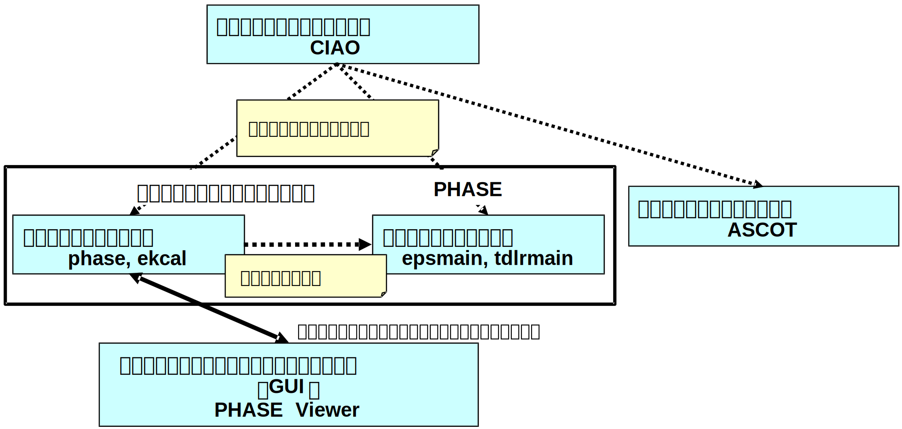
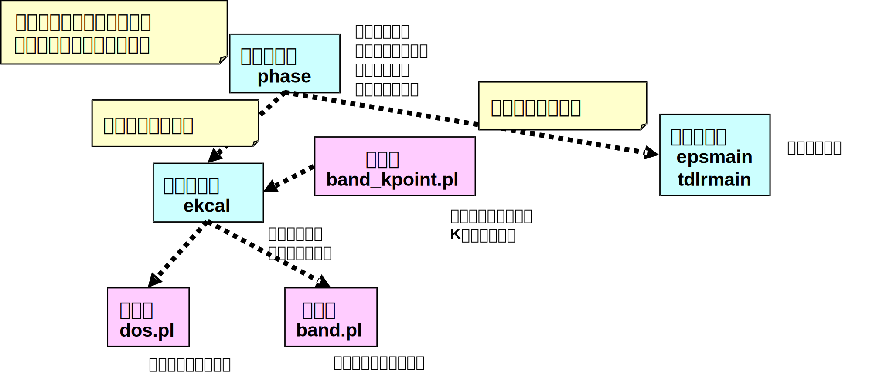

.. _introduction_chapter:

はじめに
========

PHASEシステムの概要
-------------------

PHASEシステムは、電子状態計算計算プログラム（第一原理分子動力学法計算プログラム）PHASE/0、量子伝導特性計算プログラムASCOT、原子全電子計算・擬ポテンシャル作成プログラムCIAOなどのナノシミュレーションのプログラム・パッケージ群から構成されるシステムです。

.. table:: PHASEシステムの主要なプログラム・パッケージ
 :widths: auto
 :class: longtable

 +----------------------+---------------------+----------------------+
 | プ\                  | プログラム          | 概要                 |
 | ログラム・パッケージ |                     |                      |
 +======================+=====================+======================+
 | PHASE/0              | phase, ekcal        | 密度汎関数理論に基づ\|
 |                      |                     | く擬ポテンシャル法に\|
 | （第一原理電子\      | (旧PHASEパッケージ) | よる平面波基底の第一\|
 | 状態計算プログラム   |                     | 原理電子状態計算プロ\|
 |                      |                     | グラムです。これらを\|
 |                      |                     | 使って、全エネルギー\|
 |                      |                     | 、電荷密度分布、電子\|
 |                      |                     | の状態密度、バンド構\|
 |                      |                     | 造、安定な原子構造な\|
 |                      |                     | どの計算ができます。 |
 +----------------------+---------------------+----------------------+
 |                      | epsmain, tdlrmain   | Phaseの計算結果を用\ |
 |                      |                     | いて、固体誘電体の誘\|
 |                      | (旧UVSORパッケージ) | 電率を計算するプログ\|
 |                      |                     | ラムです。これらのプ\|
 |                      |                     | ログラムは、材料の電\|
 |                      |                     | 子系及び格子系の誘電\|
 |                      |                     | 率を計算できます。ゲ\|
 |                      |                     | ート絶縁膜材料の誘電\|
 |                      |                     | 率をほぼ定量的に計算\|
 |                      |                     | することができます。 |
 |                      |                     | 格子誘電率が大きいhi\|
 |                      |                     | gh-k材料誘電率の予測\|
 |                      |                     | 及び解析に有効です。 |
 +----------------------+---------------------+----------------------+
 | CIAO                 | ciao                | CIAOは、密度汎関\    |
 |                      |                     | 数理論に基づき、原子\|
 | （原子全\            |                     | の全電子状態を第一原\|
 | 電子計算・擬ポテンシ\|                     | 理計算し、得られた全\|
 | ャル作成プログラム） |                     | 電子ポテンシャルから\|
 |                      |                     | 擬ポテンシャルを計算\|
 |                      |                     | するプログラムです。 |
 +----------------------+---------------------+----------------------+
 | ASCOT                | ascot               | ASCOTは、非\         |
 |                      |                     | 平衡グリーン関数法を\|
 | （量子伝導\          |                     | 用いて、電子状態およ\|
 | 特性計算プログラム） |                     | び量子伝導特性を計算\|
 |                      |                     | するプログラムです。 |
 +----------------------+---------------------+----------------------+
 | PHASE Viewer         | phase-viewer        | PHASEの入力デー\     |
 |                      |                     | タ作成・編集、計算実\|
 | （GUI）              |                     | 行、計算結果の可視化\|
 |                      |                     | を行うグラフィカル・\|
 |                      |                     | ユーザー・インターフ\|
 |                      |                     | ェース（GUI）です。  |
 +----------------------+---------------------+----------------------+

本マニュアルは、電子状態計算計算プログラム（第一原理分子動力学法計算プログラム）PHASE/0と関連するツール群を対象としています。

PHASE/0とは？
--------------

PHASE/0の主な特徴、機能（PHASE/0で何が計算できるか？）
~~~~~~~~~~~~~~~~~~~~~~~~~~~~~~~~~~~~~~~~~~~~~~~~~~~~~~

PHASE/0
は，密度汎関数法、第一原理擬ポテンシャル法に基づく電子状態計算プログラムです。実験結果にフィッティングするパラメーターがないため、未知の物質に対する物性予測を（近似の範囲内で）精度良く計算することが出来ます。計算された電子状態（波動関数）を用いて様々な物理量の解析が可能です。原子配置に関しては、構造最適化、分子動力学法計算、化学反応経路解析など様々な解析が可能です。PHASE/0の主な機能を以下の表にまとめます。

================== ============================
主な機能           得られる物理量など
                   （現象・挙動、物性など）
================== ============================
電子状態計算       状態密度分布（DOS）、
                   バンド構造、
                   電荷密度分布
エネルギー、力計算 エネルギー、原子に働く力、
                   格子定数、弾性パラメーター、
                   応力テンソル
構造最適化（緩和） 安定な原子配置

分子動力学法計算   原子の運動
振動解析           振動数・振動モード
陽電子寿命解析     陽電子寿命
STM像解析          STM像
化学反応解析       化学反応経路、エネルギー障壁
================== ============================

PHASE/0の主な特徴を以下にまとめます。

.. table::
 :widths: auto
 :class: longtable

 +--------------------+-----------------------+-----------------------+
 | 計算手法           |                       |                       |
 +====================+=======================+=======================+
 |                    | 第一原理計算          | 実験によ\             |
 |                    |                       | るパラメータフィット\ |
 |                    |                       | がないため、未知の物\ |
 |                    |                       | 質や実験の困難な系に\ |
 |                    |                       | 対する物性予測が可能\ |
 |                    |                       | ハイブリ\           \ |
 |                    |                       | ッド汎関数などの高精\ |
 |                    |                       | 度な電子状態計算手法\ |
 |                    |                       | を利用することも可能  |
 +--------------------+-----------------------+-----------------------+
 |                    | 密度汎関数法          | 物性分野での解\       |
 |                    |                       | 析に広く使用されてい\ |
 |                    |                       | るLDA法やGGA法などの\ |
 |                    |                       | 密度汎関数法による信\ |
 |                    |                       | 頼性の高い計算が可能  |
 +--------------------+-----------------------+-----------------------+
 |                    | 擬ポテンシャル        | イ\                   |
 |                    |                       | オンコアの影響を擬ポ\ |
 |                    |                       | テンシャルによって取\ |
 |                    |                       | り扱うことにより、高\ |
 |                    |                       | 精度な解析計算が可能  |
 +--------------------+-----------------------+-----------------------+
 | 計算機能           |                       |                       |
 +--------------------+-----------------------+-----------------------+
 |                    | 物性解析機能          | 多様\                 |
 |                    |                       | な物性解析機能を利用\ |
 |                    |                       | することにより、様々\ |
 |                    |                       | な実験との比較が可能  |
 +--------------------+-----------------------+-----------------------+
 |                    | 構造解析機能          | 構造\                 |
 |                    |                       | 最適化、分子動力学法\ |
 |                    |                       | による時間発展、反応\ |
 |                    |                       | 経路解析などの原子配\ |
 |                    |                       | 置に関する解析が可能  |
 +--------------------+-----------------------+-----------------------+
 |                    | 大規模計算            | MPI,                  |
 |                    |                       | OpenMPを利用\         |
 |                    |                       | した並列計算により、\ |
 |                    |                       | 数十万コア以上の超大\ |
 |                    |                       | 規模並列計算まで対応  |
 +--------------------+-----------------------+-----------------------+
 | ユーザーフレンドリ |                       |                       |
 +--------------------+-----------------------+-----------------------+
 |                    | 入力データ            | 入力ファ\             |
 |                    |                       | イルをタグ形式にして, |
 |                    |                       | 初めて\               |
 |                    |                       | 使用するユーザーでも, |
 |                    |                       | 入力パラメ\           |
 |                    |                       | ータの物理的意味が理\ |
 |                    |                       | 解し易いように構成。  |
 |                    |                       |                       |
 |                    |                       | 様々な\               |
 |                    |                       | 設定が可能であると同\ |
 |                    |                       | 時に、ほとんどのパラ\ |
 |                    |                       | メータに既定値が設定\ |
 |                    |                       | されているため、非常\ |
 |                    |                       | にシンプルな設定でも\ |
 |                    |                       | 計算することが可能。  |
 +--------------------+-----------------------+-----------------------+
 |                    | ツール                | バンド構造, 状態密度, |
 |                    |                       | 電\                   |
 |                    |                       | 荷密度分布などの計算\ |
 |                    |                       | 結果をグラフ化するツ\ |
 |                    |                       | ールなど、結果の解析\ |
 |                    |                       | に便利なツールが付属  |
 +--------------------+-----------------------+-----------------------+
 |                    | 動作環境              | 個人ユースのパソ\     |
 |                    |                       | コン（WindowsPC）から\|
 |                    |                       | 最先端のスパコンまで  |
 +--------------------+-----------------------+-----------------------+
 |                    | ユ                    | GUI（PHASE-Vie\       |
 |                    | ーザインターフェース  | wer）による操作が可能 |
 +--------------------+-----------------------+-----------------------+

PHASE/0のプログラム構成
~~~~~~~~~~~~~~~~~~~~~~~

プログラムパッケージPHASE/0には、以下のプログラム、ツールなどが含まれています。

.. table::
 :widths: auto
 :class: longtable

 +-------------------------+----------------+-------------------------+
 | プログラムパッケージ    | 概要           |                         |
 | PHASE/0                 |                |                         |
 +=========================+================+=========================+
 | プログラム              | phase          | SCF計算、分子動力学法計\|
 |                         |                | 算を行います。          |
 |                         |                |                         |
 |                         |                | また収束\               |
 |                         |                | した電荷密度分布から状\ |
 |                         |                | 態密度やバンド分散を計\ |
 |                         |                | 算することができます。  |
 +-------------------------+----------------+-------------------------+
 |                         | ekcal          | 状態密度計算、バン\     |
 |                         |                | ド計算においてk点の個数\|
 |                         |                | が多い場合に使う補助プ\ |
 |                         |                | ログラムとしてekcalがあ\|
 |                         |                | ります。これらの処理を\ |
 |                         |                | 簡便に行うための補助ス\ |
 |                         |                | クリプトファイルがいく\ |
 |                         |                | つか用意されています。  |
 +-------------------------+----------------+-------------------------+
 |                         | epsmain        | Phaseの計\              |
 |                         |                | 算結果に基づき、電子系\ |
 |                         |                | 誘電関数を計算します。  |
 +-------------------------+----------------+-------------------------+
 |                         | tdlrmain       | Phase\                  |
 |                         |                | の計算結果に基づき、線\ |
 |                         |                | 形応答時間依存密度汎関\ |
 |                         |                | 数法（LR-TDDFT）により\ |
 |                         |                | 誘電関数を計算します。  |
 +-------------------------+----------------+-------------------------+
 | ツール                  | band_kpoint.pl | バンド計算用\           |
 |                         |                | の\ **k**\ 点のリストを\|
 |                         |                | 生成するPerlスクリプト  |
 +-------------------------+----------------+-------------------------+
 |                         | dos.pl         | 状態密\                 |
 |                         |                | 度のグラフ（EPS画像）を\|
 |                         |                | 作成するPerlスクリプト  |
 +-------------------------+----------------+-------------------------+
 |                         | band.pl        | バンド構\               |
 |                         |                | 造のグラフ（EPS画像）を\|
 |                         |                | 作成するPerlスクリプト  |
 +-------------------------+----------------+-------------------------+

 PHASE/0のプログラム構成

利用可能な動作環境（計算機環境要件）
~~~~~~~~~~~~~~~~~~~~~~~~~~~~~~~~~~~~

PHASE/0プログラムはFortran90とCで記述されています。これらのコンパイラが使える計算機システムが必要です。大学の計算機センターなどの一般利用可能なシステムでは通常使用することが可能です。並列計算をする場合にはMPIライブラリがインストールされている必要があります。

必要（利用可能）なソフトウェア、ライブラリ

-  Fortran90コンパイラ、Cコンパイラ（必須）
-  MPIライブラリ（並列計算に必須）
-  行列演算ライブラリLAPACK, BLAS（オプション）
-  FFTライブラリFFTW（オプション）
-  Perl（オプション）・・・・PHASEツールで必要
-  Gnuplot（オプション）・・・・PHASEツールで必要

本マニュアルで記述する操作についてはLinux（Unix）を使用しているものとしています。お使いのシステムが異なる場合には、適宜読み替えてください。

PHASE/0の機能（2D並列版と3D並列版の比較）
~~~~~~~~~~~~~~~~~~~~~~~~~~~~~~~~~~~~~~~~~

PHASE/0には、2D並列版と3D並列版の２つの並列版プログラムがあります。

======== ============================================== ================
\        並列化手法                                     ソースプログラム
======== ============================================== ================
2D並列版 k点並列 ＋ エネルギー（バンド）並列            src_phase
3D並列版 k点並列 ＋ エネルギー（バンド）並列 ＋ G点並列 src_phase_3d
======== ============================================== ================

======================== ======== ========
機能                     2D並列版 3D並列版
======================== ======== ========
構造最適化               ✔        ✔
単位胞最適化             ✔        ✔
状態密度                 ✔        ✔
局所状態密度             ✔        ✔
射影状態密度             ✔        ✔
電荷密度出力             ✔        ✔
部分電荷密度出力         ✔        ✔
最大局在化ワニア関数     ✔
バンド構造               ✔        ✔
実空間法                 ✔        ✔
ストレステンソル         ✔        ✔
仕事関数                 ✔        ✔
XPS解析                  ✔        ✔
振動解析，フォノンバンド ✔        ✔
分子動力学               ✔        ✔
DFT+U法                  ✔        ✔
ハイブリッド汎関数法     ✔        ✔
ESM法                    ✔        ✔
DFT-D2法                 ✔        ✔
vdW-DF法                 ✔        ✔
電荷密度予測             ✔        ✔
波動関数予測             ✔        ✔
NEB法                    ✔        ✔
blue moon法              ✔        ✔
メタダイナミクス法       ✔        ✔
RTP-TDDFT                ✔        ✔
LR-TDDFT                 ✔
ノンコリニア磁性         ✔
スピン軌道相互作用       ✔
陽電子寿命解析           ✔
PAW法                    ✔        ✔
電子系誘電関数           ✔        ✔
ボルン有効電荷           ✔        ✔
格子系誘電関数           ✔        ✔
圧電定数                 ✔        ✔
======================== ======== ========

マニュアルの構成
----------------

マニュアルは、以下のような章構成になっています。

.. table::
 :widths: auto
 :class: longtable

 +--------------------------------+-----------------------------+
 | :ref:`introduction_chapter`    | PHASEシステムプログラム\    |
 |                                | パッケージPHASE/0の\        |
 |                                | 概要について説明しています。|
 +--------------------------------+-----------------------------+
 | :ref:`install_chapter`         | バイナリプロ\               |
 |                                | グラムを作る（コンパイルす\ |
 |                                | る）方法を説明しています。  |
 +--------------------------------+-----------------------------+
 | :ref:`first_step_chapter`      | PHASE/0の計算手順\          |
 |                                | などの最も基本的な利用方法\ |
 |                                | を説明しています。PHASE/0の\|
 |                                | 計算の流れが概観できます。  |
 +--------------------------------+-----------------------------+
 | :ref:`input_parameters`        | 入力パラメータファイル\     |
 |                                | のリファレンスマニュアルと\ |
 |                                | して使用できます。多くのパ\ |
 |                                | ラメータについては知らなく\ |
 |                                | てもPHASE/0は利用可能です。\|
 |                                | 高度な利用をする際などに参\ |
 |                                | 照すると良いと思われます。  |
 +--------------------------------+-----------------------------+
 | :ref:`basics_chapter`          | PHASE/0の基本的な機能を利\  |
 |                                | 用した計算例を幾つか示して\ |
 |                                | います。チュートリアルとし\ |
 |                                | て使用できます。ここを読み\ |
 |                                | ながら\                     |
 |                                | :ref:`input_parameters`     |
 |                                | の必要な項目を参照\         |
 |                                | すると良いかも知れません。  |
 +--------------------------------+-----------------------------+
 | :ref:`estructure_chapter`      | 状態密度計算やバンド構造\   |
 |                                | 計算機能を説明しています。  |
 +--------------------------------+-----------------------------+
 | :ref:`advestructure_chapter`   | GGA/LDAを超える高度な電子\  |
 |                                | 状態計算について説明します。|
 +--------------------------------+-----------------------------+
 | :ref:`analysis_chapter`        | 様々な解析機能について\     |
 |                                | 説明します。                |
 +--------------------------------+-----------------------------+
 | :ref:`ion_dynamics_chapter`    | 原子ダイナミクスに関する\   |
 |                                | 機能について説明します。    |
 +--------------------------------+-----------------------------+
 | :ref:`uvsor_chapter`           | 誘電応答解\                 |
 |                                | 析を行う方法を説明します。  |
 +--------------------------------+-----------------------------+

初めて本マニュアルを読む方は、\ :ref:`first_step_chapter` に続けて :ref:`basics_chapter` を読むことを推奨します。\ :ref:`basics_chapter` を読む際に出てきた入力パラメータについては :ref:`input_parameters` を参照してください。その後、\ :ref:`estructure_chapter` 以降については必要に応じて読むことを推奨します。

PHASE/0の入手方法
------------------
PHASE/0のソースコード、サンプル、マニュアルなどは `ダウンロードサイト <https://azuma.nims.go.jp/cms1/downloads/software>`_ から無償でダウンロードすることができます。ダウンロードするにはユーザー登録が必要です。ダウンロード用のユーザーIDをお持ちでない場合は、 `登録フォーム <https://azuma.nims.go.jp/cms1/downloads/software/reg>`_ に進んでください。

PHASE/0のライセンス
-------------------

PHASEシステム・ソフトウェア使用許諾条件
~~~~~~~~~~~~~~~~~~~~~~~~~~~~~~~~~~~~~~~~~

PHASEシステム研究会は、次の条件や制限のもとで、PHASEシステム・ソフトウェアを無償で使用することを許諾する。なお、利用者がPHASEシステム・ソフトウェアをダウンロードした時点で、利用者は本使用許諾条件の各条項に同意したものとみなす。

1. PHASEシステム・ソフトウェアの定義

 PHASEシステム・ソフトウェア（「PHASEシステム　プログラムパッケージ」と同義）とは、東京大学生産技術研究所 革新的シミュレーション研究センター（以下 革新センター）で管理・公開している平成24年度までの「イノベーション基盤シミュレーションソフトウェアの研究開発プロジェクト」の成果物を基に開発し、現在PHASEシステム研究会が管理しているソフトウェアである。
 PHASEシステム・ソフトウェアは、ソースプログラム、オブジェクトプログラム、仕様書、設計書、データ、実行結果、マニュアルなど、原則として、PHASEシステム研究会から公開するもの全てを含む。ただし、利用者の便宜のために配布プログラムパッケージに同包したサードパーティ製ソフトウェアBLAS、LAPACK、ScaLAPACK、EigenK、EigenExa、およびEsmPackなどは除く。

2. 使用許諾の範囲

 利用者がPHASEシステム・ソフトウェアを無償で使用できる行為には、自己のためにPHASEシステム・ソフトウェアを、翻訳（コンパイル）することによりバイナリを作成する行為、任意のデータを用いて実行する行為、その結果を利用者の自己のために使用および公表する行為、および自己のために改変したソフトウェアを翻訳してこれを実行する行為が含まれる。ただし、自己のために当該ソフトウェアを改変しそれを実行し、その結果を公表する場合には、次項に従うこととする。これら以外の行為（複製・頒布など）は７項で示す場合を除き禁止する。利用者の便宜のために配布プログラムパッケージに同包したサードパーティ製ソフトウェアBLAS、LAPACK、ScaLAPACK、EigenK、EigenExaおよびEsmPackなどを使用する場合は、それぞれのソフトウェアの使用許諾条件に従うこととする。これらサードパーティ製ソフトウェアの使用許諾条件は、対応するソフトウェアのサイト、BLAS、LAPACK、ScaLAPACK、libEigen、およびEsmPackディレクトリ内のlicense.txt、ソースファイル、あるいはマニュアルに記述されている。

3. 改変における遵守事項

 利用者が改変したソフトウェアを使用して得た結果を公表する場合には、改変内容を特定できる説明を添付して公表するとともに、PHASEシステム研究会に改変部分を含むソースプログラムを提出する義務がある。提出されたソースプログラムは、PHASEシステム・ソフトウェアとしてPHASEシステム研究会から公開される可能性がある。公開時期については、提出者とPHASEシステム研究会の間で協議して決定する。公開の際には、本規約第２項に則り、他の利用者に使用を許諾しなければならない。改変した部分の著作権は改変者が保持することができる。
 目的の如何を問わず、PHASEシステム・ソフトウェア内部コードの『著作権表示』記載部分を修正する行為は、改変者氏名や改変日時などの改変記録を追加する場合を除き、禁止する。

4. 利用者義務

 PHASEシステム・ソフトウェアを利用した結果を公表する場合には、使用したPHASEシステム・ソフトウェアの名前、バージョンを明示するとともに、適切な論文またはURLを引用しなれければならない。
 利用者がPHASEシステム・ソフトウェアのバグや不具合を発見した場合、PHASEシステム研究会に報告すること。

5. 無保証

 PHASEシステム・ソフトウェアは、その品質や性能あるいは実行結果について、利用者に対してはいかなる保証もしない。利用者は自己の責任において使用することに同意することとし、もし使用することにより損害が生じた場合には、第三者への損害や被害の修復も含みその結果責任は全て利用者に帰することとする。

6. 利用者が本使用許諾条件に違反した場合

 利用者が本使用許諾条件に違反した場合には、利用者は、PHASEシステム研究会がその状態を是正するために必要と認めて行う措置に無条件に従わなくてはならない。

7. 公的機関および事業者が普及促進のために使用する場合

 公的機関および事業者がPHASEシステム・ソフトウェアの普及促進のために、第三者へのバイナリの頒布およびバイナリの使用を許諾する権利を得たい場合は、PHASEシステム研究会に申請することとする。PHASEシステム研究会はその頒布及び使用の可否を判断し、特定非営利活動法人物質材料科学ソフトウェア研究会へ答申する。特定非営利活動法人物質材料科学ソフトウェア研究会も可と判断し、契約が必要な場合、申請者は特定非営利活動法人物質材料科学ソフトウェア研究会との間で契約を締結する。PHASEシステム研究会は、PHASEシステム・ソフトウェアのバイナリを作成しこれを提供するか、あるいは申請者がバイナリを作成するのに必要なソフトウェアと情報の提供を行う。

－ 以上 －

.. raw:: html

  

  <ul">
    <li class="style-none">制定：平成26年5月9日</li>
    <li class="style-none">改訂：令和6年2月29日</li>
  </ul>
  

   

License to Use PHASE System Software Terms and Conditions of the PHASE System Software License
~~~~~~~~~~~~~~~~~~~~~~~~~~~~~~~~~~~~~~~~~~~~~~~~~~~~~~~~~~~~~~~~~~~~~~~~~~~~~~~~~~~~~~~~~~~~~~~~

PHASE System consortium gives explicit permission for anyone to use any or all of the software contained in the PHASE System program package that is maintained and made publicly available at the Phase System consortium site free of charge, subject to the terms and conditions detailed below.

1. Definition of PHASE System Software

 PHASE System Software, which is same with “the PHASE system program packages”, is any software maintained by PHASE System consortium and developed based on the software products which had been maintained by the Center for Research on Innovative Simulation Software (CISS) at the Institute of Industrial Science, the University of Tokyo and made publicly available at the CISS site until the end of 2012 fiscal year.
 The PHASE System Software contains all of source programs, object programs, specifications, design specifications, data, implementation results, and instruction manuals, except for third-party software contents contained in the PHASE distribute packages for user convenience, e.g., BLAS, LAPACK, ScaLAPACK, EigenK, EigenExa, and EsmPack, etc.

2. Extent of Free Use

 Users may use PHASE System Software free of charge to run their own data, and use any results obtained for their own personal use. Users also have the rights to copy, to modify PHASE System Software, to compile and run the modified software, and to use and make public their obtained results. However, users need to obey the described rule in the following item 3 of this document when to use and make public their results by using their modified PHASE System software. Other conducts, e. g., making a copy (copies) of the PHASE System Software and distributing it (them) to other users, etc., are not allowed except for the cases described in the item 7 of this document. For the other third-party software contents, e.g., BLAS, LAPACK, ScaLAPACK, EigenK, EigenExa and EsmPack, etc, which are contained in the PHASE distribute packages for user convenience, users must obey to the license descriptions in the corresponding software URL sites or manuals, “license.txt”s or the source files in directories of BLAS, LAPACK, ScaLAPACK, ligEigen, and EsmPack, or the instruction manuals of the PHASE System Software.

3. Rules for Modification

 If the user creates a modified version of PHASE System Software by modifying the software itself, by incorporating it into other software, or any other means; then uses it and makes public his or her obtained results, the user is obligated to make public with an explanation detailing how the software was modified, and the user is obligated to transfer the software which contains the modified part(s) to PHASE System consortium. The transferred software may be disclosed by the PHASE System consortium as a part of the PHASE System Software. A date of disclosing the transferred software is decided through a consultation between the transferred user and the PHASE System consortium. When the transferred software is disclosed, the user who transferred the software gives the rights that are given to users of the PHASE System Software to any users according to the description written in the item 2 of this document. The user who transferred the software can hold a copyright of the modified part.
 Modification of the “copyright notice” of a source file contained in the PHASE System Software is prohibited in any reason except to update or add to modification records such as altering the name of the program modifier or the date of modification.

4. User Obligations

 To publicly acknowledge that results have been achieved using PHASE System Software, users are obligated to clearly display the name, and version, show an appropriate reference or the download URL site.
 We request that users report any bugs or problems they discover in using the PHASE System Software to PHASE System consortium.

5. No Warranty

 CISS, PHASE System consortium, and other concerned parties disclaim all warranties with respect to the quality, the performance, or the results of PHASE System Software, either expressed or implied. The user assumes sole responsibility for the use of the PHASE System Software including any damages or losses arising out of the use of the PHASE System software.

6. Violations of Terms and Conditions

 If a user is found to be in violation of these Terms and Conditions, he or she agrees to immediately pursue any and all steps required by PHASE System consortium to get back into compliance.

7. Use for Promoting Popularization by Public Organizations and Companies

 If a public organization or a company intends to have rights to distribute PHASE System Software and to give permissions to use the software to third users for promoting popularization of the PHASE System Software, the public organization or the company must file an application with PHASE System consortium before using the PHASE System software. The PHASE System consortium decides if the public organization or the company could have rights to distribute and to give permissions to use, then submits a report of the decision to “non-profit-organization of materials science software consortium (NPOMSSC)”. If both the decisions by the PHASE System consortium and by NPOMSSC are positive, NPOMSSC concludes a contract of license agreement with the applied public organization or the applied company, if NPOMSSC decides to have the contract. The PHASE System consortium compiles and gives executable binary programs of the PHASE System software, or helps with giving information to make executable binary programs to the public organization or the company, after the positive decisions by the PHASE System consortium and NPOMSSC.

.. raw:: html

  

  <ul">
    <li class="style-none">enacted: May 9, 2014</li>
    <li class="style-none">revised: Feb 29, 2024</li>
  </ul>
  

   

PHASE/0の更新履歴
------------------

PHASE/0 2023.01 2023/06 公開
 - 利用できる拘束条件を追加しました (\ :numref:`section_constraints_bluemoon` )
 - SCF計算を高速化しました (\ :numref:`supplement_section_scf_speedup` , :numref:`control_speedup_options_section` :numref:`input_param_kosugi_davidson` )
 - 初期波動関数の作成方法を改良しました。一部の収束しづらい問題の収束性が改善します (\ :numref:`input_initial_wf_and_chg` )
 - 格子最適化の際格子と座標を同時に最適化することができるようになりました。この方法を用いることによって、多くの問題で従来よりも少ない計算時間で収束解を得ることができます (\ :numref:`advanced_latopt_sametime` )
 - Libxcライブラリーとリンクすることができるようになりました (\ :numref:`advanced_libxc_section` )

PHASE/0 2022.01 2022/12 公開
 - バルクの電子バンドを表面ブリルアンゾーンに射影して描画することができるようになりました (\ :numref:`projected_surface_band_section` )
 - フォノンバンドを原子群に射影したり (\ :numref:`project_phonon_band_to_atoms_section` ) バルクのフォノンバンドを表面ブリルアンゾーンに射影したり(\ :numref:`project_phonon_band_to_surface_BZ_section` )することができるようになりました
 - ブロッキングパラメーターを自動調整することができるようになりました (\ :numref:`control_blocksize_section` )
 - 剛体ダイナミクス機能を追加しました (\ :numref:`section_rigid_body_dynamics` )
 - Energy Density Analysis を行うことができるようになりました (\ :numref:`section_analysis_EDA` )
 - コリニア計算のポスト処理としてスピン軌道相互作用を取り込むことができるようにしました (\ :numref:`section_advanced_spin_orbit_from_postproc` )
 - Distributed-memory FFTW とリンクすることができるようになりました (\ :numref:`section_install_mpifftw` )
 - 分子動力学シミュレーションなどを行う際水素との結合を凍結することができるようになりました (\ :numref:`section_ion_dynamics_fix_bond` )
 - ベーダー解析の補正が旧型式の擬ポテンシャルを用いても行えるようになりました (\ :numref:`section_bader_charge` )
 - 圧力一定の分子動力学シミュレーションのオプションを追加しました (\ :numref:`section_npt_md` )
 - PIMDコードのエンジンとして用いることができるようになりました (\ :numref:`section_ion_dynamics_pimd` )

PHASE/0 2021.02 2022/02 公開
 - 原子周囲の局所ポテンシャルの平均値を出力することができるようになりました(\ :numref:`advanced_localpot_av_section` )
 - Dimer法が使えるようになりました(\ :numref:`section_dimer_method` )
 - ランジュバン熱浴が使えるようになりました(\ :numref:`section_md_langevin` )
 - 計算中に一部計算条件を変更することができるようになりました(\ :numref:`change_settings_during_scf` )
 - XANES計算機能において *k* 点並列が使えるようになりました (\ :numref:`section_elnes_xanes` )
 - 富岳及びFX系マシンに対応しました（Makefileを同梱しています）

PHASE/0 2021.01 2021/09 公開
 - 帯電欠損状態評価機能を追加しました。(\ :numref:`section_taiden` )
 - Methfessel-Paxton スメアリングに対応しました。(\ :numref:`section_methfessel_paxton` )
 - 高精度な局所状態密度計算機能を追加しました。(\ :numref:`advanced_accurate_ldos_section` )
 - 高精度XPS計算機能を追加しました。(\ :numref:`section_xps` )
 - 新しい構造最適化手法を追加しました。(\ :numref:`basics_lbfgs_section` )
 - 機械学習ポテンシャル作成支援機能を追加しました。(\ :numref:`section_neural_network_potential` )

PHASE/0 2020.01 2020/12 公開
 - バンドアンフォールディング計算機能を追加しました(\ :numref:`advanced_band_unfold_section` )
 - 射影バンド構造計算機能を追加しました(\ :numref:`advanced_projected_band` )
 - NEB法を改良しました(\ :numref:`section_NEB` )
 - DFT+U法を改良しました(\ :numref:`advanced_dftu_section` )
 - 構造最適化手法として，FIRE法を追加しました(\ :numref:`basics_FIRE_section` )
 - 一部の原子のみを対象とする振動解析が行えるようになりました(\ :numref:`advanced_phonon_partial` )
 - 全体的なハンドリングの向上を図りました
 - 推奨擬ポテンシャルを自動的に選定することができるようになりました(\ :numref:`firststep_defpp_section` , \ :numref:`inouts_recpp_section` )
 - 並列パラメーターを自動的に選定することができるようになりました(\ :numref:`firststep_autores_para_section` )
 - 入力パラメーターファイルにおいて，二項演算による数値指定が可能となりました(\ :numref:`input_parameters_binaryop_section` )
 - 必須設定項目を減らしました（元素指定 :numref:`input_parameters_atomtyp` ，電荷密度のカットオフエネルギー :numref:`input_parameters_cutoff` ，k点サンプリング :numref:`input_parameters_2020_kp` など）
 - “密度”よる\ **k**\ 点メッシュ指定対応しまし(\ :numref:`input_parameters_2020_kp` )
 - 異なるカットオフエネルギーで出力された波動関数・電荷密度データを読み込むことができるようになりました(\ :numref:`input_parameters_differenet_wfcut` )
 - ログファイルにエンドマークが出力されるようになりました(\ :numref:`firststep_endmark_section` )
 - open core法が使えるようになりました(\ :numref:`advanced_opencore_section` )
 - 状態密度図作成用の新しいスクリプトを追加しました(\ :numref:`cmd_tools_dospy_section` )
 - 一部計算機能の高速化/省メモリ化を実施しました

   - 誘電関数計算
   - 固定電荷計算
   - ストレステンソル計算
   - 非局所ポテンシャル計算
 - SX-Aurora TSUBASA用のMakefileを追加しました (Makefile.Aurora; 2次元版のみ)

PHASE/0 2019.02 2020/03 公開
 - 座標データを別ファイルで指定できるようにしました( :numref:`input_param_coord_from_file` )
 - 有限電場機能を追加しました(\ :numref:`section_finite_electric_field` )
 - PBESol汎関数に対応しました(\ :numref:`advanced_pbesol_section` )
 - メタGGAに対応しました (\ :numref:`advanced_metagga_section` )
 - ハイブリッド汎関数法によるバンド構造計算に対応しました(\ :numref:`advanced_hybrid_band_section` )
 - チェックポイントファイルが出力できるようにしました(\ :numref:`first_step_checkpoint_section` )
 - 四重極子計算機能に対応しました(\ :numref:`advanced_xanes_quad_section` )
 - Bader解析に適した電荷密度を出力することができるようにしました(\ :numref:`section_bader_charge` )
 - 格子最適化の振る舞いを改善しました(\ :numref:`advanced_latopt_reuse_wfchg_section` )
 - 入力ファイル正誤チェックツールを追加しました(\ :numref:`ch08_10_inpcheck_py_section` )

PHASE/0 2019.01 2019/04 公開
 - 分子動力学シミュレーション機能を改良しました。

   - Nose-Hoover chain法が使えるようになりました (\ :numref:`advanced_nvtmd_section` )
   - "温度プロファイル"を設定することができるようになりました (\ :numref:`advanced_nvtmd_section` )
   - 原子群をある領域に閉じ込めることができるようになりました
 - BoltzTraPに対応しました(\ :numref:`section_boltztrap` )
 - DFT-D3法に対応しました (\ :numref:`advanced_vdwcorr_section` )
 - ストレステンソル補正機能を改良しました。
 - ASLのFFTWラッパーが使えるようになりました。

PHASE/0 2018.01 2018/08 公開
 - 以下の機能が三次元版で利用できるようになりました

   - ベリー位相計算機能
   - PDOS
   - 固定電荷計算
 - 3D版に，低並列で利用する場合の高速化のオプションを追加しました
 - Atomic Simulation Environment (ASE)用のPythonスクリプトを追加しました。
 - SC-DFT法に対応しました(\ :numref:`advanced_scdft_section` )
 - ハイブリッド汎関数法を高速化しました。
 - PAW法に非球面積分のオプションを追加しました (\ :numref:`paw_gloption_section` )
 - ESM法を高速化しました。
 - 不具合を修正しました。

PHASE/0 2017.01 2018/02 公開
 - 圧力一定の分子動力学シミュレーション法を実装しました (\ :numref:`section_npt_md` )
 - 3軸並列版にストレステンソル，vdW-DF計算機能を加えました。
 - ボルン有効電荷を簡単に計算できるようにしました (\ :numref:`section_borncharge` )
 - 双極子補正機能に対応しました (\ :numref:`advanced_dipole_section` )
 - 対称化プログラム(band_symm)を更新しました。
 - 不具合を修正しました。

PHASE/0 2016.01 2017/05 公開
 - 化学ポテンシャル一定のシミュレーション法を実装しました (\ :numref:`section_constant_chemical_potential` )
 - ハイブリッド汎関数計算機能を高速化しました。（3軸並列版）
 - 不具合を修正しました。

PHASE/0 2015.01 2015/10 公開
 - ELNES / XANES解析機能を実装しました (\ :numref:`section_elnes_xanes` )
 - 構造を群論に基づいて簡約化するプログラムband_symmを追加しました。
 - 計算事例を追加しました。（スピン軌道相互作用をとりいれたバンド構造計算およびXANES解析計算）
 - PAW法の不具合を修正しました。この修正によって、系によっては以前よりも収束性が向上しました（sw_PAW=onでDFT+UあるいはGGA+U法を使っている場合、以前の版ではこの版よりも全エネルギーが高くなる場合がありました）。

PHASE/0 2014.03 2014/12公開
 - ハイブリッド汎関数計算機能を高速化・省メモリー化しました。（2軸並列版）。
 - vdW-DF計算機能を高速化しました。（2軸並列版）。
 - 非局所ポテンシャルの実空間積分機能を3軸並列（G点並列）版に実装しました。
 - 波動関数予測機能を3軸並列（G点並列）版に実装しました。

PHASE/0 2014.02 2014/07公開
 - ESM法を3軸並列（G点並列）版に実装しました。
 - ハイブリッド汎関数の使用方法を改善しました。
 - ハイブリッド汎関数の計算機能を改良しました。ハイブリッド汎関数の計算において、波動関数ソルバーpdavidson法とpkosugiを使用可能にしました。
 - 不具合を修正しました。
 - マニュアルを改訂しました。

PHASE/0 2014.01 2014/04公開
 - 波動関数ソルバー、電荷密度混合法の自動設定機能を追加しました (\ :numref:`input_param_wfsol2` )
 - 構造更新時の波動関数、電荷密度の予測機能を追加しました (\ :numref:`input_param_wfpred` )
 - 時間依存型密度汎関数法計算を追加しました (\ :numref:`uvsor_lrtddft_section` )
 - 有効遮蔽体（ESM）法等の計算機能のインターフェースを追加しました (\ :numref:`advanced_section_esm`)
 - 格子最適化機能等を追加しました (\ :numref:`section_unitcell_optimization` )
 - 仕事関数の計算機能を追加しました (\ :numref:`section_workfunc`)
 - 波動関数ソルバー（修正Davidson法等）を改良（高速化）しました。
 - 汎関数の計算機能を改良（高速化）しました。
 - 相互作用の計算機能を改良（高速化）しました。
 - 系の計算、スピン軌道相互作用計算機能を追加しました (\ :numref:`advanced_noncollinear_section` )
 - 原子配置のチェック機能を追加しました。
 - 構造最適化機能にCG法の改良版を追加しました。
 - 計算機能を改良しました。
 - 非局所ポテンシャルや欠損電荷の演算を実空間で行うことができるようにしました (\ :numref:`input_parameters_rspace_section` )
 - 誘電応答解析プログラムUVSORを統合しました。
 - 3軸並列（G点並列）版の機能を拡充しました。
 - 不具合を修正しました。

バージョン 11.00 2012/06公開
 - 新しい波動関数ソルバーを導入しました。
 - ハイブリッド汎関数の計算機能を改良しました (\ :numref:`advanced_hybrid_section` ) ウルトラソフト擬ポテンシャル対応、k点を間引いた計算対応など
 - 構造最適化機能のGDIIS、BFGS法の継続計算に対応しました。
 - ウルトラソフト擬ポテンシャルを用いた局所状態密度計算を高速化しました。
 - 構造最適化、分子動力学法計算の計算中における状態密度、電荷密度の出力に対応しました。
 - 多くの不具合を修正しました。
 - 3軸並列（G点並列）版を公開しました。

バージョン 10.01 2011/08公開
 - スピンを考慮している系の収束性が向上しました。
 - GGAに関する不具合を修正しました。
   *この修正によって，従来のバージョンと全エネルギーの絶対値は一致しなくなります。*

バージョン 10.00 2011/06公開
 - 電子状態計算の収束性が向上しました。
 - PAW法に対応しました ( :numref:`paw_section` )
 - メタダイナミクスに対応しました (\ :numref:`section_meta_dynamics` )
 - van der Waals密度汎関数のセルフコンシステントな実装を行いました (\ :numref:`advanced_vdwdf_section` )
 - 構造最適化にBFGS法が利用できるようになりました。
 - PHASE TOOLSに新たなスクリプトを加えました (\ :numref:`commands_and_tools_convpy` )
 - 擬ポテンシャルの読み込みに関する不具合を修正しました。
   *この修正によって，従来のバージョ ンと全エネルギーの絶対値は一致しなくなります。*

バージョン 9.00 2010/06公開
 - キャッシュチューニング、BLAS化をさらに進め、高速化を行いました。
 - ファンデルワールス相互作用を考慮することができるようになりました (\ :numref:`advanced_vdwdf_section` )
 - 自由エネルギー計算が行えるようになりました (\ :numref:`section_constraints_bluemoon` )
 - DFT+U法を利用して、バ ンド構造の計算ができるようになりました (\ :numref:`advanced_dftu_section` )
 - ハイブリッド汎関数が利用できるようになりました (\ :numref:`advanced_hybrid_section` )

バージョン 8.01 2010/03公開
 - BLASを利用した高速化に対応しました。

バージョン 8.00 2009/06公開
 - 拘束条件付きの動力学を追跡する機能が追加されました (\ :numref:`section_constraints_bluemoon` )
 - DFT+U法による構造最適化/分子動力学シミュレーションに対応しました (\ :numref:`advanced_dftu_section` )

PHASE/0の引用
------------------

PHASE/0を利用して成果（論文発表など）をあげた場合には、コードを使用したことを記載すると共に、以下の文献の引用をお願いいたします。

- 共通に引用

  https://azuma.nims.go.jp/

  Takahiro Yamasaki, Akiyoshi Kuroda, Toshihiro Kato, Jun Nara, Junichiro Koga, Tsuyoshi Uda, Kazuo Minami, and Takahisa Ohno,
  "Multi-axis Decomposition of Density Functional Program for Strong Scaling up to 82,944 Nodes on the K Computer: Compactly Folded 3D-FFT Communicators in the 6D Torus Network"
  Computer Physics Communications 244, 264-276 (2019).
  https://doi.org/10.1016/j.cpc.2019.04.008

- 誘電関数計算機能（旧UVSOR）を利用した場合

  Tomoyuki Hamada and Takahisa Ohno,
  "First-Principles Broadband Dielectric Spectroscopy"
  Journal of the Australian Ceramic Society, vol. 47, pp.61-64 (2011)

..
  ライセンスの記述は後日修正する
  COPYRIGHT of the program codes
  -------------------------------------

  12.0.01 (2021/08)

  https://azuma.nims.go.jp

  **PHASE System**

  Copyright (C) of the original version: Hideki Katagiri, Koichi Kato,
  Tsuyoshi Miyazaki, Yoshitada Morikawa, Hideaki Sawada, Toshihiro
  Uchiyama, Tsuyoshi Uda, Takahiro Yamasaki.

  Copyright (C) of the developed version by the national projects FSIS,
  RSS21, and RISS has been managed by the Institute of Industrial Science
  (IIS), the University of Tokyo.

  The Institute of Industrial Science (IIS) has a right to distribute the
  program set developed from the original version as a free software.

HISTORY
------------------

The original version of this set of the computer programs "PHASE" was developed by the members of the Theory Group of Joint Research Center for Atom Technology (JRCAT), based in Tsukuba, in the period 1993-2001.
The names of the contributors to the original version are Hideki Katagiri, Koichi Kato, Tsuyoshi Miyazaki, Yoshitada Morikawa, Hideaki Sawada, Toshihiro Uchiyama, Tsuyoshi Uda, and Takahiro Yamasaki.

These contributors has agreed with that the Institute of Industrial Science (IIS), the University of Tokyo, distributes this program as a free software.

Since 2002, this set has been tuned and new functions have been added to it as a part of the national project ”Frontier Simulation Software for Industrial Science (FSIS)”, which is supported by the IT program of the Ministry of Education, Culture, Sports, Science and Technology (MEXT) of Japan.
The program was developed further mainly by T. Yamasaki. T. Uda, Takenori Yamamoto, Hideaki Tsukioka, Masakuni Okamoto, Hideo Mizouchi, Kiyoshi Betsuyaku, and Kazuki Mae contributed to the improvement of the code.
The tetrahedron interpolation codes developed by Noriaki Hamada, Akira Yanase, and Kiyoyuki Terakura was included.
The symmetrization code developed by A. Yanase and N. Hamada was also included.
The manual and tutorial were written by Makoto Itoh with the cooperation by Mineo Saito, H. Tsukioka, T. Yamamoto, and T. Yamasaki.
The sample calculations were prepared by T. Yamamoto, H. Tsukioka, and Hiroyoshi Momida.

Since 2006, this program set has been developed as a part of the national project ”Revolutionary Simulation Software (RSS21)”, which is supported by the next-generation IT program of MEXT of Japan.
Since 2008, this program set has been developed as a part of the national project ”Research and Development of Innovative Simulation Software”, which is supported by the next-generation IT program of MEXT of Japan.

Since 2013, this program set has been further developed centering on PHASE System Consortium.

The activity of development of this program set has been supervised by Takahisa Ohno.

CONTACT ADDRESS
-----------------------

PHASE System Consortium

E-mail: phase_system@nims.go.jp URL https://azuma.nims.go.jp

..
  再配布には許可が必要
  \* When distributing the software "PHASE" duplications, the user must attach the full text in this file.

