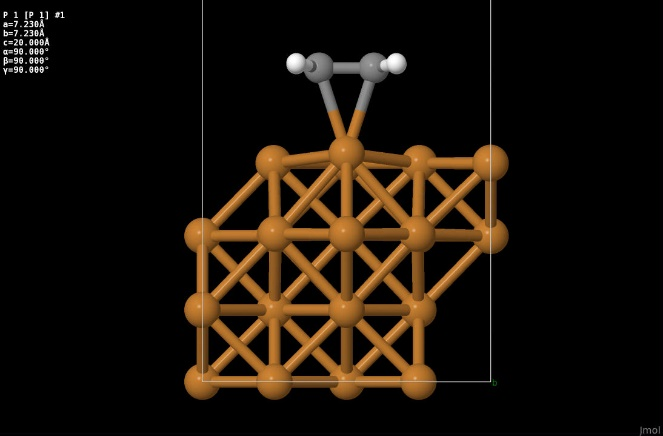
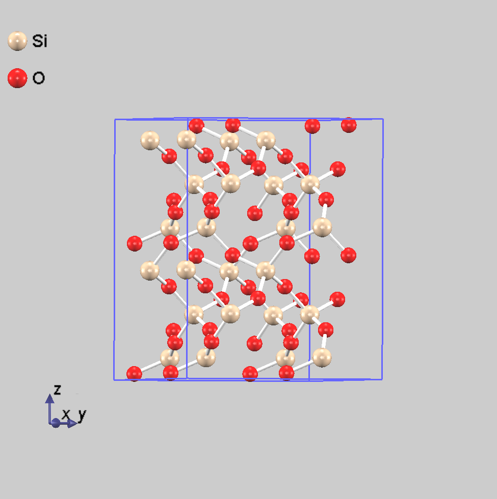

.. _ion_dynamics_chapter:

原子ダイナミクス
===================

.. _section_phonon:

振動解析
-----------

機能の概要
~~~~~~~~~~~~

PHASEには格子振動の基準モードを計算する振動解析機能があります。まず、原子を平衡位置からわずかに変位させて力計算を行います。その力から力定数行列を計算し、それから動力学行列を計算します。動力学行列の固有値問題を解くことにより、基準振動の振動数と固有ベクトルを計算します。

:math:`i`\ 番目の原子の安定位置から変位を\ :math:`\mathbf{u}_{i}`\ とします。
変位が微小で二次以上の項が無視できるとき、格子系の運動方程式は

.. math:: m_{i}{\ddot{u}}_{\text{iα}} = - \sum_{\text{jβ}}^{}\Phi_{i\alpha,j\beta}u_{\text{jβ}}
  :label: advanced_phonon_gamma_eq1

と書けます。\ :math:`\Phi_{i\alpha,j\beta}`\ は力の定数で、原子変位に関する系のエネルギー\ :math:`E(\mathbf{u}_{1},\mathbf{u}_{2},\ldots)`\ の二階微分として定義されています。

.. math:: \Phi_{i\alpha,j\beta} = \frac{\partial^{2}E}{\partial u_{\text{iα}}\partial u_{\text{jβ}}}
  :label: advanced_phonon_gamma_eq2

力の定数はヘルマン-ファインマン力を原子変位で微分することにより、 求めることができます。

.. math:: \Phi_{i\alpha,j\beta} = - \frac{\partial F_{\text{iα}}}{\partial u_{\text{jβ}}}
  :label: advanced_phonon_gamma_eq3

本プログラムでは、この微分は中央差分近似で行われます。変位パラメターを\ :math:`a`\ とすると

.. math:: \frac{\partial F_{\text{iα}}}{\partial u_{\text{jβ}}} = \frac{F_{\text{iα}}|_{u_{\text{jβ}} = a} - F_{\text{iα}}|_{u_{\text{jβ}} = - a}}{2a}
  :label: advanced_phonon_gamma_eq4

と書けます。
力の定数には結晶の対称性による制約があり、これを満たすように力の定数を補正する必要があります。第一に、\ :math:`i,j`\ 原子が空間群の対称操作\ :math:`\{ R|\mathbf{T}\}`\ で\ :math:`i^{'},j^{'}`\ 原子に移るとき、力定数テンソル\ :math:`\Phi_{i,j}`\ は力定数テンソル\ :math:`\Phi_{i^{'},j^{'}}`\ を回転行列Rで回転させたものに等しいです。つまり、

.. math:: R\mathbf{r}_{i} + \mathbf{T} = \mathbf{r}_{i^{'}}

.. math:: R\mathbf{r}_{j} + \mathbf{T} = \mathbf{r}_{j^{'}}
  :label: advanced_phonon_gamma_eq5

ならば、

.. math:: \Phi_{i,j} = R^{T}\Phi_{i^{'},j^{'}}R
  :label: advanced_phonon_gamma_eq6

でなければなりません。
第二に、力定数テンソル\ :math:`\Phi_{i,j}`\ の成分\ :math:`\text{αβ}`\ を原子の番号\ :math:`j`\ すべてにわたり足し合わせると、ゼロになります。つまり、

.. math:: \sum_{j}^{}\Phi_{i\alpha,j\beta} = 0
  :label: advanced_phonon_gamma_eq7

です。 第三に、力定数行列は対称でなければなりません。つまり、

.. math:: \Phi_{i\alpha,j\beta} = \Phi_{j\beta,i\alpha}
  :label: advanced_phonon_gamma_eq8

です。 換算変位\ :math:`w_{\text{iα}} = u_{\text{iα}}\sqrt{m_{i}}`\ と
動力学行列\ :math:`D_{i\alpha,j\beta} = \Phi_{i\alpha,j\beta}/\sqrt{m_{i}m_{j}}`\ を用いて、
格子系の運動方程式 :eq:`advanced_phonon_gamma_eq1` を

.. math:: {\ddot{w}}_{\text{iα}} = - \sum_{\text{jβ}}^{}D_{i\alpha,j\beta}w_{\text{jβ}}
  :label: advanced_phonon_gamma_eq9

と書き換えます。この方程式を解くために、
:math:`w_{\text{iα}} = Q\xi_{\text{iα}}e^{i\omega t + \delta}`
という解を仮定します。

.. math:: \omega^{2}\xi_{\text{iα}} = \sum_{\text{jβ}}^{}D_{i\alpha,j\beta}\xi_{\text{jβ}}
  :label: advanced_phonon_gamma_eq10

これは固有値が\ :math:`\omega^{2}`\ で、固有ベクトルが\ :math:`\xi_{\text{iα}}`\ となる、
行列\ :math:`D_{i\alpha,j\beta}`\ の固有値問題です。振動解析機能ではこの固有値問題を解き、格子振動の基準モードを求めます。

入力パラメータ
~~~~~~~~~~~~~~~~

振動解析を行うには、まず原子が平衡位置にあることが必要です。平衡状態にないと動力学行列の固有値が負になり、振動数が純虚数のソフトモードが現れます。平衡位置の原子座標は、構造最適化機能を用いて計算します。構造最適化計算が終了したら、nfdynm.dataの最後に記述されている最適構造での入力パラメータファイルを作成します。

振動解析の設定は、Phononブロックで指定します。

.. code-block:: text

 Phonon{
    sw_phonon = on
    sw_calc_force = on
    sw_vibrational_modes = on
    displacement = 0.05
 }

振動解析の入力変数を以下に示します。

振動解析に関係する変数の説明

.. table::
 :widths: auto
 :class: longtable

 +----------------------+--------------+--------------------------+
 | 変数名またはタグ名   | デフォルト値 | 説明                     |
 +======================+==============+==========================+
 | sw_phonon            | OFF          | 格子振動解析\            |
 |                      |              | を有効にする             |
 |                      |              | かどうかのスイッチです。 |
 +----------------------+--------------+--------------------------+
 | sw_calc_force        | OFF          | 振動\                    |
 |                      |              | 解析のための力計算を行う |
 |                      |              | かどうかのスイッチです。 |
 |                      |              |                          |
 |                      |              | ON：格子振動\            |
 |                      |              | 解析のための力計算を行い |
 |                      |              | ます。(計算した力はforc  |
 |                      |              | e.dataに出力されます。） |
 |                      |              |                          |
 |                      |              | OFF：sw_vibrational_modes|
 |                      |              | =ONなら\                 |
 |                      |              | ファイル"F_FORCE"から力  |
 |                      |              | のデータを読み込みます。 |
 +----------------------+--------------+--------------------------+
 | displacement         | 0.1          | 原子変位パラメーター。   |
 +----------------------+--------------+--------------------------+
 | sw_vibrational_modes | OFF          | 格子振動解析を行う\      |
 |                      |              | かどうかのスイッチです。 |
 |                      |              |                          |
 |                      |              | ON：格子振動解析が\      |
 |                      |              | 行われ、mode.dataファイ  |
 |                      |              | ルに結果が出力されます。 |
 |                      |              |                          |
 |                      |              | OFF：格子\               |
 |                      |              | 振動解析は行われません。 |
 +----------------------+--------------+--------------------------+
 | norder               | 1            | 差分次数を\              |
 |                      |              | 変更するパラメターです。 |
 +----------------------+--------------+--------------------------+
 | sw_polynomial_fit    | OFF          | ON：多項式フィッ\        |
 |                      |              | トで力の微分を求めます。 |
 |                      |              |                          |
 |                      |              | OFF：差\                 |
 |                      |              | 分で力の微分を求めます。 |
 +----------------------+--------------+--------------------------+

-  原子座標と対称性の入力

原子座標は反転対称があってもすべて入力する必要があります。すなわち、原子座標のweight属性値による省略は利用できません。また、sw_inversionはOFFとする必要があります。振動モードの分類と入力座標の対称性チェックに系の空間群を使用するので、結晶構造またはその空間群をsymmetryブロックで正しく指定します。ただし、対称性自動判定機能を利用することも可能です。

-  元素の質量の指定

元素の質量はelement_listブロックの変数massで指定する。原子単位(a.u.)ではなく、原子質量単位(amu)で入力するには、#units
atomic_massを#tag行の上に挿入する。

-  原子変位の選択

原子変位はPhononブロックのdisplacementで設定します。通常、原子変位は0.1
a.u.以下にとると良いです。振動数の原子変位依存性を調べて、希望する振動数の収束が得られる原子変位に設定します。norderを2に設定することで、差分の次数を3から5に換えることができます。diplacementで設定した値をuとすれば、原子変位は-u,-u/2,u/2,uになります。sw_polynamial_fitをONにして多項式フィットにすれば、norderを2より大きく設定できます。そのときの原子変位は-u/norder,-u/(norder-1),...,u/(norder-1),u/norderです。norderを大きくすると微分精度はよくなりますが、力計算の回数が増えるので、計算時間はnorderが1の場合の2*norder倍になるので注意してください。

計算結果の出力
~~~~~~~~~~~~~~~~

振動解析結果は、振動解析結果ファイルmode.data、力のデータforce.dataに出力されます。

mode.dataには振動解析の結果が記述されます。まず最初に基本並進ベクトル\ :math:`\mathbf{a}_{i} = (a_{\text{ix}},a_{\text{iy}},a_{\text{iz}})`\ が次の形式で記述されます。

.. code-block:: text

  --- primitive lattice vectors ---
    a_1x a_1y a_1z
    a_2x a_2y a_2z
    a_3x a_3y a_3z

次に原子の数natmと各原子の座標\ :math:`(x_{i},y_{i},z_{i})`\ と質量\ :math:`m_{i}`\ とラベルname(i)が次の形式記述されます。

.. code-block:: fortran

  --- Equilibrium position and mass of each atom---
   Natom = natm
   do i=1,natm
      i  x(i)  y(i) z(i) m(i) name(i)
   end do

次に振動解析の結果が次の形式で記述されます。

.. code-block:: fortran

  --- Vibrational modes ---
   Nmode= nmode; Natom= natm
   do m = 1,nmode
     n=   m  representation(m) acvtive(m)
     hbarW= omega_ha(m) ; om = omega_ev(m) ; nu= omega_nu(m)
     do i=1,natm
        i  vec(m,i,1) vec(m,i,2) vec(m,i,3)
     end do
   end do

representationは既約表現の配列です。active(m)はラマン活性なモードあれば
Rになり、赤外活性なモードであればIRとなります。両活性であれば、IR&Rとなります。
サイレントモードの場合には何も表示されません。
vecは固有ベクトルの配列で、omega_haはHartree単位での振動数で、
omega_evは電子ボルト単位での振動数で、omega_nuは波数です。

力データファイルforce.dataには力の定数を計算するための力のデータが記述されます。その力データは次の形式で出力されます。

.. code-block:: fortran

 num_force_data, norder, sw_ploynomial_fit
 do i = 1, num_force_data
    displaced_atom, displacement(1:3)
    do ia = 1, natm
       i, force_data(ia,1:3,i)
    end do
 end do

num_force_dataは力を計算する原子配置の数で、displaced_atomは変位した原子の番号で、配列displacementが原子の変位ベクトル\ :math:`(u_{x},u_{y},u_{z})`\ です。
norderは入力で指定したnorderの値が記述されます。sw_ploynomial_fitは入力のsw_ploynomial_fitがONのときに、ONを表す1が記述されます。OFFの場合には、0が記述されます。

sw_calc_forceをOFFに設定することで、出力された力を読み込み、振動解析をやり直すことができます。元素の質量を変更することは問題ありませんが、力計算に関連する変数は変更してはなりません。

.. _advanced_phonon_partial:

一部の原子のみ振動解析の対象とする方法（バージョン2020.01以降）
~~~~~~~~~~~~~~~~~~~~~~~~~~~~~~~~~~~~~~~~~~~~~~~~~~~~~~~~~~~~~~~~~~

バージョン2020.01以降より、一部の原子のみを振動解析の対象とすることができるようになりました。本計算機能を用いると、たとえば表面に吸着した分子の振動解析を行う際分子と表面数層のみを考慮することによって必要な原子間力計算回数を減らすことが可能になります。

基本的には通常の振動解析と同様の設定を施せばこの計算機能を用いることができます。各原子のmobile属性値を、変位の対象にしたい場合onに、したくない場合offに設定します。

.. code-block:: text

 structure{
   atom_list{
     atoms{
       #default mobile = on
       #tag element rx ry rz weight mobile
         Cu 0 0 0 1 off
         Cu 0 0.250000000015 0.090375000005 1 off
         Cu 0.250000000015 0 0.090375000005 1 off
         Cu 0.250000000015 0.250000000015 0 1 off
         Cu -0.00133991609598 -6.13618712873e-06 0.183172868018 on
         Cu 0.00243063003687 0.247502210432 0.274544823036 on
         Cu 0.248598303756 0.999991722423 0.274874965184 on
         Cu 0.249918873555 0.250806431959 0.18373526966 on
         Cu 0 0.500000000029 0 1 off
         ...
         ...
     }
   }
 }

通常mobile属性値のデフォルト値はoffですが、振動解析の場合はonがデフォルト値となります。\ *なお、mobile属性がoffの原子が存在する振動解析の場合は対称性を考慮しないようにしてください。*

原子間力をファイルから読み込む方法（バージョン2020.01以降）
~~~~~~~~~~~~~~~~~~~~~~~~~~~~~~~~~~~~~~~~~~~~~~~~~~~~~~~~~~~~~

原子間力が計算済みの場合(force.dataファイルが存在し、原子間力データが記録されている場合)、計算開始前にファイルから読み込み、その原子間力の計算をスキップさせることが可能となりました（2020.01以降この動作が規定の振る舞い）あえて原子間力を新たに計算し直したい場合は、以下の設定を施します。

.. code-block:: text

 phonon{
   sw_read_force_pre = off
 }

phononブロックの下のsw_read_force_preによって可能な場合はファイルから原子間力を読み込むかどうかを設定します。このパラメーターのデフォルト値はonなので、offとすることによってこの振る舞いを抑制し、原子間力を計算し直すことができます。

計算例：水分子の振動解析
~~~~~~~~~~~~~~~~~~~~~~~~~~
水分子の振動解析例を紹介します。入力データは :code:`samples/phonon/H2O` 以下にあります。

構造最適化

振動解析を行うには原子が平衡状態になければなりませんので、振動解析を行うときと同じ条件で構造最適化を行います。平衡状態にないと動力学行列の固有値が負になり、振動数が純虚数のソフトモードが現れます。水分子の構造最適化の入力例を以下に示します。

.. code-block:: text

    Control {
    	condition = initial
    	cpumax = 1 day ! maximum cpu time
    	max_iteration = 6000
    }

    accuracy {
    	cutoff_wf = 25.00 rydberg
    	cutoff_cd = 225.00 rydberg
    	num_bands = 8
    	initial_wavefunctions = atomic_orbitals
    	initial_charge_density = atomic_charge_density
    	ksampling {
    		method = gamma
    	}
    	scf_convergence {
    		delta_total_energy = 1.e-10
    		succession = 3
    	}
    	force_convergence {
    		max_force = 1.e-4
    	}
    }

    structure {
    	unit_cell_type = primitive
    	unit_cell {
    		a_vector = 15.0 0.0 0.0
    		b_vector = 0.0 15.0 0.0
    		c_vector = 0.0 0.0 15.0
    	}
    	symmetry {
    		tspace {
    			lattice_system = primitive
    			generators {
    			#tag rotation tx ty tz
    				C2z    0   0   0
    				IC2x   0   0   0
    			}
    		}
    		sw_inversion = off
    	}

    	magnetic_state = para

    	atom_list {
    		coordinate_system = cartesian
    		atoms {
    		#tag  rx             ry       rz          element
    			-1.442399231   0.000000000   1.126191510  H
    			 1.442399231   0.000000000   1.126191510  H
    			 0.000000000   0.000000000  -0.005814677  O
    		}
    	}
    	element_list {
    	#units atomic_mass
    	#tag element  atomicnumber zeta  dev  mass
    		H   1   1.00   0.5   1.00794
    		O   8   0.17   1.0  15.9994 }
    }

    wavefunction_solver {
    	solvers {
    	#tag sol    till_n
    		mddavidson   1
    		rmm3        -1
    	}
    	rmm {
    		edelta_change_to_rmm = 1.d-3
    	}
    }

    charge_mixing {
    	mixing_methods {
    	#tag id method   rmxs
    		 1  pulay   0.4
    	}
    }

    printoutlevel {
    	base = 1
    }

file_names.dataにはelement_listと同じ順番でポテンシャルファイルH_ggapbe_paw_nc_01m.ppとO_ggapbe_paw_us_02m.ppを指定します。この入力を使用して得た水分子の構造を :numref:`advanced_phonon_fig1` に示します。

.. figure:: images/image82.svg
 :width: 150pt
 :name: advanced_phonon_fig1

 水分子の構造

振動解析

構造最適化後に振動解析を行うには、入力の原子座標を最適化した座標に換えて、Phononブロックを加え、振動解析の設定をします。最適化原子座標は構造最適化計算の出力ファイルnfdynm.dataに記述されている最後のステップの原子座標です。

.. code-block:: text

         atom_list{
              coordinate_system = cartesian
              atoms{
                 !#tag  rx             ry       rz          element
                       -1.446816228    0.000    1.123327795 H
                        1.446816228    0.000    1.123327795 H
                        0.0            0.0      0.0         O
              }
         }

振動解析の設定はたとえば以下のようにします。原子変位は0.05とします。

.. code-block:: text

 Phonon{
    sw_phonon = on
    sw_calc_force = on
    sw_vibrational_modes = on
    displacement = 0.05
 }

PHASEを実行します。

.. code-block:: bash

 % mpirun  ../../../bin/phase

PHASEを実行すると、振動解析結果のファイルmode.dataが出力されます。

振動数レベル図はツールfreq.plを使用して作成します。分子の場合には以下のように-molというオプションを付けてfreq.plを実行します。

.. code-block:: bash

 % freq.pl -mol mode.data

この例題の水分子の基準モードの振動数を :numref:`advanced_phonon_fig2` に示します。

.. figure:: images/image83.svg
 :name: advanced_phonon_fig2

 水分子の振動モードの振動数

基準振動の固有ベクトルの図を作成するための拡張trajectory形式のファイルは、ツールanimate.plで作成します。原点の移動を指定したファイルcontrol.inpを用意します。control.inpは以下のように記述します。

.. code-block:: bash

 origin  7.5 7.5 7.5

ツールanimate.plを以下のように実行します。

.. code-block:: bash

 % animate.pl mode.data control.inp

基準振動の固有ベクトルの拡張trajectory形式のファイルmode_*.tr2が生成されます。

この例題の水分子の基準モードの固有ベクトルを :numref:`advanced_phonon_fig3` に示します。生成された振動モードの拡張trajectory形式のファイルmode_7.tr2,mode_8.tr2,mode_9.tr2を可視化したものです。

.. figure:: images/image84.png
 :name: advanced_phonon_fig3

 水分子の振動モードの固有ベクトル

計算例：シリコン結晶(Si2)
~~~~~~~~~~~~~~~~~~~~~~~~~~~

入力パラメータ
^^^^^^^^^^^^^^^^

シリコン結晶の振動解析の例題です。計算例題は、 :code:`samples/phonon/Si2` です。

入力パラメータファイルnfinput.dataでは、element_listにシリコン原子の質量28.0855
amuが指定されています。質量の単位を原子質量単位とするため、#unitsの後にatomic_massを指定しています

.. code-block:: text

 element_list{     #units atomic_mass
 　　　　　　　　　#tag element  atomicnumber mass
                              Si       14     28.0855
         }

振動解析のパラメータをPhononブロックで指定します。

.. code-block:: text

 Phonon{
    sw_phonon = on
    sw_calc_force = on
    displacement = 0.1
    sw_vibrational_modes = on
 }

sw_calc_forceとsw_vibrational_modesがともにONなので、振動解析のための力計算を行い、振動解析が行われます。

PHASEを実行します。

.. code-block:: text

 % mpirun  ../../../bin/phase

計算が終了すると、出力ファイルmode.dataに振動解析の結果が出力されます。mode.dataの最初の部分は以下のようになっています。

.. code-block:: text

  --- primitive lattice vectors ---
    0.0000000000   5.0875600000   5.0875600000
    5.0875600000   0.0000000000   5.0875600000
    5.0875600000   5.0875600000   0.0000000000
  --- Equilibrium position and mass of each atom---
  Natom=    2
     1   1.2718900000   1.2718900000   1.2718900000    51196.42133 Si
     2  -1.2718900000  -1.2718900000  -1.2718900000    51196.42133 Si
  --- Vibrational modes ---
  Nmode=    6 Natom=    2
  n=     1 T1u      hbarW =  0.00000000E+00 Ha =  0.00000000E+00 eV; nu=  0.00000000E+00 cm^-1
      1   0.0000000000  0.0000000000  0.7071067812
      2   0.0000000000  0.0000000000  0.7071067812

最初の二行目から三行目は基本並進ベクトルをあらわしています。六行目は原子数を表しています。その次の行からは、原子の番号、デカルト座標、質量、ラベルが一行にあらわされています。Vibrational
modesというタイトル行の次の行にはモード数と原子数があらわされています。これ以降には各振動モードの既約表現を先頭行として、次行に振動数があらわされ、その次の行から固有ベクトルがあらわされています。固有ベクトルは原子の番号の後にその原子に帰属するベクトルの３成分があらわされています。

振動数レベル図
^^^^^^^^^^^^^^^^^

振動解析の出力ファイルmode.dataの振動数のデータから振動数レベル図を作成します。
以下のように、ツールfreq.plを実行すると、Postscript形式の振動数レベル図freq.epsが出力されます。

.. code-block:: text

 % freq.pl mode.data

シリコン結晶の振動解析の振動レベル図を :numref:`advanced_phonon_fig4` に示します。この図から振動数が517 cm\ :sup:`-1`\ であるモードがあることが分かります。
このモードの既約表現はT\ :sub:`2g`\ であるので、同じ振動数のモードが三重に縮重しています。T\ :sub:`2g`\ モードがラマン活性である場合、図中の規約表現の右側にRが表示されます。赤外活性である場合にはIRと表示されます。

.. figure:: images/image85.svg
 :width: 300pt
 :name: advanced_phonon_fig4

 バルクSiの領域中心フォノンモードの振動数

振動モードの可視化
^^^^^^^^^^^^^^^^^^^^

振動解析の出力ファイルmode.dataから拡張Trajectory形式のファイルを作成することにより、固有ベクトルを矢印表示したり、原子が振動するアニメーションとして振動モードを可視化したりできます。ツールanimate.plを使用して、振動解析の出力ファイルmode.dataから振動数の情報を取り出し、拡張Trajectory形式のファイル(拡張子:tr2)を作成します。

原点の移動とセルベクトルの変更を指定したファイルcontrol.inpを用意します。control.inpは以下のように記述します。

.. code-block:: text

 origin  1.27189 1.27189 1.27189
 vector1 10.17512 0 0
 vector2 0 10.17512 0
 vector3 0 0 10.17512

ツールanimate.plを以下のように実行すると、拡張Trajectory形式のファイルがモードの数だけ出力されます。

.. code-block:: text

 % animate.pl mode.data control.inp

この例題では切り出すセルをブラベー格子の単位胞にとり、セルの原点にシリコン原子がくるように設定しています。
たとえば、出力された拡張Trajectory形式のファイルmode_6.tr2を可視化すると、 :numref:`advanced_phonon_fig5` のように固有ベクトルが矢印で示されます。
:numref:`advanced_phonon_fig5` に示されているセルは、出力されたgrid.mol2ファイルを読み込ことで表示できます。また、出力された拡張Trajectory形式から、原子の振動を可視化することができます。

.. figure:: images/image86.svg
 :width: 300pt
 :name: advanced_phonon_fig5

 バルクSiの領域中心フォノンモードの固有ベクトル

計算例：銅 (100)面に吸着したエチレン分子の振動解析
~~~~~~~~~~~~~~~~~~~~~~~~~~~~~~~~~~~~~~~~~~~~~~~~~~~~

Cu(100)面にエチレン分子を配置した系の振動解析を実施しました。サンプルデータは :code:`samples/phonon/Cu100_C2H4` の下にあります。まずはCu(100)面にエチレン分子を吸着させ、通常の構造最適化を実施しました。
結果得られた原子配置は :numref:`advanced_phonon_fig6` に示す通り。

 Cu (100)面にC\ :sub:`2`\ H\ :sub:`4`\ 分子を吸着させた系。

分子のみを考慮するケース(サンプルデータが置かれたディレクトリーはmolonly)、分子と表面第一層まで考慮するケース(サンプルデータが置かれたディレクトリーはph1)、分子と表面第二層まで考慮するケース(サンプルデータが置かれたディレクトリーはph2)、そしてすべての原子を考慮する(サンプルデータが置かれたディレクトリーはphall)振動解析を実施しました。比較のため、孤立分子の振動解析も行いました。得られた振動数の上位5つを
\ :numref:`advanced_phonon_table1` に報告します。

.. table:: 振動数top 5（単位：cm\ :sup:`-1`\ ）
 :widths: auto
 :name: advanced_phonon_table1

 ======== ======== ======== ====== ========
 分子のみ 分子+1層 分子+2層 全原子 孤立分子
 ======== ======== ======== ====== ========
 3041.4   3039.7   3039.4   3039.4 3057.8
 3014.0   3012.2   3012.0   3012.0 3028.5
 2946.3   2944.3   2944.1   2944.1 2973.7
 2942.2   2940.1   2939.8   2939.8 2957.6
 1475.9   1478.4   1478.7   1478.9 1618.1
 ======== ======== ======== ====== ========

分子のみ考慮する場合ではやくも3
cm\ :sup:`-1`\ 以下の精度で振動数が計算できていることが分かります。1層取り込むとこれが0.5
cm\ :sup:`-1`\ 以下となり、ほぼ収束していると考えてよいでしょう。2層取り込んだ結果は最大でも0.2
cm\ :sup:`-1`\ の誤差となっており、これは同じ結果が得られているといってもよい精度です。

フォノンバンド計算
--------------------

機能の概要
~~~~~~~~~~~

PHASEには、 :math:`\Gamma` 点だけでなく一般の\ **k**\ 点における格子振動解析を行い、フォノンの状態密度やバンド構造を計算する機能があります。
文献 [Parlinski97]_ のアルゴリズムに従って計算します。

利用方法
~~~~~~~~~~~

基本的な入力パラメータ
^^^^^^^^^^^^^^^^^^^^^^^

この機能を利用するためには、 :math:`\Gamma` 点の場合と同様phononブロックを作成し、設定を行います。典型的には、以下のようになります。

.. code-block:: text

 phonon{
   sw_phonon = on
   sw_vibrational_modes = on
   sw_calc_force = on
   displacement = 0.1
   method = dos
   lattice{
     l1 = 2
     l2 = 2
     l3 = 2
   }
   dos{
     mesh{
       nx = 10
       ny = 10
       nz = 10
     }
   }
 }

基本的な入力パラメーターを以下に示します。

.. table::
 :widths: auto
 :class: longtable

 +----------------+----------------+----------------+----------------+
 | 第1\           | 第2、第3\      | タグ識別子     | 説明           |
 | ブロック識別子 | ブロック識別子 |                |                |
 +================+================+================+================+
 | phonon         |                |                | フォノン計\    |
 |                |                |                | 算の設定を行う\|
 |                |                |                | ためのブロック |
 +----------------+----------------+----------------+----------------+
 |                |                | sw_phonon      | PHASEの\       |
 |                |                |                |                |
 |                |                |                | 振動解析機能を |
 |                |                |                | 利用するかどう\|
 |                |                |                | かを指定します\|
 |                |                |                | 。Γ点のみの場\ |
 |                |                |                | 合と同様です。 |
 +----------------+----------------+----------------+----------------+
 |                |                | sw_vib\        | 振動解\        |
 |                |                | rational_modes | 析を行うかどう\|
 |                |                |                | かを指定します\|
 |                |                |                | 。Γ点のみの場\ |
 |                |                |                | 合と同様です。 |
 +----------------+----------------+----------------+----------------+
 |                |                | sw_calc_force  | 力定数の計\    |
 |                |                |                | 算を行うかどう\|
 |                |                |                | かを指定します\|
 |                |                |                | 。Γ点のみの場\ |
 |                |                |                | 合と同様です。 |
 +----------------+----------------+----------------+----------------+
 |                |                | displacement   | 力定数の計\    |
 |                |                |                | 算を行う際に、\|
 |                |                |                | 原子をどの程度\|
 |                |                |                | 移動させるかを\|
 |                |                |                | 指定します。Γ\ |
 |                |                |                | 点のみの場合と\|
 |                |                |                | 同様です。デフ\|
 |                |                |                | ォルト値は0.1  |
 |                |                |                | bohrです。     |
 +----------------+----------------+----------------+----------------+
 |                |                | method         | “手\           |
 |                |                |                | 法”を指定しま\ |
 |                |                |                | す。状態密度計\|
 |                |                |                | 算の場合はdos, |
 |                |                |                | バンド構造計\  |
 |                |                |                | 算の場合はband |
 |                |                |                | を指定します。 |
 +----------------+----------------+----------------+----------------+
 |                | lattice        |                | 一             |
 |                |                |                | 般\ **k**\ 点\ |
 |                |                |                | の振動解析は、\|
 |                |                |                | スーパーセルの\|
 |                |                |                | 力定数を必要と\|
 |                |                |                | します。そのス\|
 |                |                |                | ーパーセルの大\|
 |                |                |                | きさを指定する\|
 |                |                |                | ブロックです。 |
 +----------------+----------------+----------------+----------------+
 |                |                | nx             | *a*\           |
 |                |                |                | 軸を何倍するか\|
 |                |                |                | を指定します。 |
 +----------------+----------------+----------------+----------------+
 |                |                | ny             | *b*\           |
 |                |                |                | 軸を何倍するか\|
 |                |                |                | を指定します。 |
 +----------------+----------------+----------------+----------------+
 |                |                | nz             | *c*\           |
 |                |                |                | 軸を何倍するか\|
 |                |                |                | を指定します。 |
 +----------------+----------------+----------------+----------------+
 |                | dos            |                | 状態密度の計算\|
 |                |                |                | 方法を指定する\|
 |                |                |                | ブロックです。 |
 +----------------+----------------+----------------+----------------+
 |                | mesh           |                | 状態密度計算\  |
 |                |                |                | に利用する\    |
 |                |                |                | *k* 点のメッ\  |
 |                |                |                | シュを指定する\|
 |                |                |                | ブロックです。 |
 +----------------+----------------+----------------+----------------+
 |                |                | nx             | 1\             |
 |                |                |                | つめの逆格子ベ\|
 |                |                |                | クトルの分割数\|
 |                |                |                | を指定します。 |
 +----------------+----------------+----------------+----------------+
 |                |                | ny             | 2\             |
 |                |                |                | つめの逆格子ベ\|
 |                |                |                | クトルの分割数\|
 |                |                |                | を指定します。 |
 +----------------+----------------+----------------+----------------+
 |                |                | nz             | 3\             |
 |                |                |                | つめの逆格子ベ\|
 |                |                |                | クトルの分割数\|
 |                |                |                | を指定します。 |
 +----------------+----------------+----------------+----------------+

methodをbandと設定すると、フォノンバンドの計算になります。バンド構造の計算は、電子バンド構造と同様band_kpoint.plを利用して計算する\ *k*\ 点の情報が記録されたkpoint.dataファイルを作成したあとに実行します。

バンド数および\ **k**\ 点分割数

フォノンバンド計算を行う場合、スーパーセルの作成が行われます。バンド数や\ **k**\ 点分割数は、生成されたスーパーセルに合わせてPHASEが自動的に変更します。以下の注意が必要です。

-  スーパーセルは、ブラベー格子に対して作成されます。通常のPHASE
   による計算の場合unit cell type がBravais
   の場合は基本格子に対して\ **k**
   点を定義しますが、フォノンバンドの場合はブラベー格子に対して行うようにしてください。

-  バンド数は、定義した原子にしたがって通常の計算と同じように決定してください。

イオン性結晶の場合の設定方法

イオン性結晶の場合、Γ点においてオプティカルモードの縦波と横波が異なった振動数を持ちます。この現象は、LO-TO
分裂と呼ばれます。この効果を取り入れる場合、入力ファイルにおいてさらに以下の指定を行う必要があります。

.. code-block:: text

 phonon{
   sw_lo_to_splitting = on
   electronic_dielectric_constant{
     exx = 2.6
     eyy = 2.6
     ezz = 2.6
     exy = 0.0
     exz = 0.0
     eyz = 0.0
   }
 }

変数sw_lo_to_splitting をon とすることによってLO-TO
分裂を考慮した計算を行うことができます。electronic_dielectric_constantブロックには、電子系の誘電テンソルを指定します。electronic_dielectric_constantブロックの下のexx,
eyy, ezz, exy, exz, eyz
に対応する誘電テンソルの成分を指定します。誘電テンソルは、実測値もしくはUVSOR-Epsilon
による計算値をご利用ください。原子の有効電荷も指定する必要があります。これは、作業ディレクトリーにeffchg.data
ファイルを作成し、以下のように指定します。

.. code-block:: text

 2
 1
 1.12 0.0 0.0
 0.0 1.12 0.0
 0.0 0.0 1.12
 2
 -1.12 0.0 0.0
 0.0 -1.12 0.0
 0.0 0.0 -1.12

ファイルの1 行目に原子数を記述します。2
行目以降に有効電荷の値を指定します。まず指定対象の原子のID
を指定し、さらに有効電荷テンソルを指定します。有効電荷テンソルは、形式電荷を利用することもできますが、

UVSOR-Berry によって得られたボルン有効電荷を利用することが望ましいです。

計算の実行
^^^^^^^^^^^^^

入力データが準備できたら、通常通りPHASE を実行します。まずは、PHASE
は入力の指定にしたがってスーパーセルを作成します。ログファイルには以下のように報告されます。

.. code-block:: text

 natm_super,natm2_super= 64 64
 ia,cps(3),pos(3),ityp
 1 1.27189 1.27189 1.27189 0.06250 0.06250 0.06250 1
 2 8.90323 8.90323 8.90323 0.43750 0.43750 0.43750 1
 3 1.27189 6.35945 6.35945 0.06250 0.31250 0.31250 1
 4 8.90323 13.99079 13.99079 0.43750 0.68750 0.68750 1
 5 6.35945 1.27189 6.35945 0.31250 0.06250 0.31250 1
 6 13.99079 8.90323 13.99079 0.68750 0.43750 0.68750 1
 7 6.35945 6.35945 1.27189 0.31250 0.31250 0.06250 1
 8 13.99079 13.99079 8.90323 0.68750 0.68750 0.43750 1
 9 11.44701 1.27189 1.27189 0.56250 0.06250 0.06250 1
 10 19.07835 8.90323 8.90323 0.93750 0.43750 0.43750 1
 11 11.44701 6.35945 6.35945 0.56250 0.31250 0.31250 1
 12 19.07835 13.99079 13.99079 0.93750 0.68750 0.68750 1
 13 16.53457 1.27189 6.35945 0.81250 0.06250 0.31250 1
 ...
 ...

natm_super がスーパーセルの原子数です。cps は原子のカルテシアン座標、
pos はフラクショナル座標です。itypは原子の種類を識別する番号です。また,
スーパーセルに合わせて変化したバンド数と\ **k**\ 点のメッシュが次のように報告されます。

.. code-block:: text

 num_bands will be changed.
 neg,meg= 192 192
 k-point mesh will be changed.
 mesh= 1 1 1

neg が新しいバンド数, mesh が新しい\ **k** 点メッシュです。

出力ファイル
^^^^^^^^^^^^^^^

mode.dataファイル

振動解析の結果はmode.data
ファイルに記録されます。フォノンバンドの場合のmode.dataファイルは、たとえば以下のようになります。Γ点の場合と比較して、振動モードの記述の仕方が異なります。

.. code-block:: text

 --- Vibrational modes ---
 Nmode= 6 Natom= 2 Nqvec 120
 iq= 1 q=( 0.00000, 0.00000, 0.00000) ( 0.00000, 0.00000, 0.00000)
 n= 1 T1u IR
 hbarW= 0.00000000E+00 Ha = 0.00000000E+00 eV; nu= 0.00000000E+00 cm^-1
 1 0.0000000000 0.7071067812 0.0000000000
 2 0.0000000000 0.7071067812 0.0000000000
 1 0.0000000000 0.0000000000 0.0000000000
 2 0.0000000000 0.0000000000 0.0000000000
 n= 2 T1u IR
 ...
 iq= 2 q=( 0.01875, 0.01875, 0.03750) ( 0.02316, 0.02316, 0.00000)
 n= 1 B2 IR&R
 hbarW= 0.63506708E-04 Ha = 0.17281054E-02 eV; nu= 0.13938112E+02 cm^-1
 1 0.4999599615 -0.4999599615 0.0000000000
 2 0.4999599615 -0.4999599615 0.0000000000
 1 0.0063274755 -0.0063274755 0.0000000000
 2 0.0063274755 -0.0063274755 0.0000000000
 n= 2 B1 IR&R
 ...

モードの数と原子数の後に、\ **k**\ 点の数が示されます。各\ **k**
点の振動数モードの記述の前に, **k**
点の座標が部分座標とカルテシアン座標で示されます。振動モードの固有ベクトルは一般には複素数となるので,
固有ベクトルの実部の後に,
虚部が記述されます。なお、Γ点の場合と同様に振動の対称性および赤外ラマンの活性/不活性の判定が出力されますが、この情報はΓ点以外では意味がない点にご注意ください。

phdos.dataファイル

フォノンの状態密度はphdos.data
ファイルに出力されます。その内容は、典型的には下記のようなものです。

.. code-block:: text

 # Index Omega(mHa) Omega(eV) Omega(cm-1) DOS(States/Ha) DOS(States/eV) DOS(States/cm-1) IntDOS(States)
 0 -0.00050000 -0.00001361 -0.10973732 0.00000000  0.00000000 0.00000000 0.00000000
 1  0.00950000  0.00025851  2.08500903 0.00473815  0.17412390 0.00002159 0.00001500
 2  0.01950000  0.00053062  4.27975539 0.01996324  0.73363561 0.00009096 0.00012976
 3  0.02950000  0.00080274  6.47450174 0.04568839  1.67901746 0.00020817 0.00044927
 4  0.03950000  0.00107485  8.66924810 0.08191360  3.01026946 0.00037323 0.00107853
 5  0.04950000  0.00134696 10.86399446 0.24722290  9.08527497 0.00112643 0.00286860
 6  0.05950000  0.00161908 13.05874081 0.37130693 13.64527929 0.00169180 0.00591423
 7  0.06950000  0.00189119 15.25348717 0.49343689 18.13347292 0.00224826 0.01020273
 8  0.07950000  0.00216331 17.44823352 0.67844022 24.93222060 0.00309120 0.01602478
 ...................
 ...................

1 列目は状態密度のインデックス、2, 3, 4 列目がそれぞれmHa, eV, cm-1
単位のエネルギー、5, 6, 7 列目がそれぞれstates/Ha, states/eV, states/cm-1 単位での状態密度、8 列目が積算状態密度です。積算状態密度は、最も高エネルギーの状態においては原子数×3 になります。

解析用Perlスクリプト

フォノンバンド計算の結果解析用のPerl スクリプトがPHASE
には備わっています。以下の3 種類のPerl
スクリプトを利用して結果の解析を行うことができます。

phonon_dos.pl

フォノンの状態密度データから、「フォノン状態密度図」を作成するPerlスクリプトです。以下のように使用します。

.. code-block:: text

 % phonon_dos.pl phdos.data OPTIONS

phdos.data が、PHASE
が出力するフォノン状態密度データです。実行すると、phonon_dos.eps
というEPS形式の画像ファイルが作成されます。下記のオプションを利用することができます。

+----------------------------------+----------------------------------+
|   --units=UNITS or -u UNITS      | エ\                              |
|                                  | ネルギーの単位を指定します。mHa, |
|                                  | meV, THz, cm-1\                  |
|                                  | の\                              |
|                                  | いずれかです。デフォルト値はcm-1\|
|                                  | です。                           |
+----------------------------------+----------------------------------+
|   --width=WIDTH or -w WIDTH      | 作成される図の\                  |
|                                  | 幅を指定します。デフォルト値は1\ |
|                                  | です。                           |
+----------------------------------+----------------------------------+
|   --erange=[emin:emax] or -e     | エネルギーの範囲を指定します。   |
|   [emin:emax]                    |                                  |
+----------------------------------+----------------------------------+
|   --drange=DRANGE or -d DRANGE   | 状態密度の範囲を指定します。     |
+----------------------------------+----------------------------------+
|   --title=TITLE or -t TITLE      | 図のタイトルを指定します。       |
+----------------------------------+----------------------------------+
|   --font=FONT or -f FONT         | グラフに利用するフォントサイ\    |
|                                  | ズを指定します。デフォルト値は18\|
|                                  | です。                           |
+----------------------------------+----------------------------------+
|   --keep or -k                   | 中\                              |
|                                  | 間のデータファイルを保持する場合\|
|                                  | 、このオプションを有効にします。 |
+----------------------------------+----------------------------------+
|   --mono or -m                   | モノクログラフを描画したい場\    |
|                                  | 合にこのオプションを指定します。 |
+----------------------------------+----------------------------------+
|   --dinc=DINC                    | 状態密度の目盛を指定します。     |
+----------------------------------+----------------------------------+
|   --einc=EINC                    | エネルギーの目盛を指定します。   |
+----------------------------------+----------------------------------+

phonon_band.pl

フォノンバンドのデータから「フォノンバンド図」を作成するPerl
スクリプトです。以下のように使用します。

.. code-block:: text

 % phonon_band.pl mode.data OPTIONS

mode.data
が、振動解析の結果が記録されたファイルです。実行すると、phonon_band.eps
というEPS
形式の画像ファイルが作成されます。オプションには、下記のようなものがあります。

+----------------------------------+----------------------------------+
|   --control=CONTROL or -c        | band_kpoint.pl\                  |
|   CONTROL                        | ファイルの入力ファイルを指定\    |
|                                  | します。デフォルト値はbandkpt.in\|
|                                  | です。                           |
+----------------------------------+----------------------------------+
|   --ptype=PTYPE or -p PTYPE      | グラフ描画に利用\                |
|                                  | するプロット種を指定します。line\|
|                                  | を指定すると実線、circle\        |
|                                  | を指定すると丸でフォノンバンド\  |
|                                  | を描画します。デフォルト値はline\|
|                                  | です。                           |
+----------------------------------+----------------------------------+
|   --units=UNITS or -u UNITS      | エ\                              |
|                                  | ネルギーの単位を指定します。mHa, |
|                                  | meV, THz, cm-1\                  |
|                                  | の\                              |
|                                  | いずれかです。デフォルト値はcm-1 |
|                                  | です。                           |
+----------------------------------+----------------------------------+
|   --width=WIDTH or -w WIDTH      | 作成される図の\                  |
|                                  | 幅を指定します。デフォルト値は1\ |
|                                  | です。                           |
+----------------------------------+----------------------------------+
|   --erange=[emin:emax] or -e     | エネルギーの範囲を指定します。   |
|   [emin:emax]                    |                                  |
+----------------------------------+----------------------------------+
|   --title=TITLE or -t TITLE      | 図のタイトルを指定します。       |
+----------------------------------+----------------------------------+
|   --font=FONT or -f FONT         | グラフに利用するフォントサイ\    |
|                                  | ズを指定します。デフォルト値は18\|
|                                  | です。                           |
+----------------------------------+----------------------------------+
|   --mono or -m                   | モノクログラフを描画したい場\    |
|                                  | 合にこのオプションを指定します。 |
+----------------------------------+----------------------------------+
|   --keep or -k                   | 中\                              |
|                                  | 間のデータファイルを保持する場合\|
|                                  | 、このオプションを有効にします。 |
+----------------------------------+----------------------------------+
|   --einc=EINC                    | エネルギーの目盛を指定します。   |
+----------------------------------+----------------------------------+

phonon_energy.pl

フォノンの状態密度から、振動に由来する内部エネルギーとヘルムホルツの自由エネルギーや比熱を計算するスクリプトです。振動に由来するヘルムホルツの自由エネルギーに通常のDFT計算で得られる全エネルギーを加えれば、有限温度における固体の自由エネルギーを計算することができ、温度誘起の相転移を解析することなども可能です。

波数\ **k**\ のフォノンのエネルギーは、その振動数\ :math:`\omega_{\mathbf{k}}`\ を利用して\ :math:`\left( \frac{1}{2} + n \right)\hbar\omega_{k}`\ と記述することができます。分配関数は\ :math:`Q_{k} = \sum_{n}^{}e^{\frac{- U_{\text{kn}}}{k_{B}T}}`\ と記述されるので、フォノンのエネルギーを代入し整理すると以下の結果が得られます。

.. math:: Q_{k} = \frac{\exp\left\lbrack - \frac{\hbar\omega_{k}}{2k_{B}T} \right\rbrack}{1 - \exp\left\lbrack - \frac{\hbar\omega_{k}}{k_{B}T} \right\rbrack}.

ヘルムホルツの自由エネルギーは\ :math:`F_{\text{vib}} = \sum_{k}^{}{- k_{B}T\log Q_{k}}`\ と記述できるので、以下のように記述されます。

.. math:: F_{\text{vib}} = \sum_{k}^{}\left\lbrack \frac{\hbar\omega_{k}}{2} + k_{B}T\log\left( 1 - \exp\left\lbrack - \frac{\hbar\omega_{k}}{k_{B}T} \right\rbrack \right) \right\rbrack.

振動による平均の内部エネルギーは\ :math:`U_{\text{vib}} = \frac{1}{Q_{k}}\sum_{n}^{}{U_{\text{kn}}\exp\left( - \frac{U_{\text{kn}}}{k_{B}T} \right)}`\ と記述できるので、以下のように記述することができます。

.. math:: U_{\text{vib}} = \sum_{k}^{}{\left\lbrack \frac{\hbar\omega_{k}}{2} + \frac{\hbar\omega_{k}}{\exp{\left\lbrack \frac{\hbar \omega}{k_{B}T} \right\rbrack - 1\ }} \right\rbrack.}

エントロピーは、\ :math:`F_{\text{vib}}`\ および\ :math:`U_{\text{vib}}`\ から\ :math:`\left( U_{\text{vib}} - F_{\text{vib}} \right)/T` と計算することができます。定積比熱は内部エネルギーの温度に関する偏微分で与えられるので、以下のように計算することができます。

.. math:: C_{v} = \frac{\partial U_{\text{vib}}}{\partial T} = k_{B}\left\lbrack \frac{\frac{\hbar\omega_{k}}{k_{B}T}\exp{\left( \frac{\hbar\omega_{k}}{2k_{B}T} \right)}}{\exp{\left( \frac{\hbar\omega_{k}}{k_{B}T} \right) - 1}} \right\rbrack^{2}.

phonon_energy.plを利用すると、以上のような計算を実行することが可能です。以下のように利用します。

.. code-block:: text

 % phonon_energy.pl mode.data

この操作によって、以下の3つのファイルが作成されます。

**phonon_energy.dataファイル**
内部エネルギー、ヘルムホルツ自由エネルギー、エントロピー、比熱の計算結果が以下の形式で記録されているファイルです。

.. code-block:: text

 # T (K) Internal Energy (eV) Free energy (eV) Entropy (eV/K) Cv (kB/atom)
 0 0.125434126153072 0.125434126153072 0 0 30 0.12552700746085 0.125409486111375 3.91737831580881e-06
 0.0820122071540538 60 0.126828216477476 0.124936822438767 3.15232339784872e-05
 0.435633166874193 90 0.130001095247047 0.123379006005857 7.35787693465625e-05
 0.787404251770626 120 0.134948880737123 0.120473935403623 0.000120624544445835 1.12444793146534
 .......
 .......
 .......

1列目に温度が、2列目以降からは内部エネルギーとヘルムホルツ自由エネルギーがeV単位で、エントロピーがeV/K単位で、原子あたりの比熱が\ *k*\ :sub:`B`\ 単位で記述されます。

**phonon_energy.eps ファイル**
内部エネルギー、ヘルムホルツ自由エネルギー、エントロピーを温度の関数としてプロットしたEPSファイルです。

**phonon_Cv.eps ファイル**
比熱と温度の関係をプロットしたEPSファイルです。

Si結晶の場合に得られるphonon_energy.epsおよびphonon_Cv.epsの例を示します。phonon_energy.plスクリプトは、フォノン状態密度計算を実行した際に得られるmode.dataファイルを利用する必要がある点にご注意ください。フォノンバンド計算を実行した際に得られるmode.dataファイルを利用すると、以下のようなエラーが発生し途中で終了してしまいます。なお、得られるエネルギーは、入力で指定した原子数分となります。

.. code-block:: text

 % phonon_energy.pl mode.data
 weight undefined for q-point no. 1 at /home/user/phase/bin/phonon_energy.pl line 131, <MD> line 4450.

.. figure:: images/image91.png

 phonon_energy.eps（左図）とphonon_Cv.eps（右図)の例

phonon_energy.plスクリプトのオプションは、下記の通りです。

+----------------------------------+----------------------------------+
| **--width=WIDTH or -w WIDTH**    | 作成される図の\                  |
|                                  | 幅を指定します。デフォルト値は1\ |
|                                  | です。                           |
+----------------------------------+----------------------------------+
| **--trange=[tmin:tmax] or -t     | 温度の範\                        |
| [tmin:tmax]**                    | 囲を指定します。デフォルト値は0  |
|                                  | Kから3000 Kです。                |
+----------------------------------+----------------------------------+
| **--nT=NT or -n NT**             | 温度の点の数を指定\              |
|                                  | します。デフォルト値は100です。  |
+----------------------------------+----------------------------------+
| **--font=FONT or -f FONT**       | グラフに利用するフォントサイ\    |
|                                  | ズを指定します。デフォルト値は18 |
|                                  | です。                           |
+----------------------------------+----------------------------------+
| **--mono or -m**                 | モノクログラフを描画したい場\    |
|                                  | 合にこのオプションを指定します。 |
+----------------------------------+----------------------------------+
| **--tinc=TINC**                  | 温度の目盛を指定します。         |
+----------------------------------+----------------------------------+
| **--einc=EINC**                  | エネルギーの目盛を指定します。   |
+----------------------------------+----------------------------------+
| **--cinc=EINC**                  | 比熱の目盛を指定します。         |
+----------------------------------+----------------------------------+

例題
~~~~~~~

シリコン結晶
^^^^^^^^^^^^^^^^

最も簡単な例の1 つとして、シリコン結晶のフォノンバンドとフォノン状態密度の計算を実行した例を紹介します。
この例題の入力ファイルは、 :code:`samples/phono_band/Si` 以下にあります。

まずはバンド計算を行います。 :code:`samples/phonon_band/Si/band` 以下の入力ファイルを利用します。

band_kpoint.pl 用の入力ファイル、bandkpt.in
の内容は、以下のようになっています。

.. code-block:: text

 0.02
 -0.8333333 0.8333333 0.8333333
 0.8333333 -0.8333333 0.8333333
 0.8333333 0.8333333 -0.8333333
 0 0 0 1 # {/Symbol G}
 1 1 0 2 # X
 5 3 0 8 # U
 0 0 0 1 # {/Symbol G}
 1 0 0 2 # L

このbandkpt.in ファイルを利用して、以下のようにkpoint.data
ファイルを作成します。

.. code-block:: text

 % band_kpoint.pl bandkpt.in

入力の、原子配置の指定は以下のようになっています。

.. code-block:: text

 structure{
   unit_cell_type = bravis
   unit_cell{
     a = 10.17512
     b = 10.17512
     c = 10.17512
     alpha = 90.0
     beta = 90.0
     gamma = 90.0
   }
   symmetry{
     tspace{
       lattice_system = facecentered
     }
     method = automatic
   }
   atom_list{
     coordinate_system = internal
     atoms{
       #tag element rx ry rz mobile
           Si 0.125 0.125 0.125 0
           Si 0.875 0.875 0.875 0
     }
   }
   element_list{
     #units atomic_mass
     #tag element atomicnumber mass
         Si 14 28.0855
   }
 }

unit_cell_type をbravais とし、lattice_system
パラメータによってこの系がfacecentered,
すなわち面心であることを指定しています。上述したように、通常のPHASE
の計算ではこのような指定がなされている場合単位胞を基本格子に変換しますが、フォノンバンド計算ではそのようなことは行われません。次に、phonon
ブロックを次のように記述しています。

.. code-block:: text

 Phonon{
   sw_phonon = on
   sw_calc_force = on
   sw_vibrational_modes = on
   lattice{
     l1 = 2
     l2 = 2
     l3 = 2
   }
   method = band
 }

スーパーセルは、\ *a*, *b*, *c* 軸それぞれを2
倍とする設定を採用しています。以上の設定のもとPHASE
を通常通り実行します。計算が終了すると、その結果がmode.data
に記録されます。mode.data
ファイルからフォノンバンド図を得るためには、以下の操作を行います。

.. code-block:: text

 % phonon_band.pl mode.data --control=bandkpt.in

--control オプションでband kpoint.pl
用の入力ファイルを指定していますが、この指定がない場合はバンド図に特殊点を表す縦線などは描画されなくなります。結果は次に示す図のようになります。

 シリコン結晶のフォノンバンド

フォノンの状態密度の計算に必要な入力データは、 :code:`samples/phonon_band/Si/dos`
以下にあります（力定数は計算済みなので、bandディレクトリーの下にあるforce.dataファイルをコピーして利用すると力定数計算をスキップすることも可能ですが、この場合はsw_calc_forceパラメータをoffに設定してください）このサンプルの入力パラメータファイルには、以下のような記述がなされています。

.. code-block:: text

 Phonon{
   sw_phonon = on
   sw_vibrational_modes = on
   lattice{
     l1 = 2
     l2 = 2
     l3 = 2
   }
   dos{
     mesh{
       nx = 10
       ny = 10
       nz = 10
     }
   }
   method = dos
 }

method = dos
と指定することによって状態密度計算を行うことを指定しています。dos
ブロックの下のmesh
ブロックにおいて、状態密度計算で利用するメッシュを10×10×10
としています。入力をこのように編集し終えたらPHASE
を実行します。フォノン状態密度の計算結果はphdos.data
ファイルに記録されます。このデータをもとにphonon dos.pl
スクリプトを利用してフォノン状態密度図を作成します。

.. code-block:: text

 % phonon_dos.pl phdos.data

この結果得られるフォノン状態密度図は次に示す通りです。

 シリコン結晶のフォノン状態密度。

ヨウ化カリウム
^^^^^^^^^^^^^^^^^

ヨウ化カリウムはNaCl 型の結晶構造をもつ、イオン性の結晶です。 :numref:`advanced_phband_fig1` にその結晶構造を示します。ここでは、この結晶を例にLO-TO
分裂を考慮したフォノンバンド計算を紹介します。この例題の入力ファイルは、 :code:`samples/phonon_band/KI` 以下にあります。

 ヨウ化カリウムの結晶構造

LO-TO分裂を考慮した計算を行うためには、電子系の誘電テンソルと有効電荷が必要です。これらは以下のようにして得ました。

-  **誘電テンソル**\ ：UVSOR-Epsilonを利用して計算しました。この際、2.2
   eVのギャップ補正を施しました。結果は、xx, yy, zz方向がそれぞれ2.6となりました。

-  **有効電荷**\ ：UVSOR-Berryを利用して、ボルン有効電荷テンソルの計算を行いました。結果は、カリウムの有効電荷が1.1262, ヨウ素の有効電荷が－1.1262となりました。

これらを設定し、sw_lo_to_splittingをonとする以外はシリコン結晶の場合と同じです。に、得られたフォノンバンドを示します。比較のため、LO-TO分裂を考慮せずに計算した結果も合わせて表示しています。赤線がLO-TO分裂を考慮せずに計算した結果、青線が考慮して計算した結果に対応します。この図から明らかなように、Γ点付近ではLO-TO分裂によって考慮しない場合は縮退している状態が分裂しています。

 KI 結晶のフォノンバンド。赤線がLO-TO分裂を考慮せずに計算した結果、青線がLO-TO 分裂を考慮して計算した結果。

スズの温度誘起相転移
^^^^^^^^^^^^^^^^^^^^^

最後に、フォノン自由エネルギー解析の簡単な適用例としてスズの温度誘起相転移の例を紹介します。この例題の入力ファイルは、 :code:`samples/phonon_band/Sn/a-Sn` （αスズ）および :code:`samples/phband/Sn/b-Sn` （βスズ）にあります。

スズには、αスズとβスズと呼ばれる同素体があります。αスズはダイヤモンド構造、βスズはその名の通りβスズ構造をとります。その結晶構造を、 :numref:`advanced_phband_fig2` に示します。

 αスズ（左図）とβスズ（右図）の結晶構造

βスズ構造はダイヤモンド構造を\ *c*\ 軸方向から押しつぶしたような結晶構造であり、体心正方晶を取ります。常温ではβスズが安定ですが、低温下ではαスズが安定になります。これは、結晶そのものの全エネルギーはαスズの方が低いが、温度上昇に伴うフォノンの自由エネルギーの低下はβスズの方が大きいためある温度で自由エネルギーはβスズの方が低くなり、相転移するからであると考えられます。このような現象を、フォノンの自由エネルギー計算と結晶の全エネルギー計算を組み合わせて確認していきます。

まずは、格子定数の最適化を行いました。ただし、βスズ構造の\ *c*/*a*\ 比は0.54614と固定して最適化しました。結果は、次の表に示す通りです。

===== ================= ================ =======================
\     格子定数\ *a* (Å) 格子定数 *c* (Å) 全エネルギー (ha./cell)
===== ================= ================ =======================
αスズ 6.6555            6.6555           -136.147884
βスズ 5.9184            3.2323           -136.144694
===== ================= ================ =======================

この結果から明らかなように、全エネルギーはαスズの方が低いので、絶対零度ではαスズが安定であると考えられます。

続いて、得られた安定な格子定数のもとで振動解析を行いました。自由エネルギーを評価する場合に必要な計算は、状態密度のみです。αスズ、βスズに対してシリコンの場合と同様の設定をPhononブロックで行い、振動解析を実施しました。計算終了後に得られたmode.dataファイルを、phonon_energy.plスクリプトで処理します。

.. code-block:: text

 % phonon_energy.pl mode.data

結果得られるphonon_energy.dataファイルの3列目にフォノンの自由エネルギーが記録されます。これは単位胞あたりの値なので、上述の全エネルギーの単位胞あたりのエネルギーを加え、温度の関数としてプロットすると
:numref:`advanced_phband_fig3` のような結果が得られます。

.. figure:: images/image97.png
 :name: advanced_phband_fig3

 αスズとβスズの自由エネルギーと温度の関係。赤線がαスズ、緑線がβスズに対応する。

:numref:`advanced_phonon_fig3` においてαスズの曲線（赤線）とβスズの曲線（緑線）が交差する温度が転位温度と考えられます。この計算ではおおよそ510
Kとなりました。実際には290
Kなので相転移温度が高く評価されてしまいましたが、このような計算によって温度誘起の構造相転移を説明できることはお分かりいただけたと思います。

.. _project_phonon_band_to_atoms_section:

フォノンバンドの原子群への射影（バージョン2022.01以降）
~~~~~~~~~~~~~~~~~~~~~~~~~~~~~~~~~~~~~~~~~~~~~~~~~~~~~~~~
フォノンバンドを計算する際、特定の原子あるいは原子群の成分を抽出し可視化することができます。

入力ファイル
^^^^^^^^^^^^^
まず、入力パラメーターファイルに対象の原子群を検出するための縁となるkeyの値を原子に設定します。たとえば以下のように設定します。

.. code-block:: text

 structure{
     atom_list{
         atoms{
             #default mobile=yes
             #tag element rx   ry   rz  key
                  Si  0.00 0.00 0.00  1
                  Si  0.25 0.25 0.25  2
         }
    }
 }

ついで、phononブロックにおいて次の設定を施します。

.. code-block:: text

 phonon{
   ..
   use_qpoint_data_file = yes
 }

さらに、file_names.dataファイルにおいてファイルポインター ``F_QPOINT`` によってk点座標が記録されたファイルを指定します。

.. code-block:: text

   &fnames
   F_QPOINT = './kpoint.data'
   /

この状態で通常通りフォノンバンドの計算を実行します。

可視化スクリプト
^^^^^^^^^^^^^^^^^

可視化にはphonon_band_atom_proj.pyを用います。

.. code-block:: text

 usage: phonon_band_atom_proj.py [-h]
  [--atom_id [ATOM_ID [ATOM_ID ...]]]
                [--element [ELEMENT [ELEMENT ...]]] [--key [KEY [KEY ...]]]
                [--z_range Z_RANGE Z_RANGE]
                [--mode_sym [MODE_SYM [MODE_SYM ...]]] [--neglect_mass]
                [--disp_squared] [--e_range E_RANGE E_RANGE] [--e_inc E_INC]
                [--unit UNIT] [--plot_style PLOT_STYLE]
                [--circle_scale CIRCLE_SCALE] [--cb_range CB_RANGE CB_RANGE]
                [--fig_format FIG_FORMAT] [--out_file OUT_FILE]
                [--ref_file REF_FILE] [--ndiv_erange_map NDIV_ERANGE_MAP]
                [--broadening_width_map BROADENING_WIDTH_MAP]
                [--threshold THRESHOLD]
                phonon_file  qpt_file

phonon_file 及びqpt_fileは、最低限実行に必要なファイルで、それぞれ ``mode.data`` 及び ``bandqpt.in`` に対応します。上記で括弧内は省略可能なオプションで、その意味は以下のとおりです。

.. csv-table::
 :widths: 30,40,30

 引数,意味,デフォルト値
 --atom_id,原子インデックスのリスト (任意の個数),なし
 --element,元素のリスト (任意の個数),なし
 --key,key 値のリスト (任意の個数),なし
 --z_range,原子座標のz成分の最小値、最大値 (単位：bohr),なし
 --proj_qdir,縦波成分の比率を抽出する (バージョン2024.01以降)
 --e_range,表示するエネルギー領域の 最小値、最大値,なし
 --e_inc ,エネルギー領域のインクリメント,なし
 --unit,"エネルギーの単位 (meV, THz, cm-1)",cm-1
 --plot_style,"重みを表現する手法の指定 (1,2,3) 1: 円の半径、2: 色、 3: 色及び円の半径",1
 --circle_scale,円の半径のスケール,1.0
 --cb_range,重みの範囲の最小値、最大値,なし
 --fig_format,可視化画像の形式 (png/eps),eps
 --out_file,(拡張子を除く)出力ファイル名,atom_projected_phonon_band

以下に実行例を示します。key 及び atom_id 値は、連番の場合、”-“ でつなげることができます。
例えば、”1-3” は “1 2 3” と同義です。

.. code-block:: text

 python3  phonon_band_atom_proj.py  mode.data  bandqpt.in
 --key 1-3 6  --element Si O --atom_id 11-13 17 20 21  --z_range 10.5  18.0
 --unit THz --e_range 0 1000
 --plot_style 3 --circle_scale 0.8 --cb_range 0.0 0.4　--out_file weight_phband

上記コマンドを実行すると、次に示すような形式で ``weight_phband.dat`` に各基準振動での重みの値が出力されます。 ``out_file`` 無指定の場合には、出力ファイル名は ``atom_projected_phonon_band.dat`` です。

.. code-block:: text

 #      dq           freq[meV]        weight
      0.00000000    15.56924599     0.53087651
      0.01022875    15.50472679     0.49987256

拡張子 gnuのファイルは gnuplot 用のファイルです。このファイルをgnuplot で loadすると、png あるいは eps ファイルが生成されます。

例題
^^^^^^^^^^^^^^^^^
**SiO2 (alpha quartz)**

SiO2に適用した例を紹介します。入力ファイルは ``samples/phonon_band/projected_pband/SiO2-bulk/phonon`` 以下に配置されています。計算条件は次に示す通り。

.. csv-table::

 平面波カットオフ [Ry],25.0
 電荷密度カットオフ [Ry],225.0
 k 点サンプリング,monk (4×4×4)
 交換相関相互作用,"GGAPBE, PAW"
 SCF 収束条件 [Ha/atom],1.0E-8
 displacement,0.05
 latticeの指定,"l1=2, l2=2, l3=2"
 擬ポテンシャル,Si_ggapbe_paw_nc_01m.pp O_ggapbe_paw_us_02.pp
 "格子定数 [Å, deg.]","a = 5.1059, b = 5.1059, c = 5.5842, alpha = 90, beta =90, gamma = 120"

用いた ``bandqpt.in`` ファイルの内容は下記の通り。

.. code-block:: text

 0.02
   0.6512  0.0000  0.0000
   0.3760  0.7519  0.0000
   0.0000  0.0000  0.5954
 0 0 1 2 # A
 0 0 0 1 # {/Symbol G}
 -1 -1 0 3 # K
 0 -1 0 2 # M
 0 0 0 1 # {/Symbol G}

可視化コマンドと得られる結果は下記の通り。

.. code-block:: text

 python3  phonon_band_atom_proj.py  mode.data  bandqpt.in
 --element Si --fig_format png --unit meV --e_range 0 160
 --plot_style 2 --circle_scale 2

.. figure:: images/projected_pband_SiO2_1.png

 alpha quartz (ブラベー格子)の重み付きフォノンバンド。Si原子の寄与。

.. code-block:: text

 python3  phonon_band_atom_proj.py  mode.data  bandqpt.in
 --element O --fig_format png --unit meV --e_range 0 160
 --plot_style 2 --circle_scale 2

.. figure:: images/projected_pband_SiO2_2.png

 alpha quartz (ブラベー格子)の重み付きフォノンバンド。O原子の寄与。

次に、SiO2 (0001)表面に適用した例を紹介します。入力ファイルは ``samples/phonon_band/projected_pband/SiO2-surf/phonon_surf`` 以下に配置されています。表面のOおよび裏面のSi原子はH原子で終端しました。計算条件は以下の通り。

.. csv-table::

 平面波カットオフ [Ry],25.0
 電荷密度カットオフ [Ry],225.0
 k 点サンプリング,monk (4×4×1)
 交換相関相互作用,"GGAPBE, PAW"
 SCF 収束条件 [Ha/atom],1.0E-8
 displacement,0.05
 latticeの指定,"l1=2, l2=2, l3=1"
 擬ポテンシャル,Si_ggapbe_paw_nc_01m.pp O_ggapbe_paw_us_02.pp H_ggapbe_paw_nc_01m.pp
 Si原子層,10 (表面のO原子及び裏面のSi原子を H原子で終端)
 "格子定数 [Å, deg.] (真空層を含む)","a = 5.1059, b = 5.1059, c = 35.0000, alpha = 90, beta =90, gamma = 120"

用いた ``bandqpt.in`` ファイルの内容は下記の通り。

.. code-block:: text

 0.01
   0.6512  0.0000  0.0000
   0.3760  0.7519  0.0000
   0.0000  0.0000  0.0739
 0 0 0 1 # {/Symbol G}
 -1 -1 0 3 # K
 0 -1 0 2 # M
 0 0 0 1 # {/Symbol G}

以下に、可視化コマンドと得られた図を示します。指定した z_range値は、表面あるいは裏面から3 Si原子層までにある全ての原子に対応します。

.. code-block:: text

 python3  phonon_band_atom_proj.py  mode.data  bandqpt.in
 --z_range 26.0 36.0 --fig_format png --unit meV --e_range 0 160
 --plot_style 3 --circle_scale 0.8

.. figure:: images/projected_pband_SiO2_0001_1.png

 alpha quartz (0001)表面の重み付きフォノンバンド。表面側成分。

.. code-block:: text

 python3 phonon_band_atom_proj.py  mode.data  bandqpt.in
 --z_range 0.0 10.0 --fig_format png --unit meV --e_range 0 160
 --plot_style 3 --circle_scale 0.8

 alpha quartz (0001)表面の重み付きフォノンバンド。裏面側成分。

.. code-block:: text

 python3  phonon_band_atom_proj.py  mode.data  bandqpt.in
 --atom_id 31-34  --fig_format png --unit meV --e_range 0 160
 --plot_style 3 --circle_scale 0.8

.. figure:: images/projected_pband_SiO2_0001_3.png

 alpha quartz (0001)表面の重み付きフォノンバンド。表面側H原子、およびそれに結合しているO原子の成分。

.. code-block:: text

 python3  phonon_band_atom_proj.py  mode.data  bandqpt.in
 --atom_id 1 2 --fig_format png --unit meV --e_range 0 160
 --plot_style 3 --circle_scale 0.8

.. figure:: images/projected_pband_SiO2_0001_4.png

 alpha quartz (0001)表面の重み付きフォノンバンド。裏面側H原子の成分。

**Si結晶における縦波比率の可視化 (バージョン2024.01以降)**

Si結晶の縦波成分の比率を可視化する例を紹介します。入力ファイルは ``samples/phonon_band/projected_pband/Si2`` 以下に配置されています。PHASE/0による計算を実行し、以下の要領で可視化スクリプトを実行します。

.. code-block:: text

  phonon_band_atom_proj.py  mode.data  bandqpt.in --proj_qdir  --plot_style 3  --fig_format png

その結果、次に示す図のように縦波の比率を色と円の半径で表したプロットを得ることができます。赤く半径が大きい点ほど、縦波成分が多いことを意味します。

 Si 結晶(2原子)のフォノンバンドにおける縦波成分の可視化

.. _project_phonon_band_to_surface_BZ_section:

バルクのフォノンバンドの表面ブリルアンゾーンへの射影（バージョン2022.01以降）
~~~~~~~~~~~~~~~~~~~~~~~~~~~~~~~~~~~~~~~~~~~~~~~~~~~~~~~~~~~~~~~~~~~~~~~~~~~~~
バルクのフォノンバンドを表面ブリルアンゾーンに射影する方法を説明します。

入力
^^^^^^^^^^^^^^^^^
``band_kpoint.pl`` を用いてk点座標データファイルを作成します。表面フォノンバンド用の ``bandqpt.in`` ファイルはたとえば以下のような内容になります。
（表面平行方向を、表面モデルと同じ形状に設定した） バルクのフォノンバンド計算でも、同じ入力ファイルを用います。

.. code-block:: text

 0.02
   0.6076  0.0000  0.0000
   0.0000  0.8592  0.0000
   0.0000  0.0000  0.0831
 0 1 0 2 # Y
 0 0 0 1 # {/Symbol G}
 1 0 0 2 # X

band_kpoint.plを以下の要領で実行します

表面の場合

.. code-block:: text

 band_kpoint.pl  bandqpt.in –outfile=qpoint.data

バルクの場合

.. code-block:: text

 band_kpoint.pl  bandqpt.in –outfile=qpoint.data  –zdiv=N  -zshift=1

表面の場合との違いは、各(qx,qy) にて、[0,1] の範囲で N 等分した qz 値を出力する点です。zshift > 0 の場合には、qz を 0.5/N だけシフトします。

この状態で通常通りフォノンバンドの計算を実行します。

可視化スクリプト
^^^^^^^^^^^^^^^^^

可視化には前節同様phonon_band_atom_proj.pyを用います。ここではバルクのフォノンバンドの表面ブリルアンゾーンへ射影に特有のオプションを説明します。

.. csv-table::
 :widths: 30,40,30

 引数,意味,デフォルト値
 --ref_file,バルクのmode.data,なし
 --ndiv_erange_map,バルクのフォノンのスペクトルを計算するためのエネルギー軸の分割数,なし
 --broadening_width_map,バルクのフォノンのスペクトルをなまらせる幅(エネルギー軸の分解能を単位とする),5
 --threshold,プロットする表面フォノンバンドの重みのしきい値,0.01

以下に実行例を示します。

.. code-block:: text

 python3  phonon_band_atom_proj.py  mode.data  bandqpt.in
 --key 1 2 3 --fig_format png
 --unit meV --e_range 0 200
 --ref_file mode.data.bulk  --threshold 0.85

--ref_file を用いた場合には、plot_style の指定は無効になります。

例題
^^^^^^^^^^^^^^^^^
H終端Si(110)表面に適用した例を紹介します。
バルクの入力ファイルは ``samples/phonon_band/projected_pband/Si-bulk/phonon`` に、表面の入力ファイルは ``samples/phonon_band/projected_pband/Si-surf/phonon_surf`` 以下に配置されています。

計算条件は下記の通り。

バルク

.. csv-table::

 平面波カットオフ [Ry],25.0
 電荷密度カットオフ [Ry],225.0
 k 点サンプリング,monk (4×4×6)
 交換相関相互作用,"GGAPBE, PAW"
 SCF 収束条件 [Ha/atom],1.0E-8
 displacement,0.05
 latticeの指定,"l1=2, l2=2, l3=2"
 擬ポテンシャル,Si_ggapbe_paw_nc_01m.pp
 "格子定数 [Å,deg.]","a = 5.4726, b = 3.8697, c = 3.8697, alpha = 90, beta = 90, gamma = 90"

表面

.. csv-table::

 平面波カットオフ [Ry],25.0
 電荷密度カットオフ [Ry],225.0
 k 点サンプリング,monk (4×4×1)
 交換相関相互作用,"GGAPBE, PAW"
 SCF 収束条件 [Ha/atom],1.0E-8
 displacement,0.05
 latticeの指定,"l1=2, l2=2, l3=1"
 擬ポテンシャル,Si_ggapbe_paw_nc_01m.pp H_ggapbe_paw_nc_01m.pp
 Si原子層,15
 "格子定数 [Å, deg.] (真空層含む)","a = 5.4726, b = 3.8697, c = 45.0000, alpha = 90, beta = 90, gamma = 90"

用いた ``bandqpt.in`` ファイルは以下の通り。

.. code-block:: text

 0.01
   0.6076  0.0000  0.0000
   0.0000  0.8592  0.0000
   0.0000  0.0000  0.0831
 0 1 0 2 # X
 0 0 0 1 # {/Symbol G}
 1 0 0 2 # X'

表面については通常通り ``band_kpoint.pl`` を実行しました。バルクに関しては以下のコマンドを用いました。

.. code-block:: text

 band_kpoint.pl bandqpt.in --outfile=qpoint.data --zdiv=50 --zshift=1X

以下に、可視化コマンドと得られた図を示します。指定した key 値は、表面及び裏面の5原子層のSi、および吸着H原子に対応します。

.. code-block:: text

 python3  phonon_band_atom_proj.py  mode.data  bandqpt.in
 --key 1-6 12-17 --fig_format png --unit meV
 --e_range 0 90 --ref_file  mode.data.bulk  --threshold 0.85
 --out_file atom_projected_phonon_band_with_ref_bulk
 ( 現在のフォルダは、表面のフォノン計算を行ったフォルダとする。mode.data.bulk は、別のフォルダにある bulk のmode.data を指す。)

.. figure:: images/projected_phonon_bulk_surface_Si.png

 H終端Si(110)表面のフォノンバンド (青線)。表面あるいは裏面から5 Si原子層までの成分をプロット。灰色の領域は、バルクのフォノンバンドを射影したものに対応する。

.. _phonon_band_unfolding_section:

フォノンバンドアンフォールディング (バージョン2024.01以降)
~~~~~~~~~~~~~~~~~~~~~~~~~~~~~~~~~~~~~~~~~~~~~~~~~~~~~~~~~~~~~~~~~~~~~~~~~~~~~
フォノンバンドも、 電子バンドと同じようにアンフォールド(:numref:`advanced_band_unfold_section` 参照)することができます。フォノンバンドのアンフォールディングは、 [Zheng17]_ の方法を用いて行います。

入力ファイル
^^^^^^^^^^^^^
フォノンバンドアンフォールディングの機能を利用するには、phonon_band_unfoldingブロックで、sw_phonon_band_unfolding = onを指定します。また、電子バンドアンフォールディングと同じく、reference_cell ブロック内に、(基本格子等の) 射影したいセルの格子ベクトルを記入します。以下に入力例を示します。ハイライトしている部分が関係ある設定項目です。

.. code-block:: text
 :emphasize-lines: 7-11,22-25

  structure{
      unit_cell_type = bravais
      unit_cell{
          a = 10.17512,   b = 10.17512,    c = 10.17512
          alpha = 90.0,    beta = 90.0,     gamma = 90.0
      }
      reference_cell{
         a_vector =  0.00000       5.08756        5.08756
         b_vector =  5.08756       0.00000        5.08756
         c_vector =  5.08756       5.08756        0.00000
      }
  }
  Phonon{
      sw_phonon = on
      sw_vibrational_modes = on
      sw_calc_force = on
      displacement = 0.1

      method = band
      use_qpoint_data_file = yes

      phonon_band_unfolding{
         sw_phonon_band_unfolding = on
         ngx = 4,   ngy = 4,  ngz = 4          ! default 値は 4
      }
  }

ngx, ngy, ngz は、スーパーセルの逆格子ベクトルを単位としたときの、和をとるGベクトルの各方向の最大値です。qpoint.dataは、reference_cellに対応する bandqpt.in を用いて生成します。この仕様は、電子バンドアンフォールディングの場合と同じです。

出力ファイル
^^^^^^^^^^^^^
結果はmode.dataファイルに記録されます。フォノンバンドアンフォールディングの重みは、mode.data 内に “weight= ”として出力されます。

.. code-block:: text
 :emphasize-lines: 15

  --- supercell lattice vectors ---
   10.1751200000   0.0000000000   0.0000000000
    0.0000000000  10.1751200000   0.0000000000
    0.0000000000   0.0000000000  10.1751200000
  --- reference cell lattice vectors ---
    0.0000000000   5.0875600000   5.0875600000
    5.0875600000   0.0000000000   5.0875600000
    5.0875600000   5.0875600000   0.0000000000
  --- Equilibrium position and mass of each atom---
  Natom=    8
  (中略)
  --- Vibrational modes ---
  Nmode=   24 Natom=    8 Nqvec  136
  iq=    1 q=(   0.0000000000,   0.0000000000,   0.0000000000) (   0.0000000000,   0.0000000000,   0.0000000000)
  n=     1 T1u IR       weight= 0.99999995E+00
  hbarW= -0.14788702E-06 Ha = -0.40242108E-05 eV; nu= -0.32457453E-01 cm^-1
     1  -0.2040582657 -0.2040582615 -0.2040582515
     2  -0.2040582657 -0.2040582615 -0.2040582515

可視化スクリプト
^^^^^^^^^^^^^^^^
可視化にはphonon_band_atom_proj.pyを利用します。バンドアンフォールディングの重みを抽出するには --unfolding オプションをつけて実行します。その他描画オプションなどについては :numref:`project_phonon_band_to_atoms_section` を参照してください。

例題
^^^^^^^^^^^^^^^^

**Si結晶 (8原子)**

8原子からなるSi結晶のフォノンバンドを2原子のプリミティブセルにアンフォールドする例を紹介します。入力ファイルは ``samples/phonon_band/PhononBandUnfolding/Si8`` 以下にあります。主な計算条件は下記の通り。

.. csv-table:: Si 結晶 (8原子) のフォノンバンド計算条件

  "平面波カットオフ [Ry]","20"
  "電荷密度カットオフ [Ry]","80"
  "k 点サンプリング","monk (2×2×2) "
  "バンド数","64"
  "交換相関相互作用","GGAPBE"
  "擬ポテンシャル","Si_ggapbe_paw_nc_01m.pp"
  "初期波動関数","無指定"
  "初期電荷密度","無指定"
  "スメアリング [eV]","無指定"
  "SCF 収束条件 [Ha/atom]","無指定"

基本格子 (2原子) セルにアンフォールディングした重みを可視化するために用いたコマンド及び可視化結果を示します。この図においては、水色の半径が大きい点ほど、アンフォールディングの重みが大きいことを意味します。

.. code-block:: text

  phonon_band_atom_proj.py mode.data bandqpt.in --unfolding --plot_style 1 --fig_format png

.. figure:: images/Si_phonon_unfold.png
 :name: Si_phonon_unfold

**Si6AlP結晶(8原子)**

Si6AlP 結晶 (Si8原子中、2原子をAl及びP原子に置換)のフォノンバンドを2原子のプリミティブセルにアンフォールドする例を紹介します。入力ファイルは ``samples/phonon_band/PhononBandUnfolding/Si6AlP`` 以下にあります。なお、格子定数はSi 8原子の場合と同じとし、また原子座標はあらかじめ最適化したものを採用しました。その他主要な計算条件は下記の通り。

.. csv-table:: Si6AlP 結晶 (8原子) のフォノンバンド計算条件

  "平面波カットオフ [Ry]","20"
  "電荷密度カットオフ [Ry]","80"
  "k 点サンプリング","monk (2×2×2) "
  "バンド数","64"
  "交換相関相互作用","GGAPBE"
  "擬ポテンシャル","Si_ggapbe_paw_nc_01m.pp,Al_ggapbe_paw_nc_01m.pp,P_ggapbe_paw_nc_01m.pp"
  "初期波動関数","無指定"
  "初期電荷密度","無指定"
  "スメアリング [eV]","無指定"
  "SCF 収束条件 [Ha/atom]","無指定"

bandqpt.inファイルはSi 8原子の場合と同じものを用いました。以下に、基本格子 (2原子) セルにアンフォールディングした重みを可視化するために用いたコマンド及び可視化結果を示します。

.. code-block:: text

  phonon_band_atom_proj.py mode.data bandqpt.in --unfolding --plot_style 1 --fig_format png

.. figure:: images/SiAlP_phonon_unfold.png
 :name: SiAlP_phonon_unfold

使用上の注意
~~~~~~~~~~~~~~

-  一般の\ **k** 点における振動解析を実行するためには、スーパーセルに対する振動解析を行う必要があります。したがって、Γ点のみの場合と比較すると非常に多くの計算時間が必要です。

-  フォノンバンド計算において最も計算量が多いのがスーパーセルに対する力の計算です。このデータは、1
   度得られたら再利用することができます。たとえばフォノンの状態密度を計算したあとにフォノンバンドを計算する場合、または異なる対称線にそったフォノンバンドを計算する場合などは、以下のようにsw_calc\_
   forceパラメータをoff とすることによって力計算をやり直すことをさけることができます。なお、力計算の結果が保存されているファイルはforce.dataというファイルです。バンド計算と状態密度計算を異なるディレクトリで行う場合にsw_calc_force = offとする場合はこのファイルを当該ディレクトリにコピーして利用してください。

.. code-block:: text

    phonon{
      sw_phonon = on
      sw_calc_force = off
    }

-  通常の計算の場合、入力で指定されたBravais格子はPrimitive 格子に変換されて計算が行われます。ところが、フォノンバンド計算の場合はこの変換は実施されず、Bravais 格子のままスーパーセルが作成され、計算が行われます。k点サンプリングメッシュを検討する際などに注意が必要です。

-  スーパーセル構築のパラメータ、l1, l2, l3
   はもとの対称性を保つような指定の仕方をしてください。異なる対称性の場合、意味のある計算は行われません。

.. only:: not latex

 **参考文献**

.. [Parlinski97] K\. Parlinski, Z. Q. Li and Y. Kawazoe, Physical Review Letters vol. 78 pp. 4063 (1997).
.. [Zheng17] F\. Zheng and P. Zhang, Comput. Phys. Comm. 210, 139 (2017).

.. _section_unitcell_optimization:

ストレステンソルを利用したユニットセル最適化機能
-------------------------------------------------

PHASE/0には、ストレステンソルを利用して単位胞を最適化する機能が備わっています。ここでは、この機能の使い方の説明を行います。

入力パラメータ
~~~~~~~~~~~~~~

まずは、通常通り入力パラメータファイルを記述します。セルを変形させたあとに座標の緩和を行いたい場合は通常通り原子座標最適化用のパラメータを設定すればセルの変形→力が収束していない場合は原子座標の最適化、という動作をするようになります。さらに、単位胞最適化用の、以下のような設定を加えます。

.. code-block:: text

 structure_evolution{
   lattice{
     sw_optimize_lattice = on
   }
 }

変数sw_optimize_latticeをonとすると本機能を利用することができます。latticeブロックには、以下の変数を定義することが可能です。

.. table::
 :widths: auto
 :class: longtable

 +------------------------------+--------------------------------------+
 | sw_optimize_lattice          | 単位胞最適化機能を有効に\            |
 |                              | する場合onとします。                 |
 |                              |                                      |
 |                              | デフォルト値はoff\                   |
 |                              | です。なお、このスイッチがonの場合\  |
 |                              | はsw_stressは自動的にonになります。  |
 +------------------------------+--------------------------------------+
 | sw_uniform                   | 単位胞を一様に変化させたい\          |
 |                              | 場合にonとします。デフォルト値はoff\ |
 |                              | です。このパラメータがonの場合、スト\|
 |                              | レステンソルの対角要素の平均値によっ\|
 |                              | て体積を変化させるように動作します。 |
 +------------------------------+--------------------------------------+
 | sw_rebuild_pws               | 単位胞を変\                          |
 |                              | 形させた後に平面波基底を作り直すかど\|
 |                              | うかを指定します。デフォルト値はon,  |
 |                              | つまり格子が変\                      |
 |                              | 形する度に平面波を作り直します。Off\ |
 |                              | とすることによって電子状態計算の収束\|
 |                              | 性を向上させることができますが、格子\|
 |                              | が変形しても同じ平面波セットを利用し\|
 |                              | ている、ということは厳密にはカットオ\|
 |                              | フエネルギーが微妙に変化している、と\|
 |                              | いうことに相当する点に注意が必要です\|
 |                              | 。また、このパラメータをoffとすると\ |
 |                              | 継続計算ができなくなってしまいます。 |
 +------------------------------+--------------------------------------+
 | method                       | 最適化の手法を選択します。           |
 |                              | bfgs, quench, steepest_descent       |
 |                              | のいずれかを指定します。             |
 |                              | デフォルト値はbfgsです。             |
 +------------------------------+--------------------------------------+
 | delta_stress                 | methodがquenchかsteepest_descent     |
 |                              | の場合の更新の刻み幅を指定します。   |
 |                              | デフォルト値は1です。                |
 +------------------------------+--------------------------------------+
 | max_stress                   | 収束判定に利用する\                  |
 |                              | 、ストレステンソルの最大値を圧力の単\|
 |                              | 位で指定します。デフォルト値は1.e-6  |
 |                              | ha\                                  |
 |                              | rtree/bohr\ :sup:`3`\ です。sw_unifo\|
 |                              | rmがonの場合はストレステンソルの対角\|
 |                              | 要素の平均が収束判定に採用されます。 |
 +------------------------------+--------------------------------------+
 | sw_optimize_coordinates_once | 原子配置の最適化は1回目の格子の\     |
 |                              | 更新時のみ行いたい場合にonとします。 |
 +------------------------------+--------------------------------------+
 | fix_length_a                 | onとすると\ *a*\ 軸\                 |
 |                              | の長さを固定して格子を最適化します。 |
 +------------------------------+--------------------------------------+
 | fix_length_b                 | onとすると\ *b*\ 軸\                 |
 |                              | の長さを固定して格子を最適化します。 |
 +------------------------------+--------------------------------------+
 | fix_length_c                 | onとすると\ *c*\ 軸\                 |
 |                              | の長さを固定して格子を最適化します。 |
 +------------------------------+--------------------------------------+
 | fix_angle_alpha              | onとすると格子\                      |
 |                              | 定数αを固定して格子を最適化します。  |
 +------------------------------+--------------------------------------+
 | fix_angle_beta               | onとすると格子\                      |
 |                              | 定数βを固定して格子を最適化します。  |
 +------------------------------+--------------------------------------+
 | fix_angle_gamma              | onとすると格子\                      |
 |                              | 定数γを固定して格子を最適化します。  |
 +------------------------------+--------------------------------------+

バージョン2019.01未満の場合の注意点
~~~~~~~~~~~~~~~~~~~~~~~~~~~~~~~~~~~

ストレステンソルのカットオフエネルギーに対する収束性はかなり悪い場合があります。ストレスミニマムと全エネルギーのミニマムが一致しない場合、おそらくカットオフが不十分であることが要因と思われます。このようなケースに遭遇したら、ストレステンソルとカットオフエネルギーの関係をしらべていただくことを推奨します。

ストレステンソル補正（バージョン2019.01以降）
~~~~~~~~~~~~~~~~~~~~~~~~~~~~~~~~~~~~~~~~~~~~~

ストレステンソルの計算精度は低い場合が多いので、補正する設定を施すことが推奨されます。

.. code-block:: text

 structure_evolution{
   stress{
     sw_stress_correction = on
   }
 }

.. _advanced_latopt_reuse_wfchg_section:

電荷密度および波動関数の再利用（バージョン2019.02以降）
~~~~~~~~~~~~~~~~~~~~~~~~~~~~~~~~~~~~~~~~~~~~~~~~~~~~~~~~

格子最適化を行う場合、格子が変形するたびに電荷密度や波動関数のメッシュは変化します。そのため、2019.01以前のバージョンにおいては波動関数や電荷密度は格子が変形するたびに作り直す振る舞いがデフォルトの振る舞いでしたが、バージョン2019.02以降より新しいメッシュに補間して古い電荷密度および波動関数データを割り当てる動作がデフォルトの振る舞いとなりました。この変更により、SCF計算の収束に要する回数を大幅に減らすことができるようになりました。この動作を抑制したい場合は以下のような設定を行います。

.. code-block:: text

 structure_evolution {
   lattice {
     sw_optimize_lattice = on
     sw_interpolate_charge = off
     sw_interpolate_wfs = off
   }
 }

.. _advanced_latopt_sametime:

格子と原子座標を同時に最適化する方法（バージョン2023.01以降）
~~~~~~~~~~~~~~~~~~~~~~~~~~~~~~~~~~~~~~~~~~~~~~~~~~~~~~~~~~~~~~~~~~
ストレステンソルを用いた格子の最適化においては、まずは原子座標の最適化が行われ、収束後格子の最適化が行われます。この二種類の最適化を同時に進行させることができます。この機能を利用するためには、入力パラメーターファイルに以下の記述を行います。

.. code-block:: text

 structure_evolution {
   lattice{
     sw_optimize_coords_sametime = on
   }
 }

多くの場合このオプションを使うと少ないステップ数で最終的な収束を得ることができます。

本機能を利用する場合は、格子緩和手法はBFGS（既定値）のみ使用できます。
また、sw_uniform=OFF（既定値）でご利用ください。

計算結果の出力
~~~~~~~~~~~~~~~~~

結果はoutput000ファイル、nfefn.dataファイル、nfdynm.dataファイルに記録されます。

output000ファイルには、ストレステンソルが記録されます。以下のコマンドによってその情報を抽出することができます。

.. code-block:: text

 % grep –A3 ‘Total STRESS’ output000
    Total STRESS TENSOR
         0.0002320404        0.0000000000        0.0000000000
         0.0000000000        0.0002320404       -0.0000000000
         0.0000000000       -0.0000000000        0.0002117384
 --
   Total STRESS TENSOR
         0.0002266097       -0.0000000000       -0.0000000000
        -0.0000000000        0.0002266097        0.0000000000
        -0.0000000000        0.0000000000        0.0002051476
 --
 ...
 ...

通常の計算の場合ストレステンソルが1組出力されるのみですが、本機能を利用している場合はストレステンソルの履歴が出力されます。

nfefn.dataファイルには、通常通り全エネルギーや原子に働く力の最大値のほか、ストレステンソルの最大値（sw_uniformがonの場合は対角要素の平均値）が記録されます。たとえば、以下のような出力が得られます。

.. code-block:: text

 iter_unitcell, iter_ion, iter_total, etotal, forcmx, stressmx
 1 1 18 -181.4043211413 0.0020128619
 1 2 27 -181.4043355689 0.0015666906
 1 3 36 -181.4043464493 0.0011267018
 1 4 44 -181.4043509953 0.0008837770
 1 5 53 -181.4043582176 0.0000137026 0.0002326236
 2 1 73 -181.4044226903 0.0000645338 0.0002272841

nfdynm.dataファイルも通常のものとほぼ同じですが、通常の計算の場合は一度しか出力されないヘッダーが、セルベクトルが変形される度に出力されます。

.. code-block:: text

 #
 # a_vector = 8.6795114819 0.0000000000 0.0000000000
 # b_vector = 0.0000000000 8.6795114819 0.0000000000
 # c_vector = 0.0000000000 0.0000000000 5.5916992108
 # ntyp = 2 natm = 6
 # (natm->type) 2 2 1 1 1 1
 # (speciesname) 1 : O
 # (speciesname) 2 : Ti
 #
 cps and forc at (iter_ion, iter_total = 1 18 )
 1 0.000000000 0.000000000 0.000000000 0.000000 0.000000 0.000000
 2 4.339755741 4.339755741 2.795849605 0.000000 0.000000 0.000000
 3 2.643779197 2.643779197 0.000000000 -0.001423 -0.001423 0.000000
 4 6.983534938 1.695976544 2.795849605 -0.001423 0.001423 0.000000
 ……
 ……
 #
 # a_vector = 8.7672856463 0.0000000000 0.0000000000
 # b_vector = 0.0000000000 8.7672856463 0.0000000000
 # c_vector = 0.0000000000 0.0000000000 5.6429940606
 # ntyp = 2 natm = 6
 # (natm->type) 2 2 1 1 1 1
 # (speciesname) 1 : O
 # (speciesname) 2 : T
 #
 cps and forc at (iter_ion, iter_total = 1 111 )
 1 0.000000000 0.000000000 0.000000000 0.000000 0.000000 0.000000
 2 4.383642823 4.383642823 2.821497030 0.000000 0.000000 0.000000
 3 2.663907294 2.663907294 0.000000000 0.001773 0.001773 0.000000
 4 7.047550117 1.719735530 2.821497030 0.001773 -0.001773 0.000000
 5 1.719735530 7.047550117 2.821497030 -0.001773 0.001773 0.000000
 6 -2.663907294 -2.663907294 0.000000000 -0.001773 -0.001773 0.000000
 ……
 ……

.. _advanced_rutile_optimizatin:

計算例：ルチル型TiO\ :sub:`2` (ストレス補正なし)
~~~~~~~~~~~~~~~~~~~~~~~~~~~~~~~~~~~~~~~~~~~~~~~~~

ルチル型TiO :sub:`2` の格子最適化を行った例を紹介します。入力データは :code:`samples/unitcel_optimization/TiO2` 以下にあります。

入力パラメータファイルには、以下のような設定を施しました。

-  カットオフエネルギーは80 Rydberg

-  擬ポテンシャルはポータルサイトにおいて公開されているTi_ggapbe_paw_us_02.ppとO_ggapbe_paw_us_02m.pp

-  原子座標の最適化を施す設定；手法はBFGS法、収束判定となる力の最大値は2e-4

-  初期原子配置および格子定数は、無機材料データベースAtomWork（http://crystdb.nims.go.jp/）に登録されていたルチル型TiO\ :sub:`2`\ のデータを採用

-  波動関数ソルバー、電荷密度ミキサーは指定せず、デフォルト設定を採用。

採用したカットオフエネルギーは80
Rydbergと比較的大きなものですが、後述のようにTiO\ :sub:`2`\ の場合はこれくらい必要であると考えられます。

nfefn.dataファイルの内容は、以下のようになりました。

.. code-block:: text

 iter_unitcell, iter_ion, iter_total, etotal, forcmx, stressmx
 1 1 18 -181.4043211413 0.0020128619
 1 2 27 -181.4043355689 0.0015666906
 1 3 36 -181.4043464493 0.0011267018
 1 4 44 -181.4043509953 0.0008837770
 1 5 53 -181.4043582176 0.0000137026 0.0002326236
 2 1 73 -181.4044226903 0.0000645338 0.0002272841
 3 1 92 -181.4044839579 0.0001241955 0.0002222588
 4 1 111 -181.4056948858 0.0025074070 0.0002222588
 4 2 120 -181.4057176163 0.0020195652 0.0002222588
 4 3 130 -181.4057600852 0.0000156213 0.0000444895
 ……
 ……
 9 1 248 -181.4058191217 0.0001647915 0.0000332105
 10 1 268 -181.4058328662 0.0000709369 0.0000119789
 11 1 287 -181.4058349707 0.0000268520 0.0000015502
 12 1 306 -181.4058351835 0.0000244918 0.0000006790

まずは、原子座標の最適化が5回実施されています。その間ストレステンソルは未計算なので、6列目は空欄になっています。5回目で原子に働く力の最大値が閾値より小さくなったので、セルを変形させたのちに計算が進行しています。この際に、単位胞最適化の更新回数を表す1列目の数値が2になっていることがわかります。また、6列目にストレステンソルの最大値が記録されています。2回目と3回目の更新時はセルを変形させても原子に働く力の最大値は閾値以下だったので原子座標の最適化は実施されませんでしたが、4回目セルベクトル更新時にはそうではなかったので原子座標の最適化が行われています。このようにセルの最適化と必要に応じた原子座標の最適化が行われつつ計算が進行し、セルの更新回数が12回となったところでストレステンソルの最大値が閾値以下となったので計算は収束したとみなされ終了しています。単位胞最適化収束の履歴を、図にまとめました。

.. figure:: images/image215.png

 単位胞最適化の履歴。赤線：全エネルギー、緑線：ストレステンソルの最大成分。

安定な格子定数は、nfdynm.dataファイルに記録された最後のセルベクトル更新の情報からもとめることができます。この例の場合、\ *a*\ =8.7934
bohr, *c*\ =5.6164 bohrと得られました。

-  ストレステンソルとカットオフエネルギー

ストレステンソルは、全エネルギーや原子間力と比較してカットオフエネルギーに対して収束しづらい傾向があります。例として、ルチル型TiO\ :sub:`2`\ の、実測値の格子定数で計算したストレステンソルとカットオフエネルギーの関係を図にプロットしました。

.. figure:: images/image216.png

 ルチル型TiO\ :sub:`2`\ の場合の、ストレステンソルとカットオフエネルギーの関係

図からわかるように、カットオフ50 Rydberg程度の場合ストレステンソルの符号が間違ってしまっています。このケースでは、ある程度収束したストレステンソルを得るためには、最低でも80 Rydberg程度以上のカットオフエネルギーが必要であることが示唆されます。

.. _advanced_rutile_opt:

計算例：ルチル型TiO\ :sub:`2` (ストレス補正あり、バージョン2019.01以降)
~~~~~~~~~~~~~~~~~~~~~~~~~~~~~~~~~~~~~~~~~~~~~~~~~~~~~~~~~~~~~~~~~~~~~~~~~

:numref:`advanced_rutile_optimizatin` で行った最適化を、ストレス補正を有効にして実行してみます。
入力データは :code:`samples/unitcell_optimization/TiO2_with_correction` にあります。

入力パラメータファイルには、以下のような設定を施しました。
計算条件は下記の通り。

-  カットオフエネルギーは36 Rydberg

-  ストレス補正は有効
   (structure_evolutionブロックの下のstressブロックにおいてsw_stress_correction
   = onと設定)

-  擬ポテンシャルはポータルサイトにおいて公開されているTi_ggapbe_paw_us_02.ppとO_ggapbe_paw_us_02m.pp

-  原子座標の最適化を施す設定；手法はBFGS法、収束判定となる力の最大値は2e-4

-  初期原子配置および格子定数は、無機材料データベースAtomWork（ http://crystdb.nims.go.jp/ ）に登録されていたルチル型TiO\ :sub:`2`\ のデータを採用

-  波動関数ソルバー、電荷密度ミキサーは指定せず、デフォルト設定を採用。

結果得られる単位胞最適化収束の履歴を次の図に示します。比較的低いカットオフ(36 Rydberg)を採用しているにも関わらずスムーズな最適化が行えました。結果得られる格子定数は、\ *a* = 8.806 bohr, *c* = 5.619 bohrとなりました。

 単位胞最適化の履歴。赤線：全エネルギー、緑線：ストレステンソルの最大成分。

計算例：ルチル型TiO\ :sub:`2` (ストレス補正あり、原子座標と格子同時最適化、バージョン2023.01以降)
~~~~~~~~~~~~~~~~~~~~~~~~~~~~~~~~~~~~~~~~~~~~~~~~~~~~~~~~~~~~~~~~~~~~~~~~~~~~~~~~~~~~~~~~~~~~~~~~~~

:numref:`advanced_rutile_optimizatin` で行った最適化を、ストレス補正を有効にし、さらに原子座標と格子を同時に最適化することによって行います。
入力データは :code:`samples/unitcell_optimization/TiO2_with_correction_sametime` にあります。入力設定は :code:`sw_optimize_coords_sametime=on` とした以外は :numref:`advanced_rutile_opt` の場合と同一です。

.. csv-table::

   手法, 総SCF計算回数,格子定数 :math:`a` (Bohr), 格子定数 :math:`c` (Bohr), 全エネルギー(Hartree)
   sw_optimize_coords_sametime=off, 208, 8.806, 5.619, -181.3054220253
   sw_optimize_coords_sametime=on, 125, 8.806, 5.620,-181.3054294087

両手法でほぼ同じ結果を得ることができましたが、 :code:`sw_optimize_coords_sametime=on` とするとSCFの回数を4割程度削減することができました。この問題に限らず、多くの問題で計算時間の短縮が見込める手法です。

.. _section_molecular_dynamics:

分子動力学法シミュレーション
-----------------------------

機能の概要
~~~~~~~~~~~~~

PHASEは、原子に働く力を利用して分子動力学法シミュレーションを行うことが可能です。
エネルギー一定、温度一定、圧力一定の分子動力学シミュレーションなどが実行できます。

入力パラメータ
~~~~~~~~~~~~~~~~

分子動力学法シミュレーション機能と関連あるタグの一覧を表に示します。

分子動力学法シミュレーション機能に関連のあるタグの一覧

.. table::
 :widths: auto
 :class: longtable

 +----------------+----------------+--------------+----------------+
 | 第1            | 第2、第3       | タグ識別子   | 説明           |
 | ブロック識別子 | ブロック識別子 |              |                |
 +================+================+==============+================+
 | struc\         |                |              | 原子座標データ\|
 | ture_evolution |                |              | の更新方法を指\|
 |                |                |              | 定するブロック |
 +----------------+----------------+--------------+----------------+
 |                |                | method       | 原子座標\      |
 |                |                |              | の更新方法を指\|
 |                |                |              | 定する。分子動\|
 |                |                |              | 力学シミュレー\|
 |                |                |              | ションの場合、 |
 |                |                |              |                |
 |                |                |              | v\             |
 |                |                |              | elocity_verlet |
 |                |                |              | （エ\          |
 |                |                |              | ネルギー一定の\|
 |                |                |              | 分子動力学シミ\|
 |                |                |              | ュレーション） |
 |                |                |              |                |
 |                |                |              | tempe\         |
 |                |                |              | rature_control |
 |                |                |              | （温度一定の\  |
 |                |                |              | 分子動力学シミ\|
 |                |                |              | ュレーション） |
 |                |                |              |                |
 |                |                |              | pr\            |
 |                |                |              | essure_control |
 |                |                |              | (エネルギ\     |
 |                |                |              | ー・圧力一定の\|
 |                |                |              | 分子動力学シミ\|
 |                |                |              | ュレーション)  |
 |                |                |              |                |
 |                |                |              | temperature_pr\|
 |                |                |              | essure_control |
 |                |                |              | (温\           |
 |                |                |              | 度・圧力一定の\|
 |                |                |              | 分子動力学シミ\|
 |                |                |              | ュレーション)  |
 +----------------+----------------+--------------+----------------+
 |                |                | dt           | 時間刻\        |
 |                |                |              | みを指定する。 |
 |                |                |              |                |
 |                |                |              | デフ\          |
 |                |                |              | ォルト値は100  |
 |                |                |              | au (約2.4 fs)  |
 +----------------+----------------+--------------+----------------+
 |                | tempe\         |              | 温\            |
 |                | rature_control |              | 度制御の設定を\|
 |                |                |              | 行うブロック。 |
 +----------------+----------------+--------------+----------------+
 |                | method         |              | 温度\          |
 |                |                |              | 制御の方法を指\|
 |                |                |              | 定する。nose\_\|
 |                |                |              | hooverかveloci\|
 |                |                |              | ty_scalingのい\|
 |                |                |              | ずれか。nose\_\|
 |                |                |              | hooverの場合は\|
 |                |                |              | Nose-Hoover熱\ |
 |                |                |              | 浴による温度制\|
 |                |                |              | 御が、velocity\|
 |                |                |              | _scalingの場合\|
 |                |                |              | は温度スケーリ\|
 |                |                |              | ングによる温度\|
 |                |                |              | 制御が行われる\|
 |                |                |              | 。デフォルト値\|
 |                |                |              | はnose_hoover. |
 +----------------+----------------+--------------+----------------+
 |                | sw_r\          |              | 原子の初期速\  |
 |                | ead_velocities |              | 度を、PHASE/0\ |
 |                |                |              | に自動生成させ\|
 |                |                |              | るのではなく手\|
 |                |                |              | 動で入力する場\|
 |                |                |              | 合にこのパラメ\|
 |                |                |              | ータをonとしま\|
 |                |                |              | す。デフォルト\|
 |                |                |              | 値はoffです。  |
 +----------------+----------------+--------------+----------------+
 |                | set_in\        |              | 原子\          |
 |                | itial_velocity |              | の初期速度をプ\|
 |                |                |              | ログラムが自動\|
 |                |                |              | 的に設定するか\|
 |                |                |              | どうかを指定す\|
 |                |                |              | るスイッチ。デ\|
 |                |                |              | フォルト値はon |
 +----------------+----------------+--------------+----------------+
 |                | sw_sh\         |              | 全\            |
 |                | ift_velocities |              | 運動量がゼロに\|
 |                |                |              | なるよう、MDス\|
 |                |                |              | テップごとに速\|
 |                |                |              | 度をシフトする\|
 |                |                |              | かどうかを指定\|
 |                |                |              | するスイッチで\|
 |                |                |              | す。デフォルト\|
 |                |                |              | 値はoffです。  |
 +----------------+----------------+--------------+----------------+
 |                | thermostat     |              | 熱浴の設定を\  |
 |                |                |              | 行うブロック。\|
 |                |                |              | 表形式データ。 |
 +----------------+----------------+--------------+----------------+
 |                |                | temp         | 温\            |
 |                |                |              | 度を指定する。 |
 +----------------+----------------+--------------+----------------+
 |                |                | qmass        | 熱浴の質\      |
 |                |                |              | 量を指定する。 |
 +----------------+----------------+--------------+----------------+
 |                |                | tdamp        | 熱浴の\        |
 |                |                |              | 質量を直接指定\|
 |                |                |              | するのではなく\|
 |                |                |              | 、その周期を時\|
 |                |                |              | 間の単位で指定\|
 |                |                |              | する。qmassに\ |
 |                |                |              | よる指定の方が\|
 |                |                |              | 優先される。な\|
 |                |                |              | お、qmassもtda\|
 |                |                |              | mpも指定がない\|
 |                |                |              | 場合、tdamp=5\ |
 |                |                |              | 0×dtに相当する\|
 |                |                |              | 周期の質量がデ\|
 |                |                |              | フォルト値とし\|
 |                |                |              | て採用される。 |
 +----------------+----------------+--------------+----------------+
 |                | pr\            |              | 圧\            |
 |                | essure_control |              | 力制御の設定を\|
 |                |                |              | 行うブロック。 |
 +----------------+----------------+--------------+----------------+
 |                | pressure       |              | 目的の圧\      |
 |                |                |              | 力を指定する。 |
 +----------------+----------------+--------------+----------------+
 |                | mass_baro      |              | バー\          |
 |                |                |              | ロスタットの質\|
 |                |                |              | 量を指定する。 |
 +----------------+----------------+--------------+----------------+
 |                | m11,m12,m13    |              | 格\            |
 |                |                |              | 子の制御に拘束\|
 |                | m21,m22,m23    |              | 条件を加える。\|
 |                |                |              | たとえば、m11  |
 |                | m31,m32,m33    |              | =              |
 |                |                |              | offとすると11\ |
 |                |                |              | 成分(*a*\ 軸・\|
 |                |                |              | \ *a*\ 軸)が変\|
 |                |                |              | 化しなくなる。 |
 +----------------+----------------+--------------+----------------+
 | structure      | atom_list      |              |                |
 +----------------+----------------+--------------+----------------+
 |                | atoms          |              | 原子配置を指定\|
 |                |                |              | するブロック。\|
 |                |                |              | 表形式データ。 |
 +----------------+----------------+--------------+----------------+
 |                |                | mobile       | 原子\          |
 |                |                |              | が“可動”かどう\|
 |                |                |              | かを指定する。\|
 |                |                |              | 可動にする場合\|
 |                |                |              | onを指定する。 |
 +----------------+----------------+--------------+----------------+
 |                |                | thermo group | 原子に熱浴を割\|
 |                |                |              | り当てる。定義\|
 |                |                |              | した順に、整数\|
 |                |                |              | 値で指定する。\|
 |                |                |              |                |
 |                |                |              | デ\            |
 |                |                |              | フォルト値は0\ |
 |                |                |              | (熱浴\         |
 |                |                |              | に割り当てられ\|
 |                |                |              | ていない状態)  |
 +----------------+----------------+--------------+----------------+
 |                |                | vx,vy,vz     | 原子\          |
 |                |                |              | の初期速度を手\|
 |                |                |              | 動入力する場合\|
 |                |                |              | (\             |
 |                |                |              | sw_read_veloci\|
 |                |                |              | ties=onの場合)\|
 |                |                |              | に各原子の速度\|
 |                |                |              | のx,y,z値を原\ |
 |                |                |              | 子単位で入力す\|
 |                |                |              | る。入力が省略\|
 |                |                |              | される場合、0\ |
 |                |                |              | とみなされる。 |
 +----------------+----------------+--------------+----------------+
 |                | element_list   |              | 元素情\        |
 |                |                |              | 報を指定する。\|
 |                |                |              | 表形式データ。 |
 +----------------+----------------+--------------+----------------+
 |                |                | mass         | 対応する元素の\|
 |                |                |              | 質量を指定する\|
 |                |                |              | 。デフォルト値\|
 |                |                |              | は原子単位であ\|
 |                |                |              | ることに注意。 |
 +----------------+----------------+--------------+----------------+

計算結果の出力
~~~~~~~~~~~~~~~~~

座標データはfile_names.dataファイルのF_DYNMによって指定されるファイルに各ステップでの座標値が出力されます。
その形式は、構造最適化の場合と同様です。

-  原子座標

原子座標は、構造緩和を行った場合と同様、file_names.data中のF_DYNM識別子によって指定されるファイル
(既定のファイル名はnfdynm.data)に記述されます。入力においてprintoutlevelブロックの下のiprivelocity変数の値を2以上にしていた場合
(分子動力学シミュレーションの場合はデフォルト値)、各原子の速度のデータも出力されます。速度のデータは、力のデータのあとに原子単位で出力されます。

-  各ステップでのエネルギー

各ステップでのエネルギーは、file_names.data中のF_ENF識別子によって指定されるファイル
(既定のファイル名はnfefn.data)に出力されます。サンプルによって得られる結果を以下に記します。

.. code-block:: text

   iter_ion、iter_total、etotal、ekina、econst、forcmx
      1      18     -7.8953179624     0.0000042358    -7.8953179624     0.0186964345
      2      30     -7.8953851218     0.0000665502    -7.8953185716     0.0183575424
      3      43     -7.8955768901     0.0002565396    -7.8953203505     0.0173392067
      4      56     -7.8958649874     0.0005418445    -7.8953231430     0.0156398790
      5      69     -7.8962052587     0.0008785990    -7.8953266596     0.0132645441
      6      83     -7.8965425397     0.0012120826    -7.8953304571     0.0102355854
      7      97     -7.8968179539     0.0014840140    -7.8953339398     0.0066063151
      8     111     -7.8969784478     0.0016420281    -7.8953364197     0.0024736141
      9     125     -7.8969875377     0.0016502900    -7.8953372478     0.0020111576
     10     139     -7.8968352058     0.0014992046    -7.8953360011     0.0066379641
     11     153     -7.8965440599     0.0012113794    -7.8953326806     0.0111430822
                             ...............................
                             ...............................
                             ...............................

一列目は原子座標の更新回数、二列目は電子のSCF計算の回数です。三列目は、系の内部エネルギー、
四列目は系の運動エネルギーです。五列目は系の内部エネルギーと運動エネルギーを足した値であり、エネルギー一定の分子動力学シミュレーションにおける保存量です。

.. _advanced_nvemd_section:

使用方法：エネルギー一定の分子動力学シミュレーション
~~~~~~~~~~~~~~~~~~~~~~~~~~~~~~~~~~~~~~~~~~~~~~~~~~~~~~~

エネルギー一定の分子動力学シミュレーションの入力パラメータ例です。

計算例題は、 :code:`samples/dynamics/molecular_dynamics/NVE` です。

.. code-block:: text

 accuracy{
     cutoff_wf = 9.00 rydberg
     cutoff_cd = 36.00 rydberg
     num_bands = 8
     xctype = ldapw91
     force_convergence{
         max_force = 1.0e-8 Hartree/Bohr
     }
     initial_wavefunctions = matrix_diagon
     ksampling{
         mesh{
             nx = 4
             ny = 4
             nz = 4
         }
     }
     scf_convergence{
         delta_total_energy = 1e-12 Hartree
         succession = 3
     }
 }
 ...
 ...
 structure{
     unit_cell_type = primitive
     unit_cell{
         a_vector = 0.0000000000        5.1300000000        5.1300000000
         b_vector = 5.1300000000        0.0000000000        5.1300000000
         c_vector = 5.1300000000        5.1300000000        0.0000000000
     }
     atom_list{
         atoms{
             #tag element rx ry rz mobile
              Si 0.130 0.130 0.130 yes
              Si -0.130 -0.130 -0.130 yes
         }
     }
     element_list{
         #tag element atomicnumber
          Si 14
     }
 }
 ...
 ...
 structure_evolution{
     method = velocity_verlet
     dt = 100
 }
 ...
 ...

この入力は、シリコン結晶の入力を少し変更したものとなっています。
atomsでは、各原子の“mobile”変数を“yes”と設定しています。ここを“no”あるいは“0”と設定すると、その原子は
分子動力学シミュレーションを行っても動くことはありません。さらに座標値をあえて安定でない値にしています。
具体的には、Si結晶の二つの原子を(111)方向にお互いから離れるように少しだけずらしています。

手法の選択
^^^^^^^^^^^^

structure_evolutionブロックでは、“method”変数を“velocity_verlet”としています。この選択によって小正準集合の分子動力学シミュレーションを行うことができます。また、各ステップでの更新量(変数dt)を、原子単位で“100”としてい 上で述べたようにこの値は :math:`2.418 \times 10^{-15}` sに相当します。

初期速度の与え方

ここまで説明したサンプルの入力を利用すると、原子の初期速度は全て0と設定されます。
原子に初期速度を与える場合、下記のような入力を準備してください。

.. code-block:: text

 structure_evolution{
     method = velocity_verlet
     dt  = 100
     temperature_control{
         thermostat{
             #tag temp
                  300
         }
     }
 }

ここで、“temp”変数で初期の温度をケルビン単位で設定します。原子の初期速度は、この温度になるように、
かつ正規乱数に従って、全運動量が0になるように設定されます。

原子ごとに異なる初期温度を設定することも可能です。この場合、まず下記のような入力を作成します。

.. code-block:: text

 structure_evolution{
     method = velocity_verlet
     dt  = 100
     temperature_control{
         thermostat{!#tag temp
                          300
                          500
                          700
         }
     }
 }

次にatomsの各原子に、“thermo_group”という変数を設定します。

.. code-block:: text

 structure{
     ...
     atom_list{
         atoms{
         !#tag rx ry rz  element mobile weight  thermo_group
    0.1159672611      0.1235205209      0.1215156388    Si   1   1  1
   -0.1329067626     -0.1264216714     -0.1225370484    Si   1   1  2
    0.1273740089      0.6305999369      0.6247606249    Si   1   1  3
             ...
             ...
         }
     }
     ...
 }

この例では一番目の原子が300Kに、二番目の原子が500Kに、
三番目の原子が700Kになるよう初期速度が設定されます。

計算結果の例
^^^^^^^^^^^^^^

この計算例の計算結果の内部エネルギー、運動エネルギー、全エネルギーを :numref:`advanced_md_fig1` に示します。

.. figure:: images/image98.svg
 :width: 300pt
 :name: advanced_md_fig1

 内部エネルギー、運動エネルギー、全エネルギーと時間の関係。

.. _advanced_nvtmd_section:

使用方法：温度一定の分子動力学シミュレーション
~~~~~~~~~~~~~~~~~~~~~~~~~~~~~~~~~~~~~~~~~~~~~~~~~~

温度一定の分子動力学シミュレーションの入力パラメータ例です。

計算例題は、 :code:`samples/dynamics/molecular_dynamics/NVT` です。

熱浴の設定
^^^^^^^^^^^^

structure_evolutionブロックにtemperature_controlブロックを指定します。

.. code-block:: text

 structure_evolution{
     method = temperature_control
     dt  = 50.0
     temperature_control{
         thermostat{
             #tag temp  qmass tdamp
                  300   5000 10000
         }
     }
 }

上記の入力例では、まず“method”変数をtemperature_controlとしています。この変数によって温度制御を行うように指定します。
ついで、“dt”変数を設定しています。これは、時間刻みの指定です。原子単位で入力します。例で示されている50.0という値は、
約1.2fsに相当します。

さらに、temperature_controlブロックで熱浴の設定を行っています。
“thermostat”ブロックで各熱浴のパラメタを設定します。“temp”パラメタによってその熱浴の目的とする温度(ケルビン単位)、
“qmass”パラメターによって熱浴の質量(原子単位)を設定します。“qmass”パラメータによって質量を直接指定するのではなく、“tdamp”パラメーター（時間の単位）によって熱浴の周期を指定し間接的に熱浴の質量を設定することも可能です。“qmass”と“tdamp”が両方設定されている場合、“qmass”が優先されます。また、いずれの指定もない場合50×dtの周期が実現するように熱浴の質量が設定されます。

熱浴の割り当て
^^^^^^^^^^^^^^^^

structure ブロックの、atoms
ブロックを設定する必要があります。設定例を以下に記します。

.. code-block:: text

 structure{
      ...
     atom_list{
         num_atoms = 8
         cooordinate_system = internal
         atoms{
         !#tag rx ry rz  element mobile weight  thermo_group
    0.1159672611      0.1235205209      0.1215156388    Si   1   1  1
   -0.1329067626     -0.1264216714     -0.1225370484    Si   1   1  1
    0.1273740089      0.6305999369      0.6247606249    Si   1   1  1
   -0.1152089939     -0.6164829779     -0.6221565128    Si   1   1  1
    0.6299472943      0.1341313888      0.6253193197    Si   1   1  1
   -0.6305720382     -0.1290073650     -0.6187967685    Si   1   1  1
    0.6151271805      0.6206113965      0.1333834419    Si   1   1  1
   -0.6276524003     -0.6268549639     -0.1175099372    Si   1   1  1
         }
     }
     ...
 }

各原子に“thermo_group”パラメータを割り振っています。このパラメータに
熱浴の識別番号を設定します。なお、熱浴の識別番号は熱浴の定義順に割り振られます。また、他の属性値と同様、“#default”
タグを利用することによってデフォルト値を設定することも可能です。ここの例では全ての原子に同じthermo_groupを設定していますが、
各原子が異なる熱浴に関連付けられていても問題ありません。

熱浴の“段数”の設定 (バージョン2019.01以降)
^^^^^^^^^^^^^^^^^^^^^^^^^^^^^^^^^^^^^^^^^^^

通常の熱浴をさらに熱浴で制御する、という計算手法がNosé-Hoover
chain法です [Glenn92]_
何段にもわたって再帰的に適用することも可能となっています。Nosé-Hoover
chain法を用いることによって、より少ないステップ数で熱浴が平衡状態に至ることなどが期待できます。利用するためには、以下のようにtemperature_controlブロックにおいてnum_chain変数を使います。

.. code-block:: text

 structure_evolution{
     method = temperature_control
     dt  = 50.0
     temperature_control{
       num_chain = 5
       thermostat{
           #tag temp  qmass tdamp
                300   5000 10000
       }
     }
 }

理論的には各段数における熱浴の質量を別途設定することも可能ですが、最初の熱浴の質量以外結果にほとんど影響を与えないため、のこりの熱浴の質量としてはPHASE/0が最初の熱浴の質量から自動的に算出した値が採用されるようになっています。

num_chainのデフォルト値は1, すなわち通常のNosé-Hoover法です。

“温度プロファイル”の設定 (バージョン2019.01以降)
^^^^^^^^^^^^^^^^^^^^^^^^^^^^^^^^^^^^^^^^^^^^^^^^^^

シミュレーションの進行とともに入力パラメーターファイルの指定に応じてターゲット温度を変化させる分子動力学シミュレーションを行うことができます。変化のさせ方を“温度プロファイル”と呼びます。温度プロファイル機能を利用するためには、まずtemperature_controlブロックにおいてsw_temperature_profile
=
onとします。さらに、thermostatブロックにおいて温度プロファイルの設定を行います。温度プロファイル機能を利用していない場合thermostatブロックにおいて定義するテーブルの行は一つの熱浴を表しますが、利用している場合はテーブルの行は一つのプロファイルを表すことに注意が必要です。温度プロファイル機能を利用している場合にさらに複数の熱浴を定義するためには、属性値no
(id,
thermo_groupも可)によって切り分けます。具体的には、たとえば下記に示すようになります。

.. code-block:: text

 structure_evolution{
   ...
   ...
   temperature_control{
     sw_temperature_profile = on
     thermostat{
       #tag no tempi tempf till_n tdamp
           1 8000 8000 3000 5000
           1 8000 300 7000 5000
           2 400 500 1000 5000
     }
   }
 }

上述のように属性値noによって熱浴を指定します。tempi, tempfはそれぞれ初期温度および終温度に対応する属性値です。till_nは、この温度プロファイルが適用されるステップ数です。属性値tdampによって熱浴の緩和時間を指定します。tdampのかわりに属性値qmassを使って熱浴の質量を直接指定することも可能です。以上より、この例ではthermostatテーブルの各行は次のように解釈されます。

- 1行目：1つ目の熱浴の温度を8000Kで3000ステップ適用する。
- 2行目：1つ目の熱浴の温度を8000Kから300Kまで7000ステップかけて降温する (プロファイル終了時点で総MDステップ数10000)。以降は300Kのまま進行する。
- 3行目：2つ目の熱浴の温度を400Kから500Kまで1000ステップかけて昇温する。以降は500Kのまま進行する。

なお、最後のプロファイルのtill_n以降は、そのプロファイルのtempfの温度が使い続けられる仕様になっています。

.. _section_md_langevin:

ランジュバン熱浴の設定(バージョン2021.02以降)
^^^^^^^^^^^^^^^^^^^^^^^^^^^^^^^^^^^^^^^^^^^^^^^^^

ランジュバン熱浴の運動方程式は次の様に定義することができます。

.. math:: \dot{r}_i = p_i/m_i \\ \dot{p}_i = F_i - \gamma_i p_i + \sqrt{\frac{2m_i\gamma_ik_B T}{\Delta t}} R\left(t\right) \\ \left< R\left(t\right) \right> = 0, \left< R\left(t\right) R\left(t^\prime \right)\right> = \delta \left(t-t^\prime \right)
   :label: eq:md_langevin1

\ :math:`\gamma_i` は時間の逆数の単位を持つ量で、摩擦係数のような役割を果たします。これは、能勢フーバー熱浴の緩和時間（もしくは質量）に対応するものであり、デフォルト値が設定されていますが入力パラメーターファイルを通じて指定することもできます。\ :math:`R\left(t\right)` はランダム力であり、原子に加えることによって最終的には所定の温度へ至るように動作します。
\ :math:`\left<R\left(r\right)\right>` は分散1, 中心0の正規乱数によって評価します。

ランジュバン熱浴を利用するには、たとえば以下のように設定します。

.. code-block:: text

 structure_evolution{
   method = velocity_verlet
   temperature_control{
     method = langevin
     thermostat{
       #tag temp tdamp
                300   5000
     }
   }
 }

structure_evolutionにおいてmethodをvelocity_verletとし、temperature_controlブロックのmethodをlangevinに設定するとランジュバン熱浴を利用することができます。ランジュバン熱浴の摩擦係数 :math:`\gamma_i` はこれまでの熱浴の緩和時間指定と同じ方法で行います。すなわち、緩和時間を直接もしくは熱浴の質量を通じて間接的に指定します。
熱浴に属する原子の指定方法などはこれまでの方法と同様です。

ランジュバン熱浴は統計力学を直接適用するような熱浴であり、能勢フーバー法と比較して統計力学的により尤もらしい集団の計算が実現できる場合があります。
例として、ダイヤモンドの結晶を用いてランジュバン熱浴と能勢フーバー熱浴双方で計算を行い、結果を比較してみました。

用いた系はダイアモンド64原子の系です。カットオフエネルギーは25 Rydberg, \ :math:`\textbf{k}` 点サンプリングは :math:`\Gamma` 点のみとしました。時間刻みは1 fsとし、緩和時間としてはデフォルト値(時間刻みの50倍)を採用しました。合計1万ステップの分子動力学シミュレーションを実施しました。

:numref:`advanced_langevin_fig1` にシミュレーションの結果得られた運動エネルギーの履歴を示しました。この図から明らかなように、ランジュバン熱浴によるシミュレーションではターゲット温度に相当する運動エネルギー（図中の黒い水平線）に
はやい段階で達しています。また、能勢フーバー熱浴の結果と比較すると運動エネルギーの振幅も小さい傾向です。結晶の計算の場合ランダムな作用による減衰が少ないため決定論的な能勢フーバー熱浴を用いると人工的な振動が減衰しにくい傾向がありますが、
ランジュバン熱浴の場合はそもそもがランダム力を付与しているため、「ランダムな作用による減衰」が発生しやすい影響が現れた結果と考えられます。

.. figure:: images/langevin_image1.svg
 :name: advanced_langevin_fig1

 運動エネルギーの履歴。赤：ランジュバン熱浴、緑：能勢フーバー熱浴。

 :numref:`advanced_langevin_fig2` には運動エネルギーの分布を示します。カノニカルアンサンブルの場合、運動エネルギーはマクスウェルボルツマン分布に従うはずです。運動エネルギーのマクスウェルボルツマン分布は以下のように記述することができます。

.. math:: f\left(K\right) = \frac{2}{\pi} \frac{1}{\left(k_B T \right)^\frac{3}{2}} \sqrt{K} \exp{\left(-\frac{K}{k_B T}\right)}
 :label: eq:md_langevin2

比較のため、 :eq:`eq:md_langevin2` 式の分布も :numref:`advanced_langevin_fig2` にプロットしました。一見して明らかなように、ランジュバン熱浴の方がマクスウェルボルツマン分布によく従う分布となっています。
これもやはりランダム力を取り入れているがゆえのモードの減衰が要因と考えられます。

 運動エネルギー分布。赤丸：ランジュバン熱浴、緑丸：能勢フーバー熱浴、黒線：マクスウェルボルツマン分布

.. _section_npt_md:

使用方法：温度・圧力一定の分子動力学シミュレーション
~~~~~~~~~~~~~~~~~~~~~~~~~~~~~~~~~~~~~~~~~~~~~~~~~~~~~~~

PHASE/0は、 [Souza97]_ , [Hernandez01]_ などの文献において解説されている手法によって圧力一定の分子動力学シミュレーションを行うことができます。

入力パラメーターファイルの書き方
^^^^^^^^^^^^^^^^^^^^^^^^^^^^^^^^^^^^

まず、温度一定の分子動力学シミュレーションと同様の手続きで入力パラメーターファイルを作成します。通常の温度一定の場合との違いは、圧力も一定であること、また圧力浴の設定が必要なことの2点です。以下に例を示します。

.. code-block:: text

 structure_evolution{
   method = temperature_pressure_control
   dt = 50.0
   temperature_control{
     num_thermostat = 1
     set_initial_velocity = on
     !!method = velocity_scaling
     thermostat{
       #tag temp qmass
             300 4000
     }
   }
   pressure_control{
     pressure = 0.0
     mass_baro = 1
     m11 = on
     m22 = on
     m33 = on
     m12 = on
     m13 = on
     m23 = on
     barostat{
       #units gpa
       #tag till_n pressi pressf
       10000 0 2
     }
   }
 }

設定方法の詳細は、下記の通り。

-  MD手法の選び方: methodにtemperature_pressure_controlもしくはpressure_temperature_controlを指定すると温度－圧力一定の分子動力学シミュレーション、すなわちNPT分子動力学シミュレーションを実行することができます。pressure_controlとすると圧力一定の分子動力学シミュレーション、すなわちNPH分子動力学シミュレーションを実行することができます。
-  温度制御の設定: 温度制御は、NVTの場合と同様temperature_controlブロックにおいて行います。ただし、NVTシミュレーションでは複数の熱浴を定義することが可能であるのに対し、NPTシミュレーションの場合に定義できる熱浴は一つのみである点に注意してください。また、method = velocity_scalingと指定することによって速度スケーリングによる温度制御を、method = langevinと指定することによってランジュバン熱浴を利用することもできます。指定がなければNosé-Poincaré熱浴が採用されます。
-  圧力制御の設定:圧力制御は、pressure_controlブロックを作成し、その下で設定します。pressureに目的の圧力を指定します。圧力の単位のデフォルト値は原子単位ですが、GPaなどを利用することもできます。mass_baroには熱浴の質量を指定します。デフォルト値は1であり、単位の指定はできません。目安としては、熱浴の周期（単位胞の体積変化の周期）が100 MDステップ相当程度の時間になるように決めるとよいでしょう。
-  pressure_controlブロックの下のmethodによって圧力制御の方法を選択することができます。method = volumeとすると単位胞の体積のみが変化し、セルベクトル間の角度は不変になります。method = lattice_vectorとするとセルベクトルを直接制御するようになります。method = metric_tensorとすると「計量テンソル」を介して単位胞を制御します。デフォルト値はmetric_tensorです。
-  pressure_controlブロックの下にbarostatブロックを作成し、「圧力プロファイル」の設定を行うことができます。上述の例では10000ステップかけてターゲット圧力が0 GPaから2 GPaに変化します。このブロックがない場合「圧力プロファイル」は有効になりません。
-  計量テンソルに対する拘束条件の設定 : m\ *xy*\ パラメーターによって、計量テンソルの変化に対して拘束条件を課すことができます。たとえばm11 = offとすると11成分(*a*\ 軸・\ *a*\ 軸)が変化しなくなり、m12 = offならば12成分(*a*\ 軸・\ *b*\ 軸)および21成分(*b*\ 軸・\ *a*\ 軸)が変化しなくなります。このパラメーターのデフォルト値はすべてonなので、特に指定がなければ計量テンソルのすべての成分が変化します。

計算結果
^^^^^^^^^^^^^^^^^^

NPTシミュレーション結果で得られる主な出力ファイルは、エネルギーなどの履歴を記録したnfefn.dataファイル、座標データの履歴を記録したnfdynm.dataファイル、計量テンソルの履歴を記録したnfmetric.dataファイル、そして格子定数の履歴を記録したnflatconst.dataファイルである。それぞれについて説明する。

nfefn.dataファイル

エネルギーなどの履歴を記録したファイルであり、構造最適化やNVTのMDシミュレーションの場合も得られます。NPTシミュレーションの場合、以下のような出力が得られます。

.. code-block:: text

 iter_ion, iter_total, etotal, ekina, econst, pressure
  1  13 -31.8045273788 300.0000000000 0.0000000000 0.0209863336 -0.0000504658
  2  25 -31.8045248143 301.4440100456 0.0000586853 0.0211839341 -0.0000573770
  3  37 -31.8043935680 299.1271868912 0.0001085792 0.0214781523 -0.0000574428
  4  49 -31.8041402859 293.2700519011 0.0001476826 0.0218951630 -0.0000570036
  5  61 -31.8037768714 284.3267516440 0.0001733906 0.0224437768 -0.0000560637
  6  73 -31.8033194235 272.9264725662 0.0001832795 0.0231125156 -0.0000546420
  7  85 -31.8027870051 259.8057152864 0.0001752150 0.0238698884 -0.0000527691
  8  97 -31.8022003504 245.7426304561 0.0001475268 0.0246685850 -0.0000504870
  9 109 -31.8015806171 231.5028071591 0.0000992076 0.0270606007 -0.0000478460
 10 121 -31.8008921515 217.8018629938 0.0000862100 0.0294678421 -0.0000449028
 11 133 -31.8002640917 205.3149756742 0.0000004873 0.0315593847 -0.0000420615
 ...
 ...

一行が1タイムステップのデータに相当します。1列目が原子（単位胞）の更新回数、2列目がSCF計算の総更新回数、3列目が系のエネルギー（原子単位）、4列目が瞬間的な温度（ケルビン単位）、5列目がハミルトニアン（原子単位）、6列目が原子に働く力の最大値（原子単位）、7列目が瞬間的な圧力です（すべて原子単位）。ハミルトニアンは理想的には保存するはずですが、第一原理計算においてエネルギーに対する歪みテンソルの厳密な微分を求めることは困難なため、保存がよくない傾向にある点に注意してください。

nfdynm.dataファイル

基本的なファイルフォーマットは、通常のnfdynm.dataファイルと同じです。ただし、NPTシミュレーションの場合毎ステップ格子定数が変化するので、格子定数などが記述されるヘッダー部が毎ステップ書き込まれる点に違いがあります。

nfmetric.dataファイル

各ステップにおける計量テンソルが記録されるファイルです。典型的な内容は下記の通り。

.. code-block:: text

 2
 105.8775163849 0.0064685429 -0.0017420207
 0.0064685429 105.8774556260 0.0027757249
 -0.0017420207 0.0027757249 105.8776712432
 3
 105.8648537936 0.0196786348 -0.0055233812
 0.0196786348 105.8644796107 0.0091955626
 -0.0055233812 0.0091955626 105.8652454083
 4
 105.8462013539 0.0389223098 -0.0123434716
 0.0389223098 105.8452005929 0.0190717120
 -0.0123434716 0.0190717120 105.8468474757

まずステップ数を表わす整数値が記録され、ついで3×3のテンソルが記録されます。なお、半ステップずれた数値解法を採用しているため、記録は2ステップ目からとなります。

nflatconst.dataファイル

各ステップにおける格子定数が記録されるファイルです。典型的な内容は下記の通り。なお、紙幅の都合で1行を改行して表示している

.. code-block:: text

 2 10.2896800915 10.2896771391 10.2896876164 89.9984979129 90.0009426965 89.9964995371 1089.4462540511
 3 10.2890647677 10.2890465841 10.2890837983 89.9950232125 90.0029893382 89.9893495841 1089.2504025643
 4 10.2881583072 10.2881096705 10.2881897084 89.9896762432 90.0066816443 89.9789308011 1088.9605527024
 5 10.2869678503 10.2868710406 10.2870094050 89.9825817981 90.0125180935 89.9656805224 1088.5783846407
 6 10.2855038285 10.2853392827 10.2855504459 89.9738915620 90.0209385359 89.9500901373 1088.1067192172
 7 10.2837804786 10.2835276570 10.2838245727 89.9637869404 90.0323061920 89.9327006608 1087.5497224800
 8 10.2818163114 10.2814547573 10.2818483397 89.9524812878 90.0468878988 89.9140944258 1086.9130916478
 9 10.2796344063 10.2791449593 10.2796435437 89.9402204612 90.0648344761 89.8948814720 1086.2041781879

一行が1タイムステップのデータに相当します。1列目は単位胞の更新回数、2列目から7列目がそれぞれ格子定数,
最後の8列目が単位胞の体積です。長さの単位はBohr単位、角度の単位は度、体積の単位はBohr\ :sup:`3`\ です。

分子動力学シミュレーションにまつわるその他の設定
~~~~~~~~~~~~~~~~~~~~~~~~~~~~~~~~~~~~~~~~~~~~~~~~~~

速度スケーリングによる温度制御の分子動力学シミュレーション
^^^^^^^^^^^^^^^^^^^^^^^^^^^^^^^^^^^^^^^^^^^^^^^^^^^^^^^^^^^^^

Nos\ :math:`\acute{e}`-Hooverの熱浴ではなく、原子の速度を温度が合うようにスケールし直すことによって温度を制御することも可能です。このような計算は、temperature_controlブロックの下のmethod変数をvelocity_scalingとすることによって実現することができます。

.. code-block:: text

 structure_evolution{
   ...
   temperature_control{
     method = velocity_scaling
     ...
   }
 }

速度は、目的の温度に合うよう毎MDステップスケールされます。

全運動量がゼロになるよう速度をシフトする方法
^^^^^^^^^^^^^^^^^^^^^^^^^^^^^^^^^^^^^^^^^^^^

分子動力学シミュレーションにおいて理論上全運動量は保存します（ゼロになる）が、実際は数値誤差によりゼロとはならず、系全体が並進してしまう場合があります。これを防ぐには、以下のように変数sw_shift_velocitiesの値をonとし、MD計算中全運動量がゼロとなるようにします。

.. code-block:: text

 structure_evolution{
   ...
   temperature_control{
     ...
     sw_shift_velocities = on
   }
 }

原子の初期速度を手動で指定する方法
^^^^^^^^^^^^^^^^^^^^^^^^^^^^^^^^^^^

原子の初期速度は通常ランダムな正規分布が得られ、対応する温度が設定した温度で、全運動量が0になるように自動的に決定されますが、手動で各原子に割り振ることも可能です。このような指定は、原子配置のvx, vy, vz属性値によって行います。また、設定した速度を上書きしてしまわないようtemperature_controlブロックの下においてsw_read_velocities = onを設定する必要があります。たとえば、以下のように設定します。

.. code-block:: text

 structure{
      ...
     atom_list{
         atoms{
         !#tag rx ry rz  element mobile thermo_group vx vy vz
             0.11    0.12    0.11    Si   1 1 0.001 0.0014 0.0008
            -0.13   -0.13   -0.14    Si   1 1 -0.001 -0.002 0.0001
             0.12    0.63    0.62    Si   1 1 0.0003 -0.0005 -0.00028
             ...
             ...
         }
     }
     ...
 }
 ...
 structure_evolution{
   ...
   temperature_control{
     sw_read_velocities = on
   }
 }

なお、速度の単位のデフォルト値は原子単位です。

また、この方法で初期速度を指定した場合でも、デフォルトの設定では温度に合うよう、また全運動量が0になるよう速度はシフト・スケールされます。この動作を抑制したい場合、以下の要領で変数set_initial_velocityの値をoffとします。

.. code-block:: text

 structure_evolution{
   ...
   temperature_control{
     sw_read_velocities = on
     set_initial_velocity = off
   }
 }

原子を領域に閉じ込める方法 (バージョン2019.01以降)
^^^^^^^^^^^^^^^^^^^^^^^^^^^^^^^^^^^^^^^^^^^^^^^^^^^^^^

矩形領域および円筒領域に閉じ込めることができます。このような計算機能は、狭い領域に閉じ込められた系の振る舞いを調べたり、ESM法やdipole補正法などアルゴリズムの都合上真空層が必須である機能において真空層に原子が入ってこられなくする目的で利用することができます。

入力の記述

領域は、structureブロックのregion\ *x*\ ブロックにおいて定義することができます。ここで\ *x*\ は領域の識別番号です。

.. code-block:: text

 structure
   region1{
     region_group = 1
     type = cylinder
     radius = 3.5 angstrom !半径
     cylx = 5 angstrom
     cyly = 5 angstrom ! 円筒の中心位置
     orientation = 3 ! 円筒の向き
     cylzmin = -1000 ! 円筒の下端
     cylzmax = 1000 ! 円筒の上端
     sw_tally = on ! エネルギーを加える
     epsilon = 0.001 !ポテンシャルの深さ
     sigma = 1.5 !距離のスケール
   }
 }

*x*\ は1から始まります。\ *x*\ を2, 3,
…とすることによって任意の数の領域を定義することができます。region\ *x*\ ブロックにおいて以下の変数を設定することによって領域を定義します。

.. table::
 :widths: auto
 :class: longtable

 +--------------+------------------------------------------------------+
 | 変数名       | 説明                                                 |
 +==============+======================================================+
 | region_group | “領域のグループ”を整数で指定します。この値が同じ\    |
 |              | 領域はひとかたまりの“グループ”として扱われます。後述\|
 |              | の原子配置テーブルの属性値region_groupにこの数値を指\|
 |              | 定することによって領域グループと原子を紐づけます。デ\|
 |              | フォルト値はregion\ *x*\ ブロックの\ *x*\ の値です。 |
 +--------------+------------------------------------------------------+
 | type         | 領域の種類を指定します。                             |
 |              |                                                      |
 |              | cylinder (円筒型)もしくはbox                         |
 |              | (直方体型)とします。デフォルト値はboxです。          |
 +--------------+------------------------------------------------------+
 | radius       | 円筒の半径を指定します。デフォルト値は6.5\           |
 |              | b\                                                   |
 |              | ohrです。type=cylinderの場合のみ意味のある設定です。 |
 +--------------+------------------------------------------------------+
 | cylx         | 円筒の中心位\                                        |
 |              | 置の\ *x*\ 座標を指定します。デフォルト値はセルの境\ |
 |              | 界です。type=cylinderの場合のみ意味のある設定です。  |
 +--------------+------------------------------------------------------+
 | cyly         | 円筒の中心位\                                        |
 |              | 置の\ *y*\ 座標を指定します。デフォルト値はセルの境\ |
 |              | 界です。type=cylinderの場合のみ意味のある設定です。  |
 +--------------+------------------------------------------------------+
 | orientation  | 円\                                                  |
 |              | 筒の向きを指定します。1の場合\ *x*\ 方向、2の場合\   |
 |              | *y* 方向、3の場合\ *z*\ 方向に向きます。デフォルト値\|
 |              | は3です。type=cylinderの場合のみ意味のある設定です。 |
 +--------------+------------------------------------------------------+
 | cylzmin      | 円筒の長さ\                                          |
 |              | 方向の下限を指定します。デフォルト値は－10 :sup:`10`\|
 |              | です。type=cylinderの場合のみ意味のある設定です。    |
 +--------------+------------------------------------------------------+
 | cylzmax      | 円筒の長\                                            |
 |              | さ方向の上限を指定します。デフォルト値は10 :sup:`10`\|
 |              | です。type=cylinderの場合のみ意味のある設定です。    |
 +--------------+------------------------------------------------------+
 | xmin         | 直方体の\ *x* 方向の下限値を指定します。\            |
 |              | デフォルト値は－10 :sup:`10`\                        |
 |              | です。type=boxの場合のみ意味のある設定です。         |
 +--------------+------------------------------------------------------+
 | xmax         | 直方体の\                                            |
 |              | *x*\ 方向の上限値を指定します。                      |
 |              | デフォルト値は10 :sup:`10`\                          |
 |              | です。type=boxの場合のみ意味のある設定です。         |
 +--------------+------------------------------------------------------+
 | ymin         | 直方体の\ *y*                                        |
 |              | 方向の下限値を指定します。\                          |
 |              | デフォルト値は－10\ :sup:`10`\                       |
 |              | です。type=boxの場合のみ意味のある設定です。         |
 +--------------+------------------------------------------------------+
 | ymax         | 直方体の\                                            |
 |              | *y*\ 方向の上限値を指定します。\                     |
 |              | デフォルト値は10\ :sup:`10`\                         |
 |              | です。type=boxの場合のみ意味のある設定です。         |
 +--------------+------------------------------------------------------+
 | zmin         | 直方体の\ *z*                                        |
 |              | 方向の下限値を指定します。                           |
 |              | デフォルト値は－10\ :sup:`10`\                       |
 |              | です。type=boxの場合のみ意味のある設定です。         |
 +--------------+------------------------------------------------------+
 | zmax         | 直方体の\                                            |
 |              | *z*\ 方向の上限値を指定します。                      |
 |              | デフォルト値は10\ :sup:`10`\                         |
 |              | です。type=boxの場合のみ意味のある設定です。         |
 +--------------+------------------------------------------------------+
 | sw_tally     | 領域に起因するエネルギ\                              |
 |              | ーを全エネルギーに加える場合この値をonに設定します。 |
 +--------------+------------------------------------------------------+
 | epsilon      | ポテンシャル\ :math:`\varepsilon\left( \frac{        |
 |              | \sigma}{r} \right)^{12}`\ の\ :math:`\varepsilon`\ の|
 |              | 値をエネルギーの単位で指定します。デフォルト値は1e-3 |
 |              | hartreeです。                                        |
 +--------------+------------------------------------------------------+
 | sigma        | ポテンシャル\ :math:`\varepsilon                     |
 |              | \left( \frac{\sigma}{r} \right)^{12}`\ の            |
 |              | :math:`\sigma` の値を長さの単位で指定します。        |
 |              | デフォルト値は1 bohrです。                           |
 +--------------+------------------------------------------------------+

定義した領域は、そのregion_idを紐づけたい原子のregion_idに指定することによって割り当てることができます。たとえば、以下のように設定します。

.. code-block:: text

 structure{
   …
   atom_list{
     coordinate_system = cartesian
     atoms{
       #default mobile=on,thermo_group=1
       #units angstrom
       #tag element rx ry rz region_group
             H 4.231707 4.904619 6.374683 1
             H 5.716594 4.994127 6.011627 1
             O 5.118193 4.883964 6.766158 1
             H 4.167342 5.876768 8.210465 2
             H 5.481543 5.259672 8.697061 2
             O 4.627457 5.590603 9.014168 2
             …
             …
     }
   }
 }

この例では、1番目、2番目、3番目の原子はregion_group=1のすべての領域に紐づけられ、4番目、5番目、6番目の原子はregion_group=2のすべての領域に紐づけられます。

計算の実行

計算は、通常の分子動力学シミュレーションと同じように実行することができます。入力パラメーターファイルが読み込まれると以下のように読み込んだ領域の情報が報告されます。

.. code-block:: text

 !** region statistics
 !** num_regions = 1
 !** status for region no 1
 !** region type : CYLINDER
 !** orientation : 3 (1->x, 2->y, 3->z)
 !** radius : 6.6140409725
 !** cylx,cyly : 9.4486299607 9.4486299607
 !*cylzmin,cylzmax: -1.797693134862316E+308 1.797693134862316E+308
 !** sigma, epsilon : 1.0000000000 0.0010000000
 !** tally : F
 !** n target atoms : 36
 1 2 3 4 5 6 7 8 9 10 11 12 13 14 15 16 17 18 19 20
 21 22 23 24 25 26 27 28 29 30 31 32 33 37 38 39

特に、n target
atoms以降領域に割り当てられている原子のリストが出力されるので、想定通り領域が設定できているかどうかを確認することができます。

.. _section_ion_dynamics_fix_bond:

水素との結合を凍結する方法 (バージョン2022.01以降)
^^^^^^^^^^^^^^^^^^^^^^^^^^^^^^^^^^^^^^^^^^^^^^^^^^^^^^
水素（H）原子は非常に軽量なため、MD 計算を実行する際に大きく動いて計算が破綻してしまうことがありますが、H 原子そのものが結合を切断・再結合するような反応でない限りは、H 原子と結合している原子との距離を固定しても問題ないケースは多いと考えられます。そこで、H原子と他の原子(X)との距離H-Xを固定して計算することができるようになっています。

結合固定機能を利用するためには、 ``structure`` ブロックの下に ``fix_bond`` ブロックを作成し、設定を施します。

.. code-block:: text

 structure{
   fix_bond{
     sw_fix_bond = on
   }
 }

``fix_bond`` ブロックにおいては以下のような設定を施すことができます。

.. csv-table::
  :widths: 35,65

  変数名,説明
  "target_element","結合とみなす対象の元素名を指定します。デフォルト値はH"
  "target_elementn","結合とみなす対象のn番目の元素名を指定します。デフォルト値はなく、この指定がない場合はtarget_elementで指定した元素が用いられます。"
  "bond_factor","2原子が結合しているかどうかを判定するためのファクターです。2つの原子が(原子1の共有結合半径+原子2の共有結合半径)*bond_factor 以内の距離にある場合結合しているとみなされます。デフォルト値は1.2."
  "max_iter_fix_bond", "SHAKE法、RATTLE法の繰り返し計算回数の上限値です。デフォルト値は1000."
  "thres_fix_bond","SHAKE法、RATTLE法の収束判定条件。デフォルト値は1.e-10."

計算を実行すると、検出した結合が以下の要領でログファイルに出力されます。意図した通りの結合が見つかっているかどうか確認することが推奨されます。

.. code-block:: text

 !** number of bonds to be fixed during MD      48
 !** bond no        1 assc. atoms        2       1 bond length    2.05521
 !** bond no        2 assc. atoms        4       3 bond length    2.05523
 !** bond no        3 assc. atoms        6       5 bond length    2.05522
 !** bond no        4 assc. atoms        8       7 bond length    2.05521
 ...
 ...

使用における注意点
~~~~~~~~~~~~~~~~~~~~~~

-  分子動力学シミュレーション機能に特別な制約はありません。ウルトラソフトおよびPAW擬ポテンシャル、並列計算、継続計算に対応しています。
   ただし、分子動力学シミュレーションにおいては原子の位置は熱揺らぎによって激しく振動するので、系が厳密な意味での対称性を持つことはありません。したがって、対称性関連の設定は施さないでください。

-  原子の質量は、通常の構造最適化においては直接系の性質を左右するものではありませんが、分子動力学シミュレーションの場合は意味のある量です。したがって、本機能を利用する場合は元素の正しい質量を指定する必要があります。PHASEにおける標準の質量の単位は、原子単位です。たとえば、陽子の質量は原子単位で1822.877333
   です。

-  運動エネルギーはハートリー単位で記述されますが、
   運動エネルギーと温度との間には\ :math:`E_{\text{kin}} = \frac{3}{2} \times N_{\text{atom}} \times k_{B}T`
   という関係があります。ここで運動エネルギーを\ :math:`E_{\text{kin}}`\ 、原子数を\ :math:`N_{\text{atom}}`\ 、ボルツマン定数を\ :math:`k_{B}`\ 、
   瞬間的な温度を\ :math:`T`\ と記述しました。従って運動エネルギーから系の温度を知りたい場合、まず運動エネルギーを原子数で割り、
   :math:`3.1578 \times 10^{5}`\ という値を掛けて(ハートリー単位から\ :math:`k_{B}T`\ 単位への変換)、さらに\ :math:`\frac{3}{2}`\ で割って下さい。

-  原子座標の更新回数は入力で指定した時間刻みの値(structure_evolutionブロック内のdtという変数で指定)を掛けること
   によって実時間での経過が分かります。時間の単位は入力で指定することが可能ですが、原子単位系を利用した場合(デフォルト)
   :math:`2.41888 \times 10^{- 17}`\ という値を掛ければ「秒」に変換することが可能です。たとえば100
   a.u.という時間は2.41888 fsに相当します。

-  温度一定の分子動力学シミュレーションにおける、熱浴の質量\ :math:`Q`\ の値について注意点を挙げます。
   小さすぎる\ :math:`Q`\ を採用すると、系のダイナミックスに熱浴に起因する
   人為的なモードが生じてしまい、また場合によっては計算が破綻してしまいます。他方大きすぎる\ :math:`Q`\ を採用すると、系が熱平衡に達するのに
   多くのステップ数を必要とするようになってしまいます。

   :math:`Q`\ の値は、系の特徴的な振動の周期と熱浴の振動の周期がおおよそ同等か、熱浴の方が長くなるように選ぶとよいとされています。
   熱浴の振動の周期と系の振動の周期の間の関係は、大雑把には次の式で評価できます [Nose91]_

   :math:`\tau = \frac{2\pi}{\omega} = 2\pi\left( \frac{Q}{2gk_{B}T} \right)^{1/2}`

   ここで\ :math:`\tau 、\omega`\ はそれぞれ系の周期と周波数、\ :math:`g`\ は系の自由度(3\ :math:`\times`\ その熱浴に関連付けられている原子の数)、\ :math:`k_{B}`\ は
   ボルツマン定数、\ :math:`T`\ がその熱浴の温度です。例えば、\ :math:`\tau`\ を0.05
   ps、原子の数を8、温度を300
   Kとして上式で\ :math:`Q`\ の値を見積もると、原子単位でおおよそ4600程度となります。PHASE/0では、\ :math:`Q`\ の値を直接指定することも、周期を介して間接的に指定することも可能となっています。質量の指定も周期の指定もない場合、周期が時間きざみdtのおおよそ50倍となる\ :math:`Q`\ の値が採用されます。

.. only:: not latex

 **参考文献**

.. [Glenn92] Glenn J. Martyna and Michael L. Klein, and Mark Tuckerman, “Nosé-Hoover chains: The canonical ensemble via continuous dynamics”, Journal of Chemical Physics **97** 15 (1992).
.. [Souza97] Ivo Souza and JoséLuís Martins, Phys. Rev. B 55 (1997) pp  8733-8742.
.. [Hernandez01] E\. Hernández, Journal of Chemical Physics, 115 (2001) pp.  10282-10290.
.. [Nose91] S\. Nos\ :math:`\acute{e}`\ 、Progress of Theoretical Physics Supplement No 103、1991、pp.1-46.

.. _section_NEB:

NEB 法
----------

機能の概要
~~~~~~~~~~~~

Nudged Elastic Band (NEB)法 [Mills94]_ およびClimbing Image (CI)
NEB法 [Henkelman00]_ は、反応経路における始状態と終状態の間の最小エネルギー経路と鞍点を求める方法です。

NEB法およびCI-NEB法を用いた反応経路計算においては、始状態の原子配置(:math:`{\overrightarrow{R}}_{0}`)および終状態の原子配置(:math:`{\overrightarrow{R}}_{N}`)が既知であるとして、始状態と終状態の間の中間状態(:math:`{\overrightarrow{R}}_{i},\ \ i = 2 \sim N - 1`)の原子配置やエネルギーなどを、隣接する状態(イメージ)間がばねによって結ばれているという拘束条件の下で構造最適化計算を行います。ここで\ :math:`{\overrightarrow{R}}_{i}`\ は、各イメージにおける\ :math:`3 M`\ 次元(:math:`M`\ は原子数)の座標です。NEB法およびCI-NEB法の中間状態における初期原子配置は始状態と終状態から任意に決定することが可能ですが、始状態と終状態をイメージで等分割し決める方法が多くの場合採用されます。

-  NEB法

通常のNEB法においては、各イメージの作用力は次のように与えられます。

.. math:: {\overrightarrow{F}}_{i} = {\overrightarrow{F}}_{i}^{s}|_{\parallel} - \nabla E\left( {\overrightarrow{R}}_{i} \right)|_{\bot}.
   :label: advanced_neb_eq1

ここで、\ :math:`{\overrightarrow{F}}_{i}^{s}|_{\parallel}`\ は隣接するイメージ間のバネによる作用力の接線方向の成分であり、以下のように求められます。

.. math:: {\overrightarrow{F}}_{i}^{s}|_{\parallel} = k\left( \left| {\overrightarrow{R}}_{i + 1} - {\overrightarrow{R}}_{i} \right| - \left| {\overrightarrow{R}}_{i} - {\overrightarrow{R}}_{i - 1} \right| \right) \cdot \widehat{\tau}\widehat{\tau}.
   :label: advanced_neb_eq2

ここで\ :math:`k`\ はバネ定数です。\ :math:`\widehat{\tau}`\ は接線方向の単位ベクトルであり、次のように計算します。

.. math:: \widehat{\tau} = \frac{{\overrightarrow{R}}_{i} - {\overrightarrow{R}}_{i - 1}}{\left| {\overrightarrow{R}}_{i} - {\overrightarrow{R}}_{i - 1} \right|} + \frac{{\overrightarrow{R}}_{i + 1} - {\overrightarrow{R}}_{i}}{\left| {\overrightarrow{R}}_{i + 1} - {\overrightarrow{R}}_{i} \right|}.
   :label: advanced_neb_eq3

\ :eq:`advanced_neb_eq1` 式の\ :math:`\nabla E\left( {\overrightarrow{R}}_{i} \right)|_{\bot}`\ は、第一原理計算などによって得られる、原子に働く力の接線に垂直な成分であり、以下のように求められます。

.. math:: \nabla E\left( {\overrightarrow{R}}_{i} \right)|_{\bot} = \nabla E\left( {\overrightarrow{R}}_{i} \right) - \nabla E\left( {\overrightarrow{R}}_{i} \right) \cdot \widehat{\tau}\widehat{\tau}.
   :label: advanced_neb_eq4

-  Climbing-image (CI) NEB法

Climbing-image NEB (CI-NEB) 法は、通常のNEB法に対して最もエネルギーの高いイメージにおける作用力の計算方法を改良した方法です。CI-NEB法計算では、通常のNEB法を用いて反応経路計算をある程度進めた後に最も高いエネルギーのイメージ(:math:`{\overrightarrow{R}}_{i,\max}`)を決定し、\ :math:`{\overrightarrow{R}}_{i,\max}`\ に働く作用力を次のように計算します。

.. math:: {\overrightarrow{F}}_{i,\max} = - \nabla E\left( {\overrightarrow{R}}_{i,\max} \right) + 2\nabla E\left( {\overrightarrow{R}}_{i,\max} \right)

.. math:: = {\overrightarrow{F}}_{i,\max}|_{\bot} - {\overrightarrow{F}}_{i,\max}|_{\parallel}
   :label: advanced_neb_eq5

通常のNEB法では遷移状態を正確に見つけることができないのに対し、CI-NEB法は最もエネルギーの高いイメージが収束判定の範囲内で遷移状態にあることに特長があります。

-  バネ定数の計算方法

最少遷移エネルギーを求める反応経路計算においては、鞍点付近の計算精度を高くすることが好ましいと考えられます。このことから、鞍点付近でイメージの密度を高くし、接線の傾きを高い精度で求める必要があります。特に、反応経路全体と比較してポテンシャル障壁の領域が極めて狭い場合には、ポテンシャル障壁近傍のイメージ密度を高くすることにより高精度の計算を効率よく行うことが可能となります。
最少エネルギー経路において鞍点付近にイメージを密に分布させる方法として、鞍点付近のバネ定数\ :math:`k`\ を大きくする方法が考えられています。NEB法およびCI-NEB法における作用力は、バネによる作用力とエネルギー計算によって得られた作用力の線形結合で表わさせれるので、イメージ間のバネ定数は異なる値を選択することが可能です。バネ定数の設定方法としては、以下のエネルギーの線形関数が提唱されています。

.. math:: k = k_{\max} - \Delta\left( \frac{E_{\max} - E_{i}}{E_{\max} - E_{\text{ref}}} \right)\text{    }\left( E_{i} \geq E_{\text{ref}}の場合 \right),

.. math:: k = k_{\max} - \Delta\text{k                        }\left( E_{i} < E_{\text{ref}}の場合 \right).
   :label: advanced_neb_eq6

ここで、\ :math:`k_{\max}`\ はバネ定数の最大値、\ :math:`\Delta k`\ はバネ定数の最大値と最小値の差です。\ :math:`E_{i}`\ は\ :math:`i`\ 番目のバネで結ばれた2つのイメージのうち高いエネルギーのイメージのエネルギー、\ :math:`E_{\max}`\ は全イメージ中最も高いエネルギー、\ :math:`E_{\text{ref}}`\ は始状態と終状態のうち、高い方のエネルギーです。この\ :math:`E_{\text{ref}}`\ の値の設定によって、反応経路における始状態付近と終状態付近のイメージ密度が等しくなります。

- バネの垂直成分

連続するレプリカがなす角度が大きいと計算が安定しない場合があります。このような場合にバネによる作用力の垂直成分を少し加えることによって安定した計算が行えるようになります。この場合、以下の要領で3つのレプリカが成す角度によるペナルティ関数によって垂直成分を加えます。

.. math:: {\overrightarrow{F}}_{i} = {\overrightarrow{F}}_{i}^0 + f\left( \phi \right) \left( {\overrightarrow{F}}_{i}^{s} - {\overrightarrow{F_{i}^{s}}} \cdot \widehat{\tau} \widehat{\tau} \right)
   :label: advanced_neb_eq7

.. math:: f\left( \phi \right) = \frac{1}{2} \left( 1 + \cos{\left( \pi \left( \cos{\phi} \right) \right)} \right)
   :label: advanced_neb_eq8

ここで :math:`{\overrightarrow{F}}_{i}^0` がもとのNEB力、 :math:`\phi` が3つのレプリカが成す角度です。ペナルティ関数は角度が90°の場合に1, 0°の場合は0になります。

入力パラメータ
~~~~~~~~~~~~~~~~~

概要
^^^^^^^^^^^

NEB法に関連する、入力データのタグおよびその説明を以下に示します。

.. table:: NEBに関連する入力データ
 :widths: auto
 :class: longtable

 +----------------+----------------+----------------+----------------------------+
 | 第1ブロック    | 第             | タグ識別子     | 説明                       |
 |                | 2第3ブロック   |                |                            |
 +================+================+================+============================+
 | Control        |                |                |                            |
 +----------------+----------------+----------------+----------------------------+
 |                |                | condition      | 新規計算か継続計算かを指定\|
 |                |                |                | initial (新規計算)もしくは\|
 |                |                |                | continuation (継続計算)    |
 |                |                |                |                            |
 |                |                |                | 通常の計算と違い、\        |
 |                |                |                | automaticは利用不可        |
 +----------------+----------------+----------------+----------------------------+
 |                |                | multipl\       | NEB計算の実行              |
 |                |                | e_replica_mode |                            |
 |                |                |                | ON,OFF                     |
 +----------------+----------------+----------------+----------------------------+
 |                |                | mu\            | NEB                        |
 |                |                | ltiple_replica\| iteration数                |
 |                |                | _max_iteration |                            |
 +----------------+----------------+----------------+----------------------------+
 | mu\            |                |                |                            |
 | ltiple_replica |                |                |                            |
 +----------------+----------------+----------------+----------------------------+
 |                |                | method         | 反応経路計算手法           |
 |                |                |                |                            |
 |                |                |                | nudged_elast\              |
 |                |                |                | ic_band_method             |
 +----------------+----------------+----------------+----------------------------+
 |                | accuracy       |                |                            |
 +----------------+----------------+----------------+----------------------------+
 |                |                | dt             | NEB計算における\           |
 |                |                |                | 原子座標更新の\            |
 |                |                |                | :math:`\Delta t`           |
 +----------------+----------------+----------------+----------------------------+
 |                |                | neb\           | 時間積分法                 |
 |                |                | _time_integral |                            |
 |                |                |                | quench,                    |
 |                |                |                | steepest_descent,\         |
 |                |                |                | cg, fireから\              |
 |                |                |                | 選択できる(cg,fireは\      |
 |                |                |                | バージョン2020.01以降)     |
 |                |                |                |                            |
 |                |                |                | デフォルト値は、\          |
 |                |                |                | 2019.02以前は\             |
 |                |                |                | steepest_descent,          |
 |                |                |                | 2020.01以降はfire.         |
 +----------------+----------------+----------------+----------------------------+
 |                |                | penalty\       | ペナルティ関数             |
 |                |                | _function      | :eq:`advanced_neb_eq8`     |
 |                |                |                | ON,OFF                     |
 +----------------+----------------+----------------+----------------------------+
 |                |                | neb_converg\   | NEB収\                     |
 |                |                | ence_condition | 束判定法(後述)             |
 +----------------+----------------+----------------+----------------------------+
 |                |                | neb_converg\   | NEB収束判定値              |
 |                |                | ence_threshold |                            |
 +----------------+----------------+----------------+----------------------------+
 |                | constraint     |                |                            |
 +----------------+----------------+----------------+----------------------------+
 |                |                | ci_neb         | CI-NEB ON, OFF             |
 +----------------+----------------+----------------+----------------------------+
 |                |                | sp_k_init      | バネ\                      |
 |                |                |                | 定数(初期値)               |
 +----------------+----------------+----------------+----------------------------+
 |                |                | sp_k_min       | バネ\                      |
 |                |                |                | 定数(最小値)               |
 +----------------+----------------+----------------+----------------------------+
 |                |                | sp_k_max       | バネ\                      |
 |                |                |                | 定数(最大値)               |
 +----------------+----------------+----------------+----------------------------+
 |                |                | sp_k_variable  | バネ定数の固定、変動       |
 |                |                |                |                            |
 |                |                |                | OFF固定、ON変動            |
 +----------------+----------------+----------------+----------------------------+
 |                | structure      |                |                            |
 +----------------+----------------+----------------+----------------------------+
 |                |                | numb\          | レプリカ数                 |
 |                |                | er_of_replicas |                            |
 +----------------+----------------+----------------+----------------------------+
 |                | replica        |                | レプリカ情報               |
 +----------------+----------------+----------------+----------------------------+
 |                |                | e\             | 両端のイメ\                |
 |                |                | ndpoint_images | ージの指定方法             |
 |                |                |                |                            |
 |                |                |                | directin, file             |
 +----------------+----------------+----------------+----------------------------+
 |                | atom_list_end0 |                | 両端のイメー\              |
 |                |                |                | ジの原子リスト             |
 +----------------+----------------+----------------+----------------------------+
 |                | atom_list_end1 |                | 両端のイメー\              |
 |                |                |                | ジの原子リスト             |
 +----------------+----------------+----------------+----------------------------+
 | structure      |                |                |                            |
 +----------------+----------------+----------------+----------------------------+
 |                | symmetry       |                |                            |
 +----------------+----------------+----------------+----------------------------+
 |                |                | method         | 対称性の与え方             |
 +----------------+----------------+----------------+----------------------------+

NEB法の計算は、以下の指定を行います。

-  NEB法の機能を有効にする

-  NEB用の収束判定の設定を行う

-  レプリカ列両端のレプリカの座標データを設定する

-  レプリカの中間レプリカの座標データを設定する

各々について、以下に説明をします。

NEB機能を有効にする
^^^^^^^^^^^^^^^^^^^^^^

PHASEにNEB法による計算を実行することを伝えるため、以下のようにcontrolブロックの下でmultiple_replica_mode変数をonとします。

.. code-block:: text

 control{
   multiple_replica_mode = on
 }

収束判定
^^^^^^^^^^^^^^^^^^^^^^

収束判定条件は、multiple_replicaブロックの下のaccuracyブロックの変数neb_convergence_conditionで設定します。

.. code-block:: text

 multiple_replica{
   accuracy{
     neb_convergence_condition = delta_e
   }
 }

neb_convergence_conditionには、数値または文字列を指定することができます。次の表に、設定できる条件を示します。

収束判定条件設定のパラメータ

+------+---------------------------+------------------------------+
| 数値 | 文字列                    | 説明                         |
+======+===========================+==============================+
| 1    | delta_e                   | dE :math:`<`\ threshold      |
+------+---------------------------+------------------------------+
| 2    | phase_force               | PHASEの力の\                 |
|      |                           | 最大値\ :math:`<`\ threshold |
+------+---------------------------+------------------------------+
| 3    | neb_force                 | NEB計算で補正した力の\       |
|      |                           | 最大値\ :math:`<`\ threshold |
+------+---------------------------+------------------------------+
| 4    | force_at_transition_state | 最大エネ\                    |
|      |                           | ルギーイメージのPHASEの力の  |
|      |                           | 最大値\ :math:`<`\ threshold |
+------+---------------------------+------------------------------+
| 5    | phase_force_normal        | PHA\                         |
|      |                           | SEの、経路に垂直な成分の力の |
|      |                           | 最大値\ :math:`<`\ threshold |
+------+---------------------------+------------------------------+

.. _neb_symmetry:

結晶の対称性指定について
^^^^^^^^^^^^^^^^^^^^^^^^^

バージョン2019.02以前：対称性に自動探索（structure{symmetry{method = automatic}}）を設定すると、両端のレプリカのいずれかあるいは両方に、中間のレプリカよりも高い対称性が見つかった場合に、正常に計算が進まなくなります。マニュアル設定にして、必要ならば生成元を与えることによって、全レプリカの対称性を揃えて下さい。

バージョン2020.01以降：対称性に自動探索（structure{symmetry{method = automatic}}）を設定すると、始状態、終状態を含むすべてのレプリカに共通する対称性のみが適用されるように動作します。

両端のレプリカの指定：入力で直接指定する方法
^^^^^^^^^^^^^^^^^^^^^^^^^^^^^^^^^^^^^^^^^^^^^^^^^

両端のレプリカの原子座標を入力において直接指定するには、以下のような記述を行います。

.. code-block:: text

 multiple_replica{
     ....
     ....
     structure{
         ....
         ....
         endpoint_images = directin
         atom_list_end0{
             coordinate_system = cartesian ! {internal
             atoms{
             #units angstrom
             #tag element rx ry rz
             Si    0.000000000000      0.000000000000      0.000000000000
             Si    2.751721694800      2.751721694800      0.000000000000
             ....
             ....
             }
         }
         atom_list_end1{
             coordinate_system = cartesian ! {internal
             atoms{
             #units angstrom
             #tag element rx  ry  rz
             Si    0.000000000000      0.000000000000      0.000000000000
             Si    2.751721694800      2.751721694800      0.000000000000
             ....
             ....
             }
         }
         ....
         ....
     }
     ....
     ....

変数endpoint_imagesにdirectinという文字列を指定し, さらに
atom_list_end0ブロックに始状態の、atom_list_end1に終状態のレプリカの座標値を通常のPHASEのatom_listブロックにおける指定と同じように指定します。

.. _advanced_neb_endpoint_from_dynm:

両端のレプリカの指定：両端のレプリカの原子座標をファイルから指定する方法 (バージョン2020.01以降)
^^^^^^^^^^^^^^^^^^^^^^^^^^^^^^^^^^^^^^^^^^^^^^^^^^^^^^^^^^^^^^^^^^^^^^^^^^^^^^^^^^^^^^^^^^^^^^^^^^^^^

まず、multiple_replicaブロックのstructureブロックにおいて以下のような設定を施します。

.. code-block:: text

 multiple_replica{
   structure{
     number_of_replicas = 6
     endpoint_images = file
     frame_end0 = 0
     frame_end1 = 1
   }
 }

number_of_repliasによって中間レプリカの数を指定します。始状態と終状態は、endpoint_images = fileとするとnfdynm.dataファイルから読み込むことができます。frame_end0,
frame_end1でnfdynm.data中のフレーム番号を指定します。フレーム番号は1始まりであり、0以下の数値を指定すると最後のフレームを採用するようになります。frame_end0,
frame_end1のデフォルト値は-1です。

つぎに、file_names.dataファイルにおいて以下のように目的のnfdynm.dataファイルを指定します。

.. code-block:: text

 &fnames
 ...

 /
 &nebfiles
 F_IMAGE(0) = ‘end0/nfdynm.data’
 F_IMAGE(-1) = ‘end1/nfdynm.data’
 /

nebfilesセクションにおいてファイル名を指定します。識別子F_IMAGE(0)によって始状態の、F_IMAGE(-1)によって終状態のnfdynm.dataファイルを指定します。この例ではend0ディレクトリーの下のnfdynm.dataファイルが始状態、end1ディレクトリーの下のnfdynm.dataファイルが終状態に対応します。

.. _advanced_neb_legacy_endpoint_from_file:

両端のレプリカの指定：両端のレプリカの原子座標をファイルから指定する方法 (2019.02以前)
^^^^^^^^^^^^^^^^^^^^^^^^^^^^^^^^^^^^^^^^^^^^^^^^^^^^^^^^^^^^^^^^^^^^^^^^^^^^^^^^^^^^^^^^^^^^^^^^^^^^^

両端のイメージの原子座標をファイルで指定する場合は、入力データのendpoint_imagesの値をfileとし、file_names.dataにイメージのファイル名を設定します。
その際、file_names.dataファイル中ではF_IMAGE(-1)およびF_IMAGE(0)というファイルポインターを利用します。以下は、入力データとfile_names.dataの記述例です。

入力データの記述例

.. code-block:: text

 multiple_replica{
     ...
     ...
     structure{
         endpoint_images = file
     }
     ...
     ...
 }

file_names.dataファイルの記述例

.. code-block:: text

 &fnames
 ...
 ...
 /
 &nebfiles
 F_IMAGE(0)  = './endpoint0.data'
 F_IMAGE(-1) = './endpoint1.data'
 ...
 ...
 /

また、原子座標データファイル(上記の例ではendpoint0.dataやendpoint1.dataというファイル名)は、次のような形式で記述します。

.. code-block:: text

 coordinate_system=cartesian
 #units angstrom
 Si      0.000000000000      0.000000000000      0.000000000000
 Si      2.751721694800      2.751721694800      0.000000000000
 Si      1.375860847400      1.375860847400      1.375860847400
 Si      4.127582542200      4.127582542200      1.375860847400
 Si      0.000000000000      2.751721694800      2.751721694800
 Si      2.751721694800      0.000000000000      2.751721694800
 Si      1.375860847400      4.127582542200      4.127582542200
 Si      4.127582542200      1.375860847400      4.127582542200
 Si      0.000000000000      0.000000000000      5.503443389600
 Si      2.751721694800      2.751721694800      5.503443389600
 Si      1.375860847400      1.375860847400      6.879304237000
 H       1.644706293661      1.095414892118     11.000000000000
 H       1.095414929519      1.644706317263     11.000000000000

中間レプリカの指定：中間レプリカの原子座標を両端の原子座標の線形補間で指定する方法(proportional)
^^^^^^^^^^^^^^^^^^^^^^^^^^^^^^^^^^^^^^^^^^^^^^^^^^^^^^^^^^^^^^^^^^^^^^^^^^^^^^^^^^^^^^^^^^^^^^^^^^^^^

中間レプリカの原子座標を両端の原子座標の線形補間で指定する場合は、replicaタグ内のhowtogive_coordinatesをproportinalとします。入力データの記述例を以下に示します。

.. code-block:: text

 multiple_replica{
   structure{
     number_of_replicas = 6
     replicas{
       #tag replica_number howtogive_coordinates end0 end1
                   1 proportional 0 -1 ! 0: end0, -1:end1
                   2 proportional 0 -1
                   3 proportional 0 -1
                   4 proportional 0 -1
                   5 proportional 0 -1
                   6 proportional 0 -1
     }
   }
 }

これがデフォルトの振る舞いなので、すべての中間レプリカを線形補間で作成する場合replicasブロックは不要です。

中間レプリカの指定：中間レプリカの原子座標をファイルから指定する方法(file)
^^^^^^^^^^^^^^^^^^^^^^^^^^^^^^^^^^^^^^^^^^^^^^^^^^^^^^^^^^^^^^^^^^^^^^^^^^^^^^^^^^^^^^^^^^^^^^^^^^^^^

中間イメージをファイルで指定する場合は、replicaタグ内のhowtogive_coordinatesをfileとし、対応する原子座標ファイルはfile_names.dataファイルで指定します。
入力データとfile_names.dataファイルの記述例を以下に示します。

入力データの記述例

.. code-block:: text

 multiple_replica{
     ...
     ...
     structure{
         number_of_replicas = 3
         replicas{
              #tag replica_number  howtogive_coordinates   end0  end1
                 1            file              0      -1 ! 0: end0, -1:end1
                 2            file              0      -1
                 3            file              0      -1
         }
     }
 }

file_names.dataの記述例

.. code-block:: text

 &fnames
 ...
 ...
 /
 &nebfiles
 F_IMAGE(0)  = '../end0/nfdynm.data'
 F_IMAGE(-1) = '../end1/nfdynm.data'
 F_IMAGE(1)  = './image1.data'
 F_IMAGE(2)  = './image2.data'
 F_IMAGE(3)  = './image3.data'
 /

原子座標データを指定するファイルの書式は :ref:`advanced_neb_legacy_endpoint_from_file` の形式と同じです。

NEB関連ファイルの指定
^^^^^^^^^^^^^^^^^^^^^^^^^^^^^^^^^^^^^^^^^^^^^^^^^^^^^^^^^^^^^^^^^^^^^^^^^^^^^^^^^^^^^^^^^^^^^^^^^^^^^

NEB関連のファイルは、file_names.dataで設定します。次のように記述します。

.. code-block:: text

 &fnames
 F_INP='./nfinp.data'
 F_POT(1)='./Si_ggapbe_nc_01.pp'
 ...
 ...
 /
 &nebfiles
 F_IMAGE(0)  = '../end0/nfdynm.data'
 F_IMAGE(-1) = '../end1/nfdynm.data'
 F_NEB_OUT   = './output_neb'
 F_NEB_ENF   = './nfnebenf.data'
 F_NEB_DYNM  = './nfnebdynm.data'
 /

ファイル読み込みのnamelistとして、&nebfilesを利用している点にご注意ください。

&nebfilesで利用できるファイルポインターを、次の表に示します。

.. table:: NEBで利用できるファイルポインター
 :widths: auto
 :class: longtable

 +----------------+----------+------------------+------------------+
 | ファイル名変数 | Unit番号 | デフォルト値     | 備考             |
 +================+==========+==================+==================+
 | F_IMAGE(-1:99) | 201      | ./endpoint0.d\   | イ\              |
 |                |          | ata (F_IMAGE(0)) | メージの原子座標 |
 |                |          |                  |                  |
 |                |          | ./endpoint1.d\   |                  |
 |                |          | ata (F_IMAGE(1)) |                  |
 +----------------+----------+------------------+------------------+
 | F_NEB_STOP     | 202      | ./nfnebstop.data | NEBステッ\       |
 |                |          |                  | プ終了用ファイル |
 +----------------+----------+------------------+------------------+
 | F_NEB_OUT      | 203      | ./output_neb     | NEB計算 ログ出力 |
 +----------------+----------+------------------+------------------+
 | F_NEB_CNTN     | 204      | ./n\             | NEB継\           |
 |                |          | eb_continue.data | 続計算用ファイル |
 +----------------+----------+------------------+------------------+
 | F_NEB_ENF      | 205      | ./nfnebenf.data  | エネルギー\      |
 |                |          |                  | 、力出力ファイル |
 +----------------+----------+------------------+------------------+
 | F_NEB_DYNM     | 206      | ./nfnebdynm.data | 原子\            |
 |                |          |                  | 座標出力ファイル |
 +----------------+----------+------------------+------------------+

.. _advanced_neb_from_2020:

入力パラメーター指定（バージョン2020.01以降）
~~~~~~~~~~~~~~~~~~~~~~~~~~~~~~~~~~~~~~~~~~~~~~~~

NEB法は、2020.01以降のバージョンにおいて入力形式の簡略化と機能拡張がほどこされています（バージョン2019.02以前の指定方法も一部をのぞき利用できます）。具体的には以下の通り。

-  最適化手法の拡充：従来から利用できた最急降下法とquench法に加え、fire法とcg法が使えるようになりました。新しいデフォルトの最適化手法はfire法です。

-  CI-NEB切り替え：CI-NEB法はNEB法の初期の段階で適用すると破綻してしまう場合があるので、通常のNEB法をしばらく実施してからCI-NEBに遷移する、という使い方が一般的です。このような使い方は、これまではいったん計算を終了し、継続計算のタイミングで行うというやり方でしか実現できませんでした。バージョン2020.01以降、ある閾値を満たした場合に遷移するという方法も利用できるようになりました。NEB法ではエネルギーやNEB力など複数の収束判定条件を利用できるようになっていますが、CI-NEBの切り替えの判定条件はNEB自体の判定条件と同じです。閾値はユーザーが指定することができますが、デフォルト値は通常のNEBの収束判定条件から動的に決まります。

-  対称性：始状態、終状態には存在しても中間レプリカには存在しない対称性がある場合があり、2019.02以前のバージョンでは中間レプリカが対称性チェックを満たせず、異常終了してしまいます。そこで、2020.01以降は始状態・終状態ふくめすべてのレプリカに共通する対称性のみ考慮するという動作に改良されました。中間レプリカが対称性を持つことはあまりないですが、表面モデルにおける反転対称性などは持つ場合があります。

-  nfdynm.dataファイルからの座標値の読み込み：始状態・終状態をnfdynm.dataファイルから読み込めるようになりました（これに伴い、旧型式の座標データは廃止されました）ただしこの方法を用いる場合始状態・終状態両方とも適用されます。いずれかのみを選択的に従来の方法で指定することはできません。またnfdynm.dataファイルの座標履歴を反応座標に見立てて読み込むこともできるようになっています。

-  必須設定の削減：2019.02以前のバージョンにおいては、原子配置を三カ所で定義する必要がありました。2020.01以降のバージョンにおいては、始状態・終状態の原子座標のデフォルト値を通常の座標指定のそれになっています。そのため、通常の原子配置指定は始状態があらわに指定されているならば終状態に、終状態があらわに指定されているならば始状態に対応するようになっています（ただしnfdynm.dataファイルから読み込む場合は始状態・終状態いずれもnfdynm.dataファイルから読み込まれるため、その限りではありません）また、以前のバージョンでは初期中間レプリカの作成方法の指定は必須設定でしたが、2020.01以降は“始状態と終状態の間の線形補間”によって中間レプリカを作成する場合をデフォルト値とし、この場合の指定は非必須となりました。

NEB法の精度などの設定
^^^^^^^^^^^^^^^^^^^^^^

NEBの精度などの設定をmultiple_replicaブロックのaccuracyブロックにおいて行うことができます。

.. code-block:: text

 multiple_replica{
   accuracy{
     neb_time_integral = fire
     neb_convergence_condition = 3
     neb_convergence_threshold = 1.0e-3
     dt = 100 au_time
   }
 }

neb_time_integralによってNEB法が利用する最適化手法を選択します。steepest_descent,
quench, cg,
fireから選択できます。デフォルト値はfireです。fireがうまく行かない場合、cgやquench法が推奨されます。neb_convergence_conditionでNEBの収束判定条件を設定します。1がエネルギー差、2が系の原子間力、3がNEB力、4が遷移状態の原子間力、5が系の経路に垂直な原子間力です。デフォルト値は1です。
dtによって時間刻みを設定します。この設定はneb_time_integralがsteepest_descent, quench, fireの場合に意味を持ちます。

neb_convergence_thresholdで閾値を設定します。これは単位を指定することはできないので、原子単位で指定します。そのデフォルト値はneb_convergence_conditionが1の場合は10\ :sup:`-6`
hartree, それ以外の場合は10\ :sup:`-3` hartree/bohrです。

FIRE法を利用する場合、パラメーターの詳細を設定することも可能となっています。その設定は、multiple_replicaブロックではなくstructure_evolutionブロックの下のfireブロックにおいて行います。その詳細は :ref:`basics_FIRE_section` を参照してください。

始状態・終状態としてnfdynm.dataファイルを利用する方法
^^^^^^^^^^^^^^^^^^^^^^^^^^^^^^^^^^^^^^^^^^^^^^^^^^^^^^^^^^^

始状態・終状態の指定にnfdynm.dataファイルを利用する方法は、:ref:`advanced_neb_endpoint_from_dynm` において説明した通りです。

CI-NEBの切り替え
^^^^^^^^^^^^^^^^^^

CI-NEB法は以下の要領で設定します。

.. code-block:: text

 multiple_replica{
   constraint{
     ci_neb = on
     ci_thres = 1e-2
     ci_index = 0
   }
 }

multiple_replicaブロックの下のconstraintブロックにおいてCI-NEBの設定を行います。ci_neb=onとするとCI-NEBが有効になります。ci_thresで指定した値よりも収束判定条件として採用している量が小さい場合に通常のNEBからCI-NEBに切り替わります。この値のデフォルト値は、通常の収束判定条件の2倍です。CI-NEBに切り替わっていない場合通常の収束判定は無視されるので、CI-NEBに切り替わる前に誤って収束したとみなされることはありません。ci_indexに2から中間レプリカ数までの値を指定すると、エネルギーが最も高いレプリカではなくci_indexに対応するレプリカがCI-NEBのターゲットとなります。

nfdynm.dataファイルを反応経路に見立てて初期レプリカ列にする方法
^^^^^^^^^^^^^^^^^^^^^^^^^^^^^^^^^^^^^^^^^^^^^^^^^^^^^^^^^^^^^^^^^^

nfdynm.dataファイルを反応経路に見立てて初期レプリカ列として採用することができます。この機能には、nfnebdynm.dataというファイルにNEB計算中のnfdynm.dataファイルの履歴が記録されるので、任意の反応経路を抽出し、NEBの初期経路にする、といった使い方が考えられます。途中から破綻してしまった計算をうまく行っていた段階まで戻って最初から計算したい場合や、何らかの事情でリスタート計算に必要なデータが出力されなかった場合に最後の反応経路を初期レプリカ列に採用したい場合などに利用できます。

この機能を利用するためには、まずは以下の設定を入力パラメーターファイルで行います。

.. code-block:: text

 multiple_replica{
   structure{
     sw_path_from_dynm = on
   }
 }

さらに、file_names.dataにおいて以下の指定を行います。

.. code-block:: text

 &fnames
 ...
  /
 &nebfiles
 F_PATH = ‘foo/nfdynm.data’
 /

nebfilesセクションのF_PATH識別子で対象のnfdynm.dataファイルを指定します。なお、number_of_replicas+2
(+2は始状態・終状態の分)とnfdynm.dataファイルのフレーム数が一致している必要がある点には注意が必要です。

始状態と終状態のエネルギーを指定する方法
^^^^^^^^^^^^^^^^^^^^^^^^^^^^^^^^^^^^^^^^^^^

始状態と終状態のエネルギー計算は、デフォルトの振る舞いとしてはNEBステップ1回目に限り実行されます。しかし多くの場合このエネルギーは既知のため不要です。そこで、入力において指定することによってこのエネルギー計算を回避することができるようになっています。以下のように記述します。

.. code-block:: text

 multiple_replica{
   structure{
     end0_energy = -120.1 hartree
     end1_energy = -120.3 hartree
   }
 }

end0_energyに始状態の、end1_energyに終状態のエネルギーを指定します。

計算の実行方法
~~~~~~~~~~~~~~~

NEBは「レプリカ並列」に対応しています。以下のように起動します。

.. code-block:: text

 % mpirun -n NP phase ne=NE nk=NK nr=NR

ここで、NPはMPIプロセスの数、NRは並列で計算するレプリカの数、NE, NKはPHASEと同様バンドおよび\ :math:`\mathbf{k}`\ 点並列の数です。ただし、NP = NR x NE x NK (三次元版の場合さらに x NG)という関係が成立している必要があります。

.. _計算結果の出力-6:

計算結果の出力
~~~~~~~~~~~~~~~~

NEBシミュレーションを実行すると、通常のPHASEの計算と比較して多くのファイルが得られます。
まず、ログファイル(output000)や継続計算に利用されるファイル(continue.dataファイルなど)は
すべてレプリカ毎に出力されます。識別のため、それぞれのファイルの末尾に“_rxxx”という文字列がたされます。
さらにNEB固有の以下のファイルが得られます。

-  output_neb_pxxx

NEB計算のログファイルです。xxxにはMPIプロセスの番号が割り振られます。NEB計算に関するログが出力されます。

-  nfnebenf.data

NEB計算のエネルギーやNEB力などが記録されたファイルです。以下のような形式で出力されます。

.. code-block:: text

  #step   image  image_distance  energy   force_org  force_neb  force_normal
     1    1    0.0000000000E+00   -0.4399458479E+02    0.1112676571E-01    0.1112676571E-01    0.0000000000E+00
     1    2    0.1323772380E+01   -0.4397221867E+02    0.5212041989E-01    0.4899393390E-01    0.4899393390E-01
     1    3    0.2640972887E+01   -0.4393533860E+02    0.5368141337E-01    0.5023308254E-01    0.5023308254E-01
     1    4    0.3958252743E+01   -0.4389613534E+02    0.4830449879E-01    0.4474348402E-01    0.4474348402E-01
     1    5    0.5277489255E+01   -0.4389237657E+02    0.4486782793E-01    0.4486782793E-01    0.4486782793E-01
     1    6    0.6594794555E+01   -0.4396965451E+02    0.8881334200E-01    0.8881334200E-01    0.8881334200E-01
     1    7    0.7911999993E+01   -0.4404244254E+02    0.5849229655E-01    0.5849229655E-01    0.5849229655E-01
     1    8    0.9229437211E+01   -0.4405831588E+02    0.2414216682E-01    0.2414216682E-01    0.0000000000E+00
     2    1    0.0000000000E+00   -0.4399458479E+02    0.1112676571E-01    0.1112676571E-01    0.0000000000E+00
     2    2    0.1356841287E+01   -0.4398451885E+02    0.4270600251E-01    0.4018848625E-01    0.4018734489E-01
     2    3    0.2677587331E+01   -0.4394948430E+02    0.5479419750E-01    0.5096369018E-01    0.5096445426E-01
     2    4    0.4004269114E+01   -0.4390739111E+02    0.5004508819E-01    0.4463448973E-01    0.4464878761E-01
     2    5    0.5328036512E+01   -0.4389409127E+02    0.4291037894E-01    0.4291037894E-01    0.4291037894E-01
     2    6    0.6642907129E+01   -0.4397034020E+02    0.8879366098E-01    0.8879366098E-01    0.8879366098E-01
     2    7    0.7959713712E+01   -0.4404290631E+02    0.5713917408E-01    0.5713917408E-01    0.5713917408E-01
     2    8    0.9278358213E+01   -0.4405831588E+02    0.2414216682E-01    0.2414216682E-01    0.0000000000E+00
     3    1    0.0000000000E+00   -0.4399458479E+02    0.1112676571E-01    0.1112676571E-01    0.0000000000E+00
     3    2    0.1356624500E+01   -0.4399408010E+02    0.1114085905E-01    0.1114085905E-01    0.1114085905E-01
     3    3    0.2730952540E+01   -0.4397302719E+02    0.5096325231E-01    0.4680553493E-01    0.4683808222E-01
     3    4    0.4090362450E+01   -0.4392669466E+02    0.5272530274E-01    0.4351975945E-01    0.4355359239E-01
     3    5    0.5418808773E+01   -0.4389735067E+02    0.3886543373E-01    0.3886543373E-01    0.3886543373E-01
     3    6    0.6726370673E+01   -0.4397144829E+02    0.8809362538E-01    0.8809362538E-01    0.8809362538E-01
     3    7    0.8041492838E+01   -0.4404354368E+02    0.5543086596E-01    0.5543086596E-01    0.5543086596E-01
                                                          .......

各行に1つのレプリカに関するエネルギーや力の情報が出力されます。1列目がNEBステップ数、2列目がレプリカのID,
3列目が0番目のレプリカからの“距離”,
4列目がレプリカのエネルギー、5列目がレプリカに働く力の最大値、6列目がNEB力の最大値、7列目がレプリカに働く力の最大値を経路に射影した力（NEB力の計算に利用される力）の最大値に対応します。

-  nfnebdynm.data

座標データの履歴が記録されます。通常のPHASEの計算で得られるnfdynm.dataファイルと比較すると簡略化された形式で出力されます。具体的には以下のような形式で出力されます。

.. code-block:: text

  #step  image  atom  cps
     0    1    1        0.0000000000        0.0000000000        0.0000000000
     0    1    2        5.2000000098        5.2000000098        0.0000000000
     0    1    3        2.6000000049        2.6000000049        2.6000000049
     0    1    4        7.8000000147        7.8000000147        2.6000000049
     0    1    5        0.0000000000        5.2000000098        5.2000000098
     0    1    6        5.2000000098        0.0000000000        5.2000000098
     0    1    7        2.6000000049        7.8000000147        7.8000000147
     0    1    8        7.8000000147        2.6000000049        7.8000000147
     0    1    9        0.0000000000        0.0000000000       10.4000000197
     0    1   10        5.2000000098        5.2000000098       10.4000000197
     0    1   11        2.6000000049        2.6000000049       13.0000000246
     0    1   12        3.1080442326        2.0700339938       20.7869859136
     0    1   13        2.0700340645        3.1080442772       20.7869859136
     0    2    1        0.0000000000        0.0000000000        0.0000000000
     0    2    2        5.2000000098        5.2000000098        0.0000000000
     0    2    3        2.6000000049        2.6000000049        2.6000000049
     0    2    4        7.8000000147        7.8000000147        2.6000000049
     0    2    5        0.0000000000        5.2000000098        5.2000000098
     0    2    6        5.2000000098        0.0000000000        5.2000000098
     0    2    7        2.6000000049        7.8000000147        7.8000000147
     0    2    8        7.8000000147        2.6000000049        7.8000000147
     0    2    9        0.0000000000        0.0000000000       10.4000000197
     0    2   10        5.2000000098        5.2000000098       10.4000000197
     0    2   11        2.6000000049        2.6000000049       13.0000000246
     0    2   12        3.2652054480        1.9060914168       19.8836995566
     0    2   13        1.9060915098        3.2652055024       19.8836994729

各行が、あるNEBステップ・あるレプリカ・ある原子の座標データに対応します。1列目がNEBステップ、2列目がレプリカのID,
3列目がレプリカ内における原子のID, 4, 5,
6列目が原子座標です。座標は、ボーア単位、カルテシアン座標で出力されます。

nfefn.dataファイルとnfdynm.dataファイルは通常のPHASEの計算においてはそれぞれエネルギーおよび座標値の履歴が記録されるファイルですが、
NEB計算の場合は最新のレプリカ列のエネルギーおよび座標データが記録されたファイルです。nfefn.dataファイルにはnfnebenfに記録されたデータの最後の
NEBステップのデータが記録されます。nfdynm.dataファイルは、PHASEの通常の形式で記録されますが、通常の計算では構造最適化や分子動力学シミュレーションの
履歴となるところがレプリカ列になります。

計算例：シリコン表面に水素分子が解離吸着する反応
~~~~~~~~~~~~~~~~~~~~~~~~~~~~~~~~~~~~~~~~~~~~~~~~~~~

シリコン表面に水素分子が解離吸着する反応の例題の入力ファイルは、 :code:`samples/dynamics/neb/Si_H2` 以下にあります。

ここで紹介する例題は、シリコン表面に水素分子が解離吸着する反応をシミュレートします。始状態は表面と表面から十分離れた場所にある水素分子から成る系、始状態は表面のシリコン原子に水素分子が解離し、吸着した系です。始状態と終状態の構造をそれぞれ :numref:`advanced_neb_initial_state` と :numref:`advanced_neb_final_state` に示します。

ただし、計算機能を説明する例題として、以下の点を簡略化しています。

- 対称性が高い経路を通ると仮定して、対称性を利用しています。（:ref:`neb_symmetry` 参照）
- 全ての基板原子は、バルク位置に固定されています。

 本例題の始状態

 本例題の終状態

入力ファイル
^^^^^^^^^^^^^

controlブロックにおいて、全体的な計算条件の指定を行います。

.. code-block:: text

 Control{
     condition = initial   ! {initial|continuation|automatic}
     cpumax = 1 day ! {sec|min|hour|day}
     max_iteration = 10000000
     multiple_replica_mode = ON
     multiple_replica_max_iteration = 2000
 }

multiple_replica_modeにONを指定することにより、NEBの計算が実行されます。また、NEBの繰り返し計算の上限回数をmultiple_replica_max_iteration
変数によって2000としています。

multiple_replicaブロックの下のstructureブロックにおいてレプリカの指定を実行しています。
以下のようになります。

.. code-block:: text

 multiple_replica{
     ....
     structure{
         number_of_replicas = 6
         replicas{
             #tag replica_number  howtogive_coordinates   end0  end1
             1            proportional              0      -1 ! 0: end0, -1:end1
             2            proportional              0      -1
             3            proportional              0      -1
             4            proportional              0      -1
             5            proportional              0      -1
             6            proportional              0      -1
         }
         endpoint_images = directin ! {no or nothing | file | directin}
         howtogive_coordinates = from_endpoint_images
         atom_list_end0{
             coordinate_system = cartesian ! {internal|cartesian}
             atoms{
             #units angstrom
             #tag element rx ry rz
             Si    0.000000000000      0.000000000000      0.000000000000
             ...
             ...
             }
         }
         atom_list_end1{
             coordinate_system = cartesian ! {internal|cartesian}
             atoms{
             #units angstrom
             #tag element rx  ry  rz
             Si    0.000000000000      0.000000000000      0.000000000000
             ...
             ...
             }
         }
     }
     ....
 }

number_of_replicasに6と指定していますが、この指定によってレプリカ数を合計6としています。
replicasブロックにおいて実際にどのようにレプリカの座標を作るかを指定しています。この例では、
すべて始状態・終状態の線形補完によって作る、という設定になります。
atom_list_end0およびatom_list_end1ブロックには始状態・終状態の座標値を指定しています。
この指定は、前記の通り通常のPHASEの座標指定と変わるところはありません。

multiple_replicaブロックの下のaccuracyブロックにおいて収束判定条件などの設定を行っています。

.. code-block:: text

 multiple_replica{
      ...
      accuracy{
               dt = 40 au_time
               neb_time_integral = quench
               neb_convergence_condition = 3
               neb_convergence_threshold = 5.0e-04
      }
 }

dtによって時間刻みを40 au_timeに設定しています。neb_time_integralによって最適化手法としてquench法を採用しています。neb_convergence_conditionで収束判定の方法を指定しています。3はNEB力の最大値によって収束判定を行うことを意味します。neb_convergence_thresholdで収束判定の閾値を5e-04としています。この値の単位はneb_convergence_conditionの設定によって変わることに注意が必要です。今の場合は力なのでhartree/bohr単位です。

計算結果
^^^^^^^^^^^^

本例題を実行すると得られる結果を紹介します。

\ :numref:`advanced_neb_nebforce_history` に、本例題を実行すると得られる、NEBの繰り返し計算とNEB力の最大値の関係を示します。はじめのうちは大きな
力が働いていますが、計算が進行するにつれて小さくなっていき、41回の繰り返し計算の後収束判定を満たして計算が終了しています。

\ :numref:`advanced_neb_replica_energies` に、本例題を実行すると得られる各イメージとエネルギーの関係を示します。
この図より、遷移状態は4番目のレプリカであり、始状態から見ると障壁エネルギーが約1.08
eVであることが分かります。

.. figure:: images/image188.svg
 :name: advanced_neb_nebforce_history
 :width: 480px

 NEB力の履歴

.. figure:: images/image189.svg
 :name: advanced_neb_replica_energies
 :width: 480px

 最終的に得られる反応経路と各レプリカのエネルギーの関係

\ :numref:`advanced_neb_ts` に、遷移状態における原子配置を示します。この図から明らかなように、本例題では「水素分子が解離、そして吸着する」直前の構造が遷移状態です。

.. figure:: images/image190.png
 :name: advanced_neb_ts

 遷移状態における原子配置

バージョン2020.01以降の機能を活用した計算例
~~~~~~~~~~~~~~~~~~~~~~~~~~~~~~~~~~~~~~~~~~~~

バージョン2020.01以降新たに機能が加わっています。本節では白金(111)面における酸素原子の拡散を例に、これらの機能を活用して作成した入力と計算例を紹介します。

問題
^^^^

Pt(111)面のfcc hollowサイトからhcp hollowサイトへ拡散する過程をNEB法で解析します。
サンプルデータは :code:`samples/dynamics/neb/Pt111` 以下のサブディレクトリーにあります。面心立方格子の(111)面のhollowサイトには、二層下に原子が存在するサイト(通称fccサイト)と存在しないサイト(通称hcpサイト)が存在し、いずれも安定に原子が吸着できるサイトです。本例題では、酸素原子がPt(111)面のfcc
hollowサイトからhcp
hollowサイトへ拡散する過程をNEB法で解析します。fccが始状態(fccサイトに酸素原子が吸着した状態)の最適化計算を行ったディレクトリー、hcpが終状態(hcpサイトに酸素原子が吸着した状態)の最適化計算を行ったディレクトリー、fcc_hcpがfccサイトからhcpサイトへ酸素原子が拡散するNEB計算の入力ファイルが置かれたディレクトリーです。

始状態および終状態は :numref:`advanced_neb_pt111` に示す通りです。NEB最適化手法は、比較のためFIRE法、CG法、quench法を採用しました。いずれの方法を使っても結果はほぼ同じものが得られることは確認できています。収束判定条件は、最大NEB力1×10\ :sup:`-3` hartree/bohrとしました。また、CI-NEB法を有効にし、切り替えの閾値はデフォルト値を採用しました。

 本例題の始状態（左図）と終状態（右）

.. _入力ファイル-3:

入力ファイル
^^^^^^^^^^^^^

controlブロックにおいて、全体的な計算条件の指定を行います。

.. code-block:: text

 Control{
     condition = initial   ! {initial|continuation|automatic}
     cpumax = 1 day ! {sec|min|hour|day}
     max_iteration = 10000000
     multiple_replica_mode = ON
 }

multiple_replica_modeにONを指定することにより、NEBの計算が実行されます。また、NEBの繰り返し計算の上限回数をmultiple_replica_max_iteration
変数によって2000としています。

multiple_replicaブロックの下のaccuracyブロックにおいてNEBの最適化の方法や収束判定条件を指定します。

.. code-block:: text

 multiple_replica{
   ...
   accuracy{
      neb_time_integral = fire
      neb_convergence_condition = 3
      neb_convergence_threshold = 1.0e-03
   }
 }

multiple_replicaブロックの下のstructureブロックにおいてレプリカの指定を実行しています。
以下のようになります。

.. code-block:: text

 multiple_replica{
      ....
   structure{
     number_of_replicas = 5
     endpoint_images = file
     end0_energy = -1308.2190366480
     end1_energy = -1308.2355763153
   }
 }

number_of_replicasに5と指定していますが、この指定によって中間レプリカ数を合計5としています。
endpoint_images =
fileとし、nfdynm.dataファイルから始状態と終状態を読み込むことを指定しています。frameに関する情報は設定していないため、デフォルトの振る舞い（最後のフレーム）が採用されます。end0_energyとend1_energyにそれぞれ始状態と終状態のエネルギーが指定されています。この指定により、NEB
iterationの1回目に限り実施される始状態と終状態のエネルギー計算を省略することができます。

multiple_replicaブロックの下のconstraintブロックにおいて、CI-NEBを有効にすることができます。

.. code-block:: text

 multiple_replica{
   constraint{
     ci_neb = on
   }
 }

ci_nebがonと設定されていても、まずは通常のNEBが実行されます。収束判定条件が閾値以下になったあかつきにCI-NEBが有効になります。閾値のデフォルト値は、収束判定条件の値の2倍です。

最後に、file_names.dataファイルにおいて始状態と終状態のnfdynm.dataファイルの位置を指定します。

.. code-block:: text

 ...

 &nebfiles
 F_IMAGE(0) = '../fcc/nfdynm.data'
 F_IMAGE(-1) = '../hcp/nfdynm.data'
 /

&nebfilesセクションにおいてNEB法で利用する始状態と終状態の読み込み先のnfdynm.dataファイルを指定します。ファイルポインターF_IMAGE(0)で始状態の、F_IMAGE(-1)で終状態の座標データファイルを指定します。この例では、1階層上のfccというディレクトリーの下のnfdynm.dataファイルを始状態、1階層上のhcpというディレクトリーの下のnfdynm.dataファイルを終状態として利用することになります。

計算結果
^^^^^^^^^^

NEB力の履歴および得られた反応経路のエネルギ－を :numref:`advanced_neb_pt111_result` に示しました。CG法、FIRE法はそれぞれ20回および32回のNEBステップで収束解を得ることができましたが、quench法は100回以上NEBを行っても収束判定条件を満たすことはできませんでした。

 NEB力の履歴（左）と反応座標とエネルギーの関係（右）

.. _使用における注意点-3:

使用における注意点
~~~~~~~~~~~~~~~~~~~~~

-  レプリカ並列

NEB法は「レプリカ並列」に対応しています。レプリカ並列機能を使用するためには、引数に通常の
ne=NE nk=NKに加え、並列したいレプリカ数をNRとするとnr=NRを加えます。
MPIプロセス数はNE x NK x NRと等しい必要があります。
たとえば、以下のようなコマンドになります。

.. code-block:: text

 % mpirun -n N phase ne=NE nk=NK nr=NR

-  計算の停止と継続計算

NEB法は計算の停止と継続計算に対応していますが、通常の計算とは異なる手続きが必要です。

-  計算のストップ

入力データのmulti_replica_max_iteration、またはnfnebstop.dataに記述されたNEBのiteration数でNEB計算は終了します。また、各イメージの電子状態計算において、入力データのmax_iteration,
cpumax,
nfstop.dataファイルの設定によっても計算は終了します。いずれの場合でも、停止した箇所からリスタートすることが可能です。

計算ストップ時における通常のPHASEとの相違点を挙げます。PHASEでは、nfstop.dataファイルによって終了した場合、nfstop.dataファイルは空ファイルとなります。他方NEB計算では、あるイメージをnfstop.dataによって終了した場合、nfstop.dataはただちには空ファイルとはならず、ほかのイメージの計算を行います。NEB計算終了処理においてはじめてnfstop.dataファイルを空ファイルとします。

-  計算のリスタート

PHASEと同様、入力データにおいて、conditionの値をcontinuationとすることによってリスタート計算を行います。
NEB法利用時は、automaticとしても継続計算になりません。

.. code-block:: text

 Control{
     condition = continuation
     ...
     ...
 }

リスタート時に利用するファイルは下記のファイルです。

・NEB計算: neb_continue.data

・電子状態計算: 各レプリカのPHASE用リスタートファイル;

neb_continue.data, continue.data_r*, continue_bin.data_r*, zaj.data_r*,
nfchgt.data_r\*

.. only:: not latex

 **参考文献**

.. [Mills94] G\. Mills and H. Jónsson, \``Quantum and Thermal Effects in H\ :sub:`2` Dissociative Adsorption: Evaluation of Free Energy Barriers in Multidimensional Quantum Systems'' Phys. Rev. Lett.  **72** (1994) p. 1124.

.. [Henkelman00] G\. Henkelman, B. P. Uberuaga and H. Jónsson, \``A climbing image nudged elastic band method for finding saddle points and minimum energy paths'' J. Chem. Phys. **113** (2000) p. 9901.

.. _section_dimer_method:

Dimer 法
------------

機能の概要
~~~~~~~~~~~
Dimer法 [Henkelman99]_ とは、2つのレプリカが作るdimerを回転・並進させながらポテンシャルエネルギー表面の鞍点を探索する計算手法です。

Dimer法では、ある中心の座標 :math:`R` から距離 :math:`\Delta R` はなれた二つのレプリカの座標でdimerを構成します。Dimerの方向の単位ベクトルを :math:`N` とすると、二つのレプリカの座標 :math:`R_1, R_2` は以下のように記述することができます。

.. math:: R_1 = R+\Delta R N \\ R_2 = R - \Delta R N
   :label: advanced_dimer_eq1

レプリカ1, 2のエネルギーと原子間力をそれぞれ :math:`E_1 , F_1 , E_2 , F_2` と記述し、さらにdimerの中心のエネルギーと原子間力をそれぞれ :math:`E_0 , F_R` dimerそのもののエネルギーは :math:`E = E_1+E_2` , :math:`F_R`
は単純に :math:`\frac{1}{2} \left( F_1 + F_2 \right)` とします。Dimerの向きの曲率は次のように近似することができます。

.. math:: C = \frac{\left(F_1-F_2\right) \cdot N}{2\Delta R} = \frac{E-2E_0}{\Delta R^2}
   :label: advanced_dimer_eq2

:eq:`advanced_dimer_eq2` 式より :math:`E_0` は次のように計算することができます。

.. math:: E_0 = \frac{E}{2} + \frac{\Delta R}{4} \left( F_1-F_2 \right) \cdot N
   :label: advanced_dimer_eq3

Dimerの回転は、「回転力」 :math:`F^\perp = F_1^\perp - F_2^\perp` にそって行われます。\ :math:`F^\perp` に水平な単位ベクトルを :math:`\Theta` とすると、レプリカ1, 2に対する回転操作は次のように記述することができます。

.. math:: R_{1/2}^\ast = R \pm{\left( N \cos{\theta} + \Theta \sin{\theta} \right)\Delta R}
   :label: advanced_dimer_eq4

最適な回転角 :math:`\theta` はまず微小な角度 :math:`d \theta` によるトライアル回転によって得られた原子間力から決めます。\ :math:`d \theta` 回転した結果得られた
レプリカ1, 2の原子間力 :math:`F_1^\ast, F_2^\ast` また :math:`F^\ast = F_1^\ast - F_2^\ast` を定義し、さらに :math:`F=F^\perp \cdot \Theta` と :math:`F` の数値微分 :math:`F^\prime \neq \frac{F^\ast \cdot \Theta^\ast - F \cdot \Theta}{d\theta}` を用いると最適な回転角 :math:`\Delta \theta` は以下のように求められます。

.. math:: \Delta \theta = - \frac{1}{2} \arctan{\frac{2F}{F^\prime}}
   :label: advanced_dimer_eq5

このように決まった :math:`\Delta \theta` と :eq:`advanced_dimer_eq4` 式を用いてdimerに回転を施します。

Dimerを回転したあと鞍点に向かってdimerを並進します。並進は、以下のような原子間力を用いて行います。

.. math::
  F^\perp =
  \begin{cases}
    -F^\parallel & C>0 \\
    F-2F^\parallel & C<0>
  \end{cases}
 :label: advanced_dimer_eq6

並進はquenched MDによって行います。トライアル回転後と :eq:`advanced_dimer_eq4`, :eq:`advanced_dimer_eq5` による回転後にレプリカのエネルギー、原子間力の計算を行うので、1回のdimer iterationにつき4回のSCF計算を実施します。

入力パラメータ
~~~~~~~~~~~~~~~~
Dimer法を有効にするためには、以下のような設定を施します。

.. code-block:: text

 Control{
     condition = initial   ! {initial|continuation|automatic}
     cpumax = 1 day ! {sec|min|hour|day}
     max_iteration = 10000000
     multiple_replica_mode = ON
     multiple_replica_method = dimer
 }

NEBと同じように、controlブロックにおいてmultiple_replica_mode = onとします。さらに、multiple_replica_method = dimerを指定するとdimer法が用いられるようになります。

Dimer法の詳細設定もNEBと同じようにmultiple_replicaブロックにおいて行います。以下のような設定を施すことができます。

.. code-block:: text

 multiple_replica{
     accuracy{
         dt = 20 au_time
         dimer_convergence_threshold = 5.0e-04
     }
     dimer{
          delta_r = 0.01 angstrom
         delta_theta = 0.001
     }
     structure{
         endpoint_images = directin ! {no or nothing | file | directin}
         howtogive_coordinates = from_endpoint_images
         atom_list_end0{
             coordinate_system = cartesian ! {internal|cartesian}
             atoms{
             #tag element rx ry rz
       Si    0.000000000    0.000000000    0.000000000
       Si    5.200000010    5.200000010    0.000000000
       ...
            }
        }
        atom_list_end1{
                 coordinate_system = cartesian ! {internal|cartesian}
            atoms{
            #tag element rx  ry  rz
       Si    0.000000000    0.000000000    0.000000000
       Si    5.200000010    5.200000010    0.000000000
       ...
       ...
            }
        }
     }
 }

multiple_replicaのaccuracyブロックにおいてdimer法の精度に関わる設定を行うことができます。dtでquench法の時間刻みを指定することができます。dimer_convergence_thresholdによって収束判定条件を設定することができます。
dimerブロックのdelta_r, delta_thetaによってそれぞれ :math:`\Delta R, d\theta` の値を設定することができます。\ :math:`\Delta R` のデフォルト値は0.01 Å :math:`d\theta` のデフォルト値は0.001 radianです。初期dimerはNEBの始点・終点と同じ方法
で指定した2つのレプリカをもとに作成されます。すなわち、NEBの始点に相当する座標を :math:`R_1` 終点に相当する座標を :math:`R_2` とすると、\ :math:`\frac{\left(R_1+R_2\right)}{2}` がダイマー中心、\ :math:`\frac{\left(R_1-R_2\right)}{\left|R_1-R_2\right|}` がベクトル :math:`N` に相当します。

計算の実行方法
~~~~~~~~~~~~~~~
NEB法と同様dimer法は「レプリカ並列」に対応しています。

.. code-block:: text

 % mpirun -n NP phase ne=NE nk=NK nr=2

ただしNEB法と違いレプリカ数は常に2なので、レプリカ並列の最大並列数は2です。

出力ファイル
~~~~~~~~~~~~~~~~
結果はnfefn.dataおよびnfdynm.dataファイルに記録されます。nfefn.dataファイルの内容は、典型的には下記のようになります。

.. code-block:: text

    1      -43.925344990434660        0.0353683091
    2      -43.926190890438960        0.0336994667
    3      -43.927411726085005        0.0330083334
    ...
    ...

1カラム目がdimer iterationの回数、2カラム目がダイマー中心のエネルギー、3カラム目が並進力です。nfdynm.dataファイルには、通常のnfdynm.dataファイルと同じ形式でダイマー中心の座標データがdimer iterationごとに出力されます。

計算例1: Si上の水素分子解離
~~~~~~~~~~~~~~~~~~~~~~~~~~~~
NEB法の例題にも付属するSi上での水素分子解離の過程をdimer法によって解析します。入力データは :code:`samples/dynamics/dimer/h-Si` 以下にあります。
用いた初期ダイマーはNEBで得られたレプリカ列のうち遷移状態の前後2つのレプリカを抽出して作成しました。その他Dimer法に関わる計算条件は以下の通り。

.. csv-table::

  "設定値","値"
  ":math:`\Delta R`","0.01"
  ":math:`d \theta`","0.001 radian"
  "収束判定条件","5e-4"

Dimer法のエネルギーおよび最大並進力を :numref:`dimer_si_image1` に示します。もともと遷移状態に近いところから計算を始めているため、比較的スムーズな収束が得られています。

.. figure:: images/dimer_si_image1.svg
 :name: dimer_si_image1

 Dimer法の履歴

\ :numref:`dimer_table1` に得られた遷移状態をCI-NEB法の結果を比較しました。表中のzとは水素分子のz座標のことです。
Dimer法とCI-NEB法の結果はほぼ一致しました。zの値が異なりますが、これはこの問題がzに対して鈍感であるからと考えられます。

.. csv-table:: CI-NEB法との比較
  :name: dimer_table1

  "","CI-NEB","dimer"
  "energy (Ha)","-43.9380","-43.9381"
  "z (Bohr)","16.711","16.748"

計算例2: Ptにおける酸素原子の拡散
~~~~~~~~~~~~~~~~~~~~~~~~~~~~~~~~~~
NEB法の例題にも付属するPt(111)面における酸素原子拡散の問題をdimer法で計算してみます。入力データは :code:`samples/dynamics/dymer/Pt111` 以下にあります。
初期ダイマーはNEBの始状態・終状態をもとに作成しました。その他のdimer法の条件はSi上の水素分子の場合と全く同様です。

 Dimer法の履歴

\ :numref:`dimer_table2` に得られた遷移状態をCI-NEB法の結果を比較しました。表中のx, y, zは酸素原子のx, y, z座標です。完全に一致するわけではありませんが、CI-NEB法との差は0.01 bohr程度で両者はよく一致しています。

.. csv-table:: CI-NEB法との比較
 :name: dimer_table2

 "","CI-NEB","dimer"
 "energy (Ha)","-1308.214122","-1308.214122"
 "x (Bohr)","20.19726","20.21692"
 "y (Bohr)","11.66089","11.67224"
 "z (Bohr)","12.64020","12.63675"

.. only:: not latex

制限事項
~~~~~~~~~~~~~~~~~~~~~~~~~~~~~~~~~~
Dimer法は継続計算に対応していません。また、途中で打ち切られることも想定していないため、計算時間の上限に達したりするなど打ち切りの条件を満たした際の動作は不定です。

 **参考文献**

.. [Henkelman99] Graeme Henkelman and Hannes Jónsson “A dimer method for finding saddle points on high dimensional potential surfaces using only first derivatives”, JOURNAL OF CHEMICAL PHYSICS 111 7010-7022 (1999).

.. _section_constraints_bluemoon:

拘束条件付きダイナミクスとBlue Moon 法による自由エネルギー解析
---------------------------------------------------------------

機能の概要
~~~~~~~~~~~

化学反応経路を探索する手法として、ボンド長やボンド角などの化学反応を特徴づける
「反応座標」を導入し、想定した反応経路上でその値を逐次変化させながら
反応座標を拘束した構造最適化や分子動力学シミュレーションを実施する、という手法が
あります。単純な構造最適化の場合絶対零度における反応経路が得られ、有限温度の
分子動力学シミュレーションを実施すると自由エネルギー差が得られます。ここでは、
PHASEを利用して拘束条件付きダイナミクスを追跡する方法を説明します。

入力パラメータ
~~~~~~~~~~~~~~

タグ一覧
^^^^^^^^^^^^^^^^^^^^^^^^^^^^^^^^^
本機能と関連あるタグの一覧を表に示します。

.. table:: 拘束条件付きダイナミクスに関連のあるタグの一覧
 :widths: auto
 :class: longtable

 +----------------+----------------+----------------+----------------+
 | 第1            | 第2、第3ブロ   | タグ識別子     | 説明           |
 | ブロック識別子 | ック識別子　　 |                |                |
 +================+================+================+================+
 | control        |                |                |                |
 +----------------+----------------+----------------+----------------+
 |                |                | driver         | ダイナ\        |
 |                |                |                | ミクスの種類を\|
 |                |                |                | 選択する変数。 |
 |                |                |                |                |
 |                |                |                | 拘束条件付き\  |
 |                |                |                | ダイナミクスの\|
 |                |                |                | 場合constrain\ |
 |                |                |                | tsを指定する。 |
 +----------------+----------------+----------------+----------------+
 | structure      |                |                | 原子座\        |
 |                |                |                | 標データの指定\|
 |                |                |                | を行うブロック |
 +----------------+----------------+----------------+----------------+
 |                | c\             |                | 拘束条件を定義\|
 |                | onstrainablexx |                | するブロック。 |
 |                |                |                |                |
 |                |                |                | xxには拘束\    |
 |                |                |                | 条件を識別する\|
 |                |                |                | ための整数を1\ |
 |                |                |                | はじまりで指定 |
 +----------------+----------------+----------------+----------------+
 |                |                | type           | 拘束条件の\    |
 |                |                |                | “種類”の指定。 |
 |                |                |                |                |
 |                |                |                | bond_length,   |
 |                |                |                | bond_angle,    |
 |                |                |                | dihedral_angle |
 |                |                |                | bon\           |
 |                |                |                | d_length_diff, |
 |                |                |                | bo\            |
 |                |                |                | nd_angle_diff, |
 |                |                |                | dist           |
 |                |                |                | ance_from_pos, |
 |                |                |                | plane,         |
 |                |                |                | c\             |
 |                |                |                | enter_of_mass, |
 |                |                |                | coord\         |
 |                |                |                | ination_number,|
 |                |                |                | distance\_\    |
 |                |                |                | from\_ref      |
 +----------------+----------------+----------------+----------------+
 |                |                | atomx          | 拘束条件が関わ\|
 |                |                |                | る原子を指定す\|
 |                |                |                | る。xは整数で\ |
 |                |                |                | 、たとえばtype |
 |                |                |                | =              |
 |                |                |                | bond_length    |
 |                |                |                | の場合2原子\   |
 |                |                |                | が拘束に関わる\|
 |                |                |                | のでatom1とato\|
 |                |                |                | m2で指定する。 |
 +----------------+----------------+----------------+----------------+
 |                |                | mobile         | 拘束条件\      |
 |                |                |                | が“可動か否か”\|
 |                |                |                | を指定する。on |
 |                |                |                | とすると可動、\|
 |                |                |                |                |
 |                |                |                | offとす\       |
 |                |                |                | ると不動。デフ\|
 |                |                |                | ォルト値はoff  |
 +----------------+----------------+----------------+----------------+
 |                |                | monitor        | 指定の拘束\    |
 |                |                |                | 条件を“監視”す\|
 |                |                |                | るかどうかを指\|
 |                |                |                | 定する真偽値。 |
 |                |                |                |                |
 |                |                |                | デフ\          |
 |                |                |                | ォルト値はoff  |
 +----------------+----------------+----------------+----------------+
 |                | react\         |                | 指\            |
 |                | ion_coordinate |                | 定の拘束条件が\|
 |                |                |                | “反応座標”とし\|
 |                |                |                | たい場合に作成\|
 |                |                |                | するブロック。 |
 +----------------+----------------+----------------+----------------+
 |                |                | sw_react\      | on\            |
 |                |                | ion_coordinate | の場合反応座標\|
 |                |                |                | とみなされる。 |
 +----------------+----------------+----------------+----------------+
 |                |                | init_value     | 反応経路の\    |
 |                |                |                | 初期値を対応す\|
 |                |                |                | る単位で指定。 |
 +----------------+----------------+----------------+----------------+
 |                |                | final_value    | 反応経路の\    |
 |                |                |                | 最終値を対応す\|
 |                |                |                | る単位で指定。 |
 +----------------+----------------+----------------+----------------+
 |                |                | increment      | final_value,   |
 |                |                |                | init_valueの\  |
 |                |                |                | 刻み幅を指定。 |
 +----------------+----------------+----------------+----------------+
 |                | plane          |                | 面内拘束\      |
 |                |                |                | における面の法\|
 |                |                |                | 線ベクトルを指\|
 |                |                |                | 定するブロック |
 +----------------+----------------+----------------+----------------+
 |                |                | nor\           | 法線ベクト\    |
 |                |                | mx,normy,normz | ルのx,y,z成分  |
 +----------------+----------------+----------------+----------------+
 |                | dis\           |                | 場所の指定\    |
 |                | tance_from_pos |                | を行うブロック |
 +----------------+----------------+----------------+----------------+
 |                |                | posx,posy,posz | 指定したい場\  |
 |                |                |                | 所のx,y,z成分  |
 +----------------+----------------+----------------+----------------+
 |                | coord\         |                | 配位数指定\    |
 |                | ination_number |                | を行うブロック |
 +----------------+----------------+----------------+----------------+
 |                |                | kappa_inv      | 配位数定義式の\|
 |                |                |                | :math:`\kappa` |
 |                |                |                | の逆数を長\    |
 |                |                |                | さの単位で指定 |
 +----------------+----------------+----------------+----------------+
 |                |                | kappa          | 配位数定義式の\|
 |                |                |                | :math:`\kappa` |
 |                |                |                | 1/bohr単位で\  |
 |                |                |                | 指定           |
 +----------------+----------------+----------------+----------------+
 |                |                | rcut           | 配位数定義式\  |
 |                |                |                | の\            |
 |                |                |                | :math:`r_c`    |
 |                |                |                | の値を長\      |
 |                |                |                | さの単位で指定 |
 +----------------+----------------+----------------+----------------+
 |                | center_of_mass |                | 重心を変化\    |
 |                |                |                | させる方向を指\|
 |                |                |                | 定するブロック |
 +----------------+----------------+----------------+----------------+
 |                |                | directionx     | 指定した\      |
 |                |                |                | い方向のx成分  |
 +----------------+----------------+----------------+----------------+
 |                |                | directiony     | 指定した\      |
 |                |                |                | い方向のy成分  |
 +----------------+----------------+----------------+----------------+
 |                |                | directionz     | 指定した\      |
 |                |                |                | い方向のz成分  |
 +----------------+----------------+----------------+----------------+
 | struc\         |                |                | 原子ダイ\      |
 | ture_evolution |                |                | ナミクスの設定\|
 |                |                |                | を行うブロック |
 +----------------+----------------+----------------+----------------+
 |                |                | method         | 原子ダ\        |
 |                |                |                | イナミクスの方\|
 |                |                |                | 法を指定する。 |
 |                |                |                |                |
 |                |                |                | 拘\            |
 |                |                |                | 束条件付きダイ\|
 |                |                |                | ナミクスの場合 |
 |                |                |                |                |
 |                |                |                | quen\          |
 |                |                |                | ch,damp,       |
 |                |                |                | velocity_verlet|
 |                |                |                | temperature\   |
 |                |                |                | _control       |
 |                |                |                |                |
 |                |                |                | のみ利用可能。 |
 +----------------+----------------+----------------+----------------+

driver変数の設定
^^^^^^^^^^^^^^^^^^^^^^^^^^^^^^^

拘束条件付きダイナミクスを実行するには、まず以下の要領でconditionブロックの下でdriver変数を指定します。

.. code-block:: text

 condition{
   ...
   driver=constraints
   ...
 }

拘束条件の設定
^^^^^^^^^^^^^^^^^^^^^^^^^^^^^^^

拘束条件を設定するには以下のようにstructureブロックの下にconstrainablexxブロックを作成します。ここでxxは整数です。

.. code-block:: text

 structure{
     ...
     ...
     constrainable1{
        type=bond_length
        atom1=1
        atom2=2
        mobile = off
        monitor = off
        reaction_coordinate{
           sw_reaction_coordinate=on
           init_value = 2.4 angstrom
           increment  = 0.1 angstrom
           final_value = 8.0 angstrom
        }
        plane{
            normx=1
            normy=0
            normz=0
        }
        coordination_number{
            kappa = 5.0
            rc     = 2.0 angstrom
        }
     }
     ...
     ...
 }

拘束条件はいくつでも指定可能ですが、たとえばconstrainable1,
constrainable2,
constrainable4という3つのconstrainablexxブロックが存在する場合、constrainable4ブロックは入力解釈の対象にはなりません。また、互いに相いれない拘束条件を定義してしまうと、拘束条件を課すための収束計算が破たんしてしまう場合がありますので注意が必要です。
constrainablexxブロックの下では、以下の変数/ブロックを指定することができます。

.. table::
 :widths: auto
 :class: longtable

 +----------------------+----------------------+----------------------+
 | type変数             |                      | 拘束条件の“種類”を指\|
 |                      |                      | 定します。以下のいず\|
 |                      |                      | れかの値をとります。 |
 +----------------------+----------------------+----------------------+
 |                      | bond_length          | 2原子間\             |
 |                      |                      | の距離を拘束します。 |
 +----------------------+----------------------+----------------------+
 |                      | bond_angle           | 3原子の成す角度\     |
 |                      |                      | を拘束します。       |
 +----------------------+----------------------+----------------------+
 |                      | dihedral_angle       | 4原子の\             |
 |                      |                      | 2面角を拘束します。  |
 +----------------------+----------------------+----------------------+
 |                      | bond_length_diff     | 2原子間の距\         |
 |                      |                      | 離の差を拘束します。 |
 +----------------------+----------------------+----------------------+
 |                      | bond_angle_diff      | 3原子が成す角\       |
 |                      |                      | 度の差を拘束します。 |
 +----------------------+----------------------+----------------------+
 |                      | distance_from_pos    | 指定の場所から\      |
 |                      |                      | の距離を拘束します。 |
 +----------------------+----------------------+----------------------+
 |                      | plane                | 面内に指定\          |
 |                      |                      | の原子を拘束します。 |
 +----------------------+----------------------+----------------------+
 |                      | center_of_mass       | 指定の原子群\        |
 |                      |                      | の重心を拘束します。 |
 +----------------------+----------------------+----------------------+
 |                      | coordination_number  | 配位数を\            |
 |                      |                      | 拘束します。配位数の\|
 |                      |                      | 決め方は後述します。 |
 +----------------------+----------------------+----------------------+
 |                      | distance_from_ref    | 参照構造から距離を\  |
 |                      |                      | 拘束します。         |
 +----------------------+----------------------+----------------------+
 | atomx 変数           |                      | 指定\                |
 |                      |                      | の拘束条件が関わる原\|
 |                      |                      | 子を指定します。xは\ |
 |                      |                      | 数字であり、たとえば\|
 |                      |                      | 2原子間の距離の場合\ |
 |                      |                      | は2つの原子が拘束に\ |
 |                      |                      | 関わるので、atom1と\ |
 |                      |                      | atom2に対応する原子\ |
 |                      |                      | の番号を指定します。\|
 |                      |                      | typeが\              |
 |                      |                      | coordination_number\ |
 |                      |                      | の場合、配位数\      |
 |                      |                      | を計算する中心の原子\|
 |                      |                      | の番号を指定します。 |
 +----------------------+----------------------+----------------------+
 | mobile 変数          |                      | 指定の拘束条\        |
 |                      |                      | 件が“可動か否か”を指\|
 |                      |                      | 定するためのスイッチ\|
 |                      |                      | です。offとすると拘\ |
 |                      |                      | 束され、onとすると拘\|
 |                      |                      | 束はされません。デフ\|
 |                      |                      | ォルト値はoffです。  |
 +----------------------+----------------------+----------------------+
 | monitor 変数         |                      | 指定の拘束条件\      |
 |                      |                      | を“監視”（値を算出し\|
 |                      |                      | 、ログファイルに出力\|
 |                      |                      | ）するか否かを指定す\|
 |                      |                      | るスイッチです。デフ\|
 |                      |                      | ォルト値はoffです。  |
 +----------------------+----------------------+----------------------+
 | reaction_coordinate  |                      | 指定\                |
 | ブロック             |                      | の拘束条件が、“反応\ |
 |                      |                      | 座標(逐次値を変化さ\ |
 |                      |                      | せられる)”である場合\|
 |                      |                      | に作成するブロックで\|
 |                      |                      | す。以下の変数を指定\|
 |                      |                      | することができます。 |
 +----------------------+----------------------+----------------------+
 |                      | sw\                  | onの際、反応\        |
 |                      | _reaction_coordinate | 座標とみなされます。 |
 +----------------------+----------------------+----------------------+
 |                      | init_value           | 反応経路\            |
 |                      |                      | の初期値を、対応する\|
 |                      |                      | 単位で指定します。指\|
 |                      |                      | 定がない場合、入力の\|
 |                      |                      | 原子配置から求められ\|
 |                      |                      | る値が採用されます。\|
 |                      |                      | この値と、入力の\    |
 |                      |                      | 原子配置から求められ\|
 |                      |                      | る値が異なる場合、入\|
 |                      |                      | 力の原子配置が修正さ\|
 |                      |                      | れたのちに計算が実行\|
 |                      |                      | されます。このため、\|
 |                      |                      | 一回目の(拘束力も\   |
 |                      |                      | 含む)原子に働く力の\ |
 |                      |                      | 最大値が見掛け上非常\|
 |                      |                      | に大きな値となること\|
 |                      |                      | がありますが、これは\|
 |                      |                      | 正常な振る舞いです。 |
 +----------------------+----------------------+----------------------+
 |                      | final_value          | 反応\                |
 |                      |                      | 経路の最終値を対応す\|
 |                      |                      | る単位で指定します。 |
 +----------------------+----------------------+----------------------+
 |                      | increment            | final_val\           |
 |                      |                      | ueとinit_valueの間の\|
 |                      |                      | 刻み幅を指定します。 |
 +----------------------+----------------------+----------------------+
 |                      |                      | 反応座標を\          |
 |                      |                      | 逐次変化させる場合,\ |
 |                      |                      | 以下\                |
 |                      |                      | のケースは特殊である\|
 |                      |                      | ので注意が必要です.  |
 +----------------------+----------------------+----------------------+
 |                      | typeがplaneの場合    | この場合、変化す\    |
 |                      |                      | るのは面の原点です.\ |
 |                      |                      | 原\                  |
 |                      |                      | 点の座標値は、指定の\|
 |                      |                      | 法線ベクトルと原子の\|
 |                      |                      | 座標値からプログラム\|
 |                      |                      | が自動的に決めますが\|
 |                      |                      | 、反応座標の変化とし\|
 |                      |                      | ては、法線ベクトルの\|
 |                      |                      | 方向に原点が変化する\|
 |                      |                      | 、という振る舞いにな\|
 |                      |                      | ります。init_value,  |
 |                      |                      | final_value,         |
 |                      |                      | i\                   |
 |                      |                      | ncrementは、この原点\|
 |                      |                      | の移動量を指定してく\|
 |                      |                      | ださい。なお、この場\|
 |                      |                      | 合のinit_valueのデフ\|
 |                      |                      | ォルト値は0ですが、\ |
 |                      |                      | 通常明示的に指定する\|
 |                      |                      | 必要はないはずです。 |
 +----------------------+----------------------+----------------------+
 |                      | typeが               | この場合、重心を\    |
 |                      | center_of_massの場合 | 、指定の方向に移動さ\|
 |                      |                      | せます。init_value,  |
 |                      |                      | final_value,         |
 |                      |                      | incrementは、こ\     |
 |                      |                      | の移動量を指定してく\|
 |                      |                      | ださい。なお、この場\|
 |                      |                      | 合のinit_valueのデフ\|
 |                      |                      | ォルト値は0ですが、\ |
 |                      |                      | 通常明示的に指定する\|
 |                      |                      | 必要はないはずです。 |
 +----------------------+----------------------+----------------------+
 | planeブロック        |                      |                      |
 +----------------------+----------------------+----------------------+
 |                      | normx                | 法線ベクトルの\      |
 |                      |                      | \ :math:`x`\ 成分。  |
 +----------------------+----------------------+----------------------+
 |                      | normy                | 法線ベクトルの\      |
 |                      |                      | \ :math:`y`\ 成分。  |
 +----------------------+----------------------+----------------------+
 |                      | normz                | 法線ベクトルの\      |
 |                      |                      | \ :math:`z`\ 成分。  |
 +----------------------+----------------------+----------------------+
 | dista\               |                      | typeとして\          |
 | nce_from_posブロック |                      | distance_from_posを\ |
 |                      |                      | 採用する場合の、場所\|
 |                      |                      | の指定を行うブロック\|
 |                      |                      | です。次の変数を指定\|
 |                      |                      | することができます。 |
 +----------------------+----------------------+----------------------+
 |                      | posx                 | 指定したい場所の、\  |
 |                      |                      | :math:`x` 座標を長さ\|
 |                      |                      | の単位で指定します。 |
 +----------------------+----------------------+----------------------+
 |                      | posy                 | 指定したい場所の、\  |
 |                      |                      | :math:`y` 座標を長さ\|
 |                      |                      | の単位で指定します。 |
 +----------------------+----------------------+----------------------+
 |                      | posz                 | 指定したい場所の、\  |
 |                      |                      | :math:`z` 座標を長さ\|
 |                      |                      | の単位で指定します。 |
 +----------------------+----------------------+----------------------+
 | coordin\             |                      | 配位数拘束の\        |
 | ation_numberブロック |                      | 定義式における\      |
 |                      |                      | :math:`\kappa,r_c`   |
 |                      |                      | の値の設定を行う\    |
 |                      |                      | ブロック\            |
 |                      |                      | です。次の変数を指定\|
 |                      |                      | することができます。 |
 +----------------------+----------------------+----------------------+
 |                      | kappa_inv            | :math:`\kappa`\      |
 |                      |                      | の値を、長さ\        |
 |                      |                      | の単位で指定します。 |
 +----------------------+----------------------+----------------------+
 |                      | kappa                | :math:`\kappa` の\   |
 |                      |                      | 値を、1/bohr単位で指\|
 |                      |                      | 定します。kappa_inv\ |
 |                      |                      | よりも優先されます。 |
 +----------------------+----------------------+----------------------+
 |                      | rcut                 | :math:`r_c`\         |
 |                      |                      | の値を、長さ\        |
 |                      |                      | の単位で指定します。 |
 +----------------------+----------------------+----------------------+
 | ce\                  |                      | ty\                  |
 | nter_of_massブロック |                      | peとしてcenter_of_ma\|
 |                      |                      | ssを採用し、かつ反応\|
 |                      |                      | 座標を変化させる場合\|
 |                      |                      | 、「変化させる方向」\|
 |                      |                      | をここで指定します。 |
 +----------------------+----------------------+----------------------+
 |                      | directionx           | 変化させ\            |
 |                      |                      | る方向の\ :math:`x`  |
 |                      |                      | 座標を指定します。   |
 +----------------------+----------------------+----------------------+
 |                      | directiony           | 変化させ\            |
 |                      |                      | る方向の\ :math:`y`  |
 |                      |                      | 座標を指定します。   |
 +----------------------+----------------------+----------------------+
 |                      | directionz           | 変化させ\            |
 |                      |                      | る方向の\ :math:`z`  |
 |                      |                      | 座標を指定します。   |
 +----------------------+----------------------+----------------------+
 | reference\_structure |                      | 参照構造を指定する   |
 |                      |                      | ブロック             |
 +----------------------+----------------------+----------------------+

**配位数の決め方**

type = coordination_numberの場合、配位数を拘束します。ここで :math:`j` 番目の原子の配位数は以下の式によって評価します。

.. math:: \sigma = \sum_{i \neq j} S\left( \left| \mathbf{r}_i - \mathbf{r}_j \right| \right), \\ S\left(r\right) = \frac{1}{\exp \left[ \kappa \left(r-r_c\right)\right]}.

\ :math:`\kappa, r_c` はパラメーターであり、first coordination shellでほどよく0に近づくように決定します。

**参照構造からの距離を拘束する方法（バージョン2023.01以降）**

参照構造からの距離を拘束することができます。この拘束条件を用いることによって、たとえば始状態を入力に指定し、終状態を参照構造とし、少しずつ近づけていくというシミュレーションを実行することができます。この機能を用いるにはtype変数にdistance\_from\_refを指定し、さらにreference\_structureブロックに参照構造を指定します。

.. code-block:: text

 structure{
     constrainable1{
       type = distance_from_ref
       reaction_coordinate{
         sw_reaction_coordinate = on
         final_value = 0.1 bohr
         increment = -0.2 bohr
       }
       reference_structure{
         coordinate_system = internal
         atoms{
         #tag    no rx    ry    rz
               1 0.2943425771929825 0.4469155567738791 0.4539110432261209
               9 0.45301117987329437 0.44621817768031197 0.2955079284113061
         }
       }
     }
   }

reference\_structureの下のcoordinate\_systemによって座標をデカルト座標で記述するか(cartesian)フラクショナル座標で記述するか(internal)を指定します。coordinate\_systemのデフォルト値はinternalです。atomsブロックにおいて参照構造の座標を記述します。通常の座標の記述と違い、元素の指定は不要です（あっても無視されます）。noというカラムを設けると一部の原子のみ対象とすることができます。上述の例ではnoが1および9で、これは1番目の原子と9番目の原子のみ指定を行っていることになります。このように設定すると1番目と9番目の原子以外は等価な構造であるとみなされます。noカラムが存在しない場合はすべての原子をもとの座標データと同じ順序で記述する必要があります。

**重心間の距離・角度・二面角を拘束する方法 (バージョン2023.01以降)**

重心間の距離/角度/二面角を拘束することができます。この拘束条件を用いる場合type変数には通常通りbond\_length, bond\_angle, dihedral\_angleを設定します。さらにatom1, atom2などの変数をブロックに変更し、対象となる原子群を設定します。たとえば以下のように設定します。

.. code-block:: text

  constrainable1{
    type = bond_length
    atom1{
      #tag no
      1,2,4,5,13,34
    }
    atom2{
      #tag no
      7,8,9,10,12,36
    }
  }

通常の原子間の距離/角度/二面角の場合atom1 = 1 atom2 = 2 … という具合に原子の番号を直接指定しますが、原子群を指定する場合はatom1, atom2, … をブロックとし、表形式データを作成します。表形式データはnoという属性値一つだけを持ち、原子群を構成する原子の番号を指定します。原子群の場合はatom_group1, atom_group2, … などと指定することもできますが二つのスタイルを混在させる場合末尾の数値はユニークである必要があります。すなわち、atom1, atom_group2, …などと指定します。上述の例で示しているように、一行に一原子を指定するスタイルだけでなくカンマで区切るスタイルも利用することができます。通常通り1行に1つの番号を指定することもできます。

ダイナミクスのアルゴリズムの指定
^^^^^^^^^^^^^^^^^^^^^^^^^^^^^^^^^

拘束条件の指定の次は、採用するダイナミクスのアルゴリズムを指定します。通常のPHASEの入力と同様、structure_evolutionブロックの下で行います。

.. code-block:: text

 structure_evolution{
     method=quench
     dt=40
     ...
 }

ここで、methodとしてはquench, damp, velocity_verlet,
temperature_controlを利用することができます。拘束条件を課している場合、gdiis,
cgなどには現バージョンでは未対応なのでご注意ください。また、dampはdamped
molecular
dynamics法による構造最適化を実施する場合に指定します。この手法は、多くの場合単純なquenched
MDよりは大きな時間刻み(dt)を採用することができ、速く収束させることのできる手法です。

反応座標を変化させる指定
^^^^^^^^^^^^^^^^^^^^^^^^^^^^^^^^^

次に、反応座標の変化の指定方法について説明します。

-  反応座標を逐次変化させる方法

反応座標を逐次変化させる場合、constrainablexブロックの下にreaction\_coordinateブロックを作成し、設定を行います。たとえば以下のように設定します。

.. code-block:: text

 structure{
     ....
     ....
     constrainable1{
       type = bond_length
       atom1 = 1
       atom2 = 2
       reaction_coordinate{
         sw_reaction_coordinate = on
         init_value = 2.5 bohr
         final_value = 3.5 bohr
         increment = 0.1 bohr
       }
     }

sw\_reaction\_coordinate = on と設定すると反応座標を変化させます。変化のタイミングは、拘束条件付き最適化の場合処理中の拘束条件において収束が達成できたあと、拘束条件つき分子動力学シミュレーションの場合指定のステップ数を経たあとになります。init\_valueは拘束条件の初期値です。指定がない場合入力座標から計算される値がそのまま採用されます。final\_valueには最終的に到達する値を指定します。incrementにはinit\_valueとfinal\_valueの間の刻み幅を指定します。

-  複数の反応座標を逐次変化させる方法

複数の反応座標を逐次変化させる場合のプログラムの振る舞いを説明します。たとえば以下のように入力で指定した場合について説明します。

.. code-block:: text

 structure{
     ....
     ....
     constrainable1{
       mobile = off
       monitor = on
       type = dihedral_angle
       atom1 = 2
       atom2 = 4
       atom3 = 3
       atom4 = 1
       reaction_coordinate{
         sw_reaction_coordinate = on
         init_value = -179 degree
         final_value = -1 degree
         increment = 5 degree
       }
     }
     constrainable2{
       type=bond_length
       monitor=on
       atom1=3
       atom2=4
       reaction_coordinate{
         sw_reaction_coordinate=on
         init_value = 1.2 angstrom
         final_value = 1.6 angstrom
         increment = 0.05 angstrom
       }
     }
     ....
     ....
 }

まず、constrainable1ブロックにおいて2面角を-179°から-1°まで5°刻みで変化させるように指定しています。
さらに、constrainable2ブロックにおいてはボンド長を1.2 Åから1.6 Åまで0.05
Å刻みで変化させるように指定をしています。このような入力を記述した場合、
まずボンド長を1.2
Åに固定した状態で2面角を-179°から-1°まで変化させて計算が実行されます。-1°の計算が終了したら、次はボンド長を1.25
Åに変化させ、今度は-1°から-179°まで2面角を変化させる計算を実行します。このような変化のさせ方を採用することによって、隣り合う反応座標の組の間で原子配置が
極端に変化することを防いでいます。

以上のような方針で検討する反応座標が決まりますので、合計すると検討する反応座標の数は反応座標\ :math:`\alpha`\ において検討する反応座標の数を\ :math:`n_{\alpha}`\ とすると\ :math:`\prod_{\alpha}^{}n_{\alpha}`\ となります。これよりもきめ細やかに反応座標の組を指定するには、次に説明する「反応座標の変化の仕方をファイルを介して指定する」機能を利用します。

-  ファイルから反応座標の変化の仕方を指定する方法

拘束条件の変化のさせ方は上述のreaction_coordinateブロックにおいて指定しますが、この方法の場合は等間隔の指定です。特に前述の、複数の反応座標を変化させる計算においては、反応座標\ :math:`\alpha`\ において検討する反応座標の数を\ :math:`n_{\alpha}`\ とすると\ :math:`\prod_{\alpha}^{}n_{\alpha}`\ 個の反応座標を検討することになり、計算時間が膨大になることがあります。このような制限が問題となる場合に、「反応座標（の組）」をファイルから指定することが可能となっています。

まず、検討したい拘束条件をconstrainablexxブロックにおいて通常通り指定します。次に、structureブロックの下に以下の変数を定義します。

.. code-block:: text

 structure{
   ....
   reac_coord_generation = via_file
   ....
 }

最後に、作業ディレクトリーにreac_coords.dataというファイル名のファイルを作成し、次のような内容を記述します。

.. code-block:: text

        1       -1.9373154697        2.2676711906
        2       -1.7627825445        2.2676711906
        3       -1.5882496193        2.2676711906
        4       -1.4137166941        2.2676711906
        5       -1.2391837689        2.2676711906
        6       -1.0646508437        2.2676711906
        7       -0.8901179185        2.2676711906
        8       -0.7155849933        2.2676711906
        9       -0.7155849933        2.3621574902
       10       -0.8901179185        2.3621574902
       11       -1.0646508437        2.3621574902
       12       -1.2391837689        2.3621574902
       13       -1.4137166941        2.3621574902
       14       -1.5882496193        2.3621574902
       15       -1.7627825445        2.3621574902
       16       -1.9373154697        2.3621574902
       17       -1.9373154697        2.4566437898
       18       -1.7627825445        2.4566437898
       19       -1.5882496193        2.4566437898
       20       -1.4137166941        2.4566437898
       21       -1.2391837689        2.4566437898
       22       -1.0646508437        2.4566437898
       23       -0.8901179185        2.4566437898
       24       -0.7155849933        2.4566437898
                 ......
                 ......
                 ......

各行が1つの反応座標の組に相当します。行の1列目にはその反応座標の組を識別するための番号を整数で入力します。2列目以降は、定義した拘束条件の順番で反応座標の値を入力します。
この例では2種類の反応座標を検討していることになります。1つ目の反応座標の組では1番目の拘束条件として“-1.9373154697”という値、2番目の拘束条件として“2.26711906”という値を
指定することになります。単位は、PHASEのデフォルトの単位を利用して指定するようにしてください。長さならばbohr単位,
角度ならradian単位です。

計算の実行方法
~~~~~~~~~~~~~~~

拘束条件付きダイナミクスは、「反応座標を逐次変化させて計算する」ケースにおいては原子配置に対する並列計算に対応しています。PHASEを以下のように起動してください。

.. code-block:: text

 % mpirun -np NP phase ne=NE nk=NK nr=NR

ここで、NPがMPIプロセス数、NEがバンド並列数、NKが\ :math:`\mathbf{k}`\ 点並列数、NRが原子配置並列数であり、NP = NE x NK x NRという関係が成立している必要があります。
この機能を利用する場合、継続計算の処理がプログラム内で若干変化するので、継続計算間でnrを指定したりしなかったりするとエラーとなる点にご注意ください。
nrは1でも構わないので、原子配置並列を継続計算のあるタイミングで無効にする場合、NRを1とすれば目的の動作を達成することができます。

計算結果の出力
~~~~~~~~~~~~~~

出力ファイルは、「反応座標を逐次変化させる」機能を利用していない場合は通常のPHASEの出力と
同様です。すなわち、file_names.dataファイルにおいてF_ENF識別子によって指定される
ファイルに各ステップにおけるエネルギーや原子に働く力の最大値が、F_DYNM識別子によって
指定されるファイルに各ステップにおける原子配置や各原子に働く力が出力されます。
ただし、「原子に働く力の最大値」は、拘束条件を課すために必要な「拘束力」も含む点に
注意が必要です。

他方、「反応座標を逐次変化させる」計算を実行している場合、次のようなファイル群が出力されます(ここで、F_ENF識別子によって指定されるファイルのファイル名をnfefn.data,
F_DYNM識別子によって指定されるファイルのファイル名をnfdynm.dataとします)。

+----------------------------------+----------------------------------+
| ファイル名                       | 説明                             |
+==================================+==================================+
| nfefn.data.reacxx                | xx\                              |
|                                  | 番目の反応座標の、各ステップにお\|
|                                  | けるエネルギーおよび原子に働く力\|
|                                  | の最大値のデータが出力されます。 |
+----------------------------------+----------------------------------+
| nfefn.data.converged             | 各反応座標において、反応座\      |
|                                  | 標の値そのものと、収束したエネル\|
| (構造最適化の場合のみ)           | ギーおよび原子に働く力の最大値が\|
|                                  | 出力されます。反応座標とエネルギ\|
|                                  | ーの関係をプロットすることによっ\|
|                                  | て、「反応経路」と「エネルギー」\|
|                                  | の関係を解析することができます。 |
+----------------------------------+----------------------------------+
| nfdynm.data.reacxx               | xx番目の反応\                    |
|                                  | 座標の、各ステップにおける原子配\|
|                                  | 置や原子に働く力が出力されます。 |
+----------------------------------+----------------------------------+
| nfdynm.data.converged            | 各反\                            |
|                                  | 応座標において、構造最適化が収束\|
| (構造最適化の場合のみ)           | した後の原子配置が出力されます。 |
+----------------------------------+----------------------------------+
| nfbluemoon.data.reacxx           | xx番\                            |
|                                  | 目の反応座標の、自由エネルギー差\|
| (分子動                          | を算出するために必要なラグランジ\|
| 力学シミュレーションの場合のみ)  | ュの未定乗数の値が記録されます。 |
+----------------------------------+----------------------------------+

さらに、継続計算ファイルや波動関数・電荷密度ファイルなどは反応座標ごとに出力されます。

Blue Moon法による自由エネルギーの計算
~~~~~~~~~~~~~~~~~~~~~~~~~~~~~~~~~~~~~~

機能の概要
^^^^^^^^^^^^^

拘束条件付きの分子動力学シミュレーションが発生する統計集合(blue moon
ensemble)のデータを利用すると、検討した反応座標の経路上における自由エネルギーの変化を算出することができます [Sprik98]_ 。

反応座標が\ :math:`\xi_{1}`\ から\ :math:`\xi_{2}`\ へ変化する場合の自由エネルギー差は、次のように計算することが可能です。

.. math:: W\left( \xi_{1} \right) - W\left( \xi_{2}) \right) = \int_{\xi_{2}}^{\xi_{1}}d\xi\frac{\partial W}{\partial\xi}.
  :label: advanced_bm_eq1

ここで自由エネルギーの反応座標微分、\ :math:`\left\langle \frac{\partial W}{\partial\xi} \right\rangle_{\xi}`\ はmean
forceと呼ばれる物理量であり、ハミルトニアンの反応座標微分と次のような関係があります。

.. math:: \frac{\partial W}{\partial\xi} = \left\langle \frac{\partial H}{\partial\xi} \right\rangle_{\xi}^{\text{cond}}.
  :label: advanced_bm_eq2

ここで\ :math:`\left\langle \cdots \right\rangle^{\text{cond}}`\ とは「条件付き統計平均」です。拘束条件付き分子動力学シミュレーションの統計平均と条件付き統計平均は単純には結びつきませんが、拘束条件付き分子動力学を遂行する際に計算するラグランジュの未定乗数\ :math:`\lambda`\ を利用して以下のように計算することができます。

.. math:: \frac{\partial W}{\partial\xi} = - \frac{\left\langle \left| \Xi \right|^{- 1/2}\lambda \right\rangle}{\left\langle \left| \Xi \right|^{- 1/2} \right\rangle}
  :label: advanced_bm_eq3

.. math:: \Xi = \sum_{i}^{}\frac{1}{m_{i}}\frac{\partial\xi}{\partial{\overrightarrow{r}}_{i}}\frac{\partial\xi}{\partial{\overrightarrow{r}}_{i}}

上式には、厳密にはより複雑な補正項がつきますが、実用上は問題ないとされています。

PHASEによる拘束条件付き分子動力学シミュレーションの結果から自由エネルギー差を計算するには,
PHASEパッケージに付属しているbluemoonプログラムを利用します。

現バージョンでは、bluemoonプログラムは反応座標が1つの場合のみに対応しています。

bluemoonプログラムのコンパイル
^^^^^^^^^^^^^^^^^^^^^^^^^^^^^^^^^

bluemoonプログラムのソースコードは、PHASEインストールディレクトリーのsrc_bmディレクトリーに納められています。bluemoonプログラムはFortran90コンパイラーとCコンパイラーを必要とします。Fortran90コンパイラーを環境変数F90に、Cコンパイラーを環境変数CCに設定し、makeコマンドを発行すればコンパイルすることができます。以下はお使いのシステムがbashで、Fortranコンパイラーのコマンドがf90、Cコンパイラーのコマンドがccの場合の例です。

.. parsed-literal::

 % cd |PHASE020XX.YY|
 % cd src_bm
 % export F90=f90
 % export CC=cc
 % make
 % make install

環境変数F90とCCの指定がない場合、gfortranとgccがデフォルト値として利用されます。
コンパイルが終了すると、bluemoonという名前の小さなプログラムが作成されます。 % make installとすると "|PHASE020XX.YY|/bin" ディレクトリーの下にbluemoonを移すことができます。

bluemoonプログラムの入力パラメータ
^^^^^^^^^^^^^^^^^^^^^^^^^^^^^^^^^^^^

bluemoonプログラムの入力ファイルは、PHASEのそれと同等です。nfinp.dataファイルにthermodynamic_integrationブロックを作成し、計算条件を入力します。たとえば以下のようになります。

.. code-block:: text

 thermodynamic_integration{
   nsteps=2000
   nequib=1000
   istart_reac_coords=1
   nreac_coords=14
   nsample=10
   smooth=off
   basedir=.
 }

thermodynamic_integrationブロックでは以下の指定を行うことができます。

.. table:: 拘束条件付きダイナミクスに関連のあるタグの一覧
 :widths: auto
 :class: longtable

 +--------------------+------------------------------------------------+
 | nsteps             | 各反応座標における分子動力学シミュレーションの\|
 |                    | 総ステップ数を指定します。デフォルト値は2000で\|
 |                    | すが、実施した計算に合わせて変更してください。 |
 +--------------------+------------------------------------------------+
 | nequib             | nstepsの内、平衡化のため捨てる\                |
 |                    | ステップ数を指定します。nstepsよりも小さく、熱\|
 |                    | 平衡に至ったと考えられる値を指定してください。 |
 +--------------------+------------------------------------------------+
 | istart_reac_coords | 最初に検討する反\                              |
 |                    | 応座標のIDを入力します。デフォルト値は1です。  |
 +--------------------+------------------------------------------------+
 | nreac_coords       | 最後に検討する反応座標の数を指定します。       |
 +--------------------+------------------------------------------------+
 | nsample            | 統計誤差を見積もる場合に\                      |
 |                    |                                                |
 |                    | シミュレーションを何分割するかを指定します。   |
 +--------------------+------------------------------------------------+
 | smooth             | onとすると、三次のス\                          |
 |                    | プライン関数によって計算結果を滑らかにします。 |
 +--------------------+------------------------------------------------+
 | basedir            | 結果を出力するディレクトリーを指定しま\        |
 |                    | す。デフォルト値はカレントディレクトリーです。 |
 +--------------------+------------------------------------------------+

bluemoonプログラムの実行方法
^^^^^^^^^^^^^^^^^^^^^^^^^^^^^^^

以上のような入力を作成したら、次のようにbluemoonを走らせます。

.. code-block:: text

 % bluemoon inputfile

引数で指定するinputfileは入力ファイルのファイル名です。指定がない場合、nfinp.dataという文字列が採用されます。

計算結果の出力
^^^^^^^^^^^^^^^^^

計算が終了すると、次のファイルが作成されます。

-  potential_of_mean_force.data

自由エネルギーの計算結果が出力されます。以下のような形式で出力されます。

.. code-block:: text

 #value, potetial of mean force in Hartree, eV, kcal/mol, kJ/mol
 2.4566437898 -0.0215821952 0.0003443042 -0.5872816633 0.0093689992 -13.5430301648 0.2160541460 -56.6640534911 0.9039707906
 2.2676711910 -0.0224669448 0.0003796767 -0.6113569350 0.0103315334 -14.0982188431 0.2382507016 -58.9869635475 0.9968412043
 2.0786985910 -0.0226882285 0.0004435350 -0.6173783747 0.0120692073 -14.2370764737 0.2783223931 -59.5679440305 1.1645012069
                                                 ............
                                                 ............
                                                 ............

各行が1つの反応座標のデータに相当します。1列目が反応座標の値、2列目、3列目がハートリー単位、4列目、5列目が電子ボルト単位、6行目と7行目がkcal/mol単位、8行目と9行目がkJ/mol単位での自由エネルギーとその統計誤差の結果に対応します。

-  mean_force_raw.data

検討した反応座標から得られるmean
forceの計算結果が出力されます。次のような形式で出力されます。

.. code-block:: text

         2.4566437898        0.0066082098        0.0188118786
         2.2676711910        0.0034758686        0.0099291734
         2.0786985910       -0.0009537509        0.0028573953
         1.8897259920       -0.0074922663        0.0213420952
         1.7007533930       -0.0098143395        0.0279585555
         1.5117807940       -0.0157974842        0.0449758051
         1.3228081950       -0.0161451965        0.0459534340
                             ............
                             ............
                             ............

potential_of_mean_force.dataファイルと同様に、各行が1つの反応座標のデータに相当します。1列目が反応座標の値、2列目がmean
forceの値(単位：hartree/対応する反応座標の単位)、3列目が統計誤差に相当します。

-  mean_force_smoothed.data

三次のスプライン関数によって自由エネルギー計算を滑らかにする場合mean
forceを滑らかにしたあとに :eq:`advanced_bm_eq1` 式の積分を実施しますが、その滑らかにしたmean
forceの計算結果が出力されます。
そのデータ形式は、mean_force_raw.dataファイルから統計誤差の列を除いたものになります。

計算例：H\ :sub:`2`\ O\ :sub:`2`\ およびH\ :sub:`2`\ S\ :sub:`2`\ 分子の回転障壁の解析
~~~~~~~~~~~~~~~~~~~~~~~~~~~~~~~~~~~~~~~~~~~~~~~~~~~~~~~~~~~~~~~~~~~~~~~~~~~~~~~~~~~~~~~

拘束条件付き構造最適化計算の例として、H\ :sub:`2`\ O\ :sub:`2`\ およびH\ :sub:`2`\ S\ :sub:`2`\ 分子の回転障壁の解析例を紹介します。
H\ :sub:`2`\ O\ :sub:`2`, H\ :sub:`2`\ S\ :sub:`2`\ は :numref:`advanced_constraint_H2O2_H2S2` で示す分子構造を有する単純な分子です。HOOH
(HSSH)が成す2面角の回転ポテンシャルは、H原子同士の相互作用とH原子とO(S)原子の孤立原子対との相互作用が競合し、W型ポテンシャルになることが知られています。2面角を拘束した構造最適化を複数の2面角において実施することにより、このような振る舞いが得られるかどうかを確認します。

.. figure:: images/image199.png
 :name: advanced_constraint_H2O2_H2S2

 H\ :sub:`2`\ O\ :sub:`2`\ およびH\ :sub:`2`\ S\ :sub:`2`\ 分子の分子構造

この例題の入力ファイルは、 :code:`samples/dynamics/constraints` ディレクトリー以下、 :code:`H2O2` および :code:`H2S2` ディレクトリーにあります。まず、structureブロックの下には以下の記述があります。

.. code-block:: text

 structure{
     constrainable1{
       type = dihedral_angle
       atom1 = 2
       atom2 = 4
       atom3 = 3
       atom4 = 1
       reaction_coordinate{
         sw_reaction_coordinate = on
         init_value = 9 degree
         final_value = 179 degree
         increment = 10 degree
       }
     }
     ...
     ...
 }

constrainable1ブロックを作成し、その下で拘束条件の指定を行っています。この例題では拘束条件は
一つのみ課しますが、互いに相いれる拘束条件であるならばいくつでも定義することが可能です。
今は2面角の拘束を実施するので、type変数としてはdihedral_angleを指定しています。
また、2面角を定義するために必要な4つの原子の番号をatom1からatom4変数によって指定しています。
さらに、reaction_coordinateブロックを作成し、この拘束条件を逐次変化させる指定を行います。
sw_reaction_coordinateをon, init_valueとfinal_valueをそれぞれ9 degreeと179 degree, incrementを10 degreeとしていますが、このような指定によって、9°から179°まで、10°刻みで 2面角を変化させて構造最適化を行います。

\ :numref:`advanced_constraint_H2O2_H2S2_result` に、2面角と最適化の結果得られたエネルギーの関係を示します。\ :numref:`advanced_constraint_H2O2_H2S2_result` には、実験結果 [Pelz93]_ も併せて実線で表示しています。一見して明らかなように、計算結果と実験結果はよい一致が得られています（おおよそ1 kcal/mol程度の違い）。

H\ :sub:`2`\ O\ :sub:`2`\ とH\ :sub:`2`\ S\ :sub:`2`\ の大きな違いは2点あります。1点目は、安定な2面角の値です。H\ :sub:`2`\ O\ :sub:`2`\ は4面体の角度である109.5°に近い値が安定であるのに対し、H\ :sub:`2`\ S\ :sub:`2`\ は90°付近が安定な2面角です。2点目はtrans障壁エネルギ( :numref:`advanced_constraint_H2O2_H2S2_result` では180°付近の障壁エネルギー）の高さです。H\ :sub:`2`\ O\ :sub:`2`\ と比較すると、H\ :sub:`2`\ S\ :sub:`2`\ のtrans障壁ははるかに大きく、実験的には約6倍の値が得られています。いずれの点も本計算によって再現されており、妥当な結果が得られているものと考えられます。

.. figure:: images/image200.svg
 :name: advanced_constraint_H2O2_H2S2_result

 H\ :sub:`2`\ O\ :sub:`2`\ およびH\ :sub:`2`\ S\ :sub:`2`\ 分子の2面角とエネルギーの関係

使用における注意点
~~~~~~~~~~~~~~~~~~~~~

拘束条件付きダイナミクスは、全ての擬ポテンシャルと組み合わせて利用することができます。継続計算にも対応しています。また、反応座標に対する並列を実行することができます。
反応座標に対して並列計算を行う場合、NEB法の場合と同様以下のようなコマンドを利用します。

.. code-block:: text

 % mpirun -n NP phase ne=NE nk=NK nr=NR

.. only:: not latex

 **参考文献**

.. [Sprik98] Michiel Sprik and Giovanni Ciccotti, Journal of Chemical Physics **109** (1998) p. 7737.
.. [Pelz93] G\. Pelz, K. Yamada, and G. Winnewisser, Journal of Molecular Spectroscopy **159**, (1993) p. 507.

.. _section_meta_dynamics:

Meta-dynamics 法
-----------------

機能の概要
~~~~~~~~~~~~

Meta-dynamics法 [Laio02]_ , [Iannuzzi03]_ は、化学反応などの障壁エネルギーの存在する過程を効率よく解析するための手法です。Meta-dynamics法においては、\ :math:`S_{\alpha}\left( r \right)` という“集団変数”を導入します。ここでいう集団変数とは、具体的には対象とする系の原子座標から定義可能な反応座標（ボンド長やボンド角などの内部座標や配位数など）を複数集めたものです。各集団変数には、仮想的な“粒子”が割り当てられるます。この、“仮想的な粒子の運動”のことをMeta-dynamicsとよびます。Meta-dynamicsのアルゴリズムをうまく設計することによって、効率よく（検討している集団変数が作る）自由エネルギー表面を探索することができると考えられます。ここでは、PHASEに実装されたMeta-dynamics法の利用方法を説明します。

Meta-dynamics法では、計算の履歴に依存するバイアスポテンシャル\ :math:`V\left( t,s \right)`\ をある間隔（通常数十から数百MDステップ）で足しこんでいきます。このような方針を採用することによって、自由エネルギー空間において一度訪れた点に訪れづらくする効果が発揮されます。十分長い時間シミュレーションを行うと\ :math:`V\left( t,s \right)`\ が自由エネルギー空間を埋め尽くしてしまい、反応は自由に起こることができるようになります。この状態に至る\ :math:`V\left( t,s \right)`\ （に-1を掛けた量）がすなわち自由エネルギーであるとみなすことができます。

Meta-dynamics法によるシミュレーションの模式的な様子を :numref:`advanced_mtd_schematic` に示します。この図では、まずシミュレーションは1の数字が割り当てられた谷から始まります。2のバイアスを足し、さらに3のバイアスを足すと新しい局所極小（図中で最も左側の谷）に至ります。さらに4, 5, 6とバイアスポテンシャルを足すともっともエネルギーの低い谷（図中で最も右側の谷）へ至ることができます。最後に7のバイアスを足し、さらに8のバイアスポテンシャルまで足すと、系は集団変数の空間を自由に行き来できるようになります。この時点でのバイアスポテンシャルに-1を掛けると、それは自由エネルギーと見做すことができることが分かります。

 Meta-dynamicsシミュレーションの模式図

Meta-dynamics法の特徴として、反応座標と関連付けられた複数の動力学変数の動力学を追跡する点が挙げられます。この考え方を導入することによって、複数の反応座標を検討することが容易となり、また動力学変数自身が“もっともらしい”反応経路を探索してくれる効果が期待できます。また、blue moon法の場合複数の反応座標を取り扱うことは（原理上は可能ではありますが）難しいのに対し、meta dynamics法においては比較的容易です。したがって、反応座標が複数ある場合や、反応経路が自明でない場合などにおいて有効な方法であると考えられます。バイアスポテンシャル導入の方針の違いにより、自由エネルギー表面を粗く、すばやく探索することも、きめ細かく、精度よく探索することも可能です。
Meta-dynamics法シミュレーションは、あらかじめ決められた間隔でバイアスポテンシャルを足しながら進行していきます。この際にバイアスポテンシャルを構築するには、時刻0から現在までのデータをすべて利用して和を取る必要があるので、Meta-dynamics法は\ :math:`O\left( t^{2} \right)` の計算手法となります（ただし、第一原理計算で利用するかぎりこの点が制約になることはないでしょう）。

Meta-dynamics法のハミルトニアンは、具体的には、次のように記述されます。

.. math:: H_{\text{meta}} = H_{\text{MD}} + \sum_{\alpha}^{}\frac{1}{2}\mu_{\alpha}{\dot{s}}_{\alpha}^{2} + \sum_{\alpha}^{}\frac{1}{2}k_{\alpha}\left( S_{\alpha}\left( \mathbf{r} \right) - s_{\alpha} \right)^{2} + V\left( t,s \right),

.. math:: V\left( t,s \right) = \sum_{t_{i} < t}^{}w{\exp\ }\left\lbrack - \sum_{\alpha}^{}\frac{\left( s_{\alpha}\left( t \right) - s\left( t_{i} \right) \right)^{2}}{2\Delta s_{\alpha}^{2}} \right\rbrack

ここで、\ :math:`\alpha`\ は集団変数に含まれる各変数を識別する変数、\ :math:`\mu_{\alpha}`\ と\ :math:`s_{\alpha}`\ はそれぞれ仮想的な粒子の質量と座標、\ :math:`S_{\alpha}\left( \mathbf{r} \right)`\ は対象としているシステムから定義される「集団変数」、\ :math:`k_{\alpha}`\ は仮想的な粒子の座標と集団変数を結びつける「ばね定数」、\ :math:`V\left( t,s \right)`\ がバイアスポテンシャルです。足しこんでいったバイアスポテンシャルを記録しておくと、そこから自由エネルギーを見積もることも可能です。このようなハミルトニアンから得られる動力学は、次のようにまとめることができます。

-  系は、集団変数を通して仮想的な粒子の座標値に緩く拘束される。

-  仮想的な粒子の座標は、バイアスポテンシャルの効果によって、すでに訪れた点には再訪づらい。

仮想的な粒子の座標の運動と系の運動の特徴的なタイムスケールが異なれば（仮想的な粒子の方が長いタイムスケールであれば）、系の運動は仮想的な粒子の運動の影響をそれほどは受けないので局所的には正しく系の運動を追跡し、かつゆるやかに集団変数の張る空間を探索することが可能となります。仮想的な粒子の質量は、上記の原理より集団変数の固有振動モードが系よりも遅くなるように設定します。

Meta-dynamics法は、仮想粒子の動力学を追跡するのではなく、系に直接バイアスポテンシャルを足しこんでいくことによって実現する手法もあります [Laio05]_ 。このような方針を採用すると、仮想的な粒子の質量やそれと集団変数を結びつけるばね定数の定義が不要となり、よりシンプルに実行することが可能となります。

入力パラメータ
~~~~~~~~~~~~~~~~~

本機能と関連あるタグの一覧を次の表に示します。

メタダイナミクスに関連のあるタグの一覧

.. table:: 拘束条件付きダイナミクスに関連のあるタグの一覧
 :widths: auto
 :class: longtable

 +-----------------+-----------------+-----------------+-------------------+
 | 第1             | 第2、第3ブロ    | タグ識別子      | 説明              |
 | ブロック識別子  | ック識別子      |                 |                   |
 +=================+=================+=================+===================+
 | control         |                 |                 |                   |
 +-----------------+-----------------+-----------------+-------------------+
 |                 |                 | driver          | ダイナ\           |
 |                 |                 |                 | ミクスの種類を\   |
 |                 |                 |                 | 選択する変数。    |
 |                 |                 |                 |                   |
 |                 |                 |                 | 拘束条件付きダ\   |
 |                 |                 |                 | イナミクスの場\   |
 |                 |                 |                 | 合meta_dynami\    |
 |                 |                 |                 | csを指定する。    |
 +-----------------+-----------------+-----------------+-------------------+
 | meta_dynamics   |                 |                 | メタダイ\         |
 |                 |                 |                 | ナミクスの設定\   |
 |                 |                 |                 | を行うブロック    |
 +-----------------+-----------------+-----------------+-------------------+
 |                 |                 | meta\           | メ\               |
 |                 |                 | _dynamics_type  | タダイナミクス\   |
 |                 |                 |                 | の“種類”の指定    |
 |                 |                 |                 |                   |
 |                 |                 |                 | bias_and_fict\    |
 |                 |                 |                 | itious,bias_only, |
 |                 |                 |                 |                   |
 |                 |                 |                 | bias_generation\  |
 |                 |                 |                 | のいずれか        |
 |                 |                 |                 |                   |
 |                 |                 |                 | デフォルト\       |
 |                 |                 |                 | 値はbias_only.    |
 +-----------------+-----------------+-----------------+-------------------+
 |                 |                 | m\              | 最大\             |
 |                 |                 | ax_bias_update  | バイアス更新回\   |
 |                 |                 |                 | 数を指定する。    |
 |                 |                 |                 |                   |
 |                 |                 |                 | デ\               |
 |                 |                 |                 | フォルト値は-\    |
 |                 |                 |                 | 1(負の数値の場\   |
 |                 |                 |                 | 合、この条件で\   |
 |                 |                 |                 | は停止しないこ\   |
 |                 |                 |                 | とを意味する).    |
 +-----------------+-----------------+-----------------+-------------------+
 |                 |                 | ex\             | onとする\         |
 |                 |                 | tensive_output  | と通常は不要な\   |
 |                 |                 |                 | 出力も得られる    |
 +-----------------+-----------------+-----------------+-------------------+
 |                 |                 | o\              | onとするとレ\     |
 |                 |                 | utput_per_rank  | プリカ並列時に\   |
 |                 |                 |                 | 各ランクごとに\   |
 |                 |                 |                 | 出力が得られる    |
 +-----------------+-----------------+-----------------+-------------------+
 |                 | colle\          |                 | 集\               |
 |                 | ctive_variable  |                 | 団変数の指定を\   |
 |                 |                 |                 | 行うブロック。    |
 +-----------------+-----------------+-----------------+-------------------+
 |                 |                 | type            | 集\               |
 |                 |                 |                 | 団変数の“種類\    |
 |                 |                 |                 | ”の指定。拘束\    |
 |                 |                 |                 | 条件付きダイナ\   |
 |                 |                 |                 | ミクスと同じ。    |
 |                 |                 |                 |                   |
 |                 |                 |                 | bond_length,      |
 |                 |                 |                 | bond_angle,       |
 |                 |                 |                 | dihedral_angle    |
 |                 |                 |                 |                   |
 |                 |                 |                 | bon\              |
 |                 |                 |                 | d_length_diff,    |
 |                 |                 |                 | bo\               |
 |                 |                 |                 | nd_angle_diff,    |
 |                 |                 |                 | dist\             |
 |                 |                 |                 | ance_from_pos,    |
 |                 |                 |                 |                   |
 |                 |                 |                 | plane,            |
 |                 |                 |                 | c\                |
 |                 |                 |                 | enter_of_mass,    |
 |                 |                 |                 | coor\             |
 |                 |                 |                 | dination_numbe    |
 +-----------------+-----------------+-----------------+-------------------+
 |                 |                 | atomx           | 拘束条件が\       |
 |                 |                 |                 | 関わる原子を指\   |
 |                 |                 |                 | 定する。xは整\    |
 |                 |                 |                 | 数で、たとえば\   |
 |                 |                 |                 | type =            |
 |                 |                 |                 | bond_len\         |
 |                 |                 |                 | gthの場合2原子\   |
 |                 |                 |                 | が拘束に関わる\   |
 |                 |                 |                 | のでatom1とato\   |
 |                 |                 |                 | m2で指定する。    |
 +-----------------+-----------------+-----------------+-------------------+
 |                 |                 | k               | 仮想粒子のバネ\   |
 |                 |                 |                 | 定数を指定する    |
 +-----------------+-----------------+-----------------+-------------------+
 |                 |                 | delta_s         | バイアスポテン\   |
 |                 |                 |                 | シャルの幅、\     |
 |                 |                 |                 | :math:`\Delta     |
 |                 |                 |                 | s`\ を指定する    |
 +-----------------+-----------------+-----------------+-------------------+
 |                 |                 | smin            | バイアスポ\       |
 |                 |                 |                 | テンシャル出力\   |
 |                 |                 |                 | の最小値を指定    |
 +-----------------+-----------------+-----------------+-------------------+
 |                 |                 | smax            | バイアスポ\       |
 |                 |                 |                 | テンシャル出力\   |
 |                 |                 |                 | の最大値を指定    |
 +-----------------+-----------------+-----------------+-------------------+
 |                 |                 | ds              | バイアスポ\       |
 |                 |                 |                 | テンシャル出力\   |
 |                 |                 |                 | の刻み幅を指定    |
 +-----------------+-----------------+-----------------+-------------------+
 |                 |                 | co\             | onにした場\       |
 |                 |                 | ntrol_velocity  | 合、仮想粒子の\   |
 |                 |                 |                 | 速度を制御する    |
 +-----------------+-----------------+-----------------+-------------------+
 |                 |                 | mass_thermo     | 仮想粒子の速\     |
 |                 |                 |                 | 度を制御する場\   |
 |                 |                 |                 | 合の熱浴の質量    |
 +-----------------+-----------------+-----------------+-------------------+
 |                 |                 | target_KE       | 仮想粒子の速\     |
 |                 |                 |                 | 度を制御する場\   |
 |                 |                 |                 | 合のターゲット\   |
 |                 |                 |                 | 運動エネルギー    |
 +-----------------+-----------------+-----------------+-------------------+
 |                 | plane           |                 | 面内拘束\         |
 |                 |                 |                 | における面の法\   |
 |                 |                 |                 | 線ベクトルを指\   |
 |                 |                 |                 | 定するブロック    |
 +-----------------+-----------------+-----------------+-------------------+
 |                 |                 | nor\            | 法線ベクト\       |
 |                 |                 | mx,normy,normz  | ルのx,y,z成分     |
 +-----------------+-----------------+-----------------+-------------------+
 |                 | dis\            |                 | 場所の指定\       |
 |                 | tance_from_pos  |                 | を行うブロック    |
 +-----------------+-----------------+-----------------+-------------------+
 |                 |                 | posx,posy,posz  | 指定したい場\     |
 |                 |                 |                 | 所のx,y,z成分     |
 +-----------------+-----------------+-----------------+-------------------+
 |                 | coord\          |                 | 配位数指定\       |
 |                 | ination_number  |                 | を行うブロック    |
 +-----------------+-----------------+-----------------+-------------------+
 |                 |                 | kappa_inv       | 配位数定義式の\   |
 |                 |                 |                 | の逆数を長\       |
 |                 |                 |                 | さの単位で指定    |
 |                 |                 |                 |                   |
 +-----------------+-----------------+-----------------+-------------------+
 |                 |                 | kappa           | 配位数定\         |
 |                 |                 |                 | 義式の\           |
 |                 |                 |                 | :math:`\kappa`    |
 |                 |                 |                 | を1/bohr\         |
 |                 |                 |                 | 単位で指定        |
 +-----------------+-----------------+-----------------+-------------------+
 |                 |                 | rcut            | 配位数定義式の\   |
 |                 |                 |                 | :math:`r_c`       |
 |                 |                 |                 | の値を長\         |
 |                 |                 |                 | さの単位で指定    |
 +-----------------+-----------------+-----------------+-------------------+
 |                 | center_of_mass  |                 | 重心を変化\       |
 |                 |                 |                 | させる方向を指\   |
 |                 |                 |                 | 定するブロック    |
 +-----------------+-----------------+-----------------+-------------------+
 |                 |                 | directionx      | 指定した\         |
 |                 |                 |                 | い方向のx成分     |
 +-----------------+-----------------+-----------------+-------------------+
 |                 |                 | directiony      | 指定した\         |
 |                 |                 |                 | い方向のy成分     |
 +-----------------+-----------------+-----------------+-------------------+
 |                 |                 | directionz      | 指定した\         |
 |                 |                 |                 | い方向のz成分     |
 +-----------------+-----------------+-----------------+-------------------+
 |                 | bias_potential  |                 | バイアスポテ\     |
 |                 |                 |                 | ンシャルの設定\   |
 |                 |                 |                 | を行うブロック    |
 +-----------------+-----------------+-----------------+-------------------+
 |                 |                 | height          | 一度に足す\       |
 |                 |                 |                 | バイアスポテン\   |
 |                 |                 |                 | シャルの高さを    |
 +-----------------+-----------------+-----------------+-------------------+
 |                 |                 |                 | エネルギ\         |
 |                 |                 |                 | ーの単位で指定    |
 +-----------------+-----------------+-----------------+-------------------+
 |                 |                 | up\             | バイアス\         |
 |                 |                 | date_frequency  | ポテンシャルを\   |
 |                 |                 |                 | 足す頻度を指定    |
 |                 |                 |                 |                   |
 |                 |                 |                 | た\               |
 |                 |                 |                 | とえば10とする\   |
 |                 |                 |                 | と、10MDステッ\   |
 |                 |                 |                 | プに1回バイア\    |
 |                 |                 |                 | スポテンシャル\   |
 |                 |                 |                 | が更新される。    |
 |                 |                 |                 |                   |
 |                 |                 |                 | デフ\             |
 |                 |                 |                 | ォルト値は20。    |
 +-----------------+-----------------+-----------------+-------------------+
 |                 |                 | ou\             | m\                |
 |                 |                 | tput_frequency  | eta_dynamics_t\   |
 |                 |                 |                 | ypeがbias_gene\   |
 |                 |                 |                 | rationの場合に\   |
 |                 |                 |                 | 、バイアスポテ\   |
 |                 |                 |                 | ンシャル構築を\   |
 |                 |                 |                 | 何回に1回行う\    |
 |                 |                 |                 | かを指定する。    |
 |                 |                 |                 |                   |
 |                 |                 |                 | デ\               |
 |                 |                 |                 | フォルト値は10    |
 +-----------------+-----------------+-----------------+-------------------+
 |                 | continu\        |                 | レプリカ並\       |
 |                 | ation_strategy  |                 | 列計算時におけ\   |
 |                 |                 |                 | る継続計算の方\   |
 |                 |                 |                 | 針を設定する。    |
 +-----------------+-----------------+-----------------+-------------------+
 |                 |                 | rand\           | onと\             |
 |                 |                 | omize_velocity  | すると速度は継\   |
 |                 |                 |                 | 続せず乱数で決\   |
 |                 |                 |                 | まるようになる    |
 +-----------------+-----------------+-----------------+-------------------+
 |                 |                 | scale_velocity  | onと\             |
 |                 |                 |                 | すると継続時下\   |
 |                 |                 |                 | 記の\             |
 |                 |                 |                 | velocity_scal\    |
 |                 |                 |                 | ing_factor\       |
 |                 |                 |                 | に\               |
 |                 |                 |                 | 応じて速度がス\   |
 |                 |                 |                 | ケールされる。    |
 +-----------------+-----------------+-----------------+-------------------+
 |                 |                 | velocity\_      | 読み込\           |
 |                 |                 | scaling_factor  | んだ速度をスケ\   |
 |                 |                 |                 | ールする値。デ\   |
 |                 |                 |                 | フォルト値は1     |
 +-----------------+-----------------+-----------------+-------------------+
 |                 |                 | configurat\     | onとする\         |
 |                 |                 | ion_from_input  | と、継続計算フ\   |
 |                 |                 |                 | ァイルではなく\   |
 |                 |                 |                 | 入力ファイルか\   |
 |                 |                 |                 | ら座標データを\   |
 |                 |                 |                 | 読み込む。デフ\   |
 |                 |                 |                 | ォルト値はoff     |
 +-----------------+-----------------+-----------------+-------------------+

Meta-dynamics法の入力パラメータの指定について説明します。

Meta-dynamics法の計算は、以下の指定を行います。

-  Meta-dynamics法を有効に指定する

-  Meta-dynamicsの振る舞いを指定する（ダイナミクス追跡モード、バイアスポテンシャル更新回数、出力形式など）

-  温度一定のMDシミュレーションの設定を行う

-  集団変数の定義を行う（集団変数に含める反応座標の情報を集団変数の数だけ定義）

-  バイアスポテンシャルの設定を行う（バイアスポテンシャルの高さ、幅、更新頻度など）

-  レプリカ並列計算を実行する場合、その設定。

-  Meta-dynamics法を有効に指定する

Meta-dynamics法の機能を有効にするには、controlブロックにおいて以下の指定を行います

.. code-block:: text

 control{
     driver = meta_dynamics
 }

この指定により、PHASEの通常の原子ダイナミクスコードではなく、Meta-dynamics計算用のメイン・プログラムが呼ばれます。

-  Meta-dynamicsの振る舞いの設定

Meta-dynamicsの全体的な振る舞いの設定方法を説明します。この設定は、入力ファイルの最上位にmeta_dynamicsブロックを作成し、さらに以下のような変数・ブロックを定義することによって行います。

.. code-block:: text

 meta_dynamics{
   meta_dynamics_type = bias_only
   max_bias_update = -1
   extensive_output=on
   output_per_rank=on
   output_cvar_every_step=off
   continuation_strategy{
     randomize_velocity=on
     scale_velocity=off
     velocity_scaling_factor=0.7
     configuration_from_input=off
     ...
     ...
   }

meta_dynamicsブロックでは、以下の変数/ブロックの設定を行うことができます。

.. table:: 拘束条件付きダイナミクスに関連のあるタグの一覧
 :widths: auto
 :class: longtable

 +----------------------+----------------------+----------------------+
 | me\                  |                      | bias_and_fictitious, |
 | ta_dynamics_type変数 |                      | bias_only,           |
 |                      |                      | bias_generationのい\ |
 |                      |                      | ずれかを指定します。 |
 |                      |                      |                      |
 |                      |                      | bias_and_fictitious\ |
 |                      |                      | とすると仮想粒子の動\|
 |                      |                      | 力学を考慮したメタダ\|
 |                      |                      | イナミクスを、\      |
 |                      |                      | bias_only\           |
 |                      |                      | とするとバイアス\    |
 |                      |                      | ポテンシャルのみを有\|
 |                      |                      | 効にしたメタダイナミ\|
 |                      |                      | クスを実行することが\|
 |                      |                      | できます。bias_gene\ |
 |                      |                      | rationとした場合Meta\|
 |                      |                      | dynamicsは実行され\  |
 |                      |                      | ず、作業ディレクトリ\|
 |                      |                      | ーに存在するファイル\|
 |                      |                      | からバイアスポテンシ\|
 |                      |                      | ャルの構築および出力\|
 |                      |                      | のみが実行されます。 |
 +----------------------+----------------------+----------------------+
 | max_bias_update変数  |                      | 最大何回バイアスポテ\|
 |                      |                      | ンシャルを更新するか\|
 |                      |                      | を指定します。負の値\|
 |                      |                      | を指定すると、バイア\|
 |                      |                      | スポテンシャルの更新\|
 |                      |                      | 回数では計算は停止し\|
 |                      |                      | ません。これがデフォ\|
 |                      |                      | ルトの振る舞いです。 |
 +----------------------+----------------------+----------------------+
 | output_per_rank変数  |                      | onとする\            |
 |                      |                      | と、レプリカ並列計算\|
 |                      |                      | 実行時に出力が各ラン\|
 |                      |                      | クごとに得られます。 |
 +----------------------+----------------------+----------------------+
 | extensive_output変数 |                      | onとすると、仮想粒\  |
 |                      |                      | 子の速度や仮想粒子に\|
 |                      |                      | 働く力など、通常は不\|
 |                      |                      | 要な出力も得られます |
 +----------------------+----------------------+----------------------+
 | continuat\           |                      | レプ\                |
 | ion_strategyブロック |                      | リカ並列計算実行時に\|
 |                      |                      | おける継続計算の方針\|
 |                      |                      | の設定を行います。レ\|
 |                      |                      | プリカ並列計算時には\|
 |                      |                      | 、並列数を変化させた\|
 |                      |                      | 場合に以前の計算を厳\|
 |                      |                      | 密に再現することはで\|
 |                      |                      | きないので、ここでど\|
 |                      |                      | のような方針で継続す\|
 |                      |                      | るのか決定する必要が\|
 |                      |                      | あります。このブロッ\|
 |                      |                      | クでは、以下の設定を\|
 |                      |                      | 行うことができます。 |
 +----------------------+----------------------+----------------------+
 |                      | randomize_velocity   | onと\                |
 |                      |                      | すると、継続計算実行\|
 |                      |                      | 時に速度を継続せず、\|
 |                      |                      | 乱数で割り振ります。\|
 |                      |                      | デフォルト値はoff。  |
 +----------------------+----------------------+----------------------+
 |                      | scale_velocity       | onとすると、読\      |
 |                      |                      | みこんだ速度をつぎに\|
 |                      |                      | 説明するvelocity_sc\ |
 |                      |                      | aling_factorの値に応\|
 |                      |                      | じてスケールします。\|
 |                      |                      | デフォルト値はoff。  |
 +----------------------+----------------------+----------------------+
 |                      | vel\                 | 読\                  |
 |                      | ocity_scaling_factor | み込んだ速度にここで\|
 |                      |                      | 指定した値をかけます\|
 |                      |                      | 。デフォルト値は1。  |
 +----------------------+----------------------+----------------------+
 |                      | con\                 | onとすると、継\      |
 |                      | figuration_from_inpu | 続計算ファイルではな\|
 |                      |                      | く入力ファイルから座\|
 |                      |                      | 標データを読み込む。\|
 |                      |                      | デフォルト値はoff。  |
 +----------------------+----------------------+----------------------+

-  集団変数の定義

集団変数とは、“反応座標”を複数まとめたものです。この指定は、meta_dynamicsブロック以下において行います。典型的な例は下記の通りです。

.. code-block:: text

 meta_dynamics{
   ....
   ....
   collective_variable{
     mass=1000
     k=100
     delta_s = 0.08
     control_velocity=on
     mass_thermo = 50
     target_KE = 0.1
   }
   collective_variable1{
      type=bond_length
      atom1=5
      atom2=4
      delta_s=0.05 angstrom
      smin=1 angstrom
      smax=5 angstrom
      ds = 0.1 angstrom
    }
   ....
   ....
 }

まず、meta_dynamicsブロックの下にcollective_variableブロックを作成します。collective_variableブロックには全集団変数に共通の設定を行います。後に説明する集団変数個別の設定に記述がない項目のみここでの設定が反映されます。

次に、集団変数を定義したい数だけcollective_variable\ *xx*\ ブロックにおいて定義します。ここで\ *xx*\ は集団変数のIDです。任意の数の集団変数を定義することが可能ですが、1から連続的に変化する整数を指定する必要があります。たとえば、collective_variable1,
collective_variable2,
collective_variable4の3つのcollective_variable\ *xx*\ ブロックがあった場合、collective_variable1とcollective_variable2のみ解釈されます。

collective_variableおよびcollective_variable\ *xx*\ ブロックは、拘束条件付きダイナミクスの設定の際に設定する拘束条件と同様の変数を定義することが可能となっています。具体的には、以下の変数を定義することが可能です。

.. table:: 拘束条件付きダイナミクスに関連のあるタグの一覧
 :widths: auto
 :class: longtable

 +-----------------------+----------------------+-------------------------+
 |  type 変数            |                      |  集団変数の“種類”を指\  |
 |                       |                      |  定します。             |
 |                       |                      |                         |
 |                       |                      |  以下のいず\            |
 |                       |                      |  れかの値をとります。   |
 +-----------------------+----------------------+-------------------------+
 |                       |   bond_length        |  2原子間の距離\         |
 |                       |                      |  を集団変数とします。   |
 +-----------------------+----------------------+-------------------------+
 |                       |   bond_angle         |  3原子の成すボンド角\   |
 |                       |                      |  を集団変数とします。   |
 +-----------------------+----------------------+-------------------------+
 |                       |  dihedral_angle      |  4原子の2面角\          |
 |                       |                      |  を集団変数とします。   |
 +-----------------------+----------------------+-------------------------+
 |                       |  bond_length_diff    |  2原子間の距離の差\     |
 |                       |                      |  を集団変数とします。   |
 +-----------------------+----------------------+-------------------------+
 |                       |  plane               |  ある原\                |
 |                       |                      |  子の指定の面内での位\  |
 |                       |                      |  置集団変数とします。   |
 +-----------------------+----------------------+-------------------------+
 |                       |  center_of_mass      |  指\                    |
 |                       |                      |  定の原子群の重心を位\  |
 |                       |                      |  置集団変数とします。   |
 +-----------------------+----------------------+-------------------------+
 |                       |  coordination_number |  配位数を位\            |
 |                       |                      |  置集団変数とします。   |
 +-----------------------+----------------------+-------------------------+
 |                       |  distance_from_pos   |  ある場所からの距離\    |
 |                       |                      |  を集団変数とします。   |
 +-----------------------+----------------------+-------------------------+
 |  atomx 変数           |                      |  指定\                  |
 |                       |                      |  の集団変数が関わる原\  |
 |                       |                      |  子を指定します。xは\   |
 |                       |                      |  数字であり、たとえば\  |
 |                       |                      |  2原子間の距離の場合\   |
 |                       |                      |  は2つの原子が拘束に\   |
 |                       |                      |  関わるので、atom1と\   |
 |                       |                      |  atom2に対応する原子\   |
 |                       |                      |  の番号を指定します。\  |
 |                       |                      |  typeが\                |
 |                       |                      |  coordination_number\   |
 |                       |                      |  の場合、配位数\        |
 |                       |                      |  を計算する中心の原子\  |
 |                       |                      |  の番号を指定します。   |
 +-----------------------+----------------------+-------------------------+
 |  planeブロック        |                      |  面内拘束\              |
 |                       |                      |  の場合の、拘束したい\  |
 |                       |                      |  面の法線ベクトルを指\  |
 |                       |                      |  定するためのブロック\  |
 |                       |                      |  です。次の変数を指定\  |
 |                       |                      |  することができます。   |
 +-----------------------+----------------------+-------------------------+
 |                       |  normx               |  法\                    |
 |                       |                      |  線ベクトルのx座標。    |
 +-----------------------+----------------------+-------------------------+
 |                       |  normy               |  法\                    |
 |                       |                      |  線ベクトルのy座標。    |
 +-----------------------+----------------------+-------------------------+
 |                       |  normz               |  法\                    |
 |                       |                      |  線ベクトルのz座標。    |
 +-----------------------+----------------------+-------------------------+
 |  coordin              |                      |  配位数の設定           |
 |  ation_numberブロック |                      |                         |
 +-----------------------+----------------------+-------------------------+
 |                       |  kappa_inv           |  :math:`1/\kappa` の\   |
 |                       |                      |  値を、長さ\            |
 |                       |                      |  の単位で指定します。   |
 +-----------------------+----------------------+-------------------------+
 |                       |  kappa               |  :math:`\kappa`\ の\    |
 |                       |                      |  値を、1/bohr単位で指\  |
 |                       |                      |  定します。kappa_inv\   |
 |                       |                      |  よりも優先されます。   |
 +-----------------------+----------------------+-------------------------+
 |                       |  rcut                |  :math:`r_c`\           |
 |                       |                      |  の値を長さ\            |
 |                       |                      |  の単位で指定します。   |
 +-----------------------+----------------------+-------------------------+
 |  mass変数             |                      |  仮想粒子の質量を指\    |
 |                       |                      |  定します。meta_dyna\   |
 |                       |                      |  mics_typeが\           |
 |                       |                      |  bias_and_fictitious\   |
 |                       |                      |  の場合のみ\            |
 |                       |                      |  意味のある指定です。   |
 +-----------------------+----------------------+-------------------------+
 |  k変数                |                      |  仮想粒子と\            |
 |                       |                      |  集団変数の結びつきを\  |
 |                       |                      |  決める、バネ定数を指\  |
 |                       |                      |  定します。meta_dyna\   |
 |                       |                      |  mics_typeが\           |
 |                       |                      |  bias_and_fictitiousの\ |
 |                       |                      |  場合のみ\              |
 |                       |                      |  意味のある指定です。   |
 +-----------------------+----------------------+-------------------------+
 |  delta_s変数          |                      | \ :math:`\delta         |
 |                       |                      | s_{\alpha}` の値を\     |
 |                       |                      | 指定します。            |
 +-----------------------+----------------------+-------------------------+
 |  smin変数             |                      |  バイアスポ\            |
 |                       |                      |  テンシャル出力の際の\  |
 |                       |                      |  最小値を指定します。   |
 +-----------------------+----------------------+-------------------------+
 |  smax変数             |                      |  バイアスポ\            |
 |                       |                      |  テンシャル出力の際の\  |
 |                       |                      |  最大値を指定します。   |
 +-----------------------+----------------------+-------------------------+
 |  ds変数               |                      |  バイアスポテン\        |
 |                       |                      |  シャル出力の際の刻\    |
 |                       |                      |  み幅を指定します。     |
 +-----------------------+----------------------+-------------------------+
 |  control_velocity変数 |                      |  onにした\              |
 |                       |                      |  場合、仮想粒子のダイ\  |
 |                       |                      |  ナミクスを追跡する際\  |
 |                       |                      |  に熱浴を付与すること\  |
 |                       |                      |  によってその速度を制\  |
 |                       |                      |  御します。meta_dyna\   |
 |                       |                      |  mics_typeが\           |
 |                       |                      |  bias_and_fictitious\   |
 |                       |                      |  の場合のみ\            |
 |                       |                      |  意味のある指定です。   |
 +-----------------------+----------------------+-------------------------+
 |  mass_thermo変数      |                      |  control_velocityが\    |
 |                       |                      |  onの場合の、熱浴の\    |
 |                       |                      |  質量を指定します。     |
 +-----------------------+----------------------+-------------------------+
 |  target_KE変数        |                      |  control_velocity\      |
 |                       |                      |  がonの場合\            |
 |                       |                      |  の、目的とする仮想粒\  |
 |                       |                      |  子の温度を指定する。   |
 +-----------------------+----------------------+-------------------------+

-  バイアスポテンシャルの設定

バイアスポテンシャルの設定は、meta_dynamicsブロックの下にbias_potentialブロックを作成して行います。以下に典型的な例を示します。

.. code-block:: text

   bias_potential{
     height = 0.02 eV
     update_frequency=20
     output_frequency=100
   }

bias_potentialブロックにおいて定義可能な変数は下記の通りです。

.. table:: 拘束条件付きダイナミクスに関連のあるタグの一覧
 :widths: auto
 :class: longtable

 +----------------------+----------------------------------------------+
 | height変数           | 一度に足すバイアスポ\                        |
 |                      | テンシャルの高さをエネルギーの単位で指定しま\|
 |                      | す。                                         |
 |                      |                                              |
 |                      | 一度に足すバイアスポテンシャルの幅は、各\    |
 |                      | 集団変数固有の量であるのでbias_potentialブロ\|
 |                      | ックではなく集団変数固有の設定を行うcollect\ |
 |                      | ive_variable\ *xx*\ ブロック以下で行います。 |
 +----------------------+----------------------------------------------+
 | output_frequency変数 | meta_dynamics_typeがbias_generat\            |
 |                      | ionの場合のみ意味のある指定です。何回に1回バ\|
 |                      | イアスポテンシャルを出力するかを指定します。 |
 +----------------------+----------------------------------------------+
 | update_frequency     | バイアスポテンシャルの\                      |
 |                      | 更新頻度を指定します。デフォルト値は20です。 |
 +----------------------+----------------------------------------------+

-  レプリカ並列計算の設定

初期速度を変化させる

特に指定がない場合、初期座標はすべてのレプリカで共通で、初期速度の乱数のみ異なる、という条件で計算がなされます。位相空間上異なる点から始めるので、座標が同じでも各レプリカはいずれ異なる軌跡をとるようになります。ただし、当然のことながら最初のうちは（座標値は）ほぼ同じ軌跡となります。

初期の座標値をランクごとに明示的に指定する

入力ファイルにおいて、レプリカごとに異なる座標データを指定することも可能です。この設定は、atomsxxブロック（ここでxxはMPIランクの数字）を作成し、そこで座標値を設定することによって行います。たとえば、ランク0が担当するレプリカとランク1が担当するレプリカにそれぞれ異なる座標値を与えるには、次のような記述を行います。

.. code-block:: text

 structure{
     atom_list{
         ....
         atoms0{
             #units angstrom
             #default weight = 1, element = Si, mobile = 1
             #tag element rx ry rz mobile weight
             C 5.0157363043        5.6563796505        5.8043454319 1 1
             C 4.7499007526        4.2727134018        5.7364572058 1 1
             ...
             ...
         }
         atoms1{
             #units angstrom
             #default weight = 1, element = Si, mobile = 1
             #tag element rx ry rz mobile weight
             C       4.5897384578    5.5998560107    5.7723226564 1 1
             C       5.1658344359    4.3217914066    5.6857269157 1 1
             ...
             ...
         }
     }
 }

計算の実行方法
~~~~~~~~~~~~~~~~~

Meta-dynamics法を実行するには、通常のPHASEによる計算と同様に以下のコマンドを発行します。

.. code-block:: text

 mpirun -n NP phase ne=NE nk=NK nr=NR

ここでNPはMPIプロセス数、NEはバンド並列数、NKはk点並列数、NRはレプリカ並列数です。NP=NE×NK×NRという関係が成立している必要があります。ne,
nk, nrは省略可能であり、省略した場合nrは1, nr以外はPHASE/0の通常のデフォルト設定( :numref:`firststep_autores_para_section` )が適用されます。

通常Meta
dynamics実行時に得られるバイアスポテンシャルの出力は「直近に得られたバイアスポテンシャル」のみですが、バイアスポテンシャルをポスト処理的に計算し、それを出力させることもできます。この機能を利用するには、入力ファイルのmeta_dynamicsブロックのmeta_dynamics_type変数にbias_generationという文字列を指定します。この時、meta_dynamicsブロックの下のbias_potentialブロックにおいて定義される、bias_output_frequency変数に指定された回数に1回出力を行います。たとえば、bias_output_frequencyが10,
バイアスの総更新回数が100だった場合、10回目、20回目、30回目、...
100回目の更新時のバイアスポテンシャルがそれぞれ独立したファイルに出力されます。そのファイル名は、“bias_potential.dataxx”となります。ここでxxが対応する更新回数です。この設定を行ったあと、Meta-dynamics解析を行ったディレクトリーにおいてPHASEを実行します。ファイルを読み込みバイアスポテンシャルを構築するのみなので、通常並列で実行する必要はありません。

計算結果の出力
~~~~~~~~~~~~~~~

Meta dynamicsシミュレーションを行う場合、標準よりも多くのファイルが出力されます。以下に、各々について簡単に説明します。

-  curr_bias_potential.dataファイル

“現在の”バイアスポテンシャルが記録されたファイルです。次のような形式で出力されます。

.. code-block:: text

         1.2000000000       -3.1400000000        0.0000000000
         1.3000000000       -3.1400000000        0.0000000000
         1.4000000000       -3.1400000000        0.0000000000
         1.5000000000       -3.1400000000        0.0000000000
         1.6000000000       -3.1400000000        0.0000000000
         1.7000000000       -3.1400000000        0.0000000000
                              ....
                              ....

         1.2000000000       -3.0400000000        0.0000000000
         1.3000000000       -3.0400000000        0.0000000000
         1.4000000000       -3.0400000000        0.0000000000
         1.5000000000       -3.0400000000        0.0000000000
         1.6000000000       -3.0400000000        0.0000000000
         1.7000000000       -3.0400000000        0.0000000000
                              ....
                              ....

各行が“集団変数の組”に相当します。定義している数だけ集団変数が記録されたあと、その“集団変数の組”におけるバイアスポテンシャルの値が出力されます。

-  bias_potential.dataxxファイル

バイアスポテンシャルを作成するのみのモードを利用した場合に得られる、更新回数に応じたバイアスポテンシャルのデータが出力されるファイルです。ファイル名のxxがバイアスポテンシャル更新回数に相当します。そのファイル形式は、curr_bias_potential.dataと同様です。

-  nfdynm.data_at_biasファイル

バイアスポテンシャル更新時における座標データが出力されるファイルです。PHASEの標準座標データ出力形式である、F_DYNM形式で出力されます。

-  nfefn.data_at_biasファイル

バイアスポテンシャル更新時におけるエネルギーの値が出力されるファイルです。PHASEの標準的なエネルギーデータ出力形である、F_ENF形式で出力されます。

-  collective_variables.dataファイル

バイアスポテンシャル更新時における集団変数の値が出力されるファイルです。次のような形式で出力されます。

.. code-block:: text

        2        1.6399047278        0.0906233310
        3        1.6933783940        0.2327954221
        4        1.6487636847        0.0655806009
        5        1.7510381463       -0.1403803460
        6        1.7880912692       -0.2122517967
        7        1.7558411086       -0.2557274737
        8        1.7939362867       -0.0296094373
        9        1.7595919709        0.1959354384
       10        1.7773637731        0.3761827029
       11        1.7657919080        0.3998392061
       12        1.7604309483       -0.0107912799
       13        1.6218441177       -0.3366407543
                          ....
                          ....

各行がバイアスポテンシャル更新のタイミングに対応します。一列目がバイアスポテンシャルの更新回数であり、二列目以降定義順に対応する集団変数の値が出力されます。

-  bias_potential_parameters.dataファイル

バイアスポテンシャルのパラメーターが出力されるファイルです。継続計算のタイミングでこのパラメーターを変化させた場合、それ以前のパラメーターの値が分からないとバイアスポテンシャルの構築ができないことから必要なファイルです。次のような形式で出力されます。

.. code-block:: text

        2        0.0200000000        0.1000000000        0.1000000000
        3        0.0200000000        0.1000000000        0.1000000000
        4        0.0200000000        0.1000000000        0.1000000000
        5        0.0200000000        0.1000000000        0.1000000000
                          ....
                          ....

各行がバイアスポテンシャル更新のタイミングに対応します。一列目がバイアスポテンシャル更新回数であり、二列目が(23)式における\ :math:`w`\ の値、3列以降が各集団変数の(23)式における\ :math:`\delta s_{\alpha}`\ の値です。

計算例：炭化水素のエネルギー表面
~~~~~~~~~~~~~~~~~~~~~~~~~~~~~~~~~~~

概要
^^^^

Meta dynamics法を利用した例として、炭化水素のエネルギー表面を調べた例を紹介します。具体的には、C\ :sub:`4`\ H\ :sub:`6`\ 分子の電子環状反応を取り上げます。
入力データは :code:`samples/dynamics/meta_dynamics/C4H6` にあります。
C\ :sub:`4`\ H\ :sub:`6`\ 分子は、trans 1-3ブタジエン、cis 1-3 ブタジエン、シクロブテンの3種類の安定構造が知られています。シクロブテンは環状分子、trans 1-3ブタンジエンは平面状の分子ですが、cis 1-3ブタジエンは平面状にはならず、2面角を30°ほどひねった構造が安定な構造です(gauche配座)。その分子構造を :numref:`advanced_mtd_c4h6_1` に示します。エネルギーは、高い順にシクロブテン、cis
1-3ブタジエン、trans 1-3ブタジエンであり、分子の反応としては、1-3 ブタジエンが閉環して環状化合物であるシクロブテンを生成する、あるいは逆にシクロブテンが開環し1-3ブタジエンが生成される反応（電子環状反応）、また、2種類の1-3 ブタジエンの間のcis-trans反応が考えられます。閉環・開環反応は化学結合の切断を要することから大きな障壁エネルギーがあり、1 eV程度のオーダーであると考えられます。他方、cisからtransへの変化はそこまでの障壁はなく、100 meV程度のオーダーであると考えられます。
特に、環状反応においては、1-3ブタジエンとシクロブテンとでは2重結合の数が異なり、電子状態としては全く異なるものであるため、古典的なポテンシャルで取り扱うのは一般に難しいと言えます。この点をPHASEで正しく扱えるかどうかを確認します。

 C\ :sub:`4`\ H\ :sub:`6`\ 分子の分子構造

初期の原子配置は、 :numref:`advanced_mtd_c4h6_2` で示すシクロブテンを採用します。この初期構造は、PHASEによって最適化したものです。

.. figure:: images/image203.png
 :width: 200pt
 :name: advanced_mtd_c4h6_2

 C\ :sub:`4`\ H\ :sub:`6`\ 分子の分子構造

入力パラメータ
^^^^^^^^^^^^^^

Meta dynamics法を有効に指定します。これは、controlブロックの下のdriver変数にmeta_dynamicsを指定することによって行います。

.. code-block:: text

 condition{
     driver = meta_dynamics
     ....
 }

次に集団変数を定義します。その方針は様々ですが、ここでは以下を採用します。

1. \ :numref:`advanced_mtd_c4h6_2` の原子1と原子2の距離。パラメーターds, delta_sはそれぞれ0.1 Åと0.05 Å

2. \ :numref:`advanced_mtd_c4h6_2` の、原子1-4-3-2の作る二面角。パラメーターds, delta_sはそれぞれ10°と5°

この設定は、meta_dynamicsブロックの下で以下のように実現します。

.. code-block:: text

 meta_dynamics{
 ....
 ....
   collective_variable1{
      type=bond_length
      atom1=5
      atom2=4
      delta_s=0.05 angstrom
 !for bpot output
      smin=1 angstrom
      smax=5 angstrom
      ds = 0.1 angstrom
    }
    collective_variable2{
      type=dihedral_angle
      atom1=5
      atom2=3
      atom3=2
      atom4=4
      delta_s = 5 degree
 !for bpot output
      smin = -180 degree
      smax = +180 degree
      ds = 10 degree
    }
 }

バイアスポテンシャルの高さは0.02 eV(0.46
kcal/mol)とします。バイアスポテンシャルの更新頻度は、20
MDステップに一度とします。この設定は、meta_dynamicsブロックの下にbias_potentialブロックを作成し、heightパラメーターで指定することによって行います。

.. code-block:: text

 meta_dynamics{
     ....
     ....
     bias_potential{
         update_frequency = 20
         height=0.02 eV
     }
 }

バイアスポテンシャルを更新する回数は任意ですが、信頼できる自由エネルギー表面を得るためには相当数の更新回数が必要です。

計算結果
^^^^^^^^^

本シミュレーションによって得られる計算結果を解説します。まず、 :numref:`advanced_mtd_result1` にバイアスポテンシャルを18,140回程度更新した結果得られたエネルギー表面の等高線図を示します。

.. figure:: images/image204.svg
 :width: 435pt
 :name: advanced_mtd_result1

 C\ :sub:`4`\ H\ :sub:`6`\ 分子の自由エネルギー表面

\ :numref:`advanced_mtd_result1` より、ここで得られたエネルギーの等高線図には4つの安定点があることが理解できます。すなわち、原子間距離が約1.5 Å程度で角度がほぼ0 radianの点、原子間距離が3.3 Å程度で角度が0 radian、原子間距離が3.7 Å程度で角度が\ :math:`\pm`\ 3 radian程度の2つの点です。これらは、それぞれシクロブテン、cis 1-3ブタジエン、trans 1-3ブタジエンに相当します。絶対零度の計算の場合、cisではなくgauche 配座となりますが、300KのMeta dynamicsシミュレーションではcisとgaucheの明確な区別がつけられる結果は得られませんでした。得られたシクロブテンとtrans 1-3ブタジエンのエネルギー差は、16 kcal/mol程度、シクロブテンとcisブタジエンのエネルギー差は12kcal/mol程度となりました。いずれも、絶対零度の計算と比較するとより大きなエネルギー差です。

\ :numref:`advanced_mtd_result2` および :numref:`advanced_mtd_result3` には、集団変数がバイアスポテンシャルの更新と共にどのように変化していったかを示しています。二面角が :numref:`advanced_mtd_result2` 、炭素原子間距離が :numref:`advanced_mtd_result3` の振る舞いです。 :numref:`advanced_mtd_result2` および :numref:`advanced_mtd_result3` より、バイアスポテンシャルを約700回更新した時点で鞍点を超えてブタジエンに至っていることが理解できます。そこから18,000回程度の更新までは幅広くエネルギー表面を探索しています。\ :numref:`advanced_mtd_c4h6_1` らも分かるように、ここで考えている系はシクロブタンを除くと二面角に対して幅広い範囲の構造を取り得ます。そのため、この谷を埋め尽くすのに多くのバイアスポテンシャルの更新が必要となっています。18,000回程度のバイアスポテンシャル更新の結果、再びシクロブタンへ戻ったことが確認できた時点(\ :numref:`advanced_mtd_c4h6_1` )で計算を終了させました。

.. figure:: images/image205.svg
 :width: 350pt
 :name: advanced_mtd_result2

 2面角とバイアスポテンシャル更新回数の関係

.. figure:: images/image206.svg
 :width: 350pt
 :name: advanced_mtd_result3

 炭素原子間距離とバイアスポテンシャル更新回数の関係

\ :numref:`advanced_mtd_result4` (a)から(d)までに、Meta dynamicsシミュレーション中に実際に得られた原子配置のスナップショットを示しました。ここで示しているように、バイアスポテンシャルの効果によって様々な分子構造が実現していることが分かります。

.. figure:: images/image207.png
 :width: 400pt
 :name: advanced_mtd_result4

 Meta dynamicsシミュレーションによって得られた分子構造のスナップショット。(a) : バイアスポテンシャル2回更新 (b) バイアスポテンシャル690回更新 (c) バイアスポテンシャル1,500回更新 (d) バイアスポテンシャル18,070回更新

使用における注意点
~~~~~~~~~~~~~~~~~~

Meta dynamics法は、すべての擬ポテンシャルと組み合わせて利用することができます。レプリカ並列を含めた並列計算も行うことができます。
ただし、意味のある結果を得るためには膨大な計算量を費やす必要があります。
レプリカ並列を行う場合、継続計算のタイミングでレプリカ並列数を変化させる場合、対応するレプリカの継続計算ファイルが存在しない場合があります。この場合は近くのランクの継続計算データを読み込み、さらにcontinuation_strategyで設定した指針に従って初期レプリカを作成します。

.. only:: not latex

 **参考文献**

.. [Laio02] A\. Laio and M. Parrinello, Proceedings of the National Academy of Sciences **99**, (2002) p. 12562.
.. [Iannuzzi03] M\. Iannuzzi, A. Laio and M. Parrinello, Physical Review Letters **90**, (2003) p. 238302.
.. [Laio05] A\. Laio, A. Rodriguez-Fortea, F. L. Gervasio, Ceccarelli and M.  Parrinello, J. Phys. Chem. B **109**, (2005) p. 6714.

.. _section_constant_chemical_potential:

化学ポテンシャル一定のシミュレーション
---------------------------------------

概要
~~~~

PHASE/0による通常のシミュレーションでは、電子数一定の計算を行います。これに対し、化学ポテンシャル（フェルミエネルギー）を一定とし、構造最適化や分子動力学シミュレーション、NEB計算などを行う [Bonnet12]_ ことができる機能（constant-mu法）もPHASE/0には備わっています。この場合、電子数はシミュレーション中変化します。

入力パラメーター
~~~~~~~~~~~~~~~~~~~

化学ポテンシャル一定のシミュレーションを行うには、accuracyブロックの下にfcpブロックを作成し、次の例のように設定を行います。

.. code-block:: text

 accuracy{
   ...
   fcp{
     sw_fcp = ON
     mu = -0.1
     relax_crit = 1.0d-5
   }
   ...
 }

fcpブロックにおいて定義可能なパラメータは下記の通りです。

.. table::
 :widths: auto
 :class: longtable

 +------------------+--------------------------------------------------+
 | sw_fcp           | 化学ポテンシャル一定の計算を行うかどう\          |
 |                  | かを指定するスイッチです。                       |
 |                  |                                                  |
 |                  | 行う場合にonとします。                           |
 +==================+==================================================+
 | mu               | ターゲットと\                                    |
 |                  | なる化学ポテンシャルの値をエネルギーの単位で指定\|
 |                  | します。事前に通常の計算で状態密度を計算しておき\|
 |                  | 、フェルミエネルギー近辺のエネルギー固有値の分布\|
 |                  | や電子数などを調べておくと設定しやすいでしょう。 |
 +------------------+--------------------------------------------------+
 | temperature      | 化学ポテンシャルを\                              |
 |                  | 制御するための"粒子浴"の温度を指定します。分子動\|
 |                  | 力学シミュレーションの場合に意味のある設定です。 |
 +------------------+--------------------------------------------------+
 | qmass            | 化学ポテンシャルを\                              |
 |                  | 制御するための"粒子浴"の質量を指定します。分子動\|
 |                  | 力学シミュレーションの場合に意味のある設定です。 |
 +------------------+--------------------------------------------------+
 | mass             | 化学ポテンシャル\                                |
 |                  | を制御するための"電子の質量"を指定します。分子動\|
 |                  | 力学シミュレーションの場合に意味のある設定です。 |
 +------------------+--------------------------------------------------+
 | relax_crit       | 構造最適化の際の収束判定条件を指定し\            |
 |                  | ます。得られる化学ポテンシャルの値とターゲットの\|
 |                  | 値の差の絶対値がここで指定する値よりも小さくなっ\|
 |                  | た場合に収束したと見なされます（これ以外に、通常\|
 |                  | の原子間力に関する収束判定条件も考慮されます）。 |
 +------------------+--------------------------------------------------+
 | tot_charge_first | NEB計算\                                         |
 |                  | の際に、始点のレプリカに与える電荷を指定します。 |
 +------------------+--------------------------------------------------+
 | tot_charge_last  | NEB計算\                                         |
 |                  | の際に、終点のレプリカに与える電荷を指定します。 |
 +------------------+--------------------------------------------------+

なお、本計算機能を使って（ジョブ１とする）得られた（中性でない）電荷を外部電荷としてあたえて通常の計算を行う（ジョブ２とする）場合、（ジョブ１において）与えたmuの値とは異なるフェルミエネルギーが（ジョブ２において）得られます。逆に、外部電荷を与えて通常の計算を行って（ジョブ３とする）得られたフェルミエネルギーをmuに指定して（ジョブ４によって）最適化を行うと、得られる電荷はもとの（ジョブ３における）外部電荷とは異なる電荷となります。このようにつじつまの合わない結果が得られるのは、中性でない電荷を与える場合は初期電荷の与え方が中性の場合と異なるので、エネルギーの原点が変化するためです。つじつまの合った結果を得るためには、外部電荷を与えた計算について以下のような設定を加え、初期電荷の計算方法を合わせるようにしてください。

.. code-block:: text

 accuracy{
   ...
   sw_add_qex_to_initial_charge = off
   ...
 }

計算の実行
~~~~~~~~~~~~

通常の構造最適化もしくは分子動力学シミュレーションの設定に加え、化学ポテンシャル一定のシミュレーションの設定を施したら、通常通りPHASE/0を実行すれば計算を行うことができます。

計算中に電荷がどのように変化したかは、以下の要領で調べることができます。

.. code-block:: bash

 % grep 'Total Charge' output000
 FCP : Total Charge = 31.98942095
 FCP : Total Charge = 31.99795170
 FCP : Total Charge = 32.01254363
 FCP : Total Charge = 32.02605805
 FCP : Total Charge = 32.03237025
 FCP : Total Charge = 32.02886985
 FCP : Total Charge = 32.01742419
 FCP : Total Charge = 32.00372842
 FCP : Total Charge = 31.99503316
 ...
 ...

また、化学ポテンシャル（フェルミエネルギー）がどのように変化したかは、以下の要領で調べることができます。

.. code-block:: bash

 % grep 'Fermi Energy' output002
 FCP : Fermi Energy = 0.24621583
 FCP : Fermi Energy = 0.24679898
 FCP : Fermi Energy = 0.24700415
 FCP : Fermi Energy = 0.24674191
 FCP : Fermi Energy = 0.24618985
 ...
 ...

例題
~~~~~~

非常に単純な例題として、シリコン8原子の系の分子動力学シミュレーションを取り上げます。この例題の入力ファイルは、 :code:`samples/dynamics/FCP/NVT_nose_hoover` にあります。

この例題の入力ファイルは、基本的には :code:`samples/dynamics/molecular_dynamics/NVT` 以下にあるものと同等ですが、以下のように“化学ポテンシャル一定の分子動力学シミュレーション”を行うための設定が施されています。

.. code-block::

  accuracy{
    ...
    fcp{
      sw_fcpopt = ON
      mu = 9.0e-3
      mass = 1000.0d0
      qmass = 4000
    }
    ...
  }

この入力ファイルを利用して、通常通りPHASE/0を実行すれば化学ポテンシャル一定の第一原理分子動力学シミュレーションを行うことが可能です。その結果、たとえば :numref:`advanced_constant_mu_fig1` に示すように電荷がシミュレーション中時々刻々と変化します。

.. figure:: images/image263.svg
 :name: advanced_constant_mu_fig1

 分子動力学シミュレーション中の電荷の変化。

使用上の注意
~~~~~~~~~~~~~

本計算機能は、すべての機能と組み合わせて利用することが可能ですが、本計算機能を利用すると電荷中性ではない計算を行うことになる点には注意が必要です。有効遮蔽体法（ESM法。\ :numref:`advanced_section_esm` 参照）で境界条件をpe1（両側のESMが金属）とすると、隣り合う単位胞の相互作用の影響を取り除くこともできます。

.. only:: not latex

 **参考文献**

.. [Bonnet12] N\. Bonnet, T. Morishita, O. Sugino, and M. Otani, “First-Principles Molecular Dynamics at a Constant Electrode Potential”, Physical Review Letters **109** 266101 (2012).

.. _section_rigid_body_dynamics:

剛体ダイナミクス (バージョン2022.01以降)
--------------------------------------------------------------------------------

概要
~~~~~
指定の原子群を「剛体」とみなし、構造緩和、MDなどを行う際剛体内部について内部の緩和は行わず、外部からの力に応じて原子団全体で応答するようにすることができます。

使い方
~~~~~~
入力
^^^^^^^^^^^^^^^^^^

剛体計算機能を利用するためには、まずは ``atoms`` テーブルにおいて属性値 ``rigid_body`` を用いて原子を剛体に割り当てます。

.. code-block:: text

 atom_list{
     atoms{
       #tag    element    rx    ry    rz    mobile rigid_body
             C  0.000681250  0.502399973  0.33460425   on 1
             C  0.504018645  0.000282432 -0.31959746   on 2
             O  0.000846341  0.502991932  0.60238033   on 1
             O  0.506466274  0.004949716 -0.59285598   on 2
             ...
     }
   }

``rigid_body`` のデフォルト値は0であり、この場合その原子はどの剛体にも属さず通常通りの扱いとなります。1以上の値を指定すると剛体に属するようになります。数値自体は任意に割り当てることが可能です。同じ数値が指定された原子が共通の剛体に属することになります。

剛体ごとの振る舞いを設定するためには ``rigid_body`` ブロックおよび ``rigid_bodyx`` ブロックを用います。

.. code-block:: text

  rigid_body{
    mobile=on
    dt_translation = 100
    dt_rotation    = 200
  }
  rigid_body1{
    mobilex      = off
    mobilerot    = off
    thermo_group = 2
  }

ここで ``x`` は剛体のIDであり、 ``atoms`` テーブルの属性値 ``rigid_body`` に指定する値です。 ``rigid_body`` ブロックで剛体全体に通用する設定を、 ``rigid_bodyx`` で剛体 ``x`` に適用したい設定を施します。 ``rigid_body`` ,  ``rigid_bodyx`` で利用できる変数は下記の通り。

.. csv-table::

 変数名,説明
 dt_rotation,重心回りの回転の時間発展に用いる刻み幅。デフォルト値は通常の時間刻みと同じ値。
 dt_translation,重心の並進の時間発展に用いる刻み幅。デフォルト値は通常の時間刻みと同じ値。
 mobile,重心の並進の可動性をon/offで設定します。デフォルト値はon.
 "mobilex, mobiley, mobilez","重心の並進のx, y, z方向の可動性をon/offで設定します。デフォルト値はon."
 mobilerot,重心回りの可動性をon/offで設定します。デフォルト値はon.
 thermo_group,重心に割り当てる熱浴を設定します。剛体は、速度スケーリングによって割り当てられた熱浴の温度にいたります。デフォルト値は1.

最適化計算の際、剛体の並進力と重心回りのトルクがともに閾値以下になった段階で収束したとみなされます。これらの閾値は以下のように設定します。

.. code-block:: text

 accuracy{
   force_convergence{
     max_translational_force = 1e-3 hartree/bohr
   }
   torque_convergence{
     max_torque = 1e-3 hartree
   }
 }

``accuracy`` ブロックの ``force_convergence`` ブロックにおいて変数 ``max_translational_force`` を用いて最大の並進力を指定します。単位は ``hartree/bohr``, デフォルト値は 1e-3です。
``accuracy`` ブロックの ``torque_convergence`` ブロックにおいて変数 ``max_torque`` を用いて最大のトルクを指定します。単位は ``hartree``, デフォルト値は 1e-3です。
利用できる最適化手法はQuenched MD法のみです。

分子動力学シミュレーションは通常通り設定すれば実行することができます。

なお、最適化の場合も分子動力学シミュレーションの場合も、時間きざみは剛体全体の質量を考慮してきめるようにしてください。

出力
^^^^^^^^^^^^^^^^^^

通常の計算と同様、座標データの履歴は ``F_DYNM`` ファイルに記録されます。 ``F_ENF`` ファイルには通常出力されるエネルギーや原子間力最大値のほか、重心の並進力の最大値、トルクの最大値が記録されます。ログファイルには以下の要領で読み込んだ剛体に関する情報が記録されるので、想定通りの剛体指定ができているかどうか確認することが推奨されます。

.. code-block:: text

 !** rigid body no.     2 ID     2
 !** number of atoms defined in this rigid body     8
       2       4       6       7      10      11      14      15
 !** mass         109473.91903
 !** COM               5.44118             0.05616            -2.77364
 !** inertia         298097.06023        313978.40985        611375.59512
 !** quaternion              0.25970             0.65157            -0.28261
 !** initial rotation matrix
   0.70537  -0.70827  -0.02842
   0.03142  -0.00882   0.99947
  -0.70814  -0.70589   0.01603
  ...

計算例
~~~~~~~~
簡単な計算例として、尿素結晶による構造最適化や分子動力学シミュレーションを実施した例を紹介します。
例題の入力ファイルは ``samples/dynamics/rigid_body/urear`` 以下にあります(MDの適用例は ``samples/dynamics/rigid_body/urea`` 以下にあります)
尿素結晶とは次に示すような結晶構造を持つ分子性結晶です。

 分子性結晶尿素の構造。

基本的な計算条件は下記の通り。

.. csv-table::

 平面波カットオフ [Ry],30
 電荷密度カットオフ [Ry],300
 k点サンプリング, Monkhorst-Pack 2×2×2

剛体の最適化手法はquenched MDのみを利用することができます。構造最適化の履歴を :numref:`ion_dynamics_urea_relax_history` に示します。
iteration進行とともに順調にエネルギーが下がり、最大トルクおよび最大並進力も時折上昇しながらもトレンドとしてはiteration_ionicとともに下降しており、
想定通り最適化を行うことができています。

 剛体ダイナミクスによる構造最適化の履歴。

.. _section_neural_network_potential:

機械学習によるニューラルネットワークポテンシャルの作成 (バージョン2021.01以降)
--------------------------------------------------------------------------------

概要
~~~~~
ニューラルネットワークポテンシャルとは、凝縮系のポテンシャルエネルギー表面を近似することのできる学習モデルです [Behler07]_ 。その学習は、PHASE/0などの第一原理計算の結果を教師データとして行われます。PHASE/0には、`ænet <http://ann.atomistic.net/>`_ [Artrith16]_ や `n2p2 <https://compphysvienna.github.io/n2p2/>`_ [Singraber19]_ などのソフトウェアと連携し、ニューラルネットワークポテンシャルを作成することができる機能が備わっています。

.. note::

  2024.01版以降 `deepmd <https://docs.deepmodeling.com/projects/deepmd/en/master/>`_  [Wang18]_ の教師データも出力することができるようになりました。

使い方
~~~~~~
教師データの作成
^^^^^^^^^^^^^^^^^^

以下に説明するような手続きによって、n2p2, ænetおよびdeepmdの教師データとして用いることのできるデータを出力することができます。

入力パラメーターファイルに以下のような設定を施します。

.. code-block::

 structure_evolution{
   ...
   ...
   nnp_output{
     sw_nnp_output = on
     filetype = all
     frequency = 100
   }
 }

Structure\_evolutionブロックにおいてnnp\_outputブロックを作成し、機械学習ポテンシャル用出力の設定を行います。sw\_nnp\_output = onとすると機械学習ポテンシャル用出力が行われます。filetypeで出力するファイルの種類を指定することができます。XSFを指定するとænetで利用できるXSF形式、n2p2を指定するとn2p2で利用できる形式、deepmdを指定するとdeepmdで利用できる形式、allを指定すると対応しているすべての形式の教師データが出力されます。frequencyによってサンプリングの頻度を指定します。このパラメーターのデフォルト値は100です。ファイル名のデフォルト値は、n2p2がinput.data, XSFがnfdynm *xxxxx* .xsfです。ここで *xxxxx* はMDステップ数です。n2p2は学習データが一つのファイルに記録されるのに対し、ænetはスナップショット1つにつき1つのXSFが必要です。deepmdの場合、 ``type.raw`` ``type_map.raw`` というファイルに元素情報が出力され、さらに ``set.000`` というディレクトリーの下に教師データファイルが固定ファイル名で出力されます。

file\_names.dataファイルにおいては、n2p2およびXSF形式のファイルのファイル名を指定することができます。デフォルト値はそれぞれinput.dataおよびnfdynm *xxxxx* .xsfです。deepmdの場合ファイル名は固定で変更することはできません。

+------------------------+-----------------------------------------------------+
| ファイルポインター     | 説明                                                |
+========================+=====================================================+
| F\_N2P2                | n2p2の教師データの出力先。デフォルト値はnfdynm.n2p2 |
+------------------------+-----------------------------------------------------+
| F\_XSF                 | ænetの教師データの出力先。ここで指定した文字列の\   |
|                        | 拡張子に相当する部分の直前にMDのイテレーション数が\ |
|                        | 付加されたファイル名が採用される。\                 |
|                        | デフォルト値はnfdynm.xsf                            |
+------------------------+-----------------------------------------------------+

サンプル時の収束判定条件の切り替え
^^^^^^^^^^^^^^^^^^^^^^^^^^^^^^^^^^^
教師データをサンプルする際、相関が強くなりすぎないようある程度間隔をあけて行うことが一般的ですが、サンプルするステップ以外のステップの重要性は低いと考えられます。そこで、サンプルするステップ以外は甘い収束判定で計算を行うことによって計算時間の短縮をはかることができます。このような処理を実現するには、以下のような設定を入力パラメーターファイルに施します。

.. code-block::

 accuracy{
     ...
     scf_convergence{
         delta_total_energy = 1e-4 Hartree
         delta_total_energy_sampling = 1.e-9
         succession = 1
     }
 }

accuracyブロックのscf\_convergenceブロックにおいてSCF計算の収束判定条件の設定は行われるが、ここでdelta\_total\_energy_samplingキーワードを使ってサンプリングの時のみに用いる収束判定条件を指定することができます。この例では、通常のSCF計算では1e-4 hartreeという収束判定条件が採用されますが、サンプリングステップの場合1e-9という収束判定条件が採用されます。

教師データの形式
^^^^^^^^^^^^^^^^^^^^^^^^^^^^^^^^^^^
教師データのファイル形式について説明します。

input.n2p2ファイル

 input.n2p2ファイルはn2p2プログラムで利用できる教師データ形式です。以下の形式で原子配置と対応するエネルギーが記録されます。

 .. code-block::

  begin
  comment iteration      100
  lattice             5.6022996655             0.0000000000             0.0000000000
  lattice             0.0000000000             9.7034676599             0.0000000000
  lattice             0.0000000000             0.0000000000            14.7489157721
  atom 5.054 4.636 1.407 Li 0.00 0.00 -0.141 -0.0743 0.1568
  ...
  energy -25706.79549229032
  charge 0.0
  end
  begin
  ...
  end

 beginとendの間に1つのデータが記録されます。commentから始まる行でコメントを記述できます。latticeから始まる行で格子ベクトルの指定を行います。atomから始まる行で原子の情報を記述します。2カラム目から4カラム目に原子のxyz座標を指定し、5カラム目に元素名を指定します。6, 7カラム目は未使用領域ですが、適当な数値を記述する必要があります。8カラム目から10カラム目で原子間力を指定します。原子間力は学習に直接利用されるわけではありませんが、結果得られる機械学習ポテンシャルから得られる原子間力との差を評価し、誤差を推測する、という使われ方がなされる場合があります。energyから始まる行でエネルギーを指定します。chargeから始まる行で系の総電荷を指定します。ただしcharge指定による情報は現バージョンのn2p2では利用されないようです。利用される単位は単位はエネルギーがeV, 距離がÅ, 原子間力がeV/Åです。

 n2p2の入力として利用するには、データはinput.dataというファイルに記録されている必要があります。複数のディレクトリーにまたがって行った計算の結果を活用したい場合、これらをcatコマンドとリダイレクトなどを利用して一つのファイルにまとめる必要があります。

 .. code-block::

  $ cat A/input.data >  input.data
  $ cat B/input.data >> input.data
  $ cat C/input.data >> input.data
  ...

xsf

 xsfは `XCrysDen <http://www.xcrysden.org/>`_ などにおいて標準的に用いられる座標データ形式です。ænetはこの形式を教師データ形式として採用しています。XSFにおいては、以下の形式で原子配置と対応するエネルギーが記録されます。

 .. code-block::

  # total energy =         -25711.2660427032 eV
  CRYSTAL
  PRIMVEC
               5.6022996655             0.0000000000             0.0000000000
               0.0000000000             9.7034676599             0.0000000000
               0.0000000000             0.0000000000            14.7489157721
  PRIMCOORD
        84       1
   Li  5.0229472700 5.0300845743 1.8014586046 -0.1368952902 -0.0902290564 -0.4716359333
  ...

 #から始まる行はXSF形式ではコメント行とみなされますが、ænetは# total energyという文字列がある場合はエネルギーが指定される行とみなし、= の後の数値をエネルギー値として採用します。CRYSTAL行を記述することによってこのあと結晶のデータが記録されていることを指定します。PRIMVEC行を記述することによってこのあとの3行が *a* 軸、 *b* 軸、*c* 軸の格子ベクトルの指定であることを指定します。PRIMCOORDを記述することによって続く行が原子座標や原子間力の指定に利用されることを指定します。まずは原子数が指定されます。この例では84 1となっており、84原子系であることが指定されています。その次の1という数値はænetでは利用しない情報ですがXSF形式の様式を満たすために必要です。その次の行以降が原子の情報です。1カラム目が元素名、2カラム目から4カラム目が原子位置、5カラム目から7カラム目が原子間力です。単位はn2p2の場合と同様エネルギーがeV, 距離がÅ, 原子間力がeV/Åです。

deepmdの教師データファイル

 deepmdの教師データファイルはいくつかのファイルからなります。

 - ``type.raw`` : 各原子の原子種が記録されます。
 - ``type_map.raw`` : ``type.raw`` においては0からはじまる整数値で原子種を指定します。この数値と元素名のマッピングを定義するのがこのファイルです。
 - ``set.000/energy.raw`` : エネルギーの履歴がeV単位で記録されるファイルです。
 - ``set.000/box.raw`` : セルベクトルの履歴がÅ単位で記録されるファイルです。
 - ``set.000/coord.raw`` : 原子座標の履歴がÅ単位で記録されるファイルです。
 - ``set.000/force.raw`` : 原子間力の履歴がeV/Å単位で記録されるファイルです。

ニューラルネットワークポテンシャル作成例
~~~~~~~~~~~~~~~~~~~~~~~~~~~~~~~~~~~~~~~~~~~
ここでは、:math:`\alpha` Quartz結晶を例に、ニューラルネットワークポテンシャルの作成方法について説明します。

用いた結晶
^^^^^^^^^^
六方晶の :math:`\alpha` Quartz結晶を直方晶に取り直し、さらに *a* 軸と *c* 軸をそれぞれ2倍とするスーパーセルを作成しました。合計72原子の系です。その初期配置は :numref:`Quartz72` に示す通り。

  72原子 :math:`\alpha` Quartz結晶

第一原理計算
^^^^^^^^^^^^^
:numref:`Quartz72` の結晶を初期構造として、温度500K, 800K, 1200Kで定温の第一原理計算分子動力学シミュレーションを実施しました。入力ファイルと教師データのアーカイブはサンプルディレクトリーの下のnnp/SiO2/fpmd以下のサブディレクトリーにあります。温度以外の主要な計算条件は下記の通り。

.. csv-table:: 第一原理分子動力学の主要な計算条件
 :name: nnp_table1

 "計算条件", "値"
 "カットオフエネルギー", "25 Rydberg"
 " **k** 点サンプリング", " :math:`\Gamma` 点のみ"
 "収束判定条件", "1e-9 hartree"
 "サンプリング頻度","10 MDステップに一度"
 "総MDステップ数", "10000"
 "教師データ出力","XSF形式"

このシミュレーションにおいてはサンプリング頻度が10 MDステップに一度と比較的高いため、収束判定条件を切り替える機能は用いていません。

ニューラルネットワークポテンシャルの作成の準備
^^^^^^^^^^^^^^^^^^^^^^^^^^^^^^^^^^^^^^^^^^^^^^^
得られた教師データを用いてニューラルネットワークポテンシャルを作成する方法を説明します。用いるアプリケーションはænetです。ænetの詳細については `ウェブサイトの情報 <http://ann.atomistic.net/>`_ を参照してください

まずは、サンプルディレクトリーの下に教師データのアーカイブ（ファイル名xsf.tar.bz2）が配置されているので、それを解凍します。

.. code-block::

 $ cd samples/nnp/SiO2/fpmd/500K
 $ tar -jxvf xsf.tar.bz2
 $ ...
 $ cd ../800K
 $ ...

成功すると、各ディレクトリーにファイル名がnfdynm *xxxxx* .xsfの1000個のxsfが作成されるはずです。

また、ænetのウェブサイトから最新版のアーカイブをダウンロードし、コンパイルしてください。成功すれば、ænetのインストールディレクトリーの下のbinディレクトリーにgenerate.x-\*, train.x-\*, predict.x-\*の3つのバイナリーが作成されるはずです(ここで\* はænetのバージョンやコンパイル環境を識別する文字列; 以降-\*は省略)

最後に、`古典分子動力学シミュレーターLAMMPS <https://lammps.sandia.gov/>`_ [Plimpton95]_ からænetで作れるニューラルネットワークポテンシャルを用いる場合、LAMMPSのænetインターフェース [Mori20]_ を `作者のウェブサイト <https://github.com/HidekiMori-CIT/aenet-lammps>`_ からダウンロードし、指示に従ってLAMMPSに組み込んでください。

教師データの変換
^^^^^^^^^^^^^^^^
教師データとしての原子配置は、必ずしも機械学習に適したものではないので、それを機械学習に適した形式（記述子）に変換する必要があります。このような変換を行うプログラムがgenerate.xです。
generate.xを実行するために必要な入力はgenerate.xの全体の振る舞いを制御するコントロールファイル (generate.in) と元素ごとの記述子の構築の仕方を指定するセットアップファイルです。サンプルデータは :code:`samples/nnp/SiO2/aenet/generate` の下にあります。

generate.inファイルの内容は、典型的には下記のようになります。

.. code-block::

  OUTPUT SiO.train

  TYPES
  2
  Si -107.171 | eV
  O  -434.109 | eV

  SETUPS
  Si  Si.fingerprint.stp
  O   O.fingerprint.stp

  FILES
  3000
  ../../fpmd/800K/nfdynm000772.xsf
  ../../fpmd/800K/nfdynm000038.xsf
  ...
  ...

* OUTPUTにgenerate.xの結果を出力するファイルを指定します。この例ではSiO.trainです。
* TYPESにおいて原子種の指定を行います。まず利用する元素数を指定し（この例では2）, 一行に1元素ずつ元素名と原子の参照エネルギーを指定します。この例では、シリコン結晶と酸素分子の1原子あたりのエネルギーを採用しました。
*	SETUPSに元素ごとのセットアップファイルを ``元素名 セットアップファイル`` という形式で指定します。
*	FILESにおいて教師データを指定します。まず教師データの数を指定し、1行に1ファイル教師データが記録されたファイルのパスを指定します。

セットアップファイルの内容は、典型的には下記のようになります。

.. code-block::

 ATOM Si

 ENV 2
 Si
 O

 RMIN 0.85d0

 BASIS type=Chebyshev
 radial_Rc = 6.0  radial_N = 16 angular_Rc = 6.0  angular_N = 8

*	ATOM 元素名とし、対象元素を指定します。
*	ENV Nとし、その元素と相互作用し得る元素の数を指定します。さらに、具体的にどの元素が相互作用し得るかを1行につき1元素名という形式で指定します。
*	RMINによって最小距離を指定します。
*	BASISにおいて記述子の種類を指定します。type=ChebyshevとするとChebyshev展開を用いて記述子を構築します [Artrith17]_ この場合、後段のradial_Rcとradial_Nによって動径方向のカットオフ距離と分割数、angular_Rcとangular_Nによって角度方向のカットオフ距離と分割数を指定します。

generate.inファイルとセットアップファイルが準備できたら、generate.xを実行します。

.. code-block::

 $ generate.x generate.in > generate.log

この処理の結果、generate.inにおいてOUTPUTキーワードで指定したファイルに結果が記録されます。このファイルを学習用のディレクトリー（今の例の場合 :code:`samples/nnp/SiO2/aenet/train` ）にコピーします。

ニューラルネットワークポテンシャルの学習
^^^^^^^^^^^^^^^^^^^^^^^^^^^^^^^^^^^^^^^^^^
generate.xによって変換した座標データとエネルギーのセットを用いてtrain.xによる学習を行うことができます。そのコントロールファイル(train.in)は、典型的には以下のように記述します。

.. code-block::

 TRAININGSET SiO.train
 TESTPERCENT 10
 ITERATIONS  5000

 MAXENERGY 1.0

 METHOD
 bfgs

  NETWORKS
  ! atom   network         hidden
  ! types  file-name       layers  nodes:activation
    Si    Si.10t-10t.nn    2      10:tanh 10:tanh
    O      O.10t-10t.nn    2      10:tanh 10:tanh

*	TRAININGSETでgenerate.xによって作成されたファイルを指定します。
*	TESTPERCENTで教師データの内学習ではなくテストに利用するパーセンテージを指定します。
*	ITERATIONS 学習はiterativeに行われますが、そのiterationの最大回数を指定します。
*	METHOD : 学習の手法を指定します。bfgsのほか、Levenberg-Marquardt法などを利用することができます。bfgs法は設定が必要なパラメーターが少なく、ロバストな最適化が可能なため推奨の方法です。
*	NEWORKSにおいてベースとなるニューラルネットワークを指定します。1行につき1元素の指定を行います。まず元素名を記述し、つぎにニューラルネットワークの重みを記録するファイルを指定します。さらに隠れ層の数を指定し、最後に隠れ層の数分ノード数とactivation function (階段関数の近似)の形式を指定します。

train.xを以下の要領で実行します。

.. code-block::

 $ mpiexec -n 8 train.x train.in > train.log

このコマンドはMPIを介して8並列で実行する例です。具体的なコマンドはシステムによって異なる可能性があります。

ログは標準出力に出力されるので、この例ではリダイレクトされtrain.logというファイルに出力されます。train.logには様々な情報が記録されます。学習がうまくいっているかどうかの確認は以下のようにTraining process以降のデータを参照するようにしてください。

.. code-block::

 ----------------------------------------------------------------------
                            Training process
 ----------------------------------------------------------------------

 Weight optimization for 5000 epochs using the Limited Memory BFGS method.

 Sampling type               : sequential

        |------------TRAIN-----------|  |------------TEST------------|
 epoch             MAE          <RMSE>             MAE          <RMSE>
     0    2.055153E-01    2.392261E-01    2.059784E-01    2.414336E-01 <
     1    2.055153E-01    2.392261E-01    2.059784E-01    2.414336E-01 <
     2    1.338985E-01    1.499288E-01    1.358931E-01    1.509523E-01 <
     3    4.876623E-02    7.448498E-02    4.891127E-02    7.381589E-02 <
     4    3.806436E-02    5.418523E-02    3.679157E-02    5.251901E-02 <
    ...
    ...

特にTESTのMAE (mean absolute error), RMSE (root mean square error)の値に注目し、これが初期値に比べ小さくなっているepochを採用するようにしてください。

ネットワークの重みづけファイル（分子動力学シミュレーションなどにおいて利用するファイル）はtrain.inにおいて指定した文字列に、学習のiteration回数が付与されたファイル名(たとえばSi.10t-10t.nn-00100など)のファイルに出力されます。

ニューラルネットワークポテンシャルの検証
^^^^^^^^^^^^^^^^^^^^^^^^^^^^^^^^^^^^^^^^^^
ænet付属のプログラムpredict.xを用いることによって、作成したニューラルネットワークポテンシャルの検証を行うことができます。predict.xはxsfとニューラルネットワークポテンシャルの重みファイルを入力とし、エネルギーや原子間力の計算と構造最適化を行うことができます (predict.xでできることはこれだけなので、本格的な活用のためにはLAMMPSインターフェースなどを利用することが推奨されます)

predict.xのコントロールファイル (predict.in)は典型的には以下のようになります（このサンプル入力は :code:`samples/nnp/SiO2/aenet/predict` 以下にあります）

.. code-block::

  TYPES
  2
  Si
  O

  NETWORKS
    Si Si.10t-10t.nn
     O  O.10t-10t.nn

  FORCES

  FILES
  3000
  ../../fpmd/800K/nfdynm000772.xsf
  ../../fpmd/800K/nfdynm000038.xsf
  ...
  ...

*	TYPESの次の行で原子種の数を指定します。それに続く行で元素名を記述します。
*	NETWORKSに続く行で、元素名 ニューラルネットワークポテンシャルの重みファイル名 という形式でニューラルネットワークポテンシャルの重みファイルを指定します。
*	原子間力を計算する場合、FORCESというキーワードを記述します。
*	FILESキーワードとそれに続く行において、generate.inと同じ形式で対象の原子配置を記述したXSFを指定することができます。この部分がない場合、対象の原子配置ファイルはpredict.x実行時に引数指定する。

predict.xはgenerate.x, train.xと同じように実行することができます。

.. code-block::

 $ predict.x predict.in > predict.log

結果は標準出力に出力されるので、上述のコマンド例の場合predict.logファイルに記録されます。たとえば以下のような内容になります。

.. code-block::

 ----------------------------------------------------------------------
                              Parallel run
 ----------------------------------------------------------------------

 Number of processes : 1
 ...
 ...
 ...
 Cartesian atomic coordinates (input) and corresponding atomic forces:

          x             y             z             Fx           Fy            Fz
         (Ang)         (Ang)         (Ang)       (eV/Ang)      (eV/Ang)      (eV/Ang)
 --------------------------------------------------------------------------------------
 Si      9.649365      8.409237      9.994378      0.235924      0.525635     -1.368195
 Si      1.351787      1.864069      0.963064      2.655693      2.032425     -0.024373
 Si      1.296394      6.654412      2.411131      1.116420      0.752235      1.365680
 O       8.774874      1.120195      9.374453     -0.116155      1.088577     -0.440955
 ...
 ...

 Cohesive energy            :         -184.66378181 eV
 Total energy               :       -23593.99978181 eV
 Mean force (must be zero)  :     -0.000000      0.000000      0.000000
 ...
 ...

:numref:`nnp_fig1` にpredict.xで計算したエネルギーと第一原理計算によって得られたエネルギーをプロットした図を示します。この図では、完全な学習ができていた場合はすべての点が斜め45度の直線にのります。学習が完璧であることはないので直線からのバラつきはあるものの、直線からの乖離は原子あたりおおむね1 meV以下であり、よく学習できていることが分かります。

.. figure:: images/nnp1.svg
  :name: nnp_fig1

  第一原理計算とニューラルネットワークポテンシャルによって得られるエネルギーの比較

ænetインターフェースを組み込んだLAMMPSの使い方
^^^^^^^^^^^^^^^^^^^^^^^^^^^^^^^^^^^^^^^^^^^^^^^^^
ニューラルネットワークポテンシャルを用いてLAMMPSによる計算を行うには、まず重みファイル(Si.10t-10t.nn-xxxxxなど)のファイルを実行ディレクトリーにコピーします。その際、ファイル名末尾の“-xxxxx”の部分は取り除いたファイル名にします。

LAMMPSの入力スクリプトは通常通り用意します。単位はmetal, atom_styleはatomicを用います。すなわち、以下のような指定は必須です。

.. code-block::

 units metal
 atom_style atomic

ポテンシャル指定部分には以下のような文字列を指定します。

.. code-block::

 pair_style      aenet
 pair_coeff      * * v00 Si O 10t-10t.nn Si O

* pair_style aenetによってænetのニューラルネットワークポテンシャルを利用することを指定します。
* pair_coeffによってニューラルネットワークの重みファイルと元素のマッピングを行います。

  * \* \*という文字列によってすべての元素間が対象であることを指定します。
  * v00によってænetプログラムが出力するファイルを利用することを指定します。
  * つづくSi O 10t-10t.nnはSi.10t-10t.nn, O.10t-10t.nnの2つのファイル指定の短縮形です。
  * 最後のSi Oは元素へのマッピングで、1つ目のファイルはSi, 2つ目のファイルはOに対応する重みファイルであることを意味します。

* 初期座標データファイルは、LAMMPSのatom_style atomicで用いられる形式で準備します。

:numref:`nnp_fig2` に、ニューラルネットワークポテンシャルとPHASE/0による500Kおよび800Kにおける :math:`\alpha` Quartzの分子動力学シミュレーションのトラジェクトリーから得られた二体分布関数および結合角分布関数を比較した結果を示します。:numref:`nnp_fig2` より、得られたニューラルネットワークポテンシャルは第一原理計算の結果をよく再現するものであることが分かります。

  500Kおよび800Kにおける二体分布関数と結合角分布関数の比較。赤線：PHASE/0による第一原理分子動力学シミュレーション、緑線：ニューラルネットワークポテンシャルによる古典分子動力学シミュレーション。

.. [Behler07] J\. Behler and M. Parrinello, Phys. Rev. Lett. 98, 146401 (2007)
.. [Artrith16]  N\. Artrith and A. Urban, Comput. Mater. Sci. 114 (2016) 135-150.
.. [Singraber19] Singraber, A.; Behler, J.; Dellago, C. J. Chem. Theory Comput. 15 (2019) 1827–1840.
.. [Plimpton95] S\. Plimpton, J. Comp. Phys. 117 (1995) 1-19.
.. [Mori20] H\. Mori and T\. Ozaki, Physical Review Materials 4 (2020) 040601.
.. [Artrith17]  N\. Artrith, A. Urban, and G. Ceder, Phys. Rev. B 96 (2017) 014112.
.. [Wang18] Han Wang, Linfeng Zhang, Jiequn Han, and Weinan E. Computer Physics Communications 228 (2018): 178-184.

.. _section_ion_dynamics_pimd:

PIMDコードを用いた経路積分分子動力学シミュレーション (バージョン2022.01以降)
--------------------------------------------------------------------------------

概要
~~~~~
PIMDコード [Shiga22]_ [Shiga01]_ [Shiga00]_ はその名の通りPIMD (経路積分分子動力学)をはじめとした様々なシミュレーションを行うことができる分子動力学シミュレーターです。その特徴の一つに様々な第一原理シミュレーションソフトウェアなどを原子間力やエネルギーを計算するエンジンとして利用できるところにありますが、PHASE/0もこのエンジンとして用いることができるようになっています。すなわち、「ライブラリー版」のPHASE/0をビルドし、PIMDのライブラリーディレクトリーに配置した上でPIMDをビルドすることによってPHASE/0をPIMDのエネルギー/原子間力エンジンとして用いることができるようになります。対応するPIMDのバージョンは2.6.0以降です。

ビルド方法
~~~~~~~~~~~~
まずPHASE/0のライブラリー版を作成します。\ ``src_phase`` もしくは ``src_phase_3d`` ディレクトリーにおいて以下のコマンドを実行します。

.. code-block:: text

 make libphase.a libesm.a

バージョン2.6.0以降のPIMDをダウンロードし、任意のディレクトリー（たとえば ``pimd`` ）に展開します。 ``pimd/lib`` に ``phase0`` というディレクトリーを作成し、そこに ``libphase.a libesm.a`` をコピーします。

.. parsed-literal::

 cd pimd/lib
 mkdir phase0
 cp $HOME/|PHASE020XX.YY|/src_phase_3d/libphase.a phase0/
 cp $HOME/|PHASE020XX.YY|/src_phase_3d/libesm.a phase0/

つぎに、PIMDのmakefileを編集します。makefileはPIMDインストールディレクトリーの下のsourceディレクトリーにあります。

.. code-block:: text

 #     compile PIMD with PHASE/0
 # PHASE0 = -Dphase0
 PHASE0 =

この箇所を

.. code-block:: text

 #     compile PIMD with PHASE/0
 PHASE0 = -Dphase0
 #PHASE0 =

のように編集し、 ``make`` コマンドを実行すればPIMDをビルドすることができます。

うまくいけばバイナリーファイル ``pimd.mpi.x`` が作成されます。
なお、シリアル実行版のバイナリーファイル ``pimd.x`` も作成されますが、これは PHASE/0をエンジンとして用いることはできません。

使い方
~~~~~~~~~~~~
PHASE/0の入力ファイルは通常通り用意します。原子配置についてはPHASE/0が配列などを確保する目的で必要ですが、実際の座標値はPIMDから渡されます。
したがって原子のならびや原子種はあっている必要がありますが、座標値や属性値はどのようなものでも問題ありません。

PIMDの入力ファイル (ファイル名 ``input.dat`` ) には以下のような設定を施します。

.. code-block:: text

 <ipotential>
 PHASE0

 <phase0_proc>
 ne nk ng

``ne nk ng`` にはそれぞれバンド並列数/k点並列数/G点並列数に相当する数値を入力してくだささい。2次元版を用いる場合 ``ng`` に相当する数値としては1を指定するようにしてください。
なお、各数値はPIMDによって各レプリカに割り当てられるMPI並列数が ``ne nk ng`` の積に等しくなるように決める必要があります。

計算例
~~~~~~~~~~~~
PIMDを用いて六方晶氷の経路積分分子動力学シミュレーションを実行してみました。
PIMDのポテンシャルとしてはPHASE/0を用いました。
サンプルの入力データは ``samples/dynamics/PIMD/ice`` 以下の ``pbe`` および ``pbe_classical`` 以下に配置されています。前者にPIMDの入力、後者に古典MDの入力が配置されています。

.. figure:: images/hexagonal_ice.png
 :name: hexagonal_ice_structure

 六方晶氷結晶の原子配置

計算条件は次に示す通りです。

.. csv-table::

 カットオフエネルギー, 25 Rydberg
 k点サンプリング,2x2x2 Monkhorst-Packメッシュ
 格子定数, "a=7.60357Å, c=7.142962Å"
 時間刻み,0.25 fs
 アンサンブル,NVTアンサンブル
 温度,300K
 ビーズ数,1 (通常の分子動力学シミュレーション) 16 (PIMD)

1000ステップほどMD/PIMDを実行した結果得られた二体分布関数を :numref:`hexagonal_ice_gofr` に示します。
PIMDによるトラジェクトリーは通常の分子動力学シミュレーションによって得られるそれと大きく異なることがわかります。特に第一ピーク（水分子内の酸素原子と水素原子の結合）の振る舞いが大きく異なり、PIMDの場合はよりブロードなピークとなっています。これは水素の量子効果が効いているためと考えられます。

.. figure:: images/hexagonal_ice_gofr.svg
 :name: hexagonal_ice_gofr

 六方晶氷結晶の二体分布関数。赤線：PIMD, 緑線：古典MD

注意事項
~~~~~~~~~~~~
ライブラリー版PHASE/0はストレステンソル計算には対応していません。したがって、PIMDのNPT計算などに用いることはできません。

.. only:: not latex

 **参考文献**

.. [Shiga22] M\. Shiga, PIMD version 2.6.0 (2023).
.. [Shiga01] M\. Shiga, M. Tachikawa, S. Miura, J. Chem. Phys. 115, 9149-9159 (2001).  "A unified scheme for ab initio molecular orbital theory and path integral molecular dynamics''
.. [Shiga00] M\. Shiga, M. Tachikawa, S. Miura, Chem. Phys. Lett. 332, 396-402 (2000).  "Ab initio molecular orbital calculation considering the quantum mechanical effect of nuclei by path integral molecular dynamics''
