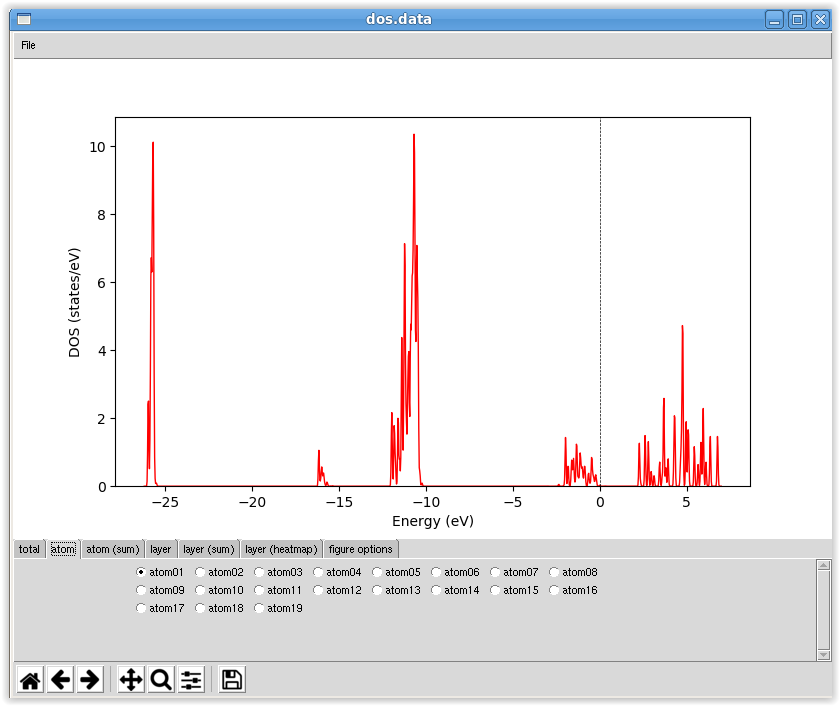
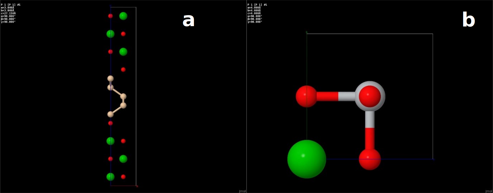
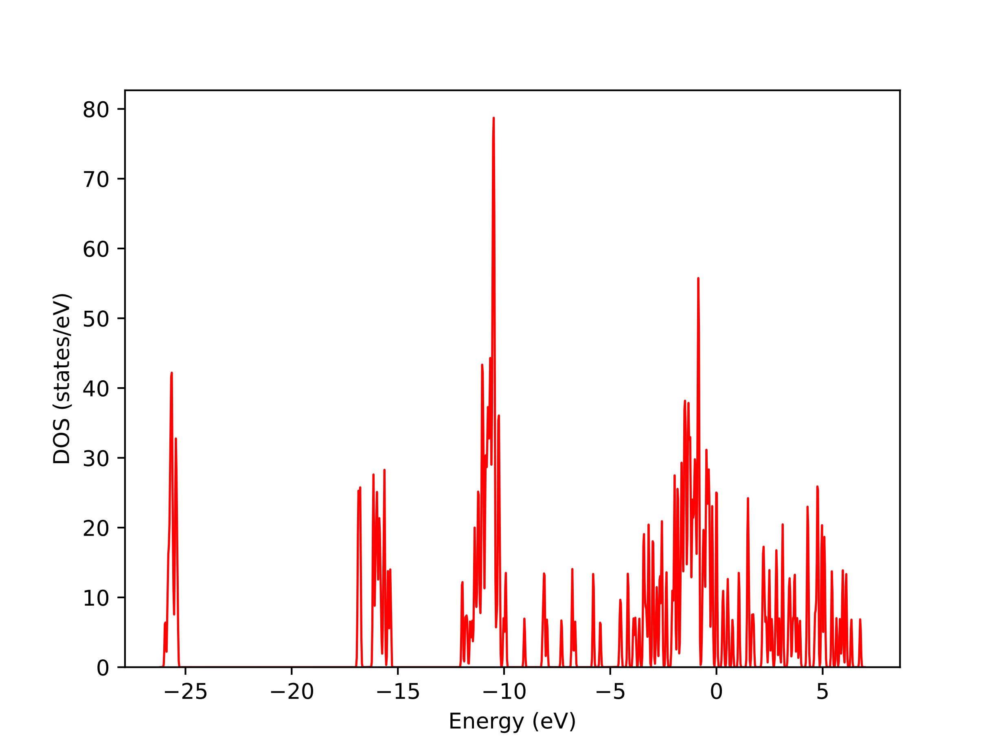
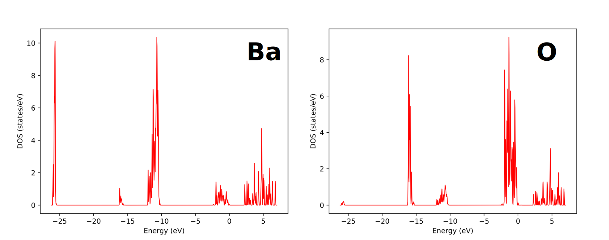
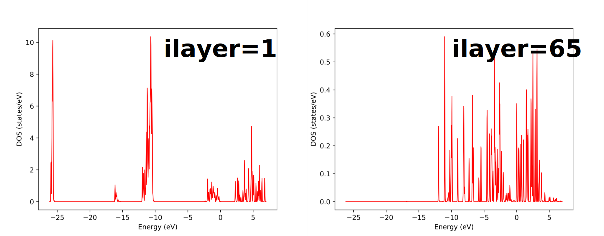
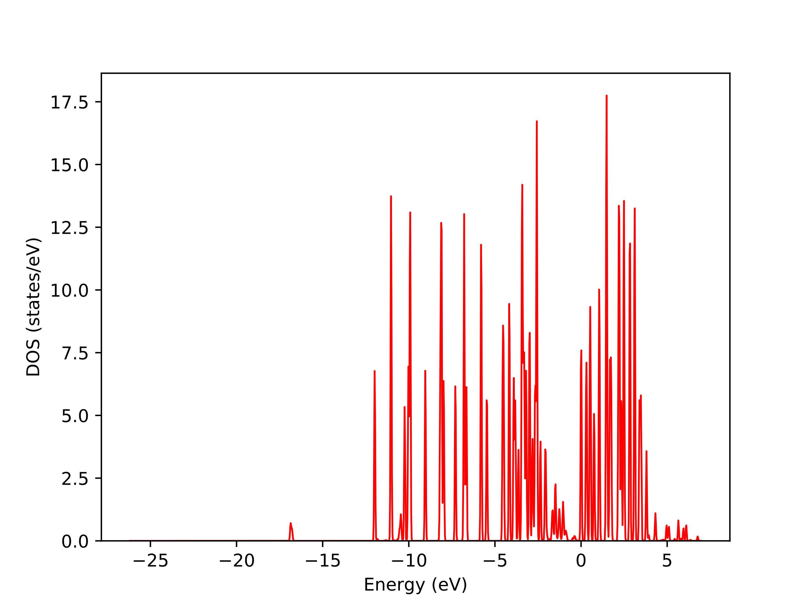
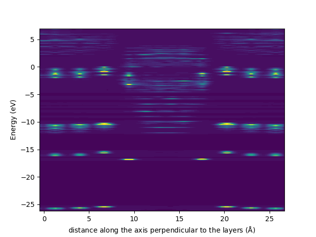
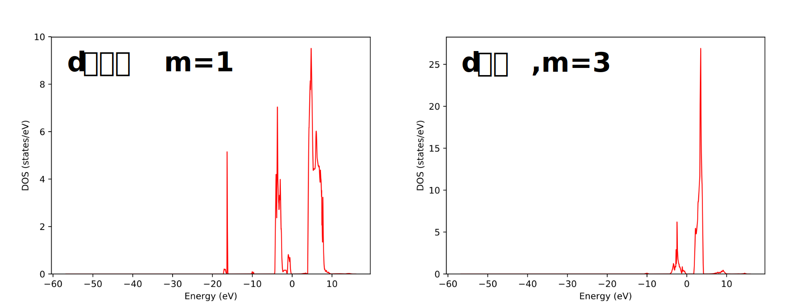
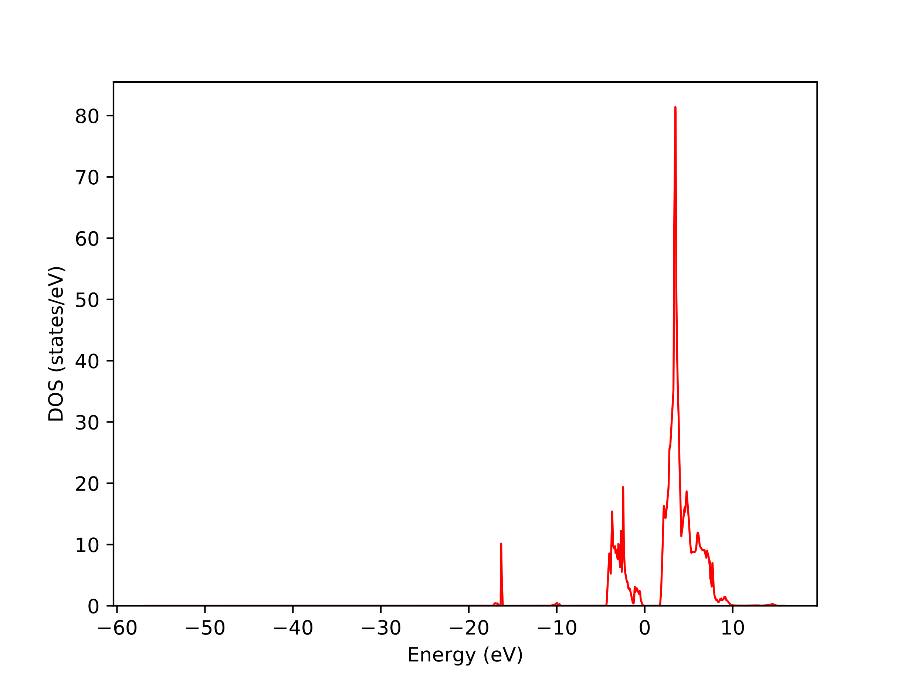
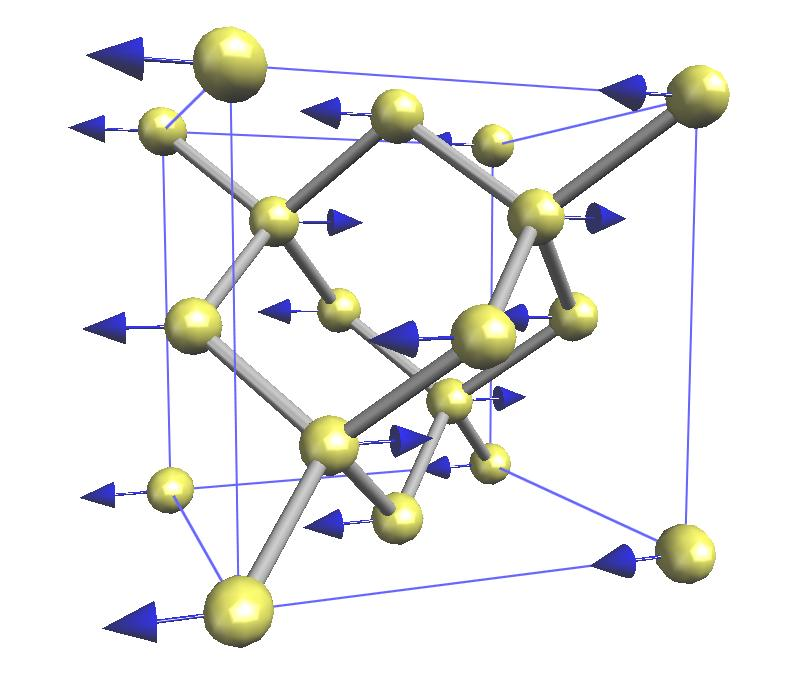

.. _supplement_chapter:

補遺
====================

計算精度、収束性
---------------------

カットオフエネルギーと計算精度
~~~~~~~~~~~~~~~~~~~~~~~~~~~~~~

平面波基底を採用している利点の1つとして、カットオフエネルギーは大きくすればするほど必ず全エネルギーは小さくなり、密度汎関数理論の厳密解に近づく、という点が挙げられます。具体例として、面心立方格子のアルミニウム結晶を利用したテスト例を紹介します。
:numref:`al_cutoff` にカットオフエネルギーと全エネルギーの関係を示します。

.. figure:: images/suppl_image1.svg
  :name: al_cutoff
  :width: 480px

  アルミニウム結晶の場合の、カットオフエネルギーと全エネルギーの関係

図から明らかなように、カットオフエネルギーを大きくすると全エネルギーが小さくなり、一定の値に収束しています。
この振る舞いは利用している擬ポテンシャルに依存します。この例では、36 Rydbergほどで原子あたり1 meV程度まで収束しています。どの程度の収束を目指すべきかは対象とする問題によって異なってきますが、通常10meV程度の収束が得られていれば十分であると考えられます。また、全エネルギーを絶対エネルギーで評価するのではなく、（ふたつの構造の全エネルギーの差など）相対エネルギーで評価する場合はより小さなカットオフエネルギーで収束することが期待できます。

k 点サンプリングと計算精度
~~~~~~~~~~~~~~~~~~~~~~~~~~~~~~

PHASEは平面波基底を採用しているので、扱える問題は周期系に限られます。したがって、すべての物理量は最終的には第一ブリユアンゾーン内で積分する必要があります。この第一ブリユアンゾーン内の積分の細かさを指定するのが\ :math:`k`\ 点サンプリングです。
:math:`k`\ 点サンプリング数と全エネルギーの関係を、 :numref:`al_kpoints` に示します。

.. figure:: images/suppl_image2.svg
  :width: 480px
  :name: al_kpoints

  アルミニウム結晶の場合の、k点数と全エネルギーの関係

:math:`k`\ 点数に関しては変分原理が成立するわけではないので、\ :math:`k`\ 点数に応じて全エネルギーが単純減少するわけではない点には 注意が必要です。\ :numref:`al_kpoints` の例でも、途中全エネルギーが大きくなってから収束へ至っていることが分かります。

なお、カットオフエネルギーの場合と同様ここでみた全エネルギーの絶対エネルギーではなく相対エネルギーの場合はより少ない\ :math:`k`\ 点サンプリング数で収束することが期待できます。

収束判定と計算精度
~~~~~~~~~~~~~~~~~~~~~~~~~~~~~~

SCF計算の収束判定を厳しくすると、原子に働く力をより精度よく計算することが可能となります。通常の構造最適化の場合\ :math:`10^{- 8}` hartree程度の収束判定を採用すれば多くの場合問題なく収束します。他方、分子動力学シミュレーションにおいて保存量を保存させるには、さらに厳しい収束判定を採用する必要があります。

:numref:`sio2_convergence_force` に、SiO\ :sub:`2`\ に対して収束判定を変化させながら力の計算を行った結果を例としてしめします。この図から、 力を収束させるためには\ :math:`10^{- 10}` hartree以上の、比較的厳しい収束判定が要求されることが分かります。

.. figure:: images/suppl_image3.svg
  :width: 480px
  :name: sio2_convergence_force

  SiO2 の、収束判定と力の最大値の関係

.. _supplement_section_scf_speedup:

SCF計算の高速化 (バージョン2023.01以降)
------------------------------------------

バージョン2023.01以降のバージョンにおいてはそれまでのバージョンと比較してFFT回数の削減などによるSCF計算の高速化がほどこされました。どの程度高速になったか、以下のテスト例題によって検証してみました。

 - 4H-SiC結晶の :math:`4 \times 5 \times 2` スーパーセル
 - 波動関数カットオフエネルギー25 Rydberg
 - \ :math:`k` 点サンプリング一般 :math:`k` 点一点
 - バンド数768

収束判定条件や波動関数ソルバー、電荷密度ミキサーなどの設定はすべてデフォルトのものを採用しました。いずれのケースもSCF計算16回で収束しました。用いたCPUはIntel(R) Xeon(R) Platinum 8268, コードはPHASE/0の三次元並列版です。並列数を24 (ne=2, ng=12), 48 (ne=2, ng=24), 96 (ne=2, ng=48), 192 (ne=4, ng=48)と変化させて計算を行いました。各ソルバーの1回あたりのおおよその計算と総計算時間は次に報告する通り。

.. csv-table:: phase/0 2022.01版を用いた場合の計算時間。単位は秒。

   "並列設定","pkosugi","RMM3","SCF計算全体"
   "ne=2 ng=12","30.6","20.3","420"
   "ne=2 ng=24","18.5","12.4","260"
   "ne=2 ng=48","14.9","10.0","205"
   "ne=4 ng=48","9.0","5.9","124"

.. csv-table:: phase/0 2023.01版を用いた場合の計算時間。単位は秒。

   "並列設定","pkosugi","RMM3","SCF計算全体"
   "ne=2 ng=12","20.3","16.4","304"
   "ne=2 ng=24","12.0","9.6","178"
   "ne=2 ng=48","9.0","7.5","140"
   "ne=4 ng=48","5.8","4.8","89"

2022.01版と比較すると、2023.01版はpkosugiソルバーの場合は5割程度、RMM3ソルバーの場合は2割程度高速に動作するようになりました。今回はデフォルトの設定を採用しました。 `Distributed-memory FFTW <https://fftw.org/doc/Distributed_002dmemory-FFTW-with-MPI.html>`_ を用いたり、\ :ref:`control_speedup_options_section` を用いたりすることによってさらに高速に動作させることもできるかもしれません。

PHASE/0 の単位系
---------------------

PHASE/0において利用される単位は、原則としてハートリー原子単位系です。ここでは、ハートリー原子単位系からそのほかの単位に変換する際の変換係数を記述します。結果の解析の際にご活用ください。

+------------+--------------------------------------------------------+
| エネルギー | 1 hartree = 2 rydberg = 27.21139615 eV = 4.359745836   |
|            | :math:`\times 10^{- 18}` J                             |
+------------+--------------------------------------------------------+
| 長さ       | 1 bohr = 0.5291772480 Å= 0.5291772480                  |
|            | :math:`\times 10^{- 10}`\ m                            |
+------------+--------------------------------------------------------+
| 質量       | 1 au mass = 電子の質量 =                               |
|            | 9.1094\ :math:`\times 10^{- 31}` kg                    |
+------------+--------------------------------------------------------+
| 体積       | 1 au volume = 0.1481847426                             |
|            | :math:`\mathring{\mathrm{A}}^{3}` = 1.48184726         |
|            | :math:`\times 10^{- 29}` :math:`m^{3}`                 |
+------------+--------------------------------------------------------+
| 速度       | 1 au velocity = 2.187691417 :math:`\times 10^{- 2}`    |
|            | Å/s = 2.187691417 :math:`\times 10^{8}` m/s            |
+------------+--------------------------------------------------------+
| 力         | 1 hartree/bohr = 51.42208259 eV/Å= 8.238725025         |
|            | :math:`\times 10^{- 8}` N                              |
+------------+--------------------------------------------------------+
| 時間       | 1 au time = 2.418884327 :math:`\times 10^{- 2}` fs =   |
|            | 2.418884327 :math:`\times 10^{- 17}` s                 |
+------------+--------------------------------------------------------+
| ストレス   | 1 au stress = 2.903628623 :math:`\times 10^{9}` atm =  |
|            | 2.942101703 :math:`\times 10^{13}` Pa                  |
+------------+--------------------------------------------------------+
| 密度       | 1 au density = 1.23013834 :math:`\times 10^{4}`        |
|            | amu/:math:`\mathring{\mathrm{A}}^{3}` =                |
|            | 9.1093897\ :math:`\times 10^{- 4}`                     |
|            | g/:math:`\text{cm}^{3}` = 9.1093897                    |
|            | :math:`\times 10^{- 1}` kg/:math:`m^{3}`               |
+------------+--------------------------------------------------------+

.. _commands_tools_chapter:

PHASE/0プログラム、ツールの実行方法
------------------------------------

プログラムphase
~~~~~~~~~~~~~~~~~~~~~~~~~~~~~~~~~~~~~~~~~~

-  .. rubric:: プログラムphaseの実行
      :name: プログラムphaseの実行

PHASEはSCF計算、分子動力学法計算を行います。また収束した電荷密度分布から状態密度やバンド分散を計算することができます。
入力パラメータファイル、擬ポテンシャルファイルを実行ディレクトリに置きます。file_names.dataを使用する場合には、それも同じディレクトリに置いてください。

１プロセッサ（１コア）の逐次計算を行う場合には、次のようにプログラムphase を実行します。ホームディレクトリー :code:`$HOME` にPHASEがインストールされていると仮定しています。

.. parsed-literal::

 % $HOME/|PHASE020XX.YY|/bin/phase

並列計算を行う場合には、お使いの計算機の利用するMPIライブラリの実行コマンドを使用します。詳細はお使いの計算機システムのマニュアルを参照ください。一般的なコマンドはmpirunです。

.. parsed-literal::

  % mpirun -np NP $HOME/|PHASE020XX.YY|/bin/phase ne=NE nk=NK (2次元版)

  % mpirun -np NP $HOME/|PHASE020XX.YY|/bin/phase.3d ne=NE nk=NK ng=NG (3次元版)

ここで、NP はMPI プロセス数、NE はバンド並列数、NK はk点並列数です。3次元版の場合のNGはG点並列数です。

プログラムphase2次元版の並列計算オプション
^^^^^^^^^^^^^^^^^^^^^^^^^^^^^^^^^^^^^^^^^^^

- バンド並列、k点並列

並列計算（バンド並列、k点並列）では、バンド並列数NE、k点並列数NKを指定します。
NP = NE×NK という関係が成立している必要があります。

.. parsed-literal::

  % mpirun -np NP $HOME/|PHASE020XX.YY|/bin/phase ne=NE nk=NK

通常、バンド並列よりもk点並列の方が効率が良いです。
したがって、可能な場合はk 点並列数を大きくすると良いと考えられます。
ただし、Brillouin領域内にサンプルするk点数は系が大きくなるほど少なくても充分になり、そのk点数が必ずしも利用できるプロセス数で割り切れるわけではない（MPIプロセス数がサンプリングk点よりも大きくなる）という点に注意が必要です。
k点数よりもNK の値が大きいとエラーになります。
また、k点数がNK で割り切れない場合は理想的な並列効率が得られません。
そこで、必要に応じてバンド並列も組み合わせて計算を実行してください。

ne, nk という引数は省略することも可能です。その場合のデフォルト値は下記の通り。

-  バージョン2020.01未満：NE = NP, NK = 1
-  バージョン2020.01以上：対称性を考慮した上で得られる\ **k**\ 点数と総並列数NPが割り切れる最大の整数値がNK, NEはNP/NK.

- レプリカ並列

NEB 法、拘束条件付きダイナミクス、メタダイナミクスなどの機能によっては“レプリカ並列” が利用できる場合があります。
レプリカ並列を実行するには以下のコマンドを利用します。

.. parsed-literal::

  % mpirun -np NP $HOME/|PHASE020XX.YY|/bin/phase nr=NR ne=NE nk=NK

NR はレプリカ並列数です。NP = NR×NE×NK という関係が成立している必要があります。
レプリカ並列の効率はk 点並列よりも更に良いですが、k 点並列と同じ注意が必要です。
また、“もっとも収束の遅いレプリカ”が律速となるので、実効的には必ずしも効率的とは限りません。

プログラムphase 3次元並列（G点並列）版
^^^^^^^^^^^^^^^^^^^^^^^^^^^^^^^^^^^^^^^^^^^

PHASE/0 はバンドとk 点の2 軸並列に対応していますが、平面波のG 成分の並列化にも対応しています。
3軸並列版も、2軸並列版と同様インストーラーによってコンパイルすることができます。

.. code-block::

  % ./install_3d.sh

実行は、次の例のように行います。

.. parsed-literal::

  % mpirun -np NP $HOME/|PHASE020XX.YY|/bin/phase.3d ng=NG ne=NE nk=NK

ここで、NPは総MPIプロセス数、NG はG 点並列数、NE はバンド並列数、NKはk点並列数を意味します。
NG とNE とNK の積は、総MPI プロセスの数に等しい必要があります。
2次元版の場合と同様、NEB法、拘束条件付きダイナミクス、メタダイナミクスなどの機能を利用する場合はnr=NRによってレプリカ並列をすることも可能です。

ne, nk, ngが省略された場合のデフォルト値は下記の通り。

-  バージョン2020.01未満：NE = NP, NK = 1, NG=1
-  バージョン2020.01以上：対称性を考慮した上で得られる\ **k**\ 点数と総並列数NPが割り切れる最大の整数値がNK, NGとNEはNE*NG=NP/NKを満たし、かつNE:NGが1:2に最も近くなる取り方

3次元版のオプションについて

3次元版は、以下のような設定を施すことによって、おもに低並列時に高速になる場合があります。

FFTを非並列で処理する

3次元版はFFTを並列で処理します。これをあえて非並列で処理することによって、\ **G**\ 点並列数が少ない場合に高速になる場合があります。このオプションは以下の要領で有効にすることができます。

.. code-block:: text

  control{
    sw_serial_fft = on
  }

特にng=1とする場合は高速化が期待できるオプションです。

電荷密度の処理用にコミュニケーターを追加する

3次元版は、電荷密度を波動関数と同じコミュニケーターで扱います。以下の設定を施すことによって電荷密度に専用のコミュニケーターを割り当てることができます。

.. code-block:: text

  control{
    sw_communicator_for_chg = on
  }

**G**\ 並列数が少ない場合に、おもに交換相関相互作用の処理が高速化されます。

プログラムekcal
~~~~~~~~~~~~~~~~~~~~~~~~~~~~~~~~~~~~~~~~~~

状態密度計算、バンド計算において、k点の個数が多い場合に使うプログラムとしてekcalがあります。
SCF計算の計算結果の電荷密度を入力として計算できます。
SCF計算の計算結果の電荷密度ファイルnfchgt.dataを実行ディレクトリにコピーします。または、入出力ファイル設定ファイルfile_names.dataにおいて、F_CHGにSCF計算で得られた電荷密度ファイル指定します。
バンド構造計算においては、サンプリング\ **k**\ 点の設定ファイルkpoint.dataを用意します。

次のようにプログラムekcal を実行します。 ホームディレクトリー :code:`$HOME` にPHASEがインストールされていると仮定します。

.. parsed-literal::

 % $HOME/|PHASE020XX.YY|/bin/ekcal

ekcalプログラムは2次元版にしか用意されていませんが、入力パラメーターファイルに以下のような設定を加えることによってphaseをekcalと同じように動作させることができます。

.. code-block:: text

  control{
    fixed_charge_option{
      kparallel = one_by_one
    }
  }

ONE_BY_ONEモードで動作する場合、ある\ **k**\ 点iterationにおける初期波動関数は1つ前の\ **k**\ 点iterationの波動関数が採用されます。この際、以下のように変数sw_modified_kpoint_incrementの値をonとすることによって\ **k**\ 点の更新方法が変更され、\ **k**\ 点並列時により近い\ **k**\ 点の波動関数が初期波動関数として採用されるようになります。

.. code-block::

  control{
    fixed_charge_option{
      kparallel = one_by_one
      sw_modified_kpoint_increment = on
    }
  }

プログラムepsmain
~~~~~~~~~~~~~~~~~~~~~~~~~~~~~~~~~~~~~~~~~~

電子系の誘電関数の計算に利用するプログラムがepsmainです。その動作はekcalとほぼ同じですが、入力パラメーターの設定に応じて誘電関数計算用の処理が行われる点が異なります。3次元版のバイナリー名はepsmain.3dです。

プログラムtdlrmain
~~~~~~~~~~~~~~~~~~~~~~~~~~~~~~~~~~~~~~~~~~

線形応答時間依存密度汎関数法による励起スペクトル計算に利用するプログラムがtdlrmainです。3次元版は用意されていません。

状態密度図作成ツール dos.pl
~~~~~~~~~~~~~~~~~~~~~~~~~~~~~~~~~~~~~~~~~~

状態密度図の作成
^^^^^^^^^^^^^^^^^^^^^

PHASEあるいはEKCALによって状態密度データを出力させることが出来ます。
それについては、たとえば :numref:`section_basics_Si2` をご覧ください。
その状態密度データdos.dataを可視化するプログラムがdos.plです。以下のように実行します。

.. code-block:: text

 $ dos.pl dos.data -erange=-13,5 -color -with_fermi

こうすると、EPSファイルdensity_of_states.epsが生成されます。
UNIX環境で、これを見るにはevinceやgvなどを必要とします。

.. code-block:: text

 $ evince density_of_states.eps
 または
 $ gv density_of_states.eps

.. figure:: images/ch8_10_image1.svg
 :name: commands_and_tools_fig1
 :width: 480px

 バルクSiの状態密度図

dos.plを実行するときに状態密度データdos.dataの後に付加した-erangeは表示するエネルギーの範囲を制御するオプション、-colorはカラー出力を行うためのオプション、-with_fermiはフェルミエネルギーの位置をあらわす縦線を引くオプションです。

dos.plのオプション
^^^^^^^^^^^^^^^^^^^^^

なにも付加せずにdos.plを実行すると利用方法が表示されます。

.. code-block::

  $ dos.pl

  Version: 3.00
  Usage: dos.pl DosD
  ata -erange=Emin,Emax -einc=dE -dosrange=DOSmin,DOSmax -dosinc=dDOS 
  -title=STRING -with_fer
  mi -width=SIZE -font=SIZE -color -mode={total|layer|atom|projected} 
  -epsf={yes|no} -data={yes|no}

DosDataに状態密度データが記録されたファイル(通常dos.data)を指定します。
その後に作図を制御するオプションを指定します。

.. table::
 :widths: auto
 :class: longtable

 +--------------------------+------------------------------------------+
 | -erange=Emin,Emax        | 表示\                                    |
 |                          | するエネルギーの範囲をeV単位で指定する。 |
 |                          |                                          |
 |                          | たとえ\                                  |
 |                          | ば、-10 eVから5 eVまで表示したい場合は、 |
 |                          | -erange=-10,5                            |
 |                          | とします。指定をしないと、データの\      |
 |                          | 最小値・最大値から自動的に決定されます。 |
 +--------------------------+------------------------------------------+
 | -einc=dE                 | 目盛りの間隔を指定する。\                |
 |                          | た\                                      |
 |                          | とえば、2eV間隔に目盛りをふりたいなら、  |
 |                          | 　　-einc=2                              |
 |                          | とします。                               |
 +--------------------------+------------------------------------------+
 | -dosrange=DOSmin,DOSmax  | 表示する状態密度の範囲を変える。\        |
 |                          | たとえば、0 states/\                     |
 |                          | eVから12 states/eVまで表示したい場合は、\|
 |                          | -dosrange=0,12                           |
 |                          | とします。                               |
 +--------------------------+------------------------------------------+
 | -dosinc=dDOS             | 縦軸(状態密度)の目盛りの間隔を指定する。\|
 |                          | たとえば、\                              |
 |                          | 2 states/eV間隔に目盛りをふりたいなら、\ |
 |                          | -dosinc=2                                |
 |                          | とします。                               |
 +--------------------------+------------------------------------------+
 | -title=STRING            | グ\                                      |
 |                          | ラフにタイトルを付けたいときに設定する。\|
 |                          | たとえ\                                  |
 |                          | ば、タイトルを「Total DOS」とするなら、\ |
 |                          | -titile="Total DOS"                      |
 |                          | とします。                               |
 +--------------------------+------------------------------------------+
 | -with_fermi              | デフォルトでは描か\                      |
 |                          | ないフェルミレベルまたは価電子帯上端のエ\|
 |                          | ネルギーレベルを描く。金属ではフェルミレ\|
 |                          | ベルを表示し、絶縁体・半導体であれば価電\|
 |                          | 子帯上端のエネルギーレベルを表示します。 |
 +--------------------------+------------------------------------------+
 | -width=SIZE              | 図の幅のデフォルト\                      |
 |                          | 値は1であるが、その値を変更したい場合は\ |
 |                          | このオプション\                          |
 |                          | を使う。たとえば、0.8に変更したい場合は\ |
 |                          | -width=0.8                               |
 |                          | とします。                               |
 +--------------------------+------------------------------------------+
 | -font=SIZE               | フォントのサイズを変更したいと\          |
 |                          | きには、これを設定する。既定値は14です。\|
 |                          | たと\                                    |
 |                          | えば、フォントサイズを28にしたいならば、\|
 |                          | -font=28                                 |
 |                          | とします。                               |
 +--------------------------+------------------------------------------+
 | -color                   | グラフをカラー表示します。               |
 +--------------------------+------------------------------------------+
 | -mode={total|layer|atom} | totalを\                                 |
 |                          | 指定すると、全状態密度図が作成されます。\|
 |                          | layerを指定すると、\                     |
 |                          | 層分割の局所状態密度の図が作成されます。\|
 |                          | atomを指定すると、原\                    |
 |                          | 子分割の局所状態密度の図が作成されます。\|
 |                          | projectedを指定すると、原子軌\           |
 |                          | 道分割の局所状態密度の図が作成されます。\|
 |                          | 既定値はtotalです。                      |
 +--------------------------+------------------------------------------+
 | -epsf={yes|no}           | ポストスクリプトファイルを作成しない\    |
 |                          | ときには、noを指定します。既定値はyesで\ |
 |                          | 指定がなければ、\                        |
 |                          | ポストスクリプトファイルが作成されます。 |
 +--------------------------+------------------------------------------+
 | -data={yes|no}           | 層分割や原子分割の状態密度データからe\   |
 |                          | psファイルを作成するのではなく個別のファ\|
 |                          | イルに出力するときにはyesを指定します。  |
 +--------------------------+------------------------------------------+

.. _cmd_tools_dospy_section:

改良版状態密度図作成ツールdos.py (バージョン2020.01以降)
~~~~~~~~~~~~~~~~~~~~~~~~~~~~~~~~~~~~~~~~~~~~~~~~~~~~~~~~~~~

概要
^^^^^^

PHASE/0には状態密度可視化スクリプトdos.plが付属します。このスクリプトを用いると、全状態密度・原子分割局所状態密度・層分割局所状態密度・射影状態密度の状態密度図をEPS形式で得ることができます。dos.pyスクリプトはその改良版です。スクリプト名の拡張子から示唆されるように、Pythonスクリプトです。下記のような機能が搭載されています。

-  dos.plが持っている全機能
-  EPS以外の画像ファイルの対応
-  状態密度を加算する機能；たとえば、原子分割局在状態密度において指定の原子群の状態密度を足し上げて状態密度図を作成したりデータファイルを出力したりすることができる機能
-  層分割局所状態密度のヒートマップ作成機能
-  動作モードの追加：dos.plが提供するバッチモードのほか、対話モードとGUIモード

層分割状態密度のヒートマップは、\ *x*\ 座標が層の座標、\ *y*\ 座標がエネルギー、\ *z*\ 座標が状態密度という三次元データをヒートマッププロットすることによって得られます。このような可視化を行うことによって、層ごとに状態密度がどのように変化するかを視覚的に明らかにすることができるようになります。

状態密度を加算する機能などを利用する場合、すべてのオプションを引数で渡すのは煩雑な場合がありえます。そこで、dos.pyは対話的にも利用できるようになっています。たとえば加算機能を利用する場合、加算対象となりえる状態密度データがリストアップされるので、所望の状態密度データをそこから選択します。

dos.pyは簡易的なGUIも提供します。利用するGUIのフレームワークはtkinter
(https://docs.python.org/ja/3/library/tkinter.html) です。tkinterは通常Pythonに標準的に備わっているので、利用の際特別な準備は必要ありません。

状態密度プロットの際、dos.plはgnuplotを用います。これに対し、dos.pyはmatplotlib
(https://matplotlib.org/) をプロットの際に用いる仕様となっているため、動作にはPythonのほかmatplotlibが必要となります。また、numpyも必要です。
Matplotlibやnumpyはpip(https://www.python.jp/install/windows/pip.html)などの仕組みを用いてインストールすることが可能です。
また、両方ともAnaconda (https://www.anaconda.com/) のようなPython distributionにはプリインストールされています。
なお、Python3以降が必須であり、Python2系列では動作しません。

使い方
^^^^^^^^^^

**起動の仕方**

以下のよう要領で起動することができます。

.. code-block::

   $ dos.py [OPTIONS]

ただし、処理系によってはPythonを起動するコマンドがpythonではなくpython3などである場合があり、そのようなケースではこの実行方法は利用できません。その場合でも

.. code-block::

   $ python3 dos.py [OPTIONS]

とすることによって起動することができます。

**バッチモード**

バッチモードにおいては、-fもしくは--fileオプションによって状態密度データファイルを指定し、さらに様々なオプションを指定します。利用可能なオプションは下記の通り。なお、オプションは原則としてハイフン(-)が一つの場合は空白の後に、ハイフンが二つ続く場合(--)は=の後に値を指定します。
たとえば-m total, --mode=total など。
また、真偽値を指定するタイプのオプションの場合そのオプションがあるかどうかで真偽が判定されるため、値は指定しません。
オプションは1.  スクリプト全般の振る舞いを制御するオプション、2.  状態密度を加算する場合に加算対象を選択するオプション、3.  描画に関するオプションの三種類があります。

スクリプト全般の振る舞いを制御するオプション

スクリプトの全体的な振る舞いを以下のオプションによって制御することができます。

.. table::
 :widths: auto
 :class: longtable

 +-------------------------------+-------------------------------------+
 | オプション                    | 説明                                |
 +===============================+=====================================+
 | --version                     | バージョンを表示する。              |
 +-------------------------------+-------------------------------------+
 | -h, --help                    | ヘルプを表示する。                  |
 +-------------------------------+-------------------------------------+
 | -i, --interactive             | 対話モードで\                       |
 |                               | 実行する場合に指定するオプション。  |
 +-------------------------------+-------------------------------------+
 | -g, --gui                     | 簡易GUIモードで\                    |
 |                               | 実行する場合に指定するオプション。  |
 +-------------------------------+-------------------------------------+
 | -f FILE --file=FILE           | 状態密度データファイル\             |
 |                               | を指定する。デフォルト値はdos.data. |
 +-------------------------------+-------------------------------------+
 | --output000=OUTPUT000         | output000ファイルを指\              |
 |                               | 定する。無指定の場合、作業ディレク\ |
 |                               | トリーにおいてタイムスタンプが最も\ |
 |                               | 若いoutput000ファイルが採用される。 |
 +-------------------------------+-------------------------------------+
 | -m MODE --mode=MODE           | 状態\                               |
 |                               | 密度データの種類を指定する。total,  |
 |                               | atom, layer, projectedのいずれか。  |
 +-------------------------------+-------------------------------------+
 | -a ACTION --action=ACTION     | スクリ\                             |
 |                               | プトの振る舞いを指定する。analyze,  |
 |                               | split,                              |
 |                               | sumのいずれか。                     |
 |                               |                                     |
 |                               | analyze                             |
 |                               | の場合は状態密度データを解析し、\   |
 |                               | 結果を出力する。splitの場合は局所状\|
 |                               | 態密度などを分割し、画像ファイルな\ |
 |                               | どを作成する。sumの場合フィルターオ\|
 |                               | プションの指定に応じて状態密度を加\ |
 |                               | 算して画像ファイルなどを作成する。\ |
 |                               | カンマ区切りで複数指定してもよい。  |
 +-------------------------------+-------------------------------------+
 | --heatmap                     | 層分割局所状態\                     |
 |                               | 密度の場合に、ヒートマップを作成し\ |
 |                               | たい場合このオプションを指定する。  |
 +-------------------------------+-------------------------------------+
 | -o OUTPUT,                    | 出力の振る舞いを指定する。genfig,   |
 |                               | storedata,                          |
 | --output_action=OUTPUT_ACTION | bothのいずれか。genfigの場合\       |
 |                               | 画像ファイルが出力される。storedat\ |
 |                               | aの場合テキストファイルに加工した状\|
 |                               | 態密度データが出力される。bothの場\ |
 |                               | 合両方行われる。デフォルト値はboth. |
 +-------------------------------+-------------------------------------+

加算対象の状態密度データを選択するためのオプション

状態密度を足し上げてその結果を画像ファイルに出力したりテキストファイルに出力したりすることができます。この時に加算対象とする状態密度データをオプションによって選択します。カンマ(,)とハイフン(-)を用いて複数の整数値を選択することができます。カンマ区切りで値を一つずつ、ハイフン区切りで連続する値を選択することができます。たとえば1,3,4,8-11
などとすると1,3,4,8,9,10,11と展開されます。ただし--elemidは文字列の指定なので、カンマ区切りのみ利用可能です。

.. table::
 :widths: auto
 :class: longtable

 +-------------------+-------------------------------------------------+
 | オプション        | 説明                                            |
 +===================+=================================================+
 | --dosid=DOSID     | dosidによっ\                                    |
 |                   | て加算対象の状態密度を選択する。                |
 |                   |                                                 |
 |                   | dosidは、得に射\                                |
 |                   | 影状態密度の場合は分かりづらいので後述のatomid, |
 |                   | lid, mid, tidを利用してもよい。                 |
 +-------------------+-------------------------------------------------+
 | --atomid=ATOMID   | 加\                                             |
 |                   | 算対象とする原子のIDを指定する。原子分割局所状\ |
 |                   | 態密度および射影状態密度の場合のみ意味をもつ。  |
 +-------------------+-------------------------------------------------+
 | --layerid=LAYERID | 加算対象とする層のIDを指定\                     |
 |                   | する。層分割局所状態密度の場合のみ意味を持つ。  |
 +-------------------+-------------------------------------------------+
 | --elemid=ELEMID   | 加算対象とする元素を指定する。                  |
 +-------------------+-------------------------------------------------+
 | --lid=LAYERID     | 加算対象とする方位量子数\                       |
 |                   | を指定する。射影状態密度の場合のみ意味を持つ。  |
 +-------------------+-------------------------------------------------+
 | --mid=MID         | 加算対象とする磁気量子数\                       |
 |                   | を指定する。射影状態密度の場合のみ意味を持つ。  |
 +-------------------+-------------------------------------------------+
 | --tid=TID         | 加算対象とする主量子数\                         |
 |                   | を指定する。射影状態密度の場合のみ意味を持つ。  |
 +-------------------+-------------------------------------------------+

描画オプション

状態密度図を作成する際にどのように描画するかをオプションによって制御することができます。

.. table::
 :widths: auto
 :class: longtable

 +----------------------------+----------------------------------------+
 | オプション                 | 説明                                   |
 +============================+========================================+
 | -e ERANGE, --erange=ERANGE | 態密度図描画の際のエネルギーの範囲を\  |
 |                            | 指定する。emin,emaxという形式で指定す\ |
 |                            | る。eminが下限値、emaxが上限値。emin,  |
 |                            | emaxは片方の\                          |
 |                            | み指定することもできる。すなわちemin,  |
 |                            | もしくは,emax.                         |
 |                            | この場合指定されなかった方の値はmatp\  |
 |                            | lotlibのデフォルト値が割り当てられる。 |
 +----------------------------+----------------------------------------+
 | --einc=EINC                | エネルギーの軸の目盛り値を指定する。   |
 +----------------------------+----------------------------------------+
 | -d DRANGE,                 | 状態密度描画の際の状態密度の範囲を指\  |
 |                            | 定する。指定の形式はエネルギーと同じ。 |
 | --drange=DRANGE            |                                        |
 +----------------------------+----------------------------------------+
 | --dinc=DINC                | 状態密度の軸の目盛り値を指定する。     |
 +----------------------------+----------------------------------------+
 | --lrange=LRANGE            | 層分割局所状態密度の\                  |
 |                            | ヒートマップ作成の場合に、層の範囲を指\|
 |                            | 定する。指定の形式はエネルギーと同じ。 |
 +----------------------------+----------------------------------------+
 | --linc=LINC                | 層分割局所状態密度のヒートマップ作成\  |
 |                            | の場合に、層の軸の目盛り値を指定する。 |
 +----------------------------+----------------------------------------+
 | --with_fermi               | フェルミエネルギーを表す点線を描画し\  |
 |                            | たい場合にこのオプションを有効にする。 |
 +----------------------------+----------------------------------------+
 | --title                    | 状態密度図にタイトルを表示\            |
 |                            | したい場合このオプションを有効にする。 |
 +----------------------------+----------------------------------------+
 | --cmap=CMAP                | 層分割局所状態密度のヒートマップ作成の\|
 |                            | 場合に、カラーマップの種類を指定する。 |
 |                            | 可能な選択肢が※のウェブサイトに        |
 |                            | 掲載されている。デフォルト値はviridis  |
 +----------------------------+----------------------------------------+
 | --imgtype=IMGTYPE          | 画像ファ\                              |
 |                            | イルの種類を指定する。以下のいずれか。 |
 |                            |                                        |
 |                            | eps, ps, png, jpg, pdf, svg            |
 +----------------------------+----------------------------------------+

※ https://matplotlib.org/3.1.1/gallery/color/colormap_reference.html

**対話モード**

dos.pyを-i もしくは--interactiveをつけて実行すると対話モードで利用することができます。対話モードでは選択肢がいろいろと提示されるので、所望の振る舞いに応じて選択します。対話モードでは、おおよそ以下のように動作します。

-  状態密度の種類を選ぶ。状態密度の種類とは、total, atom, layer, projectedのいずれか。
-  atom, layer, projectedの場合何を実行するかを選ぶ。atom, projectedの場合splitもしくはsum, layerの場合はこれにheatmapが加わる。
-  sumの場合、加算対象のIDを選ぶ。
-  描画オプションの選択：erange, drange, with_fermiを入力する。
-  画像ファイルの種類：eps, ps, png, jpg, pdf, svgのいずれかを選ぶ

**GUIモード**

dos.pyに-g もしくは--guiオプションをつけて実行すると :numref:`commands_and_tools_fig2` で示すようなGUIが得られます。

 dos.pyが提供するGUI.

図のアルファベットを用いてこのGUIについて説明します。

a. プロット表示域。

b. 状態密度の種類などを選択するタブ域。totalは全状態密度、atomは原子分割局所状態密度、atom
   (sum)は原子分割局所状態密度加算、layerは層分割局所状態密度、layer
   (sum)は層分割局所状態密度加算、layer
   (heatmap)は層分割局所状態密度のヒートマップ、projectedは射影状態密度、projected
   (sum)は射影状態密度加算、figure optionsは描画オプション設定域。

c. 状態密度選択域。atom ID, layer ID, pdos
   IDなどのチェックボックスを選択するとそれに応じて描画が更新される。加算モードの場合複数選択することが可能で、選択状態のすべての状態密度が加算され描画される。

d. プロット操作域。プロットの描画のされ方などを変えることができる。フロッピーディスクのアイコンをクリックするとファイル選択ダイアログが得られ、画像ファイルにエクスポートすることができる。

出力
^^^^^^^^

出力としては、分割もしくは加工した状態密度データが記録されたテキストファイルと状態密度図のデータが得られます。二つのファイルのファイル名は拡張子以外共通であり、拡張子は前者がdata,
後者は--imgtypeの指定に応じたそれになります。拡張子を除いた分は以下に示すように場合によって異なります。

-  --action=sumでなく、--heatmapもつけていない場合

  -  全状態密度：dos_total
  -  局所状態密度：dos_atom\ *atomid*
  -  層分割局所状態密度：dos_layer\ *layerid*
  -  射影状態密度：dos_atom\ *atomid*\ \_l\ *lid*\ \_m\ *mid*\ \_t\ *tid*

-  --heatmapを付けている場合

  -  層分割局所状態密度：layer_dos_heatmap

-  --action=sumの場合

  -  局所状態密度：dos_summed_atom
  -  層分割局所状態密度：dos_summed_layer
  -  射影状態密度：dos_summed_projected

利用例
^^^^^^^^

使用例と結果得られる状態密度図を紹介します。利用する状態密度データはPHASE/0のサンプルにあるBaO-Si界面とBaTiOの状態密度データです。

 \(a) BaO-Si界面と(b) BaTiO の原子配置。

**BaO-Si界面**

.. code-block:: text

 dos.py -f dos.data --imgtype=svg

全状態密度の状態密度図が得られる。画像ファイルはsvg形式。

 全状態密度。

.. code-block:: text

 dos.py -f dos.data -m atom --imgtype=svg

原子に分割した状態密度図が得られる。原子数分の画像ファイルが得られる。一番目の原子（最下層のBa）と二番目の原子（最下層のO）の状態密度を図示する。

 1番目の原子と2番目の原子の局所状態密度。いずれも :numref:`commands_and_tools_fig3`  (a)の最下層の原子で、元素は1番目がBa, 2番目がOである。

.. code-block:: text

 dos.py -f dos.data -m layer --imgtype=svg

層に分割した状態密度図が得られる。層の数分の画像ファイルが得られる。最下層と中央付近の層の状態密度を図示する。

 1層目（ :numref:`commands_and_tools_fig3` の最下層）と65層目（ :numref:`commands_and_tools_fig3` (a)の中央付近）の状態密度

.. code-block:: text

 dos.py -f dos.data -m atom -a sum --elemid=Si --imgtype=svg

Si原子の状態密度をすべて足しこんだ状態密度図が得られる。

 Si原子の状態密度をすべて足しこんだ状態密度。

.. code-block:: text

 dos.py -f dos.data -m layer --heatmap --imgtype=png --drange=,2

層分割状態密度のヒートマップが得られる。色の違いを際立たせるため、状態密度の上限を2としている。

 層分割状態密度のヒートマップ。横軸が最低面を原点とした場合の層の原点からの距離、縦軸がエネルギーであり、状態密度の値の違いは描画色の違いによって表されている。

**BaTiO結晶**

.. code-block:: text

 dos.py -f dos.data -m projected --imgtype=svg

射影状態密度の図が軌道ごとに出力される。Tiの\ *d*\ 軌道の状態密度を図示する。

 Ti d軌道の射影状態密度。

.. code-block:: text

 dos.py -f dos.data -a sum --lid=2 -m projected --imgtype=svg

Tiの\ *d*\ 軌道の状態密度をすべて足し上げた状態密度図が得られる。

 Ti d軌道の射影状態密度。

.. _band_kpoint_pl_section:

k点ファイル生成ツール　band_kpoint.pl
~~~~~~~~~~~~~~~~~~~~~~~~~~~~~~~~~~~~~~~

バンド構造図を描くには、対称線に沿った\ :math:`\mathbf{k}`\ 点の列を生成し、その各\ :math:`\mathbf{k}`\ 点での固有エネルギーを
ekcalで計算します。ekcalは\ :math:`\mathbf{k}`\ 点のデータが書き込まれたファイルkpoint.dataを
読み込み各\ :math:`\mathbf{k}`\ 点での固有エネルギーを計算します。その\ :math:`\mathbf{k}`\ 点のファイルの生成を支援するプログラムが
band_kpoint.plです。band_kpoint.plの入力ファイルの記述形式は以下の様になっています。

.. code-block:: text

 dkv
 b1x b2x b3x
 b1y b2y b3y
 b1z b2z b3z
 n1 n2 n3 nd # Symbol
 ...

dkvが\ :math:`\mathbf{k}`\ 点の間隔、b1x,b1y,b1zは逆格子ベクトル\ :math:`\mathbf{b}_{\mathbf{1}}`\ のx,y,z成分。
逆格子ベクトル\ :math:`\mathbf{b}_{\mathbf{2}}`,\ :math:`\mathbf{b}_{\mathbf{3}}`\ についても同様です。
五行目以降に特殊\ :math:`\mathbf{k}`\ 点とそのシンボルの指定をします。シンボルの指定は必須ではありませんが、指定がある場合、バンド構造図作成の際に利用されます。
整数\ :math:`n_{1},n_{2},n_{3},n_{d}`\ を用いて\ :math:`\mathbf{k}`\ ベクトルを

.. math:: \mathbf{k =}\frac{n_{\mathbf{1}}}{n_{\mathbf{d}}}\mathbf{b}_{\mathbf{1}}\mathbf{+}\frac{n_{\mathbf{2}}}{n_{\mathbf{d}}}\mathbf{b}_{\mathbf{2}}\mathbf{+}\frac{n_{\mathbf{3}}}{n_{\mathbf{d}}}\mathbf{b}_{\mathbf{3}}

のように指定します。シンボルは#の後に書いてください。面心立方格子の場合の例を示します。

.. code-block:: text

 0.02                        <---- k点の間隔
 -1.0  1.0  1.0
 1.0 -1.0  1.0               <---- 逆格子ベクトル
 1.0  1.0 -1.0
 0 1 1 2 # X                 <---- n1 n2 n3 nd # Symbol
 0 0 0 1 # {/Symbol G}
 1 1 1 2 # L
 5 2 5 8 # U
 1 0 1 2 # X

これと同じものがディレクトリexampleにあるので、それをコピーしてband_kpoint.plを実行してみましょう。

.. code-block::

 $ cd PHASE_INST_DIR/samples/tools/work
 $ cp ../example/bandkpt_fcc_xglux.in .
 $ band_kpoint.pl bandkpt_fcc_xglux.in > output

こうするとkpoint.dataが生成されます。これがバンド構造計算用の\ :math:`\mathbf{k}`\ 点のファイルです。
この\ :math:`\mathbf{k}`\ 点のファイルを入力に加えて、ekcalで\ :math:`\mathbf{k}`\ 点での固有エネルギーを計算してください。

バンド構造図作成ツール band.pl
~~~~~~~~~~~~~~~~~~~~~~~~~~~~~~~~

band.plの実行
^^^^^^^^^^^^^^^^

| band.pl
  PHASE/0のekcalの出力nfenergy.dataとband_kpoint.plの入力ファイルがband.plの
  入力になります。
  前節の入力例で生成したkpoint.dataを入力とし、ekcalで固有エネルギー計算を行い、
  結果得られた固有エネルギーファイルnfenergy.dataが
  ディレクトリexampleにあります。
  このファイルを使ってバンド構造図を描いてみましょう。exampleにあるnfenergy.dataと
  bandkpt_fcc_xglux.inをworkにコピーし、それらを入力としてband.plを実行します。

.. code-block::

 $ cp ../example/nfenergy.data
 $ cp
 $ band.pl nfenergy.data bandkpt_fcc_xglux.in

こうすると、EPSファイルband_structure.epsが生成されます。
このファイルをご覧になるには、ghostviewやgvなどのソフトウェアが必要です。

.. code-block::

 $ ghostview 
 または $ gv 
 $ gv band_structure.eps

.. figure:: images/ch8_10_image17.svg
 :width: 480px

 バルクSiのバンド構造図

band.plを実行するときにいくつかのオプションを付加することができます（次節）。

band.plのオプション
^^^^^^^^^^^^^^^^^^^^^^^

なにも付加せずにband.plを実行すると利用方法が表示されます。

.. code-block::

 $ band.pl

  Usage: band.pl EnergyDataFile KpointFile -erange=Emin,Emax
  -einc=dE -ptype={solid_circles|lines} -with_fermi
  -width=SIZE -color

KpointFileの後が作図を制御するオプションです。

.. table::
 :widths: auto
 :class: longtable

 +-------------------+-------------------------------------------------+
 | -erange=Emin,Emax | 表示するエネルギーの範囲をeV単位で指定する。    |
 |                   |                                                 |
 |                   | たとえば、-10 eVから5 eVまで表示したい場合は、  |
 |                   | -erange=-10,5                                   |
 |                   | とします。                                      |
 +-------------------+-------------------------------------------------+
 | -einc=dE          | 目盛りの間隔を指定する。\                       |
 |                   | たとえば2eV間隔に目盛りをふりたいなら、         |
 |                   | -einc=2                                         |
 |                   | とします。                                      |
 +-------------------+-------------------------------------------------+
 | -ptype=TYPE       | 描画種を選択する。                              |
 |                   | -ptype=so\                                      |
 |                   | lid_circles  : 黒く塗りつぶされた円で表示する。 |
 |                   | -ptype=lines : 直線でつなぐ(デフォルト)。       |
 +-------------------+-------------------------------------------------+
 | -with_fermi       | デフォルトでは描かないフェルミレベルまた\       |
 |                   | は価電子帯上端のエネルギーレベルを描く。金属で\ |
 |                   | はフェルミレベルを表示し、絶縁体・半導体であれ\ |
 |                   | ば価電子帯上端のエネルギーレベルを表示します。  |
 +-------------------+-------------------------------------------------+
 | -width=SIZE       | 図の幅のデフォルト\                             |
 |                   | 値は0.5であるが、その値を変更したい場合はこのオ\|
 |                   | プションを使う。たとえば、0.3に変更したい場合は\|
 |                   | -width=0.3                                      |
 |                   | とします。                                      |
 +-------------------+-------------------------------------------------+
 | -color            | グラフをカラー表示する。                        |
 +-------------------+-------------------------------------------------+

原子構造の拡張trajectory形式への変換ツール　dynm2tr2.pl
~~~~~~~~~~~~~~~~~~~~~~~~~~~~~~~~~~~~~~~~~~~~~~~~~~~~~~~~~~

Perlスクリプトdynm2tr2.plは、構造最適化、分子動力学法計算のデータ(nfdym.data)を拡張trajectory形式に変換します。

ツールdynm2tr2.plを以下のように実行します。

.. code-block::

 $ dynm2tr2.pl nfdynm.data

このようにすると、dynm.tr2というファイルとgrid.mol2というファイルが生成されます。前者は原子の座標などが記述されたファイルであり、
後者は対応するセルの情報などが記述されたファイルです。

FCCのプリミティブセルにSiが二原子入った非平衡状態を初期構造とし、構造最適化した結果を拡張trajectory形式に変化し、可視化した例です。

.. figure:: images/ch8_10_image18.svg
 :name: commands_and_tools_fig12
 :width: 480px

 バルクSiの構造最適化過程の可視化例

\ :numref:`commands_and_tools_fig12` の矢印は原子に作用する力を表しています。
力が極大になったあとは、原子座標の更新が進む毎に原子に作用する力が小さくなり、原子構造が最適化されていく様子が分かります。
\ :numref:`commands_and_tools_fig12` ではプリミティブセルで表示されますが、 以下のようなcontrol.inpというファイルを作成すれば、原点の移動やセルの変更ができます。

.. code-block::

  origin  1.2825 1.2825 1.2825
  vector1 10.26  0     0
  vector2  0    10.26  0
  vector3  0     0    10.26

このcontrol.inpを使用してdynm2tr2.plでdynm.tr2を作成すると原点が(1.2825,1.2825,1.2825) bohrに移り、 セルのベクトルが(10.26,0,0)、(0,10.26,0)、(0,0,10.26) bohrになります。
以下のようにして、dynm.tr2を作成します。

.. code-block::

  $ dynm2tr2.pl nfdynm.data control.inp

ブラベーセルで構造最適化過程のstep 10を図示したのが、\ :numref:`commands_and_tools_fig13` です。

.. figure:: images/ch8_10_image19.svg
 :name: commands_and_tools_fig13
 :width: 480px

 ブラベーセルで表したバルクSiの構造最適化過程(step 10)

振動数レベル図作成ツール freq.pl
~~~~~~~~~~~~~~~~~~~~~~~~~~~~~~~~~~

PHASEの振動解析機能を使用すると、結晶の基準振動モードの振動数と固有ベクトルが得られます。
振動解析の結果は、ファイルmode.dataに出力されます。Perlスクリプトfreq.plmode.dataから振動数のデータを取り出し
振動数レベル図を作成します。freq.pl実行すると、EPS形式の画像ファイルfreq.epsが出力されます。

.. code-block::

  $ freq.pl [options] mode.data

バルクSiの振動数解析結果の振動数のレベル図を :numref:`commands_and_tools_fig14` に示します。

.. figure:: images/ch8_10_image20.svg
 :name: commands_and_tools_fig14
 :width: 480px

 バルクSiの振動数レベル図

振動数レベルを表す横棒は既約表現ごとに列にまとめて分類され、その各列の上には既約表現の名称と活性を表す記号(IR,R,IR&R,NON)が
表示されます。IRは赤外活性を表し、Rはラマン活性を表します。IR&Rは赤外活性とラマン活性があることを示します。
NONはサイレントモードであることを示しています。作成された振動数レベル図では、横線の右側には振動数がcm\ :sup:`-1`\ 単位で表示されます。
既約表現ごとに振動数の低い順に番号付けされ、横線の左側に表示されます。

freq.plのオプション
^^^^^^^^^^^^^^^^^^^^^^

なにも付加せずにfreq.plを実行すると利用方法が表示されます。

.. code-block::

 $ freq.pl

 *** A visualization program for vibrational freqencies ***
 Usage: freq.pl [-width=W] [-height=H] [-nrep=N] {-solid|-mol|-ignored_modes=LIST} mode.data

freq.plのオプションです。

.. table::
 :widths: auto
 :class: longtable

 +---------------------+-----------------------------------------------+
 | -width=W            | 図の幅のデフォルト値は1であるが、そ\          |
 |                     | の値を変更したい場合はこのオプションを使う。  |
 |                     |                                               |
 |                     | たとえば、0.3に変更したい場合は               |
 |                     | -width=0.3                                    |
 |                     | とします。                                    |
 +---------------------+-----------------------------------------------+
 | -height=H           | 図の幅のデフォルト値は1であるが、そ\          |
 |                     | の値を変更したい場合はこのオプションを使う。  |
 |                     | たとえば、2.5に変更したい場合は               |
 |                     | -height=2.5                                   |
 |                     | とします。                                    |
 +---------------------+-----------------------------------------------+
 | -nrep=N             | 一つの図に表示する既約表\                     |
 |                     | 現の数。振動モードの既約表現かこの数よりも多\ |
 |                     | いときには、複数のEPSファイルが作成されます。 |
 +---------------------+-----------------------------------------------+
 | -solid              | 固体の場合に並進を非表示にするオプション。\   |
 |                     | これはデフォルトで設定されています。          |
 +---------------------+-----------------------------------------------+
 | -mol                | 分子\                                         |
 |                     | の場合に回転と並進を非表示にするオプション。  |
 +---------------------+-----------------------------------------------+
 | -ignored_modes=LIST | LISTのところにコンマで区切っ\                 |
 |                     | て並べた番号のモードは表示されなくなります。  |
 |                     | たとえば                                      |
 |                     | -ignored_modes=1,2,3                          |
 |                     | と\                                           |
 |                     | すると1,2,3番のモードは表示されなくなります。 |
 +---------------------+-----------------------------------------------+

基準振動の軌跡の拡張trajectory形式ファイル変換ツール animate.pl
~~~~~~~~~~~~~~~~~~~~~~~~~~~~~~~~~~~~~~~~~~~~~~~~~~~~~~~~~~~~~~~~~~

Perlスクリプトanimate.plmode.dataに出力されている振動モードの固有ベクトルのデータを読み込み、基準振動の軌跡を拡張trajectory形式ファイルに変換します。

control.inpというファイルを用意すると、原点の移動とセルベクトルの変更ができます。

control.inpの例です。

.. code-block::

  origin  1.27189 1.27189 1.27189
  vector1 10.17512 0 0
  vector2 0 10.17512 0
  vector3 0 0 10.17512

この例では、ブラベーセルで表示するために、原点を(1.27189、1.27189、1.27189) bohrに移し、セルベクトルを(10.17512、0、0)、(0、10.17512、0)、(0、0、10.17512) bohr に変更します。

animate.plを以下のように実行します。

.. code-block::

 $ animate.pl mode.data control.inp

各振動モードごとの拡張trajectory形式ファイルmode_1.tr2、mode_2.tr2、...、mode_6.tr2というファイルとgrid.mol2というファイルが作成されます。
拡張trajectory形式のファイルは振動モードの数だけ出力されます。

バルクSiの振動解析の6番目の基準振動の固有ベクトルmode_6.tr2を可視化した図を :numref:`commands_and_tools_fig15` に示します。

 バルクSiの基準振動の固有ベクトル

.. _commands_and_tools_convpy:

座標データ変換ツールconv.py
~~~~~~~~~~~~~~~~~~~~~~~~~~~~~~~~~~~~~~~~~~~~~~~~~~~~~~~~~~~~~~~~~~

conv.pyというPythonスクリプトを使って、座標データを変換することができます。binディレクトリーの下にあります。\ ``conv.py`` コマンドを実行すれば起動することができますが、\ :ref:`cmd_tools_dospy_section` でも述べたように、Pythonのコマンド名がpythonではなくpython3などの場合は ``python3 conv.py`` のように起動します。conv.pyは対話的に利用します。たとえば、nfdynm.dataファイルをCIFに変換する手続きは下記の通りです。

+----------------------------------+----------------------------------+
| 画面に現れる文字列               | 説明                             |
+==================================+==================================+
| $ conv.py                        |                                  |
+----------------------------------+----------------------------------+
| atomic configuration converter   | 変換元のファイル形式\            |
| utility.                         | を指定する。nfdynm.dataの場合ph\ |
|                                  | ase_outputなので1を指定し、Enter |
| Copyright (C) the RISS project,  |                                  |
| The University of Tokyo          |                                  |
|                                  |                                  |
| select the type of the input     |                                  |
| atomic coordinate file           |                                  |
|                                  |                                  |
| 0. phase_input                   |                                  |
|                                  |                                  |
| 1. phase_output                  |                                  |
|                                  |                                  |
| 2. VASP_input                    |                                  |
|                                  |                                  |
| 3. VASP_output                   |                                  |
|                                  |                                  |
| 4. OpenMX_input                  |                                  |
|                                  |                                  |
| 5. OpenMX_output                 |                                  |
|                                  |                                  |
| 6. XSF                           |                                  |
|                                  |                                  |
| 7. xyz                           |                                  |
|                                  |                                  |
| 8. cube                          |                                  |
|                                  |                                  |
| 9. cif                           |                                  |
|                                  |                                  |
| 10. dmol                         |                                  |
|                                  |                                  |
| 11. LAMMPS_output                |                                  |
|                                  |                                  |
| x. Exit                          |                                  |
|                                  |                                  |
| Please enter a selection         |                                  |
| (0/1/2/3/4/5/6/7/8/9/10/11/x)    |                                  |
| [0]:                             |                                  |
+----------------------------------+----------------------------------+
| Please enter the name of the     | nfdynm.da\                       |
| input atomic coordinate file, or | taファイルのファイル名を指定。nf\|
| type x to exit. [nfdynm.data]:   | dynm.dataでよいならそのままEnter |
+----------------------------------+----------------------------------+
| Please enter the frame no.       | フレ\                            |
| (enter a negative value in order | ームを選択する。負の値の場合「全\|
| to output all frames when        | フレーム」を選択することに相当す\|
| possible), or type x to exit.    | る。カンマ区切りで三つの整数を指\|
| [-1]:                            | 定することによって、始フレーム, \|
|                                  | 終フレーム、間隔を指定することが\|
|                                  | できる。フレームの数値は0始まり  |
+----------------------------------+----------------------------------+
| select the type of the output    | 変換先の形式を指\                |
| atomic coordinate file           | 定する。CIFの場合7と入力しEnter  |
|                                  |                                  |
| 0. phase_input                   |                                  |
|                                  |                                  |
| 1. phase_output                  |                                  |
|                                  |                                  |
| 2. VASP_input                    |                                  |
|                                  |                                  |
| 3. OpenMX_input                  |                                  |
|                                  |                                  |
| 4. XSF                           |                                  |
|                                  |                                  |
| 5. xyz                           |                                  |
|                                  |                                  |
| 6. cube                          |                                  |
|                                  |                                  |
| 7. cif                           |                                  |
|                                  |                                  |
| 8. dmol                          |                                  |
|                                  |                                  |
| 9. LAMMPS_input                  |                                  |
|                                  |                                  |
| x. Exit                          |                                  |
|                                  |                                  |
| Please enter a selection         |                                  |
| (0/1/2/3/4/5/6/7/8/9/x) [1]:     |                                  |
+----------------------------------+----------------------------------+
| Please enter the name the output | 出力ファイル名を指定する。CI\    |
| atomic coordinate file, or type  | Fの場合、デフォルト値はcoord.cif |
| x to exit. [coord.cif]:          |                                  |
+----------------------------------+----------------------------------+

以上の操作によって、nfdynm.dataファイルからCIFを得ることができます。そのほかのファイル形式についても同様に変換することができます。

conv.py起動時に、以下のオプションを指定することができます。

========== ===================================================
オプション 説明
========== ===================================================
--pack     単位胞の中に原子を押し込めます
--na=NA    *a*\ 軸をNA倍にしたスーパーセルを作成し、変換します
--nb=NB    *b*\ 軸をNB倍にしたスーパーセルを作成し、変換します
--nc=NC    *c*\ 軸をNC倍にしたスーパーセルを作成し、変換します
========== ===================================================

PHASE/0の入力を変換する場合、ホームディレクトリーに.piouというファイルが存在し、その中身が下記のようになっている必要があります。

.. code-block::

  pp.default_pp_dir=PATH_TO_PPDIR

ここでPATH_TO_PPDIRは擬ポテンシャルファイルが納められたディレクトリーです。

.. _ch08_10_inpcheck_py_section:

入力ファイル正誤チェックツールinpcheck.py
~~~~~~~~~~~~~~~~~~~~~~~~~~~~~~~~~~~~~~~~~~~~~

inpcheck.pyとは、PHASE/0の入力の正誤チェックを行うツールです。binディレクトリーの下にあります。

このスクリプトを利用するには、まずホームディレクトリーに.piouというファイルを作成し、その中身を以下のようにする必要があります。

.. code-block::

  pp.default_pp_dir=PATH_TO_PPDIR

ここでPATH_TO_PPDIRは擬ポテンシャルファイルが納められたディレクトリーです。

以下のように計算の実行ディレクトリーにおいて実行すると診断をはじめ、結果が標準エラー出力に出力されます。たとえば、以下のような出力が得られます。

.. parsed-literal::

 $ inpcheck.py

 input data validator utility for PHASE
 Copyright (C) the RISS project, The University of Tokyo
 INFO: -- running the input validator --
 INFO: specfile : phase.spec
 INFO: checking directory : /home/jkoga/|PHASE020XX.YY|/samples/Si8
 INFO: validating input...
 INFO:
 INFO: checking if required/recommended entries exist...
 INFO:
 INFO: found [accuracy.matrix_diagon.cutoff_wf] at line 31, a recommended
 entry when [accuracy.initial_wavefunctions] is 'matrix_diagon'
 ...
 ...
 INFO: checking whether each entires are valid...
 INFO:
 INFO: line 2: entry [control.cpumax] matches the specification.
 INFO: line 3: entry [control.condition] matches the
 ...
 ...
 WARNING:
 WARNING: line 95: could not find [postprocessing.dos.nwd_window_width] in specification.
 WARNING: candidate entry: [postprocessing.dos.nwd_dos_window_width]
 WARNING:
 INFO: line 98: entry [postprocessing.charge.sw_charge_rspace] matches the specification.
 INFO: line 99: entry [postprocessing.charge.filetype] matches the specification.
 INFO: line 100: entry [postprocessing.charge.title] matches the specification.
 INFO:
 INFO: input validation done.
 INFO:
 WARNING: found 2 warnings in /home/jkoga/|PHASE020XX.YY|/samples/Si8
 WARNING: check the log for details.
 
inpcheck.pyに渡せるオプションは下記の通り。

.. table::
 :widths: auto
 :class: longtable

 +----------------------------------+----------------------------------+
 | オプション                       | 説明                             |
 +==================================+==================================+
 | -l LOGLEVEL, --loglevel=LOGLEVEL | ログレベルを指定する。           |
 |                                  |                                  |
 |                                  | 0 : 最小出力                     |
 |                                  | 1 : デフォルト出力               |
 |                                  | 2 : デバッグ出力                 |
 +----------------------------------+----------------------------------+
 | --prop=PROPFILE                  | プロパティ―ファイルをユーザ\     |
 |                                  | ー指定のものにする。（デフォルト\|
 |                                  | 値はpiou/data/props.properties） |
 +----------------------------------+----------------------------------+
 | --ppdir=PPDIR                    | 擬ポテンシャル格\                |
 |                                  | 納ディレクトリーをデフォルト以外\|
 |                                  | のものにする(デフォルト値は$HOM\ |
 |                                  | E/.piouファイルに記述されている) |
 +----------------------------------+----------------------------------+
 | -s SPECFILE, --specfile=SPECFILE | 入力仕様定義ファイルを\          |
 |                                  | ユーザー指定のものにする（デフォ\|
 |                                  | ルト値はpiou/config/phase.spec） |
 +----------------------------------+----------------------------------+
 | -r, --recursive                  | 起動したディレ\                  |
 |                                  | クトリーの下のすべてのサブディレ\|
 |                                  | クトリ―を再帰的にたどり、PHASE/\ |
 |                                  | 計算フォルダーと判定された場合に\|
 |                                  | 入力ファイル正誤チェックを行う。 |
 +----------------------------------+----------------------------------+

.. _inputs_outputs_chapter:

入出力ファイル
-----------------
ここではいくつかの主要な入出力ファイルについて説明します。入力パラメータファイル（F_INP(=nfinp.data))と入出力ファイル設定ファイル（file_names.data  :numref:`firststep_fnamesdata_section`  ）については他の章において詳しく説明しているので省きます。

擬ポテンシャルファイル F_POT（入力）
~~~~~~~~~~~~~~~~~~~~~~~~~~~~~~~~~~~~~~

フォーマット
^^^^^^^^^^^^

擬ポテンシャルファイルのフォーマットについて説明します。

例として、Si 原子の擬ポテンシャルの最初の部分を以下に示します。

.. code-block:: text

    14   4   3   0   2  : zatom, ival, iloc, itpcc 
 ldapw91  : name                                                      |
      2.160000    0.860000    1.605400   -0.605400  :   alp,cc
    1501   96.000000   60.000000  :   nmesh,  xh, rmax
 VALL
  -0.14250064037552332E+07 -0.14102392478975291E+07 -0.13956251181755565E+07
  -0.13811624288404209E+07 -0.13668496105922471E+07 -0.13526851103651347E+07
  -0.13386673911985729E+07 -0.13247949320589846E+07 -0.13110662276746516E+07
  -0.12974797883723934E+07 -0.12840341399159116E+07 -0.12707278233458301E+07
  -0.12575593948213934E+07 -0.12445274254637859E+07 -0.12316305012010917E+07
  -0.12188672226148657E+07 -0.12062362047882713E+07 -0.11937360771558125E+07
  -0.11813654833546225E+07 -0.11691230810772763E+07 -0.11570075419261454E+07
  -0.11450175512692606E+07 -0.11331518080976552E+07 -0.11214090248841981E+07
  -0.11097879274438950E+07 -0.10982872547956155E+07 -0.10869057590252746E+07
  -0.10756422051504281E+07 -0.10644953709862572E+07 -0.10534640470129563E+07
  -0.10425470362444966E+07 -0.10317431540987322E+07 -0.10210512282688706E+07
  -0.10104700985962711E+07 -0.99999861694454885E+06 -0.98963564707499891E+06
  ...
  ...

擬ポテンシャルを格納したファイルの最初の複数の連続した行には、#
で始まるコメント文を記入する
ことができます。もしコメント文を書き入れると、PHASE
を走らせたときに、標準出力 (output000)に、そのコメント文が出力されます。

プログラム PHASE に擬ポテンシャルデータを読み込ませるには、その最初の4行
(コメント文がある場合には、コメント文以降の4行目まで)に、
以下のパラメーターの値が指定されている必要があります。

1行目　natomn, ival, iloc, itpcc, igncpp

これらの変数は、それぞれ、原子番号\ :math:`Z`\ 、価電子の数\ :math:`Z_{v}`\ 、
局在軌道の方位量子数\ :math:`l_{\text{loc}}` に1を加えた値、
コアチャージ補正の有(=1)無(=0)、
擬ポテンシャルデータの形式GNCPP1(=1)、GNCPP2(=2)の指定に使われます。

2行目　xctype

交換相関相互エネルギーの型を指定します。 選択できるのは、LDAPW91、GGAPBE
の何れかです。

3行目　alp1, alp2, cc1, cc2

これらのパラメーターを\ :math:`\alpha_{1},\alpha_{2},c_{1},c_{2}`\ と書くと、PHASE の中では、コア部分の擬ポテンシャルを

.. math:: V_{\text{core}} = - \frac{Z_{v}}{r}\{ c_{1}\text{erf}(\sqrt{\alpha_{1}}r) + c_{2}\text{erf}(\sqrt{\alpha_{2}}r)\}

という式で近似して計算します。 ただし、\ :math:`\mathrm{erf}( \cdot )`
はガウスの誤差関数です。 また、2つの係数 :math:`c_{1}` と :math:`c_{2}`
の間には :math:`c_{1} + c_{2} = 1` の関係があります。

4行目　nmesh, xh, rmax

動径方向のメッシュを

.. math:: r_{i} = r_{\max}{\exp\ }((i - N_{\text{mesh}})/x_{h})\mspace{6mu}(i = 1,\cdots,N_{\text{mesh}})

の式にしたがって生成します。ただし、\ :math:`N_{\text{mesh}}`
は動径方向のメッシュの数を表します。

価電子4個を持つ原子番号14の Si 原子の、LDAPW91法による擬ポテンシャルであることが、これらの行から分かります。

5行目(コメント文がある場合には6行目)に書かれている VALL というのは、
PHASE のプログラム内で擬ポテンシャルのチェック用に使われる記号です。

その次の行からが擬ポテンシャルの実際のデータです。
このデータの最初のブロックは、遮蔽された全電子ポテンシャル (screened All
Electron potential、:math:`V_{\text{scr}}^{\text{AE}}(r)`)
に関するもので、そのデータ形式は、

 do ir = 1, nmesh

   :math:`V_{\text{scr}}^{\text{AE}}(ir)`

 end do

という形になっています。

第2のブロックは、遮蔽された局所ポテンシャル (screened local potential、
:math:`V_{scr,l_{\text{loc}}}^{\text{PP}}(r,l)`) に関するものです。
:math:`V_{\text{scr}}^{\text{AE}}(r)`\ 同様、そのデータ形式は、

 do ir = 1, nmesh

   :math:`V_{scr,l_{\text{loc}}}^{\text{PP}}(ir,iloc)`

 end do

となります。

第3のブロックは、価電子の電荷密度 (valence charge density、
:math:`n_{v}(r)`) に、球面の面積 :math:`4\pi r^{2}` をかけたものです。
これを :math:`\rho_{v}(r)` とすると
(:math:`\rho_{v}(r) = 4\pi r^{2}n_{v}(r)`)、そのデータは、

  do ir = 1, nmesh

   :math:`\rho_{v}(r)`

  end do

と書かれています。

これらの3ブロックの記述が終った後に、軌道別に擬波動関数と擬ポテンシャルの
データが出力されます。
その形式は、ノルム保存の場合とウルトラソフトの場合で全く異なります。

詳しくは、CIAO のユーザーマニュアルをご参照ください。

.. _inouts_recpp_section:

推奨擬ポテンシャルファイル
^^^^^^^^^^^^^^^^^^^^^^^^^^

現バージョンの擬ポテンシャルファイルセットはphase_pp_2014です。元素によっては複数の擬ポテンシャルファイルが存在しますが、推奨擬ポテンシャルファイルは下記の通りです。バージョン2020.01以降、擬ポテンシャルファイルの指定がない場合はこの推奨擬ポテンシャルファイルが採用されます。

GGA-PBE

.. code-block:: text

 H_ggapbe_paw_nc_01.pp, He_ggapbe_paw_us_01.pp, Li_ggapbe_paw_nc_01.pp,
 Be_ggapbe_paw_nc_01.pp, B_ggapbe_paw_us_01.pp, C_ggapbe_paw_us_01.pp,
 N_ggapbe_paw_us_01.pp, O_ggapbe_paw_us_02.pp, F_ggapbe_paw_us_01.pp,
 Ne_ggapbe_paw_us_01.pp, Na_ggapbe_paw_nc_01.pp, Mg_ggapbe_paw_nc_01.pp,
 Al_ggapbe_paw_nc_01.pp, Si_ggapbe_paw_nc_01.pp, P_ggapbe_paw_us_01.pp,
 S_ggapbe_paw_us_01.pp, Cl_ggapbe_paw_us_01.pp, Al_ggapbe_paw_nc_01.pp,
 K_ggapbe_paw_us_01.pp, Ca_ggapbe_paw_us_01.pp, Sc_ggapbe_paw_us_02.pp,
 Ti_ggapbe_paw_us_02.pp, V_ggapbe_paw_us_02.pp, Cr_ggapbe_paw_us_02.pp,
 Mn_ggapbe_paw_us_02.pp, Fe_ggapbe_paw_us_02.pp, Co_ggapbe_paw_us_01.pp,
 Ni_ggapbe_paw_us_01.pp, Cu_ggapbe_paw_us_02.pp, Zn_ggapbe_paw_us_01.pp,
 Ga_ggapbe_paw_us_01.pp, Ge_ggapbe_paw_nc_01.pp, As_ggapbe_paw_nc_01.pp,
 Se_ggapbe_paw_nc_01.pp, Br_ggapbe_paw_nc_01.pp, Kr_ggapbe_paw_nc_01.pp,
 Rb_ggapbe_paw_us_01.pp, Sr_ggapbe_paw_us_01.pp, Y_ggapbe_paw_us_02.pp,
 Zr_ggapbe_paw_us_02.pp, Nb_ggapbe_paw_us_02.pp, Mo_ggapbe_paw_us_02.pp,
 Tc_ggapbe_paw_us_02.pp, Ru_ggapbe_paw_us_01.pp, Rh_ggapbe_paw_us_01.pp,
 Pd_ggapbe_paw_us_01.pp, Ag_ggapbe_paw_us_01.pp, Cd_ggapbe_paw_us_01.pp,
 In_ggapbe_paw_us_02.pp, Sn_ggapbe_paw_us_02.pp, Sb_ggapbe_paw_us_02.pp,
 Te_ggapbe_paw_us_02.pp, I_ggapbe_paw_us_02.pp, Xe_ggapbe_paw_us_01.pp,
 Cs_ggapbe_paw_us_01.pp, Ba_ggapbe_paw_us_01.pp, La_ggapbe_paw_us_02.pp,
 Ce_ggapbe_paw_us_02.pp, Pr_ggapbe_paw_us_01.pp, Nd_ggapbe_paw_us_01.pp,
 Pm_ggapbe_paw_us_01.pp, Sm_ggapbe_paw_us_01.pp, Eu_ggapbe_paw_us_01.pp,
 Gd_ggapbe_paw_us_01.pp, Tb_ggapbe_paw_us_01.pp, Dy_ggapbe_paw_us_01.pp,
 Ho_ggapbe_paw_us_01.pp, Er_ggapbe_paw_us_01.pp, Tm_ggapbe_paw_us_01.pp,
 Yb_ggapbe_paw_us_01.pp, Lu_ggapbe_paw_us_01.pp, Hf_ggapbe_paw_us_03.pp,
 Ta_ggapbe_paw_us_03.pp, W_ggapbe_paw_us_01.pp, Re_ggapbe_paw_us_01.pp,
 Os_ggapbe_paw_us_01.pp, Ir_ggapbe_paw_us_01.pp, Pt_ggapbe_paw_us_01.pp,
 Au_ggapbe_paw_us_01.pp, Hg_ggapbe_paw_us_01.pp, Tl_ggapbe_paw_us_01.pp,
 Pb_ggapbe_paw_us_01.pp, Bi_ggapbe_paw_us_02.pp, Po_ggapbe_paw_us_02.pp,
 At_ggapbe_paw_us_02.pp, Rn_ggapbe_paw_us_02.pp, Fr_ggapbe_paw_us_01.pp,
 Ra_ggapbe_paw_us_01.pp, Ac_ggapbe_paw_us_01.pp, Th_ggapbe_paw_us_01.pp,
 Pa_ggapbe_paw_us_01.pp, U_ggapbe_paw_us_01.pp, Np_ggapbe_paw_us_01.pp,
 Pu_ggapbe_paw_us_01.pp, Am_ggapbe_paw_us_01.pp, Cm_ggapbe_paw_us_01.pp,
 Bk_ggapbe_paw_us_01.pp, Cf_ggapbe_paw_us_01.pp, Es_ggapbe_paw_us_01.pp,
 Fm_ggapbe_paw_us_01.pp, Md_ggapbe_paw_us_01.pp, No_ggapbe_paw_us_01.pp,
 Lr_ggapbe_paw_us_01.pp, Rf_ggapbe_paw_us_01.pp, Db_ggapbe_paw_us_01.pp,
 Sg_ggapbe_paw_us_01.pp, Bh_ggapbe_paw_us_01.pp, Hs_ggapbe_paw_us_01.pp,
 Mt_ggapbe_paw_us_01.pp, Ds_ggapbe_paw_us_01.pp, Rg_ggapbe_paw_us_01.pp,

LDA-PW91

.. code-block:: text

 Ge_ldapw91_paw_nc_01.pp

サンプリングk点ファイル F_KPOINT （=kpoint.data）（入力）
~~~~~~~~~~~~~~~~~~~~~~~~~~~~~~~~~~~~~~~~~~~~~~~~~~~~~~~~~~~

主として, ekcalやphaseによる（電荷密度分布（F_CHGT）を固定した）バンド構造計算を行う際に利用するファイルで（通常のSCF計算にも使えます）、
計算すべき\ :math:`k`\ 点の情報が記述してあります。
入力パラメータファイルにおいて、:math:`k`\ 点サンプリングの方法として“file”を指定した場合、必須のファイルとなります。
このファイルはバンド計算のためには通常、band_kpoint.plスクリプト( :numref:`band_kpoint_pl_section` )を使って作成します。
直接エディターなどで作成する機会は多くないと思われますが、以下参考のため記述します.

F_KPOINTファイルは、典型的には次のようになります。

.. code-block:: text

  141 141         (a)
  0 50 50 100 1   (b)
  0 49 49 100 1   
  0 48 48 100 1   
  0 47 47 100 1
  0 46 46 100 1
  0 45 45 100 1
  0 44 44 100 1
  0 43 43 100 1
     ......
     ......
     ......

(a) 始めの数は\ :math:`k`\ 点の個数で、2番目の数は状態密度を求めるときの\ :math:`k`\ 点ごとの重み（\ :math:`w_k`\）の総和\ :math:`W`\です。この例の場合、\ :math:`k`\ 点の個数141個で、重みの総和\ :math:`W`\も141となります。
(b) 5つの整数が並んでいますが、最初の4 つは、それぞれ\ :math:`k`\ 点を次式のように定義した場合の\ :math:`n_{1},n_{2},n_{3},n_{d}`\ になります(ここで\ :math:`\overrightarrow{b_{1}},\overrightarrow{b_{2}},\overrightarrow{b_{3}}`\ は逆格子ベクトルです)。5 番目の数は、状態密度を求めるときのk点ごとの重み（\ :math:`w_k`\）になります。この\ :math:`w_k`\の総和が(a)の\ :math:`W`\と一致するようにする必要があります。ekcalやphaseによる固定電荷計算によりバンド構造を計算する場合には全て１を割り当てます。

     .. math:: \overrightarrow{k} =  \frac{n_{1}}{n_{d}}\overrightarrow{b_{1}} + \frac{n_{1}}{n_{d}}\overrightarrow{b_{2}} + \frac{n_{3}}{n_{d}}\overrightarrow{b_{3}} 

(b)の型の行が141個連続します。

F_KPOINT （=kpoint.data）を使って状態密度を計算する際には（また通常のSCF計算でも）、各\ :math:`k`\点における固有状態の寄与が（\ :math:`w_k/W`\）で与えられます。

状態密度ファイル F_DOS（=dos.data）（出力）
~~~~~~~~~~~~~~~~~~~~~~~~~~~~~~~~~~~~~~~~~~~~~~~

F_DOS識別子によって指定されるファイルには、状態密度の計算結果が記入されます。既定のファイル名はdos.dataです。

全状態密度
^^^^^^^^^^

ファイルフォーマットとしては、まず、スピンを考慮していない計算では全状態密度のデータが次のように記述されます。

.. code-block:: text

   No.   E(hr.)        dos(hr.)         E(eV)          dos(eV)              sum
     6  -0.20528      0.0000000000    -11.949000      0.0000000000        0.0000000000
    16  -0.20491      0.0000000000    -11.939000      0.0000000000        0.0000000000
    26  -0.20455      0.0000000000    -11.929000      0.0000000000        0.0000000000
    ...
    ...
    ...
 END

ここで No.の列は状態に割り振られた番号、
E(hr.)はハートリー単位のエネルギー、
dos(hr.)はハートリー単位でエネルギーを表した場合の状態密度、
E(eV)は電子ボルト単位でのエネルギー、
dos(eV)は電子ボルト単位でエネルギーを表した場合の状態密度、
sumは積算状態密度にそれぞれ対応します。他方、スピンを考慮した計算の場合以下のようになります。

.. code-block:: text

 No.  E(hr.)    dos_up(hr.)       dos_down(hr.)      E(eV)         dos_up(eV)        dos_down(eV)      sum_up   sum_down sum_total
   1  -1.5451      0.0000000000      0.0000000000       -45.4403      0.0000000000      0.0000000000    0.0000    0.0000    0.0000
  11  -1.5441      0.0000000000      0.0000000000       -45.4131      0.0000000000      0.0000000000    0.0000    0.0000    0.0000
  21  -1.5431      0.0000000000      0.0000000000       -45.3859      0.0000000000      0.0000000000    0.0000    0.0000    0.0000
  31  -1.5421      0.0000000000      0.0000000000       -45.3587      0.0000000000      0.0000000000    0.0000    0.0000    0.0000
  41  -1.5411      0.0000000000      0.0000000000       -45.3315      0.0000000000      0.0000000000    0.0000    0.0000    0.0000
  51  -1.5401      0.0000000000      0.0000000000       -45.3043      0.0000000000      0.0000000000    0.0000    0.0000    0.0000

dos_up, dos_downはそれぞれアップスピンとダウンスピンの状態密度、
sum_upとsum_downはそれぞれアップスピンとダウンスピンの
積算状態密度に相当します。sum_totalはsum_upとsum_downの和です。

原子分割局所状態密度、層分割局所状態密度を計算した場合、
さらにこの後にどのような状態密度かを表す識別用の行の後に対応するデータが記述されます。
なお、
スピンを考慮した計算としない計算の違いは全状態密度の場合と同様なので以後省略します.

原子分割状態密度
^^^^^^^^^^^^^^^^

原子分割状態密度の場合、次のような記述が得られます。

.. code-block:: text

 ALDOS     num_atom =       1
   No.   E(hr.)        dos(hr.)         E(eV)          dos(eV)              sum
     6  -0.84950      0.0000000000    -26.189850      0.0000000000        0.0000000000
    16  -0.84850      0.0000000002    -26.162639      0.0000000000        0.0000000000
                                  ...
                                  ...
 END
 ALDOS     num_atom =       2
                                  ...
                                  ...

原子分割状態密度はALDOSという文字列から始まる行以降からEND行まで記述されます。
ALDOSの次に記述されている、num_atoms = 1 などの情報は、
対応する原子のインデックスです。
このインデックスは入力ファイルにて指定した原子の順番と同じとなります。

層分割局所状態密度
^^^^^^^^^^^^^^^^^^^

層分割局所状態密度の場合次のような記述が得られます。

.. code-block:: text

 LAYERDOS   num_layer =       1
   No.   E(hr.)        dos(hr.)         E(eV)          dos(eV)              sum
     6  -0.84950      0.0000000000    -26.189850      0.0000000000        0.0000000000
    16  -0.84850      0.0000000002    -26.162639      0.0000000000        0.0000000000
                                  ...
                                  ...
 END
 LAYERDOS     num_layer =       2
                                  ...
                                  ...

基本的には原子分割局所状態密度と同等ですが、
識別子名がLAYERDOSとなっていること、
num_layerで入力ファイルにて指定した層番号が記述されること、
などの違いがあります。

エネルギー履歴ファイル F_ENF（=nfefn.data）（出力）
~~~~~~~~~~~~~~~~~~~~~~~~~~~~~~~~~~~~~~~~~~~~~~~~~~~~~

F_ENF識別子によって指定されるファイルには、
系の全エネルギーや原子に働く力の最大値、
さらに分子動力学シミュレーションを
行った場合はイオンの運動エネルギーや保存量なども記述されます。
構造緩和を行った場合と分子動力学シミュレーションを行った場合とで
出力内容が異なるので、それぞれについて説明します。

構造緩和計算
^^^^^^^^^^^^^^^^^

典型的な構造緩和を行った後のF_ENFファイルの例を示します。

.. code-block:: text

  iter_ion, iter_total, etotal, forcmx
      1      24     -108.4397629733        0.0086160410
      2      40     -108.4401764388        0.0076051917
      3      56     -108.4405310817        0.0068758156
      4      73     -108.4410640011        0.0065717365
      5      94     -108.4414256084        0.0099533097
      6     113     -108.4414317178        0.0094159378
                   ........
                   ........
                   ........

各列は各々次のような量に対応します。

.. table::
 :widths: auto
 :class: longtable

 +------------+--------------------------------------------------------+
 | iter_ion   | イオンの更新回数です。                                 |
 +------------+--------------------------------------------------------+
 | iter_total | SCF ループの更新回数です。                             |
 |            |                                                        |
 |            | この数字は通算の値が記述されます。                     |
 +------------+--------------------------------------------------------+
 | etotal     | 全エネルギーを、ハートリー単位で出力します。           |
 +------------+--------------------------------------------------------+
 | forcmx     | 原子に働く力の最大値を原子単位(hartree/bohr)\          |
 |            | で記述します。                                         |
 |            | この値が入力ファイルにて与\                            |
 |            | えた構造緩和の収束判定を満たすまで計算は実行されます。 |
 +------------+--------------------------------------------------------+

分子動力学法計算
^^^^^^^^^^^^^^^^^

分子動力学法計算の場合、下記のようになります。

.. code-block:: text

       iter_ion, iter_total, etotal, ekina, econst, forcmx
      1      18    -7.8953179624     0.0000000000    -7.8953179624     0.0186964345
      2      30    -7.8953851218     0.0000665502    -7.8953185716     0.0183575425
      3      43    -7.8955768901     0.0002565396    -7.8953203505     0.0173392067
                           ........
                           ........
                           ........

構造緩和の場合とほぼ同様ですが、新たな列が追加されます。

+--------+------------------------------------------------------------+
| ekina  | 系の運動エネルギー                                         |
+--------+------------------------------------------------------------+
| econst | 系の保存量、                                               |
|        | すなわちエネルギー一定\                                    |
|        | の分子動力学シミュレーションの場合系の全エネルギー、       |
|        | 温度一定の分子動力学シミュレーショ\                        |
|        | ンの場合系の全エネルギーに熱浴のエネルギーを加えた量です。 |
+--------+------------------------------------------------------------+

格子最適化計算
^^^^^^^^^^^^^^^

格子の最適化を行った場合、下記のようになります。

.. code-block:: text

 iter_unitcell, iter_ion, iter_total, etotal, forcmx, stressmx
 1 1 25 -181.4043211381 0.0019960638
 1 2 33 -181.4043560304 0.0004826299
 1 3 40 -181.4043582176 0.0000016495 0.0002327496
 2 1 49 -181.4044223602 0.0000572790 0.0002273231
 3 1 58 -181.4044833189 0.0001158383 0.0002220365
                        ........
                        ........
                        ........

通常の構造最適化のケースに加え、以下の列が加えられます。

============= ========================
iter_unitcell 格子の更新回数
stressmx      ストレステンソルの最大値
============= ========================

原子座標履歴ファイル F_DYNM（=nfdynm.data）（出力）
~~~~~~~~~~~~~~~~~~~~~~~~~~~~~~~~~~~~~~~~~~~~~~~~~~~~~~~

F_DYNM識別子によって指定されるファイルには、
各原子の座標とそれに働く力が記述されます。
構造緩和や分子動力学シミュレーションを
行った場合はイオンの更新の回数分だけデータが書き込まれます。
典型的なF_DYNMファイルの中身を以下に記述します。なお、
このファイルにおいて利用される単位系はすべて原子単位系です。

.. code-block:: text

 #
 #   a_vector =         9.2863024980        0.0000000000        0.0000000000
 #   b_vector =        -4.6431512490        8.0421738710        0.0000000000                (a)
 #   c_vector =         0.0000000000        0.0000000000       10.2158587136
 #   ntyp =        2 natm =        9                                                        (b)
 # (natm->type)     1    1    1    1    1    1    2    2    2                               (c)
 # (speciesname)     1 :   O                                                                (d)
 # (speciesname)     2 :   Si  
 #
  cps and forc at (iter_ion, iter_total =     1      24 )                                   (e)
     1    3.161057370    1.169332082    1.214972077   -0.004058   -0.005565   -0.004966     (f)
     2    6.693102525    2.152889944    4.620258315    0.006945   -0.001028   -0.004994
     3    4.075293851    4.719951845    8.025544553   -0.002872    0.006394   -0.004796
     4   -1.482093879    6.872841789    5.595600399   -0.004362    0.005502    0.004993
     5   -0.567857398    3.322222026    9.000886637   -0.002792   -0.006296    0.004965
     6    2.049951276    5.889283925    2.190314161    0.006974    0.000708    0.004795
     7    4.921740324    0.000000000    3.405282833    0.001436    0.000122    0.000068
     8   -2.460870162    4.262352150    6.810569070   -0.000612    0.001305   -0.000066
     9    2.182281087    3.779821719   10.215855308   -0.000660   -0.001143    0.000001
  cps and forc at (iter_ion, iter_total =     2      40 )
     1    3.156999743    1.163767576    1.210005993   -0.002904   -0.005755   -0.003892
     2    6.700048015    2.151861938    4.615264365    0.006567    0.000186   -0.003832
     3    4.072421499    4.726345880    8.020748072   -0.003503    0.005487   -0.003829
     4   -1.486455954    6.878343743    5.600593135   -0.003122    0.005780    0.003831
     5   -0.570648922    3.315925959    9.005851266   -0.003532   -0.005392    0.003892
     6    2.056925355    5.889992076    2.195109289    0.006503   -0.000290    0.003828
     7    4.923176344    0.000121757    3.405351146    0.000397   -0.000013    0.000018
     8   -2.461482612    4.263656762    6.810503226   -0.000210    0.000337   -0.000017
     9    2.181621403    3.778679157   10.215856638   -0.000197   -0.000341    0.000000
                                         ........
                                         ........
                                         ........
                                         ........
                                         ........

+-----+---------------------------------------------------------------+
| (a) | セルベクトルが書かれています。a_vector、b_vector、c_vector    |
|     | にそれぞれa 軸、b 軸、c 軸のベクトルが記述されています。      |
+-----+---------------------------------------------------------------+
| (b) | ntyp =                                                        |
|     | の\                                                           |
|     | 後には使用されている原子種の数が記述されています。この例では\ |
|     | 2です。また、natm =                                           |
|     | の後には原子数が書かれています。この例では9 です。            |
+-----+---------------------------------------------------------------+
| (c) | (natm->type) の後には、\                                      |
|     | 各原子に対する原子種指定番号が書かれています。この例だと、1   |
|     | 番目から6 番目の原子には1 の原子種指定番号が、7 番目から\     |
|     | 9 番目の原子には2 の原子種指定番号が割り当てられます。        |
+-----+---------------------------------------------------------------+
| (d) | (speciesname) の後には、原子種指定番号と原子種\               |
|     | の対応関係が書かれています。この例では、原子種指定番号1 の\   |
|     | 原子種はO(酸素)、原子種指定番号2 の原子種はSi(珪素)\          |
|     | ということになります。                                        |
+-----+---------------------------------------------------------------+
| (e) | 各ステップでの情報が記述されています。この例では\             |
|     | イオンの更新回数が1 回, SCF の更新回数が24 回となります。     |
+-----+---------------------------------------------------------------+
| (f) | 実際の原子の場所とその原子に働いている力が記述されています。\ |
|     | 1 番目の列は原子のID、2 番目から4 番目の列が原子の場所の\     |
|     | x,y,z座標、5 番目から6 番目の列が原子に働く力のx,y,z \        |
|     | 座標となります。もし、入力ファイルにおいてprintlevel\         |
|     | ブロックのvelocity 変数を2 に設定していた場合、7 番目から9\   |
|     | 番目の列に速度が原子単位で出力されます。                      |
+-----+---------------------------------------------------------------+

電荷密度ファイル F_CHR（=nfchr.cube）（出力）
~~~~~~~~~~~~~~~~~~~~~~~~~~~~~~~~~~~~~~~~~~~~~~~~

F_CHRファイルには実空間における電荷密度のデータが記述されます。ただし、
ここではPHASEのデフォルトの出力ではなく、
file_typeとしてcubeを指定した場合に得られるGaussian
Cube形式のファイルについて説明します。PHASEデフォルトの出力を可視化することはできません.
なるべくGaussian Cube形式のファイルをご利用いただくことをお勧めします。

.. code-block:: text

  This is a title line for the bulk Si                                               (a)
  SCF Total Density
      8    0.0000    0.0000    0.0000                                                (b)
     20  0.513000  0.000000  0.000000                                                (c)
     20  0.000000  0.513000  0.000000                                                
     20  0.000000  0.000000  0.513000                                                
     14  4.000000  1.282500  1.282500  1.282500                                      (d)
     14  4.000000  8.977500  8.977500  8.977500
     14  4.000000  1.282500  6.412500  6.412500
     14  4.000000  8.977500  3.847500  3.847500
     14  4.000000  6.412500  1.282500  6.412500
     14  4.000000  3.847500  8.977500  3.847500
     14  4.000000  6.412500  6.412500  1.282500
     14  4.000000  3.847500  3.847500  8.977500
   0.87897E-01  0.80457E-01  0.63811E-01  0.47743E-01  0.35993E-01  0.26628E-01      (e)
   0.18342E-01  0.12084E-01  0.83725E-02  0.65941E-02  0.60774E-02  0.65941E-02
   0.83725E-02  0.12084E-01  0.18342E-01  0.26628E-01  0.35993E-01  0.47743E-01
   0.63811E-01  0.80457E-01  0.80457E-01  0.76575E-01  0.63379E-01  0.51118E-01
   0.43367E-01  0.35993E-01  0.26413E-01  0.17302E-01  0.11265E-01  0.80672E-02
   0.65941E-02  0.62411E-02  0.68963E-02  0.88010E-02  0.12493E-01  0.18342E-01
   0.26413E-01  0.37600E-01  0.53180E-01  0.70418E-01  0.63811E-01  0.63379E-01
                                    ........
                                    ........
                                    ........
                                    ........
                                    ........

+-----+---------------------------------------------------------------+
| (a) | １行目はタイトルやコメント領域です。\                         |
|     | この内容は入力パラメータファイル（F_INP）から指定することも\  |
|     | できます。                                                    |
+-----+---------------------------------------------------------------+
| (b) | 8は原子の個数、"0.0000 0.0000 0.0000"は原点です。原点は\      |
|     | PHASEでは常に(0,0,0)です。                                    |
+-----+---------------------------------------------------------------+
| (c) | セルの情報が与えられています。たとえば、“20 0.513000 0.000000 |
|     | 0.000000”とある場合、一つ目の軸（ベクトル）を20分割した\      |
|     | ベクトルを直交座標系で表すと（0.513,0.00,0.00）\              |
|     | であることを意味します。\                                     |
|     | 単位はBohr です。                                             |
+-----+---------------------------------------------------------------+
| (d) | 一つ目の数字は原子番号です。今の例では14なので、\             |
|     | シリコンであることが分かります。次の4.00000という数字は、\    |
|     | 価電子数です。                                                |
|     | その隣の三つの数字は対応する原子のx,y,z座標です。\            |
|     | 単位はBohrです。                                              |
+-----+---------------------------------------------------------------+
| (e) | 実際の電荷密度の情報が書き出されています。まずz座標、         |
|     | 次にy座標、最後にx座標が変化するような順で出力されます。      |
|     |                                                               |
|     | | (1,1,1)  (1,1,2)  ......  (1,1,20)  (1,2,1)  (1,2,2)        |
|     | | ......  (1,20,20)  (2,1,1)  ......                          |
|     | | (20,20,19)  (20,20,20)                                      |
+-----+---------------------------------------------------------------+

継続計算用ファイル F_CNTN（=continue.data）（入出力）
~~~~~~~~~~~~~~~~~~~~~~~~~~~~~~~~~~~~~~~~~~~~~~~~~~~~~~~

このファイルには, 変更する可能性のある継続計算用のデータが記述されています。
たとえば、継続計算を行う際に電子状態の収束判定を変更したい場合や、すでに収束した計算を再度継続して計算したい場合などは このファイルを編集する必要があります。
その内容は、たとえば以下のようになります。

.. code-block:: text

  iteration, iteration_ionic, iteration_electronic
         19         1        19                                                      (a)
  Ionic System  (natm)         2                                                     (b)
   (pos)
   0.1249999999999999D+00  0.1250000000000001D+00  0.1250000000000001D+00            (c)
   0.8749999999999994D+00  0.8749999999999994D+00  0.8749999999999994D+00
   (cps)
   0.1282864712563094D+01  0.1282864712563093D+01  0.1282864712563093D+01            (d)
   0.8980052987941646D+01  0.8980052987941646D+01  0.8980052987941646D+01
   (cpd)
   0.0000000000000000D+00  0.0000000000000000D+00  0.0000000000000000D+00
   0.0000000000000000D+00  0.0000000000000000D+00  0.0000000000000000D+00
   (cpo(  1))
   0.0000000000000000D+00  0.0000000000000000D+00  0.0000000000000000D+00
   0.0000000000000000D+00  0.0000000000000000D+00  0.0000000000000000D+00
   (cpo(  2))
   0.0000000000000000D+00  0.0000000000000000D+00  0.0000000000000000D+00
   0.0000000000000000D+00  0.0000000000000000D+00  0.0000000000000000D+00
   (cpo(  3))
   0.0000000000000000D+00  0.0000000000000000D+00  0.0000000000000000D+00
   0.0000000000000000D+00  0.0000000000000000D+00  0.0000000000000000D+00
  Total Energy
  -0.7851066208137508D+01 -0.7851066208137508D+01                                    (e)
  isolver
         17 
 convergence
          2                                                                          (f)
 edelta_ontheway
   0.1000000000000000D-07                                                            (g)

代表的な項目について説明します。

+-----+---------------------------------------------------------------+
| (a) | 積算した更新回数、イオンの更新回数、\                         |
|     | SCF計算の更新回数が出力されます。                             |
+-----+---------------------------------------------------------------+
| (b) | 原子の数が出力されます。                                      |
+-----+---------------------------------------------------------------+
| (c) | 原子の座標が、セルベクトルに対する値で出力されます。          |
+-----+---------------------------------------------------------------+
| (d) | 原子の座標が、直交座標系で、Bohr単位で出力されます。          |
+-----+---------------------------------------------------------------+
| (e) | 一つ前のステップと現在のステップの全エネルギーが出力されます。|
+-----+---------------------------------------------------------------+
| (f) | 収束状況が出力されます。                                      |
|     |                                                               |
|     | 0: 未収束、1: SCFは収束しているがイオンの更新は未収束、2: \   |
|     | 収束済み                                                      |
|     |                                                               |
|     | を意味します。特に2の場合で継続計算を行うと、\                |
|     | 計算開始と同時にポスト処理に入ります。「一旦は収束したもの、\ |
|     | の条件を変更した後に継続計算を行いたい」などの状況において\   |
|     | は、この値を0としてください。                                 |
+-----+---------------------------------------------------------------+
| (g) | SCFの収束判定の値が出力されます。                             |
|     | 計算途中にてSCF計算の収束判定を変更する場合、                 |
|     | 入力ファイルだけではなくこちらも変更してください。            |
+-----+---------------------------------------------------------------+

固有値データファイル F_ENERG（=nfenergy.data）（出力ファイル）
~~~~~~~~~~~~~~~~~~~~~~~~~~~~~~~~~~~~~~~~~~~~~~~~~~~~~~~~~~~~~~~~~

ekcalによる固有値計算の結果が書き込まれるファイルです。
典型的な例を以下に記します。

.. code-block:: text

  num_kpoints =    117                                                         (a)
  num_bands   =      8                                                         (b)
  nspin       =      1                                                         (c)
  Valence band max   =   0.233846                                              (d)
  nk_converged =      117                                                      (e)
  ik =    1 (  0.500000  0.500000  0.000000 )
  ik =    2 (  0.487805  0.487805  0.000000 )
  ik =    3 (  0.475610  0.475610  0.000000 )
  ik =    4 (  0.463415  0.463415  0.000000 )
  ik =    5 (  0.451220  0.451220  0.000000 )
  ik =    6 (  0.439024  0.439024  0.000000 )
 ...
 ...
 ...
 === energy_eigen_values ===
  ik =    1 (  0.000000  0.500000  0.500000 )                                  (f)
      -0.0484324576     -0.0484324576      0.1258094928      0.1258094928      (g)
       0.2619554301      0.2619554301      0.6015285208      0.6015285208
 === energy_eigen_values ===
  ik =    2 (  0.000000  0.490000  0.490000 )
      -0.0540717201     -0.0427149632      0.1258687739      0.1258687739
       0.2607026807      0.2633829927      0.6006243932      0.6006243932
                            ......
                            ......
                            ......

+-----+---------------------------------------------------------------+
| (a) | :math:`k`\ 点の数が書いてあります。この例では117個です。      |
+-----+---------------------------------------------------------------+
| (b) | バンドの数が記述してあります。この例では8です。               |
+-----+---------------------------------------------------------------+
| (c) | スピン自由度が記述してあります。1か2の値をとります。          |
|     | この例では1であり、スピン分極を考慮しない計算に対応します。   |
+-----+---------------------------------------------------------------+
| (d) | フェルミエネルギーの値が書いてあります。                      |
|     | 半導体/絶縁体の場合価電子帯の上端のエネルギーが記述されます。 |
|     | 単位はハートリーです。                                        |
+-----+---------------------------------------------------------------+
| (e) | 計算した\ :math:`k`\ 点が記述されます。                       |
+-----+---------------------------------------------------------------+
| (f) | 以下、固有値の情報が記述されます。まずこの行で、              |
|     | どの\ :math:`k`\ 点に対応する固有値データかが分かります。     |
|     | この例では、1番目の\ :math:`k`\ で、                          |
|     | その座標は逆格子ベクトルを基底として(0,0.5,0.5)となります。   |
+-----+---------------------------------------------------------------+
| (g) | 固有値のデータが、バンドの数だけ出力されます。                |
|     | 単位はハートリーです。                                        |
+-----+---------------------------------------------------------------+

スピンを考慮した計算の場合(上記の(c)が2の場合)もほぼ同様のファイル形式ですが、上記の(e)の隣に“UP”か“DONW”と記述される、という違いがあります。
それぞれ多数派スピンと少数派スピンに対応する固有値が書き出されます。

.. code-block:: text

                             ......
                             ......
                             ......
  === energy_eigen_values ===
   ik =    1 (  0.000000  0.000000  0.000000)    UP 
       -0.1998699758      0.0267639589      0.0267639589      0.0267639589
        0.0725171077      0.0725171077      1.0289118953      1.0289118953
        1.0289118953      1.1650173104      1.1650173104      1.1650173104
        1.2129026022      1.2129026022      1.2994754011      1.2994754011
        1.2994754011      1.6365336765      2.2629596795      2.2629596795
  === energy_eigen_values ===
   ik =    2 (  0.000000  0.000000  0.000000)  DOWN 
       -0.1960420390      0.1062941746      0.1062941746      0.1062941746
        0.1799862148      0.1799862148      1.0183970612      1.0183970612
        1.0183970612      1.2174266166      1.2174266166      1.2192701193
        1.2192701193      1.2192701193      1.3289165100      1.3289165100
        1.3289165100      1.6910264603      2.2876818717      2.2876818717
                             ......
                             ......
                             ......

