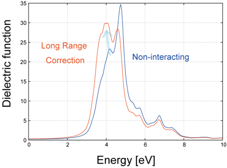
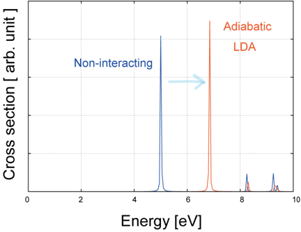

.. _uvsor_chapter:

誘電応答解析機能 UVSOR
-----------------------

はじめに
~~~~~~~~~~~

UVSORとは
^^^^^^^^^^^^

UVSOR(Universal Virtual Spectroscope for Optoelectronics Research)は第一原理擬ポテンシャル法に基づいて、物質の誘電・光学応答を原子レベルで計算する機能の総称です。２つのプログラムepsmainとtdlrmainが含まれます。またプログラムphaseおよびekcalにも誘電応答解析機能UVSORが含まれています。UVSORは、プログラムphaseでのSCF計算結果をもとに、物質の誘電関数を0Hz～紫外波長域の周波数で計算することができます。
誘電関数は、物質の電気的・光学的性質を決定する重要な物理量で、その測定はエレクトロニクス及び光学における主要な課題です。誘電関数は分光器を用いて測定することができますが、現実の分光器は測定周波数域が限られているので、実験的に誘電関数を決定するには、いろいろな種類の分光器を使い分けます。たとえば、エレクトロニクス分野で興味がある10\ :sup:`6` (Mega) 10\ :sup:`9` (Giga)Hz域での誘電関数を測定するには、その周波数域の電磁波を発生させるRF(Radio Frequency)発振器を使用します。また、光学において興味がある赤外、可視、紫外波長域における誘電関数を測定するには、それぞれの波長域専用の分光器を使用します。

しかし、発振器および分光器の調整はかならずしも容易ではなく、このことが誘電関数の測定を困難にしています。また、10\ :sup:`12` (Tera)Hz域の分光器は、現在良好に動作するものが存在しません。このため、この波長域での誘電関数測定は極めて困難であるのが現状です。

UVSORはこのような問題を解決する材料シミュレーション・ソフトウェアです。解析可能な波長域が、0Hz～紫外波長域の周波数と極めて広く、エレクトロニクス・光学の分野において興味あるほとんど全ての波長域における誘電関数を第一原理法に基づいて計算することができます。UVSORは、その名が示すように、一種の"万能仮想分光器"として作用し、電子・光学材料の開発に用いることができます。

\ :numref:`uvsor_fig1` は、物質の誘電関数（実部）の周波数依存性を模式的に示しています。

.. figure:: images/uvsor_image1.svg
 :name: uvsor_fig1

 誘電率の誘電分散

物質の誘電率は、近似的に、物質の電子状態に起因する電子誘電率と、格子振動状態に起因する格子系誘電率の和で与えられ、電磁波の周波数が格子振動の周波数よりも低い場合の10T(Tera)Hz以下のRF領域では、全誘電率は電子系及び格子系誘電率の和で与えられます。一方、電磁波の周波数が格子振動の周波数よりも高い場合の10THz以上の光学域では、電子系誘電率のみが全誘電率に寄与します。

誘電率計算には、電子系の応答を解析するUVSOR-Epsilonの計算体系と、格子系の応答を解析するUVSOR-Berry-Phononの計算体系があり、これらの計算体系に従えば、はそれぞれ電子系及び格子系誘電関数を計算することができます。これにより、静的～光学波長域（0Hz～紫外域）に及ぶ極めて広い周波数帯域での誘電関数を得ることができます。UVSORは、誘電関数、非線形光学感受率（2次及び3次）、ならびに電子・正孔の有効質量を計算することができます。UVSORは一種の仮想分光器として作用し、誘電体材料ならびに光学・レーザ材料の設計に用いることができます。誘電応答解析機能UVSORは、高速化・MPI並列化されています。

UVSORの特徴と機能
^^^^^^^^^^^^^^^^^^^^

UVSOR-Epsilon はプログラムPHASE
のSCF計算結果に基づき、電子バンド構造を計算し、電子系誘電関数の計算を行うプログラムである。その特徴は以下の通りである。

** UVSOR-Epsilon の特徴と機能 **

1. PHASE/EKCAL と入力ファイルを共用している

   入力は、PHASE/EKCAL の入力ファイルに誘電関数計算用の入力タグを追加した形式となっており、容易に計算を行うことができる。

2. PHASE の計算結果を利用して誘電関数を計算する

   PHASE計算により得られる電子密度より電子バンド構造を求め、電子系誘電関数を計算する。電子バンド 構造は、バンド数及びk 点数を任意に変えて誘電関数を計算でき、精度の高い誘電関数計算を行うことができる。

3. 複素誘電関数の計算

   乱雑位相近似（Random Phase Approximation）に基づき誘電関数の虚部を求め、虚部をクラマース・クロニッヒ変換することにより誘電関数の実部を計算している [Gunther72]_ 。

4. 全電子計算と同じ結果を得ることができる

   擬ポテンシャルが遷移モーメントに及ぼす効果 [Starace72]_ , [Read91]_ , [Kageshima97]_
   を補正することにより、全電子計算と同じ誘電関数

   を得ることができる。擬ポテンシャルは、CIAO
   を用いて作成したノルム保存Troullier-Martin(TM) 型ポテ
   ンシャル、及びノルム非保存ウルトラソフト型ポテンシャルを用いることができる。局所ポテンシャルは、TM型で計算された軌道ポテンシャル、BHS、多項式ポテンシャルを扱うことができる。

   遷移モーメント補正法は、Read and Needs(RN) 法 [Read91]_
   あるいはKageshima-Shiraishi(KS) 法 [Kageshima97]_ のいずれ

   かを選択できる。ノルム保存型擬ポテンシャルの場合はRN 法あるいはKS法を、ウルトラソフト型擬ポテンシャルの場合はKS 法を用いて補正を行う。

5. 半導体・絶縁体のほか、金属、磁性材料の取り扱いができる

   半導体・絶縁体のほか、金属、磁性材料に対応したリニアテトラへドロン法 [Lehmann72]_ 
   及びgaussian/parabolic smearing法を実装している。磁性材料の場合、各スピン状態の誘電関数への寄与を解析できる。金属の場

   合、ドルーデ項を考慮した計算を行うことが可能である。リニアテトラへドロン計算は、UVSOR
   1.00 の場合よりも約2倍高速化されている。

6. 光学スペクトルの計算

   誘電関数より光学スペクトル（屈折率、吸収係数、反射スペクトル）を計算できる。偏光は直線偏光及び非偏光を取り扱うことができる。

7. 2 次非線形光学感受率の計算

   第２高調波発生(Second Harmonic Generation(SHG)) 過程の2
   次非線形光学感受率­\ :math:`\chi^{(2)}( - 2\omega;\omega,\omega)`\ 及び

   第３高調波発生（Third Harmonic Generation(THG)）の3
   次非線形光学感受率\ :math:`\chi^{(3)}\left( - 3\omega;\omega,\omega,\omega \right)`\ ­の実部

   及び虚数を波長依存性を考慮して、全電子計算と同じ精度で計算できる。

8. 有効質量の計算

   電子及び正孔の有効質量を計算できる。計算にはkp 摂動法を用いている。

9. ユーテリティプログラム

   誘電関数、非線形光学感受率計算結果を取り扱うためのユーテリティプログラムを備えている。

10. 並列計算

   ソースコードはMPI 並列化されている。

**UVSOR-Berry-Phonon の特徴と機能**

1. PHASE/EKCAL に組み込まれている。

   入力は、PHASE/EKCAL の入力ファイルにBerry
   位相計算用および格子誘電率計算用の入力タグを追加し

   た形式となっており、容易に計算を行うことができる。

2. ボルン有効電荷の計算

   ベリー位相分極理論に基づき結晶の分極の変化を計算して、ボルン有効電荷を計算することができる。

3. 格子誘電率の計算

   振動解析の結果とボルン有効電荷から格子誘電率を自動的に計算できる。

4. 圧電定数の計算

   ベリー位相分極理論に基づき結晶の分極の変化を計算して、圧電定数のイオン固定項を計算することができ

   る。振動解析の結果とボルン有効電荷とひずみ-力結合定数から圧電定数の内部ひずみ項を自動的に計算で

   きる。

更新履歴
^^^^^^^^^^^^

2009 年6 月以降の更新履歴は下記の通り。

============== ==================================
バージョン3.20 PHASE ver 8.00 に対応

2009/06 公開
============== ==================================
バージョン3.21 PHASE ver 8.01 に対応

2010/03 公開
バージョン3.30 PHASE ver 9.00 に対応

2010/06 公開   DFT+U を利用した誘電関数計算に対応
バージョン3.40 PHASE ver 10.00 に対応

2011/06　公開
バージョン3.41 PHASE ver 10.01 に対応

2011/08 公開   TDDFT 計算機能の実装
バージョン3.42 PHASE ver 11.00 に対応

2012/06 公開   不具合の修正
2014/04 公開   PHASE /0 に統合
============== ==================================

パッケージの構成
^^^^^^^^^^^^^^^^^^^^

本プログラムは、プログラムパッケージPHASE/0に統合されている。

.. table::
 :widths: auto
 :class: longtable

 +--------------+--------------+--------------+--------+--------------+
 | ディレクトリ |              |              |        |              |
 +==============+==============+==============+========+==============+
 | ph\          | bin          | epsmain,     |        |              |
 | ase0_2021.01 |              | tdlrmain     |        |              |
 +--------------+--------------+--------------+--------+--------------+
 |              | sa\          |              |        | 本プログ     |
 |              | mples/uvsol/ |              |        | ラムの入力例 |
 +--------------+--------------+--------------+--------+--------------+
 |              |              | electron     | Si     | UVSOR-Eps\   |
 |              |              |              |        | ilonの入力例 |
 |              |              |              | Cu     |              |
 |              |              |              |        | Si           |
 |              |              |              | AlN    | 結晶の入力例 |
 |              |              |              |        |              |
 |              |              |              | NiO    | 銅の入力例   |
 |              |              |              |        |              |
 |              |              |              |        | 窒化アルミニ |
 |              |              |              |        | ウムの入力例 |
 |              |              |              |        |              |
 |              |              |              |        | D\           |
 |              |              |              |        | FT+U法を利用 |
 |              |              |              |        | して誘電関数 |
 |              |              |              |        | を計算する例 |
 +--------------+--------------+--------------+--------+--------------+
 |              |              | lattice      | GaAs   | UV\          |
 |              |              |              |        | SOR-Berry-Ph |
 |              |              |              | AlN    | ononの入力例 |
 |              |              |              |        |              |
 |              |              |              | Quartz | GaAs         |
 |              |              |              |        | 結晶の入力例 |
 |              |              |              |        |              |
 |              |              |              |        | 窒化アルミニ |
 |              |              |              |        | ウムの入力例 |
 |              |              |              |        |              |
 |              |              |              |        | 水晶の入力例 |
 +--------------+--------------+--------------+--------+--------------+
 |              |              | lr-tddft     | C6H6   | T\           |
 |              |              |              |        | DDFTの入力例 |
 |              |              |              | SiBulk |              |
 |              |              |              |        | C :sub:`6`   |
 |              |              |              |        | H :sub:`6`   |
 |              |              |              |        |              |
 |              |              |              |        | 分子の計算例 |
 |              |              |              |        |              |
 |              |              |              |        | Si           |
 |              |              |              |        | 結晶の計算例 |
 +--------------+--------------+--------------+--------+--------------+
 |              | util         | e\           |        |              |
 |              |              | ps_file.f90, |        |              |
 |              |              | nlo_file.f90 |        |              |
 +--------------+--------------+--------------+--------+--------------+

計算例題は、 :code:`samples/dielectric` 以下にあります。

\ :code:`samples/dielectric/electron` にはUVSOR-Epsilonの入力例、 :code:`samples/uvsor/lattice` にはUVSOR-Berry-Phononの入力例があります。TDDFTの入力例は :code:`samples/tddft` にあります。

\ :code:`samples/dielectric/electron` には、Si結晶の入力例、銅Cuの入力例、窒化アルミニウムAlNの入力例があります。NiOは、DFT+U法を利用して誘電関数を計算する例です。

各入力例ディレクトリ下位には、UVSOR-Epsilonの実行に必要な電子密度をphaseにより計算するためのディレクトリscf、およびUVSOR-Epsilonにより誘電関数計算を行うためのディレクトリeps、および擬ポテンシャルファイルを格納するディレクトリPPが存在する。
Si入力例ディレクトリ下位には、有効質量計算を行うためのディレクトリmass及び3次非線形光学感受率の計算を行うためのディレクトリchi3が存在する。AlN入力例ディレクトリ下位には、2次非線形光学感受率計算を行うためのディレクトリchi2_p及びchi2_tが存在する。chi2_pはparabolic
smearing計算用、chi2_tは、リニアテトラヘドロン計算用である。

\ :code:`samples/dielectric/lattice` には、GaAs結晶の入力例、窒化アルミニウムAlNの入力例、水晶Quartzの入力例がある。各入力例ディレクトリ下位には、ベリー位相を計算するためのディレクトリberry、および振動解析および格子誘電率計算を行うためのディレクトリphonon、および擬ポテンシャルファイルを格納するディレクトリPPが存在する。

\ :code:`samples/tddft/lr_C6H6` には、C\ :sub:`6`\ H\ :sub:`6`\ 分子の計算例、 :code:`samples/tddft/lr_bulkSi` にはSi結晶の計算例がある。

計算手法
~~~~~~~~~~~~~~

電子系
^^^^^^^^^^^^

** 計算手法 ** [Gunther72]_

電子系誘電率は、誘電体の電子が入射電磁波の電磁場と相互作用し、価電子帯から伝導帯に遷移することに起因する。電子系誘電率は、電磁波が引き起こす電子の遷移確率より求めることができる。本節では、以下電子の遷移確率を求め、電子系誘電率を計算する方法を説明する。

**遷移確率の計算**

電磁波と相互作用している誘電体結晶の１電子ハミルトニアンは :eq:`eq:uvsor1` 式で与えられる。

 .. math:: H = \frac{1}{2me}\left( \mathbf{p} + e\mathbf{A} \right)^{2} + V(\mathbf{r})
   :label: eq:uvsor1

:math:`m`\ は電子の質量、\ :math:`e`\ は電荷素量、\ :math:`\mathbf{p}`\ は運動量演算子、\ :math:`\mathbf{A}`\ は電磁波のベクトルポテンシャル、\ :math:`V(\mathbf{r})`\ は結晶のポテンシャルである。誘電体と電磁波の相互作用を表す１次の摂動ハミルトニアンは :eq:`eq:uvsor2` 式となる。

  .. math:: H_{\text{int}} = (e/m)\mathbf{A} \cdot \mathbf{p}
   :label: eq:uvsor2

電磁波が平面波である場合、ベクトルポテンシャルは次式で与えられる。

 .. math:: \mathbf{A} = A_{0}\mathbf{u}{\exp\ }\left\lbrack i\left( \mathbf{k} \cdot \mathbf{r} - \omega t \right) \right\rbrack
   :label: eq:uvsor3

ここで、\ :math:`\mathbf{u}`\ は電磁波の偏光ベクトル、\ :math:`\mathbf{k}`\ は波数ベクトル、\ :math:`\mathbf{r}`\ は位置ベクトル、\ :math:`\omega`\ は振動数、\ :math:`t`\ は時間である。

電磁波との相互作用により価電子帯の電子が時間\ :math:`t`\ の後に伝導帯の軌道に遷移する確率\ :math:`ｗ`\ は、次式で与えられる。

 .. math:: w(\omega,t,\mathbf{k}_{v},\mathbf{k}_{c})= \frac{e^{2}}{m^{2}\hbar^{2}}\left| \int_{0}^{t}dt^{'}\int_{V}^{}d\mathbf{r}\Psi_{v}(\mathbf{k}_{v},\mathbf{r},t^{'})\mathbf{A}(\mathbf{k},\mathbf{r},t^{'}) \cdot \mathbf{p}\Psi_{c}(\mathbf{k}_{c},\mathbf{r},t^{'}) \right|^{2}
   :label: eq:uvsor4

:math:`\Psi_{v}`\ は誘電体の価電子帯電子の軌道、\ :math:`\mathbf{k}_{v}`\ は\ :math:`\Psi_{c}`\ の波数ベクトル、\ :math:`\Psi_{c}`\ は伝導帯の軌道、\ :math:`\mathbf{k}_{c}`\ は\ :math:`\Psi_{c}`\ の波数ベクトルである。インデックス\ :math:`c`\ 及び\ :math:`v`\ はスピンインデックスを含む。\ :math:`\Psi_{v}`\ 及び\ :math:`\Psi_{c}`\ は同じスピンを有する軌道である。\ :math:`\Psi_{v}`\ 及び\ :math:`\Psi_{c}`\ は以下のように書き表すことができる。

 .. math:: \Psi_{v}(\mathbf{k}_{v},\mathbf{r},t^{'}) = {\exp\ }\left\lbrack –\frac{i}{\hbar}E_{v}\left( \mathbf{k}_{v}t^{'} \right) \right\rbrack{\exp\ }(i\mathbf{k}_{v} \cdot \mathbf{r})u_{v}(\mathbf{k}_{v},r)
   :label: eq:uvsor5

 .. math:: \Psi_{c}(\mathbf{k}_{c},\mathbf{r},t^{'}) = {\exp\ }\left\lbrack - \frac{i}{\hbar}E_{c}(\mathbf{k}_{c}t^{'}) \right\rbrack{\exp\ }(i\mathbf{k}_{c} \cdot \mathbf{r})u_{c}(\mathbf{k}_{c},r)
   :label: eq:uvsor5p

\ :eq:`eq:uvsor5` 及び :eq:`eq:uvsor5p` 式を :eq:`eq:uvsor4` 式に代入し、\ :math:`t^{'}`\ に関して部分積分を行うことにより、次式を得る。

 .. math:: w(\omega,t,\mathbf{k}_{v},\mathbf{k}_{c}) = \frac{e^{2}E_{0}^{2}}{m^{2}\omega_{\text{cv}}^{2}}\left| \int_{0}^{t}dt^{'}{\exp\ }\left\lbrack i\hbar^{- 1}(E_{c}(\mathbf{k}_{c}) - E_{v}(\mathbf{k}_{v}) - \hbar\omega)t^{'} \right\rbrack\mathbf{u} \cdot \mathbf{M}_{\text{vc}} \right|^{2}
   :label: eq:uvsor6

ここで、\ :math:`\mathbf{E} = - \partial\mathbf{A}/\partial t = E_{0}\mathbf{u}{\exp\ }\left\lbrack i\left( \mathbf{k} \cdot \mathbf{r} - \omega t \right) \right\rbrack`\ 及び\ :math:`\mathbf{p} = \frac{\hbar}{i}\nabla`\ の関係式を用いた。\ :math:`\omega_{c,v}`\ 及び\ :math:`\mathbf{u} \cdot \mathbf{M}_{\text{vc}}`\ は、それぞれ :eq:`eq:uvsor7` 及び :eq:`eq:uvsor7p` 式で計算される量である。

 .. math:: \omega_{c,v} = \frac{1}{\hbar}\left( E_{c}\left( \mathbf{k}_{c} \right) - E_{v}\left( \mathbf{k}_{v} \right) \right) 
   :label: eq:uvsor7

 .. math:: \mathbf{u} \cdot M_{\text{vc}} = \int_{V}^{}d\mathbf{r}{\exp\ }\left\lbrack - (\mathbf{k}_{c} - \mathbf{k} \cdot \mathbf{r} \right\rbrack u_{c}^{*}\mathbf{u} \cdot \nabla{\exp\ }(i\mathbf{k}_{v} \cdot \mathbf{r})u_{v}
   :label: eq:uvsor7p

:math:`\nabla`\ は :eq:`eq:uvsor8` 式で表される微分演算子である。

 .. math:: \nabla = \mathbf{i}\frac{\partial}{\partial x} + \mathbf{j}\frac{\partial}{\partial y} + \mathbf{k}\frac{\partial}{\partial z}
   :label: eq:uvsor8

:math:`\mathbf{i}`,
:math:`\mathbf{j}`,\ :math:`\mathbf{k}`\ はそれぞれ、\ :math:`x`,
:math:`y`, :math:`z`\ 方向の単位ベクトルである。
\ :eq:`eq:uvsor6` 式を積分することにより次式を得る。

 .. math:: w\left( \omega,t,\mathbf{k}_{v},\mathbf{k}_{c} \right) = \frac{e^{2}E_{0}^{2}}{m^{2}\omega_{\text{cv}}^{2}}\left| \frac{\text{exp}\left\lbrack \frac{i\left( E_{c} - E_{v} - \hbar\omega \right)t}{\hbar} \right\rbrack- 1}{\frac{i\left( E_{c} - E_{v} - \hbar\omega \right)t}{\hbar}}\mathbf{u} \cdot \mathbf{M}_{\text{vc}} \right|^{2}
   :label: eq:uvsor9

\ :eq:`eq:uvsor9` 式の両辺を\ :math:`t`\ で微分することにより、次式を得る。

 .. math:: \frac{\partial w}{\partial t} = \frac{e^{2}E_{0}^{2}}{m^{2}\omega_{\text{cv}}^{2}}\left| \mathbf{u} \cdot \mathbf{M}_{\text{vc}} \right|^{2}2\pi \hbar\delta(E_{c} - E_{v} - \hbar\omega)
   :label: eq:uvsor10

\ :eq:`eq:uvsor10` 式は、単位時間あたりに電子が\ :math:`\Psi_{v}`\ から\ :math:`\Psi_{c}`\ へ遷移する確率を与える。単位体積あたりの全電子遷移確率\ :math:`W_{\text{vc}}`\ は、次式により得られる。

 .. math:: W_{\text{vc}} = \frac{e^{2}E_{0}^{2}}{m^{2}V}\sum_{\mathbf{k},c,v}^{}\frac{\left| \mathbf{u} \cdot \mathbf{M}_{\text{vc}} \right|^{2}}{\omega_{\text{cv}}^{2}}2\pi \hbar\delta(E_{c} - E_{v} - \hbar\omega)
   :label: eq:uvsor11

ここで\ :math:`V`\ は誘電体の体積であり、\ :math:`\Sigma`\ は全ての\ :math:`\mathbf{k}`,
価電子・伝導帯軌道の組み合わせについて和をとることを意味する。

**電子系誘電率の計算**

誘電体に入射された電磁波は、誘電体の電子遷移を引き起こし、エネルギーを失う。そのエネルギー損失量は\ :math:`W_{\text{vc}}\hbar\omega`\ である。一方、マックスウェルの理論では、その損失量は\ :math:`\sigma\mathbf{E}_{0}^{2}`\ となる。\ :math:`\sigma`\ は誘電体のオプティカルコンダクティビティである。従って、

  .. math:: W_{\text{vc}}\hbar\omega = \sigma\mathbf{E}_{0}^{2}/2
   :label: eq:uvsor12

一方、\ :math:`\sigma`\ と電子系誘電率の虚部\ :math:`\epsilon_{2}`\ の間には次の関係式がある。

  .. math:: \epsilon_{2} = 4\pi\sigma/\omega
   :label: eq:uvsor13

\ :eq:`eq:uvsor12` 及び :eq:`eq:uvsor13` 式より\ :math:`\epsilon_{2}`\ の計算式を得る。

 .. math:: \epsilon_{2} = \frac{8\pi e^{2}\hbar^{2}}{m^{2}V}\sum_{\mathbf{k},c,v}^{}\frac{\left| \mathbf{u} \cdot \mathbf{M}_{\text{vc}} \right|^{2}}{\omega_{\text{cv}}^{2}}\delta\left( E_{c}\left( \mathbf{k}_{c} \right)- E_{v}\left( \mathbf{k}_{v} \right) - \hbar\omega \right)

 .. math:: = \frac{8\pi e^{2}\hbar^{4}}{m^{2}V}\sum_{\mathbf{k},c,v}^{}\frac{\left| \mathbf{u} \cdot \mathbf{M}_{\text{vc}} \right|^{2}}{(E_{c}(\mathbf{k}_{c}) - E_{v}(\mathbf{k}_{v}))^{2}}\delta(E_{c}(\mathbf{k}_{c}) - E_{v}(\mathbf{k}_{v}) - \hbar\omega)
   :label: eq:uvsor14

\ :eq:`eq:uvsor14` 式の計算を導入するために近似を導入する。電磁波の波長は、誘電体結晶のユニットセルの大きさよりもはるかに長い。従って、\ :math:`\mathbf{k}_{c},\mathbf{k}_{v} > > \mathbf{k}`\ であるので、以下のように近似できる。

 .. math:: \mathbf{u} \cdot \mathbf{M}_{\text{vc}} \cong \int_{V}^{}d\mathbf{r}{\exp\ }\left( - \mathbf{k}_{c} \cdot \mathbf{r} \right)u_{c}^{*}\mathbf{u} \cdot \nabla{\exp\ }(i\mathbf{k}_{v} \cdot \mathbf{r})u_{v}
   :label: eq:uvsor15

運動量演算子\ :math:`\mathbf{p}`\ を使うと

 .. math:: \mathbf{u} \cdot \mathbf{M}_{\text{vc}} \cong \frac{i}{\hbar}\left\langle \Psi_{c}\left( \mathbf{k}_{c} \right)\left| \mathbf{u} \cdot \mathbf{p} \right|\Psi_{v}\left( \mathbf{k}_{v} \right) \right\rangle

 .. math:: = \frac{i}{\hbar}\left\langle \Psi_{c}(\mathbf{k}_{a})|\mathbf{u}\cdot \mathbf{p}|\Psi_{v}(\mathbf{k}_{a}) \right\rangle
   :label: eq:uvsor17

となる。\ :math:`\mathbf{k}_{c} = \mathbf{k}_{v} = \mathbf{k}_{a}`\ である。\ :math:`\left\langle \Psi_{c}(\mathbf{k}_{c})|\mathbf{u} \cdot \mathbf{p}|\Psi_{v}(\mathbf{k}_{v}) \right\rangle`\ の値は、\ :math:`\mathbf{k}_{c} = \mathbf{k}_{v}`\ の場合のみ零でない。\ :eq:`eq:uvsor14` 式及び :eq:`eq:uvsor17` 式より、\ :math:`\mathbf{p}`\ 表示の\ :math:`\epsilon_{2}`\ 計算式が得られる。

 .. math:: \epsilon_{2} = \frac{8\pi e^{2}\hbar^{2}}{\text{me}^{2}V}\sum_{\mathbf{k}_{a},c,v}^{}\frac{\left| < \Psi_{c}(\mathbf{k}_{a})|\mathbf{u} \cdot \mathbf{p}|\Psi_{v}(\mathbf{k}_{a}) > \right|^{2}}{(E_{c}(\mathbf{k}_{a}) - E_{v}(\mathbf{k}_{a}))}\delta(E_{c}(\mathbf{k}_{a}) - E_{v}(\mathbf{k}_{a}) - \hbar\omega
   :label: eq:uvsor18

速度演算子\ :math:`\mathbf{v} = \mathbf{p}/m`\ を用いると、\ **v**\ 表示の計算式 [Adolf97]_ が得られる。

 .. math:: \epsilon_{2} = \frac{8\pi e^{2}\hbar^{2}}{V}\sum_{\mathbf{k}_{a},c,v}^{}\frac{\left| < \Psi_{c}(\mathbf{k}_{a})|\mathbf{u} \cdot \mathbf{v}|\Psi_{v}(\mathbf{k}_{a}) > \right|^{2}}{(E_{c}(\mathbf{k}_{a}) - E_{v}(\mathbf{k}_{a}))}\delta(E_{c}(\mathbf{k}_{a}) - E_{v}(\mathbf{k}_{a}) - \hbar\omega
   :label: eq:uvsor19

遷移モーメントには、次の関係式が成り立つ。

 .. math:: < \Psi_{c}(\mathbf{k}_{a})|\mathbf{p}|\Psi_{v}(\mathbf{k}_{a}) > = \frac{\text{im}}{\hbar}( _{c}(\mathbf{k}_{a}) - E_{v}(\mathbf{k}_{a})) < \Psi_{c }(\mathbf{k}_{a})|\mathbf{r}|\Psi_{v}(\mathbf{k}_{a}) >
   :label: eq:uvsor20

\ :eq:`eq:uvsor18` 及び :eq:`eq:uvsor20` 式よりr位置演算子r表示の計算式を得る。

 .. math:: \epsilon_{2} = \frac{8\pi e^{2}}{V}\sum_{\mathbf{k}_{a},c,v}^{}\left| < \Psi_{c}(\mathbf{k}_{a})|\mathbf{u} \cdot \mathbf{r}|\Psi_{v}(\mathbf{k}_{a}) > \right|^{2}\delta(E_{c}(\mathbf{k}_{a}) - E_{v}(\mathbf{k}_{a}) - \hbar\omega
   :label: eq:uvsor21

比誘電率は、得られた\ :math:`\epsilon_{2}`\ を真空の誘電率\ :math:`\epsilon_{0}`\ で割ることにより得られる。電子系誘電率の実部\ :math:`\epsilon_{1}`\ は\ :math:`\epsilon_{2}`\ のクラマース・クロニッヒ変換（ :eq:`eq:uvsor22` 式）により計算される。Pはコーシーの主値を取ることを意味する

 .. math:: \epsilon_{1}(\omega) = 1 + \frac{2}{\pi}P\int_{0}^{\infty}\frac{\Omega\epsilon_{2}(\Omega)}{\Omega^{2} - \omega^{2}}d\Omega
   :label: eq:uvsor22

本プログラムは :eq:`eq:uvsor21` 式により\ :math:`\epsilon_{2}`\ を求め、\ :eq:`eq:uvsor22` 式により\ :math:`\epsilon_{1}`\ を計算する。

**光学スペクトルの計算法**

電子系誘電率\ :math:`\epsilon = \epsilon_{1} + i\epsilon_{2}`\ より、以下の光学スペクトルを計算することができる。

-  複素屈折率 :math:`N = n + ik`: N = :math:`\epsilon^{1/2}`

-  吸収係数\ :math:`\eta`: :math:`\eta = \frac{2k\omega}{c}`

-  反射スペクトル :math:`R`:
   :math:`R = \frac{(n - 1)^{2} + k^{2}}{(n + 1)^{2} + k^{2}}`

**第一原理法による計算法**

電子系誘電率には、遷移モーメント\ :math:`< \Psi_{c}|\mathbf{r}|\Psi_{v} >`\ を計算することが必要である。本節では第一原理擬ポテンシャル法による遷移モーメントの計算法について説明する。第１原理擬ポテンシャル法では、内殻電子が価電子に及ぼす効果を擬ポテンシャルに置き換え、価電子のみを扱うことにより電子状態を計算する。擬ポテンシャル法での誘電体の１電子ハミルトニアンは次式で与えられる。

 .. math:: H = \frac{1}{2m}\mathbf{p}^{2} + V(\mathbf{r},\mathbf{p})
   :label: eq:uvsor23

:math:`V`\ は結晶のポテンシャルである。擬ポテンシャル法では、電子の運動量\ :math:`\mathbf{p}`\ に依存するノンローカルポテンシャルを用いる。電磁波と相互作用する誘電体の１電子ハミルトニアンは、次式で与えられる。

 .. math:: H = \frac{1}{2m}(\mathbf{p + eA})^{\mathbf{2}}\mathbf{+ V(r,p + eA)}
   :label: eq:uvsor24

摂動ハミルトニアン\ :math:`H_{\text{int}}`\ は :eq:`eq:uvsor25` 式である。

 .. math:: H_{\text{int}} = (e/m)\mathbf{A} \cdot \mathbf{p} + ppc
   :label: eq:uvsor25

\ :eq:`eq:uvsor25` 式の右辺第１項は、\ :eq:`eq:uvsor2` 式の摂動ハミルトニアンである。第２項（ppc項）は\ :math:`V`\ に由来する摂動ハミルトニアンである。第一原理法で遷移モーメントを計算する場合、ppc項を考慮して計算を行う必要がある。第１項に起因する遷移モーメント成分をローカル項、ppc項に起因する成分をノンローカル項あるいはppc項と呼ぶことにする。ppc項を計算する方法としては、Read
and Needの方法(RN法) [Read91]_ とKageshima and
Shiraishiの方法(KS法) [Kageshima97]_ がある。本プログラムはこれらの方法を用いてppc項を計算できるようになっている。

.. _uvsor_read_and_needs_section:

**Read and Needs 法**

** 理論 ** [Starace72]_  [Adolf97]_

RN法はノルム保存型擬ポテンシャルに対する補正項を計算する方法である。電磁場が\ :math:`\mathbf{p}`\ に及ぼす影響が小さいと仮定して、\ :eq:`eq:uvsor24` 式の\ :math:`V(\mathbf{r},\mathbf{p} + e\mathbf{A})`\ を次のように展開する。

 .. math:: V(\mathbf{r},\mathbf{p} + e\mathbf{A}) = V(\mathbf{r},\mathbf{p}) + \frac{\partial V}{\partial\mathbf{p}}e\mathbf{A}
   :label: eq:uvsor26

:math:`\frac{\partial V}{\partial\mathbf{p}}`\ を求めるため、\ :math:`\text{Vϕ}`\ を\ :math:`\mathbf{p}`\ で微分する。\ :math:`\phi`\ は任意の関数である。

 .. math:: \frac{\partial}{\partial\mathbf{p}}V\phi = \frac{\partial V}{\partial\mathbf{p}}\phi + V\frac{\partial\phi}{\partial\mathbf{p}}
   :label: eq:uvsor27

ゆえに、

 .. math:: \frac{\partial V}{\partial\mathbf{p}} = \frac{\partial}{\partial\mathbf{p}}V + V\frac{\partial}{\partial\mathbf{p}}
   :label: eq:uvsor28

ここで、\ :math:`i\hbar\frac{\partial}{\partial\mathbf{p}} = \mathbf{r}`\ と定義する。定義された\ :math:`\mathbf{r}`\ は交換関係\ :math:`\lbrack\mathbf{p}_{\alpha},\mathbf{r}_{\beta}\rbrack = - ih\delta_{\text{αβ}}`\ を満たす。\ :math:`\alpha,\beta`\ は座標インデックス\ :math:`(x,y,z)`\ である。この定義を用いて :eq:`eq:uvsor28` 式を書き直すと次式を得る。

 .. math:: \frac{\partial V}{\partial\mathbf{p}} = \frac{\partial}{\partial\mathbf{p}}V +V\frac{\partial}{\partial\mathbf{p}} = \frac{1}{i\hbar}\lbrack\mathbf{r},V\rbrack = \frac{i}{\hbar}\lbrack V,r\rbrack
   :label: eq:uvsor29

\ :eq:`eq:uvsor26` 及び :eq:`eq:uvsor29` 式を用いて補正項を計算すると、以下の式を得る。

 .. math:: ppc = \frac{i}{\hbar}\lbrack V,r\rbrack e\mathbf{A}
   :label: eq:uvsor30

従って、摂動ハミルトニアンは、

 .. math:: H_{\text{int}} = (e/m)\mathbf{A} \cdot \mathbf{p} + \frac{i}{\hbar}\lbrack V,\mathbf{r}\rbrack e\mathbf{A} = (e/m)\mathbf{A} \cdot (\mathbf{p} + \frac{\text{im}}{\hbar}\lbrack V,\mathbf{r}\rbrack
   :label: eq:uvsor31

となる。対応する\ :math:`\epsilon_{2}`\ の計算式は、\ :eq:`eq:uvsor18` 式において\ :math:`\mathbf{p} \rightarrow \mathbf{p} + \frac{\text{im}}{\hbar}\lbrack V,\mathbf{r}\rbrack`\ と置き換えることにより得られる。

 .. math:: \epsilon_{2} = \frac{8\pi e^{2}\hbar^{2}}{m^{2}V}\sum_{\mathbf{k}_{a},c,v}^{}\frac{\left| < \Psi(\mathbf{k}_{a})|\mathbf{u} \cdot (\mathbf{p} + \frac{\text{im}}{\hbar}\lbrack \mathbf{r}\rbrack)|\Psi(\mathbf{k}_{a}) > \right|^{2}}{E_{c}(\mathbf{k}_{a}) - E_{v}(\mathbf{k}_{a})}\delta(E_{c}(\mathbf{k}_{a}) - E_{v}(\mathbf{k}_{a}) - \hbar\omega
   :label: eq:uvsor32

r表示の計算式は、\ :eq:`eq:uvsor21` 式において、

 .. math:: <\Psi_{c}(\mathbf{k}_{a})|\mathbf{r}|\Psi_{v}(\mathbf{k}_{a}) > = \frac{1}{i\omega_{\text{cv}}m} < \Psi_{c}(\mathbf{k}_{a})|\mathbf{p}|\Psi_{v}(\mathbf{k}_{a}) > + \frac{1}{\hbar\omega_{\text{cv}}} < \Psi_{c}(\mathbf{k}_{a}|\lbrack V,\mathbf{r}\rbrack|\Psi_{v}(\mathbf{k}_{a}) >
   :label: eq:uvsor33

とすることにより得られる。\ :math:`\omega_{\text{cv}}`\ は次式で定義される量である。

 .. math:: \omega_{\text{cv}} = \frac{1}{\hbar}\left( E_{c}(\mathbf{k}_{a}) - E_{v}(\mathbf{k}_{a}) \right)
   :label: eq:uvsor34

本プログラムでは、\ :eq:`eq:uvsor21` 及び :eq:`eq:uvsor32` 式を用いて電子状態を計算する。\ :eq:`eq:uvsor33` 式の右辺第１項をローカル項、第２項をノンローカル項あるいはppc項と呼ぶ。

**計算法**

ローカル項は、\ :math:`\Psi_{c}`\ 及び\ :math:`\Psi_{v}`\ より直接計算できる。

 .. math:: \frac{1}{i\omega_{\text{cv}}m} < \Psi_{c}(\mathbf{k}_{a})|\mathbf{p}|\Psi_{v}(\mathbf{k}_{a}) > = \frac{1}{i\omega_{\text{cv}}m} < \Psi_{c}(\mathbf{k}_{a})|\frac{\hbar}{i}\nabla|\Psi_{v}(\mathbf{k}_{a}) 
   :label: eq:uvsor35

 .. math:: \Psi_{c}(\mathbf{k}_{a},r) = \frac{1}{\sqrt{V_{u}}}\sum_{\mathbf{G}}^{}\phi_{c,\mathbf{k}_{a} + \mathbf{G}}{\exp\ }(i(\mathbf{k}_{a} + \mathbf{G}) \cdot \mathbf{r})
   :label: eq:uvsor36

 .. math:: \Psi_{v}(\mathbf{k}_{a},r) = \frac{1}{\sqrt{V_{u}}}\sum_{\mathbf{G}}^{}\phi_{v,\mathbf{k}_{a} + \mathbf{G}}{\exp\ }(i(\mathbf{k}_{a} + \mathbf{G}) \cdot \mathbf{r})
   :label: eq:uvsor37

ここで、\ :math:`V_{u}`\ は結晶ユニットセルの体積、\ :math:`\mathbf{G}`\ は平面波基底のGベクトル、\ :math:`\phi`\ は展開係数である。\ :eq:`eq:uvsor36` 及び :eq:`eq:uvsor37` 式を :eq:`eq:uvsor33` に代入し、平面波の直交条件を用いるとローカル項の計算式を得る（ :eq:`eq:uvsor38` 式）。本プログラムは誘電体の電子バンド構造計算の結果得られる\ :math:`\Psi_{c}`\ 及び\ :math:`\Psi_{v}`\ よりローカル項を計算する。

 .. math:: \frac{1}{i\omega_{\text{cv}}m} <\Psi_{c}(\mathbf{k}_{a})|\mathbf{p}|\Psi_{v}(\mathbf{k}_{a}) > = \frac{\hbar}{i\omega_{\text{cv}}m}\sum_{\mathbf{}}^{}\phi_{c,\mathbf{k}_{a} + \mathbf{G}}^{*}\phi_{v,\mathbf{k}_{a} + \mathbf{G}}(\mathbf{k}_{a} + \mathbf{G})
   :label: eq:uvsor38

ノンローカル項の計算は、交換関係\ :math:`\lbrack V_{\text{nl}},\mathbf{r}\rbrack`\ を評価することにより行う。擬ポテンシャルのノンローカル部分は :eq:`eq:uvsor39` 式のようにあらわすことができる。

.. math:: V_{\text{nl}} = \sum_{\text{nmI}}^{}|n,I > D_{\text{nm}}^{I} < m,I|
   :label: eq:uvsor39

:math:`|n,I >`\ 及び\ :math:`< m,I|`\ は擬ポテンシャルのノンローカルプロジェクター、\ :math:`D`\ は係数、\ :math:`I`\ は原子のインデックスである。ノンローカル項は次式によりあらわされる。\ :math:`\Psi_{c}`\ 及び\ :math:`\Psi_{v}`\ の波数ベクトル\ :math:`\mathbf{k}_{a}`\ は省略してある。

.. math:: \frac{1}{\hbar \omega_{cv}} \Braket{\Psi_c | \left[V, \mathbf{r}\right] | \Psi_v} = \frac{1}{\hbar \omega_{cv}} \sum_{nlI} \Braket{\Psi_c | n,I} D_{nm}^I \Braket{l,I | \mathbf{r} | \Psi_v}
  :label: eq:uvsor40

.. math:: - \frac{1}{\hbar\omega_{\text{cv}}}\sum_{\text{nmI}}^{} < \Psi{c}|\mathbf{r}|n,I > D_{\text{nl}}^{I} < l,I|\Psi_{v} >
  :label: eq:uvsor41

本プログラムは、Pickard and
Payneの方法 [Pickard00]_ ( :eq:`eq:uvsor42` 式）により\ :math:`< n,I|\mathbf{r}|\Psi >`\ を計算し、ノンローカル項を計算する。\ :math:`\omega_{\text{cv}}, < l,I|\Psi >`\ は電子バンド構造計算により得られる値を用いる。

.. math:: < n,I\left| \mathbf{r}_{\alpha}\right|\Psi \geq \frac{1}{2i\left| \mathbf{q} \right|}\left\lbrack < n,I\left| e^{i\mathbf{q}_{\alpha} \cdot \mathbf{r}} \right|\Psi > - < n,I\left| e^{- i\mathbf{q}_{\alpha} \cdot \mathbf{r}} \right|\Psi > \right\rbrack
  :label: eq:uvsor42

:math:`\alpha`\ はカーテシアンインデックス\ :math:`( = x,y,z)`\ であり、\ :math:`\mathbf{q}_{\alpha}`\ は次式で定義されるベクトルである。

.. math:: \mathbf{q}_{x} = (q,0,0);\mathbf{q}_{y} = (0,q,0);\mathbf{q}_{z} = (0,0,q)
  :label: eq:uvsor43

:math:`q`\ はパラメータであり、微小な数である。

.. _uvsor_kageshima_and_siraisi_section:

** Kageshima and Siraishi 法 **

** 理論 ** [Read91]_

KS法における遷移モーメントは :eq:`eq:uvsor44` 式で与えられる。

 .. math:: \Braket{\varphi_c\left(\mathbf{k}_{\alpha} \right) | \mathbf{r} | \varphi_v \left(\mathbf{k}_{\alpha}\right)} = \frac{1}{i\omega_{cv} m} \Braket{\varphi_c\left(\mathbf{k}_{\alpha}\right) | \mathbf{p} | \varphi_v \left(\mathbf{k}_{\alpha}\right)} + \frac{1}{i\hbar \omega_{cv}} \sum_{nlI} \Braket{\varphi_c | n,I} \mathbf{p}_{nl}^I \Braket{l,I | \varphi_v}
  :label: eq:uvsor44

右辺の第一項はローカル項である。右辺の第二項がppc項である。\ :math:`\mathbf{p}_{\text{nl}}^{I}`\ は次式で定義される量である。

 .. math:: \mathbf{p}_{\text{nl}}^{I} = < \phi_{n}^{I}|\mathbf{p}|\phi_{n}^{I} > - < \psi_{l}^{I}|\mathbf{p}|\psi_{l}^{I} >
  :label: eq:uvsor45

:math:`\phi^{I}`\ は全電子計算により得られる原子\ :math:`I`\ の軌道、\ :math:`\psi^{I}`\ は擬原子\ :math:`I`\ の軌道、\ :math:`\text{nl}`\ は軌道インデックスである。

**計算法**

本プログラムは、擬ポテンシャル計算プログラムCIAOの出力する\ :math:`\mathbf{p}_{\text{nl}}^{I}`\ を読み込み :eq:`eq:uvsor44` 式のppc項を計算する。\ :math:`\omega_{\text{cv}}, < n,I|\varphi >`\ は電子バンド計算により得られた値を用いる。

**電子系誘電率**

電子系誘電率の計算式（ :eq:`eq:uvsor21` 式）は波数ベクトル\ :math:`\mathbf{k}_{a}`\ に関する和を含む。本プログラムは\ :math:`\mathbf{k}_{a}`\ に関する和を積分に置き換え、\ :math:`\epsilon_{2}`\ を求める（ :eq:`eq:uvsor46` 式）。

 .. math:: \epsilon_{2} = \frac{e^{2}}{\pi^{2}}\sum_{c,v}^{}{\int_{}^{}\left|< \Psi(\mathbf{k}_{a})|\mathbf{u} \cdot \mathbf{r}|\Psi(\mathbf{k}_{a}) > \right|^{2}}\delta(E_{c}(\mathbf{k}_{a}) - E_{v}(\mathbf{k}_{a}) - \hbar\omega)d\mathbf{k}_{a}
  :label: eq:uvsor46

積分は、Linear Tetrahedron法を用いて行う。Linear Tetrahedronの詳細については [Lehmann72]_ を参照されたい。\ :math:`\epsilon_{2}`\ をクラマース・クロニッヒ変換（ :eq:`eq:uvsor22` 式）することにより\ :math:`\epsilon_{1}`\ を得る。クラマース・クロニッヒ変換は :eq:`eq:uvsor22` 式を台形公式を用いて数値積分することにより求める。

**非線形光学感受率**

材料の分極を\ :math:`P`\ 、外部電場を\ :math:`F`\ とした場合、一般に\ :math:`P`\ は\ :math:`F`\ の多項式であらわすことができる( :eq:`eq:uvsor47` 式)。通常の誘電応答は、\ :math:`F`\ に関する2次以上の高次項を無視し、\ :math:`P`\ は\ :math:`F`\ の１次関数であると近似して記述できる。しかし、レーザ光のように電場強度が強い電磁波を材料に照射した場合、高次項の\ :math:`P`\ に関する寄与が無視できなくなり、高次項に起因する誘電・光学現象を顕著となる。高次項に起因する誘電・光学現象が非線形光学効果(nonlinear optical effect)である [Shen03]_ 。

 .. math:: P_{i} = \sum_{j}^{}\chi_{\text{ij}}^{(1)}F_{j} + \sum_{\text{jk}}^{}\chi_{\text{ijk}}^{(2)}F_{j}F_{k} + \sum_{\text{jkl}}^{}\chi_{\text{ijkl}}^{(3)}F_{j}F_{k}F_{l}
  :label: eq:uvsor47

ここで、\ :math:`i,j,k,l`\ はXYZ座標のインデックス、\ :math:`\chi^{(1)}`\ は線形感受率テンソル、\ :math:`\chi^{(2)}`\ 及び\ :math:`\chi^{(3)}`\ は、それぞれ3階及び4階の非線形光学テンソルである。\ :math:`\chi^{(2)}`\ に起因する現象を2次非線形光学効果、\ :math:`\chi^{(3)}`\ に起因する現象を3次非線形光学効果と呼ぶ。材料の\ :math:`\chi^{(2)}`\ 及び\ :math:`\chi^{(3)}`\ は、誘電率同様、電子系及び格子系からの成分からなり、入射光の振動数が材料の格子振動数よりも低い場合には電子系と格子系が、光振動数が格子振動数よりも高い場合には電子系のみが実測値に寄与する。レーザ光の振動数は、格子振動数よりも高いため、非線形光学では電子系の\ :math:`\chi^{(2)}`\ 及び\ :math:`\chi^{(3)}`\ が興味の対象である。

UVSORは、第２高調波発生（Second Harmonic Generation (SHG)）及び第3高周波発生（Third Harmonic Generation(THG)）の感受率を計算する。SHGは、材料に入射されたフォトンが2個結合し、周波数が倍の光が発生する2次非線形光学効果である。その感受率\ :math:`\chi^{(2)}( - 2\omega;\omega,\omega)`\ は複素数であり( :eq:`eq:uvsor48` 式)、電場を摂動ハミルトニアンとする3次の時間依存摂動法を用いて、固体の電子バンド構造より計算できる。

 .. math:: \chi^{(2)}( - 2\omega;\omega,\omega) = {\chi^{(2)}}^{'}( - 2\omega;\omega,\omega) + i{\chi^{(2)}}^{''}( - 2\omega;\omega,\omega)
  :label: eq:uvsor48

摂動計算では、価電子の伝導バンドへの仮想励起と伝導帯ホールと価電子バンドへの仮想励起を考える。電子及び正孔の仮想励起を :numref:`uvsor_fig2` に模式的に示す。

.. figure:: images/uvsor_image2.svg
 :name: uvsor_fig2

 SHG過程における電子と正孔の仮想励起

\ :math:`{\chi^{\left( 2 \right)}}^{''}\left( - 2\omega;\omega,\omega \right)`\ は電子励起による\ :math:`{\chi_{\text{VE}}^{(2)}}^{''}( - 2\omega;\omega,\omega)`\ と正孔励起による\ :math:`{\chi_{\text{VH}}^{(2)}}^{''}( - 2\omega;\omega,\omega)`\ の和で与えられ( :eq:`eq:uvsor49` 式)、\ :math:`{\chi_{\text{VE}}^{(2)}}^{''}( - 2\omega;\omega,\omega)`\ と\ :math:`{\chi_{\text{VH}}^{(2)}}^{''}( - 2\omega;\omega,\omega)`\ はそれぞれ :eq:`eq:uvsor51` 及び :eq:`eq:uvsor53` 式により計算される [Ghahmani91]_ 。

 .. math:: {\chi^{(2)}}^{''}( - 2\omega;\omega,\omega) = {\chi_{\text{VE}}^{(2)}}^{''}( - 2\omega;\omega,\omega) +{\chi_{\text{VH}}^{(2)}}^{''}( - 2\omega;\omega,\omega)
  :label: eq:uvsor49

 .. math:: {\chi_{\text{VE}}^{\left( 2 \right)}}^{''}\left( - 2\omega;\omega,\omega \right) = - \frac{\pi}{2}\left| \frac{e\hbar}{m} \right|\sum_{i,j,l}^{}{\int_{\text{BZ}}^{}\frac{d\mathbf{k}}{4\pi^{3}}}\left( \frac{\mathfrak{I}\left\lbrack \mathbf{p}_{\text{jl}}^{\text{cc}}\left\{ \mathbf{p}_{\text{lj}}^{\text{cv}}\mathbf{p}_{\text{ij}}^{\text{vc}} \right\} \right\rbrack}{E_{\text{li}}^{3}\left( E_{\text{li}} + E_{\text{ji}} \right)}\delta\left( E_{\text{li}} - \hbar\omega \right) \right.

 .. math:: \left. \  - \frac{\mathfrak{I\lbrack}\mathbf{p}_{\text{ij}}^{\text{vc}}\{\mathbf{p}_{\text{jl}}^{\text{cc}}\mathbf{p}_{\text{li}}^{\text{cv}}\}\rbrack}{E_{\text{li}}^{3}(2E_{\text{li}} - E_{\text{ji}})}\delta(E_{\text{li}} - \hbar\omega) + \frac{16\mathfrak{I\lbrack}\mathbf{p}_{\text{ij}}^{\text{vc}}\{\mathbf{p}_{\text{jl}}^{\text{cc}}\mathbf{p}_{\text{li}}^{\text{cv}}\}\rbrack}{E_{\text{ji}}^{3}(2E_{\text{li}} -E_{\text{ji}})}\delta(E_{\text{ji}} - 2\hbar\omega) \right)
  :label: eq:uvsor51

 .. math:: {\chi_{\text{VH}}^{\left( 2 \right)}}^{''}\left( - 2\omega;\omega,\omega \right) = \frac{\pi}{2}\left| \frac{e\hbar}{m} \right|\sum_{i,j,l}^{}{\int_{\text{BZ}}^{}\frac{d\mathbf{k}}{4\pi^{3}}}\left( \frac{\mathfrak{I}\left\lbrack \mathbf{p}_{\text{li}}^{\text{vv}}\left\{ \mathbf{p}_{\text{ij}}^{\text{vc}}\mathbf{p}_{\text{jl}}^{\text{cv}} \right\} \right\rbrack}{E_{\text{jl}}^{3}\left( E_{\text{jl}} + E_{\text{ji}} \right)}\delta\left( E_{\text{jl}} - \hbar\omega \right) \right.

 .. math:: \left. \  - \frac{\mathfrak{I\lbrack}\mathbf{p}_{\text{ij}}^{\text{vc}}\{\mathbf{p}_{\text{jl}}^{\text{cv}}\mathbf{p}_{\text{li}}^{\text{vv}}\}\rbrack}{E_{\text{jl}}^{3}(2E_{\text{jl}} - E_{\text{ji}})}\delta(E_{\text{jl}} - \hbar\omega) + \frac{16\mathfrak{I\lbrack}\mathbf{p}_{\text{ij}}^{\text{vc}}\{\mathbf{p}_{\text{jl}}^{\text{cv}}\mathbf{p}_{\text{li}}^{\text{vv}}\}\rbrack}{E_{\text{ji}}^{3}(2E_{\text{jl}} - E_{\text{ji}})}\delta(E_{\text{ji}} - 2\hbar\omega) \right)
  :label: eq:uvsor53

:math:`m`\ は電子質量、\ :math:`e`\ は素電価、\ :math:`c,v`\ はそれぞれ伝導及び価電子バンドのインデックス、\ :math:`\mathbf{p}_{\text{ij}}`\ は座標表示の遷移モーメントより計算される運動量表示遷移モーメントの行列成分( :eq:`eq:uvsor54` )式)、\ :math:`E_{\text{ab}}`\ はバンド間遷移エネルギー\ :math:`E_{\mathbf{k}}^{a} - E_{\mathbf{k}}^{b}`\ である。\ :math:`\mathfrak{I}`\ は虚部をとることを意味する。積分は、すべての\ :math:`\mathbf{k}`\ 点について被積分関数の和をとることを意味する。誘電関数計算の場合と異なり、伝導バンド間および価電子バンド間の遷移が関与することに注意。

 .. math:: \mathbf{p}_{\text{ij}}= < \Psi_{\mathbf{k}}^{i}|\mathbf{p}|\Psi_{\mathbf{k}}^{j} > = \mathrm{Im}(E_{\mathbf{k}}^{c} - E_{\mathbf{k}}^{v}) < \Psi_{\mathbf{k}}^{i}|\mathbf{r}|\Psi_{\mathbf{k}}^{j} >
  :label: eq:uvsor54

:math:`\{\mathbf{p}_{\text{ab}}\mathbf{p}_{\text{bc}}\}`\ は :eq:`eq:uvsor55` 式により計算されるテンソルである。\ :math:`\alpha`\ 及び\ :math:`\beta`\ はカーテシアン座標(:math:`x,y,z`)のインデックスである。

 .. math:: \{\mathbf{p}_{\text{ab}}\mathbf{p}_{\text{bc}}\}_{\text{αβ}} = \frac{1}{2}(\mathbf{p}_{ab,\alpha}\mathbf{p}_{b c,\beta} + \mathbf{p}_{ab,\beta}\mathbf{p}_{bc,\alpha})
  :label: eq:uvsor55

\ :eq:`eq:uvsor49` - :eq:`eq:uvsor53` 式により得られる\ :math:`{\chi^{(2)}}^{''}`\ をクラマース・クロニッヒ変換( :eq:`eq:uvsor56` 式)し、実部\ :math:`{\chi^{(2)}}^{'}`\ を求める。

 .. math:: {\chi^{(2)}}^{'}( - 2\omega;\omega,\omega) = \frac{2}{\pi}P\int_{0}^{\infty}\frac{\Omega{\chi^{(2)}( - 2\Omega;\Omega,\Omega)}^{''}}{\Omega^{2} - \omega^{2}}d\Omega
  :label: eq:uvsor56

本プログラムでは、各\ :math:`\mathbf{k}`\ 点におけるバンド間の遷移モーメントを(54)式により求め、上記の計算法で感受率\ :math:`\chi^{(2)}( - 2\omega;\omega,\omega)`\ を求める。
\ :eq:`eq:uvsor51` 及び :eq:`eq:uvsor53` の積分は、Gaussian/parabolic smearing法及びlinear tetrahedron法を用いて行う。 Read and Needs法 あるいはKageshima and Shiraishi法を用いて遷移モーメントの補正を行った場合には、全電子計算と同じ結果が得られる。

\ :eq:`eq:uvsor51` 及び :eq:`eq:uvsor53` 式のデルタ関数の係数は分数であり、分母は0となりうる。デルタ関数の共鳴条件が成立し係数の分母が0となる場合、\ :eq:`eq:uvsor51` 及び :eq:`eq:uvsor53` 式の右辺は発散する。この発散は、2重共鳴(double resonance)として知られる。2重共鳴は、励起状態のダンピングファクターが0であると近似したために起きる現象である。本プログラムでは、係数の分母が一定の値(カットオフ値)よりも小さくなった場合、その項\ :math:`\chi^{(2)}`\ のへの寄与を無視あるいはダンピングすることにより、2重共鳴の問題を回避している。カットオフ値は、入力で与えるようになっている。

THGは、材料に入射されたフォトンが2個結合し、周波数が3倍の光が発生する3次非線形光学効果である。THG過程は、価電子帯の電子が伝導帯に散乱される過程(電子過程)、伝導帯の正孔が価電子帯に散乱される過程(正孔過程)、及び電子と正孔がそれぞれ同時に伝導帯及び価電子帯に散乱される過程（3順位過程）からなる [Moss90]_ 。本プログラムは、光電場を摂動ハミルトニアンとする4次の時間依存摂動により感受率\ :math:`\chi^{(3)}\left( - 3\omega;\omega,\omega,\omega \right)`\ を計算する。

 .. math:: \text{Im}\left\lbrack \chi_{\text{ve}}^{(3)}\left( \omega \right) \right\rbrack_{\text{αβγδ}} = - \frac{\pi}{3}\left( \frac{e\hbar}{m} \right)^{4}\int_{\text{BZ}}^{}\frac{d\mathbf{k}}{4\pi^{3}}\Sigma_{i,j,k,l}\text{Re}\left\{ \mathbf{p}_{\text{ij}}^{\text{vc}}\left( \mathbf{p}_{\text{jk}}^{\text{cc}},\mathbf{p}_{\text{kl}}^{\text{cc}},\mathbf{p}_{\text{li}}^{\text{cv}} \right)_{\text{βγδ}} \right\} f\left( E_{\text{ji}},E_{\text{ki}},E_{\text{ji}},\hbar\omega \right)
  :label: eq:uvsor57

 .. math:: \mathrm{Im}\left[ \xi_{\mathrm vh}^{(3)} \left( \omega\right)\right]_{\alpha\beta\gamma\delta} &= - \frac{\pi}{3}\left(\frac{e\hbar}{m}\right)^4 \int_{\rm BZ} \frac{d\mathbf{k}}{4\pi^3} \sum_{i,j,k,l} [ \mathrm{Re} \left\{ \mathbf{p}_{ij}^{vc}\left(\mathbf{p}_{li}^{vv}, \mathbf{p}_{kl}^{vv},\mathbf{p}_{jk}^{cv}\right)_{\beta\gamma\delta} \right\} f\left(E_{ji},E_{jl},E_{jk},\hbar \omega\right) \\ &- \mathrm{Re} \left\{ \mathbf{p}_{ij}^{vc} \left(\mathbf{p}_{jk}^{vv},\mathbf{p}_{li}^{cc},\mathbf{p}_{kl}^{cv}\right)_{\beta\gamma\delta}\right\} f \left(E_{ji},E_{ki},E_{kl},\hbar \omega\right) \\ &- \mathrm{Re} \left\{ \mathbf{p}_{ij}^{vc} \left(\mathbf{p}_{li}^{vv},\mathbf{p}_{jk}^{cc},\mathbf{p}_{kl}^{cv}\right)_{\beta\gamma\delta}\right\} f \left(E_{ji},E_{jl},E_{kl},\hbar \omega\right) ]
  :label: eq:uvsor58

 .. math:: \mathrm{Im}\left[ \xi_{\mathrm ts}^{(3)} \left( \omega\right)\right]_{\alpha\beta\gamma\delta} &= - \frac{\pi}{3}\left(\frac{e\hbar}{m}\right)^4 \int_{\rm BZ} \frac{d\mathbf{k}}{4\pi^3} \sum_{i,j,k,l} \mathrm{Re} \left\{ \mathbf{p}_{ij}^{vc}\left(\mathbf{p}_{li}^{vv}, \mathbf{p}_{kl}^{vv},\mathbf{p}_{jk}^{cv}\right)_{\beta\gamma\delta} \right\} f\left(E_{ji},E_{jl},E_{jk},\hbar \omega\right) \\ &\times \left[ \frac{3^6}{E_{ji}^4 \left(3kE_j - 2E_{ji}\right) \left(3E_{li} - E_{jl}\right)} \delta \left( E_1 - 3\hbar \omega\right) + \frac{1}{E_{li}^4 \left(E_{jk} + 3E_{li} \right)} + \frac{E_{ji}+E_{jk}}{\left(E_{ji}-3E_{li}\right)\left(E_{lk}+E_{li}\right)} \right] \\ &\times \delta\left( E_{li} - \hbar \omega \right)
  :label: eq:uvsor59

ここで、

 .. math:: f\left( E_{1},E_{2},E_{3},\hbar\omega \right) = \frac{3^{6}}{E_{1}^{4}\left( 3E_{2} - 2E_{1} \right)\left( 3E_{3} - E_{1} \right)}\delta\left( E_{1} - 3\hbar\omega \right)

 .. math:: + \frac{2^{7}\left( 2E_{1} - E_{2} \right)}{E_{2}^{4}\left( 2E_{3} - E_{2} \right)\left( 2E_{3} - 3E_{2} \right)\left( 2E_{1} + E_{2} \right)}

 .. math:: + \frac{1}{E_{3}^{4}\left( E_{2} -2E_{3} \right)}\left( \frac{1}{E_{1} - 3E_{3}} + \frac{2E_{2}}{\left( E_{3} + E_{1} \right)\left( E_{2} + 2E_{3} \right)} \right)\delta\left( E_{3} - \hbar\omega \right)
  :label: eq:uvsor60

である。\ :math:`\alpha,\beta,\gamma,`\ 及び\ :math:`\delta`\ は、カーテシアン座標(:math:`x,y,z`)のインデックスを意味する。\ :math:`(\ldots)_{\text{βγδ}}`\ は、遷移モーメント積のインデックス\ :math:`\beta,\gamma,`\ 及び\ :math:`\delta`\ を対称化することを意味する。\ :eq:`eq:uvsor57` , :eq:`eq:uvsor58` , :eq:`eq:uvsor59` 式はそれぞれ、電子過程、正孔過程、及び３順位過程による\ :math:`\chi^{(3)}`\ の虚部を与える。\ :math:`\chi^{(3)}`\ の虚部は、\ :math:`\text{Im}\left\lbrack \chi_{\text{ve}}^{(3)} \right\rbrack,\text{Im}\left\lbrack \chi_{\text{vh}}^{(3)} \right\rbrack,`\ 及び\ :math:`\text{Im}\left\lbrack \chi_{\text{ts}}^{(3)} \right\rbrack`\ の和で与えられる。\ :math:`\chi^{(3)}`\ の虚部をクラマース・クロニッヒ変換することにより\ :math:`\chi^{(3)}`\ の実部を得る( :eq:`eq:uvsor61` )

 .. math:: \mathrm{Re} \left[ \xi^{(3)} \left(-3\omega;\omega,\omega,\omega\right)\right] = \frac{2}{\pi} P \int_0^{\infty} \frac{\omega}{\omega'^{2}-\omega^{2}} \mathrm{Im} \left[ \xi^{(3)} \left(-3\omega'; \omega',\omega',\omega'\right)\right] d\omega'
  :label: eq:uvsor61

\ :eq:`eq:uvsor57` - :eq:`eq:uvsor59` 式のブリルアン・ゾーン積分はGaussian/parabolic
smearing法により計算する。２重共鳴条件の処理は、SHG計算の場合同様、共鳴項を無視あるいはダンピングして行う。

**有効質量**

電子及び正孔の有効質量は、kp摂動法を用いて次式により計算される [Rashkeev98]_ 。

 .. math:: \hbar^{2}\left( \frac{1}{m^{*}} \right)_{\alpha,\beta} = \frac{\partial^{2}E_{\mathbf{k}\lambda}}{\partial\mathbf{k}_{\alpha}\partial\mathbf{k}_{\beta}} = \left\lbrack \delta_{\text{αβ}} + \frac{1}{m}\ \sum_{\lambda^{'} \neq \lambda}^{}\frac{(\mathbf{p}_{\lambda\lambda^{'}}^{\mathbf{k}})_{\alpha}(\mathbf{p}_{\lambda^{'}\lambda}^{\mathbf{k}})_{\beta} + (\mathbf{p}_{\lambda\lambda^{'}}^{\mathbf{k}})_{\beta}(\mathbf{p}_{\lambda^{'}\lambda}^{\mathbf{k}})_{\alpha}}{E_{\mathbf{k}\lambda} - E_{\mathbf{k}\lambda^{'}}} \right\rbrack
  :label: eq:uvsor62

:math:`\mathbf{k}`\ 及び\ :math:`\lambda`\ は有効質量計算を行う\ :math:`\mathbf{k}`\ 点及びバンドのインデックス、\ :math:`\lambda^{'}`\ は他のバンドのインデックス、\ :math:`\alpha`\ 及び\ :math:`\beta`\ は座標インデックス、\ :math:`\mathbf{p}_{\lambda\lambda^{'}}^{\mathbf{k}}`\ はバンド\ :math:`\lambda\lambda^{'}`\ 間の遷移モーメント、\ :math:`E_{\mathbf{k}\lambda}`\ は計算を行う\ :math:`\mathbf{k}`\ 点でのバンド\ :math:`\lambda`\ のエネルギーである。

バンドがエネルギー的に縮退している場合、波動関数がバンド間で混ざり合うため、(62)式により縮退しているバンドの有効質量を計算すると、正しい値が得られない問題がある。この問題は、特に\ :math:`\Gamma`\ 点での正孔の有効質量を計算する場合に顕著となる。本プログラムでは\ :math:`\Gamma`\ 点での有効質量を、縮退が解けている\ :math:`\Gamma`\ 点より僅かシフトした点で計算するようにして、この問題を回避している。シフト量の程度は入力データで指定する。

格子系
^^^^^^^^

**概要**

格子系誘電率計算プログラムBerry-Phononは第一原理計算プログラムPHASEの拡張機能として実装されている。結晶の格子誘電率の計算には有効電荷と結晶の基準振動の振動数が必要である。Berry-Phononでは結晶の分極をベリー位相分極理論に基づき計算し、各原子のボルン有効電荷を求める。また、PHASEで計算されるヘルマン-ファインマン力を数値微分することにより力定数を計算し、これから動力学行列を構築して、その行列の固有値問題を解き、基準振動の振動数と固有ベクトルを求める。ボルン有効電荷と振動モードの固有ベクトルからモード有効電荷が求まる。基準振動の振動数とモード有効電荷から格子誘電率が計算される。この計算方法の詳細を以降の節で解説する。

.. figure:: images/uvsor_image3.svg
 :name: uvsor_fig3

 Berry-Phonon 構成図

**格子誘電率**

結晶の\ :math:`i`\ 番目の原子の変位ベクトルを\ :math:`\mathbf{u}_{i}`\ とすれば、原子が平衡位置
からずれた際に発生する分極の変化は

 .. math:: \Delta\mathbf{P} = \frac{e}{V}\sum_{i}^{}\mathbf{Z}_{i}^{*}\mathbf{u}_{i}
   :label: eq:uvsor63

とあらわされる。ここで、eは電気素量であり、Vは結晶の単位胞の体積である。
:math:`\mathbf{Z}_{i}^{*}`\ はボルン有効電荷テンソルとよばれ、結晶単位胞中の各原子
に固有の物理量である。
原子の変位\ :math:`\mathbf{u}_{i}`\ を結晶の振動モードで分解することができる。

 .. math:: \sqrt{m_i} \mathbf{u}_{i\alpha} = \sum_{\lambda}{Q_{\lambda} \xi_{\lambda i \alpha}}
   :label: eq:uvsor64

ここで、\ :math:`\xi_{\text{λiα}}`\ は基準振動の固有ベクトルであり、
:math:`Q_{\lambda}`\ は基準座標である。\ :math:`m_{i}`\ は\ :math:`i`\ 番目の原子の質量である。
分極の変化を基準座標で表現すれば

 .. math:: \Delta\mathbf{P} = \frac{e}{V}\sum_{\lambda}^{}{\widetilde{\mathbf{Z}}}_{\lambda}Q_{\lambda}
   :label: eq:uvsor65

となる。ここで、振動モードの有効電荷を

 .. math:: \tilde{Z}_{\lambda \alpha} = \frac{1}{\sqrt{m_i}} \sum_{i \beta} Z_{i\alpha\beta}^{*} \xi_{\lambda i \beta}
   :label: eq:uvsor66

と定義した。

振動数\ :math:`\omega`\ の巨視的な電場を\ :math:`\mathbf{E}`\ とすれば、モード有効電荷がゼロでない
基準振動の基準座標\ :math:`Q_{\lambda}`\ は電場に比例して振動する。

 .. math:: Q_{\lambda} = \frac{e{\widetilde{Z}}_{\lambda} \cdot \mathbf{E}}{\omega_{\lambda}^{2} - \omega^{2}}
   :label: eq:uvsor67

格子誘電関数\ :math:`\epsilon^{\text{lat}}(\omega)`\ は
:math:`4\pi\Delta\mathbf{P} = \epsilon^{\text{lat}}(\omega)\mathbf{E}`\ で定義されれる。
この定義と :eq:`eq:uvsor65` 式と :eq:`eq:uvsor67` 式から格子誘電関数は

.. math:: \epsilon_{\alpha}^{\rm lat} \left(\omega\right) = \frac{4\pi^2}{V}\sum_{\lambda} \frac{\tilde{Z}_{\lambda \alpha} \tilde{Z}_{\lambda \beta}}{\omega_{\lambda}^2 - \omega^2}
   :label: eq:uvsor68

と表現できる。THz領域の誘電関数\ :math:`\epsilon_{\text{αβ}}(\omega)`\ は格子誘電関数\ :math:`\epsilon^{\text{lat}}(\omega)`\ に電子誘電率\ :math:`\epsilon_{\text{αβ}}^{\infty}`\ を加えたものである。

.. math:: \epsilon_{\alpha\beta} = \epsilon_{\alpha\beta}^{\infty} + \frac{4\pi e^2}{V} \sum_{\lambda} \frac{\tilde{Z}_{\lambda\alpha} \tilde{Z}_{\lambda\beta}}{\omega_{\lambda}^2-\omega^2}
   :label: eq:uvsor69

**ベリー位相分極** [King-Smith93]_ [Resta94]_ [Resta92]_

ボルン有効電荷を得るにはまず、結晶の分極を求める必要がある。
結晶の分極はイオンからの寄与\ :math:`\mathbf{P}_{\text{ion}}`\ と価電子からの寄与
:math:`\mathbf{P}_{\text{el}}`\ とからなる。

 .. math:: \mathbf{P} = \mathbf{P}_{\text{ion}} + \mathbf{P}_{\text{el}}
   :label: eq:uvsor70

イオンからの寄与は

 .. math:: \mathbf{P}_{\text{ion}}　 = \frac{e}{\Omega}\sum_{l}^{}Z_{l}R_{l}
   :label: eq:uvsor71

である。 結晶の分極の変化は

 .. math:: \Delta\mathbf{P} = \mathbf{P}^{(1)} - \mathbf{P}^{(0)}
   :label: eq:uvsor72

 .. math:: P_{\alpha}^{(\lambda)} = \frac{\text{if}q_{e}}{8\pi^{3}}\sum_{n = 1}^{M}{\int_{\text{BZ}}^{}d}\mathbf{k} < u_{\mathbf{k}n}^{(\lambda)}|\partial/\partial k_{\alpha}|u_{\mathbf{k}n}^{(\lambda)} >
   :label: eq:uvsor73

とあらわせる。
ここで、\ :math:`\mathbf{k}_{\bot}`\ は\ :math:`\mathbf{G}_{\parallel}`\ に垂直な面上のベクトルである。\ :math:`\mathbf{k}_{\bot}`\ を通り、\ :math:`G_{\parallel}`\ に平行な長さ\ :math:`|\mathbf{G}_{\parallel}|`\ 線分をJ分割する点列\ :math:`\mathbf{k}_{j} = \mathbf{k}_{\bot} + j\mathbf{G}_{\parallel}/J\ (j = 0,\ldots,J - 1)`\ を考える。このとき、
変数\ :math:`\phi_{J}^{(\lambda)}(\mathbf{k}_{\bot})`\ を以下のように定義する。

 .. math:: \phi_{J}^{(\lambda)}(\mathbf{k}_{\bot}) = \text{Im}\left\{ \ln\Pi_{j = 0}^{J - 1}S^{(\lambda)}(\mathbf{k}_{j},\mathbf{k}_{j + 1}) \right\}
   :label: eq:uvsor74

 .. math:: S^{(\lambda)}(\mathbf{k}_{j},\mathbf{k}_{j + 1}) = {\det\ }( < u_{\mathbf{k}_{j}m}^{(\lambda)}|u_{\mathbf{k}_{j + 1}n}^{(\lambda)} > )
   :label: eq:uvsor75

ここで、\ :math:`u_{\mathbf{k}_{J}n} = e^{- i\mathbf{G}_{\parallel} \cdot \mathbf{r}}u_{\mathbf{k}_{0}n}`\ である。これは\ :math:`J \rightarrow \infty`\ のとき\ :math:`\mathbf{k}_{\bot}`\ を通る線分のベリー位相となる。

 .. math:: \phi^{(\lambda)}(\mathbf{k}_{\bot}) = \lim_{J \rightarrow \infty}\phi_{J}^{(\lambda)}(\mathbf{k}_{\bot})\  = - i\sum_{n = 1}^{M}{\int_{0}^{|\mathbf{G}_{\parallel}|}d}\mathbf{k}_{\parallel} < u_{\mathbf{k}n}^{(\lambda)}|\frac{\partial}{\partial\mathbf{k}_{\parallel}}|u_{\mathbf{k}n}^{(\lambda)} >
   :label: eq:uvsor76

各k点で独立に波動関数を計算したときにはベリー位相以外の任意の位相ずれが許される。\ :eq:`eq:uvsor76` 式ではなく :eq:`eq:uvsor74` 式をもちいることにより、その位相ずれを打ち消すことができる。これより、分極の成分\ :math:`P_{\parallel}^{(\lambda)}`\ は

 .. math:: P_{\parallel}^{(\lambda)} = - \frac{fq_{e}}{8\pi^{3}}\int_{A}^{}d\mathbf{k}_{\bot}\phi^{(\lambda)}(\mathbf{k}_{\bot})
   :label: eq:uvsor77

とあらわせる。\ :math:`\mathbf{b}_{i}`\ 方向に沿って求められたベリー位相を\ :math:`\phi_{i}^{(\lambda)}`\ とすれば分極は

 .. math:: \mathbf{P}^{(\lambda)} = - \frac{fq_{e}}{\Omega}\sum_{i}^{}\frac{a_{\mathbf{i}}}{2\pi}\phi_{i}^{(\lambda)}
   :label: eq:uvsor78

とあらわせる。

ウルトラソフト擬ポテンシャルを用いた場合は電荷欠損補正を行う必要がある。
\ :eq:`eq:uvsor75` 式に現れる積\ :math:`< u_{\mathbf{k}_{j}m}^{(\lambda)}|u_{\mathbf{k}_{j + 1}n}^{(\lambda)} >`\ は\ :math:`\psi_{\mathbf{k}n}^{(\lambda)}(\mathbf{r}) = e^{i\mathbf{k} \cdot \mathbf{r}}u_{\mathbf{k}n}^{(\lambda)}(\mathbf{r})`\ を用いて、

 .. math:: M_{\text{mn}}(\mathbf{k}_{j}) = < \psi_{\mathbf{k}_{j}m}^{(\lambda)}|e^{- i\Delta\mathbf{k} \cdot \mathbf{r}}|\psi_{\mathbf{k}_{j} + \Delta\mathbf{k},n}^{(\lambda)} >
   :label: eq:uvsor79

と表せる。ここで、\ :math:`\Delta\mathbf{k} = \mathbf{G}_{\parallel}/J`\ である。
ウルトラソフト擬ポテンシャルを用いた場合には電荷欠損を補うために :eq:`eq:uvsor79` 式の積の間に電荷密度演算子

 .. math:: K\left( \mathbf{r} \right) = |\mathbf{r} > < \mathbf{r}|+ \sum_{l}^{}{\sum_{\text{ij}}^{}Q_{\text{ij}}^{l}}\left( \mathbf{r} \right)|\beta_{i}^{l} > < \beta_{j}^{l}|
   :label: eq:uvsor80

を挿入しなければならない。
ここで、\ :math:`l = \{ R,\tau\}`\ は原子位置を表すラベルである。

 .. math:: M_{\text{mn}}(\mathbf{k}_{j}) = \int_{}^{}d^{3}r < \psi_{\mathbf{k}_{j}m}^{(\lambda)}|K\left( \mathbf{r} \right)e^{- i\Delta\mathbf{k} \cdot \mathbf{r}}|\psi_{\mathbf{k}_{j} + \Delta\mathbf{k},n}^{(\lambda)} >
   :label: eq:uvsor81

\ :eq:`eq:uvsor81` 式から求まる :eq:`eq:uvsor80` 式に対する補正項を\ :math:`M_{\text{mn}}^{\text{US}}(\mathbf{k})`\ とする。

 .. math:: M_{\text{mn}}^{\text{US}}(\mathbf{k}) = \sum_{l}^{}{\sum_{\text{ij}}^{}{\int_{}^{}d^{3}}}rQ_{\text{ij}}^{l}\left( \mathbf{r}\right)e^{- i\Delta\mathbf{k} \cdot \mathbf{r}} < \psi_{\mathbf{k}m}^{(\lambda)}|\beta_{i}^{l} > < \beta_{j}^{l}|\psi_{\mathbf{k} + \Delta\mathbf{k},n}^{(\lambda)} >

 .. math:: = \sum_{\tau}^{}{\sum_{\text{ij}}^{}{\int_{}^{}d^{3}}}rq_{\text{ij}}^{\tau}\left( \mathbf{r} \right)e^{- i\Delta\mathbf{k} \cdot \mathbf{r}}F_{i}^{\tau*}(m,\mathbf{k})F_{j}^{\tau}(n,\mathbf{k} + \Delta\mathbf{k})
   :label: eq:uvsor82

最後の式は波動関数を平面波展開した場合(:math:`\psi_{\mathbf{k}n}^{(\lambda)}(\mathbf{r}) = \frac{1}{\Omega}\sum_{\mathbf{G}}^{}c_{\mathbf{k}n,\mathbf{G}}^{(\lambda)}e^{i(\mathbf{k} + \mathbf{G}) \cdot \mathbf{r}}`)の表現であり、

 .. math:: Q_{\text{ij}}^{l}(\mathbf{r}) = q_{\text{ij}}^{\tau}\left( \mathbf{r} - \mathbf{\tau} - R \right)
   :label: eq:uvsor83

 .. math:: \beta_{i}^{l}(\mathbf{r}) = \beta_{i}^{\tau}\left( \mathbf{r} - \mathbf{\tau} - R \right)
   :label: eq:uvsor84

 .. math:: F_{i}^{\tau}(n,\mathbf{k}) = \frac{1}{\sqrt{\Omega}}\sum_{\mathbf{G}}^{}{\int_{}^{}d^{3}}r\beta_{i}^{\tau}(\mathbf{r})e^{i(\mathbf{k} + \mathbf{G}) \cdot \mathbf{r}}e^{i\mathbf{G} \cdot \mathbf{\tau}}c_{\mathbf{k}n,\mathbf{G}}^{(\lambda)}
   :label: eq:uvsor85

 .. math:: < \beta_{i}^{l}|\psi_{\mathbf{k}n}^{(\lambda)} > = e^{- i\mathbf{k} \cdot(\mathbf{R} + \mathbf{\tau})}F_{i}^{\tau}(n,\mathbf{k})
   :label: eq:uvsor86

といった関係式を用いて格子和が取り除かれている。\ :math:`\psi_{\mathbf{k} + \mathbf{G},n}^{(\lambda)} = \psi_{\mathbf{k}n}^{(\lambda)}`\ なので、\ :math:`< \beta_{i}^{l}|\psi_{\mathbf{k}n}^{(\lambda)} > = < \beta_{i}^{l}|\psi_{\mathbf{k} + \mathbf{G},n}^{(\lambda)} >`\ が成り立つ。\ :eq:`eq:uvsor86` 式を適用すれば、\ :math:`F_{i}^{\tau}(n,\mathbf{k} + \mathbf{G})`\ と\ :math:`F_{i}^{\tau}(n,\mathbf{k})`\ の間の関係が導ける。

 .. math:: F_{i}^{\tau}(n,\mathbf{k} + \mathbf{G}) = e^{- i\mathbf{G} \cdot \mathbf{\tau}}F_{i}^{\tau}(n,\mathbf{k})
   :label: eq:uvsor87

したがって、\ :math:`F_{i}^{\tau}(n,\mathbf{k}_{J})`\ は\ :math:`F_{i}^{\tau}(n,\mathbf{k}_{0})`\ に位相因子\ :math:`e^{- i\mathbf{G}_{\parallel} \cdot \mathbf{\tau}}`\ をかけたものに等しい。

 .. math:: F_{i}^{\tau}(n,\mathbf{k}_{J}) = e^{- i\mathbf{G}_{\parallel} \cdot \mathbf{\tau}}F_{i}^{\tau}(n,\mathbf{k}_{0})
   :label: eq:uvsor88

**ボルン有効電荷**

結晶中のある原子のボルン有効電荷テンソル\ :math:`\mathbf{Z}^{*}`\ はその原子の変位\ :math:`\mathbf{u}`\ よって生じた分極の変化\ :math:`\Delta\mathbf{P}`\ とその変位との比例係数として定義される。

 .. math:: \Delta\mathbf{P}　 = - \frac{q_{e}}{\Omega}Z^{\mathbf{*}}\mathbf{u}
   :label: eq:uvsor89

\ :eq:`eq:uvsor70` , :eq:`eq:uvsor71` , :eq:`eq:uvsor78` を用いると、ボルン有効電荷は

 .. math:: Z_{\alpha\beta}^{*} &= - \frac{\Omega}{q_e} \frac{\partial P_{\alpha}}{\partial u_{\beta}} \\ &= Z_{\rm ion} \delta_{\alpha\beta} + \sum_i \frac{f}{2\pi} a_{i\alpha} \cdot \frac{\partial \phi_i\left(u_\beta \hat{\beta}\right)}{\partial u_\beta}
   :label: eq:uvsor90

と表現できる。ここで、\ :math:`\mathbf{a}_{i}`\ は基本並進ベクトルであり、\ :math:`\phi_{i}(\mathbf{u})`\ は逆格子ベクトル\ :math:`\mathbf{b}_{i}`\ の方向に線積分を行った場合の原子変位\ :math:`\mathbf{u}`\ によるベリー位相である。ベリー位相の原子変位による微分は\ :math:`\frac{\partial\phi_{i}(u_{\beta}\widehat{\beta})}{\partial u_{\beta}}`\ は差分近似で求める。原子変位\ :math:`\Delta u_{\beta}`\ によるベリー位相の変化を\ :math:`\Delta\phi_{i}`\ とするとき、

 .. math:: \frac{\partial\phi_{i}(u_{\beta}\widehat{\beta})}{\partial u_{\beta}} = \frac{\Delta\phi_{i}}{\Delta u_{\beta}}
   :label: eq:uvsor91

のように求める。

結晶の中の原子は空間群の対称操作を行なうと等価な位置に移る。原子を動かさない対称操作の組から生成される点群がその原子の位置対称性をあらわす。有効電荷テンソルは位置対称性にしたがいゼロでない成分が決まる。位置対称性の対称操作を\ :math:`R_{s}`\ とすれば、ボルン有効電荷\ :math:`\mathbf{Z}^{*}`\ は

 .. math:: \mathbf{Z}^{*} =　\frac{1}{N}\sum_{s}^{}R_{s}\mathbf{Z}^{*}R_{s}^{- 1}
   :label: eq:uvsor92

を満たさなければならない。ここで、\ :math:`N`\ は対称操作の数である。

等価原子のボルン有効電荷テンソルは等価原子に移す対称操作\ :math:`\{ R|\mathbf{T}\}`\ を作用させて求めることができる。

 .. math:: \mathbf{Z}_{j}^{*} = R\mathbf{Z}_{i}^{*}R^{- 1}
   :label: eq:uvsor93

 .. math:: \mathbf{r}_{j} = R\mathbf{r}_{i} + \mathbf{T}
   :label: eq:uvsor94

ボルン有効電荷テンソルには零総和則があり、単位胞内の原子のボルン有効電荷\ :math:`\mathbf{Z}_{i}^{*}`\ の和をとるとゼロにならなければならない。 [Pick70]_

 .. math:: \sum_{i}^{}\mathbf{Z}_{i}^{*} = 0
   :label: eq:uvsor95

**k**\ 点数や平面波数に関する収束が不十分であると、ボルン有効電荷の零総和則が満たされなくなる。ボルン有効電荷の平均値

 .. math:: {\bar{\mathbf{Z}}}^{*} = \frac{1}{N_{a}}\sum_{i = 1}^{N_{a}}\mathbf{Z}_{i}^{*}
   :label: eq:uvsor96

を求め、ボルン有効電荷\ :math:`\mathbf{Z}_{i}^{*}`\ からボルン有効電荷の平均値\ :math:`{\bar{\mathbf{Z}}}^{*}`\ を差し引くことで補正されたボルン有効電荷\ :math:`\mathbf{Z}_{i}^{*,new}`\ を求めることができる。

 .. math:: \mathbf{Z}_{i}^{*,new} = \mathbf{Z}_{i}^{*} - {\bar{\mathbf{Z}}}^{*}
   :label: eq:uvsor97

**格子振動解析**

格子振動解析の理論説明は :numref:`section_phonon` の振動解析の説明を参照されたい。

**圧電応答**

物質が歪むことにより、応力が発生する。歪みがわずかであれば、フックの法則が成り立ち、次式のように弾性定数\ :math:`c_{\text{ijkl}}`\ を用いて応力\ :math:`\sigma_{\text{ij}}`\ と歪み
:math:`\epsilon_{\text{kl}}`\ が結びつけられる。

 .. math:: \sigma_{\text{ij}} = \sum_{\text{kl}}^{}c_{\text{ijkl}}\epsilon_{\text{kl}}
   :label: eq:uvsor98

ここで、\ :math:`i,j,k,l`\ はデカルト座標のインデックス\ :math:`x,y,z`\ または\ :math:`1,2,3`\ である。
誘電率が\ :math:`\varepsilon_{\text{ij}}`\ の物質では電場\ :math:`E_{j}`\ と分極\ :math:`P_{i}`\ の間に次の関係が成り立つ。

 .. math:: P_{i} = \sum_{j}^{}\frac{\varepsilon_{\text{ij}} - \delta_{\text{ij}}}{4\pi}E_{j}
   :label: eq:uvsor99

歪み\ :math:`\epsilon_{\text{kl}}`\ と電場\ :math:`E_{j}`\ が混在したした場合は、式 :eq:`eq:uvsor98` には電場による項が加わり、式 :eq:`eq:uvsor99` には歪みによる項が加わる。 圧電定数\ :math:`e_{i,kl}`\ はひずみによる分極の変化率として定義される。

 .. math:: e_{i,kl} = \left( \frac{\partial P_{i}}{\partial\epsilon_{\text{kl}}} \right)
   :label: eq:uvsor100

これより、 :eq:`eq:uvsor99` 式は次のように修正される。

 .. math:: P_{i} = \sum_{\text{kl}}^{}e_{i,kl}\epsilon_{\text{kl}} + \sum_{j}^{}\frac{\varepsilon_{\text{ij}} - \delta_{\text{ij}}}{4\pi}E_{j}
   :label: eq:uvsor101

歪み\ :math:`\epsilon_{\text{kl}}`\ と応力\ :math:`\sigma_{\text{kl}}`\ のインデックス\ :math:`\text{kl}`\ は短縮した表現1,2,3,4,5,6で記述されることがある。その対応を下記に示す。

.. math::

   \begin{matrix}
   \text{kl} & 11 & 22 & 33 & 23 & 31 & 12 \\
   短縮表現 & 1 & 2 & 3 & 4 & 5 & 6 \\
   \end{matrix}

以降の説明でも、適宜この表現を用いる。

次に電場による応力変化の表式を熱力学的考察により導く。分極の微小変化\ :math:`dP_{i}`\ によるエネルギー変化は\ :math:`\sum_{i}^{}E_{i}dP_{i}`\ である。歪みの微小変化\ :math:`d\epsilon_{\text{kl}}`\ によるエネルギー変化は\ :math:`\sum_{\text{kl}}^{}\sigma_{\text{kl}}d\epsilon_{\text{kl}}`\ である。これらの和が自由エネルギー\ :math:`F(T,\epsilon,P)`\ の変化である。

 .. math:: dF = \sum_{i}^{}E_{i}dP_{i} + \sum_{\text{kl}}^{}\sigma_{\text{kl}}d\epsilon_{\text{kl}}
   :label: eq:uvsor102

これに分極と電場との相互作用エネルギー\ :math:`W = - \sum_{i}^{}P_{i}E_{i}`\ の変化\ :math:`\text{dW}`\ を加えてルジャンドル変換を行い、外場を含む自由エネルギー\ :math:`F^{*}(T,\epsilon,E)`\ の変化が求まる。

 .. math:: dF^{*} = dF + dW
   :label: eq:uvsor103

 .. math:: = - \sum_{i}^{}P_{i}dE_{i} + \sum_{\text{kl}}^{}\sigma_{\text{kl}}d\epsilon_{\text{kl}}
   :label: eq:uvsor104

これより、

 .. math:: \left( \frac{\partial F}{\partial E_{i}} \right) = - P_{i}
   :label: eq:uvsor105

 .. math:: \left( \frac{\partial F}{\partial\epsilon_{\text{kl}}} \right) = \sigma_{\text{kl}}
   :label: eq:uvsor106

であるから、次の関係が導かれる。

 .. math:: \left( \frac{\partial\sigma_{\text{kl}}}{\partial E_{i}} \right) = - \left( \frac{\partial P_{i}}{\partial\sigma_{\text{kl}}} \right) = - e_{i,kl}
   :label: eq:uvsor107

これより、 :eq:`eq:uvsor98` 式は次のように修正される。

 .. math:: \sigma_{\text{ij}} = \sum_{\text{kl}}^{}c_{\text{ijkl}}\epsilon_{\text{kl}} - \sum_{k}^{}e_{k,ij}E_{k}
   :label: eq:uvsor108

\ :eq:`eq:uvsor101` 式から電束密度は

 .. math:: D_{i} = 4\pi\sum_{\text{kl}}^{}e_{i,kl}\epsilon_{\text{kl}} + \sum_{j}^{}\varepsilon_{\text{ij}}E_{j}
   :label: eq:uvsor109

となる。この式と :eq:`eq:uvsor108` 式をあわせて圧電基本式という。

**圧電応答のベリー位相理論** [Vanderbilt00]_

\ :eq:`eq:uvsor101` 式によって定義される圧電定数はインプロパー圧電定数\ :math:`e_{i,kl}`\ と呼ばれる。これとは違いプロパー圧電定数\ :math:`{\widetilde{e}}_{i,kl}`\ は、歪み速度\ :math:`{\widetilde{\epsilon}}_{\text{kl}} = \frac{d\epsilon_{\text{kl}}}{\text{dt}}`\ による電流密度\ :math:`J_{i}`\ の変化率として与えられる。

 .. math:: {\widetilde{e}}_{i,kl} = \frac{\partial J_{i}}{\partial{\widetilde{\epsilon}}_{\text{kl}}}
   :label: eq:uvsor110

インプロパー圧電定数\ :math:`e_{i,kl}`\ とプロパー圧電定数\ :math:`{\widetilde{e}}_{i,kl}`\ の間には次の関係が成り立つ。

 .. math:: {\widetilde{e}}_{i,kl} = e_{i,kl} + \delta_{\text{kl}}P_{i} - \delta_{\text{ik}}P_{l}
   :label: eq:uvsor111

ベリー位相分極理論によれば、電子からの結晶分極への寄与を波動関数をもとに計算することが可能である。ここでは、次式で与えられるように、ベリー位相を定義する。

 .. math:: \phi_{\alpha}^{\text{el}} = \frac{8\pi^{3}}{V}\sum_{n}^{}{\int_{\text{BZ}}^{}d^{3}}k < u_{n\mathbf{k}}| - i\mathbf{b}_{\alpha} \cdot \nabla_{\mathbf{k}}|u_{n\mathbf{k}} >
   :label: eq:uvsor112

:math:`\alpha`\ は逆格子ベクトル\ :math:`\mathbf{b}_{\alpha}`\ のインデックス1,2,3を表わす。
:math:`u_{n\mathbf{k}}`\ は波動関数の周期的部分であり、nはバンドインデックスであり、\ :math:`\mathbf{k}`\ は波数ベクトルである。\ :math:`V`\ は結晶の体積であり、積分記号の添え字BZはブリュアンゾーン内で積分することを表す。
このとき、ベリー位相分極\ :math:`\mathbf{P}_{\text{el}}`\ は次式の様にあたえらる。

 .. math:: \mathbf{P}_{\text{el}} = - \frac{1}{2\pi}\frac{e}{V}\sum_{\alpha}^{}\phi_{\alpha}^{\text{el}}\mathbf{a}_{\alpha}
   :label: eq:uvsor113

ここで、\ :math:`\mathbf{a}_{\alpha}`\ は基本並進ベクトルである。結晶分極のイオンからの寄与は次式のように与えられる。

 .. math:: \mathbf{P}_{\text{ion}} = - \frac{e}{V}\sum_{\alpha}^{}Z_{l}R_{l}
   :label: eq:uvsor114

:math:`Z_{l}`\ はイオンの電荷であり、\ :math:`R_{l}`\ はイオンの位置ベクトルである。ここで、位相\ :math:`\phi_{\alpha}^{\text{ion}} = - \sum_{l}^{}\mathbf{b}_{\alpha} \cdot \mathbf{R}_{l}`\ を定義する。これとベリー位相\ :math:`\phi_{\alpha}^{\text{el}}`\ を加え合わせた位相を\ :math:`\phi_{\alpha}`\ とする。これを用いて、結晶分極\ :math:`\mathbf{P}`\ は次のように書き表せる。

 .. math:: \mathbf{P} = - \frac{1}{2\pi}\frac{e}{V}\sum_{\alpha}^{}\phi_{\alpha}\mathbf{a}_{\alpha}
   :label: eq:uvsor115

この結晶分極\ :math:`\mathbf{P}`\ を歪みで微分したものはインプロパー圧電定数を与えることを示せる。ベリー位相分極は\ :math:`\frac{e}{V}\mathbf{a}_{\alpha}`\ の整数倍の不定性を持ち、そのためインプロパー圧電定数は一意に定まらない。しかし、プロパー圧電定数は一意に定まることが示せる。プロパー圧電定数の表式( :eq:`eq:uvsor116` 式)は :eq:`eq:uvsor115` 式を :eq:`eq:uvsor111` 式に代入して求まる。

 .. math:: {\widetilde{e}}_{i,kl} = - \frac{1}{2\pi}\frac{e}{V}\sum_{\alpha}^{}\frac{\partial\phi_{\alpha}}{\partial\epsilon_{\text{kl}}}a_{\alpha,i}
   :label: eq:uvsor116

**圧電定数の計算方法**

結晶の内部座標\ :math:`u_{j}`\ を固定して圧電定数を :eq:`eq:uvsor116` 式に従い計算したとき、その圧電定数をクランプドイオン近似プロパー圧電定数と呼ぶ。このとき位相\ :math:`\phi_{\alpha}`\ はベリー位相としてよい。クランプドイオン近似プロパー圧電定数は次式の様に表せる。

 .. math:: {\widetilde{e}}_{i,kl}^{(0)} = \left. \ \frac{\partial P_{i}}{\partial\epsilon_{\text{kl}}} \right|_{u_{j} = u_{j}^{(0)}}
   :label: eq:uvsor117

ここで、\ :math:`u_{j}^{(0)}`\ は歪みの無いとき内部座標を表す。結晶が歪んだときに内部座標が変化する効果を取り込むには、内部歪みパラメータ\ :math:`\frac{\partial u_{j}}{\partial\epsilon_{\text{kl}}}`\ とボルン有効電荷\ :math:`Z_{l}^{*} = \frac{V}{e}\frac{\partial\mathbf{P}}{\partial\mathbf{R}_{l}}`\ に比例する量\ :math:`\frac{\partial P_{i}}{\partial u_{j}}`\ を計算し、その積をクランプドイオン近似プロパー圧電定数に加えればよい。

 .. math:: {\widetilde{e}}_{i,kl} = {\widetilde{e}}_{i,kl}^{(0)} + \sum_{j}^{}\frac{\partial P_{i}}{\partial u_{j}}\frac{\partial u_{j}}{\partial\epsilon_{\text{kl}}}
   :label: eq:uvsor118

内部ひずみパラメータは力定数\ :math:`\Phi_{m\alpha,j} = \frac{\partial F_{\text{mα}}}{\partial u_{j}}`\ とひずみ-力結合定数\ :math:`C_{m\alpha,kl} = \frac{\partial F_{\text{mα}}}{\partial\epsilon_{\text{kl}}}`\ を用いて表せる。

 .. math:: \frac{\partial u_j}{\partial \epsilon_{kl}} = \sum_{m\alpha} \frac{\partial u_j}{\partial F_{m\alpha}} \frac{\partial F_{m\alpha}}{\partial \epsilon{kl}}
   :label: eq:uvsor119

力定数は振動数と固有ベクトルを用いて表現できるので、\ :eq:`eq:uvsor118` 式の右辺第二項は次のように表すことができる。

 .. math:: \frac{e}{V}\sum_{\lambda}^{}\frac{{\widetilde{Z}}_{\text{λi}}{\widetilde{C}}_{\lambda,kl}}{\omega_{\lambda}^{2}}
   :label: eq:uvsor120

ここで、振動モードのひずみ-力結合定数を

 .. math:: \tilde{C}_{\lambda, kl} = \frac{1}{\sqrt{m_i}} \sum_{i\beta} C_{i\beta,kl} \xi_{\lambda i \beta}
   :label: eq:uvsor121

と定義した。

UVSOR-Epsilon
~~~~~~~~~~~~~~~~~

ファイルの設定
^^^^^^^^^^^^^^^^^

Epsilonは、PHASE/EKCALと同様に、ファイル設定をfile_names.dataで行う。以下にEpsilonのfile_names.dataの例を示す。

.. code-block:: 

 &fnames
 F_INP    = './nfinput.data'
 F_POT(1) = '../PP/atom_14_Si_lda_nc_bhs.gncpp2'
 F_ENERG  = './nfenerg.data'
 F_ZAJ    = './zaj.data'
 F_CHGT   = '../scf/nfchgt.data'
 F_CNTN   = './continue.data'
 F_EPSOUT    = './eps.data1'
 /

file_names.dataの設定法はPHASE/EKCALの場合と同じであるが、以下の点に注意する。

1. 入力ファイルをF_INPに指定する。Epsilonの入力ファイルはEKCALの入力ファイルに誘電率計算用のepsilonタグを追加したものである。

2. PHASE計算により得られた電子密度ファイルをF_CHGTに指定する。

3. 誘電関数の計算結果を出力するファイルをF_EPSOUTに指定する。

入力データの設定
^^^^^^^^^^^^^^^^^

入力ファイル（F_INP）ファイルの設定は、EKCALの入力設定にEpsilon用の設定を追加して行う。Epsilonの入力設定項目について説明する。

**Controlブロック**

controlブロックにおいて、condition =
2あるいはcondition=fixed_chargeとする。局所ポテンシャルが軌道ポテンシャルであるTM型擬ポテンシャルを用いる場合、use_additional_projector
= onとする必要がある。Controlブロックの設定例を以下に示す。

.. code-block:: 

 Control{
     condition=fixed_charge
     cpumax = 1 day              ! {sec|min|hour|day}
     max_iteration = 60000
     use_additional_projector=on ! {on|off}
 }

この例ではuse_additional_projector=onとしている。ポテンシャルの種類が不明なときにはuse_additional_projectorをonにする。

**accuracyブロック**

accuracyブロックで設定が必要な項目は、num_bands（バンド数）、ksampling（k点セットの指定）及びek_convergence（バンド計算の収束条件）である。これらの項目の詳細は2章などに記述がある。

一般論としては、バンド数をできるだけ多く、k点数をできるだけ多くすることが望ましいが、現実的には、１電子あたりの振動子強度の総和 が0.7を越えるように、バンド数及びｋ点セットを設定すればよい。振動子強度の総和については、後述する。

ek_convergenceでは、delta_eigenvalue及びsuccessionの設定を行う。delta_eigenvalue及びsuccessionの推奨値は以下の通り。

.. table:: ek_convergence設定の推奨値

 ============ ========================= ==========
 材料系       delta_eigenvalue(Rydberg) succession
 ============ ========================= ==========
 絶縁体       1.e-4                     3
 半導体・金属 1.e-6                     3
 ============ ========================= ==========

**epsilonブロック**

epsilonブロックにおいて、誘電関数の計算方法を指定する。以下にepsilonタグの例及びその設定方法を示す。

.. code-block:: 

 epsilon {
    sw_epsilon = on ! {on|off}
    crystal_type = single ! {single|poly}
    fermi_energy{
      read_efermi = off ! {on|off}
      efermi = 0.000
    }
    photon{
      polar {ux=1.00, uy=0.00, uz=0.00}
      Poynting {px=0.00, py=0.00, pz=0.00}
      energy {low=0.000, high=2.000, step=0.002}
    }
    transition_moment{
      type = ks ! {l|rn|ks|mks}
      delq =0.001
      symmetry =on ! {on|off}
      band_i=1
      band_f=5
    }
    mass {
      sw_mass = on ! {on|off}
      direction{nx = 0.0, ny = 0.0, nz = 0.0}
      point = band_edge ! {band_edge|input}
      shift = 1.0d-4
      ik = 1
      ib = 5
    }
    BZ_integration {
      method = t !  {parabolic(p)|gaussian(g)|tetrahedron(t)}
      spin = both ! {both|major|minor}
    }
    band_gap_correction{
      scissor_operator=0.00d0
    }
    drude_term{
      drude= off ! {on|off|drude_only}
      effective_mass = 1.0d0
      damping_factor =
      conductivity =
      plasma_frequency =
    }
    nonlinear_optics {
      process = off ! {off|shg|thg}
      excitation = all
      band = all
      term = all
      double_resonance{
        method = damping 
        cut_off = 10.0d-3 hartree
      }
    }
    ipriepsilon=1
 }

**sw_epsilon**

| 機能：誘電関数の計算スイッチである。
| オプション = on ：計算を行う
| 　　　　　 = off：計算を行わない
| 効果offとした場合、EKCALとして機能する（バンド構造の計算のみ行う）。

**crystal_type**

| 機能：結晶タイプの指定
| 　オプション　= single： 単結晶
| 　　　　　　  = poly ： 多結晶
| polyを指定した場合、誘電率の異方性は平均化されているとみなし、単結晶の平均誘電率
  :math:`\epsilon = (\epsilon_{\text{xx}} + \epsilon_{\text{yy}} + \epsilon_{\text{zz}})/3`\ を計算する。

**fermi_energy**

| 機能：フェルミレベルを指定する
| 　パラメータ　read_fermi
| 　　　　　　　オプション  = on ：フェルミレベルを指定する
| 　　　　　　　　　　　　  = off：フェルミレベルを指定しない（計算する）
| 　　　　　　　efermi =   　　　：フェルミレベルの値を指定する（read_fermi = on 時）
| 　　　　　　　　　　　　　　     (Hartree単位で指定)
|                                  e.g.  efermi = 0.124 （0.124 Hatree）
| 　効果：read_fermi = onとすることにより、計算時間を短縮できる
| 　注意：半導体および絶縁体の場合にのみ有効。

**photon**

| 機能：電磁波状態（偏光状態およびエネルギーレンジ）の指定
| 　      polar：直線偏光の分極ベクトルを指定する。
| 　　　　パラメータ　ux =：偏光ベクトルのx成分（任意単位）
| 　　　　　　　　　　uy =：偏光ベクトルのy成分（任意単位）
| 　　　　　　　　　　uz =：偏光ベクトルのz成分（任意単位）
| 　　　            　e.g. polar{ux = 1.0, uy = 0.0, uz = 0.0}は、x軸方向に直線偏光した電
|                          磁波を指定する。
| 　　　　Poynting: 非偏光のポインティングベクトルを指定する。
| 　　　　パラメータ　px =：ポインティングベクトルのx成分（任意単位）
| 　　　　　　　　　　py =：ポインティングベクトルのy成分（任意単位）
| 　　　　　　　　　　pz =：ポインティングベクトルのz成分（任意単位）
|    　　             e.g. Poynting {px = 1.0, py = 0.0, pz = 0.0}は、x軸方向に進行する
|                          非偏光電磁波を指定する。
| 　energy: 電磁波のエネルギーを指定する。
|         パラメータ  high ：エネルギー上限値   (Hartree単位、デフォルト値 2.0)）
|         　　　　　  step ：エネルギーステップ (Hartree単位、デフォルト値　0.002)
| 　効果：指定された電磁波に対する誘電関数および光学スペクトル（屈折率、吸収係数、
|         反射率）が計算される。
|   注意：i) 分極ベクトルのいずれかの成分が零でない場合、直線偏光が指定される。
|   　　 ii) ポインティングベクトルのいずれかの成分が零でない場合、非偏光が指定される
|   　　iii) 分極ベクトルとポインティングベクトルを同時に指定することはできない。
|   　　 iv) 分極ベクトルおよびポインティングベクトルの全ての成分が零である場合、
|   　　     誘電テンソル成分（ xx,  yy,  zz,  xy,  xz,  yz）が出力される。光学スペクトルは出
|            力されない。

**transition_moment**

| 機能：遷移モーメント計算オプションの指定
| 　パラメータ type : 遷移モーメント補正方法の指定
| 　　　　　　 オプション=   l  ：local型遷移モーメント（補正なし）（デフォルト）
| 　　　　　　　　　　   =  rn ：Read and Needs型遷移モーメント補正 [Starace72]_ , [Read91]_ 
| 　　　　　　　　　　　　　　（ノルム保存型擬ポテンシャル対応）
| 　　　　　　　　　　　 =  ks ：Kageshima-Shiraishi(KS)型遷移モーメント補正 [Kageshima97]_ 
| 　　　　　　　　　　　　　　（ノルム保存及びウルトラソフト擬ポテンシャル対応）
| 　　　　　 　delq  =   ：Read and Needs(RN)型遷移モーメント補正のパラメータ [Read91]_ 
| 　　　　　　　　　　　　　　（デフォルト値0.001）
| 　　　　　　 symmetry ：遷移モーメントの対称化オプションの指定
| 　　　　　　 オプション = on ：対称化を行う
| 　　　　　　　　　　　　= off ：対称化を行わない
| 　　　　　　 band_i  =  ：価電子バンドの指定
| 　　　　　　 band_f  =  ：伝導バンドの指定
| 　効果：a)遷移モーメントの補正方法を適切に指定することにより、全電子計算と同じ誘
|           電関数を得ることができる。
| 　　　　b) band_i = a及びband_f = bとした場合、 a -> bのバンド遷移に起因する誘電
|            関数が計算され、誘電関数のバンド分割を行うことができる。
| 　注意　i) KS型遷移モーメント補正を行う場合、KS補正因子を含む擬ポテンシャルファ
|            イル（gncpp2形式）を用いる必要がある。補正因子を含むファイルは、CIAO
|            のダイポールオプション（sw_with_dipole）を用いて作成できる。詳細は、CIAO
|            のマニュアル参照のこと。
|  　　　ii) 局所ポテンシャルが軌道ポテンシャルであるTM型擬ポテンシャルを用いて
|            KS型遷移モーメント補正を行う場合、additional_projectorを使用をする必要
|            がある。
| 　　　iii) RN型補正は、ノルム保存型擬ポテンシャルに対してのみ有効である。補正項
| 　　　     はPickard and Payneの方法 [Pickard00]_ により計算している。delq値は補正項計算に
| 　　　     必要な差分パラメータである。
| 　　　 iv) 結晶対称性を考慮した計算では、symmetry=onとすることがのぞましい。
| 　　　　v) 誘電関数のバンド分割を行わない場合、band_i及びband_fは省略する。

**mass**

| 機能：電子あるいは正孔有効質量の計算
| 　パラメータ　sw_mass：計算スイッチ
| 　　　　　　　オプション = on：計算を行う
| 　　　　　　　　　　　　 = off： 計算を行わない
| 　　　　　　　direction：有効質量の方位を指定する
| 　　　　　　　パラメータ　nx、ny、nz：方位（デフォルト値　0.0）
| 　　　　　　　point：有効質量を計算するバンド、ｋ点の指定
| 　　　　　　　オプション = band_edge ：価電子及び伝導電子端で計算を行う
| 　　　　　　　　　　　　 = input：直接指定する
| 　　　　　　　shift：正孔質量計算時の 点シフト量（デフォルト値0.0）
| 　　　　　　　ik：k点インデックス（direction=input指定時）
| 　　　　　　　ib：バンドインデックス（direction=input指定時）
| 　効果：電子あるいは正孔の有効質量が計算される。
| 　注意：i) 電子と正孔は別々のジョブで計算する。
| 　　　 ii) 電子質量計算時には、direction{nx=0.0, ny=0.0, nz=0.0}とする。
| 　　  iii) 正孔質量計算時には、directionで方位を指定する。
| 　　　　　例）(100)方向の正孔質量を計算する場合、direction{nx=1.0, ny=0.0, nz=0.0}とする。
| 　　　 iv) 正孔質量計算時には、shifit=/0.0d0とする。推奨値は10.0d-3～10.0d-4。
|         v) point=input指定時には、ik及びibの指定が必要。
| 　　　 vi) read_fermi=offが自動設定される(4.2.6参照)。
| 　　　vii) shift /= 0.0d0とした場合、誘電関数および非線形光学感受率に計算誤差が生じる。

**BZ_integration**

| 機能：遷移モーメント積をブリルアンゾーン内部で積分する方法を指定する。
| パラメータ method ：積分方法の指定
| 　　　　　オプション  ＝tetrahedron（省略形t）：リニアテトラへドロン法 [Lehmann72]_ を用いる
| 　　　　　　　　　　　＝parabolic（省略形p） ：parabolic smearing法を用いる
| 　　　　　　　　　　　　　　　　　　　　　　  （デフォルト）
| 　　　　　　　　　　　＝gaussian（省略形g） ：gaussian smearing法を用いる。
| 　　　　　width　　 ：gaussian/parabolic smearing法におけるsmearing幅の指定
| 　　　　　　　　　　（Hartree 単位；デフォルト値＝0.01837451 Hartree(=0.50 eV)）
|           spin      ：電子スピンの指定（magnetic_state=ferro/afの場合のみ有効
|           オプション  ＝both ：major及びminor スピン状態の電子遷移について
| 　　　　　　　　　　　　　　　  積分する（デフォルト）
| 　　　　　　　　　　　＝major：majorスピン状態の電子遷移について積分する
| 　　　　　　　　　　　＝minor：minorスピン状態の電子遷移について積分する
| 　効果：積分方法を指定して誘電関数を計算できる。spinオプションを指定した場合、
| 　　　　誘電関数のスピン分割が可能。
| 　注意：i) リニアテトラへドロン法はk点がメッシュ法により指定された場合にのみ有効。
| 　　　 ii) 金属の計算を行う場合、リニアテトラへドロン法の使用が望ましい。
|       iii) width パラメータを指定しない場合、デフォルト値(0.01837451Hartre)が適用
|            される。

**band_gap_correction**

| 機能：scissors operator法によりバンドギャップの補正を行う
| 　パラメータ：scissors_operator = ：scissors operatorの値を指定する（Hartree単位）
| 　　　　　　　　　　　　　　　　　（デフォルト値＝0.0 Hartree）
| 　作用：DFT法の欠点であるバンドギャップの過小評価を補正できる。
| 　注意：半導体あるいは絶縁体の場合にのみ有効

**drude_term**

| 機能：ドルーデ項計算のパラメータを指定する
| 　パラメータ：drude：ドルーデ項計算方法の指定
| 　　　　　　　オプション　=  on：ドルーデ項+バンド間遷移に起因する誘電関数を計
|                                  算する。
| 　　　　　　　　　　　　　=  off：バンド間遷移にのみ起因する誘電関数を計算する。
| 　　　　　　　　　　　　　        （デフォルト）
| 　　　　　　　　　　　　　= drude_only：ドルーデ項にのみ起因する誘電関数を計算
| 　　　　　　　　　　　　　　 する。
| 　　　　　　　effective＿mass   = ：有効質量の指定（電子質量単位）
| 　　　　　　　damping_factor    = ：ドルーデdamping factorの指定（Hartree単位）
| 　　　　　　　　　　　　　　　　　　（デフォルト値＝0.0036749 Hartree (=0.1eV)）
| 　　　　　　　conductivity      = ：電気伝導度の指定（m/Ω）
| 　　　　　　　plasma_frequency　= ：プラズマ振動数の指定（Hartree単位）
| 効果：金属のドルーデ項を考慮した誘電関数計算を行う
| 注意：i) 金属の場合にのみ有効である
| 　　 ii) damping_factor、conductivity、及びplasma_frequencyはいずれかひとつを
| 　　　　 指定できる。
|  　 iii) damping_factorパラメータを指定しない場合、デフォルト値(0.0036749 
|          Hartree)が適用される。

**nonlinear_optics**

| 機能：非線形光学感受率の計算
| 　パラメータ　process：非線形光学過程の指定
| 　　　　　　　オプション = off： 感受率の計算を行わない(デフォルト)
| 　　　　　　　　　　　　 = shg：第2高調波発生の感受率計算を行う
| 　　　　　　　　　　　　 = thg：第3高調波発生の感受率計算を行う
| 　　　　　　　excitation：仮想励起プロセスの指定
|               オプション = all：全ての励起プロセスの感受率を計算する(デフォルト)
| 　　　　　　　　　　　　 = electron：電子励起プロセスの感受率を計算する
| 　　　　　　　　　　　　 = hole：正孔励起プロセスの感受率を計算する
| 　　　　　　　　　　　　 =three_state：3順位励起プロセスの感受率を計算する
| 　　　　　　　band：バンド遷移の指定
| 　　　　　　　オプション = all：全バンド遷移の感受率を計算する(デフォルト)
| 　　　　　　　　　　　　 = inter：バンド間遷移の感受率を計算する
| 　　　　　　　　　　　　 = intra：バンド内遷移の感受率を計算する
| 　　　　　　　term：共鳴項の指定
| 　　　　　　　オプション = all：全共鳴項を考慮(デフォルト)
| 　　　　　　　　　　　　 = omega：基本波に対する共鳴項を考慮する
| 　　　　　　　　　　　　 = 2omega：第2高調波に対する共鳴項を考慮する
| 　　　　　　　　　　　　 = 3omega：第3高調波に対する共鳴項を考慮する
| 　　　　　　　double_resonance：2重共鳴の扱いに関する指定
| 　　　　　　　パラメータ　method：2重共鳴項の取り扱い方法を指定する
| 　　　　　　　　　　　　　オプション = omit：共鳴項を無視する(デフォルト)
|                                      = damping：共鳴項をダンピングする
| 　　　　　　　　　　　　　cut_off：2重共鳴判定カットオフ(method = omit指定時)
| 　　　　　　　　　　　　　　　　　ダンピングファクター(method = damping指定時)
| 　　　　　　　　　　　　　　　　　デフォルト値：10.0d-3 hatree
| 　効果：非線形光学感受率が計算される。
| 　注意：i)　ブリルアン・ゾーン積分法は、Bz_integration (2.10参照)で指定する。THG
| 　　　　　計算では、linear tetrahedron法は使用できない。
|        ii) read_efermi = offが自動設定される（4.2.6参照）
|       iii) 感受率の定量的な計算には、scissors operatorの指定(7.2.11)が必要
|        iv) 仮想励起及びバンド内遷移の意味は、文献21を参照

**ipriepsilon**

| 機能：プリントオプションの指定
| 　　　　オプション　＝0：簡略レベル
| 　　　　　　　　　　＝1：標準レベル（デフォルト）
| 　　　　　　　　　　＝2：詳細レベル
| 　　　　　　　　　　＝3：デバックレベル
| 　効果：出力レベルを制御する。
| 　注意：デバックレベルは出力データ量が非常に大きくなるので注意。

計算の実行
^^^^^^^^^^^^^

**電荷密度の計算**

Epsilon計算はEKCALと同様固定電荷の計算を行うので、電子密度ファイルが必要である。電子密度ファイルは、PHASEによる電子密度の計算を行うと出力されるので、まずはPHASEによる通常の計算を実行する。

Epsilon計算を行うためには、電子密度ファイルを指定する必要である。この指定は、file_names.dataにおいてF_CHGT識別子を利用して行う。たとえば、電子密度ファイルが一階層上のディレクトリーにおいて行われていた場合file_names.dataは次のように記述すればよい。

.. code-block:: 

 &fnames
 F_POT(1) = …
 F_CHGT = ‘../nfchgt.data’
 /

**誘電関数の計算**

以下のコマンドを実行することにより、Epsilonが実行される。

.. code-block:: 

 % mpirun  -np  1  PATH_TO_PHASE0/bin/epsmain >& log &

並列計算を行う場合には、以下のコマンドを実行する。プロセッサーの数をnprocで指定する。並列計算を行うにはあらかじめMPIをインストールしておくことが必要である。

.. code-block:: 

 % mpirun -np  nproc  PATH_TO_PHASE0/bin/epsmain >& log &

**有効質量の計算**

Epsilon計算を行うディレクトリに電子密度ファイルをコピーし、同ディレクトリ中にあるfile_names.dataにおいてF_CNGTに指定する。入力ファイルnfinput.dataにおけるepsilonタグにおいて、有効質量計算に必要な入力を行う。

入力例１：価電子帯端での電子有効質量テンソルの計算

.. code-block:: 

         mass{
              sw_mass = on     ! {on|off}
              direction {nx = 0.0, ny = 0.0, nz = 0.0}
              point = band_edge ! {band_edge|input}
              shift = 1.0d-4
         }

入力例２：伝導帯端での正孔有効質量([100]方向)の計算

.. code-block:: 

         mass{
              sw_mass = on     ! {on|off}
              direction {nx = 1.0, ny = 0.0, nz = 0.0}
              point = band_edge ! {band_edge|input}
              shift = 1.0d-4
         }

以下のコマンドを実行することにより、Epsilonが実行される。

.. code-block:: 

 % mpirun -np 1 PATH_TO_PHASE0/bin/epsmain >& log &

**非線形光学感受率の計算**

Epsilon計算を行うディレクトリに電子密度ファイルをコピーし、同ディレクトリ中にあるfile_names.dataにおいてF_CNGTに指定する。入力ファイルnfinput.dataにおけるnonlinear_opticsにおいて、必要な入力を行う。

以下のコマンドを実行することにより、Epsilonが実行される。

.. code-block:: 

 % mpirun -np 1 PATH_TO_PHASE0/bin/epsmain >& log &

計算結果の解析
^^^^^^^^^^^^^^^

計算結果の解析は、(1)遷移モーメントの計算状況、(2)電子状態、(3)振動子強度の総和則を確認して行う。これらの項目の確認は、誘電関数の計算結果が妥当であるかどうか確認する上で重要である。

**遷移モーメントの計算状況**

標準出力がoutput000である場合、以下のコマンドを実行することにより、遷移モーメントの計算状況を確認できる。全てのk点において遷移モーメントが計算されているかどうか確認することが必要である。

.. code-block:: 

 % grep  transition output000

 !* transition moment correction = Kageshima and Shiraishi method (1)
 !* transition moment square matrix is symmetrized (2)
 ! PP transition moment correction data : it =   1  number of data read from PP file =  18
 !* ----- transition moment of    1 -th k-point is calculated by UVSOR-Epsilon  -----
 !* ----- transition moment of    2 -th k-point is calculated by UVSOR-Epsilon  -----
 !* ----- transition moment of    3 -th k-point is calculated by UVSOR-Epsilon  -----
 !* ----- transition moment of    4 -th k-point is calculated by UVSOR-Epsilon  -----
 !* ----- transition moment of    5 -th k-point is calculated by UVSOR-Epsilon  -----
 !* ----- transition moment of    6 -th k-point is calculated by UVSOR-Epsilon  -----
 !* ----- transition moment of    7 -th k-point is calculated by UVSOR-Epsilon  -----
 !* ----- transition moment of    8 -th k-point is calculated by UVSOR-Epsilon  -----
 !* ----- transition moment of    9 -th k-point is calculated by UVSOR-Epsilon  -----
 !* ----- transition moment of   10 -th k-point is calculated by UVSOR-Epsilon  ----- (3)
 !* ----- transition moment of   11 -th k-point is calculated by UVSOR-Epsilon  -----
 !* ----- transition moment of   12 -th k-point is calculated by UVSOR-Epsilon  -----
 !* ----- transition moment of   13 -th k-point is calculated by UVSOR-Epsilon  -----
 !* ----- transition moment of   14 -th k-point is calculated by UVSOR-Epsilon  -----
 !* ----- transition moment of   15 -th k-point is calculated by UVSOR-Epsilon  -----
 !* ----- transition moment of   16 -th k-point is calculated by UVSOR-Epsilon  -----
 !* ----- transition moment of   17 -th k-point is calculated by UVSOR-Epsilon  -----
 !* ----- transition moment of   18 -th k-point is calculated by UVSOR-Epsilon  -----
 !* ----- transition moment of   19 -th k-point is calculated by UVSOR-Epsilon  -----
 !* transition moment of all k-points is calculated (4)
 !* ----- weighted transiti
 on moment square of each k-point in irreducible Brillouin zone -----
  integration of all possible band transitions (5)
 !* tetrahe
 dron integration of transition moment square over Brillouin zone (6)

| 各項目の意味は以下の通りである。
| (1) Kageshima-Shiraishi(KS)型遷移モーメント補正を用いている
| (2) 遷移モーメントは結晶の対称性を反映している（transition_moment/symmetry = onである）
| (3) 各ｋ点での電子遷移モーメント計算状況
| (4) 全てのk点が収束している
| (5) 可能なすべての電子遷移を積分して誘電関数を計算する
| (6) 積分はリニアテトラへドロン法を用いている

**電子状態**

各k点での遷移モーメントが計算された後、電子状態に関する状況が出力される

.. code-block:: 

   --------- list of band type and occupation ----------
   ispin    band      type       occupation
      1       1        filled      1.00000
      1       2        filled      1.00000
      1       3        filled      1.00000
      1       4        filled      1.00000
      1       5      unfilled      0.00000
      1       6      unfilled      0.00000
      1       7      unfilled      0.00000
      1       8      unfilled      0.00000
      1       9      unfilled      0.00000　　　　(7)
      1      10      unfilled      0.00000
      1      11      unfilled      0.00000
      1      12      unfilled      0.00000
      1      13      unfilled      0.00000
      1      14      unfilled      0.00000
      1      15      unfilled      0.00000
      1      16      unfilled      0.00000
      1      17      unfilled      0.00000
      1      18      unfilled      0.00000
   ---------- list of band numbers for each spin ----------
                     filled    half-filled  unfilled  number of electrons
   ispin =  1           4           0          14          4.00000　(8)
   total number of electron in the system =    4.00000
   The system is insulating or semiconducting (9)

| (7)各バンドのタイプ(filled：被占バンド；half-filled：金属バンド；unfilled：空バンド)及び電子占有数
| (8)各タイプのバンド数及び全電子数
| (9)対象系は、絶縁体あるいは半導体

.. _uvsor_oscilator_strength_section:

** 振動子強度の総和則 ** [物理学辞典]_

Thomas-Reiche-Kuhn’s sum
ruleは、任意の体系において、全ての可能な励起に付随する振動子強度を足し合わせると、その値は１電子あたり１となることを主張する。実際のバンド計算では、有限のバンド数を用いて計算を行っているので、このsum
ruleが厳密に満たされることはない。しかし、sum
ruleは計算がどの程度現実の状況を反映しているかを表す指標となる。Epsilonは振動子強度の総和を計算する機能を有し、その値を出力する。

標準出力ファイルがoutput000である場合、以下のコマンドを実行すると、振動子強度の総和値が画面に出力される。

.. code-block:: 

 % grep   oscillator output000

 !* sum of weighted oscillator strength of k-points in irreducible Brillouin zone =    0.91165
 !* oscillator strength per electron =    0.91165

これはSi（num_bands=18;
k点セット＝メッシュ法（4x4x4））の場合の計算値である。振動子強度の総和の値は約0.9であり、sum-ruleが比較的良く満たされていることがわかる。
num-bandsの値を増やすことにより振動子強度の総和は１に近づくが、経験的には、総和が0.7を越えていれば誘電関数は、ほぼ収束している場合が多い。

**誘電関数の計算結果**

計算により得られた計算結果は、file_names.dataにおいてEPS_OUTPUTに指定したファイルに出力される。以下の結果は、バルクSi誘電関数の計算例である。

.. code-block:: 

               Dielectric Function                                    Optical Properties
         (1)            (2)           (3)              (4)            (5)            (6)            (7)　
  Photon Energy(eV)   Real Part   Imaginary Part   　    n              k      abs(in 10**8 m-1)      R
       0.00000       13.90891       0.00000          3.72946        0.00000        0.00000        0.33307
       0.05442       13.91137       0.00000          3.72979        0.00000        0.00000        0.33310
       0.10885       13.91876       0.00000          3.73079        0.00000        0.00000        0.33320
       0.16327       13.93110       0.00000          3.73244        0.00000        0.00000        0.33337
       0.21769       13.94843       0.00000          3.73476        0.00000        0.00000        0.33361
       0.27211       13.97078       0.00000          3.73775        0.00000        0.00000        0.33392
                                                     (以下略)

| 各カラムの意味は以下の通り。
| (1)電磁波のエネルギー (2)誘電関数(実部) (3)誘電関数(虚部) 
| (4)屈折率(実部) (5)屈折率(虚部)　(6)吸収係数　(7)反射スペクトル

電磁波の分極ベクトル及びポインティングベクトルの成分を全て０として、誘電テンソルを出力した場合には、以下の出力が得られる。

.. code-block:: 

      　Dielectric Tensor Component(Imaginary part is in parenthesis)
  Photon Energy(eV)     xx             yy             zz             xy             xz             yz
       0.00000        13.90838       13.90838       13.90838        0.00000        0.00000        0.00000
                   (   0.00000)    (   0.00000)    (   0.00000)   (   0.00000)    (   0.00000)   (   0.00000)
       0.05442        13.91084       13.91084       13.91084        0.00000        0.00000        0.00000
                   (   0.00000)    (   0.00000)    (   0.00000)   (   0.00000)    (   0.00000)   (   0.00000)
       0.10885        13.91824       13.91824       13.91824        0.00000        0.00000        0.00000
                   (   0.00000)    (   0.00000)    (   0.00000)   (   0.00000)   (   0.00000)    (   0.00000)
       0.16327        13.93058        13.93058       13.93058        0.00000        0.00000        0.00000
                   (   0.00000)    (   0.00000)    (   0.00000)   (   0.00000)   (   0.00000)    (   0.00000)
       0.21769        13.94790        13.94790       13.94790        0.00000        0.00000        0.00000
                   (   0.00000)    (   0.00000)    (   0.00000)   (   0.00000)   (   0.00000)    (   0.00000)

それぞれのカラムは、テンソル成分の誘電関数の実部及び虚部をあらわす。虚部は括弧内に示されている。

**有効質量の計算結果**

有効質量の計算結果は、標準出力ファイルに出力される。電子と正孔の有効質量は別々に計算することに注意する。

以下は、バルクSiの伝導帯端での電子有効質量テンソルを計算した例の出力である。

.. code-block:: 

 ---------- effective mass calculation ----------
  !* effective mass at valence band top: ik =    1
  !* degeneracy =   3
  !* warning : effective mass should be wrong because of the degeneracy.
  !* set direction indices and  k-point shift parameter in tag_mass.
  !* ib =    2
  !* ispin =    1
   aa =   -0.10765    bb =   -0.36038    cc =   -0.88554
              a                  b                  c
           0.70986           -0.07279            0.70057
           0.53349           -0.59385           -0.60227
          -0.45987           -0.80128            0.38272
  !* ib =    3
  !* ispin =    1
   aa =   -0.09841    bb =   -0.47571    cc =   -1.07597　　　　　　　　　　(1)
              a                  b                  c
          -0.55182            0.63785            0.53725
           0.52096            0.76670           -0.37519
          -0.65123            0.07285           -0.75538
  !* ib =    4
  !* ispin =    1
   aa =   -0.10696    bb =   -0.29293    cc =   -2.32353
              a                  b                  c
           0.23175            0.97159           -0.04797
          -0.71433            0.13650           -0.68637
          -0.66032            0.19333            0.72567
  !* effective mass at conduction band bottom: ik =    4
  !* degeneracy =   1
  !* ib =    5
  !* ispin =    1
   aa =    0.93658    bb =    0.18362    cc =    0.18362
              a                  b                  c
    1.00000            0.00000            0.00000                 (2)
           0.00000            1.00000           -0.00235
           0.00000            0.00235            1.00000

(1) 価電子帯端（\ :math:`\Gamma`\ 点）での正孔有効質量テンソル。\ :math:`\Gamma`\ 点ではバンドが縮退しているため、計算値には問題がある（←の警告参照）

(2) 電子の有効質量テンソルの主値（aa, bb, cc）とそれらの主軸(a, b,
    c)の方位。主軸方位はxyz座標表示

以下は、正孔有効質量（(100)方向）計算を行った例の出力である。

.. code-block:: 

 ---------- effective mass calculation ----------
  !* effective mass at valence band top: ik =    1
  !* degeneracy =   3
  !* ib =    2
  !* ispin =    1
   mass along (   1.00000   0.00000   0.00000) direction =   -0.17130
  !* ib =    3
  !* ispin =    1
   mass along (   1.00000   0.00000   0.00000) direction =   -0.27190　　(3)
  !* ib =    4
  !* ispin =    1
   mass along (   1.00000   0.00000   0.00000) direction =   -0.27190
  !* effective mass at conduction band bottom: ik =    4
  !* degeneracy =   1
  !* ib =    5
  !* ispin =    1
   mass along (   1.00000   0.00000   0.00000) direction =    0.93658    (4)

(3) (100)方向の正孔有効質量

(4) (100)方向の電子有効質量

**SHG 非線形光学感受率の計算結果**

計算結果は、標準出力ファイル及びfile_names.dataにおいて、F_NLOに指定したファイルに出力される。標準出力には、静的な非線形感受率テンソル\ :math:`\chi^{(2)}(0)`\ が出力される。出力形式は以下の通り。
以下は、Wurzite 型AlN の計算結果例である。この例では、scissors operator
を使用してバンドギャップが実測と同じになるように、ギャップを補正している。
また、ブリルアンゾーン積分にparabolic smearing法を用いている。このため、
誘電関数の結果は、バンドギャップを補正しなかった場合あるいはブリルアンゾーン
積分にlinear tetrahedron法を用いた場合の結果と異なる。

.. code-block:: 

   Static SHG Susceptibility Tensor (10-8 esu)
    SHG prrocess = all type excitation (1)
    SHG term = all terms (2)
    xxx =    0.00000  xxy =    0.00000  xxz =   -0.04514
    xyy =    0.00000  xyz =    0.00000  xzz =    0.00000
    yxx =    0.00000  yxy =    0.00000  yxz =    0.00000    (3)
    yyy =    0.00000  yyz =   -0.04514  yzz =    0.00000 
    zxx =    0.08732  zxy =    0.00000  zxz =    0.00000
    zyy =    0.08732  zyz =    0.00000  zzz =   -0.92412

(1) 全てのSHG過程（電子及び正孔励起）を考慮

(2) 全ての共鳴条件（基本波及び倍波に対する共鳴）を考慮

(3) :math:`\chi^{(2)}(0)`\ テンソル（xxx等は\ :math:`\chi_{\text{xxx}}^{(2)}`\ を意味する）

F_NLOに指定したファイルには、波長依存の\ :math:`\chi^{(2)}( - 2\omega;\omega,\omega)`\ テンソル各成分の実部、虚部及び絶対値がカラム状に出力される。以下は以下は、Wurzite型AlNの計算結果例である。

.. code-block:: 

    SHG susceptibility Tensor (10d-8 esu)
  xxx(1)  (2)             (3)             (4)             (5)
  Photon Energy(eV)   real part   imaginary part       abs
       0.00000         0.00000        0.00000        0.00000
       0.05442         0.00000        0.00000        0.00000
       0.10885         0.00000        0.00000        0.00000
                           （中略）
  zzz
  Photon Energy(eV)   real part   imaginary part       abs
       0.00000        -0.92412        0.00000        0.92412
       0.05442        -0.92432        0.00000        0.92432
       0.10885        -0.92494        0.00000        0.92494
       0.16327        -0.92597        0.00000        0.92597
       0.21769        -0.92741        0.00000        0.92741
       0.27211        -0.92926        0.00000        0.92926

(1) テンソルのインデックス

(2) 基本波のエネルギー

(3) :math:`\chi^{(2)}( - 2\omega;\omega,\omega)`\ の実部

(4) :math:`\chi^{(2)}( - 2\omega;\omega,\omega)`\ の虚部

(5) :math:`\chi^{(2)}`\ の絶対値

**THG 非線形光学感受率の計算結果**

計算結果は、SHG計算の場合同様、file_names.dataにおいてF_NLOに指定したファイルに出力される。出力形式は以下の通り。以下は、バルクSiのTHG感受率を計算結果例である。scissor
operatorを用いてバンドギャップの補正を行い、ブリルアン・ゾーン積分にparabolic
smearing法を用いている

.. code-block:: 

   Static THG Susceptibility Tensor (10-12 esu)
    THG prrocess = all type excitation　(1)
    excitation = inter + intraband  (2)
    THG term = all terms (3)
    xxxx =   59.19956   xxxy =    0.00000   xxxz =    0.00000
    xxyy =   24.15228   xxyz =    0.00000   xxzz =   24.15228
    xyyy =    0.00000   xyyz =    0.00000   xyzz =    0.00000
    xzzz =    0.00000   yxxx =    0.00000   yxxy =   24.15228
    yxxz =    0.00000   yxyy =    0.00000   yxyz =    0.00000     (4)
    yxzz =    0.00000   yyyy =   59.19956   yyyz =    0.00000
    yyzz =   24.15228   yzzz =    0.00000   zxxx =    0.00000    
    zxxy =    0.00000   zxxz =   24.15228   zxyy =    0.00000
    zxyz =    0.00000   zxzz =    0.00000   zyyy =    0.00000
    zyyz =   24.15228   zyzz =    0.00000   zzzz =   59.19956

(1) すべての仮想励起過程（電子、正孔、3順位）を考慮

(2) すべてのバンド遷移（バンド間＋バンド内遷移）を考慮

(3) すべての共鳴条件（基本波及び倍波に対する共鳴）を考慮

(4) :math:`\chi^{(3)}(0)のテンソル`\ （\ :math:`\text{xxxx}`\ などは\ :math:`\chi_{\text{xxxx}}^{(3)}`\ を意味する）

F_NLOに指定したファイルには、波長依存の\ :math:`\chi^{(3)}\left( - 3\omega;\omega,\omega,\omega \right)`\ テンソル各成分の実部、虚部及び絶対値がカラム状に出力される。以下は、Siの\ :math:`\chi^{(3)}`\ 計算結果である。

.. code-block:: 

    THG susceptibility Tensor (10d-12 esu)
  Xxxx(1)
         (2)              (3)            (4)             (5)
  Photon Energy(eV)   real part   imaginary part       abs
       0.00000        59.19956        0.00000       59.19956
       0.05442        59.33822        0.00000       59.33822
       0.10885        59.75834        0.00000       59.75834
       0.16327        60.47272        0.00000       60.47272
       0.21769        61.50384        0.00000       61.50384

(1) テンソルのインデックス (2) 基本波のエネルギー (3)
:math:`\chi^{(3)}\left( - 3\omega;\omega,\omega,\omega \right)`\ 実部
(4)
:math:`\chi^{(3)}\left( - 3\omega;\omega,\omega,\omega \right)`\ 虚部
(5) :math:`\chi^{(3)}`\ の絶対値

計算例：Si2-電子誘電関数計算
^^^^^^^^^^^^^^^^^^^^^^^^^^^^^^

**電子密度の計算**

インストールが完了したら、テスト計算を兼ねて、シリコン結晶の誘電関数及び光学スペクトルを計算してみましょう。入力は :code:`samples/dielectric/electron/Si` にあります。 :code:`samples/dielectric/electron/Si` の下位には、scf、
eps及びPPという名称のディレクトリがあります。scfはphaseによる電荷密度計算用のディレクトリ、epsはUVSOR-Epsilonによる誘電率計算用のディレクトリ、PPはSi原子の擬ポテンシャルファイルを格納するディレクトリです。

| 最初に、Si結晶の電子密度をPHASEで計算します。scfに移動してください。scfには以下のファイルが含まれています。
| 　file_names.data
|   nfinput.data
| file_names.dataはPHASEの入出力ファイルを指定するファイルです。この入力例では、電荷密度を./nfchgt.dataに出力する設定になっています。

.. code-block:: 

 &fnames
 F_INP    = './nfinput.data'
 F_POT(1) = '../PP/atom_14_Si_lda_nc_bhs.gncpp2'
 F_CHGT   = './nfchgt.data' 　←　電荷密度ファイルの設
 /

nfinput.dataはPHASEによりSi結晶の電荷密度を計算するためのファイルです。計算条件は以下のように設定されています。

交換相関ポテンシャル：LDAPW91

バンド数：8

k点セット：メッシュ法(4x4x4)

SCF収束条件：scf_convergence = 10\ :sup:`-12` Hartree; succession = 3

使用する擬ポテンシャルは、PPに格納されているatom_14_Si_lda_nc_bhs.gncpp2です。
擬ポテンシャルの形式は以下の通りです。

交換相関ポテンシャル：LDAPW91

局所ポテンシャル：BHS形式

以下のコマンドを入力してPHASEの計算を行います。

.. code-block::

 % mpirun  -np  1  PATH_TO_PHASE0/bin/phase >& log

.. _誘電関数の計算-1:

**誘電関数の計算**

| 電子密度の計算が終了したら、誘電関数の計算を行います。epsディレクトリに移動してください。このディレクトリには以下のファイルが格納されています。
| 　file_names.data
|   nfinput.data
| file_names.dataはUVSORの入出力ファイル設定を行うファイル、nfinput.dataはUVSORの入力ファイルです。file_names.dataは以下のように設定されています。

.. code-block:: 

 &fnames
 F_INP    = './nfinput.data'                     ←(1)入力データファイルの設定
 F_POT(1) = '../PP/atom_14_Si_lda_nc_bhs.gncpp2' ←(2)擬ポテンシャルファイルの設定
 F_CHGT   = '../scf/nfchgt.data'                 ←(3)電子密度ファイルの設定
 F_EPSOUT = './eps.data'                         ←(4)誘電関数出力ファイルの設定
 /

| (1)入力ファイルはPHASE/EKCALと同じ形式です。入力ファイル例は次節で説明します。
| (2)擬ポテンシャルファイルは、電子密度計算の用いたものと同じです。
| (3)scfディレクトリでPHASEを実行して得られた電子密度ファイルを指定します。
| (4)誘電関数用の出力ファイルです。名称は任意です。

入力ファイルの設定

nfinput.dataは、以下内容となっています。

.. code-block:: 

 Control{
         condition = 2  (1) !      {0|1|2|3}|{initial|continuation|fixed_charge|fixed_charge_continuation}
         cpumax = 1 day  ! {sec|min|hour|day}
         max_iteration =  6000
         use_additional_projector = off
         nfstopcheck = 1
 }
 accuracy{
         cke_wavefunctions =  25.0       rydberg  ! cke_wf
         cke_chargedensity = 100.0       rydberg  ! cke_cd
         num_bands = 18 (2)
         ksampling{
                 method = mesh ! {mesh|file|directin|gamma|monk}
                 mesh{  nx= 4,  ny =  4, nz =  4   }
         }
         smearing{
                 method = tetrahedral   ! {parabolic|tetrahedral}
                 width  = 0.001 hartree
         }
         xctype = ldapw91  ! ldapw91
         scf_convergence{
                 delta_total_energy = 1.e-12  hartree
                 succession   = 3   !default value = 3
         }
         force_convergence{
                 max_force = 0.1e-3
         }
         ek_convergence{
                 num_extra_bands = 0
                 num_max_iteration = 300
                 sw_eval_eig_diff = on (3)
                 delta_eigenvalue = 1.e-6 rydberg (4)
                 succession   = 3　(5)
         }
         initial_wavefunctions = matrix_diagon  !{random_numbers|matrix_diagion}
             matrix_diagon{
                cke_wf =  20.00  rydberg  ! cke_wf
             }
         initial_charge_density = file !{Gauss|Very_broad|pseudopotentialfile}
 }
         （中略）
 epsilon {
         sw_epsilon = on　a
         crystal_type = single ! {single|poly}  b
         fermi_energy{
                read_efermi = off  c
                efermi = 0.0000
         }
         photon{
                polar    {ux=1.00, uy=0.00, uz=0.00 } d
                Poynting {px=0.00, py=0.00, pz=0.00}
                energy   {low=0.000, high=2.000, step=0.002}  e
         }
         transition_moment{
          type = ks ! {l|rn|ks}  f　　　　　　　　　　　　　　　　(6)
                 delq = 0.001
                 symmetry = on  g
         }
         BZ_integration {
             method = t !{parabolic(p)|gaussian(g)|tetrahedron(t)}  h
         }
         band_gap_correction{
                 scissor_operator=0.0d0  i
         }
         drude_term {
                 drude = off  j
         }
         ipriepsilon = 1  k
 }
 (以下略)

(1) controlタグにおいてcondition=2とします。

(2)
num_bandsを設定します。num_bandsは通常のSCF計算の場合よりも大きな値として、１電子あたりの振動子強度が0.7以上になるようにします。詳細は次節で説明します。

(3) sw_eval_eig_diff=onとします。

(4) delta_eigenvalue 値を設定します。delta_eigenvalue
の推奨値は、半導体・金属の場合は10\ :math:`{}^{- 6}`
Rydberg程度、絶縁体の場合10\ :math:`{}^{- 4}` Rydberg程度です。

(5) succession=3とします。

(6)
epsilonタグを設定。epsilonタグで誘電関数の計算方法を指定します。この入力例におけるepsilonタグのa,
b, c, d, e, f, g, h, i, kの意味は以下の通りです。

a 誘電関数の計算を行う

sw_epsilon=offとすると誘電関数の計算を行わないので注意してください。

b 単結晶として計算する

c フェルミレベルを計算する。

d 入射電磁波は直線偏光しており、偏光ベクトルは(1.0, 0.0, 0.0)(x軸)の方向を向いている。

e 入射電磁波のエネルギーレンジは0～2.0 Hartreeであり、エネルギーステップは0.002 Hartreeである。

f
遷移モーメント補正を行い、全電子計算と同じ結果が得られようにする。補正法はKageshima-Shiraishi(KS)法を用いる。

g リニアテトラヘドロン法を用いて誘電率の虚部を求める

h scissors operator 値を0とする(バンドギャップの補正を行わない)。

i 標準出力とする。

(注意)Read and Needs(RN)法は、ノルム保存型擬ポテンシャルの場合にのみ有効です。KS法はノルム保存及びウルトラソフト擬ポテンシャルに有効ですが、CIAOにより作成されたKS補正因子(Dipole 補正因子)を含む擬ポテンシャルファイルを使用することが必要です。詳細は、UVSOR-Epsilon及びCIAOのマニュアルを参照ください。なお、この計算に用いる擬ポテンシャルは補正因子を含んでいます。

.. _uvsor_sieps_1:

**誘電関数の計算1**

epsディレクトリで以下のコマンドを実行してみてください。UVSOR-Epsilonが実行されます。

.. code-block::

 % mpirun -np 1 PATH_TO_PHASE0/bin/epsmain >& log &

計算が終わったら、電子状態の収束を確認します。収束の確認は、以下のコマンドで行うことができます。

.. code-block::

 % grep converged output000

このコマンドを実行して、!\* all k-points are convergedと画面に表示されれば、電子状態は収束しています。

eps.dataを見てみましょう。以下のような出力が得られているはずです。

.. code-block:: 

               Dielectric Function                                    Optical Properties
         (1)            (2)           (3)              (4)            (5)            (6)            (7)　
  Photon Energy(eV)   Real Part   Imaginary Part   　    n              k      abs(in 10**8 m-1)      R
       0.00000       13.90891       0.00000          3.72946        0.00000        0.00000        0.33307
       0.05442       13.91137       0.00000          3.72979        0.00000        0.00000        0.33310
       0.10885       13.91876       0.00000          3.73079        0.00000        0.00000        0.33320
       0.16327       13.93110       0.00000          3.73244        0.00000        0.00000        0.33337
       0.21769       13.94843       0.00000          3.73476        0.00000        0.00000        0.33361
       0.27211       13.97078       0.00000          3.73775        0.00000        0.00000        0.33392
                                                     (以下略)

| 各カラムの意味は以下の通りです。
| (1)電磁波のエネルギー (2)誘電関数(実部)  (3)誘電関数(虚部) 
| (4)屈折率(実部)  (5)屈折率(虚部)　(6)吸収係数　(7)反射率
| 電磁波のエネルギー＝0における誘電率が静的誘電率です。計算により得られた静的誘電率は13.90で、実測(11.7)よりも大きな値となります。これは、LDA法がSiのバンドギャップを過少評価することに起因しています。

**バンド数の設定法**

計算の信頼性は、計算に用いるバンド数に大きく依存します。信頼性を確認するには、１電子あたりの振動子強度の総和をしらべます。振動子強度の総和は、以下のコマンドを使用します。

.. code-block::

 % grep  oscillator  output000

このコマンドを実行すると　

.. code-block::

  !* oscillator strength per electron =    0.91165

という表示が画面に現われます。

この表示は、この計算における１電子あたりの振動子強度の総和が約0.91であることを示しています。振動子強度の総和則(トーマス・ライヒ・クーンの総和則)は、1電子あたりの振動子強度の総和が1になることを主張します。バンド数(num_bandsパラメータ)を増やすにつれ、oscillator
strength per
electronの値は１に近づいていきますが、実際の計算では、この値が0.7を越えるようにnum_bandsを設定すれば、誘電関数はほぼ収束していることが経験的にわかっています。この例では、１電子あたりの振動子強度の総和が0.7以上となっており、バンド数は十分であることがわかります。

**誘電関数の計算2**

次に、Read and
Needs(RN)方式で、遷移モーメント補正を行い、Siの誘電率を計算してみましょう。epsilonタグのfの部分を
type = rnとして、同様に計算を行ってみます。計算を行うとeps.dataが上書きされるので、コピーをとっておきます。

.. code-block:: 

 % cp eps.data  eps.data-ks

同様に計算を行うと、以下のような結果がeps.dataに出力されます。

.. code-block:: 

               Dielectric Function                                    Optical Properties
  Photon Energy(eV)   Real Part   Imaginary Part          n              k      abs(in 10**8 m-1)      R
       0.00000       13.97263       0.00000          3.73800        0.00000        0.00000        0.33395
       0.05442       13.97510       0.00000          3.73833        0.00000        0.00000        0.33398
       0.10885       13.98253       0.00000          3.73932        0.00000        0.00000        0.33408
       0.16327       13.99492       0.00000          3.74098        0.00000        0.00000        0.33425
       0.21769       14.01231       0.00000          3.74330        0.00000        0.00000        0.33449
       0.27211       14.03476       0.00000          3.74630        0.00000        0.00000        0.33480
                                                    （以下略）

静的誘電率は13.97で、KS法による計算値に極めて近い値となっています。先に得られたKS補正による誘電関数と、ここで得られた誘電関数を比較してプロットすると、以下のようになります。なお :numref:`uvsor_fig4` は、比較のため、光学測定により実測された誘電関数も示してあります。

.. figure:: images/uvsor_image4.svg
 :name: uvsor_fig4

 Si結晶の誘電関数：(a)実部; (b)虚部。KS補正及びRN補正をして計算した誘電関数を示す。実測の誘電関数 (CRC Handbook of Chemistry 79-th Ed,CRC Press, New York 1998)を比較のため示す。

UVSOR-Berry-Phonon
~~~~~~~~~~~~~~~~~~~

入出力の説明
^^^^^^^^^^^^^^

**入力出力ファイル**

PHASEと同様に入力および出力ファイルはfile_names.dataに記述して指定する。
たとえば、以下のように記述する。

.. code-block:: 

  &fnames
  F_INP    = './nfinput.data'
  F_POT(1) = './potential.1'
  F_POT(2) = './potential.2'
  F_CHGT   = './nfchgt.data'
  F_BERRY  = './berry.data'
  F_EFFCHG = './effchg.data'
  F_FORCE  = './force.data'
  F_MODE   = './mode.data'
  F_EPSILON= './epsilon.data'
  /

F_INPはPHASEの入力ファイルであり、ベリー位相計算や振動解析計算の入力も
このファイルに記述する。標準のPHASEには無いファイルについてのみ説明をする。
F_BERRYはベリー位相計算の出力である。F_EFFCHGは通常は使用されないが、
有効電荷を入力するファイルである。F_FORCEは振動解析に必要とされるファイル
が出力されるファイルである。F_MODEは振動解析の結果およびモード有効電荷と誘電率が出力されるファイルである。F_EPSILONは誘電関数が出力されるファイルである。

各入力および出力ファイルの説明を :numref:`uvsor_fnames_table1` にまとめた。

.. table:: ファイルポインタの説明
 :widths: auto
 :class: longtable
 :name: uvsor_fnames_table1

 +--------------------+--------------+--------------------------------+
 | ファイルポインタ名 | 既定値       | 説明                           |
 +====================+==============+================================+
 | F_INP              | nfinp.data   | 入力ファイル。                 |
 |                    |              |                                |
 |                    |              | 結晶構造、計算精度、計算の制   |
 |                    |              | 御などの情報が記述されている。 |
 +--------------------+--------------+--------------------------------+
 | F_BERRY            | berry.data   | ベリー位相                     |
 |                    |              | の計算値が出力されるファイル。 |
 +--------------------+--------------+--------------------------------+
 | F_EFFCHG           | effchg.data  | 有効電荷を記述するファイル。   |
 +--------------------+--------------+--------------------------------+
 | F_FORCE            | force.data   | 振動解析に必要とされる力       |
 |                    |              | のデータが記述されるファイル。 |
 +--------------------+--------------+--------------------------------+
 | F_MODE             | mode.data    | 振動                           |
 |                    |              | 解析の結果およびモード有効電荷 |
 |                    |              | と誘電率が出力されるファイル。 |
 +--------------------+--------------+--------------------------------+
 | F_EPSILON          | epsilon.data | 誘電関数が出力されるファイル。 |
 +--------------------+--------------+--------------------------------+
 | F_STRFRC           | strfrc.data  | 入力ファイル。内部座標を固     |
 |                    |              | 定して結晶を歪ませた時に原子に |
 |                    |              | 作用する力を記述するファイル。 |
 +--------------------+--------------+--------------------------------+

**入力ファイル"F_INP"**

"F_INP"で指定されるファイルには、結晶構造、計算精度、計算の制御などを記述する。格子誘電率計算は、Berry_phaseブロックとPhononブロックで主に制御される。Berry_phaseブロックは固有状態を計算するプログラムEKCALでのみ有効で、ベリー位相計算の制御を行う。PhononブロックはPHASEでのみ有効で、格子振動解析の制御を行う。

Berry_phaseブロックの形式は次のようになっている。

.. code-block:: 

 Berry_phase{
   sw_berry_phase = <ON_OFF>
   g_index = <G_INDEX>
   mesh{ n1 = <MESH_N1>, n2 = <MESH_N2>, J = <MESH_J> }
 }

BerryPhase計算に関係する変数の説明

+--------------------+--------+-----------------------------------------------------+
| 変数名またはタグ名 | 既定値 | 説明                                                |
+====================+========+=====================================================+
| sw_berry_phase     | OFF    | ベリ                                                |
|                    |        | ー位相計算を行うかどうかのスイッチ。                |
+--------------------+--------+-----------------------------------------------------+
| g_index            | 1      | 逆格子ベクトル\ :math:`\mathbf{g}_{i}(i=1,2,3)`\    |
|                    |        | の指数\ :math:`i`\ 。                               |
+--------------------+--------+-----------------------------------------------------+
| mesh               |        | **k**\ 空                                           |
|                    |        | 間のメッシュを指定するブロックタグ。                |
+--------------------+--------+-----------------------------------------------------+
| n1,n2              | 4      | 選択                                                |
|                    |        | した逆格子ベクトル :math:`\mathbf{g}_i`             |
|                    |        | に垂直な面内のMonkhorst-Pack                        |
|                    |        | メッシュの指数\ :math:`n1 \times n2`                |
+--------------------+--------+-----------------------------------------------------+
| J                  | 20     | 選択した逆格子ベクトル\ :math:`\mathbf{g}_i`        |
|                    |        | の分割数\ :math:`J`\ 。                             |
+--------------------+--------+-----------------------------------------------------+

ベリー位相計算を行うために原子を変位させる必要があり、そのための機能がBerry-Phononには備わっている。それは、次のようにdisplacementブロックを原子座標を指定するatom_list内に記述することでできる。

.. code-block:: 

 atom_list{
   coordinate_system = cartesian
   atoms{
    #tag  rx        ry        rz         element
          0.000     0.000     0.000      Al
          2.6561175 2.6561175 2.6561175  As
   }
   displacement{
     sw_displace_atom = <ON_OFF>
     displaced_atom = <ATOM_ID>
     ux =  <Ux>
     uy =  <Uy>
     uz =  <Uz>
    }
 }

原子を変位させる変数の説明

+--------------------+--------+--------------------------------------+
| 変数名またはタグ名 | 既定値 | 説明                                 |
+====================+========+======================================+
| sw_displace_atom   | OFF    | 原子を変位されるかどうかのスイッチ。 |
+--------------------+--------+--------------------------------------+
| displaced_atom     | 0      | 変位させる原子の番号。               |
+--------------------+--------+--------------------------------------+
| ux                 | 0.0    | x方向の原子変                        |
|                    |        | 位量または、格子ベクトル             |
|                    |        | \ :math:`\mathbf{a}` に              |
|                    |        | 沿った内部座標の変化量。             |
+--------------------+--------+--------------------------------------+
| uy                 | 0.0    | y方向の原子変                        |
|                    |        | 位量または、格子ベクトル             |
|                    |        | \ :math:`\mathbf{b}` に              |
|                    |        | 沿った内部座標の変化量。             |
+--------------------+--------+--------------------------------------+
| uz                 | 0.0    | z方向の原子変                        |
|                    |        | 位量または、格子ベクトル             |
|                    |        | \ :math:`\mathbf{c}` に              |
|                    |        | 沿った内部座標の変化量。             |
+--------------------+--------+--------------------------------------+

本プログラムには有効電荷を計算するための機能が備わっている。それを行うには
Postprocessingブロック内にPolarizationブロックを加えて制御する。入力形式は
次のようになっている。

.. code-block:: 

 Postprocessing{
    Polarization{
    　sw_bp_property = <ON_OFF>
      property = effective_charge
    }
 }

分極に関係する物理量計算に関係する変数の説明

.. table::
 :widths: auto
 :class: longtable

 +--------------------+--------+--------------------------------------+
 | 変数名またはタグ名 | 既定値 | 説明                                 |
 +====================+========+======================================+
 | Polarization       |        | 結晶の分極に関                       |
 |                    |        | する物性値の計算を制御するブロック。 |
 +--------------------+--------+--------------------------------------+
 | sw_bp_property     | OFF    | Berry位相分極に関                    |
 |                    |        | 係した物性値を計算するためのスイッチ |
 +--------------------+--------+--------------------------------------+
 | property           | 0      | polarizationを指定するとberry.dataを |
 |                    |        | 読み込みBerry位相分極を計算する。    |
 |                    |        |                                      |
 |                    |        | ef\                                  |
 |                    |        | fective_chargeを指定するとberry.data |
 |                    |        | を読み込みボルン有効電荷を計算する。 |
 +--------------------+--------+--------------------------------------+

Phononブロックの形式は次のようになっている。

.. code-block:: 

 Phonon{
    sw_phonon = <ON_OFF>
    sw_calc_force = <ON_OFF>
    displacement = <U>
    sw_vibrational_modes = <ON_OFF>
    point_group = <Point_Group>
    sw_lo_to_splitting = <ON_OFF>
    electronic_dielectric_constant{
      exx = 0.0, eyy = 0.0, ezz = 0.0,
      exy = 0.0, eyz = 0.0, ezx = 0.0
    }
    k_vector{ kx = 0.0, ky = 0.0, kz = 0.0 }
    sw_lattice_dielectric_tensor = <ON_OFF>
    sw_dielectric_function = <ON_OFF>
    energy_range{
      min_energy = 0.0
      max_energy = 0.01
      division_number = 100
    }
 }

各変数またはタグの説明を表6と7にあげる。

振動解析に関係する変数の説明

.. table::
 :widths: auto
 :class: longtable

 +-----------------------------+--------+-----------------------------+
 | 変数名またはタグ名          | 既定値 | 説明                        |
 +=============================+========+=============================+
 | sw_phonon                   | OFF    | 格子                        |
 |                             |        | 振動解析設定ブロックを有効  |
 |                             |        | にするかどうかのスイッチ。  |
 +-----------------------------+--------+-----------------------------+
 | sw_calc_force               | OFF    | 振動解析のための力計算      |
 |                             |        | を行うかどうかのスイッチ。  |
 |                             |        |                             |
 |                             |        | ONのときには                |
 |                             |        | 、格子振動解析のための力計  |
 |                             |        | 算を行う。(計算した力はforc |
 |                             |        | e.dataに出力される。）OFFの |
 |                             |        | ときには、sw_vibrational_m  |
 |                             |        | odes=ONならファイル"F_FORCE |
 |                             |        | "から力のデータを読み込む。 |
 +-----------------------------+--------+-----------------------------+
 | displacement                | 0.1    | 原子変位パラメーター。      |
 +-----------------------------+--------+-----------------------------+
 | sw_vibrational_modes        | OFF    | 格子振動解析                |
 |                             |        | を行うかどうかのスイッチ。  |
 |                             |        | ONのときには                |
 |                             |        | 、格子振動解析が行われ、mod |
 |                             |        | es.dataに結果が出力される。 |
 |                             |        | OFFのときには、             |
 |                             |        | 格子振動解析は行われない。  |
 +-----------------------------+--------+-----------------------------+
 | point_group                 | C1     | シェンフ                    |
 |                             |        | リース記号での点群の名称。  |
 +-----------------------------+--------+-----------------------------+
 | sw_lo_to_splitting          | OFF    | LO-TO分裂を考               |
 |                             |        | 慮するかどうかのスイッチ。  |
 +-----------------------------+--------+-----------------------------+
 | ele\                        |        | 電子誘電率を                |
 | ctronic_dielectric_constant |        | 指定するブロックのタグ名。  |
 +-----------------------------+--------+-----------------------------+
 | exx                         | 0.0    | 電子誘電率の                |
 |                             |        | \ :math:`\text{xx}`\ 成分。 |
 +-----------------------------+--------+-----------------------------+
 | eyy                         | 0.0    | 電子誘電率の                |
 |                             |        | \ :math:`\text{yy}`\ 成分。 |
 +-----------------------------+--------+-----------------------------+
 | ezz                         | 0.0    | 電子誘電率の                |
 |                             |        | \ :math:`\text{zz}`\ 成分。 |
 +-----------------------------+--------+-----------------------------+
 | exy                         | 0.0    | 電子誘電率の                |
 |                             |        | \ :math:`\text{xy}`\ 成分。 |
 +-----------------------------+--------+-----------------------------+
 | eyz                         | 0.0    | 電子誘電率の                |
 |                             |        | \ :math:`\text{yz}`\ 成分。 |
 +-----------------------------+--------+-----------------------------+
 | ezx                         | 0.0    | 電子誘電率の                |
 |                             |        | \ :math:`\text{zx}`\ 成分。 |
 +-----------------------------+--------+-----------------------------+
 | k_vector                    |        | 格                          |
 |                             |        | 子振動の波数ベクトルの方向  |
 |                             |        | を指定するブロックのタグ。  |
 +-----------------------------+--------+-----------------------------+
 | kx                          | 0.0    | 格子                        |
 |                             |        | 振動の波数ベクトルのx成分。 |
 +-----------------------------+--------+-----------------------------+
 | ky                          | 0.0    | 格子                        |
 |                             |        | 振動の波数ベクトルのy成分。 |
 +-----------------------------+--------+-----------------------------+
 | kz                          | 1.0    | 格子                        |
 |                             |        | 振動の波数ベクトルのz成分。 |
 +-----------------------------+--------+-----------------------------+
 | s\                          | OFF    | 格子誘電率を計              |
 | w_lattice_dielectric_tensor |        | 算するかどうかのスイッチ。  |
 +-----------------------------+--------+-----------------------------+
 | sw_dielectric_function      | OFF    | 誘電関                      |
 |                             |        | 数をファイル"F_EPSILON"に出 |
 |                             |        | 力するかどうかのスイッチ。  |
 +-----------------------------+--------+-----------------------------+
 | energy_range                |        | 誘電関数のエネエルギー範囲  |
 |                             |        | を指定するブロックのタグ。  |
 +-----------------------------+--------+-----------------------------+
 | min_energy                  | 0.0    | エネルギー範囲の最小値。    |
 +-----------------------------+--------+-----------------------------+
 | max_energy                  | 0.01   | エネルギー範囲の最大値。    |
 +-----------------------------+--------+-----------------------------+
 | division_number             | 100    | エネルギー範囲の分割数。    |
 +-----------------------------+--------+-----------------------------+

変数point_groupで指定可能なシェンフリース記号を以下にあげる。

.. code-block:: 

 Oh, O, Td, Th, T, D4h, D4, D2d, C4v, C4h, S4, C4, D2h, D2, C2v, D6h, D6,
 D3h, C6v, C6h, C3h, C6, D3d, D3, C3v, S6, C3, C2h, Cs, C2, Ci, C1

**入力および出力ファイル"F_BERRY"**

原子displaced_atomを\ :math:`(u_{x},u_{y},u_{z})`\ 変位させて計算した場合に、
ベリー位相データが次の形式で出力される。

.. code-block:: fortran

 nkprep, ig, displaced_atom, displacement(1:3)
 do i=1,nkprep
    i, cphi(i), phi(i), wgh(i)
 end do

配列displacementの1,2,3番目の要素が\ :math:`u_{x}`,\ :math:`u_{y}`,\ :math:`u_{z}`\ に対応する。
phiは逆格子ベクトル\ :math:`g_{i}`\ に平行な線に沿ったベリー位相の配列
であり、cphiはそのphiの元となる 行列式の積の値の配列である。
nkprepは線積分の刻みJであり、igは逆格子ベクトル\ :math:`g_{i}`\ の指数であり、
wghはk点の重みである。

ベリー位相の入力形式は出力ファイルを結合したものであるが、ファイルの
先頭にはそのベリー位相データの数を記述しなければならない。
ただし、出力ファイルを結合する順序は問わない。

**入力ファイル"F_EFFCHG"**

ボルン有効電荷をベリー位相から計算せずに読み込むことができる。
対称性から要求されるサイトのボルン有効電荷のみを記述すればよい。
次の形式で入力される。

.. code-block:: fortran

 num_zeff
 do ia=1,num_zeff
    zeff(1,1:3,ia)
    zeff(2,1:3,ia)
    zeff(3,1:3,ia)
 end do

num_zeffはボルン有効電荷の数であり、iaが原子の番号であり、
zeffがボルン有効電荷の配列である。

**入力および出力ファイル"F_FORCE"**

"F_FORCE"には力の定数を計算するための力のデータが記述される。
その力データは次の形式で出力される。

.. code-block:: fortran

 num_force_data
 do i = 1, num_force_data
    displaced_atom, displacement(1:3)
    do ia = 1, natm
       i, force_data(ia,1:3,i)
    end do
 end do

num_force_dataは力を計算する配置の数であり、displaced_atomは変位した原子
の番号であり、配列displacementが原子の変位ベクトル\ :math:`(u_{x},u_{y},u_{z})`\ である。

**出力ファイル"F_MODE"**

"F_MODE"には振動解析の結果が記述される。
まず最初に基本並進ベクトル\ :math:`\mathbf{a}_{i} = (a_{\text{ix}},a_{\text{iy}},a_{\text{iz}})`\ が次の形式で
記述される。

.. code-block:: 

  --- primitive lattice vectors ---
    a_1x a_1y a_1z
    a_2x a_2y a_2z
    a_3x a_3y a_3z

次に原子の数natmと各原子の座標\ :math:`(x_{i},y_{i},z_{i})`\ と質量\ :math:`m_{i}`\ とラベルname(i)が次の形式記述される。

.. code-block:: fortran

  --- Equilibrium position and mass of each atom---
  Natom = natm
   do i=1,natm
      i  x(i)  y(i) z(i) m(i) name(i)
   end do

次に振動解析の結果が次の形式で記述される。

.. code-block:: fortran

  --- Vibrational modes ---
  Nmode= nmode   Natom= natm
 do m = 1,nmode
   n=   m  representation(m) acvtive(m)
   hbarW= omega_ha(m) Ha = omega_ev(m) eV; nu= omega_nu(m) cm^-1
   do i=1,natm
      i  vec(m,i,1) vec(m,i,2) vec(m,i,3)
   end do
 end do

representationは既約表現の配列である。active(m)はラマン活性なモードあれば
Rになり、赤外活性なモードであればIRとなる。両活性であれば、IR&Rとなる。
サイレントモードの場合には何も表示されない。
vecは固有ベクトルの配列で、omega_haはHartree単位での振動数であり、
omega_evは電子ボルト単位での振動数であり、omega_nuは波数である。

格子誘電率を計算した場合には、モード有効電荷が付加されて、次の形式で出力される。

.. code-block:: fortran

  --- Vibrational modes ---
  Nmode= nmode   Natom= natm
 do m = 1,nmode
   n=   m  character(m) active(m)
   hbarW= omega_ha(m) Ha = omega_ev(m) eV; nu= omega_nu(m) cm^-1
    do i=1,natm
      i  vec(m,i,1) vec(m,i,2) vec(m,i,3)
    end do
    Mode effective charge and its average:
    Z=  z(m,1)   z(m,2)   z(m,3)   Ave.=  zave
 end do

そして、最後に誘電率が次の形式で出力される。

.. code-block:: 

  --- Lattice and static dielectric tensors ---
  [   elat_xx   elat_xy   elat_xz ]  [   e0_xx   e0_xy   e0_xz ]
  [   elat_yx   elat_yy   elat_yz ]  [   e0_yx   e0_yy   e0_yz ]
  [   elat_zx   elat_zy   elat_zz ]  [   e0_zx   e0_zy   e0_zz ]

elatが格子誘電率であり、e0が静的誘電率である。

**出力ファイル"F_EPSILON"**

"F_EPSILON"には誘電関数の値がつぎの形式で出力される。

.. code-block:: fortran

 Energy(eV) E1xx E1yy E1zz E1yz E1zx E1xy E2xx E2yy E2zz E2yz E2zx E2xy
 do i=0,division_number
    energy(i) e1xx(i) e1yy(i) e1zz(i) e1yz(i) e1zx(i) e1xy(i) e2xx(i) e2yy(i) e2zz(i) e2yz(i) e2zx(i) e2xy(i)
 end do

energyはeV単位のエネルギーの値である。e1xx,e1yy,e1zz,e1yz,e1zx,e1xyはそれぞれ誘電関数の実部のxx,yy,zz,yz,zx,xy成分である。e2xx,e2yy,e2zz,e2yz,e2zx,e2xyはそれぞれ誘電関数の虚部のxx,yy,zz,yz,zx,xy成分である。

**ボルン有効電荷の出力**

ボルン有効電荷はoutput000に出力される。まず最初に、"F_BERRY"から読み込んだベリー位相から計算したボルン有効電荷が次の形式で出力される。

.. code-block:: fortran

   --- Calculated electronic effective charges ---
 do i=1,num_atom_inputed
             [    zel_xx(i)    zel_xy(i)    zel_xz(i) ]
 Zel (  i) = [    zel_yx(i)    zel_yy(i)    zel_yz(i) ]
             [    zel_zx(i)    zel_zy(i)    zel_zz(i) ]
 end do

num_atom_inputedは有効電荷が計算された原子の数である。
zel_xx(i),zel_xy(i)などは原子iのボルン有効電荷の電子からの寄与
のxx,xy,...成分である。

電子からの寄与にイオンの価数を加えた結果が次の形式で出力される。

.. code-block:: fortran

   --- Calculated effective charges ---
 do i=1,num_atom_inputed
             [    zeff_xx(i) zeff_xy(i) zeff_xz(i) ]
 Zeff(  i) = [    zeff_yx(i) zeff_yy(i) zeff_yz(i) ]
             [    zeff_zx(i) zeff_zy(i) zeff_zz(i) ]
 end do

zeff_xx(i),zeff_xy(i)などは原子iのボルン有効電荷の
のxx,xy,...成分である。

サイトの対称性を考慮して、対称化されたボルン有効電荷が次の形式で出力される。

.. code-block:: fortran

   --- Symmetrized effective charges ---
 do i=1,num_atom_inputed
             [    zsym_xx(i) zsym_xy(i) zsym_xz(i) ]
 Zsym(  1) = [    zsym_yx(i) zsym_yy(i) zsym_yz(i) ]
             [    zsym_zx(i) zsym_zy(i) zsym_zz(i) ]
 end do

zsym_xx(i),zsym_xy(i)などは原子iの対称化されたボルン有効電荷の
のxx,xy,...成分である。

先の対称化されたボルン有効電荷から等価原子のボルン有効電荷を計算した
結果が次の形式で出力される。

.. code-block:: fortran

   --- Effective charges of all atoms ---
 do i=1,natm
             [    zeff_xx(i) zeff_xy(i) zeff_xz(i) ]
 Zeff(  i) = [    zeff_yx(i) zeff_yy(i) zeff_yz(i) ]
             [    zeff_zx(i) zeff_zy(i) zeff_zz(i) ]
 end do

zeff_xx(i),zeff_xy(i)などは原子iのボルン対称化された
有効電荷のxx,xy,...成分である。

ボルン有効電荷の成分の平均値が次の形式で出力される。

.. code-block:: fortran

   --- Averaged effective charges ---
        [   zave_xx   zave_xy   zave_xz ]
 Zave = [   zave_yx   zave_yy   zave_yz ]
        [   zave_zx   zave_zy   zave_zz ]

zave_xx,zave_xy,...などはボルン有効電荷のxx,xy,...成分の平均値である。

最後に、補正されたボルン有効電荷が次の形式で出力される。

.. code-block:: fortran

   --- Corrected effective charges ---
 do i=1,natm
             [    zeff_xx(i) zeff_xy(i) zeff_xz(i) ]
 Zeff(  i) = [    zeff_yx(i) zeff_yy(i) zeff_yz(i) ]
             [    zeff_zx(i) zeff_zy(i) zeff_zz(i) ]
 end do

zeff_xx(i),zeff_xy(i)などは原子iの補正されたボルン有効電荷の
のxx,xy,...成分である。

**入力ファイル"F_STRFRC"**

入力ファイル"F_STRFRC"には次の形式で内部座標を固定して結晶を歪ませた時に原子に作用する力を記述する。

.. code-block:: fortran

 num_force_data
 do i = 1, num_force_data
    index(i) strain(i)
    do ia = 1, natm
       i, force_data(ia,1:3,i)
    end do
 end do

計算例：水晶(α-quartz)の格子誘電率計算
^^^^^^^^^^^^^^^^^^^^^^^^^^^^^^^^^^^^^^^^^

**計算手順**

水晶の格子誘電率の計算を例として、格子誘電率の計算の仕方を説明する。
まず、格子誘電率計算の準備の手順を示す。

1. 計算したい格子定数において、構造最適化を行う。

2. nfdynm.dataの最後に書かれている最適構造でのPHASEの入力を作成する。

3. ベリー位相計算を行うディレクトリberryと振動解析を行うディレクトリphononを作成する。

4. ディレクトリberryには、Perlスクリプトprep_zeff.plが参照する、入力のテンプレートをディレクトリtemplate_berryとtemplate_scfに置く。入力テンプレートは2.で作成した入力を編集して作成する。

5. 2.で作成した入力を編集して、振動解析、有効電荷計算と格子誘電率計算に必要な記述がある入力を作成し、ディレクトリphononに置く。

6. ディレクトリberryで、prep_zeff.plを実行して、自動実行のためのPerlスクリプトexec_zeff.plと実際に使用する入力を作成し、exec_zeff.plを実行して有効電荷計算に必要なベリー位相を計算する。なお、prep_zeff.plはbinディレクトリーにある。

7. ディレクトリphononで振動解析を行い、最後にベリー位相を読み込んで格子誘電率を計算する。

8. 1.の構造最適化の仕方については、本マニュアル2章や3章などを見よ。2.では原子の座標をデカルト座標で入力するので、coordinate_systemをcartesianに設定する。以降の節で、3から7について、順に説明する。

**ベリー位相計算**

ベリー位相の計算はekcalを用いて行うので、ekcalに入力する自己無頓着な電子密度が必要であるので、その計算の入力テンプレートを示す。
水晶はシリコン原子と酸素原子からなるので、自己無頓着場計算のfile_names.dataには、シリコンのポテンシャルpotentail.Siと酸素のポテンシャルpotential.Oの指定がある。これらのポテンシャルは二階層上に置かれていなければならない。

.. code-block:: 

  &fnames
  F_INP    = './nfinput.data'
  F_POT(1) = '../../potential.Si'
  F_POT(2) = '../../potential.O'
  F_CHGT   = './nfchgt.data'
  /

ベリー位相の計算では、各原子を平衡位置からX,Y,Z方向にわずかに変位させたときの電子密度が必要である。その入力"F_INP"のテンプレートを以下に示す。Accuracy{}ブロック中のforce_convergence{}ブロックに含まれるmax_force=0.1e+3は、原子を平衡位置から微小量ずらしたときに発生する力がある程度大きくてもそのまま原子を止めておくための予防的な設定である。

.. code-block:: 

 Control{
   condition = 0 ! {0|1|2|3}|{initial|continuation|fixed_charge|fixed_charge_continuation}
   cpumax = 24 hour    ! {sec|min|hour|day}
   max_iteration = 60000
 }
 accuracy{
   cke_wavefunctions =  36.00  rydberg  ! cke_wf
   cke_chargedensity = 300.00  rydberg  ! cke_cd
   num_bands = 32
   ksampling{
     method = monk ! {monk|mesh|file|directin|gamma}
     mesh{ nx=2, ny=2, nz=2}
   }
   smearing{
     method = parabolic ! {parabolic|tetrahedral}
     width  = 0.002 hartree
   }
   xctype = ldapw91
   scf_convergence{
     delta_total_energy = 1.e-10 hartree
     succession   = 3   !default value = 3
   }
   force_convergence{
     max_force = 0.1e+3
   }
   initial_wavefunctions = matrix_diagon !{random_numbers|matrix_diagion}
   matrix_diagon{
     cutoff_wf =  10.0 rydberg  ! cke_wf
   }
 }
 structure{
   unit_cell_type=Bravais
   unit_cell{
     !#units bohr degree
     a = 9.2, b= 9.2, c= 10.12, alpha=90.0, beta=90.0, gamma=120.0
   }
   symmetry{
     tspace{
       system = h 
       generators {
        !#tag rotation tx  ty  tz
              E        0   0   0
       }
     }
     sw_inversion = 0
   }
   magnetic_state = para  !{para|af|ferro}
   atom_list{
     coordinate_system = cartesian ! {cartesian|internal}
     atoms{
      !#default mobile=no
 !#tag   rx             ry             rz            element
        -2.136349214   -3.700265381    3.373333567   Si
         4.272698428    0.000000000    0.000000000   Si
        -2.136349214    3.700265381    6.746667135   Si
         2.511045782    2.203258231    1.129569348   O
         0.652554710   -3.276258553    4.502902914   O
        -3.163600490    1.073000321    7.876236482   O
         2.511045781   -2.203258231   -1.129569348   O
         0.652554708    3.276258553    5.617097788   O
        -3.163600489   -1.073000321    2.243764219   O
     }
     displacement{
       sw_displace_atom = on
       displaced_atom = <ATOM_ID>
       ux =  <Ux>
       uy =  <Uy>
       uz =  <Uz>
     }
   }
   element_list{ #units atomic_mass
     !#tag element  atomicnumber  zeta  dev     mass
           Si        14              0.00  3.5  28.0855
           O          8              0.00  2.0  15.9994
   }
 }
 wavefunction_solver{
   solvers{
   !#tag   sol    till_n  dts  dte  itr  var  prec cmix submat
           MSD    5    0.2  0.2    1  *    on   2    off
           lm+MSD   20    0.2  1.0  100  tanh on   2    on
           rmm2p   -1    1.0  1.0    *    *  on   1    on
   }
   line_minimization{
     dt_lower_critical = 0.1
     dt_upper_critical = 3.0
   }
   rmm{
     imGSrmm  = 1
     rr_Critical_Value = 1.e-15
     edelta_change_to_rmm = 1.0e-6 hartree
   }
 }
 charge_mixing{
   mixing_methods{
   !# tag no   method   rmxs   rmxe   itr  var    prec istr  nbmix  update
         1   simple   0.50   0.90  400   tanh    on
         2  broyden2  0.30   0.30  100   *       on     3    5     RENEW
   }
 }

Berry位相計算のときには、generatorsには単位元のみを指定する。
atomsブロックの後にあるdiplacementブロックで原子変位の指定をする。

.. code-block:: 

   displacement{
     sw_displace_atom = on
     displaced_atom = <ATOM_ID>
     ux =  <Ux>
     uy =  <Uy>
     uz =  <Uz>
   }

sw_displace_atomがONに設定されていると、displaced_atomで指定した原子が(ux,uy,uz)方向に変位する。これらの変数には\ :math:`<`\ ATOM_ID\ :math:`>`,\ :math:`<`\ Ux\ :math:`>`,\ :math:`<`\ Uy\ :math:`>`,\ :math:`<`\ Uz\ :math:`>`\ を指定しておく。これらは、prep_zeff.plによって置きかえられ、実際に使用する入力が作成される。以上で示したfile_names.dataと"F_INP"をディレクトリtemplate_scfに置く。

ベリー位相計算のfile_names.dataのテンプレートを以下に示す。

.. code-block:: 

  &fnames
  F_INP    = './nfinput.data'
  F_POT(1) = '../../potential.Si'
  F_POT(2) = '../../pontetail.O'
  F_CHGT   = '../<SCF_DIR>/nfchgt.data'
  /

自己無頓着場計算のfile_names.dataとの違いは、’F_CHGT’の指定です。同じ原子配置の自己無頓着場計算のディレクトリから電子密度を読み込むようにする。prep_zeff.plが\ :math:`<`\ SCF_DIR\ :math:`>`\ を適切なディレクトリ名に置き換え、実際に使用するfile_names.dataを作成する。

ベリー位相計算の入力"F_INP"の例を以下に示す。

.. code-block:: 

 Control{
   condition = 2 ! {0|1|2|3}|{initial|continuation|fixed_charge|fixed_charge_continuation}
   cpumax = 24 hour    ! {sec|min|hour|day}
   max_iteration = 400001
 }
 accuracy{
   cke_wavefunctions =  36.00  rydberg  ! cke_wf
   cke_chargedensity = 300.00  rydberg  ! cke_cd
   num_bands = 24
   ksampling{
   }
   smearing{
     method = parabolic ! {parabolic|tetrahedral}
     width  = 0.002 hartree
   }
   xctype = ldapw91
   ek_convergence{
     sw_eval_eig_diff = on
     succession = 3
     num_max_iteration = 200
     delta_eigenvalue = 1.0e-8
     num_extra_bands = 0
   }
   initial_wavefunctions = matrix_diagon !{random_numbers|matrix_diagion}
   matrix_diagon{
     cutoff_wf =  10.0 rydberg  ! cke_wf
   }
 }
 structure{
   unit_cell_type=Bravais
   unit_cell{
   !#units bohr degree
     a = 9.2, b= 9.2, c= 10.12, alpha=90.0, beta=90.0, gamma=120.0
   }
   symmetry{
     tspace{
       system = h 
       generators {
       !#tag rotation tx  ty  tz
             C3+  0   0   2/3
             C212 0   0   0/1
       }
     }
     sw_inversion = 0
   }
   magnetic_state = para  !{para
   atom_list{
   coordinate_system = cartesian
     atoms{
     !#default mobile=no
 !#tag   rx             ry             rz            element
        -2.136349214   -3.700265381    3.373333567   Si
         4.272698428    0.000000000    0.000000000   Si
        -2.136349214    3.700265381    6.746667135   Si
         2.511045782    2.203258231    1.129569348   O
         0.652554710   -3.276258553    4.502902914   O
        -3.163600490    1.073000321    7.876236482   O
         2.511045781   -2.203258231   -1.129569348   O
         0.652554708    3.276258553    5.617097788   O
        -3.163600489   -1.073000321    2.243764219   O
     }
     displacement{
       sw_displace_atom = on
       displaced_atom = <ATOM_ID>
       ux =  <Ux>
       uy =  <Uy>
       uz =  <Uz>
     }
   }
   element_list{ #units atomic_mass
    !#tag element  atomicnumber  zeta  dev     mass
          Si        14              0.00  3.5  28.0855
          O          8              0.00  2.0  15.9994
   }
 }
 wavefunction_solver{
   solvers {
   !#tag   sol till_n  dts  dte itr prec submat
           MSD     10  1.0  1.0 1   on   on
           lm+MSD    20  1.0  1.0 1   on   on
           rmm2p     -1  1.0  1.0 1   on   on
   }
   line_minimization{
     dt_lower_critical = 0.1
     dt_upper_critical = 3.0
   }
   rmm{
     imGSrmm  = 1
     rr_Critical_Value = 1.e-15
     edelta_change_to_rmm = 1.0e-4 hartree
   }
 }
 Berry_phase{
   sw_berry_phase = on
   g_index = <G_INDEX>
   mesh{ n1 = <MESH_N1>, n2 = <MESH_N2>, J = <MESH_J> }
 }

Berry位相計算のときには、generatorsには単位元のみを指定する。
displacementブロックは自己無頓着場計算の入力テンプレートと同じように記述する。Berry位相計算を行うには、Berry_phaseブロックで、sw_berry_phaseをONに設定して、g_indexとmeshブロックのn1,n2,Jを設定する。g_index,n1,n2,Jには、\ :math:`<`\ G_INDEX\ :math:`>`\ 、\ :math:`<`\ MESH_N1\ :math:`>`\ 、\ :math:`<`\ MESH_N2\ :math:`>`\ 、\ :math:`<`\ MESH_J\ :math:`>`\ を指定しておきます。prep_zeff.plがこれらを適切な値に置き換え、実際に使用する入力が作成される。以上で作成した、file_names.dataと"F_INP"をディレクトリtemplate_berryにおく。

有効電荷を求めるためのベリー位相を計算する入力は、計算入力自動生成Perlスクリプトprep_zeff.plによって生成される。prep_zeff.plを引数を付けずに実行すると、以下のように、実行するときに付加する引数のリストが表示される。

.. code-block:: 

 prep_zeff.pl DISPLACEMENT ATOM_LIST MESH1 MESH2 MESH3

DISPLACEMENTには原子変位量をBohr単位で指定する。ここでは、0.05とする。ATOM_LISTにはダブルクオーテーションで、有効電荷を計算したい原子の番号のリストを指定する。等価な原子の有効電荷は対称性で結び付けられるので、二番目のシリコン原子と4番目の酸素原子の有効電荷を計算すればいい。この場合は、ATOM_LISTを"2 4"とする。MESH1,MESAH2,MESH3には、k空間メッシュのパラメーターn1,n2,Jを’n1
n2 J’の並びで入力する。ここでは、"2 2 10"とする。ここで説明した引数の値で、prep_zeff.plを実行する。

.. code-block:: 

 $ $PATH_TO_PHASE0/bin/prep_zeff.pl "0.05" "2 4" "2 2 10" "2 2 10" "2 2 10"

ベリー位相計算を逐次あるいは並列に実行するPerlスクリプトexec_zeff.plとベリー位相計算に必要な入力ファイルが生成される。その入力ファイルはディレクトリberry_a\ :math:`i`\ \_u\ :math:`\alpha`\ \_g\ :math:`\beta`
(berry_a0_g\ :math:`\beta`)やscf_a\ :math:`i`\ \_u\ :math:`\alpha`
(scf_a0)に作成される。ただし、\ :math:`\alpha,\beta = 1,2,3`\ である。\ :math:`i`\ は原子の番号を表し、\ :math:`\alpha`\ は原子変位の方向を表し(:math:`1 \rightarrow x,2 \rightarrow y,3 \rightarrow z`)、\ :math:`\beta`\ は逆格子ベクトルのインデックスを表す。ベリー位相計算はディレクトリberry_a\ :math:`i`\ \_u\ :math:`\alpha`\ \_g\ :math:`\beta`
(berry_a0_g\ :math:`\beta`)でekcalを実行することで行われる。このekcalの実行に必要な電子密度はディレクトリscf_a\ :math:`i`\ \_u\ :math:`\alpha`
(scf_a0)でphaseを実行することで得られる。
ベリー位相計算の手続きをフローチャートにすると、\ :numref:`uvsor_fig5` のようになる。

.. figure:: images/uvsor_image5.svg
 :name: uvsor_fig5

 Berry位相計算のフローチャート

Perlスクリプトexec_zeff.plはこの手続きを自動で行ってくれる。exec_zeff.plを引数を付けずに実行すると、以下のように実行するときに付加する引数のリストが表示される。

.. code-block:: 

 $ ./exec_zeff.pl PHASE EKCAL PARALLEL {-vpp|-primepower|-sr} |

’PHASE’にPHASEのバイナリPATH_TO_PHASE0/bin/phaseを指定し、’EKCAL’にEKCALのバイナリPATH_TO_PHASE0/bin/ekcalを指定する。berryディレクトリの下のディレクトリでphaseとekcalが実行されることを考慮して、実行環境に合うように設定する。’PARALLEL’には同時実行するプログラム(PHASEまたはEKCAL)の数を指定する。exec_zeff.plを以下のように実行し、ベリー位相計算がすべて終了するとberryディレクトリにberry.dataが生成される。

.. code-block:: 

 $ ./exec_zeff.pl PATH_TO_PHASE0/bin/phase PATH_TO_PHASE0/bin/ekcal 1

MPIプログラム実行時にオプション-machinefileで利用可能なホストをを指定する場合には、machinefileを作成し、作業ディレクトリに置く。

VPP,PRIMEPOWER,SR8000,SR11000といた大型計算機ではMPIプログラムの実行方法が特殊であるので、MPIプログラムの実行方法を変更するオプション-archがある。計算機と-archオプションの値の対応を表8に示す。このオプションは

.. code-block:: 

 ./exec_zeff.pl
  PATH_TO_PHASE0/bin/phase PATH_TO_PHASE0/bin/ekcal 1 -arch=primpower

のように最後に付加して用いる。

exec_zeff.plのオプション

================= ==========
計算機            archの値
================= ==========
VPP5000           vpp
PRIMEPOWER HPC500 primepower
SR11000           sr
================= ==========

バッチ処理システムによっては、使用するCPUリソースを制御することがある。exe_zeff.plは最初とは異なる並列度でmpirunを実行することがある。このときにCPUリソースを制御されると正常に計算できない。このような場合に対応するために、-loadlevelerというオプションがある。
たとえば、SR11000で4並列で実行するならば、以下のようにする。

.. code-block:: 

 ./exec_zeff.pl PATH_TO_PHASE0/bin/phase PATH_TO_PHASE0/bin/ekcal 4 -arch=sr -loadleveler

使用するCPUリソースが変更になった時点でexec_zeff.plは終了する。
exec_zeff.plのコメントに従い、使用するCPUリソースを減らして、
-loadlevelerオプションを外し、ジョブを投入する。

計算が途中で終了したときには、再度exec_zeff.plを実行することにより、継続計算ができる。

Perlが使えない環境では、図3に図示した順序で計算を実行する。その後、各berryディレクトリの
berry.dataを結合したファイルを作成する。このファイルの先頭行に結合したファイルの個数を
書き、berry.dataという名前で保存する。

**ベリー位相計算の出力**

ベリー位相計算の出力"F_BERRY"はたとえば以下のようになる。

.. code-block::   

 4     1     2      0.0                      0.0                       0.50000000000000D-01
 1      0.63456226917922D+00     -0.20888574273791D-02     -0.32917965405901D-02      0.25000000000000D+00
 2      0.63432394408679D+00     -0.20934910658866D-02     -0.33003380756268D-02      0.25000000000000D+00
 3      0.63289711025371D+00     -0.19971191896918D-02     -0.31555090531068D-02      0.25000000000000D+00
 4      0.63151794421351D+00     -0.20390845515460D-02     -0.32288511895501D-02      0.25000000000000D+00

これは二番目のSiが平衡位置から\ :math:`x`\ 方向に0.05
a.u.変位した時のベリー位相のデータである。
berry.dataは出力された"F_BERRY"を結合したファイルで、ファイルの先頭には結合したファイルの数である21が記述されている。

.. _格子振動解析-1:

**格子振動解析**

phononディレクトリの上にシリコン原子のポテンシャルpotential.Siと酸素原子のポテンシャルpotential.Oがあるので、格子振動解析を行う時のfile_names.dataは以下のようになる。

.. code-block::   

  &fnames
  F_INP    = './nfinput.data'
  F_POT(1) = '../potential.Si'
  F_POT(2) = '../potential.O'
  /

格子振動解析を行う時の入力"F_INP"をつぎに示す。

.. code-block::   

 Control{
   condition = 0 ! {0|1|2|3}|{initial|continuation|fixed_charge|fixed_charge_continuation}
   cpumax = 24 hour    ! {sec|min|hour|day}
   max_iteration = 60000
 }
 accuracy{
   cke_wavefunctions =  36.00  rydberg  ! cke_wf
   cke_chargedensity = 300.00  rydberg  ! cke_cd
   num_bands = 32
   ksampling{
     method = monk ! {monk|mesh|file|directin|gamma}
     mesh{ nx=2, ny=2, nz=2}
   }
   smearing{
     method = parabolic ! {parabolic|tetrahedral}
     width  = 0.002 hartree
   }
   xctype = ldapw91
   scf_convergence{
     delta_total_energy = 1.e-10 hartree
     succession   = 3   !default value = 3
   }
   initial_wavefunctions = matrix_diagon !{random_numbers|matrix_diagion}
   matrix_diagon{
     cutoff_wf =  10.0 rydberg  ! cke_wf
   }
 }
 structure{
   unit_cell_type=Bravais
   unit_cell{
     !#units bohr degree
     a = 9.2, b= 9.2, c= 10.12, alpha=90.0, beta=90.0, gamma=120.0
   }
   symmetry{
     tspace{
       system = h 
       generators {
         !#tag rotation tx  ty  tz
               C3+      0   0   2/3
               C212     0   0   0/1
       }
     }
     sw_inversion = 0
   }
   magnetic_state = para  !{para|af|ferro}
   atom_list{
     coordinate_system = cartesian ! {cartesian|internal}
     atoms{
       !#default mobile=no
 !#tag   rx             ry             rz            element
        -2.136349214   -3.700265381    3.373333567   Si
         4.272698428    0.000000000    0.000000000   Si
        -2.136349214    3.700265381    6.746667135   Si
         2.511045782    2.203258231    1.129569348   O
         0.652554710   -3.276258553    4.502902914   O
        -3.163600490    1.073000321    7.876236482   O
         2.511045781   -2.203258231   -1.129569348   O
         0.652554708    3.276258553    5.617097788   O
        -3.163600489   -1.073000321    2.243764219   O
     }
     displacement{
       sw_displace_atom = off
       displaced_atom = 0
       ux =  0
       uy =  0
       uz =  0
     }
   }
   element_list{ #units atomic_mass
       #tag element  atomicnumber  zeta  dev  mass
            Si       14            0.00  3.5  28.0855
            O         8            0.00  2.0  15.9994
   }
 }
 wavefunction_solver{
   solvers{
     !#tag   sol    till_n  dts  dte  itr  var  prec cmix submat
             MSD       5    0.2  0.2    1  *    on   2    off
             lm+MSD   20    0.2  1.0  100  tanh on   2    on
             rmm2p    -1    1.0  1.0    *    *  on   1    on
   }
   line_minimization{
     dt_lower_critical = 0.1
     dt_upper_critical = 3.0
   }
   rmm{
     imGSrmm  = 1
     rr_Critical_Value = 1.e-15
     edelta_change_to_rmm = 1.0e-6 hartree
   }
 }
 charge_mixing{
   mixing_methods
   !#tag no   method   rmxs   rmxe   itr  var    prec istr  nbmix  update
         1   simple   0.50   0.90  400   tanh    on
         2  broyden2  0.30   0.30  100   *       on     3    5     RENEW
   }
   charge_preconditioning{
     amix =  0.90
     bmix = -1.00
   }
 }
 Phonon{
   sw_phonon = on
   sw_calc_force = on
   force_calc{
     start = 1, end = 0
   }
   displacement = 0.05
   norder = 1
   sw_polynomial_fit = on
   sw_vibrational_modes = on
   point_group = D3
   electronic_dielectric_constant{
     exx = 2.56011,  eyy = 2.56011,  ezz = 2.57411
     exy = 0.0,      eyz = 0.0,      ezx = 0.0
   }
   k_vector{ kx = 0.0, ky = 0.0, kz = 0.0 }
   sw_lattice_dielectric_tensor = off
 }
 Postprocessing{
   Polarization{
     sw_bp_property = off
     property = effective_charge
   }
 }

diplacementブロックがあるときは、sw_diplace_atomがoffになっていることを確認する。振動解析を行うので、elementリストに質量(mass)指定が正しく行われていることを確認する。ここで、示した入力では、「#units
atomic_mass」をelement_listの先頭に記述し、原子質量単位で質量を入力している。Phononブロックに記述される振動解析に関わる入力の詳細は、5.2.1に記載されている。sw_phononとsw_calc_forceをONに指定し、原子変位(diplacement)を0.05に指定する。水晶の結晶点群はD\ :sub:`3`\ なので、point_groupにD3を設定する。
静的誘電率は格子誘電率と電子誘電率の和なので、electronic_dielectric_constantブロックで、水晶の電子誘電率の計算値\ :math:`\epsilon_{\text{xx}} = \epsilon_{\text{yy}} = 2.56011,\ \epsilon_{\text{zz}} = 2.57411`\ を指定している。まず、振動解析のみを行うので、sw_lattice_dielectric_tensorをoffに設定する。この入力で振動解析を行った後に、sw_calc_forceをoffに、sw_lattice_dielectric_tensorとsw_bp_propertyをonに設定する。振動解析を行ったディレクトリでもう一度PHASEを実行して、格子誘電率を計算する。こうして得られたPHASEの出力の見方を次節で説明する。

.. _ボルン有効電荷の出力-1:

**ボルン有効電荷の出力**

output001に出力される有効電荷計算の結果を以下に示す。

.. code-block::   

   --- Calculated electronic effective charges ---
             [   -1.00158    0.00284   -0.00266 ]
 Zel (  2) = [   -0.00001   -0.35464   -0.32379 ]
             [    0.00000    0.28121   -0.56029 ]
             [   -7.31546    0.50495    0.31818 ]
 Zel (  4) = [    0.45145   -8.00477   -0.70090 ]
             [    0.25220   -0.73456   -7.72450 ]

タイトル”Calculated electronic effective
charges”の後には、ベリー位相から計算した電子からの有効電荷への寄与が3x3の行列として出力されている。’Zel’の後の括弧の中の数字は、原子の番号である。ボルン有効電荷を計算する原子を2番目と4番目の原子に指定した通りになっている。

.. code-block::   

   --- Calculated effective charges ---
             [    2.99842    0.00284   -0.00266 ]
 Zeff(  2) = [   -0.00001    3.64536   -0.32379 ]
             [    0.00000    0.28121    3.43971 ]
             [   -1.31546    0.50495    0.31818 ]
 Zeff(  4) = [    0.45145   -2.00477   -0.70090 ]
             [    0.25220   -0.73456   -1.72450 ]

タイトル”Calculated effective
charges”の後には、イオンの電荷を加え、ボルン有効電荷が出力されている。Zeffの後の括弧の中の数字はZelと同じ意味である。

.. code-block::   

   --- Symmetrized effective charges ---
             [    2.99842    0.00000    0.00000 ]
 Zsym(  2) = [    0.00000    3.64536   -0.32379 ]
             [    0.00000    0.28121    3.43971 ]
             [   -1.31546    0.50495    0.31818 ]
 Zsym(  4) = [    0.45145   -2.00477   -0.70090 ]
             [    0.25220   -0.73456   -1.72450 ]

タイトル”Symmetrized effective
charges”の後には、原子サイトの対称性を満たすようにしたボルン有効電荷が出力されている。

.. code-block::   

   --- Effective charges of all atoms ---
             [    3.48362   -0.28013   -0.28041 ]
 Zeff(  1) = [   -0.28013    3.16016    0.16190 ]
             [    0.24354   -0.14061    3.43971 ]
             [    2.99842    0.00000    0.00000 ]
 Zeff(  2) = [    0.00000    3.64536   -0.32379 ]
             [    0.00000    0.28121    3.43971 ]
             [    3.48362    0.28013    0.28041 ]
 Zeff(  3) = [    0.28013    3.16016    0.16190 ]
             [   -0.24354   -0.14061    3.43971 ]
             [   -1.31546    0.50495    0.31818 ]
 Zeff(  4) = [    0.45145   -2.00477   -0.70090 ]
             [    0.25220   -0.73456   -1.72450 ]
             [   -2.24657    0.08613   -0.76609 ]
 Zeff(  5) = [    0.03263   -1.07365    0.07490 ]
             [   -0.76225    0.14887   -1.72450 ]
             [   -1.41830   -0.51083    0.44791 ]
 Zeff(  6) = [   -0.56433   -1.90192    0.62600 ]
             [    0.51005    0.58569   -1.72450 ]
             [   -1.31546   -0.50495   -0.31818 ]
 Zeff(  7) = [   -0.45145   -2.00477   -0.70090 ]
             [   -0.25220   -0.73456   -1.72450 ]
             [   -2.24657   -0.08613    0.76609 ]
 Zeff(  8) = [   -0.03263   -1.07365    0.07490 ]
             [    0.76225    0.14887   -1.72450 ]
             [   -1.41830    0.51083   -0.44791 ]
 Zeff(  9) = [    0.56433   -1.90192    0.62600 ]
             [   -0.51005    0.58569   -1.72450 ]

タイトル”Effective charges of all
atoms”の後には、計算しなかった等価原子のボルン有効電荷が結晶の対称性を用いて構成され、すべての原子のボルン有効電荷が出力されている。

.. code-block::   

   --- Averaged effective charges ---
        [    0.00055    0.00000    0.00000 ]
 Zave = [    0.00000    0.00055    0.00000 ]
        [    0.00000    0.00000   -0.00310 ]

タイトル”Averaged effective
charges”の後には、ボルン有効電荷の平均値が出力されている。結晶を構成する原子のボルン有効電荷を足し合わせると、ゼロにならなければならない。ボルン有効電荷の平均値を各原子のボルン有効電荷から引くことによりその性質を満たすように修正することができる。修正されたボルン有効電荷はタイトル”Corrected
effective charges”以下に出力されている。

.. code-block::   

   --- Corrected effective charges ---
             [    3.48307   -0.28013   -0.28041 ]
 Zeff(  1) = [   -0.28013    3.15960    0.16190 ]
             [    0.24354   -0.14061    3.44281 ]
             [    2.99787    0.00000    0.00000 ]
 Zeff(  2) = [    0.00000    3.64480   -0.32379 ]
             [    0.00000    0.28121    3.44281 ]
             [    3.48307    0.28013    0.28041 ]
 Zeff(  3) = [    0.28013    3.15960    0.16190 ]
             [   -0.24354   -0.14061    3.44281 ]
             [   -1.31602    0.50495    0.31818 ]
 Zeff(  4) = [    0.45145   -2.00532   -0.70090 ]
             [    0.25220   -0.73456   -1.72141 ]
             [   -2.24713    0.08613   -0.76609 ]
 Zeff(  5) = [    0.03263   -1.07421    0.07490 ]
             [   -0.76225    0.14887   -1.72141 ]
             [   -1.41886   -0.51083    0.44791 ]
 Zeff(  6) = [   -0.56433   -1.90248    0.62600 ]
             [    0.51005    0.58569   -1.72141 ]
             [   -1.31602   -0.50495   -0.31818 ]
 Zeff(  7) = [   -0.45145   -2.00532   -0.70090 ]
             [   -0.25220   -0.73456   -1.72141 ]
             [   -2.24713   -0.08613    0.76609 ]
 Zeff(  8) = [   -0.03263   -1.07421    0.07490 ]
             [    0.76225    0.14887   -1.72141 ]
             [   -1.41886    0.51083   -0.44791 ]
 Zeff(  9) = [    0.56433   -1.90248    0.62600 ]
             [   -0.51005    0.58569   -1.72141 ]

**格子振動解析と誘電率の出力**

出力ファイル"F_MODE"を次に示す。

.. code-block::   

  --- primitive lattice vectors ---
    9.2000000000   0.0000000000   0.0000000000
   -4.6000000000   7.9674337148   0.0000000000
    0.0000000000   0.0000000000  10.1200000000
  --- Equilibrium position and mass of each atom---
  Natom=    9
     1  -2.1363492140  -3.7002653810   3.3733335670    51196.42133 Si
     2   4.2726984280   0.0000000000   0.0000000000    51196.42133 Si
     3  -2.1363492140   3.7002653810   6.7466671350    51196.42133 Si
     4   2.5110457820   2.2032582310   1.1295693480    29164.94360 O
     5   0.6525547100  -3.2762585530   4.5029029140    29164.94360 O
     6  -3.1636004900   1.0730003210   7.8762364820    29164.94360 O
     7   2.5110457810  -2.2032582310  -1.1295693480    29164.94360 O
     8   0.6525547080   3.2762585530   5.6170977880    29164.94360 O
     9  -3.1636004890  -1.0730003210   2.2437642190    29164.94360 O
  --- Vibrational modes ---
  Nmode=   27 Natom=    9
  n=     1 E   IR&R     hbarW =  0.00000000E+00 Ha =  0.00000000E+00 eV; nu=  0.00000000E+00 cm^-1
  ...
  n=     4 E   IR&R     hbarW =  0.58285132E-03 Ha =  0.15860191E-01 eV; nu=  0.12792108E+03 cm^-1
      1  -0.1076861591 -0.0492955392 -0.0289969411
      2  -0.0000000001  0.1372246738  0.0579965405
      3   0.1076861592 -0.0492955391 -0.0289969411
      4  -0.0710674524  0.2294802586 -0.2767253313
      5  -0.0266667306 -0.2719065772 -0.0591536507
      6   0.3853480075  0.0172331774  0.3358772210
      7   0.0710674522  0.2294802589 -0.2767253316
      8   0.0266667309 -0.2719065770 -0.0591536503
      9  -0.3853480076  0.0172331772  0.3358772209
    Mode effective charge and its norm:
  
   Z=  0.0000000000   0.0159080661   0.0000020096 Norm=  0.0159080663
  n=     5 E   IR&R     hbarW =  0.58285208E-03 Ha =  0.15860211E-01 eV; nu=  0.12792125E+03 cm^-1
      1   0.0750340743 -0.1076820548  0.0502260531
      2  -0.1114922066 -0.0000000001  0.0000000000
      3   0.0750340742  0.1076820548 -0.0502260531
      4  -0.2462863619 -0.2627994415  0.2280661351
      5   0.2551052896 -0.2184164183 -0.3536922309
      6  -0.0340512209  0.1936020463  0.1256104976
      7  -0.2462863620  0.2627994412 -0.2280661348
      8   0.2551052896  0.2184164186  0.3536922309
      9  -0.0340512205 -0.1936020463 -0.1256104979
    Mode effective charge and its norm:
  
   Z=  0.0159051835   0.0000000000   0.0000000000 Norm=  0.0159051835
  ...
  --- Lattice and static dielectric tensors ---
  [     2.1944     0.0000     0.0000 ]  [     4.7545     0.0000     0.0000 ]
  [     0.0000     2.1944     0.0000 ]  [     0.0000     4.7545     0.0000 ]
  [     0.0000     0.0000     2.3874 ]  [     0.0000     0.0000     4.9616 ]

各モードの振動数と固有ベクトルの次にモード有効電荷が出力されている。’Z=’の次に並んでいる三つの値がモード有効電荷のデカルト座標での三成分である。’Norm=’の次の値はこのベクトルの大きさである。最後の三行に格子誘電率が出力されている。右側の3x3の行列が格子誘電率である。左側にはその格子誘電率に電子誘電率を加えた行列が出力されている。これから、格子誘電率は\ :math:`\epsilon_{\text{xx}}^{\text{lat}} = \epsilon_{\text{yy}}^{\text{lat}} = 2.2,\ \epsilon_{\text{zz}}^{\text{lat}} = 2.4`\ と計算されたことが分かる。そして、静的誘電率が\ :math:`\epsilon_{\text{xx}}^{0} = \epsilon_{\text{yy}}^{0} = 4.8,\ \epsilon_{\text{zz}}^{0} = 5.0`\ となることが分かる。

計算例：AlNの圧電定数の計算
^^^^^^^^^^^^^^^^^^^^^^^^^^^^^^

.. _計算手順-1:

**計算手順**

AlNの圧電定数の計算を例として、圧電定数の計算の仕方を説明する。
まず、圧電定数計算の準備の手順を示す。

1.  理論的な平衡格子定数を決定する。

2.  平衡格子定数において、構造最適化を行う。

3.  nfdynm.dataの最後に書かれている最適構造でのPHASEの入力を作成する。

4.  ベリー位相計算を行うディレクトリberryを作成する。

5.  ディレクトリberryには、Perlスクリプトprep_zeff.plが参照する、入力のテンプレートをディレクトリtemplate_berryとtemplate_scfに置く。入力テンプレートは3.で作成した入力を編集して作成する。

6.  振動解析を行うディレクトリphononを作成する。

7.  3.で作成した入力を編集して、振動解析、有効電荷計算と圧電応答解析に必要な記述がある入力を作成し、ディレクトリphononに置く。

8.  圧電応答解析を行うディレクトリpiezoを作成し、その下にディレクトリclampedとinternalを作成する。

9.  ディレクトリclampedには、Perlスクリプトprep_piezo.plが参照する、入力のテンプレートをディレクトリtemplate_berryとtemplate_scfに置く。入力テンプレートは3.で作成した入力を編集して作成する。

10. ディレクトリinternalには、Perlスクリプトprep_strfrc.plが参照する、入力のテンプレートをtemplate_scfに置く。入力テンプレートは3.で作成した入力を編集して作成する。

11. ディレクトリberryで、prep_zeff.plを実行して、自動実行のためのPerlスクリプトexec_zeff.plと実際に使用する入力を作成し、exec_zeff.plを実行して有効電荷計算に必要なベリー位相を計算する。なお、prep_zeff.plはPATH_TO_PHASE0/binにある。

12. ディレクトリphononで振動解析のための力計算を行う。

13. ディレクトリpiezo/clampedで、prep_piezo.plを実行して、自動実行のためのPerlスクリプトexec_piezo.plと実際に使用する入力を作成し、exec_piezo.plを実行してイオン固定圧電定数の計算に必要なベリー位相を計算する。なお、prep_piezo.plはPATH_TO_PHASE0/binにある。

14. ディレクトリpiezo/internalで、prep_strfrc.plを実行して、自動実行のためのPerlスクリプトexec_strfrc.plと実際に使用する入力を作成し、exec_strfrc.plを実行してひずみ-力結合定数の計算に必要な原子に作用する力を計算する。なお、prep_strfrc.plはPATH_TO_PHASE0/binにある。

15. ディレクトリphononで振動解析を行い、最後にベリー位相とひずみ-力結合定数を読み込んで圧電定数を計算する。

1.格子定数決定と2.構造最適化の仕方については、2章や3章を見よ。3.では原子の座標をデカルト座標で入力するので、coordinate_systemをcartesianに設定する。以降の節で、4から15について、順に説明する。

.. _ベリー位相計算-1:

**ベリー位相計算**

入力の作り方と計算方法は格子誘電率計算の場合と同一です。
入力例がディレクトリ :code:`samples/dielectric/lattice/AlN/berry` にあります。
AlNの場合、prep_zeff.plは次のように実行すれば、正しい結果が得られる入力が作成できます。

.. code-block::   

 prep_zeff.pl 0.1 '1 3' '6 6 15' '6 6 15' '6 6 15'

原子変位を0.1 a.u.とし、１番目と３番目の原子のボルン有効電荷を実際に計算するように指定しています。n1xn2xJはすべての方向で6x6x15としています。あとは、作成されたexec_zeff.plを次のように実行してください。

.. code-block::   

 exec_zeff.pl phase ekcal 1

最後の1は１MPI並列で計算することを指定しています。この入力では最大7MPI並列まで指定できます。

.. _格子振動解析-2:

**格子振動解析**

入力の作り方と計算方法は格子誘電率計算の場合と同一です。入力例がディレクトリ :code:`samples/dielectric/lattice/AlN/phonon` にあります。この計算が完了した段階で格子誘電率を計算することができます。

.. figure:: images/uvsor_image6.svg
 :name: uvsor_fig6

 Wurtzite構造のAlN

**圧電定数のイオン固定項の計算**

ディレクトリberryに作成した入力テンプレートに類似したものをディレクトリpiezo/clampedに作成します。 原子の座標は内部座標で入力します。\ :numref:`uvsor_fig6` に示す構造のAlNの場合、次のようになります。

.. code-block::   

         atom_list{
              coordinate_system = internal ! {cartesian|internal}
              atoms{
              !#tag   rx            ry            rz            element mobile
                0.3333333333  0.6666666666  0.0000000000  Al      off
                0.6666666666  0.3333333333  0.5000000000  Al      off
                0.3333333333  0.6666666666  0.3820000000  N       on
                0.6666666666  0.3333333333  0.8820000000  N       on
         }

ボルン有効電荷の計算ではないので、原子を変位させる入力は必要ありません。圧電定数を計算する場合は、結晶を歪ませるための以下に示す入力が必要になります。

.. code-block::   

         strain{
           sw_strained_cell = ON
           e11 = <E11>, e22 = <E22>, e33 = <E33>
           e23 = <E23>, e32 = <E32>
           e31 = <E31>, e13 = <E13>
           e12 = <E12>, e21 = <E21>
         }

:math:`<`\ E11\ :math:`>`\ などはprep_piezo.plによって置き換えられて、実際に使用される入力が作成されます。ベリー位相計算の入力はボルン有効電荷の計算の場合と同じです。

.. code-block::   

 Berry_phase{
   sw_berry_phase = on
   g_index = <G_INDEX>
   mesh{ n1 = <MESH_N1>, n2 = <MESH_N2>, J = <MESH_J> }
 }

prep_piezo.plが読み込む入力テンプレートが作成したら、prep_piezo.plを実行します。
引数を付けずにprep_piezo.plを実行すると、引数の情報が得られます。

.. code-block::   

 % prep_piezo.pl STRAIN INDEX_LIST MESH1 MESH2 MESH3

STRAINはひずみの大きさで、INDEX_LISTは零でないひずみ成分の縮約表示の指数のリストです。MESH1などはprep_zeff.plと同じです。
AlNの場合、次のようにすれば圧電定数の零でないすべての成分\ :math:`e_{31},e_{33},e_{15}`\ を計算できます。

.. code-block::   

 % prep_piezo.pl 0.01 '1 3 5' '6 6 15' '6 6 15' '6 6 15'

ひずみの大きさを0.01として、零でないひずみ成分を\ :math:`\epsilon_{1},\epsilon_{3},\epsilon_{5}`\ としています。
生成されたexec_piezo.plを次のように実行します。

.. code-block::   

 % exec_piezo.pl phase ekcal 1

最後の1は１MPI並列で計算することを指定しています。この入力では最大4MPI並列まで指定できます。

計算が完了するとberry.dataがpiezo/clampledディレクトリに作成されます。それをscf_e0ディレクトリにコピーして、入力nfinput.dataに

.. code-block::   

 Postprocessing{
    polarization{
       sw_bp_property = ON
       property = piezoelectric_const
    }
 }

を書き加えます。conditionを以下のように書き変えて、継続計算を行います。

.. code-block::   

 Control{
         condition = continuation
 }

出力output001に次のような圧電定数のイオン固定項の値が出力されます。

.. code-block::   

  === Piezoelectric constant (C/m^2) ===
     1      -0.0000488692       0.0000008508       0.2508631403
     2       0.0000000000       0.0000000000       0.0000000000
     3       0.0000015381       0.0000020659      -0.3977128777
     4       0.0000000000       0.0000000000       0.0000000000
     5       0.3321219558       0.0000004282       0.0030073377
     6       0.0000000000       0.0000000000       0.0000000000

列は左からx,y,z方向に対応してます。この結果は圧電定数のイオン固定項の値が
:math:`e_{31}^{(0)} = 0.251C/m^{2}`,
:math:`e_{33}^{(0)} = - 0.398C/m^{2}`,
:math:`e_{15}^{(0)} = 0.332C/m^{2}`
であることを示しています。零であるべきところが零になっていませんが、それは数値計算誤差によるものです。

**圧電定数の内部ひずみ項の計算**

prep_strfrc.plが読み込む入力テンプレートtemplate_scfはディレクトclampedに作成したものをコピーして作成してください。

.. code-block:: text

 % cd piezo/internal
 % cp -R ../clamped/template_scf .

prep_strfrc.plを引数を付けずに実行すると、引数の情報が得られます。

.. code-block:: text

 % prep_strfrc.pl STRAIN INDEX_LIST

引数の意味はprep_piezo.plの引数と同じです。AlNの場合、次のように実行します。

.. code-block:: text

 % prep_strfrc.pl 0.02 '1 3 5'
 
ひずみ-力結合定数を差分で計算するときに、大きさの同じ正と負のひずみで、結晶を変形させます。
そのひずみの大きさを0.02にしています。
生成されたexec_strfrc.plを次のように実行します。

.. code-block:: text

 exec_strfrc.pl phase 1

最後の1は１MPI並列で計算することを指定しています。この入力では最大6MPI並列まで指定できます。

計算が完了すると、ディレクトリpiezo/internalにstrfrc.dataが作成されます。これをディレクトリphononにコピーします。
ディレクトリphononに移り、入力nfinput.dataを次のように書き換えます。

.. code-block::   

 Phonon{
    sw_phonon = on
    sw_calc_force = off
    displacement = 0.05
    sw_vibrational_modes = on
    sw_internal_strain_piezoelectric_tensor = on
 }
 Postprocessing{
         Polarization{
            sw_bp_property = on
            property = effective_charge
         }
 }

sw_calc_forceをoffとし、sw_internal_strain_piezoelectric_tensorをonとし、sw_bp_propertyをonとします。
phaseを実行して得られる出力output001に次のような圧電定数の内部ひずみ項の値が出力されます。

.. code-block::   

  === Internal-strain piezoelectric tensor (C/m^2) ===
     1       0.0000000000      -0.0001106316      -0.9017585866
     2       0.0000000000       0.0000000000       0.0000000000
     3       0.0000000000       0.0000000000       2.0047352963
     4       0.0000000000       0.0000000000       0.0000000000
     5      -0.6775051139       0.0000000000       0.0000006994
     6       0.0000000000       0.0000000000       0.0000000000

列は左からx,y,z方向に対応してます。この結果は圧電定数の内部ひずみ項の値\ :math:`e_{\text{ij}}^{(1)}`\ が
:math:`e_{31}^{(1)} = - 0.902C/m^{2}`,
:math:`e_{33}^{(1)} = 2.005C/m^{2}`,
:math:`e_{15}^{(1)} = - 0.678C/m^{2}`
であることを示しています。零であるべきところが零になっていませんが、それは数値計算誤差によるものです。

AlNの圧電定数の計算結果を表9にまとめて示します。計算結果は実験と一致しています。

AlNの圧電定数(:math:`\mathbf{C/}\mathbf{m}^{\mathbf{2}}`)

================ ============ ============ ====== ======
成分             イオン固定項 内部ひずみ項 合計   実験値
================ ============ ============ ====== ======
\ :math:`e_{31}` 0.251        -0.902       -0.651 -0.58
\ :math:`e_{33}` -0.398       2.005        1.607  1.55
\ :math:`e_{15}` 0.332        -0.678       -0.345 -0.48
================ ============ ============ ====== ======

計算例：GaAs-格子誘電率計算
^^^^^^^^^^^^^^^^^^^^^^^^^^^^^

.. _ベリー位相計算-2:

**ベリー位相計算**

ベリー位相計算はekcalを用いて行います。

まず、GaAs結晶のボルン有効電荷計算を求めるのに必要とされるベリー位相の計算を行うために、 :code:`samples/dielectric/lattice/GaAs/berry` というディレクトリに移ります。

.. code-block::   

 cd PATH_TO_PHASE0/samples/dielectric/lattice/GaAs/berry

ここには、ベリー位相計算の入力テンプレートが収められているtemplate_berryとベリー位相計算の入力として与える電子密度を計算するSCF計算の入力テンプレートがtemplate_scfに収められています。これらのファイルは実際に使用する入力を作成するPerlスクリプトprep_zeff.plが参照します。まず、template_scfにあるnfinput.dataには通常のSCF計算の入力と違い、原子をX,Y,Z方向に変位させるための、記述があります。それは、atomsブロックの次に書かれています。

.. code-block::   

      displacement{
         sw_displace_atom = on
         displaced_atom = <ATOM_ID>
         ux =  <Ux>
         uy =  <Uy>
         uz =  <Uz>
      }

displaced_atomには変位させる原子を指定し、原子の変位ベクトルがデカルト座標のベクトル(ux,uy,uz)と表すものとして、ux,uy,uzに入力します。（ただし、coordinate_systemはcartesianになっているものとします。）displaced_atom,ux,uy,uzには\ :math:`<`\ ATOM_ID\ :math:`>`,\ :math:`<`\ Ux\ :math:`>`,\ :math:`<`\ Uy\ :math:`>`,\ :math:`<`\ Uz\ :math:`>`\ が指定されていますが、これらはcalc_zeff.shが実際に使用する入力を作るときに置き換えますので、必ずこのように入力してください。

template_berryに収められているnfinput.dataを見ると、ベリー位相計算を行うときに必要となるタグが見つかります。

.. code-block::   

 Berry_phase{
   sw_berry_phase = on
   g_index = <G_INDEX>
   mesh{ n1 = <MESH_N1>, n2 = <MESH_N2>, J = <MESH_J> }
 }

g_indexには逆格子ベクトルのインデックス(1、2、または3)を指定します。ブロックmeshでは、k空間のメッシュをn1,n2,Jで指定します。n1,n2はscf計算の時と同程度にします。Jはそれよりも3倍から5倍大きくとります。g_index,n1,n2,Jには\ :math:`<`\ G_INDEX\ :math:`>`,\ :math:`<`\ MESH_N1\ :math:`>`,\ :math:`<`\ MESH_N2\ :math:`>`,\ :math:`<`\ MESH_J\ :math:`>`\ が指定されていますが、これらはprep_zeff.plが実際に使用する入力を作るときに置き換えますので、必ずこのように入力してください。

ディレクトリにPATH_TO_PHASE0/binあるprep_zeff.plを以下のように実行します。

.. code-block::   

 $ PATH_TO_PHASE0/bin/prep_zeff.pl 0.05 '1 2' '4 4 20' '4 4 20' '4 4 20'

一番目の引数が原子変位量であり、二番目の引数がボルン有効電荷を計算する原子の番号のリストです。最後の三つの引数では、’n1 n2 J’の様にメッシュパラメータ(n1,n2,J)を指定します。最初のメッシュパラメーターは一番目の逆格子ベクトルに対して適用されます。つぎは二番目、その次は三番目というように対応付けられています。上記の様に実行すると、原子変位量は0.05 bohrになり、1番目の原子(Ga)と２番目の原子(As)のボルン有効電荷を計算します。どの逆格子ベクトルに対しても(4,4,20)メッシュパラメーターが適用されます。このPerlスクリプトはtemplate_scfとtemplate_berryを参照して、実際に使用する入力を生成します。実際に使用する入力はscf_a0,...,berry_a0_g1,...といったディレクトリに置かれます。これらのディレクトリでphaseまたはekcalを実行しなければなりませんが、それを行うPerlスクリプトexec_zeff.plが生成されていますので、それを以下のようにして実行します。

.. code-block::   

 $ ./exec_zeff.pl " PATH_TO_PHASE0/bin/phase"  " PATH_TO_PHASE0/bin/ekcal" "1"

このスクリプトの実行が終了すると、berry.dataというファイルが生成されます。これには、ボルン有効電荷を計算するためのベリー位相のデータが収められています。これをphononディレクトリにコピーします。

.. code-block::   

 $ cp berry.data ../phonon

**振動解析および格子誘電率計算**

次に、振動解析を行うディレクトリphononに移ります。

.. code-block::   

 $ cd ../phonon

このディレクトリのPHASEの入力nfinput.dataには振動解析を制御するPhononブロックがあります。

.. code-block::   

 Phonon{
    sw_phonon = on
    sw_calc_force = on
    displacement = 0.1
    sw_vibrational_modes = on
    point_group = Td
    sw_lattice_dielectric_tensor = off
 }

GaAsの構造の点群は\ :math:`T_{d}`\ であるので、point_groupにそれを指定しています。sw_calc_forceとsw_vibrational_modesがともにONになっているので、振動解析のための力計算を行い、それがすべて完了したあとに、振動解析が行われます。

SCF計算行ったときと同じ様にして、PHASEを実行してください。

.. code-block::

 % mpirun -np 1 PATH_TO_PHASE0/bin/phase

この計算が終わるとforce.dataが出力されます。

先の入力でsw_calc_forceをOFFにし、sw_lattice_dielectric_tensorをONにして、格子誘電率を計算します。
berry.dataを読み込み有効電荷を計算するために、下記の様にsw_effective_chargeをONにしなければいけません。

.. code-block::   

 Postprocessing{
   Polarization{
     sw_bp_property = on
     property = effective_charge
   }
 }

先ほどと同様にPHASEを実行します。

.. code-block::   

 % mpirun -np 1 PATH_TO_PHASE0/bin/phase

この計算が終わると、出力ファイルmode.dataに振動解析の結果、モード有効電荷、格子誘電率が出力されます。

.. code-block::   

  n=     6 T2  IR&R
      hbarW =  0.12314123E-02 Ha =  0.33508432E-01 eV; nu=  0.27026376E+03 cm^-1
      1   0.7197015024  0.0000000000  0.0000000000
      2  -0.6942836217  0.0000000000  0.0000000000
    Mode effective charge and its norm:
   Z=  0.3438767680   0.0000000000   0.0000000000 Norm=  0.3438767680
  --- Lattice and static dielectric tensors ---
  [     1.8176     0.0000     0.0000 ]  [     1.8176     0.0000     0.0000 ]
  [     0.0000     1.8176     0.0000 ]  [     0.0000     1.8176     0.0000 ]
  [     0.0000     0.0000     1.8176 ]  [     0.0000     0.0000     1.8176 ]

振動解析だけを行ったときとは違い、各モードの振動数と固有ベクトルの次にモード有効電荷が出力されています。’Z=’の次に並んでいる三つの値がモード有効電荷のデカルト座標での三成分です。’Norm=’の次の値はこのベクトルの大きさです。最後の三行に格子誘電率が出力されています。左側の3x3の行列が格子誘電率です。右側にはその格子誘電率に電子誘電率を加えた行列が出力されます。この計算では、電子誘電率を入力しなかったので、電子誘電率の値はゼロになっています。格子誘電率は1.8と計算されています。

ボルン有効電荷はoutput001に出力されています。

.. code-block::   

   --- Corrected effective charges ---
             [    2.06653    0.00000    0.00000 ]
 Zeff(  1) = [    0.00000    2.06653    0.00000 ]
             [    0.00000    0.00000    2.06653 ]
             [   -2.06653    0.00000    0.00000 ]
 Zeff(  2) = [    0.00000   -2.06653    0.00000 ]
             [    0.00000    0.00000   -2.06653 ]

’Corrected effective
charges’というタイトル以下に書かれている3x3の行列がボルン有効電荷テンソルです。’Zeff’の後の括弧の中の番号は原子の番号です。Ga原子のボルン有効電荷は2.07と計算され、Asのボルン有効電荷は-2.07と計算されています。

UVSOR-Berry-Phonon（改良版）
~~~~~~~~~~~~~~~~~~~~~~~~~~~~~~~

.. _概要-1:

概要
^^^^^

prep_zeff.pl, prep_piezo.plなどのPerlスクリプトを利用して、格子誘電率や圧電定数の計算を行う方法を説明しました。PHASE/0には、これらのPerlスクリプトを統合し、さらに機能を充実させた新しいスクリプト、berry.plが付属しています。ここでは、このberry.plスクリプトの利用方法を説明します。なお、以前のバージョンからあったprep_zeff.pl, prep_piezo.plなどのPerlスクリプトも変わらず利用することも可能です。

使用方法
^^^^^^^^^

berry.plスクリプトの利用方法を説明します。基本的な使い方（テンプレート入力データの準備の仕方など）は以前のスクリプトと同様ですが，より柔軟な制御が可能となっています。

**準備**

berry.plによる計算を行う前に，「テンプレート入力ファイル」を格納したディレクトリを，実行したい計算に

応じて作成する必要があります。以下，ケースごとにテンプレート入力ファイルの作成方法を説明します。

ボルン有効電荷に必要なベリー位相の計算を行う場合

ボルン有効電荷を計算するために必要なベリー位相は，格子誘電率および圧電定数の内部ひずみ項の計算に必要です。対称性から等価でないすべての原子をx,y,zの3方向に変位させ，さらに各々のケースで3つの逆格子ベクトルに対応するベリー位相を計算する必要があります。変位をさせないケースも必要なので，原子数×3×3＋3種類のベリー位相を評価する計算を行います。

-  SCF計算のテンプレートディレクトリ

まず，通常のPHASEのSCF計算用の入力データを用意します。原子座標は，構造最適化が施されているものを指定します。また，上述のように原子を変位させるので，対称性の指定は行わないようにします。この入力データを，任意のディレクトリ（たとえばtemplate_scf）に置きます。file_names.dataファイルも通常通り置きます。この入力パラメーターファイルに，以下を加えます。

.. code-block:: 

 structure{
   atom_list{
     sw_displace_atom = on
     displaced_atom = <ATOM_ID>
     ux = <Ux>
     uy = <Uy>
     uz = <Uz>
   }
 }

<ATOM_ID>, <Ux>, <Uy>,
<Uz>はberry.plによって実際に利用する値に置き換えられるプレースホルダーです。大文字、小文字の違いも含め、この通りに記述する必要があります。

-  ベリー位相計算のテンプレートディレクトリ

つぎに，ベリー位相計算用のテンプレートディレクトリ（たとえばtemplate_berry）を，SCFテンプレートディレクトリーと同じ階層に作成します。このテンプレートディレクトリの下に，ekcal用の入力データを作成します。通常のekcal入力に，以下を加えます。

.. code-block:: 

 structure{
   atom_list{
     sw_displace_atom = on
     displaced_atom = <ATOM_ID>
     ux = <Ux>
     uy = <Uy>
     uz = <Uz>
   }
 }

 ...

 Berry_phase{
     sw_berry_phase = on
     g_index = <G_INDEX>
     mesh{
       n1 = <MESH_N1>
       n2 = <MESH_N2>
       J = <MESH_J>
     }
 }

<ATOM_ID>, <Ux>, <Uy>, <Uz>はSCF計算の場合と同様です。<G_INDEX>, <MESH_N1>, <MESH_N2>, <MESH_J>は計算実行時にベリー位相計算に必要なメッシュパラメーターに置き換わるプレースホルダーです。

大文字、小文字の違いも含め、この通りに記述する必要があります。

また，file_names.dataは以下のように記述する必要があります。

.. code-block:: 

 &fnames
 F_INP = ‘./nfinp.data’
 ....
 F_CHGT = ‘../<SCF_DIR>/nfchgt.data’
 /

<SCF_DIR>は，計算実行時に対応するSCF計算ディレクトリ名に置き換わるプレースホルダーです。大文字、小文字の違いも含め、この通りに記述する必要があります。

※ 3D版の場合の注意点

ベリー位相計算は，ekcalではなくphaseを用いて行ってください。この際，以下の要領で“\ **k**\ 点を一点ずつ処理する”モードにしてください。

.. code-block:: 

 control{
   fixed_charge_option{
     kparallel = one_by_one
   }
 }

圧電定数のイオン固定項の計算に必要なベリー位相を計算する場合

圧電定数のイオン固定項を計算する場合，ひずみ下でのベリー位相が必要となります。対称性から0にならないひずみ成分を指定し，各ひずみ成分に対して3つの逆格子ベクトルにそったベリー位相を計算します。必要なベリー位相の数は，参照データとしてひずんでいない系のベリー位相も計算するので，“0にならない成分の数×3+3”です。この計算の場合も，ボルン電荷の場合と同様にSCF計算用およびベリー位相計算用のテンプレートディレクトリーを作成します。

-  SCF計算用のテンプレートディレクトリ

ボルン電荷の場合は原子を変位させた計算を行いますが，圧電定数のイオン固定項の場合は単位胞をひずませた計算を行います。ボルン有効電荷の場合と同じように，SCF計算用の入力パラメーターファイルをテンプレートディレクトリの下に置き，以下のような設定を施します。

.. code-block:: 

 structure{
   strain{
     sw_strained_cell = on
     e11 = <E11>
     e22 = <E22>
     e33 = <E33>
     e23 = <E23>
     e32 = <E32>
     e31 = <E31>
     e13 = <E13>
     e12 = <E12>
     e21 = <E21>
   }
 }

<E11>, ...  は計算実行時に設定したひずみに置き換わるプレースホルダーです。大文字、小文字の違いも含め、この通りに記述する必要があります。

-  ベリー位相計算のテンプレートディレクトリ

ボルン有効電荷の場合と同じように，ekcal用の入力パラメーターファイルをベリー位相計算用に作成したテンプレートディレクトリの下に置き，以下のように編集します。

.. code-block:: 

 structure{
   strain{
     sw_strained_cell = on
     e11 = <E11>
     e22 = <E22>
     e33 = <E33>
     e23 = <E23>
     e32 = <E32>
     e31 = <E31>
     e13 = <E13>
     e12 = <E12>
     e21 = <E21>
   }
 }
 ..
 Berry_phase{
   sw_berry_phase = on
   g_index = <G_INDEX>
   mesh{
     n1 = <MESH_N1>
     n2 = <MESH_N2>
     J = <MESH_J>
   }
 }

<E11>,...はSCF計算の場合と同様です。また，<MESH_N1>, <MESH_N2>,
<MESH_J>はボルン電荷の場合と同様，計算実行時にベリー位相計算のメッシュパラメーターに置き換わります。また，ボルン電荷計算の場合と同様file_names.dataは以下のように作成する必要があります。

.. code-block:: 

 &fnames
 F_INP = ‘./nfinp.data’
 ....
 F_CHGT = ‘../<SCF_DIR>/nfchgt.data’
 /

圧電定数の内部ひずみ項を計算するために必要な，ひずみ下での原子間力を計算する場合

この場合，作成する必要があるのはSCF計算用のテンプレートディレクトリのみです。テンプレートディレクトリを作成し，その下に通常のSCF計算用の入力パラメーターファイルとfile_names.dataファイルを置きます。SCF計算用の入力パラメータファイルには以下の内容を追加します。

.. code-block:: 

 structure{
   strain{
     sw_strained_cell = on
     e11 = <E11>
     e22 = <E22>
     e33 = <E33>
     e23 = <E23>
     e32 = <E32>
     e31 = <E31>
     e13 = <E13>
     e12 = <E12>
     e21 = <E21>
   }
 }

**コントロールファイルの記述**

berry.plの振る舞いは，コントロールファイルを介して指定します。たとえば，以下のような内容になります（#で始まる文はコメント文）。

.. code-block:: 

 #overall control
 property = zeff
 cpumax = 1000
 #directories under which the template files reside
 template_scf = scf
 template_berry = berry
 #parameters for the berry-phase calculation
 atom_list = 1 3
 strain_list = 1 3 5
 displacement = 0.1
 strain = 0.01
 mesh1 = 6 6 15
 mesh2 = 6 6 15
 mesh3 = 6 6 15
 
 #execution control
 np = 4
 ndir = 2
 ne = 1
 nk = 2
 ne_b = 2

 scf_command = mpiexec –np NP phase ne=NE nk=NK
 berry_command = mpiexec –np NP ekcal ne=NE_B
 
 #unit cell info, optional
 a_vector = 5.01 0.0 0.0
 b_vector = 0.0 5.01 0.0
 c_vector = 0.0 0.0 5.01

この例からわかるように，パラメータ1つにつき1行を利用し，“キーワード=値”という形式でパラメータを指定します。利用できるキーワードとそのデフォルト値は下記の通り。

.. table::
 :widths: auto
 :class: longtable

 +----------------+----------------------------------------------------+
 | キーワード     | 説明                                               |
 +================+====================================================+
 | property       | どのような計算を行うかを指定します。zeff, piezo,   |
 |                | strfrcのいずれかです。zeffを指定                   |
 |                | するとボルン有効電荷用のベリー位相計算，piezoを選  |
 |                | ぶと圧電定数のイオン固定項の計算に必要なひずみ下で |
 |                | のベリー位相計算，strfrcを選ぶと圧電定数の内部ひず |
 |                | み項の計算に必要なひずみ下での原子間力の計算を行う |
 |                | ことを指定することになります。デフォルト値はzeff。 |
 +----------------+----------------------------------------------------+
 | cpumax         | 計算の最大時間を秒の単位で指定しま                 |
 |                | す。ここで指定した時間よりも経過時間が長い場合，計 |
 |                | 算はすみやかに終了します。0以下の値を指定すると，  |
 |                | この条件では計算は終了しません。デフォルト値は-1。 |
 +----------------+----------------------------------------------------+
 | stopcheck      | 計算停止条件を満たしているかどうかをチェック       |
 |                | する間隔を秒の単位で指定します。デフォルト値は10。 |
 +----------------+----------------------------------------------------+
 | length_unit    | コントロールフ                                     |
 |                | ァイル中に利用される長さの単位を指定します。bohr,  |
 |                | angstrom,                                          |
 |                | nmのいずれかを指定します。デフォルト値はbohr。     |
 +----------------+----------------------------------------------------+
 | template_scf   | SCF計算用のテンプレートディレクトリーのディレ      |
 |                | クトリ名を指定します。デフォルト値はtemplate_scf。 |
 +----------------+----------------------------------------------------+
 | template_berry | ベ                                                 |
 |                | リー位相計算用のテンプレートディレクトリのディレク |
 |                | トリ名を指定します。デフォルト値はtemplate_berry。 |
 +----------------+----------------------------------------------------+
 | atom_list      | 変位させる原子のIDを，空白区切り                   |
 |                | で指定します。property=zeffの場合必須の指定です。  |
 +----------------+----------------------------------------------------+
 | strain_list    | ひずみ成                                           |
 |                | 分を空白区切りで指定します。対応は，次の通りです。 |
 |                |                                                    |
 |                | 1 → 11 成分                                        |
 |                |                                                    |
 |                | 2 → 22 成分                                        |
 |                |                                                    |
 |                | 3 → 33 成分                                        |
 |                |                                                    |
 |                | 4 → 23 成分                                        |
 |                |                                                    |
 |                | 5 → 13 成分                                        |
 |                |                                                    |
 |                | 6 → 12 成分                                        |
 |                |                                                    |
 |                | property=piezo および strfrcの場合必須の指定です。 |
 +----------------+----------------------------------------------------+
 | displacement   | 原子の変位量を指定します。property =               |
 |                | zef                                                |
 |                | fの場合に指定する必要があります。デフォルト値は0.1 |
 |                | bohr。                                             |
 +----------------+----------------------------------------------------+
 | strain         | ひずみの量を指定します。property = piezo および    |
 |                | strfrcの                                           |
 |                | 場合に指定する必要があります。デフォルト値は0.01。 |
 +----------------+----------------------------------------------------+
 | mesh1          | 1番目の逆格子ベクトルに沿った                      |
 |                | ベリー位相計算のメッシュパラメーターを空白区切りで |
 |                | n1 n2 J のように指定します。property = zeff および |
 |                | piezoの場合必須の指定です。                        |
 +----------------+----------------------------------------------------+
 | mesh2          | 2番目の逆格子ベクトルに沿った                      |
 |                | ベリー位相計算のメッシュパラメーターを空白区切りで |
 |                | n1 n2 J のように指定します。property = zeff および |
 |                | piezo の場合必須の指定です。                       |
 +----------------+----------------------------------------------------+
 | mesh3          | 3番目の逆格子ベクトルに沿った                      |
 |                | ベリー位相計算のメッシュパラメーターを空白区切りで |
 |                | n1 n2 J のように指定します。property = zeff および |
 |                | piezo の場合必須の指定です。                       |
 +----------------+----------------------------------------------------+
 | np             | MPIプロセス数を指定します。デフォルト値は1。       |
 +----------------+----------------------------------------------------+
 | ndir           | デ                                                 |
 |                | ィレクトリー並列数を指定します。デフォルト値は1。  |
 +----------------+----------------------------------------------------+
 | ne             | バンド並列数を指定します。デフォルト値は1。        |
 +----------------+----------------------------------------------------+
 | nk             | **k**\ 点並列数を指定します。デフォルト値は1。     |
 +----------------+----------------------------------------------------+
 | ng             | (三次元版のみ                                      |
 |                | )\ **G**\ 点並列数を指定します。デフォルト値は1。  |
 +----------------+----------------------------------------------------+
 | ne_b           | ベリー位相計算時に                                 |
 |                | おけるバンド並列数を指定します。デフォルト値は1。  |
 +----------------+----------------------------------------------------+
 | ng_b           | （三次元版のみ）ベリー位相計算時にお               |
 |                | ける\ **G**\ 並列数を指定します。デフォルト値は1。 |
 +----------------+----------------------------------------------------+
 | scf_command    | SCF計算の実行方法を指定します。たとえば，          |
 |                |                                                    |
 |                | scf_command = mpirun –np NP phase ne=NE nk=NK      |
 |                | (2D版)                                             |
 |                |                                                    |
 |                | scf_command = mpirun -np NP phase ne=NE nk=NK      |
 |                | ng=NG (3D版)                                       |
 |                |                                                    |
 |                | などと指定します。NP, NE, NK,                      |
 |                | NGは，計算実行時に上述のnp, ne, nk,                |
 |                | ngに                                               |
 |                | 置き換わります。ただし，ディレクトリ並列の数によっ |
 |                | ては“あまり”が発生することがあり，その場合はne=NE  |
 |                | nk=NK                                              |
 |                | ng=NGは                                            |
 |                | 省略されて計算が投入されます。デフォルト値はmpirun |
 |                | phase                                              |
 |                | ですが，利用して                                   |
 |                | いる環境に合わせて適切な指定をする必要があります。 |
 +----------------+----------------------------------------------------+
 | berry_command  | ベリー位相計算の実行方法を指定します。たとえば，   |
 |                |                                                    |
 |                | berry_command = mpirun –np NP ekcal ne=NE_B (2D版) |
 |                |                                                    |
 |                | berry_command=mpirun -np NP phase ne=NE_B ng=NG_B  |
 |                | (3D版)                                             |
 |                |                                                    |
 |                | などと指定します。NE_Bは上述のne_bに               |
 |                | ，NG_Bはng_bに置き換わります。デフォルト値はmpirun |
 |                | ekcalです，利用して                                |
 |                | いる環境に合わせて適切な指定をする必要があります。 |
 +----------------+----------------------------------------------------+
 | a_vector       | *a*\ 軸の三成分を空白区切りで指定し                |
 |                | ます。必須ではありませんが，指定しておくとベリー位 |
 |                | 相計算のメッシュパラメーターの参照値を算出します。 |
 +----------------+----------------------------------------------------+
 | b_vector       | *b*\ 軸の三成分を空白区切りで指定し                |
 |                | ます。必須ではありませんが，指定しておくとベリー位 |
 |                | 相計算のメッシュパラメーターの参照値を算出します。 |
 +----------------+----------------------------------------------------+
 | c_vector       | *c*\ 軸の三成分を空白区切りで指定し                |
 |                | ます。必須ではありませんが，指定しておくとベリー位 |
 |                | 相計算のメッシュパラメーターの参照値を算出します。 |
 +----------------+----------------------------------------------------+

※ 3D版の場合，ベリー位相計算にはphaseを使うようにしてください。

**並列計算について**

並列計算の設定について注意すべき点を挙げます。berry.plによる計算は，通常のバンド，\ **k**\ 点による並列に加え，複数のディレクトリにまたがって並列計算を行う“ディレクトリ並列”によって行われます。したがって，ディレクトリ並列数（パラメーターndir）を2以上にする場合，SCF計算の場合はnp=ne×nkではなくnp=ndir×ne×nkとなるように，ベリー位相計算の場合はnp=ne_bではなくnp=ne_b×ndirとなるように並列数を調整してください。また，SCF計算とベリー位相計算とでバンド並列数が異なるのは，ベリー位相計算は\ **k**\ 点並列に未対応のためです。

**スクリプトの実行**

berry.plを引数なしで実行すると，以下のようなメッセージが得られます。

.. code-block:: 

 % berry.pl
 Usage : berry.pl control [OPTIONS]

第一引数にコントロールファイルのファイル名を指定し，さらに必要に応じてオプションを指定して制御する仕組みになっています。

以下のようなコマンドを実行すると，コントロールファイルの解釈と解析のみ行います。

.. code-block:: 

 % berry.pl control –-mode=analyze

以下のようなコマンドを実行すると，コントロールファイルの解釈と解析のあと，計算用のディレクトリを作成します。

.. code-block:: 

 % berry.pl control --mode=gendir

以下のようなコマンドを実行すると，コントロールファイルの解釈と解析のあと，計算用のディレクトリを作成し，さらに計算を実行します。

.. code-block:: 

 % berry.pl control --mode=exec

--mode オプションのデフォルト値はgendir です。

**計算のストップ/リスタート**

計算は，以下の条件のいずれかが満たされれば終了します。

-  すべての計算が終了した。

-  コントロールファイルのcpumaxで指定した時間を経過時間が超えた。

-  作業ディレクトリにstopという名前のファイルが作成された。

一方，リスタートは特に設定を行わずとも実行されます。計算を最初からやり直したい場合は，まず以下のコマンドによって計算用ディレクトリを削除します。

.. code-block:: 

 % berry.pl --clean

リスタートは、通常の状態の場合はディレクトリ単位でのリスタートとなります。すなわち、あるディレクトリにおいて途中で停止された計算は、そのディレクトリにおいて最初から行われます。各ディレクトリにおける計算をも継続して行う場合は、テンプレート入力の入力パラメータファイルに以下の設定を記述する必要があります。

SCF計算の場合：

.. code-block:: 

 control{
   condition = automatic
 }

ベリー位相計算の場合：

.. code-block:: 

 control{
   condition = fixed_charge_automatic
 }

このような設定を施しておくことによって、計算が継続可能かどうかをPHASEが判断し、可能な場合は継続計算を実行するようになります。

**注意点**

ベリー位相計算用のメッシュ

ベリー位相の計算においては，対象としたい逆格子ベクトルに垂直な面の面積分とに沿った線積分が実行されます。面積分のメッシュをn1
n2で，線積分のメッシュをJで指定します。以外の2つの逆格子ベクトルをとするとをに垂直な面に射影したベクトル，，が面積分のメッシュの見積もりの基準となるのでその長さから決めます。線積分のパラメータは，の長さをもとに決定します。コントロールファイルにa_vector,
b_vector,
c_vectorの指定を行っておくと，この長さの計算（bohr\ :sup:`-1`\ 単位）とそこから見積もられる参考のメッシュパラメーターが以下のように標準出力に出力されます（あくまで参照値であり，得られる結果の妥当性を保証するものではありません）。

.. code-block:: 

 |b_para1|, |b_para2| and |b_perp| (in bohr^-1 units)
 for reciprocal vector no. 1 : 0.172224346323159, 0.107572987734313, 0.198867545420854
 for reciprocal vector no. 2 : 0.172224346322494, 0.107572987734313, 0.198867545421622
 for reciprocal vector no. 3 : 0.198867545420854, 0.198867545421622, 0.107572987734313
 reference value for mesh parameters n1, n2 and J
 for reciprocal vector no. 1 : 8, 5, 19
 for reciprocal vector no. 2 : 8, 5, 19
 for reciprocal vector no. 3 : 9, 9, 10

ボルン電荷を計算するときに指定する原子

ボルン電荷の計算を行う際に指定する原子は，対称性から等価でない原子のみを指定します（等価な原子を指定しても結果は正しくでますが，不要な計算を実行することになります）。たとえば，SiO\ :sub:`2`\ の場合SiとOをどれか1つずつ選びます。

並列数の指定

並列の指定は，以下が満たされるように行ってください。

SCF計算の場合：np = ndir × ne × nk

ベリー位相計算の場合：np = ndir × ne_b

ここでndirは並列に扱いたいディレクトリの数，ne,
nkはそれぞれSCF計算のバンド並列および\ **k**\ 点並列数，ne_bはベリー位相計算時のバンド並列数です。SCF計算とベリー位相計算でバンド並列数が異なるのは，ベリー位相計算は\ **k**\ 点並列に未対応のためです。この関係が成立しない場合，berry.plはその旨を出力し終了します。

計算例題：AlNの格子誘電率，圧電定数
^^^^^^^^^^^^^^^^^^^^^^^^^^^^^^^^^^^^^

例題として，AlNを取り上げます。格子誘電率，圧電定数のイオン固定項，圧電定数の内部ひずみ項の計算例を紹介します。各計算は，成すべき手続きが多いので，1ステップずつ解説していきます。なお，ここで利用するサンプルデータは :code:`samples/dielectric/lattice/AlN` 
以下にあります。以降の説明は，このディレクトリにいるものとして行います。

**AlNの格子誘電率**

.. _格子振動解析-3:

格子振動解析

まずは，格子振動解析を行います。phononの下に格子振動解析を行うための入力データがおかれています。この計算は，通常のPHASEの計算と同じように実行します。

ベリー位相の計算

ついで，ベリー位相の計算を行います。利用する入力テンプレートディレクトリは，berry以下にあります。

.. code-block:: 

 % cd berry
 % ls
 control template_berry template_scf

control がberry.plのコントロールファイルです。template_berry,
template_scfはそれぞれベリー位相およびSCF計算用の入力テンプレートディレクトリです。その内容をみると，入力パラメータファイルには<ATOM_ID>,
<Ux>
など，通常のPHASEの計算では利用しない文字列が確認できます。これらの文字列は，berry.pl実行時に適切な値に置き換わる仕組みになっています。

controlファイルは，以下のような内容です。

.. parsed-literal::

 property=zeff
 cpumax=10000
 template_scf = template_scf
 template_berry = template_berry
 atom_list = 1 3
 displacement = 0.1
 mesh1 = 6 6 15
 mesh2 = 6 6 15
 mesh3 = 6 6 15
 np = 8
 ndir = 2
 ne = 2
 nk = 2
 ne_b = 4
 scf_command = mpiexec –n NP $HOME|PHASE020XX.YY|/bin/phase ne=NE nk=NK
 berry_command = mpiexec –n NP $HOME|PHASE020XX.YY|/bin/ekcal ne=NE_B

このうち，変更する必要があるのは実行制御部分です。np, ndir, ne, nk,
ne_bを利用したいMPIプロセス数に合わせて編集します。また，scf_commandにPHASEの実行方法を，berry_commandにekcalの実行方法を指定します。コントロールファイルの実行制御部分を適切に編集したら，以下の要領でberry.plを実行します。

.. code-block:: 

 % berry.pl control --mode=exec

この例では，1番目と3番目の原子（AlとN）を変位させてベリー位相の計算を行うので，合計で7のSCF計算と21のベリー位相の計算が行われます。

計算がすべて終了すると，作業ディレクトリにberry.dataというファイルが作成されますが，これを格子振動解析を行ったディレクトリ（この例ではphonon）にコピーします。

.. code-block:: 

 % cp berry.data ../phonon

格子誘電率の計算

格子振動解析とベリー位相の計算が終了すれば，格子誘電率を計算するための準備はできています。まず，格子振動解析のディレクトリへ移ります。

.. code-block:: 

 % cd ../phonon

格子振動解析の入力パラメーターファイルに，以下の変更を施します。

-  phononブロックのsw_calc_forceをoffとする。

-  sw_lattice_dielectric_tensorをonとする。

-  postprocessingブロックの下のpolarizationブロックの下で，sw_bp_propertyをonとし，propertyをeffective_chargeとする。

以下に，具体的な変更箇所を示しました。

.. code-block:: 

 Phonon{
   sw_phonon = on
   sw_vibrational_modes = on
   sw_calc_force = off
   sw_lattice_dielectric_tensor = on
 }
 postprocessing{
   polarization{
     sw_bp_property = on
     property = effective_charge
   }
 }

この状態でPHASEを実行します。この計算の負荷は非常に軽いので，通常並列で実行する必要はありません。

計算結果は，outputxxxファイルとmode.dataファイルに記録されます。outputxxxファイルには，ボルン有効電荷の計算結果が記録されます。最終結果は，---
Corrected effective charges
---のあとに記録されます。今の例の場合，以下のようにすれば計算されたボルン有効電荷を抽出することができます（格子誘電率計算のログファイルをoutput001とします）。

.. code-block:: 

 % grep –A16 ‘Corrected effective’ output001
 --- Corrected effective charges ---
            [ 2.50954 0.00000 0.00000 ]
 Zeff( 1) = [ 0.00000 2.50954 0.00000 ]
            [ 0.00000 0.00000 2.64146 ]
            [ 2.50954 0.00000 0.00000 ]
 Zeff( 2) = [ 0.00000 2.50954 0.00000 ]
            [ 0.00000 0.00000 2.64146 ]
            [ -2.50954 0.00000 0.00000 ]
 Zeff( 3) = [ 0.00000 -2.50954 0.00000 ]
            [ 0.00000 0.00000 -2.64146 ]
            [ -2.50954 0.00000 0.00000 ]
 Zeff( 4) = [ 0.00000 -2.50954 0.00000 ]
            [ 0.00000 0.00000 -2.64146 ]

格子誘電率は，mode.dataファイルの最後に，以下のような形式で記録されます。

.. code-block:: 

 --- Lattice and static dielectric tensors ---
 [ 3.7058 0.0000 0.0000 ] [ 3.7058 0.0000 0.0000 ]
 [ 0.0000 3.7058 0.0000 ] [ 0.0000 3.7058 0.0000 ]
 [ 0.0000 0.0000 4.9314 ] [ 0.0000 0.0000 4.9314 ]

結果が2組記録されます。1つめが格子誘電率の計算結果ですが，2つめは電子系誘電率の記述が入力パラメーターファイルにあった場合それを加えた結果が出力されます。記述がない場合，1つめと同じ結果が出力されます。

**AlNの圧電定数のイオン固定項**

.. _ベリー位相の計算-1:

ベリー位相の計算

圧電定数のイオン固定項を計算するためには，ひずみ下でのベリー位相が必要です。そのような計算を行うための入力テンプレートディレクトリがpiezo/clamped
以下にあります。

.. code-block:: 

 % cd piezo/clamped
 % ls
 control template_berry template_scf

controlがberry.pl用のコントロールファイル，template_berryとtemplate_scfがそれぞれベリー位相計算およびSCF計算用の入力テンプレートディレクトリです。その内容をみると，入力パラメータファイルには<E11>,
<E22>
など，通常のPHASEの計算では利用しない文字列が確認できます。これらの文字列は，berry.pl実行時に適切な値に置き換わる仕組みになっています。

controlファイルの内容は11.5.3.1の場合とほぼ同じですが，以下に示すようにstrain_listとstrainの設定がなされている点が異なります。また，atom_listとdisplacementは不要なので消してあります（指定があっても問題はありません）。

.. code-block:: 

 property=zeff
 cpumax=10000
 ...
 ...
 strain_list = 1 3 5
 strain = 0.01
 mesh1 = 6 6 15
 mesh2 = 6 6 15
 mesh3 = 6 6 15
 ...
 ...

実行制御部分の変更は，11.5.3.1の場合と同じように行います。

コントロールファイルの実行制御部分を適切に編集したら，以下の要領でberry.plを実行します。

.. code-block:: 

 % berry.pl control --mode=exec

この例では，1, 3,
5成分のひずみを与えてベリー位相の計算を行うので，ひずみのない場合もいれて合計で4のSCF計算と12のベリー位相の計算が行われます。

計算がすべて終了すると，作業ディレクトリにberry.dataというファイルが作成されますが，これをscf_e0
ディレクトリ　(berry.plによって作成されたディレクトリの1つ)にコピーします。

.. code-block:: 

 % cp berry.data scf_e0/

.. _圧電定数のイオン固定項の計算-1:

圧電定数のイオン固定項の計算

圧電定数のイオン固定項は，scf_e0ディレクトリにおいて行います。

.. code-block:: 

 % cd scf_e0

このディレクトリにある入力パラメータファイルに，以下の変更を施します。

-  conditionをcontinuationとする。

-  postprocessingブロックの下のpolarizationブロックにおいて，変数sw_bp_propertyをonとし，propertyにpiezoelectric_constを指定する。

以下に，具体的な変更箇所を示します。赤字で示した部分が変更を要する部分です。

.. code-block:: 

 Control{
   condition = continuation
 }
 ...
 ...
 postprocessing{
   polarization{
     sw_bp_property = on
     property = piezoelectric_const
   }
 }

この状態でPHASEを実行します。この計算の負荷は非常に軽いので，通常並列で実行する必要はありません。

結果は，outputxxxファイルに，Piezoelectric
constantのあとに原子単位およびC/m\ :sup:`2`\ 単位で記録されます。以下の要領でこの情報を抽出することができます。

.. code-block:: 

 % grep –A6 ‘Piezoelectric’ output001
 === Piezoelectric constant (a.u.) ===
 1 -0.0000008823 0.0000000060 0.0043842675
 2 0.0000000000 0.0000000000 0.0000000000
 3 -0.0000000034 0.0000000049 -0.0069512745
 4 0.0000000000 0.0000000000 0.0000000000
 5 0.0058046970 -0.0000000097 0.0000525809
 6 0.0000000000 0.0000000000 0.0000000000
 === Piezoelectric constant (C/m^2) ===
 1 -0.0000504820 0.0000003433 0.2508448251
 2 0.0000000000 0.0000000000 0.0000000000
 3 -0.0000001971 0.0000002824 -0.3977155187
 4 0.0000000000 0.0000000000 0.0000000000
 5 0.3321143610 -0.0000005530 0.0030084060
 6 0.0000000000 0.0000000000 0.0000000000

0になるべき項が0になっていないのは，数値誤差によるものです。

**AlNの圧電定数の内部ひずみ項**

ひずみ下における原子間力の計算

圧電定数の内部ひずみ項を計算するためには，ひずみ下における原子間力が必要です。この計算を行うための例題がpiezo/internal
以下にあります。

.. code-block:: 

 % cd piezo/internal
 % ls
 control template_scf

このケースではベリー位相の計算は不要なので，テンプレート入力ディレクトリはSCF計算用のもののみとなっています。

template_scfの内容は，11.5.3.2の同名のディレクトリと全く同じ内容です。ひずみを与える計算を行うため，入力パラメータファイルにプレースホルダーが記述されています。controlファイルの内容もほぼ同じですが，property変数にはstrfrcが指定されています。また，実行制御部分を環境に合わせて書き換える必要がある点もこれまでと同様です。

実行制御部分を書き換えたら，berry.plを実行します。

.. code-block:: 

 % berry.pl control --mode=exec

3つのひずみ成分に対して，正と負のひずみを与えた計算を実行するので，計6つのSCF計算を実行することになります。

計算が終了したら，strfrc.dataというファイルが作成されます。このデータと格子振動解析の結果を利用して内部ひずみ項を計算します。格子振動解析は，11.5.3.1で実行した結果を再度利用するので，この格子振動解析を行ったディレクトリにstrfrc.dataファイルをコピーします。

.. code-block:: 

 % cp strfrc.data ../../phonon

.. _圧電定数の内部ひずみ項の計算-1:

圧電定数の内部ひずみ項の計算

圧電定数の内部ひずみ項は，上述のphononディレクトリにおいて行います。

.. code-block:: 

 % cd ../.../phonon

内部ひずみ項の計算にはここで計算したstrfrc.dataのほかに原子を変位させたときのベリー位相も必要であるが，ベリー位相の計算は11.5.3.1において実行済みなのでこれを再利用します。

phononディレクトリの入力パラメータファイルに，以下の変更を施します（大体の変更は，11.5.3.1において施したもの）。

-  phononブロックのsw_calc_forceをoffとする。

-  sw_internal_strain_piezoelectric_tensorをonとする。

-  sw_lattice_dielectric_tensorをoffとする。

-  postprocessingブロックの下のpolarizationブロックの下で，sw_bp_propertyをonとし，propertyをeffective_chargeとする。

以下に，具体的な変更箇所を示します。赤字で示した部分が変更を要する部分です。

.. code-block:: 

 Phonon{
   sw_phonon = on
   sw_vibrational_modes = on
   sw_calc_force = off
   sw_internal_strain_piezoelectric_tensor = on
   sw_lattice_dielectric_tensor = off
 }
 postprocessing{
   polarization{
     sw_bp_property = on
     property = effective_charge
   }
 }

この状態でPHASEを実行します。この計算の負荷は非常に軽いので，通常並列で実行する必要はありません。

結果は，outputxxxファイルに，Internal-strain piezoelectric
tensorのあとに原子単位およびC/m\ :sup:`2`\ 単位で記録されます。以下の要領でこの情報を抽出することができます。

.. code-block:: 

 % grep –A6 ‘Internal-strain’ outputxxx
 === Internal-strain piezoelectric tensor (a.u.) ===
 1 0.0000000000 0.0000000000 -0.0157392802
 2 0.0000000000 0.0000000000 0.0000000000
 3 0.0000000000 0.0000000000 0.0348231759
 4 0.0000000000 0.0000000000 0.0000000000
 5 -0.0118073889 0.0000000000 0.0000000000
 6 0.0000000000 0.0000000000 0.0000000000
 === Internal-strain piezoelectric tensor (C/m^2) ===
 1 0.0000000000 0.0000000000 -0.9005191764
 2 0.0000000000 0.0000000000 0.0000000000
 3 0.0000000000 0.0000000000 1.9923997401
 4 0.0000000000 0.0000000000 0.0000000000
 5 -0.6755569503 0.0000000000 0.0000000000
 6 0.0000000000 0.0000000000 0.0000000000

最後に，\ :numref:`uvsor_AlN_berrypl_table1` に圧電定数の計算結果をまとめます。

.. table:: AlNの圧電定数；単位はC/m\ :sup:`2`
 :name: uvsor_AlN_berrypl_table1

 ============ ============ ============ ======= ======
 成分         イオン固定項 内部ひずみ項 合計    実験値
 ============ ============ ============ ======= ======
 e\ :sub:`31` 0.251        －0.901      －0.650 －0.58
 e\ :sub:`33` －0.398      1.992        1.594   1.55
 e\ :sub:`15` 0.332        －0.676      －0.344 -0.48
 ============ ============ ============ ======= ======

**使用上の注意点**

ベリー位相計算は\ **k**\ 点並列には対応していません。したがって，controlファイルのne_b(三次元版の場合ne_b×ne_g)の値はnpと等しくなるように設定してください。

.. _uvsor_lrtddft_section:

線形応答時間依存密度汎関数法（LR-TDDFT）
~~~~~~~~~~~~~~~~~~~~~~~~~~~~~~~~~~~~~~~~~~

機能の概要
^^^^^^^^^^^

.. _はじめに-1:

**はじめに**

独立粒子近似における励起スペクトル計算では、Kohn-Sham
方程式の解として得られた固有エネルギー準位間の遷移の計算を行います。実際に観測される励起スペクトルは、粒子間の相互作用が働くために、遷移エネルギーやピーク強度が、独立粒子近似における予測とは異なる場合があります。ここでは、その相互作用を線形応答の範囲で取り入れたLinear-response Time-dependent density functional theory (LR-TDDFT)について説明します。

**固体への適用**

独立粒子近似における、外場の変化に対する系の応答関数\ :math:`\chi^{0}`\ は

.. math:: \chi_{\mathbf{G}\mathbf{G}^{'}}^{0}\left( q,\omega \right) = 2\int_{\text{BZ}}^{}\frac{d\mathbf{k}}{\left( 2\pi \right)^{3}}\sum_{n,n^{'}}^{}\left( f_{n\mathbf{k} - \mathbf{q}} - f_{n^{'}\mathbf{k}} \right)\frac{\rho_{n^{'}n\mathbf{k}}^{*}\left( \mathbf{q},\mathbf{G} \right)\rho_{n^{'}n\mathbf{k}}\left( \mathbf{q},\mathbf{G}^{'} \right)}{\omega - \left( \varepsilon_{n^{'}\mathbf{k}} - \varepsilon_{n\mathbf{k} - \mathbf{q}} \right) + i\eta}
   :label: eq:uvsor122

で表されます。ここで、

.. math:: \rho_{n^{'}n\mathbf{k}}\left( \mathbf{q},\mathbf{G} \right) = \left\langle n^{'}\mathbf{k}\left| e^{i\left( \mathbf{q} + \mathbf{G} \right) \cdot \mathbf{r}} \right|n\mathbf{k} - \mathbf{q} \right\rangle
   :label: eq:uvsor123

です。一方、粒子間のクーロン及び交換相互作用を取り入れた場合の応答関数\ :math:`\chi`\ は、\ :math:`\chi^{0}`\ とDyson方程式

.. math:: \chi = \chi^{0} + \chi^{0}\left( \nu + f_{\text{xc}} \right)\chi
   :label: eq:uvsor124

の関係にあります。ここで、\ :math:`\nu`\ はクーロンカーネルで、

.. math:: \nu_{\mathbf{G}}\left( \mathbf{q} \right) = \frac{4\pi}{\left| \mathbf{q} + \mathbf{G} \right|^{2}}
   :label: eq:uvsor125

で表されます。一方、\ :math:`f_{\text{xc}}`\ は交換相関カーネルですが、具体的な表式は定まっておらずいくつかのモデルが提案されています。以下に採用したモデルを記します。

-  RPA ( Random Phase Approximation )

.. math:: f_{\text{xc}} = 0
   :label: eq:uvsor126

-  LRC( Long range correction )

.. math:: f_{\text{xc}} = - \frac{\alpha}{\left| \mathbf{q} + \mathbf{G} \right|^{2}}
   :label: eq:uvsor127

さて、実験と比較可能な量としては巨視的な誘電関数\ :math:`\varepsilon_{M}`\ があります。これは、

.. math:: \varepsilon_{M}\left( \omega \right) = 1 - \nu_{0}{\overline{\chi}}_{\mathbf{G} = \mathbf{G}^{'} = 0}\left( \omega \right)
   :label: eq:uvsor128

を用いて算出します。なお、\ :math:`\overline{\chi}`\ は\ :math:`\chi`\ に似た応答関数で、以下のようにクーロンカーネルの\ :math:`\mathbf{G} = 0`\ 成分を除去した関数です。

.. math:: \overline{\chi} = \chi_{0} + \chi_{0}\left( \overline{\nu} + f_{\text{xc}} \right)\overline{\chi}
   :label: eq:uvsor129

.. math::
   \overline{\nu}\left( \mathbf{q} \right) = \left\{
   \begin{matrix}
   \nu_{\mathbf{G}}\left( \mathbf{q} \right) & \mathbf{G} \neq 0 \\
                                           0 & \mathbf{G} = 0
   \end{matrix} \right.
   :label: eq:uvsor130

**孤立系への適用**

分子など孤立系では、\ :math:`f_{\text{xc}}`\ として以下のようなモデルを採用しました。

-  ALDA ( Adiabatic Local Density Approximation )

.. math:: f_{\text{xc}}\left( \mathbf{r},\mathbf{r}^{'} \right) = \delta\left( r - r^{'} \right)\frac{\partial\nu_{\text{xc}}\left( \rho\left( \mathbf{r} \right) \right)}{\partial\rho}
   :label: eq:uvsor131

この\ :math:`f_{\text{xc}}`\ を実空間メッシュ上で評価し、フーリエ変換して得られた\ :math:`f_{\text{xc}}\left( \mathbf{G},\mathbf{G}^{'} \right)`\ を式 :eq:`eq:uvsor129` に代入すれば、誘電関数等のスペクトルが計算できます。しかし、このフーリエ変換の際に、電荷密度が小さい領域で精度が悪くなることが知られています。そこで、本プログラムでは、以下の様な手法を用いています。
　まず、相互作用のない電子空孔グリーン関数\ :math:`L^{0}`\ を

.. math:: \lim_{\mathbf{q} \rightarrow 0}\chi_{\mathbf{\text{GG}}^{'}}^{0}\left( q,\omega \right) = - i\sum_{nn^{'}}^{}{\sum_{\mathbf{k}}^{}{\lim_{\mathbf{q} \rightarrow 0}\left\lbrack \rho_{n^{'}n\mathbf{k}}^{*}\left( \mathbf{q},\mathbf{G} \right)\rho_{n^{'}n\mathbf{k}}\left( \mathbf{q},\mathbf{G}^{'} \right) \right\rbrack}}L_{nn^{'}\mathbf{k}}^{0}(\omega)
   :label: eq:uvsor132

により定義します。同様に、相互作用を含んだ電子空孔グリーン関数\ :math:`\overline{L}`\ を

.. math:: \lim_{\mathbf{q} \rightarrow 0}{\overline{\chi}}_{\mathbf{G}\mathbf{G}^{'}}\left( q,\omega \right) = - i\sum_{nn^{'}}^{}{\sum_{mm^{'}}^{}{\sum_{\mathbf{k},\mathbf{k}^{'}}^{}{\lim_{\mathbf{q} \rightarrow 0}\left\lbrack \rho_{n^{'}n\mathbf{k}}^{*}\left( \mathbf{q},\mathbf{G} \right)\rho_{m^{'}m\mathbf{k}^{'}}\left( \mathbf{q},\mathbf{G}^{'} \right) \right\rbrack}}}{\overline{L}}_{nn^{'}\mathbf{k},mm^{'}\mathbf{k}^{'}}\left( \omega \right)
   :label: eq:uvsor133

で定義します。\ :math:`\overline{L}`\ と\ :math:`L^{0}`
の関係は、Bethe-Salpeter 方程式

.. math:: {\overline{L}}_{nn^{'}\mathbf{k},m^{'}m\mathbf{k}^{'}}\left( \omega \right) = L_{nn^{'}\mathbf{k}}^{0}\left( \omega \right)\left\lbrack \delta_{\text{nm}}\delta_{n^{'}m^{'}}\delta_{\mathbf{\text{kk}}^{'}} + i\sum_{ss^{'}}^{}{\sum_{\mathbf{k}_{1}}^{}\Xi_{nn^{'}\mathbf{k}ss^{'}\mathbf{k}_{1}}}{\overline{L}}_{ss^{'}\mathbf{k}_{1},mm^{'}\mathbf{k}^{'}}\left( \omega \right) \right\rbrack
   :label: eq:uvsor134

で表されます。ここで、

.. math:: \Xi_{nn^{'}\mathbf{k}ss^{'}\mathbf{k}_{1}} = - V_{nn^{'}\mathbf{k}ss^{'}\mathbf{k}_{1}} - K_{nn^{'}\mathbf{k}ss^{'}\mathbf{k}_{1}}
   :label: eq:uvsor135

.. math:: V_{nn^{'}\mathbf{k}ss^{'}\mathbf{k}_{1}} = \frac{1}{\Omega N_{\mathbf{k}}}\sum_{\mathbf{G} \neq 0}^{}\rho_{nn^{'}\mathbf{k}}\left( \mathbf{q} = 0,\mathbf{G} \right)\rho_{ss^{'}\mathbf{k}_{1}}^{*}\left( \mathbf{q} = 0,\mathbf{G} \right)\nu\left( \mathbf{G} \right)
   :label: eq:uvsor136

.. math:: K_{nn^{'}\mathbf{k}ss^{'}\mathbf{k}_{1}} = 2\int_{}^{}\int_{}^{}d\mathbf{r}d\mathbf{r}^{'}\phi_{n\mathbf{k}}^{*}\left( \mathbf{r} \right)\phi_{n^{'}\mathbf{k}}\left( \mathbf{r} \right)f_{\text{xc}}\left( \mathbf{r},\mathbf{r}^{'} \right)\phi_{s^{'}\mathbf{k}^{'}}\left( \mathbf{r}^{'} \right)\phi_{s\mathbf{k}^{'}}^{*}\left( \mathbf{r}^{'} \right)
   :label: eq:uvsor137

です。なお、\ :math:`\Omega`\ は系の体積、\ :math:`N_{\mathbf{k}}`\ は\ :math:`\mathbf{k}`\ 点サンプリングの数です。

さて、\ :math:`f_{\text{xc}}`\ としてALDAを用いることから、実際の計算では式 :eq:`eq:uvsor137` の積分は実空間メッシュ上での1重積分になります。また、\ :math:`\mathbf{k}`\ 点として\ :math:`\Gamma`\ 点のみを使用することから、式 :eq:`eq:uvsor132` - :eq:`eq:uvsor134` の\ :math:`\mathbf{k}`\ 点に関する和は不要となります。

さて、孤立系でしばしば計測される光吸収断面積 ( Photo Adsorption Cross
Section, PACS ) は、

.. math:: \sigma\left( \omega \right) = \frac{\Omega}{c}\omega\text{Im}\left\lbrack \varepsilon_{M}\left( \omega \right) \right\rbrack
   :label: eq:uvsor138

表されます。ここで、誘電関数\ :math:`\varepsilon_{M}`\ は、式 :eq:`eq:uvsor134` により得られた\ :math:`\overline{L}`\ を式 :eq:`eq:uvsor128` 及び :eq:`eq:uvsor133` に代入することにより得ることが出来ます。

入力ファイルの記述
^^^^^^^^^^^^^^^^^^^^^

LR-TDDFT法解析プログラムを利用するためには、次の設定が必要です。

.. _controlブロック-1:

**controlブロック**

まず、phaseを用いて事前にSCF計算を行い、系の電荷密度を求めておきます。LR-TDDFTはその電荷密度をもとに計算を行います。このため、controlブロック内でcondition
= fixed_charge
として下さい。また、UVSORと同様に、局所ポテンシャルが軌道ポテンシャルであるTM
型擬ポテンシャルを用いる場合、 use_additional_projector = on
として下さい。

.. code-block:: 

 control{
    condition = fixed_charge
    cpumax = 1 day
    max_iteration = 600
    use_additional_projector=on
 }

.. _accuracyブロック-1:

**accuracyブロック**

accucuracy
ブロック内では、UVSORと同様に、固有値計算のためのパラメータ設定を行います。

.. code-block:: 

 accuracy{
     ...
     ek_convergence{
       num_extra_bands = 0
       num_max_iteration = 2000
       sw_eval_eig_diff = on
       delta_eigenvalue = 1.e-6 rydberg
       succession   = 3
     }
     ...
 }

**structureブロック**

k点に関する和を、ブリルアンゾーン内の、既約化されていない全てのk点を用いて行うため、E以外の対称性をオフにします。

.. code-block:: 

 structure{
   symmetry{
     method = manual
     tspace{
       lattice_system = primitive
       generators{
        !#tag rotation tx  ty  tz
                 E     0   0   0
       }
     }
   }
 }

**spectrumブロック**

LR-TDDFT
によるスペクトル計算に関するパラメータ設定を行います。以下、ブロック内で使用可能な変数について説明します。[　]内の値はデフォルト値で、無指定の場合に使用されます。

.. table::
 :widths: auto
 :class: longtable

 +----------------------------------+----------------------------------+
 | type変数 [OPTICS]                | OPTI\                            |
 |                                  | CS、PACSが使用可能です。         |
 |                                  |                                  |
 |                                  | OPTICSは                         |
 |                                  | 誘電関数計算を行い、主として固体 |
 |                                  | に使用します。PACSは光吸収断面積 |
 |                                  | で、分子など孤立系に使用します。 |
 +==================================+==================================+
 |                                  |                                  |
 +----------------------------------+----------------------------------+
 | momentum_transferブロック        | momentum transfer                |
 |                                  | ベ                               |
 |                                  | クトルに関する記述を行うブロック |
 +----------------------------------+----------------------------------+
 | deltaq　変数 [1.0E-3]            | momentum transferベクトルq       |
 |                                  | の大きさを指定し                 |
 |                                  | ます。単位はÅ\ :math:`{}^{- 1}`  |
 |                                  | です。                           |
 +----------------------------------+----------------------------------+
 | nx, ny, nz　変数 [0.0, 0.0, 1.0] | momentum transferベクトルq       |
 |                                  | の方向を指定します。             |
 +----------------------------------+----------------------------------+
 | LongWaveApprox　変数 [ON]        | ON、OFFが使用可能。長波長近似 (  |
 |                                  | q\ :math:`\rightarrow`\ 0 )      |
 |                                  | を使                             |
 |                                  | 用する場合には、ONを指定します。 |
 +----------------------------------+----------------------------------+
 |                                  |                                  |
 +----------------------------------+----------------------------------+
 | tddftブロック                    | tddftに関                        |
 |                                  | するパラメータを設定するブロック |
 +----------------------------------+----------------------------------+
 | sw_tddft　変数 [OFF]             | ON、OFFが使用可能                |
 |                                  | 。LR-TDDFT機能を使用する場合には |
 |                                  | ON を指定します。                |
 +----------------------------------+----------------------------------+
 |                                  |                                  |
 +----------------------------------+----------------------------------+
 | solver　ブロック                 | 使                               |
 |                                  | 用するソルバーを設定するブロック |
 +----------------------------------+----------------------------------+
 | equation 変数 [DYSON]            | DYSON、BSが使用可能。            |
 |                                  | DYSON様方程式を使用する場合には  |
 |                                  | DYSON を、Bethe-Salpeter         |
 |                                  | 様方程式を使用する場合には BS    |
 |                                  | を指定します。後者は、分         |
 |                                  | 子など孤立系の場合に使用します。 |
 +----------------------------------+----------------------------------+
 |                                  |                                  |
 +----------------------------------+----------------------------------+
 | XC_Kernel　ブロック              | exchange-correlation kernel      |
 |                                  | の                               |
 |                                  | タイプ及び関連変数を設定します。 |
 +----------------------------------+----------------------------------+
 | kernel_type 変数 [RPA]           | RPA、LRC，ALDA-Rが指定可能で     |
 |                                  | す。RPAは、exchange-correlation  |
 |                                  | kernel                           |
 |                                  | を考慮しないモデルで             |
 |                                  | す。LRCは、固体などの周期系で、  |
 |                                  | 長距離相互作用の補正を取り入れた |
 |                                  | い場合に使用します。ALDA-Rは、分 |
 |                                  | 子など孤立系の場合に使用します。 |
 +----------------------------------+----------------------------------+
 | LRC_alpha 変数 [1.0]             | kernel                           |
 |                                  | 変数に                           |
 |                                  | LRCを使用した場合に設定します。  |
 +----------------------------------+----------------------------------+
 |                                  |                                  |
 +----------------------------------+----------------------------------+
 | Coulomb_Kernelブロック           | coulomb                          |
 |                                  | kernelに関する変数を設定します。 |
 +----------------------------------+----------------------------------+
 | sw_NLF 変数 [OFF]                | ON、OFFが使用可能。Local field   |
 |                                  | (\ :math:`|\mathbf{G}|>0` )      |
 |                                  | を無視する近似                   |
 |                                  | を行う場合には、ONを指定します。 |
 +----------------------------------+----------------------------------+
 |                                  |                                  |
 +----------------------------------+----------------------------------+
 | Expansionブロック                | 展開に使用するGベ                |
 |                                  | クトルに関する設定を行うブロック |
 +----------------------------------+----------------------------------+
 | NumGVec 変数 [100]               | 波数ベクトルの数を設定します。   |
 +----------------------------------+----------------------------------+
 |                                  |                                  |
 +----------------------------------+----------------------------------+
 | energyブロック                   | スペクトルを計算する             |
 |                                  | エネルギー範囲を指定するブロック |
 +----------------------------------+----------------------------------+
 | low, high,step 変数              | low、highにはエ                  |
 |                                  | ネルギーの最小及び最大値、stepに |
 |                                  | はエネルギーの間隔を入力します。 |
 +----------------------------------+----------------------------------+
 |                                  |                                  |
 +----------------------------------+----------------------------------+
 | BZ_Integration ブロック          | ブリルアンゾーン内               |
 |                                  | の積分に関する設定を行うブロック |
 +----------------------------------+----------------------------------+
 | width 変数 [1.0E-4 hartree]      | Lorentzian の幅を指定します。    |
 +----------------------------------+----------------------------------+
 |                                  |                                  |
 +----------------------------------+----------------------------------+
 | band_gap_correction ブロック     | バンドギャッ                     |
 |                                  | プ補正を顕わに指定する場合に設定 |
 |                                  | します。詳細はUVSORに準じます。  |
 +----------------------------------+----------------------------------+
 | scissor_operator 変数 [0.0]      | ギャップの増分値を指定します。   |
 +----------------------------------+----------------------------------+

以下は記入例です。

.. code-block:: 

 spectrum{
     type = optics
     momentum_transfer{
       deltaq = 1.0E-3
       nx = 1.1, ny = 1.2, nz = 0.9
       LongWaveApprox = ON
     }
     tddft{
       sw_tddft = ON
       solver{
         equation = DYSON
       }
       XC_Kernel{
         kernel_type = LRC
         LRC_alpha = 0.2
       }
       Coulomb_Kernel{
         sw_NLF = OFF
       }
       Expansion
         NumGVec = 80
       }
     }
     energy{
       low = 0.0 eV
       high = 10.0 eV
       step = 0.05 eV
     }
     BZ_integration{
       width =  0.15 eV
     }
     band_gap_correction{
       scissor_operator = 0.6d0 eV
     }
 }

計算の実行方法
^^^^^^^^^^^^^^^^^

phaseを用いて事前にSCF計算を行い、系の電荷密度を計算します。

.. code-block:: 

 mpirun -np NP phase

LR-TDDFTの計算を行うには、以下のコマンドを使用します。

.. code-block:: 

 mpirun -np NP tdlrmain

ここで、NPはMPIプロセス数です。

出力ファイル
^^^^^^^^^^^^^^^^^

スペクトルデータは、spectrum.data
に出力されます。以下のような書式をとります。

A. type変数でOPTICSを指定した場合

.. code-block:: 

 #                 Optical spectrum
 #              NonInteracting               Interacting
 #      Energy[eV]        Real        Imaginary         Real        Imaginary
 0.000000       8.626260       0.252860       9.678273       0.327540
 0.050000       8.627214       0.252961       9.679507       0.327682
      
 ....................................................................

第1カラムはエネルギー値です。第2、3カラムは独立粒子近似における誘電関数を出力しています。なお、Real
及び Imaginary
はそれぞれ、実部および虚部に対応します。また、第4、5カラムはCoulomb及び
exchange-correlation kernel を取り入れた誘電関数です。

B. type変数でOPTICSを指定した場合

.. code-block:: 

 #                 Photo Absorption Cross Section
 #      Energy[eV]   NonInteracting   Interacting
        0.000000       0.000000       0.000000
        0.050000       0.000034       0.000012
        ...

第1カラムはエネルギー値です。第2、3カラムは、それぞれ独立粒子近似及び相互作用を取り入れた光吸収断面積です。

例題
^^^^^^^^^^

**Si結晶の誘電スペクトル**

Si結晶の誘電スペクトルの計算例題です。計算例題は、 :code:`samples/tddft/lr_bulkSi` です。まず、scf
ディレクトリにて電荷密度の計算を行い、次にLRCディレクトリにてスペクトル計算を行います。ここでは、exchange-correlation kernelとして LRCを採用しています。

 LRCによるSi結晶誘電スペクトルの変化。青線は独立粒子近似による結果。

\ :numref:`uvsor_fig10` の青線および赤線は、spectrum.data
の虚部を表示したもので、それぞれ独立粒子近似およびLRCを用いた場合の誘電スペクトルです。長距離相互作用の補正を行うことにより、第1ピークの強度が強くなる様子が分かります。なお、本系では、TDDFTによってもギャップ値の改善は見られません。これは、結晶のように波動関数が広がっている場合には、その間のクーロン相互作用が弱いためです。

**C\ :sub:`6`\ H\ :sub:`6`\ 分子の光吸収断面積**

C\ :sub:`6`\ H\ :sub:`6`\ 分子の光吸収断面積計算の計算例題です。計算例題は、 :code:`samples/tddft/lr_C6H6` です。まず、scf
ディレクトリにて電荷密度の計算を行い、次に、ALDAディレクトリにて移動してスペクトル計算を行います。exchange-correlation kernelとして ALDAを採用しています。

 ALDAによるC\ :sub:`6`\ H\ :sub:`6`\ 分子の光吸収断面積スペクトルの変化。青線は独立粒子近似による結果。

\ :numref:`uvsor_fig11` の青線および赤線は、spectrum.dataを表示したもので、それぞれ独立粒子近似およびALDAを用いた場合の誘電スペクトルです。第1ピークのエネルギー位置が高エネルギー側にシフト、すなわちギャップ値が拡大している様子が分かります。

.. _使用上の注意点-1:

使用上の注意点
^^^^^^^^^^^^^^^^^

-  対称性を用いたk点の縮約に対応していません。このため、symmetryブロック中に”E”のみの対称性を指定してください。

-  solver でequation =BS
   を指定した場合には、非磁性（paramagnetic）な系のみを取り扱うことが出来ます。

.. only:: not latex

 **参考文献**

.. [Gunther72]  Gunther Harbeke, "Optical Properties of Semiconductors" in Optical Properties of Solids; F. Abeles(Ed.), North-Holland, Amsterdam (1972):Chapter 2.
.. [Starace72]  A. F. Starace, "Length and Velocity Formulas in Approximate Oscillator-Strength Calculations", Phys. Rev.　A , pp. 1242-1245 (1972).
.. [Read91]  A. J. Read and Needs, "Calculation of Optical Matrix Elements with Nonlocal Pseudopotentials", Phys. Rev. B , pp13071-13073 (1991).
.. [Kageshima97]  H. Kageshima and K. Shiraishi, "Momentum-matrix-element Calculation using Pseudopotentials", Phys. Rev. B , pp14985-14992 (1997).
.. [Lehmann72]  G. Lehmann and M. Taut, "On the Numerical Calculation of the Density of States and Related Properties", phys. stat. sol. (b) , pp469-477 (1972).
.. [Adolf97]  B. Adolf, K. Tenelsen, V. I. Gavrilenko, and F. Bechstedt, "Optical Properties and Loss Spectra of SiC polytypes from Ab Initio Calculation", Phys. Rev. B , pp1422-1429 (1997).
.. [Pickard00]  C. J. Pickard and M. C. Payne, "Second-order k・p Perturbation Theory with Vanderbilt Pseudopotentials and Plane Waves", Phys. Rev. B , pp4383-4388 (2000).
.. [Shen03]  Y. R. Shen, "Principles of Nonlinear Optics (Wiley Classics Library)", John Wiley and Sons, Inc.Hoboken, NJ, USA(2003).
.. [Ghahmani91]  E. Ghahramani, D. J. Moss, and J. E. Sipe, " Full-band-structure Calculation of Second-harminc Generation in Odd-period Strained (Si)n/(Ge)n Superlattices", Phys. Rev. B , pp8990-9002 (1991).
.. [Rashkeev98]  S. N. Rashkeev, W. R. L. Lambrecht, and B. Segall "Efficient Ab initio Method for the Calculation of Frequency-dependent Second-order Optical Response in Semiconductors", Phys. Rev. B , pp3905-3919 (1998).
.. [King-Smith93]  R.D. King-Smith and David Vanderbilt, Phys. Rev. B , 1651 (1993).
.. [Resta94]  R. Resta, Rev. Mod. Phys. , 899 (1994).
.. [Resta92]  R. Resta, Ferroelectrics , 51 (1992).
.. [Pick70]  R. M. Pick, M. H. Cohen, and R. M. Martin, Phys. Rev. B , 910 (1970).
.. [物理学辞典]  物理学辞典（縮刷版）、物理学辞典編集委員会（培風館、東京1992）, p.988.
.. [Moss90]  D. J. Moss, E. Ghahramani, J. E. Sipe, and H. M. van Driel, “Band-structure Calculation of dispersion and anisotropy in :math:`\chi^{(3)}` for third-harmonic generation in Si, Ge, and GaAs”, Phys. Rev. B, , pp1542-1560 (1990).
.. [Vanderbilt00]  D. Vanderbilt, J. Phys. Chem. Solids (2000) 147-151.
.. [Bernardini97]  F. Bernardini et al., Phys. Rev. B 56 (1997) R10024.

